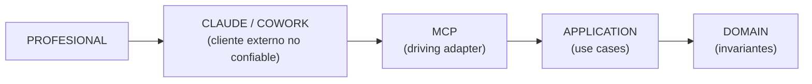

# ADR-001 — El LLM y el host agentic como clientes externos no confiables del Legal Core

## Estado

Accepted

## Contexto

**Fuentes primarias auditables dentro del repositorio (addendum v0.3 §A).** Las citas de este ADR se contrastan contra documentos que ya viven en el repositorio: el prompt maestro v0.1 en `notes/prompt-maestro-v0_1.md` (§§ citadas más abajo) y la revisión arquitectónica v0.1.1 en `notes/revision-arquitectonica-v0_1_1.md` (secciones A–J citadas como antecedente). Toda referencia de este documento a esas dos fuentes es, por tanto, verificable sin salir del repositorio.

El prompt maestro de la iniciativa fija dos principios rectores: "Claude debe ser considerado operador del sistema, no la fuente de verdad del sistema" (§7) y "no prohibir una operación solamente mediante un prompt: si una operación crítica no debería ser posible, el sistema no debe exponerla" (§12). La revisión arquitectónica v0.1.1 detectó que, pese a esos principios, el diagrama original `DOMAIN → APPLICATION → PORTS → ADAPTERS` no ubicaba al LLM en ninguna parte de la arquitectura — la omisión estructural más importante del documento maestro (v0.1.1, A.5 y B).

Los riesgos que este vacío deja abiertos son exactamente los del catálogo del §3 del prompt maestro: confundir hechos alegados con acreditados, mezclar información de expedientes distintos, dar por verificado lo que el modelo generó, repetir o destruir trabajo. Un LLM es un invocador no determinista: puede ignorar instrucciones (un SKILL.md es texto que el modelo puede ignorar, malinterpretar o recibir truncado), llamar herramientas en orden inesperado, reintentar tras fallos aparentes, enviar parámetros inconsistentes o fabricar identificadores plausibles. SUPUESTO de diseño (premisa de robustez): el sistema asume que cualquiera de esas conductas puede ocurrir; la seguridad no depende de que no ocurran. Cualquier diseño cuya seguridad dependa de que no ocurran es teatro.

Los dueños aprobaron la decisión que este ADR documenta. HECHO VERIFICADO (kernel §1, fuente: code.claude.com/docs — permissions, hooks, subagents, sandboxing): Claude Code ofrece permisos deny/ask/allow por herramienta y por ruta, hooks `PreToolUse` bloqueantes (exit code 2) y subagentes con allowlist/denylist de tools; el sandbox de Bash no es nativo en Windows. HECHO VERIFICADO (spec MCP 2026-07-28): la spec MCP no define RBAC (los permisos se aplican en la capa cliente) y sus `ToolAnnotations` son hints explícitamente no confiables. HECHO VERIFICADO (claude.com/product/cowork; support.claude.com art. 13345190 y 15520349): Cowork usa la misma arquitectura agentic que Claude Code sin terminal, con conectores MCP con modos de aprobación Manual/Auto/Skip. POR VERIFICAR: granularidad de permisos y garantías de sandbox de Cowork Desktop. Estos hechos informan el *enforcement*, no la decisión: la frontera de confianza es una decisión de arquitectura; con qué mecanismo de plataforma se impone es un detalle de implementación que ningún host puede convertir en regla del Domain.

## Decisión

DECISIÓN APROBADA. El LLM (Claude) y cualquier host agentic (Claude Code, Cowork u otro) son **clientes externos no confiables** del Legal Core. Claude puede interpretar lenguaje natural, leer proyecciones y fragmentos, razonar, proponer y solicitar operaciones; **nunca tiene autoridad directa sobre el estado canónico**. La analogía normativa: el LLM es al MCP lo que un usuario es a una UI — un actor externo que opera el sistema desde fuera de su frontera de confianza.

La cadena de invocación es:

Toda mutación del estado canónico ocurre mediante un Application Use Case. Claude **nunca**:

- escribe la base de datos directamente;
- cambia un status de ninguna entidad;
- marca algo como verificado;
- acredita un hecho;
- modifica evidencia original (Sources inmutables);
- altera políticas;
- ejecuta migraciones;
- administra el runtime.

**Consecuencia obligatoria (criterio de corrección de todo el diseño):** el sistema sigue siendo seguro aunque el modelo ignore un Skill, llame tools en orden incorrecto, repita operaciones, envíe valores inconsistentes, invente identificadores, intente transiciones prohibidas o malinterprete resultados. La seguridad no depende de la cooperación del modelo; depende de que la superficie no exponga lo que no debe ser posible y de que Application y Domain validen todo lo que sí se expone.

Distinción exigida por la fase de consolidación: la **decisión de arquitectura** es esta frontera (quién es confiable, quién no, y por dónde pasa toda mutación). El **detalle de implementación de plataforma** es el perímetro concreto frente a herramientas genéricas del host (deny rules y hooks — HECHO VERIFICADO (kernel §1; fuente: code.claude.com/docs — permissions, hooks) — en Claude Code; garantías de Cowork Desktop POR VERIFICAR; Core como proceso separado, alternativa). El Domain no depende del mecanismo elegido, y ninguna feature del host (modos de aprobación de conectores, ToolAnnotations, hooks) se convierte en regla del Domain.

## Invariantes derivados

Todos con referencia al kernel de consolidación (§3, §4, §6, §7):

1. **Techo epistémico de la IA (kernel §3).** Ningún actor `AI_*` (AI_DERIVATION, AI_INFERENCE) crea ni transiciona un Fact más allá de `PROPOSED`. `ALLEGED` exige commit con autorización humana; `DETERMINED` exige ProfessionalDetermination. Acreditar no desactiva EvidenceLinks `CONTRADICTS`.
2. **Toda mutación = use case + evento con actor (kernel §6, §7).** *Definición normativa de mutación (texto en ADR-004, invariante 5; citado aquí):* **mutación** = cambio de estado canónico registrado, **no** invocación de tool. Una sola invocación puede producir de 1 a n mutaciones y, por tanto, de 1 a n eventos del Case Event Log, avanzando la CaseRevision en n. El invariante es la **biyección mutación↔evento** — toda mutación produce exactamente un evento y todo evento corresponde a exactamente una mutación —, no una biyección invocación↔evento. Sobre esa base: cada mutación commiteada pasa por un Application Use Case y produce exactamente un evento del Case Event Log (append-only, hash-chained) con el `Principal` (`principal_id, principal_type, principal_role`), su `provenance_kind` y `seq == CaseRevision` resultante. No existe camino de escritura que no deje evento.
3. **Superficie MCP cerrada y clasificada (kernel §4).** **Ocho tools v0** — `create_case`, `open_case`, `ingest_evidence`, `get_case_context`, `search_case`, `get_evidence_fragment`, `propose_facts`, `commit_reviewed_facts` — tras la **enmienda AC-03 (aprobada)**, que retira `register_artifact` de la superficie por la regla de exposición: *una operación se expone solo si el modelo debe decidir cuándo ocurre; si es consecuencia necesaria de otra, es interna*. El registro del `FactAnalysis` ocurre dentro de la transacción de `ProposeFacts`. Supersede §16.14; anteriormente nueve, y diez en v0.1.1 (§16.3). Cada tool cada una con clase `QUERY | COMMAND | PROPOSAL | SENSITIVE_COMMAND | ADMIN`. La clase `ADMIN` está **vacía por diseño** en la superficie del modelo: migraciones, packs y reparación existen solo en el runtime/CLI del producto. Es una decisión, no una omisión.
4. **Lo sensible exige autorización humana server-side (kernel §5; ADR-005).** `commit_reviewed_facts` (SENSITIVE_COMMAND) requiere una HumanAuthorization viva, no consumida, registrada en el Core — no un flag ni un token que el modelo transporte. Sin ella, la operación falla con `HUMAN_REVIEW_REQUIRED`.
5. **Idempotencia por claves derivadas por el Core.** `ingest_evidence` es idempotente por hash de contenido; `create_case` lleva idempotency key. El modelo jamás inventa la clave: la deriva el Core de los datos. Repetir una operación no duplica ni destruye estado.
6. **Concurrencia optimista con preservación (kernel §7).** Toda tool COMMAND/SENSITIVE_COMMAND acepta `expected_revision`; mismatch ⇒ rechazo del commit, Proposal preservada (`PRESERVED_FOR_RECONCILIATION`) y condición `REVISION_CHANGED{expected, current, preserved_proposal_id}`. Nunca sobrescritura silenciosa, nunca descarte del trabajo.
7. **Ids opacos emitidos por el Core.** El modelo no fabrica identidades válidas: todo identificador (case_id, ids de entidades, referencias de Inbox) es emitido o resuelto por el Core. `ingest_evidence` referencia material por identificador de Inbox resuelto por el Core, nunca por rutas arbitrarias. `open_case` devuelve candidatos ante ambigüedad, jamás adivina.
8. **Contrato de respuesta uniforme (kernel §4).** Toda respuesta de tool incluye `case_id` y `case_revision`; los errores son códigos semánticos estables más condición tipada — el modelo no interpreta stack traces ni estados implícitos.
9. **Proponer no es mutar (kernel §4).** `propose_facts` registra una Proposal (con content_hash) y nada más; rechazo sintáctico si un hecho llega sin referencia de provenance ni marca explícita "solo alegado".

## Consecuencias positivas

- El principio §12 del prompt maestro pasa de aspiración a propiedad estructural: la superficie MCP **es** el perímetro de gobernanza del agente.
- Application se diseña de una vez para un invocador hostil-por-defecto (validación total, idempotencia, errores explícitos), lo que también la protege de bugs de cualquier cliente futuro, no solo del LLM.
- Vendor independence: el Domain no sabe qué es Claude ni Cowork; cambiar de host o de modelo no toca invariantes.
- Auditoría completa por construcción: si toda mutación pasa por un use case y todo use case emite evento con actor, no existen mutaciones invisibles.
- Los tests adversariales del slice (kernel §11) tienen un objetivo formal único: demostrar que la frontera resiste sin cooperación del modelo.

## Consecuencias negativas

- Fricción y latencia: cada operación sensible atraviesa propuesta → revisión humana → commit; esta fricción es requisito, no bug de UX, y debe documentarse para que ninguna iteración la "optimice".
- Duplicación aparente de validación (sintáctica en MCP, semántica en Application/Domain): defensa en profundidad deliberada, con costo de mantenimiento real.
- El Core debe implementar servicios que un diseño ingenuo delegaría al modelo (resolución de identificadores, proyecciones, idempotencia), aumentando el trabajo del slice.
- El perímetro frente a herramientas genéricas del host queda dependiente de verificación de plataforma (RIESGO abajo); mientras tanto, la frontera se sostiene en la capa Application aunque el host filtre.

## Alternativas consideradas

1. **LLM como componente interno de Application.** Rechazada: acopla el dominio al proveedor de IA y viola la vendor-independence del prompt maestro (§8, §27). Además invierte la carga de la prueba: un componente interno es confiable por definición, y el LLM no puede serlo. Cuando el Core necesite capacidades de IA (transcripción, extracción), las consume como *driven ports* — rol distinto del mismo proveedor, que no debe confundirse con el operador.
2. **LLM como adapter.** Rechazada: categoría errónea. Un adapter traduce entre una tecnología y un port; no tiene intención propia. El LLM **origina intenciones** (decide qué invocar y con qué contenido) — es un actor, no un traductor. El adapter aquí es el servidor MCP (driving adapter); el LLM es su cliente externo.
3. **Gobernar la conducta del modelo por prompt/Skill.** Rechazada por los propios dueños desde el prompt maestro (§12, §25): un skill es texto ignorable; regla registrada en el kernel (§15) — si el sistema deja de ser seguro porque el modelo ignoró un SKILL.md, hay lógica crítica en el lugar equivocado.

## Riesgos

- **RIESGO — Enforcement frente al host.** Si el host concede al modelo herramientas genéricas de filesystem/shell junto al MCP legal, el agente podría escribir el private state directamente y la frontera sería decorativa en esa capa. HECHO VERIFICADO (kernel §1; fuente: code.claude.com/docs — permissions, hooks): en Claude Code existen deny rules por herramienta/ruta y hooks bloqueantes. HECHO VERIFICADO (kernel §1; fuente: code.claude.com/docs — sandboxing): el sandbox de Bash de Claude Code no es nativo en Windows. CONTEXTO DEL PROYECTO (SUPUESTO): el equipo objetivo es Windows; la edición concreta y la disponibilidad de cifrado de disco quedan POR VERIFICAR. POR VERIFICAR: granularidad de permisos y garantías de Cowork Desktop. Mitigación de arquitectura, independiente del host: la separación workspace/private state (ADR-002) y la validación autoritativa en Application.
- **RIESGO — Falsa confianza narrativa.** El modelo puede relatar mal un resultado aunque el estado sea correcto (el chat es canal, no registro). Mitigación: condiciones tipadas adheridas al estado y a los Artifacts, no solo al diálogo; el sistema no puede fallar en registrar aunque el chat falle en relatar.
- **RIESGO — Fatiga de revisión.** La frontera concentra decisiones en la profesional; si la revisión degenera en clic reflejo, la autorización humana se vacía de contenido. Mitigación (post-slice, a diseñar): aprobación sobre diffs, fricción proporcional a la sensibilidad, tasa de rechazo como señal.
- **RIESGO — Erosión incremental.** Cada tool nueva "por conveniencia" ensancha la superficie. Mitigación: superficie cerrada con clasificación obligatoria y criterios de admisión por tool; la clase ADMIN vacía es un canario verificable.

## Validación / pruebas necesarias

Los tests negativos del slice (kernel §11: criterios de aceptación de primera clase, mapeados a invariante + condición emitida) validan esta frontera de forma adversarial — todos deben pasar **sin** cooperación del modelo:

Subconjunto que ataca esta frontera; la matriz completa (10 adversariales + funcionales) está en `vertical-slice-v0.md` §Test matrix.

1. **Acreditación directa debe fallar:** intento de crear o transicionar un Fact a `ALLEGED`/`DETERMINED` con actor `AI_*` ⇒ rechazo en Domain (invariante 1), sin mutación, evento de rechazo ausente del Case Event Log y traza en el Tool Invocation Log.
2. **Aprobación inventada debe fallar:** `commit_reviewed_facts` sin HumanAuthorization viva — incluido cualquier parámetro fabricado tipo "humanReviewed:true" — ⇒ `HUMAN_REVIEW_REQUIRED{proposal_id}` (invariante 4). Variante: autorización consumida o expirada ⇒ mismo rechazo.
3. **Mezcla de Cases debe fallar:** operación sobre el Case A con ids del Case B ⇒ rechazo; ninguna respuesta retorna datos de otro Case.
4. **Ids inventados rechazados:** identificadores sintácticamente plausibles pero no emitidos por el Core ⇒ rechazo con código semántico estable; `ingest_evidence` con referencia no resuelta por el Core (p. ej. ruta arbitraria) ⇒ rechazo (invariante 7).
5. **Repetición inocua:** doble `ingest_evidence` del mismo contenido ⇒ mismo resultado, cero duplicados (invariante 5).
6. **Commit sobre revisión obsoleta:** `expected_revision` desactualizada ⇒ `REVISION_CHANGED` + Proposal preservada (invariante 6); verificar que el trabajo no se descartó.
7. **Test de superficie:** el manifiesto de tools contiene exactamente las 9 tools v0 con su clase; la clase ADMIN cuenta cero elementos (invariante 3).
8. **Correlación de auditoría:** property test — n mutaciones commiteadas ⇔ n eventos del Case Event Log con actor y seq correlativo (invariante 2). El test verifica la **biyección mutación↔evento**, no el conteo de invocaciones: una sola llamada puede producir n mutaciones y n eventos. El Tool Invocation Log correlaciona cada mutación con su invocación.

El mecanismo concreto de perímetro del host (deny rules/hooks/proceso separado) se valida aparte, como prueba de plataforma, no como prueba del Domain.

## Preguntas pendientes

- **DECISIÓN PENDIENTE — Transporte/UI de la autorización humana** (spike: MCP elicitation modo URL — spec-verificada, soporte del host POR VERIFICAR —, UI local mínima, CLI). No afecta esta frontera: el Domain no se acopla a ningún transporte (detalle en ADR-005).
- **POR VERIFICAR — Granularidad de permisos y garantías de sandbox/filesystem de Cowork Desktop**, condición para elegirlo como host sin perímetro adicional.
- **DECISIÓN PENDIENTE — Mecanismo concreto de enforcement del perímetro en Windows** (deny rules + hooks verificados en Claude Code vs Core como proceso separado con permisos de SO propios). Detalle de implementación de plataforma; la decisión de arquitectura de este ADR no depende de él.
- **DECISIÓN PENDIENTE (dueños) — Aprobación parcial de propuestas** (`authorized_items` en HumanAuthorization): propuesta en el contrato, pendiente de confirmación; no altera la frontera.

## Relaciones con otros ADRs

- **ADR-002 (Workspace vs Private State):** define dónde vive el estado canónico que esta frontera protege; el único camino normal es host → Legal MCP → Application → Case Store.
- **ADR-003 (estados del Fact):** el techo `PROPOSED` para actores `AI_*` (invariante 1) es la proyección de esta frontera sobre el ciclo de vida epistémico.
- **ADR-004 (contrato de proyecciones):** las proyecciones son el canal de *lectura* para el cliente no confiable — regenerables, deterministas, jamás objetivo de escritura del modelo.
- **ADR-005 (HumanAuthorization):** la única autoridad que supera al Core es humana; especifica el registro server-side que hace efectivo el invariante 4.
- **ADR-006 (frontera de incorporación):** la incorporación de material (Inbox → snapshot en private state) es un caso particular de esta frontera de confianza aplicado a la entrada de bytes.
