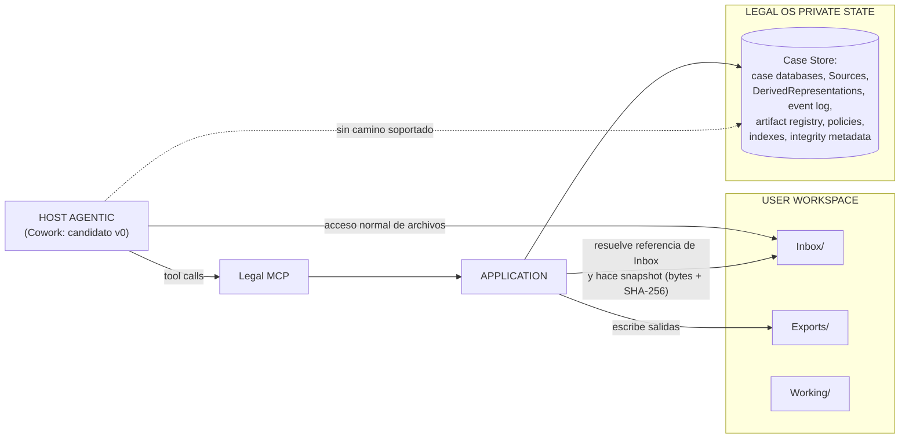

# ADR-002 — Protected Local Case Store: separación USER WORKSPACE / LEGAL OS PRIVATE STATE y camino único de acceso

## Estado

Accepted

## Contexto

ADR-001 estableció que el LLM y el host agentic son clientes externos no confiables del Legal Core y que toda mutación pasa por un Application Use Case. Esa frontera es semántica: gobierna lo que ocurre *a través de la superficie MCP*. Queda abierto el flanco físico: si el estado jurídico canónico vive en carpetas donde el host tiene escritura directa, el agente puede mutar la base del caso, el Case Event Log o un Source sin atravesar ninguna validación, y el diseño de capacidades de ADR-001 se vuelve decorativo en la capa de almacenamiento. La revisión arquitectónica v0.1.1 clasificó esto como el riesgo técnico n.º 1 (§H) y el prompt maestro ya había fijado la intención: no depender de frases del tipo "Claude, por favor no modifiques esta carpeta" (§25), en línea con la regla de que una operación crítica que no debe ser posible no debe exponerse (§12).

Al mismo tiempo la usuaria necesita archivos que sí pueda ver y manipular: dejar material de entrada, recibir salidas, trabajar borradores. Estado canónico protegido y espacio de trabajo visible son requisitos incompatibles dentro de una misma zona de escritura; la resolución aprobada es una frontera física conceptual entre dos zonas con regímenes de acceso distintos.

Hechos de plataforma pertinentes, ya verificados en esta iniciativa (kernel §1; no se re-verifican aquí):

- **HECHO VERIFICADO** (kernel §1; fuente: code.claude.com/docs — permissions, hooks, sandboxing): Claude Code ofrece permisos deny/ask/allow por herramienta y por ruta, y hooks `PreToolUse` bloqueantes (exit code 2); el sandbox de Bash **no es nativo en Windows**.
- **HECHO VERIFICADO** (kernel §1; fuente: claude.com/product/cowork; support.claude.com art. 13345190 y 15520349): Cowork usa la misma arquitectura agentic que Claude Code sin terminal y tiene acceso directo a archivos locales en Desktop (macOS/Windows, planes de pago).
- **POR VERIFICAR** (kernel §1, §17): granularidad de permisos de Cowork Desktop (deny por ruta, hooks) y sus garantías de sandbox/VM sobre carpetas locales.

Estos hechos informan el *enforcement*, no la decisión.

**Fuentes primarias auditables dentro del repositorio (addendum v0.3, §A).** Las citas de este ADR al prompt maestro v0.1 (§10, §12, §13, §25) y a la revisión arquitectónica v0.1.1 (§H, E.1) son verificables en `docs/architecture/notes/`: `notes/prompt-maestro-v0_1.md` y `notes/revision-arquitectonica-v0_1_1.md`. Las decisiones atribuidas a los dueños constan literalmente en el Anexo B del addendum v0.3.

## Decisión

**DECISIÓN APROBADA.** El estado jurídico canónico **no reside en carpetas con acceso directo de escritura del host**. Se establece una separación física conceptual en dos zonas (kernel §12):

| Zona | Contenido | Régimen de acceso |
|---|---|---|
| **USER WORKSPACE** | `Inbox/` (entrada de material), `Exports/` (salidas para la usuaria), `Working/` (borradores) | Visible y operable desde el host y por la usuaria. **Nada de lo que contiene es estado canónico.** |
| **LEGAL OS PRIVATE STATE** | runtime, case databases, originals (Sources), derived versions (DerivedRepresentations), event log, artifact registry, policies, indexes, integrity metadata | Solo vía Core. Sin escritura directa del host en ninguna operación normal. |

**La decisión es la separación, no el path.** No se fija ruta concreta para ninguna de las dos zonas. Una ubicación tipo AppData es **ejemplo ilustrativo** de dónde *podría* materializarse el private state en Windows, **no una decisión de arquitectura**: fijar la ruta confundiría la regla (frontera de escritura) con su realización en una máquina concreta.

**Camino único normal de acceso al estado canónico:**

```text
host agentic → Legal MCP → Application → Case Store
```

Nunca `host → filesystem → case.db`. No existe camino soportado en el que el host lea o escriba el private state directamente. (El kernel §12 formula la regla sobre "host" genérico; Cowork es el candidato v0, no un término del contrato — la vendor-independence exigida por ADR-001 depende de esa generalidad.)

**Flujo de incorporación desde `Inbox/` (kernel §12, §4).** `ingest_evidence` referencia el material por un **identificador de Inbox resuelto por el Core**, nunca por rutas arbitrarias aportadas por el modelo. El Core copia los bytes al private state (**snapshot**), calcula el hash SHA-256 y registra la provenance de incorporación. A partir de ese momento la fuente es el Source en el private state y **el archivo de Inbox deja de ser la fuente**: ninguna operación posterior depende de él.



**Refinamiento a señalar (no altera la intención aprobada).** El layout tentativo del maestro §13 (`CASE-XXXX/` con `originals/`, `working/`, `outputs/`, `case.db`, `memory.md`, `audit.log` en una misma carpeta) queda reorganizado por esta frontera: `originals/` se convierte en Sources del private state, `case.db` y `audit.log` pasan también al private state (el segundo, absorbido por el Case Event Log de ADR-004), y en la zona visible solo permanecen entrada, borradores y salidas, renombrados `Inbox/`, `Working/`, `Exports/`. Es reubicación por régimen de acceso, no cambio de propósito. En la misma línea, `indexes` — que v0.1.1 (E.1) pedía declarar derivado desechable — vive en el private state por ser regenerable y no operable por la usuaria.

**Distinción obligatoria entre planos:**

- **DECISIÓN DE ARQUITECTURA:** la frontera USER WORKSPACE / LEGAL OS PRIVATE STATE y el camino único host → Legal MCP → Application → Case Store. Es regla del sistema, válida frente a cualquier host.
- **DETALLE DE IMPLEMENTACIÓN DE PLATAFORMA:** con qué se impone esa frontera. En Claude Code, deny rules por ruta y hooks `PreToolUse` bloqueantes (**HECHO VERIFICADO**, kernel §1; fuente: code.claude.com/docs — permissions, hooks) bastan. En Cowork Desktop, **POR VERIFICAR**. Alternativa disponible en cualquier host: **Core como proceso separado con permisos de sistema operativo propios** sobre el private state.

El Domain no depende del mecanismo del host: si el host cambia, o si sus garantías resultan distintas de lo esperado, la frontera sigue siendo la misma regla y sigue teniendo sentido. Ninguna feature de Cowork se convierte en regla del Domain.

## Invariantes derivados

1. El estado jurídico canónico nunca reside en una carpeta con escritura directa del host. Nada de lo que vive en el USER WORKSPACE es canónico: es entrada aún no incorporada, borrador, o salida regenerable.
2. Toda mutación del Case Store ocurre vía Application, invocada desde la superficie del Legal MCP o desde el plano administrativo del runtime/CLI — que está fuera de la superficie del modelo (kernel §4: clase `ADMIN` vacía por diseño).
3. Ninguna tool acepta rutas de filesystem: toda referencia a material de entrada es un identificador de Inbox resuelto por el Core (kernel §4).
4. Tras la incorporación, la fuente es el Source (bytes preservados + SHA-256 + ProvenanceRecord) en el private state; el archivo de Inbox es prescindible desde ese instante.
5. Los Sources son inmutables por la superficie normal del producto y no existe operación de borrado expuesta (Product Floor, kernel §14.4).
6. El Case Event Log y los integrity metadata viven en el private state y no son editables ni desactivables por configuración (Product Floor, kernel §14.5).
7. La frontera es invariante frente al mecanismo de enforcement: cambiar de host o de mecanismo no altera los invariantes 1–6.

## Consecuencias positivas

- ADR-001 deja de ser una frontera solo semántica: sin canal alternativo de escritura, "si no debe ser posible, no se expone" se sostiene también en el plano de almacenamiento.
- La cadena de custodia tiene un punto único y datable: snapshot + hash + provenance en la incorporación (ADR-006).
- Backups, verificación de integridad y migraciones (kernel §13) tienen un perímetro nítido — el private state — separado del espacio mutable de la usuaria.
- Portabilidad entre hosts: la regla sobrevive a un cambio de host porque no está expresada en features de plataforma.
- UX coherente con el prompt maestro §10: la usuaria opera tres carpetas de semántica natural y no ve ingeniería.

## Consecuencias negativas

- Fricción deliberada: no existe "abrir el case.db" ni corregir un archivo a mano; toda corrección pasa por operaciones del Core. Es requisito, no bug de UX.
- Duplicación temporal de bytes entre `Inbox/` y private state durante la incorporación (costo de la custodia).
- La garantía efectiva depende de configurar bien el enforcement de plataforma elegido: una configuración incorrecta degrada la frontera a convención (mitigación: tests negativos, abajo).
- Soporte y diagnóstico se complican: quien repara necesita el plano administrativo del runtime/CLI, cuyo diseño de identidad y registro está pendiente.

## Alternativas consideradas

1. **Estado canónico dentro de la carpeta visible del caso** (layout tentativo del maestro §13). Rechazada: coloca estado y evidencia de auditoría en la zona más mutable, y su única protección sería la prohibición por prompt — exactamente lo vetado por §12 y §25 del maestro.
2. **Fijar la ruta concreta del private state como decisión de arquitectura** (p. ej. AppData). Rechazada: acopla la regla a una plataforma y una máquina. La decisión es la separación y el camino único; el path es detalle de despliegue.
3. **Ofuscar o cifrar el archivo de estado dentro del workspace visible.** Rechazada como sustituto de la frontera: dificulta la lectura pero no crea camino único ni impide la corrupción por escritura directa. El cifrado de disco pertenece a otro plano de amenaza (pérdida/robo del equipo) y es complementario, no alternativo.
4. **Core como proceso separado con permisos de SO propios.** **No rechazada**: se conserva como mecanismo de enforcement válido — alternativa o complemento — especialmente si las garantías del host elegido resultan insuficientes. Es detalle de implementación de plataforma; no cambia la decisión de arquitectura.

## Riesgos

- **RIESGO — plataforma de ejecución real.** Dos afirmaciones distintas, con estatus epistémico distinto (antes fundidas en una sola frase mal atribuida al kernel §1):
  - **HECHO VERIFICADO** (kernel §1; fuente: code.claude.com/docs — sandboxing): el sandbox de Bash de Claude Code no es nativo en Windows.
  - **CONTEXTO DEL PROYECTO (SUPUESTO):** el equipo objetivo es Windows; la edición concreta y la disponibilidad de cifrado de disco quedan **POR VERIFICAR**. El kernel §1 no documenta la edición del equipo: atribuirle "Windows 11 Home" era una mis-atribución, no un hecho verificado.

  Consecuencia para el enforcement, invariante frente a esa incertidumbre: en esta plataforma descansa en deny rules por ruta + hooks bloqueantes (**HECHO VERIFICADO**, kernel §1; fuente: code.claude.com/docs — permissions, hooks) o en el Core como proceso separado — no en un sandbox del shell.
- **RIESGO — usuario hostil local: fuera de alcance declarado.** Frente a alguien con control total del equipo, la frontera y los mecanismos de integridad (hash de Sources, hash-chain del Case Event Log, manifest) son **tamper-evident, no tamper-proof**: detectan la modificación, no la impiden. No se vende seguridad que no existe (coherente con maestro §25 y v0.1.1 §H).
- **RIESGO — POR VERIFICAR sobre Cowork Desktop.** Si no ofrece permisos por ruta ni hooks equivalentes, el único mecanismo disponible en ese host sería el proceso separado; adoptarlo sin resolver este punto dejaría la frontera transitoriamente sin imposición técnica.
- **RIESGO — ventana desprotegida en `Inbox/`.** El material previo a la incorporación no goza de protección alguna: la custodia empieza en el snapshot. Debe comunicarse con fidelidad epistémica — el hash prueba integridad *desde* la incorporación, nunca autenticidad del material.
- **RIESGO — deriva por conveniencia.** Atajos operativos (scripts de reparación, edición manual "puntual") que escriban el private state sin pasar por el Core erosionan la frontera sin dejar evento; el plano administrativo debe quedar auditado y fuera de la superficie del modelo.

## Validación / pruebas necesarias

1. **Test negativo central — inmutabilidad del Source:** modificar o borrar un Source original **debe ser imposible mediante la superficie normal** (todas las tools del Legal MCP más el host con la configuración de v0). Cada intento queda correlacionable en el Tool Invocation Log (kernel §6) y ninguno produce evento en el Case Event Log.
2. **Verificación de integridad por hash:** re-hash periódico de cada Source == hash registrado en la incorporación; la verificación del hash-chain del Case Event Log señala el punto exacto de ruptura ante una alteración externa.
3. **Arranque en solo-lectura ante fallo de manifest (kernel §13):** alterar un archivo del producto sellado → la verificación de integridad al arranque falla y el producto degrada a solo-lectura con mensaje no técnico; ninguna escritura ocurre en ese modo.
4. **Rechazo de rutas:** `ingest_evidence` con ruta de filesystem arbitraria → rechazo con código semántico estable; solo acepta identificadores de Inbox resueltos por el Core. Incluir path traversal (`..`, rutas absolutas, symlinks/junctions de Windows) sobre esas referencias.
5. **Independencia post-incorporación:** alterar o eliminar el archivo de `Inbox/` después de incorporar → Source y DerivedRepresentations intactos (hash inalterado) y ninguna operación posterior falla por ello.

El mecanismo concreto de perímetro del host (deny rules/hooks/proceso separado) se valida aparte, como prueba de plataforma, no como prueba del Domain.

## Preguntas pendientes

- **POR VERIFICAR** (kernel §17): garantías de Cowork Desktop sobre carpetas locales — permisos por ruta, hooks bloqueantes, sandbox/VM.
- **DECISIÓN PENDIENTE:** mecanismo concreto de enforcement en el host elegido (deny rules + hooks vs Core como proceso separado con permisos de SO propios); requiere spike de host.
- **DECISIÓN PENDIENTE:** política sobre el archivo de `Inbox/` tras la incorporación (¿permanece, se archiva, se ofrece limpieza a la usuaria?). Lo aprobado solo fija que deja de ser la fuente.
- **POR VERIFICAR:** disponibilidad de cifrado de disco en el equipo real. La edición concreta de Windows del equipo objetivo es **CONTEXTO DEL PROYECTO (SUPUESTO)**, no hecho verificado, y de ella depende esa disponibilidad. Plano complementario frente a pérdida/robo; ni sustituye a esta frontera ni es sustituido por ella.
- **DECISIÓN PENDIENTE (post-slice):** diseño del plano administrativo — identidad, registro y auditoría de quien ejecuta operaciones de runtime/CLI sobre el private state. La decisión de principio ya está tomada: nunca vía la superficie del modelo (kernel §4).

## Relaciones con otros ADRs

- **ADR-001** (LLM y host como clientes externos no confiables): este ADR es su materialización física. La misma frontera, expresada sobre el disco: el camino único host → Legal MCP → Application → Case Store cierra el flanco que ADR-001 identifica como RIESGO de enforcement frente al host.
- **ADR-003** (modelo de dominio epistémico): define **qué** es canónico —Source, Evidence, Fact, EvidenceLink, ProvenanceRecord y sus transiciones—; este ADR define **dónde** vive y **por qué único camino** se muta. Reciprocidad: la inmutabilidad del Source y el carácter append-only de `status_history` son propiedades del Domain en ADR-003, pero solo se sostienen si no existe canal de escritura alternativo al Core sobre el private state, que es lo que aquí se establece. A la inversa, ADR-003 es quien determina qué contenido del private state es estado epistémico y cuál es derivado regenerable (DerivedRepresentations, indexes).
- **ADR-004** (Canonical Case State + Derived Projections): **el Case Event Log vive en el LEGAL OS PRIVATE STATE**, junto con las case databases, el artifact registry y los integrity metadata que lo hacen tamper-evident. Las proyecciones se sirven por la superficie (`get_case_context`) y jamás son objetivo de escritura del modelo; una proyección desechable puede materializarse hacia el USER WORKSPACE sin volverse canónica por ello.
- **ADR-005** (autoridad humana): la HumanAuthorization es un **registro server-side del Core**, no un token portador que viaje por el contexto del modelo — y ese registro vive en el LEGAL OS PRIVATE STATE. Reciprocidad: ADR-005 controla **quién puede consolidar**; este ADR garantiza que el registro de esa autorización, junto con el Case Event Log donde quedan `ProposalReviewed` y `FactsCommitted`, esté fuera del alcance de escritura del host y del modelo. Sin esa frontera física, una autorización podría fabricarse o editarse por fuera del canal humano y el mecanismo de ADR-005 se volvería decorativo.
- **ADR-006** (frontera de incorporación de evidencia): consume esta decisión. El snapshot desde `Inbox/` con hash y provenance solo garantiza custodia si no existe canal de escritura alternativo al Core sobre el estado canónico — precondición que este ADR establece.
