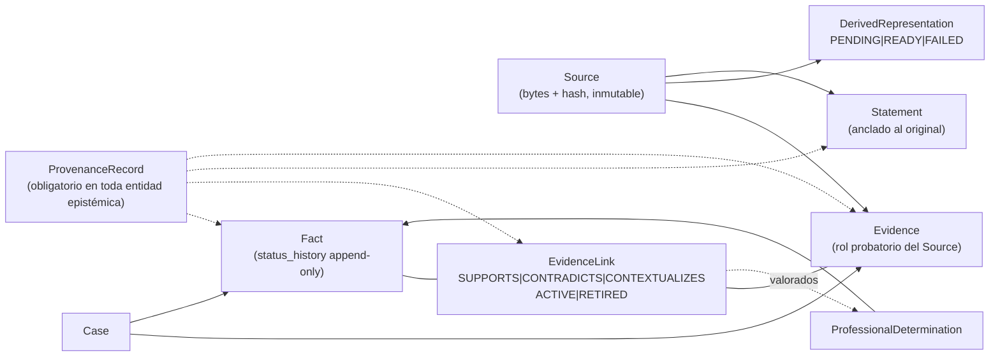
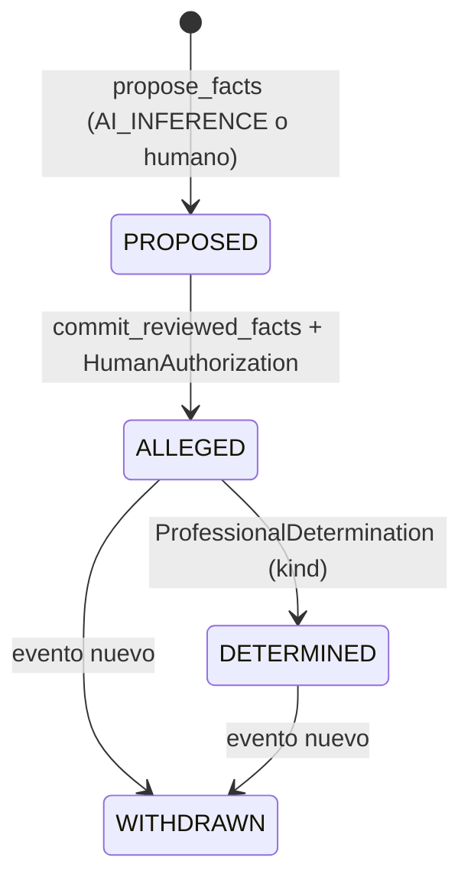

# ADR-003 — Modelo de dominio epistémico mínimo (v0)

## Estado

Accepted

## Contexto

El riesgo que gobierna este dominio está enunciado desde el prompt maestro (§3, riesgo n.º 3): que un sistema asistido por IA **confunda un hecho alegado con un hecho acreditado**, o presente como conocimiento del expediente lo que solo es salida plausible de un modelo. La intención declarada de la iniciativa es resolverlo **por arquitectura, no por prompts** (§3, cierre; §12).

El vocabulario de partida no permitía hacerlo. La revisión arquitectónica v0.1.1 (§C.1) mostró que el prompt maestro sostenía dos listas paralelas sin mapeo entre sí: las entidades de §8 (`Case, Party, Fact, Event, Statement, Evidence, Document, …`) y el modelo epistemológico de §15 (afirmación, hecho candidato, hecho acreditado, inferencia, contradicción, vacío…). Ninguna categoría de §15 aparecía como entidad, y varias entidades de §8 carecían de semántica relativa. De ahí salieron el ADR CANDIDATO 1 (entidades epistémicas del slice) y el ADR CANDIDATO 2 (estatus como historia de transiciones tipadas por actor), que este ADR consolida con el vocabulario canónico del kernel de consolidación (§2 y §3).

**Fuentes primarias, auditables dentro del repositorio** (addendum v0.3 §A). Las citas de este ADR al prompt maestro v0.1 y a la revisión arquitectónica v0.1.1 son verificables en `docs/architecture/notes/`: `notes/prompt-maestro-v0_1.md` (§§1–35) y `notes/revision-arquitectonica-v0_1_1.md` (secciones A–J). Las decisiones aprobadas por los dueños que este ADR etiqueta como tales constan literalmente en el Anexo B del addendum normativo v0.3 (`notes/addendum-correcciones-v0_3.md`).

Dos aclaraciones de alcance, exigidas por la fase de consolidación:

- **Esto es decisión de arquitectura, no detalle de implementación de plataforma.** Todo lo definido aquí vive en el Domain y es independiente de Claude, Cowork, MCP, SQLite o el sistema operativo. Ninguna capacidad —ni limitación— del host puede convertirse en regla ni en excepción de este modelo. Los mecanismos de perímetro (superficie MCP cerrada, permisos del host) son defensa en profundidad sobre estos invariantes, jamás su fuente.
- **Cambio de nombre registrado** (kernel §16.2, superseded de v0.1.1): el "Document/original" de la revisión pasa a llamarse **Source**. Es cambio de nombre, no de semántica.

## Decisión

**DECISIÓN APROBADA.** El **plano Domain** —las entidades epistémicas— lo forman exactamente estas **nueve**, con exactamente esta semántica (kernel §2; plano fijado por el addendum v0.3 §B.4):

- **Case** — agregado raíz del expediente. Todo lo epistémico existe dentro de un Case; nada cruza de un Case a otro.
- **Source** — material original incorporado: bytes preservados, hash SHA-256, provenance de incorporación y metadata. Inmutable por la superficie normal del producto.
- **Evidence** — el **rol probatorio** de un Source dentro de un Case. `Source ≠ Evidence`: el mismo material puede ser Evidence en varios Cases con estados, links e historia independientes.
- **Statement** — expresión atribuible a un actor, anclada a un fragmento verificable de una fuente (página / offsets / rango de timestamps **sobre el original**). Inmutable tras extracción; corregir un Statement es **anular y registrar uno nuevo**, nunca editarlo.
- **Fact** — proposición fáctica curada del Case, con **historia de transiciones** (`status_history` append-only), nunca un campo único mutable.
- **EvidenceLink** — relación N:M entre un Fact y un **fragmento** de Evidence, con polaridad `SUPPORTS | CONTRADICTS | CONTEXTUALIZES` (**enum cerrado en v0**), actor creador, justificación y estado `ACTIVE | RETIRED`.
- **ProvenanceRecord** — obligatorio en toda entidad epistémica. `provenance_kind ∈ EXTERNAL_SOURCE | AI_DERIVATION | AI_INFERENCE | HUMAN_DECISION | SYSTEM`, acompañado del `Principal` que ejecutó la operación —`principal_id`, `principal_type ∈ HUMAN | AI | SYSTEM`, `principal_role`—. Ambas dimensiones existen **desde el schema inicial** (Normalización v0.4: `Principal` responde *quién ejecutó*; `provenance_kind`, *cuál es la naturaleza epistemológica del origen*. Ver `docs/architecture/notes/normalizacion-principal-provenance-v0_4.md`.), aunque v0 tenga una sola usuaria y un solo rol.
- **ProfessionalDetermination** — acto humano que habilita transiciones sensibles; registra actor humano identificado, motivación y los **EvidenceLinks valorados, incluidos los de polaridad `CONTRADICTS`**. Una salida de IA jamás lo sustituye.
- **DerivedRepresentation** — derivado regenerable de un Source (transcripción, OCR, texto normalizado), con versión, hash, receta (herramienta + versión) y referencia obligatoria a su Source. **Nunca sustituye al Source**; estado de derivación v0: `PENDING | READY | FAILED`.

**Conceptos de soporte: plano Application, NO plano Domain** (addendum v0.3 §B.4). **CaseRevision** (contador monotónico por Case — ADR-004), **Proposal** (conjunto de cambios propuestos pendiente de revisión humana, con `content_hash`; estados `PENDING | APPROVED | REJECTED | SUPERSEDED | PRESERVED_FOR_RECONCILIATION`), **HumanAuthorization** (ADR-005) y **Artifact** (producto de trabajo registrado) **no son entidades del Domain**: no son proposiciones sobre el mundo jurídico ni portan estatus epistémico; son mecanismos de trabajo, control de concurrencia y autorización. Se listan aquí solo para cerrar el léxico del vocabulario canónico y se definen en detalle en sus propios documentos. `CaseRevision` es propiedad observable del Case, pero su administración —incremento, comparación, conflicto— es lógica de Application.

| Plano | Términos |
|---|---|
| **Domain** (entidades epistémicas, este ADR) | `Case`, `Source`, `Evidence`, `Statement`, `Fact`, `EvidenceLink`, `ProvenanceRecord`, `ProfessionalDetermination`, `DerivedRepresentation` |
| **Application** (conceptos de soporte) | `Artifact`, `Proposal`, `HumanAuthorization`, `CaseRevision` |



### Nombres reservados, no entidades v0

**DECISIÓN APROBADA** (cita literal de los dueños en el Anexo B.2 del addendum v0.3, §7 del prompt de consolidación). `Assertion`, `Contradiction`, `Gap`, `LegalIssue`, `Hypothesis`, `Argument`, `Ruling`, `ProceduralEvent`, `Term`, `Deadline` quedan **RESERVADOS** para la evolución del modelo: no se modelan en v0, no tienen tabla, estado ni tool, y **ningún documento de la consolidación debe tratarlos como entidades existentes**. Reservar el nombre evita que el concepto reaparezca disfrazado de atributo del Fact.

**Regla de entrada al dominio (DECISIÓN APROBADA; cita literal de los dueños en el Anexo B.1 del addendum v0.3, §7 del prompt de consolidación):** una entidad entra al modelo **cuando existe evidencia —del trabajo real— de que tiene lifecycle, identidad o invariantes propios**. Lo que no los tenga es atributo, es proyección o queda fuera. Es el antídoto simultáneo contra el modelo universal sobreabstracto y contra la inflación de entidades "por si acaso".

### Estados del Fact — REFINAMIENTO SEÑALADO EXPLÍCITAMENTE

La lista que los dueños aprobaron para el estatus del Fact fue: *propuesta; alegada; respaldada; contradicha; profesionalmente determinada*. Esa lista **mezcla estados almacenados con estados derivados**. El kernel de consolidación (§3) introduce un **refinamiento que no altera la intención aprobada: la enriquece y elimina un estado mutable ambiguo** —un campo único que podría quedar inconsistente con los EvidenceLinks vigentes.

- **Transiciones almacenadas** — viven en `status_history` append-only; cada entrada porta su ProvenanceRecord:
  - `PROPOSED` — nace de `propose_facts`, con actor `AI_INFERENCE` o humano (`HUMAN_DECISION`). Un Fact `PROPOSED` existe registrado dentro de su Proposal; no es todavía estado curado del Case.
  - `ALLEGED` — se alcanza **solo** por commit con autorización humana (`commit_reviewed_facts` + HumanAuthorization viva; ADR-005).
  - `DETERMINED(kind)` — se alcanza **solo** vía ProfessionalDetermination. Kind v0: `ACCREDITED_BY_PROFESSIONAL`. RESERVADO para el contexto B (autoridad/decisor): `DECLARED_PROVEN`.
  - `WITHDRAWN` — posible desde `ALLEGED` o `DETERMINED`; es un **evento nuevo, jamás un borrado**. El descarte de un hecho que aún está `PROPOSED` se resuelve en el ciclo de la Proposal (`REJECTED`), no en el Fact.
- **Estados derivados** — se **computan** desde los EvidenceLinks en estado `ACTIVE` y **nunca se almacenan como status**: `SUPPORTED` (≥1 link `SUPPORTS` activo), `CONTRADICTED` (≥1 link `CONTRADICTS` activo), `UNSUPPORTED` (**cero links de polaridad probatoria —`SUPPORTS` o `CONTRADICTS`— activos**). No son excluyentes: `SUPPORTED` y `CONTRADICTED` coexisten en un hecho con prueba en ambos sentidos.
  - **Precisión de la consolidación** (addendum v0.3 §B.14; no es decisión nueva): los links `CONTEXTUALIZES` **no alteran el estado derivado** —aportan contexto, no soporte ni contradicción—. Un Fact cuyos únicos links `ACTIVE` sean `CONTEXTUALIZES` es, por tanto, `UNSUPPORTED`, y no queda fuera de todo estado derivado.

| Término aprobado por los dueños | Materialización en el modelo refinado |
|---|---|
| propuesta | status almacenado `PROPOSED` |
| alegada | status almacenado `ALLEGED` |
| respaldada | estado **derivado** `SUPPORTED` (computado desde links `ACTIVE`) |
| contradicha | estado **derivado** `CONTRADICTED` (computado desde links `ACTIVE`) |
| profesionalmente determinada | status almacenado `DETERMINED(kind=ACCREDITED_BY_PROFESSIONAL)` |
| — (complemento del refinamiento) | `WITHDRAWN` (retiro explícito) y `UNSUPPORTED` (sin links de polaridad probatoria activos) |



"Respaldada" y "contradicha" no desaparecen: siguen siendo visibles para la usuaria, pero como **propiedades computadas siempre consistentes con los links vigentes**, no como un campo que alguien —o algo— podría pisar. La **controversión procesal** (que la contraparte niegue el hecho en su actuación) es una dimensión distinta de `CONTRADICTED` evidencial, con consecuencias jurídicas propias, y queda **RESERVADA** fuera del slice (cf. v0.1.1, ADR CANDIDATO 3).

**Reglas duras (kernel §3):** (1) un actor `AI_*` —`AI_DERIVATION`, `AI_INFERENCE`— **no puede crear ni transicionar un Fact más allá de `PROPOSED`**; (2) **determinar no desactiva los links `CONTRADICTS`**: acreditar un hecho no borra, no retira ni oculta la prueba en contra.

**`DETERMINED` y `WITHDRAWN` no tienen productor en v0** (addendum v0.3 §B.5). Ninguna tool de la superficie MCP v0 ni ningún use case del slice produce esas dos transiciones: `ProfessionalDetermination` queda **definida en el modelo y no ejercitada** en v0. Los dos use cases que las producirán quedan **conocidos y diferidos, con nombre reservado** para no improvisarlos después:

| Use case diferido (post-slice) | Transición que produce | Canal | Clase |
|---|---|---|---|
| `RecordProfessionalDetermination` | `ALLEGED → DETERMINED(kind)` | humano | SENSITIVE (exige HumanAuthorization viva; ADR-005) |
| `WithdrawFact` | `ALLEGED \| DETERMINED → WITHDRAWN` | humano | SENSITIVE (exige HumanAuthorization viva; ADR-005) |

La definición de ambas transiciones, sus invariantes y sus actores permanecen vigentes en este ADR: lo diferido es su productor, no su semántica.

### Ejemplo de lifecycle (t1–t6)

**Escenario ILUSTRATIVO DEL MODELO, NO EJECUTABLE EN v0** (addendum v0.3 §B.5 y §B.7). Muestra la mecánica de transiciones y el cómputo de estados derivados; no describe el flujo del vertical slice. Dos precisiones:

- **`Statement` no se materializa en v0** (addendum §B.7): el paso que arranca en `ST-9` es **ilustrativo**. La entidad permanece **definida en el Domain** y se materializará cuando exista un extractor (`ExtractStatements`, **post-slice**). La cadena de provenance efectivamente ejercitada en v0 es `Fact → EvidenceLink → fragmento → DerivedRepresentation → Source`.
- **t5 y t6 dependen de `ProfessionalDetermination`**, que no tiene productor en v0 (addendum §B.5): sus asserts son **post-slice**, ejercitables cuando existan `RecordProfessionalDetermination` y `WithdrawFact`.

```text
t1  Source S-05 (audio de entrevista) incorporado; DerivedRepresentation
    (transcripción) en estado READY. Statement ST-9 extraído
    (actor AI_DERIVATION), anclado a timestamps del original.
t2  propose_facts crea Fact F-12 → PROPOSED (actor AI_INFERENCE).
    Revisión humana + commit_reviewed_facts con HumanAuthorization
    → status_history += ALLEGED (actor HUMAN_DECISION).
    Estado derivado en este punto: UNSUPPORTED (aún sin links).
t3  EvidenceLink L-1 {F-12 ↔ Evidence E-7, contrato p. 3, SUPPORTS, ACTIVE}
    → estado derivado: SUPPORTED.
t4  EvidenceLink L-2 {F-12 ↔ Evidence E-9, testimonio 00:41:10, CONTRADICTS,
    ACTIVE} → estados derivados simultáneos: SUPPORTED y CONTRADICTED
    (ambos computados; ninguno almacenado).
t5  ProfessionalDetermination D-4 {actor humano identificado, motivación,
    links valorados: [L-1, L-2]} → status_history +=
    DETERMINED(kind=ACCREDITED_BY_PROFESSIONAL).
t6  L-2 permanece ACTIVE tras la determinación: CONTRADICTED sigue siendo
    computable y visible junto al hecho determinado. Nada se borra. Una
    retractación posterior sería status_history += WITHDRAWN (evento nuevo),
    con D-4 intacta en la historia.
```

**Detalle de implementación de plataforma (no regla del Domain):** el mecanismo concreto de anclaje. El Domain exige un ancla verificable contra el original; cómo se representa es sustituible. HECHO VERIFICADO (kernel §1; fuente: W3C Web Annotation Data Model, Recomendación W3C 23-feb-2017): `TextQuoteSelector` (§4.2.4) y `TextPositionSelector` (§4.2.5), componibles vía `refinedBy` (§4.2.9), son vocabulario estándar candidato. Ninguna decisión de este ADR depende de adoptarlo.

## Invariantes derivados

1. Toda entidad epistémica porta un ProvenanceRecord completo (`provenance_kind` más el `Principal`: `principal_id`, `principal_type`, `principal_role`); construirla sin provenance falla en el Domain.
2. Un actor `AI_*` no puede crear ni transicionar un Fact más allá de `PROPOSED`; el rechazo ocurre en el Domain, con independencia de qué superficie transporte el intento.
3. `status_history` es append-only: ninguna transición edita ni elimina entradas previas; toda corrección o retiro es un evento nuevo (`WITHDRAWN`).
4. `DETERMINED` solo se alcanza vía ProfessionalDetermination con actor humano identificado, motivación y lista explícita de EvidenceLinks valorados, incluidos los `CONTRADICTS`.
5. Determinar un Fact no retira ni desactiva sus EvidenceLinks `CONTRADICTS`.
6. `SUPPORTED | CONTRADICTED | UNSUPPORTED` jamás se persisten como status del Fact: se computan desde los links `ACTIVE` de polaridad probatoria (`SUPPORTS` / `CONTRADICTS`) en el momento de proyectar; los `CONTEXTUALIZES` no participan del cómputo (precisión de la consolidación, addendum v0.3 §B.14).
7. Todo EvidenceLink ancla a un fragmento verificable de una Evidence (página / offsets / timestamps referidos al original), nunca al documento entero ni a un derivado sin referencia a su Source.
8. Statement es inmutable tras extracción; Source es inmutable tras incorporación; una DerivedRepresentation jamás sustituye a su Source y siempre lo referencia.
9. La polaridad de EvidenceLink es enum cerrado en v0: no se agregan categorías sin un caso real documentado (si aparece, se **señala**; no se añaden preventivamente).
10. Evidence es un rol por Case: el mismo material en dos Cases mantiene estados, links e historia independientes; ninguna consulta de un Case retorna entidades epistémicas de otro.
11. `ALLEGED` solo se alcanza por commit con HumanAuthorization viva: no existe camino alterno (ADR-005).

## Consecuencias positivas

- El riesgo "alegado ≠ acreditado" se ataca estructuralmente: la distinción es de tipos, transiciones y actores, no de redacción ni de instrucciones al modelo.
- No puede existir un Fact rotulado "respaldado" cuyo respaldo fue retirado: los estados derivados son, por construcción, consistentes con los links vigentes.
- La cadena de trazabilidad que pedía el prompt maestro (§16: hechos → evidencia → original → fragmento) es realizable sin retrofitting, porque cada eslabón tiene ancla y provenance desde el primer día.
- El actor triple desde el schema inicial evita una migración dolorosa cuando haya más de una usuaria, más de un rol o el contexto B.
- Los nombres reservados más la regla de entrada contienen la inflación del modelo sin cerrar la puerta a la evolución: son huecos declarados, no olvidos.
- El modelo es portable: ninguna regla depende del proveedor de IA, del host ni del motor de persistencia.

## Consecuencias negativas

- Más entidades que un modelo ingenuo `Fact + Evidence`: mayor costo inicial de schema, de proyecciones y de explicación a una usuaria no técnica.
- Los estados derivados deben computarse en cada proyección (v0 no cachea; el costo se paga en lectura — contrato en ADR-004).
- Los conceptos reservados son huecos deliberados: "¿qué contradicciones hay?" o "¿qué términos vencen?" no tienen sustrato consultable de primera clase en v0.
- Mientras la deduplicación de Sources entre Cases siga siendo DECISIÓN PENDIENTE, la copia por caso duplica almacenamiento y obliga a disciplina con los hashes.
- El renombre `Document/original → Source` exige consistencia terminológica en todos los documentos y superficies.

## Alternativas consideradas

1. **Modelo mínimo `Fact + Evidence` (rechazada).** Más barato, pero pierde el ancla fina de provenance (Statement) y convierte la relación hecho↔prueba en tabla implícita sin polaridad, actor ni justificación — justo el corazón del dominio.
2. **Grafo universal de assertions (rechazada).** Máxima flexibilidad expresiva a cambio de perder los invariantes tipados por transición, que son la garantía del sistema: un grafo donde todo puede relacionarse con todo no puede rechazar nada.
3. **`Assertion` como entidad v0 (aplazada, no rechazada).** Colapsada en Statement como SUPUESTO simplificador; el nombre queda reservado. Criterio de salida explícito: el día en que una misma proposición deba consolidarse desde múltiples fuentes con estados distintos, la regla de entrada la promueve.
4. **Status como campo único mutable con la lista aprobada literal (reemplazada por el refinamiento).** Mezcla estados almacenados y derivados en un campo que puede quedar desactualizado respecto de los links o ser sobrescrito. El refinamiento del kernel §3 la sustituye **sin alterar la intención aprobada**. Variante particular también rechazada: modelar la controversión procesal como booleano del Fact, que reintroduciría ese mismo estado ambiguo y colapsaría dos dimensiones con efectos jurídicos distintos.
5. **Event sourcing completo para el estatus (rechazada para v0).** El `status_history` append-only más el Case Event Log (ADR-004) dan reconstruibilidad sin convertir el replay en mecanismo de runtime.

## Riesgos

- **RIESGO — Insuficiencia del enum de polaridad.** La práctica real podría exigir matices ("respalda parcialmente", "explica sin contradecir"). Regla acordada: si aparece un caso claro, se **señala** y se decide; no se agregan categorías preventivas.
- **RIESGO — Naming del kind de `DETERMINED`.** `ACCREDITED_BY_PROFESSIONAL` descansa en una semántica de negocio aún no confirmada con la profesional (ver Preguntas pendientes). Un nombre equivocado en la UX podría sugerir efectos procesales que el acto interno no tiene. El mecanismo no está en riesgo; el rótulo sí.
- **RIESGO — Presión por atajos de atributo.** La tentación de resolver los conceptos reservados con banderas en el Fact (`controvertido: true`, `tiene_contradiccion: true`) reproduce exactamente el estado mutable ambiguo eliminado aquí.
- **RIESGO — Caché futura de proyecciones.** Si algún día se cachean proyecciones, los estados derivados podrían servirse desfasados. v0 lo evita computando siempre desde el estado vigente (ADR-004); cualquier caché futura debe rediseñar esa garantía de forma explícita.
- **RIESGO — Traducción a lenguaje de usuaria.** Los nombres son técnicos y tipados; lo que la abogada lee debe traducirlos sin elevar estado (no llamar "probado" a un `DETERMINED` interno). SUPUESTO: esa traducción es responsabilidad de la capa de presentación, nunca del Domain.

## Validación / pruebas necesarias

1. **Escenario t1–t6 — ilustrativo del modelo, no ejecutable en v0** (addendum v0.3 §B.5). Sus asserts sobre `ProfessionalDetermination` —en t6: `L-2` sigue `ACTIVE` y `CONTRADICTED` sigue computándose después de `DETERMINED`— son **post-slice**: se ejercitan cuando existan `RecordProfessionalDetermination` y `WithdrawFact`. El tramo t1–t4 sí corresponde a mecánica ejercitada en v0, con la salvedad de que `ST-9` es ilustrativo (en v0 no se materializan Statements — addendum §B.7).
2. **Tests negativos** (criterios de aceptación del slice): transición a `ALLEGED` o `DETERMINED` con actor `AI_*` ⇒ rechazo; entidad epistémica sin ProvenanceRecord ⇒ rechazo; `propose_facts` con un hecho sin referencia de provenance ni marca explícita "solo alegado" ⇒ rechazo sintáctico; `commit_reviewed_facts` sin HumanAuthorization viva ⇒ rechazo.
3. **Property test de historia:** `status_history` nunca decrece, nunca se reordena y no existe camino de edición ni de borrado; toda corrección aparece como entrada nueva.
4. **Cómputo de derivados:** `SUPPORTED` y `CONTRADICTED` simultáneos con links mixtos; retorno a `UNSUPPORTED` cuando todos los links de polaridad probatoria (`SUPPORTS` / `CONTRADICTS`) pasan a `RETIRED`; un Fact cuyos únicos links `ACTIVE` sean `CONTEXTUALIZES` computa `UNSUPPORTED`, porque los `CONTEXTUALIZES` no alteran el estado derivado (precisión de la consolidación, addendum v0.3 §B.14; test F12 del slice); ningún registro persiste esos valores como status.
5. **Inmutabilidad y completitud:** Statement y Source no admiten mutación por la superficie normal (corrección = anulación + registro nuevo); toda DerivedRepresentation referencia su Source; una ProfessionalDetermination sin motivación o sin la lista de links valorados —incluidos los `CONTRADICTS` activos al momento— ⇒ rechazo.
6. **Aislamiento por Case** (operar sobre el Case A con ids del Case B ⇒ rechazo) y **matriz de trazabilidad**: cada invariante de este ADR mapeado a su test negativo y a la condición emitida, en el documento del vertical slice. Esa matriz **debe marcar explícitamente los invariantes de este ADR que NO quedan verificados en v0 — invariantes 3, 4, 5 y 8** (addendum v0.3 §B.17), por las razones ya registradas: `WITHDRAWN` y `DETERMINED` carecen de productor en v0 (§B.5) y `Statement` no se materializa (§B.7). No verificado no es no vigente: los cuatro siguen siendo invariantes del Domain.

## Preguntas pendientes

1. **DECISIÓN PENDIENTE (negocio) — Semántica exacta de "acreditado" para la profesional.** ¿`ACCREDITED_BY_PROFESSIONAL` captura lo que ella entiende por acreditar, y qué la lleva a considerar un hecho acreditado en su trabajo real? Bloquea **únicamente el naming fino del kind** de `DETERMINED`, no el mecanismo de transición ni ningún invariante. Relacionada: el kind `DECLARED_PROVEN` queda reservado para el contexto B, cuyo levantamiento sigue pendiente.
2. **DECISIÓN PENDIENTE — Deduplicación física de Sources entre Cases.** v0 opera con copia por caso (aceptable por decisión del kernel §2); la alternativa de content-addressing compartido tiene implicaciones de custodia y de expurgo que no se deciden aquí.
3. **RESERVADA — Controversión procesal.** Dimensión propia, distinta de `CONTRADICTED` evidencial; requiere el vocabulario real de la profesional en ambos contextos antes de modelarse (v0.1.1, ADR CANDIDATO 3). No se implementa en el slice y no se aproxima con atributos.

## Relaciones con otros ADRs

- **ADR-001 (frontera de confianza).** Este modelo vive dentro de la frontera allí decidida: las entidades epistémicas solo se mutan a través de use cases del Core. Por eso la regla `AI_* ≤ PROPOSED` es un invariante del Domain (invariante 2 de este ADR = invariante 1 de ADR-001), no una política de prompt ni una feature del host.
- **ADR-002 (Case Store local protegido).** Es el sustrato de custodia de estas entidades: Sources preservados, DerivedRepresentations, `status_history` y EvidenceLinks viven en el private state y solo se mutan por use cases del Core. La inmutabilidad de `Source` (invariante 8) es regla del Domain aquí y separación de planos allí: tras la incorporación formal, el workspace de la usuaria deja de ser la fuente del material. El aislamiento por Case (invariante 10) se apoya en esa misma frontera de acceso.
- **ADR-004 (Canonical Case State + proyecciones).** Las proyecciones `get_case_context(facts | overview | …)` son quienes **computan y sirven** los estados derivados definidos aquí; este ADR fija que jamás se almacenan, ADR-004 fija cómo se sirven. Además, cada transición almacenada de `status_history` se materializa como evento del Case Event Log (`FactsCommitted`, `FactWithdrawn`), con actor y `seq == CaseRevision` resultante. `FactWithdrawn` permanece en la lista cerrada de eventos v0 **anotado explícitamente como sin productor en v0** (addendum v0.3 §B.5): conservarlo evita reabrir el contrato de eventos cuando se implemente `WithdrawFact`.
- **ADR-005 (autoridad humana).** HumanAuthorization es la precondición de `PROPOSED → ALLEGED` vía `commit_reviewed_facts`; hace operativa la regla dura de este ADR mediante un registro server-side, sin introducir secretos en el contexto del modelo. La ProfessionalDetermination que habilita `DETERMINED` es el mismo principio aplicado a la transición más sensible.
- **ADR-006 (frontera de incorporación).** Define cómo un material externo se convierte en Source y en Evidence del Case: sin incorporación formal no existe el ancla que los EvidenceLinks y los Statements exigen. `EXPLORATION ≠ CASE EVIDENCE` es la precondición material de la trazabilidad que aquí se modela.
