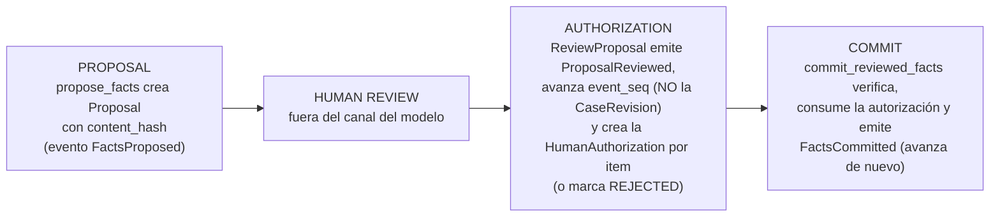

# ADR-005 — Autoridad humana y autorización de operaciones sensibles (two-phase)

## Estado

Accepted

## Contexto

El riesgo más grave de este dominio es la elevación epistémica indebida: que algo propuesto o generado por IA adquiera estatus de revisado, alegado o acreditado sin que una persona lo haya hecho. El prompt maestro lo fija como principio rector — "no prohibir una operación solamente mediante un prompt" (§12), human-in-the-loop para decisiones sensibles (§27) — y la revisión v0.1.1 (A.9) localizó el punto donde este sistema podría mentir con más seguridad: un parámetro booleano "el humano revisó" rellenado por el modelo es falsificable por construcción. El corolario del §12 es que tampoco se puede **autorizar** una operación solamente mediante el modelo.

En la superficie MCP v0 (kernel §4) la única `SENSITIVE_COMMAND` es `commit_reviewed_facts`, que ejecuta la transición del Fact `PROPOSED → ALLEGED` (ADR-003). Este ADR define cómo se autoriza esa clase de operación, con un contrato genérico que admite futuras operaciones sensibles sin rediseño. Antecedente a registrar: v0.1.1 proponía un two-phase cuya aprobación humana **emitía un token de un solo uso** que después acompañaba al commit; el kernel (§16.6) registra ese mecanismo como **superseded** por el registro server-side descrito abajo, y el refinamiento se explica en "Alternativas consideradas".

**Fuentes primarias (auditables en el repositorio).** Las citas del prompt maestro (§12, §27) y de la revisión arquitectónica v0.1.1 (A.9) remiten a `notes/prompt-maestro-v0_1.md` y `notes/revision-arquitectonica-v0_1_1.md`; las decisiones etiquetadas `DECISIÓN APROBADA` constan literalmente en el prompt de consolidación de los dueños, recogido en el Anexo B del addendum normativo v0.3 (`notes/addendum-correcciones-v0_3.md`, §A).

## Decisión

**DECISIÓN APROBADA.** El reparto de autoridad del sistema es fijo — es la decisión nuclear de este ADR, y todo lo que sigue la instrumenta:

| Actor | Capacidades |
|---|---|
| Claude (operador; cliente externo no confiable, ADR-001) | READ / ANALYZE / PROPOSE |
| Core (Application + Domain) | VALIDATE / REJECT / RECORD |
| Humano identificado | HUMAN AUTHORIZE sobre determinadas transiciones |

Un `humanReviewed: true` enviado por Claude **es inválido como prueba de revisión humana**. No por una política que alguien deba recordar: el contrato de las tools no admite ese parámetro, y el Core no lo tomaría como prueba aunque llegara.

Lo que sigue es **decisión de arquitectura**, independiente de toda plataforma, salvo el punto 5, marcado explícitamente como **detalle de implementación de plataforma**.

### 1. Two-phase obligatorio

Ninguna operación sensible se ejecuta en una sola llamada:



`propose_facts` (clase PROPOSAL) registra la Proposal y no muta el Case más allá de ese registro. La revisión ocurre en un canal que el modelo no controla. Solo entonces `commit_reviewed_facts` puede commitear. Intentar el commit sin autorización vigente emite `HUMAN_REVIEW_REQUIRED {proposal_id}` y no muta nada — condición que absorbe la `PENDING_CONFIRMATION` de v0.1.1 (kernel §16.1, superseded).

**Aritmética de revisiones del two-phase (ENMIENDA AC-02 aprobada, supersede §16.19).** El acto de revisión y el commit son **dos eventos**, pero **no en dos revisiones distintas**: `ReviewProposal(approve)` emite `ProposalReviewed(approved)`, avanza `event_seq` y deja `case_revision` **NULL** — la revisión del Case **no cambia** —, y en ese mismo acto se crea la HumanAuthorization —; `commit_reviewed_facts` emite **solo** `FactsCommitted` y avanza la CaseRevision de nuevo. Si `FactsProposed` deja el Case en la revisión N, `ProposalReviewed` lo deja **en N** (`case_revision` NULL; la autorización porta **N** como `expected_case_revision`) y `FactsCommitted` lo deja en **N+1**.

### 2. Contrato semántico HumanAuthorization

Contrato exacto del kernel §5, independiente de transporte:

```text
HumanAuthorization
  authorization_id
  case_id
  proposal_id
  item_content_hash          ← ENMIENDA AC-01: vincula la autorización al contenido exacto
                                del ProposalItem revisado (antes `proposal_content_hash`,
                                por Proposal). Vincula la autorización
                               exactamente a lo revisado; sin él, una propuesta editada
                               tras la revisión podría commitearse
  [ELIMINADO por ENMIENDA AC-01] authorized_items[]   ← la granularidad por item lo hace
                                innecesario. Texto superado: «null = toda la propuesta;
                                subconjunto si la profesional
                               aprueba solo algunos hechos (pregunta abierta a dueños)»
  authorized_operation       ← enum v0: COMMIT_FACT (singular — ENMIENDA AC-01: la
                                autorización es por item). Genérico para futuras ops sensibles
  principal_id, principal_type=HUMAN, principal_role      ← quién autorizó
  provenance_kind = HUMAN_DECISION                        ← naturaleza epistémica del acto
  expected_case_revision     ← ENMIENDA AC-02: la revisión VIGENTE del Case al momento de
                                revisar (NO base_case_revision: FactsProposed y
                                ArtifactRegistered ya avanzaron el contador). Texto superado:
                                «la revisión RESULTANTE del acto de revisión (la que deja
                               ProposalReviewed): "la revisión del expediente que la
                               profesional tenía a la vista al aprobar", NO la revisión
                               contra la que se creó la Proposal»
  created_at
  expires_at                 ← vigencia corta configurable por política
  consumed_at                ← null hasta consumo
```

Dos **refinamientos respecto del esquema propuesto por los dueños**, señalados como tales; ninguno altera la intención aprobada:

0. **ENMIENDA AC-01 (aprobada): la autorización es POR ITEM, no por Proposal.** Cuando se aprobó este ADR, la aprobación parcial era `DECISIÓN PENDIENTE`; los dueños la aprobaron después (Q1 = SÍ). En consecuencia: cada `ProposalItem` tiene identidad estable y opaca (nunca índice posicional) y decisión propia; se emite **una `HumanAuthorization` por item aprobado**, agrupadas por `review_session_id`; `proposal_content_hash` se sustituye por **`item_content_hash`**; y el campo `authorized_items[]` **desaparece** — la granularidad lo hace innecesario. La invalidación pasa de total a **quirúrgica**: editar un item invalida solo ese item, no la aprobación de los demás. La forma por item puede representar la semántica en bloque (aprobar toda la Proposal son N autorizaciones); la inversa no es cierta. `authorized_operation` toma el valor **`COMMIT_FACT`** (singular), semánticamente correcto con granularidad por item. **La Pregunta pendiente 1 de este ADR queda resuelta afirmativamente.** Supersede §16.17.

1. **`proposal_content_hash` → `item_content_hash` (AC-01).** Vincula la autorización exactamente al contenido revisado. Sin este campo, una Proposal editada después de la revisión podría commitearse amparada en una autorización que aprobó otra cosa: la firma de una revisión sobre un texto que ya no existe.
2. **`single_use` ELIMINADO como campo → promovido a invariante.** Toda HumanAuthorization v0 es de un solo uso por definición y `consumed_at` lo materializa; un booleano que siempre vale lo mismo es ruido de esquema. Simplificación, no cambio de significado.

****ENMIENDA AC-01 aprobada** (supersede §16.17): la aprobación parcial se materializa con una autorización por `ProposalItem`, no con `authorized_items[]`, que queda eliminado.** Texto superado: «`authorized_items[]` habilita la aprobación parcial (aprobar solo algunos hechos de la propuesta), coherente con el estado `APPROVED (parcial o total)` de la Proposal. Está propuesta en el contrato pero es **DECISIÓN PENDIENTE** de los dueños (kernel §17): el campo queda preparado, no activado.»

`expires_at` impone **vigencia corta configurable por política**; no existen autorizaciones de duración indefinida.

**Normalización v0.4: `provenance_kind = HUMAN_DECISION` con `principal_type = HUMAN`.** La escritura previa `actor_type = HUMAN_DECISION` colapsaba dos preguntas distintas —quién ejecutó y cuál es la naturaleza del origen— en un solo campo; la separación las reparte entre `Principal` y `provenance_kind` (supersede §16.13). Lo que sigue conserva el registro histórico de la corrección anterior: El enum canónico de `ProvenanceRecord` es `EXTERNAL_SOURCE | AI_DERIVATION | AI_INFERENCE | HUMAN_DECISION | SYSTEM` (kernel §2). El kernel v0.2 §5 escribió `HUMAN` **por errata**, valor que no pertenece a ese enum; el valor correcto es `HUMAN_DECISION`. Registrado como **supersede §16.7 — cambio de nombre, no de semántica**: no altera qué actor autoriza ni con qué fuerza.

**Precisión sobre `expected_case_revision` (ENMIENDA AC-02 aprobada, supersede §16.19).** La autorización congela **la revisión vigente del Case en el momento del acto de revisión** (la que la profesional tiene a la vista; **no** `base_case_revision`). `ProposalReviewed` ya no avanza `case_revision`, de modo que desaparece la definición circular anterior — que hacía portar a la autorización *la revisión resultante de su propio acto de revisión*. Formulación superada: «la revisión resultante del acto de revisión». La semántica es literal: es la revisión del expediente que la profesional tenía a la vista al aprobar. Cualquier evento posterior al acto de revisión desincroniza autorización y estado, y el commit debe rechazarse (punto 3).

### 3. La autorización es un registro server-side del Core

`commit_reviewed_facts(proposal_id)` **no recibe ninguna credencial del modelo**. En el momento del commit, el Core verifica contra su propio registro que exista, **para cada ProposalItem que se pretende commitear**, una HumanAuthorization **viva** (no expirada), **no consumida**, con `item_content_hash` coincidente con el hash actual de ese item —**enmienda AC-01: la vinculación es por item, no por Proposal** (supersede §16.17)— y `expected_case_revision` coincidente con la revisión vigente del Case. **Enmienda AC-02 (aprobada):** `expected_case_revision` es **la revisión vigente del Case en el momento del acto de revisión**, no "la que dejó `ProposalReviewed`": ese evento ya no avanza `case_revision` (ver ADR-004, enmienda AC-02), con lo que desaparece la circularidad de la definición anterior. Supersede §16.19. Si todo coincide: ejecuta, marca `consumed_at` y emite **solo `FactsCommitted`** en el Case Event Log (kernel §6), avanzando la CaseRevision. `ProposalReviewed` **no se emite aquí**: ya lo emitió `ReviewProposal` en el acto de revisión (punto 4), que es también donde nació la autorización. **Ningún token portador viaja por el contexto del modelo: no hay nada que fabricar ni nada que filtrar.**

Si la revisión cambió entre autorización y commit, el commit se rechaza con `REVISION_CHANGED {expected, current, preserved_proposal_id}`, la Proposal se preserva en `PRESERVED_FOR_RECONCILIATION` y se exige nueva revisión — nunca sobrescritura silenciosa, nunca descarte del trabajo (kernel §7, ADR-004).

### 4. Use case del canal humano: `ReviewProposal`

La revisión se modela como un único use case de Application: `ReviewProposal(decision: approve | reject, items?)`. **El acto de revisión queda registrado en el log, pero NO muta el estado epistémico canónico** (ENMIENDA AC-02 aprobada): emite `ProposalReviewed(approved | rejected | partial)`, avanza `event_seq` y deja `case_revision` **NULL** — la revisión del Case no cambia. Con `approve`, en ese mismo acto se crea una HumanAuthorization **por cada `ProposalItem` aprobado**, agrupadas por `review_session_id` (ENMIENDA AC-01 aprobada), que portan como `expected_case_revision` **la revisión vigente del Case en el momento del acto de revisión** — la que la profesional tiene a la vista al aprobar, **no** `base_case_revision`; con `reject` marca la Proposal como `REJECTED` y no nace autorización alguna. El commit posterior es un acto distinto, con su propio evento (`FactsCommitted`), que es el que avanza la revisión del Case. **Refinamiento a señalar:** consolida en `ReviewProposal` lo que en borradores previos era un `ApproveProposal` separado — aprobar y rechazar son dos salidas del mismo acto de revisión, no dos operaciones. No altera la intención aprobada; evita que "rechazar" quede sin dueño.

### 5. Separación entre contrato semántico y transporte

**Detalle de implementación de plataforma**, deliberadamente separado de lo anterior: el transporte/UI por el que la profesional revisa y decide es **DECISIÓN PENDIENTE**, sujeta a spike. Candidatos:

- **MCP elicitation.** HECHO VERIFICADO (kernel §1; fuente: spec MCP — elicitation, versiones 2025-06-18 y 2025-11-25): existe desde la spec 2025-06-18; el **modo form NO garantiza respuesta humana** — los controles de aprobación del cliente son solo SHOULD —, por lo que no basta como canal de autorización; el **modo URL** (desde 2025-11-25) sí impone MUSTs fuertes: consentimiento explícito, URL completa visible antes de abrirla, y apertura en una superficie que **ni el cliente ni el LLM pueden inspeccionar**. El candidato es, por tanto, el **modo URL**. **POR VERIFICAR:** soporte de elicitation y de su modo URL en el host concreto.
- **UI local mínima** del propio producto.
- **CLI** del runtime.

**Criterio de salida del spike (propio del sistema).** El canal elegido es aceptable si y solo si satisface, por sus propias propiedades:

1. **consentimiento humano explícito por acto** — una decisión deliberada por cada operación sensible, nunca una habilitación general ni un consentimiento reutilizable;
2. **superficie de decisión no inspeccionable ni accionable por el cliente ni por el LLM** — el modelo no puede leer lo que se decide ni responder en lugar de la profesional;
3. **vinculación verificable** de la decisión al `item_content_hash` (**ENMIENDA AC-01 aprobada** (supersede §16.17)) y al `expected_case_revision` de la Proposal revisada.

El **modo URL de elicitation MCP** (HECHO VERIFICADO, kernel §1; fuente: spec MCP — elicitation, 2025-11-25) satisface (1) y (2), y por eso es el candidato principal; pero sirve de **referencia, no de definición**: el criterio se enuncia en términos del sistema y cualquier canal que lo cumpla —UI local o CLI incluidas— es admisible sin tocar el contrato.

El Domain no se acopla a ninguno: los tres terminan invocando el mismo `ReviewProposal` y produciendo el mismo registro. Ninguna capacidad de Cowork o Claude Code se convierte en regla del Domain.

### 6. Sin criptografía en v0

Decisión de los dueños: el registro de autorización **no** lleva firma criptográfica en v0. Queda **señalado el punto de evolución** — firmar el registro de HumanAuthorization — sin diseñarlo aquí. La evidencia de integridad en v0 es el hash-chain del Case Event Log (ADR-004) y el perímetro del private state (ADR-002).

## Invariantes derivados

1. Ningún actor `AI_*` crea, modifica ni consume una HumanAuthorization; **`provenance_kind = HUMAN_DECISION` con `principal_type = HUMAN`** es obligatorio en el registro (enum canónico del kernel §2; regla dura del kernel §3 y ADR-003). El kernel v0.2 §5 escribió `HUMAN` por errata: normalización al enum canónico, **supersede §16.7 — cambio de nombre, no de semántica**.
2. Ningún parámetro provisto por el modelo constituye prueba de revisión humana; el contrato de `commit_reviewed_facts` no admite tal parámetro.
3. Toda HumanAuthorization es de un solo uso: `consumed_at` no nulo la inutiliza definitivamente.
4. `commit_reviewed_facts` exige, **por cada item**, autorización viva, no consumida, con `item_content_hash` (**ENMIENDA AC-01 aprobada** (supersede §16.17)) y `expected_case_revision` coincidentes; cualquier discrepancia ⇒ rechazo sin mutación.
5. Una Proposal editada tras la revisión invalida de facto su autorización (el hash deja de coincidir); commitearla exige nueva revisión.
6. Operación sensible sin autorización vigente ⇒ `HUMAN_REVIEW_REQUIRED {proposal_id, item_ids[], pending_item_count}`; **jamás commit NO AUTORIZADO, degradado ni silencioso** (reformulado por la **enmienda AC-01**, supersede §16.18). La letra anterior —"jamás commit parcial"— prohibía, leída literalmente, la aprobación parcial que los dueños aprobaron: con granularidad por item, commitear el subconjunto autorizado es el comportamiento **exigido**, no una degradación. Lo que el invariante protege se conserva íntegro: ningún item se commitea sin autorización válida, ningún item se commitea a medias, y el resultado se reporta ítem por ítem sin silencios.
7. Mismatch de revisión ⇒ `REVISION_CHANGED {expected, current, preserved_proposal_id}` + Proposal preservada; el trabajo nunca se descarta.
8. No existe ningún secreto de autorización en el contexto del modelo.
9. Toda revisión y todo commit quedan en el Case Event Log con `Principal` humano identificado (`principal_id`, `principal_type = HUMAN`, `principal_role`), como **dos eventos**, pero **no en dos revisiones distintas** (**ENMIENDA AC-02 aprobada**, supersede §16.19): el acto de revisión emite `ProposalReviewed`, avanza `event_seq` y deja `case_revision` NULL —la revisión del Case no cambia—; solo el commit emite `FactsCommitted` y avanza la revisión. Nunca los dos eventos en el mismo acto.
10. **(ENMIENDA AC-02 aprobada, supersede §16.19)** El `expected_case_revision` de la HumanAuthorization es **la revisión vigente del Case en el momento del acto de revisión** (la que la profesional tiene a la vista; **no** `base_case_revision`), que es también la revisión del expediente que la profesional tenía a la vista al aprobar — porque `ProposalReviewed` avanza `event_seq` y deja `case_revision` NULL, sin alterar lo que el expediente sabe. Formulación superada: «la revisión resultante del acto de revisión» — era circular. Texto anterior conservado por trazabilidad: «la que deja `ProposalReviewed`, es decir, la revisión del expediente que la profesional tenía a la vista al aprobar —, nunca la revisión contra la que se creó la Proposal».

## Consecuencias positivas

- **Nada que fabricar, nada que filtrar.** Sin token en el contexto, la falsificación por el operador IA deja de ser una clase de ataque; la superficie de suplantación se reduce al canal humano, que es donde debe estar.
- **Cierre de la ventana revisión→commit.** `item_content_hash` (**ENMIENDA AC-01 aprobada** (supersede §16.17)) y `expected_case_revision` garantizan que se commitea exactamente lo revisado, sobre el estado sobre el que se revisó.
- **Transporte intercambiable.** El spike de canal puede resolverse en cualquier dirección sin tocar Domain ni Application.
- **Auditabilidad completa:** quién autorizó, qué contenido exacto, sobre qué revisión, cuándo y cuándo se consumió — todo reconstruible desde el registro y el event log.
- **La fricción es verificable, no declarativa:** los tests negativos de abajo son criterios de aceptación de primera clase del slice (kernel §11).

## Consecuencias negativas

- **Fricción operativa real:** cada commit sensible exige un acto humano explícito. Es requisito, no defecto de UX; queda documentado para que ninguna iteración futura lo "optimice" quitándolo.
- **El slice no cierra sin el spike de transporte:** el contrato semántico está completo, la experiencia concreta de revisión no.
- **Estado adicional en el Core:** registro de autorizaciones, expiración y consumo — complejidad modesta, pero con su propia superficie de bugs.
- **Sin firma en v0**, la fuerza probatoria de la autorización es la del hash-chain y la del perímetro del private state; no resiste a un actor local con control total de la máquina. Límite asumido por el modelo de amenaza v0.

## Alternativas consideradas

1. **Flag booleano de revisión rellenado por el modelo — RECHAZADA.** Falsificable por construcción; es exactamente el anti-patrón que la decisión aprobada prohíbe.
2. **Token portador de un solo uso entregado al modelo — RECHAZADA (refinamiento clave).** El diseño objetivo de v0.1.1 emitía un token single-use que el modelo presentaba en el commit. Aun ligado a `proposal_id` y a la revisión, **introduce un secreto en el contexto del modelo sin necesidad**: algo que puede fabricarse (el modelo alucina un token y el Core debe distinguirlo), filtrarse (queda en transcripciones y logs de conversación) o reutilizarse en la ventana previa al consumo. El **registro server-side** logra las mismas garantías sin que ningún secreto cruce el contexto. **Este refinamiento REFUERZA la intención aprobada — "un `humanReviewed: true` enviado por Claude es inválido" — y no la altera:** lleva la invalidez del testimonio del modelo hasta su consecuencia final, que el modelo no transporte ninguna prueba de autorización, ni verdadera ni falsa. Registrado como supersede en el kernel (§16.6).
3. **Confirmación conversacional como prueba de revisión — RECHAZADA como diseño.** Un "sí" en el chat viaja por el canal del modelo y hereda todos sus problemas; el chat es canal, nunca registro (ADR-004).
4. **MCP elicitation en modo form como canal — RECHAZADA.** HECHO VERIFICADO (kernel §1; fuente: spec MCP — elicitation, 2025-06-18): la spec no garantiza que la respuesta provenga de un humano. Insuficiente justo en lo único que este canal debe garantizar; el modo URL sí es candidato viable.
5. **Firma criptográfica del registro en v0 — DESCARTADA por los dueños.** Complejidad no justificada para una usuaria en una máquina; punto de evolución señalado, sin diseño.

## Riesgos

- **RIESGO — Fatiga de revisión.** El modo de fallo realista del human-in-the-loop: la aprobación degenera en clic reflejo y la autorización se vacía de contenido sin dejar de ser formalmente válida. Mitigaciones a diseñar (post-contrato): revisar diffs y no bloques, fricción proporcional a la sensibilidad, y medir la tasa de rechazo humano como señal — si nunca se rechaza nada, la revisión probablemente no está ocurriendo. La aprobación parcial, si los dueños la confirman, mitiga también: aprobar hecho por hecho es más deliberado que aprobar en bloque.
- **RIESGO — La garantía vale lo que valga el canal humano.** El registro server-side elimina la falsificación por el modelo; si el transporte elegido permitiera que el modelo respondiera en lugar de la profesional, la garantía colapsa por otro lado. El criterio para el spike está enunciado en términos propios del sistema en Decisión §5 —consentimiento humano explícito por acto, superficie de decisión no inspeccionable ni accionable por cliente ni por LLM, y vinculación verificable a `proposal_content_hash` y `expected_case_revision`—; el modo URL de elicitation MCP es referencia de que esas propiedades son alcanzables, no su definición.
- **POR VERIFICAR — Soporte de elicitation modo URL en el host concreto.** Si no existe, el fallback (UI local mínima o CLI) es más costoso en producto e idéntico en contrato.
- **RIESGO — Calibración de `expires_at`.** Demasiado corta: re-revisiones irritantes que alimentan la fatiga. Demasiado larga: crece la ventana en que estado y autorización pueden desincronizarse (parcialmente mitigado por `expected_case_revision`). El valor inicial es un SUPUESTO a validar con la usuaria.
- **RIESGO — Ausencia de firma en v0.** Un actor con acceso directo al private state podría fabricar un registro de autorización: tamper-evident vía hash-chain, no tamper-proof.

## Validación / pruebas necesarias

Tests negativos, criterios de aceptación de primera clase (kernel §11); cada uno mapea invariante y condición emitida:

| # | Escenario | Resultado exigido | Invariante |
|---|---|---|---|
| 1 | `commit_reviewed_facts` sin ninguna HumanAuthorization para la Proposal | Rechazo; `HUMAN_REVIEW_REQUIRED {proposal_id}`; cero mutaciones | 6 |
| 2 | **Aprobación inventada:** el modelo afirma —en el commit o en conversación— que la humana ya revisó | Idéntico al #1: el contrato no admite esa afirmación como entrada | 2 |
| 3 | **Reuso:** segundo commit con una autorización ya consumida (`consumed_at` no nulo) | Rechazo; la autorización no se revive | 3 |
| 4 | Autorización cuyo `item_content_hash` no coincide con el contenido actual del ProposalItem (editado tras la revisión) | Rechazo; se exige nueva revisión | 4, 5 |
| 5 | Autorización **expirada** (`expires_at` vencido) | Rechazo; se exige nueva revisión | 4 |
| 6 | **Revisión cambiada** tras la autorización (`expected_case_revision` ≠ vigente) | Rechazo; `REVISION_CHANGED {expected, current, preserved_proposal_id}`; Proposal en `PRESERVED_FOR_RECONCILIATION`; re-revisión humana | 7, 10 |

Complementos: test positivo del flujo feliz (PROPOSAL → HUMAN REVIEW → AUTHORIZATION → COMMIT produce `ProposalReviewed` en el acto de revisión y `FactsCommitted` en el commit, como **dos eventos en una sola revisión de conocimiento** del Case —si `FactsProposed` deja el Case en N, `ProposalReviewed` lo deja **en N** (`case_revision` NULL) y la autorización porta **N**; `FactsCommitted` lo deja en **N+1**—, con `consumed_at` marcado); verificación de que el Tool Invocation Log correlaciona la invocación con el evento de mutación; y, en el spike, verificación de la propiedad "respuesta no fabricable por el modelo" en el canal elegido — prueba de plataforma, no del Domain.

## Preguntas pendientes

1. **RESUELTA — **ENMIENDA AC-01 aprobada** (supersede §16.17):** los dueños aprobaron la aprobación parcial **por item**, con `item_content_hash` y una autorización por `ProposalItem`. Registro histórico de la pregunta: «¿se admite aprobación parcial vía `authorized_items[]`, o toda Proposal se aprueba/rechaza en bloque? El contrato la deja preparada sin activarla.
2. **DECISIÓN PENDIENTE (spike):** transporte/UI de la revisión humana — elicitation MCP modo URL (soporte del host POR VERIFICAR), UI local mínima o CLI.
3. **SUPUESTO a validar:** valor por defecto y política de `expires_at` (¿minutos? ¿una sesión de trabajo?), a calibrar con la usuaria real.
4. **DECISIÓN PENDIENTE:** qué otras operaciones entrarán en el enum `operation` cuando la superficie crezca, y con qué criterio de admisión — hoy solo `COMMIT_FACTS`.
5. **POR VERIFICAR (post-contrato):** métricas concretas contra la fatiga de revisión (tasa de rechazo, tiempo de revisión) y en qué componente se registran.

## Relaciones con otros ADRs

- **ADR-001 (frontera de confianza):** define al modelo como cliente externo no confiable y clasifica la superficie MCP; este ADR especifica el mecanismo que gobierna la clase `SENSITIVE_COMMAND` y hace efectivo su invariante 4 ("lo sensible exige autorización humana server-side"). Que ningún secreto cruce el contexto es la forma más estricta de esa misma frontera.
- **ADR-003 (modelo de dominio epistémico):** la transición `PROPOSED → ALLEGED` es exactamente la que HUMAN AUTHORIZE habilita, y la regla dura "ningún actor `AI_*` más allá de `PROPOSED`" es el invariante de dominio que este ADR vuelve ejecutable en la superficie. La transición a `DETERMINED` es un acto humano distinto (ProfessionalDetermination), regido allí.
- **ADR-002 (Protected Local Case Store):** el registro de HumanAuthorization vive en el `LEGAL OS PRIVATE STATE`, alcanzable únicamente por el camino único host → Legal MCP → Application → Case Store. Sin esa frontera física, la garantía de este ADR sería decorativa: bastaría escribir directamente el registro de autorización para simular una revisión humana. La ausencia de firma en v0 (punto 6) se apoya, precisamente, en ese perímetro.
- **ADR-004 (estado canónico y proyecciones):** aporta la semántica de `CaseRevision` y de conflicto que este ADR reutiliza (`REVISION_CHANGED` + preservación) y el Case Event Log donde quedan `ProposalReviewed` (acto de revisión) y `FactsCommitted` (commit), como dos eventos pero **no en dos revisiones distintas** (ENMIENDA AC-02: `ProposalReviewed` avanza `event_seq` con `case_revision` NULL); el scope `pending` hace visibles las Proposals pendientes y las condiciones activas, y `changes_since(revision)` es el insumo natural de una re-revisión.
- **ADR-006 (frontera de incorporación):** reciprocidad entre ambas fronteras. ADR-006 controla **qué puede fundamentar** una transición canónica del Case —solo material formalmente incorporado, nunca exploración—; este ADR controla **quién puede consolidar** esa transición —solo un humano identificado, vía HumanAuthorization server-side—. Saltarse cualquiera de las dos basta para elevar indebidamente el estatus epistémico: material no incorporado consolidado por una humana, o material incorporado consolidado por el modelo.
