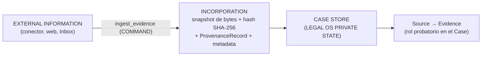

# ADR-006 — Frontera de incorporación: exploración ≠ evidencia del Case

## Estado

Accepted

## Contexto

La iniciativa quiere aprovechar la hiperconectividad del host conversacional: el prompt maestro (§20) declara la intención explícita de usar las capacidades que la clienta ya paga —Drive, Gmail, OneDrive/SharePoint, archivos locales, búsqueda web, fuentes jurídicas, transcripción—. HECHO VERIFICADO (kernel §1; fuentes: claude.com/product/cowork y support.claude.com art. 13345190 y 15520349): Cowork soporta conectores MCP con modos de aprobación Manual/Auto/Skip y acceso directo a archivos locales en Desktop. HECHO VERIFICADO (kernel §1; fuente: code.claude.com/docs — permissions, hooks): Claude Code ofrece permisos deny/ask/allow por herramienta y por ruta, y hooks `PreToolUse` bloqueantes.

Esa misma hiperconectividad abre el agujero que este ADR cierra. La revisión arquitectónica v0.1.1 (§E.7) lo formuló sin ambigüedad: si el operador —Claude, vía conectores nativos del host— lee un documento de Drive directamente y usa su contenido, los invariantes de hash y procedencia son inaplicables, porque el contenido entró al razonamiento sin pasar por el Core. Sin snapshot en el momento de la incorporación no hay forma de afirmar después "esto es lo que recibimos", que es exactamente lo que exigen la cadena de trazabilidad del prompt maestro (§16: conclusión → hechos → evidencia → original → fragmento) y la inmutabilidad de originales del §19.

La revisión lo planteó como ADR CANDIDATO 10 — "vía única de ingestión" — con dos variantes: (a) estricta: consumir integraciones solo desde adapters del Core detrás de `ingest_evidence`, con el entorno del operador sin conectores de contenido paralelos; (b) lectura exploratoria permitida más ingestión formal obligatoria antes de fundamentar, variante que la propia revisión calificó de "más ergonómica y más riesgosa".

El problema a resolver es, entonces: cómo conservar la hiperconectividad sin que lo hallado fuera pueda fundamentar transiciones canónicas del Case, y dónde queda la única puerta por la que el material entra al expediente. El kernel aporta el contrato de incorporación que este ADR toma como dado y no rediseña: §4 (`ingest_evidence` como COMMAND) y §12 (flujo Inbox → snapshot → private state). La resolución va en la sección Decisión.

**Fuentes primarias (auditables dentro del repositorio; addendum v0.3 §A).** El prompt maestro v0.1 vive en `notes/prompt-maestro-v0_1.md` y la revisión arquitectónica v0.1.1 en `notes/revision-arquitectonica-v0_1_1.md`; las citas literales de los dueños que sustentan las decisiones aprobadas están en el Anexo B de `notes/addendum-correcciones-v0_3.md`. Toda referencia de este ADR a §§ del maestro o a secciones A–J de la revisión es verificable contra esos archivos.

## Decisión

**DECISIÓN APROBADA** (fuente literal: addendum v0.3, Anexo B.3 — prompt de consolidación de los dueños §11: *"EXPLORATION ≠ CASE EVIDENCE"* y la regla orientar-vs-fundamentar). Se conserva la hiperconectividad de Claude/Cowork: no se prohíbe que el modelo consulte Google Drive, Gmail, la web u otras herramientas externas. Se establece una frontera arquitectónica dura: **EXPLORATION ≠ CASE EVIDENCE**. Que Claude encuentre algo externamente NO lo convierte en evidencia del Case. Existe una única operación formal de incorporación:

En vocabulario canónico (kernel §2): el material incorporado es un **Source** —bytes preservados, hash SHA-256, provenance de incorporación con `provenance_kind = EXTERNAL_SOURCE`, metadata—; **Evidence** es el rol probatorio de ese Source dentro de un Case. Refinamiento ya registrado que conviene repetir donde más se nota: el "Document/original" de v0.1.1 se llama ahora **Source** (kernel §16.2 — cambio de nombre, no de semántica).

**Regla literal aprobada** (addendum v0.3, Anexo B.3; prompt de consolidación §11): *"La información encontrada en una integración externa puede orientar al modelo, pero no puede fundamentar una transición canónica del Case hasta ser incorporada formalmente."*

**Alcance de lo aprobado.** Lo que los dueños aprobaron es **la regla** —`EXPLORATION ≠ CASE EVIDENCE` y la distinción ORIENTAR / FUNDAMENTAR—, no una elección entre las dos variantes que la revisión v0.1.1 redactó para el ADR CANDIDATO 10. Que esta frontera se corresponda con el terreno de la variante (b) es **lectura de la consolidación**, no decisión de los dueños: como la regla aprobada no prohíbe la exploración, la variante (a) queda descartada por consecuencia y la frontera se sitúa donde la regla la pone —en el acto de incorporación, no en el acceso—. Las garantías estructurales que acotan el riesgo de esa posición, y el residual declarado abiertamente (ver Riesgos), son elaboración de la consolidación sobre la regla aprobada.

Solo material incorporado puede participar en: (1) **EvidenceLink** (Fact ↔ fragmento de Evidence); (2) la determinación de **Facts** —referencias de provenance en `propose_facts` y todo lo que de ahí derive—; (3) la provenance de **Artifacts** (`inputs[]` por `entity_id` + `content_hash`); (4) la salida jurídica final. El resultado buscado, en palabras de los dueños: **hiperconectividad + trazabilidad**.

**Contrato de incorporación (kernel §4 y §12; se documenta, no se rediseña).** `ingest_evidence` es un COMMAND —la orden conversacional de la usuaria basta, sin HumanAuthorization—, idempotente por hash de contenido, que referencia el material por identificador de Inbox resuelto por el Core, nunca por rutas arbitrarias suministradas por el modelo. El Core copia los bytes al private state (snapshot) y el archivo de Inbox deja de ser la fuente; la operación dispara la derivación asíncrona (DerivedRepresentation `PENDING | READY | FAILED`, consultable vía `get_case_context(pending)`) y emite el evento `EvidenceIncorporated` en el Case Event Log. Refinamiento a señalar (kernel §16.1, supersede de v0.1.1 §C.5): que la incorporación sea COMMAND y no exija confirmación explícita **no** debilita la frontera —`PENDING_CONFIRMATION` desaparece del catálogo; la protección son la idempotencia por hash y el control de revisión, y lo sensible es el commit de hechos, no la entrada de bytes—.

**Alcance del slice v0.** Los conectores externos están FUERA del slice: solo Inbox local (kernel §11). La frontera se **diseña ahora** y se ejercita con material local: a efectos de esta regla el Inbox es una fuente externa más —lo que reposa en `Inbox/` tampoco es evidencia hasta ser incorporado—. Los conectores llegan después sin cambiar la regla: cambia el origen del material, no la operación que lo convierte en Evidence.

**Decisión de arquitectura vs detalle de implementación de plataforma.** La decisión de arquitectura es la frontera: el Core rechaza toda referencia probatoria a material no incorporado, con independencia del host. Los modos de aprobación de conectores de Cowork, las deny rules y hooks de Claude Code o cualquier configuración del host son detalle de implementación: pueden endurecer el perímetro, ninguno **es** la regla ni puede sustituirla. POR VERIFICAR (kernel §1): granularidad de permisos y garantías de sandbox/filesystem de Cowork Desktop; el Domain no depende de ese resultado.

## Invariantes derivados

1. **EvidenceLink solo contra Evidence incorporada.** Todo EvidenceLink referencia un fragmento de una Evidence cuyo Source existe en el Case Store con hash registrado. Test negativo de primera clase: crear un link contra material no incorporado (URL, id de conector, ruta, texto pegado sin ingesta) **FALLA**.
2. **`propose_facts` exige provenance o marca explícita.** Todo hecho propuesto llega con referencias a fragmentos incorporados, o con la marca explícita "solo alegado"; en caso contrario hay rechazo sintáctico (kernel §4). No existe tercera vía.
3. **Ningún contenido externo no incorporado aparece en provenance de Artifacts.** `register_artifact` valida que cada entrada de `inputs[]` sea una entidad del Case Store identificada por `entity_id` + `content_hash` —incluida la DerivedRepresentation exacta consumida (kernel §10)—, jamás una referencia externa.
4. **La incorporación es el único productor de Sources.** Ninguna otra tool de la superficie MCP crea un Source; el modelo no puede "declarar" incorporado nada.
5. **El fragmento siempre resuelve a un Source.** Un fragmento citado a través de una DerivedRepresentation arrastra la referencia obligatoria a su Source (kernel §2): el derivado nunca sustituye al original.
6. **El snapshot es independiente del origen.** Tras la incorporación, la alteración o desaparición del material externo (o del archivo de Inbox) no altera el Source; el hash fija los bytes recibidos. Integridad desde la ingestión, **no** autenticidad —distinción que la UX debe preservar (v0.1.1 §H)—.
7. **Idempotencia por hash.** Los mismos bytes incorporados dos veces producen un solo Source; la procedencia adicional se registra, el original no se duplica.
8. **Los conectores son canales de ingestión, no dependencias de ejecución** (registrado desde v0.1.1 §E.7; el kernel no lo supersede): ningún flujo con relevancia procesal depende de un token OAuth vigente ni de una cuota de API. Aplicable post-slice.

## Consecuencias positivas

- **Hiperconectividad sin contaminación del expediente.** La usuaria conserva el valor de un asistente que busca y explora; el Case Store solo contiene material con custodia verificable.
- **La cadena de trazabilidad del §16 es realizable de punta a punta:** toda salida jurídica final resuelve a fragmentos de Sources con hash, porque nada entra a esa cadena por otra puerta.
- **La frontera se valida barata en el slice y es independiente del host:** con Inbox local se ejercitan los mismos invariantes que gobernarán a los conectores, y la regla funciona igual con Claude Code, Cowork u otro porque vive en el Core, no en la configuración de conectores.
- **Evita el anti-patrón opuesto:** prohibir la exploración empujaría a la usuaria a pegar contenido a mano en el chat —menos trazabilidad, no más—.

## Consecuencias negativas

- **Fricción (consecuencia honesta y aceptada).** La usuaria y el modelo deben incorporar antes de fundamentar: un hallazgo externo útil exige el paso adicional de traerlo al Case Store antes de que un hecho pueda apoyarse en él. Mitigación: la incorporación es un COMMAND simple y conversacionalmente fluido —la orden natural de la usuaria basta, sin HumanAuthorization ni ceremonia—, y se paga una vez por material, no por uso.
- **Doble lectura potencial.** Contenido explorado y luego incorporado puede leerse dos veces (exploración + `get_evidence_fragment`), con costo de contexto y latencia. SUPUESTO: aceptable al volumen del slice; medir con uso real.
- **Asimetría conversación/expediente.** El modelo puede haber "visto" más de lo que el expediente registra; una respuesta conversacional puede aludir a material que las proyecciones del Case no contienen (ver Riesgos).

## Alternativas consideradas

1. **Vía única estricta (ADR CANDIDATO 10, variante a): cerrar los conectores de contenido en el entorno del operador.** Descartada como consecuencia de la regla aprobada (Anexo B.3), que no prohíbe la exploración —el descarte es lectura de la consolidación, no una elección de los dueños entre variantes—: sacrifica la hiperconectividad, valor declarado del producto (§20), y su enforcement dependería de capacidades por host —deny rules y hooks `PreToolUse` bloqueantes en Claude Code, HECHO VERIFICADO (kernel §1; fuente: code.claude.com/docs — permissions, hooks); POR VERIFICAR en Cowork—, convirtiendo una garantía de arquitectura en promesa de plataforma. La frontera adoptada protege igual el expediente sin renunciar a la exploración.
2. **Incorporación automática de todo lo explorado (shadow-ingest).** Rechazada: la incorporación debe ser acto intencional con procedencia declarada. Ingerir en silencio todo lo que el modelo lee llenaría el Case Store de material sin criterio probatorio, crearía pasivo de confidencialidad y diluiría el significado de "está en el expediente".
3. **Confiar en la exploración como evidencia (sin frontera).** Rechazada: es el escenario que v0.1.1 §E.7 identificó como destructor de los invariantes de hash y provenance.
4. **Fundamentar contra una referencia externa persistente en lugar de un snapshot.** Rechazada conforme a la matriz de v0.1.1 §E.7: si algo es o puede ser evidencia se copia siempre, de inmediato, con hash y procedencia, antes de cualquier análisis —el original externo puede ser alterado o eliminado por terceros—. La referencia viva se admite para documentos colaborativos en curso, y aun así exige copia con hash cuando la versión se congela.

## Riesgos

- **RIESGO residual (señalado por diseño, no eliminable).** El contenido explorado influye en el razonamiento del modelo aunque no toque el estado. La frontera protege el **EXPEDIENTE**, no el contexto conversacional: un énfasis, una sugerencia o una hipótesis pueden estar moldeados por material externo no incorporado, y eso no es detectable en el estado. Mitigación estructural: nada de ese razonamiento puede volverse estado sin pasar por propose/commit —`propose_facts` exige referencias incorporadas o marca "solo alegado" (invariante 2), y las transiciones sensibles exigen HumanAuthorization (ADR-005)—. Es el precio concreto de la regla aprobada: al no prohibir la exploración, la frontera vive en el acto de incorporación —el terreno que v0.1.1 llamó variante (b) y calificó de más ergonómico y más riesgoso—.
- **RIESGO — lavado por "solo alegado".** Un hecho inspirado en contenido externo no incorporado puede entrar como "solo alegado" y ser commiteado por la humana sin que ese origen sea visible. La marca es honesta —el hecho queda `UNSUPPORTED` como estado derivado, kernel §3—, pero el origen de la sugerencia no se registra. Se acepta en v0; ver Preguntas pendientes.
- **RIESGO — erosión de la fricción.** Iteraciones futuras de UX podrían "optimizar" la incorporación hasta volverla automática e indiscriminada, colapsando en la alternativa 2. La fricción mínima intencional se documenta como requisito, no como bug (v0.1.1 §C.5).
- **RIESGO de plataforma.** Si el host permitiera al modelo escribir directamente en el private state, la frontera sería decorativa. El enforcement del perímetro es objeto de ADR-002 —deny rules y hooks `PreToolUse` bloqueantes en Claude Code: HECHO VERIFICADO (kernel §1; fuente: code.claude.com/docs — permissions, hooks); garantías equivalentes en Cowork POR VERIFICAR—.
- **RIESGO — fallo de adapter externo (post-slice).** Al activar conectores, todo fallo debe emitir `INTEGRATION_ERROR {integration, effect_on_state}` afirmando el efecto sobre el estado; en v0 ese efecto es `NONE` (kernel §9).

## Validación / pruebas necesarias

Los tests negativos son criterios de aceptación de primera clase (kernel §11). Esta frontera aporta a la matriz:

1. Crear EvidenceLink contra material no incorporado (URL, id de conector, ruta, texto pegado) → rechazo del Core con código semántico estable; jamás creación silenciosa (invariante 1).
2. `propose_facts` con un hecho sin referencia de provenance ni marca "solo alegado" → rechazo sintáctico (invariante 2).
3. `register_artifact` con un input que no es entidad incorporada —id inexistente o `content_hash` no registrado— → rechazo (invariante 3).
4. Doble `ingest_evidence` de los mismos bytes → un solo Source, cero duplicados, segunda procedencia registrada (invariante 7).
5. Modificar o borrar el archivo de Inbox tras la incorporación → Source y derivados intactos; re-hash == hash registrado (invariante 6).
6. `ingest_evidence` con ruta arbitraria en lugar de referencia de Inbox resuelta por el Core → rechazo (kernel §4; coincide con el test de ids inventados de ADR-001).
7. Auditoría cruzada: en el Tool Invocation Log (kernel §6), ninguna invocación de mutación aceptada referenció material externo no incorporado.
8. Post-slice, al activar el primer conector: repetir 1–3 con orígenes de conector; deben pasar sin cambio alguno en Domain/Application.

## Preguntas pendientes

- **DECISIÓN PENDIENTE (post-slice) — mecánica de incorporación desde conectores.** ¿El material transita por Inbox (el conector deposita, el Core ingiere) o el Core lo obtiene vía adapter detrás de `ingest_evidence`? La regla es invariante ante ambas. El sobre de metadata por tipo de origen (id de Drive, headers completos de correo como original — v0.1.1 §E.7) depende de lo que exponga cada conector: POR VERIFICAR.
- **Pregunta a dueños — señal de origen para hechos "solo alegado".** ¿Debe un hecho "solo alegado" inspirado en material externo explorado llevar una señal adicional de ese origen (sin convertirlo en evidencia), o basta la marca actual? Añadirla sería cambio de contrato de `propose_facts`.
- **DECISIÓN PENDIENTE — código para el rechazo de la frontera.** El catálogo v0 (kernel §9) tiene 7 condiciones y ninguna corresponde a "referencia a material no incorporado". Regla fijada (addendum v0.3 B.6; supersede §16.12): `OPERATION_NOT_PERMITTED` se emite **únicamente** cuando la capacidad existe y una política o el perfil del principal la vetan —es condición del Core sobre una operación disponible—, de modo que no cubre este caso, que es rechazo de validación de una operación que sí existe, invocada con una referencia inválida. Y para las operaciones **inexistentes en la superficie** (acreditar directamente un hecho, modificar un Source, marcar una fuente jurídica como verificada en v0) **no hay condición del catálogo**: el resultado esperado es que la tool no exista en el manifiesto —verificable por el test de superficie— y lo que recibe la usuaria es mensaje de producto, no condición tipada. En v0 el rechazo de la frontera viaja como error semántico estable; queda por decidir si merece condición UX propia.
- **POR VERIFICAR —** si el host permite distinguir o etiquetar en conversación el contenido explorado no incorporado, como refuerzo de UX (nunca como enforcement).
- **DECISIÓN PENDIENTE (kernel §17) —** deduplicación física de Sources entre Cases: afecta la implementación de la incorporación, no la frontera (v0: copia por caso).

## Relaciones con otros ADRs

- **ADR-001 (frontera de confianza):** este ADR extiende la posición del LLM como operador externo no confiable — también lo que el operador *encuentra* fuera es entrada no confiable para el expediente hasta pasar por la operación formal del Core.
- **ADR-002 (Workspace vs Private State):** la incorporación es exactamente el cruce de esa frontera —Inbox (USER WORKSPACE) → snapshot en el Case Store (LEGAL OS PRIVATE STATE)— por el único camino normal host → Legal MCP → Application → Case Store. ADR-002 aporta el enforcement del perímetro; ADR-006, la semántica del cruce.
- **ADR-003 (modelo de dominio epistémico):** las "transiciones canónicas" que solo material incorporado puede fundamentar son las de ADR-003; los estados derivados `SUPPORTED | CONTRADICTED | UNSUPPORTED` se computan solo desde EvidenceLinks activos, que por este ADR únicamente existen contra Evidence incorporada.
- **ADR-004 (Canonical Case State + Derived Projections):** la incorporación es mutación canónica y, por tanto, evento del Case Event Log que ADR-004 contrata —`EvidenceIncorporated`, con `seq == CaseRevision` resultante—; el estado de la derivación disparada (`PENDING | READY | FAILED`) se observa por la proyección `get_case_context(pending)` de ese ADR, y las condiciones que este ADR menciona (`INTEGRATION_ERROR` al activar conectores, post-slice) viajan en el `conditions[]` del sobre de respuesta que ADR-004 fija. ADR-004 aporta el registro y la vista; ADR-006, qué material puede llegar a ese registro.
- **ADR-005 (autoridad humana):** frontera complementaria. ADR-006 controla **qué puede fundamentar** (solo lo incorporado); ADR-005 controla **quién puede consolidar** (solo la humana, vía registro server-side). Juntas cierran las dos vías por las que la exploración podría volverse estado.
