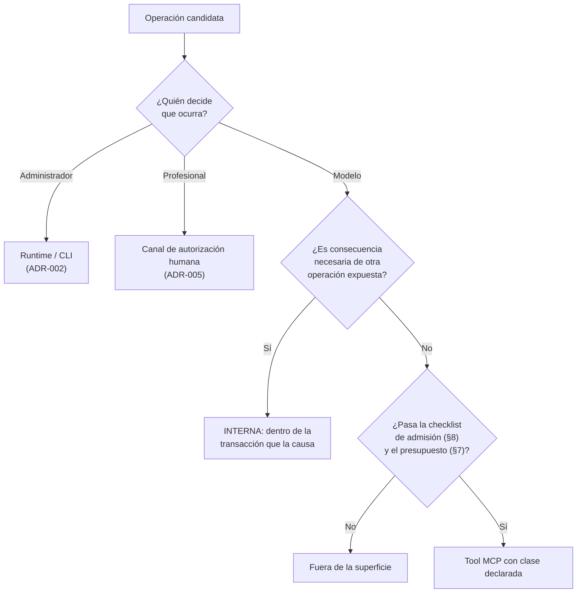

# ADR-010 — Superficie MCP mínima y clasificación de comandos

## Estado

Proposed

## Contexto

ADR-001 (Accepted) fijó que el LLM y el host agentic son **clientes externos no confiables** y que la superficie MCP es el perímetro de gobernanza del agente. Su invariante 3 la declara **cerrada y clasificada** —*"Nueve tools v0 … cada una con clase `QUERY | COMMAND | PROPOSAL | SENSITIVE_COMMAND | ADMIN`"*, con `ADMIN` **vacía por diseño**— y su lista de riesgos registra la **erosión incremental** (*"cada tool nueva 'por conveniencia' ensancha la superficie"*) con una mitigación enunciada pero no especificada: *"criterios de admisión por tool"*.

Ese es exactamente el hueco que este ADR llena. ADR-001 **enumera y clasifica**; no fija:

1. **el criterio** por el cual una operación merece existir en la superficie —hoy la lista de nueve es un hecho, no una consecuencia de una regla—;
2. **el presupuesto** de superficie y qué ocurre cuando se supera;
3. **los criterios de admisión** de una tool futura, que la mitigación del riesgo presupone;
4. **el compromiso** que protege la cuenta cero de `ADMIN` de la primera excepción razonable.

Sin (1) toda discusión sobre añadir o quitar una tool se resuelve por gusto. Sin (2) y (3), la mitigación del riesgo de ADR-001 es una intención. Sin (4), `ADMIN` deja de ser canario el día que alguien proponga una tool administrativa "inofensiva".

**Qué ha cambiado desde ADR-001.** El kernel técnico v0.4 §6 reevaluó la superficie y produjo dos movimientos: `verify_legal_source` **fuera del slice** (decisión de los dueños, supersede de la superficie de 10 tools de v0.1.1) y `register_artifact` **retirado** por aplicación de una regla de exposición, dejando **ocho**. El segundo movimiento choca con la literalidad de ADR-001 inv. 3 y de ADR-006 inv. 3, y se documenta como conflicto sin resolver en §11 de la Decisión.

**Hecho de plataforma que endurece la regla, sin cambiar ninguna decisión Accepted.** El spike documental de Cowork (`docs/research/cowork-runtime-spike-v0.md`; síntesis en `docs/technical-design/v0/ESTADO-Y-HALLAZGOS-CRITICOS.md` §1) produjo cuatro observaciones que afectan directamente al **mecanismo** por el que una prohibición se hace efectiva. **Precedencia: los spikes son nivel 6 (observaciones, jamás garantías de plataforma; kernel §14).**

- **HECHO VERIFICADO** (fuente: documentación oficial de Cowork, vía spike §1.1-1): Cowork **no lee** el directorio `~/.claude` de la CLI de Claude Code. Consecuencia dura: **ninguna regla `deny`, `allowedTools` ni hook de Claude Code gobierna Cowork.**
- **HECHO VERIFICADO** (misma fuente, spike §1.1-2): no existe deny por ruta; adjuntar una carpeta concede su árbol completo.
- **HECHO VERIFICADO** (misma fuente, spike §1.1-4): el modo Auto **delega la decisión de seguridad en el propio modelo**, que bloquea lo que *determine* inseguro.
- **HECHO VERIFICADO** (spec MCP vigente 2026-07-28, vía kernel §1 y ADR-001): la spec **no define RBAC** y sus `ToolAnnotations` son *hints* explícitamente **no confiables**.

Los cuatro convergen en una sola consecuencia para este ADR: **no se puede contar con que el host recorte la superficie**. Si una tool figura en el manifiesto que el Core publica, el modelo puede invocarla, y ni el host ni las anotaciones del protocolo lo impedirán. Por tanto **la no-exposición es el único mecanismo de prohibición que sobrevive a estos hallazgos** — que es lo que el prompt maestro §12 pedía desde el principio (*si una operación crítica no debería ser posible, el sistema no debe exponerla*) y lo que el addendum v0.3 B.6 formuló como regla. No es un cambio de decisión: es la evidencia de por qué la decisión era imprescindible.

El diseño completo de la superficie —las doce propiedades de cada tool, el sobre de respuesta, los códigos de error, las reglas duras R1–R6 y la aritmética de revisiones— está en `docs/technical-design/v0/05-mcp-contract.md`. **Este ADR registra las decisiones de superficie y clasificación, no repite el contrato.**

**Lo que este ADR no reabre:** la frontera de confianza (ADR-001), el perímetro del case store (ADR-002), el modelo epistémico y sus nombres reservados (ADR-003), la semántica de revisión y proyecciones (ADR-004), la autoridad humana y su canal propio (ADR-005), la frontera de incorporación (ADR-006).

## Decisión

### 1. Cinco clases de operación, y la clase es contrato

Toda tool de la superficie porta **exactamente una** clase de un enum cerrado. La clase **no es documentación**: determina qué exige la operación y qué test adversarial la acompaña (ADR-001 inv. 3).

| Clase | Semántica | `expected_revision` | Exige `HumanAuthorization` | Muta estado canónico |
|---|---|---|---|---|
| `QUERY` | Lectura pura del estado canónico o de sus proyecciones | no | no | no |
| `COMMAND` | Mutación que la orden conversacional de la usuaria basta para ordenar; protegida por idempotencia y control de revisión | opcional | no | sí |
| `PROPOSAL` | Registra trabajo propuesto; **proponer no es mutar el estado curado** (ADR-001 inv. 9) | opcional | no | sí (la Proposal y su Artifact) |
| `SENSITIVE_COMMAND` | Consolida estado epistémico; exige autoridad humana **server-side** | **obligatorio** | **sí** | sí |
| `ADMIN` | — | — | — | — |

**El enforcement de la clase vive en Application, nunca en el protocolo.** Las `ToolAnnotations` de MCP se declaran por coherencia de cara al host (`readOnlyHint` en las `QUERY`, `destructiveHint: false` en todas — ninguna tool destruye) y **jamás** se usan como control: son hints no confiables por la propia spec (HECHO VERIFICADO, Contexto).

### 2. REX — la regla de exposición

> **REX. Una operación se expone como tool si y solo si el modelo debe decidir *cuándo* ocurre.** Si su ocurrencia es **consecuencia necesaria** de otra operación ya expuesta, es **interna**: la ejecuta el Core dentro de la transacción que la causa.

- **REX-1.** Si la respuesta honesta a *"¿cuándo debe invocarse?"* es *"siempre después de X"*, la operación pertenece a X.
- **REX-2.** Exponer una consecuencia necesaria **no añade capacidad y añade dos modos de fallo**: **olvidarla** (estado incompleto que nadie detecta) y **desalinearla** (registrar algo que no corresponde a lo ocurrido). Ninguno es exótico: son las conductas que ADR-001 asume del invocador.
- **REX-3.** REX reduce el número de **estados observables inconsistentes**, no el número de líneas de código ni el tamaño de la API. No es una regla de estética.
- **REX-4 (límite).** REX **no** explica las operaciones que el modelo **no debe decidir en absoluto** —revisión humana, administración—. Esas quedan fuera por **autoridad** (ADR-005, ADR-002), no por consecuencia. Son dos criterios distintos y **no deben fundirse**: confundirlos permitiría argumentar que una operación administrativa entra en la superficie con solo demostrar que el modelo elige su momento.

**Aplicación a los doce use cases del kernel §7.** La superficie es la proyección de REX y REX-4 sobre el catálogo de use cases, no una lista independiente:

| Use case | Destino | Criterio |
|---|---|---|
| `CreateCase`, `OpenCase`, `IngestEvidence`, `GetCaseContext`, `SearchCase`, `GetEvidenceFragment`, `ProposeFacts`, `CommitReviewedFacts` | **expuestos** | El modelo decide cuándo |
| `GenerateDerivedRepresentation` | **interno** | Consecuencia necesaria de `IngestEvidence` (REX-1) |
| `EvaluateArtifactStaleness` | **interno** | Consecuencia necesaria de todo mutador (REX-1) |
| `RegisterArtifact` | **interno** | Consecuencia necesaria de `ProposeFacts` (REX-1) — ver §4 y §11 |
| `ReviewProposal` | **canal humano** | Autoridad, no consecuencia (REX-4; ADR-005) |

### 3. `ADMIN` permanece vacía por diseño, y la cuenta cero es una aserción

`ADMIN` existe como clase y cuenta **cero elementos**. Es decisión, no omisión.

| Operación administrativa | Dónde vive en V0 |
|---|---|
| Migraciones de schema | Runtime/CLI, con backup verificado previo |
| Instalación y actualización de Knowledge Packs | Runtime/CLI |
| Reparación / reconstrucción de índices | Runtime/CLI |
| Poda del Tool Invocation Log | Runtime/CLI (política de retención: DECISIÓN PENDIENTE, ADR-004) |
| Backup y restauración | Runtime/CLI |
| Re-verificación de integridad (manifest, hash-chain, re-hash de Sources) | Arranque del runtime y CLI |

Tres razones, en orden de peso:

1. **Asimetría de daño.** Toda operación de esa lista puede destruir o reescribir historia. Concederla a un invocador no determinista es lo que ADR-001 prohíbe, y ninguna validación posterior repara una migración ejecutada en el momento equivocado.
2. **No hay caso de uso conversacional.** No existe orden natural de la profesional que solo pueda satisfacerse con una tool administrativa.
3. **Canario verificable.** Una clase vacía es una aserción comprobable: `count(ADMIN) == 0`. Una clase inexistente no se puede verificar; una clase con un elemento "inofensivo" **ya movió la frontera**. La cuenta cero es la señal de que nadie la movió sin decirlo.

**Compromiso explícito.** Añadir la primera tool `ADMIN` exige **amendment de este ADR y de ADR-001**, con nombre, clase, autoridad exigida y test adversarial propio. Nunca por PR de conveniencia, nunca "temporalmente para depurar". **No existe capability que abra la clase `ADMIN`** (`05-mcp-contract.md` §3.3): no es que ningún perfil V0 la porte — es que no existe.

### 4. `register_artifact` — retirado de la superficie (propuesta; ver §11)

**Hecho.** El único artifact del slice (`FactAnalysis`) es consecuencia directa de `propose_facts`: no existe camino en el que el modelo deba decidir registrarlo en un momento distinto (kernel §6, §7). Aplicando REX-1, pertenece a `ProposeFacts`.

**Los dos fallos que su exposición abría** (REX-2):

| Fallo | Consecuencia |
|---|---|
| El modelo **olvida** registrar | Propuesta sin artifact: la detección de trabajo ya realizado y la propagación de staleness quedan ciegas, y nada lo señala |
| El modelo registra un artifact **que no corresponde** a ningún análisis real | `inputs[]` con hashes válidos y un `FactAnalysis` que nadie produjo: provenance formalmente correcta y materialmente falsa |

**Qué cambia y qué no.** El Core registra el Artifact **dentro de la transacción de `ProposeFacts`**, con `inputs[]` por `entity_id + content_hash` —incluida la DerivedRepresentation exacta consumida—, y emite `ArtifactRegistered`; `propose_facts` devuelve `artifact_id` y `get_case_context(pending)` expone los artifacts stale, de modo que **el modelo no pierde información: pierde una decisión que no le corresponde**. **El invariante sustantivo de ADR-006 inv. 3 no se debilita** —`inputs[]` sigue validándose contra el Case Store y sigue rechazando toda referencia externa—; lo que caduca es **el nombre del punto de aplicación**. Esta distinción es la que hace posible la opción A de §11 sin tocar ninguna garantía.

### 5. `verify_legal_source` — fuera del slice por alcance, no por REX

**DECISIÓN APROBADA (dueños)**, registrada como supersede de la superficie de 10 tools de v0.1.1 (kernel §6). No es aplicación de REX: es **alcance**. El slice es de custodia y epistemología —caso, evidencia, hechos, memoria, provenance, autoridad humana—, **no de investigación jurídica**.

Consecuencia deliberada y verificable: la única respuesta posible del sistema a *"marca esta sentencia como verificada"* es que **la operación no existe**. No hay estado "verificada" que alcanzar, ni camino que rechazar, ni condición del catálogo que emitir. Lo que recibe la usuaria es **mensaje de producto**; lo que verifica el test es la **ausencia de la tool en el manifiesto**. Así se materializa el Product Floor **PF-004** (*unverified legal authority cannot become verified by model assertion*) por **no-exposición**, que es la forma más fuerte disponible en V0 y la única que sobrevive a los hallazgos del spike (Contexto).

### 6. Exclusiones por autoridad (REX-4)

Dos planos completos quedan fuera de la superficie **por autoridad**, no por consecuencia, y ninguna checklist de admisión puede reintroducirlos:

- **El canal de autorización humana** (`ReviewProposal`): segundo driving adapter, ADR-005 §4. El modelo **no puede convocar a la profesional** ni observar su decisión por esta superficie; `propose_facts` solo devuelve `review_channel_hint: 'HUMAN_CHANNEL'`, informativo. Refuerzo del spike: **HECHO VERIFICADO** — la elicitation en modo form **no prueba acto humano** en este stack (spike §1.1-5), y el modo Auto delega en el modelo; por tanto **la UI del host es notificación, jamás autoridad**, y la autorización se resuelve dentro del Core sin token para el modelo (kernel §3.3).
- **El plano administrativo del runtime/CLI** (ADR-002 inv. 2), enumerado en §3.

### 7. Presupuesto de superficie

**Presupuesto V0: la cuenta que resulte de §11** —**ocho** si se aprueba el retiro de `register_artifact`, **nueve** mientras ADR-001 siga vigente sin enmienda—. **Techo propuesto para V1: 12** (**SUPUESTO**: número no calibrado empíricamente; su función es forzar una conversación, no acertar una cifra).

Superar el techo **no es imposible: obliga a una revisión de la superficie como tal**, no a un ADR por tool. Razón: el riesgo de erosión de ADR-001 es **agregado**, no local — cada tool aislada puede pasar la checklist y el conjunto degradarse igual. Un presupuesto explícito es la única defensa barata contra una degradación que nunca se decide en una sola reunión.

### 8. Checklist de admisión de tools futuras

Una tool candidata entra solo si responde **las ocho preguntas, por escrito, en un ADR de amendment**:

1. **REX.** ¿El modelo debe decidir *cuándo* ocurre? Si es consecuencia necesaria de otra operación ⇒ interna (§2).
2. **Autoridad.** ¿La decide el modelo, la profesional o el administrador? Si no es el modelo ⇒ canal humano o runtime/CLI, no MCP (REX-4).
3. **Clase.** `QUERY | COMMAND | PROPOSAL | SENSITIVE_COMMAND | ADMIN`, declarada y justificada. Si es `SENSITIVE_COMMAND`, qué valor entra en `authorized_operation` (hoy solo `COMMIT_FACT`).
4. **Invariante nuevo.** ¿Qué invariante debe proteger Application que hoy no protege? Si ninguno, sospechar: probablemente sea una lectura ya cubierta por `get_case_context`.
5. **Product Floor.** ¿Qué política del piso toca y por qué no la relaja?
6. **Referencias.** ¿Todas sus entradas son ids opacos emitidos por el Core? Si necesita una ruta o una URL, **no entra** (R1, R2 de `05-mcp-contract.md` §2).
7. **Test adversarial.** ¿Cuál es su test negativo propio y qué código o condición emite? **Sin test adversarial no hay admisión.**
8. **Presupuesto.** ¿Qué se retira a cambio, o por qué el presupuesto debe crecer?

**Toda tool futura hereda sin renegociación las seis reglas duras** de `05-mcp-contract.md` §2: sin rutas ni URLs (R1); referencias por id opaco del Core (R2); ningún secreto de autorización viaja al modelo (R3); schemas cerrados con `additionalProperties: false` (R4); el principal no viaja en el input (R5); ninguna respuesta expone el private state ni cruza Cases (R6).

### 9. Cola de candidatas conocidas (POST-V0)

Registradas con canal y clase esperada **para no improvisar nombres después**; ninguna está admitida.

| Candidata | Canal esperado | Clase | Nota |
|---|---|---|---|
| `verify_legal_source` | MCP | `COMMAND` o `PROPOSAL` — **DECISIÓN PENDIENTE** | Fuera del slice por alcance (§5); PF-004 gobierna su diseño |
| `RecordProfessionalDetermination` | **canal humano** | SENSITIVE | Nombre reservado (ADR-003); no es tool MCP |
| `WithdrawFact` | **canal humano** | SENSITIVE | Nombre reservado (ADR-003/004); no es tool MCP |
| `ExtractStatements` | **interno** | — | Materializaría `Statement` (**no se materializa en V0**); por REX es consecuencia de la derivación |
| `list_inbox` | MCP | `QUERY` | Solo si se rechaza la resolución interna del Inbox dentro de `ingest_evidence` (`05-mcp-contract.md` §6.7) |
| `export_*` | MCP o runtime | `COMMAND` | Portabilidad y salidas a `Exports/`; requiere gate de política de export |

### 10. La superficie es cerrada en ambos sentidos

Lo que no está declarado **no existe para el modelo**, y lo declarado **no se retira ni se añade sin ADR de amendment**. Añadir una tool, retirarla, cambiar su clase o mover una operación de expuesta a interna son, todos, **cambios de contrato** con el mismo peso que añadir un evento a la lista cerrada (ADR-004 inv. 6). La consecuencia operativa que importa: **el manifiesto de tools es un artefacto versionado y testeado, no un efecto secundario del código**.

### 11. CONFLICTO CON ADR ACCEPTED — cuenta de tools (ADR-001) y nombre del punto de validación (ADR-006)

**ADR afectado.** **ADR-001 (Accepted)**, invariante 3 y prueba de validación 7. Secundariamente **ADR-006 (Accepted)**, invariante 3 y prueba de validación 3.

**Hecho nuevo.** El kernel técnico v0.4 §6 retira `register_artifact` de la superficie por aplicación de REX, dejando **ocho** tools, y su §7 reclasifica `RegisterArtifact` como **interno, dentro de `ProposeFacts`**.

**Evidencia (literal).**

- ADR-001 inv. 3: *"**Nueve tools v0** … cada una con clase `QUERY | COMMAND | PROPOSAL | SENSITIVE_COMMAND | ADMIN`"*.
- ADR-001 val. 7: *"el manifiesto de tools contiene exactamente las **9 tools v0** con su clase; la clase ADMIN cuenta cero elementos"*.
- ADR-006 inv. 3: *"`register_artifact` valida que cada entrada de `inputs[]` sea una entidad del Case Store identificada por `entity_id` + `content_hash` …, jamás una referencia externa"*; su val. 3 invoca la tool **por su nombre**.
- Kernel v0.4 §6 y §7, y `05-mcp-contract.md` §6 (*Las ocho tools*) y §11.1.
- **Precedencia (kernel §14):** un documento de nivel 2 no puede redefinir una regla fijada en nivel 1. **ADR-001 gana mientras siga Accepted, y un ADR `Proposed` no manda sobre un ADR `Accepted`.**

**Impacto de cada salida.**

1. **Sobre el criterio de aceptación del slice.** Mientras no haya amendment, la cuenta normativa es **nueve** y el test de superficie (F16, criterio estructural 1) exige nueve. **Implementar ocho hoy hace fallar un criterio de aceptación de primera clase** — no es un detalle cosmético.
2. **Sobre ADR-006.** Caduca **el nombre** del punto de aplicación, no la garantía: `inputs[]` se sigue validando contra el Case Store y se sigue rechazando toda referencia externa, ahora en el registro interno dentro de `ProposeFacts`. La val. 3 debe reescribirse para ejercitar el registro interno en lugar de la tool.
3. **Sobre documentos de nivel inferior**, que quedarían desalineados y deberían corregirse **si y solo si** se aprueba el amendment: `docs/architecture/boundaries.md` §2.1 (tabla de nueve tools) y §3; `docs/architecture/vertical-slice-v0.md` (Scope, *MCP tools minimally required*, paso 12 del happy path, F9, F16, criterio estructural 1).
4. **Sobre el hallazgo del spike.** La opción elegida determina qué significa "manifiesto" en el test, y eso ya no es una cuestión de redacción: **si una tool figura en el manifiesto que el Core publica, es invocable**, porque el host no filtra (Contexto). Cualquier opción que conserve el nombre debe decir **explícitamente** si lo conserva en `tools/list` o solo en la documentación del contrato.

**Opciones.**

| # | Opción | Consecuencia |
|---|---|---|
| **A** | **Enmendar ADR-001** inv. 3 y val. 7 (nueve → ocho) y la literalidad de ADR-006 inv. 3 y val. 3 (la validación de `inputs[]` se aplica en el registro interno dentro de `ProposeFacts`) | Superficie mínima coherente con REX; el invariante de ADR-006 se conserva íntegro y solo cambia su punto de aplicación; obliga a un pase de corrección en `boundaries.md` y `vertical-slice-v0.md` y a reescribir F16 y ADR-006 val. 3 |
| **B** | **Mantener nueve, exponiendo `register_artifact`** | Respeta la literalidad de ADR-001 y ADR-006 sin tocar nada, a costa de sostener los dos modos de fallo de REX-2 y de contradecir el kernel §6 y §7, que ya declaran `RegisterArtifact` interno. Exigiría además revertir el registro interno descrito en `05-mcp-contract.md` §6.8 y su segundo evento |
| **C** | **Declarada pero no expuesta**: `register_artifact` sigue nombrada en el contrato y en ADR-006, pero no aparece en `tools/list` | Satisface la letra de ADR-001 val. 7 **solo si el test cuenta declaraciones y no tools invocables** — es decir, exige redefinir qué es "el manifiesto", que es precisamente lo que el test verifica. Deja un nombre sin implementación (o una implementación muerta que es superficie latente) y traslada la ambigüedad al artefacto que debía resolverla. **Requiere, como mínimo, fijar por escrito la definición operativa de manifiesto antes de poder evaluarse** |
| **D** | **Retirar sin enmendar** ningún ADR | **Inaceptable.** Deja un ADR Accepted contradicho de hecho por la implementación: exactamente la deriva silenciosa que la regla de precedencia existe para impedir |

**Recomendación del technical design: A**, coherente con `05-mcp-contract.md` §11.1. **No es una resolución: es DECISIÓN PENDIENTE de los dueños.** Mientras este ADR esté `Proposed`, **la superficie normativa es la de ADR-001** y el resto del corpus técnico debe leerse como propuesta en este punto concreto.

## Invariantes derivados

1. **Clasificación total.** Toda tool publicada porta exactamente una clase del enum cerrado; no existe tool sin clase ni clase fuera del enum. La clase se aplica en **Application**, nunca en el protocolo.
2. **`count(ADMIN) == 0`** en el manifiesto publicado, y **no existe capability** que abra esa clase.
3. **Cierre de la superficie.** Lo no declarado no existe para el modelo; añadir, retirar o reclasificar una tool es cambio de contrato y exige ADR de amendment (§10).
4. **REX.** Ninguna operación cuya ocurrencia sea consecuencia necesaria de otra operación expuesta figura en el manifiesto (§2).
5. **REX-4.** Ninguna tool de la superficie confiere autoridad humana ni administrativa; los dos planos excluidos por autoridad no son alcanzables desde MCP en ningún camino (§6).
6. **Herencia de reglas duras.** Toda tool, presente o futura, satisface R1–R6 de `05-mcp-contract.md` §2 sin renegociación; en particular, **ningún schema de la superficie declara un parámetro `path`, `uri`, `url`, `file` ni `directory`**.
7. **Presupuesto.** El número de tools publicadas no supera el presupuesto vigente; superarlo exige revisión de la superficie como tal, no un ADR por tool (§7).
8. **Anotaciones sin poder.** Ninguna decisión de control depende de `ToolAnnotations` ni de ninguna señal del transporte; la clasificación de un rechazo la fija `error.code` (HECHO VERIFICADO: la spec MCP no define RBAC y sus annotations son hints no confiables).
9. **PF-004 por ausencia.** No existe en V0 operación alguna —ni expuesta ni interna— que transicione una fuente jurídica a "verificada". La garantía se sostiene por inexistencia, no por rechazo (§5).
10. **Trazabilidad de admisión.** Toda tool del manifiesto tiene, documentados: clase, capability requerida y al menos un test adversarial propio.

## Consecuencias positivas

- **La superficie deja de ser una lista y pasa a ser una consecuencia.** Ante cualquier propuesta futura, la pregunta *"¿quién decide cuándo ocurre?"* produce una respuesta verificable; ADR-001 enunciaba la mitigación, este ADR la hace ejecutable.
- **La mitigación del riesgo de erosión de ADR-001 se vuelve comprobable**: presupuesto numérico, checklist de ocho puntos y cuenta cero de `ADMIN` son todos asertables en CI, no intenciones de revisión.
- **Menos estados observables inconsistentes.** Cada operación interiorizada por REX elimina un modo de fallo por omisión y otro por desalineación (REX-2), que son fallos silenciosos: los peores en un sistema cuya propiedad central es la fidelidad.
- **La prohibición sobrevive al host.** Con los hallazgos del spike, el único mecanismo de prohibición que no depende de configuración ajena es la no-exposición; este ADR la convierte en la forma primaria de decir "no", en vez de un caso especial.
- **La clase orienta el testing.** `SENSITIVE_COMMAND` arrastra la batería de autorización; `QUERY` arrastra determinismo y aislamiento entre Cases. La matriz adversarial se deriva de la clasificación en lugar de escribirse a mano.
- **La cola de candidatas evita la improvisación de nombres**, que es como los vocabularios se corrompen: `RecordProfessionalDetermination` y `WithdrawFact` quedan reservados **en el canal humano** antes de que alguien los proponga como tools.

## Consecuencias negativas

- **Fricción real de producto.** Una superficie de ocho o nueve tools deja capacidades legítimas sin camino: no hay listado del Inbox, no hay descarga del original, no hay export. Cada una es una conversación futura, y la respuesta por defecto será "no" mientras no pase la checklist.
- **Concentración de responsabilidades.** Interiorizar operaciones engorda los use cases que las absorben: `ProposeFacts` registra además el Artifact; `IngestEvidence` resuelve además el Inbox y dispara la derivación. Menos superficie externa a cambio de **más complejidad transaccional interna**, con más de un evento por invocación.
- **Coste de gobernanza.** Cada tool futura exige un ADR de amendment con ocho respuestas por escrito y un test adversarial. Es deliberadamente caro; también es lento cuando la tool es obviamente correcta.
- **El presupuesto puede envejecer mal.** Un techo no calibrado (SUPUESTO, §7) puede volverse un ritual: o se respeta sin pensar, o se sube sin discutir. Su único valor es forzar la conversación en el momento de superarlo.
- **REX depende de una lectura correcta de "consecuencia necesaria".** Si mañana un `FactAnalysis` pudiera producirse fuera de `propose_facts`, REX-1 dejaría de aplicar y el retiro de `register_artifact` habría que reabrirlo. La regla es sólida; su premisa es contingente y debe re-examinarse cada vez que se añade un productor de Artifacts.
- **Desalineación documental mientras el conflicto siga abierto.** `boundaries.md` y `vertical-slice-v0.md` cuentan nueve, el corpus técnico describe ocho, y ningún implementador puede empezar el manifiesto sin la decisión de §11.

## Alternativas consideradas

1. **Superficie amplia de conveniencia (CRUD sobre el modelo de dominio).** Rechazada: convertiría el MCP en un cliente de base de datos con otro nombre y trasladaría al modelo la responsabilidad de mantener invariantes. Contradice ADR-001 en su premisa, no en un detalle.
2. **Exponer `register_artifact` y confiar en el Skill para que el modelo lo llame siempre.** Rechazada por la misma razón por la que ADR-001 rechazó gobernar por prompt: *un skill es texto ignorable*. Aquí sería peor que en otros casos, porque el fallo por omisión **no produce error**: produce una propuesta sin artifact que nadie detecta.
3. **Gobernar la superficie con permisos del host** (`deny`/`allowedTools`, aprobación por conector). Rechazada: **HECHO VERIFICADO** (Contexto) — Cowork no hereda la configuración de Claude Code, no ofrece deny por ruta y su modo Auto delega la decisión en el propio modelo evaluado. Un control juzgado por el sistema evaluado no sostiene una garantía de producto. El host es defensa en profundidad; la frontera es el Core.
4. **Añadir `list_inbox` como tool adicional** para que `inbox_ref` sea obtenible. Rechazada en V0: gasta presupuesto para una capacidad que es **consecuencia** de la incorporación; se resuelve dentro de `ingest_evidence`, que devuelve candidatos sin mutar nada (`05-mcp-contract.md` §6.7). Queda en la cola (§9) por si esa resolución interna se rechaza. Alternativa colateral —exponer el Inbox como *recurso* MCP— **POR VERIFICAR** el soporte del host, y ajena al contrato del Core.
5. **Una sola categoría "tool" sin clasificación.** Rechazada: sin clase no hay forma de decir *qué exige* una operación, y el requisito de autorización humana pasaría a ser una propiedad de la implementación en vez del contrato. ADR-001 inv. 3 ya lo había descartado.
6. **`ADMIN` con una tool "inofensiva"** (estado del runtime, versión, salud). Rechazada: el canario deja de serlo en cuanto cuenta uno, y la siguiente discusión ya no es *"¿abrimos ADMIN?"* sino *"¿añadimos otra?"*. La información de salud, si se necesita, es del runtime/CLI.
7. **Solo checklist, sin presupuesto numérico.** Rechazada: la checklist se aplica tool a tool y la erosión es agregada; un conjunto de decisiones individualmente defendibles produce una superficie indefendible.
8. **Fundir REX y la exclusión por autoridad en un solo criterio.** Rechazada explícitamente (REX-4): permitiría argumentar que una operación administrativa entra porque el modelo elige su momento. Son dos preguntas y deben responderse por separado.

## Riesgos

- **RIESGO — Erosión incremental** (heredado de ADR-001). Mitigación: presupuesto, checklist, cuenta cero de `ADMIN` y test de superficie en CI. Ninguna es infalible; todas son visibles.
- **RIESGO — El conflicto de §11 bloquea un criterio de aceptación.** Mientras no se decida, implementar ocho hace fallar F16 e implementar nueve contradice el corpus técnico. Es un bloqueo de decisión, no técnico, y su coste crece con el tiempo.
- **RIESGO — "Declarada pero no expuesta" mal implementada** (opción C de §11). Si el nombre sobrevive en `tools/list`, la tool es invocable —el host no filtra (HECHO VERIFICADO)— y se obtendría lo peor de las dos opciones: los modos de fallo de REX-2 más la ilusión de haberlos evitado.
- **RIESGO — Falso "interno".** Aplicar REX a una operación que el modelo sí debería temporizar la esconde dentro de otra y **elimina una decisión legítima** sin dejar rastro. Señal de alarma: cuando la respuesta a *"¿cuándo debe invocarse?"* necesita un "depende".
- **RIESGO — Degradación por falta de capacidad.** Un modelo sin tool para algo legítimo improvisa: reinterpreta otra tool, o relata al usuario que hizo algo que no hizo. Mitigación (no de superficie): condiciones tipadas adheridas al estado y `get_case_context` como fuente de verdad del relato.
- **RIESGO — La checklist como trámite.** Ocho preguntas contestadas de forma ritual admiten cualquier cosa. La pregunta 8 (*qué se retira a cambio*) es la única con coste real, y es la primera que se diluirá.
- **RIESGO — Dependencia empírica abierta del anfitrión.** El punto B-04 del spike (**INCONCLUSIVE**: si un servidor MCP local puede alcanzar rutas fuera de las carpetas adjuntadas) no afecta a la clasificación de esta superficie, pero **sí** a que el Core pueda alcanzar su propio estado canónico bajo Cowork. Registrado en `ESTADO-Y-HALLAZGOS-CRITICOS.md` §4; se resuelve empíricamente en `experiments/cowork-capability-spike/`.

## Validación / pruebas necesarias

Todas deben pasar **sin cooperación del modelo** (ADR-001).

1. **Test de superficie (extiende ADR-001 val. 7).** El manifiesto publicado contiene **exactamente N tools**, cada una con su clase declarada, donde `N` es la cuenta que resulte de §11. **La prueba debe fijar por escrito si cuenta tools declaradas o tools invocables** — hoy la ambigüedad solo importa bajo la opción C, y por eso debe cerrarse antes de escribirla.
2. **`count(ADMIN) == 0`** sobre el manifiesto, y **ausencia de capability** que la abra (aserción sobre el catálogo de capabilities, no solo sobre el manifiesto).
3. **Ausencia de `verify_legal_source`** y de cualquier operación que produzca un estado "verificada" de fuente jurídica, en tools **y** en use cases (PF-004 por no-exposición).
4. **Property test de clasificación:** para toda tool del manifiesto existen clase, capability requerida y al menos un test adversarial asociado; una tool sin cualquiera de los tres hace fallar la suite.
5. **Schemas cerrados:** toda tool declara `additionalProperties: false`; un parámetro inventado (`humanReviewed`, `authorization_token`, `force`, `as_user`) se rechaza **en el adapter** con `VALIDATION_FAILED`, antes de Application (adversarial 2).
6. **Sin rutas ni URLs:** ningún schema declara `path`/`uri`/`url`/`file`/`directory`; entradas con `..`, rutas absolutas, symlinks o junctions de Windows se rechazan (F18, adversarial 4, ADR-002 val. 4).
7. **Registro interno de Artifact (si se aprueba A):** `register_artifact` **ausente** del manifiesto **y** `propose_facts` produce `FactsProposed` + `ArtifactRegistered` en una sola transacción — dos mutaciones, dos eventos, biyección preservada (F13, criterio estructural 3).
8. **Sustituto de ADR-006 val. 3 (si se aprueba A):** el registro interno rechaza un `inputs[]` cuya entrada no sea entidad incorporada del Case Store —id inexistente o `content_hash` no registrado—, ejercitado a través de `propose_facts` en vez de la tool retirada. **Si esta prueba no se escribe, el amendment debilita ADR-006 de hecho aunque no lo diga.**
9. **No-regresión de presupuesto:** aserción de conteo en CI que falla al superar el presupuesto vigente, con mensaje que remita a este ADR.
10. **Exclusión del canal humano:** no existe tool que dispare, simule ni consulte la revisión humana; `commit_reviewed_facts` no admite ningún campo que pretenda probarla (adversarial 2; ADR-005 val. 1–6).
11. **Aislamiento entre Cases** en toda tool de la superficie, incluida la excepción documentada de `open_case` —que porta metadatos no epistémicos y **ningún** contenido de expediente— (adversarial 7).

## Preguntas pendientes

- **DECISIÓN PENDIENTE (dueños) — Resolución del conflicto de §11:** opciones A, B, C o D. Es la pregunta bloqueante de este ADR y de la implementación del manifiesto.
- **DECISIÓN PENDIENTE — Definición operativa de "manifiesto"** para el test de superficie (tools declaradas vs. tools invocables). Solo es decisiva bajo la opción C, pero debe fijarse antes de escribir la prueba.
- **DECISIÓN PENDIENTE — ¿`list_inbox` entra** si los dueños rechazan la resolución interna del Inbox dentro de `ingest_evidence` (`05-mcp-contract.md` §6.7)?
- **DECISIÓN PENDIENTE — Techo V1 = 12:** confirmarlo, cambiarlo o sustituirlo por un criterio no numérico. Hoy es **SUPUESTO**.
- **DECISIÓN PENDIENTE — Clase de `verify_legal_source`** cuando entre (`COMMAND` o `PROPOSAL`), y qué política del Product Floor gobierna su diseño más allá de PF-004.
- **DECISIÓN PENDIENTE — Plano administrativo auditado y separado** post-slice (ADR-002). Su ausencia hoy **no autoriza atajos** por esta superficie.
- **POR VERIFICAR — Soporte de recursos MCP en el host**, condición para reconsiderar la exposición del Inbox como recurso en vez de tool.
- **POR VERIFICAR — Transporte del sobre y de los errores en la capa de protocolo MCP** (`05-mcp-contract.md` §4.1). Es detalle de adapter y **no altera** la clasificación de este ADR.
- **POR VERIFICAR — Punto B-04 del spike de Cowork:** si un servidor MCP local puede alcanzar rutas fuera de las carpetas adjuntadas. No cambia esta superficie; condiciona la elección de anfitrión (`ESTADO-Y-HALLAZGOS-CRITICOS.md` §1.2).

## Relaciones con otros ADRs

- **ADR-001 (frontera de confianza) — Accepted.** Este ADR **desarrolla** su invariante 3 (superficie cerrada y clasificada) y **especifica** la mitigación que su lista de riesgos solo enunciaba. **Contiene un amendment candidate** sobre su inv. 3 y su val. 7 (nueve → ocho), documentado en §11 y **no resuelto**. Añadir la primera tool `ADMIN` exigiría enmendar ambos.
- **ADR-002 (workspace vs. private state) — Accepted.** Su inv. 2 sitúa el plano administrativo en el runtime/CLI; la clase `ADMIN` vacía es la proyección de esa decisión sobre la superficie del modelo (§3, §6).
- **ADR-003 (modelo epistémico) — Accepted.** Fija los nombres reservados que la superficie no puede reintroducir como campos ni como tools (`Statement`, `assertion`, `RecordProfessionalDetermination`, `WithdrawFact`); `Statement` **no se materializa en V0**.
- **ADR-004 (memoria del caso y proyecciones) — Accepted.** `get_case_context` es el canal de lectura del cliente no confiable y la razón por la que la pregunta 4 de la checklist sospecha de toda tool de lectura nueva. La lista cerrada de eventos tiene el mismo régimen de cambio que la superficie (§10).
- **ADR-005 (autoridad humana) — Accepted.** `ReviewProposal` queda fuera **por autoridad** (REX-4) y `commit_reviewed_facts` es la única `SENSITIVE_COMMAND` de V0, sin token en el contexto del modelo.
- **ADR-006 (frontera de incorporación) — Accepted.** La literalidad de su inv. 3 y de su val. 3 nombra `register_artifact`; **el invariante sustantivo se conserva** y solo cambiaría su punto de aplicación (§4, §11, validación 8).
- **ADR-008 (Proposal y autorización humana) — Proposed.** Define el modelo de `Proposal`/`ProposalItem`/`HumanAuthorization` que `propose_facts` produce y `commit_reviewed_facts` consume; este ADR no lo reabre.
- **ADR-011 (locators de evidencia) — Proposed.** Define el `EvidenceFragment` cuyo `fragment_ref` **opaco** es la única forma de citar desde la superficie; su opacidad es lo que impide fabricar anclas y por tanto es parte del argumento de minimalismo.
