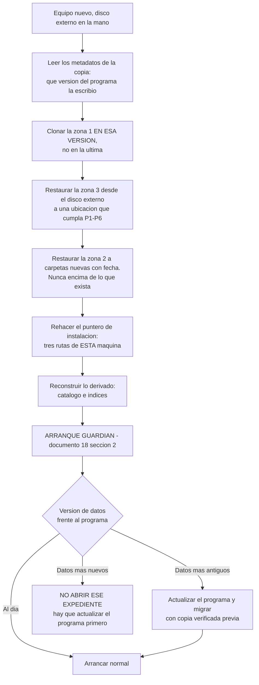

# ADR-013 — Política de respaldo y recuperación: dos mitades con necesidades opuestas, copia local más disco externo, y ningún respaldo cuenta hasta haberse restaurado

## Estado

Proposed

## Contexto

**Ningún ADR previo fija una política de respaldo del expediente, y ese es hoy el riesgo real de pérdida total del sistema.** Lo que existe en el corpus es un contrato y una precondición, no una política:

| Lo que ya existe | Dónde | Qué cubre | Qué NO cubre |
|---|---|---|---|
| `BackupPort` con `create` / `verify` / `restore` / `list` | `01` §8.2 | La **forma** de la capacidad y la exigencia de round-trip | Ningún destino, ninguna frecuencia, ningún responsable |
| «Backup verificado antes de cada migración — verificado, no solo escrito» | `boundaries.md` §10, punto 6; kernel §13 | El **gate de una operación concreta** | El respaldo como custodia continua |
| `V10` — «el backup está verificado, no solo escrito» | ADR-007 | El criterio de veredicto | Cuándo se hace, dónde vive, quién lo prueba |
| Copia verificada por round-trip previa a migrar | `18` §3.2–§3.3 | El procedimiento **dentro de la migración** | Los días en que no hay migración, que son todos menos uno |
| «El proveedor concreto es `POST-V0`» y «**DECISIÓN PENDIENTE (dueños, no técnica): topología de backup**» | `01` §8.4 | Declara la ausencia con honestidad | La ausencia sigue siendo ausencia |
| Pregunta 8 de ADR-012: «Política de respaldo de la zona 3 […] **es su riesgo real de pérdida total**» | ADR-012 | Nombra el hueco | No lo cierra |
| `R-4`: «la zona 2 no tiene respaldo en V0 […] **NO CERRADO**» | `17` §14 | Nombra el segundo hueco | No lo cierra |

Dicho sin suavizar: **el corpus sabe hacer una copia antes de migrar y no sabe qué hacer el resto del tiempo.** Una copia que solo existe el día de una migración protege exactamente del fallo de esa migración, que es el fallo más raro y ya el mejor gestionado del sistema.

### Git no respalda nada de lo que importa

Es el malentendido que hay que cerrar primero, porque el modelo de distribución tiene aspecto de respaldo y no lo es:

- **La zona 1 (programa) está versionada y replicada en el remoto.** Es lo único que git respalda, y es lo único que **no hace falta respaldar**: si el disco muere, la zona 1 se recupera volviendo a clonar. Es material público para el efecto práctico (ADR-012, riesgo 4) y reproducible por definición.
- **Las zonas 2 y 3 no están en git, y no por descuido: por diseño.** Es el invariante 1 de ADR-012 —*el expediente nunca está bajo control de versión*— y es la propiedad de la que cuelga que `git clean -fdx` no pueda borrar un expediente y que un `push` no pueda subir documentos de clientes. **La misma decisión que hace segura la distribución deja el expediente sin ninguna réplica.**

> **Si el disco de la abogada muere hoy, se pierde el expediente entero: `case.db`, el Case Event Log con su cadena, los originales de evidencia, el registro de autorizaciones humanas y el Artifact Registry. Y se pierde también todo lo suyo de la zona 2. Lo único que sobrevive es el programa, que es lo único que no vale nada.**

### Lo que ya está decidido y condiciona esta política

- **DECISIÓN APROBADA (dueños):** la instalación y las actualizaciones **las hace el dueño presencialmente**; ella nunca toca el repositorio. Consecuencia directa sobre este ADR: **el ritmo de visitas del dueño no puede ser el ritmo del respaldo**, porque una visita cada varios meses significa perder varios meses de expediente.
- **DECISIÓN APROBADA (dueños):** la zona 1 y `.git` se protegen contra escritura accidental de ella y se ocultan. Consecuencia: ella tampoco puede reparar ni mover nada por su cuenta.
- **DECISIÓN APROBADA (dueños):** la migración no genera evento canónico en V0; vive en el plano operacional. El respaldo hereda ese encuadre: **respaldar y restaurar no son actos epistémicos del expediente**, no emiten eventos del Case Event Log y no avanzan `case_revision`.
- **ADR-001 / ADR-010:** el modelo no ejecuta procesos ni escribe estado; la clase `ADMIN` está vacía por diseño. **Ninguna tool de respaldo, verificación o restauración existe ni existirá en la superficie MCP.**
- **ADR-012, Decisión 8 e invariante 17:** la zona 3 no vive bajo una raíz sincronizada a la nube, y sacar material de clientes a una nube personal es una decisión de confidencialidad que **nadie ha tomado**.
- **`18` §6.3:** el V0 no borra nada automáticamente — ni cuarentena, ni estados apartados, ni copias de seguridad.

Lo que este ADR **no reabre**: ADR-001, ADR-002 (camino único host → MCP → Application → Case Store), ADR-004 (proyecciones derivadas y regenerables), la regla de tres árboles disjuntos, ni el gate duro de migración de `01` §8.2. Lo que sí hace es **convertir un contrato de puerto en una política operable con destinos, frecuencia, responsables y procedimiento de vuelta**.

---

## Decision

### 1. La asimetría que decide todo: el expediente tiene dos mitades con necesidades opuestas

Esta es la observación de la que sale el resto del ADR, y conviene enunciarla antes que cualquier destino o frecuencia, porque **cambia el problema, no solo su solución**.

| | **Mitad pequeña — el estado** | **Mitad grande — los originales** |
|---|---|---|
| Qué es | `case.db` (estado materializado + Case Event Log encadenado), registro de `HumanAuthorization` y `ProposalItemReview`, Artifact Registry, metadatos de versión, snapshot de la Client Config | `Sources`: los bytes originales de audios, PDFs, escaneos, fotografías; y las `DerivedRepresentations` referenciadas por algún fragmento |
| Orden de magnitud | **MB** | **GB** |
| Cómo cambia | **Constantemente**: cada transacción confirmada la modifica | **No cambia nunca.** Un `Source` es **inmutable tras la incorporación** — ADR-003 inv. 8, ADR-006, `PF-002` (*original evidence cannot be overwritten or deleted through the product surface*), y el blob store es **write-once y direccionado por contenido** (ADR-007, decisiones 2 y 4) |
| Qué necesita del respaldo | Copiarse **a menudo**, porque lo que cambia es lo que se pierde | Copiarse **una sola vez, cuando entra**, porque después ya no puede cambiar |

**La consecuencia es el corazón de este ADR:**

> **Los originales se respaldan una sola vez, en el momento en que entran al expediente. Lo que hay que copiar todos los días es minúsculo. El respaldo de un expediente jurídico resulta mucho más barato de lo que su tamaño sugiere, y lo es por una propiedad que ya está decidida y pagada: la inmutabilidad de la evidencia original.**

Y hay una segunda propiedad, también ya pagada, que hace que esto sea **implementable sin inventar nada**: el blob store está **direccionado por contenido**. El nombre de un blob *es* su hash. Por tanto la pregunta «¿ya copié este original?» se responde **mirando el nombre**, sin abrir el archivo, sin comparar fechas de modificación, sin algoritmo de diferencias y sin ninguna estructura auxiliar que pueda desincronizarse. Un espacio de nombres write-once solo admite altas: **nunca hay que decidir si algo cambió, porque nada puede haber cambiado.**

**ARITMÉTICA ILUSTRATIVA — `SUPUESTO`, ningún número está medido; sirve para mostrar la *forma* de la asimetría, no su magnitud real:**

| Momento | Mitad grande | Mitad pequeña | Total copiado |
|---|---|---|---|
| Primera copia de un caso ya cargado | ~5 GB | ~30 MB | ~5 GB |
| Copia del día siguiente, sin evidencia nueva | **0** | ~30 MB | ~30 MB |
| Copia de un día con un PDF nuevo de 8 MB | 8 MB | ~30 MB | ~38 MB |
| Un mes de copias diarias sin evidencia nueva | **0** | ~30 MB × 30 | ~0,9 GB |

La lectura correcta de la tabla no es la última cifra, es la primera columna: **la mitad grande aparece una vez y luego desaparece del coste recurrente para siempre.** Un respaldo ingenuo —copiar la carpeta entera cada vez— pagaría los GB todos los días, concluiría que respaldar es caro, y de ahí saldría la decisión de respaldar poco. La asimetría convierte «caro y esporádico» en «barato y frecuente», que es exactamente el cambio que un expediente necesita.

**Precisión obligatoria, porque aquí es donde este razonamiento podría volverse tramposo:** copiar barato **no** implica *verificar* barato. Re-hashear los originales de la copia (`source_bytes_match` de `01` §8.2) recorre los GB y no disfruta de ninguna asimetría. Esa consecuencia se trata en la Decisión 7, y no se disimula.

### 2. Qué se respalda exactamente, y qué no

El criterio es el ya fijado en `01` §8.3 y no se cambia: **no es «lo que es canónico», es «lo que no puede reconstruirse»**.

| Zona | Contenido | ¿Se respalda? | Razón |
|---|---|---|---|
| **3** | `case.db`: estado materializado + Case Event Log con su cadena | **Sí** | Canónico e irrecuperable; sin la cadena no hay auditoría |
| **3** | `Sources` (bytes originales) | **Sí, una vez cada uno** | Irrecuperables por definición: son la fuente primaria |
| **3** | Registro de `HumanAuthorization` y `ProposalItemReview` | **Sí** | Es la prueba de la autoridad humana (ADR-005). Perderlo es perder el fundamento de lo consolidado |
| **3** | Artifact Registry | **Sí** | Canónico |
| **3** | `DerivedRepresentations` **referenciadas** por algún fragmento | **Sí** | *Regenerable ≠ prescindible* (`01` §8.3): un `EvidenceLink` ancla a `{representation_hash, selector}`; si desaparece el derivado exacto, el `Source` sobrevive y **la cadena de provenance se rompe** |
| **3** | `DerivedRepresentations` no referenciadas | Opcional | Regenerables por su receta y sin referencias que romper |
| **3** | Metadatos de versión: `product_version`, `schema_version`, `configuration_version` | **Sí** | Sin ellos no se sabe **qué programa puede leer esta copia**, y la restauración se vuelve adivinanza (Decisión 10) |
| **3** | `configuration/` — Client Config con sus valores, nombres de oficinas, políticas | **Sí** | Cambia por máquina, no está en git (`17` §4.2) y **restaurar estado bajo otra configuración cambia los gates aplicables** (`01` §8.3) |
| **3** | Índices FTS | **No** | Regenerables, sin referencias que romper |
| **3** | `catalog.db` | **Sí — y es una decisión de coste, no de doctrina** | `04` §1.1 lo declara *derivado y reconstruible* escaneando `cases/*/case.db`, y al restaurar **se reconstruye igualmente**. Se incluye porque pesa MB y elimina una duda abierta (pregunta 4) |
| **3** | `operational.db` — Tool Invocation Log | **Sí, propuesto** | `01` §8.3 lo marca opcional y ADR-004 inv. 8 lo declara podable. Pero es **el único rastro de qué pidió el modelo**; pesa MB y excluirlo es irreversible el día que una auditoría lo necesite |
| **2** | `2-Borradores/` — su trabajo en curso | **Sí — Decisión 3** | **Es el hueco `R-4` de `17` §14.** El Core nunca lo lee y por tanto **el sistema no puede devolvérselo**: si se pierde, se perdió |
| **2** | `1-Documentos recibidos/` — material aún no incorporado | **Sí** | Material real que todavía no tiene `Source` en la zona 3. Entre que llega y se incorpora, **el respaldo es su única red** |
| **2** | `3-Para presentar/` — lo terminado | **Sí** | Lo escribe el Core **y también ella**. Lo que ella editó a mano no es regenerable, y un export **no es un `Source`** (`01` §6.2, regla 1): no puede recuperarse desde el estado canónico |
| **2** | `0-Estado del caso (no editar)` | **No** | Proyección pura, regenerable, derivada y **jamás fuente** (ADR-004; `17` §7) |
| **1** | Todo el clon del programa | **No** | Se recupera volviendo a clonar. Es lo único que git ya respalda |
| **fuera de las tres zonas** | Puntero de instalación (las tres rutas de esta máquina) | **No — se rehace** | Contiene rutas absolutas de una máquina que ya no existe. En un equipo nuevo **es incorrecto restaurarlo**: lo rehace la instalación. Queda declarado porque ADR-012 (consecuencia negativa 4) ya lo señala como punto único de fallo operativo |

### 3. La zona 2 también se respalda — y eso abre un problema que hay que nombrar, no esquivar

`17` §5.2 es explícito: `2-Borradores/` lo lee **«NADIE del Core. Ninguna operación lo lee, en ninguna circunstancia»** (`01` §6.2). Un respaldo de la zona 2 **copia esos bytes**. Hay una tensión real y este ADR no la resuelve en silencio.

**PROPUESTA DEL TECHNICAL DESIGN / ADR — requiere aprobación.** La prohibición de `01` §6.2 es **epistémica**, no física: existe para que **nada de `2-Borradores/` pueda convertirse en conocimiento del caso** sin pasar por `1-Documentos recibidos/` → `ingest_evidence`. La refinación propuesta, enunciada de forma que se pueda comprobar:

1. **El respaldo de la zona 2 no lo ejecuta ninguna operación del expediente.** No hay use case, ni consulta, ni puerto de `application` que lo haga. Ocurre en el **plano administrativo** —el mismo donde ya viven la actualización y la migración (`18` §2.4, §3.1 regla 4)—, con `principal_type = SYSTEM`, fuera de la superficie MCP y fuera de toda transacción.
2. **La salida de esa copia es un archivo de respaldo y nada más.** Ningún contenido copiado desde la zona 2 puede ser entrada de ninguna operación, ni ahora ni tras una restauración. Restaurar un borrador **devuelve un archivo a una carpeta suya**; no crea `Source`, no crea `Fact`, no crea evidencia.
3. **Se copia sin interpretar.** El respaldo no abre, no parsea, no indexa, no transcribe y no resume nada de la zona 2. Copia bytes y verifica que los copió bien.

**Por qué no basta con dejarlo como está.** Si se mantiene la prohibición en términos físicos absolutos, la conclusión obligada es que `R-4` no se puede cerrar nunca: la zona 2 quedaría sin respaldo mientras el sistema exista. Ese precio se paga por una lectura literal de una regla cuyo propósito —que el estado canónico no se contamine— **queda intacto** bajo las tres condiciones anteriores. Se declara como refinamiento y se somete a aprobación, porque una regla escrita en términos absolutos no se relaja de forma tácita.

**Y la contrapartida honesta:** el archivo de respaldo pasa a contener, en un mismo objeto, el expediente canónico **y** el trabajo privado de ella. Eso eleva el valor de ese objeto y por tanto el coste de perderlo o de que se filtre. Es la razón directa de la Decisión 4 y del requisito de cifrado del disco externo (Decisión 5).

### 4. Dónde puede vivir un respaldo: el predicado, porque un respaldo mal ubicado deshace todas las fronteras a la vez

**Este es el riesgo más caro de todo el ADR y el más fácil de pasar por alto.** Un archivo de respaldo es **el único objeto del sistema que contiene todo**: expediente canónico, originales de clientes, autorizaciones y —tras la Decisión 3— también la zona 2. Su ubicación importa más que la de cualquier otra ruta del sistema, y hasta hoy **nadie la ha comprobado**: `17` §4.1 fija el predicado `P1`–`P6` para la zona 3 y ADR-012 inv. 17 comprueba que la zona 3 no esté sincronizada, pero **ningún documento comprueba dónde acaba la copia**.

Tres formas concretas de romperlo todo, cada una plausible y ninguna con aspecto de error:

| Dónde acabaría la copia | Qué se rompe | Por qué es plausible |
|---|---|---|
| Dentro de la **zona 1** | `git clean -fdx` la borra; y peor, `git add -A` puede *staged* originales de clientes, resucitando el riesgo que ADR-012 cerró por construcción (invariantes 1 y 13) | Es la carpeta que alguien encuentra cuando busca «dónde está el programa» |
| Dentro de la **zona 2** | **Cowork ve el árbol completo de lo que se adjunta** (`HECHO VERIFICADO`, spike Cowork). Una copia del expediente en la zona 2 **entrega el expediente entero al host y al modelo**, y ADR-002 pasa a ser decorativo | Es la carpeta que ella navega; poner ahí «las copias de seguridad» parece orden, no error |
| Bajo una carpeta **sincronizada a la nube** o en unidad de red | La decisión de confidencialidad que la Decisión 12 declara pendiente **queda tomada por accidente**, sin que nadie la haya tomado | Es literalmente lo que un usuario haría para «respaldar» |

**DECISIÓN: todo destino de respaldo —local o externo— satisface un predicado comprobado en cada ejecución, análogo al `P1`–`P6` de `17` §4.1 y comprobado sobre rutas canónicas resueltas (con junctions y enlaces simbólicos ya resueltos), no sobre cadenas de texto:**

| # | Condición | Si no se cumple |
|---|---|---|
| `B1` | **No está dentro del árbol del clon (zona 1) ni lo contiene** | **No se copia.** Mensaje de producto. Copiar ahí sería poner originales de clientes bajo git |
| `B2` | **No está dentro del árbol que ella adjunta a Cowork (zona 2) ni lo contiene** | **No se copia.** Copiar ahí entregaría el expediente completo al host |
| `B3` | **No está en unidad de red ni bajo carpeta sincronizada a la nube**, con las mismas heurísticas *best-effort* de ADR-012 (Decisión 8, defensa 2) y su misma honestidad: es una red, no una garantía | **No se copia** al destino en nube; sí a los demás |
| `B4` | **El destino externo está cifrado en reposo** (Decisión 5) | **No se copia** al externo, y se dice por qué |
| `B5` | **Su ruta no aparece en ningún mensaje a ella ni en ningún archivo versionado** | Violación de `INV-UX-04` y de `14` §7.4 |

**El destino local de V0 es `<zona 3>/backups/`, que ya existe en el layout** (`17` §4.2; `01` §8.4). No se inventa ubicación: la ubicación ya estaba, lo que faltaba era la política. Y satisface `B1`–`B3` por herencia, porque la zona 3 ya los satisface.

**Consecuencia deliberada:** la copia de la **zona 2** vive en la **zona 3**. Es exactamente lo correcto y por una razón simétrica y agradable — **la zona 3 es la única zona que ella no puede tocar**, luego es la única donde una copia de sus borradores sobrevive al mismo gesto que borró el original.

### 5. Los dos destinos de V0: copia local **más** disco externo, y el externo no es opcional

**DECISIÓN: se empieza con las alternativas 1 y 2 combinadas.** No son dos opciones entre las que elegir: **cubren fallos distintos y ninguna cubre el de la otra.**

| | **Copia local** (`<zona 3>/backups/`) | **Disco externo** |
|---|---|---|
| De qué protege | Migración fallida, corrupción lógica de un `case.db`, borrado accidental de un archivo, **pérdida de un borrador de la zona 2** | **Muerte del disco**, pérdida o robo del equipo, borrado del árbol completo de la zona 3, cifrado por *ransomware* si el disco estaba desconectado |
| De qué **no** protege | **Muerte del disco. Robo. Incendio. Nada que alcance al equipo entero** | Robo o incendio que se lleve equipo y disco juntos si están en el mismo sitio. Y **no protege de nada mientras nadie lo conecte** |
| Qué frecuencia soporta | Alta: es automática y no exige presencia de nadie | Baja: exige que una persona conecte un disco |
| Coste | Espacio en el mismo disco. Con la asimetría de la Decisión 1, ~los GB una vez y MB después | Un disco. Y **una costumbre**, que es lo caro |
| Decisión que exige | Ninguna nueva | Quién compra el disco, quién lo conecta, cada cuánto y **quién responde por él** (pregunta 5) |

> **La copia local protege del fallo frecuente; el disco externo, del catastrófico. Con solo copia local, el día que muera el disco se pierde el expediente entero — incluida la copia. Por eso el disco externo NO es opcional: sin él, todo el mecanismo protege de todo salvo de la única forma de perderlo todo.**

**Tres condiciones duras sobre el disco externo, y la segunda es la que suele olvidarse:**

1. **Va cifrado en reposo** (`B4`). Un disco externo con originales de clientes es un objeto que **sale del perímetro** y que se pierde en un taxi. Sin cifrado, la mitigación de un riesgo de disponibilidad **crea** un riesgo de confidencialidad, que en un expediente es peor. **POR VERIFICAR:** el mecanismo concreto de cifrado disponible en la edición de Windows del equipo real (pregunta 1).
2. **No vive pegado al portátil.** Un disco guardado en la misma bolsa que el equipo no protege de robo ni de incendio: solo de la muerte del disco interno. Es media mitigación vendida como entera.
3. **Se desconecta entre copias.** Un disco permanentemente conectado es una carpeta más del equipo, alcanzable por cualquier cosa que corra bajo esa cuenta. **La desconexión es el único aislamiento que no depende de software**, y es gratis.

### 6. Frecuencia y disparadores — y por qué esto **no** es un planificador

`01` §8.4 y `18` §7 dejan la **programación automática de copias** fuera de V0, y `vertical-slice-v0` no tiene motor de *jobs*. Este ADR **no reabre eso**: no propone planificador, ni servicio residente, ni tarea programada del sistema operativo. Propone colgar la copia de **momentos que el Core ya controla**.

| Disparador | Qué copia | Quién está presente | Estado de la copia |
|---|---|---|---|
| **Arranque atendido**, después de que pasen `G-01`…`G-06` y **antes** de abrir ningún caso en escritura (`18` §2.1) | Copia local completa | Ella, por construcción (acaba de hacer doble clic) | Verificación de escritura (Decisión 7) |
| **Cierre limpio de sesión** | Copia local completa | Ella | *Best-effort*: si el proceso muere, no hay copia, y no pasa nada porque la del próximo arranque llega igual |
| **Antes de migrar** | La copia que ya exige `18` §3.3 paso 2 | Ella, arranque atendido | **Verificación completa por round-trip. Sin ella no se migra** (regla dura heredada, `01` §8.2) |
| **Disco externo conectado** al abrir con el acceso directo | Copia al externo | Ella o el dueño | Verificación de escritura, y **completa en la copia del dueño** (Decisión 9) |
| **Instalación** | Primera copia local y primera externa | El dueño, presencialmente | **Verificación completa + ensayo de restauración** (Decisión 8) |

**Por qué el arranque y no un reloj.** Arrancar es lo que ella hace **todos los días en que hay algo que perder**: si no abrió el programa, no registró nada, y no hay nada nuevo que copiar. Un disparador acoplado al uso real da la misma cobertura que un planificador **sin introducir un componente que corre solo**, que es justo lo que `18` §2.4 rechaza para la migración y por las mismas razones: sin persona presente no hay superficie para avisar de un fallo.

**Y si hay migración pendiente, no se copia dos veces:** la copia verificada de la migración **es** la copia de ese arranque para ese caso.

**Frecuencia del externo — `DECISIÓN PENDIENTE`, y la pregunta correcta no es técnica.** La formulación en sus términos, que es la que hay que llevarle a ella: ***«¿cuántos días de trabajo está usted dispuesta a repetir?»***. Esa respuesta *es* la frecuencia. **PROPUESTA de partida: semanal, en un día fijo**, porque un ritmo sin día fijo no es un ritmo. **El ritmo de visitas del dueño no sirve como respaldo** y no se propone como tal.

### 6.bis Retención — **DECISIÓN DE LOS DUEÑOS: tres copias, un mes**

**Lo decidido:** se conservan **tres copias** con **un mes de retención**.

**La tensión que hay que resolver antes de implementarlo.** Las copias locales se disparan en el **arranque** (§6), no en un reloj. Si ella abre el programa casi todos los días, tres copias planas —las tres últimas— cubren **tres días de trabajo**, no un mes. Los dos números que fijaron los dueños son incompatibles bajo un esquema plano: o se conservan las tres últimas (y la retención es de días), o se conserva un mes (y hacen falta muchas más de tres).

**Cómo se cumplen ambos: escalonado por antigüedad.** Las tres copias no son «las tres últimas» sino **tres ventanas distintas**:

| Ranura | Qué conserva | Se sustituye cuando | Para qué sirve |
|---|---|---|---|
| **Reciente** | La copia del último arranque verificado | En cada arranque | Deshacer lo de hoy. Es la que se usa el 90 % de las veces |
| **Intermedia** | La copia verificada más antigua con **al menos 7 días** | Cuando la reciente que va a desplazar supera los 7 días | Recuperar de un error que se descubre a la semana |
| **Antigua** | La copia verificada más antigua con **al menos 30 días** | Cuando la intermedia que va a desplazar supera los 30 días | Cierra la retención del mes |

Con exactamente tres ranuras se obtiene: recuperación inmediata, recuperación de hace una semana, y **un mes de retención**. Es el esquema clásico de rotación por generaciones, y es la única forma de que «tres» y «un mes» convivan sin mentir.

**La asimetría de §5 se aplica también aquí, y ahorra casi todo el espacio.** Las tres ranuras son de la **mitad pequeña** —`case.db` y el event log, del orden de MB—. Los **originales no rotan**: son inmutables por diseño (ADR-006, `PF-002`), de modo que una copia en el destino externo es correcta y suficiente, y lo que se hace con ellos periódicamente es **verificar** que siguen íntegros, no volver a copiarlos. Tres copias del expediente **no cuestan tres veces el expediente**: cuestan tres veces la parte que cambia.

**Regla de purga, con dos guardas duras:**

1. **Nunca se purga una copia que no ha sido sustituida por otra verificada.** Si la copia entrante falla su verificación, la saliente **se conserva** aunque exceda su ventana. Es preferible ocupar más espacio que quedarse con un hueco.
2. **La copia previa a una migración no rota mientras la migración sea la última aplicada.** Es la única vía de vuelta atrás del trinquete (§ del trinquete y `18` §3.3); rotarla por antigüedad dejaría al expediente sin retorno posible. Sale de la rotación normal y se libera cuando llega la siguiente migración verificada.

**Consecuencia declarada, para que nadie la descubra tarde:** con un mes de retención, **un error que se descubra a los treinta y un días ya no tiene copia de la que volver**. Es el precio de la ventana elegida y hay que decirlo. Si en el uso real aparece la necesidad de ir más atrás, la ranura antigua puede ampliarse a trimestral sin cambiar la estructura — solo el umbral.

**Lo que sigue abierto:** el espacio que esto ocupa en el destino externo no puede estimarse sin conocer el volumen real de originales, que es una de las preguntas de negocio pendientes. La rotación de la mitad pequeña es despreciable; el tamaño lo fijan los originales, que no rotan.

---

### 7. Dos niveles de verificación, y solo uno habilita migrar

De la Decisión 1 se sigue un problema honesto: copiar es barato, **verificar del todo no**. `source_bytes_match` de `01` §8.2 re-hashea todos los originales de la copia y recorre los GB cada vez. Hacerlo en cada arranque haría el arranque inaceptable, y un respaldo que molesta es un respaldo que alguien acaba desactivando.

**DECISIÓN: se declaran dos niveles con nombre propio, y el gate de migración no se toca.**

| | **Verificación completa (round-trip)** | **Verificación de escritura** |
|---|---|---|
| Qué hace | Exactamente el procedimiento de `18` §3.2 / `01` §8.2, sin ningún recorte: restaurar a `<zona 3>/scratch/`, integridad del motor, cadena de eventos de punta a punta **sobre la copia**, **re-hash de todos los `Sources`**, presencia de derivaciones referenciadas, conteos por tabla, `schema_version` | Round-trip **completo de la mitad pequeña** (es MB: cabe siempre) + **hash comprobado al copiar** cada blob nuevo + comprobación de **presencia por nombre** de los blobs referenciados |
| Coste | O(GB) | O(MB) |
| Cuándo | Instalación, **antes de cada migración**, en la copia externa que hace el dueño, y periódicamente (pregunta 6) | En cada copia rutinaria |
| Estado resultante | `VERIFIED` | **`UNVERIFIED`** |
| ¿Habilita migrar? | **Sí, y es la única que lo hace** | **No** |

**Por qué la verificación de escritura no es un atajo tramposo.** El re-hash completo comprueba que los bytes de un original **siguen** siendo los que eran. Pero un blob es **write-once y direccionado por contenido**: su nombre *es* la afirmación sobre su contenido, y esa afirmación se comprueba **una vez, en el momento de copiarlo** —cuando hay que hashearlo de todas formas para nombrarlo—. Lo que el re-hash periódico detecta después es **degradación del medio**, que es un fenómeno real y una razón legítima para la verificación completa periódica, **no** para repetirla cada día.

**Y la incomodidad, declarada:** llamar `UNVERIFIED` a una copia a la que se le verificó el round-trip completo de la mitad pequeña y el hash de cada blob nuevo **subestima lo comprobado**. Es correcto respecto del gate y engañoso respecto del trabajo hecho. **PROPUESTA:** no se añade un cuarto estado —eso cambiaría el contrato de `01` §8.2 y su regla dura *«solo `VERIFIED` habilita migrar»* dejaría de leerse literal—, sino un campo **aparte** en `BackupRecord` que registre qué comprobaciones pasó. **Requiere aprobación de los dueños**, por tocar texto de nivel superior.

### 8. Un respaldo no vale hasta que se ha restaurado

Esto **ya está en el corpus** y este ADR lo cita y lo refuerza, no lo inventa:

> **«Un backup no es válido solo porque el archivo exista. Un archivo escrito no es un backup: es un archivo. La mayoría de estrategias de respaldo fallan en el *restore*, no en el *write*. Un backup solo cuenta como backup tras un round-trip de restauración verificado.»** — `01` §8.1, y `01` §8.2 lo hace contrato: *«un port cuyo `verify()` solo lea metadatos NO satisface este contrato»*.

Lo que ADR-013 añade es que esa exigencia, hoy, **solo se aplica al archivo** y **nunca al mecanismo completo**. El round-trip de `18` §3.2 verifica *una copia*; nadie ha comprobado nunca que **el procedimiento de restauración de este producto, ejecutado por la persona que tendrá que ejecutarlo, en el equipo real, produzca un sistema que funciona**. Son cosas distintas y la segunda es la que falla el día malo.

**DECISIÓN — el ensayo de restauración es obligatorio y bloquea la puesta en marcha:**

1. **Con datos de prueba, nunca con un expediente real**, y **antes** de que el sistema contenga un solo caso real.
2. **Lo ejecuta el dueño, presencialmente, en la instalación**, y de punta a punta: crear datos de prueba → copia local → copia externa → **simular la pérdida total** (equipo distinto, o disco de trabajo vaciado) → restaurar desde el disco externo → volver a clonar la zona 1 → rehacer el puntero de instalación → **abrir el sistema y comprobar que los datos de prueba están completos**.
3. **Si el ensayo no se ejecuta, la instalación no se declara completa.** Un sistema en producción con un procedimiento de restauración nunca ejecutado tiene un respaldo hipotético.
4. **Se repite** cuando cambia algo que el ensayo cubría: equipo nuevo, disco nuevo, o cambio del procedimiento de restauración. **No** se repite en cada actualización.

**Y la razón, dicha sin tecnicismo:** los respaldos que fallan no fallan al copiar —copiar sale bien casi siempre y además avisa cuando no—; fallan al restaurar, el día en que ya no hay original con el que comparar. Ese día no es el día de descubrir que faltaba un paso.

### 9. Quién ejecuta cada cosa

Se deriva de la decisión aprobada de que la instalación y las actualizaciones las hace el dueño presencialmente y de que ella nunca toca el repositorio.

| Operación | Quién | Cómo |
|---|---|---|
| Copia local | **Nadie: el Core, al arrancar y al cerrar** | Automática. Ella no la pide, no la programa y no la ve salvo si falla |
| Conectar el disco externo | **Ella**, en el día fijo acordado | Conectarlo y abrir con el acceso directo. **Un gesto, ninguna decisión** |
| Copia al disco externo | **El programa, al detectarlo conectado** | Automática tras el gesto anterior |
| Verificación completa periódica | **El dueño**, en cada visita, y el programa en los momentos de la Decisión 6 | Fuera de banda |
| **Ensayo de restauración** | **El dueño**, presencialmente | Decisión 8 |
| **Restauración deliberada** | **El dueño, presencialmente. Nunca ella** | Decisión 10 |
| Restauración automática tras migración fallida | **El programa**, y es la **única** restauración automática del sistema | `18` §3.3 paso 6, sin cambios |
| **El modelo** | **Nada de esto** | No hay tool que copie, verifique o restaure. La clase `ADMIN` sigue vacía (ADR-010; ADR-012 inv. 8) |

**Por qué la restauración deliberada no la hace ella, dicho sin paternalismo:** restaurar **es destruir lo que hay** (`01` §8.2). Exige elegir *qué* copia, entender que se vuelve a una fecha y aceptar que lo posterior se pierde. Es la decisión más cara del sistema y la que menos información tiene ella para tomar. **Ella no necesita poder restaurar: necesita que restaurar sea posible.**

**La contrapartida, y es real:** si el dueño no está localizable, ella se queda con un expediente roto y sin poder repararlo. Se declara como riesgo (riesgo 7) y no se disfraza; el camino de contacto tiene que existir y estar escrito **antes** de hacer falta.

### 10. Procedimiento de restauración

**Regla que gobierna las tres variantes** (heredada de `18` §6.3, sin cambios): **restaurar aparta, no borra.** El estado sustituido se conserva con su fecha junto a las copias. Ninguna operación automática de V0 borra una copia de seguridad, un estado apartado ni un archivo de cuarentena.

#### 10.1 Pérdida total: equipo muerto, robado o reemplazado

El orden **no es intercambiable**, y el paso 3 es el que se hace mal si nadie lo escribió antes:

**Por qué el paso 3 es el que se hace mal.** El impulso natural es clonar **la última** versión del programa. Si la copia se escribió con una versión anterior, eso funciona: el arranque migra. Pero si la copia es **más nueva** que el programa clonado —y lo es siempre que se restaure una copia reciente sobre una instalación tomada de un tag antiguo—, entonces por `18` §3.4 **ese expediente no se abre, ni siquiera en solo lectura**, y el mensaje que ella recibe habla de actualizar el programa en un equipo que acaba de restaurarse. Se evita porque **la copia lleva escritos `product_version`, `schema_version` y `configuration_version`** (`01` §8.2, `BackupRecord`): los campos ya existen; lo que faltaba era **el procedimiento que los lee antes de clonar**.

**Dos propiedades heredadas que hacen que esto funcione, y conviene saber a quién agradecérselas:**

- **Los locators no contienen rutas de sistema de archivos** (ADR-011 inv. 11). Restaurar en un equipo distinto, con nombres de usuario y unidades distintos, **no exige reescribir nada**: no hay ninguna ruta almacenada que hubiera que corregir. Una decisión tomada por razones de provenance resulta ser lo que hace portable la restauración.
- **Los blobs son direccionados por contenido y write-once** (ADR-007). Restaurar es *poner archivos cuyo nombre demuestra su contenido*: no hay reconciliación posible, y por tanto no hay reconciliación que pueda salir mal.

#### 10.2 Vuelta atrás tras una migración fallida

**No hay nada nuevo que decidir: `18` §3.3 paso 6 ya lo resuelve** y este ADR lo confirma. Si hay marcador de migración interrumpida, el siguiente arranque **restaura automáticamente la copia verificada**, la re-verifica y abre ese caso **en solo lectura** hasta una operación administrativa explícita. **La restauración nunca es silenciosa.** Es la única restauración automática del sistema, y puede serlo precisamente porque la copia que restaura es la única que pasó **verificación completa** (Decisión 7).

#### 10.3 El trinquete, y lo que este ADR sí cambia y lo que no

`18` §6.2 lo enuncia y sigue vigente palabra por palabra: **migrar es la única operación que no se deshace.** Volver a una versión anterior del programa deja los expedientes inaccesibles salvo que también se restauren los datos, y restaurar los datos cuesta **todo lo registrado después de la copia**.

> **Respaldar más a menudo no elimina el trinquete: reduce su precio.** El trinquete es una propiedad de las migraciones solo-hacia-adelante, no de la frecuencia de las copias. Lo que cambia entre una copia mensual y una copia por arranque es si «volver atrás» cuesta un mes de expediente o cuesta un día. Es una diferencia enorme y no es la diferencia entre reversible e irreversible.

Y hay un caso que conviene decir en voz alta porque es contraintuitivo: **restaurar una copia anterior a una migración exitosa exige también retroceder el programa**, porque el programa nuevo espera datos nuevos. Restaurar no es solo una operación sobre datos: **es una operación sobre el par programa+datos**, y por eso el orden de §10.1 empieza por leer la versión.

### 11. Qué ve ella

**Régimen heredado, sin excepciones** (`18` §4.1): estos son **mensajes de producto**, no condiciones. Nacen en el arrancador y en el plano administrativo, **fuera de toda operación del expediente**, y por tanto pertenecen al cuarto origen `PRODUCT_LIFECYCLE` que `18` §4.1 propone (`D-18-5`). **ADR-013 depende de que ese origen se apruebe:** si se rechaza, estos textos quedan sin `message_key`, sin techo de certeza, fuera de los tests léxicos `T-UX-04`/`T-UX-05` — y los compone el modelo, que es exactamente el modo de fallo que se está evitando.

Se aplica sin excepción `INV-UX-04`: **ningún mensaje de respaldo nombra una ruta, un archivo, un hash, una versión, un tamaño en bytes ni un reloj interno.** Solo se admiten **conteos** y **fechas legibles**, con el mismo criterio con que `18` §5.3 admite `{fecha_generacion}`.

| `message_key` | Cuándo | Categoría (`11` §5.1) | Techo de certeza |
|---|---|---|---|
| `prod.backup.failed` | La copia se intentó y no se pudo hacer | `CANNOT_DO_THAT` | Que **falló la copia, no el trabajo** |
| `prod.backup.external_overdue` | Han pasado más de los días acordados sin copia fuera del equipo | `CANNOT_DO_THAT` | Que su trabajo está completo y **lo que falta es la protección** |
| `prod.backup.restored` | Tras una restauración deliberada | `SOMETHING_CHANGED` | Que el expediente **volvió a una fecha**, y qué implica |

**No hay mensaje para «la copia salió bien».** No hay acción siguiente, y `18` §4.2 ya fijó el criterio: una **línea de estado** no es un mensaje y no lleva clave. El arrancador muestra una línea con la fecha de la última copia local y de la última externa. La copia externa **sí** termina con una confirmación visible en esa misma línea, porque fue un acto deliberado suyo y un acto sin acuse no se repite.

**Redacciones `es-CO` — `SUPUESTO` en el sentido de `11` §8.4: fijan el techo de certeza y el contenido obligatorio; no están validadas con la profesional, y cambiar su prosa no cambia ningún contrato.**

> **`prod.backup.failed`**
> **No se pudo guardar la copia de seguridad de sus expedientes.**
> **Sus expedientes no se modificaron y no se perdió nada:** lo que falló fue la copia, no su trabajo. Puede seguir trabajando con normalidad.
> Las dos causas más frecuentes son que el equipo se quedó sin espacio libre, o que el disco de copias se desconectó antes de que terminara. Si este aviso vuelve a aparecer, pida soporte técnico **antes** de seguir trabajando varios días más sin copia.

> **`prod.backup.external_overdue`**
> Hace **{dias_count} días** que no se guarda una copia de sus expedientes **fuera de este equipo**.
> **Todo su trabajo está aquí y está completo.** Lo que falta es la copia que lo protegería si este equipo se daña, se pierde o se lo roban.
> Cuando pueda, conecte el disco de copias del despacho y abra el programa con el acceso directo del escritorio. El programa hace el resto solo: usted no tiene que elegir nada ni esperar a que termine para trabajar.

> **`prod.backup.restored`**
> Sus expedientes se restauraron a partir de una copia de seguridad **del {fecha_copia}**.
> **Todo lo que estaba registrado hasta esa fecha está completo.** Lo registrado **después** de esa fecha no está en esta copia.
> El estado que había antes de restaurar **se conservó aparte: no se borró nada.** Si echa en falta algo que usted había registrado, **pida soporte técnico antes de volver a registrarlo**: puede que se pueda recuperar, y registrarlo de nuevo complica esa recuperación.

**Una anomalía que hay que declarar, no maquillar:** `11` §5.1 exige que un `SOMETHING_CHANGED` permita **ver qué cambió** (`changes_since`). `prod.backup.restored` **no puede honrar esa afordancia**, porque aquello que cambió es precisamente lo que dejó de existir. Es el único `SOMETHING_CHANGED` del sistema que no puede mostrar su diferencia. Se asigna esa categoría por ser la única de las cuatro cuya acción esperada —*enterarse*— es la correcta, y se registra la excepción como pregunta abierta del catálogo UX (pregunta 8) en vez de inventar una quinta categoría.

### 12. La nube cifrada: evolución declarada, condicionada y con su trigger

**No entra en V0**, y no por coste técnico sino porque **su precondición no es técnica**: sacar material de clientes del equipo exige una decisión de confidencialidad —secreto profesional, régimen de datos personales, términos de un tercero— que **nadie ha tomado** y que no corresponde tomar por omisión. `01` §8.4 la declara *«DECISIÓN PENDIENTE (dueños, no técnica)»*, ADR-012 (pregunta 8) la deja abierta y `17` §14 `R-4` dice lo mismo para la zona 2.

**Trigger declarado, para que no entre por deriva:** la nube cifrada se diseña **el día en que los dueños resuelvan la pregunta de confidencialidad**, y no antes. Ese día, lo que este ADR ya deja resuelto y no habrá que rehacer: qué se respalda (Decisión 2), con qué verificación (7), con qué procedimiento de vuelta (10) y con qué predicado de destino (4). Lo único que cambia es **un destino más**, y esa es exactamente la propiedad que se buscaba al escribir la política antes que el proveedor.

**Lo que ese día habrá que decidir y hoy no se puede:** dónde se custodia la clave, quién puede usarla, y qué pasa si se pierde — porque **perder la clave es perderlo todo**, y una clave que solo vive en el portátil se destruye en el mismo suceso del que el respaldo existía para salvar.

### 13. Alcance V0 y lo que queda `POST-V0`

**V0:** dos mitades con dos estrategias; destino local en `<zona 3>/backups/` y disco externo cifrado; predicado `B1`–`B5` comprobado en cada ejecución; copia en el arranque atendido y en el cierre; verificación de escritura rutinaria y verificación completa antes de migrar, en la instalación y en las visitas; ensayo de restauración obligatorio antes de declarar la instalación completa; respaldo de la zona 2 en el plano administrativo; procedimiento de restauración escrito; tres mensajes bajo `PRODUCT_LIFECYCLE`.

**`POST-V0`, con trigger declarado:**

| No entra | Trigger que lo abriría |
|---|---|
| Nube cifrada como tercer destino | La decisión de confidencialidad (Decisión 12) |
| Planificador o servicio residente de copias | Que el disparador por arranque demuestre no cubrir (pregunta 6) |
| ~~Política de retención y purga~~ **RESUELTA** — tres copias escalonadas, un mes de retención (§6.bis) | — |
| Respaldo incremental con cadenas de incrementos | Ninguno previsible: la asimetría de la Decisión 1 hace que no haga falta |
| Restauración parcial por Case | Un expediente tan grande que restaurar todo sea inviable |
| Restauración ejecutable por ella | Una validación de UX que demuestre que puede hacerlo sin riesgo |
| Anclaje externo del hash-cabeza del Case Event Log | `DECISIÓN PENDIENTE` heredada de ADR-004; es *tamper-proofing*, no respaldo, y no se mezcla |

---

## Invariantes derivados

1. **Ningún respaldo cuenta como respaldo hasta que se ha restaurado.** La exigencia opera en dos planos: **el mecanismo** —el procedimiento completo se ensaya con datos de prueba antes de que el sistema contenga un expediente real— y **cada copia** —su estado refleja qué se comprobó sobre ella, nunca qué se supone—.
2. **Solo `VERIFIED` habilita migrar** (heredado de `01` §8.2, sin cambios). Una copia con verificación de escritura es `UNVERIFIED` a estos efectos, aunque haya pasado el round-trip completo de la mitad pequeña.
3. **Ninguna copia se presenta a la usuaria como protección que no tiene.** Ningún mensaje ni línea de estado afirma que el expediente está respaldado fuera del equipo si la última copia externa no se completó.
4. **Cada copia es completa y autosuficiente.** Ninguna restauración depende de componer una base con una cadena de incrementos, y por tanto **no existe la clase de fallo «cadena rota»**.
5. **Los originales se copian una vez.** El destino de respaldo es **solo-alta** sobre un espacio de nombres direccionado por contenido: ninguna operación de respaldo reescribe, sustituye ni borra un blob ya copiado.
6. **Todo destino de respaldo satisface `B1`–`B5`, comprobado sobre rutas canónicas resueltas, en cada ejecución.** Un destino que no lo satisface **no recibe la copia**; nunca se copia «de todas formas».
7. **Ninguna copia sale del alcance de custodia sin una decisión de confidencialidad explícita de los dueños.** La ausencia de decisión no es permiso.
8. **Existe siempre al menos una copia fuera del equipo.** El disco externo no es opcional, y su ausencia prolongada es una condición visible, no un silencio.
9. **Toda copia que salga del equipo va cifrada en reposo.**
10. **El respaldo no está en la superficie MCP.** Ni crear, ni listar, ni verificar, ni restaurar. La clase `ADMIN` sigue vacía y con cuenta cero.
11. **El respaldo y la restauración no emiten eventos del Case Event Log ni avanzan `case_revision`.** Son plano operacional, con `principal_type = SYSTEM`, como la migración.
12. **Restaurar aparta, no borra** (heredado de `18` §6.3). **Ninguna operación automática de V0 borra una copia de seguridad, un estado apartado ni un archivo de cuarentena.**
13. **La restauración nunca sobrescribe estado vivo sin decisión humana previa**, con la única excepción ya establecida y no silenciosa: la restauración automática ante marcador de migración interrumpida.
14. **La restauración de la zona 2 nunca sobrescribe un archivo existente** (ADR-012 inv. 14): restaura a carpetas nuevas con fecha, y ella elige.
15. **La copia se produce sobre un estado consistente**, con el mecanismo de copia consistente del motor; **nunca copiando por sistema de archivos los archivos de una base abierta** (`case.db`, `-wal`, `-shm`), que es el patrón de fallo que ADR-012 Decisión 8 ya rechazó para la nube.
16. **Toda copia porta `product_version`, `schema_version` y `configuration_version`**, y el procedimiento de restauración **los lee antes de decidir qué versión del programa instalar**.
17. **Nada copiado desde la zona 2 puede entrar como conocimiento del expediente.** Restaurar un borrador devuelve un archivo a una carpeta suya: no crea `Source`, ni `Fact`, ni evidencia. La única puerta de entrada de material sigue siendo `1-Documentos recibidos/` → `ingest_evidence`.
18. **Ningún mensaje ni línea de estado sobre respaldo expone rutas, nombres de archivo del host, hashes, versiones ni relojes internos** (`INV-UX-04`). Solo conteos y fechas legibles.

---

## Consecuencias positivas

- **Se cierra el riesgo de pérdida total, que era el único riesgo del sistema sin ningún tratamiento.** Todos los demás riesgos del corpus tienen mitigación escrita; este tenía una pregunta abierta en dos documentos y nada más.
- **El respaldo resulta barato por una propiedad ya pagada.** La inmutabilidad de la evidencia y el direccionamiento por contenido se decidieron en ADR-003, ADR-006 y ADR-007 por razones de provenance y de custodia; **el respaldo casi gratuito es un dividendo de esas decisiones**, no un coste nuevo. Es la señal habitual de que un modelo de dominio está bien puesto.
- **La frecuencia deja de ser un compromiso.** Cuando copiar cuesta MB, la pregunta «¿cada cuánto?» pierde tensión: se copia cada vez que ella arranca, y no hay presupuesto que discutir.
- **La restauración es portable entre equipos sin reescribir nada**, por herencia de ADR-011 (sin rutas en los locators) y ADR-007 (blobs por contenido). El escenario «equipo nuevo» no necesita ninguna maquinaria de reconciliación.
- **`R-4` se cierra**: la zona 2 —lo único que ella crea con sus manos y que el sistema no puede reconstruir— pasa a tener respaldo, sin tocar la regla epistémica que impide que sus borradores contaminen el expediente.
- **El objeto más peligroso del sistema queda gobernado.** El archivo de respaldo es lo único que contiene todo a la vez; el predicado `B1`–`B5` lo somete a la misma disciplina posicional que ADR-012 aplicó a las tres zonas, y cierra tres formas silenciosas de deshacer todas las fronteras a la vez.
- **La política precede al proveedor, que es el orden correcto.** El día que se apruebe la nube cifrada solo se añade un destino: qué se copia, cómo se verifica y cómo se vuelve ya están decididos y probados.
- **Ella hace exactamente un gesto**: conectar un disco un día fijo. Ni programa nada, ni elige nada, ni interpreta nada.

---

## Consecuencias negativas

- **El respaldo depende de un hábito humano, y los hábitos fallan.** Todo el brazo catastrófico de la política cuelga de que alguien conecte un disco. El aviso por días transcurridos reduce el olvido; no lo elimina, y no hay forma de que lo elimine sin conectar el disco permanentemente, que es peor.
- **El arranque se hace más lento**, y la primera vez mucho más. Un arranque que tarda es un arranque que alguien querrá evitar, y evitarlo significa abrir Cowork a secas — con la consecuencia ya declarada en `18` §2.4 de casos en solo lectura.
- **Aparece un objeto nuevo con obligaciones de confidencialidad: el disco externo.** Un disco con originales de clientes que sale del despacho es superficie nueva. El cifrado la mitiga y no la elimina, y añade una clave que gestionar.
- **El archivo de respaldo concentra todo el valor del sistema en un solo objeto.** Tras la Decisión 3 contiene también el trabajo privado de ella. Comprometer una copia es comprometerlo todo de una vez: la política mejora la disponibilidad y **empeora la concentración**.
- **La política de no borrar nada tiene un final: el disco se llena.** Copias frecuentes de la mitad pequeña más retención indefinida crecen de forma monótona. La asimetría lo hace manejable, no infinito, y la política de retención sigue siendo una pregunta abierta.
- **Se refina una regla escrita en términos absolutos** (`01` §6.2: el Core no lee `2-Borradores/` *en ninguna circunstancia*). Aunque el refinamiento preserva su propósito, el corpus pierde una frase que se podía decir sin matices, y las frases con matices se citan peor.
- **Ella no puede restaurar.** Si el dueño no está localizable, un expediente roto sigue roto. Es fricción deliberada y tiene un coste real en un día con término procesal.
- **Se añade una obligación de instalación que puede saltarse bajo presión**: el ensayo de restauración alarga la puesta en marcha justo cuando todos quieren empezar a usar el sistema. Es exactamente el paso que se omite «por esta vez».

---

## Alternativas consideradas

Se comparan por lo que **protegen**, lo que **no** protegen, su coste y —la columna que más decide en este proyecto— **qué decisión exigen antes de poder adoptarse**.

| # | Alternativa | Protege de | **NO** protege de | Coste | Decisión que exige | Veredicto |
|---|---|---|---|---|---|---|
| 1 | Copia a otra carpeta del mismo disco | Migración fallida, corrupción lógica de una base, borrado accidental de un archivo, pérdida de un borrador | **Fallo del disco. Robo o pérdida del equipo. Incendio. Borrado del árbol completo. Cifrado por *ransomware* del equipo** | Espacio en el mismo disco | Ninguna | **ADOPTADA como mitad frecuente** |
| 2 | Disco externo periódico | Todo lo de (1) **más** muerte del disco, pérdida o robo del equipo, y *ransomware* si estaba desconectado | Robo o incendio que se lleve equipo y disco juntos. **Nada, mientras nadie lo conecte** | Un disco, y una costumbre | Quién lo compra, quién lo conecta, cada cuánto, quién responde por él | **ADOPTADA como mitad catastrófica, y no opcional** |
| 3 | Nube personal de ella (Drive / OneDrive) | Todo lo anterior **más** incendio y robo simultáneos: es la única con copia fuera del edificio | No protege de un borrado propagado por el propio sincronizador antes de que nadie lo note | Suscripción; ancho de banda | **Saca material de clientes del alcance del equipo: secreto profesional, régimen de datos personales y términos de un tercero. Nadie ha tomado esa decisión** | **NO en V0** |
| 4 | Nube cifrada | Todo lo de (3), y **mitiga** su objeción: el proveedor ve texto cifrado | **No resuelve la decisión de (3):** cifrar cambia **quién puede leerlo**, no **quién lo custodia** ni bajo qué términos | Gestión de clave, y una operación más que puede fallar | La misma de (3), **más** dónde vive la clave y qué pasa si se pierde — **perder la clave es perderlo todo** | **Evolución declarada, condicionada (Decisión 12)** |
| 5 | Otro repositorio git para los datos | — | — | — | — | **RECHAZADA** |

### Por qué (5) se rechaza, con argumento y no por gusto

Es la alternativa que se propondría sola —«ya usamos git para el programa, usémoslo para los datos»— y por eso hay que dejarla rechazada por escrito.

1. **Git no sirve para binarios grandes.** Almacena cada versión de un archivo binario **entera** (no hay delta útil sobre audio, PDF escaneado o imagen), el historial crece de forma monótona, y **no se puede podar sin reescribir la historia**. Un expediente con horas de audio produce un repositorio que crece sin techo y que ninguna operación ordinaria puede reducir. Las extensiones para archivos grandes desplazan el problema a un servicio adicional con su propio alojamiento y sus propias cuotas: **más piezas para lograr menos**.
2. **Git aporta historial a objetos que por diseño no tienen historia.** Un `Source` es **inmutable** (ADR-003 inv. 8, `PF-002`) y los blobs son **write-once y direccionados por contenido** (ADR-007). Versionar lo inmutable es pagar por una capacidad que el modelo de dominio prohíbe usar. Y el estado que sí cambia —`case.db`— es un binario opaco: cada commit sería un archivo entero, y la cadena de auditoría real ya vive **dentro** de él, encadenada por hash, sin necesitar la de git.
3. **Vuelve a mezclar los ciclos de vida que ADR-012 acaba de separar.** El invariante 1 de ADR-012 es literal: **«el expediente nunca está bajo control de versión»**. Poner el expediente en un repositorio —aunque sea otro— reintroduce en el sistema comandos que borran árboles (`clean -fdx`), comandos que suben contenido a un remoto (`push`) y credenciales en la máquina de ella. **Todo el argumento posicional de ADR-012 quedaría vigente para un repositorio y roto para el otro**, que es la peor forma de tener una regla: la que se cumple en la mitad de los casos.
4. **Un remoto es una nube con otro nombre.** Empujar expedientes a un servicio alojado es la alternativa (3) sin haberla decidido: la misma pregunta de confidencialidad, tomada de forma tácita, sin ser nombrada.
5. **`case.db` en WAL no se «añade» a un commit de forma consistente.** Sería un binario copiado por el sistema de archivos en un instante arbitrario —el mismo patrón de fallo que ADR-012 Decisión 8 rechaza para los sincronizadores de nube—, con la diferencia de que aquí quedaría **sellado en la historia** como si fuera un estado válido.

Una alternativa (6) merece mención breve: **imagen completa del disco**. Protege de todo lo que protege (2) y no exige entender el sistema. Se descarta como mecanismo principal porque no distingue las dos mitades —copia los GB cada vez, y por tanto será poco frecuente—, porque no puede verificarse con el round-trip del contrato de `01` §8.2, y porque restaurar una imagen es todo o nada. **No se prohíbe**: como complemento operativo del dueño es útil, y como respaldo del expediente no sustituye a nada de este ADR.

---

## Riesgos

1. **`RIESGO` alto — el disco externo no se conecta.** Toda la protección catastrófica cuelga de un gesto humano de frecuencia baja, y la persona que debe hacerlo no percibe consecuencia alguna por omitirlo, hasta el día en que la consecuencia es total. Mitigaciones, en orden de fuerza: **(i)** el gesto es **uno solo** y sin decisiones; **(ii)** `prod.backup.external_overdue` cuenta los días en la superficie del arrancador, que **no depende del modelo**; **(iii)** el dueño lo comprueba en cada visita. **Ninguna es una garantía**, y no se presenta como tal.
2. **`RIESGO` alto — el destino de respaldo acaba en un lugar que rompe otra frontera** (dentro del clon, dentro de la zona 2, o bajo una carpeta sincronizada). Cerrado por el predicado `B1`–`B5` para `B1` y `B2`, que son comprobables sobre rutas canónicas. **Residual real en `B3`:** la detección de carpetas sincronizadas es **heurística y *best-effort*** (`POR VERIFICAR`, heredado de ADR-012 Decisión 8 defensa 2, y `17` §4.1 `P3`). Un destino sincronizado no detectado significa **material de clientes en una nube sin que nadie lo haya decidido**.
3. **`RIESGO` alto — el disco externo se pierde o se lo roban con originales de clientes dentro.** La mitigación de disponibilidad crea exposición de confidencialidad. Cerrado **si y solo si** el disco va cifrado (`B4`), y eso depende de **`POR VERIFICAR`**: el mecanismo de cifrado disponible en la edición de Windows del equipo real (pregunta 1). **Si no hay cifrado disponible, esta decisión debe revisarse antes de desplegarse, no después.**
4. **`RIESGO` alto — el ensayo de restauración se omite «por esta vez».** Es el paso que alarga la puesta en marcha y el que nadie echa de menos hasta el día malo. Mitigación: **la instalación no se declara completa sin él** (Decisión 8), lo que lo convierte en un requisito de un procedimiento que ejecuta el dueño, no en una buena intención.
5. **`RIESGO` medio — el disco se llena.** Copias frecuentes más la regla heredada de no borrar nada crecen de forma monótona. La asimetría acota el crecimiento a la mitad pequeña, pero no lo detiene. Mitigación: aviso de espacio **antes** de que sea un problema, porque un disco lleno detiene el respaldo **y** el trabajo. Política de retención: pregunta 3.
6. **`RIESGO` medio — *ransomware* que cifra todo lo alcanzable bajo la cuenta de ella**, incluida la copia local. La única defensa real es el disco **desconectado** entre copias; si permanece conectado, se pierde con lo demás. Se declara porque es el escenario donde la copia local no vale nada y el diseño no debe sugerir lo contrario.
7. **`RIESGO` medio — solo el dueño puede restaurar.** Si no está localizable, un expediente roto sigue roto durante el tiempo que haga falta, que puede coincidir con un término procesal. Mitigación: camino de contacto escrito **antes** de hacer falta, y el espejo de solo lectura del caso —`0-Estado del caso (no editar)` en el árbol de `17` §7, `resumen-del-expediente.md` en `18` §5.3: **es el mismo artefacto con dos nombres en dos documentos**, y conviene unificarlo— sigue siendo legible sin Core mientras tanto.
8. **`RIESGO` medio — la refinación de `01` §6.2 se erosiona.** Hoy la regla dice «el Core no lee `2-Borradores/` en ninguna circunstancia»; mañana dirá «salvo para respaldar». La siguiente excepción será más fácil de argumentar que esta. Mitigación: el invariante 17 formula el límite en términos **epistémicos y comprobables** —nada copiado desde la zona 2 puede entrar como conocimiento del expediente—, que es una frontera que se puede testear, no una intención.
9. **`RIESGO` medio — mecanismo de copia consistente e integridad del motor no verificados** en la versión y el binding concretos. Heredado de `04` §9.2, `18` `R-18-6` y `01` §8.2 (`POR VERIFICAR`). Sin copia consistente, «copia» significa «archivos tomados en instantes distintos», y todo lo demás es decorativo.
10. **`RIESGO` medio — restauración en un equipo nuevo con la versión de programa equivocada**, que produce `prod.startup.version_too_old` en un sistema recién restaurado y el desconcierto correspondiente. Mitigado por el orden de §10.1 y por los metadatos que la copia ya porta; **no eliminado**, porque depende de que quien restaura siga el procedimiento.
11. **`RIESGO` bajo — la copia al arranque hace que ella evite el acceso directo** y abra Cowork a secas, cayendo en el modo solo-lectura de `18` §2.4. Agrava `R-18-9`. Mitigación: la asimetría hace que la copia rutinaria sea de MB; el coste percibido debe medirse en la prueba de humo, no suponerse.
12. **`RIESGO` declarado y no mitigable — usuario local con control total del equipo.** Nada de esto resiste a alguien que decida deliberadamente romperlo desde su propia máquina (`boundaries.md` §10; kernel §8.3: *tamper-evident, no tamper-proof*). El objetivo es proteger de accidentes y de fallos de hardware, y así se enuncia.

---

## Validación / pruebas necesarias

Identificadores provisionales, a consolidar en `docs/technical-design/v0/12-testing-strategy.md`.

1. **`V-13-01`** — **Ensayo de restauración de punta a punta con datos de prueba**, en la máquina objetivo: crear datos → copia local → copia externa → simular pérdida total → restaurar → clonar zona 1 en la versión que indican los metadatos → rehacer puntero → arrancar → **todos los datos de prueba presentes y la cadena de eventos verificable**. Es la prueba que da sentido al invariante 1; sin ella el resto son formalidades.
2. **`V-13-02`** — **Asimetría medida**: incorporar evidencia por GB, luego ejecutar N copias sin evidencia nueva ⇒ el volumen copiado en las N-1 posteriores es del orden de la mitad pequeña, y **ningún blob se reescribe** (invariante 5). Es la prueba de que la Decisión 1 es cierta en el producto y no solo en el razonamiento.
3. **`V-13-03`** — **Predicado del destino**: destino configurado dentro de la zona 1 ⇒ no se copia; dentro de la zona 2 ⇒ no se copia; bajo raíz sincronizada conocida ⇒ no se copia al externo. Variante negativa: destino local normal ⇒ copia sin falso positivo (invariante 6).
4. **`V-13-04`** — **Gate de migración intacto**: copia con verificación de escritura ⇒ `UNVERIFIED` ⇒ **no migra**. Copia con round-trip completo ⇒ `VERIFIED` ⇒ migra. Copia deliberadamente corrompida ⇒ `FAILED` ⇒ no migra y nada se toca (`01` §8.2; ADR-007 `V10`).
5. **`V-13-05`** — **Round-trip aislado**: la verificación restaura a `<zona 3>/scratch/` y **nunca** a la zona 2 ni a una ubicación temporal compartida del sistema (`18` §3.2); al terminar, `scratch/` queda vacío.
6. **`V-13-06`** — **Restaurar aparta, no borra**: tras una restauración deliberada, el estado sustituido existe, fechado, y ninguna copia previa fue eliminada (invariante 12; `18` §6.3).
7. **`V-13-07`** — **Zona 2 restaurada sin sobrescribir**: con archivos presentes en `2-Borradores/`, la restauración crea carpetas nuevas con fecha y **no modifica ni un byte** de lo existente (invariante 14; ADR-012 inv. 14).
8. **`V-13-08`** — **Aislamiento epistémico de la zona 2**: recorrido de código y de superficie que demuestre que ninguna operación de `application` recibe como entrada contenido copiado desde la zona 2, y que restaurar un borrador **no** crea `Source`, `Fact` ni evidencia (invariante 17).
9. **`V-13-09`** — **Superficie MCP**: ninguna tool crea, lista, verifica o restaura copias. La clase `ADMIN` sigue con **cuenta cero** (invariante 10; ADR-010; complementa `D-11` de ADR-012).
10. **`V-13-10`** — **Portabilidad de la restauración**: restaurar en un equipo con distinto nombre de usuario y distinta letra de unidad ⇒ todos los locators resuelven, sin reescritura de rutas (ADR-011 inv. 11; ADR-007).
11. **`V-13-11`** — **Consistencia de la copia con base abierta**: copiar mientras hay una transacción en curso ⇒ la copia restaurada pasa la comprobación de integridad del motor y la cadena de eventos (invariante 15). Cubre `R-18-6`.
12. **`V-13-12`** — **Higiene de mensajes**: los tres `message_key` de la Decisión 11 pasan `T-UX-04` y `T-UX-05`: sin rutas, sin nombres de archivo del host, sin hashes, sin versiones, sin relojes internos; solo `{dias_count}` y `{fecha_copia}`.
13. **`V-13-13`** — **Sin copia externa reciente** ⇒ la línea de estado del arrancador lo refleja y, superado el umbral, aparece `prod.backup.external_overdue`. Variante negativa: copia externa reciente ⇒ ningún mensaje.
14. **`V-13-14`** — **Fallo de copia por espacio insuficiente** ⇒ `prod.backup.failed`, el trabajo continúa con normalidad y **el estado canónico queda intacto**.
15. **`V-13-15`** — **Metadatos de versión presentes y usados**: toda copia porta `product_version`, `schema_version` y `configuration_version`, y el procedimiento de restauración los lee **antes** de clonar (invariante 16). Variante negativa: restaurar contra un programa más antiguo ⇒ `prod.startup.version_too_old`, expediente intacto y sin abrir (`18` §3.4).
16. **`V-13-16`** — **Copia sin evidencia nueva no toca ningún blob**: comprobación de tiempos de acceso y de escritura sobre el destino ⇒ solo altas, nunca reescrituras (invariante 5).
17. **`V-13-17`** — **`catalog.db` reconstruido tras restaurar**: la reconstrucción escaneando `cases/*/case.db` produce el mismo contenido que la copia restaurada, **incluida la oficina de cada caso**. Si difiere, la pregunta 4 deja de ser una duda y pasa a ser un defecto.

---

## Preguntas pendientes

1. **Cifrado del disco del portátil y del disco externo — `POR VERIFICAR`.** Está por comprobar qué mecanismo de cifrado ofrece **la edición concreta de Windows** del equipo real, y si cubre discos externos. **No se supone disponible.** De la respuesta depende el riesgo 3 y la condición `B4`; si no hay mecanismo, hay que decidir entre una herramienta adicional o revisar la Decisión 5.
2. **¿La oficina tiene ya algún mecanismo de respaldo?** Servidor, NAS, unidad de red, respaldo contratado, o una costumbre no escrita. **Se pregunta antes de proponer nada**: si existe, este ADR debe integrarse con él en vez de crear un segundo mecanismo paralelo — y si es una unidad de red, `B3` lo excluye como destino directo del `case.db` vivo pero **no** como destino de un archivo de respaldo ya producido, distinción que hay que hacer explícita el día que se responda.
3. ~~**Retención: cuántas copias se guardan y cuánto tiempo.**~~ **RESUELTA por los dueños: tres copias, un mes de retención.** Se materializa en §6.bis como rotación escalonada (reciente / ≥7 días / ≥30 días), porque tres copias planas sobre un disparador de arranque diario habrían cubierto tres días y no un mes. Sustituye a la regla heredada de «no borrar nada» (`18` §6.3) para la mitad pequeña; los originales no rotan por ser inmutables. Queda abierto solo el dimensionamiento del destino externo, que depende del volumen real de originales (pregunta de negocio).
4. **¿La oficina de un caso es reconstruible desde `case.db`?** `04` §1.1 declara `catalog.db` derivado y reconstruible escaneando `cases/*/case.db`, pero `17` §4.2 punto 3 dice que **la oficina es un atributo del Case en `catalog.db`**. Si ese atributo no vive también en el `case.db`, entonces `catalog.db` no es plenamente reconstruible y excluirlo de un respaldo perdería información. Este ADR lo resuelve **por coste** (lo incluye), pero **la contradicción documental sigue viva** y merece respuesta. Prueba que la decide: `V-13-17`.
5. **El disco externo: quién lo compra, de quién es, dónde se guarda y quién responde por él.** Es un objeto con originales de clientes fuera del equipo; su custodia es una responsabilidad, no un accesorio. Incluye: ¿uno o dos, alternándose? Dos discos alternados protegen del caso «el disco falla justo el día que se necesita», que no es improbable en discos de uso intermitente.
6. **Frecuencia de la copia externa y cadencia de la verificación completa periódica.** La primera se decide con ella, con la pregunta en sus términos: *«¿cuántos días de trabajo está dispuesta a repetir?»*. La segunda es técnica y depende del medio.
7. **La decisión de confidencialidad que habilitaría la nube.** Es la pregunta madre: secreto profesional, régimen de datos personales aplicable y términos del proveedor. **Es decisión de los dueños y no es técnica** (`01` §8.4; ADR-012 pregunta 8; `17` §14 `R-4`). Mientras no se responda, la Decisión 12 no se ejecuta y `R-4` queda cerrado solo en su mitad local.
8. **¿`SOMETHING_CHANGED` admite un caso que no puede mostrar qué cambió?** `prod.backup.restored` no puede ofrecer `changes_since` porque la diferencia es justamente lo que dejó de existir (Decisión 11). Se propone aceptar la excepción y registrarla en `11`; la alternativa —una quinta categoría— rompería una lista declarada cerrada por una sola ocurrencia.
9. **¿Se respalda `operational.db`?** Se propone que sí; `01` §8.3 lo marca opcional y ADR-004 inv. 8 lo declara podable. Es una decisión de política de auditoría, no de coste.
10. **¿Quién avisa, y cómo, si el respaldo lleva mucho tiempo fallando?** El mensaje llega a ella, pero **quien puede arreglarlo es el dueño**. Falta decidir si existe alguna señal fuera de banda, y con qué contenido —recordando que `18` §5.4 prohíbe que un diagnóstico contenga material de expedientes.

---

## Relaciones con otros ADRs

- **ADR-001 (Accepted) — frontera de confianza.** No se toca y se extiende una vez más: **ninguna operación de respaldo, verificación o restauración es alcanzable por el modelo.** No hay tool que las exponga; la ausencia es el mecanismo. Un modelo capaz de restaurar sería un modelo capaz de sustituir el expediente por una versión anterior de sí mismo, que es la operación destructiva más silenciosa disponible en este sistema.
- **ADR-002 (Accepted) — case store protegido.** Este ADR **le añade el destino de respaldo como cuarta posición gobernada**. ADR-002 fijó tres zonas y un camino único; el archivo de respaldo es el único objeto que **atraviesa** las tres a la vez, y hasta ahora no tenía predicado. `B1`–`B5` es esa extensión, y no altera ni el perímetro ni el camino único: la copia la produce el Core, en el plano administrativo, fuera de la superficie MCP.
- **ADR-003 / ADR-006 (Accepted) — modelo epistémico y frontera de incorporación.** Son **la causa** de que este ADR sea barato: la inmutabilidad del `Source` tras la incorporación (ADR-003 inv. 8; `PF-002`) es lo que permite copiar los originales una sola vez. Ninguno de los dos se modifica; se **cobra el dividendo** de una decisión tomada por razones de custodia.
- **ADR-004 (Accepted) — memoria del caso y proyecciones.** Fundamenta dos exclusiones: `0-Estado del caso` no se respalda por ser proyección derivada y regenerable, y `operational.db` es podable por su invariante 8. Y aporta una pendiente que **no** se mezcla aquí: el anclaje externo del hash-cabeza del Case Event Log es *tamper-proofing*, no respaldo, y confundirlos daría una falsa sensación de haber resuelto ambos.
- **ADR-005 (Accepted) — autoridad humana.** El registro de `HumanAuthorization` y de `ProposalItemReview` está en la lista de lo que **siempre** se respalda: es la prueba de que lo consolidado fue consolidado por una persona. Perderlo dejaría un expediente cuyo contenido sobrevive y **cuya legitimidad no se puede demostrar**. Y en sentido inverso: respaldar y restaurar **no son** `HumanAuthorization` —no consolidan estado jurídico, no consumen autorización, viven en el plano administrativo—, igual que la actualización y la migración en ADR-012.
- **ADR-007 (`Proposed`) — estrategia de persistencia.** Es el ADR con el que este se acopla más fuerte, y en dos direcciones. Consume su `V10` (backup verificado, no solo escrito), su unidad de backup por directorio de Case, su blob store **write-once y direccionado por contenido** (decisiones 2 y 4) y su invariante 7 (almacenamiento local). **No modifica ninguno**: los convierte en una política con destinos y frecuencia. Y le devuelve una consecuencia que allí no se enunciaba: el direccionamiento por contenido **es lo que hace que un respaldo solo-alta sea trivialmente correcto**.
- **ADR-010 (`Proposed`) — superficie MCP.** Este ADR **no añade ni una tool**, y añade una aserción comprobable más (`V-13-09`): ninguna operación de respaldo, verificación o restauración es alcanzable desde la superficie del modelo. La clase `ADMIN` sigue con cuenta cero.
- **ADR-011 (`Proposed`) — locators de evidencia.** Su invariante 11 —ningún locator contiene rutas de sistema de archivos— **es lo que hace portable la restauración**: un expediente restaurado en otro equipo, con otro nombre de usuario y otra unidad, resuelve sin reescribir nada. Una decisión tomada por provenance resulta ser la que salva el escenario «equipo nuevo». Y su exigencia de que ninguna versión referenciada se descarte es exactamente la razón por la que las `DerivedRepresentations` **referenciadas** entran en el respaldo.
- **ADR-012 (`Proposed`) — distribución y actualización.** Este ADR **cierra su pregunta 8** y hereda su método: la separación posicional se aplica ahora al destino de respaldo (`B1`–`B5`), y la detección *best-effort* de nube de su Decisión 8 se reutiliza tal cual, con la misma honestidad sobre sus límites. Su invariante 17 (la zona 3 no vive bajo raíz sincronizada) se **extiende**: tampoco el destino de la copia. Y su Decisión 8 (defensa 3) exige que exista una acción de respaldo soportada, que produzca una copia consistente y verificada, y que sea lo que se le enseñe desde el primer día, porque si no le damos una forma ella inventará la suya: **eso es exactamente lo que este ADR construye**.
- **`01` §8 — `BackupPort`.** Este ADR **no modifica el contrato**: lo consume entero y le pone política. Dos refinamientos que **requieren aprobación** por tocar texto de ese nivel: **(a)** que la copia de la mitad grande sea **solo-alta** no es «respaldo incremental» de los que `01` §8.4 aplaza —cada copia sigue siendo **completa y autosuficiente** y ninguna restauración compone cadenas—; **(b)** el campo adicional en `BackupRecord` que registre qué comprobaciones pasó una copia, **sin** añadir un cuarto `status`, para que la regla *«solo `VERIFIED` habilita migrar»* siga leyéndose literal.
- **`01` §6.2 — roots del filesystem.** Refinamiento declarado y sometido a aprobación (Decisión 3): la prohibición de que el Core lea `2-Borradores/` se sostiene **en el plano epistémico** —ningún contenido de la zona 2 puede convertirse en conocimiento del caso— y admite una copia de bytes en el plano administrativo cuya única salida es un archivo de respaldo. Sin este refinamiento, `R-4` no se puede cerrar nunca.
- **`18` — ciclo de actualización y recuperación.** Es el documento hermano: `18` resuelve el respaldo **dentro de la migración** y este ADR resuelve **todos los demás días**. Se hereda sin cambios el round-trip de su §3.2, el marcador durable y la restauración automática de su §3.3, la regla «restaurar aparta, no borra» de su §6.3 y el trinquete de su §6.2 —al que este ADR solo añade que **más copias reducen su precio, no su irreversibilidad**—. **Depende de su `D-18-5`**: sin el origen `PRODUCT_LIFECYCLE` aprobado, los tres mensajes de la Decisión 11 no tienen catálogo donde vivir.
- **`17` — layout de despliegue.** Cierra su riesgo `R-4` (la zona 2 sin respaldo) en su mitad local, y usa el `backups/` que su §4.2 ya había previsto dentro de la zona 3. Extiende su predicado `P1`–`P6` de la zona 3 con el `B1`–`B5` del destino de respaldo, que es el mismo razonamiento aplicado al objeto que faltaba.
- **`boundaries.md` §10 — mínimo de release v0.** Su punto 6 exige backup verificado **antes de cada migración**, y ese punto queda intacto. Este ADR **no lo amplía a un octavo punto de la lista cerrada**: la política de respaldo continuo es una decisión de operación y custodia, no un requisito del producto sellado. Y respeta sus cuatro exclusiones: sin auto-update, sin firma de código, **sin telemetría** —el respaldo no envía nada a ninguna parte, y esa es la razón exacta por la que hace falta un disco físico— y sin canales de release.
