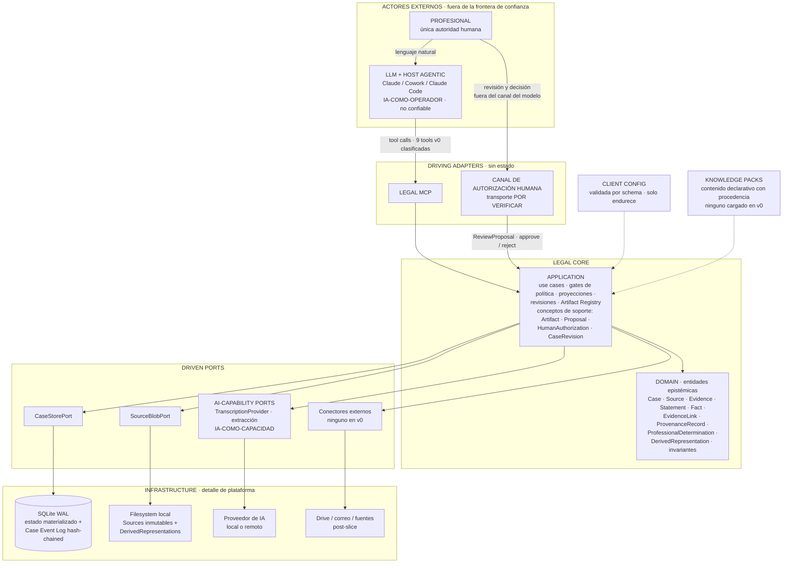

# Fronteras del sistema — Legal Workspace / Legal OS

## Estado y propósito

**Accepted.** Este documento fija **dónde están las fronteras** del sistema y qué vive a cada lado: quién puede invocar, quién puede mutar, qué es contrato y qué es detalle sustituible. Es la contraparte estructural de `principles.md`: los principios dicen qué debe cumplirse; este documento dice dónde se cumple.

Regla transversal de la consolidación, aplicable a cada sección: se distingue siempre la **decisión de arquitectura** (regla del sistema, independiente de toda plataforma) del **detalle de implementación de plataforma** (con qué se materializa en un host o motor concreto). **Ninguna feature de Cowork, de Claude Code, del protocolo MCP o de SQLite se convierte en regla del Domain.**

La corrección estructural que este documento hereda de la revisión v0.1.1: **Ports no es una capa**. Son interfaces que Application declara en dos familias — *driving ports* (los use cases invocables desde fuera, que son exactamente lo que la superficie MCP expone) y *driven ports* (las dependencias hacia fuera). El diagrama lineal `DOMAIN → APPLICATION → PORTS → ADAPTERS` del documento maestro (§8) queda sustituido por la disposición hexagonal que recoge §9, *Los dos roles de la IA*.

---

## 1. External Actors

Fuera de la frontera de confianza del Legal Core existen exactamente dos clases de actor.

**La profesional.** Es la usuaria y la **única fuente de autoridad humana** del sistema. Opera el producto en lenguaje natural a través del host conversacional y, por un canal distinto, revisa y decide sobre lo sensible. En el slice v0 hay **una usuaria** y el contexto es **A (rol `LITIGANT`)** exclusivamente; el schema, sin embargo, lleva el `Principal` completo (`principal_id`, `principal_type`, `principal_role`) desde el inicio, precisamente para que la existencia de una sola usuaria hoy no se codifique como supuesto.

**El LLM y el host agentic.** Claude, y cualquier host que lo aloje (Claude Code, Cowork u otro), son **operador externo no confiable** (ADR-001). Pueden interpretar intención, leer proyecciones y fragmentos, razonar, proponer y solicitar operaciones; no tienen autoridad directa sobre el estado canónico. "No confiable" no es un juicio sobre el modelo: es la categoría correcta para un invocador no determinista que puede ignorar instrucciones, llamar tools en orden inesperado, reintentar, enviar parámetros inconsistentes o fabricar identificadores plausibles. La analogía normativa es que **el LLM es al MCP lo que un usuario es a una UI**.

Nota de alcance: los proveedores externos (almacenamiento, transcripción, correo, fuentes jurídicas) **no son actores** de esta arquitectura. No originan intenciones: son sistemas que el Core consume por driven ports (§5). Confundir ambas categorías es el error que §9 previene.

---

## 2. Driving Adapters

Un driving adapter traduce una solicitud externa en una invocación de use case. Son **sin estado** y no contienen lógica de dominio; su validación es sintáctica y de forma, mientras la validación autoritativa (semántica) ocurre en Application y Domain — duplicación deliberada, defensa en profundidad.

### 2.1 Legal MCP — adapter del operador

Superficie cerrada y clasificada de **ocho tools v0** (**ENMIENDA AC-03 aprobada** (supersede §16.14: `register_artifact` retirado por ser consecuencia necesaria de `propose_facts`)) (kernel §4; **kernel §16.3: supersede de la superficie de 10 tools de v0.1.1** — `verify_legal_source` sale del slice). La clase es parte del contrato, no documentación:

| Tool | Clase |
|---|---|
| `open_case` | QUERY |
| `get_case_context` | QUERY |
| `search_case` | QUERY |
| `get_evidence_fragment` | QUERY |
| `create_case` | COMMAND |
| `ingest_evidence` | COMMAND |
| `register_artifact` | COMMAND |
| `propose_facts` | PROPOSAL |
| `commit_reviewed_facts` | SENSITIVE_COMMAND |

- La clase **`ADMIN` está vacía por diseño**: migraciones, gestión de Knowledge Packs y reparación existen solo en el runtime/CLI del producto, nunca como tools expuestas al modelo. Se documenta como **decisión**, no como omisión, y su cuenta en cero es un canario verificable contra la erosión de la superficie.
- `verify_legal_source` queda **fuera del slice** (decisión de los dueños).
- Toda respuesta incluye `case_id` y `case_revision`; los errores son códigos semánticos estables más condición tipada.
- Toda tool COMMAND/SENSITIVE_COMMAND acepta `expected_revision`.

### 2.2 Canal de autorización humana — segundo driving adapter

**Señalamiento explícito:** la revisión humana **entra al sistema por un driving adapter distinto del modelo**. No es una variante de la superficie MCP ni un parámetro de una tool: es una segunda puerta de entrada a Application, y esa separación es precisamente lo que hace no falsificable la autoridad humana. Si la aprobación entrara por el mismo canal que el operador no confiable, sería un dato que el modelo produce.

- **Use case invocado:** `ReviewProposal` con decisión `approve` o `reject` (y, si los dueños confirman `authorized_items[]`, aprobación parcial). Con `approve` crea la **HumanAuthorization**; con `reject` marca la Proposal como `REJECTED`.
- **Decisión de arquitectura:** el canal existe, es distinto del canal del modelo, y la autorización que produce es un **registro server-side del Core** — no un token portador que viaje por el contexto del modelo (ADR-005).
- **Detalle de implementación de plataforma — DECISIÓN PENDIENTE (spike).** Candidatos: MCP elicitation en **modo URL**, UI local mínima del producto, o CLI del runtime. **HECHO VERIFICADO** (kernel §1; fuente: spec MCP, versiones 2025-06-18 y 2025-11-25): elicitation existe desde la spec 2025-06-18; el **modo form NO garantiza respuesta humana** (los controles de aprobación son solo SHOULD), por lo que no basta como canal de autorización; el **modo URL** (desde 2025-11-25) sí impone MUSTs fuertes — consentimiento explícito, URL visible antes de abrir, apertura en una superficie que ni el cliente ni el LLM pueden inspeccionar. **POR VERIFICAR:** soporte de elicitation, y de su modo URL, en el host concreto. Cualquiera de los tres transportes termina invocando el mismo `ReviewProposal` y produciendo el mismo registro: el Domain no se acopla a ninguno.

---

## 3. Application

Application es el guardián de la frontera: se diseña para un invocador **hostil por defecto** (validación total, idempotencia, errores explícitos). Cinco responsabilidades.

**Use cases.** Uno por operación con significado de negocio: `OpenCase`, `CreateCase`, `IngestEvidence`, `GetCaseContext`, `SearchCase`, `GetEvidenceFragment`, `RegisterArtifact`, `ProposeFacts`, `ReviewProposal`, `CommitReviewedFacts`. Nueve son alcanzables desde la superficie MCP; `ReviewProposal` solo desde el canal humano.

Junto a ellos, la misma responsabilidad cubre los **use cases internos**, no alcanzables desde ningún driving adapter e invocados por el propio Core: `GenerateDerivedRepresentation`, disparado por `IngestEvidence`, asíncrono, que lleva la `DerivedRepresentation` por `PENDING → READY | FAILED` y emite `DerivedRepresentationGenerated` / `DerivedRepresentationFailed`. La **propagación de staleness** no es un use case aparte: es un **paso dentro de los mutadores** que alteran insumos de un Artifact registrado, y emite `ArtifactMarkedStale`. Que no sean invocables desde fuera no los exime de nada: producen eventos del Case Event Log como cualquier otra mutación.

Toda mutación commiteada pasa por un use case y queda registrada en el Case Event Log bajo la **biyección mutación↔evento** (addendum B.3, ADR-004 inv. 5): **mutación** = cambio de estado canónico registrado, **no** invocación de tool. Una sola invocación puede producir de 1 a n mutaciones —`IngestEvidence`, por ejemplo, emite `EvidenceIncorporated` y, si hay artifacts afectados, `ArtifactMarkedStale`— y por tanto de 1 a n eventos, avanzando `event_seq` en n (**ENMIENDA AC-02 aprobada**, supersede §16.16: la biyección se expresa sobre `event_seq`; `case_revision` es la subsecuencia que avanza solo en los eventos que mutan el estado epistémico canónico y es NULL en los demás). El invariante es que toda mutación produce exactamente un evento y todo evento corresponde a exactamente una mutación.

**Gates de política.** Punto único de aplicación del **Product Floor** (no relajable) y de la **Client Config** (que solo endurece), en los momentos que importan: commit y export. Una capacidad no disponible para el principal o vetada por política emite `OPERATION_NOT_PERMITTED {operation, policy_reason}`, con el motivo en términos de política y nunca de ingeniería.

**Proyecciones.** `get_case_context(scope, params?)` con scopes v0 `overview | facts | evidence | pending | changes_since(revision)`; `procedural` queda **RESERVADO** (documentado, no implementado: el slice no tiene lógica procesal). **Refinamiento a señalar** (kernel §8, no altera la intención aprobada): el scope `recent_changes` de la revisión v0.1.1 se renombra **`changes_since(revision)`**, porque un delta sin punto de referencia explícito no es computable de forma determinista. Envelope obligatorio `{case_id, case_revision, scope, params, content, omissions[{section, reason}], completeness: COMPLETE | TRUNCATED | PARTIAL, conditions[]}`; lo omitido va **siempre** declarado en `omissions[]`, nunca truncado en silencio. Las proyecciones son regenerables, deterministas respecto del estado y **jamás objetivo de escritura del modelo** (ADR-004).

**Revisiones.** `event_seq` monotónico por Case, que avanza en **todo** evento del Case Event Log; `case_revision` es una **subsecuencia** que avanza **solo** en los eventos que mutan el estado epistémico canónico y es **NULL** en los demás (**ENMIENDA AC-02 aprobada**, supersede §16.16: la identidad `seq == revision` queda superada). Concurrencia **optimista** sin locking pesimista: mismatch de `expected_revision` ⇒ rechazo del commit, Proposal preservada en `PRESERVED_FOR_RECONCILIATION` y condición `REVISION_CHANGED {expected, current, preserved_proposal_id}`. Nunca sobrescritura silenciosa, nunca descarte del trabajo.

**Artifact Registry.** Registro del trabajo ya realizado con `inputs[] {entity_id, content_hash}` —incluida la DerivedRepresentation exacta consumida—, `methodology_version`, `model_id`, `knowledge_pack_versions[]`, `status: DRAFT | REGISTERED | REVIEWED(by, at, at_revision) | SUPERSEDED` y `stale`. El estado `REVIEWED` **no es una marca desnuda**: porta quién revisó, cuándo y **contra qué revisión del expediente**, porque una revisión humana sin punto de anclaje no dice nada sobre qué se revisó. Dos campos son **AÑADIDOS en la consolidación** (kernel §10) sobre el esquema de los dueños, y se señalan como tales: `stale_reasons[]` —sin razón registrada, la condición `ANALYSIS_STALE` no puede explicarse a la profesional— y `supersedes_artifact_id?` —cadena simple, no DAG, para expresar "versión anterior" sin diseñar aún dependencias entre artifacts—. El cálculo de staleness es determinista y del Core; `ANALYSIS_STALE {reasons[]}` con `reasons ∈ NEW_EVIDENCE, INPUT_SUPERSEDED, METHODOLOGY_CHANGED`.

---

## 4. Domain

El vocabulario canónico de la consolidación tiene trece términos (kernel §2), pero **no todos viven en el mismo plano**. La separación es normativa (addendum B.4; manda el glosario) y corrige la redacción anterior de este documento, que situaba los cuatro términos de soporte dentro del Domain:

| Plano | Términos |
|---|---|
| **Domain** — entidades epistémicas (ADR-003) | `Case`, `Source`, `Evidence`, `Statement`, `Fact`, `EvidenceLink`, `ProvenanceRecord`, `ProfessionalDetermination`, `DerivedRepresentation` |
| **Application** — conceptos de soporte (§3) | `Artifact`, `Proposal`, `HumanAuthorization`, `CaseRevision` |

Razón de la separación: los cuatro términos de Application **no son proposiciones sobre el mundo jurídico ni portan estatus epistémico**. Son mecanismos de trabajo (`Artifact`), de propuesta pendiente de revisión (`Proposal`), de autorización (`HumanAuthorization`) y de control de concurrencia (`CaseRevision`). `CaseRevision` es propiedad observable del Case, pero su administración —incremento, comparación, resolución de conflicto— es lógica de Application. Los cuatro se contratan del lado de Application: `Artifact`, `Proposal` y `CaseRevision` en §3; `HumanAuthorization` en §2.2 y ADR-005. No aquí.

Invariantes estructurales que viven en el Domain:

- **Source ≠ Evidence.** Source es el material original incorporado (bytes preservados, hash SHA-256, provenance, metadata); Evidence es el **rol probatorio** de ese Source dentro de un Case. *(Renombre respecto de v0.1.1: "Document/original" → **Source**, cambio de nombre sin cambio de semántica.)*
- **DerivedRepresentation nunca sustituye a su Source**; lleva versión, hash, receta (herramienta + versión), referencia obligatoria al Source y estado `PENDING | READY | FAILED`.
- **Statement inmutable tras extracción**, anclado a un fragmento verificable del original (página / offsets / rango de timestamps); corrección = anulación + nuevo registro. **HECHO VERIFICADO** (kernel §1; fuente: W3C Web Annotation Data Model, Recomendación W3C de 23-feb-2017): existen `TextQuoteSelector` (§4.2.4), `TextPositionSelector` (§4.2.5) y composición vía `refinedBy` (§4.2.9) como modelo estándar de anclaje — referencia conceptual disponible; su adopción concreta es detalle de implementación.
- **EvidenceLink** N:M `Fact ↔ fragmento de Evidence`, con polaridad `SUPPORTS | CONTRADICTS | CONTEXTUALIZES` (**enum cerrado en v0**), actor creador, justificación y estado `ACTIVE | RETIRED`.
- **ProvenanceRecord obligatorio** en toda entidad epistémica, con `provenance_kind ∈ EXTERNAL_SOURCE | AI_DERIVATION | AI_INFERENCE | HUMAN_DECISION | SYSTEM`, más el `Principal` que ejecutó la operación (`principal_id`, `principal_type ∈ HUMAN | AI | SYSTEM`, `principal_role`). (Normalización v0.4: `Principal` responde *quién ejecutó*; `provenance_kind`, *cuál es la naturaleza epistemológica del origen*. Ver `docs/architecture/notes/normalizacion-principal-provenance-v0_4.md`.)
- **Ciclo de vida del Fact — REFINAMIENTO A SEÑALAR** (no altera la intención aprobada): la lista aprobada mezclaba estados almacenados con estados derivados, y aquí se separan. **Transiciones almacenadas** (`status_history` append-only, cada entrada con ProvenanceRecord): `PROPOSED → ALLEGED → DETERMINED`, con `WITHDRAWN` posible desde `ALLEGED`/`DETERMINED` como evento nuevo, nunca borrado. **Estados derivados**, computados desde los EvidenceLinks `ACTIVE` de polaridad probatoria (`SUPPORTS` / `CONTRADICTS`) y **nunca almacenados como status**: `SUPPORTED | CONTRADICTED | UNSUPPORTED`. Precisión de la consolidación (addendum v0.3 B.14): los links `CONTEXTUALIZES` **no alteran el estado derivado** — aportan contexto, no soporte ni contradicción —, de modo que `UNSUPPORTED` significa *cero links de polaridad probatoria activos*, no *cero links activos*.
- **ProfessionalDetermination** habilita `DETERMINED` (kind v0 `ACCREDITED_BY_PROFESSIONAL`; `DECLARED_PROVEN` reservado para el contexto B), registra actor humano, motivación y los EvidenceLinks valorados **incluidos los `CONTRADICTS`**. Acreditar **no** desactiva links `CONTRADICTS`. **Sin productor en v0** (addendum v0.3 B.5): ninguna tool, use case ni evento de la lista cerrada produce `DETERMINED`, `ProfessionalDetermination` ni `FactWithdrawn`; `RecordProfessionalDetermination` y `WithdrawFact` quedan como use cases diferidos con nombre reservado. Lo descrito aquí es el modelo, no lo ejecutable en v0.
- **`Statement` no se materializa en v0** (addendum v0.3 B.7): la entidad permanece definida en el Domain, pero ningún use case v0 la crea; el anclaje probatorio del slice ocurre a nivel de `EvidenceLink → fragmento`. Se materializará con un extractor post-slice.
- **Regla dura:** actor `AI_*` no crea ni transiciona un Fact más allá de `PROPOSED`.

---

## 5. Driven Ports

Interfaces **semánticas** que Application declara hacia fuera. Un use case pide una capacidad; nunca nombra un proveedor.

| Port | Responsabilidad | Estado v0 |
|---|---|---|
| `CaseStorePort` | Persistencia del estado canónico materializado, Case Event Log, Artifact Registry, índices de búsqueda | Implementado |
| `SourceBlobPort` | Custodia de bytes: Sources inmutables y DerivedRepresentations versionadas, direccionadas por hash | Implementado |
| `TranscriptionProvider` y demás **AI-capability ports** (p. ej. extracción) | IA **como capacidad** del Core, con provenance `AI_DERIVATION` / `AI_INFERENCE` | Transcripción en el slice; **POR VERIFICAR**: proveedor concreto y sus capacidades de timestamps |
| Conectores externos (`DocumentProvider`, correo, calendario, `LegalSourceProvider`) | Material y fuentes de terceros | **Ninguno en v0** (solo Inbox local); el contrato se declara, no se implementa |

- El material que llega por un conector **no es evidencia** hasta pasar por `ingest_evidence` (ADR-006). El port entrega bytes; la incorporación los convierte en Source.
- Un fallo de adapter emite `INTEGRATION_ERROR {integration, effect_on_state}` afirmando **siempre** el efecto sobre el estado (v0: `NONE` — las operaciones externas del slice no dejan estado a medias visible).
- Sustituir un adapter no toca Domain ni Application: ese es el test del principio 11.

---

## 6. Infrastructure

Adapters concretos detrás de los driven ports. Todo lo de esta sección es **detalle de implementación de plataforma**, sustituible sin tocar contratos.

**Persistencia: SQLite + filesystem local.** **HECHO VERIFICADO** (kernel §1; fuente: sqlite.org): en modo **WAL** lectores y escritores corren concurrentemente con **un solo escritor a la vez**; **WAL no funciona sobre filesystems de red** — todos los procesos deben estar en la misma máquina —; hay corrupción documentada por locking defectuoso "especialmente en filesystems de red, NFS en particular"; el límite de tamaño es ≈281 TB; **FTS5** ofrece ranking bm25 y tokenizers `unicode61 / ascii / porter (inglés) / trigram`, **sin stemming español de serie**.

Consecuencia directa, enunciada en el plano que le corresponde: **mientras la persistencia sea SQLite en modo WAL, la co-localización de procesos es requisito de corrección _de ese adapter_, no del sistema**. La regla de dominio no habla de procesos ni de filesystems: dice que **el estado canónico y la evidencia viven bajo control exclusivo del Core, con custodia local** (`principles.md`); sustituir SQLite por otro motor cambiaría la restricción de co-localización sin tocar esa regla. Además, el slice fija **una máquina** como parámetro aprobado (kernel §11), de modo que en v0 la restricción del adapter no está siquiera tensionada. Segunda consecuencia: la calidad de búsqueda en español es un punto a resolver explícitamente (`SEARCH_INCONCLUSIVE` existe justamente para no disfrazar un fallo de búsqueda como ausencia de prueba).

**Blobs.** Sources inmutables y DerivedRepresentations versionadas en filesystem local dentro del `LEGAL OS PRIVATE STATE`, direccionadas por hash SHA-256.

**Hash-chain del Case Event Log.** Cada evento porta `prev_hash` y `hash`: append-only y **tamper-evident**. Límite declarado, no promesa del Domain: **no es tamper-proof** frente a un local hostil con control total de la máquina. El anclaje periódico del hash-cabeza fuera del workspace mitigaría y es **DECISIÓN PENDIENTE** (ADR-004).

**Manifest de integridad.** Hashes del producto sellado, verificados al arranque (§10).

**Perímetro frente al host — detalle de plataforma.** **HECHO VERIFICADO** (kernel §1; fuente: code.claude.com/docs — permissions, hooks, subagents, sandboxing): Claude Code ofrece permisos deny/ask/allow por herramienta y por ruta, hooks `PreToolUse` bloqueantes (exit code 2) y subagentes con allowlist/denylist de tools; **el sandbox de Bash de Claude Code no es nativo en Windows**. **CONTEXTO DEL PROYECTO (SUPUESTO):** el equipo objetivo es Windows; la edición concreta y la disponibilidad de cifrado de disco quedan **POR VERIFICAR**. Lo primero es una propiedad verificada de la plataforma; lo segundo, una circunstancia del despliegue aún no levantada: son afirmaciones de estatus distinto y se registran por separado. **HECHO VERIFICADO** (kernel §1; fuente: claude.com/product/cowork; support.claude.com art. 13345190 y 15520349): Cowork usa la misma arquitectura agentic que Claude Code sin terminal, con conectores MCP en modos de aprobación Manual/Auto/Skip, plugins que empaquetan skills/connectors/sub-agents, y acceso directo a archivos locales en Desktop. **POR VERIFICAR:** granularidad de permisos de Cowork (deny por ruta, hooks, superficie por subagente) y garantías de sandbox/VM sobre carpetas locales. **RIESGO:** si el host concede al modelo herramientas genéricas de filesystem junto al MCP legal, la frontera sería decorativa en esa capa; mitigación independiente del host: la separación Workspace/Private State (ADR-002) y la validación autoritativa en Application. Alternativa de enforcement disponible en cualquier host: el Core como **proceso separado** con permisos de sistema operativo propios.

---

## 7. Configuration

**Client Config validada por schema.** Contiene organización, oficinas, jurisdicción, áreas de práctica, preferencias, plantillas, conectores habilitados, fuentes autorizadas y políticas del tipo `require_*`. Regla dura: una configuración inválida se **rechaza de forma visible**; nunca se degrada silenciosamente a defaults, porque un default silencioso convierte un error de configuración en una política tácita. Y la configuración **solo endurece**: no puede relajar ninguna de las cinco políticas del Product Floor (`principles.md`, anexo).

**Roles por Case / contexto activo — DECISIÓN APROBADA** (dueños, addendum Anexo B.5, §13 del prompt de consolidación: *"El rol NO pertenece a la organización de manera fija. Debe poder resolverse por Case o por active working context."*). El rol **no es un atributo fijo de la organización**: se resuelve **por Case o por contexto de trabajo activo**, con un default por oficina. La decisión no altera la intención aprobada (que el rol cambie el comportamiento sin duplicar el sistema); fija dónde se ancla el dato.

**NO LEVANTADO / POR VERIFICAR — el trabajo real del contexto B.** El contexto B (autoridad/decisor) **no ha sido levantado**: no hay descripción validada de su flujo de trabajo, sus gates ni su vocabulario. Que la primera usuaria opere **ambos** contextos es **SUPUESTO**, no hecho verificado, y queda **POR VERIFICAR** con la profesional; este documento no lo afirma como fundamento. El anclaje del rol por Case/contexto activo se sostiene por sí solo —es la forma correcta de modelar el dato aunque hoy se ejercitara un único contexto—, de modo que la decisión no depende de esa verificación.

El rol se resuelve en tres planos, de menor a mayor garantía:

1. **Metodológico** — variantes pequeñas y versionadas de skill donde el método realmente difiere.
2. **De validación** — el rol selecciona el conjunto de gates de commit/export aplicables. Es la garantía dura, implementable con independencia de la plataforma.
3. **De superficie** — el perfil condiciona qué tools se exponen; lo no expuesto no requiere prohibición.

En el slice v0 solo se ejercita el contexto A (`LITIGANT`).

---

## 8. Knowledge Packs — contrato v0

**Nombre canónico único: `Knowledge Pack`.** La redacción anterior de este documento introducía "Content Pack" como renombre canónico, mientras el resto del corpus —y el campo `knowledge_pack_versions[]` del Artifact Registry— usaba "Knowledge Pack". Se unifica: **"Content Pack" → "Knowledge Pack"**, registrado como **supersede §16.8** (cambio de nombre, no de semántica).

Hallazgo central que este contrato materializa: bajo ese único nombre convivían **tres naturalezas que exigen tres mecanismos distintos**. Separarlas es la decisión; construir el contenido, no. La distinción se conserva **en prosa**, sin multiplicar nombres canónicos: **un Knowledge Pack contiene únicamente contenido declarativo con procedencia; las reglas ejecutables viven en el producto sellado; y la configuración de cliente es un tercer artefacto, con su propio ciclo y su propia autoridad.**

| | Qué es | Dónde vive | Quién lo cambia |
|---|---|---|---|
| **Knowledge Pack** | Datos declarativos con procedencia obligatoria (jerarquía de fuentes, reglas de citación, catálogos de procedimientos) | Contenido versionable, ciclo editorial | Curador responsable, mutación controlada |
| **Executable Rule** | Validaciones e invariantes ejecutables | **Producto sellado** | Release del producto |
| **Client Config** | Preferencias y políticas de la firma, validadas por schema | Configuración | Cliente, de forma controlada, y **solo endureciendo** |

**Regla:** las reglas ejecutables **jamás viajan dentro de un pack**. Si las tres naturalezas viajan juntas, las validaciones críticas se vuelven datos editables — el corolario directo del principio 3.

**Manifest conceptual del pack (contrato v0):**

```text
KnowledgePack manifest
  id
  version                       ← semver
  dimensions
    jurisdiction
    practice_area
    procedure_type
    applicable_roles[]
  provenance                    ← OBLIGATORIA
    source                      ← de dónde proviene el contenido
    validity_cutoff_date        ← fecha de corte de vigencia del contenido
    curator                     ← curador humano responsable
  checksum
  changelog[]                   ← entradas tipadas: CORRECTIVE | ADDITIVE | FORMAL
```

- **La unidad es el pack con manifest de dimensiones, no la carpeta.** Un procedimiento es función de jurisdicción × materia × nivel territorial × rol; codificar la partición como anidamiento de carpetas obliga a un orden que siempre será incorrecto para algún caso. La carpeta `CO/` es convención humana, no mecanismo. Las **reglas de precedencia** para componer packs aplicables son **DECISIÓN PENDIENTE**: se diseñarán con el primer conflicto real, no en abstracto.
- **Procedencia obligatoria — la razón de fondo:** la jerarquía de fuentes de un pack es en sí misma una afirmación jurídica. Un sistema que desconfía del modelo pero confía ciegamente en un archivo anónimo no ha resuelto el problema; lo ha movido de lugar.
- **Changelog tipado** — el criterio "última versión gana" es incorrecto en este dominio. `CORRECTIVE` (el contenido anterior estaba mal) ⇒ invalidación fuerte: los artifacts que dependen del pack requieren revisión. `ADDITIVE` (contenido nuevo, p. ej. jurisprudencia posterior) ⇒ aviso suave que la profesional decide atender. `FORMAL` (cambio de citación o presentación) ⇒ afecta solo el render futuro. **POR VERIFICAR:** el tratamiento concreto de la **vigencia temporal** en Colombia — un artifact producido bajo la norma vigente en su momento procesal puede seguir siendo correcto para ese momento —, a validar con la profesional.
- **Trazabilidad desde el primer artifact:** el Artifact Registry lleva `knowledge_pack_versions[]`. Está **vacío en el slice** (ningún pack cargado) y es **obligatorio en cuanto un artifact dependa de un pack**; sin él, la cadena de provenance tiene un eslabón invisible.
- **Alcance v0 explícito:** en v0 **no se construye el pack de Colombia**. Se construye el **contrato**. El slice no ejercita conocimiento jurídico (kernel §11), y adelantar contenido normativo sin curador ni fecha de corte sería precisamente lo que este contrato prohíbe.

---

## 9. Los dos roles de la IA

Esta es la sección que impide el error más costoso de la arquitectura: **el mismo proveedor aparece dos veces, en lados opuestos de la frontera, con estatus de confianza distinto.**

### 9.1 IA-como-operador — `LLM → MCP → Application`

El modelo **origina intenciones**: decide qué invocar y con qué contenido. Está **fuera** de la frontera de confianza y entra por el driving adapter. No es un componente ni un adapter — un adapter traduce y no tiene intención propia; el LLM sí la tiene. Su estatus es el de un cliente externo no confiable, y por eso Application valida todo lo que recibe de él, sin excepción.

### 9.2 IA-como-capacidad — `Application → AI Port → Provider`

Cuando el Core necesita transcribir un audio o extraer texto, **el Core es quien llama** y el proveedor de IA es una dependencia detrás de un driven port. Aquí la IA no decide nada: ejecuta una capacidad solicitada, su salida es un `DerivedRepresentation` o el **insumo** de una `Proposal` —nunca un hecho consumado, y nunca una transición del Fact— y queda registrada con provenance `AI_DERIVATION` o `AI_INFERENCE` y `model_id`.

### 9.3 Advertencia: no mezclarlos

| | IA-como-operador | IA-como-capacidad |
|---|---|---|
| Dirección de la llamada | LLM llama al Core | El Core llama al proveedor |
| Posición | Fuera de la frontera | Detrás de un driven port |
| Estatus | No confiable, validado en su totalidad | Dependencia sustituible, con salida registrada |
| Origina intención | Sí | No |
| Techo epistémico | `PROPOSED` | No transiciona Facts; produce `DerivedRepresentation` o insumo de `Proposal` |

**El riesgo de confundirlos es acoplamiento por la puerta de atrás.** Si se trata al operador como componente interno, se lo vuelve confiable por definición — y el LLM no puede serlo. Si se trata la capacidad como parte del operador, el Domain acaba dependiendo de un proveedor concreto y la vendor independence se pierde sin que nadie haya tomado esa decisión. Ambos roles comparten un solo límite común, y conviene enunciarlo aparte: **por ninguna de las dos vías alcanza la IA una transición epistémica más allá de `PROPOSED`** — el operador porque su techo es exactamente `PROPOSED`, y la capacidad porque no transiciona Facts en absoluto: entrega derivados e insumos que otro use case, con autoridad humana, convierte o no en estado.

### 9.4 Mapa de capas



---

## 10. Ciclos de vida y mínimo de release v0

La estructura de carpetas es consecuencia, no diseño. La frontera correcta es por **ciclo de vida y política de mutación**, y son tres, distintos entre sí:

| Ciclo | Contenido | Régimen de mutación |
|---|---|---|
| **Runtime** | Core, MCP, use cases, invariantes, reglas ejecutables, skills críticos | **Release sellado**: cambia solo por release, con manifest |
| **Configuration** | Client Config, Knowledge Packs | **Mutación controlada**: validada por schema, con procedencia y versión |
| **Workspace + Private State** | `Inbox/`, `Exports/`, `Working/`; case databases, Sources, derivados, event log, artifact registry, índices, integrity metadata | **Operativo**: muta a diario, y el private state **solo vía Core** |

**Mínimo de release v0 (kernel §13) — la lista completa, y nada más:**

1. **Product version** (semver) del producto sellado.
2. **Schema version** del workspace.
3. **Manifest** con hashes del producto sellado.
4. **Verificación de integridad al arranque** contra ese manifest.
5. **Migraciones numeradas solo-adelante** (sin down-migrations).
6. **Backup verificado antes de cada migración** — verificado, no solo escrito.
7. **Degradación a solo-lectura ante fallo de integridad**: el sistema no continúa como si nada; deja de escribir y lo dice.

**Explícitamente fuera de v0** (decisión, no olvido): **sin auto-update, sin firma de código, sin telemetría, sin canales de release**. Cada uno tiene costo y ninguno tiene trigger en el alcance actual (una usuaria, una máquina); introducirlos sin necesidad contradice el principio 14. El objetivo realista se enuncia sin adornos: el producto detecta modificaciones y protege al usuario de romperlo accidentalmente; **no existe inmutabilidad absoluta frente a un usuario deliberadamente hostil con control total del equipo**, y el documento no promete lo contrario.

### Nota — estado consolidado de Skills y Agents (kernel §15)

- **Skills conservados** como metodología: `intake-structuring`, `fact-builder`, `hearing-analysis`, `contradiction-analysis`, `legal-issue-spotting`, `legal-research`, `legal-drafting`, `adversarial-review`. **No todos en v0**: el slice ejercita únicamente `fact-builder`.
- **Movidos fuera de Skills**, por ser lógica determinista o estado: `chronology-builder` → proyección determinista de Application; `citation-verification` → Core/Adapter; `procedural-state` → Domain/Application; `final-quality-review` → gates del Core + `adversarial-review`.
- **Agents: cero subagentes en el slice** (DECISIÓN APROBADA). El **Legal Auditor** es una posibilidad futura condicionada a evals; no es requerimiento de v1.
- **HECHO VERIFICADO** (kernel §1; fuente: code.claude.com/docs/en/skills.md): los Skills de Claude Code **no tienen versionado propio** (solo los plugins que los contienen). Por eso `methodology_version` es **metadato que el producto construye y gestiona**, no una capacidad de plataforma.
- **Regla de ubicación de la lógica:** si el sistema deja de ser seguro porque el modelo ignoró un `SKILL.md`, hay lógica crítica en el lugar equivocado.

---

## Preguntas abiertas

- **DECISIÓN PENDIENTE — Transporte/UI del canal de autorización humana** (spike: MCP elicitation modo URL / UI local mínima / CLI). **POR VERIFICAR:** soporte de elicitation y de su modo URL en el host concreto.
- **POR VERIFICAR — Granularidad de permisos y garantías de sandbox/filesystem de Cowork Desktop**, condición para adoptarlo como host sin perímetro adicional.
- **DECISIÓN PENDIENTE — Mecanismo concreto de enforcement del perímetro en Windows** (deny rules + hooks, verificados en Claude Code, frente a Core como proceso separado con permisos de SO propios).
- **DECISIÓN PENDIENTE — Reglas de precedencia para componer Knowledge Packs aplicables** a un asunto (jurisdicción × materia × procedimiento × rol); a diseñar con el primer conflicto real.
- **POR VERIFICAR — Tratamiento de la vigencia temporal del contenido jurídico en Colombia** (si un artifact producido bajo la norma vigente en su momento procesal sigue siendo correcto para ese momento), a validar con la profesional.
- **POR VERIFICAR — Calidad de búsqueda en español** dado que FTS5 no trae stemming español de serie (**HECHO VERIFICADO**, kernel §1; fuente: sqlite.org); afecta la calibración de `SEARCH_INCONCLUSIVE`.
- **POR VERIFICAR — Proveedor de transcripción** y sus capacidades de timestamps (adapter detrás del AI-capability port).
- **DECISIÓN PENDIENTE — Deduplicación física de Sources entre Cases** (v0: copia por caso es aceptable).
- **DECISIÓN PENDIENTE — Lenguaje/runtime de implementación del Core**: no decidido por los dueños; bloqueante para código, no para estos documentos.
- **DECISIÓN PENDIENTE (dueños) — Aprobación parcial de propuestas** (`authorized_items[]` en HumanAuthorization): propuesta en el contrato, pendiente de confirmación.

Pendientes vivos que este documento hereda de los ADRs que lo fundamentan, y que aquí se listan para que no queden solo en ellos:

- **DECISIÓN PENDIENTE (ADR-004) — Destino de anclaje periódico del hash-cabeza del Case Event Log** fuera del workspace. Sin él, la cadena es *tamper-evident* pero no *tamper-proof* frente a un local hostil con control total del equipo (§6).
- **DECISIÓN PENDIENTE (ADR-004) — Valores concretos del presupuesto de tamaño por scope** de `get_case_context`: son política del producto, no prompt, y se calibran con casos reales de la usuaria. Lo que no está pendiente es la regla: lo omitido siempre se declara en `omissions[]` y `completeness` lo refleja.
- **DECISIÓN PENDIENTE (ADR-004) — Política de retención y poda del Tool Invocation Log** (horizonte y criterio). La poda no puede afectar al estado canónico ni a la verificación de la hash-chain: el log operacional es podable justamente porque no es fuente de reconstrucción.
- **DECISIÓN PENDIENTE (ADR-006, post-slice) — Mecánica de incorporación desde conectores**: si el material transita por `Inbox/` (el conector deposita, el Core ingiere) o el Core lo obtiene vía adapter detrás de `ingest_evidence`. La frontera de §5 es invariante ante ambas; **POR VERIFICAR** el sobre de metadata por tipo de origen, que depende de lo que exponga cada conector.
- **DECISIÓN PENDIENTE (ADR-006) — Código para el rechazo de la frontera de incorporación**: ninguna de las 7 condiciones v0 corresponde a "referencia a material no incorporado", y `OPERATION_NOT_PERMITTED` no cubre el caso (addendum B.6). En v0 el rechazo viaja como error semántico estable; queda por decidir si merece condición UX propia.
- **Pregunta a dueños (ADR-006) — Señal de origen para hechos "solo alegado"** inspirados en material externo explorado: si basta la marca actual o requiere señal adicional. Añadirla sería cambio de contrato de `propose_facts`.

## Relaciones con los ADRs

- **ADR-001** — frontera de confianza; fundamenta §1, §2.1 y §9.
- **ADR-002** — Workspace / Private State y camino único de acceso; fundamenta §6 y §10.
- **ADR-003** — modelo epistémico y estados del Fact; fundamenta §4.
- **ADR-004** — estado canónico y proyecciones derivadas; fundamenta §3.
- **ADR-005** — autoridad humana; fundamenta §2.2.
- **ADR-006** — frontera de incorporación; fundamenta §5 y el alcance de los conectores.
