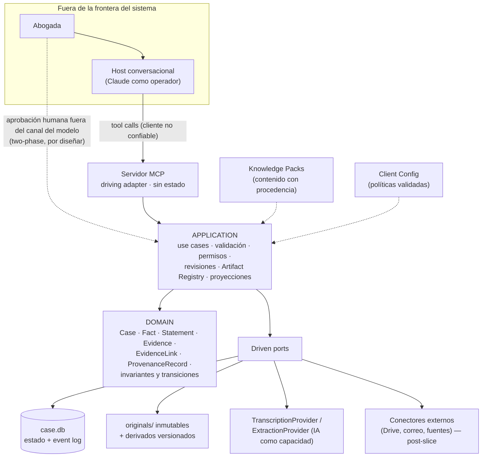

# Revisión arquitectónica crítica — Legal Workspace / Legal OS (v0.1)

**Fecha:** 2026-08-24 · **Insumo:** `legal_workspace_prompt_maestro_v0_1.md` · **Estado:** revisión de descubrimiento; nada de lo aquí propuesto es definitivo.

**Método y disciplina de veracidad.** Esta revisión se produjo con diez análisis independientes por dimensión (dominio, memoria, provenance, arquitectura, MCP, skills/agents, integraciones, releases/seguridad, UX, knowledge/configuración), una verificación de capacidades de plataforma contra documentación oficial de Anthropic (URLs en la sección H) y una pasada de crítica cruzada de contradicciones, cobertura y veracidad. Etiquetas usadas: **HECHO VERIFICADO** (verificado con fuente en esta iniciativa), **HIPÓTESIS**, **SUPUESTO**, **POR VERIFICAR**, **NO TENEMOS INFORMACIÓN SUFICIENTE**, **RIESGO**, **DECISIÓN PENDIENTE**. Las afirmaciones consistentes con documentación conocida pero no verificadas en esta iniciativa se marcan **POR CONFIRMAR** — no se promueven a hecho.

Un resultado transversal antes de empezar: **HECHO VERIFICADO** — de la documentación pública de Anthropic revisada, Claude Code y el Agent SDK tienen capacidades documentadas y suficientes para el enforcement que este diseño necesita (permisos deny/allow por herramienta y por ruta, hooks bloqueantes, subagentes con superficies de tools restringibles). **Cowork está verificado como host candidato** (segunda pasada, v0.1.1): la documentación oficial confirma que usa "la misma arquitectura agentic que Claude Code, sin terminal", y que soporta conectores MCP con modos de aprobación, skills, plugins y acceso a archivos locales en Desktop (macOS/Windows, planes de pago) — fuentes en la Adenda final. Sigue **POR VERIFICAR** lo que más importa a este diseño: si Cowork ofrece permisos de granularidad fina (deny por ruta, hooks bloqueantes, superficies por subagente) equivalentes a los documentados para Claude Code; hasta entonces, el documento maestro no debe asumirlo como host dado (§7).

---

## A. Evaluación ejecutiva

1. **SÓLIDO — El modelo epistemológico (§15) y el régimen original/derivado (§6, §19).** Es el corazón correcto del sistema: distinguir afirmación / evidencia / hecho candidato / hecho acreditado ataca directamente el riesgo más grave del dominio (confundir alegado con acreditado), y hacerlo por arquitectura y no por prompt es la decisión que separa este producto de un chatbot jurídico. Condición: las entidades de §8 deben **derivarse** de §15; hoy son dos vocabularios paralelos sin mapeo.

2. **SÓLIDO — "No prohibir una operación solamente mediante un prompt" (§12) y el MCP semántico delgado.** Es el principio de seguridad rector, y es implementable con capacidades verificadas de la plataforma. Su corolario, que el documento no extrae: tampoco se puede **autorizar** solamente mediante el modelo (ver punto 9).

3. **SÓLIDO (condicionado) — SQLite + filesystem, sin búsqueda vectorial, monolito modular.** Adecuado bajo topología una-máquina-una-usuaria, con veto explícito a carpetas de red y trigger medible para introducir vectorial después. La condición (topología real) es hoy la primera pregunta bloqueante a ustedes.

4. **REFINAR — `case.db` fuente de verdad + `memory.md` proyección (§13).** La dirección es correcta; el contrato no existe. Un `memory.md` monolítico no escala con la vida del caso y mezcla tres audiencias distintas. Propuesta: proyecciones tipadas por alcance servidas por el Core, un índice pequeño para el modelo y una "carátula" separada para la abogada (detalle en E).

5. **REFINAR — El diagrama `DOMAIN → APPLICATION → PORTS → ADAPTERS` (§8).** Ports no es una capa: son interfaces en dos direcciones (entrantes/salientes) y el documento solo lista las salientes. La omisión mayor: **el LLM no está ubicado en la arquitectura**. Nuestra posición: es un cliente externo no confiable que opera el sistema vía el adapter de entrada (MCP) — la decisión arquitectónica número uno, hoy ausente (detalle en B).

6. **REFINAR — La taxonomía de 13 skills y 5 agents (§21–22).** Al menos 4 de los 13 "skills" son lógica determinista o proyecciones de estado que deben ser use cases del Core (citation-verification, procedural-state, chronology-builder, final-quality-review). De los 5 agents, solo el Legal Auditor supera los criterios que el propio §22 fija. El slice correcto lleva 6–8 skills y **cero subagentes** (detalle en G).

7. **REFINAR — Knowledge Packs y configuración (§23–24).** La doble taxonomía de §23 (por territorio y por tipo) no tiene regla de composición; los packs mezclan tres naturalezas (contenido, reglas ejecutables, configuración de firma) que exigen mecanismos distintos; y `role` anclado a organización **contradice al primer usuario**, que opera ambos contextos — debe resolverse por asunto/perfil (detalle en C.6).

8. **RIESGO — Enforcement frente al host del agente.** Si el host concede a Claude herramientas genéricas de filesystem/shell junto al MCP legal, todo el diseño de capacidades es decorativo: el agente puede escribir `case.db` directamente. **HECHO VERIFICADO:** Claude Code ofrece reglas deny por herramienta y por ruta, y hooks `PreToolUse` bloqueantes; el sandbox de Bash **no existe en Windows nativo** — y el entorno real del proyecto es Windows 11 Home. El mecanismo concreto de perímetro debe decidirse antes de diseñar el slice (detalle en H e I).

9. **RIESGO — Aprobación humana de commits sensibles.** Un parámetro booleano "el humano revisó" que rellena el modelo es falsificable por construcción. El diseño objetivo es two-phase: propuesta → aprobación humana **fuera del canal del modelo** que emite un token de un solo uso → commit. Cualquier atajo del slice debe declararse deuda explícita, no diseño. Es el punto de mayor peligro de falsa confianza de toda la superficie.

10. **RIESGO — Estatus epistémico como campo mutable y "controvertido" ambiguo.** Si `status` es un campo que se pisa, la trazabilidad de §16 es irrealizable: debe ser historia append-only de transiciones tipadas por actor. Y "controvertido" colapsa dos cosas jurídicamente distintas (contradicho por evidencia vs controvertido procesalmente); el modelo debe soportar ambas sin fusionarlas.

11. **RIESGO — Legal Auditor como segunda pasada del mismo modelo.** Dos pasadas del mismo modelo no son revisores independientes: comparten sesgos y el error típico del generador (texto plausible sin soporte) es invisible a una lectura de plausibilidad. Sin cotejo contra el registro de provenance, salida tipada con carga de la prueba por id y evals de recall, el auditor produce un sello de calidad sobre contenido no verificado — exactamente lo que §28 prohíbe. Con ese diseño, sí agrega evidencia (detalle en G).

12. **PREMATURO — Conectores externos en el slice; subagentes en v1; plataforma de distribución (auto-update, firma de código, telemetría); máquina de estados epistémicos configurable; subdivisión jurisdiccional de CO; modelado a fondo de `Hypothesis`/`Argument`/`LegalIssue`.** Las 12 propiedades de §34 se validan con archivos locales, cero subagentes, instalación asistida y un vocabulario de estados fijo. Cada aplazamiento queda con camino de evolución declarado.

---

## B. Arquitectura que entiendes hasta ahora

No la declaramos definitiva; es la lectura corregida de lo que el documento describe, con la corrección estructural del punto A.5.

**La corrección central (responde §30.12).** La separación Domain → Application → Ports → Adapters es adecuada como intención e incorrecta como diagrama, por tres razones:

- **Ports no es una capa.** Son las interfaces que Application declara, en dos familias: *driving ports* (casos de uso invocables desde fuera: ingerir evidencia, proponer hechos) y *driven ports* (dependencias hacia fuera: `CaseRepository`, `TranscriptionProvider`). Todos los ejemplos de §8 son driven; los driving — que son exactamente el contrato que el MCP expone — no aparecen.
- **El LLM es un cliente externo no confiable, no un componente ni un "adapter".** El servidor MCP es el *driving adapter* que traduce tool calls en invocaciones a use cases. La analogía correcta: el LLM es al MCP lo que un usuario es a una UI — actor externo que opera el sistema desde fuera de su frontera. Consecuencia estructural: Application se diseña para un invocador no confiable en secuencia y contenido (validación total, idempotencia, errores explícitos), y la superficie MCP **es** el perímetro de gobernanza del agente. Esto convierte §12 en propiedad, no en aspiración.
- **El LLM aparece una segunda vez, en el lado opuesto.** Cuando el Core necesita capacidades de IA (transcripción, extracción), las consume vía driven ports. Son dos roles distintos del mismo proveedor; confundirlos acopla el dominio a Claude por la puerta de atrás.



**Tres universos por ciclo de vida, no por carpeta (§9, §26).** La estructura de §26 mezcla como carpetas hermanas tres cosas con ciclos de vida distintos: **código** (runtime, core, mcp, skills críticos — ciclo de release, sellado con manifest), **contenido versionable** (knowledge packs, configuración — ciclo editorial, mutación controlada) y **datos del usuario** (workspace, casos — ciclo operativo, mutable vía Core). La frontera correcta es por ciclo de vida y política de mutación; el árbol de carpetas es consecuencia, no diseño. El audit log y el Artifact Registry — ausentes del árbol de §26 pese a ser centrales en §13 y §17 — viven bajo control del Core.

**Lo que entendemos del flujo objetivo:** la abogada habla en lenguaje natural; el host resuelve intención e invoca tools semánticas; el Core valida, muta estado, emite condiciones tipadas y auditoría; las proyecciones de memoria se regeneran desde el estado; los originales jamás se tocan; lo sensible (acreditar, exportar) exige acción humana verificable. Claude opera; el Core es la fuente de verdad.

---

## C. Fronteras propuestas

Leyenda: ● responsabilidad primaria · ○ participación secundaria.

| Concepto | Domain | Application | MCP | Skill | Agent | Infrastructure | Configuration |
|---|---|---|---|---|---|---|---|
| Entidades epistémicas (Fact, Statement, Evidence, EvidenceLink) | ● | | | | | | |
| Estatus epistémico e historia de transiciones | ● | ○ gate | | | | | ○ política (quién acredita) |
| ProvenanceRecord (5 tipos de actor) | ● | ○ escritura | | | | ○ persistencia | |
| Estado procesal (ProceduralState) | ● | | | | | | ○ etapas por Knowledge Pack |
| Ingestión, idempotencia, dedupe por hash | | ● | ○ tool | | | ○ store | |
| Revisión optimista y conflictos | | ● | ○ transporta revisión | | | | |
| Artifact Registry + staleness | | ● | ○ tool registro | | | | |
| Proyecciones de memoria (3 audiencias) | | ● | ○ sirve | | | ○ archivos | ○ política editorial |
| Gates de política (commit/export) | ○ piso sellado | ● enforcement | | | | | ○ parámetros |
| Superficie de tools + validación sintáctica | | | ● | | | | |
| Códigos de condición semánticos | | ● emisión | ● transporte | | | | |
| Catálogo de mensajes por locale (ACL) | | ○ lint artifacts | ○ renderizado en borde | | | | ● plantillas |
| Metodología interpretativa (fact-builder, adversarial-review) | | | | ● | | | ○ variante por rol |
| Verificación de citas (cotejo determinista) | ○ estados | ● use case | | — nunca | | ○ adapters de fuentes | ○ lista blanca |
| Auditor independiente (post-v1) | | ○ valida objeciones | ○ perfil read-only | ○ método | ● | | |
| Persistencia (SQLite WAL, blobs content-addressed) | | | | | | ● | |
| Audit/event log hash-chain, backups, manifest | | ○ emisión | | | | ● | |
| Conectores externos (Drive, transcripción, correo) | | ○ orquesta | | — nunca directo | | ● adapters | ○ habilitación |
| Conocimiento jurídico CO (jerarquía, citación, procedimientos) | | ○ consume | | ○ consume | | | ● pack con procedencia |
| Políticas de la firma (`require_*`) | | ● enforcement | | — jamás solo aquí | | | ● declaración |
| Identidad del invocador y permisos por clase | | ● autorización | ○ exposición | | | | ○ perfiles |

### C.1 El modelo de dominio que debe existir (responde §30.1–4)

**§30.1 — ¿El conjunto de entidades es suficiente y agnóstico?** No tal como está, y el problema principal no es sobreabstracción sino **incoherencia interna**: §15 exige Afirmación, Inferencia, Contradicción y Vacío, y ninguna aparece en la lista de §8; a la inversa, §8 tiene `Statement`, `Fact` y `Event` sin semántica relativa. Ajustes: **faltan** `EvidenceLink` (la relación N:M hecho↔prueba con polaridad es el corazón de "hecho, prueba" y debe ser entidad de primera clase, no tabla implícita), `Contradiction` y `Gap` (sin ellas, "¿qué falta en este expediente?" no tiene sustrato consultable), `ProvenanceRecord` transversal, y — **HIPÓTESIS, POR VERIFICAR con la profesional** — `Term`/`Deadline` (los términos procesales gobiernan el trabajo diario y el documento los omite; perder un término es probablemente el riesgo profesional más grave del dominio). **Sobra o cambia de plano:** `Artifact` no es entidad jurídica sino de Application; `Party` debe ser la relación (Persona|Organización × Caso × rol procesal), no entidad hermana de `Person`; `Decision` está sobrecargada — separar `Ruling` (providencia de autoridad), `ProfessionalDetermination` (acto interno que fija estatus epistémico) y dejar la decisión estratégica fuera del dominio v0. **Antídoto contra la sobreabstracción:** cada entidad existe solo si tiene lifecycle o invariantes propios; lo demás es atributo. **PREMATURO** modelar a fondo `Hypothesis`, `Argument`, `LegalIssue`: nombres reservados, no diseño.

**§30.2 — ¿`Fact`, `Assertion`, `Statement`, `Evidence` independientes?** Sí, con definición estricta y una quinta pieza:

- **`Statement`** — acto de expresión anclado a una fuente (quién, dónde: documento+página o audio+timestamps, cuándo). Inmutable tras ingestión; es el ancla de provenance. Lifecycle: extraído → verificado contra fuente → (anulado, sin borrado).
- **`Assertion`** — proposición sostenida por un actor; se sustenta en 1..N Statements. **SUPUESTO simplificador legítimo para v0:** colapsarla en Statement y separarla solo cuando aparezca agregación multi-fuente real. Criterio de salida propuesto: el día en que una misma proposición deba consolidarse desde entrevista + demanda + testimonio con estados distintos, se separa. **DECISIÓN PENDIENTE.**
- **`Fact`** — proposición fáctica curada a nivel de caso, con estatus epistémico e **historia** de estados. Deriva de 0..N Assertions (0 permite el hecho alegado directamente por el abogado).
- **`Evidence`** — el **rol probatorio** de un material en un caso; no es el `Document`. El documento/audio es la fuente (hash, inmutable); Evidence es su incorporación a un caso con metadata probatoria. Un mismo Document puede ser Evidence en varios casos con estados independientes.
- **`EvidenceLink`** — Fact × fragmento de Evidence, con `polaridad ∈ {respalda, contradice, contextualiza}`, actor, justificación y estado activo|retirado. Anclaje a fragmento (página/offset/timestamp), nunca a documento entero.

Por qué no fusionar Fact con Assertion: la Assertion pertenece a quien la sostiene (no cambia por el juicio del sistema); el Fact pertenece al análisis del caso (su estatus evoluciona). Fusionarlos reproduce el riesgo n.º 3 de §3.

**§30.3 — El hecho alegado → con prueba a favor y en contra → controvertido → acreditado.** Todo append-only:

```text
t1  Statement S-9 extraído de entrevista (audio E-5, 00:12:31–00:13:04)
t2  Fact F-12 creado desde S-9 · status_history: [ALEGADO, actor: humano sobre propuesta IA]
t3  EvidenceLink L-1 {F-12 ↔ contrato E-7 p.3, RESPALDA}   → derivado: alegado con soporte
t4  EvidenceLink L-2 {F-12 ↔ testimonio E-9 00:41:10, CONTRADICE} → derivado: contradicho
t5  ProceduralEvent "contestación niega el hecho"          → estado procesal: CONTROVERTIDO
t6  ProfessionalDetermination D-4 {actor humano identificado, motivación,
      links_valorados: [L-1, L-2]} · status_history += ACREDITADO (fundamento: D-4)
```

Qué se registra: cada transición con actor, momento y qué evidencia fue valorada — incluida la contraria. Qué NO se sobrescribe: S-9, L-1 y **L-2 (la prueba en contra permanece activa y visible tras acreditar)**, y todos los estados previos. Distinción crítica: "contradicho por evidencia" es **derivable** de los links; "controvertido procesalmente" es un **evento externo**. Son dos dimensiones separadas con consecuencias jurídicas distintas; §14 las colapsa. Si después entra nueva evidencia, el estado puede volver a controvertido con D-4 intacta y marcada como superada — nunca borrada.

**§30.4 — Distinguir extraído / inferencia IA / decisión humana / fuente original.** Un `ProvenanceRecord` obligatorio en toda entidad epistémica, con el **tipo de actor** como discriminante: `EXTERNAL_SOURCE` (originales: blob + hash + incorporación; jamás producidos por IA), `AI_DERIVATION` (extracción con ancla exacta al fragmento — es una inferencia de bajo nivel que se vuelve "dato" solo por ser verificable contra el ancla), `AI_INFERENCE` (conclusión con inputs por id/hash, skill+versión, modelo), `HUMAN_DECISION` (única fuente válida de transiciones sensibles, con identidad y motivación), `SYSTEM` (mutaciones mecánicas: regeneraciones, migraciones). Regla estructural, no de prompt: **un actor `AI_*` jamás puede escribir un estado superior a "propuesto/candidato"** — el Domain lo rechaza.

**Litigante vs autoridad:** un solo modelo de dominio con dos diferencias que **no** son prompts: (1) "acreditado" tiene semántica distinta en cada contexto — `acreditado_profesionalmente` (juicio interno del litigante) vs `declarado_probado` (determinación con efectos en una providencia) son estados distintos, no el mismo estado con otro tono; (2) en modo decisor, un invariante de Application exige que toda acreditación referencie la valoración explícita de los links CONTRADICE y de las afirmaciones de ambas partes — verificable estructuralmente. Eso convierte la "neutralidad" de §5.2 en propiedad comprobable; el `role` de §24 que solo cambia prompts es el anti-patrón que §12 prohíbe. **HIPÓTESIS** pendiente de contrastar con el trabajo real del contexto B, que el documento describe mucho menos que el A.

> **ADR CANDIDATO 1 — Entidades epistémicas del slice.** Contexto: §8 y §15 desalineadas. Decisión posible: Case, Document/original, Evidence, Statement, Fact, EvidenceLink, ProvenanceRecord, ProfessionalDetermination; Assertion colapsada en Statement. Alternativas: modelo mínimo Fact+Evidence (pierde provenance fina); grafo universal de assertions (pierde invariantes tipados). Consecuencias: más entidades en el slice, trazabilidad de §16 realizable. Falta: si la agregación multi-fuente aparece en el trabajo real.
>
> **ADR CANDIDATO 2 — Estatus epistémico como historia de transiciones tipadas por actor.** Alternativas: event sourcing completo (más potente, más caro); campo mutable + audit separado (no impone la regla). Consecuencia: define el schema de `case.db` y la semántica de `commit_reviewed_fact`. Falta: requisitos reales de auditoría profesional.
>
> **ADR CANDIDATO 3 — "Controvertido" dual** (evidencial computado vs procesal registrado). Falta: vocabulario real de la profesional en ambos contextos.
>
> **ADR CANDIDATO 4 — Un dominio, dos contextos:** servicios de Application y políticas por rol; ni dos modelos, ni solo prompts. Falta: levantamiento detallado del contexto B.

### C.2 Bounded contexts y módulos (responde §30.13–14)

Sin forzar DDD, hay **tres lenguajes ubicuos claramente distintos**: (1) **gestión de expediente** (caso, etapa, término, actuación; consistencia transaccional por caso); (2) **ingesta y custodia de evidencia** (original, derivado, hash, transcripción; sus reglas no dependen de ningún caso y una evidencia puede servir a varios); (3) **conocimiento jurídico** (fuente, cita, verificación, jerarquía; ciclo de vida transversal a casos, verdad externa, el único contexto donde mandan los Knowledge Packs). **Qué NO separar aún:** el razonamiento del caso (Fact/Hypothesis/Contradiction) de la gestión de expediente — comparten transacciones y su lenguaje apenas emerge; Workflow como contexto propio — **PREMATURO**, en v1 es orquestación dentro de use cases; el Artifact Registry — módulo de soporte, no contexto.

**§30.14 —** Monolito modular con fronteras internas **exigidas**: un proceso, paquetes separados, dependencias solo vía interfaces, prohibición de imports cruzados verificada en CI, namespaces de tablas por módulo. Evidence y Legal Research tienen el derecho más claro a módulo; Case Management es el anfitrión; Artifact Management es soporte pequeño; **Workflow no es módulo en v1** (un motor de workflow sería arquitectura por moda). Microservicios: ya vetados por §28, correctamente.

### C.3 Persistencia y búsqueda (responde §30.15–16)

**§30.15 — SQLite + filesystem: sí, bajo topología de una sola máquina.** Los límites reales no son de tamaño sino de topología. **HECHO VERIFICADO (sqlite.org, verificado en esta iniciativa — v0.1.1):** en modo WAL lectores y escritores corren concurrentemente y solo hay un escritor a la vez (wal.html) — irrelevante para esta carga (eventos por minuto, no por milisegundo); WAL **no funciona sobre filesystems de red** — todos los procesos deben estar en la misma máquina (wal.html) — y SQLite documenta corrupción por locking defectuoso "especialmente en filesystems de red, y NFS en particular" (howtocorrupt.html §2.1) → **`case.db` en carpeta compartida de oficina no es un despliegue válido**; límite teórico ≈ 281 TB (limits.html: 2^32−2 páginas × 64 KB) — órdenes de magnitud por encima de este caso (los blobs van al filesystem, no a la BD); FTS5 da full-text con ranking bm25, pero sus tokenizers de serie (unicode61, ascii, porter, trigram) no incluyen stemming en español — porter es solo para inglés (fts5.html) → v1: normalización propia (minúsculas, tildes) + prefijos. **Deja de ser suficiente cuando:** dos o más personas escriben desde máquinas distintas, el expediente debe residir en red, o se requiere sincronización multi-dispositivo. Ninguno es de tamaño; todos son de topología. **SUPUESTO de trabajo:** v1 = una abogada, una máquina — pregunta 1 de la sección J.

**§30.16 — Búsqueda vectorial: no en v1.** El corpus de recuperación es per-case y pequeño; retrieval estructurado (hechos↔evidencia, cronología, metadata) + FTS + lectura de fragmentos anclados cubre la propiedad 5 de §34. Además el retrieval vectorial es inexplicable frente a provenance ("similitud 0.78" no responde "¿de dónde salió?") y §28 ya rechaza RAG-por-defecto. **Trigger objetivo de introducción:** construir un set de evaluación con consultas reales de la usuaria; cuando la tasa de fallo de recall de FTS+estructurado supere un umbral acordado, o cuando entre búsqueda sobre corpus jurisprudencial masivo cross-case, se introduce como adapter detrás del port `SearchProvider` — sin tocar Domain. Los embeddings serían derivados regenerables (§19 ya los contempla).

### C.4 Integraciones como adapters (responde §30.27)

Correcto en dirección, incorrecto en granularidad. **Lo intercambiable:** lectura de bytes + metadata básica por identificador — suficiente para ingestión. **Lo NO intercambiable:** identidad de archivo (ids opacos estables en Drive vs rutas frágiles en filesystem — **HIPÓTESIS, POR VERIFICAR en APIs actuales**), versionado (historial con políticas de retención ajenas vs ninguno), permisos (modelos ACL propios e innormalizables — tratarlos como opacos: "puedo/no puedo ahora"), y notificación de cambios. Un `DocumentProvider` monolítico obliga a cada adapter a mentir o a fallar en runtime frente a la usuaria. **Propuesta:** ports segregados — `DocumentSource` mínimo obligatorio + capacidades opcionales declarables (`SupportsStableIds`, `SupportsRevisions`, `SupportsChangeDetection`); **`MessageSource` separado para correo** (la unidad probatoria es el mensaje con headers, no un archivo — clasificar Gmail como proveedor de documentos es un error de categoría que destruiría metadata probatoria); `LegalSourceProvider` completamente aparte (su contrato incluye verificación, que ningún storage tiene). Y un matiz que corrige a §20: **los Skills no consumen ports** — invocan use cases de Application, y Application orquesta ports; si los skills tocan adapters, least privilege se erosiona. Capacidades concretas de todos los conectores: **POR VERIFICAR** contra documentación vigente; el diseño se hace contra capacidades declaradas, no asumidas.

### C.5 Interfaz, ACL lingüística y visibilidad de estado (responde §30.31–33)

**§30.31 — La ACL como tubería de cuatro etapas:** (1) **emisión tipada** — el Core nunca emite prosa; emite condiciones `{code, params, severidad, clase de presentación}`, parte del contrato sellado; (2) **catálogo de plantillas** por locale/jurisdicción en Configuración — un código sin plantilla en un locale soportado rompe el release; jamás hay fallback a "que el modelo improvise"; (3) **renderizado determinista en el borde** — cada respuesta de tool lleva la condición tipada Y el mensaje ya renderizado; el modelo recibe texto final, no un código que verbalizar; (4) **contrato de presentación** con tres clases: `verbatim-obligatoria` (incertidumbre, fuente no verificada, contradicción, obsolescencia), `parafraseable`, `contextual`. Límite honesto: **no existe forma conocida de forzar que un modelo transmita un texto** (**POR VERIFICAR** si el host ofrece visualización de salida de tools sin mediación del modelo). Por eso el enforcement real vive en dos lugares verificables: **los avisos obligatorios se adhieren al estado y a los artifacts, no solo al diálogo** (una cita no verificada se renderiza dentro del borrador con marca visible; la obsolescencia queda en el registro), y un gate mecánico verifica que todo artifact con condiciones pendientes las exhiba. El chat puede fallar en relatar; el sistema no puede fallar en registrar.

**Cuidado con la infidelidad semántica — el propio documento maestro comete aquí el error que prohíbe:** el ejemplo de §10 traduce `retrieval confidence 0.41` (un fallo de *búsqueda*) como "no encontré suficiente respaldo en el expediente" (una afirmación *sobre el material probatorio*). Para una abogada, la segunda frase es una conclusión sobre la prueba. La ACL necesita revisión de fidelidad, no solo de tono: distinguir `NO_SUPPORT_FOUND` de `SEARCH_INCONCLUSIVE`.

**§30.32 — Catálogo v0 de condiciones estándar** (código → condición técnica; los mensajes siguen tres reglas: qué pasó, qué NO cambió en el expediente, qué puede hacer la usuaria; nunca prometen acciones autónomas futuras): `UNSUPPORTED_ASSERTION` (con los dos subcódigos anteriores) · `NEW_EVIDENCE_SINCE_ANALYSIS` (revisión actual > revisión base del artifact, con lista de lo nuevo) · `SOURCE_UNVERIFIED` (y la marca viaja adherida a la cita en el borrador) · `CONTRADICTION_DETECTED` (ambos elementos con su origen; el expediente conserva los dos) · `ANALYSIS_REUSED` (hit del Artifact Registry) · `ANALYSIS_STALE` · `INTEGRATION_ERROR` (afirmando explícitamente la no-mutación: la usuaria no puede inferir si un error dejó estado a medias) · `HUMAN_REVIEW_REQUIRED` · `OPERATION_NOT_PERMITTED` (con motivo en términos de política, no de ingeniería) · `UNCERTAIN_FRAGMENT` (transcripción bajo umbral; la grabación sigue siendo la fuente) · `PENDING_CONFIRMATION` (toda operación de commit, antes de ejecutar). La redacción exacta es **SUPUESTO** hasta validarla con la usuaria; los códigos no dependen de esa validación.

**§30.33 — El chat es canal, nunca registro.** Cuatro mecanismos: (1) **carátula del expediente** — proyección consultable para humanos (partes, estado procesal, hechos por estatus, pendientes, artifacts con vigencia, avisos activos), regenerable desde `case.db`, hermana de la proyección para el modelo pero con audiencia distinta — colapsarlas es un error: sus criterios de completitud y lenguaje divergen; (2) **delta de sesión** al reabrir un caso ("qué cambió desde su última actividad") — sale casi gratis del mecanismo de revisiones y es la defensa directa contra los riesgos 4 y 5 de §3; (3) **vocabulario de estatus estable**: la conversación jamás usa un término de estatus superior al que el Core registra ("propuesto" ≠ "incorporado"; "alegado" ≠ "acreditado"); (4) **confirmación explícita como frontera de mutación**, con el problema abierto de qué cuenta como "sí" en canal conversacional (ver F, aprobación humana). **Fricción por diseño, no bug de UX** — debe documentarse para que ninguna iteración futura la "optimice": revisión humana de hechos antes de commit, confirmación de mutaciones, verificación de fuentes antes de documento final, revisión de fragmentos inciertos de transcripción.

### C.6 Knowledge Packs y configuración (K1–K3)

**K1 — ¿Es la partición correcta?** Parcialmente. Jurisdicción **sí** es el eje primario para validez normativa; pero `practice-areas` y `procedures` no anidan limpiamente ni dentro ni fuera de ella: un procedimiento es función de jurisdicción × materia × nivel territorial × rol. Codificar la partición en carpetas obliga a un orden de anidamiento que siempre será incorrecto para algún caso. Alternativa: **la unidad no es la carpeta sino el pack con manifest de dimensiones** (`jurisdiction`, `practice_area`, `procedure_type`, `applicable_roles`) y un resolutor que compone los packs aplicables a un asunto; la carpeta `CO/` queda como convención humana, no mecanismo. Costo: reglas de precedencia explícitas — no diseñarlas en abstracto sino con el primer conflicto real. **PREMATURO** subdividir CO internamente hoy; el esquema debe permitirlo sin exigirlo.

**Tres naturalezas, tres mecanismos (el hallazgo central de esta dimensión):** (a) *Content Packs* = datos declarativos **con procedencia obligatoria** (fuente, fecha de corte de vigencia, curador responsable) — la jerarquía de fuentes del pack CO es en sí misma una afirmación jurídica, y hoy el documento desconfía de Claude pero confiaría ciegamente en un archivo anónimo; (b) *reglas ejecutables* = código del producto sellado, jamás dentro de packs; (c) *Client Config* = datos validados por esquema, rechazo visible de configs inválidas (nunca degradar a defaults silenciosos). Si las tres viajan juntas, las validaciones críticas se vuelven datos editables — el corolario de §12: no hacer cumplir una regla solamente mediante un archivo de configuración.

**K2 — ¿Cómo cambia `role` el comportamiento sin duplicar el sistema?** Perfil de rol resuelto en tres planos: **metodológico** (variantes pequeñas y versionadas de skill donde el método difiere de verdad: `adversarial-review/litigant` simula contraparte, `adversarial-review/decision-maker` busca sesgos e insuficiencia probatoria — dos skills pequeños comprobables mejor que uno con condicionales); **de validación** (el rol selecciona el conjunto de gates de commit/export — la garantía dura, implementable con independencia de la plataforma); **de superficie** (el perfil condiciona qué tools se exponen: un decisor quizá no debe tener evaluación de "fortaleza estratégica de mi posición"). Y la corrección al documento — **§24 contradice a §5**: `role` anclado a organización rompe con el primer usuario, que opera ambos contextos; debe resolverse **por asunto/perfil de trabajo activo**, con default por oficina.

**K3 — Versionado de packs.** Manifest con id, semver, dimensiones, procedencia, checksum y **changelog tipado**; el Artifact Registry registra `knowledge_packs: [co-sources@2.1.0]` en cada artifact — sin eso, la cadena de §16 tiene un eslabón invisible. "Última versión gana" es incorrecto en este dominio: cambio *correctivo* → invalidación fuerte ("requiere revisión"); *aditivo* (nueva jurisprudencia) → flag suave que la profesional decide atender; *formal* (citación) → afecta solo render futuro. Además el pack necesita noción de **vigencia temporal** del contenido, no solo versión del archivo: un artifact generado bajo la norma vigente en su momento puede seguir siendo correcto para ese momento procesal (tratamiento concreto en CO: **POR VERIFICAR** con la profesional). Lo que no puede esperar: registrar versión de pack en cada artifact **desde el primer artifact**.

**Piso del producto.** `allow_unverified_authorities_in_final: false` implica que `true` es configurable. **DECISIÓN PENDIENTE de negocio:** debe existir un conjunto sellado de políticas que ningún cliente pueda relajar (el cliente solo endurece), con enforcement en Core en commit/export. Sin piso, el producto puede configurarse para producir exactamente el riesgo n.º 1 de §3.

> **ADR CANDIDATO 5 — Granularidad de `role`** (por asunto/perfil con default por oficina). **ADR CANDIDATO 6 — Packs sin código ejecutable; tres artefactos, tres mecanismos.** **ADR CANDIDATO 7 — Piso de políticas no negociables con enforcement en Core.** **ADR CANDIDATO 8 — ACL lingüística: emisión tipada + catálogo por locale + renderizado en el borde + contrato de presentación** (¿puede la configuración atenuar avisos obligatorios? Nuestra posición: solo endurecer, nunca suprimir `verbatim-obligatorias`).

---

## D. Invariantes candidatos

Consolidados de todas las dimensiones (25). Formato: invariante — **Capa** — *Prueba*.

1. Tras la ingesta, el blob original y su hash SHA-256 jamás cambian; ninguna operación expuesta puede sobrescribirlos o borrarlos. — **Infraestructura (store content-addressed) + Domain** — *Intento de mutación por cada operación de la superficie → rechazo; re-hash periódico == hash registrado.*
2. Ningún derivado existe sin referencia a (original, hash, receta, versión de herramienta), y nunca se sirve como si fuera el original. — **Domain + MCP (contrato de respuesta)** — *Creación sin padre → rechazo; contract test del schema de `get_evidence_fragment`.*
3. Toda entidad epistémica porta `ProvenanceRecord` con tipo de actor (EXTERNAL_SOURCE / AI_DERIVATION / AI_INFERENCE / HUMAN_DECISION / SYSTEM). — **Domain** — *Construcción sin procedencia falla; validación de schema en persistencia.*
4. Un actor `AI_*` no puede crear ni transicionar entidades a un estado distinto de "propuesto/candidato". — **Domain + Application (gate de operaciones)** — *Commit con procedencia IA → rechazo.*
5. Ningún `Fact` alcanza estado sensible (acreditado / declarado probado) sin `ProfessionalDetermination` de actor humano, cuando la política del contexto lo exige. — **Domain (transición) + Configuración (política)** — *Transición con actor `AI_INFERENCE` → rechazo; test por contexto A/B.*
6. `status_history` es append-only; ninguna transición elimina entradas previas; revertir = evento nuevo. — **Domain + Infraestructura** — *Secuencia de transiciones y verificación de historia completa; no existe operación de borrado.*
7. Acreditar un hecho no elimina ni desactiva sus `EvidenceLink` de polaridad CONTRADICE. — **Domain** — *Escenario t1–t6 de C.1; asserts sobre L-2 tras D-4.*
8. Todo `EvidenceLink` ancla a un fragmento verificable (página/offset/timestamp) de una versión identificada por hash; el re-anclaje tras regenerar un derivado es explícito y auditado, nunca silencioso. — **Domain** — *Regenerar transcripción y verificar que ningún fragmento cambió de resolución sin evento de re-anclaje.*
9. Los timestamps de fragmentos de audio/video refieren siempre a la línea de tiempo del original, nunca a la de un derivado o clip. — **Domain (tipo Locator)** — *Test de tipos con clip recortado.*
10. En contexto decisor, ninguna determinación se registra si existen links CONTRADICE no incluidos en la valoración. — **Domain (regla) activada por Configuración** — *Determinación que omite un link contradictorio → rechazo.*
11. Toda mutación de estado pasa por un use case del Core y produce exactamente una entrada de auditoría con actor, operación, revisión previa/posterior y versiones (skill, pack, modelo). — **Application + MCP (sin escritura genérica)** — *Property test: n mutaciones == n entradas correlacionadas; la suite de tools no contiene write arbitrario.*
12. El log de auditoría es append-only con encadenamiento de hashes; truncar, editar o reordenar rompe la verificación (tamper-evident; límite documentado: no tamper-proof local). — **Infraestructura** — *Mutar una entrada intermedia → `verificar` señala el punto de ruptura.*
13. Un commit iniciado en revisión N contra estado en revisión M>N jamás sobrescribe: se rechaza a nivel de tool y el trabajo se preserva como propuesta pendiente de reconciliación. — **Application** — *Test de dos escritores concurrentes; el análisis viejo queda como propuesta, no descartado.*
14. La ingestión es idempotente por hash de contenido: mismos bytes → mismo `evidence_id`, cero duplicados; mismo contenido con otra procedencia registra la procedencia adicional, no un original nuevo. — **Application** — *Doble ingestión; ingestión del mismo contenido con otro nombre.*
15. Todo artifact registra inputs por id+hash (incluida la versión exacta del derivado consumido), `case_revision`, versión de skill, versión de knowledge pack e identificador de modelo; jamás por nombre de archivo. — **Application (Artifact Registry)** — *Registro con campos faltantes → falla; validación de schema.*
16. Un artifact cuyos insumos ya no corresponden al estado vigente no puede presentarse como vigente ni citarse en un output final sin marca de staleness. — **Application** — *Ingestar evidencia ligada a un hecho usado → `get` retorna stale=true con razón.*
17. Las cadenas `supersedes` son acíclicas y existe a lo sumo un artifact vigente por (type, scope, case). — **Domain** — *Property test de aciclicidad; ciclo → rechazo.*
18. Ninguna proyección de memoria es objetivo de escritura; toda proyección es función determinista de `case.db`, lleva `generated_at_revision` y no se sirve desfasada. — **Application + Infraestructura** — *Golden test: regenerar dos veces → bytes idénticos; revisión desfasada dispara regeneración.*
19. El chat crudo y el razonamiento intermedio del modelo nunca se persisten como estado del caso. — **Application + Configuración** — *El esquema no admite ese contenido; commits con payload fuera de esquema → rechazo.*
20. Ninguna fuente jurídica alcanza "verificada" por salida del modelo: la recuperación-verificada exige snapshot obtenido vía adapter de lista blanca (o manual con snapshot humano); la pertinencia-verificada exige registro humano. La pertenencia de una cita a un Knowledge Pack no la convierte en verificada para el caso. — **Domain + MCP (no existe tool de marcado directo)** — *Test de superficie + test de estados.*
21. Aislamiento entre casos: ninguna operación con un caso abierto retorna datos de otro salvo operación multi-caso explícita; el mismo Document como Evidence en dos casos mantiene estados y links independientes. — **Application + MCP** — *Fuzzing con dos casos sembrados; transición en uno no afecta al otro.*
22. Ninguna tool acepta rutas de filesystem, URLs arbitrarias ni contenido ejecutable; toda referencia es un id opaco emitido por el Core; nada escribe fuera del workspace. — **MCP + Infraestructura** — *Tests negativos de path traversal (`..`, symlinks/junctions, rutas absolutas).*
23. `get_case_context` respeta un presupuesto máximo de tamaño y declara explícitamente qué omitió o truncó; el contexto parcial nunca se presenta como completo. — **Application** — *Caso sintético grande → salida bajo presupuesto con lista de omisiones no vacía.*
24. Los avisos de clase `verbatim-obligatoria` se persisten adheridos al estado/artifact (no solo al chat) y la capa de presentación jamás eleva estatus epistémico (alegado→acreditado, no-verificada→verificada). — **Application + Configuración (catálogo)** — *Borrador con cita no verificada → el artifact porta la marca aunque se pierda el canal conversacional; golden tests condición→mensaje.*
25. Ninguna migración corre sin backup previo verificado con round-trip de restauración; migración fallida → restauración automática; un producto con schema menor que el del workspace rechaza abrirlo. — **Infraestructura** — *Inyectar fallo a mitad de migración → `case.db` byte-idéntico al pre-migración; abrir workspace vN+1 con producto vN → error, cero escrituras.*

---

## E. Crítica de memoria y trazabilidad

### E.1 Case state y el log (responde §30.5 en parte)

`case.db` como fuente de verdad es correcto, pero el documento deja tres ambigüedades que son decisiones disfrazadas de detalle. Primera: **la relación `case.db` ↔ `audit.log`**. En los análisis aparecieron tres nociones distintas bajo el mismo nombre — event log de reconstrucción (payload completo por mutación), log forense tamper-evident (hash-chain con anclaje del hash-cabeza fuera del workspace), y bitácora de invocaciones de tools (principal, hash de inputs, resultado). No son contradictorias: son **tres contratos que deben unificarse en un solo esquema de evento** (evento rico con payload + hash-chain + entrada por tool call) o declararse estructuras separadas — pero decidirlo es bloqueante, porque retrofitear auditoría sobre mutaciones ya implementadas es el retrabajo más caro de esta zona. Nuestra recomendación (OPINIÓN): **híbrido mínimo** — estado en `case.db` + audit log promovido a event log real (operación, payload, actor, revisión resultante, hash encadenado). Es event sourcing "de facto" sin replay obligatorio: da reconstrucción (§27), diffs entre revisiones ("nueva evidencia desde el último análisis" de §14 sale gratis) y deja la puerta abierta a event sourcing pleno sin pagarlo hoy. Segunda ambigüedad: `audit.log` como archivo plano dentro de la carpeta del caso (§13) coloca la evidencia de auditoría en la zona más mutable; debe vivir bajo control del Core con hash-chain. Tercera: `workspace/indexes/` debe declararse **derivado desechable** o el backup lo tratará como estado primario.

> **ADR CANDIDATO 9 — Un solo esquema de evento** (payload de mutación + hash-chain + registro de tool call), con anclaje periódico del hash-cabeza fuera del workspace si existe destino aceptable.

### E.2 Proyecciones de memoria (responde §30.5–6)

**§30.5 — ¿`case.db + memory.md regenerable` es sólida?** Dirección sí; contrato no. Riesgos concretos: **divergencia** (si la regeneración es un paso separado de la transacción, un fallo intermedio deja una proyección que contradice el estado → la proyección jamás se sirve sin verificar `generated_at_revision`, y la regeneración es función determinista pura); **tamaño vs ventana de contexto** (un archivo único crece monotónicamente; un caso con meses de audiencias excederá cualquier presupuesto — el límite exacto por modelo/host: POR VERIFICAR, pero el diseño no puede depender de "cabe todo"); **política editorial ausente** — el hueco más grave: nadie definió quién decide qué entra en la proyección; si lo decide el modelo, reintroducimos el problema que queríamos evitar; debe ser política configurable evaluada por código; **escritura del modelo** — la prohibición debe ser estructural (el archivo fuera del alcance de toda tool), no un prompt.

**Recomendación: abandonar el archivo único.** El hallazgo de síntesis es que hay **tres contratos de proyección con audiencias distintas**, y colapsarlos es el error: (1) **vistas por alcance servidas por el Core** (`get_case_context(scope=overview|facts|procedural|pending|diff_since_rev)`, con presupuesto y omisiones declaradas) — la memoria operativa del modelo; (2) un **índice/portada pequeño** para orientación del modelo al abrir el caso (esto puede seguir llamándose `memory.md`); (3) la **carátula del expediente** para la abogada (C.5) — audiencia humana, criterios de completitud y lenguaje propios. Pregunta abierta a ustedes que cambia el diseño: si la proyección humana es un documento que la abogada anota y considera "suyo", la regeneración silenciosa destruiría sus anotaciones (pregunta 7, sección J).

**§30.6 — Qué pertenece y qué no.** Pertenece (todo con procedencia y revisión): identificación, partes y roles, pretensiones, estado procesal con fuente, hechos con estatus e historia, links hecho↔evidencia, contradicciones y vacíos abiertos, decisiones humanas, índice de artifacts con vigencia, pendientes, última actividad. **NO pertenece:** chat crudo y transcripciones de conversación (son medio, no conocimiento; almacenarlas reintroduce "lo que dijo Claude" como estado y crea pasivo de confidencialidad); razonamiento intermedio del modelo (persiste la conclusión estructurada con dependencias; el razonamiento, si acaso, dentro del artifact); PII sin relevancia jurídica (minimización; obligaciones concretas de habeas data: **POR VERIFICAR**); cuerpos duplicados de originales (se referencia por id+hash); derivados regenerables (índices, embeddings); telemetría y errores efímeros (logs operativos, no expediente).

### E.3 Artifact Registry (responde §30.8)

Concepto **SÓLIDO**, esquema propuesto **insuficiente**: `inputs: interview.mp3` identifica por nombre de archivo — si el archivo se re-exporta, la reutilización sería incorrecta. El registro completo de generación: inputs por **id + hash de contenido** (y, cuando el input real es un derivado, la versión exacta: un FactAnalysis no consume el mp3, consume la transcripción v2), `case_revision`, skill+versión, knowledge pack+versión, modelo, timestamp. Con eso, "reutilizar vs regenerar" (§17) se vuelve **función pura** sobre la tupla; sin hashes es adivinanza sobre nombres. `status: reviewed` necesita lifecycle e identidad (`draft → proposed → reviewed(by, at, at_revision) → superseded/stale`) — un booleano de revisión sin quién/cuándo es una trampa de auditoría en un dominio donde acreditar exige validación profesional. `supersedes` necesita **razón tipada** (`new_evidence | methodology_change | human_correction | superseded_input`) y aciclicidad garantizada — la obsolescencia real tiene causas múltiples y ramas, no una cadena lineal. Los artifacts forman un **DAG** (Chronology consume FactAnalysis; el borrador consume ambos): la staleness se propaga por ese grafo, no solo artifact→evidencia. **Idempotencia con operador LLM:** las claves las deriva el Core de los datos (nunca las inventa el modelo); ingestión con clave = hash de contenido; análisis con clave = (type, scope, tupla de generación); mutaciones largas aceptan `operation_id` emitido por el Core para que el reintento del commit sea seguro — el agente **va** a reintentar tras fallos aparentes. **DECISIÓN PENDIENTE:** ¿un cambio de modelo invalida análisis ya revisados por humano?

**Nota de plataforma que afecta este diseño — HECHO VERIFICADO:** los skills de Claude Code **no tienen versionado propio** (solo los plugins que los contienen). El `version: 1.4.2` de §17 no existe como capacidad de plataforma: es una convención que **el producto debe construir y gestionar** como metadato propio. No invalida el diseño; cambia de quién es la responsabilidad.

### E.4 Invalidación (responde §30.7)

No se resuelve con memoria conversacional; requiere estructura: (1) **grafo de dependencias de primera clase** — conclusión→hechos→evidencia→original como aristas explícitas en el esquema; hoy la cadena de §16 es aspiración, debe ser schema; (2) **staleness computada por el Core, jamás recordada por el modelo**: al ingestar evidencia o cambiar un estatus, el Core propaga transitivamente `stale(reason, at_revision)`; el artifact viejo no se borra ni edita — queda superseded con razón (en un expediente, qué se creyó y cuándo es en sí relevante); (3) **política de recomputo**: eager automático descartado como default (costoso, y regenerar puede requerir revisión humana); el mínimo del slice es **marcado lazy + bloqueo de uso** (un artifact stale no puede citarse en un output final sin advertencia — invariante 16); la meta es recomputo bajo demanda con **diff dirigido** ("estos 2 documentos afectan los hechos 4 y 7 de su análisis"); (4) la staleness se muestra al **usar** el artifact (apertura, cita, get), en el lenguaje de §10. **RIESGO conocido:** granularidad — si toda evidencia nueva marca stale todo, la señal se vuelve ruido y la usuaria la ignorará; el scoping evidencia→hechos puede requerir análisis del propio modelo, cuyo resultado se registra como propuesta, no como hecho. Precondición dura de todo esto: los artifacts registran revisión e input-hashes desde el primer día (E.3).

### E.5 Revisiones y concurrencia (responde §30.5/§18)

Revisión optimista incremental por caso: **suficiente para el slice**, con dos correcciones. Primera — y aquí corregimos deliberadamente la formulación de §18: el conflicto **no debe descartar el trabajo del agente** sino degradarlo a *propuesta pendiente de reconciliación*. El escritor es un agente de minutos de duración; su análisis sigue siendo válido respecto a la revisión de partida, y el Core decide con el grafo de dependencias si la revisión nueva lo afecta (esto conecta §17 con §18). Rechazo seco a nivel de tool + preservación como propuesta: ambas cosas, no una. Segunda: plan de granularidad declarado — si los conflictos espurios molestan (ingestar un documento irrelevante invalida análisis que no dependían de él), pasar a revisiones por agregado (facts_rev, evidence_rev, artifacts_rev) **antes** que a locking. Locking pesimista: inaceptable con un escritor-agente lento (bloquearía la ingestión humana). Event sourcing completo: más fidelidad, complejidad injustificada en v1 (E.1 deja la puerta abierta). Con multiusuario real, reevaluar — NO TENEMOS INFORMACIÓN SUFICIENTE sobre concurrencia esperada (pregunta 1).

### E.6 Provenance (responde §30.9–11)

**§30.9 — La cadena.** No es una cadena: §5.1 declara N:M y una conclusión puede apoyarse en varias hipótesis — es un **DAG de nodos tipados con aristas tipadas** (soporta / contradice / deriva-de / supersede). Modelo de cinco eslabones:

```text
ArtifactVersion (inmutable, hash)
  → SupportLink[] (qué unidad del artifact se apoya en qué)
    → Fact / Argument / LegalCitation
      → EvidenceFragmentRef {fuente_id, versión/hash, selector}
        → DerivedVersion (transcripción vN, OCR vN — hash + receta)
          → Original (blob inmutable, hash)
```

Claves de diseño. **Unidad de anclaje:** no anclar frases libremente — el drafting se compone citando ids de hechos (el patrón "hecho, prueba" produce párrafos numerados naturalmente); la frase hereda la provenance del hecho que expresa. Convierte un problema de alineamiento texto-a-texto (frágil) en uno de composición (verificable). **Locators por medio:** PDF → página obligatoria + snippet verificable (región/bbox opcional en v1 — POR VERIFICAR qué entregan las herramientas de extracción sobre PDFs escaneados de calidad variable); audio/video → rango `[t_inicio, t_fin]` **siempre sobre la línea de tiempo del original**; texto derivado → **selector doble**: offsets sobre una versión identificada por hash **más** ancla por cita textual con contexto. Ese patrón está estandarizado: **HECHO VERIFICADO (v0.1.1)** — el W3C Web Annotation Data Model es Recomendación W3C del 23 de febrero de 2017 y define TextQuoteSelector (§4.2.4, cita con prefijo/sufijo), TextPositionSelector (§4.2.5, offsets) y su composición vía `refinedBy` (§4.2.9); no hay que inventarlo (w3.org/TR/annotation-model). **Transcripción-como-derivado:** todo fragmento lleva offsets sobre la transcripción-versión-X **y** timestamps sobre la grabación — aunque la transcripción se regenere, el fragmento sigue resoluble contra el original; la UI que muestra un fragmento debe poder reproducir el audio del rango — eso hace operativo, no retórico, el principio de §6. **Regeneración:** produce `DerivedVersion` nueva; la anterior no se borra mientras existan fragmentos que la referencien; el re-anclaje es operación explícita con éxito/fallo por fragmento — un fragmento no re-anclable queda "válido solo contra versión anterior", jamás rebindeado en silencio.

**Cadena de fuentes jurídicas (paralela, no mezclada — tienen ciclos de vida y modos de fallo distintos):** `Argument → LegalSourceRef (identidad canónica) → Citation (formato por pack) → RetrievedContent (snapshot con hash y fecha) → VerificationRecord`. **"Verificada" debe descomponerse en dos estados** — este es el punto que evita que el flag único produzca falsa confianza: **(a) recuperación verificada** — el Core obtuvo contenido desde una fuente de la lista blanca y guardó snapshot; solo se marca automáticamente por ese camino, jamás por salida del modelo; **(b) pertinencia verificada** — un profesional confirmó que el contenido sostiene la proposición; solo humana. La política de §24 debe distinguir ambos niveles. **POR VERIFICAR:** qué fuentes oficiales colombianas son consultables de forma estable (candidatos plausibles cuya consultabilidad programática NO afirmamos: relatorías de las altas cortes, SUIN-Juriscol, Diario Oficial); si no hay acceso programático fiable, el nivel (a) se degrada a "recuperación manual con snapshot adjuntado por el humano" — y el diseño debe soportar ese modo desde v1 en lugar de simular verificación.

**§30.10 — Identificadores, tres planos sin sobrecargar ninguno:** (1) ids de entidad opacos, estables, generados por el Core (ULID/UUIDv7: ordenables, generables offline), jamás derivados de nombre/ruta/contenido, jamás reutilizados; (2) hashes SHA-256 como identidad de bytes de originales y de cada versión de derivado/artifact — la identidad probatoria es el par `(evidence_id, content_hash)`: el id da continuidad, el hash fija los bytes; (3) referencias a fragmento como estructuras `(source_id, source_version_hash, selector)` — id propio solo cuando algo más lo referencia (un hecho commiteado sí; un resultado de búsqueda efímero no). Sobre content-addressing con deduplicación entre casos: técnicamente atractivo, pero **si los contextos A y B pueden convivir en la misma instalación con obligaciones de confidencialidad distintas, el blob compartido entre contextos es inaceptable**; mientras esa pregunta no se responda (J.4), la alternativa **copia por caso** es más simple y no bloquea nada. **DECISIÓN PENDIENTE.**

**§30.11 — Append-only exacto.** Estricto: blobs originales y su sobre de ingestión; el event/audit log; la cadena de decisiones epistémicas (commits, acreditaciones, verificaciones — revertir es evento nuevo); versiones de artifacts y derivados. Mutable: punteros "versión vigente", estado procesal actual, pendientes, borradores en `working/`, proyecciones, índices, etiquetas de trabajo. Recolectable: versiones de derivados no referenciadas (caché reproducible por receta). Y la excepción que hay que diseñar en vez de negar: **append-only absoluto puede ser jurídicamente inviable** frente a obligaciones de supresión de datos personales (habeas data — **POR VERIFICAR** alcance real con asesoría); la vía es un **expurgo privilegiado con acta** en el audit log (evaluar crypto-shredding), no un `delete`. No bloquea el slice; bloquea declarar "append-only" como invariante absoluto.

**Granularidad sostenible en v1 (costo/fricción):** provenance obligatoria en ingestión (sobre mínimo: hash, origen declarado, quién, cuándo — coste casi nulo), en el nivel hecho→fragmentos (coincide con el trabajo que la abogada ya hace: el sistema propone, ella confirma), en citas jurídicas de documentos finales y en inputs de artifacts (automático). NO exigible en v1: alineamiento frase-a-frase de la prosa argumentativa, regiones exactas en PDF, diarización (**PREMATURO** tratarla como dato: la atribución de hablante es una inferencia con tasa de error relevante — se modela como inferencia con validación humana o se difiere). Forzar granularidad de frase mataría el flujo sin que el slice lo necesite.

### E.7 Custodia de evidencia externa (responde §30.28–29)

**§30.29 — ¿Copiar o referenciar?** Matriz, no heurística: **¿es o puede ser evidencia? → copiar SIEMPRE, inmediatamente, con hash y procedencia, antes de cualquier análisis** — (i) cadena de custodia: el hash en la incorporación es lo único que permite afirmar después "esto es lo que recibimos"; (ii) el original externo puede ser alterado o eliminado por terceros, incluida una contraparte o el propio cliente; (iii) el análisis debe anclar a un fragmento inmutable. Sin excepción por tamaño: si el video de audiencia es la fuente primaria, referenciarlo a un Drive ajeno es incompatible con §19 (el costo se resuelve con tiering de almacenamiento, no degradando la política). **¿Documento de trabajo colaborativo vivo? → referencia mientras vive; copia con hash cuando una versión se congela** (se presenta, se firma, se registra como artifact). **¿Fuente jurídica? → ni copia ciega ni referencia ciega:** contenido consultado + referencia + estado de verificación (E.6); reproducción de bases comerciales: POR VERIFICAR términos. **Contexto B:** si existe un expediente oficial en un sistema externo, nuestro Case Store sería copia de trabajo y no custodio primario — invierte parte de la política; NO TENEMOS INFORMACIÓN SUFICIENTE (pregunta J.15).

**§30.28 — Referencias externas persistentes.** Premisa: una referencia externa nunca es la única representación de nada que importe. La referencia es una entidad con ciclo de vida (`vinculada → verificada(t) → drift detectado / inaccesible / desaparecida / desconocida-sin-red`), con timestamp de última verificación — nunca "disponible" como hecho atemporal. Momento de verificación: **DECISIÓN PENDIENTE** — recomendación: perezosa al usar + oportunista al abrir caso con conectividad. Degradación siempre visible en lenguaje de §10 ("estaba en su Google Drive y no está accesible desde el [fecha]; el expediente conserva la copia incorporada el [fecha]"), jamás un 404 ni desaparición muda. Si el original externo desaparece y era evidencia: el snapshot permanece; se registra evento (la desaparición puede ser en sí un hecho jurídicamente relevante); la valoración es profesional, no del sistema. **Regla-invariante contra el acoplamiento:** los conectores externos son canales de *ingestión y sincronización*, nunca dependencias de *ejecución* de flujos con relevancia procesal — los plazos judiciales no negocian con tokens OAuth expirados ni cuotas de API; todo flujo crítico se completa solo con el Case Store local. **Correo:** preservar el mensaje crudo con headers completos como original (la metadata puede ser lo probatoriamente relevante); adjuntos como originales independientes con procedencia al mensaje padre; el "hilo" es agrupación derivada, nunca unidad de evidencia; si el conector solo entrega texto renderizado, **no sirve para evidencia** — POR VERIFICAR qué expone el conector disponible; régimen probatorio de mensajes de datos en CO: POR VERIFICAR con el pack.

**Y el hallazgo que condiciona todo lo anterior — la vía de ingestión no está cerrada:** si el operador (Claude vía conectores nativos del host) puede leer un documento de Drive directamente y usar su contenido, los invariantes de hash y procedencia son inaplicables — el contenido entró al razonamiento sin pasar por el Core. **ADR CANDIDATO 10 — Vía única de ingestión:** los conectores se consumen solo desde adapters del Core detrás de `ingest_evidence`; el entorno del operador se configura sin conectores de contenido paralelos (**POR VERIFICAR** si el host lo permite; en Claude Code, deny rules sobre tools lo hacen plausible — HECHO VERIFICADO que existen reglas por tool). Alternativa más ergonómica y más riesgosa: lectura exploratoria permitida pero ingestión formal obligatoria antes de cualquier commit. Decisión de principio bloqueante para el slice.

---

## F. MCP mínimo

### Responsabilidades (responde §30.17)

**Dentro del MCP (interfaz semántica delgada):** traducción 1:1 tool→use case (el MCP no orquesta); validación *sintáctica* (schemas, tipos, ids bien formados); traducción de errores del Core a códigos semánticos estables (`REVISION_DESACTUALIZADA`, `FUENTE_NO_VERIFICADA`) sin stack traces — el MCP emite el vocabulario intermedio; la ACL lo convierte en lenguaje jurídico; contratos de salida (toda respuesta lleva `case_id`, `case_revision`, ids opacos encadenables); las descripciones de tools como "documentación que el modelo lee", versionadas con el release. **Fuera del MCP, siempre:** lógica de dominio; decidir verdad (jamás marca verificado/acreditado); **estado propio — cero**: si el server muere y renace, nada se pierde (probable con test de reinicio a mitad de secuencia); autorización autoritativa (el MCP puede *no exponer* — primera línea; el rechazo autoritativo es del Core — segunda); acceso directo a almacenamiento. La aparente duplicación de validación (schema en MCP, semántica en Core) es defensa en profundidad deliberada y barata.

### API mínima (responde §30.18)

Clases: **[L]** lectura · **[P]** propuesta · **[C]** commit. Siete tools para el slice, tres de extensión jurídica inmediata.

**Núcleo del slice:**

1. **`open_case` [L]** — resuelve identificador natural ("el caso de Andrea") a `case_id` + resumen mínimo + `case_revision`; ante ambigüedad devuelve candidatos, jamás adivina. Absorbe `list_cases`. Existe: toda operación posterior necesita identidad persistente (propiedad 1 de §34).
2. **`create_case` [C]** — con idempotency key. Separada de `open_case` porque crear es commit y abrir es lectura.
3. **`ingest_evidence` [C]** — registra un original (referencia resuelta por el Core, **no** ruta arbitraria del modelo), calcula hash, dispara derivaciones. Existe: propiedades 2–4. DECISIÓN PENDIENTE: mecánica exacta de entrega del archivo (ver I.4).
4. **`get_case_context` [L]** — con `scope` y `desde_revision`, presupuesto de tamaño y omisiones declaradas (invariante 23). La tool más usada; su contrato define el patrón de todas.
5. **`search_case` [L]** — recuperación selectiva; fragmentos con id + provenance. Existe: propiedad 5 sin volcar expediente.
6. **`get_evidence_fragment` [L]** — contenido exacto de un fragmento con su cadena de provenance completa. Buscar es aproximado; citar exige el fragmento exacto (§16).
7. **`register_artifact` [C]** — con inputs por id+hash, versiones y `supersedes`. Existe: propiedades 9–10. La consulta de artifacts vigentes va dentro de `get_case_context`, evitando una tool más.

**Extensión inmediata (el ciclo de hechos — el slice la necesita en versión mínima, ver I.2):**

8. **`propose_facts` [P]** — hechos candidatos con referencias de provenance obligatorias (rechazo sintáctico si un hecho llega sin referencia ni marca explícita "solo alegado"). No muta el caso: crea propuesta pendiente.
9. **`commit_reviewed_fact` [C]** — promueve hechos de una propuesta, **solo** con aprobación humana verificable (abajo).
10. **`verify_legal_source` [P→C]** — somete una referencia al pipeline del Core; responde `verificada(nivel) / no_verificada / no_verificable_aun` con procedencia. Su valor inicial es epistemológico — impedir que nada nazca "verificado" —, independiente de que exista backend de fuentes colombianas (POR VERIFICAR); en v1 puede responder honestamente "no verificada" siempre.

**Excluidas deliberadamente:** `get_case_history` (el audit log es para humanos y soporte; exponerlo invita a razonar sobre metadatos), `get_procedural_state` (sección de `get_case_context` hasta que exista lógica procesal real), y toda tool genérica (`read_file`, `write_file`, `execute_*`). **Resources MCP:** HECHO VERIFICADO que existen como primitiva del protocolo (contenido cuya inclusión controla la aplicación); POR VERIFICAR su semántica de inclusión en el host concreto — hasta entonces, tools son la vía conservadora. Sobre anotaciones de tools, **corrección verificada (v0.1.1)** que enmienda al primer informe de plataforma: la spec MCP **sí** define `ToolAnnotations` (`readOnlyHint`, `destructiveHint`, `idempotentHint`, `openWorldHint`), pero con carácter explícito de *hints no confiables* — "clients MUST consider tool annotations to be untrusted unless they come from trusted servers" (modelcontextprotocol.io, server/tools, spec 2026-07-28). La conclusión de diseño no cambia: declararlas por coherencia, jamás usarlas como enforcement.

### Anti-God-Interface (responde §30.19)

Criterios de admisión por tool nueva (todos obligatorios): mapea a exactamente un use case existente y probado; clase declarada [L]/[P]/[C]; no expresable componiendo tools existentes; descripción en ~3 frases sin ambigüedad; sin discriminadores `operation: "..."` (un multiplexor es un God Interface con un solo nombre); nace con contract tests. **Presupuesto de superficie:** techo explícito (proponemos 15) verificado por un test que cuenta tools del manifiesto y rompe el build. Revisión de superficie por release (tools agregadas/deprecadas en el manifest; una tool sin invocaciones en N releases es candidata a retiro). Presión estructural: **muchos use cases en el Core, pocas tools en la superficie**; el anti-patrón a vigilar es la tool "por conveniencia del skill" — si un skill necesita una tool privada, o el skill está mal diseñado o falta un use case.

### Permisos (responde §30.20)

Cada use case declara su clase; cada **principal** (humana, sesión de agente, proceso administrativo) tiene capacidades máximas por clase en configuración sellada, no en prompt. **Dos líneas, una autoridad:** exposición diferenciada en MCP (a cada conexión/perfil solo se le declaran sus tools — materializa "si no debe ser posible, no se expone") + autorización autoritativa en el Core (aunque la tool esté expuesta por error, el use case verifica y rechaza). La línea 1 sin la 2 es teatro; la 2 sin la 1 funciona pero desperdicia contexto y tienta al modelo.

**Identidad del invocador.** HECHO VERIFICADO para Claude Code: los subagentes aceptan `tools:` allowlist/denylist por subagente, hooks propios y reglas `mcp__server__*` — la topología "superficie por perfil" es implementable ahí. El protocolo MCP en sí no define RBAC (HECHO VERIFICADO: no está en la spec pública; los permisos se aplican en la capa de cliente). Para el slice basta un principal único "operador" con [L]+[P]+commits no sensibles — **decidido explícitamente como aplazamiento**, dejando el campo `principal` en el log desde el día uno para no migrarlo después.

**Aprobación humana de commits sensibles — el punto más peligroso de la superficie.** Un parámetro que rellena el modelo no prueba revisión humana; el corolario de §12 es que tampoco se *autoriza* solo mediante el modelo. **Diseño objetivo: two-phase** — `propose_facts` crea la propuesta; el Core exige una aprobación humana **fuera del canal del modelo** que emite un token de un solo uso ligado a `proposal_id` + `case_revision`; `commit_reviewed_fact` sin token válido falla siempre; el modelo puede *pedir* la aprobación, nunca *fabricarla*. **Verificado contra la spec MCP (v0.1.1):** elicitation existe en el protocolo desde la revisión 2025-06-18 (vigente: 2026-07-28) en dos modos, y la diferencia importa exactamente aquí — en **modo form** la spec exige UI clara pero los controles de aprobación de usuario son solo SHOULD: **no garantiza que la respuesta provenga de un humano**, así que no basta como canal de aprobación; en **modo URL** (desde 2025-11-25) sí hay MUSTs fuertes: consentimiento explícito del usuario, URL visible antes de abrir, y apertura "de forma segura que no permita al cliente ni al LLM inspeccionar el contenido ni las entradas del usuario" — es el candidato natural, basado en estándar, para el canal de aprobación two-phase. Sigue POR VERIFICAR el soporte de elicitation (y de su modo URL) en el host concreto; si no existe, la aprobación exige una superficie mínima propia (una ventana de confirmación, un documento de revisión) — decisión de producto, pregunta J.5. Si el slice adopta transitoriamente la confirmación conversacional, se declara **deuda aceptada con riesgo documentado**, no diseño.

**Administración (§30.20d):** completamente fuera de la superficie del modelo. Instalar packs, cambiar políticas, migrar, reparar: operaciones del runtime/CLI del producto, con identidad propia y auditoría propia. Señalamos un hueco de la revisión colectiva: el **plano administrativo no tiene dueño de diseño** (quién ejecuta qué, con qué identidad, con qué registro) — queda anotado como diseño pendiente post-slice, con la decisión de principio tomada: nunca vía Claude.

> **ADR CANDIDATO 11 — Mecanismo de aprobación humana** (two-phase con token fuera del canal; alternativas: elicitation MCP en modo URL — verificado en la spec, soporte del host POR VERIFICAR —, UI mínima propia, conversacional-como-deuda). **ADR CANDIDATO 12 — Contrato de `get_case_context`** (scopes, presupuesto, delta, omisiones declaradas). **ADR CANDIDATO 13 — Frontera de proceso MCP–Core** (mismo proceso con frontera modular estricta en v1 vs procesos separados con permisos de SO propios — interactúa con el enforcement del host, H).

---

## G. Skills y Agents

### La regla de frontera (responde §30.21)

Tres preguntas en orden: (1) **¿el resultado es computable o verificable determinísticamente?** → Application Use Case (expuesto como tool si el modelo debe invocarlo); (2) **¿el paso muta estado o asigna estatus epistémico?** → use case con validación de invariantes, siempre — el modelo propone, jamás commitea; (3) **¿requiere juicio, interpretación o producción de lenguaje no formalizable?** → Skill, con salida obligatoriamente canalizada por tools de propuesta. Corolario: casi ningún "skill" de la lista es solo un skill — la unidad real es la **tríada** skill (método) + tools (lectura/propuesta) + use case (validación/commit). **Prueba ácida: si el sistema sigue siendo seguro cuando el modelo ignora por completo el texto del skill, la frontera está bien puesta.** Si ignorar el skill puede corromper estado o marcar algo como verificado, hay lógica crítica en Markdown (§28).

### Depuración de los 13 (responde §30.22)

| Skill propuesto | Veredicto | Razón |
|---|---|---|
| case-intake | **Redefinir** → *intake-structuring* | Crear el caso es use case; el skill es la metodología de estructurar la historia del cliente. |
| fact-builder | **Mantener** | El arquetipo legítimo: juicio interpretativo, salida vía `propose_facts`. Núcleo de "hecho, prueba". |
| evidence-mapping | **Fusionar** con fact-builder | Sugerir vínculos es inseparable de construir hechos; el vínculo en sí es operación del Core. |
| chronology-builder | **Eliminar** (→ query del Core) | Una cronología de hechos fechados es proyección determinista; normalizar fechas ambiguas es un paso de fact-builder. |
| hearing-analysis | **Mantener**, acotado | La transcripción es infraestructura; el skill es el método sobre ella (declaraciones, candidatos, fragmentos inciertos). |
| contradiction-analysis | **Mantener**, partido | Contradicciones formales (fechas, montos) las detecta el Core; el skill cubre la contradicción semántica, con salida = entidad propuesta con referencias. |
| legal-issue-spotting | **Mantener**, vigilado | El de mayor riesgo de derecho embebido: debe ser método vacío de derecho sustantivo que consume packs; si no puede escribirse así, la frontera Knowledge Pack falló. |
| legal-research | **Mantener** (post-slice) | Metodología de búsqueda y jerarquía de fuentes sobre tools. |
| citation-verification | **Eliminar** → use case `verify_legal_source` | La verificación es cotejo contra fuente autorizada: determinista o no ocurre. El residuo interpretativo (¿la fuente dice lo que el borrador le atribuye?) va a adversarial-review. |
| procedural-state | **Eliminar** → Domain + pack + `get_case_context` | Un skill aquí garantiza deriva entre lo que el modelo "cree" y lo que el expediente registra. |
| legal-drafting | **Mantener**, con restricción dura | Solo puede citar `fact_id`/`source_id` existentes; el enforcement es del Core al registrar (rechazo o marcado de afirmaciones huérfanas). |
| adversarial-review | **Mantener** | Metodología genuina, parametrizada por rol vía configuración (C.6). Es lo que ejecutaría el auditor. |
| final-quality-review | **Eliminar**, partir | (a) gate determinista del Core (checklist de políticas) + (b) lectura crítica = adversarial-review. Un tercer skill de "calidad" diluye responsabilidad. |

**Resultado: 6–8 skills** (según fusiones), 4 movidos a Core/configuración. Para el slice: probablemente solo *intake-structuring* o un *fact-builder* reducido.

### Qué jamás vive solo en un Skill (responde §30.23)

Umbrales y políticas (`require_*`) — Configuración evaluada por Application; conocimiento jurídico sustantivo — Knowledge Packs; definiciones del modelo epistemológico y transiciones — Domain; permisos ("este skill no debe escribir" escrito en el skill es la prohibición-por-prompt que §12 veta) — MCP/Configuración; identificadores, esquemas, formatos de provenance — contrato del Core. Regla general: **nada cuyo incumplimiento sea un fallo crítico**, porque un skill es texto que el modelo puede ignorar, malinterpretar o recibir truncado. Esto es además condición de comprobabilidad (§21): los skills solo son comprobables si su salida es estructurada y el criterio de corrección vive fuera de ellos.

### Subagentes (responde §30.24–25)

Los criterios de §22 son correctos; aplicados con rigor a los 5: **Case Orchestrator — no cumple ninguno.** El host ya es el orquestador (interpreta intención, decide tools, secuencia); un agente aparte duplicaría el loop y crearía el canal agente-a-agente que §28 prohíbe. Lo que falta no es un agente sino **autoridad de workflow en el Core**: qué operaciones son válidas dado el estado (el host puede *intentar* cualquier secuencia; el Core rechaza las inválidas). Orquestación flexible arriba, integridad rígida abajo. Reconsiderar solo si aparecen flujos desatendidos largos — y eso sería un scheduler, no un agente conversacional. **Drafter — no cumple ninguno:** es el skill legal-drafting ejecutado por el host; eliminar como agent. **Evidence Analyst — parcial** (contexto aislado por volumen); con `get_evidence_fragment` y recuperación selectiva, el host basta en v1; aplazar hasta que el volumen lo demuestre. **Legal Researcher — justificable** (permisos distintos: solo él toca la web), pero legal-research está fuera del slice; aplazar. **Legal Auditor — el único con justificación fuerte**, post-slice (abajo). **Para el vertical slice: cero subagentes** — nada en las 12 propiedades los requiere. Nota de plataforma: HECHO VERIFICADO que Claude Code permite imponer superficies de tools distintas por subagente — el criterio "permisos técnicamente imponibles" es satisfacible ahí; en otros hosts, POR VERIFICAR.

### Legal Auditor (responde §30.26)

**El riesgo es real.** HIPÓTESIS con fundamento estructural: dos pasadas del mismo modelo comparten pesos y sesgos — sus errores no son independientes — y el modo de fallo del generador (texto plausible sin soporte) es exactamente el que una lectura de plausibilidad no detecta. Un auditor mal diseñado produce el daño máximo: un sello de calidad sobre contenido no verificado. **Diseño para que agregue evidencia:**

1. **Cotejo, no opinión.** La tarea no es "¿es bueno este documento?" sino "mapea cada afirmación fáctica y cada cita del borrador contra el registro del caso". La referencia externa (la provenance del Core) es independiente de los pesos del modelo: eso rompe la correlación.
2. **El Core primero.** Los checks deterministas (toda cita en estado verificado, todo hecho citado existe y su estatus es compatible con cómo se usa — un hecho *alegado* presentado como *acreditado* es detectable por código —, políticas satisfechas) los ejecuta Application. El auditor cubre solo el residuo semántico: fuente mal interpretada, argumento adverso ignorado, salto lógico.
3. **Objeciones con carga de la prueba.** Toda objeción cita elementos del expediente por id; sin referencia se degrada a "observación no fundada" y no puede bloquear — esto filtra también las alucinaciones del propio auditor, porque el Core valida que los ids existan.
4. **Salida falsable y tipada** (categoría, ubicación, referencias), nunca prosa evaluativa. **Prohibido el veredicto "aprobado":** el auditor reporta defectos o "sin hallazgos en las categorías revisadas"; la aprobación es del gate determinista + humano.
5. **Aislamiento:** recibe borrador + estado del caso, jamás la conversación del drafter — el razonamiento del autor es un ancla que induce a validar.
6. **Auditor auditable:** sembrar defectos conocidos y medir recall por categoría; un auditor cuyo recall no se mide es teatro — y es el mecanismo para decidir con datos si aporta.
7. Futuro opcional: auditar con un modelo de otra familia (la independencia de §8 lo permite) — POR VERIFICAR costo; no v1.

Con 1–4 el auditor agrega evidencia aunque comparta modelo, porque la mayor parte de su valor proviene del cotejo contra un registro que no alucina. Sin ellos, no debería existir.

> **ADR CANDIDATO 14 — Regla de frontera Skill/UseCase/Tool y contrato de salida skill→Core** (propuestas tipadas, patrón propose/commit generalizado a todo skill que toque estado). **ADR CANDIDATO 15 — Cero orquestador, cero Drafter; auditor con diseño de cotejo, post-slice.**

---

## H. Riesgos críticos

### Técnicos

- **Enforcement frente al host (el riesgo técnico n.º 1).** Si el host concede Write/Bash genéricos junto al MCP, el agente puede escribir `case.db`, el audit log o el runtime directamente y todo el diseño de capacidades es decorativo. HECHO VERIFICADO (docs de Claude Code): existen reglas deny/allow por herramienta y por ruta (`Read(.env)`, `mcp__server__*`), hooks `PreToolUse` que bloquean con exit code 2, y permisos por subagente; el **sandbox de Bash existe en macOS/Linux/WSL2 pero no en Windows nativo** — y el entorno real es Windows 11 Home. Mecanismos disponibles: deny rules + hooks, o Core como proceso separado con permisos propios. Debe verificarse y decidirse **antes** de diseñar el slice (I.1).
- **SQLite en red.** El despliegue en carpeta compartida corrompe; hay que vetarlo explícitamente en la instalación, no confiarlo a la documentación (C.3).
- **Trabajos asíncronos de larga duración — sin dueño de diseño.** Transcribir horas de audio no es una tool call: falta el modelo de jobs (estado, progreso, reintentos, apagado a mitad, "¿ya está lista la transcripción de ayer?"). El slice lo toca el primer día.
- **Pruebas de un sistema con operador no determinista — sin dueño.** Hay pruebas por invariante (D) pero falta el harness end-to-end: corpus de casos sintéticos, conversaciones de regresión, evaluación de resolución de intención, métricas de calidad de `propose_facts`. Sin esto, "el slice funciona" será anecdótico.

### Jurídicos

- **Confidencialidad y proveedor de IA.** Datos de clientes reales (y de terceros, en contexto B) en un portátil + envío de contenido a la API de un proveedor: términos de retención/uso según modalidad de consumo (consumer vs API comercial) — **POR VERIFICAR** los vigentes; secreto profesional en Colombia — **POR VERIFICAR**; régimen de protección de datos (habeas data; la Ley 1581 de 2012 es el referente conocido, su aplicación concreta **POR VERIFICAR** con asesoría — no citamos artículos). Nada de esto bloquea el diseño; **bloquea operar con datos reales** (I.13).
- **Supresión vs append-only.** Obligaciones de supresión de datos personales pueden hacer inviable el append-only absoluto; diseñar el expurgo con acta desde el modelo de almacenamiento, no como parche (E.6).
- **Términos y plazos procesales — aplazamiento que debe ser explícito.** Perder un término es probablemente el riesgo profesional más grave del dominio y el documento no los modela; si se aplaza (razonable para el slice), que sea una decisión registrada, no un olvido.
- **Responsabilidad por el contenido del pack CO.** La jerarquía de fuentes del pack es una afirmación jurídica que exige curador identificado con procedencia — hoy sería una afirmación anónima en la que el sistema confía ciegamente (C.6).
- **Autenticidad ≠ integridad.** El hash prueba integridad *desde* la ingestión, no autenticidad de la grabación; la UX debe distinguir "no ha cambiado desde que lo incorporó" de "es auténtico".

### Humanos

- **Fatiga de revisión.** El modo de fallo realista del human-in-the-loop: `commit_reviewed_fact` degenerando en clic reflejo. Mitigaciones a diseñar: resúmenes de diff en la aprobación (aprobar *cambios*, no *documentos*), fricción proporcional a la sensibilidad, y medición (tasa de rechazo humano como señal — si nunca rechaza nada, la revisión no está ocurriendo).
- **Sesgo de automatización.** La abogada tenderá a confiar en el sistema precisamente porque cita evidencia; por eso las condiciones `verbatim-obligatorias` no son negociables y la presentación jamás eleva estatus (invariante 24).
- **Erosión de la fricción por diseño.** Documentar qué fricciones son requisito (C.5) para que ninguna iteración de UX las trate como bug.

### Seguridad

Modelo de amenazas honesto (dimensiona el mínimo de §30.30): **usuaria accidental** (alta; principal) → separación física runtime/workspace, manifest con detección y modo degradado de solo lectura, backups; **el propio agente IA** (alta) → capacidades, no prompts: superficie MCP + restricción de herramientas genéricas del host (arriba); **fallo de hardware/corrupción** (media) → WAL, escritor único, backups con restore probado; **pérdida/robo del portátil** (media) → cifrado de disco (**POR VERIFICAR** disponibilidad en la edición Home del equipo real) + decisión de segunda copia; **usuario hostil local** (baja) → fuera de alcance, coherente con §25: solo detección (hash-chain, manifest) y documentación del límite — no vender seguridad que no existe.

**Releases (responde §30.30), mínimo honesto sin plataforma de distribución:** tres versiones independientes (producto semver / `schema_version` del workspace / configuración del cliente) con compatibilidad declarada en el manifest; `manifest.json` con mapa ruta→SHA-256 de **todo** el producto sellado — runtime, schemas, skills, agents, knowledge packs — verificado al arranque; ante mismatch: modo degradado de solo lectura con mensaje no técnico y reparación (reinstalar runtime sin tocar workspace); límite documentado: sin firma, el manifest detecta accidente, no ataque (mitigación barata: publicar el hash del manifest de cada release fuera del equipo). Migraciones numeradas solo-hacia-adelante; **ninguna corre sin backup previo verificado**; fallo → restauración automática; `memory.md` no se migra, se regenera (ventaja concreta de la decisión de proyección). Recovery: backups de `case.db`, log, configuración y originales (una vez, con verificación de hash), **con round-trip de restauración probado — un backup no verificado no cuenta como backup**. Rollback en dos planos que no deben confundirse: producto = puntero a `releases/vN-1/`; datos = restaurar backup pre-migración aceptando perder lo posterior — trinquete de un solo sentido, preferible documentarlo a fingir reversibilidad. **No construir en v1:** auto-updater, firma de código, telemetría, delta updates, canales, licenciamiento.

### Vendor lock-in

El dominio independiente (§8) y los driven ports son la defensa correcta; dos refuerzos concretos: (1) el LLM aparece dos veces (operador y capacidad) y ambas deben pasar por interfaces — confundirlas acopla el dominio por la puerta de atrás (B); (2) **el export del expediente es la prueba de portabilidad más barata**: un formato de entrega completo y legible (a un cliente, a otro abogado, a una autoridad) valida que `case.db` no tiene estado oculto — hoy nadie lo diseñó; anotado como componente faltante. Dependencia de conectores de terceros: acotada por la regla "canales de ingestión, nunca dependencias de ejecución" (E.7).

### Falsa confianza (el riesgo que gobierna a los demás)

Los cuatro puntos donde este sistema puede mentir con seguridad: la aprobación humana falsificable (F), el flag único de "verificada" (E.6), el auditor-ritual (G) y la ACL que muta la categoría epistémica al traducir (C.5 — el propio §10 lo hace). Los cuatro tienen el mismo antídoto estructural: el estado epistémico lo escribe solo el Core bajo reglas, con procedencia, y la presentación nunca lo eleva.

### Componentes sin dueño detectados por la revisión cruzada

Ciclo de vida del caso como entidad (cierre, archivo, suspensión, transferencia — dispara retención y congela operaciones); jobs asíncronos; costos de API y presupuesto operativo por caso/mes (para una oficina pequeña puede decidir la viabilidad antes que cualquier propiedad arquitectónica); latencia y experiencia de espera; estrategia de pruebas end-to-end; **migración del backlog existente** (años de expedientes en carpetas, papel y correo — el primer contacto real con datos reales; ¿entran con provenance degradada declarada?); soporte y diagnóstico sin telemetría (bundle de diagnóstico exportable); export/portabilidad; términos/plazos; y el flujo de **rectificación** de errores ya commiteados (la invalidación cubre evidencia nueva; no cubre "nos equivocamos": propagación de la corrección a artifacts que ya citaron el hecho). Ninguno bloquea el slice; todos necesitan dueño antes de v1 real.

### Contradicciones internas del documento maestro (según §33, las señalamos)

(1) §24 ancla `role` a organización; §5 describe a la primera usuaria operando ambos contextos — el YAML rompe el caso de estudio. (2) §10 exige fidelidad y su propio ejemplo muta la categoría epistémica al traducir. (3) §17 asume `skill: version: 1.4.2` como dato de plataforma; HECHO VERIFICADO que la plataforma no versiona skills — la convención debe construirla el producto. (4) §12 prohíbe autorizar por prompt y §11 ("el sistema decide internamente") no distingue lecturas de escrituras — sin esa distinción, "agrega estos documentos" ejecutaría commits sin frontera de confirmación.

---

## I. Decisiones bloqueantes

Solo lo que debe resolverse **antes** de implementar el vertical slice. Todo lo demás — máquina de estados configurable, contexto B, subdivisión de CO, auditor, conectores, diarización, expurgo legal — se aplaza con decisión registrada.

1. **Host/runtime de v1 y mecanismo de enforcement.** Elegir entre opciones verificadas (Claude Code / Agent SDK embebido; Cowork solo tras verificar capacidades) y decidir el perímetro concreto frente a herramientas genéricas (deny rules + hooks verificados en Claude Code; sandbox no disponible en Windows; alternativa: Core como proceso separado). Bloquea: propiedades 2, 3, 10 y 12 de §34; sin esto, "ingestión segura" y "preservación de original" son teatro.
2. **Alcance del slice.** Propuesta concreta: contexto A solamente, archivos locales solamente (`LocalFilesProvider`), cero subagentes, un skill mínimo, y **el ciclo mínimo propose→revisión humana→commit incluido** — las propiedades 4 y 6 no son demostrables sin él. Caso demostrador: *ingesta de una entrevista grabada + un documento → transcripción como derivado anclado con timestamps → `propose_facts` con provenance a fragmento → revisión y commit humanos → cierre de sesión → reapertura con contexto intacto → ingesta de un segundo documento → el sistema señala el análisis como potencialmente obsoleto sin regenerarlo solo*. Ese único flujo ejercita las 12 propiedades y el cuello de botella real ("hecho, prueba").
3. **Posición del LLM y contrato MCP↔Application** (B; ADR de arquitectura n.º 1). Bloquea la superficie de tools y el modelo de validación.
4. **Esquema de identidades y anclaje** (ids opacos + SHA-256 + selector doble + sobre mínimo de ingestión + mecánica de entrega de archivos a `ingest_evidence` sin rutas del modelo). La decisión más cara de revertir.
5. **Modelo epistemológico mínimo** (entidades de C.1, `status_history` append-only, 5 tipos de actor, SUPUESTO de identidad humana mono-usuaria declarado con su deuda).
6. **Relación `case.db` ↔ event/audit log** — un esquema de evento unificado (E.1). Retrofitear auditoría es el retrabajo más caro.
7. **Contrato de proyecciones** (`get_case_context`: scopes, presupuesto, delta; y decisión de forma sobre la carátula humana). Bloquea las propiedades 7 y 8 — exactamente lo que el slice debe demostrar.
8. **Mecanismo de aprobación humana** (F): diseño objetivo two-phase; si el slice usa un puente transitorio, se declara deuda con riesgo documentado.
9. **Semántica de conflicto de revisión:** rechazo a nivel de tool + preservación del trabajo como propuesta pendiente de reconciliación (E.5) — no la versión destructiva.
10. **Política de custodia:** snapshot-on-ingest para toda evidencia + **vía única de ingestión** (cerrar el bypass de conectores del operador, al menos como principio) (E.7).
11. **Layout físico** (raíces separadas runtime/configuración/workspace, escritor único por caso, backups con restore probado desde el día uno) y **declaración de no-objetivos de release** (sin auto-update/firma/telemetría en v1).
12. **Catálogo v0 de condiciones ACL + contrato de presentación + frontera de confirmación de mutaciones** (C.5). Bloquea las propiedades 11 y 12.
13. **Datos reales vs sintéticos en el slice.** Recomendación: sintéticos/anonimizados para desbloquear sin resolver aún la política completa de confidencialidad — decisión de ustedes.
14. **Registro de versiones como metadato propio del producto** (skill, pack, modelo en cada artifact) — la plataforma no lo da; sin él, la propiedad 9 solo puede simularse.

**Registro consolidado de ADR CANDIDATOS:** (1) entidades epistémicas del slice · (2) estatus como historia de transiciones tipadas · (3) "controvertido" dual · (4) un dominio, dos contextos · (5) granularidad de `role` · (6) packs sin código ejecutable · (7) piso de políticas no negociables · (8) ACL de cuatro etapas · (9) esquema de evento unificado · (10) vía única de ingestión · (11) aprobación humana two-phase · (12) contrato de `get_case_context` · (13) frontera de proceso MCP–Core · (14) frontera Skill/UseCase/Tool · (15) taxonomía de agents mínima · más los implícitos en C.3 (persistencia SQLite/topología; retrieval sin vectorial con trigger) y E.6 (anclaje de fragmentos; content-addressing vs copia por caso; dos niveles de "verificada"; expurgo legal). Ninguno se redacta como ADR definitivo hasta su aprobación por ustedes.

---

## J. Tus preguntas para nosotros

Ordenadas por prioridad; agrupadas por decisión arquitectónica; ninguna pregunta repite lo que el documento ya responde.

**Grupo 1 — Topología y host (bloquean el diseño del slice):**

1. **¿Cuántas personas usarán el sistema en v1, desde cuántas máquinas, y puede el expediente residir en el disco local de una sola máquina?** Decide si SQLite+filesystem es viable o nace muerto, y el veto a carpetas de red. **BLOQUEA.**
2. **¿Sobre qué host correrá v1 (Claude Code, aplicación propia con Agent SDK, Cowork) y bajo qué modalidad de consumo (API comercial vs plan)?** Define el mecanismo de enforcement disponible, el contrato del driving adapter y los términos de datos aplicables. Cowork: capacidades básicas verificadas (misma arquitectura que Claude Code, MCP, skills, plugins, archivos locales en Desktop); su granularidad de permisos (deny por ruta, hooks, superficies por subagente) sigue POR VERIFICAR antes de elegirlo. **BLOQUEA.**
3. **¿El slice operará con datos reales de clientes o con material sintético/anonimizado?** Si son reales, la política completa de confidencialidad (términos del proveedor, secreto profesional, habeas data) debe resolverse primero. **BLOQUEA la operación, no el diseño.**
4. **¿La abogada gestionará casos de ambos contextos (litigante/decisora) en la misma instalación, potencialmente el mismo día?** Decide la granularidad de `role`, el aislamiento entre contextos (incluido si el dedupe de originales entre casos es aceptable) y el layout de workspaces. **BLOQUEA** el esquema de Case/configuración.

**Grupo 2 — Aprobación humana y semántica epistémica (bloquean el contrato del slice):**

5. **¿Cómo imaginan materialmente que la abogada aprueba algo — clic en una ventana propia, frase en el chat, revisión de un documento generado?** Define si el two-phase necesita UI mínima propia y cuánta. **BLOQUEA** el ADR de aprobación.
6. **Cuando ella dice que un hecho "está acreditado", ¿se refiere a su juicio profesional sobre lo que quedará probado, a lo ya declarado por la autoridad, o usa ambas nociones?** Define los estados terminales de la máquina epistémica. **BLOQUEA parcialmente.**
7. **¿La proyección de memoria debe ser un documento que la abogada lea y considere "suyo" (carátula que anota), o un mecanismo interno invisible?** Si es documento humano, la regeneración silenciosa destruiría anotaciones y el diseño de proyecciones cambia. **BLOQUEA parcialmente.**
8. **¿Existen obligaciones o expectativas de suprimir información de un expediente (datos personales de terceros, material entregado por error)?** Decide si el append-only necesita vía de expurgo desde el diseño del almacén. Bloquea declarar append-only como invariante absoluto; no bloquea el slice.

**Grupo 3 — Flujo real de trabajo (bloquean diseño de ingestión y verificación; el slice puede empezar con supuestos declarados):**

9. **¿Cómo llegan físicamente hoy los documentos y grabaciones (correo, WhatsApp, USB, plataforma judicial, escáner)?** Define qué puede afirmarse honestamente sobre origen en el sobre de ingestión y qué autenticidad NO puede acreditarse.
10. **¿Volumen esperado por caso y por semana (número de documentos, horas de audio/video de audiencias, retención)?** Dimensiona almacenamiento, backups, costos de transcripción y el presupuesto de proyecciones; valida SQLite+filesystem con números.
11. **¿Qué fuentes jurídicas consulta hoy la abogada y por qué medio (portales oficiales, suscripciones, PDFs guardados)?** Decide el peso del nivel automático de verificación y qué adapters diseñar; sin fuentes programáticas, la verificación nace asistida — y hay que decirlo.
12. **¿Quiénes además de ella tocarán el sistema (auxiliares, judicantes) y deben quedar identificados individualmente en la trazabilidad?** Define `HUMAN_DECISION` y el modelo de permisos definitivo; el slice puede vivir con el supuesto mono-usuario si se acepta explícitamente.
13. **¿Existe una segunda ubicación aceptable para backups (disco externo, nube que la oficina ya use) y está cifrado el disco del portátil?** Local-only significa que el robo del equipo destruye y expone todo a la vez. Bloquea operar con datos reales.
14. **¿Perfil de conectividad: se trabaja sin red en audiencias o despachos?** Calibra la verificación de frescura de referencias y cuán estricto es el invariante offline de flujos críticos.
15. **En el contexto B, ¿existe un expediente digital oficial en un sistema externo del cual el nuestro sería copia de trabajo?** Invierte la política de custodia (custodio primario vs secundario) y puede cambiar qué significa "original". Bloquea el diseño del contexto B, no el slice.

**Grupo 4 — Producto y gobernanza (pueden esperar unas semanas; conviene resolverlas antes de v1):**

16. **¿Quién cura y responde profesionalmente por el contenido jurídico del pack CO (jerarquía de fuentes, reglas de citación)?** Sin dueño con procedencia, el pack es una afirmación jurídica anónima — lo que el proyecto prohíbe para todo lo demás.
17. **¿Están dispuestos a que existan políticas que ningún cliente pueda desactivar (piso del producto), aun perdiendo una venta?** El mecanismo de enforcement bloquea (I); el contenido del piso puede esperar. Relacionada: ¿puede la configuración atenuar avisos de incertidumbre, o el contrato de presentación mínimo es innegociable?
18. **¿Quién instala, actualiza y repara el producto: la usuaria sola, un técnico de confianza, o ustedes con acceso al equipo?** Dimensiona cuánto del flujo de recovery debe ser self-service a prueba de usuaria no técnica.
19. **¿Qué presupuesto de costo y latencia por operación consideran aceptable (transcripción de audiencias diarias, pasadas de auditoría)?** Sin presupuesto, el riesgo es diseñar una auditoría que nadie ejecuta; para una oficina pequeña el costo mensual puede decidir la viabilidad del producto.
20. **¿Los expedientes pre-existentes (años de carpetas, papel, correo) deben entrar al sistema, y aceptan que entren con provenance degradada declarada ("incorporado desde archivo histórico, origen no verificable")?** Define la importación masiva inicial — el primer contacto real del producto con datos reales — y evita que el modelo de provenance se diseñe solo para el caso ideal.

---

## Adenda de verificación (v0.1.1)

Los cuatro POR CONFIRMAR de la v0.1 fueron verificados contra fuentes oficiales el mismo día; las etiquetas del cuerpo ya están corregidas en su lugar. Resumen con fuentes:

1. **SQLite — VERIFICADO (sqlite.org).** WAL: lectores y escritores concurrentes, un solo escritor a la vez, y **WAL no funciona sobre filesystems de red** (todos los procesos en la misma máquina) — `wal.html`. Corrupción por locking defectuoso "especialmente en filesystems de red, y NFS en particular" — `howtocorrupt.html` §2.1 (SMB no se nombra textualmente; el riesgo se atribuye a filesystems de red en general). Límite ≈ 281 TB (2^32−2 páginas × 64 KB), declarado no probado por falta de hardware — `limits.html`. FTS5 con ranking bm25; tokenizers de serie: unicode61 (default), ascii, porter (solo inglés), trigram; **sin stemming español de serie** — `fts5.html`. El veto a carpetas de red queda ahora doblemente fundado (locking + WAL).
2. **W3C Web Annotation Data Model — VERIFICADO (w3.org/TR/annotation-model).** Recomendación W3C del 23 de febrero de 2017. TextQuoteSelector (§4.2.4), TextPositionSelector (§4.2.5), composición vía `refinedBy` (§4.2.9). El esquema de selector doble del ADR de anclaje puede adoptar este estándar directamente.
3. **MCP elicitation — VERIFICADO (modelcontextprotocol.io, spec vigente 2026-07-28).** Introducida en la revisión 2025-06-18; modo URL desde 2025-11-25. Hallazgo decisivo para el ADR 11: en **modo form** la spec no garantiza que la respuesta provenga de un humano (los controles de aprobación de usuario son SHOULD, no MUST) — insuficiente como canal de aprobación; en **modo URL** hay MUSTs fuertes (consentimiento explícito, URL visible antes de abrir, apertura en superficie que ni el cliente ni el LLM pueden inspeccionar) — candidato natural, basado en estándar, para la aprobación two-phase. La spec además prohíbe pedir credenciales por modo form. Sigue POR VERIFICAR el soporte de elicitation en el host elegido. **Corrección al primer informe de plataforma:** la spec **sí** define `ToolAnnotations` (`readOnlyHint`, `destructiveHint`, `idempotentHint`, `openWorldHint`), explícitamente como *hints no confiables* ("clients MUST consider tool annotations to be untrusted") — la conclusión de no usarlas como enforcement se mantiene, ahora con la razón correcta.
4. **Cowork — VERIFICADO (documentación oficial de Anthropic; corrige el NOT FOUND de la primera pasada).** Página de producto: claude.com/product/cowork. Help Center: "Claude Cowork uses the same agentic architecture that powers Claude Code, with no terminal required" (support.claude.com, artículo 13345190). Disponible en Desktop macOS/Windows en todos los planes de pago; Web y Mobile en beta (Pro/Max/Team; Enterprise si el admin lo habilita — artículo 15520349). Soporta conectores MCP con modos de aprobación (Manual/Auto/Skip), plugins que empaquetan "skills, connectors, and sub-agents", y acceso directo a archivos locales en Desktop. **Lo que la documentación consultada no responde y sigue POR VERIFICAR antes de elegirlo como host:** granularidad de permisos equivalente a la de Claude Code (deny por ruta, hooks bloqueantes, restricción de superficie por subagente).

---

*Fin de la revisión v0.1.1. Siguiente paso propuesto: respuestas a las preguntas de los grupos 1–2 de la sección J, y redacción de los primeros ADRs sobre las decisiones bloqueantes I.1–I.5 una vez ustedes las aprueben.*
