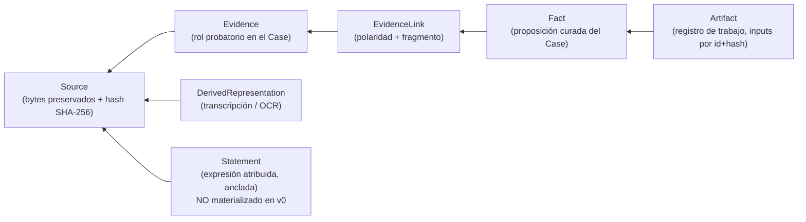

# Glosario de dominio — Legal Workspace / Legal OS (v0)

## Propósito y estatus

Este glosario fija el significado **exacto** de los trece términos del vocabulario canónico aprobado (kernel de consolidación §2). Es un documento de la fase de **consolidación**: documenta decisiones ya aprobadas por los dueños, no las reabre ni propone alternativas. Cuando un término aquí definido colisiona con el uso coloquial del oficio jurídico, manda esta definición para efectos del sistema — y el documento señala explícitamente la confusión que corta.

Reglas de lectura:

- **Nombres técnicos en inglés** (entidades, estados, condiciones, tools) tal como los fija el kernel; la prosa es española. Un nombre no listado aquí no existe como entidad de v0.
- **Etiquetas**: HECHO VERIFICADO / DECISIÓN APROBADA / HIPÓTESIS / SUPUESTO / POR VERIFICAR / RIESGO / DECISIÓN PENDIENTE. Donde no hay información, se dice **NO TENEMOS INFORMACIÓN SUFICIENTE** en lugar de rellenar con plausibilidad.
- **Este documento no afirma derecho.** No define categorías probatorias, ni efectos procesales, ni requisitos jurídicos de ninguna jurisdicción. Los ejemplos usan material **sintético** y situaciones genéricas (una entrevista grabada, un contrato, un testimonio) sin atribuirles consecuencias jurídicas.
- **Renombre registrado (kernel §2 y §16.2):** el "Document/original" de la revisión arquitectónica v0.1.1 se llama ahora **Source**. Es un **cambio de nombre, no de semántica**; se señala en la entrada correspondiente.
- Referencias: ADR-001 (frontera de confianza), ADR-002 (workspace vs private state), ADR-003 (modelo epistémico), ADR-004 (estado canónico y proyecciones), ADR-005 (autoridad humana), ADR-006 (frontera de incorporación).

### Mapa de los trece términos

| # | Término | Plano | Quién lo crea en v0 | Referencia principal |
|---|---|---|---|---|
| 1 | `Case` | Domain (agregado raíz) | `create_case` (COMMAND) | ADR-003 |
| 2 | `Source` | Domain | `ingest_evidence` (COMMAND) | ADR-003, ADR-006 |
| 3 | `Evidence` | Domain (rol por Case) | incorporación del Source al Case | ADR-003, ADR-006 |
| 4 | `Statement` | Domain | **no se materializa en v0** (extractor `ExtractStatements`, post-slice) | ADR-003 |
| 5 | `Fact` | Domain | `propose_facts` → `commit_reviewed_facts` | ADR-003 |
| 6 | `EvidenceLink` | Domain | actor con provenance (propuesto o humano) | ADR-003 |
| 7 | `ProvenanceRecord` | Domain (transversal) | el Core, en cada entidad epistémica | ADR-003 |
| 8 | `ProfessionalDetermination` | Domain | **sin productor en v0** (use case diferido `RecordProfessionalDetermination`) | ADR-003 |
| 9 | `Artifact` | **Application** (registro de trabajo) | `register_artifact` (COMMAND) | kernel §10 |
| 10 | `CaseRevision` | **Application** (soporte) | el Core, con cada evento | ADR-004 |
| 11 | `Proposal` | Application (soporte) | `propose_facts` (PROPOSAL) | ADR-005 |
| 12 | `HumanAuthorization` | Application (soporte) | `ReviewProposal(approve)` | ADR-005 |
| 13 | `DerivedRepresentation` | Domain | derivación asíncrona tras la incorporación | ADR-003, kernel §11 |

**Plano de cada término (addendum B.4, normativo — manda este glosario):** el **Domain** reúne las entidades epistémicas — `Case`, `Source`, `Evidence`, `Statement`, `Fact`, `EvidenceLink`, `ProvenanceRecord`, `ProfessionalDetermination`, `DerivedRepresentation` (ADR-003). La **Application** reúne los cuatro conceptos de soporte — `Artifact`, `Proposal`, `HumanAuthorization`, `CaseRevision` —, que no son proposiciones sobre el mundo jurídico ni portan estatus epistémico: son mecanismos de trabajo, control de concurrencia y autorización. `CaseRevision` es propiedad observable del Case, pero su administración (incremento, comparación, conflicto) es lógica de Application.

### Cadena de trazabilidad (todo resuelve al original)



La cadena de provenance efectivamente ejercitada en v0 es `Fact → EvidenceLink → fragmento → DerivedRepresentation → Source`: `Statement` queda definido pero **no se materializa en el slice** (addendum B.7; ver §4).

---

## 1. Case

### Definición

Agregado raíz del expediente (DECISIÓN APROBADA, ADR-003). **Todo lo epistémico existe dentro de un Case**: no hay Evidence, Fact, EvidenceLink, Proposal ni Artifact fuera de uno. Su identidad es un `case_id` **opaco emitido por el Core**; el modelo nunca fabrica identidades válidas (ADR-001). Se crea con `create_case` (COMMAND, con idempotency key) y se abre con `open_case` (QUERY), que resuelve un identificador natural a `case_id` + overview + revisión y, **ante ambigüedad, devuelve candidatos en lugar de adivinar**.

El estado de un Case es el **Canonical Case State**: entidades materializadas + Case Event Log append-only y hash-chained + `CaseRevision` vigente (ADR-004). Vive en el LEGAL OS PRIVATE STATE y solo se muta por use cases del Core (ADR-002). Parámetro del slice v0 (kernel §11): contexto A, rol `LITIGANT`, datos sintéticos o anonimizados, una usuaria, una máquina.

### No significa

- **No es una carpeta del filesystem.** El layout físico es detalle de implementación; el Case es el agregado, no un directorio que la usuaria manipule.
- **No es el proceso judicial ni la actuación procesal.** El scope `procedural` de `get_case_context` queda **RESERVADO** (documentado, no implementado): el slice no contiene lógica procesal.
- **No es la conversación.** El chat es canal, nunca registro (ADR-004): el diálogo crudo y el razonamiento intermedio del modelo no son estado del Case.
- **No es una etiqueta de organización.** Es una **frontera de aislamiento**: ninguna operación sobre un Case retorna datos de otro (test negativo de primera clase, ADR-001).

### Lifecycle preliminar

```text
(no existe) --create_case--> Case creado  [evento CaseCreated, revisión inicial]
            --cada mutación commiteada--> revisión N+1  [un evento por mutación]
```

El kernel **no define un enum de estados del Case** (no existe `OPEN`/`CLOSED`/`ARCHIVED` aprobado). Lo que evoluciona es su `CaseRevision` y el contenido de sus proyecciones. "Cerrar sesión" en el flujo aprobado del slice (kernel §11) se refiere a la sesión de trabajo del host, **no** a un estado del Case.

### Invariantes

1. Todo identificador del Case y de sus entidades es emitido o resuelto por el Core; ids sintácticamente plausibles pero no emitidos se rechazan (ADR-001, inv. 7).
2. Aislamiento entre Cases: una operación sobre el Case A con ids del Case B se rechaza; ninguna respuesta filtra datos de otro Case.
3. Toda mutación commiteada del Case produce exactamente un evento del Case Event Log con su `Principal` y su `event_seq`; `case_revision` avanza solo en los eventos que mutan el estado epistémico canónico (ADR-004 inv. 5, **ENMIENDA AC-02 aprobada** (supersede §16.16/§16.19)).
4. Toda respuesta de tool incluye `case_id` y `case_revision` (kernel §4).
5. El Case Event Log no es desactivable ni editable por configuración (Product Floor v0, kernel §14.5).

### Ejemplo

La profesional crea un Case para un asunto sintético entre "Cliente A" y "Contraparte B". Días después dice "abre el caso de A"; `open_case` encuentra dos Cases compatibles y devuelve ambos candidatos con su overview para que ella elija — no adivina. Al abrirlo, `get_case_context(overview)` y `changes_since(revision)` reconstruyen la orientación sin depender de lo que el modelo "recuerde" de la sesión anterior.

### Preguntas abiertas

- **Pregunta de negocio (a la profesional):** volumen esperado por caso y por semana (documentos, horas de audio/video, retención). Dimensiona almacenamiento, presupuesto de proyecciones y costo de derivación; hoy es SUPUESTO.
- **Pregunta de negocio (a la profesional):** existencia de una segunda ubicación aceptable de backup y cifrado del equipo. El slice opera con datos sintéticos, por lo que no bloquea el diseño, sí la operación con datos reales.
- **DECISIÓN PENDIENTE (kernel §17):** deduplicación física de Sources entre Cases; en v0 la copia por caso es aceptable.
- **NO TENEMOS INFORMACIÓN SUFICIENTE** sobre si el trabajo real exige estados de Case (archivar, suspender, terminar) ni con qué semántica; no se inventa ninguno.

---

## 2. Source

### Definición

Material original incorporado al sistema: **bytes preservados, hash SHA-256, provenance de incorporación (`provenance_kind = EXTERNAL_SOURCE`) y metadata** (kernel §2). Es el extremo inferior de toda cadena de trazabilidad: cualquier afirmación del sistema debe poder resolverse hasta un fragmento de un Source.

**Renombre a señalar (kernel §2 y §16.2; ADR-003):** Source **reemplaza** al "Document/original" de la revisión arquitectónica v0.1.1. Es un **cambio de nombre, no de semántica** — la entidad, sus invariantes y su papel probatorio son los mismos; cambia el término canónico para eliminar la ambigüedad de "documento" (que en el oficio designa también escritos de trabajo).

Su único productor es la operación formal de incorporación `ingest_evidence` (COMMAND, idempotente por hash de contenido), que referencia el material por **identificador de Inbox resuelto por el Core**, nunca por rutas arbitrarias, y copia los bytes al private state (ADR-006).

### No significa

- **Source ≠ Evidence.** El Source es el material; `Evidence` es su **rol probatorio** dentro de un Case concreto (ver §3).
- **No es el archivo del `Inbox/`.** Tras la incorporación, el archivo de Inbox **deja de ser la fuente**: si se altera o se borra, el Source no cambia (ADR-006, inv. 6).
- **No es la transcripción, el OCR ni el texto normalizado.** Eso es `DerivedRepresentation`, que **nunca lo sustituye** (ver §13).
- **No es una ruta ni un nombre de archivo.** Su identidad probatoria es el par `(id emitido por el Core, content_hash)`.
- **Integridad no es autenticidad.** El hash acredita "estos son los bytes que recibimos y cuándo", **no** que el contenido sea auténtico, veraz ni atribuible a quien se dice. Esa distinción debe viajar en la UX.

### Lifecycle preliminar

```text
material externo / archivo en Inbox   (NO es Source: explorar no incorpora)
        --ingest_evidence-->  Source  [hash fijado; evento EvidenceIncorporated;
                                       dispara derivación asíncrona]
        --> inmutable de por vida
```

No existe estado de "editado" ni de "borrado": los Sources son inmutables por la superficie normal del producto y **no existe operación de borrado expuesta** (Product Floor v0, kernel §14.4). Un expurgo legal futuro sería procedimiento privilegiado con acta, fuera de la superficie del modelo — no diseñado en v0.

### Invariantes

1. El hash SHA-256 se fija en la incorporación y no cambia; re-hashear debe reproducir el hash registrado.
2. **Idempotencia por hash de contenido:** los mismos bytes incorporados dos veces producen **un solo** Source; la procedencia adicional se registra, no se duplica el original (ADR-006, inv. 7).
3. La incorporación es el **único** productor de Sources; el modelo no puede "declarar" nada como incorporado (ADR-006, inv. 4).
4. Ninguna `DerivedRepresentation` se sirve como si fuera el Source (ADR-003, inv. 8).
5. Los anclajes (página, offsets, rangos de timestamps) refieren **siempre a la línea de tiempo o paginación del original**, nunca a la de un derivado o un recorte.

### Ejemplo

La clienta entrega una grabación de entrevista y una copia de un contrato. Ambos archivos se depositan en `Inbox/`. `ingest_evidence` los incorpora: `S-05` (audio, hash H_a) y `S-07` (contrato, hash H_c). Tres semanas después, alguien re-exporta el audio desde el teléfono y sobrescribe el archivo del Inbox: `S-05` y su hash siguen intactos y la cadena de anclajes sigue resolviendo. Si el mismo contrato se vuelve a incorporar por error, el Core no crea un segundo Source: registra la procedencia adicional.

### Preguntas abiertas

- **Pregunta de negocio (a la profesional):** cómo llegan hoy físicamente los materiales (correo, mensajería, USB, escáner, plataforma judicial). Determina qué puede afirmarse honestamente en el sobre de provenance y qué **no** puede acreditarse.
- **Pregunta de negocio (a la profesional):** volumen y retención (dimensiona almacenamiento y backup verificado).
- **DECISIÓN PENDIENTE (kernel §17):** deduplicación física de Sources entre Cases.
- **NO TENEMOS INFORMACIÓN SUFICIENTE** sobre obligaciones de supresión de información en un expediente (datos personales de terceros, material entregado por error). El sistema v0 no expone borrado; no se afirma nada sobre el régimen aplicable.

---

## 3. Evidence

### Definición

El **rol probatorio de un Source dentro de un Case** (kernel §2; ADR-003). Es la incorporación de un material a un expediente concreto, con la metadata probatoria de ese expediente. Un mismo material puede ser Evidence en varios Cases **con estados, links e historia independientes** (ADR-003, inv. 10). Es siempre el extremo probatorio de un `EvidenceLink`, y ese link ancla a un **fragmento**, nunca al material entero.

### No significa

- **Evidence ≠ Source.** Los bytes, el hash y la inmutabilidad pertenecen al Source; Evidence es el rol que ese material juega **en este Case**. Confundirlos hace creer que el estado probatorio viaja con el archivo entre expedientes: no viaja.
- **No es prueba valorada, acreditada ni admitida.** Que algo sea Evidence del Case no dice nada sobre su fuerza, su pertinencia ni su suerte procesal. La valoración humana es `ProfessionalDetermination` (§8).
- **No es un `Fact`.** Un contrato incorporado no es "el hecho de que el contrato se firmó".
- **No es contenido explorado.** Lo que el modelo encuentra en un conector, la web o el Inbox **no es Evidence hasta ser incorporado**: puede ORIENTAR, no puede FUNDAMENTAR (ADR-006).

### Lifecycle preliminar

```text
Source incorporado al Case  --> Evidence existe en ese Case
                                [evento EvidenceIncorporated]
```

El kernel **no define un enum de estados de Evidence** en v0. Lo que sí tiene estados a su alrededor es: su `DerivedRepresentation` (`PENDING | READY | FAILED`) y los `EvidenceLink` que la usan (`ACTIVE | RETIRED`). No se inventa aquí un ciclo de vida probatorio que nadie aprobó.

### Invariantes

1. Solo material incorporado puede participar en EvidenceLinks, en la fundamentación de Facts, en la provenance de Artifacts y en la salida jurídica final (ADR-006).
2. El mismo Source como Evidence en dos Cases mantiene estados y links independientes; una transición en uno no afecta al otro.
3. Todo EvidenceLink contra una Evidence ancla a un fragmento verificable (página / offsets / timestamps del original), nunca al documento completo (ADR-003, inv. 7).
4. Intentar crear un link contra material no incorporado (URL, id de conector, ruta, texto pegado) **falla**: test negativo de primera clase (ADR-006, inv. 1).

### Ejemplo

El mismo contrato sintético se usa en dos asuntos de la misma clienta. En el Case 1 sostiene un hecho: existe `L-1 {F-12 ↔ Evidence E-7, p. 3, SUPPORTS, ACTIVE}`. En el Case 2 el mismo material está incorporado pero todavía sin links: allí ningún Fact lo cita y el estado derivado de los hechos de ese Case es `UNSUPPORTED`. Ninguna decisión tomada en el Case 1 cambia nada en el Case 2.

### Preguntas abiertas

- **DECISIÓN PENDIENTE (kernel §17):** deduplicación física de Sources entre Cases — afecta cómo se materializa "el mismo material en dos Cases", no la regla de que los roles son independientes.
- **Pregunta de negocio (a la profesional / a los dueños):** si una misma instalación atenderá asuntos de contextos distintos (litigante y decisor) con obligaciones de confidencialidad distintas; condiciona el aislamiento y la deduplicación. El slice v0 es contexto A únicamente.
- **NO TENEMOS INFORMACIÓN SUFICIENTE** para clasificar tipos probatorios (documental, testimonial, pericial) con efectos en el modelo: v0 no los modela y no se afirma cómo debería hacerlo.

---

## 4. Statement

### Definición

**Expresión atribuible a un actor, anclada a un fragmento verificable de una fuente** — página, offsets o rango de timestamps **sobre el original** (kernel §2). Es el ancla fina de provenance: la unidad que permite responder "¿de dónde salió esto?" señalando un punto concreto del material. **Inmutable tras extracción**; una corrección se registra como **anulación + nuevo registro**, nunca como edición.

`Assertion` (proposición sostenida por un actor, consolidable desde varias fuentes) está **colapsada en Statement** en v0 y es un **nombre reservado**: no es entidad y ningún documento debe tratarla como existente (ADR-003).

**No se materializa en v0 (addendum B.7, normativo):** el vertical slice v0 **no crea Statements** — ningún use case los produce y ninguna prueba los verifica. La cadena de provenance efectivamente ejercitada es `Fact → EvidenceLink → fragmento → DerivedRepresentation → Source`, suficiente para la propiedad de trazabilidad exigida al slice. **La entidad permanece definida en el Domain** (§2 del kernel la fija y este glosario la conserva entre los trece términos): se materializará cuando exista un extractor (`ExtractStatements`, post-slice). En consecuencia, la definición, los invariantes y el ejemplo de esta sección son **ilustrativos del modelo, no ejercitados en v0**.

### No significa

- **Statement ≠ Fact.** El Statement es lo que alguien **dijo o escribió**, atribuido y localizado; el Fact es una **proposición curada del Case** con historia de estatus. Extraer un Statement no incorpora nada al expediente como hecho.
- **No es verdad ni respaldo.** Que exista un Statement no dice que lo dicho sea cierto, ni lo convierte en soporte de nada: el soporte se expresa con `EvidenceLink`.
- **No es la transcripción completa.** La transcripción es `DerivedRepresentation`; el Statement es un fragmento atribuido dentro de una fuente.
- **No es una cita generada por el modelo.** Un Statement sin ancla resoluble contra el original no es un Statement: es texto.

### Lifecycle preliminar

```text
extraído  [ProvenanceRecord obligatorio; actor típico AI_DERIVATION, o humano]
   --> inmutable
   --> (corrección) = anulación + nuevo registro   [nunca edición, nunca borrado]
```

### Invariantes

1. Inmutable tras extracción; no existe operación de actualización.
2. Ancla siempre resoluble contra el **original**: los timestamps refieren a la línea de tiempo de la grabación, no a la del derivado ni a un recorte.
3. Porta `ProvenanceRecord` completo (`provenance_kind` más el `Principal`: `principal_id`, `principal_type`, `principal_role`); su construcción sin provenance falla.
4. Una extracción por IA es `AI_DERIVATION` y, como todo actor `AI_*`, no puede transicionar nada más allá de `PROPOSED` (ADR-003, inv. 2).

### Ejemplo

**Ejemplo ilustrativo del modelo, no ejercitado en v0 (addendum B.7).** En la entrevista grabada (Source `S-05`), entre `00:12:31` y `00:13:04` la clienta describe una reunión. El Core registra `ST-9`: expresión atribuida a la clienta, anclada a ese rango **sobre el audio original**, extraída por `AI_DERIVATION` a partir de la transcripción `READY`. Si más tarde la transcripción se regenera con otro proveedor, `ST-9` sigue resoluble contra el audio. Si se detecta que el fragmento fue mal transcrito, `ST-9` se anula y se registra un Statement nuevo: la historia conserva ambos.

### Preguntas abiertas

- **POR VERIFICAR (kernel §17):** proveedor de transcripción y sus capacidades reales de timestamps. Mientras no se verifique, la granularidad del ancla temporal es **SUPUESTO**.
- **NO TENEMOS INFORMACIÓN SUFICIENTE** sobre atribución automática de hablante: v0 no modela diarización y no se afirma su fiabilidad; la atribución de un Statement descansa en lo que el actor con provenance registre.
- **DECISIÓN PENDIENTE (ADR-003, alternativa 3):** promover `Assertion` a entidad cuando aparezca agregación multi-fuente real; hasta entonces permanece colapsada.

---

## 5. Fact

### Definición

**Proposición fáctica curada del Case, con historia de transiciones** (`status_history` append-only, cada entrada con su `ProvenanceRecord`) — **nunca un campo único mutable** (kernel §2, §3).

**Refinamiento a señalar explícitamente (kernel §3; no altera la intención aprobada, la precisa):** la lista de los dueños — *propuesta; alegada; respaldada; contradicha; profesionalmente determinada* — mezclaba estados **almacenados** con estados **derivados**. El refinamiento los separa:

- **Transiciones almacenadas:** `PROPOSED` (nace de `propose_facts`; actor `AI_INFERENCE` o humano) → `ALLEGED` (solo por commit con autorización humana) → `DETERMINED(kind)` (solo vía `ProfessionalDetermination`; kind v0 `ACCREDITED_BY_PROFESSIONAL`, reservado para contexto B `DECLARED_PROVEN`). `WITHDRAWN` es posible desde `ALLEGED` o `DETERMINED` y es **evento nuevo, nunca borrado**.
- **Estados derivados** (computados desde los `EvidenceLink` `ACTIVE`, **jamás almacenados como status**): `SUPPORTED` (≥1 link `SUPPORTS` activo), `CONTRADICTED` (≥1 `CONTRADICTS` activo), `UNSUPPORTED` (**cero links de polaridad probatoria activos**).

**Precisión de la consolidación (addendum B.14; precisión, no decisión nueva):** `UNSUPPORTED` = **cero links de polaridad probatoria (`SUPPORTS` / `CONTRADICTS`) activos**. Los links `CONTEXTUALIZES` **no alteran el estado derivado**: aportan contexto, no soporte ni contradicción. Un Fact cuyos únicos links `ACTIVE` sean `CONTEXTUALIZES` se computa, por tanto, como `UNSUPPORTED`.

"Respaldada" y "contradicha" no desaparecen: siguen siendo visibles para la usuaria, pero como propiedades siempre consistentes con los links vigentes.

### No significa

- **El status almacenado ≠ los estados derivados.** Un Fact `ALLEGED` puede ser **simultáneamente** `SUPPORTED` y `CONTRADICTED`; "respaldado" no es un status que alguien fije, es un cómputo. Preguntar "¿en qué estado está el hecho?" tiene **dos** respuestas legítimas y distintas.
- **`DETERMINED(ACCREDITED_BY_PROFESSIONAL)` ≠ declarado probado por una autoridad.** Es un acto interno de la profesional. `DECLARED_PROVEN` está **reservado** para el contexto B y no se implementa en v0.
- **`CONTRADICTED` ≠ controvertido procesalmente.** La controversión procesal es otra dimensión, **reservada y fuera del slice**; `CONTRADICTED` solo dice que existe al menos un link `CONTRADICTS` activo.
- **`UNSUPPORTED` no es una alerta.** Un hecho sin soporte es **dato de proyección** (`facts` / `pending`), no condición: `NO_SUPPORT_FOUND` quedó registrada como superseded (kernel §9 y §16.5).
- **`CONTEXTUALIZES` no es soporte débil ni contradicción débil.** Un link contextual activo no vuelve `SUPPORTED` a un hecho ni lo saca de `UNSUPPORTED`; no cuenta en el cómputo de estados derivados (addendum B.14).
- **`WITHDRAWN` no es borrado**, y **acreditar no limpia la prueba en contra**: los links `CONTRADICTS` siguen `ACTIVE` y visibles.
- **Un Fact no es verdad.** Es el estado epistémico que el expediente registra, con su historia y su actor.

### Lifecycle preliminar

```text
                 propose_facts (AI_INFERENCE | HUMAN_DECISION)
                          │
                          ▼
                      PROPOSED
                          │  commit_reviewed_facts + HumanAuthorization viva
                          ▼
                       ALLEGED ─────────────► WITHDRAWN  (evento nuevo)
                          │  ProfessionalDetermination        ▲
                          ▼                                   │
                 DETERMINED(kind)  ─────────────────────────--┘

Derivados, recomputados en cada proyección desde los EvidenceLink ACTIVE
de polaridad probatoria (SUPPORTS / CONTRADICTS):
   SUPPORTED / CONTRADICTED / UNSUPPORTED   (nunca persistidos)
```

Normalización registrada (kernel §4 y §16.4): la tool es `commit_reviewed_facts` en **plural** (los dueños escribieron `commit_reviewed_fact` y `CommitReviewedFacts` en documentos distintos).

**Sin productor en v0 (addendum B.5):** ninguna tool, use case ni evento de la lista cerrada de v0 produce la transición a `DETERMINED` ni el retiro `WITHDRAWN`. Ambos quedan como use cases **conocidos y diferidos, con nombre reservado** — `RecordProfessionalDetermination` y `WithdrawFact`, ambos del canal humano y ambos SENSITIVE (exigen `HumanAuthorization`) —, para no improvisarlos después. El evento `FactWithdrawn` permanece en la lista cerrada de eventos v0 **anotado explícitamente como sin productor en v0** (kernel §6); la alternativa de eliminarlo fue rechazada porque obligaría a reabrir el contrato de eventos. En consecuencia, las dos transiciones y los pasos del ejemplo que las ejercitan son **ilustrativos del modelo, no ejecutables en v0** (ver §8).

### Invariantes

1. **Techo epistémico de la IA:** ningún actor `AI_*` crea ni transiciona un Fact más allá de `PROPOSED`; el Domain lo rechaza con independencia de qué superficie lo transporte.
2. `status_history` es append-only: ninguna transición edita ni elimina entradas previas.
3. `DETERMINED` solo se alcanza vía `ProfessionalDetermination` con actor humano identificado, motivación y lista explícita de links valorados, **incluidos los `CONTRADICTS`**.
4. Determinar un Fact **no** retira ni desactiva sus links `CONTRADICTS`.
5. `SUPPORTED | CONTRADICTED | UNSUPPORTED` jamás se persisten como status.
6. `propose_facts` rechaza sintácticamente todo hecho que llegue sin referencia de provenance ni marca explícita "solo alegado" (kernel §4).

### Ejemplo

Material sintético, sobre la entrevista y el contrato ya incorporados. **`t1` y `t6` son ilustrativos del modelo, no ejercitados en v0**: `Statement` no se materializa en el slice (addendum B.7) y `ProfessionalDetermination` no tiene productor en v0 (addendum B.5).

```text
t1  ST-9 extraído de S-05 (audio, 00:12:31–00:13:04), actor AI_DERIVATION.
    [ilustrativo del modelo: en v0 no se materializan Statements]
t2  propose_facts crea F-12 → PROPOSED (actor AI_INFERENCE, skill fact-builder v0).
    Derivado: UNSUPPORTED (aún sin links).
t3  Revisión humana + commit_reviewed_facts con HumanAuthorization viva
    → status_history += ALLEGED (actor HUMAN_DECISION).
t4  L-1 {F-12 ↔ E-7 (contrato) p. 3, SUPPORTS, ACTIVE}   → derivado: SUPPORTED.
t5  L-2 {F-12 ↔ E-9 (testimonio) 00:41:10, CONTRADICTS, ACTIVE}
    → derivados: SUPPORTED y CONTRADICTED a la vez.
t6  ProfessionalDetermination D-4 (motivación + links valorados [L-1, L-2])
    → status_history += DETERMINED(ACCREDITED_BY_PROFESSIONAL).
    L-2 sigue ACTIVE: CONTRADICTED sigue computándose y mostrándose.
    [ilustrativo del modelo: DETERMINED no tiene productor en v0]
```

### Preguntas abiertas

- **DECISIÓN PENDIENTE de negocio (kernel §17; pregunta a la profesional):** semántica exacta de "acreditado". Bloquea únicamente el **naming** del kind (`ACCREDITED_BY_PROFESSIONAL`), no el mecanismo de transición. **RIESGO** registrado en ADR-003: un nombre equivocado en la UX podría sugerir efectos procesales que el acto interno no tiene.
- **DECISIÓN PENDIENTE (kernel §17):** aprobación parcial de propuestas (`authorized_items`) — determina si una revisión puede llevar a `ALLEGED` solo algunos hechos de una Proposal.
- **Controversión procesal:** reservada como dimensión propia. **NO TENEMOS INFORMACIÓN SUFICIENTE** — requiere el vocabulario real de la profesional y el levantamiento del contexto B, ausente hoy.

---

## 6. EvidenceLink

### Definición

Relación **N:M entre un `Fact` y un fragmento de `Evidence`**, con **polaridad `SUPPORTS | CONTRADICTS | CONTEXTUALIZES`** (enum **cerrado en v0**), actor creador, justificación y estado **`ACTIVE | RETIRED`** (kernel §2). Es el sustrato desde el cual se computan los estados derivados del Fact y el corazón del patrón de trabajo "hecho, prueba".

### No significa

- **No es una anotación libre.** Tiene polaridad tipada, actor con provenance y justificación; no es un comentario.
- **No ancla al documento entero.** Ancla a un fragmento verificable (página / offsets / timestamps del original).
- **No es valoración probatoria.** Crear un link registra una relación; **valorar** es `ProfessionalDetermination` (§8).
- **Crear un link no cambia el status almacenado del Fact.** Cambia lo que se **computa** (`SUPPORTED`, `CONTRADICTED`), no lo que está escrito en `status_history`.
- **`RETIRED` ≠ borrado.** El link retirado deja de contar para los derivados, pero permanece en la historia.
- **`CONTRADICTS` ≠ controversión procesal** (ver §5).
- **`CONTEXTUALIZES` no es una polaridad probatoria.** Registra contexto; **no altera el estado derivado** del Fact — ni lo respalda ni lo contradice (addendum B.14).

### Lifecycle preliminar

```text
creado ACTIVE  [actor con ProvenanceRecord; justificación obligatoria]
   --> RETIRED  (retiro explícito y registrado; nunca borrado)
```

Un link `ACTIVE` **de polaridad probatoria** (`SUPPORTS` / `CONTRADICTS`) cuenta para los estados derivados; uno `RETIRED` no cuenta. **Precisión de la consolidación (addendum B.14):** un link `CONTEXTUALIZES`, aunque esté `ACTIVE`, **no altera el estado derivado**. Cuando un Fact deja de tener links de polaridad probatoria activos —porque se retiraron o porque solo conserva links `CONTEXTUALIZES`—, vuelve a computarse como `UNSUPPORTED`.

### Invariantes

1. Ancla a un fragmento verificable de una Evidence **incorporada**; contra material no incorporado, falla (ADR-006, inv. 1).
2. La polaridad es enum **cerrado** en v0: no se agregan categorías preventivamente. Si aparece un caso real donde las tres son insuficientes, **se señala** (regla acordada, kernel §2).
3. Determinar un Fact no retira sus links `CONTRADICTS` (ADR-003, inv. 5).
4. Los estados derivados se computan **siempre** desde los links `ACTIVE` **de polaridad probatoria** (`SUPPORTS` / `CONTRADICTS`) en el momento de proyectar; nunca se leen de un campo. Los `CONTEXTUALIZES` activos quedan fuera del cómputo (precisión de la consolidación, addendum B.14).
5. Todo link porta actor creador y justificación; un link propuesto por IA es propuesta, no consolidación (techo `PROPOSED`, ADR-003).

### Ejemplo

Sobre `F-12`: `L-1 {F-12 ↔ E-7 (contrato), p. 3, SUPPORTS, ACTIVE, justificación: "la cláusula describe la obligación que el hecho afirma"}` y `L-2 {F-12 ↔ E-9 (testimonio), 00:41:10, CONTRADICTS, ACTIVE, justificación: "el testigo ubica el hecho en otra fecha"}`. La proyección `facts` muestra `F-12` como `ALLEGED` (almacenado) y, a la vez, `SUPPORTED` y `CONTRADICTED` (computados). Si más tarde se retira `L-1` (`RETIRED`), la proyección deja de mostrar `SUPPORTED` sin que nadie edite el Fact.

### Preguntas abiertas

- **Suficiencia del enum de polaridad:** **NO TENEMOS INFORMACIÓN SUFICIENTE** hoy para afirmar que tres polaridades bastan en la práctica real; la regla aprobada es señalar un caso concreto, no ampliar por si acaso.
- **POR VERIFICAR (kernel §17):** capacidades de timestamps del proveedor de transcripción — condicionan la granularidad de anclaje disponible para links sobre audio.
- **Pregunta de negocio (a la profesional):** con qué granularidad trabaja realmente el par "hecho, prueba" (por cláusula, por página, por pasaje); hoy es SUPUESTO derivado del flujo aprobado del slice.

---

## 7. ProvenanceRecord

### Definición

Registro **obligatorio en toda entidad epistémica** que responde "¿de dónde salió esto y quién lo puso ahí?" (kernel §2). Discriminante principal: `provenance_kind ∈ EXTERNAL_SOURCE | AI_DERIVATION | AI_INFERENCE | HUMAN_DECISION | SYSTEM`, acompañado del `Principal` que ejecutó la operación (`principal_id`, `principal_type ∈ HUMAN | AI | SYSTEM`, `principal_role`) — normalización v0.4: son dos dimensiones ortogonales, *quién ejecutó* y *cuál es la naturaleza del origen*. Campos del `Principal`: **`principal_id`, `principal_type`, `principal_role`**, presentes **desde el schema inicial** aunque v0 tenga una sola usuaria (DECISIÓN APROBADA: evita una migración dolorosa cuando haya auxiliares o roles distintos).

### No significa

- **No es el Case Event Log.** El log registra **operaciones** del Case (append-only, hash-chained, con `event_seq` en todo evento y `case_revision` solo en los canónicos); el ProvenanceRecord es el **sello de origen de una entidad**. Se corresponden, no se sustituyen.
- **No es una firma criptográfica.** En v0 no hay criptografía sobre estos registros (decisión de los dueños); la evidencia de integridad es el hash-chain del Case Event Log, **tamper-evident, no tamper-proof** frente a un actor con control total de la máquina.
- **No acredita autenticidad del contenido externo.** `EXTERNAL_SOURCE` dice "esto entró por incorporación con este hash", no "esto es auténtico".
- **No es texto libre generado por el modelo.** Los tipos de actor son un enum cerrado del Domain y su efecto es estructural: gobiernan qué transiciones son posibles.

### Lifecycle preliminar

```text
se fija en la creación de la entidad  --> no muta
corrección = nueva entidad / nuevo evento con su propio ProvenanceRecord
```

### Invariantes

1. La construcción de una entidad epistémica sin `ProvenanceRecord` completo **falla** (ADR-003, inv. 1).
2. `provenance_kind` determina el techo de autoridad: `AI_*` nunca crea ni transiciona más allá de `PROPOSED`; `HUMAN_DECISION` es la única fuente válida de transiciones sensibles.
3. `EXTERNAL_SOURCE` corresponde a la incorporación de material y **jamás** a algo producido por IA.
4. `SYSTEM` cubre mutaciones mecánicas (regeneraciones, migraciones), nunca juicios epistémicos.
5. Los tres campos de actor existen en el schema inicial aunque v0 los llene siempre con la misma persona.

**Precisión de la consolidación, propuesta como invariante (addendum B.17):** los invariantes **3** y **4** — que `EXTERNAL_SOURCE` corresponda exclusivamente a la incorporación de material y jamás a algo producido por IA, y que `SYSTEM` cubra solo mutaciones mecánicas y nunca juicios epistémicos — **son una precisión de la consolidación, no texto aprobado por los dueños**: el kernel §2 fija el enum de `provenance_kind` (escrito allí como `actor_type`, antes de la normalización v0.4), no la semántica estricta de cada valor. Se **proponen** aquí como invariantes del Domain y quedan listados en Preguntas abiertas hasta su confirmación.

### Ejemplo

| Entidad (material sintético) | `provenance_kind` | Qué significa aquí |
|---|---|---|
| `S-07` (contrato incorporado) | `EXTERNAL_SOURCE` | entró por `ingest_evidence` desde el Inbox, con hash y fecha |
| `DR-1` (transcripción del audio) | `AI_DERIVATION` | derivada por herramienta declarada en la receta |
| `ST-9` (expresión anclada 00:12:31–00:13:04) | `AI_DERIVATION` | extracción verificable contra el original |
| `F-12` en `PROPOSED` | `AI_INFERENCE` | propuesta del skill `fact-builder` v0 |
| `F-12` → `ALLEGED` | `HUMAN_DECISION` | commit autorizado por la profesional |
| regeneración de un índice | `SYSTEM` | mutación mecánica, sin juicio |

La fila `ST-9` es **ilustrativa del modelo**: `Statement` no se materializa en v0 (addendum B.7; ver §4).

### Preguntas abiertas

- **Precisión propuesta como invariante, pendiente de confirmación (addendum B.17):** la semántica estricta de `EXTERNAL_SOURCE` (nunca IA) y de `SYSTEM` (nunca juicio epistémico) es aporte de la consolidación. Si los dueños no la confirman, los invariantes 3 y 4 de esta sección vuelven a ser lectura interpretativa del enum.
- **Pregunta de negocio (a la profesional / a los dueños):** quiénes además de ella tocarán el sistema (auxiliares, judicantes) y si deben quedar identificados individualmente en la trazabilidad. v0 opera bajo **SUPUESTO mono-usuaria**, con la deuda declarada y el actor triple ya en el schema.
- **Punto de evolución señalado (no diseñado):** firma criptográfica de los registros sensibles. Decisión de los dueños para v0: sin criptografía.
- **NO TENEMOS INFORMACIÓN SUFICIENTE** sobre requisitos externos de identificación de actores en trazabilidad profesional; no se afirma ninguno.

---

## 8. ProfessionalDetermination

### Definición

**Acto humano que habilita transiciones sensibles** del expediente. Registra: actor **humano identificado**, **motivación**, y **los `EvidenceLink` valorados — incluidos los de polaridad `CONTRADICTS`** (kernel §2). Es la única vía para que un `Fact` alcance `DETERMINED(kind)`. **Una salida de IA jamás lo sustituye.**

**Sin productor en v0 (addendum B.5, normativo):** en v0 **ninguna tool, use case ni evento de la lista cerrada produce una `ProfessionalDetermination`**. La transición `DETERMINED` es transición almacenada y criterio de aceptación de ADR-003, pero **no es ejecutable en el slice v0**. El use case queda **conocido y diferido, con nombre reservado** para no improvisarlo después: **`RecordProfessionalDetermination`**, del **canal humano** y **SENSITIVE** (exige `HumanAuthorization`), post-slice. **La entidad permanece definida en el Domain** y este glosario la conserva entre los trece términos; lo que se difiere es su productor, no su definición. En consecuencia, el lifecycle y el ejemplo de esta sección son **ilustrativos del modelo, no ejecutables en v0**.

### No significa

- **No es `HumanAuthorization`.** `HumanAuthorization` autoriza una **operación** sensible del Core (en v0, el commit `PROPOSED → ALLEGED`); `ProfessionalDetermination` es un **acto de valoración** que fija estatus epistémico (`DETERMINED`). Son actos humanos distintos, con contratos distintos (ADR-005, relación con ADR-003).
- **No es una providencia ni una declaración de autoridad.** El kind v0 `ACCREDITED_BY_PROFESSIONAL` es juicio interno; `DECLARED_PROVEN` está **reservado** para el contexto B y no existe en v0.
- **No es un flag ni un booleano.** Sin actor identificado, motivación y links valorados, no hay determinación.
- **No elimina la prueba en contra.** Determinar no retira ni oculta los links `CONTRADICTS`.
- **No es editable ni reversible por edición.** Revertir es `WITHDRAWN`: evento nuevo, con la determinación intacta en la historia.

### Lifecycle preliminar

```text
registrada  [append: actor humano + motivación + links valorados]
   --> permanece en la historia del Fact indefinidamente
   --> si el Fact se retira después (WITHDRAWN), la determinación NO se borra:
       queda como lo que se creyó, con quién y cuándo
```

### Invariantes

1. `DETERMINED` solo se alcanza vía `ProfessionalDetermination` (ADR-003, inv. 4).
2. Exige `Principal` humano identificado (`principal_type = HUMAN`, con `provenance_kind = HUMAN_DECISION`), motivación y lista **explícita** de links valorados, incluidos los `CONTRADICTS`.
3. Ningún actor `AI_*` puede crearla ni sustituirla.
4. Determinar no desactiva links `CONTRADICTS` (ADR-003, inv. 5).
5. Es append-only: no se edita ni se borra.

### Ejemplo

**Ejemplo ilustrativo del modelo, no ejecutable en v0 (addendum B.5).** Sobre `F-12`, con `L-1` (SUPPORTS, contrato p. 3) y `L-2` (CONTRADICTS, testimonio 00:41:10) ambos `ACTIVE`, la profesional registra `D-4`: se identifica como actora, escribe su motivación y declara qué links valoró — **los dos**. `F-12` suma `DETERMINED(ACCREDITED_BY_PROFESSIONAL)` a su `status_history`. La proyección `facts` sigue mostrando `CONTRADICTED` como estado derivado: el sistema no oculta la prueba en contra por haber determinado.

### Preguntas abiertas

- **DECISIÓN PENDIENTE de negocio (kernel §17; pregunta a la profesional):** qué entiende exactamente por "acreditado" — juicio profesional sobre lo que quedará probado, lo ya declarado por la autoridad, o ambas nociones. Bloquea el naming del kind, no el mecanismo.
- **Contexto B (`DECLARED_PROVEN`): NO TENEMOS INFORMACIÓN SUFICIENTE.** El trabajo real del rol decisor no está levantado; el kind queda reservado y sin semántica afirmada.
- **NO TENEMOS INFORMACIÓN SUFICIENTE** sobre exigencias formales de motivación en el trabajo real; el sistema exige que exista, sin prescribir su forma.

---

## 9. Artifact

### Definición

**Producto de trabajo registrado** (kernel §10): el registro de que un análisis o entregable se generó, con qué insumos exactos, bajo qué metodología y modelo, y en qué revisión del Case. Schema conceptual mínimo:

```text
Artifact
  id, type, case_id, created_at, created_by (actor triple), case_revision
  inputs[] { entity_id, content_hash }   ← incluye la DerivedRepresentation exacta consumida
  methodology_version                     ← versión de skill/metodología: metadato del PRODUCTO
  model_id
  status: DRAFT | REGISTERED | REVIEWED(by, at, at_revision) | SUPERSEDED
  stale: bool
  stale_reasons[]                         ← AÑADIDO (kernel §10): sin razón, ANALYSIS_STALE
                                            no puede explicarse
  supersedes_artifact_id?                 ← AÑADIDO (kernel §10): cadena simple, no DAG
  knowledge_pack_versions[]               ← vacío en el slice; obligatorio cuando el artifact
                                            dependa de un Knowledge Pack
```

**HECHO VERIFICADO (kernel §1; fuente: code.claude.com/docs/en/skills.md):** los Skills de Claude Code **no tienen versionado propio** (solo los plugins). Por tanto `methodology_version` es un **metadato que el producto construye y gestiona**, no una capacidad de la plataforma.

### No significa

- **Artifact ≠ entidad jurídica del dominio.** Es un **registro de trabajo del plano Application**: no es `Evidence`, no es `Source`, no es un escrito con efectos. Si un producto de trabajo llegara a tener valor probatorio, entra al expediente **por incorporación**, como cualquier otro material (ADR-006).
- **No es un `Fact` ni una conclusión acreditada.** Que un análisis exista no eleva el estatus de nada.
- **No es el archivo exportado.** Un documento en `Exports/` es una salida hacia el workspace de la usuaria; el Artifact es el **registro** con `inputs[]` por id + `content_hash`.
- **`REVIEWED` ≠ correcto ni verificado por el sistema.** Es "una persona identificada lo revisó en tal revisión"; el sistema no juzga su calidad.
- **`stale` ≠ incorrecto.** Significa "sus insumos ya no corresponden al estado vigente". La condición `ANALYSIS_STALE {reasons[]}` bloquea su uso **como vigente** en salida final (política), no lo declara falso.

### Lifecycle preliminar

```text
DRAFT --register_artifact--> REGISTERED  [evento ArtifactRegistered]
      --revisión humana-->   REVIEWED(by, at, at_revision)
      --reemplazo-->         SUPERSEDED  [supersedes_artifact_id: cadena simple]

Ortogonal al status:
  stale: false | true  + stale_reasons[] ∈ NEW_EVIDENCE | INPUT_SUPERSEDED |
                                           METHODOLOGY_CHANGED
  [evento ArtifactMarkedStale; condición ANALYSIS_STALE {reasons[]}]
```

**Unificación a señalar (kernel §9):** `NEW_EVIDENCE_SINCE_ANALYSIS` deja de ser condición propia y pasa a ser una **reason** de `ANALYSIS_STALE`; el delta al abrir un caso es **contenido** de `changes_since(revision)`, no condición.

### Invariantes

1. `inputs[]` se registra por **id + content_hash**, jamás por nombre de archivo, e incluye la **versión exacta** de la `DerivedRepresentation` consumida.
2. Todo input debe ser una entidad **incorporada** del Case Store; una referencia externa no incorporada se rechaza (ADR-006, inv. 3).
3. Todo Artifact registra `case_revision`, `methodology_version`, `model_id` y `created_by` (actor triple).
4. Un Artifact `stale` no se presenta como vigente ni se cita en salida final sin su marca; la razón siempre se declara (`stale_reasons[]`).
5. `knowledge_pack_versions[]` es obligatorio en cuanto un Artifact dependa de un pack; en el slice v0 va vacío (no se cargan packs).

### Ejemplo

El skill `fact-builder` v0 produce un análisis de hechos candidatos a partir de la transcripción del audio y del contrato. `register_artifact` deja: `type` = análisis de hechos, `inputs[] = [{DR-1, hash_dr1}, {S-07, hash_c}]`, `methodology_version = fact-builder@v0`, `model_id`, `case_revision = 14`, `status = REGISTERED`, `stale = false`. Al incorporarse un segundo documento (revisión 15) que toca los mismos hechos, el Core marca `stale = true` con `stale_reasons = [NEW_EVIDENCE]` y emite `ANALYSIS_STALE`; la profesional lo ve en `get_case_context(pending)`. El análisis **no se regenera solo** ni se borra.

### Preguntas abiertas

- **Evolución declarada, no diseñada (kernel §10):** DAG de dependencias entre Artifacts, razones tipadas de supersede, branching y reuso idempotente de análisis quedan **post-slice**. No son preguntas abiertas sino trabajo explícitamente aplazado.
- **NO TENEMOS INFORMACIÓN SUFICIENTE** sobre si un cambio de `model_id` debe invalidar un Artifact ya `REVIEWED`: `stale_reasons[]` v0 no contempla esa razón y el kernel no registra decisión al respecto. No se afirma comportamiento.
- **Pregunta de negocio (a los dueños / a la profesional):** presupuesto aceptable de costo y latencia por operación (derivación, análisis), que condiciona cuánto trabajo se regenera y cuánto se reutiliza.

---

## 10. CaseRevision

### Definición

**Contador monotónico por Case.** **ENMIENDA AC-02 aprobada** (supersede §16.16/§16.19): **`event_seq`** avanza en **todo** evento del Case Event Log; **`case_revision`** avanza **solo** en los eventos que mutan el estado epistémico canónico y es **NULL** en los demás (`ProposalReviewed`). La identidad `seq == CaseRevision` queda **superada**. Toda respuesta de tool incluye `case_id` y `case_revision`; toda tool `COMMAND` / `SENSITIVE_COMMAND` acepta `expected_revision`. Ante mismatch: **rechazo del commit + Proposal preservada (`PRESERVED_FOR_RECONCILIATION`) + condición `REVISION_CHANGED {expected, current, preserved_proposal_id}`**. Concurrencia **optimista**, sin locking pesimista.

**Desambiguación de tres nombres cercanos (addendum B.17):**

- **`case_revision`** — la **revisión vigente** del Case que el Core reporta en el sobre de toda respuesta de tool (kernel §4, §8).
- **`expected_revision`** — la revisión que **declara el invocador** de una tool `COMMAND` / `SENSITIVE_COMMAND` para que el Core detecte el cambio; su mismatch produce `REVISION_CHANGED` (kernel §7).
- **`expected_case_revision`** — la revisión **congelada en la `HumanAuthorization`**: la revisión **contra la que se generó y se revisó la Proposal** (= `base_case_revision`), que es la que la profesional tenía a la vista al aprobar (§12; addendum B.2).

### No significa

- **CaseRevision ≠ versión del producto.** La versión del producto es semver del release sellado, con manifest de hashes y verificación de integridad al arranque (kernel §13); la `CaseRevision` es del **expediente**. Tampoco es la *schema version* del workspace ni la versión de un `Artifact` o de una `DerivedRepresentation`.
- **No es un timestamp.** Ordena eventos del Case, no tiempo real.
- **No es un lock.** No bloquea a nadie: protege detectando el cambio en el momento del commit.
- **No mide importancia.** Una incorporación irrelevante para el análisis en curso también la incrementa — **RIESGO** registrado (conflictos espurios, ADR-004).

### Lifecycle preliminar

```text
CaseCreated  --> revisión inicial
cada evento del Case Event Log --> revisión + 1   (seq == revisión resultante)
nunca decrece, nunca se reordena, nunca se reutiliza
```

### Invariantes

1. Monotónica por Case; **`event_seq`** sin huecos ni reordenamientos, y `case_revision` como **subsecuencia** que avanza solo en mutaciones epistémicas canónicas (**ENMIENDA AC-02 aprobada** (supersede §16.16/§16.19)).
2. **Biyección mutación↔evento** (ADR-004 inv. 5; addendum v0.3 B.3): toda mutación produce exactamente un evento del Case Event Log y todo evento corresponde a exactamente una mutación, donde **mutación = cambio de estado canónico registrado, no invocación de tool**. Una sola invocación puede producir de 1 a n mutaciones y avanzar la CaseRevision en n; el property test verifica la biyección, no el conteo de llamadas.
3. Mismatch de `expected_revision` ⇒ rechazo + preservación + `REVISION_CHANGED`: **nunca sobrescritura silenciosa, nunca descarte del trabajo**.
4. Las proyecciones se generan **siempre** desde la revisión vigente en el momento de la llamada (sin caché). **Simplificación señalada (kernel §8):** por eso `generated_from_revision` se eliminó del envelope — sería idéntico a `case_revision`; si algún día se cachean proyecciones, el campo vuelve.
5. Una `HumanAuthorization` porta `expected_case_revision` = **la revisión contra la que se generó y se revisó la Proposal** (**ENMIENDA AC-02 aprobada** (supersede §16.16/§16.19); `ProposalReviewed` no avanza la revisión, con lo que desaparece la circularidad). Formulación superada: «la revisión resultante del acto de revisión», no aquella contra la que se creó la Proposal (addendum B.2). Si la revisión cambió entre la autorización y el commit, el commit se rechaza (ADR-005).
6. `ReviewProposal(approve)` y `commit_reviewed_facts` son **dos actos**, pero **no en dos revisiones distintas** (**ENMIENDA AC-02 aprobada** (supersede §16.16/§16.19)): el primero emite `ProposalReviewed`, avanza `event_seq` y deja `case_revision` NULL; el segundo emite `FactsCommitted` y la avanza de nuevo (addendum B.2).

### Ejemplo

`propose_facts` registra la Proposal `P-3`: el evento `FactsProposed` deja el Case en la revisión **14**. La profesional revisa y aprueba: `ReviewProposal(approve)` emite `ProposalReviewed`, que avanza `event_seq` pero **deja `case_revision` NULL — el Case sigue en 14** (ENMIENDA AC-02 aprobada); en ese mismo acto se crea la `HumanAuthorization` con `expected_case_revision = 14`` — la revisión que ella tenía a la vista al aprobar (addendum B.2). Antes de que se ejecute el commit se incorpora un documento nuevo: el Case pasa a **15**. Al intentar el commit con `expected_revision = 14`, el Core lo rechaza y emite `REVISION_CHANGED {expected: 14, current: 15, preserved_proposal_id: P-3}`; `P-3` queda en `PRESERVED_FOR_RECONCILIATION` y aparece en `get_case_context(pending)`. Su trabajo de revisión no se perdió: se reconcilia contra la revisión 16.

### Preguntas abiertas

- **POR VERIFICAR (ADR-004, Preguntas pendientes):** umbral medible que justificaría pasar a revisiones por agregado (frecuencia real de `REVISION_CHANGED` espurios). No se diseña ahora.
- **DECISIÓN PENDIENTE (ADR-004):** destino aceptable para anclar periódicamente el hash-cabeza del Case Event Log fuera del workspace; sin él, la garantía es tamper-**evident**, no tamper-proof.
- **Pregunta de negocio (a la profesional):** ritmo real de trabajo sobre un mismo expediente (cuántas incorporaciones y análisis por sesión), que determina si los conflictos espurios serán molestia real o teórica.

---

## 11. Proposal

### Definición

**Conjunto de cambios propuestos pendiente de revisión humana**, con `content_hash` (kernel §2). En v0 su contenido son **hechos propuestos con sus links candidatos**. La crea `propose_facts` (clase `PROPOSAL`). Estados: **`PENDING | APPROVED (parcial o total) | REJECTED | SUPERSEDED | PRESERVED_FOR_RECONCILIATION`**.

### No significa

- **Proposal ≠ estado del Case.** `propose_facts` **no muta** el Case más allá de registrar la propuesta: los hechos propuestos **no son hechos del expediente** hasta el commit. "Proponer no es mutar" es invariante de la frontera (ADR-001, inv. 9).
- **No es una `HumanAuthorization`.** La Proposal es **lo que se revisa**; la autorización es **el registro de que se revisó y se aprobó**.
- **`APPROVED` no ejecuta el commit.** El commit lo hace `commit_reviewed_facts` consumiendo una autorización viva; aprobar y commitear son actos separados por diseño.
- **No es un borrador de documento.** No es un entregable ni un `Artifact`.
- **`PRESERVED_FOR_RECONCILIATION` no es rechazo ni pérdida.** Es trabajo válido respecto de la revisión en que se produjo, a la espera de reconciliación humana.

### Lifecycle preliminar

```text
propose_facts --> PENDING  [content_hash calculado; evento FactsProposed]
   --ReviewProposal(approve)--> APPROVED (total o parcial)   [ProposalReviewed]
   --ReviewProposal(reject)-->  REJECTED                     [ProposalReviewed]
   --conflicto de revisión-->   PRESERVED_FOR_RECONCILIATION
                                [ProposalPreservedForReconciliation +
                                 condición REVISION_CHANGED]
   SUPERSEDED: estado del enum aprobado; el kernel no fija su trigger exacto.
```

**Momento de emisión (**ENMIENDA AC-02 aprobada** (supersede §16.16/§16.19)):** `ProposalReviewed` lo emite **`ReviewProposal`**, en el acto de revisión, y **avanza solo `event_seq`: NO avanza la `CaseRevision`**; el commit posterior emite **`FactsCommitted`** y la avanza de nuevo. Son dos eventos en dos revisiones distintas.

**NO TENEMOS INFORMACIÓN SUFICIENTE** para afirmar cuándo se aplica `SUPERSEDED` más allá de que una Proposal deje de ser la vigente; no se inventa la regla.

### Invariantes

1. `content_hash` vincula exactamente lo revisado: una Proposal **editada tras la revisión invalida de facto** la autorización existente y exige nueva revisión (ADR-005, inv. 5).
2. `propose_facts` rechaza sintácticamente todo hecho sin referencia de provenance ni marca explícita "solo alegado" (kernel §4; ADR-006, inv. 2).
3. Registrar una Proposal no transiciona ningún `Fact` más allá de `PROPOSED`.
4. Ante conflicto de revisión, la Proposal **se preserva**: el trabajo nunca se descarta (kernel §7).
5. Las Proposals `PENDING` son contenido obligatorio del scope `pending` de `get_case_context` (ADR-004).

### Ejemplo

Tras la incorporación del audio y del contrato, `fact-builder` v0 propone seis hechos candidatos, cada uno con sus links candidatos a fragmentos concretos (el pasaje `00:12:31–00:13:04` de la transcripción `DR-1`, anclado sobre el audio original; el contrato p. 3). Se registra `P-3` en `PENDING` con `content_hash = H1`. La profesional revisa fuera del canal del modelo. Si aprueba todo, se crea la autorización sobre `H1`; si el sistema hubiera regenerado la propuesta entre medias (nuevo hash), la autorización dejaría de servir y habría que revisar de nuevo.

### Preguntas abiertas

- **DECISIÓN PENDIENTE (kernel §17):** aprobación parcial (`authorized_items`) — el contrato la deja preparada, los dueños no la han confirmado. Afecta directamente el estado `APPROVED (parcial)`.
- **Trigger de `SUPERSEDED`: NO TENEMOS INFORMACIÓN SUFICIENTE** (ver Lifecycle).
- **Pregunta de negocio (a la profesional):** tamaño de propuesta que puede revisarse con atención real (¿seis hechos?, ¿veinte?). Es insumo directo contra el **RIESGO de fatiga de revisión** (ADR-005) y hoy es SUPUESTO.

---

## 12. HumanAuthorization

### Definición

**Registro server-side del Core** que habilita una operación sensible. Contrato semántico (kernel §5), independiente del transporte:

```text
HumanAuthorization
  authorization_id
  case_id
  proposal_id
  proposal_content_hash    ← AÑADIDO al esquema de los dueños: vincula la autorización
                             exactamente a lo revisado
  authorized_items[]       ← null = toda la propuesta; subconjunto si se aprueba parcialmente
                             (DECISIÓN PENDIENTE de los dueños)
  operation                ← enum v0: COMMIT_FACTS
  principal_id, principal_type=HUMAN, principal_role     ← quién autorizó
  provenance_kind = HUMAN_DECISION                       ← naturaleza epistémica
  expected_case_revision   ← ENMIENDA AC-02: la revisión CONTRA LA QUE se generó y se
                             revisó la Proposal (= base_case_revision). Texto superado:
                             «la revisión resultante del acto de revisión (la que deja
                             ProposalReviewed), NO aquella contra la que se creó la
                             Proposal (addendum B.2)
  created_at
  expires_at               ← vigencia corta configurable por política
  consumed_at              ← null hasta consumo
```

**Refinamientos a señalar (no alteran la intención aprobada):**

1. **`proposal_content_hash` AÑADIDO:** sin él, una propuesta editada tras la revisión podría commitearse amparada en una autorización que aprobó otra cosa.
2. **`single_use` ELIMINADO como campo → promovido a invariante:** toda autorización v0 es de un solo uso; `consumed_at` lo materializa. Es simplificación del esquema, no cambio de semántica.
3. **Registro server-side, no token portador (kernel §5, §16.6):** `commit_reviewed_facts(proposal_id)` no lleva credencial alguna; el Core resuelve la autorización en su propio registro. Esto **REFUERZA** la intención aprobada ("un `humanReviewed: true` enviado por Claude es inválido"), no la altera: lleva la invalidez del testimonio del modelo hasta su consecuencia final — que el modelo no transporte ninguna prueba de autorización, ni verdadera ni falsa.
4. **`provenance_kind = HUMAN_DECISION` con `principal_type = HUMAN` (normalización v0.4, supersede §16.13; subsume el addendum B.1 / supersede §16.7):** la escritura previa `actor_type = HUMAN_DECISION` mezclaba *quién ejecutó* con *naturaleza del origen*; ahora son dos campos. Registro histórico de la corrección anterior: el kernel v0.2 §5 escribió `actor_type=HUMAN`, valor que **no pertenece al enum canónico** de `ProvenanceRecord` (`EXTERNAL_SOURCE | AI_DERIVATION | AI_INFERENCE | HUMAN_DECISION | SYSTEM`, kernel §2 y §7 de este glosario). Es una **errata del kernel ya corregida**: se registra como **normalización de nombre, no de semántica**, y el valor es `HUMAN_DECISION` en el contrato, en el lifecycle y en los invariantes.
5. **`expected_case_revision` = la revisión contra la que se generó y se revisó la Proposal (**ENMIENDA AC-02 aprobada** (supersede §16.16/§16.19)):** `ReviewProposal(approve)` emite `ProposalReviewed`, que avanza la `CaseRevision` y en ese mismo acto crea la `HumanAuthorization`; la revisión que ésta congela es la que **deja ese evento**, no aquella contra la que se creó la Proposal. Semántica: *"la revisión del expediente que la profesional tenía a la vista al aprobar"*. El commit posterior emite `FactsCommitted` y avanza la revisión de nuevo: son dos eventos en dos revisiones distintas.

### No significa

- **No es un flag enviado por el modelo.** El contrato de `commit_reviewed_facts` **no admite** un parámetro de "revisión humana", y el Core no lo consideraría prueba aunque llegara (ADR-005, inv. 2).
- **No es un token que viaje por el contexto del modelo.** Alternativa explícitamente rechazada: introduciría un secreto fabricable, filtrable o reutilizable sin necesidad.
- **No es una `ProfessionalDetermination`.** Autoriza una **operación** (`COMMIT_FACTS`); no valora prueba ni fija `DETERMINED`.
- **No es una confirmación conversacional.** Un "sí" en el chat pasa por el canal del modelo y hereda sus problemas; rechazado como diseño.
- **No es un permiso permanente.** Vence (`expires_at`) y se consume (`consumed_at`); no hay autorizaciones indefinidas ni reutilizables.

### Lifecycle preliminar

```text
ReviewProposal(approve) --> creada  [provenance_kind=HUMAN_DECISION, principal_type=HUMAN; hash +
                                     expected_case_revision = revisión contra la que
                                     se generó y revisó la Proposal (AC-02)]
   --commit válido-->  consumida (consumed_at)      [FactsCommitted]
   --tiempo-->         expirada (expires_at)        --> exige nueva revisión
   --Proposal editada / revisión del Case cambiada--> inválida de facto
                                                     --> exige nueva revisión
```

Sin autorización viva, la operación sensible emite `HUMAN_REVIEW_REQUIRED {proposal_id}` y **no muta nada**. Esa condición **absorbe** la `PENDING_CONFIRMATION` de v0.1.1, registrada como superseded (kernel §9 y §16.1).

### Invariantes

1. `provenance_kind = HUMAN_DECISION` con `principal_type = HUMAN` obligatorio (normalización v0.4, supersede §16.13); ningún `Principal` de tipo `AI` la crea, modifica ni consume.
2. Un solo uso: un segundo commit con la misma autorización se rechaza; no se "revive".
3. El commit exige, **por cada item**, autorización **viva, no consumida**, con `item_content_hash` (**ENMIENDA AC-01**, supersede §16.17) y `expected_case_revision` coincidentes con el estado vigente; cualquier discrepancia ⇒ rechazo **sin mutación**.
4. Ningún secreto de autorización existe en el contexto del modelo.
5. Toda revisión y todo commit quedan en el Case Event Log (`ProposalReviewed`, `FactsCommitted`) con `Principal` humano identificado; solo el commit avanza `case_revision` (**ENMIENDA AC-02 aprobada** (supersede §16.16/§16.19)).
6. Sin firma criptográfica en v0 (decisión de los dueños): la evidencia es el hash-chain del event log más el perímetro del private state — **límite documentado, no promesa**.

### Ejemplo

`FactsProposed` dejó el Case en la revisión **14**. Revisada `P-3` (hash `H1`) en un canal que el modelo no controla, `ReviewProposal(approve)` emite `ProposalReviewed` —que avanza `event_seq` y deja `case_revision` NULL: **el Case sigue en 14** (ENMIENDA AC-02 aprobada)— y en ese mismo acto se registra `AUTH-9 {proposal_id: P-3, item_content_hash: H1, operation: COMMIT_FACTS, principal_type: HUMAN, provenance_kind: HUMAN_DECISION, expected_case_revision: 14, expires_at: corto, consumed_at: null}`: la autorización porta **15**, la revisión que la profesional tenía a la vista al aprobar, no la 14 contra la que se creó la Proposal. Claude invoca `commit_reviewed_facts(proposal_id = P-3)` **sin credencial alguna**; el Core encuentra `AUTH-9`, verifica hash y revisión, ejecuta el commit, marca `consumed_at` y registra los eventos. Si Claude reintenta —conducta normal de un agente—, el segundo intento se rechaza. Si Claude afirmara en el commit o en la conversación que "la profesional ya revisó", el resultado sería idéntico a no tener autorización: `HUMAN_REVIEW_REQUIRED`.

### Preguntas abiertas

- **DECISIÓN PENDIENTE (kernel §17; spike):** transporte/UI de la revisión humana. Candidatos: MCP elicitation **modo URL** (HECHO VERIFICADO, kernel §1; fuente: spec MCP, revisiones 2025-06-18 y 2025-11-25, spec vigente 2026-07-28: existe desde la spec 2025-11-25 con MUSTs fuertes — consentimiento explícito, URL visible, apertura en superficie que ni cliente ni LLM pueden inspeccionar; el **modo form NO garantiza respuesta humana**), UI local mínima o CLI. **POR VERIFICAR:** soporte de elicitation en el host concreto. El Domain no se acopla a ninguno.
- **DECISIÓN PENDIENTE (kernel §17):** aprobación parcial vía `authorized_items[]`.
- **SUPUESTO a validar con la usuaria (ADR-005):** valor y política de `expires_at` (vigencia corta: ¿minutos, una sesión de trabajo?).
- **Pregunta de negocio (a la profesional):** cómo imagina materialmente aprobar algo — clic en una ventana propia, revisión de un documento, otra forma. Define cuánta UI propia exige el diseño.

---

## 13. DerivedRepresentation

### Definición

**Derivado regenerable de un `Source`** — transcripción, OCR, texto normalizado — con **versión, hash, receta (herramienta + versión) y referencia obligatoria a su Source** (kernel §2). **Nunca sustituye al Source.** Estado de derivación v0: **`PENDING | READY | FAILED`**.

La derivación es **asíncrona** y su modelo de job mínimo es exactamente ese estado en la propia entidad, consultable vía `get_case_context(pending)`: **no hay motor de jobs genérico en v0** (kernel §11).

### No significa

- **DerivedRepresentation ≠ Source, y nunca lo sustituye.** La transcripción **no es** la grabación. Ante duda, discrepancia o fragmento incierto, la fuente sigue siendo el original.
- **No es `Evidence`.** No tiene rol probatorio propio: lo tiene el Source del que deriva.
- **No es la referencia temporal canónica.** Los timestamps de los anclajes refieren a la línea de tiempo **del original**, no a la del derivado ni a un recorte.
- **No es infalible.** Los fragmentos bajo umbral de confianza emiten `UNCERTAIN_FRAGMENT {ranges}` (severidad info, no bloqueante) y el mensaje afirma explícitamente que **el original sigue siendo la fuente** (kernel §9).
- **`FAILED` no es ausencia de evidencia.** El Source sigue incorporado y consultable; lo que falta es el derivado.

### Lifecycle preliminar

```text
ingest_evidence --> dispara derivación --> PENDING
   --> READY   [evento DerivedRepresentationGenerated]
   --> FAILED  [evento DerivedRepresentationFailed]

PENDING y FAILED son contenido obligatorio del scope `pending`.
Regeneración --> versión nueva, con su propio hash y su receta.
```

**NO TENEMOS INFORMACIÓN SUFICIENTE** sobre la mecánica de retiro de versiones anteriores ni sobre el re-anclaje de fragmentos tras una regeneración: el kernel no la fija. Lo que sí está fijado es que el anclaje probatorio es contra el **original**, de modo que un fragmento sigue resoluble aunque el derivado cambie, y que los `Artifact` registran la **versión exacta** consumida por `entity_id + content_hash`.

### Invariantes

1. Referencia obligatoria a su Source; ninguna DerivedRepresentation existe huérfana.
2. Jamás se sirve como si fuera el original (ADR-003, inv. 8).
3. Porta versión, hash y receta (herramienta + versión) — sin receta no es reproducible y no cumple su contrato.
4. Los `Artifact` que la consumen la registran por id + `content_hash`, nunca por nombre de archivo (kernel §10).
5. `PENDING` y `FAILED` son visibles para la usuaria vía `get_case_context(pending)`; una derivación pendiente nunca se presenta como completada.

### Ejemplo

Incorporado el audio `S-05`, el Core dispara la transcripción: `DR-1` en `PENDING`. Al terminar, `DR-1` pasa a `READY` con su hash y su receta (proveedor + versión). Un pasaje con ruido de fondo queda bajo umbral: se emite `UNCERTAIN_FRAGMENT` con los rangos, y la profesional escucha **el audio** en esos rangos en lugar de confiar en el texto. Cuando `fact-builder` v0 produce su análisis, el `Artifact` registra en `inputs[]` a `DR-1` con su `content_hash` — no "transcripcion.txt". Si más tarde se regenera la transcripción con otro proveedor, el análisis anterior sigue diciendo con exactitud **qué texto** consumió.

### Preguntas abiertas

- **POR VERIFICAR (kernel §17):** proveedor de transcripción y sus capacidades reales (timestamps, confianza por fragmento, idioma). Es adapter; el Domain no depende de cuál sea, pero la granularidad de anclaje sí.
- **Umbral de confianza de `UNCERTAIN_FRAGMENT`: NO TENEMOS INFORMACIÓN SUFICIENTE.** El kernel fija la condición, no el umbral; su valor inicial será **SUPUESTO** hasta calibrarlo con material real.
- **Pregunta de negocio (a la profesional):** horas de audio/video por caso y por semana — dimensiona costo y latencia de derivación, y con ello cuánto pesa la asincronía en el flujo diario.

---

## Nota final sobre el alcance de este glosario

Este documento define **vocabulario**, no derecho ni procedimiento. Donde una decisión aún no existe, dice **DECISIÓN PENDIENTE** o **NO TENEMOS INFORMACIÓN SUFICIENTE** en lugar de completar el hueco con una definición plausible. Los términos `Assertion`, `Contradiction`, `Gap`, `LegalIssue`, `Hypothesis`, `Argument`, `Ruling`, `ProceduralEvent`, `Term` y `Deadline` son **nombres reservados**: no son entidades de v0 y ningún documento debe tratarlos como existentes (ADR-003). La **regla de entrada al dominio** (DECISIÓN APROBADA) gobierna su eventual promoción: una entidad entra cuando existe evidencia, del trabajo real, de que tiene lifecycle, identidad o invariantes propios.
