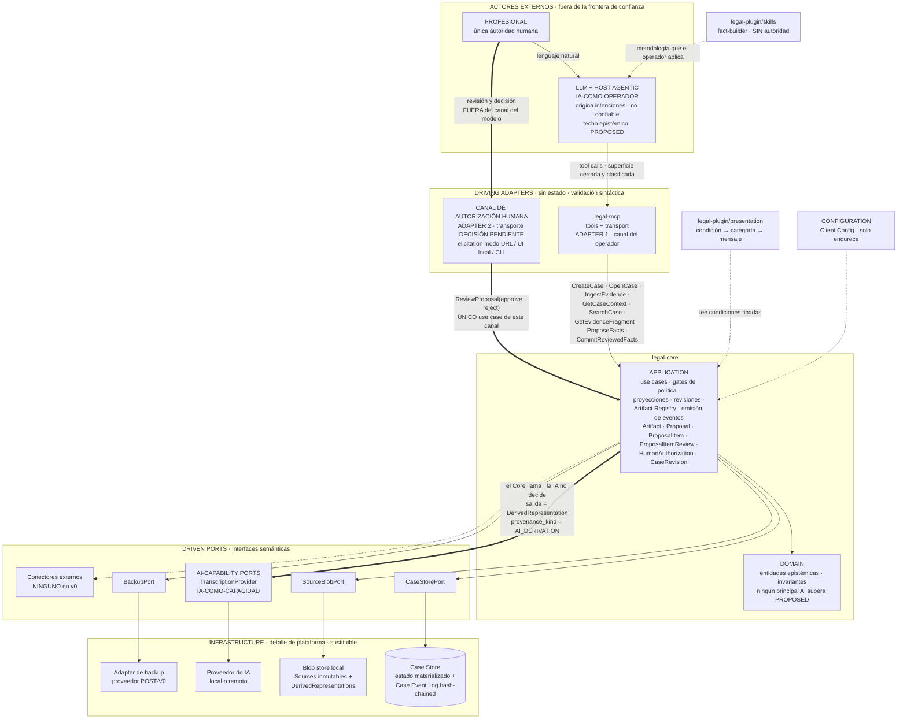
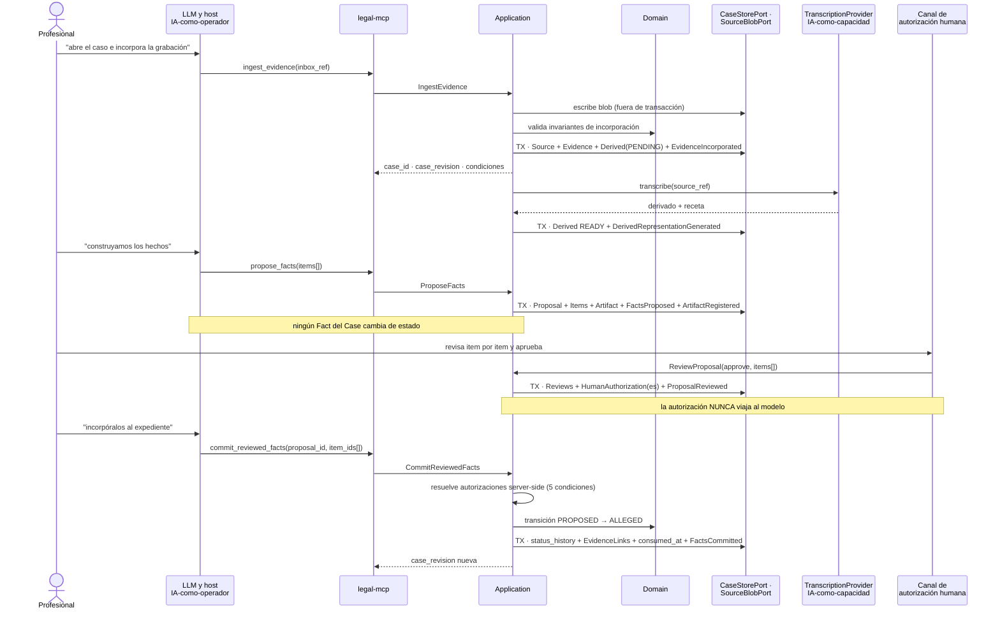

# 01 — Diseño de sistema V0

**Estado:** Technical Design V0 — documento técnico general.
**Precedencia:** por debajo de los ADRs Accepted (001–006) y del kernel técnico v0.4 (`00-technical-kernel.md`). Este documento **no** redefine ninguna regla fijada en esos niveles: la aplica, la materializa técnicamente, y donde detecta contradicción la registra en §9 sin resolverla por su cuenta.

**Qué contiene:** la arquitectura técnica general del V0 — fronteras lógicas del monolito modular, diagrama del sistema completo, flujo técnico extremo a extremo del vertical slice con transacciones y eventos, decisión de stack, roots del filesystem, release mínimo y contrato conceptual de backup.

**Qué NO contiene, y dónde está:** el vocabulario canónico y los contratos de datos (kernel §1–§11); las reglas de frontera y qué vive a cada lado (`docs/architecture/boundaries.md`); el contrato del flujo y su matriz de pruebas (`docs/architecture/vertical-slice-v0.md`); las decisiones de arquitectura y sus alternativas (ADR-001…ADR-006). Este documento **referencia** y no repite.

**Etiquetas usadas:** `HECHO VERIFICADO (fuente)` · `DECISIÓN APROBADA` · `PROPUESTA DEL TECHNICAL DESIGN` (requiere aprobación; listadas en §10) · `HIPÓTESIS` · `SUPUESTO` · `POR VERIFICAR` · `RIESGO` · `DECISIÓN PENDIENTE` · `POST-V0`.

---

## 1. Alcance de este diseño

El V0 debe demostrar **un solo flujo** (`vertical-slice-v0.md`) sobre los parámetros aprobados: una máquina, una usuaria, un escritor, cero subagentes, cero conectores externos, un skill (`fact-builder`), cero Knowledge Packs. Toda decisión de este documento se somete a una prueba única: **¿es necesaria para demostrar el vertical slice sin cooperación del modelo?** Lo que no la pasa está en §11 como POST-V0.

Regla transversal heredada de `boundaries.md`: se distingue siempre **decisión de arquitectura** (regla del sistema, independiente de plataforma) de **detalle de implementación de plataforma** (con qué se materializa). Ninguna feature de host, protocolo o motor de persistencia se convierte en regla del Domain.

---

## 2. Modular monolith — fronteras lógicas

### 2.1 Qué significa "frontera lógica" aquí

**DECISIÓN APROBADA (kernel §13).** Las tres fronteras `legal-core` / `legal-mcp` / `legal-plugin` son **fronteras de dependencia y responsabilidad**, no unidades de despliegue.

**Advertencia normativa — no implica:**

| No implica | Por qué se dice explícitamente |
|---|---|
| **Tres procesos** | En V0 el sistema corre como **un solo proceso**. La topología de procesos es detalle de plataforma; ADR-002 conserva "Core como proceso separado" como *mecanismo de enforcement* válido, no como consecuencia de esta división |
| **Tres paquetes publicables** | No hay publicación, ni versionado independiente, ni resolución de dependencias entre ellos. El versionado es uno solo: `product_version` (§7) |
| **Tres repositorios** | Un repositorio. Separar repos multiplicaría el coste de mantener la coherencia de contratos sin ningún trigger presente (principio 14) |
| **Una jerarquía de carpetas obligatoria** | La estructura de carpetas es *consecuencia* de la regla de dependencias, no su fuente. La regla se verifica sobre los imports, no sobre los nombres de directorio |

Lo que **sí** implica: una regla de dependencias verificable (§2.3), un punto único de composición (§5.4), y la posibilidad de mover `legal-core` a su propio proceso sin tocar Domain ni Application si el enforcement de plataforma lo exigiera (ADR-002, alternativa 4).

### 2.2 Las tres fronteras y su contenido

```text
legal-core
  domain/          entidades epistémicas e invariantes (ADR-003)
                   Case · Source · Evidence · Fact · EvidenceLink ·
                   ProvenanceRecord · ProfessionalDetermination ·
                   DerivedRepresentation · (Statement: definido, no materializado)
  application/     use cases · gates de política · proyecciones · revisiones ·
                   conceptos de soporte (Artifact · Proposal · ProposalItem ·
                   ProposalItemReview · HumanAuthorization · CaseRevision) ·
                   emisión de eventos y condiciones
  ports/           interfaces semánticas declaradas por application
                   driving ports  = los use cases invocables
                   driven ports   = CaseStorePort · SourceBlobPort ·
                                    AI-capability ports · BackupPort · ClockPort · IdPort
  infrastructure/  adapters concretos detrás de los driven ports

legal-mcp
  tools/           las tools de la superficie, con su clase declarada;
                   validación SINTÁCTICA y traducción a códigos semánticos estables
  transport/       el transporte MCP y el ciclo de vida del servidor;
                   Tool Invocation Log

legal-plugin
  skills/          metodología interpretativa (v0: fact-builder). Sin autoridad.
  presentation/    pipeline condición interna → categoría de presentación →
                   mensaje humano por locale (kernel §10)
```

**Precisiones que evitan los tres errores frecuentes:**

1. **`ports` no es una capa** (`boundaries.md`, corrección heredada de v0.1.1). Es un conjunto de interfaces que Application declara; el diagrama lineal `DOMAIN → APPLICATION → PORTS → ADAPTERS` está sustituido por la disposición hexagonal de §3.
2. **`legal-plugin/skills` no contiene lógica crítica.** Un `SKILL.md` es texto que el modelo puede ignorar (principio 3). La regla operativa es su propio test: *si el sistema deja de ser seguro porque el modelo ignoró un skill, hay lógica crítica en el lugar equivocado*.
3. **`legal-plugin/presentation` produce el texto, no controla el canal.** El pipeline de kernel §10 convierte condición interna en mensaje profesional; **quién lo entrega a la usuaria no está bajo nuestro control en V0**. SUPUESTO registrado (vertical-slice, *Conditions emitted to UX*): no conocemos mecanismo que garantice que un modelo transmita un texto literal; POR VERIFICAR si el host permite mostrar salida de tools sin mediación del modelo. Consecuencia de diseño ya vigente: las condiciones se adhieren **al estado y a los Artifacts**, no solo al diálogo.

### 2.3 Regla de dependencias

**DECISIÓN APROBADA (kernel §13).** Dirección permitida de los imports:

| Desde | Puede importar | No puede importar |
|---|---|---|
| `domain` | nada del sistema (solo la librería estándar del lenguaje) | `application`, `infrastructure`, `mcp`, `plugin` |
| `application` | `domain`, `ports` | `infrastructure`, `mcp`, `plugin` |
| `infrastructure` | `ports` (para implementarlos), `domain` (tipos) | `mcp`, `plugin`, y **nunca** `application` (use cases) |
| `mcp` | contratos de `application` (tipos de entrada/salida de los use cases) | `domain` directamente, `infrastructure`, `plugin` |
| `plugin/skills` | nada del Core | **`infrastructure` en absoluto** |
| `plugin/presentation` (`PROPUESTA`; raíz de §2.2) | contratos de `application`: **solo los tipos de `Condition`** (kernel §10; `11` §2) | `domain` directamente, use cases de `application`, `infrastructure`, `mcp`, `plugin/skills` |
| `composition` (`PROPUESTA`; raíz de §5.4) | `application`, `ports`, `infrastructure`, `mcp`, `plugin`: es el único punto que cablea capas | nadie lo importa a él; no es dependencia de ninguna capa |
| `src/` | `src/` | **`experiments/` en absoluto** |

**Nota sobre la fila `plugin/presentation` (corrección de drift, `PROPUESTA DEL TECHNICAL DESIGN`).** §2.2 declara `legal-plugin/presentation` como raíz y el diagrama de §3 le dibuja la arista `presentation -.->|"lee condiciones tipadas"| APP`; la fila `plugin/skills` («nada del Core») **no la cubre**, de modo que hasta ahora esa arista no figuraba en `allowed_edges` de `12` §7.1–§7.2: o el test de arquitectura la prohibía, o —si el mapa no clasificaba la raíz— la capa quedaba sin control. La fila propia cierra ambas lecturas y acota la arista a los **tipos de `Condition`**: `presentation` traduce condiciones a texto, nunca invoca un use case ni conoce el Domain. **`Configuration` no es una capa**: la Client Config se valida en el **composition root** (§5.4), que es la raíz a la que se mapean `11` §7.1 INV-UX-08 y `06` §10 inv. 12.

**PROPUESTA DEL TECHNICAL DESIGN — verificación:** la regla se verifica **en CI con un test de arquitectura** (un test que inspecciona el grafo de imports y falla ante una arista prohibida), no con revisión humana. El kernel §13 la declara "verificable automáticamente más adelante"; adelantarla al V0 cuesta un test y evita que la frontera se erosione durante la implementación, que es exactamente cuando se erosiona. Si esto se considera fuera del mínimo, la alternativa honesta es declarar la regla **no verificada** en V0, no declararla verificada sin mecanismo.

### 2.4 Un proceso, un escritor

- **Un proceso en V0.** DECISIÓN, con condición de reapertura declarada: si el spike de perímetro (ADR-002, DECISIÓN PENDIENTE) concluye que el host concede al modelo herramientas genéricas de filesystem sobre el private state, el mecanismo de enforcement pasa a ser **Core como proceso separado con permisos de SO propios**. Ese cambio es de topología, no de fronteras: los mismos módulos, el mismo contrato, otro límite de proceso.
- **Un escritor por Case.** HECHO VERIFICADO (kernel §1; fuente: sqlite.org): en modo WAL lectores y escritores concurren con **un solo escritor a la vez**, y WAL no funciona sobre filesystems de red. Esto es restricción **del adapter de persistencia**, no del Domain (principio 12, addendum v0.3 B.10). En V0 no está siquiera tensionada: una máquina, una usuaria.

---

## 3. Diagrama del sistema completo

El diagrama muestra separados los **dos roles de la IA** (`boundaries.md` §9) y el **canal de autorización humana como segundo driving adapter**, distinto del canal del modelo.



### 3.1 Lectura del diagrama — los dos roles de la IA

La tabla comparativa completa está en `boundaries.md` §9.3 y no se repite. Lo que este documento añade son las **tres consecuencias técnicas** de la separación:

1. **Dirección de la llamada como criterio único.** Si la llamada entra al Core, es operador (validar todo). Si sale del Core, es capacidad (registrar provenance y `model_id`). No hay tercera categoría, y **el mismo proveedor puede estar en ambos lados** con estatus de confianza distinto: eso no es una anomalía, es el punto.
2. **En V0 solo hay un AI-capability port ejercitado:** `TranscriptionProvider`. **El skill `fact-builder` NO entra por este port**: se ejecuta del lado del operador, y su salida entra al Core por `propose_facts` como cualquier otra entrada no confiable, con `principal_type = AI` y `provenance_kind = AI_INFERENCE`. Confundir ambas cosas —tratar `fact-builder` como capacidad interna— convertiría al operador en componente confiable por la puerta de atrás.
3. **El canal humano no toca ningún port de IA ni la superficie MCP.** Su única salida hacia el Core es `ReviewProposal`. Cualquier diseño en el que la autorización humana llegue como parámetro de una tool anula la garantía completa de ADR-005.

### 3.2 Corrección semántica obligatoria en todo el diagrama

Kernel §1, sin excepción en ningún artefacto de este diseño:

- `Principal (principal_id, principal_type ∈ HUMAN | AI | SYSTEM, principal_role)` = **quién ejecutó**.
- `provenance_kind ∈ EXTERNAL_SOURCE | AI_DERIVATION | AI_INFERENCE | HUMAN_DECISION | SYSTEM` = **naturaleza epistémica del origen**.
- **Nunca** `principal_type = HUMAN_DECISION`, ni `actor_type` con valor epistémico. La incorporación registra el origen del material en el sobre de ingestión (`declared_origin`), nunca como principal.

---

## 4. Flujo técnico extremo a extremo del vertical slice

### 4.1 Reglas de transacción y de evento

**PROPUESTA DEL TECHNICAL DESIGN.** Cinco reglas que gobiernan la tabla siguiente:

1. **Una transacción por use case mutador.** Un use case mutador abre exactamente una transacción del Case Store; dentro de ella ocurren *todas* sus mutaciones y se anexan *todos* sus eventos. No existe mutación fuera de transacción, ni evento anexado fuera de la transacción de su mutación. Consecuencia directa de la biyección mutación↔evento (ADR-004 inv. 5): si el evento pudiera anexarse aparte, la biyección dependería de que nada falle en medio.
2. **El hash-chain se calcula y se anexa dentro de esa misma transacción**, tomando `prev_event_hash` del último evento del Case. Con un solo escritor por Case (§2.4) no hay carrera posible; con más de uno, la serialización del contador `event_seq` sería una precondición adicional a diseñar (POST-V0).
3. **Los bytes se escriben antes de abrir la transacción canónica.** `IngestEvidence` escribe el blob en el `SourceBlobPort` y **después** abre la transacción que registra el `Source`. Razón: una referencia canónica a bytes inexistentes es corrupción del expediente; un blob huérfano sin referencia canónica es basura recolectable. Se prefiere basura a corrupción. La limpieza de blobs huérfanos es POST-V0 (en V0 quedan y no molestan).
4. **El Tool Invocation Log se escribe fuera de la transacción canónica**, por `legal-mcp/transport`. Debe registrarse también —y sobre todo— cuando la invocación es **rechazada**, porque los tests adversariales exigen traza de intentos que no produjeron ningún evento. Un fallo al escribir este log nunca aborta ni revierte una transacción canónica: no es estado canónico (ADR-004 inv. 8).
5. **Las condiciones no se persisten en V0.** SUPUESTO ya registrado (vertical-slice, *Persisted state*): las condiciones activas que devuelve `pending` se computan del estado. No hay tabla de condiciones.

**Aclaración de la lista cerrada de eventos.** La creación de una `DerivedRepresentation` en estado `PENDING` durante `IngestEvidence` **no es una mutación aparte**: forma parte del payload de `EvidenceIncorporated` y ocurre en su misma transacción. PROPUESTA DEL TECHNICAL DESIGN, con su razón: la lista cerrada de eventos v0 (kernel §8.1) no contiene ningún evento para "derivación solicitada", y crear uno sería cambio de contrato (ADR-004 inv. 6). La alternativa —tratarla como mutación sin evento— rompería la biyección.

### 4.2 Aritmética de revisión — modelo vigente tras la enmienda AC-02

**DECISIÓN APROBADA (dueños — enmienda AC-02).** Este punto estuvo en conflicto documentado entre el kernel y dos ADRs Accepted; los dueños lo resolvieron **aprobando el amendment**. El desenlace completo está en **§9.2**. Este documento aplica:

- **Modelo B — VIGENTE (kernel §5.2, §7, §8.1 y §9; enmienda AC-02 aprobada):** `ProposalReviewed` avanza `event_seq` pero **no** `case_revision`, y lleva `case_revision` **nula**; la autorización congela como `expected_case_revision` la revisión **vigente** del Case en el momento del acto de revisión (no `base_case_revision`). La biyección mutación↔evento se expresa sobre `event_seq`, con `case_revision` como **subsecuencia** de los eventos canónicos, y el hash-chain encadena por `event_seq`.
- **Modelo A — anterior, superado por AC-02:** ADR-004 (b)1 y ADR-005 inv. 9–10 **en su redacción previa** — `ReviewProposal(approve)` emitía `ProposalReviewed` **y avanzaba `case_revision`**; la autorización congelaba la revisión resultante de ese mismo acto, que es la circularidad que AC-02 elimina. Se conserva como columna rotulada de la tabla, **solo para trazabilidad de la numeración anterior**; no rige.

La columna «Modelo A (anterior, superado)» queda como registro de dónde cambiaron los números. **Ningún otro punto del diseño dependía del resultado, y ninguno cambia por la aprobación.**

### 4.3 Recorrido paso a paso

Numeración ilustrativa del mecanismo, no valores fijos. `event_seq` avanza en todo evento; `case_revision` solo en eventos que mutan estado epistémico canónico, y es **nula** en los que no (kernel §8.1, enmienda AC-02 aprobada). **La columna vigente es la última**; la de Modelo A se conserva como registro de la aritmética superada.

| # | Quién actúa | Componente | Transacción | Mutaciones | Evento(s) | `event_seq` | `case_revision` — Modelo A (anterior, superado) | `case_revision` **VIGENTE** (Modelo B · AC-02) |
|---|---|---|---|---|---|---|---|---|
| 1 | Operador → `create_case` | `legal-mcp/tools` → `CreateCase` | TX-1 | Case con `case_id` UUIDv7 emitido por el Core; idempotency key derivada por el Core | `CaseCreated` | 1 | 1 | 1 |
| 2 | Operador → `open_case` | `OpenCase` | — (lectura) | ninguna. Resuelve etiqueta natural → `case_id`; ante ambigüedad devuelve **candidatos**, jamás adivina | — | — | 1 | 1 |
| 3 | Operador → `ingest_evidence` (audio) | `IngestEvidence` | escritura de blob **antes** de TX-2 | `Source` (bytes + SHA-256 + provenance de incorporación, `provenance_kind = EXTERNAL_SOURCE`, `principal_type = HUMAN`), `Evidence` (rol en el Case), `DerivedRepresentation` en `PENDING` dentro del mismo payload | `EvidenceIncorporated` | 2 | 2 | 2 |
| 4 | Core (interno, asíncrono) | `GenerateDerivedRepresentation` → `TranscriptionProvider` | TX-3 (propia; el trabajo del proveedor ocurre **fuera** de toda transacción) | `DerivedRepresentation` `PENDING → READY` con versión, hash, receta y referencia obligatoria al Source; `provenance_kind = AI_DERIVATION`, `principal_type = AI` | `DerivedRepresentationGenerated` (o `…Failed`) | 3 | 3 | 3 |
| 5 | Operador → `get_case_context(pending)` | `GetCaseContext` | — (lectura) | ninguna | — | — | 3 | 3 |
| 6 | Operador → `ingest_evidence` (documento) | `IngestEvidence` | blob + TX-4 | segundo `Source` + `Evidence` + derivación `PENDING` | `EvidenceIncorporated` | 4 | 4 | 4 |
| 7 | Core (interno) | `GenerateDerivedRepresentation` | TX-5 | texto normalizado `READY` | `DerivedRepresentationGenerated` | 5 | 5 | 5 |
| 8 | Operador → `search_case`, `get_evidence_fragment` | `SearchCase`, `GetEvidenceFragment` | — (lectura) | ninguna. Fragmentos con id + cadena de provenance hasta el original | — | — | 5 | 5 |
| 9 | Operador (aplicando `fact-builder`) → `propose_facts` | `ProposeFacts` | TX-6 | `Proposal` + `ProposalItem[]` con `proposal_item_id` opaco y `item_content_hash`; `review_decision = PENDING`, `commit_state = UNCOMMITTED`; **y** `Artifact FactAnalysis` registrado internamente con `inputs[]` por `entity_id + content_hash`. Rechazo sintáctico si un hecho llega sin referencia de provenance ni marca "solo alegado" | `FactsProposed` **+** `ArtifactRegistered` (dos mutaciones, una transacción) | 6, 7 | 6, 7 | 6, 7 |
| 10 | **Profesional**, por el canal humano | `ReviewProposal(approve)` | TX-7 | `ProposalItemReview` por item (append-only, con `review_session_id`); `review_decision = APPROVED`; una `HumanAuthorization` **por item** con `item_content_hash`, `expected_case_revision`, `authorized_operation = COMMIT_FACT`, `authorization_source`, `expires_at` | `ProposalReviewed` | 8 | 8 | **NULL** — `case_revision` no avanza: el Case sigue en **7**; la autorización congela **7** (la revisión vigente al revisar, no `base_case_revision`) |
| 11 | Operador → `commit_reviewed_facts(proposal_id, item_ids[])` | `CommitReviewedFacts` | TX-8 | verificación server-side de las cinco condiciones (kernel §2.3); `Fact` `PROPOSED → ALLEGED` como **entrada nueva** de `status_history`; `EvidenceLink` `ACTIVE`; `consumed_at` marcado; `commit_state = COMMITTED` | `FactsCommitted` | 9 | 9 | 8 |
| 12 | — (cierre de sesión) | — | **ninguna** | ninguna. Cerrar sesión no es operación del Core: sin use case, sin tool, sin evento | — | — | 9 | 8 |
| 13 | Operador (sesión nueva) → `open_case` + `get_case_context(overview)` + `changes_since(ancla de la sesión anterior)` | `OpenCase`, `GetCaseContext` | — (lectura) | ninguna. La orientación se reconstruye **desde el estado canónico**, sin memoria conversacional | — | — | 9 | 8 |
| 14 | Operador → `ingest_evidence` (tercer documento) | `IngestEvidence` **+ propagación de staleness dentro del mismo mutador** | TX-9 (una sola) | tercer `Source` + `Evidence`; `Artifact.stale = true`, `stale_reasons = [NEW_EVIDENCE]`. **Nada se regenera automáticamente** | `EvidenceIncorporated` **+** `ArtifactMarkedStale` | 10, 11 | 10, 11 | 9, 10 |
| 15 | Operador → `get_case_context(pending)` | `GetCaseContext` | — (lectura) | ninguna. Devuelve el artifact stale con `ANALYSIS_STALE {reasons:[NEW_EVIDENCE]}` adherida al artifact; el delta viaja como **contenido** de `changes_since`, no como condición | — | — | 11 | 10 |

**Tres lecturas obligatorias de la tabla:**

- **Los pasos 9 y 14 son cada uno UNA invocación que produce DOS eventos.** Es la biyección mutación↔evento funcionando, no una excepción: mutación = cambio de estado canónico registrado, no invocación de tool (ADR-004 inv. 5, **hoy expresado sobre `event_seq`** por la enmienda AC-02).
- **El paso 10 no pasa por el modelo.** Es la única fila cuyo actor es la profesional y cuyo adapter es el canal humano. Si esa fila pudiera ejecutarse desde `legal-mcp`, todo ADR-005 sería decorativo.
- **El paso 10 es el único evento del recorrido con `case_revision` nula.** Bajo la enmienda AC-02, `ProposalReviewed` avanza `event_seq` (8) y deja `case_revision` en `NULL`: el expediente sabe exactamente lo mismo antes y después de la revisión, de modo que el reloj epistémico no se mueve. Consecuencia directa: el ancla precisa del delta de sesión es `event_seq`, no la revisión (kernel §9, `CaseContextResponse.event_seq`).

### 4.4 El mismo flujo, como secuencia



### 4.5 Forma de las respuestas y de los rechazos

**PROPUESTA DEL TECHNICAL DESIGN.** Los rechazos de dominio y de aplicación **no son excepciones**: son resultados tipados. Las excepciones quedan reservadas a fallos de infraestructura (disco, proveedor caído, transacción abortada).

```ts
// Conceptual — NO es código de producción.

type UseCaseResult<T> =
  | { ok: true;  value: T;            conditions: Condition[] }
  | { ok: false; error: SemanticError; conditions: Condition[] };

interface SemanticError {
  code: string;          // estable, versionado con el contrato de la superficie
  // sin stack trace, sin ruta, sin nombre de tabla, sin SQL
}

interface Condition {
  code: ConditionCode;                  // catálogo cerrado v0
  family: 'EPISTEMIC' | 'AUTHORITY' | 'INFRASTRUCTURE';   // kernel §10
  params: Record<string, unknown>;
}

// Sobre común a TODA respuesta de tool (ADR-001 inv. 8)
interface ToolEnvelope<T> {
  case_id: string;
  case_revision: number;
  payload: T;
  conditions: Condition[];
}
```

Razón: un rechazo por invariante es un resultado esperado y frecuente del sistema —los tests adversariales lo prueban diez veces—, no una anomalía. Modelarlo como excepción invita a capturarlo genéricamente y a perder el código semántico por el camino.

---

## 5. Stack

### 5.1 Base

- **TypeScript en configuración estricta + Node.js LTS.** DECISIÓN APROBADA (kernel §13). La versión concreta de Node se fija en implementación contra fuente oficial; **no se congela aquí** y no se afirma ninguna capacidad de runtime sin verificarla.
- **POR VERIFICAR — conjunto exacto de flags del compilador.** Candidatos por su efecto (`strict`, y los que endurecen accesos indexados, propiedades opcionales y overrides). No se declaran como HECHO VERIFICADO porque no se ha consultado la documentación oficial en esta fase; se fijan en implementación con su fuente.
- **POR VERIFICAR — `UUIDv7` en Node LTS** (kernel §11): soporte real, nativo o por dependencia. Alternativa equivalente registrada: ULID. La propiedad exigida es la del kernel —opaco, estable, ordenable por tiempo, generable offline, no derivado del contenido—, no la librería.
- **Presupuesto de dependencias.** PROPUESTA: cada dependencia de `legal-core` debe justificarse contra la pregunta "¿qué invariante o qué capacidad de plataforma resuelve que no podamos escribir?". `domain` idealmente sin dependencias de terceros. Razón: cada dependencia en el Domain es un futuro acoplamiento a algo que no controlamos, y el principio 10 exige lo contrario.

### 5.2 Sin framework grande — por qué NestJS no se justifica aquí

**PROPUESTA DEL TECHNICAL DESIGN**, elaborando kernel §13.

Lo que un framework de este tipo aporta, y por qué aquí no compra nada:

| Lo que aportaría | Situación real del V0 |
|---|---|
| Contenedor de **inyección de dependencias** | El grafo de dependencias del V0 es pequeño y estático: un puñado de use cases y cinco o seis ports. Se resuelve con **composición explícita e inyección por constructor** en un único composition root (§5.4), que además es legible de arriba abajo sin conocer las reglas del contenedor |
| **Modularidad** y límites entre módulos | Los límites ya están fijados por la regla de dependencias (§2.3) y se verifican sobre el grafo de imports. Un sistema de módulos del framework añadiría una segunda definición de "módulo" que puede divergir de la primera |
| Capa **HTTP/REST** con routing, pipes, guards | No hay superficie HTTP en V0. El transporte es MCP, y el canal humano es una DECISIÓN PENDIENTE que puede no ser HTTP en absoluto |
| **Interceptores** transversales (logging, validación) | Los dos puntos transversales que existen —Tool Invocation Log y validación sintáctica— viven en `legal-mcp`, que es un adapter delgado y explícito |

Lo que costaría, y por qué el coste es exactamente el que este proyecto no puede pagar:

1. **Decoradores y metadatos en el Domain.** El estilo de estos frameworks empuja anotaciones al lugar donde se declaran los tipos. Un Domain anotado con decoradores del framework **está acoplado al framework**: cambiarlo obliga a tocar entidades e invariantes. Eso contradice frontalmente el principio 10 (*Domain is vendor-independent*), cuya prueba es la sustitución: cambiar de host, de modelo o de motor no debe tocar ningún invariante.
2. **Resolución implícita.** Un contenedor que resuelve por tipo o por token mueve el cableado a un lugar que no se lee: el fallo de configuración se descubre en runtime. Este sistema tiene un requisito duro en sentido contrario (kernel §4): si el provider resuelto es el stub de autorización y la configuración efectiva es de producción, **el arranque debe abortar**. Ese chequeo es trivial y auditable en un composition root explícito; a través de un contenedor es una convención más que verificar.
3. **Superficie de plataforma que no controlamos.** Un framework grande trae su propio ciclo de vida, su propio versionado y sus propias suposiciones. `principles.md` 14 exige la solución más simple que satisfaga los invariantes para el alcance real: una usuaria, una máquina, cero subagentes.

**Alternativa no rechazada, sí descartada por ahora:** un contenedor de DI mínimo sin decoradores. No aporta sobre la composición explícita a esta escala; queda registrado como opción disponible si §5.3 se dispara.

### 5.3 Condiciones bajo las que se reevaluaría

Se registran como **triggers medibles**, no como intuiciones. La decisión se reabre si ocurre cualquiera de estos:

| Trigger | Umbral / evidencia que lo dispara |
|---|---|
| Aparece una **superficie HTTP real** con autenticación, sesiones y múltiples clientes | Que exista un cliente distinto del host agentic y del canal humano local |
| **Más de un transporte simultáneo** para el mismo conjunto de use cases | Dos o más adapters de entrada activos con necesidades transversales comunes (auth, rate limiting, tracing) |
| **Escala del cableado** | El composition root deja de ser legible de una sola pasada — señal práctica: más de ~30 nodos o dependencias condicionales por entorno que se ramifican |
| **Equipo** | Más de una persona escribiendo Core de forma concurrente y necesidad de convenciones impuestas por herramienta y no por revisión |
| **Requisitos operacionales** de observabilidad estandarizada | Telemetría y trazas distribuidas — hoy explícitamente fuera del V0 |

Ninguno está presente hoy. Si alguno se dispara, la reevaluación es de `legal-mcp` e `infrastructure` hacia fuera: **el Domain no se anota con nada, en ningún escenario**.

### 5.4 Composition root

**PROPUESTA DEL TECHNICAL DESIGN.** Un único punto donde se construye el sistema, y donde ocurre —en este orden— la validación de arranque de §7.3:

```ts
// Conceptual — NO es código de producción.

interface CoreDependencies {
  caseStore:        CaseStorePort;
  sourceBlobs:      SourceBlobPort;
  transcription:    TranscriptionProviderPort;
  backup:           BackupPort;
  clock:            ClockPort;       // el tiempo es una dependencia, no una llamada global
  ids:              IdPort;          // identidad opaca emitida por el Core
  humanAuthChannel: HumanAuthorizationChannelPort;  // REAL | DEV_STUB
}

// Regla dura, no advertencia (kernel §4):
// si effectiveConfig.environment === PRODUCTION y humanAuthChannel es el stub,
// el arranque ABORTA. No hay modo degradado. Test obligatorio AT-013.
```

Propiedades exigidas: sin service locator, sin resolución por reflexión, sin estado global. `ClockPort` e `IdPort` como dependencias explícitas no son ceremonia: son la condición para que el golden test de regeneración determinista (ADR-004, validación 1) y los tests de expiración de autorizaciones sean escribibles.

---

## 6. Roots del filesystem

### 6.1 Advertencia previa, antes de la tabla

**El layout lógico NO es una ruta fija de Windows.** ADR-002 lo fija sin ambigüedad: *la decisión es la separación, no el path*; una ubicación tipo AppData es **ejemplo ilustrativo**, jamás decisión de arquitectura. Nada en este documento —ni en el manifest, ni en la configuración, ni en un mensaje a la usuaria— debe hardcodear o exponer una ruta concreta. Los nombres de abajo son **identidades lógicas** que la instalación resuelve a ubicaciones reales.

Consecuencia práctica: la resolución de rutas vive en `infrastructure`, detrás de los ports; ni `domain` ni `application` conocen una ruta jamás. Y ninguna tool acepta rutas (ADR-002 inv. 3).

### 6.2 Tres ciclos de vida, cinco ubicaciones lógicas

Los **ciclos** son tres (`boundaries.md` §10): sellado por release, mutación controlada, operativo. El tercero se parte en dos zonas con regímenes de acceso opuestos (ADR-002), lo que da cinco ubicaciones lógicas.

| Root lógico | Ciclo | Contenido | **Quién escribe** | Quién lee | Canónico |
|---|---|---|---|---|---|
| `runtime/` | **Sellado por release** | Core, MCP, use cases, invariantes, reglas ejecutables, skills críticos, `manifest`, `product_version` | **Solo el procedimiento de instalación/release.** Ni el Core en operación, ni la usuaria, ni el host, ni el modelo | El Core al arrancar (verificación de integridad) | No |
| `configuration/` | **Mutación controlada** | Client Config validada por schema, `configuration_version`, Knowledge Packs (**ninguno en v0**) | El procedimiento de configuración del producto, validado por schema. **Nunca el modelo.** El Core no la reescribe en operación normal | El Core al arrancar y en los gates de política | No |
| `private-state/` | **Operativo** | Case databases, Case Event Log, Sources, DerivedRepresentations, registro de HumanAuthorization, Artifact Registry, índices, integrity metadata, Tool Invocation Log | **Solo el Core.** No existe camino soportado de escritura para el host, el modelo o la usuaria | Solo el Core | **Sí** |
| `user-workspace/Inbox/` | **Operativo** | Material de entrada aún no incorporado | La usuaria y el host | El Core, **solo** para resolver una referencia de Inbox y hacer snapshot | No |
| `user-workspace/Working/` | **Operativo** | Borradores de la usuaria | La usuaria y el host | **Nadie del Core.** PROPUESTA: el Core no lee `Working/` en ninguna operación; la única puerta de entrada de material es `Inbox/` vía `ingest_evidence` | No |
| `user-workspace/Exports/` | **Operativo** | Salidas producidas para la usuaria | El Core (escribe salidas) **y** la usuaria/host (son suyas) | La usuaria | No |

**Cuatro reglas que la tabla implica y conviene enunciar:**

1. **Nada del `user-workspace` es canónico** (ADR-002 inv. 1), incluidos los `Exports/`. **PROPUESTA:** un export **no es un Source**; si material que salió por `Exports/` debe fundamentar algo, se incorpora de nuevo por `Inbox/` → `ingest_evidence`, con su propia provenance. Sin esta regla, un export editado a mano podría reentrar como si conservara la custodia del original.
2. **Tras la incorporación, el archivo de `Inbox/` deja de ser la fuente** (ADR-002 inv. 4). Alterarlo o borrarlo no afecta al Source ni a los derivados.
3. **`runtime/` no se escribe en operación.** Que el producto escriba en su propio directorio sellado invalidaría la verificación de integridad de la que depende §7.
4. **El mecanismo que impone estas reglas es detalle de plataforma y es DECISIÓN PENDIENTE** (ADR-002): deny rules por ruta + hooks bloqueantes —HECHO VERIFICADO (kernel §1; fuente: code.claude.com/docs — permissions, hooks) para Claude Code, POR VERIFICAR para Cowork— o Core como proceso separado con permisos de SO propios. **RIESGO:** con el mecanismo mal configurado, esta tabla degrada a convención. La mitigación independiente del host es la validación autoritativa en Application, que no depende de ella.

---

## 7. Release mínimo V0

### 7.1 Las tres versiones

**DECISIÓN APROBADA** para `product_version` y `schema_version` (kernel §13, `boundaries.md` §10). **PROPUESTA DEL TECHNICAL DESIGN** para `configuration_version`.

| Versión | Qué versiona | Dónde vive | Quién la cambia |
|---|---|---|---|
| `product_version` (semver) | El producto sellado: Core, MCP, reglas ejecutables, skills críticos | `runtime/`, declarada en el manifest | Un release |
| `schema_version` | La forma del estado persistido | `private-state/` (en el propio estado, no fuera de él) | Una migración |
| `configuration_version` | La forma de la Client Config | `configuration/` | Un cambio de configuración validado |

**Por qué tres y no una:** mezclar código y datos en una sola versión es el error clásico que impide responder "¿este estado es legible por este producto?" sin abrirlo. **PROPUESTA:** el manifest declara el rango de compatibilidad (`min_schema` / `max_schema`); un estado fuera de rango **no se abre en modo normal**, se degrada o exige migración explícita — nunca se abre "a ver qué pasa".

`configuration_version` se propone porque una configuración solo puede endurecer políticas (Product Floor) y su rechazo debe ser **reproducible**: sin versión, "esta configuración fue rechazada" no es una afirmación verificable en el tiempo. Si los dueños la consideran fuera del mínimo, la consecuencia honesta es que la validación de configuración no es reproducible entre releases, y eso debe decirse.

### 7.2 Alcance exacto del release V0

Lo que **sí** entra (kernel §13, `boundaries.md` §10 — la lista completa, y nada más):

1. `product_version` · 2. `schema_version` · 3. `configuration_version` (propuesta) · 4. `manifest` con hashes del producto sellado · 5. verificación de integridad al arranque · 6. migraciones numeradas **solo-adelante** · 7. **backup verificado** antes de cada migración · 8. degradación a **solo-lectura** ante fallo de integridad.

Lo que **no** entra, como **decisión y no omisión**: **sin actualizador automático, sin firma de código, sin telemetría, sin canales de release.** Ninguno tiene trigger en el alcance actual y cada uno tiene coste.

**Límite declarado, sin adornos:** el producto detecta modificaciones y protege a la usuaria de romperlo accidentalmente. **No existe inmutabilidad frente a un usuario deliberadamente hostil con control total del equipo** (kernel §8.3: tamper-evident, no tamper-proof). No se promete lo contrario en ninguna superficie.

### 7.3 Secuencia de arranque

```text
1. Verificar integridad del producto sellado contra el manifest
   ├─ falla ─────────────────► MODO SOLO-LECTURA (§7.4). No se continúa al paso 2.
   └─ ok
2. Cargar y validar Client Config contra su schema
   ├─ inválida ──────────────► RECHAZO VISIBLE. Nunca degradar en silencio a defaults:
   │                            un default silencioso convierte un error de configuración
   │                            en una política tácita.
   └─ ok
3. Resolver dependencias en el composition root
   └─ configuración de PRODUCCIÓN + provider de autorización = DEV_STUB
      ──────────────────────► ABORTA EL ARRANQUE (kernel §4; test AT-013).
4. Comparar schema_version del estado con el rango del manifest
   ├─ dentro de rango ───────► abrir
   ├─ requiere migración ────► BACKUP → VERIFICAR BACKUP (§8) → migrar → reverificar
   │                            (backup no verificado ⇒ NO se migra)
   └─ superior al producto ──► no abrir en modo normal: el estado es de un producto
                               más nuevo. Solo-lectura o mensaje de producto.
5. Rechazar apertura en modo producción de un Case que contenga
   autorizaciones DEV_STUB consumidas (kernel §4)
6. Estado operativo
```

**Migraciones — PROPUESTA DEL TECHNICAL DESIGN con dos reglas duras:**

- **Numeradas y solo-adelante**, sin down-migrations (DECISIÓN APROBADA). El rollback de datos es **restauración de backup**, no migración inversa.
- **Preservación del hash-chain.** Una migración puede cambiar la representación física del estado, pero **no puede cambiar los bytes canónicos sobre los que se computó `event_hash`**. Si alguna vez una migración necesitara re-normalizar payloads de eventos, la cadena tendría que re-anclarse: eso es **cambio de contrato de auditoría**, requiere decisión explícita y no puede ocurrir como efecto colateral de una migración de schema.
- **Las migraciones no emiten eventos del Case Event Log ni avanzan `case_revision`**: no son mutaciones del estado epistémico. Se registran en su propio log de runtime, con `principal_type = SYSTEM` y `provenance_kind = SYSTEM`. Fuera de la superficie del modelo (clase `ADMIN` vacía por diseño).

### 7.4 Degradación a solo-lectura

**Semántica exacta, PROPUESTA:**

| Sigue disponible | Queda bloqueado |
|---|---|
| Abrir un Case y servir proyecciones | Toda operación mutadora, sin excepción |
| Leer fragmentos y Sources | Escritura en `private-state/` |
| Verificar el hash-chain y re-hashear Sources | Escritura en `Exports/` — **incluida**: el modo solo-lectura no escribe *en ninguna parte* |
| Ejecutar backup y verificación de backup | Migraciones |

El sistema **no continúa como si nada**: deja de escribir y lo dice (`boundaries.md` §10, punto 7).

### 7.5 Mensaje a la usuaria ante fallo de integridad

**Restricción de diseño que condiciona el canal:** el fallo ocurre **antes de cualquier invocación de tool**, es decir, antes de que exista conversación. Por tanto **este mensaje no puede depender del modelo para llegar**: debe emitirlo una superficie que el producto controle (el runtime al arrancar, o el mismo canal local que resuelva la DECISIÓN PENDIENTE de ADR-005). Un mensaje de integridad que solo exista en el chat no existe.

**Segunda precisión:** esto **no es una condición del catálogo v0**. Las siete condiciones son del Core sobre operaciones del expediente; el arranque degradado es **mensaje de producto**, coherente con addendum v0.3 B.6. *(DECISIÓN PENDIENTE: si el fallo de integridad merece condición propia cuando exista superficie para mostrarla.)*

**Redacción (es-CO). SUPUESTO hasta validarla con la usuaria; el mecanismo no depende de la redacción:**

> **No fue posible confirmar que los archivos del programa estén tal como se instalaron.** Por precaución, el programa se abrió en **modo de solo consulta**: usted puede abrir sus expedientes y revisar todo lo que ya está registrado, pero por ahora no se guardará ningún cambio.
>
> **Sus expedientes no se modificaron y no se perdió nada.** Los documentos originales siguen guardados tal como se incorporaron.
>
> Para volver al funcionamiento normal hay que reinstalar el programa desde su origen o pedir soporte técnico. Ese procedimiento no toca sus expedientes ni sus documentos.

Cumple las reglas de fidelidad epistémica obligatorias (vertical-slice, *Conditions emitted to UX*): dice qué pasó, **qué no cambió en el expediente**, y qué puede hacer la usuaria; no promete ninguna acción autónoma futura; no expone ingeniería.

**Lo que este mensaje NUNCA debe decir** — contraejemplos que fallarían el criterio 12 del §34 (*sin exposición de ingeniería*): «SHA-256 mismatch», «checksum inválido en manifest.json», «hash esperado ≠ hash calculado», «error de verificación de integridad en `runtime/`», o cualquier ruta del sistema de archivos.

---

## 8. BackupPort — contrato conceptual

### 8.1 Las dos exigencias

1. **El Case Store debe ser exportable y restaurable.** Sin capacidad de sacar el estado canónico completo y volver a ponerlo, la promesa de custodia local es una promesa de pérdida.
2. **Un backup no es válido solo porque el archivo exista.** Un archivo escrito no es un backup: es un archivo. La mayoría de estrategias de respaldo fallan en el *restore*, no en el *write*. **Un backup solo cuenta como backup tras un round-trip de restauración verificado.**

**Distinción necesaria para no contradecir el alcance del slice.** El vertical slice excluye explícitamente *"export/portabilidad del expediente"* como funcionalidad de producto. Eso es otra cosa:

| | Backup / restore (V0) | Export / portabilidad del expediente (POST-V0) |
|---|---|---|
| Propósito | Continuidad operativa y precondición de migración | Entregar un expediente a otra persona, producto o sistema |
| Formato | Opaco, propio, no documentado como contrato | Formato de intercambio estable y documentado |
| Destinatario | El mismo producto, misma máquina | Terceros |
| En V0 | **Sí**, en la lista mínima de release | **No** |

### 8.2 Contrato

```ts
// Conceptual — NO es código de producción.

interface BackupPort {
  create(scope: BackupScope): Promise<BackupRef>;

  /** Verificación REAL: restaura a una ubicación de trabajo aislada y compara.
   *  Un port cuyo verify() solo lea metadatos NO satisface este contrato. */
  verify(ref: BackupRef): Promise<VerificationReport>;

  /** Restauración a una ubicación explícita. NUNCA sobre el estado vivo
   *  sin una decisión humana previa: restaurar es destruir lo que hay. */
  restore(ref: BackupRef, target: RestoreTarget): Promise<RestoreReport>;

  list(): Promise<BackupRecord[]>;
}

interface BackupRecord {
  ref: BackupRef;
  created_at: string;
  product_version: string;
  schema_version: number;
  configuration_version: string;
  status: 'UNVERIFIED' | 'VERIFIED' | 'FAILED';   // solo VERIFIED habilita migrar
  last_verified_at?: string;
  principal: Principal;          // quién lo ejecutó (principal_type = HUMAN | SYSTEM)
}

interface VerificationReport {
  verified: boolean;
  checks: {
    restores_to_scratch: boolean;      // se restauró a ubicación aislada
    schema_version_readable: boolean;
    event_chain_intact: boolean;       // hash-chain verificable de punta a punta
    source_bytes_match: boolean;       // re-hash de Sources == hash registrado
    referenced_derivations_present: boolean;
    entity_counts_match: boolean;
  };
  failures: { check: string; where: string }[];   // sin rutas, sin stack traces
}
```

**Regla dura derivada:** `status = VERIFIED` es la **única** entrada válida al gate de migración (§7.3, paso 4). Un backup `UNVERIFIED` no habilita migrar; la migración no ocurre.

### 8.3 Qué debe contener un backup

**PROPUESTA DEL TECHNICAL DESIGN.** El criterio no es "lo que es canónico" sino **"lo que no puede reconstruirse"**:

| Contenido | ¿Entra? | Razón |
|---|---|---|
| Case databases + estado materializado | **Sí** | Canónico |
| Case Event Log completo (con la cadena) | **Sí** | Canónico e irrecuperable; sin él no hay auditoría |
| Sources (bytes originales) | **Sí** | Irrecuperables por definición: son la fuente primaria |
| Registro de HumanAuthorization y de ProposalItemReview | **Sí** | Es la prueba de la autoridad humana |
| Artifact Registry | **Sí** | Canónico |
| **DerivedRepresentations referenciadas por un fragmento** | **Sí** | **Regenerable ≠ prescindible.** Un `EvidenceLink` ancla a `{source_version_hash, selector}`: si el derivado exacto desaparece, el Source sobrevive pero **la cadena de provenance se rompe**. Excluirlas por "son regenerables" es el error silencioso más caro de esta lista |
| DerivedRepresentations no referenciadas | Opcional | Regenerables por su receta y sin referencias que romper |
| Índices FTS | No | Regenerables, sin referencias |
| Metadatos de versión (`product_`, `schema_`, `configuration_version`) | **Sí** | Sin ellos no se sabe qué producto puede leer el backup |
| Snapshot de la Client Config | **Sí** | Restaurar estado bajo otra configuración cambia los gates aplicables |
| Tool Invocation Log | Opcional | No canónico y podable (ADR-004 inv. 8) |

### 8.4 Lo que queda fuera de V0

- **El proveedor concreto es POST-V0.** El port se declara y se usa; el adapter concreto (disco local, disco externo cifrado, ubicación de la oficina) no se elige aquí.
- **DECISIÓN PENDIENTE (dueños, no técnica): topología de backup.** Local-only significa que la pérdida del equipo destruye todo; una segunda ubicación cruza con confidencialidad y con términos de terceros. Es decisión de negocio.
- **POST-V0:** programación automática, retención, backups incrementales, cifrado del backup, restauración parcial por Case.

---

## 9. Conflictos y divergencias registradas

Este documento **no resuelve** ninguno por su cuenta: los registra con la información necesaria para que los dueños decidan. Cuando la decisión llega —enmiendas **AC-01…AC-04**, aprobadas— el bloque **no se borra**: se le añade el desenlace, porque es el registro de por qué se decidió.

### 9.1 RESUELTO — enmienda AC-03 aprobada: tamaño de la superficie MCP

> **DESENLACE (dueños, enmienda AC-03).** La superficie MCP de v0 es de **OCHO tools**: `register_artifact` queda **retirado**. ADR-001 inv. 3 y su validación 7 quedan **enmendados** de nueve a ocho; el registro del `FactAnalysis` es interno a la transacción de `ProposeFacts`. Se conserva abajo el análisis completo que llevó a la decisión.

**ADR afectado:** ADR-001 (invariante 3), **hoy enmendado**, con efecto colateral en ADR-006 (invariante 3) y en `vertical-slice-v0.md` (criterio estructural 1, tests F16 y F9).

**Hecho nuevo (en su momento).** El kernel técnico v0.4 §6 retira `register_artifact` de la superficie y deja **8 tools**, con la regla general: *una operación se expone solo si el modelo debe decidir cuándo ocurre; si es consecuencia necesaria de otra, es interna*. El kernel §7 la reubica como registro interno dentro de la transacción de `ProposeFacts`.

**Evidencia de la contradicción que hubo que resolver.** ADR-001 inv. 3 decía literalmente **"Nueve tools v0"**, y su validación 7 exigía que *"el manifiesto de tools contiene exactamente las 9 tools v0"*. ADR-006 inv. 3 estaba redactado sobre `register_artifact` como tool (*"`register_artifact` valida que cada entrada de `inputs[]`…"*). El vertical slice fijaba F16 como test de superficie con nueve. Por la regla de precedencia (kernel §14) un ADR Accepted manda sobre el kernel, de modo que hasta la enmienda **el contrato vigente era nueve y el kernel proponía ocho**; **AC-03 resolvió la contradicción a favor de ocho.**

**Impacto de las 8 tools, ya vigente.** (a) ADR-001 inv. 3 y su validación 7 cambian de número; (b) el paso 12 del happy path del vertical slice desaparece como invocación y sus dos eventos se emiten en la transacción de `ProposeFacts` (así está escrita la tabla de §4.3, fila 9); (c) ADR-006 inv. 3 conserva su **semántica** —la validación de `inputs[]` contra el Case Store sigue existiendo— pero cambia su **sujeto**: la valida el Core internamente, no una tool; (d) F16 pasa a contar ocho y F9 deja de ser un test de tool para ser un test de use case interno; (e) el canario de la clase `ADMIN` vacía no se ve afectado.

**Impacto si se hubieran conservado las 9** (registro del camino no tomado). El kernel §6 y §7 habrían quedado enmendados en ese punto; reaparecerían los dos fallos que el kernel identifica (que el modelo olvide registrar el artifact, o que registre uno que no corresponde a ningún análisis real), y el diseño habría tenido que explicitar qué ocurre con una `Proposal` cuyo `FactAnalysis` nunca se registró.

**Opciones que estuvieron sobre la mesa:** (1) **APROBADA (AC-03)** — enmendar ADR-001 inv. 3 a ocho tools, consistente con el kernel, tocando ADR-001, ADR-006 y el vertical slice; (2) descartada — rechazar el retiro y enmendar el kernel §6/§7; (3) descartada — aprobar el retiro pero conservar el número nueve incorporando otra tool a la superficie, **no recomendada**: haría del número una cuota en lugar de una consecuencia.

### 9.2 RESUELTO — enmienda AC-02 aprobada: aritmética de revisión del acto de revisión

> **DESENLACE (dueños, enmienda AC-02).** El amendment fue **aprobado**: el **Modelo B es el vigente** en todo el corpus. `event_seq` es monotónico por Case y avanza en **todo** evento del Case Event Log; `case_revision` es monotónico por Case y avanza **solo** en eventos que mutan el estado epistémico canónico, quedando **NULL** en los que no; `ProposalReviewed` avanza `event_seq` y lleva `case_revision` nula; `expected_case_revision` de la `HumanAuthorization` es **la revisión vigente del Case en el momento del acto de revisión** —no `base_case_revision`; desaparece la circularidad—; la biyección mutación↔evento se expresa sobre `event_seq`, con `case_revision` como subsecuencia de los eventos canónicos; el hash-chain usa `event_seq`. **ADR-004 y ADR-005 quedan enmendados** (supersedes §16.16 y §16.19) y el punto 1 del addendum v0.3 B.2 queda superado. Se conserva abajo el análisis completo que justificó la decisión.

**ADRs afectados:** ADR-004 (Decisión (b)1) y ADR-005 (invariantes 9 y 10), **hoy enmendados**.

**Hecho nuevo (en su momento).** El kernel §5.2 propuso separar `event_seq` (todo evento) de `case_revision` (solo mutación epistémica canónica), de modo que `ProposalReviewed` **no** avance `case_revision`. El propio kernel lo marcó **ADR AMENDMENT CANDIDATE** y declaró que no se aplicaba hasta que los dueños lo aprobaran. **Esa condición se cumplió.**

**Evidencia de la contradicción que hubo que resolver.** El kernel §5.2 decía que no se aplicaba, mientras el kernel §7 ya presentaba la tabla de use cases con `ReviewProposal → ¿avanza case_revision? no`. Ambas cosas no podían ser ciertas a la vez en un documento normativo; la aprobación de AC-02 las reconcilia por el lado del Modelo B, y el kernel §5.2, §7, §8.1 y §9 ya están actualizados en consecuencia.

**Impacto, ya aplicado.** Afecta: el valor de `expected_case_revision` de la `HumanAuthorization` —ahora la revisión vigente del Case al revisar, no `base_case_revision`—; la numeración del happy path (pasos 10–11 de §4.3, columna VIGENTE); los tests F7, F8 y el complemento positivo de ADR-005, que se reescriben sobre el Modelo B; y la frecuencia de `REVISION_CHANGED` espurios, que **baja**: con el Modelo A, revisar una propuesta invalidaba análisis en vuelo sin relación alguna con ella; con el Modelo B, no.

**Cómo lo trata este documento.** La tabla de §4.3 aplica el **Modelo B** como aritmética vigente y conserva la columna del Modelo A rotulada «anterior, superado», como registro de la numeración previa. Ninguna otra decisión de este diseño dependía del resultado.

**Opciones que estuvieron sobre la mesa:** (1) **APROBADA (AC-02)** — enmendar ADR-004 y ADR-005 y corregir el addendum v0.3 B.2: resuelve la circularidad de `expected_case_revision` y los conflictos espurios; (2) descartada — rechazarlo y corregir la tabla del kernel §7 para que reflejara el Modelo A.

### 9.3 Divergencias menores registradas (sin bloque completo)

| # | Divergencia | Nivel en conflicto | Efecto sobre este documento |
|---|---|---|---|
| 1 | `completeness`: kernel §9 fija **dos** valores (`COMPLETE \| PARTIAL`, absorbiendo `TRUNCATED` en `PARTIAL` con `reason='budget'`); ADR-004 Accepted fija **tres** (`COMPLETE \| TRUNCATED \| PARTIAL`) | Kernel (2) vs ADR-004 (1) | Ninguno estructural: el invariante *«PARTIAL ⇒ `omissions` no vacío»* se cumple en ambos. Requiere amendment de ADR-004 para adoptar dos valores |
| 2 | Product Floor: kernel §12 propone cinco políticas **sin** la de auditoría y la señala como "sexta candidata"; el anexo de `principles.md` lista cinco **incluyendo** *"La auditoría (Case Event Log) no es desactivable ni editable por configuración"* | Kernel (2) vs `principles.md` (3) | Por precedencia gana el kernel, y el resultado es que **hoy ninguna política del piso cubre la inmutabilidad de la auditoría**. Debe decidirse explícitamente, no por precedencia silenciosa |
| 3 | `actor_id/actor_type/actor_role` → `principal_*` + `provenance_kind` | Ya resuelto | Normalización aprobada (kernel §1.5, supersede §16.13). **No es conflicto.** Este documento usa el vocabulario nuevo en todas partes; ADR-003 y ADR-005 conservan el texto histórico con su nota |

---

## 10. Decisiones de este documento que requieren aprobación

| # | Decisión | Sección | Coste de no aprobarla |
|---|---|---|---|
| 1 | Verificar la regla de dependencias con un **test de arquitectura en CI** en V0 | §2.3 | La regla queda declarada pero no verificada, justo durante la fase en que se erosiona |
| 2 | **Una transacción por use case mutador**, con eventos y hash-chain dentro de ella | §4.1 | La biyección mutación↔evento pasa a depender de que nada falle a mitad |
| 3 | **Blob antes de transacción canónica**; blobs huérfanos aceptados, corrupción no | §4.1 | Hay que elegir el orden inverso y aceptar referencias canónicas a bytes inexistentes |
| 4 | Tool Invocation Log **fuera** de la transacción canónica y escrito también en rechazos | §4.1 | Los tests adversariales pierden su traza, o un fallo de log operacional revierte estado canónico |
| 5 | `DerivedRepresentation PENDING` como parte del payload de `EvidenceIncorporated` | §4.1 | Hace falta un evento nuevo (cambio de contrato) o se rompe la biyección |
| 6 | Rechazos de dominio como **resultados tipados**, no excepciones | §4.5 | Riesgo real de perder el código semántico estable en un catch genérico |
| 7 | **Sin framework grande**, con composition root explícito y triggers de reevaluación | §5.2–§5.4 | (Confirma kernel §13; lo que se aprueba aquí son los triggers medibles) |
| 8 | `configuration_version` como tercera versión del release | §7.1 | El rechazo de una configuración deja de ser reproducible entre releases |
| 9 | Compatibilidad declarada en el manifest (`min_schema`/`max_schema`) | §7.1 | Un estado de otro producto podría abrirse sin criterio |
| 10 | Migraciones **hash-chain-preserving**; re-anclaje = cambio de contrato | §7.3 | Una migración podría romper la auditoría sin que nadie lo decidiera |
| 11 | Solo-lectura **no escribe en ninguna parte**, `Exports/` incluido | §7.4 | "Solo lectura" pasa a significar dos cosas distintas |
| 12 | El Core **no lee** `Working/`; un export **no es un Source** | §6.2 | Se abre una segunda puerta de entrada de material sin custodia |
| 13 | `BackupPort.verify()` exige restauración a ubicación aislada; solo `VERIFIED` habilita migrar | §8.2 | "Backup verificado" vuelve a significar "archivo escrito" |
| 14 | El backup incluye las **DerivedRepresentations referenciadas por fragmentos** | §8.3 | Un restore deja Sources íntegros y cadenas de provenance rotas |
| 15 | El mensaje de fallo de integridad debe emitirse por una superficie que el producto controle, no por el chat | §7.5 | El mensaje puede no llegar nunca, y el fallo ocurre antes de que exista conversación |

---

## 11. Qué NO es este diseño

Todo lo siguiente es **decisión registrada**, no omisión. Nada de esto se "cuela" durante la implementación del V0.

**No es una arquitectura distribuida.** Un proceso, una máquina, una usuaria, un escritor. POST-V0: multi-máquina, sincronización, replicación, colas, microservicios, orquestador de jobs genérico, PostgreSQL, búsqueda vectorial, caché de proyecciones. Cada uno exige una **medida** antes de introducirse (latencia observada, contención real, frecuencia de `REVISION_CHANGED` espurios), no una intuición.

**No es un diseño de distribución de producto.** POST-V0: actualizador automático, firma de código, canales de release, telemetría, licenciamiento, administración empresarial, multi-tenant.

**No es un diseño de plataforma de IA.** POST-V0: multi-agente, subagentes, Legal Auditor, evals. En V0 hay **cero subagentes** y un solo AI-capability port ejercitado (transcripción).

**No es un diseño de integraciones.** POST-V0: conectores de Drive, correo, calendario, fuentes jurídicas, y la mecánica de incorporación desde conectores. En V0 la única entrada de material es `Inbox/` local. La frontera `EXPLORATION ≠ CASE EVIDENCE` se diseña ahora y no cambia cuando lleguen: cambia el origen del material, no la operación que lo convierte en Evidence.

**No es un diseño de contenido jurídico.** POST-V0: Knowledge Pack de Colombia, jurisprudencia, motor de plazos, motor procesal, verificación de fuentes jurídicas (`verify_legal_source` está **fuera** de la superficie V0). El V0 construye el contrato del pack, no el pack.

**No cubre las entidades reservadas.** `Statement` **no se materializa en V0** (concepto reservado): ningún use case lo crea y ningún test lo verifica; `Fact`, `Evidence`, el fragmento del `EvidenceLink` y `EvidenceLink` están diseñados de modo que **añadirlo después no exija rediseño** —la cadena `Fact → EvidenceLink → fragmento → DerivedRepresentation → Source` es la que el slice ejercita, y `Statement` se inserta entre fragmento y `Fact` sin cambiar ninguno de los dos extremos—. Igualmente reservados: `Contradiction`, `Gap`, `LegalIssue`, `Hypothesis`, `Argument`, `Ruling`, `ProceduralEvent`, `Term`, `Deadline`.

**No cubre transiciones sin productor en V0.** `DETERMINED` y `WITHDRAWN` existen en el Domain y **ningún use case del V0 las produce**; `RecordProfessionalDetermination`, `WithdrawFact` y `ExtractStatements` quedan conocidos, diferidos y con nombre reservado.

**No es un diseño del plano administrativo.** La clase `ADMIN` está **vacía por diseño** en la superficie del modelo. Migraciones, packs y reparación viven en el runtime/CLI. El diseño de identidad, registro y auditoría de quien opera ese plano es DECISIÓN PENDIENTE post-slice (ADR-002).

**No resuelve las decisiones pendientes que bloquean implementación** y que siguen vivas en sus documentos: transporte del canal de autorización humana (spike, ADR-005); mecanismo de enforcement del perímetro en el host (ADR-002); proveedor de transcripción y semántica de sus timestamps; recolección de blobs huérfanos; retención y poda del Tool Invocation Log; anclaje del hash-cabeza fuera del workspace. **Ya no está en esta lista** la aprobación parcial: la enmienda **AC-01** la fijó como autorización **por item** (`item_content_hash`, una `HumanAuthorization` por `ProposalItem`, agrupadas por `review_session_id`).

---

**Referencias.** Kernel técnico v0.4 (`00-technical-kernel.md`) · ADR-001…ADR-006 (Accepted) · `docs/architecture/boundaries.md` · `docs/architecture/principles.md` · `docs/architecture/vertical-slice-v0.md` · `docs/domain/glossary.md`.
