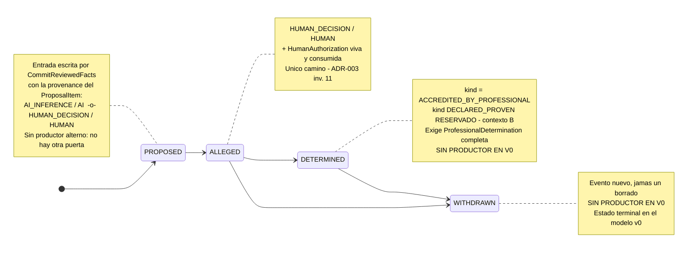
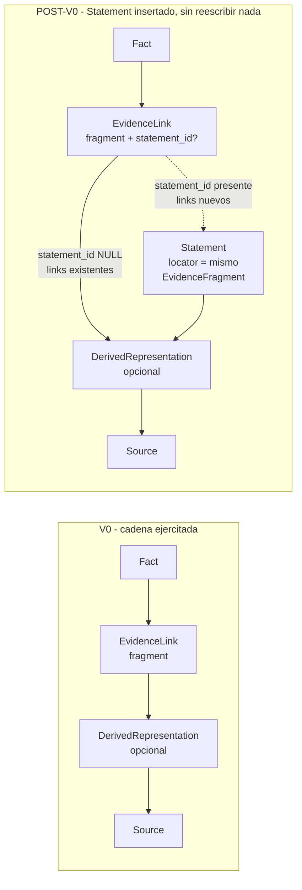

# 02 — Modelo de dominio V0

**Estado:** Technical Design V0 (nivel 2 de la precedencia documental, kernel §14). Subordinado a los ADR-001…006 Accepted; normativo sobre los documentos de arquitectura y el glosario en materia técnica.

**Alcance.** Este documento concreta el plano Domain de ADR-003 hasta el nivel de campos, tipos, transiciones e invariantes verificables **ejercitados por el vertical slice v0**. No reabre ninguna decisión Accepted, no define esquema físico ni índices, no define use cases ni superficie MCP (kernel §6, §7; `boundaries.md` §2–§3), y no contiene código de producción: las interfaces TypeScript son **conceptuales** —contrato de forma y semántica, no artefacto compilable—.

**Qué añade respecto de ADR-003.** ADR-003 fija qué entidades existen y con qué semántica. Aquí se fijan: (1) los campos concretos; (2) la aplicación literal de la corrección `Principal ≠ provenance_kind` del kernel §1 a cada registro; (3) la partición de los invariantes en condiciones de verdicto único; (4) el camino de evolución hacia `Statement`.

---

## 0. Convenciones de lectura

**Etiquetas de veracidad** (obligatorias, kernel): `HECHO VERIFICADO` (con fuente) · `DECISIÓN APROBADA` · `PROPUESTA DEL TECHNICAL DESIGN` (mía, requiere aprobación) · `HIPÓTESIS` · `SUPUESTO` · `POR VERIFICAR` · `RIESGO` · `DECISIÓN PENDIENTE` · `POST-V0`.

**Sobre las interfaces.** `readonly` expresa *inmutabilidad semántica del Domain*, no una capacidad del lenguaje ni una garantía de la persistencia: el enforcement real vive en la capa que cada invariante nombra. Los tipos `*Id` son **opacos**: nunca se parsean, nunca se derivan de contenido, nunca se muestran a la usuaria (kernel §11).

**Normalización aplicada en todo el documento** (kernel §1.5, supersede §16.13): donde el corpus previo escribía `actor_id / actor_type / actor_role`, aquí se escribe `principal_id / principal_type / principal_role` (dimensión operacional) y `provenance_kind` (dimensión epistémica). **`actor_type = HUMAN_DECISION` no se escribe en ningún lugar de este documento**: esa combinación se expresa como `provenance_kind = HUMAN_DECISION` + `principal_type = HUMAN`.

---

## 1. Los dos planos y lo que este documento añade

**DECISIÓN APROBADA** (ADR-003; addendum v0.3 §B.4; `boundaries.md` §4). La separación de planos es normativa y no se altera:

| Plano | Términos canónicos |
|---|---|
| **Domain** — entidades epistémicas | `Case`, `Source`, `Evidence`, `Statement`, `Fact`, `EvidenceLink`, `ProvenanceRecord`, `ProfessionalDetermination`, `DerivedRepresentation` |
| **Application** — conceptos de soporte | `Artifact`, `Proposal`, `HumanAuthorization`, `CaseRevision` (+ `ProposalItem`, `ProposalItemReview`, kernel §2–§3) |

### 1.1 Tipos con nombre que **no** son entidades

El encargo de diseño nombra `EvidenceFragment`, `SourceVersion` y `FactStatusEntry`. Ninguno es entidad canónica y ninguno se promueve aquí a entidad. Se les da nombre de **tipo** para poder escribir contratos precisos; nombrar un tipo no le concede identidad, tabla ni lifecycle.

| Nombre | Qué es aquí | Por qué no es entidad |
|---|---|---|
| `EvidenceFragment` | **Value object** del Domain: el ancla probatoria. Vive embebido en `EvidenceLink` (y, POST-V0, en `Statement`) | Addendum v0.3 §B.17: *el anclaje es un atributo del EvidenceLink, no una entidad con identidad propia*. Sin `fragment_id`, sin estado, sin historia. Regla de entrada de ADR-003: no tiene lifecycle ni invariantes propios separables de su link |
| `FactStatusEntry` | **Registro hijo** del agregado `Fact`: una entrada de `status_history` | No tiene identidad fuera de su Fact; su `seq` es local al Fact. Su lifecycle es "se escribe y nunca cambia": no es un lifecycle, es la ausencia de uno |
| `SourceVersion` | **No existe en V0.** Ver §2.5 | Un `Source` es inmutable tras la incorporación ⇒ tiene exactamente una representación original ⇒ su `content_hash` **es** su identidad de versión. Introducir `SourceVersion` sería modelar una pluralidad que el modelo prohíbe |

`PROPUESTA DEL TECHNICAL DESIGN` — requiere aprobación: dar nombre de tipo a `EvidenceFragment` y `FactStatusEntry` sin promoverlos a entidad, y **no** introducir `SourceVersion`.

---

## 2. Tipos base compartidos

### 2.1 Identidad y contenido

```ts
// Identidad de ENTIDAD: opaca, estable, emitida por el Core (kernel §11: UUIDv7 propuesto,
// soporte en Node LTS POR VERIFICAR; ULID es alternativa equivalente).
type CaseId        = string & { readonly __brand: 'CaseId' };
type SourceId      = string & { readonly __brand: 'SourceId' };
type EvidenceId    = string & { readonly __brand: 'EvidenceId' };
type DerivationId  = string & { readonly __brand: 'DerivationId' };
type FactId        = string & { readonly __brand: 'FactId' };
type LinkId        = string & { readonly __brand: 'LinkId' };
type StatementId   = string & { readonly __brand: 'StatementId' };   // POST-V0, ver §7
type DeterminationId = string & { readonly __brand: 'DeterminationId' };
type PrincipalId   = string & { readonly __brand: 'PrincipalId' };
type EventId       = string & { readonly __brand: 'EventId' };

// Identidad de CONTENIDO: SHA-256 (kernel §11). REGLA DURA: un hash NUNCA es identidad de
// entidad y NUNCA se muestra a la usuaria. entity identity ≠ content identity.
type ContentHash   = string & { readonly __brand: 'Sha256' };

type Timestamp     = string;   // instante absoluto; formato = detalle de implementación
type CaseRevisionNumber = number;  // administrado por Application (ADR-004)
```

### 2.2 `Principal` — quién ejecutó

Contrato literal del kernel §1.1–§1.2. **`principal_type` tiene tres valores; `EXTERNAL` no existe** (kernel §1.2): un tercero externo no invoca nada contra el Core, aparece como origen del material vía `declared_origin` (§3.2).

```ts
type PrincipalType = 'HUMAN' | 'AI' | 'SYSTEM';

interface Principal {
  readonly principal_id: PrincipalId;   // opaco, estable
  readonly principal_type: PrincipalType;
  readonly principal_role: string;      // rol funcional en la organización; v0: 'lawyer'
}
```

**REFINAMIENTO A SEÑALAR (no altera ninguna decisión aprobada).** `principal_role` **no** es el rol de contexto del Case. Son dos dimensiones distintas que el corpus usa con la misma palabra:

- `Principal.principal_role` = rol funcional en la organización. V0: `'lawyer'` (kernel §1.1).
- `Case.context_role` = rol procesal del expediente, resuelto **por Case o por contexto de trabajo activo** (`boundaries.md` §7, DECISIÓN APROBADA). V0: `'LITIGANT'`, contexto A.

Colapsarlos obligaría a duplicar el principal cuando la misma profesional opere ambos contextos.

### 2.3 `ProvenanceRecord` — cuál es la naturaleza epistémica del origen

```ts
type ProvenanceKind =
  | 'EXTERNAL_SOURCE'   // el conocimiento viene de material de terceros incorporado
  | 'AI_DERIVATION'     // transformación mecánica/asistida de material existente
  | 'AI_INFERENCE'      // el modelo infirió algo que no estaba dicho
  | 'HUMAN_DECISION'    // acto de decisión de la profesional
  | 'SYSTEM';           // operación mecánica del propio Core

interface ProvenanceRecord {
  readonly provenance_kind: ProvenanceKind;   // dimensión EPISTÉMICA
  readonly principal: Principal;              // dimensión OPERACIONAL — quién ejecutó
  readonly occurred_at: Timestamp;            // cuándo ocurrió el acto (no cuándo se escribió)
  readonly model_id?: string;                 // obligatorio si principal_type = 'AI'
  readonly methodology_version?: string;      // metodología aplicada; v0: 'fact-builder@v0'
  readonly knowledge_pack_versions?: readonly string[];  // v0: siempre vacío
}
```

**Matriz de combinaciones válidas** (kernel §1.4, literal). Toda combinación fuera de esta tabla es rechazada por el Domain:

| `provenance_kind` | `principal_type` admisible | Combinación prohibida |
|---|---|---|
| `EXTERNAL_SOURCE` | `HUMAN`, `SYSTEM` | `AI` |
| `AI_DERIVATION` | `AI`, `SYSTEM` | `HUMAN` |
| `AI_INFERENCE` | `AI` | `HUMAN`, `SYSTEM` |
| `HUMAN_DECISION` | `HUMAN` | `AI`, `SYSTEM` |
| `SYSTEM` | `SYSTEM` | `HUMAN`, `AI` |

**Invariante nombrado del kernel §1.4:** `HUMAN_DECISION` exige `principal_type = HUMAN`; ningún `principal_type = AI` puede producir `provenance_kind = HUMAN_DECISION`. Es INV-D-03.

### 2.4 Aplicación por registro (V0)

Qué `provenance_kind` porta cada registro epistémico del slice y quién lo produce:

| Registro | `provenance_kind` en V0 | `principal_type` | Productor V0 |
|---|---|---|---|
| `Case.provenance` | `HUMAN_DECISION` | `HUMAN` | `CreateCase` |
| `Source.ingestion_provenance` | `EXTERNAL_SOURCE` | `HUMAN` | `IngestEvidence` |
| `Evidence.provenance` | `EXTERNAL_SOURCE` | `HUMAN` | `IngestEvidence` |
| `DerivedRepresentation.provenance` | `AI_DERIVATION` \| `SYSTEM` (ver nota) | `AI` \| `SYSTEM` | `GenerateDerivedRepresentation` |
| `FactStatusEntry(PROPOSED)` | `AI_INFERENCE` (o `HUMAN_DECISION` si la propuso la profesional) | `AI` \| `HUMAN` | escrita por `CommitReviewedFacts`; **origen** = `ProposeFacts` |
| `FactStatusEntry(ALLEGED)` | `HUMAN_DECISION` | `HUMAN` | `CommitReviewedFacts` |
| `FactStatusEntry(DETERMINED)` | `HUMAN_DECISION` | `HUMAN` | **sin productor en V0** |
| `FactStatusEntry(WITHDRAWN)` | `HUMAN_DECISION` | `HUMAN` | **sin productor en V0** |
| `EvidenceLink.provenance` | `AI_INFERENCE` \| `HUMAN_DECISION` | `AI` \| `HUMAN` | `CommitReviewedFacts` |
| `ProfessionalDetermination.provenance` | `HUMAN_DECISION` | `HUMAN` | **sin productor en V0** |
| `Statement.provenance` | `AI_DERIVATION` \| `HUMAN_DECISION` | `AI`\|`SYSTEM` \| `HUMAN` | **no materializado en V0** |

**Nota sobre `DerivedRepresentation` — `PROPUESTA DEL TECHNICAL DESIGN`, requiere aprobación.** `vertical-slice-v0.md` (*Persisted state*) fija para toda derivación el valor que en notación previa se escribía `actor_type = AI_DERIVATION` y que aquí se lee `provenance_kind = AI_DERIVATION` (kernel §1.5). Si la receta del derivado es **determinista y sin modelo** (p. ej. extracción de texto de un PDF nativo por librería), rotularla `AI_DERIVATION` afirma una intervención de IA que no ocurrió — precisamente el tipo de falsedad epistémica que este modelo existe para evitar. Propuesta: **`provenance_kind` se decide desde `recipe`** — `AI_DERIVATION` si la receta involucra un modelo, `SYSTEM` si es determinista. La matriz §1.4 admite ambos y `recipe { tool, version }` ya hace la elección decidible y auditable. Afecta una línea de `vertical-slice-v0.md`; no toca ningún ADR.

**`PROPUESTA DEL TECHNICAL DESIGN` — dos niveles de garantía del `HUMAN_DECISION`, sin tocar el enum.** El enum es cerrado por decisión aprobada y no se amplía. Pero `HUMAN_DECISION` aparece en registros con garantías muy distintas:

- **Acreditado por canal:** el acto llegó por el canal de autorización humana, fuera del control del modelo, y tiene una `HumanAuthorization` vinculada (ADR-005). Ejemplo: `FactStatusEntry(ALLEGED)`.
- **Declarado por sesión:** el acto llegó como COMMAND no sensible invocado por el modelo en nombre de la profesional; el Core acredita la sesión, no el acto. Ejemplos: `Case.provenance`, la orden de incorporación.

**No se añade valor de enum ni bandera.** Lo que los distingue es **la existencia de una `HumanAuthorization` vinculada**, y el gate de las transiciones sensibles ya la exige (INV-D-21). Consecuencia enunciada para que no se lea de más: un `HUMAN_DECISION` sin autorización vinculada **no acredita** un acto humano verificado, y ninguna transición sensible lo acepta. El canal concreto de cada registro es recuperable por correlación con el Tool Invocation Log (kernel §8.2), sin campo nuevo.

### 2.5 `EvidenceFragment` — el ancla probatoria, y por qué no hay `SourceVersion`

Un `Source` es inmutable (ADR-003 inv. 8; ADR-002 inv. 5): tiene **una** representación original, identificada por su `content_hash`. Por tanto **no existe `SourceVersion` como entidad ni como tabla en V0**; lo versionado es la `DerivedRepresentation`.

El corpus escribe el ancla como `fragment { source_version_hash, selector }` (`vertical-slice-v0.md`, *Persisted state*). **REFINAMIENTO A SEÑALAR — `PROPUESTA DEL TECHNICAL DESIGN`, requiere aprobación:** ese campo se explicita, porque un solo hash no permite saber *contra qué* se resolvió el ancla ni garantiza la resolución al original que exige ADR-003 inv. 7.

```ts
type Selector =
  | { readonly kind: 'PAGE_RANGE'; readonly from_page: number; readonly to_page: number }
  | { readonly kind: 'CHAR_RANGE'; readonly from_offset: number; readonly to_offset: number }
  | { readonly kind: 'TIME_RANGE'; readonly from_ms: number; readonly to_ms: number }
  | { readonly kind: 'QUOTE'; readonly exact: string;
      readonly prefix?: string; readonly suffix?: string };

interface EvidenceFragment {                 // VALUE OBJECT — sin id, sin estado, sin historia
  readonly source_id: SourceId;              // OBLIGATORIO SIEMPRE (ADR-006 inv. 5)
  readonly anchored_in: 'SOURCE' | 'DERIVED_REPRESENTATION';
  readonly representation_hash: ContentHash; // hash de la representación EXACTA contra la que
                                             // se resolvió el ancla
  readonly derivation_id?: DerivationId;     // presente sii anchored_in='DERIVED_REPRESENTATION'
  readonly selectors: readonly Selector[];   // >= 1; composición conjuntiva (refinamiento mutuo)
}
```

Reglas de forma (invariantes INV-D-29, INV-D-30 y INV-D-33):

- `anchored_in = 'SOURCE'` ⇒ `derivation_id` ausente y `representation_hash == Source.content_hash`.
- `anchored_in = 'DERIVED_REPRESENTATION'` ⇒ `derivation_id` presente, `representation_hash == DerivedRepresentation.content_hash`, y esa derivación referencia ese mismo `source_id`.
- `selectors` no vacío: **nunca se ancla al material entero** (ADR-003 inv. 7).
- Material temporal (audio/vídeo) anclado sobre un derivado ⇒ los `selectors` deben incluir un `TIME_RANGE`, **expresado sobre la línea de tiempo del original** (`vertical-slice-v0.md`, precondición 7).

**HECHO VERIFICADO** (kernel §1; fuente: W3C Web Annotation Data Model, Recomendación de 23-feb-2017): `TextQuoteSelector` (§4.2.4), `TextPositionSelector` (§4.2.5) y composición vía `refinedBy` (§4.2.9) son vocabulario estándar candidato para materializar `Selector`. Ninguna decisión de este documento depende de adoptarlo.

**RIESGO / POR VERIFICAR (heredado, no resuelto aquí).** Si el proveedor de transcripción no entrega timestamps utilizables (`boundaries.md` §5, POR VERIFICAR), el ancla sobre audio sólo podría expresarse como `QUOTE` sobre el derivado, y la resolución al original dejaría de ser posicional. Eso comprometería ADR-003 inv. 7 para material de audio. **No se resuelve en este documento: se señala**, porque la respuesta depende de un spike de adapter, no del modelo.

---

## 3. Entidades del Domain

### 3.1 `Case` — agregado raíz

```ts
type CaseContext = 'A';                    // v0: sólo contexto A (litigio). 'B' RESERVADO
type CaseContextRole = 'LITIGANT';         // v0: sólo LITIGANT. Ver §2.2

interface Case {
  readonly case_id: CaseId;
  readonly natural_labels: readonly string[];  // resolución por open_case; jamás identidad
  readonly context: CaseContext;
  readonly context_role: CaseContextRole;
  readonly provenance: ProvenanceRecord;       // HUMAN_DECISION / HUMAN
  readonly created_at: Timestamp;

  // Propiedad OBSERVABLE del Case, ADMINISTRADA por Application (ADR-003; boundaries §4):
  // el Domain la lee, no la incrementa ni resuelve conflictos con ella.
  readonly current_revision: CaseRevisionNumber;
}
```

Ciclo de vida del Case (cierre, archivo, suspensión, transferencia): **POST-V0** (`vertical-slice-v0.md`, *Domain entities exercised*).

### 3.2 `Source` — material original incorporado

```ts
interface DeclaredOrigin {          // SOBRE DE INGESTIÓN (kernel §1.2): de dónde dice la
  readonly kind: 'INBOX';           // profesional que procede el material. POST-V0: conectores
  readonly inbox_reference: string; // identificador resuelto por el Core, NUNCA una ruta
  readonly declared_note?: string;  // lo que la profesional declara sobre la procedencia
}

interface Source {
  readonly source_id: SourceId;
  readonly case_id: CaseId;                      // v0: copia por caso (DECISIÓN PENDIENTE:
                                                 // deduplicación física entre Cases)
  readonly content_hash: ContentHash;            // SHA-256 de los bytes preservados
  readonly byte_size: number;
  readonly media_type: string;
  readonly snapshot_ref: string;                 // ubicación en el private state; OPACA
  readonly declared_origin: DeclaredOrigin;
  readonly ingestion_provenance: ProvenanceRecord;   // EXTERNAL_SOURCE / HUMAN
  readonly incorporated_at: Timestamp;
  readonly metadata: Readonly<Record<string, unknown>>;
}
```

**Honestidad epistémica obligatoria** (ADR-006 inv. 6): `content_hash` prueba **integridad desde la incorporación**, jamás **autenticidad** del material. `declared_origin` es *declarado*, no verificado. La capa de presentación no puede colapsar ambas cosas.

### 3.3 `Evidence` — rol probatorio del Source en un Case

```ts
interface Evidence {
  readonly evidence_id: EvidenceId;
  readonly case_id: CaseId;
  readonly source_id: SourceId;
  readonly provenance: ProvenanceRecord;   // EXTERNAL_SOURCE / HUMAN
  readonly incorporated_at: Timestamp;
  readonly label?: string;                 // rótulo humano; jamás identidad
}
```

`Source ≠ Evidence`: el mismo material en dos Cases mantiene estados, links e historia independientes (ADR-003 inv. 10). En V0, con copia por caso, "el mismo material" se reconoce por `content_hash`, no por `source_id` compartido.

**POST-V0 deliberado:** no se modela ninguna tipología probatoria (documental / testimonial / pericial). Requiere el vocabulario real de la profesional; añadirla ahora sería inventar derecho. `metadata` del Source absorbe lo que el slice necesite sin crear estructura.

### 3.4 `DerivedRepresentation`

```ts
type DerivationState = 'PENDING' | 'READY' | 'FAILED';

interface DerivedRepresentation {
  readonly derivation_id: DerivationId;
  readonly case_id: CaseId;
  readonly source_id: SourceId;            // REFERENCIA OBLIGATORIA, no nula, inmutable
  readonly version: number;                // monotónica por (source_id, recipe)
  readonly content_hash?: ContentHash;     // presente sii state = 'READY'
  readonly recipe: { readonly tool: string; readonly version: string };
  readonly state: DerivationState;
  readonly failure_reason?: string;        // presente sii state = 'FAILED'
  readonly provenance: ProvenanceRecord;   // AI_DERIVATION | SYSTEM — ver §2.4
  readonly created_at: Timestamp;
}
```

Regenerable desde su Source por su receta; **jamás sustituye al Source**. Una versión referenciada por fragmentos vivos no se descarta, y el re-anclaje tras regenerar es explícito y auditado (`vertical-slice-v0.md`, *Derived state*). El re-anclaje tras regeneración es **POST-V0**: el slice no regenera derivados.

### 3.5 `Fact` y `FactStatusEntry`

```ts
type FactStoredStatus = 'PROPOSED' | 'ALLEGED' | 'DETERMINED' | 'WITHDRAWN';
type DeterminationKind = 'ACCREDITED_BY_PROFESSIONAL';   // 'DECLARED_PROVEN' RESERVADO (ctx B)

interface FactStatusEntry {                 // REGISTRO HIJO — sin identidad propia
  readonly seq: number;                     // local al Fact; 1..n, contiguo, estable
  readonly status: FactStoredStatus;
  readonly determination_kind?: DeterminationKind;   // presente sii status = 'DETERMINED'
  readonly determination_id?: DeterminationId;       // presente sii status = 'DETERMINED'
  readonly authorization_id?: string;                // presente sii la transición fue sensible
  readonly provenance: ProvenanceRecord;
  readonly at_case_revision: CaseRevisionNumber;     // revisión que dejó el evento que la registró
  readonly recorded_in_event_id: EventId;            // evento del Case Event Log
  readonly origin_ref?: { readonly proposal_id: string; readonly proposal_item_id: string };
}

interface Fact {
  readonly fact_id: FactId;
  readonly case_id: CaseId;
  readonly proposition: string;             // la proposición fáctica curada
  readonly provenance: ProvenanceRecord;    // provenance de CREACIÓN (= la de su entrada PROPOSED)
  readonly status_history: readonly FactStatusEntry[];   // APPEND-ONLY, nunca vacío

  // NO EXISTE campo de status. El estatus vigente es status_history[último].status: derivado
  // de la historia, jamás almacenado aparte (ADR-003, refinamiento de estados).
}
```

**Nombre de campo deliberado:** `proposition`, no `statement`. `Statement` es entidad reservada del Domain (§7) y `Assertion` es nombre reservado (ADR-003); usar cualquiera de los dos como campo del Fact reintroduciría el concepto disfrazado de atributo.

**Ausencia deliberada de bandera "solo alegado".** `propose_facts` exige referencias de provenance **o** la marca explícita "solo alegado" (ADR-006 inv. 2). Esa marca vive en el `ProposalItem` y en el evento `FactsProposed` (Application), **no como campo del Fact**. Razón: un Fact sin soporte ya es `UNSUPPORTED` por cómputo desde sus links; un booleano paralelo podría divergir de los links vigentes — exactamente el estado mutable ambiguo que ADR-003 eliminó, y el "atajo de atributo" que su sección de riesgos anticipa. `PROPUESTA DEL TECHNICAL DESIGN`, requiere aprobación. Consecuencia declarada: el riesgo *"lavado por solo alegado"* de ADR-006 permanece exactamente donde ese ADR lo dejó —el origen de la sugerencia sigue sin registrarse—; esta decisión no lo agrava ni lo mitiga.

### 3.6 `EvidenceLink`

```ts
type LinkPolarity = 'SUPPORTS' | 'CONTRADICTS' | 'CONTEXTUALIZES';   // ENUM CERRADO EN V0
type LinkState = 'ACTIVE' | 'RETIRED';

interface EvidenceLink {
  readonly link_id: LinkId;
  readonly case_id: CaseId;
  readonly fact_id: FactId;
  readonly evidence_id: EvidenceId;
  readonly fragment: EvidenceFragment;      // §2.5 — ancla obligatoria
  readonly polarity: LinkPolarity;
  readonly state: LinkState;
  readonly rationale: string;               // justificación de quien lo creó; no vacía
  readonly provenance: ProvenanceRecord;    // AI_INFERENCE | HUMAN_DECISION
  readonly origin_ref?: { readonly proposal_id: string; readonly proposal_item_id: string };
  readonly committed_under?: {              // el ACTO humano que lo incorporó al Case
    readonly authorization_id: string;
    readonly event_id: EventId;
    readonly at_case_revision: CaseRevisionNumber;
  };
}
```

**`PROPUESTA DEL TECHNICAL DESIGN` — separación `provenance` / `committed_under`, requiere aprobación.** El link propuesto por el modelo y aprobado por la profesional tiene dos hechos que no deben colapsarse: su **origen epistémico** es `AI_INFERENCE` (lo infirió el modelo) y su **incorporación** es un acto humano autorizado. Escribir `provenance_kind = HUMAN_DECISION` porque la humana lo aprobó borraría que la relación hecho↔prueba la propuso una IA: es la misma confusión que el kernel §1 corrige. El link conserva su provenance de origen y registra aparte bajo qué autorización entró.

**Polaridad: enum cerrado.** Si la práctica exige matices ("respalda parcialmente"), la regla acordada es **señalarlo**, no ampliar preventivamente (ADR-003, Riesgos).

**Único productor de `EvidenceLink` en V0: `CommitReviewedFacts`.** Es un hecho del alcance del slice, **no un invariante del Domain**: nada en ADR-003 exige autorización humana para crear un link, y POST-V0 puede existir curación directa de links. Se registra como tal para que no se codifique como regla por inercia.

### 3.7 `ProfessionalDetermination`

**Definida, sin productor en V0** (addendum v0.3 §B.5).

```ts
interface ProfessionalDetermination {
  readonly determination_id: DeterminationId;
  readonly case_id: CaseId;
  readonly fact_id: FactId;
  readonly kind: DeterminationKind;
  readonly motivation: string;                     // no vacía — INV-D-25
  readonly valued_links: readonly LinkId[];        // TODOS los links ACTIVE del Fact valorados,
                                                   // incluidos los CONTRADICTS — INV-D-25
  readonly provenance: ProvenanceRecord;           // HUMAN_DECISION / HUMAN
  readonly authorization_id: string;               // SENSITIVE: exige autorización viva
  readonly created_at: Timestamp;
}
```

**`RISK` de rótulo, heredado (ADR-003, Preguntas pendientes 1):** `ACCREDITED_BY_PROFESSIONAL` descansa en semántica de negocio **no confirmada con la profesional**. El mecanismo no está en riesgo; el rótulo sí. No se resuelve aquí.

### 3.8 `Statement` — definido, **no materializado en V0**

```ts
// DEFINIDO EN EL DOMAIN, SIN INSTANCIAS EN V0 (addendum v0.3 §B.7).
// Ningún use case v0 lo crea; ningún test v0 lo verifica; la tabla existe vacía en el contrato.
interface Statement {
  readonly statement_id: StatementId;
  readonly case_id: CaseId;
  readonly source_id: SourceId;
  readonly attributed_actor: string;        // DESCRIPTOR del tercero al que se atribuye la
                                            // expresión. NO es un Principal: un tercero externo
                                            // no invoca nada contra el Core (kernel §1.2).
  readonly locator: EvidenceFragment;       // MISMO value object que el link — clave para §7
  readonly provenance: ProvenanceRecord;
  readonly annulled_by?: StatementId;       // corrección = anulación + registro nuevo
  readonly created_at: Timestamp;
}
```

La cadena de provenance **efectivamente ejercitada en V0** es `Fact → EvidenceLink → fragment → DerivedRepresentation → Source`. `Statement` se materializará con un extractor (`ExtractStatements`, POST-V0). Cómo se inserta sin migración destructiva: **§7**.

---

## 4. Conceptos de Application que el Domain toca (sin redefinirlos)

Se listan sólo en lo que el Domain necesita conocer. Sus contratos completos están en el kernel §2 (`Proposal`, `ProposalItem`), §3 (`HumanAuthorization`, `ProposalItemReview`), `boundaries.md` §3 (`Artifact`, `CaseRevision`) y ADR-004/ADR-005.

```ts
// APPLICATION — no son entidades epistémicas. No portan estatus epistémico ni son
// proposiciones sobre el mundo jurídico (ADR-003; boundaries §4).

interface Proposal {                     // kernel §2.1
  readonly proposal_id: string;
  readonly case_id: CaseId;
  readonly base_case_revision: CaseRevisionNumber;
  readonly created_by: Principal;
  readonly provenance_kind: ProvenanceKind;      // AI_INFERENCE en el flujo del slice
  readonly methodology_version: string;
  readonly model_id?: string;
  readonly created_at: Timestamp;
  // SIN campo de estado. El kernel §2.1 define `Proposal` sin estatus almacenado, por el
  // mismo criterio con que §2.2 elimina `INVALIDATED`: lo computable no se almacena.
  // El rótulo agregado de la Proposal es DERIVADO de sus items; su vocabulario único y su
  // predicado canónico viven en `06` §2.7. Este documento NO lo redefine (§4, título).
}

interface ProposalItem {                 // kernel §2.1–§2.2
  readonly proposal_item_id: string;     // identidad ESTABLE y OPACA — jamás índice posicional
  readonly proposal_id: string;
  readonly item_content_hash: ContentHash;
  readonly payload: {                    // el hecho candidato + sus links propuestos
    readonly proposition: string;
    readonly alleged_only: boolean;      // la marca vive AQUÍ, no en el Fact (§3.5)
    readonly candidate_links: readonly {
      readonly evidence_id: EvidenceId;
      readonly fragment: EvidenceFragment;
      readonly polarity: LinkPolarity;
      readonly rationale: string;
    }[];
  };
  readonly review_decision: 'PENDING' | 'APPROVED' | 'REJECTED';   // dimensión 1
  readonly commit_state: 'UNCOMMITTED' | 'COMMITTED';              // dimensión 2
}

interface HumanAuthorization { /* kernel §3 — contrato depurado; registro server-side */ }
interface Artifact          { /* kernel §10 / boundaries §3 — FactAnalysis en el slice */ }
type   CaseRevision = CaseRevisionNumber;  /* ADR-004 — administrada por Application */
```

**Nota de aritmética de revisiones (APROBADA — enmienda AC-02).** Los dueños **aprobaron** separar `event_seq` (todo evento) de `case_revision` (sólo mutación epistémica canónica), con `ProposalReviewed` avanzando el primero y no la segunda. **No está aprobado y no se aplica.** El modelo de dominio es **invariante bajo ambos modelos**: `FactStatusEntry.at_case_revision` registra la revisión que dejó el evento que escribió la entrada, cualquiera sea la aritmética vigente. Ninguna interfaz de §3 cambia si el amendment se aprueba.

**Nota de aprobación parcial (no es decisión de este documento).** ADR-005 deja `authorized_items[]` *preparado, no activado* (DECISIÓN PENDIENTE de dueños); el kernel §3.2 propone en su lugar **una autorización por item**. La diferencia es enteramente de Application: el Domain sólo exige que la entrada `ALLEGED` de cada Fact porte el `authorization_id` bajo el cual entró (INV-D-21), y eso se cumple con cualquiera de las dos formas.

---

## 5. Ciclo de vida del `Fact`

### 5.1 Transiciones **almacenadas**



| Transición | Precondición | `provenance_kind` / `principal_type` | Evento | Productor V0 |
|---|---|---|---|---|
| `∅ → PROPOSED` | `ProposalItem` con `review_decision = APPROVED` | `AI_INFERENCE`/`AI` o `HUMAN_DECISION`/`HUMAN` | `FactsCommitted` (escritura); origen en `FactsProposed` | `CommitReviewedFacts` |
| `PROPOSED → ALLEGED` | `HumanAuthorization` viva, no consumida, hashes y revisión coincidentes (kernel §2.3) | `HUMAN_DECISION`/`HUMAN` | `FactsCommitted` | `CommitReviewedFacts` |
| `ALLEGED → DETERMINED(kind)` | `ProfessionalDetermination` completa + autorización viva | `HUMAN_DECISION`/`HUMAN` | — (evento no existe en la lista cerrada v0) | **ninguno** — `RecordProfessionalDetermination`, POST-V0 |
| `ALLEGED \| DETERMINED → WITHDRAWN` | autorización viva | `HUMAN_DECISION`/`HUMAN` | `FactWithdrawn` (**en la lista cerrada, sin productor**) | **ninguno** — `WithdrawFact`, POST-V0 |

Transiciones **inexistentes** y su tratamiento: `∅ → ALLEGED` (no hay camino: todo Fact nace `PROPOSED`), `PROPOSED → DETERMINED` (salto prohibido), `PROPOSED → WITHDRAWN` (el descarte de un candidato se resuelve en el ciclo de la Proposal con `REJECTED`, no en el Fact), y cualquier transición desde `WITHDRAWN` (terminal en v0).

### 5.2 Materialización diferida del `Fact` — `PROPUESTA DEL TECHNICAL DESIGN`

**Requiere aprobación.** ADR-003 dice que un Fact `PROPOSED` *"existe registrado dentro de su Proposal; no es todavía estado curado del Case"*, y el slice confirma que `propose_facts` no muta los Facts del Case. Consecuencia técnica que hay que decidir explícitamente: **el `Fact` del Domain se materializa en el commit**, no en la propuesta.

- En `ProposeFacts` la identidad estable del candidato es `proposal_item_id` (kernel §2.1), no un `fact_id`.
- En `CommitReviewedFacts`, para cada item aprobado, el Core emite el `fact_id` y escribe **dos entradas** de `status_history` en la misma transacción: `PROPOSED` —con la provenance, el `occurred_at` y el `origin_ref` del item, no los del commit— y `ALLEGED`.
- Los items `REJECTED` **nunca producen un Fact**: no hay Facts huérfanos ni proyección que deba filtrarlos.
- Idempotencia: a lo sumo un `Fact` por `proposal_item_id` (INV-D-23). Un reintento de commit no duplica.

**Alternativa considerada y rechazada:** materializar el Fact en `propose_facts` con status `PROPOSED`. Rechazada porque introduce en el estado curado del Case entidades que la profesional no ha aprobado, obliga a toda proyección y toda consulta a filtrar por status para no presentarlas como conocimiento del expediente, y hace del rechazo de un item una operación que debe *borrar* un Fact — chocando con el append-only.

**Consecuencia que se declara:** la entrada `PROPOSED` se escribe en el mismo instante que la `ALLEGED`. Por eso el invariante de append-only (INV-D-19) se enuncia como *"ninguna entrada existente se edita ni se elimina"* y **no** como *"una entrada por transacción"*: la segunda formulación daría FAIL en el flujo feliz del slice.

### 5.3 Estados **derivados** — computados, jamás almacenados

```ts
interface DerivedFactState {          // función PURA y TOTAL de los links ACTIVE del Fact
  readonly supported: boolean;        // >= 1 link SUPPORTS en estado ACTIVE
  readonly contradicted: boolean;     // >= 1 link CONTRADICTS en estado ACTIVE
  readonly unsupported: boolean;      // CERO links SUPPORTS o CONTRADICTS en estado ACTIVE
}

// Contrato conceptual (no implementación):
//   computeDerivedState(fact_id, links) donde links = EvidenceLinks del MISMO case_id
//   - se consideran SOLO los links con state = 'ACTIVE'
//   - polaridad CONTEXTUALIZES NO participa del computo (addendum v0.3 B.14)
//   - unsupported === !(supported || contradicted)
//   - supported y contradicted NO son excluyentes
```

Tabla de verdad completa (`S` = SUPPORTS, `C` = CONTRADICTS, `X` = CONTEXTUALIZES, sólo `ACTIVE`):

| Links `ACTIVE` del Fact | `SUPPORTED` | `CONTRADICTED` | `UNSUPPORTED` |
|---|---|---|---|
| ninguno | no | no | **sí** |
| sólo `X` (uno o varios) | no | no | **sí** |
| ≥1 `S` | **sí** | no | no |
| ≥1 `C` | no | **sí** | no |
| ≥1 `S` y ≥1 `C` | **sí** | **sí** | no |
| ≥1 `S` y ≥1 `X` | **sí** | no | no |
| todos los `S`/`C` pasados a `RETIRED`, quedan `X` activos | no | no | **sí** |

**Reglas duras asociadas:**

1. Los tres valores **jamás se persisten como status del Fact** (ADR-003 inv. 6): no existe columna, campo ni caché que los contenga en V0.
2. Determinar un Fact **no desactiva sus links `CONTRADICTS`** (ADR-003 inv. 5): tras `DETERMINED`, `CONTRADICTED` sigue siendo computable y visible junto al hecho determinado.
3. El cómputo es por Case: links de otro Case no participan jamás (aislamiento, INV-D-07).
4. `WITHDRAWN` **no suprime el cómputo**: un Fact retirado sigue teniendo estado derivado computable. Por eso **ninguna proyección presenta un estado derivado sin el estatus almacenado vigente** (INV-D-38): mostrar `SUPPORTED` sin mostrar `WITHDRAWN` sería una afirmación falsa sobre el expediente.
5. "No hay hechos con soporte" es **dato de proyección**, no condición UX (kernel §16.5).

### 5.4 Ejemplo de estado (ilustrativo del modelo)

Fact tras el commit del slice, con un link de apoyo y otro de contradicción:

```text
Fact F-12
  fact_id: "f_01J...", case_id: "c_01J...",
  proposition: "La reunión del 12-03 ocurrió en la sede de la contraparte."
  provenance: { provenance_kind: AI_INFERENCE,
                principal: { principal_type: AI, principal_role: 'lawyer',
                             principal_id: 'p_ai_...' },
                model_id: "<model>", methodology_version: "fact-builder@v0",
                occurred_at: T_propuesta }
  status_history:
    [ { seq: 1, status: PROPOSED,
        provenance: { AI_INFERENCE / AI, occurred_at: T_propuesta },
        at_case_revision: 6, recorded_in_event_id: "e_FactsCommitted",
        origin_ref: { proposal_id: "p_...", proposal_item_id: "pi_..." } },
      { seq: 2, status: ALLEGED,
        provenance: { HUMAN_DECISION / HUMAN, occurred_at: T_commit },
        authorization_id: "a_...", at_case_revision: 8,
        recorded_in_event_id: "e_FactsCommitted" } ]

EvidenceLink L-1  { fact: F-12, evidence: E-7, polarity: SUPPORTS, state: ACTIVE,
                    fragment: { source_id: S-3, anchored_in: SOURCE,
                                representation_hash: <hash S-3>,
                                selectors: [ { PAGE_RANGE 3..3 } ] },
                    provenance: AI_INFERENCE / AI,
                    committed_under: { authorization_id: "a_...", at_case_revision: 8 } }

EvidenceLink L-2  { fact: F-12, evidence: E-9, polarity: CONTRADICTS, state: ACTIVE,
                    fragment: { source_id: S-5, anchored_in: DERIVED_REPRESENTATION,
                                derivation_id: D-1, representation_hash: <hash D-1>,
                                selectors: [ { TIME_RANGE 2470000..2495000 },   // sobre el ORIGINAL
                                             { QUOTE "...", prefix: "...", suffix: "..." } ] },
                    provenance: AI_INFERENCE / AI, committed_under: { ... } }

Estado ALMACENADO vigente : ALLEGED         (status_history[último])
Estado DERIVADO computado : SUPPORTED = sí, CONTRADICTED = sí, UNSUPPORTED = no
```

Los dos `at_case_revision` distintos (6 y 8) reflejan que la entrada `PROPOSED` registra el acto de propuesta y la `ALLEGED` el del commit, aunque ambas se escriban en la misma transacción (§5.2).

---

## 6. Invariantes del Domain

### 6.1 Criterio de veredicto (aplicación de la decisión de los dueños)

Cada invariante enuncia **una sola condición**, de modo que su comprobación admita exactamente uno de estos veredictos, sin ambigüedad:

| Veredicto | Significado exacto |
|---|---|
| **PASS** | La comprobación se ejecuta en V0 y la condición se cumple |
| **FAIL** | La comprobación se ejecuta en V0 y la condición no se cumple |
| **NOT_IMPLEMENTED** | Existen sujetos del invariante en V0 y el invariante es exigible, pero **la comprobación no está construida** en V0 |
| **NOT_APPLICABLE** | En V0 **no puede existir ningún sujeto** del invariante, porque el modelo declara que la entidad no se materializa o porque la transición no tiene productor en ninguna superficie ni canal. **No verificado ≠ no vigente** |

La columna **"Veredicto posible en V0"** dice qué veredictos puede arrojar la comprobación en el slice: `PASS|FAIL` significa *verificable*; los otros dos son veredictos fijos de diseño.

**La partición no crea ni elimina invariantes.** Descompone los de ADR-003/ADR-006 en condiciones de verificabilidad homogénea. El mapeo completo está en §6.3: ningún invariante Accepted queda sin cobertura.

### 6.2 Tabla de invariantes

**Provenance y Principal**

| # | Invariante (una condición) | Capa responsable | Comprobación | Veredicto posible en V0 |
|---|---|---|---|---|
| INV-D-01 | Toda entidad epistémica materializada porta un `ProvenanceRecord` no nulo con `Principal` completo (`principal_id`, `principal_type`, `principal_role`) | Domain | Constructor del Domain rechaza la entidad sin provenance | `PASS\|FAIL` |
| INV-D-02 | El par (`provenance_kind`, `principal_type`) pertenece a la matriz §2.3 | Domain | Test tabla-dirigida sobre las 15 combinaciones | `PASS\|FAIL` |
| INV-D-03 | `provenance_kind = HUMAN_DECISION` ⇒ `principal_type = HUMAN`; ningún `principal_type = AI` lo produce | Domain | Test adversarial dedicado (caso duro de INV-D-02) | `PASS\|FAIL` |
| INV-D-04 | `provenance_kind = AI_*` ⇒ `model_id` presente | Domain | Validación de construcción | `PASS\|FAIL` |
| INV-D-05 | Un `ProvenanceRecord` escrito no se edita: no existe reclasificación epistémica | Domain + Infrastructure | Ausencia de operación de update; test de superficie | `PASS\|FAIL` |

**Aislamiento por Case**

| # | Invariante | Capa | Comprobación | Veredicto V0 |
|---|---|---|---|---|
| INV-D-06 | Toda entidad epistémica porta `case_id` no nulo e inmutable | Domain | Validación de construcción | `PASS\|FAIL` |
| INV-D-07 | Ninguna relación epistémica cruza Cases: `fact.case_id == link.case_id == evidence.case_id` | Domain | Test negativo: operar sobre Case A con ids de Case B ⇒ rechazo | `PASS\|FAIL` |
| INV-D-08 | Ninguna proyección ni consulta de un Case retorna entidades epistémicas de otro | Application | Test de proyección con dos Cases poblados | `PASS\|FAIL` |
| INV-D-09 | El mismo material incorporado en dos Cases mantiene Evidence, links e historia independientes | Domain + Application | Ingerir los mismos bytes en dos Cases ⇒ dos Sources, dos Evidence, cero estado compartido (en V0 la identidad de "mismo material" es `content_hash`, no `source_id`) | `PASS\|FAIL` |

**Source, incorporación y derivación** — *partición del invariante 8 de ADR-003, que agrupaba tres condiciones de verificabilidad distinta*

| # | Invariante | Capa | Comprobación | Veredicto V0 |
|---|---|---|---|---|
| INV-D-10 | Un `Source` no admite modificación ni borrado por la superficie normal del producto | Infrastructure + Superficie MCP | La capacidad no existe en el manifiesto; test de superficie (`AT-011`) | `PASS\|FAIL` |
| INV-D-11 | `re-hash(bytes del snapshot) == Source.content_hash` registrado | Infrastructure | Verificación bajo demanda tras alterar/borrar el archivo de Inbox | `PASS\|FAIL` |
| INV-D-12 | La incorporación es el **único** productor de `Source`: ninguna otra operación lo crea | Application + Superficie MCP | Inventario de productores + test de superficie | `PASS\|FAIL` |
| INV-D-13 | Dos incorporaciones de los mismos bytes en el mismo Case producen un solo `Source` | Application | Doble `ingest_evidence` ⇒ un Source, cero duplicados | `PASS\|FAIL` |
| INV-D-14 | Toda `DerivedRepresentation` referencia un `Source` existente del mismo Case, con referencia no nula e inmutable | Domain | Validación de construcción + test de derivado huérfano | `PASS\|FAIL` |
| INV-D-15 | Ninguna cadena de provenance termina en una `DerivedRepresentation`: toda resolución de fragmento entrega el `Source` | Domain + Application | `get_evidence_fragment` sobre un ancla en transcripción devuelve la cadena hasta el original | `PASS\|FAIL` |
| INV-D-16 | Un `Statement` no admite mutación tras la extracción; la corrección es anulación + registro nuevo | Domain | — | **NOT_APPLICABLE** (no se materializa en V0, addendum §B.7) |

> Nota de honestidad sobre INV-D-11: la **verificación periódica** programada de hashes (mencionada en el Product Floor PF-002 como control) **no existe en V0** — no hay job ni planificador (`vertical-slice-v0.md`: sin motor de jobs). Lo verificable en V0 es la comprobación bajo demanda. El control periódico es **NOT_IMPLEMENTED** y se registra como tal, no como invariante cumplido.

**`Fact` y `status_history`** — *partición del invariante 3 de ADR-003: el tramo `PROPOSED → ALLEGED` es verificable en V0; el brazo `WITHDRAWN` no tiene sujeto posible*

| # | Invariante | Capa | Comprobación | Veredicto V0 |
|---|---|---|---|---|
| INV-D-17 | El `Fact` no tiene campo de status: el estatus vigente es `status_history[último]` | Domain + Infrastructure | Inspección estructural del contrato y del esquema | `PASS\|FAIL` |
| INV-D-18 | `status_history` nunca está vacía y su primera entrada es `PROPOSED` | Domain | Property test sobre todo Fact materializado | `PASS\|FAIL` |
| INV-D-19 | Ninguna entrada existente de `status_history` se edita ni se elimina; `seq` es contiguo, estable y creciente | Domain + Infrastructure | Property test sobre el tramo `PROPOSED → ALLEGED` (el único ejercitado en V0); ausencia de camino de edición o borrado | `PASS\|FAIL` |
| INV-D-20 | `ALLEGED` sólo se alcanza desde `PROPOSED`, con `provenance_kind = HUMAN_DECISION` y `principal_type = HUMAN` | Domain | Test negativo con principal `AI` ⇒ rechazo en el Domain | `PASS\|FAIL` |
| INV-D-21 | La entrada `ALLEGED` porta el `authorization_id` de una `HumanAuthorization` válida consumida en la misma transacción | Application | Commit sin autorización viva ⇒ `HUMAN_REVIEW_REQUIRED`, cero mutaciones | `PASS\|FAIL` |
| INV-D-22 | Ningún `Principal` con `principal_type = AI` produce una entrada de status distinta de `PROPOSED` | Domain | Test adversarial (`AT-001`/`AT-002`) desde cualquier superficie | `PASS\|FAIL` |
| INV-D-23 | Existe a lo sumo un `Fact` por `proposal_item_id` | Application | Reintento de commit ⇒ cero Facts duplicados | `PASS\|FAIL` |
| INV-D-24 | `DETERMINED` sólo se alcanza desde `ALLEGED` y sólo vía `ProfessionalDetermination` | Domain | — | **NOT_APPLICABLE** (sin productor en V0, addendum §B.5) |
| INV-D-25 | Una `ProfessionalDetermination` sin `motivation` o sin la lista de links valorados —incluidos **todos** los `CONTRADICTS` `ACTIVE` al momento— es rechazada | Domain | — | **NOT_APPLICABLE** (sin productor en V0) |
| INV-D-26 | Determinar un `Fact` no cambia el `state` de ninguno de sus `EvidenceLink` | Domain | — | **NOT_APPLICABLE** (sin productor en V0) |
| INV-D-27 | `WITHDRAWN` sólo se alcanza desde `ALLEGED` o `DETERMINED` y se registra como **entrada nueva**, nunca como borrado del Fact ni de sus entradas | Domain | — | **NOT_APPLICABLE** (sin productor en V0; el evento `FactWithdrawn` existe en la lista cerrada, sin emisor) |

**`EvidenceLink` y ancla**

| # | Invariante | Capa | Comprobación | Veredicto V0 |
|---|---|---|---|---|
| INV-D-28 | Todo `EvidenceLink` referencia una `Evidence` **incorporada** del mismo Case | Domain | Link contra URL, id de conector, ruta o texto pegado ⇒ rechazo (ADR-006 inv. 1) | `PASS\|FAIL` |
| INV-D-29 | Todo `EvidenceLink` porta un `fragment` con `source_id` no nulo y `selectors` no vacío: nunca ancla al material entero | Domain | Test negativo de link sin selector | `PASS\|FAIL` |
| INV-D-30 | `anchored_in = 'DERIVED_REPRESENTATION'` ⇒ `derivation_id` presente, `representation_hash` igual al `content_hash` de esa derivación, y esa derivación referencia el mismo `source_id` | Domain | Test tabla-dirigida sobre las dos formas de ancla | `PASS\|FAIL` |
| INV-D-31 | `polarity ∈ {SUPPORTS, CONTRADICTS, CONTEXTUALIZES}` (enum cerrado en V0) | Domain | Valor fuera del enum ⇒ rechazo | `PASS\|FAIL` |
| INV-D-32 | El retiro de un link es transición `ACTIVE → RETIRED` registrada, nunca borrado del link | Domain | — | **NOT_APPLICABLE** (no hay productor de `RETIRED` en V0) |
| INV-D-33 | Ancla sobre material temporal a través de un derivado ⇒ los `selectors` incluyen un `TIME_RANGE` expresado sobre la línea de tiempo del **original** | Domain | Validación de construcción del fragment de audio | `PASS\|FAIL`, **condicionado a POR VERIFICAR**: si el proveedor de transcripción no entrega timestamps utilizables, la comprobación no tiene insumo y el veredicto pasa a NOT_IMPLEMENTED. Ver §2.5 |

**Estados derivados**

| # | Invariante | Capa | Comprobación | Veredicto V0 |
|---|---|---|---|---|
| INV-D-34 | `SUPPORTED`/`CONTRADICTED`/`UNSUPPORTED` no se persisten en ningún lugar como status del Fact | Domain + Infrastructure | Inspección estructural: ninguna columna, campo ni caché los contiene | `PASS\|FAIL` |
| INV-D-35 | El cómputo considera **sólo** links `ACTIVE` de polaridad `SUPPORTS`/`CONTRADICTS`; `CONTEXTUALIZES` no participa | Domain | Test unitario de la función pura, incluida la fila "sólo `X` activos ⇒ `UNSUPPORTED`" (test F12 del slice) | `PASS\|FAIL` |
| INV-D-36 | `UNSUPPORTED` ⇔ cero links `SUPPORTS`/`CONTRADICTS` `ACTIVE` (incluye el retorno a `UNSUPPORTED` cuando todos pasan a `RETIRED`) | Domain | Test unitario de la **función pura** con links `RETIRED` construidos en memoria — verificable aunque V0 no tenga productor de `RETIRED` (a diferencia de INV-D-32, que sí exige productor) | `PASS\|FAIL` |
| INV-D-37 | `SUPPORTED` y `CONTRADICTED` no son excluyentes | Domain | Fact con links mixtos ⇒ ambos verdaderos | `PASS\|FAIL` |
| INV-D-38 | Ninguna proyección presenta un estado derivado sin el estatus almacenado vigente del Fact | Application | Contract test de la proyección `facts` | `PASS\|FAIL` |

### 6.3 Mapeo con los invariantes Accepted (ninguno queda sin cobertura)

| Invariante Accepted | Se descompone en | Estado agregado en V0 |
|---|---|---|
| ADR-003 inv. 1 (provenance completo) | INV-D-01, 02, 03, 04 | verificable |
| ADR-003 inv. 2 (`AI_*` ≤ `PROPOSED`) | INV-D-20, 22 | verificable |
| ADR-003 inv. 3 (`status_history` append-only) | **INV-D-19** (verificable, tramo `PROPOSED→ALLEGED`) + **INV-D-27** (NOT_APPLICABLE, brazo `WITHDRAWN`) | **parcialmente verificable — partición exigida por los dueños** |
| ADR-003 inv. 4 (`DETERMINED` vía determinación motivada) | INV-D-24, 25 | NOT_APPLICABLE |
| ADR-003 inv. 5 (determinar no retira `CONTRADICTS`) | INV-D-26 | NOT_APPLICABLE |
| ADR-003 inv. 6 (derivados nunca persistidos) | INV-D-34, 35, 36, 37 | verificable |
| ADR-003 inv. 7 (ancla a fragmento verificable) | INV-D-29, 30, 33 | verificable (INV-D-33 condicionado) |
| ADR-003 inv. 8 (inmutabilidad, agrupaba tres) | **INV-D-16** `Statement` (NOT_APPLICABLE) + **INV-D-10/11** `Source` (verificable) + **INV-D-14/15** referencia `DerivedRepresentation → Source` (verificable) | **parcialmente verificable — partición exigida por los dueños** |
| ADR-003 inv. 9 (polaridad enum cerrado) | INV-D-31 | verificable |
| ADR-003 inv. 10 (Evidence es rol por Case) | INV-D-06, 07, 08, 09 | verificable |
| ADR-003 inv. 11 (`ALLEGED` sólo por commit autorizado) | INV-D-20, 21 | verificable |
| ADR-006 inv. 1 (link sólo contra Evidence incorporada) | INV-D-28 | verificable |
| ADR-006 inv. 4 (incorporación único productor de Sources) | INV-D-12 | verificable |
| ADR-006 inv. 5 (el fragmento siempre resuelve a un Source) | INV-D-15, 29, 30 | verificable |
| ADR-006 inv. 6 (snapshot independiente del origen) | INV-D-11 | verificable |
| ADR-006 inv. 7 (idempotencia por hash) | INV-D-13 | verificable |

**Los cuatro invariantes que ADR-003 declara sin verificar en V0** (addendum §B.17: 3, 4, 5, 8) quedan aquí con veredicto explícito: el 3 y el 8 se **parten** —su parte verificable pasa a `PASS|FAIL`, su parte sin sujeto a `NOT_APPLICABLE`—; el 4 y el 5 son `NOT_APPLICABLE` completos. Esa partición es exactamente la ganancia: hoy se puede afirmar qué tramo está probado en vez de declarar un invariante entero "sin verificar".

---

## 7. Evolución: cómo introducir `Statement` sin migración destructiva

`Statement` es la entidad definida y **no materializada** en V0. Esta sección demuestra que `Fact`, `Evidence`, `EvidenceFragment` y `EvidenceLink` **no impiden** insertarla después.

### 7.1 Qué es `Statement` cuando llegue

Una capa **intermedia y opcional** entre el fragmento y el Fact: la expresión atribuible a un actor, anclada al fragmento. Hoy el link va del Fact al fragmento; mañana podrá pasar por un Statement **sin dejar de ir al fragmento**.



### 7.2 Las cuatro propiedades del modelo V0 que lo hacen posible

1. **El ancla vive en el link, no en el Statement.** `EvidenceLink.fragment` es obligatorio y autosuficiente: resuelve a un `Source` sin intermediarios (INV-D-15). Un link existente **nunca necesitará un Statement** para seguir siendo válido y resoluble.
2. **`Statement.locator` es el mismo `EvidenceFragment`.** No hay dos vocabularios de anclaje que reconciliar: el value object ya está definido y compartido (§2.5, §3.8). Insertar Statement no obliga a traducir anclas.
3. **`EvidenceFragment` no tiene identidad.** Como no es entidad, no existen filas de fragmento que haya que re-apuntar, deduplicar o fusionar cuando aparezca el Statement. Si el fragmento hubiera sido entidad, la inserción exigiría decidir de quién es hijo — y esa decisión sí obligaría a reescribir.
4. **La provenance ya distingue derivación de inferencia.** Un extractor de Statements produce `AI_DERIVATION` (o `HUMAN_DECISION` si la profesional lo marca a mano); ambas combinaciones ya están en la matriz §2.3. **El enum no cambia.**

### 7.3 El cambio concreto, todo aditivo

| Cambio | Naturaleza | Efecto sobre datos existentes |
|---|---|---|
| Materializar `Statement` (§3.8, ya contratado) | Tabla nueva | Ninguno |
| Añadir `EvidenceLink.statement_id?` **nullable** | Columna nueva opcional | Ninguno: los links existentes quedan con `NULL` y **siguen siendo válidos** |
| Añadir el use case `ExtractStatements` | Use case interno nuevo | Ninguno |
| Añadir el evento `StatementsExtracted` | **Cambio de contrato** (la lista de eventos es cerrada, ADR-004 inv. 6) | Ninguno sobre datos; sí sobre el contrato de eventos |
| Añadir INV: `statement_id != NULL ⇒ statement.source_id == link.fragment.source_id` y los selectores se solapan | Invariante nuevo, validado en escritura | Ninguno: sólo aplica a links que declaren `statement_id` |

Migración: **una tabla nueva y una columna nullable**. Encaja sin excepción en el régimen de migraciones numeradas solo-adelante del mínimo de release (`boundaries.md` §10). No hay backfill, no hay reescritura de links, no hay recálculo de estados derivados —el cómputo depende de `polarity` y `state`, que no cambian—.

**El único costo real declarado:** reabrir la lista cerrada de eventos para añadir `StatementsExtracted`. Es fricción deliberada por diseño (ADR-004 inv. 6), no un defecto de esta evolución.

### 7.4 Lo que NO debe hacerse hoy (o la evolución se vuelve destructiva)

Tres anti-patrones que hoy parecen simplificaciones y mañana obligan a reescribir:

1. **Mover el ancla al Statement, dejando el link sin `fragment`.** Obligaría a fabricar Statements sintéticos para todos los links existentes sólo para conservar su ancla. El `fragment` del link es obligatorio **para siempre**, aunque haya Statement.
2. **Hacer `statement_id` obligatorio, ni siquiera "a partir de ahora".** Un invariante que exija Statement en todo link parte el conjunto de links en dos regímenes y convierte cualquier reconciliación en backfill. La relación es y seguirá siendo **opcional**.
3. **Dar identidad de entidad al fragmento con semántica de Statement** (un `fragment_id` que "ya casi es" un Statement). Es la vía por la que el concepto reaparece disfrazado, y ADR-003 la cierra con la regla de entrada al dominio: una entidad entra cuando tiene lifecycle, identidad o invariantes propios — el fragmento no los tiene y el Statement sí (inmutabilidad tras extracción, anulación, atribución).

---

## 8. Registro de decisiones, pendientes y alcance

### 8.1 `PROPUESTA DEL TECHNICAL DESIGN` — requieren aprobación

| # | Decisión | Dónde | Si se rechaza |
|---|---|---|---|
| 1 | `EvidenceFragment` y `FactStatusEntry` como tipos con nombre **sin** promoverlos a entidad; **no** introducir `SourceVersion` | §1.1, §2.5 | Habría que decidir alternativa de anclaje; afecta §7 |
| 2 | `EvidenceFragment` explícito (`source_id` + `anchored_in` + `representation_hash` + `derivation_id?` + `selectors[]`) en lugar de `{ source_version_hash, selector }` | §2.5 | Vuelve el campo original; INV-D-30 pierde sujeto y ADR-003 inv. 7 queda menos verificable |
| 3 | `provenance_kind` de `DerivedRepresentation` decidido desde `recipe`: `AI_DERIVATION` con modelo, `SYSTEM` si es determinista | §2.4 | Todas las derivaciones se rotulan `AI_DERIVATION`, afirmando IA donde no la hubo |
| 4 | Dos niveles de garantía del `HUMAN_DECISION` (*acreditado por canal* / *declarado por sesión*) **sin ampliar el enum**; el gate de autorización es lo que los distingue | §2.4 | Habría que elegir entre ampliar un enum cerrado o dejar la ambigüedad sin nombrar |
| 5 | `Case.provenance = HUMAN_DECISION/HUMAN`; `Source`/`Evidence` = `EXTERNAL_SOURCE/HUMAN` | §2.4 | Cambia la matriz por registro; no afecta interfaces |
| 6 | **Materialización diferida del `Fact`**: se crea en el commit con dos entradas de `status_history`; `fact_id` emitido en el commit | §5.2 | Vuelve la alternativa rechazada: Facts `PROPOSED` en el estado curado y filtrado obligatorio en toda proyección |
| 7 | La marca *"solo alegado"* vive en el `ProposalItem`, **no** como campo del `Fact` | §3.5 | Reaparece un atributo paralelo que puede divergir de los links |
| 8 | `EvidenceLink.provenance` (origen epistémico) separado de `committed_under` (acto humano de incorporación) | §3.6 | El link aprobado se rotularía `HUMAN_DECISION` y se perdería que lo infirió una IA |
| 9 | `Fact.proposition` como nombre de campo (evita `statement`/`assertion`) | §3.5 | Riesgo de colisión con nombres reservados |
| 10 | Partición de invariantes de §6.2 y criterio de veredicto de §6.1 | §6 | La decisión de los dueños quedaría sin materializar |

### 8.2 Conflictos con ADRs Accepted o con el kernel

**Ninguno.** Dos tensiones conocidas, ya registradas en sus documentos de origen, que este documento **no** resuelve ni agrava:

- Kernel §5 (`event_seq` / `case_revision` separados): **enmienda AC-02 APROBADA** sobre ADR-004 y ADR-005 (supersedes §16.16 y §16.19); el Modelo B es el **vigente**. El modelo de dominio es invariante ante esa decisión: ninguna interfaz de §3 cambia, y los números del ejemplo de §5 ya son coherentes con el modelo vigente.
- Kernel §3.2 (una autorización por item) frente a `authorized_items[]` de ADR-005, que es **DECISIÓN PENDIENTE de los dueños**. Enteramente de Application (§4).

### 8.3 `POR VERIFICAR`

- Capacidad real de timestamps del proveedor de transcripción. **Bloquea el veredicto de INV-D-33** y condiciona el cumplimiento de ADR-003 inv. 7 sobre material de audio (§2.5). Heredado de `boundaries.md` §5.
- Soporte de UUIDv7 en Node LTS (kernel §11). No afecta ninguna interfaz de este documento: los ids son opacos.

### 8.4 `DECISIÓN PENDIENTE` heredada, con efecto sobre este modelo

- **Deduplicación física de Sources entre Cases** (kernel §17, ADR-003, ADR-006). V0 opera con copia por caso; `Source.case_id` es consecuencia directa de esa decisión y desaparecería si se adoptara content-addressing compartido.
- **Naming del kind de `DETERMINED`** (ADR-003, pregunta 1): afecta el rótulo, no el mecanismo.
- **Código de rechazo para la frontera de incorporación** (ADR-006): en V0 INV-D-28 rechaza con error semántico estable, sin condición UX propia.

### 8.5 `POST-V0` — decidido no diseñar aquí

Modelado de tipología probatoria de la `Evidence` (§3.3) · re-anclaje de fragmentos tras regenerar un derivado (§3.4) · productores de `DETERMINED`, `WITHDRAWN` y `RETIRED` —`RecordProfessionalDetermination`, `WithdrawFact`, retiro de links— · materialización de `Statement` y `ExtractStatements` (§7) · el rótulo `SUPERSEDED` de la Proposal (fuera del vocabulario derivado de `06` §2.7 y sin productor en V0; no reaparece como campo almacenado) · caché de proyecciones (reintroduciría el riesgo de derivados desfasados que ADR-003 evita) · toda entidad de nombre reservado (`Assertion`, `Contradiction`, `Gap`, `LegalIssue`, `Hypothesis`, `Argument`, `Ruling`, `ProceduralEvent`, `Term`, `Deadline`): **no tienen tabla, estado ni tool, y no reaparecen como atributos del `Fact`**.
