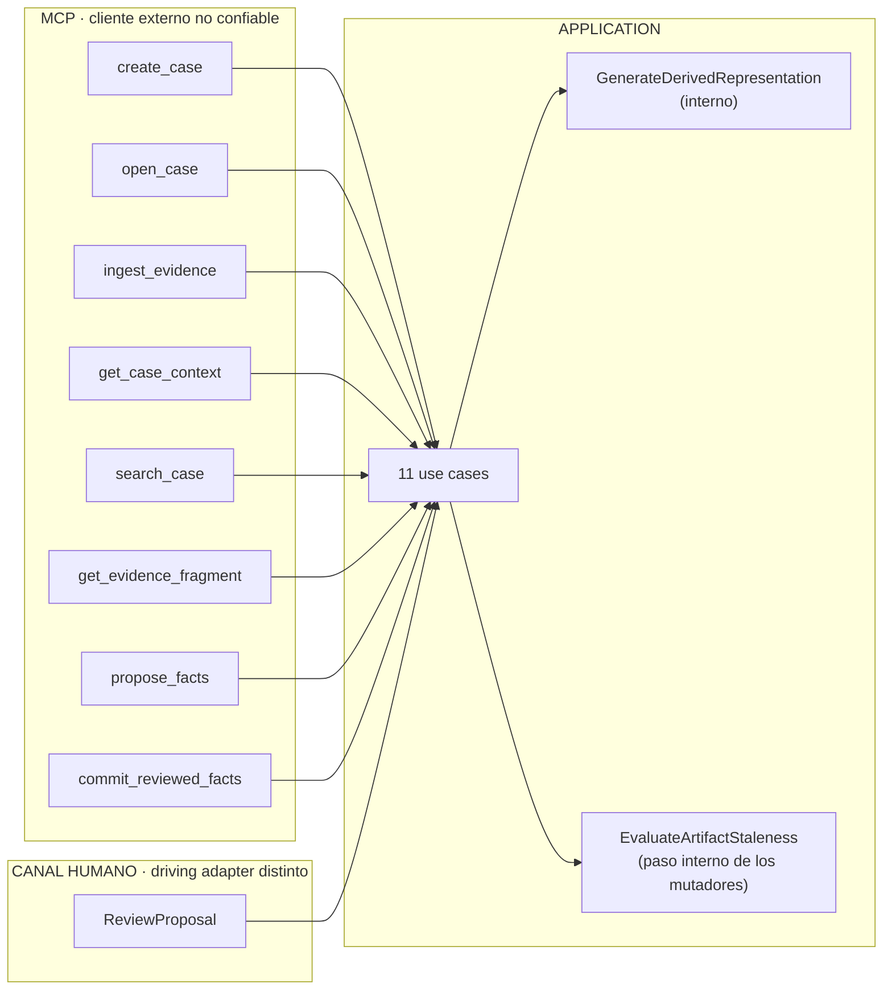
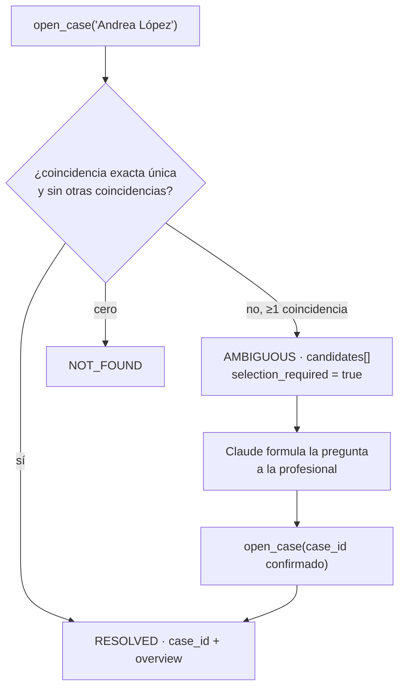
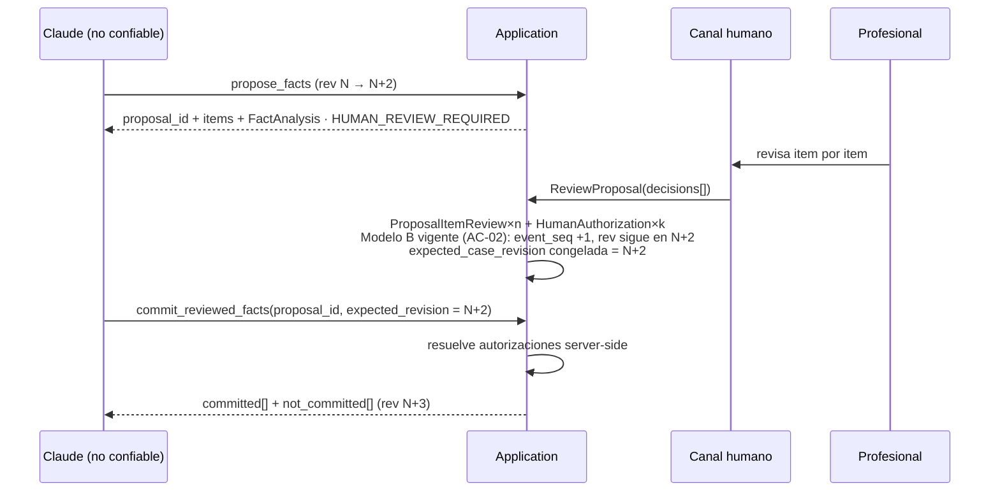

# 03 — Application Use Cases y transacciones (Technical Design V0)

**Estado:** documento técnico V0. Subordinado a los ADRs Accepted (001–006) y al **kernel técnico v0.4** (`00-technical-kernel.md`), cuyo vocabulario y contratos se usan literalmente. Precedencia: `00-technical-kernel.md` §14.

Este documento especifica los **once use cases** del kernel §7: contrato de invocación, frontera transaccional exacta, eventos, aritmética de revisiones, idempotencia, errores e invariantes verificados. No redefine el modelo de dominio (ADR-003 y `01`/`02` del Technical Design), ni la superficie MCP (kernel §6), ni el catálogo de condiciones (kernel §10): los referencia.

**Qué NO hay aquí:** código de producción. Las interfaces TypeScript son **conceptuales** —fijan forma y nombres, no implementación—; el DDL y la persistencia viven en el documento de infraestructura.

---

## 0. Convenciones normativas de este documento

### 0.1 Tipos transversales

```ts
// CONCEPTUAL. Fija nombres y forma; no es código de producción.

type Uuid          = string;   // UUIDv7 opaco, emitido por el Core (kernel §11)
type Sha256        = string;   // identidad de CONTENIDO; nunca identidad de entidad
type CaseRevision  = number;   // monotónico por Case; solo mutaciones canónicas (kernel §5.2)
type EventSeq      = number;   // monotónico por Case; TODOS los eventos (kernel §5.2)
type Iso8601       = string;   // reloj del Core, nunca reloj del invocador

interface Principal {                       // QUIÉN ejecutó (kernel §1.1)
  principal_id:   Uuid;
  principal_type: 'HUMAN' | 'AI' | 'SYSTEM';
  principal_role: string;                   // v0: 'lawyer'
}

type ProvenanceKind =                       // NATURALEZA EPISTÉMICA del origen (kernel §1.3)
  | 'EXTERNAL_SOURCE' | 'AI_DERIVATION' | 'AI_INFERENCE' | 'HUMAN_DECISION' | 'SYSTEM';

interface OperationContext {                // lo construye el driving adapter, NUNCA el modelo
  principal:     Principal;
  channel:       'MCP' | 'HUMAN_AUTHORIZATION' | 'INTERNAL';
  invocation_id: Uuid;                      // correlación con el Tool Invocation Log (kernel §8.2)
  received_at:   Iso8601;
}
```

**Regla dura heredada (kernel §1.4):** `provenance_kind = HUMAN_DECISION` exige `principal_type = HUMAN`. Ningún principal `AI` produce procedencia `HUMAN_DECISION`. `principal_type` y `provenance_kind` **nunca** comparten valores; escribir `principal_type = HUMAN_DECISION` es un error de tipo, no de estilo.

### 0.2 Sobre de resultado

```ts
type UseCaseResult<T> =
  | {
      outcome: 'OK';
      data: T;
      case_id?: Uuid;                 // presente en todo use case con Case (kernel §6)
      case_revision?: CaseRevision;   // revisión vigente al terminar
      event_seq?: EventSeq;           // cursor exacto para changes_since (§0.7)
      conditions: TypedCondition[];   // catálogo cerrado, kernel §10
      idempotent_replay: boolean;     // true ⇒ no hubo mutación nueva (§0.6)
    }
  | { outcome: 'REJECTED'; error: TypedError; conditions: TypedCondition[] };

interface TypedCondition {            // catálogo cerrado del kernel §10
  code: 'ANALYSIS_STALE' | 'SEARCH_INCONCLUSIVE' | 'UNCERTAIN_FRAGMENT'
      | 'HUMAN_REVIEW_REQUIRED' | 'REVISION_CHANGED' | 'OPERATION_NOT_PERMITTED'
      | 'INTEGRATION_ERROR';
  family: 'EPISTEMIC' | 'AUTHORITY' | 'INFRASTRUCTURE';
  params: Record<string, unknown>;
  presentation_category:
    'NEEDS_YOUR_DECISION' | 'SOMETHING_CHANGED' | 'LIMITED_CERTAINTY' | 'CANNOT_DO_THAT';
}

interface TypedError {                // rechazo: código semántico estable (ADR-001 inv. 8)
  code: ErrorCode;
  params: Record<string, unknown>;
  presentation_category: 'CANNOT_DO_THAT' | 'NEEDS_YOUR_DECISION' | 'SOMETHING_CHANGED';
}
```

**Condición ≠ error.** Una `TypedCondition` describe el estado del caso o de la autoridad y puede acompañar a un `OK`; un `TypedError` es el rechazo de la operación. `HUMAN_REVIEW_REQUIRED` y `REVISION_CHANGED` son condiciones **bloqueantes**: viajan junto a un `REJECTED`, no en lugar de él.

### 0.3 Catálogo de `ErrorCode` — PROPUESTA DEL TECHNICAL DESIGN

El corpus previo exige "códigos semánticos estables" (ADR-001 inv. 8; slice, *Negative paths*) sin enumerarlos. Se propone esta lista cerrada v0; ampliarla es cambio de contrato, igual que la lista de eventos.

| `ErrorCode` | Se emite cuando | Categoría de presentación |
|---|---|---|
| `E_SCHEMA_INVALID` | El payload no satisface el schema de la operación (validación sintáctica del adapter o del Core) | `CANNOT_DO_THAT` |
| `E_CASE_NOT_FOUND` | `case_id` sintácticamente válido pero no emitido por el Core | `CANNOT_DO_THAT` |
| `E_ENTITY_NOT_FOUND` | Cualquier otro id (evidence, derivation, proposal, item, artifact) inexistente | `CANNOT_DO_THAT` |
| `E_CROSS_CASE_REFERENCE` | Un id referenciado pertenece a otro Case (ADR-003 inv. 10) | `CANNOT_DO_THAT` |
| `E_INBOX_REF_UNRESOLVED` | La referencia de Inbox no resuelve, o es una ruta / traversal / symlink (ADR-002 inv. 3, val. 4) | `CANNOT_DO_THAT` |
| `E_MISSING_PROVENANCE` | Un item de propuesta llega sin refs de provenance y sin marca `alleged_only` (ADR-006 inv. 2) | `CANNOT_DO_THAT` |
| `E_UNINCORPORATED_REFERENCE` | Se referencia material no incorporado (URL, ruta, texto pegado) como base probatoria (ADR-006 inv. 1) | `CANNOT_DO_THAT` |
| `E_INVALID_FRAGMENT_SELECTOR` | El selector no resuelve contra la versión de Source declarada | `CANNOT_DO_THAT` |
| `E_EMPTY_PROPOSAL` | `ProposeFacts` sin items | `CANNOT_DO_THAT` |
| `E_ITEM_NOT_IN_PROPOSAL` | Un `proposal_item_id` no pertenece a la Proposal indicada | `CANNOT_DO_THAT` |
| `E_ITEM_CONTENT_MISMATCH` | La revisión humana declara un `item_content_hash` distinto del vigente (§7.5) | `NEEDS_YOUR_DECISION` |
| `E_NOTHING_TO_COMMIT` | El subconjunto solicitado no contiene ningún item aprobado y no commiteado | `CANNOT_DO_THAT` |
| `E_DERIVATION_UNAVAILABLE` | Se pide contenido de una `DerivedRepresentation` en `PENDING`/`FAILED` | `LIMITED_CERTAINTY`→`CANNOT_DO_THAT` |
| `E_DEV_STUB_CASE_IN_PRODUCTION` | Se intenta abrir en modo producción un Case con autorizaciones `DEV_STUB` consumidas (kernel §4.2) | `CANNOT_DO_THAT` |
| `E_CHANNEL_NOT_PERMITTED` | La operación llega por un canal que no es el suyo, o con un `principal_type` que ese canal no admite — hoy, `ReviewProposal` invocada fuera del canal de autorización humana o con principal ≠ `HUMAN` (§10.4, §10.12; ADR-005 inv. 1) | `CANNOT_DO_THAT` |

**RIESGO declarado:** el mapeo `ErrorCode → presentation_category → plantilla` (kernel §10) debe evitar que N códigos se conviertan en N mensajes. La tabla anterior colapsa 15 códigos en 3 categorías; la plantilla añade el detalle, y `11` §6.6 fija a qué **mensaje de producto** llega cada uno de los que no tienen condición del catálogo.

**Por qué `E_CHANNEL_NOT_PERMITTED` es un `ErrorCode` y no la condición `OPERATION_NOT_PERMITTED`.** `OPERATION_NOT_PERMITTED` está **reservada a una capacidad que EXISTE en la superficie y que una política veta** (`11` §3.7; `05` §8.3; ADR-006; addendum v0.3 B.6), y en V0 su `policy_reason` es un enum **vacío**, de modo que **no puede emitirse por ningún camino**. `ReviewProposal` no está en el manifiesto de 8 tools: si llega por un canal que no es el suyo, **no hay capacidad que vetar** y ninguna política podría habilitarla. Emitir allí la condición haría creer que existe una palanca que podría activarse — el daño exacto que `11` §3.7 nombra. Por eso el rechazo es un `ErrorCode` de Application, **no emite condición del catálogo**, y lo que llega a la profesional es **mensaje de producto** (`prod.channel.not_permitted`, `11` §6.6).

### 0.4 Frontera transaccional — regla general

**PROPUESTA DEL TECHNICAL DESIGN.** Reglas invariantes para todos los use cases mutadores:

1. **Un use case = como máximo UNA transacción de escritura.** No hay transacciones anidadas ni sagas en V0.
2. **Dentro de la transacción, y solo dentro:** mutación del estado canónico, `append` al Case Event Log (con `prev_event_hash` y `event_hash` calculados en secuencia), incremento de `event_seq` y —cuando corresponda— de `case_revision`, entrada en el `OperationLedger` de idempotencia (§0.6), y la propagación de staleness que la mutación cause (§11).
3. **Fuera de la transacción, antes:** escritura de bytes por `SourceBlobPort`, cálculo de hashes de contenido, llamadas a AI-capability ports. Nunca se abre transacción con una llamada de red pendiente dentro.
4. **Fuera de la transacción, después:** escritura del Tool Invocation Log (kernel §8.2), que es operacional y podable; su pérdida no compromete el estado canónico (ADR-004 inv. 8).
5. **Orden obligatorio bytes→registro.** Los bytes existen en el private state antes de que exista el registro canónico que los referencia. Un fallo de transacción deja un blob no referenciado —basura inerte, jamás un registro apuntando a bytes inexistentes—. *(La recolección de blobs huérfanos es del plano runtime/CLI; **POST-V0**.)*
6. **Las lecturas se sirven desde un snapshot de lectura único**, de modo que el `case_revision` del sobre corresponda exactamente al contenido devuelto. Una proyección cuyo envelope declara una revisión distinta de la que generó el contenido es un defecto de veracidad, no una carrera aceptable.

**HECHO VERIFICADO** (kernel §8/ADR-004; fuente: sqlite.org): en modo WAL lectores y escritores concurren con **un solo escritor a la vez**. **SUPUESTO de V0** (kernel §11): una máquina, una usuaria, un escritor — de modo que la regla 1 no está tensionada. Ninguna garantía de rendimiento se afirma aquí.

### 0.5 Unidad de mutación — necesaria para que la biyección sea comprobable

ADR-004 inv. 5 exige biyección **mutación ↔ evento** y define mutación como "cambio de estado canónico registrado". Para que el property test sea decidible hace falta fijar la granularidad. **PROPUESTA DEL TECHNICAL DESIGN:** la unidad de mutación se define **por tipo de evento**.

**HECHO VERIFICADO — qué modelo aplica esta tabla** (fuente: kernel v0.4 §5.2 *APROBADO — enmienda AC-02*, §7 y §8.1; ADR-004 y ADR-005 enmendados, supersedes §16.16 y §16.19). La columna de revisión se conserva desdoblada, con el mismo formato que `09-events-and-audit.md` §3.1, **por trazabilidad de la decisión**: el amendment del kernel §5.2 **fue aprobado por los dueños**. **El Modelo B es el vigente** (`event_seq` avanza +1 en **todo** evento; `case_revision` avanza **solo** en eventos que mutan el estado epistémico canónico y es **NULL** en los que no) y es el que este documento **especifica**. El **Modelo A queda como modelo anterior, superado** por la enmienda AC-02: se conserva en columna aparte porque documenta la aritmética que rigió hasta la aprobación, y **no se aplica en ninguna postcondición, aritmética ni contrato de este documento**. Ver §13.1.

| Evento | Unidad de mutación (qué cubre un solo evento) | `case_revision` **Modelo B (vigente, AC-02)** | `case_revision` **Modelo A (anterior, superado)** |
|---|---|---|---|
| `CaseCreated` | El Case completo | +1 | +1 |
| `EvidenceIncorporated` | Source + Evidence + las `DerivedRepresentation` creadas en `PENDING` por esa incorporación | +1 | +1 |
| `DerivedRepresentationGenerated` | Una derivación `PENDING → READY` | +1 | +1 |
| `DerivedRepresentationFailed` | Una derivación `PENDING → FAILED` | +1 | +1 |
| `FactsProposed` | La Proposal completa con todos sus `ProposalItem` | +1 (tensión, §13.4) | +1 |
| `ArtifactRegistered` | Un Artifact | +1 (tensión, §13.4) | +1 |
| `ProposalReviewed` | **Todas** las decisiones de una sesión de revisión + las autorizaciones que produzcan | **NULL** — no avanza; solo `event_seq` | **+1** |
| `FactsCommitted` | El subconjunto commiteado completo: Facts a `ALLEGED`, EvidenceLinks `ACTIVE`, autorizaciones consumidas | +1 | +1 |
| `ArtifactMarkedStale` | Un artifact marcado (una razón nueva) | +1 (tensión, §13.4) | +1 |
| `ProposalPreservedForReconciliation` | — **sin productor en v0** (§11.6): el rechazo por revisión obsoleta no muta estado canónico, luego por la biyección de ADR-004 inv. 5 no emite evento | — | — |
| `FactWithdrawn` | — **sin productor en v0** (ADR-004 (b)1) | — | — |

Bajo el **Modelo B vigente**, `event_seq` avanza **+1** en todo evento producido y `case_revision` solo donde lo indica la columna vigente; en `ProposalReviewed` el evento se persiste con `case_revision` **nula** (kernel §8.1). `case_revision` es por tanto una **subsecuencia** de `event_seq`, y sobre `event_seq` se expresan tanto la biyección mutación↔evento (ADR-004 inv. 5, reformulado) como el hash-chain. Bajo el Modelo A anterior ambos contadores coincidían en todas las filas producidas y **no existía `case_revision` nula**.

**APROBADO — enmienda AC-04 — `ProposalPreservedForReconciliation`** (cierra ADR-009 pendiente 3; `06` §5.4; `09` §8.2; `04` §10 C1). Los dueños resolvieron en el sentido que el corpus ya había adoptado: el evento **permanece en la lista cerrada de ADR-004 (b)1** —que es Accepted y no se reduce— y queda **declarado sin productor en v0**, exactamente el patrón de `FactWithdrawn`. La preservación es **conducta por defecto y estado derivado, no almacenado**. Es la única lectura compatible con "cero mutaciones" en un rechazo (ADR-005 inv. 6; ADR-008 inv. 7).

Consecuencia verificable: `IngestEvidence` que además invalida un artifact produce **dos** eventos y avanza la revisión en **dos** (slice, pasos 15–16). `CommitReviewedFacts` de nueve hechos produce **un** evento y avanza **uno**.

### 0.6 Idempotencia — claves derivadas por el Core

**Invariante de partida (ADR-001 inv. 5):** el modelo **jamás** aporta la clave de idempotencia; la deriva el Core del contenido de la operación. Consecuencia de diseño no menor: al derivarse del payload, la clase de bug "misma clave, distinto contenido" **es imposible por construcción** — dos payloads distintos producen claves distintas.

Mecanismo (**PROPUESTA DEL TECHNICAL DESIGN**): una tabla de Application, `OperationLedger`, en el private state.

```ts
interface OperationLedgerEntry {
  idempotency_key: Sha256;      // derivada, ver tabla
  case_id: Uuid | null;         // null solo en CreateCase
  use_case: string;
  result_digest: Sha256;        // resultado canónico devuelto la primera vez
  result_payload: unknown;      // suficiente para responder idéntico en el replay
  event_ids: Uuid[];            // eventos producidos por la ejecución original
  created_at: Iso8601;
}
```

La entrada se escribe **dentro de la misma transacción** que la mutación. Un segundo intento con la misma clave no ejecuta nada: devuelve `result_payload` con `idempotent_replay: true`. Retención/poda: **POST-V0**.

| Use case | Clave de idempotencia derivada | Ventana |
|---|---|---|
| `CreateCase` | `H(principal_id ‖ normalize(intake) ‖ bucket(received_at, W))` | `W` = ventana de reintento. **SUPUESTO: 15 min**, configurable, solo endurecible |
| `IngestEvidence` | `H(case_id ‖ content_hash_de_los_bytes)` | Sin ventana: permanente (ADR-006 inv. 7) |
| `GenerateDerivedRepresentation` | `H(source_id ‖ recipe.tool ‖ recipe.version ‖ target_version)` | Permanente |
| `ProposeFacts` | `H(case_id ‖ base_case_revision ‖ methodology ‖ model_id ‖ normalize(items))` | Permanente |
| `ReviewProposal` | `H(proposal_id ‖ normalize(decisions) ‖ principal_id ‖ bucket(received_at, W))` | `W` idem `CreateCase` |
| `CommitReviewedFacts` | `H(case_id ‖ proposal_id ‖ sorted(item_ids) ‖ expected_revision)` | Permanente |
| `EvaluateArtifactStaleness` | No tiene clave propia: hereda la de su mutador (§11) | — |
| Los cuatro QUERY | No aplica: no mutan estado canónico | — |

**Por qué `CreateCase` lleva ventana y `IngestEvidence` no.** Unos mismos bytes son el mismo material para siempre; dos expedientes con la misma carátula son un caso legítimo del trabajo real (dos asuntos del mismo cliente). Una clave permanente en `CreateCase` haría imposible el segundo; una ventana corta cubre el reintento del transporte —que es el riesgo real— y deja la ambigüedad resultante donde el sistema ya sabe tratarla: en `OpenCase`, que devuelve candidatos y no adivina (§6). **DECISIÓN PENDIENTE:** el valor de `W`. **Alternativa considerada:** clave acotada por sesión del adapter en lugar de por tiempo — descartada porque una reconexión abre sesión nueva y el reintento volvería a duplicar.

### 0.7 Cursor de delta: `event_seq`, no `case_revision`

**Esta elección era correcta bajo los dos modelos y con la enmienda AC-02 aprobada pasa a ser la que el Modelo B vigente exige** (§0.5, §13.1). Bajo el **Modelo B vigente** hay eventos —`ProposalReviewed`— que **no** avanzan `case_revision`; si el delta se calculara sobre revisiones, esos actos serían invisibles para `changes_since` y precisamente las decisiones de la profesional desaparecerían del resumen de sesión. Bajo el **Modelo A anterior** `seq == case_revision`, de modo que ambos cursores coincidían y cursar por `event_seq` no cambiaba ningún resultado. Cursar por `event_seq` fue por tanto **neutral antes de la enmienda y es necesario después**: es el mismo criterio que adopta `08-case-context-projections.md` §6.1.

**PROPUESTA DEL TECHNICAL DESIGN:** el cursor del delta es `event_seq`. `changes_since` acepta `since_event_seq` o `since_revision`; el segundo se resuelve internamente al `event_seq` del evento que produjo esa revisión. Todo `UseCaseResult.OK` devuelve ambos, de modo que el invocador siempre dispone de un cursor exacto sin recordarlo de la sesión anterior.

---

## 1. Mapa de los once use cases

| # | Use case | Driving port | Clase | Tx | Eventos | `case_revision` |
|---|---|---|---|---|---|---|
| 1 | `CreateCase` | MCP (`create_case`) | COMMAND | 1 | `CaseCreated` | +1 |
| 2 | `OpenCase` | MCP (`open_case`) | QUERY | lectura | — | 0 |
| 3 | `IngestEvidence` | MCP (`ingest_evidence`) | COMMAND | 1 | `EvidenceIncorporated` (+ `ArtifactMarkedStale`×n) | +1 (+n) |
| 4 | `GenerateDerivedRepresentation` | **interno** | — | 1 | `DerivedRepresentationGenerated` \| `…Failed` | +1 |
| 5 | `GetCaseContext` | MCP (`get_case_context`) | QUERY | lectura | — | 0 |
| 6 | `SearchCase` | MCP (`search_case`) | QUERY | lectura | — | 0 |
| 7 | `GetEvidenceFragment` | MCP (`get_evidence_fragment`) | QUERY | lectura | — | 0 |
| 8 | `ProposeFacts` | MCP (`propose_facts`) | PROPOSAL | 1 | `FactsProposed` + `ArtifactRegistered` | +2 |
| 9 | `ReviewProposal` | **canal humano** (ADR-005 §5) | — | 1 | `ProposalReviewed` | **no avanza** — `case_revision` **nula**; solo `event_seq` +1 (Modelo B vigente, enmienda AC-02; era **+1** bajo el Modelo A anterior, §0.5) |
| 10 | `CommitReviewedFacts` | MCP (`commit_reviewed_facts`) | SENSITIVE_COMMAND | 1 | `FactsCommitted` — camino de rechazo por revisión obsoleta: **ningún evento** (§11.6) | +1 \| 0 en el rechazo |
| 11 | `EvaluateArtifactStaleness` | **interno**, dentro de mutadores | — | 0 (comparte) | `ArtifactMarkedStale` | +1 por marca |



---

## 2. `CreateCase`

**2.1 Propósito.** Crear el agregado raíz del expediente con identidad opaca emitida por el Core, y registrar las etiquetas naturales con las que la profesional se referirá a él después.

**2.2 Driving port.** MCP, tool `create_case`, clase COMMAND (kernel §6). La orden conversacional de la usuaria basta: crear un expediente no es operación sensible.

**2.3 Firma conceptual.**

```ts
interface CreateCaseInput {
  intake: {
    natural_labels: string[];      // 1..n; cómo la usuaria nombra el asunto
    context: 'A';                  // v0: solo contexto A
    role: 'LITIGANT';              // v0: único rol
    notes?: string;                // libre, no interpretado por el Core
  };
}
interface CreateCaseOutput {
  case_id: Uuid;
  natural_labels: string[];        // normalizadas (§6.4)
  current_revision: CaseRevision;  // 1
  created_at: Iso8601;
}
declare function createCase(
  ctx: OperationContext, input: CreateCaseInput
): UseCaseResult<CreateCaseOutput>;
```

**2.4 Precondiciones.** `principal_type ∈ {HUMAN, SYSTEM}`. `natural_labels` no vacío tras normalizar. Ningún identificador aportado por el invocador: el `case_id` **no** es parámetro (ADR-001 inv. 7). El runtime no está en modo solo-lectura por fallo de manifest (boundaries §10).

**2.5 Postcondiciones.** Existe un Case con `case_id` UUIDv7, `current_revision = 1`, `ProvenanceRecord` con `provenance_kind = SYSTEM` para el acto de creación mecánica y `Principal` humano registrado en el evento. El Case está vacío: sin Sources, sin Facts, sin Proposals.

**2.6 Frontera transaccional.** UNA transacción: `INSERT Case` + `INSERT CaseEvent(CaseCreated, event_seq = 1, case_revision = 1)` + `INSERT OperationLedgerEntry`. Nada más. La generación del UUIDv7 y la normalización de labels ocurren antes de abrir la transacción.

**2.7 Eventos.** `CaseCreated`. Payload: `case_id`, labels normalizadas, contexto, rol, `Principal`, `provenance_kind = SYSTEM`.

**2.8 `case_revision`.** Avanza a 1: crear el expediente es la primera mutación canónica; sin ella no existe reloj que avanzar.

**2.9 Idempotencia.** Clave `H(principal_id ‖ normalize(intake) ‖ bucket(received_at, W))` (§0.6). Reintento dentro de `W` ⇒ mismo `case_id`, `idempotent_replay: true`, **ningún evento nuevo**.

**2.10 Errores y condiciones.** `E_SCHEMA_INVALID` (labels vacías, contexto/rol fuera de enum). Condiciones: ninguna en el camino normal. `OPERATION_NOT_PERMITTED` queda **declarada sin disparador ejercitado en v0** (kernel §10; slice): con un solo principal y sin perfiles, ninguna política veta la creación.

**2.11 Invariantes verificados.** ADR-001 inv. 5 (idempotencia por clave derivada), inv. 7 (ids opacos del Core), inv. 2 (toda mutación deja evento). ADR-004 inv. 5 (biyección). Test del slice: F1.

---

## 3. `OpenCase` — resolución ambigua sin adivinación

**3.1 Propósito.** Traducir la referencia natural de la profesional ("el caso de Andrea López") a un `case_id` emitido por el Core, con la orientación mínima para retomar el trabajo. **Es lectura pura.**

**3.2 Driving port.** MCP, tool `open_case`, clase QUERY.

**3.3 Firma conceptual.**

```ts
interface OpenCaseInput {
  query: string;                 // texto natural tal como lo dio la usuaria
  case_id?: Uuid;                // atajo: confirmación de un candidato ya devuelto
  include_overview?: boolean;    // por defecto true
}

type OpenCaseOutput =
  | { resolution: 'RESOLVED'; case_id: Uuid; current_revision: CaseRevision;
      event_seq: EventSeq; overview?: CaseOverview }
  | { resolution: 'AMBIGUOUS'; candidates: CaseCandidate[]; selection_required: true }
  | { resolution: 'NOT_FOUND'; query_normalized: string };

interface CaseCandidate {        // SOLO facetas identificatorias: nunca contenido del Case
  case_id: Uuid;
  display_label: string;
  created_at: Iso8601;
  last_activity_at: Iso8601;
  counts: { evidence: number; facts_alleged: number; proposals_pending: number };
  matched_on: 'EXACT_LABEL' | 'PARTIAL_LABEL' | 'NORMALIZED_LABEL';
}
declare function openCase(
  ctx: OperationContext, input: OpenCaseInput
): UseCaseResult<OpenCaseOutput>;
```

**3.4 Regla de resolución — DECISIÓN QUE REQUIERE APROBACIÓN.** El Core **no puntúa ni desempata**:

- `RESOLVED` **si y solo si** existe **exactamente un** Case cuya normalización de alguna `natural_label` es **igual** a la normalización de `query`, y **ningún otro** Case coincide ni exacta ni parcialmente. También `RESOLVED` cuando el invocador confirma con `case_id` un candidato devuelto previamente.
- `AMBIGUOUS` en todos los demás casos con ≥1 coincidencia. Incluye el caso de **un solo candidato con coincidencia parcial**: "Andrea López" frente a un único Case "Andrea López S.A.S." **no** se resuelve — se devuelve un candidato con `selection_required: true`.
- `NOT_FOUND` con cero coincidencias.

Con "Andrea López" / "Andrea López S.A.S." / "Andrea López Martínez" el resultado es `AMBIGUOUS` con tres candidatos. El contrato deja fuera cualquier vía por la que el Core elija: no hay `best_match`, no hay `score`, no hay orden semántico privilegiado. **Quien formula la pregunta a la profesional es Claude**, con las facetas que el Core entrega; el Core no redacta lenguaje humano y el modelo no decide identidad.

**Invariante de aislamiento en la ambigüedad:** `CaseCandidate` porta **solo facetas identificatorias y conteos**. Nunca hechos, nunca fragmentos, nunca etiquetas de partes internas. Sin esta restricción, la desambiguación sería una fuga estructural entre expedientes (ADR-003 inv. 10).



**3.5 Precondiciones.** Ninguna sobre estado del caso. Si el Case resuelto contiene `HumanAuthorization` con `authorization_source = DEV_STUB` **consumidas** y la configuración efectiva es de producción ⇒ rechazo con `E_DEV_STUB_CASE_IN_PRODUCTION` (kernel §4.2).

**3.6 Postcondiciones.** **Ninguna sobre el estado canónico.** En particular, `OpenCase` **no** establece "caso actual": no existe estado de sesión en el Core. Toda operación posterior lleva `case_id` explícito. Un estado ambiente de "caso abierto" sería exactamente la clase de contexto implícito que un invocador no determinista puede confundir entre expedientes.

**3.7 Frontera transaccional.** Ninguna transacción de escritura. Lectura sobre snapshot único (§0.4 regla 6). El Tool Invocation Log se escribe después, fuera de ella.

**3.8 Eventos.** Ninguno. Abrir no es mutar.

**3.9 `case_revision`.** No avanza. No hay cambio de conocimiento.

**3.10 Idempotencia.** No aplica (QUERY sin efecto canónico). La respuesta es función determinista del estado a la revisión vigente (ADR-004 inv. 1).

**3.11 Errores y condiciones.** `E_CASE_NOT_FOUND` (cuando se pasa `case_id` inexistente — distinto de `NOT_FOUND`, que es *resultado* de una búsqueda por texto), `E_DEV_STUB_CASE_IN_PRODUCTION`, `E_SCHEMA_INVALID`. Condiciones: `completeness ≠ COMPLETE` + `omissions[]` si el overview se recorta por presupuesto.

**3.12 Invariantes verificados.** ADR-001 inv. 7 ("`open_case` devuelve candidatos ante ambigüedad, jamás adivina"), ADR-003 inv. 10 (aislamiento por Case). Tests: F1, adversarial 7, F18 (ids inventados ⇒ `E_CASE_NOT_FOUND`).

---

## 4. `IngestEvidence` — incorporación idempotente y derivación asíncrona

**4.1 Propósito.** Única puerta por la que material externo se convierte en `Source` (bytes preservados + hash) y en `Evidence` (rol probatorio en el Case), y disparar su derivación (ADR-006).

**4.2 Driving port.** MCP, tool `ingest_evidence`, clase COMMAND.

**4.3 Firma conceptual.**

```ts
interface IngestEvidenceInput {
  case_id: Uuid;
  inbox_ref: string;            // referencia de Inbox resuelta por el Core; NUNCA una ruta
  declared_origin: {            // sobre de incorporación (kernel §1.5)
    kind: 'INBOX_LOCAL';        // v0: único valor; conectores POST-V0
    description?: string;       // "grabación de la entrevista del 12/03", declarado
    external_reference?: string;// id de origen externo, cuando exista. DECLARADO, no verificado
  };
  evidence_metadata?: Record<string, string>;
  expected_revision?: CaseRevision;   // ver §4.5
}
interface IngestEvidenceOutput {
  source_id: Uuid; evidence_id: Uuid;
  content_hash: Sha256; byte_size: number; media_type: string;
  derivations: Array<{ derivation_id: Uuid; recipe: { tool: string; version: string };
                       state: 'PENDING' }>;
  already_incorporated: boolean;      // true en el replay idempotente
}
declare function ingestEvidence(
  ctx: OperationContext, input: IngestEvidenceInput
): UseCaseResult<IngestEvidenceOutput>;
```

**4.4 Resolución de `inbox_ref` — reglas duras.** El Core resuelve la referencia contra la raíz de `Inbox/` y **rechaza**: separadores de ruta, rutas absolutas, `..` en cualquier forma, symlinks y junctions de Windows que escapen de la raíz, y cualquier referencia que no exista. El modelo obtiene el nombre del material por el acceso normal del host al USER WORKSPACE (ADR-002), no por una capacidad del Core: **v0 no expone listado de Inbox**. *(DECISIÓN PENDIENTE: si el producto necesita una operación de listado; si la necesita, es del plano humano/producto, no de la superficie del modelo.)*

**4.5 `expected_revision` — DECISIÓN QUE REQUIERE APROBACIÓN.** ADR-004 y ADR-001 exigen que toda COMMAND **acepte** `expected_revision`. Se propone distinguir aceptar de exigir: **opcional en COMMAND, obligatorio en SENSITIVE_COMMAND.** Razón: incorporar un documento es orden-independiente, y hacer fallar una incorporación porque el reloj avanzó entrega a la usuaria un conflicto sin trabajo que reconciliar. Si se aporta y no coincide ⇒ `REVISION_CHANGED { expected, current, preserved_proposal_id: null }` y cero mutaciones.

**4.6 Precondiciones.** El Case existe y no está en solo-lectura. `principal_type ∈ {HUMAN, SYSTEM}` — la combinación `provenance_kind = EXTERNAL_SOURCE` con `principal_type = AI` es inadmisible (kernel §1.4).

**4.7 Postcondiciones.**
- Existe un `Source` inmutable con `content_hash` SHA-256 sobre los bytes, `ProvenanceRecord` con `provenance_kind = EXTERNAL_SOURCE` y el `declared_origin` registrado **como declarado**.
- Existe una `Evidence` que da rol probatorio a ese Source **en este Case**.
- Existen 0..n `DerivedRepresentation` en `PENDING`, determinadas por la tabla de recetas `media_type → recipe` del producto sellado (no por el invocador). Si no hay receta para el `media_type`, no se crea derivación y la Evidence existe igualmente.
- El archivo de `Inbox/` **deja de ser la fuente** (ADR-002 inv. 4).

**4.8 Frontera transaccional.**

```text
FUERA (antes)   resolver inbox_ref → leer bytes → SHA-256 → escribir blob en private state
                → consultar OperationLedger por H(case_id ‖ content_hash)
DENTRO (una tx) INSERT Source ∪ Evidence ∪ DerivedRepresentation(PENDING)×n
                ∪ CaseEvent(EvidenceIncorporated)
                ∪ EvaluateArtifactStaleness (§11) → 0..n CaseEvent(ArtifactMarkedStale)
                ∪ OperationLedgerEntry
FUERA (después) encolar la derivación en el runner in-process (§5.5); Tool Invocation Log
```

El `Source`, la `Evidence` y las derivaciones `PENDING` son **una sola unidad de mutación** cubierta por `EvidenceIncorporated` (§0.5). El marcado de staleness es **otra** mutación con su propio evento, en la **misma** transacción (kernel §7, nota).

**4.9 Eventos.** `EvidenceIncorporated`; más `ArtifactMarkedStale` × n si había artifacts `REGISTERED` en el Case.

**4.10 `case_revision`.** +1 por la incorporación (entra conocimiento nuevo al expediente: es mutación canónica por definición) y +1 por cada artifact marcado. Una sola invocación puede avanzar la revisión en n: es exactamente el caso que ADR-004 inv. 5 previó.

**4.11 Idempotencia — por hash de contenido.** Clave `H(case_id ‖ content_hash)`, **permanente**. Segunda incorporación de los mismos bytes ⇒ mismos `source_id` / `evidence_id`, `already_incorporated: true`, `idempotent_replay: true`, **cero eventos nuevos**, cero derivaciones nuevas. La clave es de contenido y de Case: los mismos bytes en dos Cases son dos Evidence independientes (ADR-003 inv. 10; v0 copia por caso).

> **DECISIÓN PENDIENTE — procedencia adicional en la reincorporación.** ADR-006 inv. 7 dice que "la procedencia adicional se registra". Registrarla como estado canónico sería una mutación y exigiría un evento —y la lista cerrada del kernel §8.1 no tiene ninguno para ello—, lo que chocaría con el resultado exigido por el test adversarial 5 ("ningún evento nuevo"). Dos opciones, ninguna se toma aquí:
> **(a) V0 por defecto, propuesto:** el `declared_origin` adicional se registra en el **Tool Invocation Log** (operacional, no canónico). Preserva la biyección y el test adversarial 5; coste: esa procedencia es podable y no reconstruye estado.
> **(b)** Se vuelve canónica ⇒ **nuevo tipo de evento** (`SourceOriginRecorded`) en la lista cerrada = cambio de contrato, y el test adversarial 5 debe reformularse. Coste: reabrir el contrato de eventos.

**4.12 Errores y condiciones.** `E_INBOX_REF_UNRESOLVED` (incluye rutas y traversal), `E_CASE_NOT_FOUND`, `E_SCHEMA_INVALID`. Condiciones: `REVISION_CHANGED` si se aportó `expected_revision` obsoleta; `ANALYSIS_STALE { reasons: [NEW_EVIDENCE] }` adherida a cada artifact marcado.

**4.13 Invariantes verificados.** ADR-006 inv. 4 (única puerta que crea Sources), inv. 6 (snapshot independiente del origen), inv. 7 (idempotencia por hash); ADR-002 inv. 3 (ninguna tool acepta rutas), inv. 4; ADR-001 inv. 5 y 7. Tests: F2, F4, F17, F18, adversarial 5.

---

## 5. `GenerateDerivedRepresentation` — asíncrono sin motor de jobs

**5.1 Propósito.** Llevar una `DerivedRepresentation` de `PENDING` a `READY` o `FAILED` ejecutando su receta contra el `Source`. El derivado **nunca** sustituye al original (ADR-003 inv. 8).

**5.2 Driving port.** **Ninguno: interno.** No hay tool y no la habrá: el modelo no decide cuándo se transcribe un audio — es consecuencia necesaria de la incorporación (kernel §6, regla de admisión de superficie).

**5.3 Firma conceptual.**

```ts
interface GenerateDerivedRepresentationInput {
  derivation_id: Uuid;              // resuelto por el Core, nunca por un invocador externo
}
interface GenerateDerivedRepresentationOutput {
  derivation_id: Uuid;
  state: 'READY' | 'FAILED';
  version: number;
  content_hash?: Sha256;                          // solo si READY
  recipe: { tool: string; version: string };
  uncertain_ranges?: Array<{ from: string; to: string; confidence: number }>;
  failure_reason?: string;                        // texto de diagnóstico, no de usuaria
}
```

**5.4 Precondiciones.** La derivación existe y está en `PENDING`. Su `Source` existe y su re-hash coincide con el registrado. El AI-capability port correspondiente está configurado (`TranscriptionProvider` u otro). `principal_type = SYSTEM` para el acto; el `provenance_kind` del derivado producido es `AI_DERIVATION` (kernel §1.4).

**5.5 Mecanismo asíncrono — el estado ES la cola.** **PROPUESTA DEL TECHNICAL DESIGN**, coherente con "sin motor de jobs genérico en v0" (slice):

1. La fila `PENDING` es la unidad de trabajo pendiente; no hay tabla de cola, ni orquestador, ni reintento automático.
2. Un **runner in-process** toma derivaciones `PENDING`. La exclusión se resuelve con un **compare-and-set transaccional**: la transición solo se aplica si el estado sigue siendo `PENDING`. No se añade un estado `RUNNING` — el enum del Domain es cerrado (ADR-003) y añadirlo sería cambio de contrato para resolver un problema que el CAS ya resuelve.
3. **Al arrancar, el runtime re-encola las derivaciones que quedaron en `PENDING`** (principal `SYSTEM`). Es lo único que impide que una caída del proceso deje una derivación en limbo indefinido.
4. Un fallo deja `FAILED` **visible** en `get_case_context(pending)`, no un limbo.
5. **SUPUESTO de V0** (kernel §11): una máquina, un escritor. La corrección de (2) descansa en el CAS transaccional, no en la topología; la topología es lo que hace innecesario un coordinador.

> **INCONSISTENCIA DETECTADA — reintento de una derivación `FAILED`.** El mensaje de usuaria de `INTEGRATION_ERROR` en `vertical-slice-v0.md` ofrece "puedo reintentarla cuando usted lo indique", pero **ninguna de las 8 tools permite reintentar** y la reincorporación de los mismos bytes es idempotente (no crea derivación nueva). Con la superficie actual, `FAILED` es terminal para el modelo. **PROPUESTA:** el reintento vive en el **plano runtime/CLI** (clase `ADMIN`, fuera de la superficie del modelo, kernel §6), y la redacción del mensaje se corrige para no prometer una capacidad que la superficie no tiene —regla de fidelidad epistémica del slice: "nunca promete acciones autónomas futuras"—. **DECISIÓN PENDIENTE de los dueños.**

**5.6 Postcondiciones.** Si `READY`: la derivación porta versión, `content_hash`, receta (herramienta + versión) y referencia obligatoria a su `Source`; sus fragmentos son citables. Si `FAILED`: `Source` y `Evidence` intactos; **no existe derivado parcial servible**.

**5.7 Frontera transaccional.**

```text
FUERA (antes)   invocar el AI-capability port; recibir salida y metadatos de confianza;
                calcular content_hash del derivado; escribir blob del derivado
DENTRO (una tx) CAS: PENDING → READY|FAILED  ∪  CaseEvent(DerivedRepresentationGenerated|Failed)
                ∪ OperationLedgerEntry
FUERA (después) Tool Invocation Log
```

La llamada al proveedor **jamás** ocurre dentro de la transacción (§0.4 regla 3): puede durar minutos y bloquearía al único escritor.

**5.8 Eventos.** `DerivedRepresentationGenerated` o `DerivedRepresentationFailed`, uno por transición.

**5.9 `case_revision`.** +1. Una transcripción `READY` **es** conocimiento nuevo consultable del expediente: aparecen fragmentos citables que antes no existían. Un `FAILED` también avanza: el expediente pasa a saber que ese derivado no existirá sin intervención, y ese hecho es consultable en `pending`.

**5.10 Idempotencia.** Clave `H(source_id ‖ recipe.tool ‖ recipe.version ‖ target_version)`. El CAS hace el resto: una segunda ejecución sobre una derivación ya `READY` no transiciona nada ni emite evento.

**5.11 Errores y condiciones.** Condiciones: `INTEGRATION_ERROR { integration, effect_on_state: 'NONE' }` en `FAILED`; `UNCERTAIN_FRAGMENT { ranges }` cuando la receta reporta tramos bajo umbral —informativa, no bloqueante, y **el original sigue siendo la fuente**—. Errores: `E_ENTITY_NOT_FOUND` (uso interno).

**5.12 Invariantes verificados.** ADR-003 inv. 8 (el derivado nunca sustituye al Source; referencia obligatoria); boundaries §9.2 (IA-como-capacidad no transiciona Facts); ADR-004 inv. 5. Tests: F3, F3b.

---

## 6. `GetCaseContext`

**6.1 Propósito.** Servir la memoria operativa del modelo como **proyección tipada, regenerable y determinista** del estado canónico (ADR-004). No es "la memoria de Claude": es una vista.

**6.2 Driving port.** MCP, tool `get_case_context`, clase QUERY.

**6.3 Firma conceptual.**

```ts
type Scope = 'overview' | 'facts' | 'evidence' | 'pending' | 'changes_since';
// 'procedural' RESERVADO: documentado, no implementado (kernel §9)

interface GetCaseContextInput {
  case_id: Uuid;
  scope: Scope;
  params?: { since_event_seq?: EventSeq; since_revision?: CaseRevision; /* scope-dependiente */ };
}
interface CaseContextResponse {          // envelope obligatorio, kernel §9
  case_id: Uuid;
  case_revision: CaseRevision;
  event_seq: EventSeq;
  scope: Scope;
  params: Record<string, unknown>;
  content: unknown;                      // dependiente del scope
  completeness: 'COMPLETE' | 'PARTIAL';
  omissions: Array<{ section: string; reason: 'budget' | 'not_implemented' | 'unavailable' }>;
  conditions: TypedCondition[];
}
```

**6.4 Precondiciones.** El Case existe. `scope` dentro del enum; `procedural` ⇒ rechazo (`E_SCHEMA_INVALID`), no degradación silenciosa a otro scope.

**6.5 Postcondiciones.** **Ninguna sobre el estado canónico.** Los estados derivados del Fact (`SUPPORTED | CONTRADICTED | UNSUPPORTED`) se **computan** en la proyección desde los `EvidenceLink` `ACTIVE` de polaridad probatoria y jamás se persisten (ADR-003 inv. 6). `pending` incluye: Proposals con items en `PENDING`, derivaciones `PENDING`/`FAILED`, artifacts `stale` y las condiciones activas computadas del estado.

**6.6 Frontera transaccional.** Sin transacción de escritura; **snapshot de lectura único** para todo el scope, de modo que `case_revision`/`event_seq` del envelope describan exactamente el contenido servido. Sin caché en V0 (ADR-004).

**6.7 Eventos.** Ninguno.

**6.8 `case_revision`.** No avanza. Leer no es mutar; y la proyección **jamás es objetivo de escritura del modelo** (ADR-004 inv. 1).

**6.9 Idempotencia.** No aplica. Propiedad más fuerte y comprobable: **determinismo** — mismo estado, misma revisión, mismo scope ⇒ salida idéntica (golden test, ADR-004 val. 1).

**6.10 Errores y condiciones.** `E_CASE_NOT_FOUND`, `E_SCHEMA_INVALID`. Condiciones que este use case propaga: `ANALYSIS_STALE` (adherida a cada artifact stale devuelto), `HUMAN_REVIEW_REQUIRED` (proposals con items pendientes visibles en `pending`), `INTEGRATION_ERROR` (derivaciones `FAILED`), `UNCERTAIN_FRAGMENT`. **Invariante:** `completeness = 'PARTIAL' ⇒ omissions` no vacío (kernel §9). Un contexto parcial jamás se presenta como expediente completo.

**6.11 Invariantes verificados.** ADR-004 inv. 1, 2 y 3; ADR-003 inv. 6 y 10. Tests: F11, F12, F15, adversarial 8 y 10, criterio estructural 2 y 5.

---

## 7. `SearchCase`

**7.1 Propósito.** Recuperación selectiva dentro de **un** Case, para no volcar el expediente en el contexto del modelo.

**7.2 Driving port.** MCP, tool `search_case`, clase QUERY.

**7.3 Firma conceptual.**

```ts
interface SearchCaseInput {
  case_id: Uuid;
  query: string;
  filters?: { evidence_ids?: Uuid[]; media_types?: string[] };
  limit?: number;                    // acotado por política del producto
}
interface SearchHit {
  fragment_ref: {                    // NO es una entidad: es un ancla (slice, nota de vocabulario)
    evidence_id: Uuid;
    fragment: EvidenceFragment;      // forma VIGENTE del ancla — definida en §8.3
                                     // la coordenada de CITA (`original_locator`) es SIEMPRE
                                     // sobre el original; `selectors[]` es de RECUPERACIÓN
  };
  excerpt: string;                   // extracto para orientar, no para citar
  provenance: { provenance_kind: ProvenanceKind; recipe?: { tool: string; version: string } };
}
interface SearchCaseOutput { hits: SearchHit[]; truncated: boolean; }
```

**7.4 Precondiciones.** El Case existe. Todo `evidence_id` de `filters` pertenece a ese Case; en caso contrario `E_CROSS_CASE_REFERENCE` — nunca se filtra silenciosamente el id ajeno.

**7.5 Postcondiciones.** Ninguna sobre el estado canónico. Ningún hit procede de otro Case. Ningún hit procede de material no incorporado: el índice se construye únicamente sobre Sources y DerivedRepresentations del Case.

**7.6 Frontera transaccional.** Sin escritura; snapshot de lectura único.

**7.7 Eventos.** Ninguno.

**7.8 `case_revision`.** No avanza.

**7.9 Idempotencia.** No aplica.

**7.10 Errores y condiciones.** `E_CASE_NOT_FOUND`, `E_CROSS_CASE_REFERENCE`, `E_SCHEMA_INVALID`. Condición `SEARCH_INCONCLUSIVE` cuando la recuperación **falla o se degrada** — **distinto de resultado vacío**, que es dato normal y no lleva condición. La distinción es la que impide traducir un fallo de búsqueda como afirmación sobre el material probatorio (slice, *Conditions*). **POR VERIFICAR** (kernel §8; fuente: sqlite.org): FTS5 no trae stemming español de serie; la calibración del umbral que dispara `SEARCH_INCONCLUSIVE` depende del diseño de normalización, y **no se afirma aquí ninguna calidad de recuperación**.

**7.11 Invariantes verificados.** ADR-003 inv. 10; ADR-006 inv. 1 y 5. Tests: F5, adversarial 7.

---

## 8. `GetEvidenceFragment`

**8.1 Propósito.** Entregar el **contenido exacto** de un fragmento con su **cadena completa de provenance** hasta el original. Buscar es aproximado; citar exige el fragmento exacto.

**8.2 Driving port.** MCP, tool `get_evidence_fragment`, clase QUERY.

**8.3 Firma conceptual.**

```ts
// Forma VIGENTE del ancla (`07` §3.1; `02` §2.5; `ADR-011` Proposed). SUPERSEDE
// `{ source_version_hash, selector }` del addendum v0.3 B.17 (nivel 5 < nivel 2, kernel §14).
interface EvidenceFragment {              // VALUE OBJECT — sin id, sin estado, sin historia
  v: 1;                                   // LocatorSchemaVersion: versión del CONTRATO de ancla
  source_id: Uuid;                        // OBLIGATORIO SIEMPRE (ADR-006 inv. 5)
  anchored_in: 'SOURCE' | 'DERIVED_REPRESENTATION';
  derivation_id?: Uuid;                   // presente sii anchored_in = 'DERIVED_REPRESENTATION'
  representation_hash: Sha256;            // hash de la representación EXACTA leída
  selectors: unknown[];                   // >= 1, ORDENADO por refinamiento — RECUPERACIÓN
  original_locator: unknown;              // coordenada de CITA — SIEMPRE sobre el ORIGINAL
}

interface GetEvidenceFragmentInput {
  case_id: Uuid;
  fragment_ref: { evidence_id: Uuid; fragment: EvidenceFragment };
}
interface GetEvidenceFragmentOutput {
  content: string;
  served_from: 'SOURCE' | 'DERIVED_REPRESENTATION';   // nunca se sirve un derivado como original
  provenance_chain: {                                  // cadena ejercitada en v0 (addendum B.7)
    evidence: { evidence_id: Uuid; incorporated_at: Iso8601 };
    derivation?: { derivation_id: Uuid; version: number; content_hash: Sha256;
                   recipe: { tool: string; version: string }; provenance_kind: 'AI_DERIVATION' };
    source: { source_id: Uuid; content_hash: Sha256; media_type: string;
              declared_origin: unknown; provenance_kind: 'EXTERNAL_SOURCE' };
  };
  anchor_timeline: 'ORIGINAL';                         // los rangos refieren SIEMPRE al original
}
```

**8.4 Precondiciones.** La Evidence pertenece al Case. Si se sirve desde un derivado, este está `READY`; en `PENDING`/`FAILED` ⇒ `E_DERIVATION_UNAVAILABLE` — **jamás** se entrega derivado parcial. `representation_hash` coincide con la representación registrada —`sources.content_hash` si `anchored_in = 'SOURCE'`, `derived_representations.content_hash` si `anchored_in = 'DERIVED_REPRESENTATION'`, y en ese caso `derivation_id` presente y referido al mismo `source_id`—; si no, `E_INVALID_FRAGMENT_SELECTOR`. `selectors` no vacío: **nunca se ancla al material entero** (ADR-003 inv. 7); con `anchored_in = 'DERIVED_REPRESENTATION'`, ningún selector puede ser `TIME_RANGE` ni `PAGE_RANGE` (INV-L-04, `07` §3.3).

**8.5 Postcondiciones.** Ninguna sobre el estado canónico. La respuesta permite recorrer `fragmento → DerivedRepresentation → Source` completo. `Statement` **no participa**: no se materializa en v0 (addendum v0.3 B.7), y su ausencia no rompe la cadena porque el anclaje probatorio del slice vive en el `EvidenceLink`.

**8.6 Frontera transaccional.** Sin escritura; lectura de blob más lectura de metadatos en un snapshot único.

**8.7 Eventos.** Ninguno. **8.8 `case_revision`.** No avanza. **8.9 Idempotencia.** No aplica.

**8.10 Errores y condiciones.** `E_ENTITY_NOT_FOUND`, `E_CROSS_CASE_REFERENCE`, `E_INVALID_FRAGMENT_SELECTOR`, `E_DERIVATION_UNAVAILABLE`. Condición `UNCERTAIN_FRAGMENT { ranges }` si el fragmento intersecta tramos bajo umbral.

**8.11 Invariantes verificados.** ADR-003 inv. 7 y 8; ADR-006 inv. 5. Tests: F5.

---

## 9. `ProposeFacts` — proponer no es mutar el conocimiento

**9.1 Propósito.** Registrar el resultado del skill `fact-builder` como `Proposal` + `ProposalItem[]` con identidad estable, y registrar **en la misma transacción** el `Artifact` `FactAnalysis` que documenta el análisis. Ningún Fact del Case cambia de estado.

**9.2 Driving port.** MCP, tool `propose_facts`, clase PROPOSAL.

**9.3 Firma conceptual.**

```ts
interface ProposedItemInput {
  statement: string;                          // enunciado del hecho candidato
  provenance_refs: Array<{                    // vacío SOLO si alleged_only === true
    evidence_id: Uuid;
    fragment: EvidenceFragment;               // forma VIGENTE del ancla — definida en §8.3
    polarity: 'SUPPORTS' | 'CONTRADICTS' | 'CONTEXTUALIZES';   // enum cerrado v0
    justification: string;
  }>;
  alleged_only?: boolean;                     // marca explícita; no hay tercera vía
}
interface ProposeFactsInput {
  case_id: Uuid;
  base_case_revision: CaseRevision;           // revisión contra la que se analizó
  methodology: { skill_id: 'fact-builder'; version: string };   // DECLARADO, no verificable
  model_id: string;                                             // DECLARADO, no verificable
  items: ProposedItemInput[];                 // 1..n
}
interface ProposeFactsOutput {
  proposal_id: Uuid;
  base_case_revision: CaseRevision;
  items: Array<{ proposal_item_id: Uuid; item_content_hash: Sha256;
                 review_decision: 'PENDING'; commit_state: 'UNCOMMITTED' }>;
  artifact: { artifact_id: Uuid; type: 'FactAnalysis'; status: 'REGISTERED';
              inputs: Array<{ entity_id: Uuid; content_hash: Sha256 }> };
}
```

**9.4 Precondiciones y validación — rechazo sintáctico.**

1. `items` no vacío ⇒ si no, `E_EMPTY_PROPOSAL`.
2. **Todo item trae `provenance_refs` no vacío o `alleged_only: true`.** Si no, `E_MISSING_PROVENANCE`. No existe tercera vía (ADR-006 inv. 2).
3. Toda ref resuelve a Evidence **incorporada en este Case**, con `representation_hash` registrado (§8.3) y `selectors` no vacío ⇒ si no, `E_UNINCORPORATED_REFERENCE` / `E_CROSS_CASE_REFERENCE` / `E_INVALID_FRAGMENT_SELECTOR`. Una URL, una ruta o texto pegado **no son referencias válidas**: la exploración orienta, nunca fundamenta (ADR-006).
4. `polarity` dentro del enum cerrado ⇒ si no, `E_SCHEMA_INVALID`.
5. `principal_type = AI` es el caso normal aquí, y su `provenance_kind` es `AI_INFERENCE`. Un `principal_type = AI` que intentara producir `provenance_kind = HUMAN_DECISION` se rechaza en el Domain (kernel §1.4).

**9.5 Identidad de los items.** `proposal_item_id` es UUIDv7 emitido por el Core; **nunca** un índice posicional. `item_content_hash = SHA-256(canonical_form(item))`. Reordenar la propuesta no cambia ningún id ni ningún hash (kernel §2.1).

> **POR VERIFICAR / DECISIÓN PENDIENTE — forma canónica.** La estabilidad de `item_content_hash` depende de una especificación de canonicalización explícita (orden de campos, normalización Unicode NFC, tratamiento de espacios y de números, exclusión de campos volátiles). Sin ella, el hash es inestable entre implementaciones y la validación de la autorización (kernel §2.3, punto 2) se vuelve frágil. Se señala como trabajo del documento de infraestructura; **no se afirma aquí que ninguna librería concreta lo resuelva**.

**9.6 Postcondiciones.**
- Existe una `Proposal` con `base_case_revision`, `Principal`, `provenance_kind = AI_INFERENCE`, metodología y modelo **declarados**.
- Existen n `ProposalItem` con `review_decision = 'PENDING'` y `commit_state = 'UNCOMMITTED'`.
- Existe un `Artifact` `FactAnalysis` en `REGISTERED`, con `inputs[]` **computados por el Core** a partir de las refs de los items —`entity_id + content_hash`, incluida la `DerivedRepresentation` exacta consumida—, `methodology_version`, `model_id`, `case_revision` vigente y `knowledge_pack_versions[]` vacío.
- **Ningún Fact del Case cambia de estado; ningún `EvidenceLink` se crea.** Los hechos candidatos y sus links existen *dentro* de la propuesta.

**9.7 Por qué el Artifact se registra aquí y no por una tool.** El `FactAnalysis` es consecuencia necesaria del análisis: exponerlo como operación separada abre dos fallos —olvidar registrarlo, o registrar un artifact que no corresponde a ningún análisis— sin aportar capacidad (kernel §6). Y hay una razón técnica adicional: `inputs[]` es **derivable** de las refs de los items, de modo que pedírselo al modelo sería pedirle un dato que el Core ya tiene y que el modelo podría equivocar. Registro interno ⇒ ADR-006 inv. 3 (inputs validados contra el Case Store) se cumple por construcción, no por validación de un payload externo.

**9.8 Frontera transaccional.**

```text
FUERA (antes)   resolver y validar todas las refs; canonicalizar items; calcular
                item_content_hash y el digest de idempotencia; computar inputs[] del artifact
DENTRO (una tx) INSERT Proposal ∪ ProposalItem×n ∪ CaseEvent(FactsProposed)
                ∪ INSERT Artifact(FactAnalysis, REGISTERED) ∪ CaseEvent(ArtifactRegistered)
                ∪ OperationLedgerEntry
FUERA (después) Tool Invocation Log
```

Dos mutaciones, dos eventos, **una** transacción: o quedan ambas o ninguna. Una propuesta sin su artifact —o al revés— sería exactamente el estado inconsistente que retirar `register_artifact` de la superficie pretende eliminar.

**9.9 Eventos.** `FactsProposed` + `ArtifactRegistered`, en ese orden, con `event_seq` contiguos.

**9.10 `case_revision`.** +2 (kernel §7), **sin cambio por la enmienda AC-02**: es el mismo valor bajo el Modelo B vigente y bajo el Modelo A anterior (§0.5). También +2 en `event_seq`, con eventos contiguos. Ver la tensión registrada en §13.4: bajo el criterio estricto del kernel §5.2, `FactsProposed` es discutible como mutación *epistémica* canónica. Este documento aplica el kernel §7 literalmente y registra la observación.

**9.11 Idempotencia.** Clave `H(case_id ‖ base_case_revision ‖ methodology ‖ model_id ‖ normalize(items))`, permanente. Reintento idéntico ⇒ misma `proposal_id`, mismo `artifact_id`, cero eventos nuevos. Sin esto, un reintento del transporte duplicaría propuestas y artifacts, y la profesional revisaría dos veces lo mismo.

**9.12 Errores y condiciones.** `E_EMPTY_PROPOSAL`, `E_MISSING_PROVENANCE`, `E_UNINCORPORATED_REFERENCE`, `E_CROSS_CASE_REFERENCE`, `E_INVALID_FRAGMENT_SELECTOR`, `E_SCHEMA_INVALID`, `E_CASE_NOT_FOUND`. Condición emitida en el `OK`: `HUMAN_REVIEW_REQUIRED { proposal_id, item_ids[], pending_item_count }` (payload normativo completo, `11` §3.5: la plantilla aprobada de la ocasión `proposed` consume `pending_item_count` y sin él no puede renderizarse; INV-UX-13) — no como rechazo, sino como declaración de que estos hechos **no son** todavía del expediente y de que el modelo no puede incorporarlos por su cuenta.

**9.13 Invariantes verificados.** ADR-001 inv. 9 (proponer no es mutar), ADR-003 inv. 1, 2 y 9, ADR-006 inv. 1, 2 y 3, kernel §2.1 (identidad estable de item). Tests: F6, F9, adversarial 1 y 3.

---

## 10. `ReviewProposal` — canal humano, decisión por item

**10.1 Propósito.** Registrar la decisión profesional **por item** (`APPROVE | REJECT | PENDING`) y, **solo al aprobar**, crear la `HumanAuthorization` correspondiente. Es la materialización de que la revisión humana no pasa por el modelo.

**10.2 Driving port.** **Canal de autorización humana** (ADR-005 §5; boundaries §2.2): un driving adapter **distinto** de la superficie MCP. Transporte **DECISIÓN PENDIENTE** (spike): elicitation MCP modo URL / UI local mínima / CLI del runtime. El use case es el mismo para los tres.

**10.3 Firma conceptual.**

```ts
interface ItemDecisionInput {
  proposal_item_id: Uuid;
  item_content_hash: Sha256;      // eco del contenido que la profesional TUVO A LA VISTA
  decision: 'APPROVE' | 'REJECT' | 'PENDING';
  note?: string;
}
interface ReviewProposalInput {
  case_id: Uuid;
  proposal_id: Uuid;
  decisions: ItemDecisionInput[];  // subconjunto o totalidad de los items
}
interface ReviewProposalOutput {
  review_session_id: Uuid;
  reviews: Array<{ review_id: Uuid; proposal_item_id: Uuid;
                   decision: 'APPROVED' | 'REJECTED' | 'PENDING' }>;
  authorizations_created: Array<{ authorization_id: Uuid; proposal_item_id: Uuid;
                                  expected_case_revision: CaseRevision; expires_at: Iso8601;
                                  authorization_source: 'REAL' | 'DEV_STUB' }>;
  proposal_status_derived: ProposalDerivedStatus;   // §10.7 — vocabulario único: 06 §2.7
}
```

**Nota de contrato:** el output **no** contiene ningún secreto consumible. `authorization_id` es un identificador de registro, no una credencial: presentarlo en el commit no autoriza nada, porque el commit no lo recibe (§11.3). Cero tokens en el contexto del modelo (ADR-005 inv. 8).

**10.4 Precondiciones.**
- `channel = 'HUMAN_AUTHORIZATION'` y `principal_type = 'HUMAN'`. Un principal `AI` **no puede invocar este use case**; el rechazo es del Core, no del transporte (ADR-005 inv. 1).
- La Proposal existe, pertenece al Case y no está preservada para reconciliación.
- Todo `proposal_item_id` pertenece a esa Proposal ⇒ si no, `E_ITEM_NOT_IN_PROPOSAL`.
- Para cada decisión, `item_content_hash` coincide con el vigente del item ⇒ si no, `E_ITEM_CONTENT_MISMATCH` para ese item, que vuelve/permanece en `PENDING`.

**10.5 Postcondiciones.**
- Existe una `ProposalItemReview` **append-only** por cada decisión, con `review_session_id` común, `item_content_hash`, `principal_id` humano, `reviewed_at` y `note` opcional.
- Existe **una `HumanAuthorization` por item aprobado** (kernel §3.2) con: `proposal_item_id`, `item_content_hash`, `expected_case_revision`, `authorized_operation = 'COMMIT_FACT'`, `principal_id`, `authorization_source`, `expires_at` (**PROPUESTA: 24 h**, configurable, solo endurecible), `consumed_at = null`.
- `REJECT` y `PENDING` **no producen ninguna autorización** (kernel §3.1). Un objeto llamado "autorización" con decisión de rechazo sería una contradicción de nombre.
- **Ningún Fact cambia de estado. Ningún `EvidenceLink` se crea.** Revisar no es commitear.

**10.6 `expected_case_revision` — qué valor se congela.** El valor **vigente** es el del **Modelo B** (kernel §5.2, enmienda **AC-02 aprobada**; ADR-004 y ADR-005 enmendados, supersedes §16.16 y §16.19): **la revisión contra la que se generó y se revisó la Proposal**, es decir `case.current_revision` en el momento del acto de revisión, que `ProposalReviewed` **no** altera (§10.10). Con ello **desaparece la circularidad**: la autorización ya no congela "la revisión resultante del propio acto de revisión". La **semántica** de ADR-005 inv. 10 —"la revisión que la profesional tenía a la vista"— se conserva **literalmente**; lo que deja de aplicar es su **letra** ("revisión resultante del acto de revisión"), porque ese acto ya no produce revisión.

| | **Modelo B — vigente** (kernel §5.2, enmienda AC-02 aprobada) | **Modelo A — anterior, superado** (ADR-004 (b)1, ADR-005 §1 e inv. 10, antes de la enmienda) |
|---|---|---|
| `expected_case_revision` de la autorización | revisión **contra la que se generó y revisó** la propuesta | revisión **resultante** del acto de revisión |
| Condición de validez en el commit | `authorization.expected_case_revision == case.current_revision` | **idéntica** |

**Lo único que cambió con la enmienda es el número congelado, nunca la condición ni el resultado** (`06` §1.2, verificado en `AT-008`). Ver el desenlace registrado en §13.1.

Obsérvese que, tras `ProposeFacts` (que avanza +2), esa revisión **no** es `base_case_revision` de la Proposal: bajo el Modelo B vigente es `base_case_revision + 2` (los dos eventos de la propuesta; `ProposalReviewed` ya no suma), mientras que bajo el Modelo A anterior era `base_case_revision + 3`. La frase del kernel §5.2 "se genera contra N, se revisa contra N" es ya literal **en cuanto al acto de revisión**; deja de serlo respecto de la generación mientras `FactsProposed` siga avanzando la revisión — tensión que la enmienda AC-02 no cierra y que sigue abierta en §13.4.

**10.7 Estado de la Proposal — rótulo derivado, definido en `06` §2.7.** El kernel §2.1 define `Proposal` **sin campo de estado**, y §2.2 elimina `INVALIDATED` por ser computable. Aplicando el mismo criterio, la Proposal **no almacena ningún dato de estado agregado** —tampoco un booleano `preserved_for_reconciliation`— y su rótulo se **deriva** íntegramente de sus items y del Case Event Log.

Este documento **no define el vocabulario**: lo cita. El conjunto único del corpus, su orden de evaluación y el predicado canónico de `PRESERVED_FOR_RECONCILIATION` están en **`06` §2.7**:

```text
PENDING | PARTIALLY_COMMITTED | RESOLVED | PRESERVED_FOR_RECONCILIATION
       ← definición normativa y predicados: 06 §2.7 (no reproducir aquí)
```

`APPROVED` y `REJECTED` **no** son rótulos del agregado: son valores de `review_decision` **por item** (kernel §2.2). `SUPERSEDED` es POST-V0, sin productor y sin campo almacenado (`02` §8.5). El detalle cuantitativo del avance de una Proposal son los conteos por item (`items_by_effective_decision`, `items_effective_approved_uncommitted`, `08` §5.4), no un enum agregado — y esos conteos se computan **siempre** sobre la decisión **efectiva**, nunca sobre `review_decision` almacenado (ADR-008; `06` §2.5).

Almacenar el estado agregado abriría la divergencia entre el agregado y los items — el mismo defecto que el kernel evita en `Fact` y en `INVALIDATED`.

**10.8 Frontera transaccional.**

```text
DENTRO (una tx) INSERT ProposalItemReview×n (append-only)
                ∪ INSERT HumanAuthorization×k   (k = items aprobados)
                ∪ CaseEvent(ProposalReviewed) con resumen por item en el payload
                ∪ OperationLedgerEntry
```

Atomicidad exigida: una sesión de revisión donde se persistieran las reviews pero no las autorizaciones dejaría decisiones humanas sin efecto y obligaría a revisar dos veces. Un solo evento `ProposalReviewed` cubre la sesión completa (§0.5).

**10.9 Eventos.** `ProposalReviewed` con `decisions_summary { approved: k, rejected: m, pending: p }` y el detalle por item en el payload. **Modelo B vigente (enmienda AC-02 aprobada):** el evento avanza `event_seq` **+1** y se persiste con `case_revision` **nula** — **no** avanza el contador de revisiones (kernel §8.1). **Modelo A anterior, superado:** avanzaba `case_revision` +1 y, siendo `seq == case_revision`, avanzaba con ella el número de secuencia.

**10.10 `case_revision`.** **No avanza — Modelo B vigente** (kernel §5.2, enmienda **AC-02 aprobada**, §7 y §8.1; ADR-004 y ADR-005 enmendados). El acto de revisión es un hecho auditable y durable del Case, y por eso queda íntegro en el Case Event Log con su propio `event_seq` y dentro del hash-chain; pero **no muta el estado epistémico canónico**, de modo que su evento lleva `case_revision` **NULL**.

| | **Modelo B — vigente (AC-02)** | **Modelo A — anterior, superado** |
|---|---|---|
| `ProposalReviewed` | `event_seq` +1, `case_revision` **NULL** (sin avance) | **+1** |

**Argumento que sostuvo la enmienda, ahora aplicado** (kernel §5.1–§5.2; cierra ADR-009 pendiente 1): revisar no añade hechos, evidencia ni links — el expediente sabe lo mismo antes y después, de modo que avanzar el reloj del conocimiento sin cambio de conocimiento lo vacía de significado y produce conflictos espurios contra análisis en vuelo ajenos a la propuesta revisada. **Bajo ninguno de los dos modelos se pierde auditoría:** el acto queda en el Case Event Log con principal humano identificado. **RIESGO cerrado por la enmienda:** la circularidad de `expected_case_revision` (§10.6) y esos conflictos espurios dejan de existir por esta vía. Ver §13.1.

**10.11 Idempotencia.** Clave `H(proposal_id ‖ normalize(decisions) ‖ principal_id ‖ bucket(received_at, W))`. Un doble envío del formulario dentro de `W` devuelve la misma `review_session_id` y **no** crea autorizaciones duplicadas. Fuera de `W`, una revisión idéntica es una re-revisión legítima y produce entradas nuevas (append-only).

**10.12 Errores y condiciones.** `E_ITEM_NOT_IN_PROPOSAL`, `E_ITEM_CONTENT_MISMATCH`, `E_ENTITY_NOT_FOUND`, `E_SCHEMA_INVALID`, y **`E_CHANNEL_NOT_PERMITTED`** si el canal invocante no es el de autorización humana o el principal no es `HUMAN` (§0.3, §10.4). Condición `HUMAN_REVIEW_REQUIRED { proposal_id, item_ids[], pending_item_count }` si quedan items en `PENDING`.

> **Corrección aplicada (uso indebido de `OPERATION_NOT_PERMITTED`).** Este punto emitía la condición `OPERATION_NOT_PERMITTED` para el rechazo por canal. Es incorrecto por la reserva estricta de `11` §3.7 / addendum v0.3 B.6: esa condición solo cubre **capacidad existente vetada por política**, y en V0 su conjunto de `policy_reason` está vacío, luego **no puede emitirse**. Aquí no hay capacidad que vetar —`ReviewProposal` no está en la superficie del modelo—, de modo que el rechazo pasa a `E_CHANNEL_NOT_PERMITTED` (§0.3) **sin condición del catálogo**, y la respuesta a la usuaria es **mensaje de producto** (`prod.channel.not_permitted`, `11` §6.6). Sin disparador ejercitado en V0: el canal humano es hoy el único emisor: es defensa en profundidad, y así se declara.

> **Declarado sin disparador ejercitado en v0.** `E_ITEM_CONTENT_MISMATCH` y la re-revisión `APPROVED → PENDING` por cambio de contenido (kernel §2.2) **no tienen productor en la superficie v0**: ninguna operación edita una Proposal existente. La comprobación se implementa igualmente —es defensa en profundidad frente a un bug o a una escritura fuera del camino único—, y se declara honestamente que el slice no puede ejercitarla desde la superficie.

**10.13 Invariantes verificados.** ADR-005 inv. 1, 2, 3, 8, 9; kernel §2.1 (identidad estable), §3.1 (rechazo no produce autorización), §3.2 (una autorización por item), §3.4. Tests: F7, F7b, adversarial 2.

---

## 11. `CommitReviewedFacts` — resolución server-side de autorizaciones

**11.1 Propósito.** Ejecutar la transición `PROPOSED → ALLEGED` **solo** para el subconjunto de items aprobados cuya autorización es válida en el momento del commit, y consumir esas autorizaciones.

**11.2 Driving port.** MCP, tool `commit_reviewed_facts`, clase SENSITIVE_COMMAND.

**11.3 Firma conceptual — sin credenciales.**

```ts
interface CommitReviewedFactsInput {
  case_id: Uuid;
  proposal_id: Uuid;
  item_ids?: Uuid[];                 // omitido = todos los aprobados no commiteados
  expected_revision: CaseRevision;   // OBLIGATORIO en SENSITIVE_COMMAND
}
interface CommitReviewedFactsOutput {
  committed: Array<{ proposal_item_id: Uuid; fact_id: Uuid; link_ids: Uuid[] }>;
  not_committed: Array<{
    proposal_item_id: Uuid;
    reason: 'NOT_APPROVED' | 'ALREADY_COMMITTED' | 'AUTHORIZATION_MISSING'
          | 'AUTHORIZATION_CONSUMED' | 'AUTHORIZATION_EXPIRED' | 'CONTENT_CHANGED';
  }>;
  proposal_status_derived: ProposalDerivedStatus;   // vocabulario único: 06 §2.7
}
```

**El contrato no admite —ni admitiría— ningún parámetro de autorización.** No hay `humanReviewed`, no hay token, no hay `authorization_id`. Un parámetro fabricado se rechaza como `E_SCHEMA_INVALID` en el adapter y, aunque llegara, el Core no lo tomaría como prueba (ADR-005 inv. 2).

**11.4 Precondiciones.** El Case y la Proposal existen y corresponden. `expected_revision` presente. Todo `item_id` pertenece a la Proposal.

**11.5 Algoritmo de resolución — server-side, en este orden.**

```text
1. GUARDA DE REVISIÓN
   si expected_revision ≠ case.current_revision → §11.6 (preservación) y FIN.

2. SELECCIÓN
   S := item_ids ?? { items con review_decision = APPROVED ∧ commit_state = UNCOMMITTED }

3. VALIDACIÓN POR ITEM (kernel §2.3) — para cada i ∈ S, la autorización es válida si:
   a. existe y consumed_at IS NULL
   b. authorization.item_content_hash == item.item_content_hash
   c. authorization.expected_case_revision == case.current_revision
   d. authorization.authorized_operation == 'COMMIT_FACT'
   e. now < expires_at
   Fallo de (b) → el item vuelve a review_decision = PENDING; la autorización queda
                  inutilizable para ese contenido; se acumula HUMAN_REVIEW_REQUIRED.
   Fallo de (a,d,e) → item no commiteado; se acumula HUMAN_REVIEW_REQUIRED.
   (c) no puede fallar por item si la guarda 1 pasó: es la misma comparación.

4. SI el conjunto válido V es vacío → REJECTED + HUMAN_REVIEW_REQUIRED{proposal_id, item_ids[], pending_item_count};
   cero mutaciones epistémicas. Si además ningún item de S estaba aprobado →
   E_NOTHING_TO_COMMIT.

5. SI V ≠ ∅ → commitear EXACTAMENTE V (§11.7).
```

**11.6 Revisión obsoleta — rechazo que preserva.** Si la guarda 1 falla: el commit se rechaza con **cero mutaciones del estado epistémico canónico** (ningún Fact, ningún link, ninguna autorización consumida) y **cero eventos canónicos** (ADR-005 inv. 6; ADR-008 inv. 7), y la Proposal **no recibe ninguna marca almacenada**: su rótulo `PRESERVED_FOR_RECONCILIATION` se **deriva** según el predicado canónico de `06` §2.7 —anclado en el evento y que este documento **no reformula**—. **APROBADO — enmienda AC-04, en los mismos términos que §0.5 (cierra ADR-009 pendiente 3):** ese evento queda **sin productor en v0** bajo la formulación única que el corpus adoptó (`04` §10 C1; `05` §11.2; `06` §2.7 y §5.4; `09` §3.4 y §8.2), de modo que en V0 el rótulo es **computable pero sin productor** y la preservación es **conducta por defecto y estado derivado, no almacenado**. La garantía sustantiva de ADR-004 (c) —la propuesta no se descarta— se cumple igual y por otra vía: cero mutaciones significa que items, autorizaciones y decisiones **siguen intactos** y siguen siendo visibles en `get_case_context(pending)`. Se emite `REVISION_CHANGED { expected, current, preserved_proposal_id }`. El trabajo **nunca** se descarta: el análisis producido contra la revisión N sigue siendo válido respecto de N y queda disponible para reconciliación humana, visible en `get_case_context(pending)` y reconstruible con `changes_since`.

**Aritmética del rechazo — idéntica bajo los dos modelos.** Sin evento no hay avance de contador: `case_revision` y `event_seq` quedan **iguales antes y después**, tanto bajo el Modelo B vigente como bajo el Modelo A anterior (§0.5). Se registra la razón operativa que sostendría la misma conclusión **si** el evento llegara a tener productor: si la preservación avanzara la revisión —lo que bajo el Modelo A anterior habría ocurrido necesariamente, porque en él todo evento la incrementaba, y lo que bajo el Modelo B vigente solo ocurriría si se la calificara de mutación epistémica canónica—, el propio rechazo invalidaría las autorizaciones de **otras** propuestas revisadas contra la revisión vigente, encadenando conflictos espurios a partir de un conflicto. Es un argumento más a favor de la conducta que AC-04 aprobó: sin productor en v0.

**11.7 Postcondiciones del commit efectivo.** Para cada item de V, dentro de la misma transacción:
- Nace un `Fact` con `status_history += ALLEGED` como **entrada nueva** (nunca sobrescritura), con `Principal` humano de la autorización y `provenance_kind = HUMAN_DECISION`.
- Nacen los `EvidenceLink` `ACTIVE` con su polaridad, actor y justificación, anclados al fragmento de una Evidence incorporada.
- La `HumanAuthorization` correspondiente queda con `consumed_at` no nulo — inutilizable para siempre.
- El `ProposalItem` pasa a `commit_state = 'COMMITTED'`.
Los items fuera de V **no cambian**: siguen disponibles para revisión. La propuesta no se descarta ni se cierra.

**11.8 Commit parcial: qué significa y qué no.** Commitear exactamente V **es** la aprobación parcial aprobada por los dueños (kernel §2, §3.2), no un commit degradado: cada hecho incorporado tiene su propia autorización humana viva y verificada. Lo que sigue prohibido —y es lo que ADR-005 inv. 6 protege— es commitear **algo sin autorización**, commitear "a medias" un item, o degradar silenciosamente el resultado. El resultado es explícito ítem por ítem en `not_committed[]`. Ver el registro de tensión en §13.3.

**11.9 Frontera transaccional.**

```text
DENTRO (una tx, camino de éxito)
   UPDATE ProposalItem(commit_state) para V
   ∪ INSERT Fact×|V| ∪ INSERT Fact.status_history(ALLEGED)×|V|
   ∪ INSERT EvidenceLink×m
   ∪ UPDATE HumanAuthorization(consumed_at)×|V|
   ∪ UPDATE ProposalItem(review_decision = PENDING) para los items con fallo (b)
   ∪ CaseEvent(FactsCommitted)
   ∪ EvaluateArtifactStaleness (§12) → 0..n CaseEvent(ArtifactMarkedStale)
   ∪ OperationLedgerEntry

DENTRO (una tx, camino de revisión obsoleta)
   OperationLedgerEntry                               -- sin UPDATE sobre Proposal:
                                                      -- el rótulo es DERIVADO (06 §2.7)
   -- NINGÚN CaseEvent: ProposalPreservedForReconciliation queda
   -- SIN PRODUCTOR EN V0 (enmienda AC-04 aprobada; §0.5, §11.6)
```

La lectura de las autorizaciones y su consumo ocurren **en la misma transacción** que el commit: leer y consumir en transacciones distintas abriría la ventana para un doble consumo, que es precisamente lo que `consumed_at` debe cerrar.

**11.10 Eventos.** `FactsCommitted` (uno, cubriendo el subconjunto completo: §0.5) en el camino de éxito. En el camino de revisión obsoleta, **ningún evento en V0**: `ProposalPreservedForReconciliation` queda declarado sin productor (§0.5, §11.6; **enmienda AC-04 aprobada**, cierra C1). Si un día se le diera productor, sería ese evento y **nunca ambos**. **`ProposalReviewed` no se emite aquí:** ya lo emitió el acto de revisión (ADR-005 §3).

**11.11 `case_revision`.** +1 en el camino de éxito: entra conocimiento nuevo al expediente (hechos alegados y sus vínculos probatorios); `FactsCommitted` es evento canónico y avanza también `event_seq`. **0** en el camino de preservación (§11.6) — sin evento no hay avance de ningún contador, y esto es **idéntico bajo los dos modelos** (§0.5). Más +1 por cada `ArtifactMarkedStale` que la propagación produzca.

**11.12 Idempotencia.** Clave `H(case_id ‖ proposal_id ‖ sorted(item_ids) ‖ expected_revision)`, permanente. Un reintento del transporte tras un commit exitoso devuelve el **mismo resultado registrado**, no un `HUMAN_REVIEW_REQUIRED` espurio por autorizaciones ya consumidas. Sin el ledger, la reejecución del camino 3 daría `AUTHORIZATION_CONSUMED` y la usuaria vería un falso fallo tras un éxito real: el ledger es aquí un requisito de veracidad, no una optimización.

**11.13 Errores y condiciones.** `E_ENTITY_NOT_FOUND`, `E_ITEM_NOT_IN_PROPOSAL`, `E_CROSS_CASE_REFERENCE`, `E_NOTHING_TO_COMMIT`, `E_SCHEMA_INVALID`. Condiciones: `HUMAN_REVIEW_REQUIRED { proposal_id, item_ids[], pending_item_count }` (bloqueante; `pending_item_count` = número de items solicitados que el gate dejó sin commitear, `11` §3.5) y `REVISION_CHANGED { expected, current, preserved_proposal_id }` (bloqueante); `ANALYSIS_STALE` si la propagación marcó artifacts.

**11.14 Invariantes verificados.** ADR-003 inv. 2, 3 y 11 (`ALLEGED` solo por commit con autorización viva); ADR-005 inv. 2, 3, 4, 5, 6, 7, 8; ADR-004 inv. 7; kernel §2.3 y §3.3. Tests: F8, adversarial 1, 2 y 6.



---

## 12. `EvaluateArtifactStaleness`

**12.1 Propósito.** Determinar, de forma **determinista y del Core**, qué artifacts registrados dejan de corresponder al estado vigente, y marcarlos. El modelo nunca "recuerda" la obsolescencia.

**12.2 Driving port.** **Ninguno: interno**, y además **no es un use case invocable**: es un **paso dentro de los mutadores** (boundaries §3; slice, *Application use cases required*). No tiene tool, no tiene entrada externa y no puede ejecutarse aislado.

**12.3 Firma conceptual.**

```ts
interface StalenessEvaluationInput {                 // lo construye el mutador, no un invocador
  case_id: Uuid;
  trigger: { kind: 'NEW_EVIDENCE'; evidence_id: Uuid }
         | { kind: 'INPUT_SUPERSEDED'; entity_id: Uuid; new_content_hash: Sha256 }
         | { kind: 'METHODOLOGY_CHANGED'; skill_id: string; version: string };
}
interface StalenessEvaluationOutput {
  marked: Array<{ artifact_id: Uuid; reason: 'NEW_EVIDENCE' | 'INPUT_SUPERSEDED'
                                          | 'METHODOLOGY_CHANGED' }>;
}
```

**12.4 Reglas de marcado v0.**

| Disparador | Artifacts afectados | ¿Productor en v0? |
|---|---|---|
| `NEW_EVIDENCE` | Todos los `REGISTERED` del Case | **Sí**: `IngestEvidence` |
| `INPUT_SUPERSEDED` | Los que tienen ese `entity_id` en `inputs[]` con `content_hash` distinto | **No** en v0: no hay regeneración de derivados ni edición de inputs |
| `METHODOLOGY_CHANGED` | Los que declaran esa `methodology_version` | **No** en v0: ocurre por release, no por mutación del Case |

**RIESGO — granularidad gruesa.** `NEW_EVIDENCE` marca **todos** los artifacts del Case, con relación o sin ella. Es lo que el contrato del slice especifica, y es la misma clase de conflicto espurio que `REVISION_CHANGED` tiene por revisión única. El refinamiento por relevancia (¿la nueva Evidence toca los inputs del artifact?) queda **POST-V0**, junto al DAG de dependencias.

**12.5 Precondiciones.** Se ejecuta **dentro** de la transacción de un mutador ya abierta. Nunca abre transacción propia.

**12.6 Postcondiciones.** Para cada artifact afectado cuya razón no estuviera ya presente: `stale = true` y `stale_reasons += reason`. **Marcado lazy: no se regenera nada.** El artifact **no se borra ni se edita** —qué se creyó y cuándo es relevante en un expediente— y **ninguna operación de la superficie permite limpiar la marca**: solo un artifact nuevo que lo supersede (cadena simple vía `supersedes_artifact_id`).

**12.7 Frontera transaccional.** **Comparte la transacción del mutador que lo dispara** (kernel §7, nota). Nunca es una transacción aparte: si la incorporación se deshace, el marcado debe deshacerse con ella, o el expediente quedaría con artifacts marcados por evidencia que no entró.

**12.8 Eventos.** `ArtifactMarkedStale`, **uno por artifact y razón nueva**.

**12.9 `case_revision`.** +1 por marca (kernel §7). Justificación: el estado consultable del expediente cambia —un artifact vigente pasa a no vigente— y esa diferencia debe ser visible en el delta de sesión.

**12.10 Idempotencia.** Sin clave propia: hereda la de su mutador. Regla interna: se emite evento **solo** cuando el par `(artifact_id, reason)` pasa de ausente a presente. Volver a marcar lo ya marcado con la misma razón es un no-op sin evento — de otro modo, cada incorporación inflaría el log y la revisión sin cambio de estado.

**12.11 Errores y condiciones.** Ningún error propio: si no puede evaluarse, falla la transacción del mutador completa. Condición `ANALYSIS_STALE { reasons[] }`, **adherida al artifact** en toda proyección que lo devuelva, no solo en el chat.

**12.12 Invariantes verificados.** ADR-004 inv. 5; slice, *Artifact behavior* 1–5; adversarial 8. Tests: F11.

---

## 13. Conflictos y tensiones registrados

### 13.1 RESUELTO — enmienda AC-02 aprobada (aritmética de revisiones del two-phase)

**ADRs afectados, hoy enmendados:** **ADR-005** (Decisión §1 "Aritmética de revisiones del two-phase", §4, invariantes 9 y 10) y **ADR-004** (Decisión (b)1 "Momento de emisión en el ciclo de propuesta"; Relaciones con ADR-005). También `vertical-slice-v0.md` (*Happy path*, pasos 10–11; regla normativa de emisión). Ambos ADRs, `Accepted`, llevan la enmienda registrada como **supersedes §16.16 y §16.19**.

**Desenlace.** Los dueños **aprobaron la enmienda AC-02**. La separación `event_seq` / `case_revision` que el kernel §5.2 presentaba como **ADR AMENDMENT CANDIDATE** deja de ser candidata y es **norma vigente en todo el corpus**: `event_seq` avanza en **todo** evento del Case Event Log; `case_revision` avanza **solo** en eventos que mutan el estado epistémico canónico y es **NULL** en los que no; el hash-chain y la biyección mutación↔evento se expresan sobre `event_seq`, con `case_revision` como **subsecuencia**. El kernel §5.2, §7, §8.1 y §9 ya están actualizados. **Este documento especifica el Modelo B.** El Modelo A —"todo evento incrementa `case_revision`, `seq == case_revision`"— queda como **modelo anterior, superado**, y se conserva en columna aparte (§0.5, §10.6, §10.10) por trazabilidad de la decisión, nunca como norma.

**Registro del conflicto que la enmienda resolvió** (se conserva íntegro: es el porqué de la decisión).
- Kernel §5.2: `case_revision` monotónico "+1 SOLO en eventos que mutan el estado epistémico canónico"; `ProposalReviewed` avanza `event_seq` pero no `case_revision` — **hoy vigente**.
- ADR-005 §1: «`ReviewProposal(approve)` emite `ProposalReviewed(approved)` y avanza la CaseRevision… si `FactsProposed` deja el Case en N, `ProposalReviewed` lo deja en N+1 y `FactsCommitted` lo deja en N+2» — **letra superada por AC-02**: `ProposalReviewed` deja el Case en N y `FactsCommitted` lo deja en N+1.
- ADR-005 inv. 10 y ADR-004 (b)1: `expected_case_revision` = "la revisión **resultante** del acto de revisión" — **letra superada**; la **semántica** ("la revisión que la profesional tenía a la vista") se conserva intacta y ahora sin circularidad (§10.6).
- Regla de precedencia (kernel §14): **los ADRs Accepted mandan sobre el kernel**. Por eso el cambio no podía aplicarse desde el kernel y tuvo que aprobarse **como enmienda de los ADRs**; hecho lo cual, la contradicción desaparece y el kernel deja de ir por delante de su base normativa.

**Impacto, ya aplicado en este documento (Modelo B).**
1. `ReviewProposal` avanza `event_seq` y deja `case_revision = NULL` en su evento (kernel §8.1). Bajo el Modelo A anterior **no existía `case_revision` nula**.
2. `expected_case_revision` es `case.current_revision` **al revisar** (§10.6). La semántica aprobada —"la revisión que la profesional tenía a la vista"— se conserva **literalmente**; lo que deja de aplicar es la frase "revisión resultante del acto de revisión", porque ese acto ya no produce revisión.
3. El ciclo consume **una** revisión de mutación canónica (el commit) en vez de dos.
4. Desaparece la circularidad ya detectada en el addendum v0.3 B.2 y desaparecen los conflictos espurios que la revisión de P-1 causaba sobre análisis en vuelo ajenos a P-1.
5. `changes_since` se cursa por `event_seq` (§0.7); de otro modo las decisiones de revisión se volverían invisibles en el delta.
6. Documentos enmendados en consecuencia: ADR-005 §1, §4, inv. 9 y 10; ADR-004 (b)1 e invariante 5 (reformulado sobre `event_seq`, con `case_revision` como subsecuencia); slice pasos 10–11 y F7. **POR VERIFICAR:** que `vertical-slice-v0.md` y la matriz de tests (F7) recojan ya la aritmética nueva; este documento no puede comprobarlo por sí mismo.

**Situación vigente, que es la que este documento especifica (Modelo B).** `ProposalReviewed` **no** avanza `case_revision` y su evento la lleva nula (§10.9, §10.10), `expected_case_revision` es "la revisión contra la que se generó y se revisó la propuesta" (§10.6), `case_revision` es subsecuencia de `event_seq` (kernel §8.1) y el delta se cursa por `event_seq` (§0.7). **RIESGO cerrado:** la circularidad de `expected_case_revision` y los conflictos espurios documentados en kernel §5.1–§5.2 dejan de existir **por esta vía**. **RIESGO que subsiste por otra vía:** el que reintroduce `FactsProposed` al avanzar +2 — §13.4, tensión abierta que AC-02 no cierra.

**Opciones que se evaluaron, con su desenlace.**
- **(A) — APROBADA (AC-02).** Enmendar ADR-004/ADR-005 al Modelo B y actualizar los seis puntos listados. Este documento ya tenía la columna preparada (§0.5) y **ninguna firma cambió**: la enmienda es de aritmética y de semántica del contador, no de contratos.
- **(B)** No aprobarla y mantener el Modelo A por precedencia de nivel 1. **Descartada:** conservaba la circularidad y los conflictos espurios.
- **(C)** Enmienda parcial: separar los contadores pero mantener `ProposalReviewed` como avance de `case_revision`. **Descartada:** sería tener dos contadores y no usar la distinción justamente donde nació.

**Queda cerrado.** ADR-009 pendiente 1 se resuelve en el sentido (A). Este bloque se conserva —no se borra— como registro de por qué se decidió.

### 13.2 CONFLICTO CON ADR ACCEPTED — autorización por item y contrato de `HumanAuthorization`

**ADR afectado:** **ADR-005** (Decisión §2, invariantes 4, 5 y 6; Preguntas pendientes 1).

**Hecho nuevo.** El kernel §2 y §3 fijan la **aprobación parcial por item** como decisión aprobada por los dueños, y reescriben el contrato: `proposal_item_id` + `item_content_hash` **por autorización**, `authorized_operation = COMMIT_FACT`, y eliminación de `authorized_items[]`. ADR-005 contrataba una autorización **por Proposal** con `proposal_content_hash` y `authorized_items[]`, y dejaba la aprobación parcial como **DECISIÓN PENDIENTE** explícita.

**Evidencia.** Kernel §3 (contrato depurado), §3.2 ("una autorización por item, no un conjunto"), §2.3 (las cinco condiciones de validez) frente a ADR-005 §2 (esquema con `proposal_content_hash` y `authorized_items[]`), inv. 4 y 5, y Pregunta pendiente 1.

**Impacto.**
1. `proposal_content_hash` deja de existir como campo de la autorización; su función la cumple `item_content_hash` con granularidad más fina. La invalidación pasa de ser total a **quirúrgica**: editar un item no invalida la aprobación de los demás.
2. ADR-005 inv. 4 y 5 deben reformularse sobre `item_content_hash`.
3. La Pregunta pendiente 1 de ADR-005 queda **resuelta** en sentido afirmativo y debe registrarse como tal.
4. **Discrepancia de nomenclatura por resolver:** kernel §3 escribe `authorized_operation` con valor v0 `COMMIT_FACT` (singular); ADR-005 §2 escribe `operation: COMMIT_FACTS` (plural). Con autorización por item, el singular es el semánticamente correcto y es el que este documento usa. Requiere ratificación.

**Opciones.** (A) Enmendar ADR-005 §2 e invariantes 4–5 al contrato por item del kernel, y cerrar la Pregunta pendiente 1. (B) Volver a la autorización por Proposal, lo que desactiva la aprobación parcial que el kernel declara aprobada. **No se cambia nada aquí.**

### 13.3 CONFLICTO CON ADR ACCEPTED (menor, de letra) — "jamás commit parcial"

**ADR afectado:** **ADR-005** invariante 6: «operación sensible sin autorización vigente ⇒ `HUMAN_REVIEW_REQUIRED`; **jamás commit parcial**, degradado ni silencioso».

**Hecho nuevo.** Con aprobación parcial por item (kernel §2, §3.2), el commit del subconjunto autorizado es el comportamiento **exigido**, no una degradación.

**Evidencia.** Kernel §2.2 (`commit_state` solo avanza para items `APPROVED`), §3.2, §2.3.

**Impacto.** La prohibición debe reformularse en su alcance real, que es el que protege: **nunca commitear un item sin autorización válida, nunca commitear un item "a medias", nunca degradar en silencio**. El commit del subconjunto autorizado con reporte explícito ítem por ítem (`not_committed[]` con razón) satisface el espíritu y no el literal.

**Opciones.** (A) Reformular ADR-005 inv. 6 como "jamás commit **no autorizado**, degradado ni silencioso". (B) Mantener la letra ⇒ la aprobación parcial se vuelve inaplicable. **No se cambia nada aquí.**

### 13.4 Tensión interna del kernel — ¿`FactsProposed` es mutación epistémica canónica?

No es conflicto con un ADR Accepted, sino **inconsistencia entre el criterio del kernel §5.2 y su tabla §7**, y merece decisión. **La enmienda AC-02 no la cierra:** AC-02 saca `ProposalReviewed` del contador de revisiones, pero deja `FactsProposed` dentro.

- **Criterio §5.2 (hoy norma vigente, AC-02):** `case_revision` avanza "SOLO en eventos que mutan el estado epistémico canónico". Una Proposal no añade hechos, evidencia ni links — exactamente el argumento con el que AC-02 sacó `ProposalReviewed` del contador.
- **Tabla §7:** `ProposeFacts` **sí** avanza `case_revision` (con `FactsProposed` + `ArtifactRegistered`).

**Consecuencia observable.** Como `ProposeFacts` avanza +2, proponer una segunda propuesta invalida la autorización ya obtenida para la primera: `Propose P1 (N→N+2)` → `Review P1` (Modelo B vigente: el caso **sigue en `N+2`** y se congela `expected = N+2`; Modelo A anterior: dejaba el caso en `N+3` y congelaba `expected = N+3`) → `Propose P2 (+2)` → `Commit P1` ⇒ `REVISION_CHANGED`. **El desenlace era y sigue siendo idéntico bajo los dos modelos**; solo cambia el número. Es el mismo conflicto espurio que AC-02 eliminó por la vía de `ProposalReviewed`, reintroducido por otra puerta — y por eso esta tensión sigue abierta pese a la enmienda.

**Opciones.** (A) Mantener kernel §7 literal —lo que este documento hace— y aceptar el conflicto espurio, mitigado por `changes_since` y la reconciliación humana. (B) Aplicar el criterio §5.2 con consistencia, que es justamente el criterio que AC-02 elevó a norma: `FactsProposed` avanzaría solo `event_seq`; queda por decidir `ArtifactRegistered` y `ArtifactMarkedStale`, que son estado de trabajo, no conocimiento sobre el mundo. **DECISIÓN PENDIENTE de los dueños** — la aprobación de AC-02 refuerza el argumento de (B) pero no la decide.

---

## 14. Por qué la superficie MCP (8) es menor que el conjunto de use cases (11)

La cuenta cierra exactamente: **8 tools MCP + 1 use case del canal humano + 2 use cases internos = 11**. La diferencia no es una omisión ni una superficie "recortada": es la consecuencia de tres reglas distintas.

**Regla 1 — Una operación se expone solo si el modelo debe decidir *cuándo* ocurre** (kernel §6). Si es consecuencia necesaria de otra operación, es interna.
- `GenerateDerivedRepresentation` es consecuencia necesaria de `IngestEvidence`. Exponerla añadiría dos modos de fallo —olvidar derivar; derivar algo que nadie incorporó— sin añadir ninguna capacidad.
- `EvaluateArtifactStaleness` es consecuencia necesaria de mutar insumos. Exponerla sería peor: convertiría la obsolescencia en algo que el modelo **recuerda** en lugar de algo que el Core **computa**, y el marcado dejaría de ser una garantía para volverse una cortesía.
- Por la misma regla se retiró `register_artifact` de la superficie (kernel §6): el `FactAnalysis` es consecuencia directa de `propose_facts`, y sus `inputs[]` son derivables de las refs de la propuesta (§9.7). De nueve tools quedaron ocho.

**Regla 2 — Un use case entra por el driving adapter que corresponde a su autoridad, no por el más cómodo.** `ReviewProposal` no está "fuera del MCP" por tamaño de superficie: está fuera porque **la autoridad humana no puede viajar por el canal del operador no confiable** (ADR-005; ADR-001). Si la aprobación entrara por la misma puerta que el modelo, sería un dato que el modelo produce — y todo el two-phase se vaciaría. No es una tool menos: es una **puerta distinta**.

**Regla 3 — MCP Tool ≠ Use Case, ni siquiera cuando los números coinciden.** El adapter es sin estado y traduce; el use case es la unidad de operación con significado de negocio y con frontera transaccional. Que en v0 ocho tools mapeen 1:1 a ocho use cases es **circunstancial**. Un solo use case puede exponerse en varias tools (`get_case_context` podría partirse por scope sin tocar Application), varias tools pueden invocar un mismo use case, y —lo estructural— **la presión de diseño es siempre la misma: muchos use cases dentro, pocas tools fuera**. La superficie es el perímetro de gobernanza del agente (ADR-001); el Core no está limitado por ella.

Corolario verificable: la clase `ADMIN` cuenta **cero** elementos y el manifiesto contiene exactamente las tools declaradas (test de superficie F16). Si algún día la cuenta de tools crece hasta igualar la de use cases, la frontera se movió — y ese movimiento debe ser una decisión, no una acumulación.

---

## 15. Resumen de decisiones que requieren aprobación

| # | Decisión | Dónde | Etiqueta |
|---|---|---|---|
| 1 | Catálogo cerrado de 15 `ErrorCode` y su mapeo a categorías de presentación —incluido `E_CHANNEL_NOT_PERMITTED`, que sustituye el uso indebido de la condición `OPERATION_NOT_PERMITTED` en §10.12— | §0.3, §10.12 | PROPUESTA DEL TECHNICAL DESIGN |
| 2 | Regla de frontera transaccional (una tx por use case; bytes antes, log operacional después) | §0.4 | PROPUESTA DEL TECHNICAL DESIGN |
| 3 | Unidad de mutación definida **por tipo de evento** (hace decidible la biyección) | §0.5 | PROPUESTA DEL TECHNICAL DESIGN |
| 4 | `OperationLedger` como mecanismo de idempotencia, escrito en la misma tx | §0.6 | PROPUESTA DEL TECHNICAL DESIGN |
| 5 | Ventana `W` de idempotencia para `CreateCase` / `ReviewProposal` (SUPUESTO: 15 min) | §0.6 | DECISIÓN PENDIENTE |
| 6 | Cursor del delta = `event_seq`, no `case_revision` | §0.7 | PROPUESTA DEL TECHNICAL DESIGN |
| 7 | Regla de resolución de `OpenCase`: `RESOLVED` solo con coincidencia exacta única; sin score | §3.4 | DECISIÓN QUE REQUIERE APROBACIÓN |
| 8 | Candidatos con **solo** facetas identificatorias (no fuga entre expedientes) | §3.4 | PROPUESTA DEL TECHNICAL DESIGN |
| 9 | `OpenCase` no establece "caso actual": el Core no tiene estado de sesión | §3.6 | PROPUESTA DEL TECHNICAL DESIGN |
| 10 | `expected_revision` **opcional** en COMMAND, **obligatorio** en SENSITIVE_COMMAND | §4.5 | DECISIÓN QUE REQUIERE APROBACIÓN |
| 11 | Procedencia adicional en reincorporación: log operacional (a) vs evento nuevo (b) | §4.11 | DECISIÓN PENDIENTE |
| 12 | Derivación asíncrona: el estado es la cola; CAS transaccional; re-encolado al arranque | §5.5 | PROPUESTA DEL TECHNICAL DESIGN |
| 13 | Reintento de derivación `FAILED` en el plano runtime/CLI + corregir el mensaje de UX | §5.5 | DECISIÓN PENDIENTE (inconsistencia detectada) |
| 14 | Especificación de forma canónica para `item_content_hash` | §9.5 | POR VERIFICAR |
| 15 | Estado de la Proposal **derivado** de sus items; único dato almacenado: preservación | §10.7 | PROPUESTA DEL TECHNICAL DESIGN |
| 16 | `expires_at` por defecto 24 h, configurable, solo endurecible | §10.5 | PROPUESTA (kernel §3.1) |
| 17 | La preservación por `REVISION_CHANGED` no produce evento canónico ni avanza `case_revision`: `ProposalPreservedForReconciliation` queda **sin productor en v0** (conducta por defecto, estado derivado) | §0.5, §11.6 | **APROBADO — enmienda AC-04** (cierra ADR-009 pendiente 3) |
| 18 | `authorized_operation = COMMIT_FACT` (singular) frente a `COMMIT_FACTS` de ADR-005 | §13.2 | DECISIÓN PENDIENTE (nomenclatura) |
| 19 | Enmienda de aritmética de revisiones: **Modelo B vigente**, Modelo A superado (`event_seq` en todo evento; `case_revision` solo en mutación canónica y NULL en el resto) | §13.1 | **APROBADO — enmienda AC-02** (ADR-004 y ADR-005 enmendados, supersedes §16.16 y §16.19) |
| 20 | Enmienda del contrato de `HumanAuthorization` a granularidad de item | §13.2 | ADR AMENDMENT CANDIDATE |
| 21 | Reformulación de ADR-005 inv. 6 ("jamás commit **no autorizado**") | §13.3 | ADR AMENDMENT CANDIDATE |
| 22 | ¿`FactsProposed` avanza `case_revision`? Consistencia del criterio §5.2 | §13.4 | DECISIÓN PENDIENTE |

**POST-V0 explícito:** recolección de blobs huérfanos (§0.4), poda del `OperationLedger` (§0.6), listado de Inbox (§4.4), refinamiento por relevancia del marcado de staleness y DAG de artifacts (§12.4), reuso idempotente de análisis, `ExtractStatements`, `WithdrawFact`, `RecordProfessionalDetermination`.

**Declarado sin disparador ejercitado en v0** (no simulado, declarado): `OPERATION_NOT_PERMITTED` (§2.10 — y en V0 **no emisible**, porque su `policy_reason` es enum vacío: `11` §3.7), `E_ITEM_CONTENT_MISMATCH` y la re-revisión por cambio de contenido (§10.12), `E_CHANNEL_NOT_PERMITTED` (§10.12), `INPUT_SUPERSEDED` y `METHODOLOGY_CHANGED` (§12.4), `FactWithdrawn` y `DETERMINED` (ADR-004 (b)1, ADR-003).

---

**Referencias internas.** `00-technical-kernel.md` §§1–14 · ADR-001 (frontera de confianza) · ADR-002 (private state) · ADR-003 (modelo epistémico) · ADR-004 (estado canónico y proyecciones) · ADR-005 (autoridad humana) · ADR-006 (frontera de incorporación) · `docs/architecture/boundaries.md` §§2–5 · `docs/architecture/vertical-slice-v0.md` (happy path, matriz de tests) · `docs/domain/glossary.md`.
