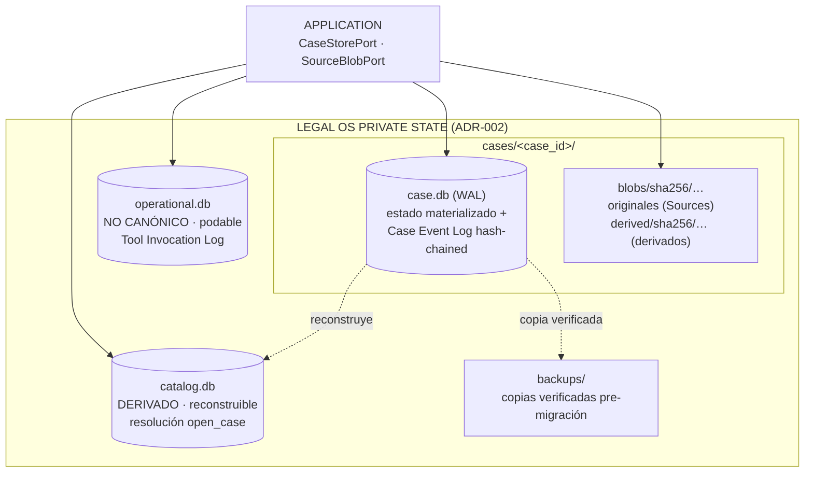
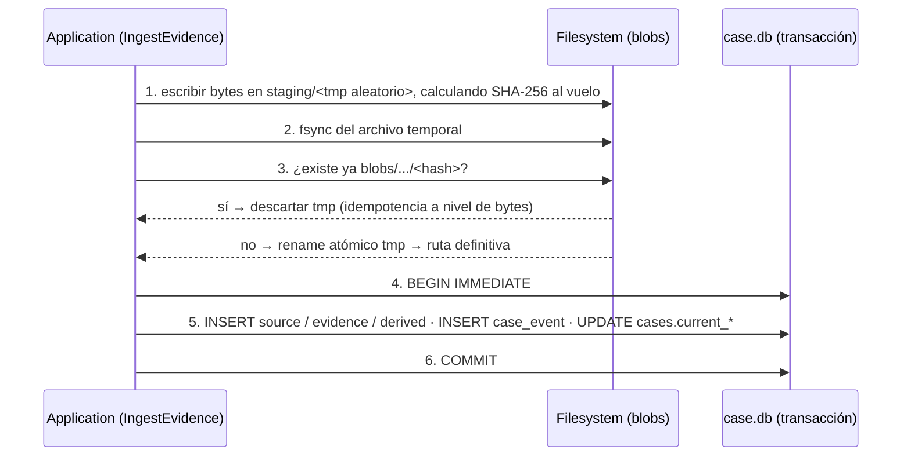

# 04 — Modelo de persistencia V0 (SQLite + filesystem)

**Estado:** Technical Design V0. Normado por `00-technical-kernel.md` (kernel v0.4) y por los ADR-001…ADR-006 (Accepted), que **mandan sobre este documento** (kernel §14). Todo lo que aquí es mío va etiquetado `PROPUESTA DEL TECHNICAL DESIGN` y entra en la lista de aprobaciones pendientes (§11).

Este documento decide **cómo se materializa** el estado canónico. No redefine qué es canónico (ADR-003), ni dónde vive la frontera de acceso (ADR-002), ni qué se registra (ADR-004). Todo lo de aquí es **detalle de implementación de plataforma** en el sentido de `docs/architecture/boundaries.md` §6: sustituible sin tocar Domain ni Application. La estrategia y su reversibilidad se argumentan en `docs/architecture/adrs/ADR-007-persistence-strategy-v0.md`.

**Regla de lectura del DDL:** todos los bloques de esquema son **PSEUDOCÓDIGO CONCEPTUAL, no SQL ejecutable**. Usan tipos conceptuales (`id`, `sha256`, `enum{...}`, `ts`, `json`) y notación abreviada de constraints. Sirven para fijar identidad, cardinalidad y locus de cada invariante; la sintaxis real se escribe en implementación.

---

## 1. Topología de almacenamiento

**PROPUESTA DEL TECHNICAL DESIGN: tres persistencias con propósitos disjuntos, más un almacén de blobs por Case.**

| Almacén | Contenido | Naturaleza | Retención |
|---|---|---|---|
| `cases/<case_id>/case.db` | Estado canónico materializado de **un** Case + Case Event Log del Case | **Canónico** | Permanente |
| `cases/<case_id>/blobs/` | Bytes de Sources y de DerivedRepresentations, content-addressed | Canónico (originales) / regenerable (derivados) | Permanente (originales) |
| `catalog.db` | Índice de resolución `identificador natural → case_id` para `open_case` | **Derivado, reconstruible** | Regenerable |
| `operational.db` | Tool Invocation Log | **No canónico, podable** | Política de retención (DECISIÓN PENDIENTE, ADR-004) |

### 1.1 Una base de datos por Case — decisión y justificación

**PROPUESTA DEL TECHNICAL DESIGN.** El estado canónico se particiona físicamente por Case: un archivo SQLite por expediente. ADR-002 habla en plural de *case databases* dentro del private state, pero no fija la partición; esta es la decisión que falta.

Razones, en orden de peso:

1. **El aislamiento entre Cases pasa de predicado a frontera física.** ADR-003 invariante 10 y el test adversarial 7 exigen que ninguna consulta de un Case retorne entidades de otro. Con una sola base, ese invariante depende de que **cada** consulta lleve su `WHERE case_id = ?`: un olvido produce fuga silenciosa, que es la peor clase de fallo en este dominio. Con una base por Case, un `fact_id` del Case B simplemente **no existe** en el archivo del Case A: la FK falla antes de que nadie razone.
2. **Backup y migración acotados.** El backup verificado previo a cada migración (kernel §13; `boundaries.md` §10) se hace por Case: un expediente grande no obliga a copiar el corpus completo, y un fallo de migración compromete un archivo, no todos.
3. **Cadena de eventos por archivo.** El Case Event Log es *por Case* (ADR-004); tenerlo en su propio archivo hace que `event_seq` sea un contador de archivo y no una columna a filtrar.
4. **Portabilidad futura.** Exportar o archivar un expediente (POST-V0) es copiar un directorio, no extraer filas entrelazadas.

Costes aceptados y su mitigación:

- **`open_case` necesita mirar todos los Cases.** Se resuelve con `catalog.db`, que es **derivado y reconstruible** escaneando `cases/*/case.db`. Al ser derivado no introduce escritura transaccional cruzada: si la escritura del catálogo falla o queda desfasada, la reparación es reconstruir, nunca reconciliar. Esto elimina la necesidad de commit en dos archivos.
- **Migraciones N veces.** El runner itera Cases (§9). Un Case a medio migrar es detectable por su `schema_version` y se abre en **solo lectura** (kernel §13), no se "arregla" al vuelo.
- **Consultas cross-case.** No existen en V0 y no deben existir: no hay caso de uso en el slice. Si POST-V0 aparece (p. ej. deduplicación de Sources), se resuelve en el catálogo derivado o cambiando el adapter, no reabriendo el Domain.

**El DDL es el mismo bajo cualquiera de las dos particiones.** Todas las tablas conservan `case_id` con FK a `cases(case_id)`; en el layout adoptado la tabla `cases` tiene exactamente una fila (guarda declarativa en §3.1). Un adapter de base única usaría el mismo esquema con N filas en `cases`. **La decisión es reversible sin cambiar el modelo de datos**, solo el adapter y el mecanismo de migración.

### 1.2 Diagrama



### 1.3 Parámetros del motor

| Parámetro | Valor V0 | Fundamento |
|---|---|---|
| `journal_mode` | `WAL` | **HECHO VERIFICADO** (kernel §1; fuente: sqlite.org): en WAL lectores y escritores concurren con **un solo escritor a la vez**; **WAL no funciona sobre filesystems de red**. |
| Escritores | **Uno lógico**, serializado en el Core | ADR-007. Concurrencia optimista (ADR-004 (c)), no locking pesimista. |
| `foreign_keys` | Debe habilitarse **por conexión** | **POR VERIFICAR** (spike de dependencias): comportamiento por defecto del motor y del binding. Mientras no se verifique, **ninguna FK se cuenta como defensa activa** en §4. |
| `synchronous` | `FULL` en `case.db`; `NORMAL` en `operational.db` | **PROPUESTA**. **POR VERIFICAR**: semántica exacta de cada nivel bajo WAL en la documentación oficial. |
| `busy_timeout` | Valor finito no nulo en lectores | **PROPUESTA**; evita fallos espurios de lectura durante un commit. |
| Ubicación | Siempre almacenamiento local | Consecuencia directa del HECHO VERIFICADO anterior: una carpeta sincronizada o de red **no es despliegue válido** de este adapter. |

---

## 2. Crítica de la lista de tablas candidatas

Veredicto sobre las 17 tablas propuestas en el encargo, más lo que falta.

| # | Tabla candidata | Veredicto | Razón (detalle abajo) |
|---|---|---|---|
| 1 | `cases` | **SE QUEDA** | Agregado raíz; ancla de FK y del contador de revisión. |
| 2 | `sources` | **SE QUEDA** | Identidad + hash + tamaño + media_type del material incorporado. |
| 3 | `source_versions` | **SE ELIMINA** | Un original inmutable no tiene versiones (§2.1). |
| 4 | `evidence` | **SE QUEDA** | `Source ≠ Evidence` es regla Accepted (ADR-003); fusionar cerraría la deduplicación futura. |
| 5 | `derived_representations` | **SE QUEDA** | Lo que sí versiona; estado `PENDING\|READY\|FAILED`. |
| 6 | `evidence_fragments` | **SE ELIMINA** | El anclaje es atributo del EvidenceLink, no entidad (§2.2). |
| 7 | `facts` | **SE QUEDA** | Sin columna de status: el estatus vive en la historia. |
| 8 | `fact_status_history` | **SE QUEDA** | Append-only; ADR-003 inv. 3. |
| 9 | `evidence_links` | **SE QUEDA** | Absorbe el fragmento (§2.2). |
| 10 | `proposals` | **SE QUEDA** | Cabecera: revisión base, metodología, modelo. |
| 11 | `proposal_items` | **SE QUEDA** | Identidad estable por item (kernel §2.1). |
| 12 | `proposal_item_reviews` | **SE QUEDA** | Append-only; registra también `REJECTED` y `PENDING` (kernel §3.4). |
| 13 | `human_authorizations` | **SE QUEDA** | Estado vivo y consumible; **no** se fusiona con la anterior (§2.3). |
| 14 | `artifacts` | **SE QUEDA** | Registro de trabajo + marca de staleness. |
| 15 | `artifact_inputs` | **SE QUEDA** | Como tabla, no como JSON (§2.4). |
| 16 | `case_events` | **SE QUEDA** | Log canónico hash-chained. |
| 17 | `tool_invocations` | **SE MUEVE** | A `operational.db`; en `case.db` sería un error de diseño (§2.5). |
| +A | `source_ingestions` | **FALTA** | Procedencias adicionales de los mismos bytes (§2.1). |
| +B | `derived_segments` | **FALTA** | Unidad de cita y de índice; mapea derivado → línea de tiempo del original (§2.6). |
| +C | `segments_fts` (virtual) | **FALTA** | Índice FTS5 (§6). |
| +D | `schema_migrations` | **FALTA** | Mecanismo de migración (§9). |
| +E | `case_catalog` (en `catalog.db`) | **FALTA** | Resolución de `open_case` e idempotencia de `create_case` (§3.5). |
| — | `statements` | **NO EXISTE** | `Statement` no se materializa en V0 (addendum v0.3 B.7); §8 demuestra que añadirla después es aditivo. |
| — | `provenance_records` | **NO EXISTE** | Provenance es atributo embebido, no entidad (§2.7). |
| — | `principals` | **NO EXISTE** | Un solo principal en V0; sin lifecycle propio (regla de entrada, ADR-003). POST-V0. |
| — | `blobs` | **NO EXISTE** | La ruta es función pura del hash; sin refcount hasta que haya deduplicación (§7.4). POST-V0. |
| — | `conditions` | **NO EXISTE** | Las condiciones activas se computan del estado (SUPUESTO ya registrado en el vertical slice). |

### 2.1 `source_versions` sobra; falta `source_ingestions`

**Se elimina.** ADR-003 invariante 8 declara el Source **inmutable tras incorporación**, y el Product Floor PF-002 prohíbe sobrescribirlo o borrarlo por la superficie del producto. Una tabla de versiones de un objeto inmutable modela algo que por contrato no puede ocurrir; peor, **invita** a que ocurra: existiendo la tabla, alguien escribirá la "versión 2" de un original. Lo que sí versiona es la `DerivedRepresentation`, que ya lleva `version`, `content_hash` y `recipe` (ADR-003). El `source_version_hash` que aparece en el locator del vertical slice **no implica una tabla**: es el hash de la representación exacta sobre la que el selector es válido, y esa representación es o bien el Source (`sources.content_hash`) o bien una derivación concreta (`derived_representations.content_hash`). Ambos ya están. **Nota de vocabulario:** por esa misma razón el nombre `source_version_hash` queda superseded y en el corpus vigente ese dato se llama `representation_hash` (§2.2, §3.3; `07` §3.1) — nombrar "versión del Source" un hash que a menudo es el de una derivación era precisamente lo que sugería la tabla que aquí se elimina.

**Falta, en cambio, `source_ingestions`.** El test adversarial 5 del vertical slice exige: *"mismos bytes con procedencia declarada distinta ⇒ se registra la procedencia adicional, **no** un Source nuevo"* (ADR-006 inv. 7). Sin una tabla 1:N por Source no hay dónde poner esa segunda procedencia sin sobrescribir la primera — que es exactamente lo que la inmutabilidad prohíbe. `source_ingestions` guarda cada acto de incorporación: sobre de ingestión (`declared_origin`), referencia de Inbox resuelta, principal y timestamp. Es la tabla que hace que "el original no se duplica pero la historia no se pierde" sea representable.

**RIESGO / DECISIÓN PENDIENTE derivada.** Registrar una procedencia adicional **es un cambio de estado canónico**, y ADR-004 inv. 5 exige biyección mutación↔evento; pero el vertical slice describe el reintento de incorporación como *"respuesta idéntica; sin evento nuevo"*. Ver §10, conflicto **C4**.

### 2.2 `evidence_fragments` sobra: el fragmento es atributo del EvidenceLink

**Se elimina, y la razón ya está decidida arriba de este documento**: el addendum v0.3 B.17, citado en `docs/architecture/vertical-slice-v0.md`, establece que `EvidenceFragment` **no es entidad del vocabulario canónico** y que el anclaje es un atributo del EvidenceLink. La regla de entrada al dominio (ADR-003) lo confirma: un fragmento no tiene lifecycle, ni identidad estable, ni invariantes propios — nace con el link, muere con el link y no transiciona nunca. Darle tabla e id crearía identidad para algo que no la necesita, y con ella la tentación de referenciarlo desde otros sitios, que es como los conceptos reservados reaparecen disfrazados.

**Consecuencia que hay que resolver, no ignorar:** `search_case` y `get_evidence_fragment` devuelven *"fragmentos con id"*. Ese id **no es identidad de entidad**: es un **handle opaco de localización**, computado en lectura a partir de `(evidence_id, representation_hash, selectors)` y **verificable por re-resolución** — el Core lo decodifica y comprueba que la Evidence existe, que el hash está registrado y que **todos** los selectores caen dentro de los límites de la representación. Un handle fabricado por el modelo falla esa verificación, que es lo que exige el test F18 (ids no emitidos por el Core ⇒ rechazo). No se persiste, no se muestra a la usuaria, y no viola la regla dura del kernel §11 (`entity identity ≠ content identity`) porque no pretende ser identidad de nada.

> **Forma del ancla embebida — VIGENTE, y supersede de la forma antigua.** El addendum v0.3 B.17 escribía el atributo como `fragment { source_version_hash, selector }`. Esa forma **queda superseded**. La vigente es el `EvidenceFragment` consolidado de `07` §3.1 (con `02` §2.5 y `ADR-011`):
>
> ```text
> { v, source_id, anchored_in, derivation_id?, representation_hash, selectors[], original_locator }
> ```
>
> materializada columna a columna en §3.3. **Precedencia:** el addendum es nivel 5 y el Technical Design nivel 2 (kernel §14); no se reabre ningún ADR Accepted. Al contrario, es la única forma que hace **verificable** ADR-003 inv. 7 y ADR-006 inv. 5.
>
> Dos diferencias no son cosméticas y por eso el DDL cambia:
> - **Aridad.** `selectors` es plural, ordenado y `>= 1`. `07` §3.3 exige el par `TEXT_POSITION` **+** `TEXT_QUOTE` para texto plano; un `selector` único no podía expresarlo. Consecuencia sobre este documento: desaparece la columna `selector_kind` —un array no tiene un `kind` escalar— y con ella la posibilidad de un `CK` de SQL sobre la familia del selector. **INV-L-04** (`anchored_in = 'DERIVED_REPRESENTATION'` ⇒ ningún selector `TIME_RANGE` ni `PAGE_RANGE`) queda por tanto **enforced en Domain**, exactamente donde `07` §7 ya lo sitúa. Se declara la pérdida en vez de ocultarla: el esquema deja de poder rechazar por sí solo un ancla temporal sobre un derivado.
> - **Nombre del hash.** `representation_hash` nombra la representación **exacta** leída (Source o derivación). El nombre antiguo `source_version_hash` sugería una tabla de versiones del original que §2.1 acaba de eliminar y que ADR-003 inv. 8 prohíbe. `DIVERGENCIA A RECONCILIAR`: el nombre físico anterior en este documento era `anchor_content_hash`; se adopta `representation_hash` para que el nombre sea **uno solo** en interfaz y en esquema.

**POR VERIFICAR / POST-V0:** si algún día un fragmento debe portar estado propio (anotación de la profesional, retiro independiente del link), la regla de entrada lo promoverá a entidad y **entonces** tendrá tabla. Hoy no lo tiene.

### 2.3 `human_authorizations` y `proposal_item_reviews` no se fusionan

Tentación legítima: una `HumanAuthorization` es, semánticamente, "una revisión `APPROVED` que aún no se ha consumido". Fusionarlas ahorraría una tabla. **Se rechaza**, por una razón estructural: `proposal_item_reviews` es **append-only** (kernel §3.4) y `human_authorizations` tiene un campo que **muta exactamente una vez** (`consumed_at`). Fusionar obligaría a hacer `UPDATE` sobre una tabla cuya garantía es que nunca se actualiza, destruyendo el único mecanismo barato de proteger el registro de la decisión humana. Además son cardinalidades distintas: `REJECTED` y `PENDING` producen review y **ninguna** autorización (kernel §3.4), y una re-revisión produce una review nueva sin revivir la autorización anterior.

### 2.4 `artifact_inputs` como tabla, no como JSON

`inputs[]` podría vivir como columna JSON en `artifacts`. **Se rechaza** porque la consulta caliente del slice va en dirección contraria: el paso 16 del happy path (propagación de staleness) pregunta *"¿qué artifacts consumieron esta entidad?"* dentro del mismo mutador que incorpora evidencia. Con JSON eso es escaneo completo más parseo por fila; con tabla es un índice por `(entity_kind, entity_id)`. Segundo motivo: la validación de ADR-006 inv. 3 (`entity_id` + `content_hash` deben existir en el Case Store) se expresa fila a fila y produce un rechazo localizable en el item que falla (test F9).

**Límite declarado:** `entity_id` es **polimórfico** (puede apuntar a `derived_representations`, `sources`, `evidence`, `facts`), y SQL no expresa una FK polimórfica. La validación es de **Application** (§4 fila 24; `Artifact` es entidad de Application, addendum v0.3 B.4), no de esquema.

### 2.5 `tool_invocations` no va en `case.db`

**Se mueve a `operational.db`.** Tres razones, todas de contrato:

1. **ADR-004 (b) fija dos persistencias**: el Tool Invocation Log es *"operacional, separado… no canónico, no hash-chained y podable"*. Meterlo en el archivo canónico haría de la poda una operación sobre el archivo que contiene la cadena de eventos, exactamente lo que el criterio estructural 6 del slice quiere poder hacer sin tocar nada canónico.
2. **Debe poder registrar invocaciones con ids inventados.** El test F18 exige traza en el Tool Invocation Log de invocaciones con `case_id` inexistente. Una FK a `cases` haría **imposible registrar precisamente los eventos que los tests adversariales necesitan**. Sin FK y en otra base, el problema desaparece.
3. **Volumen y retención distintos.** Las QUERY también se registran; su política de retención es otra (DECISIÓN PENDIENTE, ADR-004).

`tool_invocations.case_id` y `tool_invocations.event_id` son referencias **débiles** (texto, sin FK): correlacionan, no restringen.

### 2.6 Falta `derived_segments`

El slice exige tres cosas que ninguna tabla de la lista cubre: (a) `search_case` devuelve **fragmentos**, no documentos enteros; (b) los rangos temporales de un fragmento refieren **a la línea de tiempo del original**, no a la del derivado (F5, ADR-003 inv. 7); (c) `UNCERTAIN_FRAGMENT {ranges}` necesita rangos con confianza por debajo de umbral. Las tres se resuelven con la misma tabla: el derivado se persiste como blob **y** se descompone en segmentos (turnos de habla, párrafos, páginas) con sus coordenadas **en el original** y su confianza. El índice FTS5 se construye sobre segmentos (§6), no sobre documentos.

`derived_segments` es **regenerable**: se borra y se reconstruye con su `DerivedRepresentation`. No es entidad del Domain; es la unidad de indexación y cita de una representación derivada.

### 2.7 No hay tabla `provenance_records`

ADR-003 invariante 1 exige que **toda** entidad epistémica porte un ProvenanceRecord completo y que construirla sin él falle. Una tabla aparte implica FK — y una FK, aunque sea `NOT NULL`, admite el estado intermedio "fila creada, provenance pendiente" dentro de una transacción, y admite que alguien la haga nullable en una migración futura. **Embebiendo** las columnas (`provenance_kind`, `principal_id`, `principal_type`, `principal_role`, `recorded_at`) con `NOT NULL` en cada tabla epistémica, *"entidad sin provenance"* deja de ser representable. Es 1:1 sin lifecycle propio: por la regla de entrada al dominio, es atributo.

---

## 3. DDL conceptual

> **PSEUDOCÓDIGO CONCEPTUAL — no ejecutable.** Tipos: `id` = identificador opaco UUIDv7 (kernel §11; **POR VERIFICAR**: soporte real en el runtime elegido — alternativa equivalente ULID), `sha256` = digest hex de 64 caracteres, `ts` = instante UTC, `json` = documento estructurado validado por la aplicación, `enum{…}` = dominio cerrado. `PK`/`FK`/`UQ`/`CK` marcan dónde vive cada restricción. `AO` marca tabla **append-only**.

### 3.1 Case y provenance

```text
TABLE cases                                   -- exactamente 1 fila en el layout adoptado
  case_id            id      PK
  only_row           int     NOT NULL UQ  CK(only_row = 1)   -- guarda declarativa de singleton
  idempotency_key    text    NOT NULL UQ                     -- derivada por el Core (create_case)
  natural_labels     json    NOT NULL                        -- se indexa en catalog.db, no aquí
  context            enum{A} NOT NULL                        -- V0: solo contexto A
  context_role       enum{LITIGANT} NOT NULL                 -- rol PROCESAL del Case (`02` §3.1)
                                                             -- NO es `principal_role` (rol funcional,
                                                             -- abajo en <PROVENANCE>): son dos
                                                             -- dimensiones distintas (kernel §1.1,
                                                             -- `02` §2.2, `09` §2.3)
  current_revision   int     NOT NULL CK(current_revision >= 0)
  current_event_seq  int     NOT NULL CK(current_event_seq >= 0)
  schema_version     int     NOT NULL
  storage_layout_version int NOT NULL                        -- ver §7.2
  created_at         ts      NOT NULL
  -- provenance de creación (embebida, §2.7)
  provenance_kind    enum{EXTERNAL_SOURCE,AI_DERIVATION,AI_INFERENCE,HUMAN_DECISION,SYSTEM} NOT NULL
  principal_id       text    NOT NULL
  principal_type     enum{HUMAN,AI,SYSTEM} NOT NULL
  principal_role     text    NOT NULL
  CK( provenance_kind = 'HUMAN_DECISION'  =>  principal_type = 'HUMAN' )   -- matriz kernel §1.4
```

El bloque de cinco columnas de provenance (`provenance_kind`, `principal_id`, `principal_type`, `principal_role`, `recorded_at`) se repite en **toda** tabla epistémica; abajo se abrevia como `<PROVENANCE>` para no repetirlo, con su `CK` de la matriz kernel §1.4 incluido.

### 3.2 Material incorporado

```text
TABLE sources                                 -- INMUTABLE por la superficie normal (PF-002)
  source_id       id      PK
  case_id         id      NOT NULL FK -> cases(case_id)
  content_hash    sha256  NOT NULL UQ         -- idempotencia por contenido (ADR-006 inv. 7)
  byte_size       int     NOT NULL CK(byte_size >= 0)
  media_type      text    NOT NULL
  first_ingested_at ts    NOT NULL
  metadata        json    NOT NULL
  <PROVENANCE>                                -- provenance_kind = EXTERNAL_SOURCE
  -- sin columna de ruta: la ubicación del blob es función pura del hash (§7.2)

TABLE source_ingestions                       -- AO · 1:N por Source (§2.1)
  ingestion_id    id      PK
  source_id       id      NOT NULL FK -> sources(source_id)
  case_id         id      NOT NULL FK -> cases(case_id)
  declared_origin json    NOT NULL             -- sobre de ingestión (kernel §1.2)
  inbox_ref       text    NOT NULL             -- referencia de Inbox RESUELTA por el Core, nunca ruta
  ingested_at     ts      NOT NULL
  event_id        id      NULL FK -> case_events(event_id)   -- NULL sujeto a C4 (§10)
  <PROVENANCE>
  UQ(source_id, ingestion_hash)                -- ingestion_hash = H(declared_origin normalizado)
                                               -- reintento idéntico no crea fila

TABLE evidence                                -- rol probatorio del Source en ESTE Case
  evidence_id     id      PK
  case_id         id      NOT NULL FK -> cases(case_id)
  source_id       id      NOT NULL FK -> sources(source_id)
  incorporated_at ts      NOT NULL
  metadata        json    NOT NULL
  <PROVENANCE>
  UQ(case_id, source_id)                       -- un Source es Evidence una sola vez por Case

TABLE derived_representations                 -- persistida pero REGENERABLE; jamás sustituye al Source
  derivation_id   id      PK
  case_id         id      NOT NULL FK -> cases(case_id)
  source_id       id      NOT NULL FK -> sources(source_id)   -- referencia OBLIGATORIA (ADR-003 inv. 8)
  kind            enum{TRANSCRIPT,NORMALIZED_TEXT,OCR_TEXT} NOT NULL
  version         int     NOT NULL CK(version >= 1)
  state           enum{PENDING,READY,FAILED} NOT NULL
  content_hash    sha256  NULL                 -- NULL mientras PENDING/FAILED
  recipe          json    NOT NULL             -- { tool, version, params }
  failure_reason  text    NULL
  created_at      ts      NOT NULL
  <PROVENANCE>                                 -- provenance_kind = AI_DERIVATION
  UQ(source_id, kind, version)
  CK( state = 'READY'  =>  content_hash IS NOT NULL )
  CK( state = 'FAILED' =>  failure_reason IS NOT NULL )

TABLE derived_segments                        -- regenerable con su derivación (§2.6)
  segment_id      id      PK
  derivation_id   id      NOT NULL FK -> derived_representations(derivation_id)
  case_id         id      NOT NULL FK -> cases(case_id)
  seq             int     NOT NULL
  text            text    NOT NULL
  text_normalized text    NOT NULL             -- normalización es-CO del producto (§6.2)
  char_start      int     NOT NULL             -- offsets EN EL DERIVADO
  char_end        int     NOT NULL CK(char_end > char_start)
  original_locator json   NOT NULL             -- coordenadas SOBRE EL ORIGINAL (ms / página / bbox)
  confidence      real    NULL                 -- NULL cuando la receta no reporta confianza
  UQ(derivation_id, seq)
```

### 3.3 Hechos, links y su historia

```text
TABLE facts
  fact_id         id      PK
  case_id         id      NOT NULL FK -> cases(case_id)
  statement_text  text    NOT NULL             -- el enunciado fáctico
  alleged_only    bool    NOT NULL             -- marca explícita "solo alegado" (ADR-006 inv. 2)
  created_at      ts      NOT NULL
  <PROVENANCE>
  -- SIN columna de status: el estatus vive en fact_status_history (ADR-003)
  -- SIN columnas SUPPORTED/CONTRADICTED/UNSUPPORTED: derivados, jamás persistidos (ADR-003 inv. 6)

TABLE fact_status_history                     -- AO (ADR-003 inv. 3)
  fact_id         id      NOT NULL FK -> facts(fact_id)
  seq             int     NOT NULL CK(seq >= 1)
  status          enum{PROPOSED,ALLEGED,DETERMINED,WITHDRAWN} NOT NULL
  determined_kind enum{ACCREDITED_BY_PROFESSIONAL} NULL       -- sin productor en V0
  at_revision     int     NOT NULL
  event_id        id      NOT NULL FK -> case_events(event_id)
  recorded_at     ts      NOT NULL
  <PROVENANCE>
  PK(fact_id, seq)
  CK( status = 'DETERMINED'  =>  determined_kind IS NOT NULL )
  CK( provenance_kind IN ('AI_INFERENCE','AI_DERIVATION')  =>  status = 'PROPOSED' )   -- ver §4

TABLE evidence_links                          -- absorbe el fragmento (§2.2)
  link_id         id      PK
  case_id         id      NOT NULL FK -> cases(case_id)
  fact_id         id      NOT NULL FK -> facts(fact_id)
  evidence_id     id      NOT NULL FK -> evidence(evidence_id)
  -- ancla: SIEMPRE resuelve a un Source (ADR-006 inv. 5)
  -- EvidenceFragment consolidado, embebido (§2.2; forma de 07 §3.1 / 02 §2.5 / ADR-011)
  locator_v             int    NOT NULL CK(locator_v = 1)   -- LocatorSchemaVersion (07 §3.1)
  anchored_in           enum{SOURCE,DERIVED_REPRESENTATION} NOT NULL
  anchor_source_id      id     NOT NULL FK -> sources(source_id)   -- = EvidenceFragment.source_id
  anchor_via_derivation id     NULL FK -> derived_representations(derivation_id)
                                              -- = EvidenceFragment.derivation_id
  representation_hash   sha256 NOT NULL       -- hash de la representación EXACTA leída
                                              -- (antes `anchor_content_hash`; ver §2.2)
  selectors       json    NOT NULL            -- ARRAY ORDENADO, >= 1: coordenada de RECUPERACIÓN
                                              -- sobre representation_hash (07 §3.1, §3.7).
                                              -- Vocabulario W3C candidato, sin dependencia (ADR-003)
  original_locator json   NOT NULL            -- coordenada de CITA, SOBRE EL ORIGINAL (ADR-003 inv. 7)
  CK( anchored_in = 'SOURCE'                  =>  anchor_via_derivation IS NULL )
  CK( anchored_in = 'DERIVED_REPRESENTATION'  =>  anchor_via_derivation IS NOT NULL )
  -- INV-L-02 (selectors no vacío) e INV-L-04 (sin TIME_RANGE/PAGE_RANGE sobre derivado):
  -- **Domain**, no SQL — con `selectors` como array no hay `kind` escalar que restringir (§2.2)
  polarity        enum{SUPPORTS,CONTRADICTS,CONTEXTUALIZES} NOT NULL   -- enum CERRADO en V0
  link_state      enum{ACTIVE,RETIRED} NOT NULL
  rationale       text    NOT NULL
  created_at      ts      NOT NULL
  <PROVENANCE>
```

### 3.4 Propuesta, revisión, autorización, artifacts

```text
TABLE proposals
  proposal_id       id    PK
  case_id           id    NOT NULL FK -> cases(case_id)
  base_case_revision int  NOT NULL              -- revisión contra la que se generó
  methodology_version text NOT NULL
  model_id          text  NULL
  content_hash      sha256 NOT NULL             -- hash del contenido normalizado de la propuesta
  created_at        ts    NOT NULL
  <PROVENANCE>                                  -- provenance_kind = AI_INFERENCE en el flujo del slice
  -- SIN columna de estado agregado: ver §10 conflicto C1

TABLE proposal_items
  proposal_item_id  id    PK                    -- identidad estable y opaca, NUNCA índice posicional
  proposal_id       id    NOT NULL FK -> proposals(proposal_id)
  case_id           id    NOT NULL FK -> cases(case_id)
  item_content_hash sha256 NOT NULL             -- hash del contenido normalizado del item
  payload           json  NOT NULL              -- hecho candidato + links propuestos
  review_decision   enum{PENDING,APPROVED,REJECTED} NOT NULL
  commit_state      enum{UNCOMMITTED,COMMITTED} NOT NULL
  committed_fact_id id    NULL FK -> facts(fact_id)
  CK( commit_state = 'COMMITTED'  =>  review_decision = 'APPROVED' AND committed_fact_id IS NOT NULL )
  -- LOCUS: el CK es CINTURON MECANICO REDUNDANTE (§4 clausula 2), nunca el motor. El locus normativo
  -- de esta transicion es APPLICATION: proposal_items es entidad de Application (addendum v0.3 B.4;
  -- 02 §4; ADR-008), no del Domain. Formulacion unica en el corpus: 06 §10 inv. 8 y 12 §6.2 INV-H-08
  -- INVALIDATED no existe como estado: es derivado (kernel §2.2)

TABLE proposal_item_reviews                     -- AO (kernel §3.4)
  review_id         id    PK
  review_session_id id    NOT NULL              -- unidad del acto de revisión (kernel §3.2)
  proposal_item_id  id    NOT NULL FK -> proposal_items(proposal_item_id)
  case_id           id    NOT NULL FK -> cases(case_id)
  item_content_hash sha256 NOT NULL             -- el contenido EFECTIVAMENTE revisado
  decision          enum{APPROVED,REJECTED,PENDING} NOT NULL
  note              text  NULL
  reviewed_at       ts    NOT NULL
  event_id          id    NOT NULL FK -> case_events(event_id)
  <PROVENANCE>                                  -- HUMAN_DECISION + principal_type = HUMAN

TABLE human_authorizations
  authorization_id  id    PK
  case_id           id    NOT NULL FK -> cases(case_id)
  proposal_id       id    NOT NULL FK -> proposals(proposal_id)
  proposal_item_id  id    NOT NULL FK -> proposal_items(proposal_item_id)   -- UNA por item (kernel §3.2)
  review_id         id    NOT NULL FK -> proposal_item_reviews(review_id)
  item_content_hash sha256 NOT NULL
  expected_case_revision int NOT NULL           -- la revisión contra la que se GENERÓ y se REVISÓ la
                                                -- Proposal, no la que deja ProposalReviewed —que no
                                                -- avanza la revisión— (AC-02; §10 C3)
  authorized_operation enum{COMMIT_FACT} NOT NULL   -- singular: UNA operación por autorización (AC-01);
                                                    -- SIN authorized_items[] ni proposal_content_hash
  authorization_source enum{REAL,DEV_STUB} NOT NULL                          -- kernel §4
  created_at        ts    NOT NULL
  expires_at        ts    NOT NULL CK(expires_at > created_at)
  consumed_at       ts    NULL                  -- un solo uso: invariante materializado
  <PROVENANCE>                                  -- HUMAN_DECISION + principal_type = HUMAN
  UQ(proposal_item_id) WHERE consumed_at IS NULL  -- a lo sumo UNA autorización viva por item
                                                  -- POR VERIFICAR: soporte de índice parcial (§4)
  -- SIN campo single_use (invariante, no columna)
  -- SIN campo decision (rechazar produce review, no autorización — kernel §3.1)

TABLE artifacts
  artifact_id       id    PK
  case_id           id    NOT NULL FK -> cases(case_id)
  type              enum{FactAnalysis} NOT NULL          -- único tipo en V0
  status            enum{DRAFT,REGISTERED,REVIEWED,SUPERSEDED} NOT NULL
  case_revision     int   NOT NULL                       -- revisión vigente al registrarlo
  methodology_version text NOT NULL
  model_id          text  NULL
  knowledge_pack_versions json NOT NULL                  -- vacío en el slice, obligatorio si hay pack
  stale             bool  NOT NULL
  supersedes_artifact_id id NULL FK -> artifacts(artifact_id)   -- cadena simple, no DAG
  created_at        ts    NOT NULL
  <PROVENANCE>

TABLE artifact_stale_reasons                    -- AO · sin razón, ANALYSIS_STALE no puede explicarse
  artifact_id       id    NOT NULL FK -> artifacts(artifact_id)
  reason            enum{NEW_EVIDENCE,INPUT_SUPERSEDED,METHODOLOGY_CHANGED} NOT NULL
  marked_at         ts    NOT NULL
  event_id          id    NOT NULL FK -> case_events(event_id)
  PK(artifact_id, reason, event_id)

TABLE artifact_inputs
  artifact_id       id    NOT NULL FK -> artifacts(artifact_id)
  entity_kind       enum{SOURCE,EVIDENCE,DERIVED_REPRESENTATION,FACT} NOT NULL
  entity_id         id    NOT NULL              -- FK POLIMÓRFICA: validación en Domain (§4)
  content_hash      sha256 NOT NULL
  PK(artifact_id, entity_kind, entity_id)
```

`artifact_stale_reasons` como tabla y no como columna JSON: la marca es acumulativa (`stale_reasons[]`), **ninguna tool puede limpiarla** (slice, *Artifact behavior* 5) y cada razón debe poder correlacionarse con el evento `ArtifactMarkedStale` que la produjo. Un array JSON reescribible sería una superficie de borrado silencioso de exactamente lo que no puede borrarse.

### 3.5 Log canónico, catálogo derivado y log operacional

```text
TABLE case_events                              -- AO · hash-chained · CANÓNICO
  event_id        id      PK
  case_id         id      NOT NULL FK -> cases(case_id)
  event_seq       int     NOT NULL UQ CK(event_seq >= 1)     -- MONOTÓNICO por Case, +1 en TODOS los
                                                             -- eventos. Es el orden del hash-chain
                                                             -- y el eje de la biyección (AC-02)
  case_revision   int     NULL                                -- +1 SOLO si el evento muta el estado
                                                             -- epistémico canónico; NULL si no
                                                             -- (caso de ProposalReviewed).
                                                             -- Enmienda AC-02 aprobada; ver §10 C3
  event_type      enum{ CaseCreated, EvidenceIncorporated,
                        DerivedRepresentationGenerated, DerivedRepresentationFailed,
                        FactsProposed, ArtifactRegistered, ProposalReviewed,
                        FactsCommitted, ArtifactMarkedStale,
                        FactWithdrawn,                          -- sin productor en V0
                        ProposalPreservedForReconciliation      -- sin productor en V0 (AC-04);
                                                                -- ver C1
                      } NOT NULL
  payload         json    NOT NULL             -- suficiente para reconstrucción (ADR-004)
  payload_hash    sha256  NOT NULL
  <PROVENANCE>                                 -- principal + provenance_kind del evento
  methodology_version text NULL
  model_id        text    NULL
  knowledge_pack_versions json NULL
  occurred_at     ts      NOT NULL
  prev_event_hash sha256  NULL UQ              -- NULL solo en el primer evento
  event_hash      sha256  NOT NULL UQ
  CK( (event_seq = 1) = (prev_event_hash IS NULL) )   -- una sola cabeza de cadena
  CK( provenance_kind = 'HUMAN_DECISION' => principal_type = 'HUMAN' )
```

```text
-- catalog.db · DERIVADO Y RECONSTRUIBLE. Nunca fuente de verdad.
TABLE case_catalog
  case_id         id      PK
  idempotency_key text    NOT NULL UQ          -- idempotencia de create_case a nivel workspace
  display_label   text    NOT NULL
  current_revision int    NOT NULL             -- copia desfasable; el valor autoritativo está en case.db
  db_path_rel     text    NOT NULL
  last_seen_at    ts      NOT NULL

TABLE case_label_index
  case_id         id      NOT NULL FK -> case_catalog(case_id)
  label_normalized text   NOT NULL             -- misma normalización es-CO que §6.2
  PK(case_id, label_normalized)
```

```text
-- operational.db · NO CANÓNICO · PODABLE · SIN hash-chain · SIN FK (§2.5)
TABLE tool_invocations
  invocation_id   id      PK
  occurred_at     ts      NOT NULL
  tool            text    NOT NULL
  tool_class      enum{QUERY,COMMAND,PROPOSAL,SENSITIVE_COMMAND,ADMIN} NOT NULL
  session_ref     text    NULL
  principal_id    text    NOT NULL
  principal_type  enum{HUMAN,AI,SYSTEM} NOT NULL
  principal_role  text    NOT NULL
  case_ref        text    NULL                 -- referencia DÉBIL: puede ser un id inventado (F18)
  input_hash      sha256  NOT NULL             -- hash de inputs, no los inputs
  outcome         enum{ACCEPTED,REJECTED,ERROR} NOT NULL
  condition_codes json    NOT NULL
  duration_ms     int     NOT NULL
  event_ref       text    NULL                 -- correlación con case_events.event_id, sin FK
```

`input_hash` y no los inputs literales: el Tool Invocation Log registra invocaciones **rechazadas**, incluidas las que traen contenido no incorporado; almacenar sus payloads convertiría un log podable en un depósito paralelo de material sin custodia, justo lo que ADR-006 impide. **RIESGO declarado:** con solo el hash, el diagnóstico de un rechazo pierde detalle. Compensación en V0: `condition_codes` y el código semántico del rechazo sí se guardan.

```text
-- Presente en case.db, catalog.db y operational.db, cada una con su secuencia propia
TABLE schema_migrations                         -- AO
  version         int     PK                    -- numeración monótona, solo hacia adelante
  name            text    NOT NULL
  script_hash     sha256  NOT NULL              -- hash del script aplicado
  applied_at      ts      NOT NULL
  applied_by      text    NOT NULL              -- versión del runtime que la aplicó
```

---

## 4. Invariantes: SQL vs Domain

**Regla de reparto (PROPUESTA DEL TECHNICAL DESIGN), en tres cláusulas:**

1. **El Domain es el locus primario de todo invariante con contenido jurídico o epistémico.** Debe ser probable **sin SQLite**, contra un repositorio en memoria. Si un test del Domain necesita levantar una base para pasar, el invariante está en el lugar equivocado.
2. **SQL solo aporta lo estructural** (identidad, cardinalidad, unicidad, dominio de valores, atomicidad) y, para lo epistémico, únicamente **defensa en profundidad redundante**: una constraint que duplica una regla ya aplicada en el Domain. Nunca es el único sitio donde vive la regla.
3. **Ningún trigger contiene lógica jurídica.** Se admite exactamente **una** forma de trigger: `RAISE(ABORT)` **incondicional** ante `UPDATE`/`DELETE` en tablas append-only. No lee valores de dominio, no ramifica, no decide nada. Cualquier trigger que consulte un status, una polaridad o un principal está prohibido por esta regla.

**Límite honesto:** las constraints y los triggers son **tamper-evident, no tamper-proof** (ADR-002, ADR-004 §8.3). Un proceso con acceso directo al archivo puede eliminarlos. Protegen contra el error del propio Core, no contra un local hostil, que está fuera del threat model V0.

| # | Invariante | Fuente | Mecanismo | Locus | Nota |
|---|---|---|---|---|---|
| 1 | Identidad de entidad opaca y única | kernel §11; ADR-001 inv. 7 | `PRIMARY KEY` | **SQL** | El Core genera el id; SQL garantiza unicidad. |
| 2 | Un id no emitido por el Core se rechaza | ADR-001 inv. 7; F18 | Resolución + rechazo con código semántico estable | **Domain** | La FK falla *después*; el rechazo autoritativo debe ser del Core, no un error de motor. |
| 3 | Aislamiento entre Cases | ADR-003 inv. 10; adversarial 7 | Partición física (§1.1) + `FK -> cases` | **SQL (estructural) + Domain (rechazo)** | El Domain rechaza primero con código estable; la FK es red de seguridad. |
| 4 | Toda entidad epistémica porta provenance completa | ADR-003 inv. 1 | Columnas embebidas `NOT NULL` (§2.7) | **SQL + Domain** | "Entidad sin provenance" deja de ser representable. |
| 5 | `HUMAN_DECISION` exige `principal_type = HUMAN` | kernel §1.4 | `CHECK` de tupla + validación de constructor | **Domain (primario) + SQL (redundante)** | Es restricción de tupla sin semántica jurídica: admisible como CHECK. |
| 6 | Nunca `principal_type = AI` con `provenance_kind = HUMAN_DECISION` | kernel §1.4, §1.5 | Igual que 5 | **Domain + SQL** | Formulación correcta de lo que antes se escribía `actor_type = HUMAN_DECISION`. |
| 7 | Idempotencia de ingestión por hash de contenido | ADR-006 inv. 7; adversarial 5 | `UNIQUE(sources.content_hash)` + lookup previo | **SQL + Application** | El Application consulta y devuelve el Source existente; el UNIQUE cierra la carrera. |
| 8 | Un Source es Evidence una sola vez por Case | ADR-003 | `UNIQUE(evidence.case_id, source_id)` | **SQL** | Estructural puro. |
| 9 | Toda DerivedRepresentation referencia su Source | ADR-003 inv. 8 | `FK NOT NULL` | **SQL** | El derivado jamás huérfano. |
| 10 | El derivado nunca sustituye al Source | ADR-003 inv. 8 | Ausencia de camino: ninguna lectura resuelve un fragmento sin `anchor_source_id` | **Domain + esquema** | `evidence_links.anchor_source_id` es `NOT NULL`. |
| 11 | Source inmutable; sin borrado expuesto | PF-002; ADR-002 inv. 5 | Repositorio sin operación de `UPDATE`/`DELETE` sobre `sources` + blob write-once (§7.3) | **Adapter + superficie** | Verificable por test de superficie (F16) y re-hash (F17). No hay tool que lo intente. |
| 12 | `status_history` append-only | ADR-003 inv. 3 | Repositorio solo-`INSERT` + trigger `RAISE(ABORT)` incondicional | **Domain (primario) + SQL (mecánico)** | El trigger no lee valores: solo prohíbe la operación. |
| 13 | `case_events` append-only | ADR-004 inv. 4 | Igual que 12 | **Domain + SQL** | Idem. |
| 14 | `proposal_item_reviews` append-only | kernel §3.4 | Igual que 12 | **Domain + SQL** | Por eso no se fusiona con autorizaciones (§2.3). |
| 15 | Un actor `AI_*` no transiciona un Fact más allá de `PROPOSED` | ADR-003 inv. 2; PF-001 | Regla de transición en el Domain (+ `CHECK` redundante en §3.3) | **Domain** | **Invariante jurídico: su prueba no puede depender de SQLite.** El CHECK es cinturón, no motor. |
| 16 | `ALLEGED` solo por commit con autorización viva | ADR-003 inv. 11; ADR-005 inv. 4 | Verificación de las 5 condiciones de kernel §2.3 dentro de la transacción de commit | **Application** | Inexpresable en SQL: compara hashes, expiración y revisión vigente. |
| 17 | Autorización de un solo uso | ADR-005 inv. 3 | `consumed_at` + `UPDATE … WHERE consumed_at IS NULL` (escritura condicional) + índice parcial único | **Application + SQL** | **POR VERIFICAR**: soporte de índices parciales en la versión/binding concretos. |
| 18 | Autorización inválida si cambió el contenido revisado | kernel §2.3; ADR-005 inv. 5 | Comparación `item_content_hash` en la transacción | **Application** | Recalcular el hash es del Domain; comparar, del Application. |
| 19 | `INVALIDATED` no se almacena: se computa | kernel §2.2 | **Ausencia de columna** | **Esquema (por omisión) + Application** | Lo almacenado no puede divergir de lo real si no existe. |
| 20 | `SUPPORTED / CONTRADICTED / UNSUPPORTED` jamás persistidos | ADR-003 inv. 6 | **Ausencia de columna** en `facts` | **Esquema (por omisión) + proyecciones** | Es el invariante que más barato se protege: no hay dónde escribirlos. |
| 21 | Polaridad y estados son enums cerrados | ADR-003 inv. 9 | `CHECK` de dominio | **SQL + Domain** | Añadir un valor es cambio de contrato, no migración silenciosa. |
| 22 | Todo EvidenceLink ancla a fragmento verificable del original | ADR-003 inv. 7; ADR-006 inv. 5 | `FK anchor_source_id` + validación de límites de **todos** los `selectors` contra `representation_hash` | **SQL (existencia) + Domain (validez)** | Que el offset caiga dentro del texto no lo sabe SQL; con `selectors` como array tampoco puede restringir su familia (INV-L-04 es Domain, §2.2). |
| 23 | EvidenceLink solo contra Evidence incorporada | ADR-006 inv. 1; adversarial 3 | `FK evidence_id` + rechazo semántico previo | **Domain + SQL** | La FK sola daría un error de motor, no un código estable. |
| 24 | `inputs[]` de artifact validados contra el Case Store | ADR-006 inv. 3; F9 | Resolución de `(entity_kind, entity_id, content_hash)` fila a fila | **Application** | FK polimórfica inexpresable (§2.4). `Artifact` es entidad de Application (addendum v0.3 B.4; `10` §1.1): el locus no puede ser Domain. Coincide con `10` §10 inv. 1. |
| 25 | Biyección mutación↔evento | ADR-004 inv. 5 (enmendado por AC-02) | **Una transacción** que escribe mutación + evento + avance de contador; sin autocommit intermedio | **Application (transacción)** | Property test F13 sobre el resultado, no sobre el mecanismo. **La biyección se expresa sobre `event_seq`**; `case_revision` es la **subsecuencia** de los eventos que mutan estado epistémico canónico (AC-02, §10 C3). |
| 26 | `event_seq` monotónico, contiguo, sin bifurcación | ADR-004 inv. 4 | `UNIQUE(event_seq)` + `UNIQUE(prev_event_hash)` + `CHECK` de cabeza única | **SQL + Application** | `UNIQUE(prev_event_hash)` impide dos eventos con el mismo predecesor: la cadena no se bifurca. |
| 27 | Verificación de la cadena de hashes | ADR-004 inv. 4; F14 | Función pura sobre las filas ordenadas por `event_seq` | **Domain** | Se prueba con filas en memoria; SQLite solo las provee. |
| 28 | Concurrencia optimista con preservación | ADR-004 inv. 7 | Comparación `expected_revision` vs `cases.current_revision` dentro de la transacción de escritura | **Application** | Sin locking pesimista; un solo escritor lógico (ADR-007). |
| 29 | El chat crudo nunca se persiste | ADR-004 inv. 3 | **Ausencia de tabla** que lo admita | **Esquema (por omisión)** | Verificable leyendo el esquema. |
| 30 | El Tool Invocation Log nunca reconstruye estado canónico | ADR-004 inv. 8 | Base separada, sin FK, sin participación en la cadena | **Topología (§2.5)** | Podarlo no toca nada canónico (criterio estructural 6). |
| 31 | El Case Store no admite `DEV_STUB` consumidas en modo producción | kernel §4 | Chequeo al abrir el Case sobre `human_authorizations.authorization_source` | **Application (arranque)** | Consulta trivial; la decisión de abortar es de Application. |
| 32 | Integridad de bytes del Source | ADR-002 val. 2; F17 | Re-hash del blob == `sources.content_hash` | **Adapter + job de verificación** | SQL no ve los bytes. |

**Consecuencia de diseño que se sigue de la tabla:** de 32 invariantes, **12 no tienen ninguna representación en SQL** y 6 se protegen por **ausencia** de columna o de tabla. El esquema es tan importante por lo que no tiene como por lo que tiene.

---

## 5. Estrategia de índices

Regla de admisión: **un índice entra si sirve una consulta del slice**, y se documenta junto a ella. Índices "por si acaso" quedan fuera; su coste no es el espacio sino la falsa sensación de haber pensado el acceso.

**SUPUESTO declarado:** los volúmenes de V0 (una usuaria, una máquina, un caso sintético) son pequeños y casi cualquier plan de ejecución sería aceptable. Los índices se justifican por **forma de la consulta**, no por rendimiento medido; **cualquier afirmación de rendimiento aquí sería inventada**. La medición pertenece a implementación.

| Consulta del slice | Predicado / orden | Índice | Nota |
|---|---|---|---|
| `open_case` (resolución por lenguaje natural) | `label_normalized LIKE ?` | `case_label_index(label_normalized, case_id)` en `catalog.db` | Devuelve **candidatos**; nunca adivina (kernel §6). |
| `create_case` idempotente | `idempotency_key = ?` | `UNIQUE` ya existente | Nivel workspace, en el catálogo. |
| `ingest_evidence` idempotente | `content_hash = ?` | `UNIQUE(sources.content_hash)` | Sin índice adicional. |
| `get_case_context(evidence)` | `evidence.case_id` orden `incorporated_at DESC` | `evidence(case_id, incorporated_at DESC)` | En base por Case el `case_id` es constante; se conserva por compatibilidad con base única. |
| `get_case_context(pending)` — derivaciones | `state IN ('PENDING','FAILED')` | Índice **parcial** `derived_representations(state) WHERE state <> 'READY'` | **POR VERIFICAR**: índices parciales. Con base única, añadir `case_id`. |
| `get_case_context(pending)` — items sin decidir | `review_decision = 'PENDING'` | `proposal_items(review_decision, proposal_id)` | |
| `get_case_context(pending)` — artifacts stale | `stale = true` | Índice parcial `artifacts(stale) WHERE stale` | |
| `get_case_context(facts)` — estado vigente de cada Fact | último `seq` por `fact_id` | `fact_status_history(fact_id, seq DESC)` | Consulta `MAX(seq)` por fact. **No se cachea el status vigente**: sería el campo mutable que ADR-003 eliminó. |
| `get_case_context(facts)` — estados derivados | links `ACTIVE` de polaridad probatoria | `evidence_links(fact_id, link_state, polarity)` | Cubre el cómputo `SUPPORTED/CONTRADICTED/UNSUPPORTED` sin leer la fila. |
| `get_case_context(changes_since(r))` | `case_revision > ?` orden `event_seq` | `case_events(event_seq)` (UQ) + índice parcial `case_events(case_revision) WHERE case_revision IS NOT NULL` | Bajo el **Modelo B vigente** (enmienda AC-02, §10 C3) el índice es **efectivamente parcial**: `ProposalReviewed` escribe `case_revision` nula y queda fuera. El recorrido y el orden del delta van por `event_seq`, que es el ancla precisa (kernel §9). El DDL no cambia respecto del esquema neutral que ya se había escrito. |
| Verificación de cadena (F14) | recorrido completo por `event_seq` | `UNIQUE(event_seq)` | Escaneo ordenado intencionado. |
| `search_case` | `MATCH` sobre texto normalizado | Tabla FTS5 `segments_fts` (§6) | |
| `get_evidence_fragment` | `derivation_id` + rango de offsets | `derived_segments(derivation_id, char_start)` | Resuelve el handle de fragmento a segmentos. |
| Propagación de staleness (paso 16) | `entity_kind, entity_id` → artifacts | `artifact_inputs(entity_kind, entity_id)` | La razón por la que `inputs[]` es tabla (§2.4). |
| Commit: items aprobados no commiteados | `proposal_id` + `review_decision` + `commit_state` | `proposal_items(proposal_id, review_decision, commit_state)` | |
| Commit: autorización viva del item | `proposal_item_id` + `consumed_at IS NULL` | Índice parcial único de §3.4 | Índice y constraint son el mismo objeto. |
| Trazabilidad de un Source | `source_id` → ingestiones, derivaciones, links | `source_ingestions(source_id)`, `derived_representations(source_id, kind, version)` (UQ), `evidence_links(anchor_source_id)` | Sostiene la cadena `Fact → EvidenceLink → fragmento → DerivedRepresentation → Source`. |

**Nota sobre la clave primaria.** Los ids son texto opaco (UUIDv7). **PROPUESTA:** almacenarlos como texto canónico y no como binario compacto en V0, priorizando la depuración y el diagnóstico sobre el tamaño; el coste es aceptable al volumen declarado y la conversión es una migración mecánica si algún día se mide y molesta. **POR VERIFICAR** en el spike: si el motor crea o no índice implícito para una PK de texto y qué implica para el almacenamiento.

---

## 6. Búsqueda: FTS5

### 6.1 Qué se indexa

**HECHO VERIFICADO** (kernel §1; fuente: sqlite.org): FTS5 ofrece ranking bm25 y tokenizers de serie `unicode61 / ascii / porter (solo inglés) / trigram`; **no trae stemming español de serie**.

**PROPUESTA DEL TECHNICAL DESIGN:** se indexa **el segmento, no el documento**.

```text
VIRTUAL TABLE segments_fts USING fts5(
    text_normalized,          -- única columna indexada
    segment_id UNINDEXED,
    derivation_id UNINDEXED,
    evidence_id UNINDEXED
)
-- PSEUDOCÓDIGO. Modo de contenido (contentless / external content), tokenizer concreto
-- y opciones (prefijos, diacríticos) quedan POR VERIFICAR en el spike de dependencias.
```

Razones de indexar por segmento:

1. `search_case` debe devolver **fragmentos con provenance**, no documentos volcados (propiedad 5 del §34, test F5). Un índice por documento devuelve el documento; el recorte posterior sería heurístico.
2. El segmento ya porta `original_locator`, de modo que el resultado de búsqueda **nace anclado a la línea de tiempo del original**, sin post-proceso que pueda equivocarse.
3. La confianza por segmento permite adjuntar `UNCERTAIN_FRAGMENT {ranges}` al resultado exacto que la tiene baja.

**Sólo se indexan derivaciones en estado `READY`.** Una derivación `PENDING` o `FAILED` no tiene texto; indexar parcialmente produciría resultados que afirman cosas sobre material que el expediente todavía no tiene — precisamente lo que `SEARCH_INCONCLUSIVE` existe para no disfrazar.

**El índice es derivado y desechable** (ADR-002; `boundaries.md`): se reconstruye desde `derived_segments`. Nunca es fuente de verdad y el backup puede excluirlo.

### 6.2 Normalización para español — POR VERIFICAR

**HECHO VERIFICADO** (misma fuente): no hay stemming español de serie. Por tanto la normalización es **trabajo del producto** y se materializa en `derived_segments.text_normalized`, escrito en el momento de generar los segmentos.

Pipeline propuesto (**PROPUESTA**, a validar en el spike):

```text
texto original del segmento
  → normalización Unicode a forma canónica
  → minúsculas
  → eliminación de diacríticos (á→a, ñ→n)      ← ver riesgo abajo
  → colapso de espacios y signos
  → text_normalized
```

- **POR VERIFICAR (spike de dependencias):** qué tokenizer y qué opciones ofrece la versión concreta del motor y del binding (incluida cualquier opción nativa de eliminación de diacríticos, prefijos e `unicode61`), y si el modo de contenido elegido exige sincronización manual del índice.
- **RIESGO — `ñ`.** Eliminar diacríticos colapsa `ñ` con `n` y confunde pares como *año/ano*. **DECISIÓN PENDIENTE:** conservar `ñ` como carácter propio y despojar solo tildes. Debe decidirse antes de escribir el pipeline, porque cambiarlo después obliga a reindexar todo.
- **HIPÓTESIS (no verificada):** sin stemming, la búsqueda por lema (*"contrato"* frente a *"contratos"*, *"incumplió"* frente a *"incumplimiento"*) tendrá recall bajo en español jurídico. Mitigación disponible sin dependencias nuevas: consulta por prefijo. **Cualquier afirmación sobre calidad de búsqueda antes de medirla sería inventada**; `SEARCH_INCONCLUSIVE` existe justamente para no convertir un fallo de recuperación en una afirmación sobre el material probatorio.
- **POST-V0:** stemmer español, diccionario de sinónimos jurídicos, búsqueda vectorial (explícitamente fuera, kernel §15).

**Consulta y guardas.** La búsqueda normaliza la consulta con **el mismo** pipeline (invariante operativo: índice y consulta comparten normalización, o el índice miente). Ante fallo o degradación de la recuperación, el resultado no es "sin resultados" sino `SEARCH_INCONCLUSIVE`.

---

## 7. Layout del filesystem y content-addressing

### 7.1 Estructura

```text
<LEGAL OS PRIVATE STATE>/          ← ruta NO fijada por arquitectura (ADR-002)
  runtime/                          producto sellado + manifest de hashes
  config/
  catalog.db                        derivado, reconstruible
  operational.db                    podable
  backups/
    <case_id>/<schema_version>-<ts>/case.db
  cases/
    <case_id>/
      case.db  case.db-wal  case.db-shm
      blobs/
        originals/sha256/<aa>/<bb>/<hash-completo>
        derived/sha256/<aa>/<bb>/<hash-completo>
      staging/                      escrituras en curso; NUNCA dentro de blobs/
```

- **Fan-out `aa/bb`** = primeros dos pares hex del digest. Evita directorios con decenas de miles de entradas. La profundidad forma parte de `storage_layout_version`.
- **Blobs por Case**, no compartidos: coherente con *copia por caso* (DECISIÓN PENDIENTE de deduplicación, ADR-003 §Preguntas 2). Efecto colateral deseable: archivar o exportar un expediente es operar sobre un directorio; y la confidencialidad entre expedientes no depende de un refcount.
- **`staging/` fuera de `blobs/`**: mientras un archivo no tenga su nombre definitivo no está content-addressed y no debe ser visible para el verificador de integridad.

### 7.2 Relación entre filas y blobs: **no se almacenan rutas**

`sources` y `derived_representations` guardan `content_hash`; **ninguna tabla guarda una ruta**. La ubicación es una **función pura**:

```text
ruta(hash, clase) = blobs/<clase>/sha256/<hash[0:2]>/<hash[2:4]>/<hash>
```

parametrizada por `cases.storage_layout_version`. Tres consecuencias buscadas:

1. **No hay segunda fuente de verdad** que pueda desincronizarse de la fila.
2. **No hay ruta que inyectar**: ninguna entrada externa influye en dónde se lee o escribe (refuerza ADR-002 inv. 3 y el test F18 sobre path traversal, rutas absolutas y symlinks/junctions de Windows).
3. Un cambio de layout es una **migración de copia hacia adelante** con nuevo `storage_layout_version`, nunca un `UPDATE` masivo de rutas.

`snapshot_ref` del esquema conceptual del vertical slice se materializa así: es el par `(content_hash, storage_layout_version)`, opaco a la superficie.

### 7.3 Protocolo de escritura (orden obligatorio)



**Regla dura del orden: primero el blob, después la fila.** Un blob sin fila es **basura recuperable** (no lo referencia nadie; se detecta y se recoge). Una fila sin blob es **corrupción**: el expediente afirma custodiar bytes que no existen. Ante duda, siempre el fallo barato.

- **Write-once.** El escritor nunca abre en modo escritura una ruta de `blobs/` que ya exista. Es la materialización en el adapter de PF-002 y de ADR-003 inv. 8.
- **POR VERIFICAR (spike):** semántica exacta del `rename` cuando el destino existe en Windows y en la API concreta del runtime; el protocolo lo evita comprobando antes, pero la comprobación no debe ser la única defensa.
- **Blobs de derivaciones:** mismo protocolo; la fila pasa de `PENDING` a `READY` **en la misma transacción** en la que se inserta el evento `DerivedRepresentationGenerated`.
- **Fallo del derivador:** no se escribe blob; la fila pasa a `FAILED` con `failure_reason`, y el Source queda intacto (camino negativo F3b).

### 7.4 Huérfanos, verificación y ausencia de tabla `blobs`

- **Sin tabla `blobs` en V0.** No hace falta para localizar (la ruta es función del hash) ni para contar referencias (sin deduplicación entre Cases, cada blob tiene a lo sumo un Source o una derivación que lo referencia dentro del archivo). Se añadirá **cuando** se decida la deduplicación (DECISIÓN PENDIENTE, ADR-003/ADR-006): ahí sí hará falta refcount y política de expurgo. Añadirla es aditivo.
- **Recolección de huérfanos:** operación del **plano administrativo (runtime/CLI)**, jamás de la superficie del modelo (clase `ADMIN` vacía por diseño). Solo elimina blobs no referenciados por ninguna fila, y nunca dentro de una transacción de negocio.
- **Verificación periódica de integridad** (ADR-002 val. 2): para cada `source`, re-hash del blob y comparación con `content_hash`; para el log, verificación de cadena. Un mismatch **no se repara solo**: degrada a solo lectura y lo dice (kernel §13).

---

## 8. Compatibilidad futura verificada

Comprobación explícita exigida por el kernel: **`Statement` no se materializa en V0 y nada debe impedir añadirlo después.**

| Cambio futuro | Impacto sobre el esquema de V0 | ¿Aditivo? |
|---|---|---|
| Materializar `Statement` (`ExtractStatements`, post-slice) | Nueva tabla `statements` (con `source_id`, locator sobre el original, provenance, `annulled_by`) + columna **nullable** `evidence_links.anchor_statement_id` | **Sí.** Ninguna columna existente cambia de tipo ni de nulabilidad; ningún backfill; ninguna fila V0 queda inválida. `facts` no se toca: un Fact nunca referencia un Statement directamente. |
| `WithdrawFact` / `RecordProfessionalDetermination` | Ninguno: `fact_status_history.status` ya admite `DETERMINED` y `WITHDRAWN`, y `case_events.event_type` ya admite `FactWithdrawn` | **Sí (cero migración).** |
| Deduplicación física de Sources | Tabla `blobs` con refcount + blobs a nivel workspace | Aditivo en esquema; **cambia el layout de filesystem** (migración de copia hacia adelante, §7.2). |
| Aprobación en bloque de toda la Proposal — hipótesis **cerrada por AC-01**, que aprobó la autorización por item | Ninguno: N autorizaciones por item creadas en la misma `review_session_id` expresan la aprobación en bloque | **Sí.** La forma por item es estrictamente más general (§10 C2). |
| Caché de proyecciones | Tabla nueva + retorno de `generated_from_revision` al envelope (ADR-004) | Aditivo, pero **reintroduce** la clase de bug de proyección desfasada; no en V0. |
| Sustituir el motor | Ver `ADR-007-persistence-strategy-v0.md` | Los contratos son `CaseStorePort` y `SourceBlobPort`, no este esquema. |

---

## 9. Migraciones

**Reglas (kernel §13; `boundaries.md` §10; precondición 10 del vertical slice):** numeradas, **solo hacia adelante** (sin down-migrations), **backup verificado** antes de cada una, degradación a solo lectura ante fallo de integridad, y **fuera de la superficie del modelo** (clase `ADMIN` vacía por diseño: la migración vive en el runtime/CLI).

### 9.1 Secuencia por base

Cada base (`case.db`, `catalog.db`, `operational.db`) lleva su propia numeración y su propia tabla `schema_migrations`. Un script se identifica por `version` y se registra con el hash de su texto: si un script ya aplicado cambia, el arranque lo detecta y **no** continúa como si nada.

`catalog.db` **no se migra: se reconstruye.** Por ser derivado, la ruta barata y siempre correcta es borrar y regenerar escaneando `cases/*/case.db`. Es la ventaja concreta de haberlo declarado derivado en §1.1.

### 9.2 Procedimiento por Case

```text
para cada case.db con schema_version < target:
  1. VERIFICAR estado de partida
       integridad del archivo + verificación de la cadena de eventos
       si falla  -> ABORTAR ese Case, marcarlo solo-lectura, reportar. No se migra lo dudoso.
  2. BACKUP en backups/<case_id>/<schema_version>-<ts>/case.db
       copia consistente del archivo (POR VERIFICAR el mecanismo concreto: API de backup
       del motor o copia consistente equivalente — spike de dependencias)
  3. VERIFICAR el backup  ← "verificado, no solo escrito"
       a. abrir la copia y correr la comprobación de integridad del motor (POR VERIFICAR)
       b. verificar la cadena de hashes de case_events sobre la COPIA
       c. comparar conteos por tabla copia vs original
       d. comprobar que schema_version de la copia == origen
       si cualquiera falla -> ABORTAR. Sin backup verificado NO se migra.
  4. MARCAR migración en curso (marcador durable fuera de la transacción)
  5. APLICAR el script en UNA transacción
       DDL + transformación de datos + INSERT en schema_migrations + nuevo schema_version
       si falla -> ROLLBACK; el archivo queda en el estado 0; limpiar marcador
  6. VERIFICAR estado de llegada
       integridad + cadena de eventos + invariantes estructurales del nuevo esquema
       si falla -> RESTAURAR desde el backup (§9.3)
  7. LIMPIAR marcador; registrar el resultado
```

### 9.3 Restauración automática ante fallo

Dos escenarios, dos respuestas:

- **Fallo dentro de la transacción** (paso 5): el propio motor deshace; el archivo nunca quedó a medias. No hay restauración que hacer; se limpia el marcador y se reporta.
- **Fallo fuera de la transacción o caída del proceso** (pasos 4–6 con marcador presente): al siguiente arranque el runtime encuentra el marcador y **restaura automáticamente** el backup verificado sobre `cases/<case_id>/case.db`, re-verifica cadena e integridad y **arranca ese Case en solo lectura** hasta que una operación administrativa explícita lo habilite. La restauración **nunca es silenciosa**: deja registro en el plano administrativo y mensaje no técnico a la usuaria.

**Los blobs no se restauran.** Son inmutables y content-addressed: una migración no los toca (§7.2). Un blob escrito por una ingestión que la migración no alcanzó a registrar queda como huérfano recuperable, no como corrupción — que es exactamente el fallo barato que el orden de escritura de §7.3 elige.

**RIESGO declarado — migración parcial del conjunto de Cases.** Con una base por Case, un fallo a mitad del recorrido deja Cases migrados y Cases sin migrar. **No se "arregla" al vuelo**: el runtime abre en solo lectura todo Case cuyo `schema_version` no sea el esperado y lo reporta. Es fricción deliberada, coherente con la degradación a solo lectura del kernel §13.

**POR VERIFICAR (spike de dependencias):** disponibilidad y semántica del mecanismo de copia consistente y de la comprobación de integridad del motor en la versión y el binding concretos. Ninguna de las dos se da por supuesta en este documento.

---

## 10. Conflictos detectados y decisiones pendientes

### C1 — RESUELTO — enmienda AC-04 aprobada: `ProposalPreservedForReconciliation`

> **DESENLACE (dueños, enmienda AC-04).** Se aprobó la **opción 3**: la preservación de la Proposal es la **conducta por defecto** y su estado es **derivado, no almacenado**; `ProposalPreservedForReconciliation` **permanece en la lista cerrada de eventos v0 pero SIN productor en v0**, exactamente el patrón de `FactWithdrawn`. Consecuencia en persistencia: **no** hay columna `proposals.status`, y el valor sigue admitido en el `CHECK` de `event_type` **sin que nadie lo escriba**. El esquema de §3.5 no cambia. El análisis se conserva abajo.

- **ADR afectado:** ADR-004 (Accepted), sección (b)1 — lista **cerrada** de eventos v0, que incluye `ProposalPreservedForReconciliation`; e invariante 7 (rechazo + preservación). También ADR-005 §3 y el escenario normativo del vertical slice (rev 41/42).
- **Hecho nuevo:** el kernel v0.4 §8.1 declara la lista cerrada de eventos v0 y **omite** `ProposalPreservedForReconciliation`. Además, el kernel §2 elimina el estado agregado de la Proposal (no hay `proposal_status`), sustituido por `review_decision` + `commit_state` **por item**, y §2.2 establece que lo computable no se almacena.
- **Evidencia:** ADR-004 (b)1 enumera el evento; kernel §8.1 enumera nueve tipos más `FactWithdrawn` sin productor, sin ese evento. El vertical slice exigía `estado PRESERVED_FOR_RECONCILIATION` y el evento correspondiente. **POR VERIFICAR (reconciliación pendiente en un documento superior, no en éste):** tras AC-04 el evento pertenece a la lista cerrada **sin productor en v0**, junto a `FactWithdrawn`; el kernel §8.1 todavía no lo enumera en esa segunda categoría. Este documento aplica AC-04 —valor admitido en el `CHECK`, nadie lo escribe— y señala la discrepancia en vez de resolverla por su cuenta (kernel §14).
- **Impacto en persistencia:** determina (a) si `proposals` lleva columna de estado y (b) si `case_events.event_type` admite ese valor. Además, bajo el modelo del kernel la preservación **no es un cambio de estado**: nada se descarta, luego emitir un evento por un commit rechazado produciría un evento **sin mutación**, contra la biyección de ADR-004 inv. 5.
- **Opciones:**
  1. Mantener columna `proposals.status` y emitir el evento (fiel a ADR-004/005; contradice kernel §2.2, y almacena lo computable).
  2. Derivar el estado y **conservar el evento** en la lista (auditoría del rechazo, sin mutación) — tensiona la biyección.
  3. Enmendar ADR-004/ADR-005: la preservación es la conducta por defecto, es **derivada**, y el evento queda sin productor en V0 igual que `FactWithdrawn`.
- **Lo que hizo este documento mientras se decidía, y que la enmienda confirma:** **no** añadir `proposals.status` y **sí** admitir `ProposalPreservedForReconciliation` en el `CHECK` de `event_type`, porque la lista de ADR-004 es cerrada y **Accepted**, y admitir un valor que nadie escribe no cuesta nada mientras que omitirlo obligaría a migrar. **La opción 3 fue la aprobada (AC-04): cero cambios de esquema.**

### C2 — RESUELTO — enmienda AC-01 aprobada: granularidad de `HumanAuthorization`

> **DESENLACE (dueños, enmienda AC-01).** Se aprobó la **opción 2**: la autorización es **POR ITEM**. Una `HumanAuthorization` por `ProposalItem`, con `item_content_hash`, agrupadas por `review_session_id`; **desaparecen `authorized_items[]` y `proposal_content_hash`** como campos de la autorización, y `authorized_operation` es **singular** (`COMMIT_FACT`). El invariante 6 de ADR-005 queda reformulado a *"jamás commit NO AUTORIZADO"*. **ADR-005 §2 queda enmendado.** El esquema de §3.4 ya estaba escrito en esa forma y **no cambia**. El análisis se conserva abajo.

- **ADR afectado:** ADR-005 (Accepted) §2 **en su redacción previa, hoy enmendada**: **una** autorización por Proposal, con `proposal_content_hash` y `authorized_items[]`; la aprobación parcial quedaba como **DECISIÓN PENDIENTE** ("campo preparado, no activado"). El vertical slice repetía ese contrato.
- **Hecho nuevo:** kernel v0.4 §2 y §3 registran como DECISIÓN APROBADA de los dueños la aprobación **por item**, y proponen (`PROPUESTA DEL TECHNICAL DESIGN`, kernel §3.2) **una autorización por item** con `item_content_hash`, más `authorization_source REAL|DEV_STUB` (kernel §4, aprobado) y la normalización principal/provenance (kernel §1.5, aprobada).
- **Evidencia:** ADR-005 §2 vs kernel §3.1–§3.2 y §4.
- **Impacto en persistencia:** `human_authorizations.proposal_item_id NOT NULL` + `item_content_hash` + índice parcial único por item vivo, en lugar de `proposal_id` + lista de items embebida.
- **Opciones:** (1) implementar la forma por Proposal de ADR-005 y migrar después; (2) implementar la forma por item del kernel y **enmendar ADR-005 §2**; (3) esquema doble (rechazado: dos formas de autorizar es la peor de las tres).
- **Lo que hace este documento:** implementa la forma **por item** (opción 2) porque el kernel manda el vocabulario técnico y porque **la forma por item puede representar la semántica en bloque, y no al revés**: aprobar toda la Proposal son N autorizaciones creadas en la misma transacción con la misma `review_session_id`. Requería aprobación explícita por ser enmienda de un ADR Accepted y no lectura de él: **esa aprobación llegó (AC-01)**, de modo que la forma por item ya no es propuesta sino contrato vigente.

### C3 — RESUELTO — enmienda AC-02 aprobada: `event_seq` vs `case_revision`

> **DESENLACE (dueños, enmienda AC-02).** El amendment fue **aprobado**: el **Modelo B es el vigente**. `event_seq` es monotónico por Case y avanza en **todo** evento; `case_revision` avanza **solo** en eventos que mutan el estado epistémico canónico y es **NULL** en los que no; `ProposalReviewed` avanza `event_seq` y escribe `case_revision` nula; `expected_case_revision` es la revisión contra la que se generó y se revisó la Proposal; la biyección se expresa sobre `event_seq`, con `case_revision` como subsecuencia; el hash-chain encadena por `event_seq`. **ADR-004 y ADR-005 quedan enmendados** (supersedes §16.16 y §16.19). El análisis se conserva abajo.

- **ADR afectado:** ADR-004 (c) e inv. 5 (Accepted): *cada* evento incrementa `CaseRevision` y `seq == revision`; ADR-005 inv. 9–10 y el vertical slice (paso 10) hacían que `ProposalReviewed` avanzara la revisión. **Ambos enmendados por AC-02.**
- **Hecho nuevo (en su momento):** kernel §5.2 propuso separar `event_seq` (todo evento) de `case_revision` (solo mutación epistémica canónica), declarándolo no aplicable hasta la aprobación de los dueños. **Esa aprobación llegó.**
- **Impacto en persistencia:** ninguno estructural, y esa previsión es hoy la ventaja concreta de haber dejado el esquema neutral. El esquema de §3.5 ya servía a los dos modelos —`event_seq NOT NULL UNIQUE`, `case_revision NULL`— y **no cambia una sola columna** con la enmienda. Lo que sí queda fijado es la **conducta de escritura**: bajo el Modelo B vigente, `ProposalReviewed` escribe `case_revision = NULL` y el resto de eventos escriben la revisión resultante; bajo el Modelo A, hoy superado, `case_revision = event_seq` en todas las filas y nunca había `NULL`. **Sigue sin añadirse ningún `CHECK` que ate el esquema a un modelo**: la regla vive en Application, donde se decide qué evento muta estado canónico, y el índice de `changes_since` (§5) es ahora parcial de verdad.
- **Decisión que este documento toma:** aplicar el Modelo B como conducta vigente y declararlo, sin migración: el DDL escrito antes de la enmienda ya era el correcto. Antes de AC-02, aplicar el Modelo B habría sido cambiar silenciosamente un ADR Accepted; con la enmienda aprobada, aplicarlo es lo que exige la precedencia.

### C4 — CONFLICTO detectado: reingestión idempotente con procedencia distinta

- **ADRs afectados:** ADR-004 inv. 5 (biyección mutación↔evento) y ADR-006 inv. 7 (idempotencia por hash) + test adversarial 5 del vertical slice.
- **Hecho nuevo:** el vertical slice fija dos cosas que juntas no cierran: *"mismos bytes con procedencia declarada distinta ⇒ **se registra la procedencia adicional**"* y, para el reintento de incorporación, *"respuesta idéntica; **sin evento nuevo**"*. Registrar la procedencia adicional **es** un cambio de estado canónico (una fila nueva en `source_ingestions`, custodia relevante); por la biyección, exige exactamente un evento. Y la lista cerrada de eventos no tiene ninguno específico para "procedencia adicional".
- **Impacto en persistencia:** determina si `source_ingestions.event_id` es `NOT NULL` (hay evento) o `NULL` (mutación sin evento, que rompería la biyección) o si esa procedencia no se persiste en el estado canónico.
- **Opciones:**
  1. **Reintento estrictamente idéntico** (mismos bytes **y** misma procedencia declarada) ⇒ ninguna fila nueva, ningún evento, respuesta idéntica. **Misma bytes con procedencia distinta** ⇒ fila nueva en `source_ingestions` + evento `EvidenceIncorporated` (sin Source ni Evidence nuevos) que avanza la revisión.
  2. Registrar la procedencia adicional solo en el Tool Invocation Log — **rechazada**: el log es podable y no canónico; perder la custodia de una procedencia declarada al podar es inaceptable.
  3. No registrar la procedencia adicional — contradice el adversarial 5 tal como está escrito.
- **Recomendación y estado del esquema:** opción 1, con `event_id` **nullable** hasta que se decida (el `UNIQUE(source_id, ingestion_hash)` ya garantiza que el reintento idéntico no cree filas). **DECISIÓN PENDIENTE de los dueños.**

### C5 — RESUELTO — enmienda AC-03 aprobada (impacto menor en persistencia): retiro de `register_artifact`

> **DESENLACE (dueños, enmienda AC-03).** La superficie MCP de v0 es de **OCHO tools** y `register_artifact` queda **retirado**; el registro del `FactAnalysis` es interno a `ProposeFacts`. `boundaries.md`, el vertical slice (paso 12, F9) y su criterio estructural 1 quedan enmendados de nueve a ocho.

Kernel §6 retiró `register_artifact` de la superficie y §7 lo hizo **interno dentro de `ProposeFacts`**, mientras `boundaries.md`, el vertical slice (paso 12, F9) y su criterio estructural 1 ("exactamente las 9 tools") aún lo conservaban; **AC-03 resolvió la divergencia a favor de ocho.** **Impacto aquí, ya vigente:** la fila de `artifacts` y sus `artifact_inputs` se escriben **en la misma transacción** que `proposals`/`proposal_items`, y `artifacts.case_revision` es la revisión de `FactsProposed`. El esquema no cambia con la decisión; sí queda fijado **cuándo** se escribe la fila y qué evento la acompaña. El detalle de superficie corresponde al documento de superficie MCP; se señala por consistencia.

### Otras decisiones que requieren aprobación

| # | Decisión | Estado |
|---|---|---|
| D1 | Una base por Case + catálogo derivado (§1.1) | **PROPUESTA DEL TECHNICAL DESIGN** |
| D2 | `tool_invocations` en base separada, sin FK (§2.5) | **PROPUESTA**, apoyada en ADR-004 (b)2 y en F18 |
| D3 | `source_ingestions` como tabla nueva (§2.1) | **PROPUESTA**, ligada a C4 |
| D4 | `derived_segments` + FTS5 por segmento (§2.6, §6) | **PROPUESTA** |
| D5 | Rutas de blob como función pura del hash, sin columna de ruta (§7.2) | **PROPUESTA** |
| D6 | Triggers permitidos solo como `RAISE(ABORT)` incondicional en tablas append-only (§4) | **PROPUESTA** |
| D7 | Tratamiento de `ñ` en la normalización de búsqueda (§6.2) | **DECISIÓN PENDIENTE**, bloquea el pipeline |
| D8 | Ids opacos como texto y no binario (§5) | **PROPUESTA**, reversible |

---

## 11. Etiquetas: qué está verificado y qué no

**HECHOS VERIFICADOS usados en este documento** (todos vía kernel §1, fuente sqlite.org): WAL permite lectores y escritores concurrentes con **un solo escritor a la vez**; **WAL no funciona sobre filesystems de red** y hay corrupción documentada por locking defectuoso, especialmente en red; límite de tamaño ≈281 TB; **FTS5** con bm25 y tokenizers `unicode61 / ascii / porter (inglés) / trigram`, **sin stemming español de serie**. Vocabulario de selectores W3C (Recomendación 23-feb-2017) como candidato sin dependencia.

**POR VERIFICAR — spike de dependencias.** Ninguno de estos puntos se afirma como capacidad disponible; todos deben confirmarse contra documentación oficial y contra el binding concreto antes de depender de ellos:

1. Comportamiento por defecto y habilitación de `FOREIGN KEY` por conexión. **Mientras no se verifique, ninguna FK cuenta como defensa activa en §4.**
2. Soporte de **índices parciales** (los usan §3.4, §5 y el invariante 17).
3. Mecanismo de **copia consistente** para el backup previo a migración y **comprobación de integridad** del motor (§9.2).
4. Modo de contenido de FTS5 (contentless / external content) y si exige sincronización manual del índice; tokenizer y opciones disponibles, incluida cualquier eliminación nativa de diacríticos y los índices de prefijo (§6).
5. Semántica de los niveles de `synchronous` bajo WAL (§1.3).
6. Semántica de `rename` con destino existente en Windows y en la API del runtime (§7.3).
7. Soporte real de **UUIDv7** en el runtime elegido (kernel §11); alternativa equivalente ULID.
8. Si una PK de texto genera índice implícito y su implicación de almacenamiento (§5).

**SUPUESTOS declarados:** volúmenes pequeños en V0 (una usuaria, una máquina, caso sintético), de modo que **ninguna decisión de este documento se justifica por rendimiento medido**; y ausencia de tabla de condiciones porque las condiciones activas se computan del estado (supuesto heredado del vertical slice).

**RIESGOS declarados:** normalización de búsqueda en español sin stemming (§6.2); migración parcial del conjunto de Cases (§9.3); pérdida de detalle diagnóstico al guardar solo `input_hash` en el log operacional (§3.5); y el límite general del threat model — constraints, triggers y hash-chain son **tamper-evident, no tamper-proof** (§4).

---

**Referencias.** `00-technical-kernel.md` (kernel v0.4) · `docs/architecture/adrs/ADR-002-protected-local-case-store.md` · `ADR-003-epistemic-domain-model.md` · `ADR-004-case-memory.md` · `ADR-005-human-authority.md` · `ADR-006-evidence-incorporation-boundary.md` · `ADR-007-persistence-strategy-v0.md` (Proposed) · `docs/architecture/boundaries.md` §6 y §10 · `docs/architecture/vertical-slice-v0.md` (*Persisted state*, *Derived state*, *Test matrix*).
