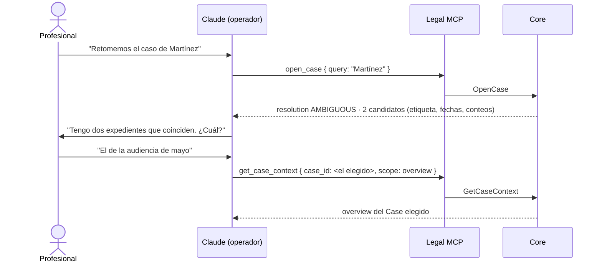

# 05 — Contrato de la superficie MCP V0

**Estado:** propuesta técnica de la fase TECHNICAL DESIGN V0. Normativo para la implementación del `legal-mcp` **una vez aprobado**; hasta entonces, propuesta.
**Precedencia (kernel §14):** ADRs Accepted (001–006) > este documento y el resto del Technical Design V0 (incl. `00-technical-kernel.md`) > `principles.md` > glosario > addenda > spikes.
**Derivado de:** kernel técnico v0.4 §§1, 2, 3, 5, 6, 7, 8, 9, 10, 11; ADR-001 (frontera de confianza), ADR-002 (private state), ADR-003 (modelo epistémico), ADR-004 (estado canónico y proyecciones), ADR-005 (autoridad humana), ADR-006 (frontera de incorporación).
**No repite** lo ya fijado en esos documentos: los cita por sección.

Este documento especifica **la superficie completa que el operador no confiable puede invocar**, y nada más. Lo que no está aquí, no existe para el modelo.

---

## 1. Qué es esta superficie y qué no es

La superficie MCP es el **perímetro de gobernanza del agente** (ADR-001, consecuencias positivas): no es una API de conveniencia ni un cliente de base de datos. Tres consecuencias de diseño que gobiernan todo lo que sigue:

1. **El invocador es hostil por defecto.** El contrato se diseña para un cliente que puede ignorar instrucciones, reintentar, reordenar, inventar identificadores y enviar parámetros inconsistentes (ADR-001, Contexto). Ninguna garantía de este documento depende de la cooperación del modelo.
2. **No exponer es la forma más fuerte de prohibir.** Una operación ausente de la superficie no necesita condición de rechazo: el Core nunca la ve (addendum v0.3 B.6; §8 y §9 de este documento).
3. **La clase de cada tool es parte del contrato, no documentación** (ADR-001 inv. 3). Determina qué exige la operación (autorización humana, control de revisión) y qué test adversarial la acompaña.

**Fuera de esta superficie, por diseño:** el canal de autorización humana (`ReviewProposal`, ADR-005 §4 — segundo driving adapter) y el plano administrativo del runtime/CLI (ADR-002 inv. 2). Ninguno de los dos es alcanzable por el modelo.

---

## 2. Reglas duras de la superficie

Las seis reglas son invariantes de la superficie: cualquier tool futura las hereda sin renegociación.

**R1 — Ninguna tool acepta rutas de filesystem ni URLs arbitrarias.** Ni como parámetro declarado ni como valor admisible de un parámetro de texto. No hay parámetro `path`, `uri`, `url`, `file`, `directory` en ningún schema de la superficie (ADR-002 inv. 3, val. 4; ADR-006 val. 6).

**R2 — Toda referencia es un identificador opaco emitido o resuelto por el Core.** `case_id`, `source_id`, `evidence_id`, `derivation_id`, `proposal_id`, `proposal_item_id`, `artifact_id`, `fragment_ref`, `inbox_ref`. Un identificador sintácticamente plausible pero no emitido por el Core se rechaza con `UNKNOWN_REFERENCE` (ADR-001 inv. 7; test F18).

> **Formulación precisa que hace estructuralmente imposible el path traversal.** Donde la superficie admite texto libre para *resolver* material (`inbox_query`, §6.3), el Core **no concatena ese texto a ningún directorio, no resuelve `..`, no sigue symlinks ni junctions**: el texto se compara, normalizado, contra la enumeración que el propio Core hace del `Inbox/`. Una entrada que no está en esa enumeración no existe para la superficie. `../../secreto.docx` no es rechazado *además* por una lista negra: simplemente no coincide con ninguna entrada enumerada, y adicionalmente se rechaza por R1.

**R3 — El modelo no recibe ningún secreto de autorización.** No existe token, nonce, firma ni credencial que viaje al contexto del modelo. `commit_reviewed_facts` no admite parámetro alguno que pretenda probar revisión humana; el Core resuelve la autorización contra su propio registro (ADR-005 §3 e inv. 8; kernel §3.3). Superficie de suplantación por el operador: cero.

**R4 — Schemas cerrados.** Todo input declara `additionalProperties: false`. Cualquier propiedad no declarada —`humanReviewed`, `authorization_token`, `force`, `as_user`— se rechaza en el adapter con `VALIDATION_FAILED`, **antes** de llegar a Application. Es la materialización estructural del test adversarial 2 del slice: el parámetro inventado no es "ignorado", es rechazado.

**R5 — El principal no viaja en el input.** Ninguna tool acepta `principal_id`, `actor_type`, `actor_role`, `on_behalf_of` ni equivalente. El Principal se resuelve **server-side** desde la sesión (§3). Un invocador que pudiera declarar quién es podría declarar ser humano.

**R6 — Ninguna respuesta expone el private state ni cruza Cases.** No se devuelven rutas, `snapshot_ref`, nombres de tabla, ni bytes del Source (§6.6). Ninguna respuesta retorna entidades epistémicas de otro Case (ADR-003 inv. 10; adversarial 7). **Única excepción documentada:** los candidatos de `open_case`, que portan metadatos no epistémicos de más de un Case y ningún contenido de expediente (§7).

---

## 3. Principal, provenance y capabilities en la superficie

### 3.1 Resolución del Principal (kernel §1)

El Principal de toda invocación MCP lo resuelve el Core desde la sesión, nunca desde el input (R5). En V0 la sesión MCP es **la del operador**.

**PROPUESTA DEL TECHNICAL DESIGN — requiere aprobación.** Combinaciones que la superficie MCP puede producir, conformes a la tabla del kernel §1.4:

| Operación | `provenance_kind` del evento | `principal_type` registrado | Razón |
|---|---|---|---|
| `create_case` | `SYSTEM` | `SYSTEM` | El canal MCP no autentica a nadie; el Core ejecuta la orden relatada por un operador no confiable |
| `ingest_evidence` | `EXTERNAL_SOURCE` | `SYSTEM` | Kernel §1.2 admite explícitamente "el sistema que la ejecuta en su nombre (`SYSTEM`)". `HUMAN` exigiría autenticación que V0 no tiene |
| `propose_facts` | `AI_INFERENCE` | `AI` | Única combinación admisible para `AI_INFERENCE` (kernel §1.4) |
| `commit_reviewed_facts` | `HUMAN_DECISION` | `HUMAN` | **Copiado de la `HumanAuthorization` / `ProposalItemReview`**, no del invocador (§3.2) |
| Derivación interna | `AI_DERIVATION` | `AI` | `GenerateDerivedRepresentation`, fuera de la superficie |

**Por qué `SYSTEM` y no `HUMAN` en las dos primeras.** Escribir `principal_type = HUMAN` en un evento originado en un canal que no autentica a nadie sería registrar como hecho auditado algo que el sistema no puede saber. El Tool Invocation Log conserva la correlación con la sesión del operador; el origen declarado del material viaja en `declared_origin` (kernel §1.2), no en el principal. **Alternativa considerada y descartada:** atribuir `HUMAN` por configuración de sesión — barato hoy, y una mentira permanente en el log el día que haya dos usuarias.

### 3.2 El desdoblamiento obligatorio del commit

`commit_reviewed_facts` es invocado por el operador, pero la entrada `ALLEGED` de `status_history` y el evento `FactsCommitted` portan `provenance_kind = HUMAN_DECISION` y **el `principal_*` de la profesional que revisó**, tomado del registro de autorización (kernel §3, §3.4).

> **Sin este desdoblamiento, `commit_reviewed_facts` produciría un `HUMAN_DECISION` con principal no humano**, violando el invariante del kernel §1.4 (`HUMAN_DECISION` exige `principal_type = HUMAN`). El invocador queda registrado en el Tool Invocation Log; el autor del acto epistémico, en el Case Event Log. Son dos preguntas distintas y se responden en dos registros distintos.

### 3.3 Capabilities

**PROPUESTA DEL TECHNICAL DESIGN — requiere aprobación.** Seis capabilities nombradas; el perfil del principal las porta y el Core las resuelve server-side. Condicionan **qué tools se exponen** (boundaries §7, plano 3) y se revalidan en el gate de Application (defensa en profundidad).

| Capability | Tools |
|---|---|
| `case:create` | `create_case` |
| `case:read` | `open_case`, `get_case_context` |
| `evidence:ingest` | `ingest_evidence` |
| `evidence:read` | `search_case`, `get_evidence_fragment` |
| `facts:propose` | `propose_facts` |
| `facts:commit` | `commit_reviewed_facts` |

Tres precisiones:

- **Una capability no es una autorización.** `facts:commit` habilita *invocar* el commit; **no** autoriza el acto. La autoridad humana es un registro independiente y server-side (ADR-005). Confundirlas reintroduciría el token portador ya descartado.
- **No hay capability que abra la clase `ADMIN`** (§9). No es que ningún perfil V0 la porte: es que no existe.
- **Perfil único en V0:** el operador del contexto A (`LITIGANT`) porta las seis. La granularidad existe desde el schema inicial para no migrarla después (mismo criterio que la tripla de actor, ADR-003).

---

## 4. Sobre común de respuesta y formato de errores

### 4.1 Envelope

Toda respuesta de toda tool —éxito o rechazo— viaja en el mismo sobre (ADR-001 inv. 8).

```ts
interface ToolEnvelope<T> {
  ok: boolean;
  tool: ToolName;
  invocation_id: OpaqueId;      // correlación con el Tool Invocation Log (kernel §8.2)
  case_id: CaseId | null;       // null SOLO en respuestas sin Case resuelto — ver §11.1
  case_revision: number | null; // revisión vigente al servir la respuesta; null en el mismo caso
  result: T | null;             // null si ok = false
  error: ToolError | null;      // null si ok = true
  conditions: Condition[];      // catálogo v0 (kernel §10); [] si no hay ninguna activa
}
```

- `case_revision` es **la revisión vigente al servir**, no la que el modelo tenía. Es el único punto de referencia legítimo para el siguiente `expected_revision`.
- `conditions[]` está presente siempre, también en éxito: una operación puede tener éxito y dejar el expediente en una situación que la usuaria debe conocer (p. ej. `ANALYSIS_STALE` tras una incorporación).
- `get_case_context` extiende el sobre con los campos que fija el kernel §9 (`scope`, `params`, `completeness`, `omissions[]`, `event_seq`). No es un sobre distinto: es el mismo más lo propio de la proyección.
- **POR VERIFICAR:** cómo se transporta este sobre en la capa de protocolo MCP (contenido estructurado, señalización de error del protocolo). Es detalle del adapter y **no altera el contrato**: la clasificación de un rechazo la fija `error.code`, jamás una señal del transporte.

### 4.2 Códigos de error — lista cerrada V0

**PROPUESTA DEL TECHNICAL DESIGN.** Nueve códigos semánticos estables. La lista es cerrada: añadir uno es cambio de contrato, igual que añadir un evento (ADR-004 inv. 6).

```ts
type ErrorCode =
  | 'VALIDATION_FAILED'           // forma: schema, enum, propiedad no declarada, param faltante
  | 'UNKNOWN_REFERENCE'           // id no emitido por el Core, ruta, URL, referencia no resoluble
  | 'CROSS_CASE_REFERENCE'        // la referencia existe, pero pertenece a otro Case
  | 'NOT_INCORPORATED'            // referencia probatoria a material no incorporado (ADR-006)
  | 'PROVENANCE_REQUIRED'         // hecho propuesto sin referencia ni marca "solo alegado"
  | 'HUMAN_AUTHORIZATION_MISSING' // sin autorización viva / consumida / expirada / hash distinto
  | 'REVISION_MISMATCH'           // expected_revision ≠ vigente
  | 'POLICY_DENIED'               // capacidad existente vetada por política o perfil
  | 'INTERNAL_ERROR';             // fallo no atribuible al invocador; sin detalle técnico

interface ToolError {
  code: ErrorCode;
  message_key: string;            // clave de plantilla por locale — NUNCA prosa técnica
  details: Record<string, string | number>; // solo valores del vocabulario del contrato
}
```

**Reglas duras del formato de error:**

- **Nunca un stack trace, nunca un mensaje de excepción, nunca una ruta, nunca un nombre de tabla ni de columna, nunca un id interno no emitido a la superficie.** El diagnóstico se recupera por `invocation_id` contra el Tool Invocation Log, que vive del lado del Core.
- `message_key` es una clave, no un texto. La redacción humana es del pipeline de presentación (kernel §10: *internal condition → presentation category → human message*).
- **Un rechazo jamás deja estado parcial.** Toda operación de mutación es transaccional: o produce todos sus eventos o ninguno (kernel §7, columna "Transacción").
- **Los códigos no son una taxonomía de causas técnicas sino de *qué puede hacer el invocador a continuación*.** Por eso hay nueve y no cuarenta.

### 4.3 Correspondencia error ↔ condición del catálogo

Un error es para el **modelo**; una condición es para la **usuaria** (kernel §10). No son lo mismo y no siempre coexisten.

| `error.code` | Condición emitida | Categoría de presentación |
|---|---|---|
| `HUMAN_AUTHORIZATION_MISSING` | `HUMAN_REVIEW_REQUIRED {proposal_id, item_ids[], pending_item_count}` | `NEEDS_YOUR_DECISION` |
| `REVISION_MISMATCH` | `REVISION_CHANGED {expected, current, preserved_proposal_id}` | `SOMETHING_CHANGED` |
| `POLICY_DENIED` | `OPERATION_NOT_PERMITTED {operation, policy_reason}` | `CANNOT_DO_THAT` |
| `NOT_INCORPORATED` | **ninguna del catálogo v0** — DECISIÓN PENDIENTE heredada de ADR-006 | (mensaje de producto) |
| `VALIDATION_FAILED`, `UNKNOWN_REFERENCE`, `CROSS_CASE_REFERENCE`, `PROVENANCE_REQUIRED`, `INTERNAL_ERROR` | ninguna | (mensaje de producto) |

Y a la inversa: `SEARCH_INCONCLUSIVE`, `UNCERTAIN_FRAGMENT`, `ANALYSIS_STALE` e `INTEGRATION_ERROR` viajan en `conditions[]` de respuestas **exitosas**. Que una tool responda `ok: true` no significa que no haya nada que decirle a la profesional.

**Payload normativo de `HUMAN_REVIEW_REQUIRED`: los tres campos.** `{proposal_id, item_ids[], pending_item_count}`, sin excepción y en **todo** sitio de emisión (`11` §3.5; INV-UX-13). La razón no es de forma: el único mensaje aprobado literalmente por los dueños —el de la ocasión `proposed`— consume `pending_item_count` y nada más, de modo que un sobre que llegara solo con `{proposal_id}` dejaría la plantilla sin dato, e `INV-UX-04` prohíbe sustituirlo por identificadores. `proposal_id` e `item_ids[]` son para el **modelo** (su siguiente llamada); `pending_item_count` es para la **profesional**. **Corrección aplicada** sobre este documento, que emitía `{proposal_id}`.

**Y lo que la tabla no dice, dicho aquí:** una fila con condición «ninguna» **no** significa que a la profesional no le llegue nada. Significa que lo que le llega es un **mensaje de producto** —con clave, categoría de presentación, techo de certeza y test propios— del catálogo cerrado de `11` §6.6: `NOT_INCORPORATED` y `PROVENANCE_REQUIRED` → `prod.not_incorporated`; `UNKNOWN_REFERENCE` → `prod.reference.unresolved`; `CROSS_CASE_REFERENCE` → `prod.reference.other_case`; `VALIDATION_FAILED` e `INTERNAL_ERROR` → `prod.request.malformed`. La diferencia con una condición se mantiene intacta: el mensaje de producto **no se adhiere al estado** y no viaja en `conditions[]`; por eso la lista es cerrada y su redacción está escrita de antemano, en vez de quedar a cargo del modelo.

### 4.4 Lo que el Tool Invocation Log registra

Toda invocación, incluidas las QUERY: `tool`, principal/sesión, **hash de inputs**, resultado y condiciones, duración, y correlación con `event_id` cuando hubo mutación (kernel §8.2). Consecuencia deliberada: **los inputs no se almacenan en claro** —una `query` de `search_case` puede contener datos del cliente—, a costa de que el diagnóstico postmortem trabaje con hashes. **POR VERIFICAR:** si el hash de inputs basta para diagnosticar los fallos reales, o si algunas tools requieren retención de inputs bajo política explícita.

---

## 5. Clases de operación

| Clase | Semántica | Exige `expected_revision` | Exige HumanAuthorization | Muta estado canónico | Tools V0 |
|---|---|---|---|---|---|
| `QUERY` | Lectura pura del estado canónico o de sus proyecciones | no | no | no | `open_case`, `get_case_context`, `search_case`, `get_evidence_fragment` |
| `COMMAND` | Mutación que la orden conversacional de la usuaria basta para ordenar; protegida por idempotencia y control de revisión | opcional (§12) | no | sí | `create_case`, `ingest_evidence` |
| `PROPOSAL` | Registra trabajo propuesto; **proponer no es mutar el estado curado** (ADR-001 inv. 9) | opcional | no | sí (registra la Proposal y su Artifact) | `propose_facts` |
| `SENSITIVE_COMMAND` | Consolida estado epistémico; exige autoridad humana server-side | **obligatorio** | **sí** | sí | `commit_reviewed_facts` |
| `ADMIN` | — | — | — | — | **vacía por diseño** (§9) |

**Nota sobre `ToolAnnotations` de MCP.** HECHO VERIFICADO (kernel §1; fuente: spec MCP vigente 2026-07-28): las `ToolAnnotations` son *hints* explícitamente **no confiables** y la spec no define RBAC. Se declaran por coherencia de cara al host (`readOnlyHint` en las QUERY, `destructiveHint: false` en todas — ninguna tool destruye), y **jamás se usan como enforcement**. El enforcement es la clase, aplicada en Application.

---

## 6. Las ocho tools

Orden: las cuatro QUERY, las dos COMMAND, la PROPOSAL, la SENSITIVE_COMMAND. Cada una especifica los doce campos del contrato.

Tipos comunes usados abajo:

```ts
type OpaqueId = string;            // formato opaco, emitido por el Core (kernel §11: UUIDv7 propuesto)
type CaseId = OpaqueId;
type FragmentRef = OpaqueId;       // handle de recuperación, NO identidad de entidad (§6.5)
type Sha256 = string;              // identidad de contenido; nunca identidad de entidad (kernel §11)
```

---

### 6.1 `open_case`

**name** `open_case` · **class** `QUERY` · **required capability** `case:read`

**purpose.** Resolver una referencia en lenguaje natural a un `case_id` emitido por el Core y devolver la orientación mínima para retomar el trabajo. **Ante ambigüedad devuelve candidatos y nunca adivina** (ADR-001 inv. 7; §7 de este documento).

**input**

```ts
interface OpenCaseInput {
  query: string;        // referencia natural de la usuaria: "el caso de Martínez"
  limit?: number;       // máximo de candidatos; política del producto (PROPUESTA: 5)
}
```

**output**

```ts
type OpenCaseResult =
  | { resolution: 'RESOLVED';  case: ResolvedCase }
  | { resolution: 'AMBIGUOUS'; candidates: CaseCandidate[] }
  | { resolution: 'NOT_FOUND'; candidates: [] };

interface ResolvedCase {
  case_id: CaseId;
  case_revision: number;
  display_label: string;
  overview_digest: {                 // orientación mínima, no la proyección completa
    evidence_count: number;
    facts_alleged_count: number;
    pending_items_count: number;     // proposals PENDING + derivaciones PENDING/FAILED + artifacts stale
    last_activity_at: string;
  };
}

interface CaseCandidate {            // metadatos NO epistémicos — ver R6 y §7
  case_id: CaseId;
  display_label: string;
  created_at: string;
  last_activity_at: string;
  evidence_count: number;
}
```

**preconditions.** Principal con `case:read`. `query` no vacía tras normalización. Ninguna otra: `open_case` no exige que exista Case alguno.

**postconditions.** Ninguna sobre el estado canónico. `RESOLVED` **no** abre sesión, no toma lock, no marca nada: es una resolución de nombre, y el `case_id` devuelto es el único artefacto que produce.

**idempotency.** Lectura pura, repetible. Determinista respecto del estado y de la política de resolución vigentes; no lo es a través de cambios de esa política.

**errors / conditions.** `VALIDATION_FAILED` (query vacía, `limit` fuera de rango). **`NOT_FOUND` y `AMBIGUOUS` no son errores**: son resultados normales con `ok: true`. Ninguna condición del catálogo.

**side effects.** Una entrada en el Tool Invocation Log.

**revision behavior.** No acepta `expected_revision`; no avanza `case_revision`. En `RESOLVED` el sobre porta `case_id` y `case_revision`; en `AMBIGUOUS` y `NOT_FOUND` ambos son `null` (**ver el conflicto documentado en §11.1**).

---

### 6.2 `get_case_context`

**name** `get_case_context` · **class** `QUERY` · **required capability** `case:read`

**purpose.** Servir la memoria operativa del modelo como **proyección tipada por alcance**, regenerable y determinista, jamás objetivo de escritura (ADR-004 (a); kernel §9). Es el mecanismo por el que una sesión nueva reconstruye orientación sin memoria conversacional.

**input**

```ts
interface GetCaseContextInput {
  case_id: CaseId;
  scope: 'overview' | 'facts' | 'evidence' | 'pending' | 'changes_since';
  params?: {
    since_revision?: number;                 // OBLIGATORIO si scope = 'changes_since'
    // Enum canónico COMPLETO del estatus ALMACENADO del Fact (ADR-003; `02` §5.1).
    // Se exponen los cuatro valores: truncar el enum en el contrato haría inexpresable
    // un filtro legítimo y obligaría a cambiar el contrato al aparecer el productor.
    status_filter?: ('PROPOSED' | 'ALLEGED' | 'DETERMINED' | 'WITHDRAWN')[];  // solo scope 'facts'
    //   PROPOSED    — sintácticamente válido; devuelve lista vacía con completeness COMPLETE
    //                 bajo la materialización diferida (`02` §5.2; `08` §5.2)
    //   ALLEGED     — el único con productor en V0 (`commit_reviewed_facts`)
    //   DETERMINED  — sin productor en V0 (`RecordProfessionalDetermination` es POST-V0)
    //   WITHDRAWN   — sin productor en V0 (mismo patrón que el evento `FactWithdrawn`)
    derived_filter?: ('SUPPORTED' | 'CONTRADICTED' | 'UNSUPPORTED')[]; // solo scope 'facts'
  };
}
```

`procedural` está **RESERVADO** (ADR-004): no pertenece al enum, y solicitarlo produce `VALIDATION_FAILED`. Un scope reservado que se acepta en silencio deja de ser reservado.

**output.** El `CaseContextResponse` del kernel §9, sin desviación:

```ts
interface CaseContextResponse {
  case_id: CaseId;
  case_revision: number;
  event_seq: number;                 // para delta preciso (kernel §9)
  scope: string;
  params: object;
  content: unknown;                  // dependiente del scope
  completeness: 'COMPLETE' | 'PARTIAL';
  omissions: { section: string; reason: 'budget' | 'not_implemented' | 'unavailable' }[];
  conditions: Condition[];
}
```

**preconditions.** Case existente; principal con `case:read`; `since_revision` presente y en `[1, case_revision]` para `changes_since`.

**postconditions.** Ninguna. La proyección se genera **siempre desde la revisión vigente**, sin caché (ADR-004; por eso no existe `generated_from_revision`).

**idempotency.** Lectura pura. **Determinismo exigible:** mismo estado + misma revisión ⇒ salida idéntica byte a byte (golden test, criterio estructural 5 del slice).

**errors / conditions.** `UNKNOWN_REFERENCE` (`case_id` no emitido por el Core), `VALIDATION_FAILED` (scope desconocido o reservado, `since_revision` ausente o fuera de rango), `POLICY_DENIED`. Condiciones típicas en respuesta exitosa: `ANALYSIS_STALE`, `HUMAN_REVIEW_REQUIRED`, `INTEGRATION_ERROR`, `UNCERTAIN_FRAGMENT` (según scope). **Invariante:** `completeness = PARTIAL ⇒ omissions` no vacío (kernel §9). Un contexto parcial nunca puede parecer expediente completo.

**side effects.** Ninguna sobre el estado canónico; una entrada en el Tool Invocation Log.

**revision behavior.** No acepta `expected_revision`; no avanza `case_revision`. `changes_since(r)` es el insumo del delta de sesión y de la reconciliación tras `REVISION_CHANGED`.

---

### 6.3 `search_case`

**name** `search_case` · **class** `QUERY` · **required capability** `evidence:read`

**purpose.** Recuperación **selectiva** dentro de un Case: devolver fragmentos localizables en vez de volcar el expediente al contexto.

**input**

```ts
interface SearchCaseInput {
  case_id: CaseId;
  query: string;
  filters?: { evidence_ids?: OpaqueId[]; media_type?: string };
  limit?: number;                    // presupuesto de política del producto
}
```

**output**

```ts
interface SearchCaseResult {
  hits: SearchHit[] | null;          // null —NO []— cuando se emite SEARCH_INCONCLUSIVE
  exhaustive: boolean;               // false si el presupuesto recortó resultados
}

interface SearchHit {
  fragment_ref: FragmentRef;         // handle emitido por el Core; único modo de citar (§6.5)
  evidence_id: OpaqueId;
  source_id: OpaqueId;
  derivation_id: OpaqueId | null;    // null si el Source es texto y no hubo derivación
  locator_summary: string;           // p. ej. "p. 3" o "00:41:05–00:41:22" — sobre el ORIGINAL
  snippet: string;
  score?: number;
}
```

> **`hits: null` cuando la búsqueda es inconcluyente.** Un array vacío significa "busqué y no hay"; una búsqueda que no pudo completarse **no afirma nada sobre el expediente** (kernel §10; catálogo `SEARCH_INCONCLUSIVE`). Devolver `[]` en ese caso invitaría al modelo —y a la usuaria— a leer un fallo de recuperación como ausencia de prueba, que es exactamente el error de fidelidad que el catálogo v0 previene.

**preconditions.** Case existente; principal con `evidence:read`.

**postconditions.** Ninguna.

**idempotency.** Lectura pura. **Determinismo acotado, dicho con honestidad:** garantizado para un estado y una versión de índice fijos; un índice regenerado puede reordenar resultados. El golden test de determinismo aplica a las proyecciones (§6.2), no al ranking de búsqueda.

**errors / conditions.** `UNKNOWN_REFERENCE`, `CROSS_CASE_REFERENCE` (un `evidence_id` de otro Case en `filters`), `VALIDATION_FAILED`. Condición: `SEARCH_INCONCLUSIVE` (warning, no bloqueante).

**side effects.** Ninguna sobre el estado canónico.

**revision behavior.** No acepta `expected_revision`; no avanza `case_revision`.

**Alcance, como regla dura.** `search_case` busca **únicamente en material incorporado de ese Case** (Sources y sus DerivedRepresentations). No busca en el `Inbox/`, ni en el workspace, ni en la web. No es una herramienta de filesystem con otro nombre.

**POR VERIFICAR (heredado, boundaries §6).** HECHO VERIFICADO (kernel §1; fuente: sqlite.org): FTS5 no trae stemming español de serie. La calidad de recuperación en español condiciona la **calibración** del disparador de `SEARCH_INCONCLUSIVE`, no su semántica.

---

### 6.4 `get_evidence_fragment`

**name** `get_evidence_fragment` · **class** `QUERY` · **required capability** `evidence:read`

**purpose.** Entregar el contenido exacto de un fragmento y **la cadena completa de provenance hasta el original**, para que toda cita del modelo sea verificable (propiedad 6 del maestro §34).

**input**

```ts
interface GetEvidenceFragmentInput {
  case_id: CaseId;
  fragment_ref: FragmentRef;
  expand?: { before: number; after: number };  // ampliación acotada por presupuesto de política
}
```

**output**

```ts
interface EvidenceFragmentResult {
  fragment_ref: FragmentRef;                   // re-emitido: puede diferir si hubo expansión
  content: string;                             // texto del derivado, o del Source si es texto

  // ancla — forma VIGENTE del `EvidenceFragment` (07 §3.1; 02 §2.5; ADR-011 Proposed).
  // SUPERSEDE `{ source_version_hash, selector }` (addendum v0.3 B.17, nivel 5 < nivel 2, kernel §14)
  locator: {
    v: 1;                                      // LocatorSchemaVersion — versión del CONTRATO de ancla
    source_id: OpaqueId;                       // OBLIGATORIO SIEMPRE (ADR-006 inv. 5)
    anchored_in: 'SOURCE' | 'DERIVED_REPRESENTATION';
    derivation_id?: OpaqueId;                  // presente sii anchored_in = 'DERIVED_REPRESENTATION'
    representation_hash: Sha256;               // hash de la representación EXACTA leída
    selectors: object[];                       // >= 1, ORDENADO (refinamiento, 07 §3.7)
                                               // coordenada de RECUPERACIÓN, sobre representation_hash
    original_locator: object;                  // coordenada de CITA — SIEMPRE sobre el ORIGINAL
  };
  provenance_chain: {
    evidence: { evidence_id: OpaqueId; incorporated_at: string };
    derivation: { derivation_id: OpaqueId; version: number; content_hash: Sha256;
                  recipe: { tool: string; version: string }; state: 'READY' } | null;
    source: { source_id: OpaqueId; content_hash: Sha256; media_type: string; byte_size: number;
              declared_origin: object; incorporated_at: string };
  };
}
```

**preconditions.** `fragment_ref` emitido por el Core, vigente y perteneciente a este Case; la DerivedRepresentation a la que refiere está `READY`.

**postconditions.** Ninguna.

**idempotency.** Lectura pura; estable mientras no se regenere la versión del derivado al que ancla.

**errors / conditions.** `UNKNOWN_REFERENCE` (handle inventado o invalidado por regeneración del derivado), `CROSS_CASE_REFERENCE`, `VALIDATION_FAILED` (expansión fuera de presupuesto). Condición: `UNCERTAIN_FRAGMENT {ranges}` cuando el fragmento cae en tramos bajo umbral de confianza — informativa, no bloqueante, y su mensaje recuerda que **la fuente sigue siendo el original**.

**side effects.** Ninguna sobre el estado canónico.

**revision behavior.** No acepta `expected_revision`; no avanza `case_revision`.

**Dos reglas duras propias:**

- **Los offsets y timestamps de CITA refieren siempre a la línea de tiempo del ORIGINAL**, nunca a la del derivado (slice F5; ADR-003 inv. 7). En la forma vigente esa coordenada es `original_locator`, y es la única que se cita; `selectors[]` vive en el plano de `representation_hash` y es coordenada de **recuperación**, no de cita. Corolario normativo (INV-L-04, `07` §3.3): con `anchored_in = 'DERIVED_REPRESENTATION'` **ningún** selector puede ser `TIME_RANGE` ni `PAGE_RANGE` — medirían la línea de tiempo del derivado, que es lo prohibido. Si el proveedor de transcripción no entrega esa semántica, cambia el diseño del locator, no el invariante (**POR VERIFICAR** heredado: proveedor y capacidades de timestamps).
- **La superficie no devuelve los bytes del Source** (PROPUESTA DEL TECHNICAL DESIGN). Devuelve texto del derivado, locator y hashes. Razón: el slice no lo necesita, y un canal de descarga de originales hacia el contexto del modelo sería superficie de exfiltración y de coste sin capacidad nueva. Escuchar el audio original es un camino de producto (`Exports/`), no del operador. Un `export_*` es POST-V0 (§10).
- **Integridad ≠ autenticidad.** Los hashes prueban que el material no ha cambiado *desde la incorporación*; no prueban su autenticidad (ADR-002, riesgos). La redacción de producto debe preservar la distinción.

---

### 6.5 Nota transversal: `fragment_ref` es un handle, no una entidad

`EvidenceFragment` **no es entidad del vocabulario canónico** (addendum v0.3 B.17): es un **value object** sin id, sin estado y sin historia, embebido como atributo del `EvidenceLink` (`02` §1.1 y §2.5; `04` §2.2 y §3.3). Por eso `fragment_ref` es un **handle de recuperación opaco emitido por el Core**, no una identidad de entidad, y no se persiste como tal.

> **Forma del ancla — VIGENTE en todo el corpus.** El addendum v0.3 B.17 la escribía como `fragment { source_version_hash, selector }`. Esa forma queda **superseded**: la vigente es la consolidada de `07` §3.1 (`{ v, source_id, anchored_in, derivation_id?, representation_hash, selectors[], original_locator }`), materializada en `04` §3.3 y devuelta por §6.4. Precedencia: el addendum es nivel 5 y el Technical Design nivel 2 (kernel §14), de modo que **no hay conflicto con ningún ADR Accepted**; al contrario, es la única forma que hace **verificable** ADR-003 inv. 7 —separa la coordenada de cita (`original_locator`, sobre el original) de la de recuperación (`selectors[]`, sobre `representation_hash`)— y ADR-006 inv. 5 (`source_id` obligatorio siempre). El razonamiento completo está en `07` §3 y en `ADR-011` (**Proposed**: la forma se adopta por precedencia documental, no por un ADR Accepted; su ratificación sigue pendiente, §10).
>
> Dos diferencias no son cosméticas: `selectors` es **plural y ordenado** (`>= 1`), porque `07` §3.3 exige el par `TEXT_POSITION` **+** `TEXT_QUOTE` para texto plano y la forma antigua, con un solo selector, no podía expresarlo; y `representation_hash` nombra la representación **exacta** leída —Source o derivación— en vez de un `source_version_hash` que sugería una tabla de versiones del original que **no existe y no puede existir** (`04` §2.1; ADR-003 inv. 8).

**PROPUESTA DEL TECHNICAL DESIGN — requiere aprobación.** El handle es **opaco**: no expone selector ni offsets. Consecuencia buscada: **el modelo solo puede citar fragmentos que el Core le devolvió**. No puede fabricar un selector plausible sobre un documento que no recuperó, ni desplazar un ancla "un poco". Coste asumido: para citar un tramo más estrecho hay que pedirlo (`expand` / nueva búsqueda) y obtener un handle nuevo — una llamada más a cambio de que la fabricación de anclas sea estructuralmente imposible.

Vigencia: un handle se invalida si se regenera la versión del derivado a la que ancla; el re-anclaje es explícito y auditado, nunca silencioso (slice, *Derived state*).

**Compatibilidad con `Statement` (kernel: no se materializa en V0).** El handle nombra `(evidence, versión de derivado, selector)`. Cuando exista `ExtractStatements` (post-slice), un `Statement` podrá **portar** un locator equivalente sin que ninguna firma de esta superficie cambie: nada en el contrato asume que el fragmento carezca de entidad que lo cite.

---

### 6.6 `create_case`

**name** `create_case` · **class** `COMMAND` · **required capability** `case:create`

**purpose.** Crear el expediente y emitir su identidad opaca. Es la única puerta de entrada de un Case al sistema.

**input**

```ts
interface CreateCaseInput {
  label: string;                 // etiqueta natural con la que la usuaria nombra el asunto
  aliases?: string[];            // alimentan natural_labels[] para open_case
  context: 'A';                  // v0: único valor
  role: 'LITIGANT';              // v0: único valor
  expected_revision?: never;     // no aplica: el Case no existe todavía
}
```

**output**

```ts
interface CreateCaseResult {
  case_id: CaseId;
  created: boolean;              // false ⇒ se devolvió un Case preexistente por idempotencia
  display_label: string;
  natural_labels: string[];
  context: 'A';
  role: 'LITIGANT';
}
```

**preconditions.** Principal con `case:create`; `label` no vacía tras normalización.

**postconditions.** Existe un Case con `current_revision = 1`; evento `CaseCreated` (kernel §7). El `case_id` es opaco, emitido por el Core, no derivado del label ni del contenido (kernel §11).

**idempotency.** **PROPUESTA DEL TECHNICAL DESIGN — requiere aprobación.** Clave derivada **por el Core**, nunca por el modelo (ADR-001 inv. 5):

```text
idempotency_key = SHA-256( principal_id ‖ normalize(label ‖ aliases) ‖ ventana )
ventana: política del producto — PROPUESTA 10 minutos
```

Una repetición dentro de la ventana devuelve el **mismo** `case_id` con `created: false` y **sin evento nuevo**. Fuera de la ventana, dos casos con el mismo label son dos casos distintos: el sistema no decide por la usuaria que un nombre repetido sea un error.
Rechazado explícitamente: clave de idempotencia suministrada por el cliente — el modelo inventaría claves y la protección sería decorativa.
Obligación de fidelidad: con `created: false`, la respuesta conversacional debe decir que se reutilizó un expediente existente; presentarlo como creación nueva sería elevar un hecho.

**errors / conditions.** `VALIDATION_FAILED`, `POLICY_DENIED`. Ninguna condición del catálogo.

**side effects.** Creación del case store del Case en el private state (ADR-002); una entrada en el Tool Invocation Log.

**revision behavior.** No acepta `expected_revision` (no hay revisión previa que declarar). Avanza `case_revision` de 0 a 1.

---

### 6.7 `ingest_evidence`

**name** `ingest_evidence` · **class** `COMMAND` · **required capability** `evidence:ingest`

**purpose.** **Única operación formal de incorporación** (ADR-006): copia bytes al private state, calcula SHA-256, registra provenance de incorporación, crea `Source` + `Evidence` y dispara la derivación. Es la puerta por la que el material se vuelve fundable.

**input**

```ts
interface IngestEvidenceInput {
  case_id: CaseId;
  // exactamente uno de los dos — nunca una ruta ni una URL (R1)
  inbox_ref?: OpaqueId;          // handle emitido por el Core en una resolución previa
  inbox_query?: string;          // descripción natural; el Core la compara contra SU enumeración
  declared_origin: {
    kind: 'INBOX_LOCAL';         // v0: único valor. Conectores: POST-V0, ADR-006
    description?: string;        // de quién/dónde dice la usuaria que procede el material
    received_at?: string;
  };
  expected_revision?: number;    // opcional (§12)
}
```

**output**

```ts
type IngestEvidenceResult =
  | { resolution: 'AMBIGUOUS'; candidates: { inbox_ref: OpaqueId; display_name: string;
      byte_size: number; modified_at: string }[] }          // sin mutación alguna
  | { resolution: 'INGESTED';
      source_id: OpaqueId; evidence_id: OpaqueId;
      content_hash: Sha256; byte_size: number; media_type: string;
      deduplicated: boolean;                                 // true ⇒ los bytes ya existían
      derivation: { derivation_id: OpaqueId; state: 'PENDING' } | null };
```

**PROPUESTA DEL TECHNICAL DESIGN — requiere aprobación: la resolución del Inbox vive dentro de `ingest_evidence`.** La superficie de 8 tools no incluye ninguna tool de listado del Inbox, y el modelo no puede aportar rutas (R1): sin resolución interna, `inbox_ref` sería un identificador que nadie puede obtener. Por eso `ingest_evidence` admite una descripción natural y, **cuando no resuelve a una sola entrada, devuelve candidatos sin mutar nada** — el mismo patrón de no-adivinación de `open_case` (§7). Alternativas consideradas: (a) exponer el Inbox como recurso MCP —**POR VERIFICAR** el soporte del host y ajeno al contrato del Core—; (b) añadir una novena tool `list_inbox` —gasta presupuesto de superficie para una capacidad que es consecuencia de la incorporación, contra la regla de exposición §8—.

**preconditions.** Case existente; principal con `evidence:ingest`; exactamente uno de `inbox_ref`/`inbox_query` presente; el handle o la descripción resuelven a **una** entrada enumerada por el Core; `expected_revision`, si viaja, coincide con la vigente.

**postconditions.** Snapshot de bytes en el private state, `content_hash` SHA-256 registrado, `Source` + `Evidence` creados con ProvenanceRecord (`provenance_kind = EXTERNAL_SOURCE`, §3.1), `DerivedRepresentation` en `PENDING`, evento `EvidenceIncorporated`. **El archivo de `Inbox/` deja de ser la fuente desde ese instante** (ADR-002 inv. 4). Si la incorporación invalida insumos de un Artifact registrado, el mismo mutador propaga staleness y emite `ArtifactMarkedStale` **dentro de la misma transacción** (kernel §7): una invocación, dos mutaciones, dos eventos, `case_revision + 2`.

**idempotency.** Por **hash de contenido**, derivado por el Core (ADR-001 inv. 5; ADR-006 inv. 7). Tres casos, distintos entre sí:

| Caso | Resultado |
|---|---|
| Mismos bytes, mismo `declared_origin` | No-op: mismo `source_id`/`evidence_id`, `deduplicated: true`, **sin evento**, revisión sin cambio, respuesta idéntica |
| Mismos bytes, `declared_origin` distinto | Se registra la **procedencia adicional**; no se crea Source nuevo. Es una mutación canónica ⇒ emite `EvidenceIncorporated` con payload `{ source_id, deduplicated: true, additional_declared_origin }` y avanza la revisión (**PROPUESTA**: preserva la biyección mutación↔evento de ADR-004 inv. 5 sin abrir la lista cerrada de eventos) |
| Bytes distintos | Source nuevo |

**errors / conditions.** `UNKNOWN_REFERENCE` (handle inventado, ruta, URL, entrada inexistente), `CROSS_CASE_REFERENCE`, `REVISION_MISMATCH`, `VALIDATION_FAILED`, `POLICY_DENIED`. Condición típica en respuesta exitosa: `ANALYSIS_STALE {reasons: ['NEW_EVIDENCE'], artifact_id}` cuando la incorporación dejó obsoleto un análisis. `INTEGRATION_ERROR` **no** viaja aquí: la derivación es asíncrona y su fallo se observa por `get_case_context(pending)`.

**side effects.** Copia de bytes al private state; agendamiento de `GenerateDerivedRepresentation` (interno, sin motor de jobs en V0: el estado vive en la propia DerivedRepresentation).

**revision behavior.** `expected_revision` **opcional** (§12). Avanza `case_revision` en 1, o en 2 si hubo propagación de staleness.

---

### 6.8 `propose_facts`

**name** `propose_facts` · **class** `PROPOSAL` · **required capability** `facts:propose`

**purpose.** Canalizar la salida del skill `fact-builder` como **propuesta revisable**, con identidad y hash por item. Es el techo epistémico del operador: nada de lo que entra aquí es estado curado del Case (ADR-003, regla dura).

**input**

```ts
interface ProposeFactsInput {
  case_id: CaseId;
  methodology: { skill: string; methodology_version: string };
  model_id: string;
  expected_revision?: number;              // opcional; si falta, el Core usa la vigente
  items: ProposedFactItem[];
}

interface ProposedFactItem {
  fact_text: string;                        // enunciado del hecho candidato
  // exactamente una de las dos bases — no existe tercera vía (ADR-006 inv. 2)
  evidence_basis?: {
    fragment_ref: FragmentRef;              // handle emitido por el Core (§6.5)
    polarity: 'SUPPORTS' | 'CONTRADICTS' | 'CONTEXTUALIZES';  // enum cerrado v0
    justification: string;
  }[];
  alleged_only?: { basis_note: string };    // marca explícita "solo alegado" + por qué
}
```

Nombres deliberados: `fact_text`, no `statement` ni `assertion` — ambos son **nombres reservados** del modelo de dominio (ADR-003) y no deben reaparecer disfrazados de campo.

**output**

```ts
interface ProposeFactsResult {
  proposal_id: OpaqueId;
  base_case_revision: number;
  items: { proposal_item_id: OpaqueId;      // identidad estable y opaca, NUNCA índice posicional
           item_content_hash: Sha256;
           review_decision: 'PENDING';
           commit_state: 'UNCOMMITTED' }[];
  artifact: { artifact_id: OpaqueId; type: 'FactAnalysis'; status: 'REGISTERED' };
  review_channel_hint: 'HUMAN_CHANNEL';     // informativo: la revisión NO pasa por esta superficie
}
```

**preconditions.** Case existente; principal con `facts:propose`; **cada item trae `evidence_basis` o `alleged_only`, nunca ambos ni ninguno**; todo `fragment_ref` resuelve a Evidence **incorporada de este Case**; `polarity` dentro del enum cerrado.

**postconditions.** `Proposal` en `PENDING` con `content_hash`; items con `proposal_item_id` e `item_content_hash` (kernel §2.1); Facts con primera entrada `PROPOSED` en `status_history` **dentro del alcance de la Proposal** —no estado curado del Case (ADR-003)—; **Artifact `FactAnalysis` registrado internamente** con `inputs[]` por `entity_id + content_hash`, incluida la DerivedRepresentation exacta consumida (§8). Eventos: `FactsProposed` + `ArtifactRegistered` — una invocación, dos mutaciones, dos eventos, `case_revision + 2` (kernel §7).

**idempotency.** **PROPUESTA DEL TECHNICAL DESIGN — requiere aprobación.** Idempotente por clave derivada por el Core:

```text
proposal_idempotency_key = SHA-256( case_id ‖ base_case_revision ‖ proposal_content_hash ‖ principal_id )
```

Repetición exacta dentro de una ventana corta (PROPUESTA: 10 minutos) ⇒ misma `proposal_id`, sin eventos nuevos. Razón: el reintento tras un fallo aparente es conducta esperada del operador (ADR-001, Contexto) y sin esta clave produciría propuestas duplicadas que la profesional tendría que revisar dos veces — fatiga de revisión fabricada por el sistema. Contenido distinto ⇒ Proposal nueva; la anterior sigue `PENDING` y visible en `get_case_context(pending)`. El estado `SUPERSEDED` de la Proposal existe en el enum pero **no tiene productor en V0** (POST-V0).

**errors / conditions.** `PROVENANCE_REQUIRED` (item sin base ni marca), `NOT_INCORPORATED` (referencia a material no incorporado — ADR-006 inv. 1), `UNKNOWN_REFERENCE` (handle inválido), `CROSS_CASE_REFERENCE`, `VALIDATION_FAILED` (polaridad fuera del enum, ambas bases presentes, propiedad no declarada), `REVISION_MISMATCH` (solo si se envió `expected_revision`), `POLICY_DENIED`. Ninguna condición del catálogo en el camino feliz.

**side effects.** Ninguna fuera del Case; **no** dispara la revisión humana: el modelo no puede convocar a la profesional por esta superficie.

**revision behavior.** `expected_revision` opcional; si viaja y no coincide ⇒ `REVISION_MISMATCH` sin mutación. Avanza `case_revision` en 2 (los dos eventos mutan el estado epistémico canónico). **La revisión resultante *es* la que la autorización congelará** en `expected_case_revision`: bajo el Modelo B —**vigente por la enmienda AC-02 aprobada** (kernel §5.2)— `ProposalReviewed` avanza `event_seq` y lleva `case_revision` **nula**, de modo que el acto de revisión no mueve el reloj epistémico y la propuesta se genera, se revisa y se commitea contra **la misma** revisión (§12).

---

### 6.9 `commit_reviewed_facts`

**name** `commit_reviewed_facts` · **class** `SENSITIVE_COMMAND` · **required capability** `facts:commit`

**purpose.** Consolidar en el expediente los items **ya revisados y aprobados por la profesional**: `PROPOSED → ALLEGED` con EvidenceLinks activos. Es la única `SENSITIVE_COMMAND` de V0.

**input**

```ts
interface CommitReviewedFactsInput {
  case_id: CaseId;
  proposal_id: OpaqueId;
  item_ids?: OpaqueId[];         // subconjunto explícito; ausente = todos los items aprobados
  expected_revision: number;     // OBLIGATORIO
  // NO EXISTE ningún otro campo. En particular: ni token, ni firma, ni humanReviewed,
  // ni actor. El schema es cerrado (R4) y el Core no aceptaría esa prueba aunque llegara.
}
```

**output**

```ts
interface CommitReviewedFactsResult {
  committed: { proposal_item_id: OpaqueId; fact_id: OpaqueId; status: 'ALLEGED';
               links_activated: OpaqueId[] }[];
  authorizations_consumed: number;
  proposal_status_derived: ProposalDerivedStatus;   // rótulo agregado DERIVADO; vocabulario
                                                    // único (`PENDING | PARTIALLY_COMMITTED |
                                                    // RESOLVED | PRESERVED_FOR_RECONCILIATION`),
                                                    // orden de evaluación y predicados: 06 §2.7.
                                                    // `APPROVED` NO es rótulo del agregado:
                                                    // es `review_decision` por item.
  already_committed: boolean;    // true ⇒ replay reconocido; cero eventos nuevos
}
```

**preconditions.** Verificadas **por el Core contra su propio registro**, por cada item solicitado (kernel §2.3):

1. `review_decision = APPROVED` y `commit_state = UNCOMMITTED`;
2. existe `HumanAuthorization` con `consumed_at IS NULL`;
3. `authorization.item_content_hash == item.item_content_hash`;
4. `authorization.expected_case_revision == case.current_revision`;
5. `authorization.authorized_operation == COMMIT_FACT`;
6. no expirada;
7. `expected_revision == case.current_revision`.

**El commit es atómico** (PROPUESTA DEL TECHNICAL DESIGN; ADR-005 inv. 6, **reformulado por la enmienda AC-01 a «jamás un commit NO AUTORIZADO»**, la admite pero ya no la implica: la atomicidad es decisión de este documento): si un solo item solicitado falla cualquiera de las siete, **no se commitea ninguno**. Nunca commit parcial, degradado ni silencioso; los items ofensores viajan en `error.details`. El mecanismo de autorización es por item (kernel §3.2) para que la invalidación sea quirúrgica; la **operación** sigue siendo todo-o-nada.

**postconditions.** Entrada nueva `ALLEGED` en `status_history` de cada Fact —jamás sobrescritura—, con `provenance_kind = HUMAN_DECISION` y el principal humano **copiado de la autorización** (§3.2); EvidenceLinks `ACTIVE`; autorizaciones con `consumed_at` marcado; evento **`FactsCommitted`** (uno solo, con payload completo: kernel §7 fija una transacción y un evento para este use case) y `case_revision + 1`.

**idempotency.** No repetible por construcción —la autorización es de un solo uso—, pero **replay-safe**: si todos los items solicitados ya están `commit_state = COMMITTED` en esa misma Proposal, el Core devuelve el resultado original con `already_committed: true`, **sin eventos nuevos**. Cualquier otro intento de reuso de una autorización consumida ⇒ `HUMAN_AUTHORIZATION_MISSING`.

> Sin esta distinción, un reintento tras una respuesta perdida diría a la profesional "estos hechos aún no están en el expediente" cuando **sí lo están**: un fallo de fidelidad epistémica producido por el propio contrato. La distinción no requiere campo nuevo: `commit_state` por item ya existe (kernel §2.1).

**errors / conditions.**

| Situación | `error.code` | Condición | Efecto sobre el estado |
|---|---|---|---|
| Sin autorización viva / consumida / expirada / `item_content_hash` distinto | `HUMAN_AUTHORIZATION_MISSING` | `HUMAN_REVIEW_REQUIRED {proposal_id, item_ids[], pending_item_count}` | cero mutaciones; el item con hash cambiado vuelve a `review_decision = PENDING` (kernel §2.3) |
| `expected_revision` ≠ vigente | `REVISION_MISMATCH` | `REVISION_CHANGED {expected, current, preserved_proposal_id}` | commit rechazado con **cero mutaciones**: la Proposal, sus items y sus autorizaciones quedan intactos y visibles en `get_case_context(pending)` (ADR-004 (c)). El rótulo derivado `PRESERVED_FOR_RECONCILIATION` (`06` §2.7) y el evento `ProposalPreservedForReconciliation` quedan **en la lista cerrada y sin productor en v0** — **RESUELTO por la enmienda AC-04 aprobada**, ver §11.2 |
| `proposal_id`/`item_ids` no emitidos por el Core | `UNKNOWN_REFERENCE` | — | cero mutaciones |
| Proposal de otro Case | `CROSS_CASE_REFERENCE` | — | cero mutaciones |
| Parámetro inventado (`humanReviewed`, token) | `VALIDATION_FAILED` | — | rechazo en el adapter; el Core no llega a verlo |
| Política o perfil vetan la operación | `POLICY_DENIED` | `OPERATION_NOT_PERMITTED` | cero mutaciones (sin disparador ejercitado en V0) |

**side effects.** Consumo de autorizaciones (irreversible). Ninguno fuera del Case. **No** dispara revisión ni notifica a la profesional por esta superficie.

**revision behavior.** `expected_revision` **obligatorio**. Avanza `case_revision` en 1. La aritmética completa del ciclo propuesta→revisión→commit, ya bajo el **Modelo B** de la enmienda **AC-02 aprobada** (kernel §5.2), en §12.

---

## 7. Patrón de desambiguación: el Core devuelve candidatos, el modelo pregunta

**Regla.** Ante una referencia que no resuelve a exactamente un objeto, el Core **devuelve candidatos y no elige**. La pregunta la formula el modelo; la respuesta la da la usuaria. Aplica a `open_case` (§6.1) y a la resolución de `inbox_query` en `ingest_evidence` (§6.7).

**Criterio de resolución (PROPUESTA, política del producto).** `RESOLVED` si y solo si **un** candidato supera el umbral de aceptación **y** su margen sobre el segundo supera un mínimo configurado. En cualquier otro caso, `AMBIGUOUS`. Los valores concretos son **DECISIÓN PENDIENTE** (calibración con casos reales); la regla no depende de ellos: *ante duda, candidatos*.

**Qué pueden contener los candidatos.** Solo metadatos no epistémicos: etiqueta, fechas, conteos (§6.1). **Nunca** hechos, fragmentos, nombres de partes extraídos del material ni contenido de expediente. Así, incluso si el modelo eligiera por su cuenta, no habría filtrado contenido de un Case ajeno — la excepción a R6 se paga en metadatos, no en conocimiento.



**Ejemplo concreto.**

```text
Usuaria:  "Retomemos el caso de Martínez."

open_case { query: "Martínez" }
→ ok: true, case_id: null, case_revision: null
  result: {
    resolution: "AMBIGUOUS",
    candidates: [
      { case_id: "c_7f3…", display_label: "Martínez Ruiz — laboral",
        created_at: "2026-02-11", last_activity_at: "2026-05-19", evidence_count: 7 },
      { case_id: "c_a91…", display_label: "Martínez Gómez — arrendamiento",
        created_at: "2026-04-02", last_activity_at: "2026-04-08", evidence_count: 2 }
    ]
  }

Modelo:   "Tengo dos expedientes que coinciden con 'Martínez':
           Martínez Ruiz (laboral, actividad más reciente el 19 de mayo, 7 documentos)
           y Martínez Gómez (arrendamiento, 2 documentos). ¿Con cuál trabajamos?"

Usuaria:  "El laboral."

get_case_context { case_id: "c_7f3…", scope: "overview" }
```

Lo que el Core garantiza y lo que no, dicho sin adornos:

- **Garantiza** que nunca eligió: no existe respuesta en la que un `case_id` haya sido seleccionado por proximidad.
- **No garantiza** que el modelo pregunte. Es un cliente no confiable y puede elegir el primer candidato en silencio. **RIESGO residual declarado.** Mitigaciones estructurales, no de prompt: (i) los candidatos no llevan contenido de expediente; (ii) la primera respuesta sobre el Case elegido porta `case_id` y etiqueta, y toda mutación queda con esa etiqueta en el Case Event Log; (iii) el acto de revisión humana ocurre en un canal que muestra el expediente concreto (ADR-005), de modo que un Case equivocado se hace visible **antes** de cualquier consolidación epistémica; (iv) la secuencia `AMBIGUOUS` → elección queda correlacionada en el Tool Invocation Log.

---

## 8. Operaciones retiradas de la superficie

### 8.1 La regla de exposición

> **REX — Una operación se expone como tool si y solo si el modelo debe decidir *cuándo* ocurre.** Si su ocurrencia es **consecuencia necesaria** de otra operación ya expuesta, es **interna**: la ejecuta el Core dentro de la transacción que la causa.

Corolarios operativos:

- **REX-1.** Si la respuesta honesta a "¿cuándo debe invocarse?" es "siempre después de X", la operación pertenece a X.
- **REX-2.** Exponer una consecuencia necesaria **no añade capacidad y añade dos modos de fallo**: olvidarla (estado incompleto que nadie detecta) y desalinearla (registrar algo que no corresponde a lo ocurrido).
- **REX-3.** No es una regla de conveniencia ni de tamaño de API: reduce el número de **estados observables inconsistentes**, no el número de líneas de código.
- **REX-4 (límite).** REX no explica las operaciones que el modelo **no debe decidir en absoluto** —revisión humana, administración—. Esas quedan fuera por **autoridad** (ADR-005, ADR-002), no por consecuencia. Son dos criterios distintos y no deben fundirse.

### 8.2 `register_artifact` — RETIRADO de la superficie

**Hecho.** El único artifact del slice (`FactAnalysis`) es consecuencia directa de `propose_facts`: no existe camino en el que el modelo deba decidir registrarlo en un momento distinto (kernel §6).

**Aplicación de REX.** "¿Cuándo se registra el `FactAnalysis`?" — siempre, al producir la propuesta. Luego pertenece a `ProposeFacts` (REX-1).

**Los dos fallos que su exposición abría** (REX-2):

| Fallo | Consecuencia |
|---|---|
| El modelo **olvida** registrar | Existe una propuesta sin artifact: la detección de trabajo ya realizado (propiedad 9 del maestro §34) y la propagación de staleness quedan ciegas, y nada lo señala |
| El modelo registra un artifact **que no corresponde** a ningún análisis real | `inputs[]` con hashes válidos pero un `FactAnalysis` que nadie produjo: provenance formalmente correcta y materialmente falsa |

Ninguno de los dos es exótico: son exactamente las conductas que ADR-001 asume del invocador.

**Qué cambia y qué no.**

- El Core registra el Artifact **dentro de la transacción de `ProposeFacts`**, con `inputs[]` por `entity_id + content_hash` —incluida la DerivedRepresentation exacta consumida—, `methodology_version`, `model_id`, `case_revision` y `knowledge_pack_versions[]` (vacío en V0). Emite `ArtifactRegistered` (kernel §7).
- **El invariante de ADR-006 inv. 3 no se debilita**: `inputs[]` sigue validándose contra el Case Store y sigue rechazando toda referencia externa. Lo que cambia es **dónde se aplica** —el registro interno en lugar de la tool—, no **qué se exige**. La literalidad de ADR-006 inv. 3 y de su test de validación 3 nombra `register_artifact`: ver el conflicto documentado en §11.1.
- El modelo conserva visibilidad: `propose_facts` devuelve `artifact_id`, y `get_case_context(pending)` expone artifacts stale. Retirar la tool no le quita información; le quita una decisión que no le corresponde.

### 8.3 `verify_legal_source` — FUERA del slice

**Decisión de los dueños**, registrada como supersede de la superficie de 10 tools de v0.1.1 (kernel §6; boundaries §2.1). No es una aplicación de REX: es **alcance**. El slice es de custodia y epistemología —caso, evidencia, hechos, memoria, provenance, autoridad humana—, **no de investigación jurídica**.

Consecuencia deliberada y verificable: la única respuesta posible del sistema a *"marca esta sentencia como verificada"* es que **la operación no existe**. No hay estado "verificada" que alcanzar, ni camino que rechazar, ni condición del catálogo que emitir (addendum v0.3 B.6): lo que recibe la usuaria es **mensaje de producto** —`prod.capability.absent.verify_legal_source`, con clave, techo de certeza y test propios en `11` §6.6, no prosa improvisada por el modelo— y lo que verifica el test de superficie es la **ausencia de la tool en el manifiesto**. Esto materializa el Product Floor PF-004 (kernel §12) por no-exposición, que es la forma más fuerte disponible en V0.

---

## 9. Por qué `ADMIN` permanece vacía por diseño

`ADMIN` existe como clase y cuenta **cero elementos**. Es decisión, no omisión (ADR-001 inv. 3; ADR-002 inv. 2).

**Qué caería en `ADMIN` si existiera, y dónde vive en su lugar:**

| Operación administrativa | Dónde vive en V0 |
|---|---|
| Migraciones de schema (numeradas, solo-adelante) | Runtime/CLI del producto, con backup verificado previo (kernel §13) |
| Instalación y actualización de Knowledge Packs | Runtime/CLI, ciclo de configuración (boundaries §8, §10) |
| Reparación / reconstrucción de índices | Runtime/CLI |
| Poda del Tool Invocation Log | Runtime/CLI, política de retención (DECISIÓN PENDIENTE, ADR-004) |
| Backup y restauración | Runtime/CLI |
| Re-verificación de integridad (manifest, hash-chain, re-hash de Sources) | Arranque del runtime y CLI |

**Las tres razones, en orden de peso:**

1. **Asimetría de daño.** Toda operación de esa lista puede destruir o reescribir historia. Concederla a un invocador no determinista es exactamente lo que ADR-001 prohíbe, y ninguna validación posterior repara una migración ejecutada en el momento equivocado.
2. **No hay caso de uso conversacional.** No existe orden natural de la profesional que sólo pueda satisfacerse con una tool administrativa. Si algún día existe, entra por REX y por el ADR de amendment, no por conveniencia.
3. **Canario verificable.** Una clase vacía es una aserción comprobable: `count(ADMIN) == 0` (test de superficie del slice). Una clase inexistente no se puede verificar; una clase con un elemento "inofensivo" ya movió la frontera. **La cuenta cero es la señal de que nadie la movió sin decirlo.**

**Compromiso explícito.** Añadir la primera tool `ADMIN` exige **amendment de ADR-010 y de ADR-001**, con nombre, clase, autoridad exigida y test adversarial propio. Nunca por PR de conveniencia, nunca "temporalmente para depurar". Un plano administrativo auditado y separado es DECISIÓN PENDIENTE post-slice (ADR-002); su ausencia hoy no autoriza atajos por esta superficie.

---

## 10. Criterios de admisión de tools futuras y presupuesto de superficie

**Presupuesto V0: 8 tools.** **Techo propuesto para V1: 12.** Superarlo no es imposible: **obliga a una revisión de la superficie como tal**, no a un ADR por tool. La erosión incremental —"una tool más por conveniencia"— es el riesgo declarado en ADR-001, y un presupuesto explícito es su única defensa barata.

**Checklist de admisión.** Una tool candidata entra solo si responde las ocho, por escrito, en un ADR de amendment:

1. **REX.** ¿El modelo debe decidir *cuándo* ocurre? Si es consecuencia necesaria de otra operación ⇒ interna (§8.1).
2. **Autoridad.** ¿La decide el modelo, la profesional o el administrador? Si no es el modelo ⇒ canal humano o runtime/CLI, no MCP (REX-4).
3. **Clase.** `QUERY | COMMAND | PROPOSAL | SENSITIVE_COMMAND | ADMIN`, declarada y justificada. Si es `SENSITIVE_COMMAND`, qué valor entra en `authorized_operation` (hoy solo `COMMIT_FACT`, kernel §3.1).
4. **Invariante nuevo.** ¿Qué invariante debe proteger Application que hoy no protege? Si ninguno, sospechar: probablemente sea una lectura ya cubierta por `get_case_context`.
5. **Product Floor.** ¿Qué política del Product Floor toca (kernel §12) y por qué no la relaja?
6. **Referencias.** ¿Todas sus entradas son ids opacos del Core? Si necesita una ruta o una URL, no entra (R1, R2).
7. **Test adversarial.** ¿Cuál es su test negativo propio, y qué condición o código emite? Sin test adversarial no hay admisión.
8. **Presupuesto.** ¿Qué se retira a cambio, o por qué el presupuesto debe crecer?

**Cola de candidatas conocidas (POST-V0), con su clase esperada** — registradas para no improvisar nombres después:

| Candidata | Canal esperado | Clase | Nota |
|---|---|---|---|
| `verify_legal_source` | MCP | `COMMAND` o `PROPOSAL` — a decidir | Fuera del slice por alcance (§8.3); PF-004 gobierna su diseño |
| `RecordProfessionalDetermination` | **canal humano** | SENSITIVE | Nombre reservado (ADR-003); no es tool MCP |
| `WithdrawFact` | **canal humano** | SENSITIVE | Nombre reservado (ADR-003/004); no es tool MCP |
| `ExtractStatements` | **interno** | — | Materializa `Statement`; por REX es consecuencia de la derivación, no decisión del modelo |
| `list_inbox` | MCP | QUERY | Solo si se rechaza la resolución interna de `ingest_evidence` (§6.7) |
| `export_*` | MCP o runtime | COMMAND | Portabilidad y salidas a `Exports/`; gate de política de export (boundaries §3) |

---

## 11. Conflictos detectados

### 11.1 RESUELTO — enmienda AC-03 aprobada · ADR-001 inv. 3 y val. 7 (cuenta de tools); ADR-006 inv. 3 y val. 3 (nombre de la tool validadora)

> **Desenlace.** Los dueños **aprobaron la enmienda AC-03**: la superficie MCP de V0 es de **OCHO tools** y `register_artifact` queda **retirado**. ADR-001 inv. 3 y val. 7 quedan enmendados (nueve → ocho), y la literalidad de ADR-006 inv. 3 y val. 3 se traslada al registro interno de artifacts dentro de `ProposeFacts`. **Se aplicó la opción A** de la tabla de abajo. El análisis que sigue se conserva íntegro porque es el registro de por qué se decidió, no un conflicto vivo.

**ADR afectado.** ADR-001 (Accepted), invariante 3 y prueba de validación 7. Secundariamente ADR-006 (Accepted), invariante 3 y prueba de validación 3. **Ambos enmendados por AC-03.**

**Hecho nuevo (que motivó la enmienda).** El kernel técnico v0.4 §6 retira `register_artifact` de la superficie por aplicación de la regla de exposición, dejando **8 tools**.

**Evidencia.**
- ADR-001 inv. 3, literal: *"Nueve tools v0 … cada una con clase"*; val. 7: *"el manifiesto de tools contiene exactamente las 9 tools v0"*.
- ADR-006 inv. 3, literal: *"`register_artifact` valida que cada entrada de `inputs[]` sea una entidad del Case Store…"*; val. 3 invoca la tool por su nombre.
- Kernel v0.4 §6 y §7: `RegisterArtifact` pasa a **interno, dentro de `ProposeFacts`**.
- Precedencia (kernel §14): un documento de nivel 2 **no puede** redefinir una regla fijada en nivel 1. Por eso el desacuerdo **no podía** cerrarse desde este documento y exigía enmienda de nivel 1 — que es exactamente lo que **AC-03** hizo.

**Impacto (tras la enmienda).**
1. La cuenta normativa de la superficie es **8**. El test de superficie del slice (F16, hoy `12` `FT-013` + `SC-04`) exige **ocho** tools; la exigencia de nueve queda **superada**.
2. La literalidad de ADR-006 inv. 3 nombra una tool que ya no existe. **El invariante sustantivo no se ve afectado** —`inputs[]` sigue validándose contra el Case Store y sigue rechazando referencias externas—; lo que caducó es el nombre del punto de aplicación, que ahora es el registro interno dentro de `ProposeFacts`.
3. Documentos de nivel inferior que quedan desalineados y **deben** corregirse en el pase de aplicación de AC-03: `docs/architecture/boundaries.md` §2.1 (tabla de 9 tools) y §3 (lista de use cases externos); `docs/architecture/vertical-slice-v0.md` (Scope, *MCP tools minimally required*, paso 12 del happy path, F9, F16, criterio estructural 1).

**Opciones que se evaluaron.**

| # | Opción | Consecuencia |
|---|---|---|
| A **(recomendada — APROBADA como AC-03)** | Aprobar **ADR-010** como amendment explícito de ADR-001 inv. 3 y val. 7 (nueve → ocho) y de la literalidad de ADR-006 inv. 3 y val. 3 (la validación de `inputs[]` se aplica en el registro interno de artifacts, dentro de `ProposeFacts`) | Superficie mínima coherente con REX; obliga a un pase de corrección en boundaries y vertical-slice; el invariante de ADR-006 se conserva íntegro, cambia su punto de aplicación |
| B | Conservar `register_artifact` expuesta | Respeta la literalidad de ADR-001 y ADR-006 sin tocar nada, a costa de mantener los dos modos de fallo de REX-2 y de contradecir el kernel §6 y §7, que ya declaran `RegisterArtifact` interno |
| C | Retirar `register_artifact` y **no** enmendar los ADRs | **Inaceptable.** Deja un ADR Accepted contradicho de hecho por la implementación: exactamente la deriva silenciosa que la regla de precedencia existe para impedir |

**Este documento describe la opción A**, hoy **aprobada como enmienda AC-03**: la superficie normativa es la de ocho tools.

### 11.2 RESUELTO — enmienda AC-04 aprobada · evento `ProposalPreservedForReconciliation`

**No era conflicto entre Accepted: la pertenencia a la lista se resolvía por precedencia; el productor era lo que quedaba pendiente.** La lista cerrada de eventos v0 del kernel §8.1 **omite** `ProposalPreservedForReconciliation`, que sí figura en la lista cerrada de ADR-004 (b)1 y que el camino negativo de conflicto de revisión del slice exige. Siendo ADR-004 Accepted y el kernel de nivel 2, **el evento permanece en la lista cerrada**. Se señala para que la omisión no se lea como retiro deliberado.

**RESUELTO — enmienda AC-04 aprobada: el evento queda en la lista cerrada SIN PRODUCTOR en v0.** Que el evento pertenezca a la lista no dice quién lo emite. Un commit rechazado produce **cero mutaciones** (ADR-005 inv. 6, reformulado por AC-01 a «jamás un commit NO AUTORIZADO») y ADR-004 inv. 5 exige biyección mutación↔evento —hoy enunciada sobre `event_seq` (AC-02)—: de ahí la formulación que el corpus ya sostenía (`03` §0.5; `04` §10 **C1**; `06` §2.7 y §5.4; `08` §5.4; `09` §8.2) y que los dueños **ratificaron**: el evento **permanece en la lista y queda declarado sin productor en v0**, exactamente el patrón de `FactWithdrawn`. Consecuencia normativa: **la preservación es la conducta por defecto y un estado derivado, no almacenado**; en V0 `commit_reviewed_facts` **no emite** el evento al preservar (§6.9), y el rótulo derivado `PRESERVED_FOR_RECONCILIATION` (vocabulario único en `06` §2.7) queda sin productor. La garantía de ADR-004 (c) se cumple por "cero mutaciones": la propuesta, sus items y sus autorizaciones siguen intactos y visibles en `get_case_context(pending)`. Dotar al evento de productor es trabajo **POST-V0**, no una decisión abierta.

---

## 12. Aritmética de revisiones en la superficie

**Regla de `expected_revision` (PROPUESTA DEL TECHNICAL DESIGN — requiere aprobación).** ADR-004 exige que toda tool COMMAND/SENSITIVE_COMMAND **acepte** `expected_revision`; aceptar se satisface con opcionalidad. Se propone:

| Tool | `expected_revision` | Razón |
|---|---|---|
| `create_case` | no aplica | No hay revisión previa |
| `ingest_evidence` | **opcional** | Incorporar es aditivo y nunca sobrescribe; exigirlo fabricaría conflictos espurios sin valor protector — el riesgo que ADR-004 registra sobre la granularidad de revisión única |
| `propose_facts` | **opcional** | Registra contra qué revisión se generó; el commit vuelve a verificar |
| `commit_reviewed_facts` | **obligatorio** | Es el punto donde contenido revisado y estado deben coincidir (ADR-005 inv. 4, 7) |

Enviado y no coincidente ⇒ `REVISION_MISMATCH` sin mutación, siempre.

**El modelo de reloj vigente, el anterior que superó, y por qué el contrato de la superficie es el mismo en ambos.**

| | **Modelo B — VIGENTE** (kernel §5.2; **enmienda AC-02 aprobada**) | Modelo A — anterior, **superado** por AC-02 (ADR-005 §1, ADR-004 (b)1 antes de la enmienda) |
|---|---|---|
| `ProposalReviewed` | avanza **solo `event_seq`**; `case_revision` **NULL** | avanzaba `case_revision` |
| `expected_case_revision` de la autorización | revisión contra la que **se generó y se revisó** la Proposal (N) | revisión **resultante** del acto de revisión (N+1) — definición circular |
| Lo que el modelo envía en `commit_reviewed_facts` | **la `case_revision` vigente que observó** | **idéntico** |

> **El contrato de la tool fue invariante frente a la enmienda.** El modelo siempre envía la revisión vigente que el Core le devolvió; lo que cambió es el valor que la autorización congela internamente. Por eso la aprobación de **AC-02** **no altera ninguna firma de esta superficie**: lo que cambia es la aritmética del ciclo, no el schema. La columna del Modelo A se conserva por trazabilidad — es el registro de qué se superó —, **no rige**.

**Consecuencia de AC-02 sobre el rechazo por revisión, ya sin condicional en su primera mitad.** Bajo el Modelo A, si `ProposalPreservedForReconciliation` hubiera tenido productor, ese evento habría avanzado `case_revision` como cualquier otro —todo evento la incrementaba—, de modo que una operación **rechazada** habría movido el mismo contador cuyo desajuste la rechazó: no producía bucle, pero desplazaba el punto de referencia justo cuando la profesional necesita reconciliar contra él. **Bajo el Modelo B vigente ese efecto desaparece por construcción**: un evento que no muta el estado epistémico canónico avanza `event_seq` y lleva `case_revision` nula. Fue uno de los argumentos que sostuvieron la enmienda.

**HECHO VERIFICADO (fuente: §11.2 de este documento, `03` §11.6, `06` §5.4, `09` §3.4):** en V0 el evento está **declarado sin productor** —**enmienda AC-04 aprobada**—, de modo que hoy el rechazo por `REVISION_MISMATCH` **no emite ningún evento canónico y no mueve ningún contador**. La preservación de la propuesta es **conducta por defecto y estado derivado**, no un asiento que haya que escribir.

---

## 13. Trazabilidad tool → pruebas

| Tool / regla | Pruebas que la ejercitan (slice: adversariales 1–10, funcionales F1–F18) |
|---|---|
| Superficie completa y clases; `ADMIN == 0` | F16, criterio estructural 1 — **actualizado a 8 tools por la enmienda AC-03 aprobada** (§11.1); hoy `12` `FT-013` + `SC-04` |
| R1/R2 (sin rutas, ids opacos) | **F18**, adversarial 4; ADR-002 val. 4 (incluye `..`, rutas absolutas, symlinks/junctions de Windows) |
| R3 (sin secretos) + `commit_reviewed_facts` | Adversarial 2; ADR-005 val. 1–6 |
| R4 (schemas cerrados) | Adversarial 2 (el parámetro inventado se rechaza en el adapter) |
| R6 (aislamiento entre Cases) | Adversarial 7 |
| `create_case` / `ingest_evidence` idempotencia | Adversarial 5, F2, F17 |
| `propose_facts` (provenance o marca) | F6; ADR-006 val. 2; adversarial 3 (link contra material no incorporado) |
| `commit_reviewed_facts` (autorización, revisión) | Adversarial 2 y 6; F7, F7b, F8 |
| Envelope y `completeness`/`omissions` | F15, criterio estructural 2 |
| Proyecciones deterministas | Criterio estructural 5 |
| Biyección mutación↔evento con 1..n eventos por invocación | F13, criterio estructural 3 (`ingest_evidence` con staleness; `propose_facts` con dos eventos) |
| Product Floor PF-002 / PF-004 por no-exposición | Adversariales 4 y 9; kernel `AT-011` y test de superficie |
| Stub de autorización en configuración de producción | Kernel `AT-013` (arranque aborta) — fuera de esta superficie, condiciona su operación |

**Pruebas nuevas que esta superficie exige y que la matriz del slice aún no contiene (PROPUESTA):**

1. **Replay de commit exitoso** ⇒ `already_committed: true`, cero eventos nuevos, respuesta equivalente (§6.9).
2. **Reuso de autorización consumida por otro commit** ⇒ `HUMAN_AUTHORIZATION_MISSING`, distinguible del caso 1.
3. **Atomicidad del commit**: un item con `item_content_hash` cambiado en un lote de n ⇒ cero items commiteados.
4. **`ingest_evidence` con `inbox_query` ambigua** ⇒ `AMBIGUOUS`, cero mutaciones, cero Sources.
5. **`search_case` degradada** ⇒ `hits: null` + `SEARCH_INCONCLUSIVE`; jamás `hits: []`.
6. **`get_case_context(scope: 'procedural')`** ⇒ `VALIDATION_FAILED` (el scope reservado no se acepta en silencio).
7. **Idempotencia de `propose_facts`** dentro de ventana ⇒ misma `proposal_id`, cero eventos nuevos.

---

## 14. Estado de las decisiones de este documento

**PROPUESTAS DEL TECHNICAL DESIGN que requieren aprobación de los dueños:**

1. Resolución del Principal en la superficie: `SYSTEM` para `create_case`/`ingest_evidence`; desdoblamiento del principal humano en el commit (§3.1, §3.2).
2. Seis capabilities nombradas y su separación estricta de la autorización humana (§3.3).
3. Lista cerrada de nueve códigos de error y su correspondencia con condiciones (§4.2, §4.3).
4. Claves de idempotencia derivadas y sus ventanas: `create_case` (10 min), `propose_facts` (10 min); tres casos de `ingest_evidence`, incluido el registro de procedencia adicional como mutación con evento (§6.6, §6.7, §6.8).
5. Resolución del Inbox **dentro** de `ingest_evidence`, con candidatos y sin mutación (§6.7).
6. `fragment_ref` opaco: el modelo solo puede citar lo que el Core le devolvió (§6.5).
7. La superficie no devuelve bytes del Source (§6.4).
8. `hits: null` —no `[]`— cuando se emite `SEARCH_INCONCLUSIVE` (§6.3).
9. Commit **atómico** con mecanismo de autorización por item, y replay-safety vía `commit_state` (§6.9).
10. `expected_revision` opcional en COMMAND/PROPOSAL y obligatorio en SENSITIVE_COMMAND (§12).
11. Presupuesto de superficie (8 en V0, techo 12 en V1) y checklist de admisión de ocho puntos (§10).
12. **Forma vigente del `EvidenceFragment`** en el `locator` de `get_evidence_fragment` (§6.4, §6.5): `{ v, source_id, anchored_in, derivation_id?, representation_hash, selectors[], original_locator }`, supersede de `{ source_version_hash, selector }` (addendum v0.3 B.17). Es la forma de `07` §3.1, `02` §2.5 y `ADR-011` (**Proposed**). Si se rechaza, `selectors[]` vuelve a ser un selector único y el par obligatorio `TEXT_POSITION` + `TEXT_QUOTE` de `07` §3.3 deja de ser expresable, con lo que ADR-003 inv. 7 pierde verificabilidad.

**POR VERIFICAR:**

- Transporte del sobre y de los errores en la capa de protocolo MCP (§4.1) — detalle de adapter.
- Suficiencia del hash de inputs del Tool Invocation Log para diagnóstico real (§4.4).
- Calidad de recuperación en español y calibración de `SEARCH_INCONCLUSIVE` (§6.3; HECHO VERIFICADO sobre FTS5 en kernel §1).
- Proveedor de transcripción y semántica de timestamps sobre el original (§6.4).
- Soporte de recursos MCP en el host, si se reconsidera la resolución del Inbox (§6.7).

**DECISIONES PENDIENTES heredadas que esta superficie no resuelve:** transporte del canal de autorización humana (ADR-005); condición UX propia para `NOT_INCORPORATED` (ADR-006); umbrales de resolución de `open_case`; presupuestos de tamaño por scope (ADR-004); política de retención del Tool Invocation Log (ADR-004).

**Decisiones antes pendientes que los dueños ya CERRARON, y que este documento aplica:** enmienda **AC-02** (Modelo B de revisiones — kernel §5.2, §12 y §6.8/§6.9 de este documento); enmienda **AC-03** (superficie de **ocho** tools, `register_artifact` retirado — §11.1); enmienda **AC-04** (`ProposalPreservedForReconciliation` en la lista cerrada y sin productor en v0 — §11.2); enmienda **AC-01** (autorización **por item** con `item_content_hash`, agrupadas por `review_session_id`, `authorized_operation = COMMIT_FACT` singular — §6.9 y kernel §3).

**POST-V0, explícitamente fuera de esta superficie:** `verify_legal_source`; `RecordProfessionalDetermination` y `WithdrawFact` (canal humano); `ExtractStatements` (interno); `list_inbox`; `export_*`; reuso idempotente de análisis (`ANALYSIS_REUSED`); estado `SUPERSEDED` de la Proposal; aprobación parcial activada; conectores externos; cualquier tool de clase `ADMIN`.
