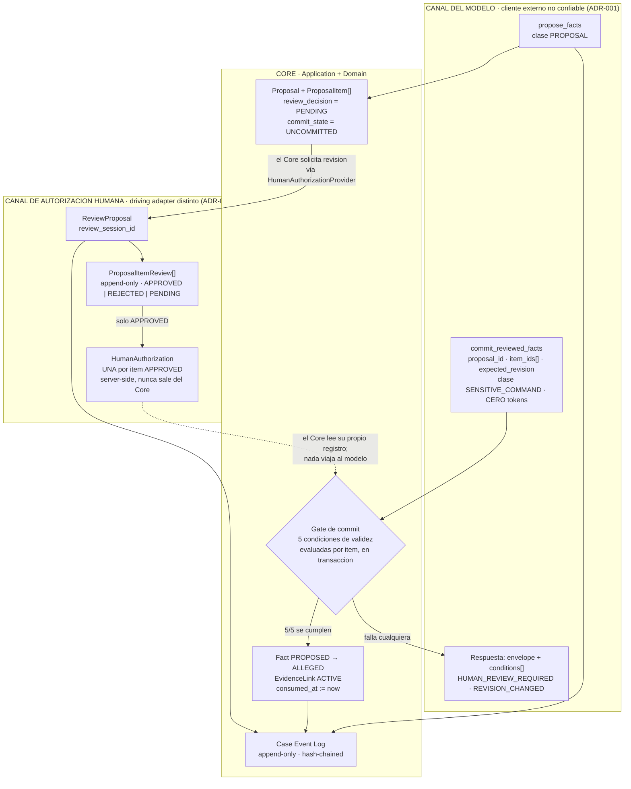
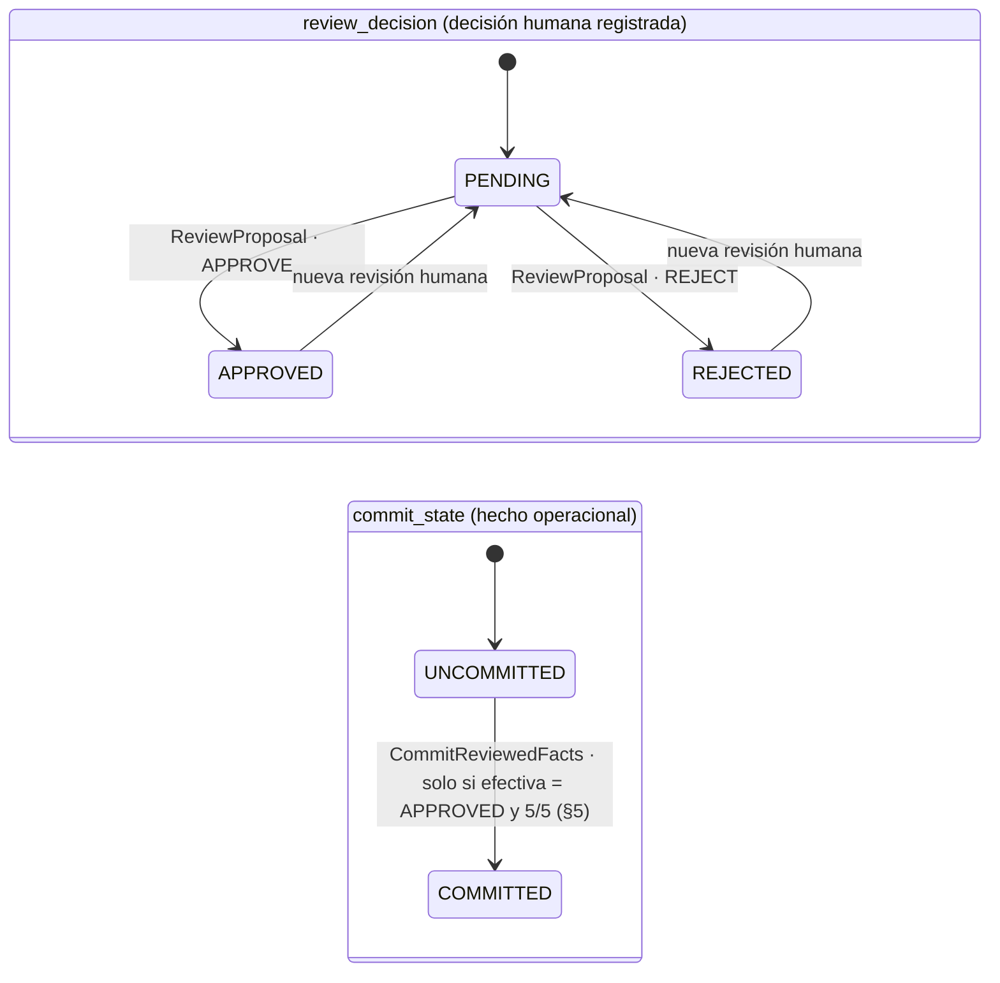
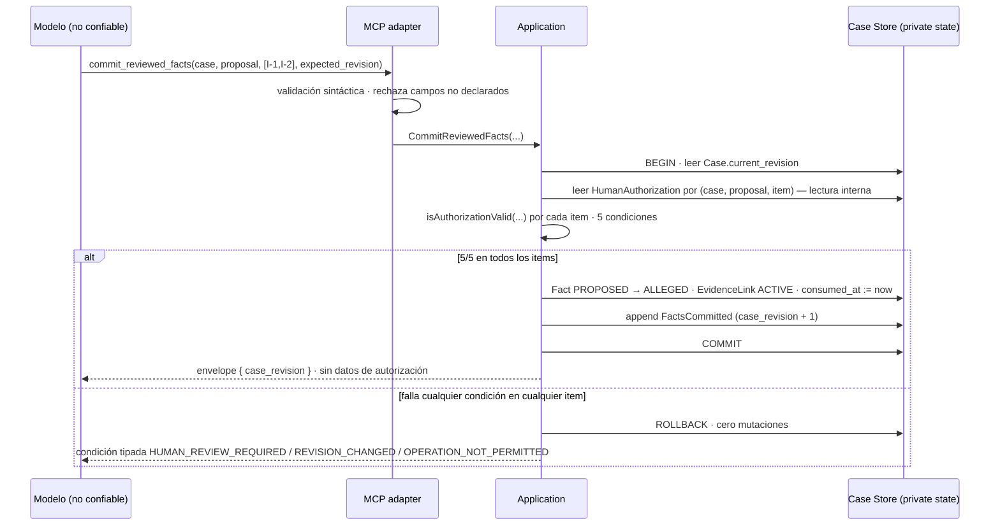

# 06 — Autorización humana: Proposal, revisión, autorización y commit

**Estado:** Technical Design V0 (nivel 2 de precedencia, kernel §14). Materializa el **kernel técnico v0.4 §2, §3 y §4** y hace operativos **ADR-005** (autoridad humana), **ADR-001** (frontera de confianza, inv. 4), **ADR-003** (`PROPOSED → ALLEGED`) y **ADR-004** (`CaseRevision`, Case Event Log).

**Qué NO se decide aquí:** el transporte/UI por el que la profesional revisa (spike abierto, ADR-005 §5 y `boundaries.md` §2.2), la criptografía del registro (descartada en v0, ADR-005 §6) y la mecánica de persistencia (documento de esquema del Technical Design V0). Este documento define el **contrato y la máquina de estados**; el canal es intercambiable por construcción (§7).

**Nota de vocabulario obligatoria (kernel §1).** `Principal` (`principal_id`, `principal_type ∈ HUMAN | AI | SYSTEM`, `principal_role`) responde **quién ejecutó**. `provenance_kind` (`EXTERNAL_SOURCE | AI_DERIVATION | AI_INFERENCE | HUMAN_DECISION | SYSTEM`) responde **cuál es la naturaleza epistémica del origen**. La aprobación de un `ProposalItem` es `provenance_kind = HUMAN_DECISION` **con** `principal_type = HUMAN`. La forma `actor_type = HUMAN_DECISION` que aparece en el texto histórico de ADR-005 (inv. 1) es la errata que el kernel §1.5 normaliza; no se reproduce aquí y el texto histórico no se borra.

---

## 1. El ciclo completo

### 1.1 Cuatro actos, tres registros, dos canales

| Acto | Canal | Use case | Escribe | Evento |
|---|---|---|---|---|
| **Propuesta** | modelo (MCP, clase `PROPOSAL`) | `ProposeFacts` | `Proposal` + `ProposalItem[]` | `FactsProposed` + `ArtifactRegistered` |
| **Revisión** | **humano** (driving adapter distinto) | `ReviewProposal` | `ProposalItemReview[]` (append-only) | `ProposalReviewed` |
| **Autorización** | humano — *dentro del mismo acto de revisión* | `ReviewProposal` | `HumanAuthorization` (una por item `APPROVED`) | (parte de `ProposalReviewed`) |
| **Commit** | modelo (MCP, clase `SENSITIVE_COMMAND`) | `CommitReviewedFacts` | `Fact.status_history += ALLEGED`, `EvidenceLink` `ACTIVE`, `consumed_at` | `FactsCommitted` |

La autorización **no es un cuarto acto separado**: nace dentro del acto de revisión (ADR-005 §4). Se enumera aparte porque produce un registro distinto con reglas de validez propias (§5).



**Lectura obligatoria del diagrama:** la única flecha que cruza del bloque humano al gate es **punteada y de lectura interna del Core**. Ningún dato de autorización entra por `MODELO`. Esa asimetría es la decisión, no un detalle de dibujo (§6).

### 1.2 Aritmética de revisiones — modelo vigente y modelo superado

**RESUELTO — enmienda AC-02 aprobada.** El kernel §5 abrió un `ADR AMENDMENT CANDIDATE` sobre ADR-004/ADR-005 y ordenó describir ambos modelos donde importa. Los dueños **aprobaron** el amendment: **rige el Modelo B**. ADR-004 y ADR-005 quedan enmendados (supersedes §16.16 y §16.19) y el kernel §5.2, §7, §8.1 y §9 ya lo materializan. La columna del Modelo A se conserva **solo por trazabilidad** —es el análisis que justificó la decisión—; **no es aplicable**. `HECHO VERIFICADO` (fuente: kernel técnico v0.4 §5.2, §7 y §8.1).

| | **Modelo B — VIGENTE (enmienda AC-02; kernel §5.2, §7, §8.1, §9)** | Modelo A — **anterior, superado** (ADR-004 (b)1 y ADR-005 §1, texto previo a la enmienda) |
|---|---|---|
| `FactsProposed` | `event_seq +1`, `case_revision = N` | dejaba el Case en `N` |
| `ProposalReviewed` | `event_seq +1`, `case_revision` **NULL** — no muta el estado epistémico canónico, luego no avanza el reloj | **avanzaba** a `N+1` |
| `expected_case_revision` de la autorización | **`N`** — la revisión contra la que se generó y se revisó la Proposal | `N+1` (la resultante del propio acto de revisión: definición circular, motivo de la enmienda) |
| `FactsCommitted` | `event_seq +1`, `case_revision = N+1` | dejaba el Case en `N+2` |

**Regla de aplicación:** manda el **Modelo B**. La biyección mutación↔evento se expresa sobre `event_seq`, con `case_revision` como **subsecuencia** de los eventos canónicos; el hash-chain usa `event_seq` (kernel §8.1). Todo lo demás de este documento era **idéntico bajo ambos modelos**: la condición de validez sigue siendo `authorization.expected_case_revision == case.current_revision`; lo único que cambió es el número congelado. Ningún escenario de §9 cambia de resultado por la enmienda — verificado explícitamente en AT-008.

---

## 2. Proposal y ProposalItem

### 2.1 Estructura

```ts
// Conceptual. NO es código de producción: fija forma y nombres, no implementación.

type UUID      = string;   // UUIDv7 opaco, emitido por el Core (kernel §11) — PROPUESTA sujeta a spike
type Sha256Hex = string;   // identidad de CONTENIDO, jamás identidad de entidad (kernel §11, regla dura)
type Instant   = string;   // timestamp con zona

type PrincipalType  = 'HUMAN' | 'AI' | 'SYSTEM';
type ProvenanceKind = 'EXTERNAL_SOURCE' | 'AI_DERIVATION' | 'AI_INFERENCE' | 'HUMAN_DECISION' | 'SYSTEM';

interface Principal {
  principal_id:   UUID;
  principal_type: PrincipalType;
  principal_role: string;          // v0: 'lawyer'
}

interface Proposal {
  proposal_id:         UUID;
  case_id:             UUID;
  base_case_revision:  number;      // revisión contra la que se generó
  created_by:          Principal;   // en el slice: principal_type 'AI'
  provenance_kind:     ProvenanceKind;  // en el slice: 'AI_INFERENCE'
  methodology_version: string;
  model_id:            string | null;   // no nulo cuando principal_type = 'AI'
  created_at:          Instant;
}

interface ProposalItem {
  proposal_item_id:  UUID;          // identidad estable y opaca — NUNCA índice posicional
  proposal_id:       UUID;
  item_content_hash: Sha256Hex;     // hash del contenido normalizado del item
  payload:           ProposedFactPayload;
  review_decision:   'PENDING' | 'APPROVED' | 'REJECTED';   // ver §2.4 y §2.5
  commit_state:      'UNCOMMITTED' | 'COMMITTED';
}

interface ProposedFactPayload {
  fact_text:       string;
  provenance_kind: 'AI_INFERENCE';
  proposed_links:  ReadonlyArray<ProposedEvidenceLink>;
}

interface ProposedEvidenceLink {
  evidence_id:  UUID;              // Evidence YA incorporada (ADR-006; PF-003)
  fragment_ref: FragmentRef;       // ancla verificable al ORIGINAL (ADR-003 inv. 7)
  polarity:     'SUPPORTS' | 'CONTRADICTS' | 'CONTEXTUALIZES';
  rationale:    string;
  // POST-V0 · compatibilidad hacia adelante: cuando exista `ExtractStatements`,
  // el ancla admitirá `statement_id?: UUID` como campo OPCIONAL adicional.
  // `Statement` NO se materializa en v0 (kernel §15, ADR-003): reservar el hueco
  // como campo opcional evita que añadirlo después rompa `item_content_hash`
  // de propuestas ya emitidas — ver §2.3, regla de normalización.
}
```

### 2.2 Identidad estable: por qué nunca un índice posicional

**Invariante (kernel §2.1):** la identidad de un item no depende de su posición ni de su orden; reordenar la propuesta no cambia ningún `proposal_item_id`.

Qué falla si la identidad fuera posicional (`items[2]`), en orden de gravedad:

1. **La autorización apuntaría a una ranura, no a un contenido.** La profesional aprueba "el hecho 3"; cualquier reordenamiento —de la proyección, de una regeneración, de un `ORDER BY` no determinista— convierte esa aprobación en la aprobación de otro hecho. Es la falsificación más barata imaginable y no requiere mala fe: basta un bug de ordenación.
2. **El modelo pasa a fabricar identidades.** `commit_reviewed_facts(proposal_id, [0,2])` es un identificador que el modelo puede inventar con probabilidad alta de acertar, contra ADR-001 inv. 7 (ids opacos emitidos por el Core).
3. **La auditoría deja de ser reconstruible.** Un `ProposalItemReview` que refiera a la posición 2 no dice qué se revisó salvo que el orden se congele para siempre, que es un invariante mucho más caro que un id.

`proposal_item_id` es UUIDv7 opaco emitido por el Core en la transacción de `ProposeFacts`. El orden de presentación es **política de proyección**, no dato del dominio.

### 2.3 `item_content_hash` — a qué se vincula la aprobación

`item_content_hash = SHA-256(forma_normalizada(payload))`. La normalización es **parte del contrato**, no un detalle: si dos ejecuciones normalizan distinto, la autorización se invalida sola.

Reglas de normalización (**PROPUESTA DEL TECHNICAL DESIGN**, requiere aprobación):

- serialización canónica con claves ordenadas y sin espacios significativos;
- campos ausentes y campos `null` son **el mismo valor** (para que añadir un campo opcional POST-V0 —p. ej. `statement_id`— no altere el hash de propuestas existentes);
- se normaliza el **payload epistémico** (texto del hecho, links propuestos con su ancla, polaridad y justificación); **no** entran `proposal_item_id`, timestamps, ni orden de presentación;
- el orden de `proposed_links` **sí** se normaliza (orden canónico por `evidence_id` + ancla), para que reordenar links no cambie el hash.

**Regla dura heredada (kernel §11):** el hash **nunca** es identificador de entidad y **nunca** se muestra a la usuaria.

**Inmutabilidad del item en v0 — DECISIÓN.** No existe use case que edite un `ProposalItem` una vez creado: `ProposeFacts` crea, `ReviewProposal` decide, `CommitReviewedFacts` commitea. Un cambio de contenido exige una **Proposal nueva**. Consecuencia honesta: en el flujo normal de v0, la condición de validez (2) de §5 **no tiene disparador**; es una **guarda de defensa en profundidad** contra (a) manipulación directa del store por fuera de la superficie (ADR-002 la hace difícil, no imposible; el hash la hace *detectable*) y (b) el futuro use case de edición durante la revisión, que es POST-V0. AT-004 la ejercita sembrando la divergencia a nivel de store; se documenta como tal y **no se presenta como capacidad de producto**.

### 2.4 Las dos dimensiones — crítica del enum propuesto

```
review_decision : PENDING | APPROVED | REJECTED      ← decisión profesional
commit_state    : UNCOMMITTED | COMMITTED            ← hecho operacional
```

Son **ortogonales**: la primera dice qué decidió una persona, la segunda dice si el efecto ya ocurrió. Colapsarlas en un enum obliga, en el estado real "aprobado pero todavía no commiteado", a elegir cuál de los dos hechos se representa y a perder el otro.

| Combinación | ¿Alcanzable? | Significado |
|---|---|---|
| `PENDING` + `UNCOMMITTED` | sí | estado inicial; también el estado efectivo tras invalidación (§2.5) |
| `APPROVED` + `UNCOMMITTED` | sí | aprobado, con autorización viva a la espera del commit |
| `APPROVED` + `COMMITTED` | sí | estado terminal del camino feliz |
| `REJECTED` + `UNCOMMITTED` | sí | estado terminal del rechazo |
| `REJECTED` + `COMMITTED` | **imposible** | invariante: `commit_state` solo avanza para items `APPROVED` |
| `PENDING` + `COMMITTED` | **imposible** | mismo invariante |

**Por qué se eliminó `DEFERRED`.** "Diferido" y "pendiente" tienen el **mismo estado observable**: el item no se commitea y sigue disponible para revisión. Añadir `DEFERRED` obligaría a definir en qué se diferencia operativamente de `PENDING` — y no hay diferencia: mismo gate, mismo efecto sobre el commit, misma visibilidad en `pending`. Un enum cuyos valores no se distinguen por comportamiento es un comentario disfrazado de estado. Si aparece la necesidad de separar "aún no lo he mirado" de "lo miré y lo dejo para después", eso es un **matiz de `PENDING`** (un campo del `ProposalItemReview`, p. ej. la `note`), no un estado nuevo con nuevas transiciones que validar.

**Por qué `INVALIDATED` se eliminó como estado almacenado y pasa a ser derivado.** Un item es inválido cuando `item_content_hash` ya no coincide con el de su autorización, o cuando `expected_case_revision` ya no es la vigente. **Ambas cosas son computables en el momento del commit.** Almacenarlo abre la posibilidad de que el estado almacenado y la realidad diverjan —el item marcado válido cuando ya no lo es, o al revés— que es exactamente el defecto que el modelo epistémico evita al no almacenar `SUPPORTED | CONTRADICTED | UNSUPPORTED` en el `Fact` (ADR-003 inv. 6). Además exigiría un **proceso que invalide**: alguien tendría que recorrer autorizaciones tras cada evento del Case y reescribirlas. Ese proceso es una fuente de bugs (¿y si no corre? ¿y si corre a medias?) para producir un dato que una comparación de dos campos ya da con certeza.

```ts
// Derivado, jamás almacenado (kernel §2.2).
function isInvalidated(item: ProposalItem, auth: HumanAuthorization | null, case_rev: number): boolean {
  if (item.review_decision !== 'APPROVED') return false;   // no hay nada que invalidar
  if (auth === null) return true;
  return auth.item_content_hash !== item.item_content_hash
      || auth.expected_case_revision !== case_rev
      || auth.consumed_at !== null
      || isExpired(auth);
}
```

### 2.5 `review_decision`: última decisión humana + decisión **efectiva**

Kernel §2.2 admite las transiciones `APPROVED → PENDING` y `REJECTED → PENDING` "cuando el contenido cambia", y §2.3 ordena que, si falla la condición (2), "el item vuelve a `review_decision = PENDING`". Materializarlo escribiendo el campo choca con dos reglas: un commit rechazado debe producir **cero mutaciones** (ADR-005 inv. 4 y test 6; inv. 6, reformulado por AC-01, añade "jamás commit NO AUTORIZADO, degradado ni silencioso"), y `ProposalItemReview` es **append-only y humano** (kernel §3.4) — un registro `PENDING` escrito por el sistema tendría `principal_type = SYSTEM`, que ese contrato no admite.

**PROPUESTA DEL TECHNICAL DESIGN (requiere aprobación).** Se distinguen dos lecturas del mismo campo:

- **`ProposalItem.review_decision` almacenado** = materialización de la **última decisión humana** registrada en `ProposalItemReview`. Solo cambia cuando una persona decide. Nunca lo reescribe el sistema.
- **decisión efectiva** = lo que el gate y las proyecciones usan:

```ts
function effectiveReviewDecision(item, last_review, auth, case_rev): 'PENDING' | 'APPROVED' | 'REJECTED' {
  if (item.review_decision !== 'APPROVED') return item.review_decision;
  if (last_review.item_content_hash !== item.item_content_hash) return 'PENDING';  // kernel §2.3 (2)
  if (isInvalidated(item, auth, case_rev))                  return 'PENDING';
  return 'APPROVED';
}
```

Esto cumple la letra del kernel §2.2/§2.3 (el item "vuelve a `PENDING`" para todo observador: gate, `get_case_context(pending)`, UX), preserva "cero mutaciones" en el commit rechazado, mantiene `ProposalItemReview` estrictamente humano y elimina por construcción la clase de bug "aprobado zombi": un item que se muestra `APPROVED` para siempre sin autorización que pueda consumirse.

**Asimetría con `Fact` — deliberada y justificada.** ADR-003 prohíbe el status mutable en entidades **epistémicas**. `Proposal` no es una entidad epistémica: es un **concepto de soporte de Application** (`boundaries.md` §3), no una proposición sobre el mundo jurídico. Por eso admite materialización con log append-only al lado, exactamente como ADR-004 (b)3 admite estado materializado junto al Case Event Log.

### 2.6 Máquina de estados



`commit_state` **no retrocede**: no existe "descommitear". Retirar un hecho ya `ALLEGED` es `WithdrawFact` sobre el `Fact` (use case diferido con nombre reservado, ADR-003/ADR-004), no una transición de la Proposal.

### 2.7 Estado de la Proposal como agregado

**PROPUESTA DEL TECHNICAL DESIGN (requiere aprobación).** La `Proposal` **no almacena estado propio**: su rótulo es derivado de sus items, igual que los estados derivados del `Fact`.

> **VOCABULARIO ÚNICO DEL CORPUS.** Esta tabla es la **única** definición de los rótulos agregados de la `Proposal` en el Technical Design V0. `03` §10.3/§10.7/§11.3, `05` §6.9, `08` §5.4 y `12` §2.3 la **citan**; ningún otro documento define, amplía ni traduce este conjunto. Los rótulos `APPROVED` / `REJECTED` **no** pertenecen a él: son valores de `review_decision` **por item** (§2.4), no del agregado, y usarlos como estado de la Proposal es exactamente la confusión que este apartado elimina. `SUPERSEDED` tampoco pertenece: es POST-V0, sin productor, y no reaparece como campo almacenado (`02` §8.5).

```ts
type ProposalDerivedStatus = 'PENDING' | 'PARTIALLY_COMMITTED' | 'RESOLVED'
                           | 'PRESERVED_FOR_RECONCILIATION';   // DERIVADO, jamás almacenado
```

| Rótulo derivado | Predicado |
|---|---|
| `PRESERVED_FOR_RECONCILIATION` | predicado canónico abajo — **se evalúa primero y excluye a los demás** |
| `PENDING` | ≥1 item con decisión efectiva `PENDING` y ninguno commiteado |
| `PARTIALLY_COMMITTED` | ≥1 item `COMMITTED` y ≥1 item `UNCOMMITTED` |
| `RESOLVED` | ningún item con decisión efectiva `PENDING` y ningún `APPROVED` sin commitear |

**Orden de evaluación (obligatorio, para que el rótulo sea función total y unívoca):** `PRESERVED_FOR_RECONCILIATION` → `PARTIALLY_COMMITTED` → `PENDING` → `RESOLVED`. Sin orden declarado, una Proposal preservada con items pendientes admitiría dos rótulos y dos documentos elegirían distinto.

**Predicado canónico de `PRESERVED_FOR_RECONCILIATION` (único en el corpus).**

> `PRESERVED_FOR_RECONCILIATION` ⇔ existe un evento `ProposalPreservedForReconciliation` para esa `proposal_id` en el Case Event Log y **no** existe un `FactsCommitted` posterior que la consuma.

Es computable desde el log canónico, sin columna nueva ni booleano almacenado, y es la lectura **fiel a ADR-004 (Accepted)**, que enumera ese evento en su lista cerrada (b)1 y describe la preservación como flujo de trabajo. `03` §10.7/§11.6, `05` §11.2, `08` §5.4 y `12` §2.3 citan este predicado; **ninguno lo reformula**. En particular quedan **derogadas** las otras dos formulaciones que circulaban en el corpus: el booleano almacenado `Proposal.preserved_for_reconciliation` y la invalidación por `item_content_hash`. Esta última no define preservación: un item cuyo hash cambió tiene decisión **efectiva** `PENDING` (§2.5) y arrastra la Proposal al rótulo `PENDING`, que es lo correcto — la preservación es la respuesta al conflicto de revisión, no a la edición del contenido.

**RESUELTO — enmienda AC-04 aprobada.** El productor del evento `ProposalPreservedForReconciliation` estuvo en disputa: ADR-004 (b)1 (Accepted) lo incluye en la lista cerrada y el kernel §8.1 lo omite (§5.4 de este documento; `03` §0.5; `04` §10 **C1**; `05` §11.2; `09` §8.2). Los dueños cerraron la disputa: el evento **permanece** en la lista cerrada de ADR-004 y queda **declarado sin productor en v0**, igual que `FactWithdrawn`; la preservación es **conducta por defecto y estado derivado**, no estado almacenado ni evento emitido. Consecuencia que se declara en vez de esconderse: en V0 el rótulo `PRESERVED_FOR_RECONCILIATION` es **computable pero sin productor** — **ninguna Proposal lo exhibe en v0**. La garantía sustantiva de ADR-004 (c) no depende del rótulo: un commit rechazado produce **cero mutaciones**, luego items, decisiones y autorizaciones siguen intactos y visibles en `get_case_context(pending)`; lo que AC-04 zanja es que en v0 no existe además un nombre emitido para ese estado. El predicado se mantiene anclado al evento —la forma fiel al ADR `Accepted`— y **ninguna implementación puede sustituirlo por estado almacenado**. Si alguna vez se le diera productor, este predicado se corrige **aquí y solo aquí**, y los documentos que lo citan heredan la corrección.

Esto conserva **exactamente** la garantía sustantiva de ADR-004 ("la Proposal se preserva, el trabajo nunca se descarta, visible vía `get_case_context(pending)`") y elimina el estado almacenado que podría divergir. Ver el bloque de conflicto en §5.4 sobre el evento `ProposalPreservedForReconciliation`.

---

## 3. `HumanAuthorization` — contrato campo por campo

```ts
type AuthorizedOperation  = 'COMMIT_FACT';        // v0: exactamente un valor
type AuthorizationSource  = 'REAL' | 'DEV_STUB';

interface HumanAuthorization {
  authorization_id:       UUID;
  case_id:                UUID;
  proposal_id:            UUID;
  proposal_item_id:       UUID;          // UNA autorización POR ITEM (§3.3)
  item_content_hash:      Sha256Hex;     // vincula al contenido exacto revisado
  expected_case_revision: number;        // la revisión contra la que se GENERÓ y se REVISÓ la Proposal
                                         //   — la que la profesional tenía a la vista (AC-02, §1.2).
                                         //   NO es "la que dejó ProposalReviewed": ese evento ya no
                                         //   avanza case_revision, con lo que desaparece la circularidad.
  authorized_operation:   AuthorizedOperation;
  principal_id:           UUID;          // principal_type = HUMAN (invariante estructural, §3.2)
  authorization_source:   AuthorizationSource;
  created_at:             Instant;
  expires_at:             Instant;
  consumed_at:            Instant | null; // NULL hasta el commit; una sola vez
}
```

### 3.1 Justificación de cada campo

| Campo | Por qué existe | Qué se rompe sin él |
|---|---|---|
| `authorization_id` | identidad opaca del registro para auditoría y correlación | no hay forma de referirse a una autorización concreta en el log sin usar una clave compuesta frágil |
| `case_id` | aislamiento por Case (ADR-003 inv. 10) | una autorización emitida en el Case A podría resolverse en el Case B — el ataque "mezcla de cases" (adversarial 7) desde dentro |
| `proposal_id` | vincula al acto de propuesta y da el contexto de auditoría | el item quedaría huérfano de la propuesta que lo originó |
| `proposal_item_id` | **la unidad de aprobación es el item** (§3.3) | se vuelve a la aprobación en bloque y a la invalidación no quirúrgica |
| `item_content_hash` | congela **qué** se aprobó | una edición posterior se commitearía amparada en la aprobación de otra cosa: la firma de una revisión sobre un texto que ya no existe (ADR-005 inv. 5) |
| `expected_case_revision` | congela **sobre qué estado** se aprobó | el commit ocurriría sobre un expediente distinto del que la profesional evaluó |
| `authorized_operation` | acota **para qué** sirve (§3.2) | una autorización para commitear un hecho serviría para cualquier operación sensible futura |
| `principal_id` | **quién** autorizó (ADR-005 inv. 1, kernel §1.4) | no hay autoría; el registro deja de ser prueba de nada |
| `authorization_source` | marca indeleble `REAL` / `DEV_STUB` (§8) | un caso de desarrollo sería indistinguible de uno real |
| `created_at` / `expires_at` | ventana de vigencia (§3.2) | autorizaciones vivas indefinidamente |
| `consumed_at` | materializa el invariante de un solo uso | reuso de la misma aprobación en dos commits |

### 3.2 Campos cuestionados y resueltos

**`decision` — ELIMINADO.** Una `HumanAuthorization` **solo se crea al aprobar**. Un objeto llamado "autorización" con `decision = REJECTED` es una contradicción de nombre y una trampa de lectura: cualquier consulta que olvide filtrar por `decision` trataría un rechazo como permiso. El rechazo vive en `ProposalItemReview` (§4), que sí lleva la decisión. Regla derivada: **la existencia del registro ES el permiso**; no hay que interpretarlo.

**`single_use` — NO EXISTE como campo; es invariante.** Todas las autorizaciones de v0 son de un solo uso; un booleano que siempre vale lo mismo no es información, es ruido de esquema que además invita a alguien, algún día, a ponerlo en `false`. El invariante se materializa en `consumed_at`: no nulo ⇒ inutilizable, para siempre, sin excepción configurable.

**`expires_at` — CONSERVADO.** Argumento para eliminarlo: el par (`item_content_hash`, `expected_case_revision`) ya invalida la autorización ante cualquier cambio. **Argumento que gana:** ese par **no cubre el caso en que nada cambia**. Un caso inactivo tres meses conserva una autorización aprobada al inicio, consumible sin que nadie la haya vuelto a mirar. Una autorización viva indefinidamente es superficie latente; el coste de cerrarla es un campo y una comparación.

- Valor por defecto: **24 h — PROPUESTA DEL TECHNICAL DESIGN**, configurable.
- **La política solo endurece.** Puede acortarse; **nunca** relajarse a "sin expiración". Coherente con PF-005 (la configuración solo endurece) y con `boundaries.md` (configuración inválida ⇒ rechazo visible, jamás degradación silenciosa).
- **RIESGO — calibración (heredado de ADR-005).** Demasiado corta: re-revisiones irritantes que alimentan la fatiga. Demasiado larga: crece la ventana de desincronización. **SUPUESTO a validar con la usuaria real.**

**`authorized_operation` — CONSERVADO aunque en v0 tenga un solo valor.** Sin él, una autorización obtenida para commitear un hecho autorizaría cualquier operación sensible que se añada después: `RecordProfessionalDetermination` y `WithdrawFact` ya están **nombrados y diferidos** (ADR-003, ADR-004), y ambos son `SENSITIVE`. Añadir el campo más tarde obligaría a migrar autorizaciones existentes asignándoles una operación **inferida** — es decir, a decidir retroactivamente qué autorizó una persona. El campo cuesta una comparación (condición 4 de §5) y elimina esa clase entera de problema. En v0 el enum tiene **exactamente un valor**; añadir valores es cambio de contrato, no extensión silenciosa.

**`principal_type` — no es columna, es invariante estructural.** El kernel §3 fija `principal_id` y nada más. La tripleta `Principal` completa queda en el evento `ProposalReviewed` (kernel §8.1 lleva `principal_id / principal_type / principal_role`). Solo el canal humano crea autorizaciones, de modo que `principal_type = HUMAN` no puede ser otra cosa; el test lo verifica resolviendo el principal (§10). **DECISIÓN PENDIENTE:** si conviene añadir `review_id` a la autorización para que la trazabilidad autorización↔decisión sea explícita en vez de inferida por join sobre `(proposal_item_id, item_content_hash)`. No lo añado porque el kernel §3 fija la lista de campos y este documento no puede ampliarla por su cuenta.

### 3.3 Una autorización **por item**, agrupadas por `review_session_id`

La aprobación parcial es **por item**. Si la autorización cubriera un conjunto, un cambio en un solo item invalidaría la aprobación de **todos** los demás — penalizando a la profesional por una edición no relacionada. Con una autorización por item, la invalidación es **quirúrgica**.

Para no perder la unidad del acto de revisión —que sí importa para auditoría y para UX— todas las autorizaciones emitidas en la misma sesión comparten `review_session_id`, que vive en `ProposalItemReview` (kernel §3.2).

```
Proposal P-1 · items I-1, I-2, I-3        Sesión de revisión RS-7 (una profesional, un acto)
  I-1  APPROVED  ─────────────────────────►  HumanAuthorization A-1  (item I-1, hash h1, rev N)
  I-2  REJECTED  ─────────────────────────►  (ninguna autorización)
  I-3  PENDING   ─────────────────────────►  (ninguna autorización)
                                             3 ProposalItemReview, todos con review_session_id = RS-7
                                             1 evento ProposalReviewed que enumera las tres decisiones
                                               (avanza event_seq; case_revision NULL — §1.2, AC-02)
```

Consecuencias que conviene enunciar:

- **Granularidad de la fricción.** Aprobar hecho por hecho es más deliberado que aprobar en bloque: mitiga la fatiga de revisión (RIESGO de ADR-005) en vez de agravarla.
- **Un item aprobado hoy y otro mañana** son dos sesiones y dos autorizaciones, cada una con su propia `expected_case_revision`. Si entre ambas el Case avanza, la primera se invalida y la segunda no — que es el resultado correcto.
- **El commit puede ser posterior y selectivo:** `commit_reviewed_facts(proposal_id, [I-1])` no toca `I-2` ni `I-3`.

---

## 4. `ProposalItemReview` — el registro append-only de la decisión

```ts
interface ProposalItemReview {
  review_id:         UUID;
  review_session_id: UUID;          // agrupa el acto de revisión (§3.3)
  proposal_item_id:  UUID;
  item_content_hash: Sha256Hex;     // el contenido EFECTIVAMENTE revisado
  decision:          'APPROVED' | 'REJECTED' | 'PENDING';
  principal_id:      UUID;          // principal_type = HUMAN
  reviewed_at:       Instant;
  note:              string | null; // texto de la profesional
}
```

**Invariantes.**

1. **Append-only.** Ninguna fila se edita ni se borra. Una re-revisión es una **fila nueva**; la anterior se conserva. Reconstruir "qué se decidió y cuándo" no depende de ningún estado materializado.
2. **Solo humanos escriben aquí.** `principal_type = HUMAN` y `provenance_kind = HUMAN_DECISION` en el evento correspondiente. Ningún `principal_type = AI` produce una fila (kernel §1.4, regla dura).
3. **`APPROVED` produce además una `HumanAuthorization`, en la misma transacción.** `REJECTED` y `PENDING` no producen ninguna. No existe camino que cree una autorización sin su fila de revisión.
4. **`item_content_hash` es lo que se mostró**, no lo que hay ahora: es la prueba de qué texto tenía delante la persona. Si divergen (§5, condición 2), la decisión sigue siendo válida *como hecho histórico* y deja de ser válida *como permiso*.
5. `decision = 'PENDING'` es una decisión humana explícita ("lo miré y no decido"), no un valor por defecto: el estado inicial de un item es la **ausencia** de filas.

**Por qué la decisión se registra aunque no autorice nada.** El rechazo es información de primera clase: alimenta la métrica de tasa de rechazo humano —la señal contra la fatiga de revisión propuesta en ADR-005— y evita que "rechazar" quede sin dueño en el modelo de datos. Un sistema que solo registra los síes no puede demostrar que la revisión está ocurriendo.

---

## 5. Integridad de la aprobación parcial: las cinco condiciones

### 5.1 El invariante

Una `HumanAuthorization` es válida para un commit **si y solo si**, en el momento del commit, se cumplen **simultáneamente** (kernel §2.3):

```ts
function isAuthorizationValid(
  auth: HumanAuthorization | null,
  item: ProposalItem,
  current_case_revision: number,
  attempted_operation: AuthorizedOperation,
  now: Instant,
): boolean {
  return auth !== null
    && auth.consumed_at === null                                  // (1) existe y no consumida
    && auth.item_content_hash      === item.item_content_hash        // (2) el contenido no cambió
    && auth.expected_case_revision === current_case_revision         // (3) el estado no cambió
    && auth.authorized_operation  === attempted_operation          // (4) la operación es la autorizada
    && now < auth.expires_at;                                     // (5) no expirada
}
```

**Reglas de evaluación (PROPUESTA DEL TECHNICAL DESIGN donde se indica):**

- La evaluación ocurre **dentro de la transacción del commit**, leyendo el estado en esa transacción. No hay comprobación previa en la que se confíe después: eso sería una ventana TOCTOU exactamente en el punto que este diseño protege.
- **`consumed_at` se marca en la misma transacción** que las mutaciones que autoriza. Si la transacción aborta, la autorización no queda consumida.
- **Atomicidad por llamada — PROPUESTA (requiere aprobación).** `commit_reviewed_facts(proposal_id, item_ids[])` es **todo-o-nada sobre `item_ids[]`**: si alguna condición falla para **cualquier** item de la lista, se rechaza la llamada completa con **cero mutaciones** y la condición nombra los items ofensores. Razones: (a) el estado que la profesional aprobó no es el que se commitearía, y ante un invocador no confiable el comportamiento seguro es fail-closed; (b) mantiene inequívoca la respuesta y la biyección mutación↔evento; (c) la recuperación es trivial —reintentar con el subconjunto válido, que la condición ya enumera—. **Coste asumido:** un item inválido bloquea el lote. Alternativa descartada: commitear los válidos e informar los demás, que produce éxitos parciales que el modelo tiene que interpretar correctamente para relatar bien — precisamente lo que no se le confía (ADR-001, RIESGO de falsa confianza narrativa).
- **Un solo evento por commit.** El commit exitoso de `n` items emite **un** `FactsCommitted` cuyo payload enumera items, `fact_id` resultantes y `authorization_id` consumidas, y avanza la `CaseRevision` **una vez** (aritmética vigente tras la enmienda AC-02: de `N` a `N+1`, §1.2; el Modelo A superado daba `N+2` porque `ProposalReviewed` también avanzaba el reloj). Es la lectura de ADR-004 inv. 5 coherente con ADR-005: la mutación registrada es "el conjunto aprobado pasa a `ALLEGED`".

### 5.2 Qué ocurre cuando falla cada condición

| # | Condición | Causa típica | Condición emitida (kernel §10, familia **Authority**) | Categoría de presentación | Efecto en el estado | Escenario |
|---|---|---|---|---|---|---|
| 1 | existe y no consumida | no hubo revisión; o segunda llamada tras un commit exitoso | `HUMAN_REVIEW_REQUIRED {proposal_id, item_ids[], pending_item_count}` | `NEEDS_YOUR_DECISION` | cero mutaciones; la autorización **no se revive**; `commit_state` intacto | AT-002, AT-003 |
| 2 | `item_content_hash` coincide | el contenido del item difiere del revisado | `HUMAN_REVIEW_REQUIRED {proposal_id, item_ids[], pending_item_count}` | `NEEDS_YOUR_DECISION` | cero mutaciones; la decisión efectiva del item pasa a `PENDING` (§2.5); la autorización queda **inutilizable para ese contenido**; el `ProposalItemReview` histórico se conserva | AT-004 |
| 3 | `expected_case_revision` coincide | el Case avanzó entre revisión y commit | `REVISION_CHANGED {expected, current, preserved_proposal_id}` | `SOMETHING_CHANGED` | cero mutaciones; **la propuesta se preserva** —conducta por defecto— y es visible en `get_case_context(pending)`; el rótulo derivado `PRESERVED_FOR_RECONCILIATION` queda **sin productor en v0** (enmienda AC-04, §2.7/§5.4); se exige nueva revisión | AT-008 |
| 4 | `authorized_operation` corresponde | autorización de otra operación sensible | `OPERATION_NOT_PERMITTED {operation}` | `CANNOT_DO_THAT` | cero mutaciones | — (sin disparador en v0, §5.3) |
| 5 | no expirada | inactividad más allá de la ventana | `HUMAN_REVIEW_REQUIRED {proposal_id, item_ids[], pending_item_count}` | `NEEDS_YOUR_DECISION` | cero mutaciones; decisión efectiva `PENDING` (§2.5); se exige nueva revisión | test de expiración (§10 #5); sin `AT-xxx` asignado |

**Nunca**, en ninguna de las cinco: commit **no autorizado**, degradado o silencioso, reintento automático, ni descarte del trabajo (ADR-005 inv. 6 —reformulado por la enmienda AC-01— y inv. 7). Nótese la precisión que introduce AC-01: con granularidad por item, **commitear solo los items aprobados de una Proposal es el comportamiento exigido**, no una degradación —la letra anterior, "jamás commit parcial", prohibía leída literalmente la aprobación parcial que los dueños aprobaron—. Lo prohibido es commitear lo que nadie autorizó, o hacerlo sin reportar el resultado ítem por ítem. Esto no relaja la atomicidad de §5.1: la selección de items la hace el invocador en `item_ids[]`, y sobre esa lista la llamada sigue siendo todo-o-nada.

**Por qué el payload lleva `pending_item_count` y no solo los identificadores.** `proposal_id` e `item_ids[]` son para el **modelo**: los necesita para su siguiente llamada. `pending_item_count` es para la **profesional**: la plantilla de la ocasión `commit_blocked` —como la de `proposed`, que los dueños aprobaron literalmente— **solo puede usar el conteo**, porque `INV-UX-04` prohíbe que un identificador aparezca en un mensaje humano (`11` §3.5, §6.3). Un sitio de emisión que omitiera el conteo produciría una condición correcta y un mensaje **irrenderizable**; de ahí el invariante general `INV-UX-13`: *todo sitio de emisión porta los `params` que consume la plantilla de su ocasión*. En estas tres filas, `pending_item_count` es el número de items solicitados que el gate dejó sin commitear —dato del registro del Core, no del invocador—. **Corrección aplicada**: las filas 1, 2 y 5 y los escenarios de §9 emitían `{proposal_id, item_ids[]}`.

**Precedencia de la comprobación de revisión.** `commit_reviewed_facts` también acepta `expected_revision` del invocador (ADR-001 inv. 6). Se evalúa **antes** que las autorizaciones: si el modelo trae una revisión obsoleta, la llamada falla con `REVISION_CHANGED` sin haber consultado el registro de autorizaciones. Las dos comprobaciones no son redundantes: la del invocador protege contra el modelo que opera sobre una lectura vieja; la de la autorización protege contra que el **acto humano** haya quedado desincronizado. La autoritativa es la segunda.

### 5.3 Condición 4: honestidad sobre el disparador

En v0 `AuthorizedOperation` tiene un solo valor, de modo que la condición 4 **no puede fallar por el camino normal**: no existe otra operación sensible que produzca autorizaciones. Se declara **sin disparador ejercitado**, igual que `INTEGRATION_ERROR` en el catálogo del kernel §10. Se ejercita en test sembrando una autorización con operación distinta, y se documenta como guarda de contrato, **no** como funcionalidad. El día que exista `RecordProfessionalDetermination`, la guarda ya está.

### 5.4 RESUELTO — enmienda AC-04 aprobada: `ProposalPreservedForReconciliation`

> **DESENLACE (léase primero).** Los dueños **aprobaron la enmienda AC-04**, que adopta la **opción 1** de las tres analizadas abajo: el evento `ProposalPreservedForReconciliation` **permanece en la lista cerrada de ADR-004 (b)1** y queda **declarado SIN PRODUCTOR EN V0**, exactamente el patrón `FactWithdrawn`. La preservación de la propuesta es **conducta por defecto y estado derivado**, no estado almacenado ni evento emitido: ninguna implementación de v0 emite este evento y ninguna puede sustituir el predicado de §2.7 por un booleano. El conflicto que este bloque documentaba queda **cerrado**; el análisis se conserva íntegro porque es el registro de por qué se decidió así. `HECHO VERIFICADO` (fuente: enmienda AC-04 aprobada por los dueños).
>
> **ADR afectado:** ADR-004 (Accepted), sección Decisión (b)1 — *lista cerrada de eventos v0* — e invariante 6 ("la lista de eventos v0 es cerrada; un tipo de evento nuevo es cambio de contrato, no extensión silenciosa").
>
> **Hecho nuevo:** el kernel técnico v0.4 §8.1 enumera la lista cerrada de eventos v0 **sin** `ProposalPreservedForReconciliation`, que sí figura en la lista de ADR-004. La omisión no está justificada en el kernel. Además, si la preservación es un **rótulo derivado** (§2.7), no hay mutación de estado canónico que registrar y el evento **no tendría productor**.
>
> **Evidencia:** ADR-004 (b)1 lista `…, ArtifactMarkedStale, ProposalPreservedForReconciliation`; kernel §8.1 lista nueve eventos + `FactWithdrawn` declarado sin productor, y no lo incluye. Un commit rechazado no muta estado canónico (ADR-005 inv. 4: "cualquier discrepancia ⇒ rechazo sin mutación"; inv. 6, reformulado por AC-01, prohíbe además todo **commit NO AUTORIZADO, degradado o silencioso**), luego, por la biyección mutación↔evento (ADR-004 inv. 5), **no debe emitir evento**.
>
> **Impacto:** si el evento se considera eliminado, se reduce una lista cerrada de un ADR Accepted sin amendment. Si se considera vigente con productor, se contradice "cero mutaciones" del rechazo.
>
> **Opciones que se analizaron:**
> 1. **(Recomendada — y la que los dueños APROBARON, AC-04)** Conservar `ProposalPreservedForReconciliation` en la lista cerrada de ADR-004 y declararlo **sin productor en v0**, exactamente el patrón que ADR-004 ya usa para `FactWithdrawn` y por la misma razón (no reabrir el contrato de eventos después). Requiere corregir la lista del kernel §8.1, no el ADR.
> 2. **DESCARTADA.** Emitirlo como evento de auditoría que avanza `event_seq` y **no** `case_revision` — forma hoy expresable, porque la enmienda AC-02 hizo vigente el Modelo B, pero que sigue registrando como evento algo que no es una mutación. La aprobación de AC-02 **no** la rescata: el defecto de esta opción nunca fue el modelo de reloj.
> 3. **DESCARTADA.** Eliminarlo formalmente mediante amendment explícito de ADR-004.
>
> **Formulación única del corpus (ya no provisional).** La opción 1 dejó de ser hipótesis privada de este documento y es, tras AC-04, la **única formulación** que los documentos hermanos usan, para que no convivan cuatro lecturas del mismo evento: `03` §0.5 y §11.6, `05` §11.2 y §12, `09` §3.1 y §3.4 y este §5.4 dicen exactamente lo mismo — el evento **permanece en la lista cerrada de ADR-004 (b)1** (Accepted: una lista cerrada no se reduce sin amendment) y queda **declarado SIN PRODUCTOR EN V0**, patrón `FactWithdrawn`. Es la única de las tres opciones compatible a la vez con "cero mutaciones" del rechazo (ADR-005 inv. 4 y 6; ADR-008 inv. 7) y con la biyección mutación↔evento (ADR-004 inv. 5, expresada sobre `event_seq` tras AC-02), y **no dependía del modelo de reloj**: no habiendo evento, no hay contador que avanzar bajo ninguno de los dos.
>
> **Trazabilidad de la resolución.** La pregunta se registró como ADR-009 (`Proposed`) pendiente **3**, `04` §10 C1, `09` §8.2, `16-open-implementation-decisions.md` y §11 pendiente 2 de este documento; todas ellas quedan **cerradas por AC-04** en el sentido de la opción 1. Lo único que sigue siendo trabajo de corpus, no decisión abierta, es alinear la lista del kernel §8.1 y las aserciones de `AT-008` con esa lectura.

---

## 6. Naturaleza server-side: por qué el modelo no recibe nada

### 6.1 El contrato de la tool

```ts
// Superficie MCP — clase SENSITIVE_COMMAND (kernel §6).
interface CommitReviewedFactsInput {
  case_id:           UUID;
  proposal_id:       UUID;
  item_ids:          ReadonlyArray<UUID>;   // ids opacos emitidos por el Core
  expected_revision: number;
  // NO existe, EN NINGUNA GRAFÍA (snake_case ni camelCase): authorization_id, token,
  //   human_reviewed / humanReviewed, approved_by, reviewed_at,
  // signature, ni ningún otro campo que transporte prueba de revisión humana.
}
```

El esquema es **estricto**: cualquier propiedad no declarada se rechaza **sintácticamente en el adapter MCP**, antes de llegar a Application. Es la primera capa de la defensa en profundidad de `boundaries.md` §2.1; la segunda es que Application no leería ese campo aunque llegara.

### 6.2 Qué gana el diseño server-side

| | Token portador entregado al modelo (**RECHAZADO**, ADR-005 alt. 2) | Registro server-side (**decisión vigente**) |
|---|---|---|
| Fabricable por el modelo | sí: el Core debe distinguir un token alucinado de uno real | **no hay nada que fabricar**: ningún input transporta permiso |
| Filtrable | sí: queda en transcripciones, logs de conversación, capturas | **no existe secreto en el contexto** |
| Reutilizable en la ventana previa al consumo | sí, si se filtra | irrelevante: el permiso no viaja |
| Superficie de ataque en el contexto del modelo | un secreto por autorización | **cero** |
| Qué debe validar el Core | firma/formato del token **y** el estado | solo el estado — una comparación de campos |

**Lo que el modelo sí puede saber:** que hace falta revisión (`HUMAN_REVIEW_REQUIRED` con `proposal_id` e `item_ids`), qué items están pendientes (`get_case_context(pending)`) y el resultado del commit. **Lo que nunca recibe:** `authorization_id`, `expires_at`, `principal_id` de quien autorizó, ni la existencia concreta de una autorización viva.

**PROPUESTA DEL TECHNICAL DESIGN:** ninguna respuesta de tool devuelve `authorization_id`. No porque conocerlo otorgue poder —ninguna tool lo acepta como entrada—, sino porque exponerlo invita a que alguien, algún día, añada el parámetro que lo acepte. La ausencia del dato en la superficie es la forma barata de mantener cerrada esa puerta.



---

## 7. `HumanAuthorizationProvider` — el puerto que desacopla contrato y transporte

### 7.1 Interface conceptual

```ts
// Driven port de Application. Conceptual: NO es código de producción.

interface HumanReviewRequestItem {
  proposal_item_id:  UUID;
  item_content_hash: Sha256Hex;   // el Core declara qué contenido debe mostrarse
  presentation:      ItemPresentation;  // texto del hecho + links propuestos, ya proyectado
}

interface HumanReviewRequest {
  case_id:            UUID;
  case_display_name:  string;
  proposal_id:        UUID;
  base_case_revision: number;
  current_revision:   number;
  items:              ReadonlyArray<HumanReviewRequestItem>;
}

interface HumanReviewItemOutcome {
  proposal_item_id:  UUID;
  item_content_hash: Sha256Hex;   // ECO de lo que se mostró — se verifica (§7.2)
  decision:          'APPROVED' | 'REJECTED' | 'PENDING';
  note:              string | null;
}

interface HumanReviewOutcome {
  review_session_id: UUID;
  principal:         Principal;   // principal_type debe ser 'HUMAN'
  decided_at:        Instant;
  items:             ReadonlyArray<HumanReviewItemOutcome>;
}

interface HumanAuthorizationProvider {
  readonly kind: AuthorizationSource;                    // 'REAL' | 'DEV_STUB'
  requestReview(request: HumanReviewRequest): Promise<HumanReviewOutcome>;
}
```

### 7.2 Reglas del puerto (**PROPUESTA DEL TECHNICAL DESIGN**)

1. **El provider no emite autorizaciones: devuelve decisiones.** Quien escribe `ProposalItemReview` y `HumanAuthorization` es el use case `ReviewProposal`, dentro de su transacción. Si el provider acuñara autorizaciones, un adapter defectuoso o comprometido podría fijar `expected_case_revision`, `expires_at` o `authorization_source` a su gusto — es decir, el transporte podría fabricar el permiso, que es justo lo que ADR-005 impide para el modelo. **El transporte informa; el Core decide y registra.**
2. **`authorization_source` deriva de `provider.kind`, nunca de datos devueltos por el provider.** El adapter no puede declararse `REAL`.
3. **Eco de hash verificado.** Si un `item_content_hash` devuelto no coincide con el enviado, o aparece un `proposal_item_id` que no estaba en la petición, el Core **descarta la respuesta completa**, no registra nada y emite un error operativo. Un provider que devuelve algo distinto de lo que se le pidió mostrar es un provider roto.
4. **Ausencia de decisión = `PENDING`.** Items omitidos en la respuesta, timeout, cancelación o fallo del transporte se tratan como `PENDING`. **Fail closed:** ninguna ruta de error produce `APPROVED`.
5. **`principal.principal_type !== 'HUMAN'` ⇒ la respuesta se descarta** (kernel §1.4, regla dura).
6. **El provider no accede al Case Store ni persiste nada.** Recibe una proyección ya construida y devuelve una decisión. No es un camino de escritura alternativo al Core (ADR-002).
7. **La duración no está acotada.** Una revisión puede tardar minutos u horas: el use case no bloquea el Case (concurrencia optimista, sin locking pesimista — ADR-004).

### 7.3 Qué habilita este puerto

Los tres candidatos de transporte del spike abierto (elicitation MCP **modo URL** —cuyo soporte en el host concreto está **POR VERIFICAR**—, UI local mínima, CLI del runtime) son **tres implementaciones del mismo puerto**. Elegir uno u otro no toca Domain, Application, el contrato de `HumanAuthorization` ni ninguna de las cinco condiciones. Los criterios de admisión de un transporte siguen siendo los de ADR-005 §5 —consentimiento explícito por acto; superficie no inspeccionable ni accionable por el cliente ni por el LLM; vinculación verificable al contenido y a la revisión— y este puerto los hace comprobables: la regla 3 **es** la vinculación verificable.

---

## 8. `DevHumanAuthorizationProvider` — FAIL TO START y marca indeleble

**DECISIÓN APROBADA (kernel §4).** Existe un stub para DEV/TEST con dos requisitos duros.

### 8.1 Requisito 1 — FAIL TO START, no warning

Si la configuración efectiva es de producción y el provider resuelto es el stub, el arranque **aborta** con error de configuración. **No hay modo degradado ni advertencia ignorable.**

| Perfil efectivo | Provider resuelto | Resultado |
|---|---|---|
| `production` | `REAL` | arranca |
| `production` | `DEV_STUB` | **ABORTA** — el proceso no alcanza estado operativo (`AT-013`) |
| `development` / `test` | `DEV_STUB` | arranca; toda autorización emitida se marca `DEV_STUB` |
| `development` / `test` | `REAL` | arranca |
| **indeterminado** | cualquiera | **se trata como `production`** ⇒ el stub aborta (**PROPUESTA**, fail-closed) |

Por qué abortar y no advertir: una advertencia es un mensaje que alguien debe leer, entender y actuar, en el arranque de un servicio que probablemente nadie está mirando. El modo de fallo que esto previene —producción corriendo con aprobación humana simulada— convierte en decorativas **todas** las garantías de ADR-005 a la vez, en silencio y sin dejar señal en la UX. Es el único fallo del sistema donde "seguir funcionando" es estrictamente peor que "no arrancar".

**PROPUESTA (requiere aprobación):** el perfil efectivo debe ser **un ajuste explícito único**, no una inferencia a partir de varias señales (variables de entorno, presencia de ficheros, tipo de build). Múltiples señales producen exactamente la ambigüedad que esta regla intenta cerrar. **POR VERIFICAR:** el mecanismo concreto de configuración, que pertenece al documento de configuración/arranque del Technical Design V0.

### 8.2 Requisito 2 — marca indeleble

Toda autorización emitida con el stub lleva `authorization_source = DEV_STUB`, persistido junto a la autorización y **propagado** al evento `ProposalReviewed` y al registro de auditoría (que son el mismo, kernel §8.1). Un `case.db` que contenga autorizaciones `DEV_STUB` es identificable **para siempre** como caso de desarrollo: el evento es append-only y hash-chained, y borrar la marca rompe la cadena de forma detectable (tamper-evident, no tamper-proof — kernel §8.3).

El Core **rechaza abrir en modo producción un Case que contenga autorizaciones `DEV_STUB` consumidas** (kernel §4).

**PROPUESTA DEL TECHNICAL DESIGN — extensión, requiere aprobación.** El kernel regula las **consumidas** y deja sin regla las **no consumidas**, lo que produce una trampa: un Case con una autorización `DEV_STUB` viva se abre en producción, la primera llamada a `commit_reviewed_facts` la consume —commiteando un hecho con aprobación simulada— y a partir de ese instante el Case ya no se puede abrir. El peor de los dos mundos: el daño ocurre y luego el expediente queda inaccesible. **Propuesta:** el rechazo al abrir en modo producción cubre **cualquier** autorización `DEV_STUB`, consumida o no. **Alternativa** (si se prefiere no ampliar la regla): mantener el rechazo solo para las consumidas y añadir una condición de apertura que **inutilice** las `DEV_STUB` vivas antes de operar. La primera es más simple y no tiene estado intermedio.

### 8.3 Qué hace el stub

Devuelve un `HumanReviewOutcome` predefinido por el test (aprobar todo, rechazar todo, decisiones mixtas por item, o no responder para ejercitar el camino `PENDING`). **No inventa contenido**: hace eco del `item_content_hash` recibido, como exige la regla 3 de §7.2, para que los tests que ejercitan el camino feliz no puedan pasar por accidente saltándose esa verificación.

---

## 9. Escenarios obligatorios

Formato: secuencia → condición que falla → resultado exigido → qué queda registrado.

> **Nota sobre los identificadores `AT-xxx`.** Se usan aquí con la semántica que les asigna el kernel (§4 y §12: `AT-001`, `AT-002`, `AT-005`, `AT-011`, `AT-013`) y el encargo de este documento. El **catálogo completo y su correspondencia con los 10 adversariales aprobados** de `vertical-slice-v0.md` §Test matrix se consolida en el documento de matriz de pruebas del Technical Design V0: **POR VERIFICAR** que la numeración final coincida con la usada aquí.

### AT-002 — El modelo inventa una autorización

**Secuencia.** El modelo llama `commit_reviewed_facts` (a) con un campo fabricado (`human_reviewed: true`, `authorization_id: "auth_…"`, `approved_by: "…"`), (b) sin campo alguno pero afirmando en la conversación que la profesional ya revisó, o (c) tras haber "leído" en su contexto que hubo aprobación.

**Qué falla.** Nada llega a evaluarse como permiso:

1. (a) muere en el **adapter MCP**: el esquema no declara esos campos ⇒ rechazo sintáctico. El Core no llega a verse involucrado.
2. (b) y (c) mueren por **ausencia de entrada**: la afirmación conversacional no es un input del Core. El gate consulta su propio registro y encuentra `null` ⇒ falla la condición (1).

**Resultado exigido.** Rechazo; `HUMAN_REVIEW_REQUIRED {proposal_id, item_ids[], pending_item_count}`; **cero mutaciones**; ningún evento en el Case Event Log; traza en el Tool Invocation Log. `commit_state` sigue `UNCOMMITTED`.

**Punto de fondo.** No existe una comprobación llamada "¿es real esta autorización?". La pregunta que el Core se hace es "¿tengo yo una autorización válida?", que es una pregunta sobre su propio estado. Una afirmación del modelo no puede alterar la respuesta porque **no participa en ella**. Mapea a ADR-001 inv. 4, ADR-005 inv. 2, PF-001.

### AT-003 — La autorización ya fue consumida

**Secuencia.** Commit exitoso de `I-1` (`consumed_at := t0`). Después, segundo `commit_reviewed_facts(proposal_id, [I-1])` — por reintento del modelo tras un fallo aparente, por relato erróneo del resultado, o deliberadamente.

**Qué falla.** Condición (1): `consumed_at IS NOT NULL`.

**Resultado exigido.** Rechazo; `HUMAN_REVIEW_REQUIRED`; **la autorización no se revive bajo ninguna circunstancia**; cero mutaciones; ningún `Fact` recibe una segunda entrada `ALLEGED` en su `status_history`.

**Precisión sobre idempotencia.** `ingest_evidence` es idempotente por hash (ADR-001 inv. 5): repetir es inocuo y devuelve lo mismo. `commit_reviewed_facts` **no** lo es en ese sentido, y la diferencia es deliberada: la idempotencia de la ingestión protege de duplicar material; aquí lo que se protege es que **un acto humano se ejerza una sola vez**. Un segundo commit "silenciosamente exitoso" enseñaría al modelo que reintentar operaciones sensibles es gratis. **PROPUESTA:** la respuesta del rechazo puede indicar que los items ya están `COMMITTED` (dato del estado, no del registro de autorización), para que el modelo pueda relatar correctamente sin reintentar en bucle.

### AT-004 — El contenido del item cambia tras la aprobación

**Secuencia.** `I-1` se aprueba con `item_content_hash = h1`; nace la autorización con `h1`. Después, el contenido de `I-1` pasa a `h2`. En v0 esto **no ocurre por el camino normal** (§2.3, items inmutables): el escenario se siembra a nivel de store, y ejercita la guarda contra manipulación fuera de la superficie y contra el futuro use case de edición.

**Qué falla.** Condición (2): `auth.item_content_hash (h1) != item.item_content_hash (h2)`.

**Resultado exigido.**

- Rechazo; **cero mutaciones**; `HUMAN_REVIEW_REQUIRED {proposal_id, item_ids: [I-1], pending_item_count: 1}`.
- La autorización queda **inutilizable para ese contenido**. No se borra ni se marca consumida: sigue siendo el registro fiel de que se aprobó `h1`. Si `I-1` volviera a `h1`, volvería a ser válida — la validez es una función del estado, no un estado almacenado (§2.4).
- La **decisión efectiva** de `I-1` es `PENDING` (§2.5): el gate y `get_case_context(pending)` lo muestran pendiente. El `ProposalItemReview` que aprobó `h1` **se conserva íntegro**: fue una decisión real sobre un contenido real.

**Por qué esto importa más que ninguna otra guarda.** Sin la condición (2), la firma de una revisión se transfiere a un texto que la persona nunca vio. No es un fallo de integridad abstracto: es exactamente cómo un sistema como este podría hacer que una profesional apareciera respaldando una afirmación que no respaldó.

### AT-008 — La revisión del caso cambió

**Secuencia.** `FactsProposed` en `N`. Revisión ⇒ `ProposalReviewed` avanza `event_seq` y **no** `case_revision` (AC-02), de modo que la autorización nace con `expected_case_revision` = **`N`** (bajo el Modelo A superado habría sido `N+1`). Antes del commit se incorpora evidencia no relacionada ⇒ `EvidenceIncorporated` avanza la `CaseRevision` a `N+1`. Llega `commit_reviewed_facts`.

**Qué falla.** Condición (3): `auth.expected_case_revision (N) != case.current_revision (N+1)`. El resultado era **idéntico bajo ambos modelos**: la enmienda AC-02 cambió el número congelado, no el desenlace del escenario (§1.2).

**Resultado exigido.**

- Rechazo; **cero mutaciones**; `REVISION_CHANGED {expected, current, preserved_proposal_id}` (categoría `SOMETHING_CHANGED`).
- **La propuesta se preserva.** El trabajo **nunca** se descarta: el análisis producido contra la revisión `N` sigue siendo válido *respecto de `N`* y queda disponible para reconciliación humana (ADR-004 (c), inv. 7).
- Visible en `get_case_context(pending)`: los items, sus decisiones y sus autorizaciones siguen intactos porque el rechazo no muta nada. El rótulo derivado `PRESERVED_FOR_RECONCILIATION` **no se exhibe en v0** — su evento quedó sin productor por la enmienda AC-04 (§2.7, §5.4); la preservación es conducta, no etiqueta. `changes_since(N)` es el insumo natural de la re-revisión: la profesional ve **qué cambió** en vez de volver a leer la propuesta entera a ciegas.
- Se exige nueva revisión humana. La autorización anterior no se recicla ni se "actualiza" a la revisión nueva: eso sería suponer que la profesional habría decidido igual con información que no tuvo.

**Falso conflicto — RIESGO reconocido.** La evidencia incorporada puede no tener relación alguna con la propuesta y aun así invalidarla, porque `CaseRevision` es un contador por Case (ADR-004, RIESGO de granularidad). El camino declarado si esto genera fatiga es **revisiones por agregado antes que cualquier locking**; no se diseña aquí. El Modelo B —**ya vigente** por la enmienda AC-02— elimina una fuente de falsos conflictos, la generada por el propio acto de revisión, pero **no** esta: la evidencia ajena sigue avanzando `case_revision` e invalidando la autorización, y así debe ser.

---

## 10. Trazabilidad: invariante → dónde se impone → cómo se prueba

| # | Invariante | Impuesto en | Prueba |
|---|---|---|---|
| 1 | Ningún input del modelo constituye prueba de revisión humana; el esquema no admite tal campo | MCP (sintáctico) + Application (semántico) | AT-002 |
| 2 | Una autorización se consume una sola vez | Application (transacción de commit) | AT-003 |
| 3 | Se commitea exactamente el contenido aprobado | Application (condición 2) | AT-004 |
| 4 | Se commitea sobre exactamente el estado sobre el que se aprobó | Application (condición 3) | AT-008 |
| 5 | Una autorización caduca | Application (condición 5) | test de expiración (sin `AT-xxx` asignado en el kernel; **POR VERIFICAR** al consolidar el catálogo) |
| 6 | La autorización sirve solo para la operación autorizada | Application (condición 4) | test de guarda, sin disparador en v0 (§5.3) |
| 7 | La identidad del item es opaca y no posicional; reordenar no la cambia | **Application** — `ProposalItem` es concepto de Application (addendum v0.3 B.4; `02` §4; ADR-008). La normalización y el hashing son funciones puras que Application reutiliza; no son reglas del Domain sobre `ProposalItem` | property test: permutar el orden ⇒ ids y hashes idénticos |
| 8 | `commit_state` avanza solo desde `review_decision = APPROVED` efectivo | **Application (transición)** — `review_decision` y `commit_state` son campos de `ProposalItem` (Application) — **+ SQL redundante**: el `CK( commit_state = 'COMMITTED' => review_decision = 'APPROVED' … )` de `04` §3.4 es cinturón mecánico, nunca el motor (`04` §4 cláusula 2) | test de transición: intentar commit de item `PENDING`/`REJECTED` ⇒ rechazo |
| 9 | `ProposalItemReview` es append-only y solo humano | Application + store | test: intento de escritura con `principal_type = AI` ⇒ rechazo; ninguna fila se actualiza |
| 10 | Toda autorización nace de una fila de revisión `APPROVED` | Application (misma transacción) | property test: `count(auth) == count(review where decision = APPROVED)` por sesión |
| 11 | Ningún secreto de autorización existe en el contexto del modelo | superficie MCP | test de superficie: ninguna respuesta contiene `authorization_id`; ninguna entrada lo acepta |
| 12 | Producción + stub ⇒ el proceso no alcanza estado operativo | composición/arranque | `AT-013` |
| 13 | Toda autorización del stub queda marcada `DEV_STUB` de forma indeleble | Application + Case Event Log | test: emitir con stub ⇒ marca en el registro y en el payload del evento; alterarla rompe el hash-chain |
| 14 | Rechazo ⇒ **cero mutaciones del estado epistémico canónico y cero eventos canónicos** (alcance del invariante; ADR-005 inv. 4 y 6 —este último reformulado por AC-01—, ADR-008 inv. 7). **No** afirma ausencia de traza operacional: el Tool Invocation Log **sí** registra la invocación rechazada, y la condición tipada **sí** se emite | Application (transacción) | los cuatro escenarios de §9: comparar `event_seq` y `case_revision` antes/después + conteo de filas de las tablas canónicas (`12` §2.3, `assertNoEffect`) |

**Nota de locus — partición de planos (corrección de drift).** `Artifact`, `Proposal`, `ProposalItem`, `HumanAuthorization` y `CaseRevision` pertenecen al plano **Application**; el Domain es `Case · Source · Evidence · Statement · Fact · EvidenceLink · ProvenanceRecord · ProfessionalDetermination · DerivedRepresentation` (addendum v0.3 B.4; `02` §4; `01` §2.2; ADR-008: «`Proposal` es un concepto de soporte de Application»). Consecuencia dura: **ningún invariante cuyo sujeto sea una de esas entidades puede tener locus Domain**, porque imponerlo allí exigiría que `domain` importara `application` — arista **prohibida** por `01` §2.3 y por la matriz verificable de `12` §7.1 (`domain` → «nada del sistema»), y haría fallar la comprobación estructural `SC-01` (`12` §7.4) contra la propia especificación. Formulación única para todo el corpus, sin variantes por documento: **Application como locus normativo + `CHECK` de `04` §3.4 como cinturón redundante**; `12` §6.2 (INV-H-07, INV-H-08) la reproduce literalmente. `HECHO VERIFICADO` (fuente: addendum v0.3 B.4 y `01` §2.3).

**Camino feliz (complemento).** `propose_facts` → `ReviewProposal(APPROVE I-1, REJECT I-2, PENDING I-3)` → `commit_reviewed_facts(proposal, [I-1])`: una `HumanAuthorization`, tres `ProposalItemReview` con el mismo `review_session_id`, un `ProposalReviewed`, un `FactsCommitted`, `consumed_at` marcado, `I-2` y `I-3` intactos, `Fact` de `I-1` con entrada nueva `ALLEGED` en `status_history` (ADR-003).

---

## 11. Alcance: lo que queda fuera

**POST-V0**

- **Edición de un `ProposalItem` durante la revisión** ("apruebo con esta corrección"). Es la UX que daría disparador real a la condición (2); exige un use case nuevo del canal humano y reglas de re-hash. No se necesita para demostrar el vertical slice.
- **Re-autorización en lote** tras `REVISION_CHANGED` ("todo esto sigue valiendo"): útil contra la fatiga, pero es exactamente el mecanismo que puede vaciar de contenido la revisión. Se diseña, si se diseña, con datos de uso real.
- **Firma criptográfica** del registro de autorización (punto de evolución señalado por ADR-005 §6; no se diseña).
- **Métricas contra la fatiga de revisión** (tasa de rechazo, tiempo de revisión) y dónde se registran.
- **Autorización para `RecordProfessionalDetermination` y `WithdrawFact`**: use cases diferidos con nombre reservado (ADR-003, ADR-004); el contrato ya los admite vía `authorized_operation`.
- **`Statement`** como ancla de los links propuestos: reservado (kernel §15); el hueco queda como campo opcional (§2.1) y la regla de normalización (§2.3) garantiza que añadirlo no altere hashes existentes.

**DECISIÓN PENDIENTE** (los puntos 1 y 2 quedan **cerrados** por las enmiendas aprobadas; se conservan numerados para no romper las referencias cruzadas del corpus)

1. ~~Aritmética de revisiones: Modelo A vs Modelo B del kernel §5.2.~~ **RESUELTA — enmienda AC-02 aprobada:** rige el **Modelo B** (`event_seq` en todo evento; `case_revision` solo en mutaciones canónicas; `ProposalReviewed` con `case_revision` nula). ADR-004 y ADR-005 enmendados (supersedes §16.16 y §16.19). Ver §1.2.
2. ~~`ProposalPreservedForReconciliation` en la lista cerrada de eventos.~~ **RESUELTA — enmienda AC-04 aprobada:** permanece en la lista cerrada de ADR-004 (b)1 y queda **sin productor en v0**, patrón `FactWithdrawn`; la preservación es conducta por defecto y estado derivado. Ver §5.4.
3. Atomicidad todo-o-nada por llamada de commit (§5.1).
4. `review_id` en `HumanAuthorization` para trazabilidad explícita (§3.2).
5. Extensión del rechazo de apertura en producción a autorizaciones `DEV_STUB` **no consumidas** (§8.2).
6. `expires_at` por defecto (24 h propuesto) y política de endurecimiento (§3.2).
7. Transporte del canal humano (spike abierto, ADR-005 §5).

**POR VERIFICAR**

- Numeración definitiva del catálogo `AT-xxx` y su correspondencia con los 10 adversariales de `vertical-slice-v0.md` (§9).
- Soporte de elicitation **modo URL** en el host concreto (heredado de ADR-005; no lo verifica este documento).
- Mecanismo de configuración del perfil efectivo de ejecución (§8.1).
- Soporte de UUIDv7 en el runtime elegido (kernel §11, spike de dependencias).

---

## 12. Referencias

- `docs/technical-design/v0/00-technical-kernel.md` §1 (Principal ≠ ProvenanceKind), §2 (Proposal), §3 (HumanAuthorization), §4 (Dev stub), §5 (CaseRevision, **enmienda AC-02 aprobada**: Modelo B vigente), §6 (superficie MCP: **ocho** tools, `register_artifact` retirado), §7 (use cases), §8 (eventos), §10 (condiciones), §11 (identificadores), §12 (Product Floor).
- `docs/architecture/adrs/ADR-001-trust-boundary.md` — inv. 2, 4, 6, 7.
- `docs/architecture/adrs/ADR-003-epistemic-domain-model.md` — `PROPOSED → ALLEGED`, estados derivados, use cases diferidos.
- `docs/architecture/adrs/ADR-004-case-memory.md` — `CaseRevision`, Case Event Log, `REVISION_CHANGED` + preservación.
- `docs/architecture/adrs/ADR-005-human-authority.md` — two-phase, registro server-side, invariantes 1–10.
- `docs/architecture/adrs/ADR-008-proposal-and-human-authorization-model.md` — **Proposed**: consolida las decisiones de este documento.
- `docs/architecture/boundaries.md` §2.2 (canal humano como segundo driving adapter), §3 (conceptos de soporte de Application).
