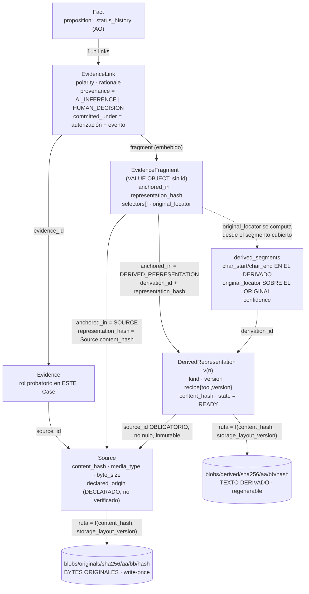

# 07 — Provenance de derivados y locators de evidencia V0

**Estado:** Technical Design V0 (nivel 2 de la precedencia documental, kernel §14). Subordinado a los ADR-001…006 Accepted; normativo sobre los documentos de arquitectura y el glosario en materia técnica. ADR asociado: `ADR-011-evidence-locator-strategy.md` (`Proposed`).

**Alcance.** Este documento fija **cómo se ancla una cita a la prueba y cómo se resuelve esa cita hasta los bytes originales**. Concreta el `EvidenceFragment` de `02-domain-model.md` §2.5, el `original_locator` de `04-persistence-model.md` §2.6/§3.2/§3.3 y el `fragment_ref` de `05-mcp-contract.md` §6.4/§6.5 hasta el nivel de contrato de forma, reglas por familia de medio, protocolo de regeneración y redacción obligatoria.

**Qué NO hace.** No reabre ninguna decisión Accepted. No define esquema físico nuevo (los refinamientos que propone son **aditivos** y están marcados). No define superficie MCP (kernel §6). No contiene código de producción: las interfaces TypeScript son **conceptuales** —contrato de forma y semántica, no artefacto compilable—.

---

## 0. Convenciones de lectura

**Etiquetas de veracidad** (obligatorias, kernel): `HECHO VERIFICADO` (con fuente) · `DECISIÓN APROBADA` · `PROPUESTA DEL TECHNICAL DESIGN` (mía, requiere aprobación) · `HIPÓTESIS` · `SUPUESTO` · `POR VERIFICAR` · `RIESGO` · `DECISIÓN PENDIENTE` · `POST-V0`.

**Normalización aplicada** (kernel §1.5): `principal_id / principal_type / principal_role` para la dimensión operacional y `provenance_kind` para la epistémica. La decisión humana **nunca** se escribe como valor del campo operacional: se expresa siempre como `provenance_kind = HUMAN_DECISION` + `principal_type = HUMAN` (kernel §1.4, invariante comprobable).

**Tipos base.** `SourceId`, `DerivationId`, `EvidenceId`, `LinkId`, `ContentHash`, `Timestamp`, `ProvenanceRecord`, `CaseRevisionNumber` se toman literalmente de `02-domain-model.md` §2.1–§2.3 y no se redefinen aquí.

**`Statement` no se materializa en V0** (kernel §15). Donde este documento dice "el ancla vive en el `EvidenceLink`", la evolución hacia `Statement` está cubierta en `02-domain-model.md` §7 y en §3.8 de aquí: el contrato del locator es el mismo objeto, portado por otra entidad.

---

## 1. La cadena: del `Fact` a los bytes originales

### 1.1 Los dos planos

Toda la sección 1 descansa en una distinción que el resto del documento aplica mecánicamente:

| | **Plano del original** | **Plano derivado** |
|---|---|---|
| Qué es | Los bytes recibidos en la incorporación | Texto producido *a partir de* esos bytes: transcripción, OCR, texto normalizado |
| Entidad | `Source` (`02` §3.2) | `DerivedRepresentation` (`02` §3.4), `kind ∈ {TRANSCRIPT, NORMALIZED_TEXT, OCR_TEXT}` |
| Mutabilidad | **Inmutable tras incorporación** (ADR-003 inv. 8; PF-002) | **Regenerable y versionada**; jamás sustituye al Source (ADR-003 inv. 8) |
| Identidad de contenido | `sources.content_hash` | `derived_representations.content_hash`, uno por versión |
| Ubicación física | `blobs/originals/sha256/…`, write-once (`04` §7.1–§7.3) | `blobs/derived/sha256/…`, write-once por versión |
| Estatus probatorio | **Es la prueba** | **Es una lectura de la prueba**, falible aunque su hash sea correcto |
| Qué prueba su hash | Que los bytes no han cambiado *desde la incorporación* (§6) | Que ese texto derivado no ha cambiado desde su generación — **no** que sea una lectura correcta del original |

**Regla dura de la que se derivan casi todas las demás:** una cita puede *pasar* por el plano derivado, pero **nunca puede terminar en él**. El fragmento siempre resuelve a un `Source` (ADR-006 inv. 5), y la coordenada que la profesional lee y que un tercero podría verificar está siempre expresada sobre el original (ADR-003 inv. 7).

### 1.2 Diagrama de la cadena completa



Lectura del diagrama en una frase: **un `Fact` no cita texto; cita un `EvidenceLink` que porta un ancla, y esa ancla siempre desciende hasta un blob de originales, con o sin escala en un derivado versionado.**

Ninguna flecha del diagrama es una ruta de filesystem: `04` §7.2 fija que la ubicación es función pura del hash y que **ninguna tabla guarda una ruta**. El locator, por tanto, nunca contiene rutas — propiedad que también cierra la superficie de path traversal del test F18.

### 1.3 Regla de doble coordenada

`PROPUESTA DEL TECHNICAL DESIGN` — requiere aprobación.

> **Todo fragmento y todo segmento portan dos coordenadas: la del original (coordenada de cita) y la de la representación efectivamente leída (coordenada de recuperación). La primera es la que se muestra, se audita y se verifica. La segunda es la que permite extraer el texto.**

Motivo por el que no basta una: la coordenada fina que un modelo o una búsqueda producen vive necesariamente en el plano derivado (offsets sobre un transcript, sobre un OCR o sobre un texto normalizado). Esa coordenada **no es citable**: depende de la receta, de la versión y de la normalización. La coordenada citable es la del original, que sobrevive a cualquier regeneración. Guardar solo la derivada rompería ADR-003 inv. 7 en la primera regeneración; guardar solo la original impediría extraer el texto exacto y verificar el ancla.

**La coordenada del original es la más fina que el medio soporta de forma estable:**

| Familia de medio | Coordenada de cita estable en el original | Por qué no más fina |
|---|---|---|
| Texto plano (`text/plain`) | Rango de caracteres sobre el texto original | Es el propio material |
| Documento paginado (`application/pdf`) | **Página** (índice físico) | Los bytes del PDF no tienen offsets de carácter con significado de cita; el texto solo existe tras extracción, que es un derivado |
| Imagen escaneada dentro de un PDF | **Página** | No hay texto en el original; lo hay en el OCR, que es derivado |
| Audio / vídeo | **Milisegundos** sobre la línea de tiempo del original | Es la coordenada nativa del medio |

`LÍMITE DECLARADO, no defecto oculto:` para material anclado a través de un derivado, la coordenada del original **no es más fina que el segmento** que la contiene (`04` §2.6). Citar "de 00:41:05 a 00:41:22" es exacto al segmento; pretender exactitud de palabra sobre la línea de tiempo del original exigiría alineamiento por palabra del proveedor, que **no se supone** (§3.6, `POR VERIFICAR`).

### 1.4 Qué garantiza y qué NO garantiza cada salto

| Salto | Garantiza | **No** garantiza |
|---|---|---|
| `Fact` → `EvidenceLink` | Que existe una relación afirmada entre proposición y prueba, con su polaridad, su justificación y su provenance de origen | Que la relación sea correcta. Un link `AI_INFERENCE` es una inferencia aunque un humano la haya commiteado (`02` §3.6) |
| `EvidenceLink` → `EvidenceFragment` | Que la cita es a un tramo, nunca al documento entero (ADR-003 inv. 7) | Que el tramo sea el relevante |
| `EvidenceFragment` → `DerivedRepresentation` | Que el texto leído es exactamente el de esa versión (verificado por `representation_hash`) | Que el derivado sea una lectura **fiel** del original (§6.2, brecha 2) |
| `DerivedRepresentation` → `Source` | Que el derivado declara de qué original procede, con receta y versión | Que el proceso de derivación sea reproducible bit a bit (`13-synthetic-benchmark.md` §: no determinismo del proveedor) |
| `Source` → blob | Que los bytes son los mismos que se incorporaron (re-hash) | Que el material sea **auténtico** (§6.1) |
| blob | Existencia física verificable | Nada sobre su origen: `declared_origin` es *declarado* (ADR-006 inv. 6) |

Esta tabla es la razón por la que §6 no es una nota de estilo sino una regla de producto: cada salto añade una garantía estrecha, y la suma de garantías estrechas **no** es "el documento es auténtico y dice lo que la cita afirma".

### 1.5 Resolución: algoritmo conceptual

Camino completo de `fragment_ref` → contenido + `provenance_chain` (contrato de salida en `05` §6.4). `PSEUDOCÓDIGO CONCEPTUAL`.

```text
resolve(fragment_ref, case_id):
  1. decodificar el handle y verificar que lo emitió el Core
     (04 §2.2: función de (evidence_id, representation_hash, selectors); verificable por re-resolución)
     ⇒ fallo: UNKNOWN_REFERENCE     [handle fabricado por el modelo — test F18]
  2. evidence.case_id == case_id
     ⇒ fallo: CROSS_CASE_REFERENCE
  3. resolver representation_hash:
       sources.content_hash                  ⇒ anchored_in debe ser SOURCE
       derived_representations.content_hash  ⇒ anchored_in debe ser DERIVED_REPRESENTATION
                                               y state debe ser READY
     ⇒ fallo: UNKNOWN_REFERENCE
  4. la derivación (si la hay) referencia el mismo source_id que el fragmento
     ⇒ fallo: VALIDATION_FAILED   [ancla incoherente: nunca se "arregla" adivinando]
  5. leer bytes en ruta = f(representation_hash, storage_layout_version)
     re-hash y comparar con representation_hash
     ⇒ mismatch: NO se sirve contenido; degradación a solo lectura y aviso (04 §7.4)
  6. aplicar selectores en orden (§3.7):
       TEXT_POSITION  → subcadena [start, end)
       TEXT_QUOTE     → la subcadena DEBE coincidir con exact (y con prefix/suffix si están)
     ⇒ discrepancia con hash ya verificado: es corrupción o bug, no deriva ⇒ fallo duro (§3.4)
  7. computar original_locator desde los segmentos cubiertos (§2.4) y compararlo con el
     original_locator persistido en el fragmento
     ⇒ discrepancia: VALIDATION_FAILED, jamás recomputar en silencio
  8. intersectar con derived_segments.confidence
     ⇒ tramos bajo umbral: condición UNCERTAIN_FRAGMENT { ranges }  (informativa, no bloqueante)
  9. componer provenance_chain { evidence, derivation | null, source }  (05 §6.4)
 10. re-emitir fragment_ref (puede diferir si hubo expand)
```

**Nota de honestidad sobre el paso 5.** Re-hashear en cada lectura da la garantía más fuerte, pero su coste depende del tamaño del blob y del almacenamiento, y **cualquier afirmación de rendimiento aquí sería inventada**. `PROPUESTA`: re-hash en lectura por debajo de un umbral configurable de tamaño, más la verificación periódica completa que ya exige ADR-002 val. 2 (`04` §7.4). `POR VERIFICAR` en el spike de dependencias: coste real de digest sobre los tamaños de material que el slice maneja.

---

## 2. Metadatos obligatorios de todo derivado

### 2.1 Los cinco metadatos exigidos y dónde viven

Todo objeto del plano derivado debe poder responder, sin consultar nada externo, a: *de qué procede, cómo se produjo, con qué versión del método, cuándo, y qué contenido exacto es*.

| Metadato exigido | Campo en el modelo | Fuente normativa |
|---|---|---|
| **Parent source** | `derived_representations.source_id`, `NOT NULL`, inmutable | ADR-003 inv. 8; `02` §3.4; `04` §3.2 |
| **Method** | `recipe.tool` | `02` §3.4; `04` §3.2 |
| **Method version** | `recipe.version` | ídem |
| **Parámetros del método** | `recipe.params` (normalizados) | `04` §3.2 (`recipe json`) |
| **Generated at** | ver §2.2: `created_at` es el alta de la fila `PENDING`; el instante de generación se propone como campo propio | `04` §3.2 |
| **Hash** | `content_hash`, presente **sii** `state = READY` | `02` §3.4; `04` §3.2 (`CK`) |
| **Quién y con qué naturaleza** | `<PROVENANCE>` embebido: `provenance_kind = AI_DERIVATION`, `principal_type ∈ {AI, SYSTEM}` | kernel §1.4; `04` §2.7 |
| **Versión** | `version`, monotónica; ver §2.2 la divergencia sobre respecto de qué | `02` §3.4 vs `04` §3.2 |

Regla derivada, verificable en el Domain: **un derivado sin `source_id` no es construible**, igual que una entidad epistémica sin `ProvenanceRecord` no lo es (ADR-003 inv. 1; `04` §2.7 explica por qué se embebe en vez de referenciarse).

### 2.2 Refinamientos **aditivos** propuestos sobre `derived_representations`

`PROPUESTA DEL TECHNICAL DESIGN` — requieren aprobación. Ninguno cambia el tipo ni la nulabilidad de una columna existente, ninguno exige backfill destructivo, y los tres son necesarios para que §5 (regeneración) y §3 (locator) sean verificables.

```text
+ generated_at   ts      NULL     -- instante en que la derivación alcanzó READY|FAILED
                                  -- CK( state <> 'PENDING' => generated_at IS NOT NULL )
                                  -- created_at sigue siendo el alta de la fila PENDING: son
                                  -- dos hechos distintos y colapsarlos falsearía la auditoría
                                  -- de una derivación que tardó minutos (03 §5.7)

+ recipe_hash    sha256  NOT NULL -- H(normalize(recipe)) = { tool, version, params }
                                  -- hace DECIDIBLE si dos derivaciones son "la misma receta",
                                  -- que es lo que §5 necesita para saber si una regeneración
                                  -- es versión nueva de lo mismo o un método distinto

+ derived_from_content_hash sha256 NOT NULL
                                  -- hash de la representación EXACTAMENTE consumida
                                  -- V0: CK( derived_from_content_hash = sources.content_hash )
                                  -- Es el campo que hace ADITIVO el soporte de derivados de
                                  -- segundo orden (§2.3): se relaja el CK, no se migra nada
```

**Por qué `derived_from_content_hash` aunque en V0 sea redundante con `source_id`.** Un derivado declara hoy *de qué entidad* procede, pero no *de qué contenido exacto*. Mientras el Source sea inmutable son lo mismo. En el momento en que exista OCR→normalización (§2.3), la pregunta "¿sobre qué texto exacto se normalizó?" no tendría respuesta almacenada, y reconstruirla a posteriori obligaría a **inferir** la cadena de derivación de un material probatorio. Es exactamente el defecto que ADR-003 evita en `Fact`: no almacenar lo que después habría que adivinar. Coste hoy: 32 bytes y una comprobación tautológica.

> **DIVERGENCIA ENTRE DOCUMENTOS HERMANOS (nivel 2 vs nivel 2, no es conflicto con ADR Accepted).**
> `02-domain-model.md` §3.4 dice que `version` es *"monotónica por (source_id, recipe)"*; `04-persistence-model.md` §3.2 impone `UQ(source_id, kind, version)`, es decir monotonía por `(source_id, kind)`. No son la misma regla: dos recetas distintas del mismo `kind` (dos motores de OCR) colisionarían bajo la segunda y convivirían bajo la primera.
> **Propuesta de reconciliación:** conservar `UQ(source_id, kind, version)` de `04` —la versión es del *kind*, que es lo que la usuaria percibe: "la transcripción, versión 2"— y almacenar `recipe_hash` para que la receta quede registrada y comparable sin gobernar la unicidad. Consecuencia declarada: cambiar de receta produce una **versión nueva del mismo kind**, no una serie paralela, y §5 la trata como cualquier otra regeneración. Requiere aprobación y una corrección de una frase en `02` §3.4.

### 2.3 Derivados de segundo orden: `POST-V0`

En V0 **todo derivado es de primer orden**: su padre es siempre el `Source` (`04` §3.2 lo impone con `source_id FK -> sources`). Un pipeline realista de PDF escaneado sería `PDF → OCR_TEXT → NORMALIZED_TEXT`; en V0 esa segunda etapa se modela como **parte de la receta** de una única derivación (`recipe.params` describe la normalización), no como una derivación encadenada.

Razón de minimalismo: encadenar derivados multiplica los caminos de re-anclaje (§5) por cada eslabón, y el slice no lo necesita. Camino de evolución, **aditivo**: relajar el `CK` de `derived_from_content_hash` y permitir que apunte a `derived_representations.content_hash`; `source_id` sigue siendo obligatorio y sigue apuntando al original, de modo que ADR-006 inv. 5 se mantiene sin cambios en el eslabón final.

### 2.4 `derived_segments`: la unidad que porta la doble coordenada

`04` §2.6 ya fija que el derivado se descompone en segmentos. Aquí se fija **qué contiene su `original_locator`** y cómo se computa el del fragmento:

- `char_start / char_end` → coordenada **derivada** (offsets en el texto de esa versión).
- `original_locator` → coordenada **del original**, con la forma de §3.2 (`ORIGINAL_CHAR_RANGE` | `ORIGINAL_PAGE` | `ORIGINAL_TIME_RANGE`).
- `confidence` → `NULL` cuando la receta no reporta confianza. **`NULL` no es cero ni es alta:** es "el método no lo dice", y la presentación no puede convertir ausencia de dato en certeza (kernel §10).

**Cómputo del `original_locator` de un fragmento** (`PROPUESTA`, determinista):

```text
segmentos_cubiertos = { s ∈ derived_segments(derivation)
                        : [s.char_start, s.char_end) ∩ [selector.start, selector.end) ≠ ∅ }

ORIGINAL_TIME_RANGE :  from_ms = min(s.original_locator.from_ms)     ← redondeo hacia abajo
                       to_ms   = max(s.original_locator.to_ms)       ← redondeo hacia arriba
ORIGINAL_PAGE       :  from_page = min(page), to_page = max(page)
ORIGINAL_CHAR_RANGE :  from = min(from), to = max(to)
```

**Regla de redondeo, deliberada y asimétrica:** el inicio se redondea hacia abajo y el fin hacia arriba. Un ancla que se queda corta recorta prueba; un ancla que se pasa incluye contexto de más. Ante duda, el error barato: incluir de más y decirlo, nunca recortar en silencio.

`segmentos_cubiertos = ∅` ⇒ el fragmento **no es construible**: `VALIDATION_FAILED`. No existe el caso "fragmento sin coordenada en el original".

---

## 3. El contrato extensible del Locator

### 3.1 Forma consolidada de `EvidenceFragment`

Consolida `02` §2.5 (que define `anchored_in`, `representation_hash`, `derivation_id`, `selectors[]`) con `04` §3.3 (que exige además una columna `original_locator json NOT NULL`, no nombrada en la interfaz de `02`). `PROPUESTA DEL TECHNICAL DESIGN`: la interfaz consolidada nombra explícitamente `original_locator` y añade `v`.

```ts
type LocatorSchemaVersion = 1;          // versión del CONTRATO de locator, no del contenido

interface EvidenceFragment {            // VALUE OBJECT — sin id, sin estado, sin historia (02 §1.1)
  readonly v: LocatorSchemaVersion;

  // ---- a qué material pertenece ------------------------------------------
  readonly source_id: SourceId;                 // OBLIGATORIO SIEMPRE (ADR-006 inv. 5)

  // ---- contra qué representación se resolvió el ancla ---------------------
  readonly anchored_in: 'SOURCE' | 'DERIVED_REPRESENTATION';
  readonly derivation_id?: DerivationId;        // presente sii anchored_in = 'DERIVED_REPRESENTATION'
  readonly representation_hash: ContentHash;    // hash de la representación EXACTA leída

  // ---- coordenada de RECUPERACIÓN (plano de representation_hash) ----------
  readonly selectors: readonly Selector[];      // >= 1; composición por refinamiento (§3.7)

  // ---- coordenada de CITA (plano del ORIGINAL, siempre) ------------------
  readonly original_locator: OriginalLocator;   // §3.2
}
```

**Por qué `v` en el propio value object y no solo en el schema de la base.** El fragmento viaja embebido en `EvidenceLink`, que es estado canónico append-only y sobrevive a migraciones. Un fragmento sin versión de contrato obligaría, en la primera extensión de la unión de selectores, a **inferir** la forma de un dato ya persistido. Coste hoy: un entero.

### 3.2 Las dos uniones

```ts
// ---- Coordenada de CITA: siempre sobre el ORIGINAL ----------------------
type OriginalLocator =
  | { readonly kind: 'ORIGINAL_CHAR_RANGE'; readonly from: number; readonly to: number }
  | { readonly kind: 'ORIGINAL_PAGE';       readonly from_page: number; readonly to_page: number;
      readonly page_labels?: readonly string[] }        // rótulo impreso: INFORMATIVO, jamás el ancla
  | { readonly kind: 'ORIGINAL_TIME_RANGE'; readonly from_ms: number; readonly to_ms: number };

// ---- Coordenada de RECUPERACIÓN: sobre representation_hash --------------
type Selector =
  | { readonly kind: 'TEXT_POSITION'; readonly start: number; readonly end: number }
  | { readonly kind: 'TEXT_QUOTE';    readonly exact: string;
                                      readonly prefix: string; readonly suffix: string }
  | { readonly kind: 'PAGE_RANGE';    readonly from_page: number; readonly to_page: number }
  | { readonly kind: 'TIME_RANGE';    readonly from_ms: number;   readonly to_ms: number };
```

**Nombres.** Se adoptan los de `04` §3.3 (`TEXT_POSITION`, `TEXT_QUOTE`, `PAGE_RANGE`, `TIME_RANGE`), alineados con el vocabulario W3C (§4). `DIVERGENCIA ENTRE DOCUMENTOS HERMANOS`: `02` §2.5 los escribe como `CHAR_RANGE` y `QUOTE`. **Propuesta de reconciliación:** `CHAR_RANGE → TEXT_POSITION`, `QUOTE → TEXT_QUOTE` en `02` §2.5; `PAGE_RANGE` y `TIME_RANGE` ya coinciden. Es renombrado de dos etiquetas de una unión conceptual, sin efecto sobre ninguna decisión.

**Convenciones fijadas** (`PROPUESTA DEL TECHNICAL DESIGN`; sin ellas dos implementaciones correctas producen anclas distintas):

| Convención | Valor fijado | Motivo |
|---|---|---|
| Intervalos | **Semiabiertos `[from, to)`** en las cuatro variantes, salvo páginas | Concatenación sin solapes ni huecos |
| Páginas | `[from_page, to_page]` **cerrado**, 1-based | "de la página 3 a la 3" debe ser expresable y legible |
| Unidad de offset | **Puntos de código Unicode** sobre el texto en forma normalizada **NFC** | Contar unidades UTF-16 haría que el mismo ancla difiriera según el runtime |
| Unidad temporal | **Milisegundos enteros** desde el primer instante del original (`t = 0`) | `PROPUESTA`; ver §3.6 |
| Longitud de `prefix`/`suffix` | **32 puntos de código**, truncados en los límites de la representación | `PROPUESTA`; ver §3.4 |

`POR VERIFICAR:` que la unidad de offset elegida sea compatible con el texto que devuelvan realmente los extractores y el proveedor de transcripción (spike de dependencias / spike de transcripción). Fijar la convención es decisión de diseño; **que el proveedor la respete es un hecho a medir, no a suponer**.

### 3.3 Reglas por familia de medio

**Invariante estructural (INV-L-04), el que implementa literalmente ADR-003 inv. 7:**

```text
anchored_in = 'DERIVED_REPRESENTATION'  ⇒  ∀ s ∈ selectors : s.kind ∈ { TEXT_POSITION, TEXT_QUOTE }
```

Es decir: **`TIME_RANGE` y `PAGE_RANGE` no son nunca selectores sobre un derivado.** Página y tiempo son coordenadas del original; si aparecieran como selector de un transcript estarían midiendo la línea de tiempo del *derivado*, que es exactamente lo prohibido. Cuando se cita un audio a través de su transcripción, el tiempo vive en `original_locator`, no en `selectors`.

| Familia | `anchored_in` típico | `original_locator` | `selectors` obligatorios |
|---|---|---|---|
| Texto plano | `SOURCE`, o `DERIVED` si hubo normalización | `ORIGINAL_CHAR_RANGE` | `TEXT_POSITION` **+** `TEXT_QUOTE` |
| PDF nativo (texto extraíble) | `DERIVED` (`NORMALIZED_TEXT`) | `ORIGINAL_PAGE` | `TEXT_QUOTE` obligatorio; `TEXT_POSITION` si el extractor lo permite |
| PDF escaneado | `DERIVED` (`OCR_TEXT`) | `ORIGINAL_PAGE` | `TEXT_QUOTE` obligatorio; `TEXT_POSITION` si el extractor lo permite |
| PDF citado solo por página | `SOURCE` | `ORIGINAL_PAGE` | `PAGE_RANGE` |
| Audio / vídeo con transcripción | `DERIVED` (`TRANSCRIPT`) | `ORIGINAL_TIME_RANGE` | `TEXT_QUOTE` (+ `TEXT_POSITION`) |
| Audio / vídeo citado solo por tiempo | `SOURCE` | `ORIGINAL_TIME_RANGE` | `TIME_RANGE` |

**Redundancia deliberada.** Cuando `anchored_in = 'SOURCE'`, `original_locator` repite la coordenada del selector. Se acepta la redundancia a cambio de que **todo consumidor lea la coordenada de cita en un único lugar, sin condicionales**: la presentación, la auditoría y el export no necesitan saber si hubo derivado. Invariante que evita que la redundancia se convierta en divergencia: INV-L-05.

### 3.4 TEXT — por qué se exigen **los dos** selectores

```ts
// Ejemplo ilustrativo (no es dato real)
{
  v: 1,
  source_id: "<opaco>",
  anchored_in: "DERIVED_REPRESENTATION",
  derivation_id: "<opaco>",
  representation_hash: "9f2c…",              // NORMALIZED_TEXT v1 del contrato
  selectors: [
    { kind: "TEXT_POSITION", start: 10432, end: 10517 },
    { kind: "TEXT_QUOTE",
      exact:  "el arrendatario pagará dentro de los cinco (5) primeros días de cada mes",
      prefix: "clausula tercera. precio y forma de pago. ",
      suffix: " en la cuenta indicada por el arrendador" }
  ],
  original_locator: { kind: "ORIGINAL_PAGE", from_page: 2, to_page: 2 }
}
```

Los dos selectores **no** son redundancia defensiva: tienen funciones distintas en momentos distintos, y ese es el argumento completo para exigirlos juntos.

| | `TEXT_POSITION` | `TEXT_QUOTE` |
|---|---|---|
| Función **dentro** de una representación fija | Recuperación exacta y barata | **Comprobación de redundancia** |
| Función **entre** versiones (§5) | Inútil: los offsets se desplazan | **Único mecanismo de re-anclaje** |
| Si falla con el `representation_hash` ya verificado | Corrupción o bug — **jamás** deriva de contenido | ídem |

**Consecuencia dura, y contraintuitiva, que hay que escribir.** Si `representation_hash` verificó, el texto es idéntico bit a bit; por tanto posición y cita **tienen que** coincidir. Una discrepancia no significa "el documento cambió" —el hash lo impide— sino que algo está roto: corrupción del blob, bug del resolutor, o normalización aplicada de forma distinta en escritura y en lectura. Por eso el paso 6 de §1.5 falla en duro y **no** intenta una búsqueda por cita "para arreglarlo": la búsqueda por cita es exclusivamente el mecanismo de §5.4, y usarla aquí convertiría un bug detectable en un ancla desplazada en silencio.

**`prefix`/`suffix` obligatorios, no opcionales** (`PROPUESTA`, refina `02` §2.5 donde eran opcionales). Sin contexto, una cita corta y frecuente —*"el demandado"*, *"la suma de $5.000.000"*— es ambigua en cuanto se busca en otra versión: el re-anclaje encontraría N coincidencias y tendría que elegir, es decir, adivinar. Con 32 caracteres a cada lado la unicidad deja de ser un accidente del texto. Coste: unos cientos de bytes por link. `POR VERIFICAR`: que 32 sea suficiente en el corpus real; se mide en el fixture de `13-synthetic-benchmark.md`, no se afirma aquí.

### 3.5 PDF / documento — página, y ancla de texto **si el extractor lo permite**

- `page` es el **índice físico 1-based** en el orden de páginas del documento original. `page_labels` es el **rótulo impreso** (*"iii"*, *"Anexo 2-A"*): informativo para la presentación, **nunca** el ancla. Colapsarlos produciría citas irreproducibles en cuanto el rótulo se repita o no exista.
- `POR VERIFICAR:` que el extractor elegido enumere páginas de forma estable y reproducible entre ejecuciones y versiones. Es un hecho a medir del adapter; **no** una propiedad que este documento pueda garantizar.
- El ancla de texto (`TEXT_QUOTE` obligatorio, `TEXT_POSITION` cuando exista) vive **siempre** sobre el derivado de extracción u OCR, con su `representation_hash`. Un PDF no tiene offsets de carácter citables: los que existen son los del texto extraído, y ese texto es una versión.
- **Si el extractor no entrega offsets** (`TEXT_POSITION` ausente): el fragmento sigue siendo válido con `TEXT_QUOTE` + `ORIGINAL_PAGE`. La resolución busca la cita dentro del texto de esa página; si aparece más de una vez, `prefix`/`suffix` desambiguan; si aún así no es única, el fragmento **no se construye** (`VALIDATION_FAILED`). No se elige "la primera".

### 3.6 AUDIO / VÍDEO — la línea de tiempo es la del **original**

```ts
// Ejemplo ilustrativo (no es dato real)
{
  v: 1,
  source_id: "<opaco>",
  anchored_in: "DERIVED_REPRESENTATION",
  derivation_id: "<opaco>",
  representation_hash: "c41a…",              // TRANSCRIPT v1
  selectors: [
    { kind: "TEXT_POSITION", start: 8820, end: 8903 },
    { kind: "TEXT_QUOTE", exact: "yo le dije que el pago se hacía el día cinco",
      prefix: "…entonces en esa reunión ", suffix: " y él respondió que no" }
  ],
  original_locator: { kind: "ORIGINAL_TIME_RANGE", from_ms: 2465000, to_ms: 2482000 }
}
```

Reglas duras:

1. `from_ms` / `to_ms` se miden **sobre la línea de tiempo del original**, con `t = 0` en el primer instante del material incorporado. Nunca sobre el derivado (`vertical-slice-v0.md`, precondición 7; slice F5; `05` §6.4).
2. `TIME_RANGE` **no** aparece como selector cuando se cita a través de una transcripción (INV-L-04). El tiempo es coordenada de cita, no de recuperación.
3. Redondeo asimétrico de §2.4: inicio hacia abajo, fin hacia arriba.
4. Un vídeo se ancla **igual que un audio**: tiempo. La coordenada espacial dentro del fotograma es `bounding box` y **no se diseña en V0** (§3.9).

> **PROPUESTA DEL TECHNICAL DESIGN — criterio de admisión del proveedor de transcripción. Requiere aprobación.**
> Un proveedor que **no** entregue marcas de tiempo referidas al original con granularidad al menos de segmento **no es admisible para V0**. Motivo: sin esa coordenada, el ancla de un audio solo podría expresarse como cita sobre el derivado, y un `EvidenceLink` así **viola ADR-003 inv. 7** — la cadena terminaría en un artefacto de la transcripción en lugar de en la prueba.
> Es un criterio de admisión de adapter, no una relajación del invariante: cuando el hecho externo choca con el invariante, **cambia el diseño del locator o el proveedor, no el invariante** (`05` §6.4).
> `RIESGO` declarado: este criterio puede excluir proveedores por lo demás adecuados y encarecer o retrasar el slice. `POR VERIFICAR` en `experiments/transcription-spike/`: qué proveedores entregan `start`/`end` por segmento y con qué estabilidad entre ejecuciones. **Ninguna afirmación sobre qué proveedor cumple esto se hace en este documento.**
> `HIPÓTESIS` no verificada: el alineamiento **por palabra** (no por segmento) sería deseable para citas cortas; no se supone disponible y ninguna regla de V0 depende de él.

### 3.7 Composición y refinamiento

`selectors` es un **array ordenado**, y el orden tiene significado:

```text
selectors[i+1] refina a selectors[i]  ⇒  la región de selectors[i+1] está CONTENIDA en la de selectors[i]
```

- La composición es **conjuntiva**: todos los selectores deben resolver de forma consistente. Un selector que contradice a otro **no** se descarta ni se pondera: el fragmento no es resolvable (`VALIDATION_FAILED`). No hay "mejor esfuerzo" en el anclaje probatorio.
- El refinamiento se expresa por **contención y orden**, no por anidamiento. Es la idea de `refinedBy` del estándar (§4.2) sin su forma; se justifica en §4.3.
- `selectors` **nunca vacío**: no existe el ancla al documento entero (ADR-003 inv. 7).

### 3.8 Extensibilidad: cómo se añade un `kind` — y cómo **no**

El contrato es extensible **por diseño y con fricción deliberada**. Cuatro reglas:

1. **Unión cerrada en V0.** Los cuatro `Selector` y los tres `OriginalLocator` de §3.2 son la lista completa. Añadir uno es cambio de contrato de la prueba, no un detalle de implementación.
2. **Fail-closed ante `kind` desconocido.** Un resolutor que encuentra un `kind` que no entiende **rechaza el fragmento** (`VALIDATION_FAILED`) y no intenta interpretar los campos que sí reconoce. Un ancla parcialmente entendida es un ancla desplazada con apariencia de válida.
3. **`v` gobierna la lectura.** Un fragmento con `v` mayor que la soportada no se resuelve; el runtime lo dice y degrada, no adivina (coherente con la política de migraciones de `04` §9).
4. **Procedimiento de alta de un `kind`:** (a) un caso de uso real documentado —regla de ADR-003 sobre la polaridad: *se señala, no se amplía preventivamente*—; (b) ADR que lo registre; (c) `v` incrementada; (d) resolutor y validador antes que cualquier emisor; (e) los fragmentos existentes **no se migran**, porque son estado canónico append-only.

**Extensibilidad que `Statement` no romperá.** El locator nombra `(source_id, representación, coordenadas)` y no menciona qué entidad lo porta. Cuando exista `Statement` (`02` §7), portará el mismo value object sin que cambie ninguna firma de §3 ni de `05` §6.4/§6.5.

### 3.9 Lo que **NO** se diseña en V0: bounding boxes

**Decisión: no hay coordenadas espaciales (bbox) en el locator V0.** `POST-V0`.

Motivos, en orden de peso:

1. **Exigirían fijar cosas que hoy no podemos verificar:** sistema de coordenadas y origen, unidades, rotación de página, y qué caja del documento se toma como referencia. Cada extractor responde distinto, y afirmar aquí una convención sería inventar una capacidad de plataforma.
2. **No aportan capacidad al slice:** la cita de un documento se hace por página y texto; la caja añade precisión visual, no verificabilidad.
3. **Riesgo de ancla frágil:** una bbox es una coordenada **derivada del render**, no del original en el sentido en que lo es la página. Se parecería a citar un derivado con apariencia de citar el original.

> **DIVERGENCIA ENTRE DOCUMENTOS HERMANOS.** `04-persistence-model.md` §2.6 y §3.2 mencionan `bbox` como ejemplo del contenido de `original_locator` (*"ms / página / bbox"*). **Propuesta de reconciliación:** marcar esa mención como `POST-V0` en `04`, o retirarla de la enumeración ilustrativa. No afecta al DDL —`original_locator` es `json`— ni a ninguna decisión: es una lista de ejemplos.

---

## 4. Subconjunto adoptado del W3C Web Annotation Data Model

### 4.1 El hecho verificado y el alcance exacto de la cita

**HECHO VERIFICADO** (kernel §1; fuente: *W3C Web Annotation Data Model*, Recomendación W3C de **23 de febrero de 2017**): el estándar define `TextQuoteSelector` (**§4.2.4**), `TextPositionSelector` (**§4.2.5**) y la relación de refinamiento `refinedBy` (**§4.2.9**).

Todo lo que este documento afirma del estándar se limita a esos tres puntos. Los demás tipos de selector se nombran por su nombre, **sin número de sección**, porque su numeración exacta está `POR VERIFICAR`; ninguna decisión de aquí depende de ella.

### 4.2 Qué se adopta — exactamente

Tres cosas, y ninguna más:

1. **La forma y la semántica de `TextQuoteSelector`.** Tres campos: `exact`, `prefix`, `suffix`. Se adopta la idea central —*una cita es su texto más su contexto inmediato*— porque es lo que hace posible re-anclar sobre una versión nueva (§5.4). **Refinamiento propio:** `prefix` y `suffix` son **obligatorios** (§3.4), donde el estándar los admite opcionales.
2. **La forma y la semántica de `TextPositionSelector`.** Dos campos: `start` y `end`, con `end` exclusivo. **Refinamiento propio:** se fija la unidad como puntos de código Unicode sobre texto NFC (§3.2), porque una implementación necesita una respuesta unívoca a "qué cuenta como carácter"; `POR VERIFICAR` la correspondencia literal con la redacción de §4.2.5.
3. **La idea de refinamiento.** Un selector puede acotar a otro. Se adopta la **idea**; se rechaza la **forma** (`refinedBy` anidado) a favor de contención y orden en un array (§3.7), porque el anidamiento arrastra la serialización del estándar sin aportar poder expresivo para dos niveles.

### 4.3 Qué **NO** se adopta, y por qué

**El principio.** No se copia un estándar entero para el 10 % que se necesita. Adoptar el modelo completo importaría vocabulario con semántica ajena al dominio probatorio, más maquinaria de serialización e identificación que nuestro almacenamiento local ya resuelve mejor con un hash.

| No adoptado | Por qué |
|---|---|
| **Serialización JSON-LD y `@context`** | El fragmento vive embebido en una fila de `case.db`, no viaja por la web. `@context` obliga a resolver un contexto remoto o a versionarlo local; ambas cosas son coste sin capacidad. Además el estándar no es la fuente de verdad de nuestro contrato: `v` lo es (§3.8) |
| **Identificación por IRI/URI** de anotaciones y targets | Nuestros identificadores son **opacos**, emitidos por el Core, y nunca se muestran (kernel §11). Un target expresado como URI resoluble sería, además, una superficie de exfiltración y una ruta inyectable — lo contrario de `04` §7.2 (la ubicación es función pura del hash, no hay ruta que inyectar) |
| **El modelo `Annotation` / `Body` / `Target`** | Nuestro `EvidenceLink` **ya es** la anotación, con semántica jurídica que el estándar no tiene: `polarity`, `rationale`, `provenance` de origen y `committed_under`. Introducir `Annotation` duplicaría la entidad y crearía dos lugares donde vive la misma relación |
| **`FragmentSelector`, `CssSelector`, `XPathSelector`, `DataPositionSelector`, `SvgSelector`, `RangeSelector`** | Todos apuntan a estructuras que nuestro material no tiene (DOM, SVG) o codifican la coordenada como cadena opaca. Nosotros preferimos **campos tipados y validables**: `from_ms` es comprobable contra la duración del original; una cadena de fragmento no lo es sin parsearla |
| **`State` (`TimeState`, `HttpRequestState`)** | Existen para fijar *qué versión de un recurso web vio el anotador*. Nuestro `representation_hash` responde a lo mismo de forma **más fuerte y offline**: no dice "en tal fecha", dice "exactamente estos bytes" |
| **Vocabulario de `motivation`** | Categorías pensadas para anotación general; nuestra polaridad (`SUPPORTS` / `CONTRADICTS` / `CONTEXTUALIZES`) es enum cerrado del dominio (ADR-003 inv. 9) y mezclarla con `motivation` invitaría a ampliarla por inercia |
| **Selectores múltiples como alternativas** | El estándar admite ofrecer varios selectores para que el consumidor elija el que sepa resolver. En nuestro contrato la composición es **conjuntiva** (§3.7): elegir sería adivinar |

### 4.4 Mapeo entre nuestros nombres y los del estándar

| Nuestro | Estándar | Relación exacta |
|---|---|---|
| `Selector.kind = 'TEXT_QUOTE'` con `{exact, prefix, suffix}` | `TextQuoteSelector` (§4.2.4) | Mismos campos, misma semántica. **Diferencias:** sin `@type`; `prefix`/`suffix` obligatorios; longitud de contexto fijada (§3.2) |
| `Selector.kind = 'TEXT_POSITION'` con `{start, end}` | `TextPositionSelector` (§4.2.5) | Mismos campos, `end` exclusivo. **Diferencia:** unidad fijada a puntos de código sobre NFC |
| Orden y contención de `selectors[]` | `refinedBy` (§4.2.9) | Misma **idea**, distinta forma: array ordenado en vez de anidamiento |
| `EvidenceFragment.representation_hash` | (sin equivalente directo; lo más próximo es `State`) | Nuestro campo es más fuerte: identidad de contenido, no de instante |
| `EvidenceFragment.source_id` + `anchored_in` | `Target.source` | El nuestro es **obligatorio** y siempre resuelve al original (ADR-006 inv. 5) |
| `Selector.kind = 'PAGE_RANGE' \| 'TIME_RANGE'` | (el estándar canaliza este caso por `FragmentSelector`) | **No adoptado**: campos tipados en vez de cadena de fragmento |
| `EvidenceLink` | `Annotation` | **No adoptado**: entidad propia con semántica jurídica |

### 4.5 No se reclama conformidad

**Regla de veracidad, no de estilo.** El producto **no** afirma ser conforme al Web Annotation Data Model, ni en documentación, ni en UI, ni en export. Se usa su **vocabulario como convención de nombres** para que un lector técnico reconozca la forma. Afirmar conformidad tras adoptar dos selectores de una recomendación que define un modelo completo sería exactamente el tipo de afirmación sin respaldo que el kernel prohíbe.

### 4.6 Coste de salida

Si algún día hiciera falta exportar anclas en formato del estándar, el cambio es un **adapter de serialización** en Infrastructure: `TEXT_QUOTE`/`TEXT_POSITION` mapean uno a uno; el orden del array se convierte en `refinedBy`; el `Target` se construye desde `source_id`. **Ninguna entidad del Domain cambia.** Es la comprobación de que la no-adopción no crea una jaula.

---

## 5. Regeneración de un derivado

### 5.1 Nueva versión, nunca sobrescritura

Regenerar produce una **fila nueva** en `derived_representations` con `version = anterior + 1` y su propio `content_hash`, y un **blob nuevo**. Nunca un `UPDATE` del contenido: los blobs son write-once (`04` §7.3) y el original no se toca en ninguna hipótesis (PF-002).

Disparadores previstos (todos `POST-V0` en cuanto a ejecución, ver §5.8): nueva versión de la receta, cambio de proveedor, corrección de un fallo de extracción, o una derivación `FAILED` que se reintenta desde el plano administrativo (`03` §5.5, inconsistencia ya registrada allí).

### 5.2 Invariante de retención

> **INV-L-08 — Una versión de derivado referenciada por cualquier fragmento persistido NO se descarta.** Sin excepción por estado del link.

Precisiones que hacen el invariante verificable:

- **"Referenciada" incluye los links `RETIRED`.** Un link retirado sigue siendo historia auditable: si su ancla dejara de resolver, la auditoría de por qué se retiró se volvería incomprobable.
- **Incluye también los `artifact_inputs`** que registraron el `content_hash` de esa derivación (ADR-006 inv. 3): un artifact declara qué contenido exacto consumió, y ese contenido debe seguir existiendo para que la declaración sea comprobable.
- **La retención es de la versión completa** (fila + blob + sus `derived_segments`), no solo del blob: sin segmentos no hay `original_locator` computable (§2.4).
- Consecuencia declarada: **el almacenamiento de derivados crece con las regeneraciones y no se poda solo.** Es el coste asumido de que ninguna cita muera. La política de expurgo de versiones **sin referencias** es `POST-V0` y vive en el plano administrativo, jamás en la superficie del modelo (`04` §7.4).

### 5.3 `fragment_ref` (handle) ≠ ancla persistida

Distinción imprescindible, porque `05` §6.5 fija que **el handle se invalida al regenerar** mientras §5.2 fija que **el ancla persistida sigue resolviendo**. No hay contradicción: son objetos distintos.

| | `fragment_ref` (handle) | `EvidenceFragment` persistido |
|---|---|---|
| Qué es | Token opaco de recuperación emitido en lectura | Value object embebido en `EvidenceLink`, estado canónico |
| Dónde vive | En el contexto del modelo, efímero | En `case.db`, append-only |
| Al regenerar el derivado | **Se invalida** (`05` §6.5): obliga a pedir uno nuevo | **Sigue resolviendo** contra la versión retenida (§5.2) |
| Por qué esa asimetría | El modelo no debe seguir citando implícitamente una representación que ya tiene sucesora: que pida el handle otra vez es barato y explícito | Una cita ya commiteada bajo autorización humana **no puede cambiar de significado** porque el sistema regenere un derivado |

### 5.4 El re-anclaje es un **mapeo aditivo**, nunca una mutación

`PROPUESTA DEL TECHNICAL DESIGN` — requiere aprobación. Es la pieza que hace compatible "el re-anclaje es explícito y auditado, nunca silencioso" (`vertical-slice-v0.md`, *Derived state*) con la inmutabilidad del `EvidenceLink`.

> **El re-anclaje NO reescribe el `EvidenceFragment` de un link.** Añade un registro de correspondencia: *"el ancla de este link, expresada sobre la versión N, corresponde a estas coordenadas sobre la versión N+1"*. El ancla de cita sigue siendo la original.

Por qué así y no mutando el fragmento:

1. El fragmento vive dentro de un `EvidenceLink` **commiteado bajo `HumanAuthorization`** (`02` §3.6, `committed_under`). Reescribirlo cambiaría, sin acto humano nuevo, aquello que una persona aprobó. Es la misma clase de defecto que ADR-005 impide en el commit.
2. Con retención (§5.2) la versión N sigue existiendo: **no hay ninguna necesidad técnica de mutar**. El re-anclaje mejora la lectura, no repara una rotura.
3. Aditivo ⇒ auditable por construcción: la correspondencia es una fila con provenance, no una diferencia entre dos estados.

Forma conceptual del registro (`POST-V0` en cuanto a implementación; se especifica ahora para que el contrato de V0 no lo impida):

```ts
interface FragmentReanchor {
  readonly link_id: LinkId;
  readonly from_representation_hash: ContentHash;   // versión N
  readonly to_derivation_id: DerivationId;          // versión N+1
  readonly to_representation_hash: ContentHash;
  readonly outcome: 'MAPPED' | 'AMBIGUOUS' | 'NOT_FOUND' | 'ORIGINAL_COORDINATE_DRIFT';
  readonly mapped_selectors?: readonly Selector[];        // presente sii outcome = 'MAPPED'
  readonly mapped_original_locator?: OriginalLocator;     // ídem; DEBE coincidir con el del fragmento
  readonly method: 'EXACT_QUOTE_UNIQUE';                  // V0 conceptual: un solo método, explícito
  readonly provenance: ProvenanceRecord;                  // SYSTEM / SYSTEM, o HUMAN_DECISION / HUMAN
  readonly recorded_in_event_id: EventId;
}
```

`DECISIÓN PENDIENTE:` el registro exige dos tipos de evento nuevos —`FragmentReanchored` y `FragmentReanchorFailed`— y la lista de eventos de V0 es **cerrada** (kernel §8.1). Como V0 no regenera derivados (§5.8), no se añaden ahora; se declaran como la extensión exacta que hará falta, para que aparezca en la decisión de los dueños y no como sorpresa de implementación.

### 5.5 Matriz de resultados del re-anclaje

Método único y explícito en V0 conceptual: **coincidencia exacta y única de `exact` + `prefix` + `suffix`** sobre el texto de la versión N+1.

| Resultado en N+1 | `outcome` | Efecto sobre el link | Efecto sobre el `Fact` | Qué ve la profesional |
|---|---|---|---|---|
| Una sola coincidencia exacta **y** el `original_locator` recomputado coincide | `MAPPED` | Ninguno: el ancla de cita no cambia; se añade la correspondencia | Ninguno | Nada, salvo que consulte la auditoría. Es el único caso silencioso admisible: **nada cambió** |
| Una sola coincidencia exacta pero **el `original_locator` recomputado difiere** (p. ej. la nueva transcripción sitúa la frase en otro minuto) | `ORIGINAL_COORDINATE_DRIFT` | Ninguno automático | Ninguno | `SOMETHING_CHANGED`: dos lecturas del mismo material discrepan sobre **dónde** está la frase. Requiere decisión humana |
| Varias coincidencias | `AMBIGUOUS` | Ninguno | Ninguno | `NEEDS_YOUR_DECISION` |
| Ninguna coincidencia | `NOT_FOUND` | Ninguno | Ninguno | `NEEDS_YOUR_DECISION` (§5.6) |

**Regla transversal:** en ningún caso el sistema elige por la profesional, y en ningún caso un resultado de re-anclaje retira un link, cambia el estatus de un `Fact` ni consume una autorización. El re-anclaje es un acto de **lectura mejorada**, no de decisión probatoria.

`ORIGINAL_COORDINATE_DRIFT` es el caso que justifica por sí solo la doble coordenada (§1.3): sin `original_locator` persistido, esa discrepancia sería **invisible** —el texto coincide, luego "todo bien"— y la cita habría cambiado de minuto sin que nadie lo supiera.

### 5.6 Fragmento no re-anclable

Qué ocurre, exactamente, cuando `outcome ∈ {AMBIGUOUS, NOT_FOUND}`:

1. **El link sigue siendo válido y citable.** Ancla a la versión N, que está retenida (§5.2) y resuelve con normalidad. No hay pérdida de prueba.
2. **No se crea correspondencia** con la versión N+1. El fragmento simplemente no tiene lectura en la versión nueva.
3. **Se emite una condición** de familia *Epistemic* dirigida a la profesional, que enumera los links afectados. `DECISIÓN PENDIENTE`: si reutilizar `UNCERTAIN_FRAGMENT` con un `reason`, o añadir una condición propia al catálogo de `11-ux-condition-catalog.md`. Recomendación: **reutilizar**, para no engordar el catálogo con un código por situación (kernel §10 previene exactamente esa proliferación).
4. **Nunca ocurre en silencio y nunca degrada solo.** No se retira el link, no se marca el hecho, no se oculta la cita.
5. **La versión N queda anclada a perpetuidad** mientras exista el link: el fragmento no re-anclable es, precisamente, el motivo por el que §5.2 no admite excepciones.
6. La profesional dispone de dos salidas, ambas humanas: dejarlo como está —la cita a la versión N es legítima— o crear un link nuevo sobre la versión N+1 por el camino normal, con su propia autorización. **Editar el ancla existente no es una de las salidas.**

### 5.7 Efectos colaterales de una regeneración

| Objeto | Efecto | Regla |
|---|---|---|
| `derived_segments` de la versión N | **Se conservan** mientras la versión esté retenida | Sin ellos no hay `original_locator` computable (§2.4) |
| `derived_segments` de la versión N+1 | Se crean junto con la versión | Son parte de la versión, no un índice aparte |
| Índice FTS5 | Se reconstruye; solo indexa versiones `READY` (`04` §6.1) | Derivado y desechable |
| `search_case` | Devuelve resultados de la versión vigente | Un handle sobre la versión N ya está invalidado (§5.3) |
| `Artifact` que consumió el `content_hash` de la versión N | **`ArtifactMarkedStale`** | ADR-006 inv. 3 + `10-artifact-lifecycle.md` |
| `Fact` y su `status_history` | **Ninguno** | Regenerar una lectura del material no cambia lo que el expediente sabe ni lo que una persona decidió |
| `case_revision` | +1 por la generación de la nueva versión | `03` §5.9 |

### 5.8 Alcance en V0

- **V0 no regenera derivados.** El slice genera una vez y no reintenta desde la superficie del modelo (`03` §5.5). Lo que V0 **sí** debe cumplir, porque de otro modo la regeneración futura sería destructiva:
  - la retención de §5.2 (no existe hoy ninguna operación que borre una versión referenciada);
  - la doble coordenada de §1.3 (persistir `original_locator` desde el primer fragmento);
  - `TEXT_QUOTE` con contexto obligatorio (§3.4), sin el cual no habría re-anclaje posible después;
  - `recipe_hash` y `derived_from_content_hash` (§2.2).
- `POST-V0`: ejecución del re-anclaje, los dos eventos nuevos, la política de expurgo de versiones sin referencias, y cualquier método de re-anclaje distinto de la coincidencia exacta única.
- `13-synthetic-benchmark.md` ya registra el re-anclaje como **`NOT_TESTED`** porque su derivación de fixture es determinista. Coherente: **el fixture no puede validar lo que V0 no ejecuta**, y decirlo es preferible a simularlo.

---

## 6. Integridad ≠ autenticidad — distinción epistémica obligatoria

### 6.1 Qué prueba el hash y qué no

> **`content_hash` prueba que estos bytes son los mismos que el sistema recibió en el momento de la incorporación. No prueba nada anterior a ese momento.**

| El hash **sí** prueba | El hash **no** prueba |
|---|---|
| Que el archivo no se ha alterado dentro del Case Store desde su incorporación | Que el documento sea **auténtico** |
| Que el derivado corresponde a la versión que dice | Que lo firmara quien aparece firmando |
| Que dos incorporaciones de los mismos bytes son el mismo material (ADR-006 inv. 7) | Que la fecha que el documento exhibe sea la real |
| Que el texto citado es exactamente el de esa representación | Que el material no fuera **fabricado o alterado antes** de incorporarlo |
| | Que su origen sea el que la profesional declaró (`declared_origin` es **declarado**, ADR-006 inv. 6) |
| | Nada sobre su **admisibilidad** ni su **valor probatorio**: eso es criterio profesional y jurisdicción, no una propiedad del archivo |

Base normativa: ADR-006 inv. 6 (*"Integridad desde la ingestión, no autenticidad"*), ADR-002 (riesgos), `02` §3.2, `05` §6.4.

### 6.2 Las tres brechas apiladas

La distinción no es una brecha, son tres, y colapsarlas es el error que la redacción debe impedir:

```text
   mundo real ──(1)── bytes incorporados ──(2)── texto derivado ──(3)── afirmación del modelo
```

| # | Brecha | ¿Cubierta? | Por qué / mitigación |
|---|---|---|---|
| **1** | Entre el mundo y los bytes: ¿es auténtico, es de quien dice, dice verdad? | **NO, y no es cubrible por el software** | Es criterio profesional. El sistema solo registra `declared_origin` como declaración |
| **2** | Entre los bytes y el texto derivado: ¿la transcripción/OCR dice lo que el original dice? | **NO garantizada** | Un `content_hash` correcto de un derivado erróneo sigue siendo un derivado erróneo. Mitigación **parcial**: `confidence` por segmento, `UNCERTAIN_FRAGMENT`, y la regla de que **el original sigue siendo la fuente** (`03` §5.11, `05` §6.4) |
| **3** | Entre el texto y la afirmación: ¿el fragmento sostiene el hecho? | **NO** | Es exactamente lo que la revisión humana decide (ADR-005; kernel §3) |

Y una cuarta, de segundo orden, ya registrada en el kernel §8.3: el propio registro de la incorporación es **tamper-evident, no tamper-proof**. Una usuaria con control total de la máquina puede regenerar la cadena; está **fuera del threat model V0** y se dice por escrito.

### 6.3 Reflejo obligatorio en el schema

La distinción se sostiene en los **nombres**, porque un nombre equivocado la borra en todos los consumidores a la vez.

| Nombre correcto (vigente) | Nombre **prohibido** | Qué falsearía |
|---|---|---|
| `content_hash` | `verified_hash`, `integrity_proof`, `signature` | Que hubo verificación de algo más que los bytes; "signature" además evoca firma criptográfica, que **no existe en v0** |
| `declared_origin` | `origin`, `sender`, `verified_origin` | Que el origen fue comprobado |
| `sources.first_ingested_at` | `document_date`, `dated_at` | Que el sistema conoce la fecha **del documento**; solo conoce la de **incorporación** |
| `source_ingestions.declared_note` | `origin_proof` | ídem |
| `DerivedRepresentation.state = READY` | `VERIFIED`, `VALIDATED` | Que alguien comprobó la fidelidad del derivado; solo significa que existe y tiene hash |
| `confidence` (`NULL` admitido) | `accuracy`, `quality_score` | Que hay una medida de exactitud; es lo que **el método reporta sobre sí mismo** |

**Regla de esquema:** no existe, y no se añadirá sin ADR, ninguna columna llamada `authentic`, `verified`, `validated` o `trusted` sobre `sources`, `evidence` o `derived_representations`. Es la traducción a schema de PF-002 y de ADR-006 inv. 6.

### 6.4 Reflejo obligatorio en los mensajes

El pipeline es el del kernel §10 (`condición interna → categoría de presentación → plantilla por locale`). Plantillas `PROPUESTA`, sujetas a la redacción de producto de `11-ux-condition-catalog.md`:

| Situación | Categoría | Redacción admisible (es-CO) | Redacción **inadmisible** |
|---|---|---|---|
| Mostrar un fragmento | — | *"Tomado del archivo tal como se incorporó el 14/03. El contenido no ha cambiado desde entonces."* | *"Documento verificado"*, *"Fuente auténtica"* |
| Fragmento sobre transcripción | `LIMITED_CERTAINTY` | *"Este texto proviene de una transcripción automática del audio. La fuente sigue siendo la grabación original."* | *"El audio dice: …"* |
| Tramo de baja confianza | `LIMITED_CERTAINTY` | *"En este tramo la transcripción reporta baja confianza. Conviene escuchar el original."* | omitirlo, o mostrarlo igual que el resto |
| Verificación periódica de integridad correcta | — | *"Los archivos del expediente conservan el contenido con el que se incorporaron."* | *"Expediente verificado y auténtico"* |
| Mismatch de hash | `CANNOT_DO_THAT` | *"El contenido de un archivo del expediente no coincide con el registrado al incorporarlo. El expediente pasa a solo lectura hasta revisarlo."* | reparar en silencio, o degradar sin decirlo |
| Fragmento no re-anclable (§5.6) | `NEEDS_YOUR_DECISION` | *"Hay una versión nueva de la transcripción en la que no encuentro esta cita. La cita anterior sigue siendo válida y apunta a la versión con la que usted trabajó."* | invalidar la cita, o re-anclarla eligiendo por ella |

**Verbo prohibido en toda la superficie: "verificar" aplicado a un `Source`.** El sistema verifica **hashes**; no verifica documentos. `05` §6.4 ya fija la regla; aquí se hace verificable en las plantillas.

### 6.5 Lo que la superficie nunca dirá

- Nunca *"documento auténtico"*, *"prueba verificada"*, *"origen confirmado"*.
- Nunca presentará el texto de una transcripción **sin** decir que es una transcripción.
- Nunca presentará ausencia de `confidence` como confianza alta.
- Nunca ofrecerá una capacidad de autenticación que no existe. `verify_legal_source` está **fuera del slice** por decisión de los dueños (kernel §6) y su ausencia **no** se compensa con redacción sugerente.

---

## 7. Invariantes de este documento

Criterio de veredicto único (`02` §6.1): cada invariante se cumple o no se cumple, sin juicio.

| Id | Invariante | Enforcement | Cubre |
|---|---|---|---|
| INV-L-01 | Todo `EvidenceFragment` lleva `source_id` no nulo; la cadena termina siempre en un `Source` | Domain + `04` §3.3 (`anchor_source_id NOT NULL`) | ADR-006 inv. 5 |
| INV-L-02 | `selectors` nunca vacío: no existe ancla al material entero | Domain | ADR-003 inv. 7 |
| INV-L-03 | `anchored_in='SOURCE'` ⇒ sin `derivation_id` y `representation_hash = Source.content_hash`; `anchored_in='DERIVED_REPRESENTATION'` ⇒ con `derivation_id`, `representation_hash = DerivedRepresentation.content_hash`, misma `source_id` | Domain | `02` §2.5 (INV-D-29/30/33) |
| INV-L-04 | `anchored_in='DERIVED_REPRESENTATION'` ⇒ ningún selector es `TIME_RANGE` ni `PAGE_RANGE` | Domain | ADR-003 inv. 7 (§3.3) |
| INV-L-05 | `original_locator` siempre presente y siempre en el plano del original; cuando `anchored_in='SOURCE'`, coincide con la coordenada del selector | Domain + `04` §3.3 (`NOT NULL`) | §1.3 |
| INV-L-06 | Un fragmento sobre texto lleva `TEXT_QUOTE` con `prefix` y `suffix` no vacíos | Domain | §3.4, §5.4 |
| INV-L-07 | Resolución: si `representation_hash` verifica y `TEXT_POSITION` y `TEXT_QUOTE` discrepan ⇒ fallo duro, jamás re-búsqueda | Application (resolutor) | §3.4 |
| INV-L-08 | Una versión de derivado referenciada por cualquier fragmento persistido o `artifact_input` no se descarta | Infrastructure + plano administrativo | §5.2 |
| INV-L-09 | El re-anclaje jamás reescribe el `EvidenceFragment` de un link ya commiteado | Domain (inmutabilidad) + Application | §5.4, ADR-005 |
| INV-L-10 | Un fragmento no re-anclable no retira el link, no cambia el estatus del `Fact` y no ocurre en silencio | Application | §5.6 |
| INV-L-11 | `kind` o `v` desconocidos ⇒ el fragmento no se resuelve (fail-closed) | Application | §3.8 |
| INV-L-12 | El locator no contiene rutas de filesystem ni URLs | Domain + `04` §7.2 | ADR-002 inv. 3; test F18 |
| INV-L-13 | Todo derivado porta `source_id`, `recipe.tool`, `recipe.version`, instante de generación y `content_hash` cuando `READY`; sin ellos no es construible | Domain | ADR-003 inv. 1 y 8 |
| INV-L-14 | Ningún nombre de columna, campo de API o mensaje afirma autenticidad, verificación o validación de un `Source` | Schema review + revisión de plantillas | ADR-006 inv. 6 (§6.3) |

### 7.1 Cobertura de los invariantes Accepted que este documento toca

| Invariante Accepted | Cubierto por |
|---|---|
| ADR-003 inv. 7 (ancla verificable, referida al original, nunca documento entero ni derivado sin Source) | INV-L-01, INV-L-02, INV-L-04, INV-L-05 |
| ADR-003 inv. 8 (Source inmutable; derivado nunca sustituye y siempre referencia) | INV-L-08, INV-L-13, §5.1 |
| ADR-006 inv. 5 (el fragmento siempre resuelve a un Source) | INV-L-01, INV-L-03 |
| ADR-006 inv. 6 (integridad ≠ autenticidad) | INV-L-14, §6 completa |
| ADR-006 inv. 3 (inputs de artifact con `entity_id` + `content_hash` existentes) | INV-L-08 (retención) |
| ADR-002 inv. 3 (ninguna entrada externa influye en rutas) | INV-L-12 |

---

## 8. Pruebas necesarias

Identificadores provisionales `L-xx`, a consolidar en `12-testing-strategy.md`. Donde ya existe una prueba del corpus, se referencia en vez de duplicarla.

| Id | Prueba | Verifica |
|---|---|---|
| L-01 | Fragmento con `selectors = []` ⇒ rechazo en construcción | INV-L-02 |
| L-02 | Fragmento sobre transcripción con un selector `TIME_RANGE` ⇒ rechazo | INV-L-04 |
| L-03 | Cita de audio: el `original_locator` devuelto está en la línea de tiempo del **original**; comprobado contra la duración del `Source` | ADR-003 inv. 7; ya cubierto por **F5** |
| L-04 | `fragment_ref` fabricado por el modelo ⇒ `UNKNOWN_REFERENCE` y traza en el Tool Invocation Log | ya cubierto por **F18** |
| L-05 | Blob de derivado alterado a mano ⇒ mismatch en el paso 5 de §1.5 ⇒ no se sirve contenido y se degrada a solo lectura | ADR-002 val. 2; **AT-011** |
| L-06 | `TEXT_POSITION` desplazado a mano en la fila, con `representation_hash` intacto ⇒ discrepancia con `TEXT_QUOTE` ⇒ fallo duro, **sin** re-búsqueda | INV-L-07 |
| L-07 | Cita cuyo `exact` aparece dos veces y cuyo `prefix`/`suffix` no desambigua ⇒ el fragmento no se construye | §3.5 |
| L-08 | `original_locator` recomputado desde los segmentos ≠ el persistido ⇒ `VALIDATION_FAILED` | INV-L-05 |
| L-09 | Fragmento con `v` o `kind` desconocidos ⇒ fail-closed | INV-L-11 |
| L-10 | Intento de borrar una versión de derivado referenciada por un link `RETIRED` ⇒ rechazo | INV-L-08 |
| L-11 | Locator con una ruta o una URL en cualquier campo ⇒ rechazo de validación | INV-L-12 |
| L-12 | Revisión de nombres: ninguna columna ni plantilla contiene `verified`/`authentic`/`validated` sobre material incorporado | INV-L-14 |
| L-13 `POST-V0` | Re-anclaje: los cuatro `outcome` de §5.5 producen el efecto de la tabla; ninguno muta el fragmento existente | INV-L-09, INV-L-10 |

---

## 9. Registro de decisiones, divergencias, pendientes y alcance

### 9.1 `PROPUESTA DEL TECHNICAL DESIGN` — requieren aprobación

1. **Regla de doble coordenada** (§1.3): todo fragmento y todo segmento portan coordenada de cita (original) y de recuperación (representación).
2. **Tres columnas aditivas** en `derived_representations` (§2.2): `generated_at`, `recipe_hash`, `derived_from_content_hash`.
3. **Interfaz consolidada de `EvidenceFragment`** (§3.1) con `original_locator` explícito y `v`.
4. **Convenciones fijadas** (§3.2): intervalos semiabiertos, páginas cerradas 1-based, offsets en puntos de código sobre NFC, milisegundos enteros, contexto de 32 caracteres.
5. **`prefix`/`suffix` obligatorios** en `TEXT_QUOTE` (§3.4), donde `02` §2.5 los tenía opcionales.
6. **INV-L-04**: `TIME_RANGE`/`PAGE_RANGE` prohibidos como selectores sobre un derivado (§3.3).
7. **Criterio de admisión del proveedor de transcripción** (§3.6): sin marcas de tiempo referidas al original, el proveedor no es admisible en V0.
8. **No hay bounding boxes en V0** (§3.9).
9. **Subconjunto W3C adoptado y no-reclamación de conformidad** (§4) — registrado además en `ADR-011`.
10. **Re-anclaje como mapeo aditivo, nunca mutación** (§5.4), con la matriz de §5.5 y el tratamiento de §5.6.
11. **Regla de nombres prohibidos en schema y mensajes** (§6.3, §6.4).
12. **Re-hash en lectura por umbral de tamaño** (§1.5, paso 5) más verificación periódica completa.

### 9.2 `DIVERGENCIAS ENTRE DOCUMENTOS HERMANOS` (nivel 2 vs nivel 2) y reconciliación propuesta

| # | Divergencia | Propuesta |
|---|---|---|
| D1 | Monotonía de `version`: `02` §3.4 dice por `(source_id, recipe)`; `04` §3.2 impone `UQ(source_id, kind, version)` | Conservar la regla de `04`; añadir `recipe_hash`; corregir una frase de `02` §3.4 (§2.2) |
| D2 | Nombres de selector: `02` §2.5 usa `CHAR_RANGE`/`QUOTE`; `04` §3.3 usa `TEXT_POSITION`/`TEXT_QUOTE` | Adoptar los de `04` (alineados con W3C); renombrar en `02` §2.5 (§3.2) |
| D3 | `04` §2.6/§3.2 menciona `bbox` como ejemplo de `original_locator` | Marcarlo `POST-V0` o retirarlo de la enumeración ilustrativa (§3.9) |
| D4 | `02` §2.5 no nombra `original_locator`, que `04` §3.3 exige `NOT NULL` | Nombrarlo en la interfaz consolidada (§3.1) |

**Ninguna de las cuatro contradice un ADR Accepted**; las cuatro son precisión de redacción entre documentos del mismo nivel.

### 9.3 `CONFLICTO CON ADR ACCEPTED`

**Ninguno.** Todas las reglas de este documento derivan de ADR-003 inv. 7 y 8 y de ADR-006 inv. 3, 5, 6 y 7, y las estrechan sin relajarlas. El único punto donde un hecho externo podría chocar con un invariante Accepted —proveedor de transcripción sin marcas de tiempo sobre el original— se resuelve **restringiendo el adapter, no el invariante** (§3.6), que es lo que la precedencia documental (kernel §14) exige.

### 9.4 `DECISIÓN PENDIENTE`

1. Dos tipos de evento nuevos para el re-anclaje (`FragmentReanchored`, `FragmentReanchorFailed`) frente a la lista cerrada de eventos de V0 (kernel §8.1) — §5.4.
2. Si la condición del fragmento no re-anclable reutiliza `UNCERTAIN_FRAGMENT` con `reason` o entra como código propio en `11-ux-condition-catalog.md` — §5.6.
3. Umbral de tamaño para el re-hash en lectura — §1.5.
4. Política de expurgo de versiones de derivado **sin** referencias (plano administrativo) — §5.2.

### 9.5 `POR VERIFICAR`

1. Numeración exacta de las secciones del estándar para los selectores **no** adoptados (§4.1). Verificado y citable: §4.2.4, §4.2.5, §4.2.9.
2. Correspondencia literal entre la unidad de offset fijada (puntos de código sobre NFC) y la redacción de §4.2.5 (§4.2).
3. Estabilidad y reproducibilidad de la enumeración de páginas del extractor de PDF elegido (§3.5).
4. Qué proveedores de transcripción entregan marcas de tiempo por segmento referidas al original, y con qué estabilidad entre ejecuciones — `experiments/transcription-spike/` (§3.6).
5. Que 32 caracteres de contexto basten para la unicidad en el corpus real — `13-synthetic-benchmark.md` (§3.4).
6. Coste real del digest en lectura sobre los tamaños de material del slice (§1.5).
7. Que la unidad de offset elegida sea la que devuelven realmente los extractores y el proveedor (§3.2).

### 9.6 `POST-V0` — decidido no diseñar aquí

Bounding boxes y cualquier coordenada espacial · derivados de segundo orden encadenados · ejecución del re-anclaje y sus eventos · métodos de re-anclaje distintos de la coincidencia exacta única · alineamiento por palabra sobre la línea de tiempo · expurgo de versiones sin referencias · export en formato W3C · locator portado por `Statement` · deduplicación física de blobs entre Cases (`04` §7.4) · `verify_legal_source` y cualquier capacidad de autenticación (kernel §6).
