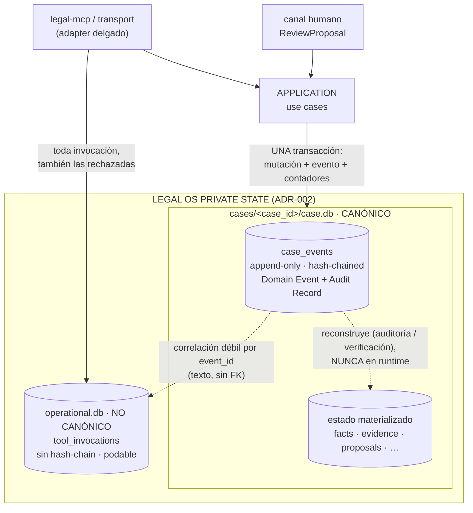

# 09 — Case Event Log y Tool Invocation Log

**Estado:** Technical Design V0. Normado por `00-technical-kernel.md` (kernel v0.4) §8 y por los ADR-001…ADR-006 (Accepted), que **mandan sobre este documento** (kernel §14), **con las enmiendas AC-01 a AC-04 aprobadas por los dueños** (ADR-004 supersedes §16.15 y §16.16; ADR-005 supersedes §16.17, §16.18 y §16.19). Lo que aquí es mío va etiquetado `PROPUESTA DEL TECHNICAL DESIGN` y entra en la lista de aprobaciones (§9). El ADR asociado es `ADR-009-event-and-audit-strategy.md`.

**Qué decide este documento.** Cómo se materializan los **tres conceptos** de registro (Domain/Application Event, Audit Record, Tool Invocation Record) sobre las **dos persistencias** que fija ADR-004 (b), qué contiene exactamente cada entrada, qué garantiza y qué **no** garantiza el hash-chain, y cuál es la política de retención del log operacional. No redefine qué es una mutación (ADR-004 inv. 5, addendum v0.3 B.3), ni la frontera transaccional (`01-system-design.md` §4.1, `03-application-use-cases.md` §0.4), ni el esquema físico (`04-persistence-model.md` §3.5).

**Regla de lectura.** Todos los bloques `interface`, DDL y algoritmos son **PSEUDOCÓDIGO CONCEPTUAL, no código ejecutable**: fijan campos, cardinalidad y locus de cada garantía, no sintaxis.

**Regla de aritmética de revisiones en este documento.** La separación `event_seq` / `case_revision` es la **enmienda AC-02, APROBADA por los dueños** (kernel §5.2; ADR-004 supersede §16.16; ADR-005 supersede §16.19). Este documento **aplica el Modelo B, que es el vigente**: `event_seq` avanza en todo evento; `case_revision` avanza solo en los eventos que mutan el estado epistémico canónico y es **`NULL`** en los demás (`ProposalReviewed`). El **Modelo A** —un solo contador, `seq == case_revision`— queda como **modelo anterior, superado**. Donde una tabla conserva las dos columnas es **por trazabilidad del análisis que justificó la decisión**, nunca porque la elección siga abierta: la columna rotulada *anterior (superado)* no es norma. El esquema no cambia —ya servía a ambos, igual que `04-persistence-model.md` §10 C3—; lo que cambia es qué valores rigen.

---

## 1. Tres conceptos, dos persistencias

### 1.1 Las tres preguntas que hay que poder responder

El kernel §8 nombra tres conceptos. No son tres nombres del mismo objeto: responden tres preguntas distintas y solo dos de ellas comparten respuesta.

| Concepto | Pregunta que responde | Naturaleza | Persistencia |
|---|---|---|---|
| **Domain / Application Event** | ¿Qué le pasó al expediente? | Canónica, irrecuperable | `case.db` → `case_events` |
| **Audit Record** | ¿Quién lo hizo, cuándo, con qué metodología y con qué origen epistémico? | Canónica, irrecuperable | **La misma fila** |
| **Tool Invocation Record** | ¿Cómo se invocó al sistema, incluidas las invocaciones que no produjeron nada? | Operacional, podable | `operational.db` → `tool_invocations` |

La decisión —**dos persistencias, tres conceptos**— es de ADR-004 (b) y el kernel §8 la confirma. Este documento la materializa y justifica la asimetría: los dos primeros conceptos se unifican, el tercero no.

### 1.2 Por qué Domain Event y Audit Record son una sola fila

**DECISIÓN APROBADA (ADR-004 (b)1; alternativa 3 rechazada allí).** Un evento que ya porta `Principal`, `provenance_kind`, payload y hash encadenado **es** el registro de auditoría; no hay ningún dato del registro forense que la fila del evento no tenga.

El argumento que cierra la discusión no es de economía sino de veracidad: **dos streams paralelos crean una pregunta irresoluble el día que divergen.** Si un `audit.log` afirma que la profesional aprobó el item X y el event log no tiene el evento correspondiente, no existe criterio para decidir cuál miente — y en un expediente jurídico "no sabemos cuál de nuestros dos registros es el correcto" es peor que no tener el segundo. Con un solo log canónico, la divergencia no es posible: es la misma fila o no existe.

Consecuencia que se acepta de frente: **el Case Event Log es el registro de auditoría, y su formato es por tanto un contrato**, no un detalle interno. Cambiar la preimagen del hash o la forma del payload no es refactor: es cambio de contrato de auditoría (`01-system-design.md` §7.3).

### 1.3 Por qué el Tool Invocation Record no se une a ellos

Cuatro razones, todas estructurales y no de volumen:

1. **Debe poder registrar lo que el estado canónico no admite.** El test adversarial F18 exige traza de invocaciones con `case_id` inexistente, ids fabricados por el modelo y rutas de path traversal. Una entrada en `case_events` exige un `case_id` real (FK a `cases`) y un evento de la lista cerrada: **registrar precisamente los intentos que el Core rechazó sería imposible dentro del log canónico.** El log operacional existe porque debe poder anotar lo que no pasó.
2. **Registra invocación, no mutación.** ADR-004 inv. 5 es una biyección **mutación↔evento**, no invocación↔evento. Una `QUERY` no muta nada; nueve `get_case_context` seguidos no son nueve hechos del expediente. Meterlos en el log canónico convertiría el historial del caso en el historial del chat, que es exactamente lo que ADR-004 inv. 3 prohíbe.
3. **Es podable, y el canónico no.** La poda de un archivo que contiene la cadena de hashes es una operación sobre el objeto cuya integridad se quiere demostrar. Con dos archivos, podar el operacional **no toca ni un byte** de lo canónico (criterio estructural 6 del vertical slice; ADR-004 inv. 8).
4. **No participa del hash-chain, y no debe parecer que sí.** Si viviera en la misma tabla, alguien acabaría encadenándolo "por coherencia" y el sistema tendría un log de auditoría cuya verificación depende de entradas que otro proceso puede borrar por política de retención.

**Regla dura derivada (ADR-004 inv. 8):** el Tool Invocation Log **jamás** es fuente para reconstruir estado canónico. Si un dato solo existe allí, ese dato **no** es del expediente. Este documento aplica la regla a un caso concreto en §8.4.

### 1.4 Topología



### 1.5 Dónde se escribe cada uno respecto de la transacción

Regla ya fijada por los documentos hermanos; se cita, no se redefine (`01-system-design.md` §4.1; `03-application-use-cases.md` §0.4):

| Registro | Momento | Si falla su escritura |
|---|---|---|
| `case_events` (+ hash) | **Dentro** de la transacción de la mutación | La transacción entera revierte. No hay mutación sin evento |
| Contadores `event_seq` / `case_revision` | **Dentro**, en la misma transacción | Idem |
| `tool_invocations` | **Fuera**, después, por `legal-mcp/transport` | Se pierde traza operacional. **Nunca** aborta ni revierte una transacción canónica |

**Corolario incómodo y declarado:** un fallo del log operacional deja una mutación canónica sin su registro de invocación. Es la asimetría correcta —lo canónico no puede depender de lo podable— pero significa que la correlación `event_id ↔ invocation_id` es **best-effort en un sentido y garantizada en el otro**: todo evento existe con o sin su invocación registrada; no toda invocación registrada tiene evento (la mayoría no lo tiene, porque son lecturas y rechazos).

---

## 2. `CaseEvent` — schema conceptual

### 2.1 Contrato

```ts
// PSEUDOCÓDIGO CONCEPTUAL. Materialización física en 04-persistence-model.md §3.5.
interface CaseEvent {
  // --- identidad y orden ---
  event_id:        Uuid;          // UUIDv7 opaco emitido por el Core (kernel §11)
  case_id:         CaseId;
  event_seq:       number;        // monotónico, contiguo, ≥1 · TODOS los eventos
  case_revision:   number | null; // revisión resultante · null si no muta estado canónico

  // --- qué pasó ---
  event_type:      CaseEventType; // lista CERRADA, §3.1
  payload:         CaseEventPayload; // discriminado por event_type, §3.2

  // --- quién lo hizo (Principal · dimensión OPERACIONAL, kernel §1.1) ---
  principal_id:    string;
  principal_type:  'HUMAN' | 'AI' | 'SYSTEM';
  principal_role:  string;        // rol FUNCIONAL en la organización; v0: 'lawyer' (kernel §1.1)
                                  // NO es el rol procesal (`Case.context_role`). Ver §2.3

  // --- de dónde procede el conocimiento (dimensión EPISTÉMICA, kernel §1.3) ---
  provenance_kind: 'EXTERNAL_SOURCE' | 'AI_DERIVATION' | 'AI_INFERENCE'
                 | 'HUMAN_DECISION'  | 'SYSTEM';

  // --- con qué se produjo (cuando aplique) ---
  methodology_version:     string | null;
  model_id:                string | null;
  knowledge_pack_versions: Record<string, string> | null; // vacío en el slice

  // --- cuándo (informativo, NO ordena: §2.7) ---
  occurred_at:     Iso8601Utc;

  // --- cadena ---
  prev_event_hash: Sha256 | null; // null SOLO en event_seq = 1
  payload_hash:    Sha256;        // H(forma canónica del payload)
  event_hash:      Sha256;        // §4.2
}
```

**Invariantes de tupla que el esquema materializa** (ya en `04-persistence-model.md` §3.5, se citan aquí porque son de auditoría):

- `provenance_kind = 'HUMAN_DECISION' ⇒ principal_type = 'HUMAN'` (kernel §1.4). **Ningún `principal_type = 'AI'` puede producir `HUMAN_DECISION`.**
- `(event_seq = 1) ⇔ (prev_event_hash IS NULL)`: una sola cabeza de cadena.
- `UNIQUE(prev_event_hash)`: la cadena **no se bifurca** — dos eventos no pueden declarar el mismo predecesor.

### 2.2 Los dos contadores: qué mide cada uno

Esta es la separación que el kernel §5.2 fija y que §7 desarrolla: **enmienda AC-02, aprobada**. El esquema ya la admitía; hoy además **rige la semántica**.

| Contador | Qué mide | Alcance | Uso legítimo |
|---|---|---|---|
| `event_seq` | Posición en el registro de lo ocurrido | **Todo** evento del Case | Cursor de delta (`changes_since`), verificación de cadena, ordenación |
| `case_revision` | Reloj del **estado epistémico canónico**: qué sabe el expediente | Solo eventos que lo mutan | `expected_revision`, detección de conflicto, `expected_case_revision` de la autorización |

**Por qué son dos preguntas distintas.** "¿Cuántas cosas han pasado?" y "¿ha cambiado lo que el expediente sabe?" no son la misma pregunta, y colapsarlas obliga a que el mecanismo de concurrencia optimista reaccione a actos que no cambian el conocimiento (§7.3). Bajo el **modelo vigente (Modelo B, enmienda AC-02 aprobada)**, `case_revision` es una **subsecuencia** de `event_seq` y es `null` en los eventos que no mutan conocimiento. Bajo el **modelo anterior (Modelo A, superado)** los dos contadores eran **numéricamente idénticos** y la distinción era puramente conceptual.

**Invariante que vale bajo los dos modelos** —y que por tanto no cambió con la enmienda—: `case_revision`, cuando no es `null`, es **monotónica no decreciente** a lo largo de `event_seq` creciente, y nunca retrocede. `event_seq` es monotónica **estricta** y contigua.

### 2.3 `Principal` ≠ `provenance_kind` — en cada evento, las dos dimensiones

Corrección semántica obligatoria del kernel §1, aplicada aquí sin excepción: el evento porta **quién ejecutó** (`principal_*`) y **cuál es la naturaleza epistémica del origen** (`provenance_kind`). Son ortogonales y no toda combinación es válida (kernel §1.4).

**`principal_role` NO es el rol procesal — corrección de drift.** El kernel §1.1 y `02-domain-model.md` §2.2 (*REFINAMIENTO A SEÑALAR*) separan **dos dimensiones que el corpus previo escribía con la misma palabra**:

| Campo | Dimensión | Dónde vive | v0 |
|---|---|---|---|
| `Principal.principal_role` | Rol **funcional** en la organización | Cabecera de **todo** evento (§2.1) | `'lawyer'` |
| `Case.context_role` | Rol **procesal** del expediente | El `Case` (`02` §3.1), no la cabecera del evento | `'LITIGANT'` |

Colapsarlos —escribir `'lawyer' / LITIGANT` en un solo campo, como hacía una versión anterior de §2.1— obligaría a **duplicar el principal** cuando la misma profesional opere ambos contextos (`02` §2.2). Aquí el defecto sería peor que en cualquier otro documento: `principal_role` entra en la **preimagen del `event_hash`** (§4.2), de modo que el error quedaría **sellado en la cadena** y sería irreparable sin romper la verificación de todo el log.

> **DECISIÓN PENDIENTE — ¿debe `context_role` viajar en la cabecera del evento?**
> **Estado: NO viaja.** La cabecera de §2.1 **no** lleva `context_role` y la preimagen de §4.2 **no** lo incluye. El rol procesal es del `Case`, es constante para todo su historial en v0 (`CaseContextRole = 'LITIGANT'`, `02` §3.1) y se registra **una vez**, en el payload de `CaseCreated` (§3.2).
> **`PROPUESTA DEL TECHNICAL DESIGN` (requiere aprobación explícita, §9):** si en algún momento el rol procesal deja de ser constante por Case —contexto B, o resolución por contexto de trabajo activo (`boundaries.md` §7)—, se añade `context_role` como **campo separado de la cabecera**, nunca como valor alternativo de `principal_role`.
> **Consecuencia que impide tramitarlo como comentario:** añadir un campo a la cabecera **cambia la preimagen del hash**. Exige nueva versión de `DOM` (§4.2, decisión 1) y bump de `chain_spec_version` (§4.2, propuesta aditiva sobre `04` §3.1). No es edición de documentación: es **cambio de contrato de auditoría** (§1.2).

**El corpus previo escribía `actor_type` tomando valores del enum epistémico.** Ese uso queda normalizado (kernel §1.5, supersede §16.13) y **no se reproduce en ningún campo de este documento**: donde el texto histórico ponía el valor epistémico dentro del campo de actor, aquí se escriben **dos** afirmaciones distintas y ambas necesarias — `provenance_kind = HUMAN_DECISION` **y** `principal_type = HUMAN`.

Combinaciones que la superficie V0 puede producir (tomadas de `05-mcp-contract.md` §3.1, que las contrata):

| Evento | `provenance_kind` | `principal_type` |
|---|---|---|
| `CaseCreated` | `SYSTEM` | `SYSTEM` |
| `EvidenceIncorporated` | `EXTERNAL_SOURCE` | `SYSTEM` |
| `DerivedRepresentationGenerated` / `…Failed` | `AI_DERIVATION` | `AI` |
| `FactsProposed`, `ArtifactRegistered` | `AI_INFERENCE` | `AI` |
| `ProposalReviewed` | `HUMAN_DECISION` | `HUMAN` |
| `FactsCommitted` | `HUMAN_DECISION` | `HUMAN` (**desdoblado**, §2.4) |
| `ArtifactMarkedStale` | `SYSTEM` | `SYSTEM` |
| `ProposalPreservedForReconciliation` | `SYSTEM` | `SYSTEM` — **combinación no ejercitada en v0: el evento queda sin productor (enmienda AC-04 aprobada, §3.4, §8.2)** |

**Por qué `SYSTEM` y no `HUMAN` en `CaseCreated` y `EvidenceIncorporated`:** el canal MCP no autentica a nadie. Escribir `HUMAN` sería registrar como hecho auditado algo que el sistema no puede saber — una mentira permanente en el registro que hace las veces de auditoría. La sesión del operador queda en el Tool Invocation Log; el origen declarado del material viaja en `declared_origin`, no en el principal (kernel §1.2).

### 2.4 El desdoblamiento obligatorio del commit

`commit_reviewed_facts` lo invoca el operador (canal no confiable), pero el evento `FactsCommitted` **debe** portar `provenance_kind = HUMAN_DECISION` y, por el invariante del kernel §1.4, `principal_type = HUMAN`. El `Principal` del evento **se copia del registro de autorización / revisión** (`HumanAuthorization`, `ProposalItemReview`), nunca del invocador.

```text
Tool Invocation Log   →  quién INVOCÓ el commit        (sesión del operador)
Case Event Log        →  quién DECIDIÓ el acto epistémico (la profesional que revisó)
```

Sin este desdoblamiento el commit produciría un `HUMAN_DECISION` con principal no humano, violando el invariante. **Son dos preguntas distintas y se responden en dos registros distintos** (`05-mcp-contract.md` §3.2). Es, además, el ejemplo más claro de por qué los dos logs no pueden fusionarse: la respuesta correcta a "¿quién?" **difiere** entre uno y otro para la misma operación.

### 2.5 Qué NO entra nunca en el payload

Lista cerrada de exclusiones, cada una con su fundamento. El esquema no las admite y ninguna es configurable.

| Excluido | Fundamento | Consecuencia si entrara |
|---|---|---|
| Chat crudo y razonamiento intermedio del modelo | ADR-004 inv. 3 | El expediente pasaría a contener el diálogo; "el chat es canal, nunca registro" se vacía |
| Bytes de Sources o de derivaciones | ADR-002; `04` §7.2 | El log duplicaría material bajo custodia fuera del almacén content-addressed |
| Rutas del filesystem, `snapshot_ref`, nombres de tabla | ADR-002 inv. 3; `05` R6 | El log filtraría la topología del private state a cualquier proyección |
| Cualquier secreto, token o `authorization_id` **hacia la superficie** | ADR-005; `05` R6 | Reintroduciría el token portador ya descartado (§2.6, nota) |
| Contenido de otro Case | ADR-003 inv. 10 | Fuga entre expedientes por el camino menos vigilado |
| Números en coma flotante | §4.3 | La forma canónica dejaría de ser determinista y la cadena, verificable |

> **Nota sobre `authorization_id`.** El payload de `ProposalReviewed` **sí** registra la autorización emitida (es el hecho auditable central del acto humano y lleva `authorization_source`, kernel §4). El Case Event Log **no es una superficie del modelo**: lo que está prohibido es que una **respuesta de tool** o una **proyección** exponga `authorization_id` (`05` §6). Invariante derivado y comprobable: `get_case_context(changes_since)` proyecta el log **filtrando** los campos de autorización.

### 2.6 Suficiencia para reconstrucción y no duplicación intra-log

ADR-004 (b)1 exige payload "suficiente para reconstrucción". Dos reglas hacen esa exigencia operativa sin convertir el log en una segunda base de datos:

**Regla S — suficiencia.** El payload de un evento debe contener todo lo necesario para reconstruir la mutación que registra, **por valor** para el contenido que ese evento inmoviliza por primera vez, y **por referencia verificable** `(id, content_hash)` para bytes y para contenido ya inmovilizado por un evento anterior de la misma cadena.

**Regla N — no duplicación intra-log (PROPUESTA DEL TECHNICAL DESIGN).** Un evento posterior **no repite** contenido que un evento anterior de la misma cadena ya fijó: lo referencia por `(id, content_hash)`. Ejemplo concreto: el enunciado fáctico de un `ProposalItem` viaja **una vez**, en el payload de `FactsProposed`; `FactsCommitted` referencia `(proposal_item_id, item_content_hash)` y añade solo lo que nace en el commit (`fact_id`, `link_id[]`, autorización consumida).

Razón: sin la regla N, un caso con varias rondas de propuesta almacenaría el mismo texto tres o cuatro veces en el log **además** de en las tablas materializadas. Con ella, la reconstrucción sigue siendo posible —la referencia se resuelve dentro del propio log— y la verificación gana una propiedad: si el contenido referenciado hubiera sido alterado, el `content_hash` del evento posterior deja de casar, y **el evento posterior denuncia la alteración del anterior** aunque la cadena de hashes se hubiera regenerado sobre él.

**Límite honesto de la reconstrucción.** "Reconstruible" significa que el log contiene la información para reproducir el estado; **no** significa que exista en V0 un reconstructor implementado y probado como camino de operación. Ver §6.2.

### 2.7 `occurred_at` no ordena nada

**Invariante (PROPUESTA DEL TECHNICAL DESIGN):** el orden del Case Event Log lo fija **`event_seq`, jamás `occurred_at`**. Ninguna consulta, proyección, verificación de cadena o delta se ordena por timestamp. `occurred_at` es un dato informativo del registro de auditoría, no un mecanismo.

Razón: el reloj de pared de una máquina personal retrocede (NTP, cambio de zona, suspensión, ajuste manual). Un log ordenado por timestamp se desordenaría silenciosamente; uno ordenado por `event_seq` no puede.

**RIESGO declarado, y no está en este documento resolverlo.** El reloj de pared **sí** es mecanismo en un punto: `HumanAuthorization.expires_at` (kernel §3.1; `06-human-authorization.md` §3). Un reloj atrasado podría hacer aparecer como viva una autorización expirada. La cadena de eventos no protege contra eso, porque no es un problema de integridad del log sino de fuente de tiempo. **DECISIÓN PENDIENTE:** si el Core adopta una guarda de monotonía (rechazar o marcar un evento cuyo `occurred_at` sea anterior al del evento previo más allá de una tolerancia) y con qué efecto. Se declara aquí porque el log es donde la anomalía sería **visible**, no donde se corrige.

---

## 3. Lista cerrada de eventos v0

### 3.1 Tabla normativa

Los tipos son los del kernel §8.1 más `ProposalPreservedForReconciliation`, que está en la lista **cerrada** de ADR-004 (b)1 (Accepted, nivel 1) y que el kernel omite — divergencia resuelta por la **enmienda AC-04** (§8.2; ya declarada en `04-persistence-model.md` §10 C1).

**La columna normativa es la del Modelo B (enmienda AC-02 aprobada).** La del Modelo A se conserva **solo como trazabilidad del modelo anterior superado** (§7.2, §7.5): no es norma y ninguna implementación debe leerla como tal.

| # | `event_type` | Productor (use case) | Unidad de mutación (`03` §0.5) | `case_revision` **Modelo B — VIGENTE (AC-02)** | `case_revision` **Modelo A — anterior (superado)** |
|---|---|---|---|---|---|
| 1 | `CaseCreated` | `CreateCase` | El Case completo | +1 | +1 |
| 2 | `EvidenceIncorporated` | `IngestEvidence` | Source + Evidence + derivaciones creadas en `PENDING` | +1 | +1 |
| 3 | `DerivedRepresentationGenerated` | `GenerateDerivedRepresentation` (interno) | Una derivación `PENDING → READY` | +1 | +1 |
| 4 | `DerivedRepresentationFailed` | `GenerateDerivedRepresentation` (interno) | Una derivación `PENDING → FAILED` | +1 | +1 |
| 5 | `FactsProposed` | `ProposeFacts` | La Proposal completa con todos sus items | +1 (tensión abierta, §7.9) | +1 |
| 6 | `ArtifactRegistered` | `ProposeFacts` (interno, kernel §6) | Un Artifact | +1 (tensión abierta, §7.9) | +1 |
| 7 | `ProposalReviewed` | `ReviewProposal` (**canal humano**) | Todas las decisiones de una sesión + las autorizaciones emitidas | **`NULL`** — avanza `event_seq`, **no** `case_revision` | **+1** |
| 8 | `FactsCommitted` | `CommitReviewedFacts` | El subconjunto commiteado completo | +1 | +1 |
| 9 | `ArtifactMarkedStale` | `EvaluateArtifactStaleness` (paso interno) | Un artifact marcado con una razón nueva | +1 (tensión abierta, §7.9) | +1 |
| 10 | `ProposalPreservedForReconciliation` | **SIN PRODUCTOR EN V0** — **enmienda AC-04 aprobada**, patrón `FactWithdrawn` (§3.4, §8.2; `03` §0.5, `05` §11.2, `06` §5.4) | — | — | — |
| 11 | `FactWithdrawn` | **SIN PRODUCTOR EN V0** (ADR-004 (b)1) | — | — | — |

`event_seq` avanza **+1 en todo evento efectivamente escrito**, sin excepción. Las filas 10 y 11 no se escriben en V0 —ambas están **declaradas sin productor** (§3.4; AC-04 para la 10)—, de modo que en V0 la regla se ejercita sobre los nueve tipos con productor. **Bajo el modelo vigente (Modelo B, AC-02)**, `case_revision` avanza con `event_seq` en ocho de esos nueve y es **`NULL` en `ProposalReviewed`**, de modo que `case_revision` es una **subsecuencia** de `event_seq` (kernel §5.2, §8.1; §7 de este documento). La identidad `seq == case_revision` de ADR-004 (c) queda **superada** (supersede §16.16).

### 3.2 Payload conceptual por evento

```ts
// PSEUDOCÓDIGO CONCEPTUAL — unión discriminada por event_type.
// Regla S (suficiencia) y regla N (no duplicación) de §2.6 aplicadas.

type CaseEventPayload =
  | CaseCreatedP | EvidenceIncorporatedP
  | DerivedRepresentationGeneratedP | DerivedRepresentationFailedP
  | FactsProposedP | ArtifactRegisteredP | ProposalReviewedP
  | FactsCommittedP | ArtifactMarkedStaleP
  | ProposalPreservedForReconciliationP;
  // FactWithdrawnP NO se contrata en V0 — §3.4

interface CaseCreatedP {
  case_id: CaseId;
  natural_labels: string[];          // etiquetas con que la profesional se referirá al caso
  context: 'A';
  context_role: 'LITIGANT';          // rol PROCESAL del Case (`02` §3.1 `Case.context_role`).
                                     // NO es `principal_role` (rol funcional, cabecera §2.1):
                                     // es la ÚNICA vez que el rol procesal entra en el log, y
                                     // entra por el payload, no por la cabecera (§2.3)
}

interface EvidenceIncorporatedP {
  source:   { source_id: Uuid; content_hash: Sha256; byte_size: number; media_type: string };
  evidence: { evidence_id: Uuid };   // rol probatorio del Source en ESTE Case
  ingestion:{ ingestion_id: Uuid; declared_origin: DeclaredOrigin; inbox_ref: string };
                                     // inbox_ref = referencia RESUELTA por el Core, jamás una ruta
  derivations_requested: Array<{     // creadas en PENDING dentro de esta misma mutación (01 §4.1)
    derivation_id: Uuid; kind: 'TRANSCRIPT'|'NORMALIZED_TEXT'|'OCR_TEXT';
    version: number; recipe: { tool: string; version: string; params: Json };
  }>;
  reingestion: boolean;              // true si los bytes ya existían — ver §8.4
}

interface DerivedRepresentationGeneratedP {
  derivation_id: Uuid; source_id: Uuid;
  kind: string; version: number;
  content_hash: Sha256;              // bytes NO: solo su hash
  recipe: { tool: string; version: string; params: Json };
  segment_count: number;             // los segmentos son regenerables (04 §2.6)
}

interface DerivedRepresentationFailedP {
  derivation_id: Uuid; source_id: Uuid;
  kind: string; version: number;
  recipe: { tool: string; version: string; params: Json };
  failure_reason: string;            // código estable, nunca un stack trace (05 §4.3)
}

interface FactsProposedP {
  proposal_id: Uuid;
  base_case_revision: number;        // revisión contra la que se generó
  proposal_content_hash: Sha256;
  items: Array<{
    proposal_item_id: Uuid;          // identidad estable y opaca, NUNCA posicional (ADR-008 inv. 1)
    item_content_hash: Sha256;
    content: {                       // POR VALOR aquí y solo aquí (regla N)
      statement_text: string;
      alleged_only: boolean;
      proposed_links: Array<{
        evidence_id: Uuid;
        // ancla = EvidenceFragment consolidado, forma VIGENTE (07 §3.1; 02 §2.5; 04 §3.3)
        locator_v: 1; anchored_in: 'SOURCE'|'DERIVED_REPRESENTATION';
        anchor_source_id: Uuid;                  // = EvidenceFragment.source_id
        anchor_via_derivation: Uuid | null;      // = EvidenceFragment.derivation_id
        representation_hash: Sha256;             // representación EXACTA leída (antes
                                                 // `anchor_content_hash`; 04 §2.2)
        selectors: Json[];                       // >= 1, ORDENADO — RECUPERACIÓN (antes
                                                 // `selector_kind` + `selector`, uno solo)
        original_locator: Json;                  // CITA — SIEMPRE sobre el ORIGINAL
        polarity: 'SUPPORTS'|'CONTRADICTS'|'CONTEXTUALIZES';
        rationale: string;
      }>;
    };
  }>;
}

interface ArtifactRegisteredP {
  artifact_id: Uuid; type: 'FactAnalysis'; status: 'REGISTERED';
  registered_at_case_revision: number;
  derived_from_proposal_id: Uuid;
  inputs: Array<{ entity_kind: 'SOURCE'|'EVIDENCE'|'DERIVED_REPRESENTATION'|'FACT';
                  entity_id: Uuid; content_hash: Sha256 }>;
  supersedes_artifact_id: Uuid | null;
}

interface ProposalReviewedP {
  proposal_id: Uuid;
  review_session_id: Uuid;           // unidad del acto de revisión (kernel §3.2)
  decisions: Array<{
    proposal_item_id: Uuid;
    item_content_hash: Sha256;       // el contenido EFECTIVAMENTE revisado
    decision: 'APPROVED'|'REJECTED'|'PENDING';
    note: string | null;             // texto de la profesional; nunca se expone al modelo
  }>;
  decisions_summary: { approved: number; rejected: number; pending: number };
  authorizations_issued: Array<{     // una por item APPROVED (kernel §3.2; enmienda AC-01:
                                     // sin `authorized_items[]`, sin `proposal_content_hash`)
    authorization_id: Uuid; proposal_item_id: Uuid;
    expected_case_revision: number;  // ENMIENDA AC-02 (aprobada): la revisión contra la que se
                                     // GENERÓ y se REVISÓ la Proposal — la misma
                                     // `FactsProposed.base_case_revision`, NO la resultante de
                                     // este evento (que no avanza `case_revision`). §7
    authorized_operation: 'COMMIT_FACT';
    authorization_source: 'REAL'|'DEV_STUB';   // marca INDELEBLE (kernel §4)
    expires_at: Iso8601Utc;
  }>;
}

interface FactsCommittedP {
  proposal_id: Uuid;
  expected_revision: number;         // el que trajo la invocación
  committed: Array<{
    proposal_item_id: Uuid; item_content_hash: Sha256;   // referencia (regla N)
    fact_id: Uuid;                   // nace aquí
    status_entry: { status: 'ALLEGED'; seq: number };
    link_ids: Uuid[];                // EvidenceLink ACTIVE creados
    authorization_id: Uuid; review_id: Uuid;             // trazabilidad del acto humano
  }>;
  not_committed: Array<{ proposal_item_id: Uuid; reason: ErrorOrConditionCode }>;
}

interface ArtifactMarkedStaleP {
  artifact_id: Uuid;
  reason: 'NEW_EVIDENCE'|'INPUT_SUPERSEDED'|'METHODOLOGY_CHANGED';
  caused_by_event_id: Uuid;          // el evento de la misma transacción que lo causó
  caused_by_entity: { entity_kind: string; entity_id: Uuid; content_hash: Sha256 } | null;
}

interface ProposalPreservedForReconciliationP {
  proposal_id: Uuid;
  expected_revision: number; current_revision: number;   // los dos lados del conflicto
  attempted_item_ids: Uuid[];
}
```

**Tres decisiones de payload que conviene hacer explícitas:**

- **`FactsCommitted.not_committed[]` va en el payload canónico.** Podría argumentarse que un item no commiteado no es una mutación y no pertenece al log. Se incluye porque el commit **es** todo-o-nada por item pero **parcial por conjunto** (ADR-008 §6; `03` §11.8): sin la lista de excluidos, el evento afirmaría un commit sin decir de qué conjunto se recortó, y la auditoría del acto quedaría incompleta. Es información *sobre la mutación registrada*, no una mutación aparte.
- **`ArtifactMarkedStale.caused_by_event_id`** apunta a un evento de la **misma transacción**, con `event_seq` anterior. Es la única referencia intra-log por `event_id` y existe porque `ANALYSIS_STALE` sin causa identificable no es explicable a la usuaria (`04` §3.4).
- **`EvidenceIncorporated.reingestion`** anticipa el conflicto C4 (§8.4) sin resolverlo: el campo distingue la primera incorporación de una procedencia adicional. Si los dueños eligen la opción que no emite evento, el campo queda constantemente en `false` y se retira en la migración correspondiente.

### 3.3 `ProposalReviewed` es **un** tipo de evento, no tres

**PROPUESTA DEL TECHNICAL DESIGN.** ADR-004 (b)1 escribe `ProposalReviewed(approved/rejected/partial)`. Con revisión **por item** (kernel §2, decisión aprobada), esas tres etiquetas dejan de ser tipos y pasan a ser **una lectura derivada** de `decisions_summary`:

```text
approved  ⟺  rejected = 0 ∧ pending = 0
rejected  ⟺  approved = 0 ∧ pending = 0
partial   ⟺  cualquier otra combinación
```

Razones para no materializarlas como tipos distintos:

1. **Serían tres tipos donde uno basta**, en una lista cuya apertura es cambio de contrato (ADR-004 inv. 6).
2. **La mezcla real no cabe en tres etiquetas.** Una sesión con dos aprobados, uno rechazado y cuatro pendientes no es "approved", ni "rejected", ni exactamente "partial" en el sentido en que ADR-005 usaba la palabra (aprobación de un subconjunto de una decisión en bloque).
3. **Es lo computable, no lo almacenado** — la misma doctrina que elimina `INVALIDATED` (kernel §2.2) y los estados derivados del `Fact` (ADR-003 inv. 6).

Esto **cierra la cuestión abierta D.1 del addendum v0.3** ("`ProposalReviewed(partial)` presupone una decisión no tomada"): la decisión ya se tomó —aprobación parcial **sí**, por item— y la consecuencia sobre el enum de eventos es que la variante no se retira ni se conserva como tipo: **se deriva**. Requiere ratificación porque toca la letra de una lista cerrada Accepted.

### 3.4 Eventos declarados sin productor

| Evento | Estado | Por qué está en la lista | Qué NO se hace |
|---|---|---|---|
| `FactWithdrawn` | En la lista cerrada, **sin productor en v0** (ADR-004 (b)1) | Quitarlo obligaría a reabrir el contrato de eventos al implementar el retiro de hechos, que es funcionalidad previsible | **Su payload NO se contrata aquí.** Contratar la forma de un evento cuyo use case (`WithdrawFact`) no existe sería inventar un contrato sin nada que lo valide |
| `ProposalPreservedForReconciliation` | En la lista cerrada de ADR-004 (b)1, **sin productor en v0 — ENMIENDA AC-04 APROBADA** (§8.2; `03` §0.5, `05` §11.2, `06` §5.4). Ausente del kernel §8.1: la lista de ADR-004 es Accepted y no se reduce sin amendment | Un commit rechazado no muta estado canónico (ADR-005 inv. 6; ADR-008 inv. 7), luego por la biyección de ADR-004 inv. 5 no puede emitir evento. Declararlo sin productor —patrón `FactWithdrawn`— es la única lectura compatible con ambos invariantes, y es lo que AC-04 aprueba: **la preservación es conducta por defecto y estado derivado, no almacenado** | **Su payload sí está contratado** (§3.2), a diferencia de `FactWithdrawn`, porque su use case existe y solo se discutía si escribe. **Ya está decidido:** ningún productor lo emite en v0; **ninguna ruta puede emitirlo** y un test de superficie debe comprobarlo |

**Honestidad de método:** "declarado sin productor" es distinto de "no implementado". El tipo existe en el enum, nadie lo escribe en V0, y un test de superficie puede comprobar que **ninguna ruta lo emite**. Es una declaración verificable, no una intención.

### 3.5 Por qué la lista es cerrada y qué cuesta abrirla

ADR-004 inv. 6: la lista de eventos v0 es cerrada; añadir un tipo es **cambio de contrato**, no extensión silenciosa. Fricción deliberada, con tres consecuencias que ya se han cobrado en el diseño:

- La creación de una `DerivedRepresentation` en `PENDING` **no** tiene evento propio: viaja en el payload de `EvidenceIncorporated`, porque crear un tipo "derivación solicitada" sería abrir la lista (`01` §4.1).
- La procedencia adicional de una reingestión **no** tiene evento propio: es parte del conflicto C4 (§8.4), no una ampliación silenciosa.
- La preservación por conflicto **no puede** resolverse inventando un tipo nuevo: o usa el que ADR-004 ya declara, o no existe (§8.2).

---

## 4. Hash-chain

### 4.1 Los cuatro campos

| Campo | Qué es | Qué protege |
|---|---|---|
| `event_id` | Identidad opaca del evento (UUIDv7) | Que la fila sea referenciable sin depender de su posición |
| `payload_hash` | `SHA-256` de la **forma canónica** del payload | Que el contenido del evento no cambie sin que se note |
| `prev_event_hash` | `event_hash` del evento con `event_seq` inmediatamente anterior | El **orden** y la **no omisión**: cada evento sella a su predecesor |
| `event_hash` | `SHA-256` de la preimagen de §4.2 | La fila completa, cabecera incluida (principal, provenance, contadores) |

`payload_hash` existe **además** de `event_hash` y no es redundante: permite verificar el payload de un evento aislado —y comprobar la referencia `(id, content_hash)` de la regla N— sin recorrer la cadena entera.

### 4.2 Preimagen propuesta

**PROPUESTA DEL TECHNICAL DESIGN.** El kernel §8.1 escribe `event_hash = H(event_id, event_seq, prev_event_hash, payload_hash, …)` y deja los puntos suspensivos sin resolver. Se resuelven así:

```text
SEP = 0x1F  (UNIT SEPARATOR — no puede aparecer en ningún campo; §4.3 lo garantiza)
DOM = "legal-os/case-event/v1"   ← separador de dominio + versión de la preimagen

payload_hash = SHA256( canonical_bytes(payload) )

event_hash = SHA256(
    DOM              SEP  event_id          SEP  case_id      SEP
    dec(event_seq)   SEP  dec_or_nil(case_revision)           SEP
    event_type       SEP  payload_hash                        SEP
    principal_id     SEP  principal_type    SEP  principal_role SEP
    provenance_kind  SEP
    str_or_nil(methodology_version)  SEP  str_or_nil(model_id) SEP
    hash_or_nil(knowledge_pack_versions)                      SEP
    occurred_at      SEP
    hash_or_nil(prev_event_hash)
)
```

Cuatro decisiones con su razón:

1. **Separador de dominio con versión (`DOM`).** Sin él, un digest computado en otro contexto del producto podría reutilizarse como si fuera un `event_hash`. Con él, la preimagen es inequívoca **y su versión queda dentro del hash**: cambiarla produce hashes distintos por construcción, de modo que un cambio de contrato de auditoría no puede pasar inadvertido.
2. **Separador de campo que no puede aparecer en los campos.** Sin separador inyectivo, `("ab","c")` y `("a","bc")` producen la misma preimagen concatenada. Es una debilidad clásica y barata de evitar.
3. **Toda la cabecera entra, no solo el payload.** Si `principal_*` o `provenance_kind` quedaran fuera, se podría reescribir **quién** hizo algo sin romper la cadena — precisamente el dato que hace del evento un registro de auditoría. **`principal_role` entra aquí como rol *funcional* y solo como eso** (§2.3): el rol procesal (`Case.context_role`) **no** forma parte de la preimagen. Añadirlo exigiría nueva versión de `DOM` y bump de `chain_spec_version`; **no es un cambio de comentario, es cambio de contrato de auditoría** (§1.2).
4. **`case_revision` entra aunque sea `null`.** Bajo el modelo vigente (Modelo B, enmienda AC-02 aprobada) hay eventos con `case_revision = null` —`ProposalReviewed`—; si el campo no entrara en la preimagen, podría rellenarse a posteriori sin romper la cadena, borrando la distinción entre los dos contadores.

**PROPUESTA aditiva sobre `04-persistence-model.md` §3.1:** registrar en `cases` un `chain_spec_version` con la versión de preimagen vigente. Sin él, verificar un log antiguo tras un cambio de contrato exigiría **inferir** con qué preimagen se computó. Requiere actualizar `04` si se aprueba; es columna nueva, migración aditiva trivial.

### 4.3 Forma canónica de serialización — **DECISIÓN PENDIENTE que bloquea implementación**

El hash de un payload estructurado **no existe** hasta que existe una regla determinista para convertirlo en bytes. Dos serializaciones distintas del mismo payload producen dos hashes distintos, y entonces la cadena no verifica nada.

Reglas propuestas (**PROPUESTA DEL TECHNICAL DESIGN**), todas necesarias:

```text
1. Codificación UTF-8, normalización Unicode a forma canónica de composición.
2. Claves de objeto ordenadas de forma total y estable (orden de puntos de código).
3. Sin espacios en blanco insignificantes.
4. PROHIBIDOS los números en coma flotante en cualquier payload de evento.
   Todo número es entero decimal sin ceros a la izquierda; toda magnitud fraccionaria
   (p. ej. `confidence`) viaja como cadena o como entero en unidades fijas.
5. Campos ausentes ≠ campos null: la forma canónica los distingue y NUNCA los omite.
6. Prohibido el carácter SEP (0x1F) en cualquier valor de cadena; se rechaza en construcción.
7. Sin dependencia de orden de arrays declarado por el invocador: todo array cuyo orden
   no sea semántico se ordena por su clave de identidad antes de serializar.
```

La regla 4 no es purismo: la representación textual de un flotante varía entre runtimes y versiones, y bastaría para que la verificación de cadena fallara **en una máquina y no en otra** sobre un log íntegro. Un falso positivo de manipulación en un expediente jurídico es un fallo grave.

**POR VERIFICAR (spike de dependencias):** si se adopta una especificación de canonicalización existente o se escribe la del producto, y qué garantiza exactamente el runtime elegido sobre orden de claves y representación numérica. **Ninguna capacidad se da por supuesta aquí.**

### 4.4 Append y verificación

```text
APPEND (dentro de la transacción de la mutación, 01 §4.1)
  1. leer (event_seq, event_hash) del último evento del Case      ← dentro de la tx
  2. event_seq' := event_seq + 1
  3. case_revision' := (el evento muta estado canónico) ? revision + 1 : NULL   ← §7
  4. payload_hash := SHA256(canonical_bytes(payload))
  5. event_hash   := SHA256(preimagen de §4.2, con prev_event_hash = event_hash anterior)
  6. INSERT case_events(...)
  7. UPDATE cases.current_event_seq (+ current_revision si avanzó)
     [+ UPDATE cases.current_event_hash si se aprueba §4.8]

VERIFY (función PURA sobre las filas ordenadas por event_seq — 04 §4, invariante 27)
  para cada fila en orden de event_seq:
    a. event_seq contiguo desde 1, sin huecos                     → si no: RUPTURA(gap)
    b. (event_seq = 1) ⇔ (prev_event_hash = NULL)                 → si no: RUPTURA(head)
    c. prev_event_hash == event_hash de la fila anterior          → si no: RUPTURA(link, seq)
    d. recomputar payload_hash y comparar                         → si no: RUPTURA(payload, seq)
    e. recomputar event_hash y comparar                           → si no: RUPTURA(header, seq)
    f. case_revision monotónica no decreciente donde no es NULL   → si no: RUPTURA(revision)
  además, para toda referencia (id, content_hash) de la regla N:
    g. el content_hash referenciado coincide con el del evento que lo fijó
                                                                  → si no: RUPTURA(reference)
  resultado: OK | RUPTURA(clase, event_seq del punto de ruptura)
```

**La verificación es una función pura del Domain** (`04` §4, invariante 27): se prueba con filas en memoria, sin levantar una base. Se ejecuta en el arranque de un Case, antes de cada migración, sobre la copia de backup (`01` §8.2, `event_chain_intact`) y en el job periódico de integridad. Un fallo **no se repara solo**: degrada el Case a solo lectura y lo dice (kernel §13; `01` §7.4–§7.5).

### 4.5 Qué detecta

| Manipulación | ¿Detectada? | Por qué |
|---|---|---|
| Editar el payload de un evento | **Sí** | `payload_hash` deja de casar (d), y `event_hash` con él |
| Editar el principal o el `provenance_kind` de un evento | **Sí** | Entran en la preimagen (§4.2, decisión 3) |
| Borrar un evento intermedio | **Sí** | Hueco en `event_seq` (a) y ruptura de enlace (c) |
| Reordenar dos eventos | **Sí** | `prev_event_hash` deja de casar (c) |
| Insertar un evento en medio | **Sí** | Colisión de `event_seq` (UNIQUE) y ruptura de enlace |
| Bifurcar la cadena (dos eventos con el mismo predecesor) | **Sí** | `UNIQUE(prev_event_hash)` (`04` §3.5) |
| Rellenar a posteriori un `case_revision` que era `null` | **Sí** | Entra en la preimagen (§4.2, decisión 4) |
| Alterar contenido ya fijado y regenerar solo su evento | **Sí, parcialmente** | Las referencias `(id, content_hash)` de eventos posteriores lo denuncian (g) |

### 4.6 Qué **NO** detecta — honestidad obligatoria

**El hash-chain es TAMPER-EVIDENT, no TAMPER-PROOF.** Detecta modificación, truncamiento y reordenamiento; **no los impide**. Esta frase es normativa (kernel §8.3; ADR-002 Riesgos; ADR-004 inv. 4) y **debe aparecer en toda superficie que hable de integridad**. No se vende seguridad que no existe.

Lo que queda explícitamente fuera del alcance:

1. **Una usuaria hostil con control total de la máquina puede regenerar la cadena completa.** Tiene los mismos bytes, el mismo algoritmo y ninguna clave que le falte: reescribe los eventos que quiera y recomputa `payload_hash`, `event_hash` y `prev_event_hash` desde el punto alterado hasta la cabeza. La verificación pasaría. **Este escenario está FUERA DEL THREAT MODEL V0**, por decisión, y se dice por escrito aquí y en el ADR.
2. **Truncamiento por la cola.** Borrar los últimos *k* eventos deja una cadena internamente válida. Sin un testigo externo de la cabeza no hay forma de saber que faltaban. §4.8 propone una mitigación **parcial y honesta**; el anclaje externo sigue siendo DECISIÓN PENDIENTE (ADR-004).
3. **Manipulación del estado materializado sin tocar el log.** Editar directamente la tabla `facts` **no rompe la cadena**: la cadena sella el log, no las tablas. La divergencia solo se descubre **reconstruyendo** desde el log y comparando — y ese reconstructor no es camino de operación en V0 (§6.2). **RIESGO declarado**: hoy el producto detectaría un log manipulado antes que un estado materializado manipulado.
4. **Nada de esto es criptografía de identidad.** Sin firma, un `event_hash` correcto demuestra consistencia interna del log, **no** que quien lo escribió fuera quien dice el campo `principal_id`. La fuerza probatoria de la autorización humana se apoya en el perímetro del private state (ADR-002) y en esta cadena, con ese límite (ADR-005 §6; ADR-008 Riesgos).
5. **El hallazgo del spike de Cowork lo hace más relevante, no menos.** `ESTADO-Y-HALLAZGOS-CRITICOS.md` §1.1: Cowork no hereda la configuración de Claude Code, no hay deny por ruta, y los servidores MCP locales corren en el host. **HECHO VERIFICADO** contra documentación oficial, con la pregunta B-04 aún INCONCLUSIVE. Consecuencia para este documento: **la protección del log no puede apoyarse en reglas del host; solo en su posición dentro del private state** (ADR-002) y en la evidencia de manipulación que da la cadena. La cadena no cambia con el resultado de B-04; lo que cambia es cuánta defensa en profundidad hay delante de ella.

### 4.7 Lo que deliberadamente no se construye

**DECISIÓN APROBADA (kernel §8.3):** no se construye infraestructura criptográfica corporativa. **Sin firmas digitales, sin HSM, sin anclaje externo obligatorio, sin timestamping de tercero, sin log append-only del sistema operativo.**

No es omisión: es proporción. Cada una de esas piezas exige gestión de claves, un tercero disponible o una dependencia de plataforma, y ninguna resuelve el escenario 1 de §4.6 en el despliegue real de V0 (una máquina personal, una usuaria, sin servidor). Lo que sí queda **abierto y nombrado**, heredado de ADR-004 (Preguntas pendientes): **destino aceptable para anclar periódicamente el hash-cabeza fuera del workspace**. Es la mitigación de mejor relación coste/beneficio contra los escenarios 1 y 2, y sigue siendo **DECISIÓN PENDIENTE de los dueños**.

### 4.8 Testigo de cabeza redundante — PROPUESTA

**PROPUESTA DEL TECHNICAL DESIGN, aditiva sobre `04-persistence-model.md` §3.1.** Guardar en la fila `cases` un `current_event_hash` junto a los contadores que ya guarda (`current_event_seq`, `current_revision`).

- **Qué compra:** un truncamiento por la cola o un `event_seq` recompuesto exige ahora editar **dos** lugares coherentemente. Un desajuste entre `cases.current_event_hash` y la cabeza real es señal inmediata de manipulación o de transacción incompleta.
- **Qué NO compra, y hay que decirlo:** cero protección contra quien edite ambos. Es una **guarda barata contra el error y contra la manipulación descuidada**, no una defensa contra el escenario 1 de §4.6. Presentarla como otra cosa sería exactamente el tipo de promesa que este documento evita.
- **Coste:** una columna y una escritura por transacción que ya está abierta.

### 4.9 Migraciones hash-chain-preserving

Regla ya fijada en `01-system-design.md` §7.3 y que este documento hace exigible sobre el log:

> Una migración puede cambiar la representación física del estado, pero **no puede cambiar los bytes canónicos sobre los que se computó `event_hash`**.

Consecuencias operativas:

1. **Ninguna migración re-normaliza payloads de eventos** como efecto colateral. Si alguna vez hiciera falta, la cadena habría que re-anclarla, y **eso es cambio de contrato de auditoría**: decisión explícita, registrada, con `chain_spec_version` nuevo (§4.2) y con el tramo antiguo conservado y verificable bajo su versión anterior. Jamás una consecuencia silenciosa de un cambio de schema.
2. **Las migraciones no emiten eventos del Case Event Log ni avanzan `case_revision`** (`01` §7.3): no son mutaciones del estado epistémico. Se registran en el log de runtime con `principal_type = SYSTEM` y `provenance_kind = SYSTEM`.
3. **La verificación de cadena es paso obligatorio** antes de migrar (sobre el original) y sobre el backup (`04` §9.2, pasos 1 y 3b). Sin cadena verificada no se migra.

---

## 5. Tool Invocation Log

### 5.1 Schema conceptual

```ts
// operational.db · NO CANÓNICO · PODABLE · SIN hash-chain · SIN FK (04 §2.5)
interface ToolInvocationRecord {
  invocation_id:   Uuid;         // devuelto en el envelope de toda respuesta (05 §4.1)
  occurred_at:     Iso8601Utc;
  tool:            ToolName;     // las 8 de la superficie (kernel §6)
  tool_class:      'QUERY'|'COMMAND'|'PROPOSAL'|'SENSITIVE_COMMAND'|'ADMIN';
  session_ref:     string | null;// sesión del operador, no del acto epistémico (§2.4)
  principal_id:    string;
  principal_type:  'HUMAN'|'AI'|'SYSTEM';
  principal_role:  string;       // rol FUNCIONAL; v0: 'lawyer'. Nunca el rol procesal (§2.3)
  case_ref:        string | null;// referencia DÉBIL: puede ser un id inventado (F18)
  input_hash:      Sha256;       // hash de los inputs — NUNCA los inputs (§5.3)
  outcome:         'ACCEPTED'|'REJECTED'|'ERROR';
  error_code:      ErrorCode | null;   // código semántico estable (03 §0.3, 05 §4.2)
  condition_codes: ConditionCode[];    // catálogo v0 (kernel §10)
  duration_ms:     number;
  event_ref:       string | null;// correlación con case_events.event_id, SIN FK
}
```

Diferencias estructurales frente a `CaseEvent`, todas intencionadas: **sin `event_seq`, sin `prev_event_hash`, sin `event_hash`, sin `provenance_kind`, sin FK.** No es un log de segunda: es un log de **otra cosa**.

**Por qué no lleva `provenance_kind`:** una invocación no tiene naturaleza epistémica. Nada se sabe *a través de* una llamada a tool; se sabe a través del material y de las decisiones que quedan en el log canónico. Poner el campo invitaría a interpretar el log operacional como fuente de conocimiento, que es exactamente lo que ADR-004 inv. 8 prohíbe.

### 5.2 Qué registra — incluidas las invocaciones imposibles

**Toda invocación MCP, sin excepción**, incluidas las `QUERY` y **sobre todo las rechazadas** (`01` §4.1, regla 4). Los tests adversariales exigen traza de intentos que **no produjeron ningún evento**: un log que solo registrara lo que funcionó sería inútil precisamente para lo que más importa.

| Situación | ¿`case_events`? | ¿`tool_invocations`? |
|---|---|---|
| `get_case_context` exitoso | No (no muta) | Sí, `ACCEPTED` |
| `commit_reviewed_facts` sin autorización viva | **No — cero eventos** (ADR-008 inv. 7) | Sí, `REJECTED` + `HUMAN_REVIEW_REQUIRED` |
| Invocación con `case_id` fabricado por el modelo (F18) | **Imposible** — no hay Case | Sí, `REJECTED`, con `case_ref` = el id inventado |
| Intento de path traversal en la referencia de Inbox (F18) | No | Sí, `REJECTED` |
| `ingest_evidence` exitoso | Sí (`EvidenceIncorporated`) | Sí, `ACCEPTED`, con `event_ref` |
| `ReviewProposal` (canal humano) | Sí (`ProposalReviewed`) | **No es invocación MCP.** Ver §5.4 |

### 5.3 Lo que NO guarda, y qué se pierde con ello

**Se guarda `input_hash`, no los inputs.** Fundamento (`04` §3.5): el log registra invocaciones **rechazadas**, incluidas las que traen contenido no incorporado; almacenar sus payloads convertiría un log podable en **un depósito paralelo de material sin custodia**, justo lo que ADR-006 impide. Además, una `query` de `search_case` puede contener datos del cliente, y este archivo es el único que se poda por política.

**RIESGO declarado, sin adornos:** con solo el hash, el diagnóstico postmortem de un rechazo pierde detalle — no se puede ver *qué* se pidió, solo que se pidió lo mismo dos veces. Compensación en V0: `error_code` y `condition_codes` sí se guardan, y son códigos semánticos estables (`05` §4.2), no mensajes. **POR VERIFICAR** (`05` §4.4): si el hash basta para diagnosticar los fallos reales, o si alguna tool requiere retención de inputs bajo política explícita y acotada.

Tampoco guarda: bytes, rutas, stack traces, nombres de tabla ni ids internos no emitidos a la superficie (`05` §4.3).

### 5.4 Correlación

```text
respuesta de tool  ──envelope.invocation_id──▶  tool_invocations.invocation_id
tool_invocations.event_ref  ──texto, sin FK──▶  case_events.event_id
```

Tres precisiones:

- **La correlación es débil por diseño** (`04` §2.5): texto sin FK. Correlaciona, no restringe. Una FK haría imposible registrar las invocaciones inválidas que los tests exigen.
- **Una invocación con *n* eventos.** `ingest_evidence` que además marca dos artifacts produce tres eventos y una invocación. `event_ref` guarda el evento **principal** de la invocación; el resto se recupera del log canónico por transacción/`event_seq` contiguos. **DECISIÓN PENDIENTE menor:** si `event_ref` pasa a ser una lista. La biyección de ADR-004 inv. 5 es mutación↔evento, no invocación↔evento, así que nada del contrato depende de esto.
- **El canal humano no pasa por aquí.** `ReviewProposal` entra por un driving adapter distinto (ADR-005; `03` §14, regla 2) y **no** es una invocación MCP. **DECISIÓN PENDIENTE:** si el canal humano lleva su propio log operacional equivalente. Hoy su acto queda íntegro en el log canónico (`ProposalReviewed`), que es lo que la auditoría necesita; lo que faltaría es la traza operacional del transporte, y el transporte todavía es un spike abierto (ADR-005 §5).

### 5.5 Política de retención — PROPUESTA sobre una DECISIÓN PENDIENTE

ADR-004 deja explícitamente abierta la "política de retención/poda del Tool Invocation Log (horizonte, criterio)". Este documento **no puede cerrarla** —es política de producto— pero sí puede proponer la **forma** de la política, que es lo que evita que se improvise el día que el archivo crezca.

**PROPUESTA DEL TECHNICAL DESIGN — la política tiene dos horizontes y un solo eje:**

| Clase de entrada | Horizonte propuesto | Razón |
|---|---|---|
| `QUERY` con `outcome = ACCEPTED` | **`H_query`** — el más corto | Volumen alto, valor diagnóstico que decae rápido |
| Todo lo demás: `COMMAND`, `PROPOSAL`, `SENSITIVE_COMMAND`, y **cualquier** `REJECTED` / `ERROR` | **`H_full`** — el más largo | Son las entradas que sostienen el diagnóstico de incidentes y la verificación de los tests adversariales |

**Los valores concretos de `H_query` y `H_full` son DECISIÓN PENDIENTE de los dueños.** Cualquier número que escribiera aquí sería **inventado**: no hay uso real medido, y el propio ADR-004 etiqueta como SUPUESTO el fundamento cuantitativo de la separación de logs. Lo que sí es defendible sin medición es la **forma**: dos horizontes, el corto para lecturas exitosas, el largo para todo lo que documenta un rechazo.

### 5.6 Reglas duras de la poda

**PROPUESTA DEL TECHNICAL DESIGN.** Cinco reglas; las tres primeras son las que impiden que "retención" se convierta en "borrado selectivo de trazas incómodas".

1. **La poda es por ANTIGÜEDAD, nunca por contenido.** Prohibido podar por `case_ref`, por `tool`, por `principal_id`, por `outcome` o por cualquier predicado sobre la entrada. Una poda selectiva es un borrado dirigido: el mecanismo que permitiría eliminar la traza de un intento concreto y dejar el resto intacto.
2. **La poda deja marca.** Se registra una marca de agua durable —`pruned_through_at`, `pruned_at`, `rows_removed`, `policy_version`— de modo que **"no hay traza" y "la traza fue podada" sean distinguibles**. Un log podado sin marca es un log que miente por omisión.
3. **La poda es del plano runtime/CLI, jamás de la superficie del modelo.** La clase `ADMIN` está vacía por diseño (ADR-001 inv. 3): no existe tool que pode nada. El modelo no puede borrar su propio rastro porque la capacidad no existe.
4. **La poda nunca ocurre dentro de una transacción de negocio** ni puede abortar una.
5. **La poda no toca `case.db`.** Ni un byte. Es la propiedad que justifica las dos persistencias (§1.3, razón 3).

**PROPUESTA aditiva sobre `04-persistence-model.md` §3.5:** la tabla de marca de agua vive en `operational.db`. Si se aprueba, `04` la incorpora.

### 5.7 Qué debe seguir siendo cierto después de podar

Criterios comprobables, y son la prueba de que la separación de logs está bien hecha (criterio estructural 6 del vertical slice; ADR-004 val. 5):

1. El estado canónico es **idéntico** antes y después.
2. La verificación de cadena da **OK** — la poda no toca la cadena porque la cadena no está allí.
3. **Ninguna mutación canónica pierde su registro**: el registro de una mutación es su evento, que vive en el otro archivo.
4. Ninguna proyección cambia. `get_case_context` no lee `operational.db`.
5. Lo que **sí** se pierde, y se declara: el detalle operacional de invocaciones antiguas —incluidos rechazos adversariales antiguos— y la correlación `invocation_id → event_id` de ese tramo. **Es pérdida aceptada y visible gracias a la marca de agua**, no pérdida silenciosa.

### 5.8 Tests que dependen de este log

| Test | Qué exige del Tool Invocation Log |
|---|---|
| **F18** — ids no emitidos por el Core, path traversal, rutas absolutas, symlinks/junctions | Que la invocación quede registrada **aunque el `case_id` no exista**. Es la razón de que no haya FK y de que la base sea otra (`04` §2.5, razón 2) |
| **AT-002** — el modelo inventa una autorización | Rechazo sin evento canónico, con traza operacional y `HUMAN_REVIEW_REQUIRED` (ADR-008 inv. 7) |
| **AT-003** — segundo commit con autorización consumida | Traza del segundo intento; **cero** eventos nuevos |
| **AT-008** — la revisión cambió | Traza del rechazo; en el log canónico, preservación o nada según §8.2 |
| **Poda** (ADR-004 val. 5) | Tras podar: estado canónico y verificación de cadena intactos; marca de agua presente |

**POR VERIFICAR:** la numeración definitiva `F-xx` / `AT-xxx` y su correspondencia con la matriz de `vertical-slice-v0.md` (ya señalado en ADR-008).

---

## 6. Por qué NO se adopta full event sourcing

### 6.1 La decisión ya está tomada — aquí se materializa

**DECISIÓN APROBADA (ADR-004 (b)3, "decisión anti-moda deliberada"; alternativa 2 rechazada).** El estado vigente se **materializa en tablas**; el Case Event Log aporta **reconstruibilidad y auditoría**, no es el mecanismo de runtime. Este documento no reabre la decisión: fija qué significa exactamente en el diseño de los eventos.

### 6.2 Qué significa "reconstruible" en V0 — y qué no

| Afirmación | ¿Vale en V0? |
|---|---|
| El log contiene información suficiente para reproducir el estado canónico | **Sí**, por la regla S (§2.6). Es una propiedad del **contenido** del log |
| Existe un reconstructor implementado, probado y ejecutado como camino de operación | **NO.** Ninguna operación cotidiana depende de replay (ADR-004 (b)3) |
| Una lectura se sirve reproduciendo eventos | **NO.** Se sirve del estado materializado, con snapshot de lectura único (`03` §0.4, regla 6) |
| Se versionan los esquemas de evento como contrato de lectura, con snapshots y replay | **NO.** Es precisamente la complejidad que la decisión evita |

**Honestidad exigida:** afirmar hoy "el expediente se puede reconstruir desde el log" describe una **propiedad del diseño**, no una **capacidad ejercitada**. Convertirla en capacidad exige escribir y probar el reconstructor. **PROPUESTA DEL TECHNICAL DESIGN:** que el reconstructor exista en V0 **solo como test** —reconstruir el caso sintético desde el log y comparar con el estado materializado—, no como código de operación. Ese test es, además, la única defensa disponible hoy contra el escenario 3 de §4.6 (estado materializado alterado sin tocar el log), y su ausencia deja ese escenario sin detección alguna. **DECISIÓN PENDIENTE:** si entra en el alcance del V0 o se declara POST-V0.

### 6.3 El coste que sí se paga

ADR-004 lo acepta explícitamente y este documento lo cuantifica en forma, no en cifras:

- **Redundancia de almacenamiento.** El contenido de una Proposal vive en `proposal_items` **y** en el payload de `FactsProposed`. La regla N (§2.6) acota la redundancia a **una vez por contenido y por cadena**, no una vez por evento que lo mencione.
- **El payload es contrato.** Cambiar la forma de un payload cambia el `payload_hash` de los eventos futuros y, si se tocaran los pasados, rompería la cadena (§4.9). El precio de la reconstruibilidad es que el payload deja de ser un detalle interno.
- **Ningún beneficio de runtime.** No hay proyección incremental, ni CQRS, ni suscriptores. El log se escribe siempre y se lee casi nunca. Es un coste asumido a cambio de auditoría.

### 6.4 Qué tendría que ocurrir para reconsiderarlo

Disparadores explícitos, para que la reevaluación sea una decisión y no una acumulación:

1. **Necesidad real de estado temporal** ("¿qué sabía el expediente el 3 de marzo?") como funcionalidad de producto, no como curiosidad. Hoy `changes_since` cubre el delta de sesión, que es el caso que existe.
2. **Múltiples consumidores del stream** (proyecciones independientes, sincronización multi-máquina — explícitamente POST-V0, kernel §15).
3. **Divergencia observada entre estado materializado y log** que no se explique por un bug puntual. Sería señal de que la doble escritura no se sostiene.

Mientras ninguno ocurra, **la puerta queda abierta y sin pagar**: el log ya captura payloads suficientes, que es exactamente lo que haría falta el día que se cruce alguno de los tres.

---

## 7. ENMIENDA AC-02 (APROBADA) sobre ADR-004 — ¿debe la revisión humana avanzar `case_revision`? · **RESUELTO: no**

> **ESTADO: APROBADA Y EN VIGOR (enmienda AC-02).** Lo que sigue **ya no es un candidato**: los dueños aprobaron la separación de contadores. **ADR-004 y ADR-005 quedan enmendados** —supersede §16.16 y §16.19— y el kernel §5.2, §7, §8.1 y §9 ya lo recogen. El **Modelo B es el vigente**; el **Modelo A es el modelo anterior, superado**. Se conserva íntegro el análisis de ambos porque es **el registro de por qué se decidió**, no una elección abierta: donde este documento presenta dos columnas, la del Modelo A está rotulada como *anterior (superado)* y **no es norma**.

### 7.1 La pregunta exacta

Cuando la profesional revisa una propuesta y aprueba tres de sus items —**sin commitear todavía**— ¿ha cambiado el estado del expediente en el sentido que mide `case_revision`?

**Respuesta aprobada (AC-02): NO.** De ella dependían —y hoy quedan fijados— el valor de `expected_case_revision` de toda `HumanAuthorization`, la frecuencia de `REVISION_CHANGED` espurios, la aritmética del happy path del vertical slice, la formulación del invariante 5 de ADR-004 y la letra del addendum v0.3 B.2.

### 7.2 Modelo A — el modelo anterior, superado por AC-02

**Fuente (texto histórico, hoy superado):** ADR-004 (c) e inv. 5 (*"cada evento incrementa `CaseRevision`", `seq == revision`*); ADR-004 (b)1 (*"`ReviewProposal(approve)` emite `ProposalReviewed(...)` **y avanza la CaseRevision**"*); ADR-005 inv. 9–10; addendum v0.3 **B.2** puntos 1–4; `vertical-slice-v0.md` pasos 10–11. **Todo ello queda enmendado por AC-02** (supersede §16.16 y §16.19).

```text
[MODELO ANTERIOR — SUPERADO por AC-02. No implementar.]
FactsProposed        → rev N        (…tras ProposeFacts)
ProposalReviewed     → rev N+1      ← el acto de revisión avanzaba el reloj
   HumanAuthorization.expected_case_revision = N+1   (la revisión RESULTANTE del acto)
FactsCommitted       → rev N+2
```

**Argumentos a favor de A, planteados en su versión más fuerte** (se conservan porque son el contrapeso que la decisión tuvo que vencer)**:**

1. **Un solo contador es más simple.** `seq == revision` es una identidad que cualquiera entiende sin leer nada más. Dos contadores son dos cosas que explicar, dos que pueden desincronizarse en el código y dos que un lector puede confundir.
2. **La decisión de revisión es un hecho durable y auditable**, y el sistema debe registrarla en el log append-only. *(Este argumento es correcto y hay que preservarlo — pero no exige avanzar `case_revision`: ver §7.4.)*
3. **"La revisión que la profesional tenía a la vista".** Si el acto de revisión produce una revisión nueva, congelarla en la autorización tiene una lectura natural: la profesional aprobó *después* de que su decisión quedara registrada.
4. **Era lo Accepted.** No cambiar tenía coste cero de documentación y cero riesgo de introducir una inconsistencia nueva en un corpus grande. **Este argumento decayó con la aprobación de AC-02:** el coste documental se asumió explícitamente y está inventariado en §7.7.

### 7.3 Modelo B — **el vigente** (enmienda AC-02 aprobada)

**Fuente:** kernel §5.1–§5.2 (planteado por los dueños en §30, con análisis del Technical Design) — **aprobado como enmienda AC-02**; ADR-004 supersede §16.16, ADR-005 supersede §16.19.

```text
[MODELO VIGENTE — AC-02]
FactsProposed        → event_seq S,   rev N
ProposalReviewed     → event_seq S+1, rev NULL     ← avanza el registro, NO el reloj
   HumanAuthorization.expected_case_revision = N   (la revisión contra la que se generó y se revisó)
FactsCommitted       → event_seq S+2, rev N+1
```

`ProposalReviewed` lleva `case_revision` **nula**: no "repite N", **no la lleva**. La revisión vigente del Case sigue siendo N —la que fijó el último evento canónico— y es contra ese N contra el que el commit compara.

**Argumentos a favor de B (kernel §5.1, reproducidos y desarrollados):**

1. **Semántica del reloj.** `case_revision` es el reloj del *estado epistémico canónico*: qué sabe el expediente. Una decisión de revisión aún no commiteada **no añade hechos, ni evidencia, ni links**: el expediente sabe exactamente lo mismo antes y después. Avanzar el reloj sin cambio de conocimiento **vacía de significado al reloj** — y con él, a `expected_revision`, que es el mecanismo entero de concurrencia optimista.
2. **Conflictos espurios.** Con A, revisar la propuesta P-1 invalida cualquier análisis en vuelo generado contra la revisión anterior, **aunque no tenga ninguna relación con P-1**. Es exactamente el falso conflicto que ADR-004 declara como riesgo de granularidad y que ADR-008 hereda como riesgo propio.
3. **Circularidad ya detectada y ya corregida una vez.** Con A, `expected_case_revision` era *la revisión resultante del propio acto de revisión*: la autorización se vinculaba a un número que ella misma causó. Esa definición circular ya obligó a la corrección del addendum B.2. Con B desaparece: la propuesta se genera contra N, se revisa contra N, y el commit exige que el caso siga en N. Limpio, y **verificable con una sola comparación**.
4. **Efecto compuesto con la aprobación por item.** Con autorización por item (kernel §3.2, decisión aprobada), una sesión de revisión emite *k* autorizaciones. Bajo A todas congelan N+1, la revisión que el propio acto creó; bajo B todas congelan N, la revisión del material que la profesional efectivamente leyó. La segunda es la que corresponde a la frase "la revisión que tenía a la vista".

### 7.4 La decisión aprobada: separar los dos contadores

**ENMIENDA AC-02, APROBADA (kernel §5.2), literal:**

```text
event_seq       monotónico, +1 en TODO evento del Case Event Log
case_revision   monotónico, +1 SOLO en eventos que mutan el estado epistémico canónico
```

Cada evento registra **ambos**. Los eventos de decisión (`ProposalReviewed`) avanzan `event_seq` y llevan `case_revision` **nula**. Los eventos de mutación canónica (`EvidenceIncorporated`, `FactsCommitted`, …) avanzan ambos. *(La preservación por conflicto no aparece aquí porque, por la **enmienda AC-04**, no se emite en v0: §3.4, §8.2.)*

**Qué conserva del Modelo A:** la auditoría completa. El argumento 2 de §7.2 se satisface **íntegramente** — la decisión de revisión sigue en el log append-only, con principal humano identificado, `event_seq` propio, hash encadenado y payload completo. Lo único que deja de ocurrir es que el contador de conocimiento se mueva.

**Reformulación del invariante 5 de ADR-004 que la enmienda impone (ya en vigor):** la biyección **mutación↔evento** se expresa sobre `event_seq` —toda mutación registrada produce exactamente un evento y todo evento corresponde a exactamente una mutación—, con `case_revision` como **subsecuencia** de esa serie: la de las mutaciones que además cambian el estado epistémico canónico. La frase de ADR-004 "`seq == CaseRevision` resultante" **deja de valer como identidad** y pasa a valer como **inclusión** (supersede §16.16).

**Efecto colateral positivo, ya aprovechado por los documentos hermanos:** con dos contadores, el cursor del delta debe ser `event_seq` y no `case_revision` (`03` §0.7; kernel §9, que ya lleva `event_seq` como ancla del delta), porque de otro modo **las decisiones de la profesional serían invisibles en `changes_since`** — el peor resultado posible para un producto cuyo eje es la autoridad humana.

### 7.5 Traza comparada — la misma sesión bajo el modelo vigente y bajo el anterior

Secuencia: crear caso, incorporar un audio, transcribirlo, proponer 3 hechos, revisar (2 aprobados, 1 rechazado), commitear. **La columna que rige es la del Modelo B.**

| Acto | Evento | `event_seq` | `case_revision` **B — VIGENTE** | `case_revision` **A — anterior (superado)** |
|---|---|---|---|---|
| `create_case` | `CaseCreated` | 1 | 1 | 1 |
| `ingest_evidence` | `EvidenceIncorporated` | 2 | 2 | 2 |
| derivación interna | `DerivedRepresentationGenerated` | 3 | 3 | 3 |
| `propose_facts` | `FactsProposed` | 4 | 4 | 4 |
| `propose_facts` (interno) | `ArtifactRegistered` | 5 | 5 | 5 |
| **revisión humana** | `ProposalReviewed` | **6** | **`NULL`** — el Case sigue en revisión **5** | **6** |
| — | `HumanAuthorization.expected_case_revision` | — | **5** | **6** |
| `commit_reviewed_facts` | `FactsCommitted` | 7 | 6 | 7 |

**Dónde se ve la diferencia que importa.** Insértese, entre la revisión y el commit, una incorporación de evidencia **no relacionada** (otro documento del mismo caso):

| Acto intercalado | `event_seq` | `case_revision` **B — VIGENTE** | `case_revision` A (superado) | Efecto sobre el commit pendiente |
|---|---|---|---|---|
| `ingest_evidence` (no relacionada) | 7 | 6 | 7 | **`REVISION_CHANGED` en AMBOS modelos** |

Es el punto honesto que hay que decir, y sigue valiendo tras la aprobación: **el Modelo B no elimina los conflictos espurios**, porque `case_revision` sigue siendo un contador **por Case** y cualquier incorporación no relacionada los produce (ADR-004, riesgo de granularidad; ADR-008, riesgo heredado). Lo que B elimina es **una clase concreta y evitable** de ellos: los que causa el propio acto de revisión sobre análisis ajenos. El camino declarado para el resto sigue siendo el mismo —revisiones por agregado antes que cualquier locking— y **no se diseña aquí**.

### 7.6 Impacto sobre el addendum v0.3 B.2

El addendum v0.3 §B.2 es una corrección normativa de cuatro puntos. **Con AC-02 aprobada, así queda** (no es hipótesis: es la letra en vigor):

| Punto de B.2 | Texto anterior (resumido) | Con AC-02 aprobada — **EN VIGOR** |
|---|---|---|
| **1** | `ReviewProposal(approve)` emite `ProposalReviewed(approved)` **y avanza la CaseRevision**; en ese mismo acto se crea la `HumanAuthorization` | **ENMENDADO en su segunda mitad.** Se conserva íntegro el momento de emisión —el evento se emite en el acto de revisión, que era el problema real que B.2 resolvía— y **decae** "y avanza la CaseRevision": el evento lleva `case_revision` **nula** |
| **2** | `commit_reviewed_facts` emite `FactsCommitted` y avanza la revisión de nuevo; son **dos eventos en dos revisiones distintas** | **PARCIALMENTE ENMENDADO.** Siguen siendo dos eventos; son **una sola revisión de conocimiento**, con dos `event_seq` distintos |
| **3** | `expected_case_revision` = la revisión **resultante** del acto de revisión | **SIMPLIFICADO.** Es la revisión **contra la que se generó y se revisó** la propuesta. **La semántica aprobada —"la revisión que la profesional tenía a la vista al aprobar"— se conserva LITERALMENTE**; lo que decae es la definición circular (ADR-005 supersede §16.19) |
| **4** | Recalcular los ejemplos numéricos del glosario §10 y §12 (si `FactsProposed` deja el Case en 14, `ProposalReviewed` lo deja en 15 y la autorización porta 15) | **RECALCULADOS OTRA VEZ**: `FactsProposed` deja 14, `ProposalReviewed` **no mueve el contador** (lleva `case_revision` nula y el Case sigue en 14), la autorización porta **14** |

**Lo que B.2 resolvió y la enmienda NO toca:** el desacuerdo sobre **cuándo** se emite `ProposalReviewed` (ADR-005 lo emitía en el commit; slice y glosario, en el acto de revisión). B.2 fijó el acto de revisión y **eso sigue en pie**. AC-02 enmienda la aritmética, no el momento.

### 7.7 Qué cambia exactamente — consecuencias de AC-02, **en vigor**

La enmienda está aprobada, de modo que la primera columna **no es una hipótesis: es lo que rige**. La segunda se conserva como registro de la rama que se descartó.

| Elemento | Consecuencia **EN VIGOR** (B aprobado, AC-02) | Rama descartada (confirmar A) |
|---|---|---|
| ADR-004 (c) e inv. 5 | **ENMENDADO** (supersede §16.16): `seq == revision` deja de ser identidad; biyección sobre `event_seq`, `case_revision` como subsecuencia | Sin cambios |
| ADR-004 (b)1, "momento de emisión" | **ENMENDADO**: decae "y avanza la CaseRevision"; el momento se conserva | Sin cambios |
| ADR-005 §1, §4, inv. 9 y 10 | **ENMENDADO** (supersede §16.19): `expected_case_revision` = la revisión contra la que se generó y se revisó la Proposal | Sin cambios |
| Addendum v0.3 B.2 | Puntos 1, 2 y 4 enmendados; punto 3 simplificado (§7.6) | Sin cambios |
| `vertical-slice-v0.md` pasos 10–11, test F7 | **Renumerar la aritmética** — pendiente de aplicar en ese documento | Sin cambios |
| Kernel §7 (tabla de use cases) | **Correcto y ya actualizado**: `ReviewProposal → no avanza case_revision` (AC-02) | Habría debido corregirse |
| `case_events.case_revision` | **`NULL` en `ProposalReviewed`**; el índice parcial de `changes_since` (`04` §5) es efectivamente parcial | Nunca `NULL` |
| Preimagen del hash (§4.2) | Sin cambios — `case_revision` ya entra, `null` incluido | Sin cambios |
| Cursor de `changes_since` | **Obligatoriamente `event_seq`** (`03` §0.7; kernel §9) | Cualquiera de los dos |
| `01-system-design.md` §4.2–§4.3, §9.2 | La columna "Modelo B" pasa a ser la tabla vigente — **normalización pendiente en ese documento** | La columna "Modelo B" se eliminaría |
| `03-application-use-cases.md` §10.10, §11.6, §0.7 | Deben quedar con los valores del Modelo B — **normalización pendiente en ese documento** | Habrían debido invertirse |
| `04-persistence-model.md` §3.5 | Sin cambios (ya era neutral y admite `NULL`) | Sin cambios |
| Este documento (§3.1, §7) | **APLICADO:** los valores vigentes son los del Modelo B; la columna "Modelo A" se conserva rotulada como *anterior (superado)*, por trazabilidad | La columna "Modelo B" se eliminaría |
| ADR-008 | **Neutral**: sus cinco condiciones y once invariantes valen igual bajo ambos | Neutral |
| ADR-009 | Su decisión 5 **queda vigente y pasa de propuesta a consecuencia de una enmienda aprobada** | Su decisión 5 decaería; el resto del ADR **no** depende de ella |

### 7.8 Opción C, y por qué quedó descartada

**Opción C:** separar los dos contadores **pero** mantener que `ProposalReviewed` avanza `case_revision`.

**Descartada, y la aprobación de AC-02 la cierra definitivamente:** sería introducir la distinción y **no usarla justamente donde nació**. Todo el coste conceptual de dos contadores, ninguno de sus beneficios en el caso que motivó la pregunta. Se registra porque es una opción real que alguien puede volver a proponer, no porque se recomiende.

### 7.9 Lo que la enmienda AC-02 NO resuelve — sigue abierto y hay que decidirlo aparte

**Tensión interna del kernel, ya detectada en `03-application-use-cases.md` §13.4.** El criterio de §5.2 —`case_revision` avanza "SOLO en eventos que mutan el estado epistémico canónico"— y la tabla del kernel §7 no son consistentes entre sí:

- Por el criterio, `FactsProposed` **no** debería avanzar `case_revision`: una propuesta no añade hechos, evidencia ni links. Es literalmente el mismo argumento con que se saca `ProposalReviewed` del contador.
- La tabla §7, en cambio, dice que `ProposeFacts` **sí** avanza `case_revision` (y +2 contando `ArtifactRegistered`).

**Consecuencia observable, que la aprobación de AC-02 no elimina:**

```text
Propose P1  (N → N+2)   →   Review P1 (expected = N+2)
Propose P2  (N+2 → N+4)  →   Commit P1  ⇒  REVISION_CHANGED
```

Proponer una segunda propuesta invalida la autorización ya obtenida para la primera: **el mismo conflicto espurio, reintroducido por otra puerta.** La misma pregunta alcanza a `ArtifactRegistered` y `ArtifactMarkedStale`, que son estado de **trabajo** (un análisis, su obsolescencia), no conocimiento sobre el mundo.

**DECISIÓN PENDIENTE de los dueños, y sigue pendiente tras AC-02.** Se pedía decidirla junto con el amendment; no se hizo, de modo que **hoy está en vigor la mitad del beneficio**: `ProposalReviewed` ya no mueve el reloj, pero `FactsProposed`, `ArtifactRegistered` y `ArtifactMarkedStale` sí. Opciones: (A) mantener el kernel §7 literal y aceptar el conflicto, mitigado por `changes_since` y la reconciliación humana — **es lo vigente por defecto, porque AC-02 no lo tocó**; (B) aplicar el criterio §5.2 con consistencia a los tres. **Este documento no elige**: por eso su tabla §3.1 marca esas tres filas como "tensión abierta, §7.9" dentro de la columna vigente.

### 7.10 Estado de la enmienda, y la normalización cruzada que queda por hacer

**La enmienda AC-02 está APROBADA y este documento la aplica.** ADR-004 y ADR-005 quedan enmendados (supersede §16.16 y §16.19) y el kernel §5.2, §7, §8.1 y §9 ya la recogen. Lo que este documento cambia por su cuenta sigue siendo nada: **acata una decisión de los dueños**, no la toma.

**Lo que queda, y hay que señalarlo porque afecta a la coherencia del corpus técnico:** los documentos hermanos fueron escritos bajo el régimen anterior y **no todos están aún normalizados**.

| Documento | Qué aplicaba bajo el régimen anterior | Estado tras AC-02 |
|---|---|---|
| `01-system-design.md` §4.2–§4.3, §9.2 | **Modelo A**, por precedencia, con columna explícita del Modelo B | **Debe quedar con los valores del Modelo B.** POR VERIFICAR: si ya se normalizó |
| `03-application-use-cases.md` §0.5, §0.7, §10.6, §10.9, §10.10, §13.1 | **Modelo A**, por precedencia, con columna explícita del Modelo B | **Debe quedar con los valores del Modelo B.** POR VERIFICAR: si ya se normalizó |
| `04-persistence-model.md` §10 C3 | **Ninguno**: esquema neutral | Sin cambio de esquema: ya admite `case_revision` nula |
| `06-human-authorization.md` §1.2 | Ambos, "dos modelos vivos" | **Un solo modelo vivo**: el B. `expected_case_revision` = la revisión contra la que se generó y se revisó la Proposal |
| ADR-008, pregunta 1 | **Neutral** por construcción | **Resuelta** por AC-02; ADR-008 sigue siendo neutral en su contenido |
| Este documento | **Ninguno**: dos columnas | **Modelo B aplicado**; la columna A se conserva rotulada como *anterior (superado)* |

Ninguno ocultó el conflicto mientras duró. Hubo un tramo en que `01` y `03` **numeraban los mismos pasos con valores distintos** —cada uno siguiendo una regla defendible: precedencia el primero, kernel §7 el segundo, cuando el kernel aplicaba el candidato que él mismo declaraba no aprobado—. **Lo que el episodio deja probado sigue vigente:** una decisión aplazada se filtra como aritmética divergente entre hermanos. **Consecuencia de método, ya no una recomendación:** decidida la enmienda, la normalización cruzada es ahora **trabajo obligatorio y acotado**, y §7.9 sigue abierta — decidirla después tendrá el mismo coste de renumeración que acaba de pagarse.

---

## 8. Conflictos y divergencias registradas

### 8.1 RESUELTO — enmienda AC-02 aprobada: aritmética de revisiones

Desarrollado íntegramente en **§7**. Se conserva aquí el registro completo del conflicto **porque es la memoria de por qué se decidió**, con su desenlace añadido.

- **ADRs afectados:** ADR-004 (c), (b)1 e inv. 5; ADR-005 §1, §4, inv. 9–10. También addendum v0.3 B.2 y `vertical-slice-v0.md` pasos 10–11.
- **Hecho que abrió el conflicto:** kernel §5.2 propuso dos contadores y declaró que **no se aplicaba** hasta aprobación de los dueños.
- **Evidencia que se registró entonces:** kernel §5.1–§5.2 y §7 frente a ADR-004 (b)1 y ADR-005 inv. 9–10. Una versión anterior del kernel se contradecía a sí misma —§5.2 decía "no se aplica" y §7, §8.1 y §9 ya aplicaban el candidato—; el kernel v0.4 lo corrigió imponiendo el Modelo A mientras la decisión estuviera pendiente.
- **DESENLACE — los dueños aprobaron la enmienda AC-02.** El **Modelo B es el vigente**: `event_seq` avanza en todo evento; `case_revision` avanza solo en los eventos que mutan el estado epistémico canónico y es **`NULL` en `ProposalReviewed`**; `expected_case_revision` es la revisión **contra la que se generó y se revisó** la Proposal, con lo que **desaparece la circularidad**. ADR-004 (supersede §16.16) y ADR-005 (supersede §16.19) quedan enmendados; el kernel §5.2, §7, §8.1 y §9 ya lo recogen. El **Modelo A queda superado**.
- **Impacto:** §7.7, tabla completa — ahora leída como consecuencias **en vigor**, no como ramas hipotéticas.
- **Opciones que hubo:** aprobar B (§7.3) — **la elegida** · confirmar A (§7.2) — descartada · opción C (§7.8) — descartada.
- **Lo que hace este documento:** **aplicar el Modelo B**. Conserva la columna del Modelo A rotulada como *anterior (superado)* por trazabilidad, no como alternativa viva.
- **Lo que este desenlace NO cierra:** §7.9 (si `FactsProposed`, `ArtifactRegistered` y `ArtifactMarkedStale` deben quedar también fuera del contador) sigue siendo **DECISIÓN PENDIENTE**.

### 8.2 RESUELTO — enmienda AC-04 aprobada: `ProposalPreservedForReconciliation`

- **ADR afectado:** **ADR-004** (b)1 (lista **cerrada** de eventos v0, que **incluye** `ProposalPreservedForReconciliation`) e inv. 7 (rechazo + preservación); ADR-005 §3; `vertical-slice-v0.md`.
- **Hecho que abrió el conflicto:** el kernel §8.1 declara la lista cerrada de eventos v0 y **omite** ese tipo. Además, kernel §2.2 establece que lo computable no se almacena, y §2 elimina el estado agregado de la Proposal.
- **Evidencia que se registró entonces:** ADR-004 (b)1 lo enumera; kernel §8.1 enumera nueve tipos más `FactWithdrawn` sin él. Una versión de `03-application-use-cases.md` (§11.6, §11.9) **sí** lo emitía y almacenaba un marcador de preservación; `04-persistence-model.md` §2 **no** añade columna de estado a `proposals` pero **sí** admite el tipo en el `CHECK`. Hubo por tanto **divergencia entre documentos hermanos** sobre si el marcador se persiste.
- **DESENLACE — los dueños aprobaron la enmienda AC-04.** El tipo **permanece en la lista cerrada de ADR-004 y queda SIN PRODUCTOR en v0**, por el mismo patrón que `FactWithdrawn` (supersede §16.15). **La preservación es la conducta por defecto y su estado es derivado, no almacenado**: no hay marcador que persistir y, por tanto, no hay mutación que registrar. Emitir un evento por un commit *rechazado* registraría en el log canónico algo que no mutó nada, contra ADR-005 inv. 6 y contra la biyección de ADR-004 inv. 5. **Ninguna ruta de v0 lo emite, y un test de superficie debe comprobarlo** (§3.4).
- **Impacto propio de este documento:** determina si el evento tiene productor y si su emisión respeta la biyección de ADR-004 inv. 5. Si el marcador **no** se persiste, el evento no corresponde a ninguna mutación del estado materializado, y la biyección solo se sostiene bajo la lectura de que **el propio asiento en el log es el registro canónico de la preservación**. Esa lectura era defendible pero debía decidirse, no asumirse — era la misma clase de pregunta que §7 planteó para `ProposalReviewed`. **AC-04 la decidió por la vía más simple: sin productor, no hay evento y no hay nada que reconciliar con la biyección.**
- **Opciones que hubo** (se conservan porque son el análisis que sostuvo la decisión):
  1. **Persistir un marcador mínimo de preservación** (un flag en `proposals`) ⇒ hay mutación, hay evento, la biyección se sostiene literalmente. Exigía columna aditiva en `04` §3.4. **Descartada por AC-04**: la preservación no es un cambio de estado, luego el marcador almacenaría lo computable (kernel §2.2).
  2. **Conservar el evento en la lista, declarado sin productor en v0** —el mismo patrón que `FactWithdrawn`— y tratar la preservación como rótulo derivado. Era la recomendación de `04` §10 C1 (opción 3) y de ADR-008 (pregunta 2). **ES LA APROBADA (AC-04).**
  3. Mantener el evento y **no** persistir marcador ⇒ evento sin mutación materializada; exigía reformular la biyección. **Descartada**: registraría en el log canónico un acto que no mutó nada.
- **Lo que hace este documento:** admite el tipo en la lista cerrada (§3.1), porque **ADR-004 es Accepted y omitirlo sería contradecir un nivel superior**, contrata su payload (§3.2) y **acata la opción 2, hoy aprobada**, igual que sus hermanos (`03` §0.5 y §11.6, `05` §11.2 y §12, `06` §5.4): el evento **queda sin productor en v0**, patrón `FactWithdrawn`, y la preservación se observa como rótulo derivado. Razón que la decisión hizo suya: es la única opción compatible a la vez con "cero mutaciones" del rechazo (ADR-005 inv. 6; ADR-008 inv. 7) y con la biyección de ADR-004 inv. 5, y **no depende del modelo de reloj** — sin evento no hay contador que avanzar. **Ya no es DECISIÓN PENDIENTE:** la pendiente 3 de ADR-009 queda resuelta por AC-04.

### 8.3 Divergencia — ninguna política del Product Floor cubre la inmutabilidad de la auditoría

- **Dónde:** kernel §12 propone cinco políticas **sin** la de auditoría y la señala como "sexta candidata natural"; el anexo de `principles.md` lista cinco **incluyendo** *"La auditoría (Case Event Log) no es desactivable ni editable por configuración"*. Ya registrado en `01-system-design.md` §9.3.
- **Por qué importa en este documento, y más que en ningún otro:** este documento describe el registro que **es** la auditoría. Por precedencia gana el kernel, y el resultado es que **hoy ninguna política del piso protege el objeto que este documento diseña**. La protección existe en el esquema (append-only, trigger `RAISE(ABORT)` incondicional, hash-chain) pero **no como política del Product Floor**, que es el nivel donde se declara lo que la configuración no puede relajar.
- **DECISIÓN PENDIENTE de los dueños:** si entra como **PF-006**. Forma propuesta, con el formato exigido del kernel §12:

  > **PF-006 — El Case Event Log no es desactivable, editable ni podable por configuración.**
  > Riesgo que previene: que una organización silencie o recorte el registro que hace verificable todo lo demás.
  > Enforced in: Infrastructure (append-only + trigger incondicional) + Application (el evento se escribe en la misma transacción que la mutación) + Configuration (validación: no existe clave que lo desactive).
  > Configuration may relax? **NO.**
  > How tested: configuración que intenta desactivar o filtrar la auditoría ⇒ rechazo en carga; `UPDATE`/`DELETE` sobre `case_events` ⇒ abort; poda del log operacional ⇒ cadena intacta (§5.7).

  **Se propone, no se declara vigente.** El kernel pidió exactamente cinco políticas.

### 8.4 Divergencia — procedencia adicional en la reingestión (C4)

Registrada en `04-persistence-model.md` §10 C4 y en `03-application-use-cases.md` §15 (decisión 11). Se recoge aquí porque **la opción que se elija define si existe o no un evento**.

- **El nudo:** el vertical slice fija dos cosas que juntas no cierran — *"mismos bytes con procedencia declarada distinta ⇒ se registra la procedencia adicional"* (adversarial 5, ADR-006 inv. 7) y, para el reintento, *"respuesta idéntica; sin evento nuevo"*.
- **Desde este documento:** registrar la procedencia adicional **es** un cambio de estado canónico (custodia relevante), y por la biyección exige exactamente un evento. La lista cerrada no tiene ninguno específico para "procedencia adicional", y crearlo sería abrir la lista (ADR-004 inv. 6).
- **Opción rechazada desde aquí, con fundamento propio:** registrar la procedencia adicional **solo** en el Tool Invocation Log. Viola ADR-004 inv. 8 —el log operacional nunca es fuente de estado canónico— y, peor, **la poda (§5.6) destruiría la custodia de una procedencia declarada**. Es exactamente el caso que la regla dura de §1.3 existe para impedir.
- **Recomendación coherente con este documento:** reintento **estrictamente idéntico** (mismos bytes **y** misma procedencia) ⇒ ninguna fila, ningún evento, respuesta idéntica; **mismos bytes con procedencia distinta** ⇒ fila nueva en `source_ingestions` **+ un evento `EvidenceIncorporated`** con `reingestion: true` (§3.2), sin Source ni Evidence nuevos. Reutiliza un tipo existente y no abre la lista. **DECISIÓN PENDIENTE de los dueños.**

### 8.5 Divergencia menor — `ProposalReviewed(approved/rejected/partial)`

ADR-004 (b)1 escribe tres variantes; el addendum v0.3 §D.1 ya señaló que la variante `partial` presuponía una decisión no tomada. La decisión **ya se tomó** (aprobación parcial por item, kernel §2). **Este documento propone que sea un solo tipo con las variantes derivadas de `decisions_summary`** (§3.3). Es cambio de letra sobre una lista cerrada Accepted: **requiere ratificación**.

---

## 9. Decisiones de este documento que requieren aprobación

| # | Decisión | Sección | Etiqueta | Coste de no aprobarla |
|---|---|---|---|---|
| 1 | Preimagen completa del `event_hash` (separador de dominio versionado, separador de campo inyectivo, cabecera completa, `case_revision` incluido aunque sea `null`) | §4.2 | PROPUESTA DEL TECHNICAL DESIGN | El kernel deja la preimagen con puntos suspensivos; sin cerrarla no hay cadena verificable |
| 2 | `chain_spec_version` en `cases` (aditivo sobre `04` §3.1) | §4.2 | PROPUESTA | Verificar un log antiguo tras un cambio de contrato exigiría **inferir** la preimagen |
| 3 | Reglas de forma canónica de serialización, incluida la **prohibición de coma flotante** en payloads | §4.3 | PROPUESTA + **POR VERIFICAR** | Falsos positivos de manipulación entre runtimes sobre un log íntegro |
| 4 | Regla N — no duplicación intra-log, con referencia `(id, content_hash)` | §2.6 | PROPUESTA | El log almacena el mismo contenido tantas veces como eventos lo mencionen |
| 5 | `occurred_at` no ordena nada; el orden lo fija `event_seq` | §2.7 | PROPUESTA | Un reloj que retrocede desordena el log en silencio |
| 6 | `current_event_hash` en `cases` como testigo de cabeza redundante (aditivo sobre `04` §3.1) | §4.8 | PROPUESTA | El truncamiento por la cola queda sin ninguna guarda barata |
| 7 | `ProposalReviewed` como **un** tipo, con `approved/rejected/partial` derivados | §3.3 | PROPUESTA (ratificación de letra Accepted) | Tres tipos donde uno basta, en una lista cuya apertura es cambio de contrato |
| 8 | Forma de la política de retención: dos horizontes, eje único de antigüedad | §5.5 | PROPUESTA | La política se improvisa el día que el archivo crezca |
| 9 | Valores de `H_query` y `H_full` | §5.5 | **DECISIÓN PENDIENTE** (heredada de ADR-004) | Cualquier número escrito hoy sería inventado |
| 10 | Cinco reglas duras de la poda, incluida la marca de agua durable | §5.6 | PROPUESTA | "Retención" puede convertirse en borrado selectivo de trazas incómodas |
| 11 | El payload de `FactWithdrawn` **no se contrata** en V0 | §3.4 | PROPUESTA | Se contrata la forma de un evento que nada valida |
| 12 | Reconstructor **solo como test** en V0 (o POST-V0) | §6.2 | **DECISIÓN PENDIENTE** | El escenario "estado materializado alterado sin tocar el log" queda sin detección |
| 13 | Guarda de monotonía del reloj (y su efecto) | §2.7 | **DECISIÓN PENDIENTE** | Un reloj atrasado podría revivir una autorización expirada |
| 14 | `event_ref` como lista cuando una invocación produce *n* eventos | §5.4 | DECISIÓN PENDIENTE menor | Correlación operacional incompleta; nada del contrato depende de ello |
| 15 | Si el canal humano lleva log operacional propio | §5.4 | DECISIÓN PENDIENTE | Falta la traza del transporte de la revisión (el acto sí queda en el log canónico) |
| 16 | **Enmienda sobre ADR-004/ADR-005:** separar `event_seq` de `case_revision` | §7 | **APROBADA — enmienda AC-02** (supersede §16.16 y §16.19). Ya no requiere aprobación: requiere **normalización cruzada** en `01`, `03`, `06` y `vertical-slice-v0.md` | Mientras la normalización no termine, el corpus técnico conserva aritméticas divergentes (§7.10) |
| 17 | Consistencia del criterio §5.2 para `FactsProposed`, `ArtifactRegistered`, `ArtifactMarkedStale` | §7.9 | **DECISIÓN PENDIENTE** — no la resolvió AC-02 | Con AC-02 aprobada y esto sin decidir, hoy está en vigor **la mitad del beneficio** |
| 18 | Productor (o ausencia de productor) de `ProposalPreservedForReconciliation` | §8.2, §3.4 | **APROBADA — enmienda AC-04** (supersede §16.15): sin productor en v0, patrón `FactWithdrawn`; preservación = conducta por defecto y estado derivado | Resuelto. Queda como trabajo de verificación que **ninguna ruta lo emita** |
| 19 | **PF-006** — el Case Event Log no es desactivable, editable ni podable por configuración | §8.3 | PROPUESTA (sexta política del Product Floor) | Ninguna política del piso protege la auditoría |
| 20 | Procedencia adicional ⇒ `EvidenceIncorporated` con `reingestion: true` | §8.4, §3.2 | **DECISIÓN PENDIENTE** (C4) | O se rompe la biyección, o se pierde custodia al podar |
| 21 | Anclaje periódico del hash-cabeza fuera del workspace | §4.7 | **DECISIÓN PENDIENTE** (heredada de ADR-004) | Los escenarios 1 y 2 de §4.6 quedan sin mitigación alguna |
| 22 | El rol procesal viaja en el payload de `CaseCreated` (`context_role`) y **no** en la cabecera del evento ni en la preimagen del hash; `principal_role` es exclusivamente el rol **funcional** | §2.1, §2.3, §3.2, §4.2 | PROPUESTA (corrección de drift; fiel a kernel §1.1 y `02` §2.2) | Se reintroduce el colapso `'lawyer' / LITIGANT` en un campo **sellado en el hash-chain**: el error queda fijado en el registro de auditoría y obliga a duplicar el principal (`02` §2.2) |
| 23 | Añadir `context_role` a la **cabecera** del evento (solo si el rol procesal deja de ser constante por Case) | §2.3 | **DECISIÓN PENDIENTE** | Requiere nueva versión de `DOM` y bump de `chain_spec_version` (§4.2): es cambio de contrato de auditoría, no de documentación |

---

## 10. Etiquetas: qué está verificado y qué no

**HECHOS VERIFICADOS usados en este documento.**

- ADR-004 (b)3 / kernel §1 (fuente: sqlite.org): en modo WAL lectores y escritores concurren con **un solo escritor a la vez**; **WAL no funciona sobre filesystems de red**. Sostiene la regla de un solo escritor lógico, sin la cual el cálculo de `prev_event_hash` dentro de la transacción tendría una carrera (`01` §4.1, regla 2).
- `ESTADO-Y-HALLAZGOS-CRITICOS.md` §1.1 (fuente: documentación oficial de Cowork): Cowork **no** hereda la configuración de Claude Code; **no existe deny por ruta**; los servidores MCP locales corren en el host; el modo Auto delega la decisión de seguridad en el propio modelo; la elicitation en modo form no prueba acto humano en este stack. Consecuencia para este documento: la protección del log es **posicional** (ADR-002), nunca una regla del host (§4.6, punto 5).

**DECISIONES APROBADAS que este documento aplica sin reabrir.** Dos persistencias y tres conceptos (ADR-004 (b)); unificación de Domain Event y Audit Record; NO full event sourcing; tamper-evident y no tamper-proof, con el usuario hostil local fuera de alcance (ADR-002, kernel §8.3); separación `Principal` / `provenance_kind` (kernel §1); aprobación parcial por item (kernel §2, §3); marca indeleble `DEV_STUB` propagada al evento (kernel §4). **Y las enmiendas aprobadas por los dueños:** **AC-01** (autorización por item: `item_content_hash`, una autorización por `ProposalItem` agrupadas por `review_session_id`, sin `authorized_items[]`, `authorized_operation = COMMIT_FACT`); **AC-02** (dos contadores; `ProposalReviewed` con `case_revision` nula; `expected_case_revision` = la revisión contra la que se generó y se revisó la Proposal — §7); **AC-03** (superficie MCP de **ocho** tools, `register_artifact` retirado — §5.1); **AC-04** (`ProposalPreservedForReconciliation` sin productor en v0 — §3.4, §8.2).

**POR VERIFICAR.**

1. Especificación de canonicalización adoptada y garantías reales del runtime sobre orden de claves y representación numérica (§4.3).
2. Suficiencia del `input_hash` para el diagnóstico real de rechazos, o necesidad de retención acotada de inputs bajo política explícita (§5.3; `05` §4.4).
3. Soporte de UUIDv7 en el runtime elegido; alternativa equivalente ULID (kernel §11).
4. Numeración definitiva del catálogo `F-xx` / `AT-xxx` y su correspondencia con la matriz del vertical slice (§5.8).
5. Coste real de escribir payloads suficientes para reconstrucción en casos grandes. **Ninguna afirmación de rendimiento o de tamaño se hace en este documento**; medirlo pertenece a implementación.

**SUPUESTOS declarados.** Una máquina, una usuaria, un escritor lógico por Case (kernel §11, `01` §2.4): sin él, la asignación de `event_seq` y el encadenamiento exigirían serialización explícita, que es **POST-V0**. Volúmenes pequeños en V0, de modo que la separación de logs **no** se justifica por volumen medido sino por las cuatro razones estructurales de §1.3 — la decisión no cambia si el supuesto de volumen de ADR-004 (b)2 no se confirma.

**RIESGOS declarados.**

1. **Tamper-evidence local** — una usuaria con control total regenera la cadena; fuera del threat model V0 (§4.6, punto 1).
2. **Estado materializado alterado sin tocar el log** — hoy sin detección, salvo que se apruebe la decisión 12 (§4.6, punto 3; §6.2).
3. **Truncamiento por la cola** sin testigo externo (§4.6, punto 2; mitigación parcial en §4.8).
4. **Reloj de pared** — no afecta al orden del log, sí a `expires_at` de la autorización (§2.7).
5. **Pérdida de detalle diagnóstico** por guardar solo `input_hash` (§5.3).
6. **Poda mal reglada** — sin las reglas de §5.6, la retención se convierte en borrado dirigido.
7. **Redundancia de almacenamiento** payload↔estado materializado, acotada por la regla N pero real (§6.3).
8. **Aritméticas divergentes residuales en el corpus técnico** — la causa (una decisión aplazada) desapareció con la aprobación de AC-02, pero el riesgo persiste **hasta que termine la normalización cruzada** de `01`, `03`, `06` y `vertical-slice-v0.md` (§7.7, §7.10). **POR VERIFICAR:** qué documentos hermanos están ya normalizados.

**POST-V0 explícito.** Anclaje externo del hash-cabeza (si se decide, su implementación); firma criptográfica de eventos; log de auditoría multi-máquina y sincronización; reconstructor como camino de operación; poda automatizada del `OperationLedger`; revisiones por agregado como respuesta a los conflictos espurios; `WithdrawFact` y su payload; `RecordProfessionalDetermination`.

---

**Referencias.** `00-technical-kernel.md` §1, §5, §7, §8, §11, §12, §14 · `01-system-design.md` §4.1–§4.3, §7.3–§7.5, §8, §9.2–§9.3 · `03-application-use-cases.md` §0.4–§0.7, §10.9–§10.10, §11.6–§11.11, §13.1, §13.4 · `04-persistence-model.md` §2.5, §3.5, §4, §5, §10 C1/C3/C4 · `05-mcp-contract.md` §3.1–§3.2, §4.1–§4.4 · `06-human-authorization.md` §1.2, §3, §5.4 · `ESTADO-Y-HALLAZGOS-CRITICOS.md` §1 · ADR-001 inv. 2, 3, 5, 7, 8 · ADR-002 (private state, riesgo de usuario hostil) · ADR-003 inv. 1, 3, 6, 10 · **ADR-004** (b), (c), inv. 3–8, Preguntas pendientes · ADR-005 §1, §3, §5, inv. 6, 9–10 · ADR-006 inv. 7 · ADR-008 (Proposed) inv. 7, preguntas 1–2 · `ADR-009-event-and-audit-strategy.md` (Proposed) · `docs/architecture/notes/addendum-correcciones-v0_3.md` B.2, B.3, D.1 · `docs/architecture/vertical-slice-v0.md` · `docs/architecture/principles.md` (anexo Product Floor).
