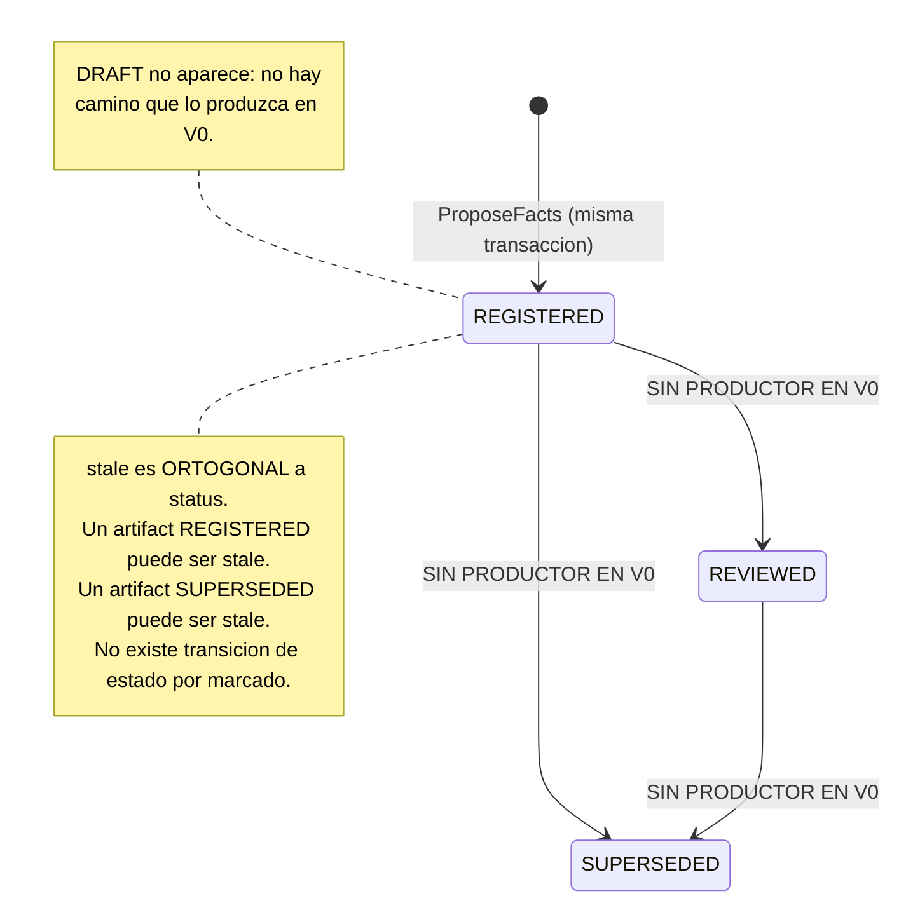
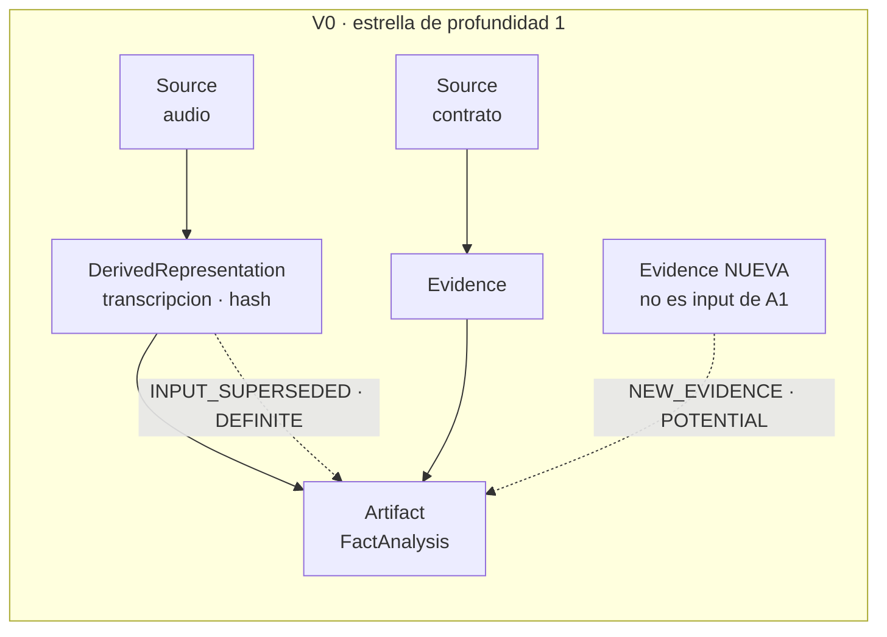

# 10 — Ciclo de vida del Artifact y staleness en V0

**Estado:** Technical Design V0 (nivel 2 de precedencia, kernel §14). Materializa el **kernel técnico v0.4 §6, §7 y §10** y el **kernel de consolidación v0.2 §10** (schema del Artifact), y hace operativos **ADR-004** (memoria del caso, biyección mutación↔evento, `pending`), **ADR-006** (frontera de incorporación, inv. 3: `inputs[]` validados contra el Case Store) y **ADR-001** (frontera de confianza: el modelo no decide qué está vigente).

**Qué NO se decide aquí:** el esquema físico (04 §3.4, que este documento no contradice y del que señala una divergencia de nombre en §2.5), la redacción de los mensajes humanos (11), la matriz consolidada de pruebas (12) y el contrato de Knowledge Packs (`boundaries.md` §Knowledge Packs, POST-V0). Este documento define **qué es un Artifact, cómo nace, cómo se marca y qué significa exactamente que no pueda presentarse como vigente**.

**Nota de vocabulario obligatoria (kernel §1).** `Principal` (`principal_id`, `principal_type ∈ HUMAN | AI | SYSTEM`, `principal_role`) responde **quién ejecutó**. `provenance_kind` (`EXTERNAL_SOURCE | AI_DERIVATION | AI_INFERENCE | HUMAN_DECISION | SYSTEM`) responde **cuál es la naturaleza epistémica del origen**. Son ortogonales y no toda combinación es válida (kernel §1.4). La forma `actor_type = HUMAN_DECISION` del corpus histórico es la errata que el kernel §1.5 normaliza; no se reproduce aquí.

**`Statement` no se materializa en V0** (kernel §15; addendum v0.3 B.7). La cadena de provenance que un `FactAnalysis` documenta es `Fact candidato → provenance_ref → fragmento → DerivedRepresentation → Source`, sin eslabón `Statement`.

---

## 1. Qué es un Artifact en V0

### 1.1 Plano, definición y frontera

Un `Artifact` es un **registro del trabajo analítico ya realizado**: qué metodología, qué modelo y qué insumos exactos produjeron un análisis, en qué momento del expediente. Pertenece al plano **Application**, no al Domain (`boundaries.md` §Vocabulario; 02 §Conceptos de soporte). La razón de esa ubicación es dura y conviene repetirla porque gobierna todo lo demás:

> **Un Artifact no es una proposición sobre el mundo jurídico y no porta estatus epistémico.** No afirma que algo ocurrió. Afirma que **se hizo un análisis**, con estos insumos y esta metodología. La afirmación sobre el mundo vive en el `Fact` y su `status_history`; el Artifact vive al lado, como bitácora.

De ahí se sigue la propiedad que hace útil todo este documento: **marcar un Artifact como stale no cambia el conocimiento del expediente**. Ningún `Fact` pasa a ser menos cierto porque un análisis quedó desactualizado. Lo que cambia es **cuánto puede apoyarse la profesional en ese trabajo sin volver a mirarlo**.

### 1.2 El único tipo de V0: `FactAnalysis`

`type` (el campo, `ArtifactType` el tipo) es un enum de **un solo valor en V0**: `FactAnalysis`, el producto del skill `fact-builder` v0 canalizado por `propose_facts` (kernel §6; 03 §9; slice, *Artifact behavior*). No hay artifacts de investigación jurídica, de redacción ni de análisis de audiencia: esos skills están fuera del slice (kernel §15).

Un `FactAnalysis` documenta **el acto de proponer hechos**, no los hechos propuestos. Los hechos candidatos y sus links viven en la `Proposal` y sus `ProposalItem` (kernel §2). El Artifact y la Proposal son **dos registros del mismo acto**, con vidas distintas: la Proposal se revisa y se commitea; el Artifact ni se revisa ni se commitea — se marca.

### 1.3 Lo que el Artifact NO es

| No es | Por qué importa decirlo |
|---|---|
| **Evidencia** | No tiene `Source`, no tiene bytes preservados, no funda nada. Un Artifact jamás aparece en un `EvidenceLink` (ADR-006 inv. 1). |
| **Un `Fact`** | No tiene `status_history` ni estados derivados. La proyección nunca reporta `SUPPORTED`/`CONTRADICTED` sobre un artifact. |
| **Una salida jurídica** | V0 no produce salidas jurídicas (no hay drafting, kernel §15). Ver §8.3. |
| **Estado curado del Case** | `ProposeFacts` no muta el conocimiento (ADR-001 inv. 9): registrar el artifact tampoco. |
| **Una caché de resultados** | El reuso idempotente de análisis es POST-V0 (§11.1). En V0 el Artifact permite **detectar** trabajo ya hecho, no reutilizarlo. |

---

## 2. Schema

### 2.1 Contrato conceptual

```ts
type ArtifactType   = 'FactAnalysis';                            // único valor en V0
type ArtifactStatus = 'DRAFT' | 'REGISTERED' | 'REVIEWED' | 'SUPERSEDED';
type StaleReason    = 'NEW_EVIDENCE' | 'INPUT_SUPERSEDED' | 'METHODOLOGY_CHANGED';
type StalenessClass = 'DEFINITE' | 'POTENTIAL';                  // DERIVADO, no almacenado (§5.4)

interface ArtifactInput {
  entity_kind:  'SOURCE' | 'EVIDENCE' | 'DERIVED_REPRESENTATION' | 'FACT';
  entity_id:    Uuid;        // identidad de entidad emitida por el Core — JAMÁS un nombre de archivo
  content_hash: Sha256;      // identidad de contenido de la versión EXACTA consumida
}

interface StaleMark {
  reason:    StaleReason;
  marked_at: Timestamp;
  event_id:  Uuid;           // el ArtifactMarkedStale que la produjo — sin él, la marca no es auditable
}

interface ReviewedBy {       // solo si status === 'REVIEWED'; sin productor en V0 (§3.1)
  principal_id:      Uuid;   // principal_type = HUMAN
  reviewed_at:       Timestamp;
  at_case_revision:  CaseRevision;   // boundaries §Artifact Registry: REVIEWED no es marca desnuda
}

interface Artifact {
  artifact_id:        Uuid;                 // UUIDv7 opaco del Core (kernel §11)
  type:               ArtifactType;         // nombre PLANO del kernel §8.1 y `04` §3.4
  case_id:            Uuid;
  created_at:         Timestamp;
  created_by:         Principal;            // ver §2.4 — NO es SYSTEM
  provenance_kind:    ProvenanceKind;       // 'AI_INFERENCE' para FactAnalysis (§2.4)

  base_case_revision: CaseRevision;         // la revisión CONTRA LA QUE se analizó (§2.5)

  inputs:             ArtifactInput[];      // puede ser vacío — ver §2.3, caso alleged_only

  methodology_version: string;              // DECLARADO, no verificable — escalar PLANO
  model_id:            string | null;       // DECLARADO, no verificable — escalar PLANO

  status:             ArtifactStatus;
  reviewed:           ReviewedBy | null;

  stale:              boolean;              // ortogonal a status (§3.3)
  stale_reasons:      StaleMark[];          // acumulativo, append-only, jamás vaciable

  supersedes_artifact_id: Uuid | null;      // cadena simple, NO DAG (§7)

  knowledge_pack_versions: Array<{ pack_id: string; version: string }>;  // [] en V0
}
```

### 2.2 Campo por campo: justificación y estatus epistémico

| Campo | Estatus | Justificación / regla |
|---|---|---|
| `artifact_id` | Identidad de entidad | UUIDv7 opaco emitido por el Core. **Nunca** un hash: `entity identity ≠ content identity` (kernel §11). Nunca se muestra a la usuaria. |
| `type` | Contrato | Enum cerrado. Un tipo nuevo es cambio de contrato, no extensión silenciosa (misma disciplina que la lista cerrada de eventos, kernel §8.1). **Nombre alineado**: `type`, no `artifact_type` — es el que usan `04` §3.4 (`TABLE artifacts`), `08` §5.4 y `09` §2.1. |
| `case_id` | Aislamiento | Todo lo epistémico existe **dentro** de un Case y nada cruza (ADR-003; adversarial 7). Ninguna consulta de artifacts retorna filas de otro Case. |
| `created_at` | Registro | Momento de registro. **No** es el ancla de staleness: el ancla es `base_case_revision`. |
| `created_by` | **Heredado de la invocación** | Ver §2.4. `principal_type = AI` en el flujo del slice, **no** `SYSTEM`. |
| `provenance_kind` | Epistémico | `AI_INFERENCE`. Consistente con kernel §1.4 (`AI_INFERENCE` exige `principal_type = AI`). |
| `base_case_revision` | Ancla de staleness | La revisión **que el análisis leyó**, no aquella en la que se escribió la fila. Ver §2.5. |
| `inputs[]` | **Verificado por el Core** | Cada entrada resuelve a una entidad del Case Store con ese `content_hash` exacto (ADR-006 inv. 3). Es el **único** campo del Artifact que el Core verifica; ver §2.3 y §4.3. |
| `methodology_version` | **DECLARADO, no verificable** | HECHO VERIFICADO (kernel §1; fuente: code.claude.com/docs/en/skills.md): la plataforma **no versiona skills** — solo plugins. La versión es metadato de producto declarado por quien invoca; el Core la registra, no la comprueba. **Escalar plano**, no `{ skill_id, version }`: es la forma del kernel §8.1, de `04` §3.4 (`methodology_version text`), de `03` §9.6 y de `09` §2.1. Ver la nota de alineación bajo la tabla. |
| `model_id` | **DECLARADO, no verificable** | El Core no tiene forma de comprobar qué modelo produjo el análisis. Se registra como afirmación del invocador, y así debe leerse en auditoría. **Escalar plano** (`string \| null`), no `{ model_id } \| null`: misma razón que arriba. |
| `status` | Lifecycle propio | §3.1. Un solo productor en V0 (`REGISTERED`). |
| `reviewed` | Estructura obligatoria | `boundaries.md` §Artifact Registry: `REVIEWED` porta **quién, cuándo y contra qué revisión**. Una revisión humana sin punto de anclaje no dice qué se revisó. Sin productor en V0. |
| `stale` / `stale_reasons[]` | **Computado por el Core** | §5 y §6. Acumulativo y no vaciable por ninguna superficie (§3.4, §8.2). |
| `supersedes_artifact_id` | Cadena simple | §7.3. Sin productor en V0 (§3.1). |
| `knowledge_pack_versions[]` | Positivo, no ausente | `[]` en V0 significa **"este análisis no usó ningún pack"**, no "no sabemos". Obligatorio en cuanto un artifact dependa de un pack (`boundaries.md` §Knowledge Packs; v0.1.1 §K3), o la cadena de provenance tendría un eslabón invisible. |

**Regla de honestidad derivada.** Tres campos del Artifact son **declaraciones no verificables** (`methodology_version`, `model_id`, y por extensión cualquier `knowledge_pack_versions[]` futuro que no resuelva contra un pack instalado) y uno es **verificado** (`inputs[]`). Toda presentación del Artifact que mezcle ambos sin distinguirlos induce a error sobre qué garantiza el sistema. **PROPUESTA DEL TECHNICAL DESIGN:** la proyección que devuelve artifacts no promete verificación sobre metodología ni modelo; la trazabilidad fuerte del V0 es la de `inputs[]`.

**Nota de alineación de vocabulario (corrección aplicada, no decisión nueva).** Una versión anterior de este apartado escribía `artifact_type`, `methodology: { skill_id, version }` y `model: { model_id } | null`. Esas tres formas **no existían en ningún otro documento**: el kernel §8.1, `03` §9.6, `04` §3.4 y `05` §8.2 usan `methodology_version` y `model_id` planos, y `04` §3.4 (`TABLE artifacts`), `08` §5.4 y `09` §2.1 (`ArtifactRegisteredP.type`) usan `type`, y la divergencia no estaba declarada en ninguna parte (a diferencia de la de `base_case_revision`, §2.5). Se alinea **este** documento al vocabulario mayoritario y al de los schemas de persistencia, que es el criterio de desempate: el contrato conceptual no puede nombrar los campos distinto de la tabla que los guarda.

**Consecuencia declarada — `skill_id` no es un campo del Artifact.** Al aplanar `methodology`, el componente `skill_id` deja de tener campo propio, y **no lo tenía en persistencia**: `04` §3.4 (`TABLE artifacts`) no define columna alguna para él. `POR VERIFICAR / DECISIÓN PENDIENTE`: en V0 hay un solo skill productor de artifacts (`fact-builder`, kernel §6), de modo que `methodology_version` identifica la metodología sin ambigüedad; el día que un segundo skill produzca artifacts, `methodology_version` deja de ser identificador suficiente y añadir `methodology_skill_id` es **cambio de contrato y de schema** que decide `04`, no este documento. No se añade aquí un campo que la persistencia no tiene: sería reintroducir por otra puerta la divergencia que esta nota cierra.

### 2.3 `inputs[]`: por qué jamás un nombre de archivo

El ejemplo del schema original de los dueños (§17) identificaba insumos por nombre de archivo (`interview.mp3`). **Se corrige** — la corrección ya está registrada en el slice (*Artifact behavior*) y aquí se dan las razones completas, porque el punto reaparece cada vez que alguien mira el schema y lo encuentra verboso:

1. **Un nombre no es identidad.** No es único (dos archivos pueden llamarse igual), no es estable (se renombra) y no está bajo control del Core.
2. **El archivo deja de ser la fuente en el instante de la incorporación** (ADR-002 inv. 4; ADR-006 inv. 6). Apuntar al nombre es apuntar a algo que el Core ya no gobierna y que la usuaria puede borrar sin que nada se entere (F17).
3. **Un nombre no distingue versiones.** Sin `content_hash`, "¿este análisis consumió la transcripción vieja o la nueva?" es adivinanza — y esa pregunta **es** el mecanismo de staleness (§5.2). Sin hash no hay `INPUT_SUPERSEDED` posible.
4. **Un `FactAnalysis` no consume el audio: consume la transcripción.** El insumo real es la `DerivedRepresentation` exacta, con su hash y su receta. Registrar el `Source` como único input ocultaría que el análisis leyó un derivado, que es precisamente el eslabón que puede regenerarse y cambiar.

Por eso `entity_kind` incluye `DERIVED_REPRESENTATION` y por eso `inputs[]` registra **id + hash**, nunca uno de los dos solo.

**Caso borde declarado — `inputs[]` vacío.** `ProposeFacts` admite items con `alleged_only: true`, que por contrato **no llevan `provenance_refs`** (03 §9.4, regla 2). Si **todos** los items de una propuesta son `alleged_only`, el `inputs[]` computado por el Core queda **vacío**. Consecuencias, que se declaran en vez de esconderse:

- El artifact es válido: documenta que hubo un análisis que no se ancló en material incorporado.
- **Es inalcanzable por `INPUT_SUPERSEDED`**: no hay hash que comparar. Su única vía de marcado en V0 es la gruesa (`NEW_EVIDENCE`, §6.4).
- **DECISIÓN PENDIENTE:** si la proyección debe distinguir visiblemente un `FactAnalysis` sin anclaje probatorio de uno anclado. No se inventa condición nueva para ello — el catálogo v0 está cerrado en 7 (kernel §10) — y se remite a 11.

### 2.4 El `Principal` de un artifact registrado internamente

El `FactAnalysis` lo **escribe el Core**, dentro de la transacción de `ProposeFacts` (kernel §6). Surge la pregunta obvia: si la fila la inserta el Core, ¿su `Principal` es `SYSTEM`?

**PROPUESTA DEL TECHNICAL DESIGN: no.** `created_by.principal_type = AI` y `provenance_kind = AI_INFERENCE`, **el mismo `Principal` de la `Proposal` que lo causó**.

Razón: el Artifact no registra el acto de insertar una fila; registra **el análisis**, y el análisis lo produjo el modelo. Un `FactAnalysis` con `provenance_kind = SYSTEM` se leería en auditoría como derivación mecánica del sistema —de la misma familia que una regeneración de proyección o una migración (kernel §1.4)— y eso es materialmente falso. Sería provenance formalmente correcta y epistémicamente mentirosa: exactamente el modo de fallo que motivó retirar `register_artifact` de la superficie (05 §8.2).

Contraste obligatorio, porque fija la regla general:

| Registro | `principal_type` | `provenance_kind` | Por qué |
|---|---|---|---|
| `Artifact` (`FactAnalysis`) y su evento `ArtifactRegistered` | `AI` | `AI_INFERENCE` | El **contenido** del registro (el análisis, su metodología, su lectura de insumos) lo produjo el invocador. |
| Evento `ArtifactMarkedStale` | `SYSTEM` | `SYSTEM` | La marca **no es una opinión sobre el mundo**: es una comparación determinista del Core (§6.2). Atribuirla al `AI` que invocó `ingest_evidence` la convertiría en juicio del modelo, y todo el diseño de §5.5 se apoya en que no lo es. |

> **Regla general (PROPUESTA DEL TECHNICAL DESIGN).** En un registro escrito internamente por el Core, el `Principal` y el `provenance_kind` se heredan de **la invocación que aportó el contenido**; se usa `SYSTEM`/`SYSTEM` **solo** cuando el registro es una computación determinista del Core que no incorpora contenido de nadie. Esta regla resuelve, sin caso a caso, todo registro interno futuro.

### 2.5 Divergencia de nombre señalada: `base_case_revision`

04 §3.4 nombra la columna `artifacts.case_revision` con el comentario *"revisión vigente al registrarlo"*; kernel v0.2 §10 y el slice usan la misma forma. Este documento la nombra **`base_case_revision`**, alineada con `Proposal.base_case_revision` (kernel §2.1). **No es un cambio de valor por capricho: es una precisión de semántica.**

- Bajo el kernel §7 literal, `ProposeFacts` avanza `case_revision` en **2** (`FactsProposed` + `ArtifactRegistered`, 03 §9.10). Si el análisis se hizo contra la revisión N, la fila del artifact se escribe cuando el Case ya está en N+2. **"Revisión vigente al registrarlo" y "revisión que el análisis leyó" son valores distintos.**
- Para staleness, el único valor con significado es **el que se leyó**. Anclar a N+2 haría creer que el análisis consideró dos mutaciones que ocurrieron después de leer.
- La revisión en que se escribió la fila **no se pierde**: es la `case_revision` del evento `ArtifactRegistered` en el Case Event Log (kernel §8.1). Almacenarla también en la tabla duplicaría un dato derivable — la misma disciplina con la que el kernel §2.2 rechazó `INVALIDATED` como estado almacenado.
- **El campo fue estable frente a la enmienda de revisiones sobre ADR-004** (kernel §5.2), hoy **aprobada como AC-02**: `base_case_revision` es un **valor de entrada** del análisis bajo el **Modelo B vigente** igual que lo era bajo el Modelo A anterior. La enmienda **no cambió este campo**; lo que cambió es el reloj que lo rodea — `ProposalReviewed` avanza `event_seq` y lleva `case_revision` **nula**, de modo que entre la lectura del análisis y el commit hay **una** mutación canónica menos que bajo el modelo superado.

**No es CONFLICTO CON ADR ACCEPTED:** ningún ADR 001–006 nombra este campo. Es una divergencia de nombre entre documentos de nivel 2 y de nivel 5 que se resuelve a favor del nivel 2 (kernel §14) y se **señala** para el pase de corrección: `04 §3.4`, `kernel v0.2 §10` y `vertical-slice-v0.md` *(Artifact behavior)*.

---

## 3. Lifecycle

### 3.1 `status`: cuatro valores, un solo productor en V0

Se **conserva** el enum de cuatro valores de kernel v0.2 §10 y `boundaries.md` §Artifact Registry, y se declara con precisión cuáles tienen productor:

| Valor | ¿Productor en V0? | Quién lo produciría |
|---|---|---|
| `DRAFT` | **No** | No existe camino que cree un artifact sin registrarlo: el registro ocurre **dentro** de la transacción de `ProposeFacts` (kernel §6). Un artifact `DRAFT` sería una fila que ninguna operación puede producir ni consumir. |
| `REGISTERED` | **Sí** | `ProposeFacts` (03 §9.6). **Único estado alcanzable en V0.** |
| `REVIEWED` | **No** | `ReviewProposal` revisa **items de propuesta**, no artifacts (kernel §7; 06 §1.1). No hay use case que marque un artifact como revisado. |
| `SUPERSEDED` | **No** | Exigiría un artifact nuevo que declarase `supersedes_artifact_id`. En V0 nada puede declararlo: el modelo no tiene tool (`register_artifact` está retirado) y el Core **no puede inferir** que un segundo `FactAnalysis` reemplaza al primero — dos análisis del mismo caso pueden ser complementarios. |

**Decisión: conservar los cuatro valores pese a que tres no tengan productor.** Misma justificación que `FactWithdrawn` en la lista cerrada de eventos (kernel §8.1; addendum v0.3 B.5): eliminarlos obligaría a reabrir el contrato al implementar funcionalidad segura y previsible, y a migrar filas existentes con un estado inferido. **Declarado sin productor no es lo mismo que inexistente, y ninguna de las dos cosas es "implementado".**

**Consecuencia verificable y algo incómoda que se dice igual:** en V0, `status` es una columna con un solo valor posible. No aporta discriminación hoy; aporta estabilidad de contrato mañana. Si los dueños prefieren minimalismo estricto, la alternativa es reducir el enum a `REGISTERED` y ampliarlo después — **DECISIÓN PENDIENTE**, con la recomendación de conservar los cuatro.

### 3.2 Máquina de estados



**No hay transición de salida hacia un estado terminal de borrado.** Un artifact no se elimina nunca (§3.4).

### 3.3 `stale` **no** es un `status`: por qué son ortogonales

Es la decisión de modelado más fácil de equivocar, y colapsarlas rompería cosas concretas:

- `status` describe **la posición del artifact en su propia vida**: se creó, se registró, alguien lo revisó, otro lo reemplazó.
- `stale` describe **la relación entre sus insumos y el estado vigente del Case**. No dice nada sobre el artifact en sí; dice algo sobre el mundo alrededor del artifact.

Si `STALE` fuera un valor de `status`, resultarían tres pérdidas inmediatas: (1) no podría expresarse "revisado por la profesional **y además** desactualizado", que es un estado normal y frecuente; (2) marcar exigiría **transicionar**, es decir, sobrescribir el estado anterior — y perder que estaba `REVIEWED`; (3) `stale_reasons[]` es **acumulativo** (un artifact puede acumular `NEW_EVIDENCE` y luego `INPUT_SUPERSEDED`), y un enum de estado no acumula.

Es la misma disciplina de las **dos dimensiones** con que el kernel §2.2 separó `review_decision` de `commit_state`. Aquí: `status` × (`stale`, `stale_reasons[]`).

**Vigencia como valor derivado, jamás almacenado:**

```text
vigente(artifact)  ⟺  artifact.status = 'REGISTERED'  ∧  artifact.stale = false
```

No existe columna `is_current`. Un booleano de vigencia almacenado podría divergir de la realidad, y ese es exactamente el defecto que el modelo epistémico evita en `Fact` (kernel §2.2) y que la proyección evita en `SUPPORTED | CONTRADICTED | UNSUPPORTED` (ADR-003 inv. 6).

### 3.4 Ningún artifact se borra ni se edita

Regla dura, ya fijada (slice *Artifact behavior* 3 y 5; 03 §12.6), con su razón de dominio: **en un expediente, qué se creyó y cuándo es en sí mismo relevante.** Un análisis que resultó incompleto no es basura: es parte de la historia del caso, y puede ser lo que explique por qué se tomó tal decisión procesal en tal momento.

Consecuencias operativas:
- No existe operación de superficie que borre, edite o "des-marque" un artifact (§8.2).
- `stale_reasons` es **append-only** con `event_id` por marca (04 §3.4), no un array reescribible. Un array JSON mutable sería una superficie de borrado silencioso de exactamente lo que no puede borrarse.
- La única forma de "sustituir" un análisis es **producir uno nuevo** — que en V0 significa una pasada nueva de `fact-builder` con su propia `Proposal` y su propia revisión humana (slice *Artifact behavior* 2). El artifact viejo permanece, stale, visible.

---

## 4. Relación con `ProposeFacts`

### 4.1 Registro interno, no tool

El `FactAnalysis` **se registra internamente** dentro de `ProposeFacts`; `register_artifact` está retirado de la superficie MCP (kernel §6 y §7; 03 §9.7; 05 §8.2). La regla general que lo justifica: *una operación se expone solo si el modelo debe decidir cuándo ocurre; si es consecuencia necesaria de otra, es interna*.

Los dos modos de fallo que el registro interno elimina (05 §8.2) son:

| Fallo si fuera tool | Efecto |
|---|---|
| El modelo **olvida** registrar | Propuesta sin artifact: la detección de trabajo ya realizado y **la propagación de staleness quedan ciegas**, y nada lo señala. Es el peor de los dos: un análisis invisible nunca se marca stale. |
| El modelo registra un artifact **que no corresponde** a ningún análisis | `inputs[]` con hashes válidos y un `FactAnalysis` que nadie produjo: provenance formalmente correcta y materialmente falsa. |

**RESUELTO — enmienda AC-03 aprobada; no se reabre aquí.** La tensión entre "nueve tools" (ADR-001 inv. 3 y val. 7; ADR-006 inv. 3 y val. 3, redactados sobre `register_artifact` como tool) y las ocho del kernel §6 está registrada, con opciones y desenlace, en **05 §11.1** y señalada en **01** y **04 §C5**. Los dueños **aprobaron AC-03**: la superficie es de **OCHO** tools, `register_artifact` queda **retirado** y ADR-001/ADR-006 quedan enmendados en su literalidad — el invariante sustantivo de ADR-006 inv. 3 se conserva íntegro y cambia solo su punto de aplicación. Este documento **aplica el kernel §6** (registro interno) y no añade análisis nuevo.

### 4.2 La transacción

```text
FUERA (antes)   resolver y validar todas las provenance_refs de los items;
                canonicalizar items; calcular item_content_hash;
                COMPUTAR inputs[] del artifact a partir de las refs (§4.3)

DENTRO (una tx) INSERT Proposal ∪ ProposalItem×n ∪ CaseEvent(FactsProposed)
                ∪ INSERT Artifact(FactAnalysis, REGISTERED) ∪ INSERT artifact_inputs×m
                ∪ CaseEvent(ArtifactRegistered)
                ∪ OperationLedgerEntry

FUERA (después) Tool Invocation Log
```

Dos mutaciones, dos eventos, **una** transacción (03 §9.8): o quedan ambas o ninguna. Una propuesta sin su artifact —o al revés— sería el estado inconsistente que el registro interno existe para impedir.

**Idempotencia.** Hereda la de `ProposeFacts`: clave `H(case_id ‖ base_case_revision ‖ methodology ‖ model_id ‖ normalize(items))`, permanente (03 §9.11). Un reintento idéntico del transporte devuelve **el mismo `artifact_id`** y produce **cero eventos nuevos**. Esto es idempotencia **de operación**, no reuso de análisis: dos invocaciones distintas que casualmente consuman los mismos insumos producen dos artifacts. Ver §11.1.

### 4.3 Cómo el Core computa `inputs[]`

`inputs[]` **no lo aporta el invocador**: lo deriva el Core de las `provenance_refs` de los items (03 §9.7). El procedimiento conceptual:

```text
inputs := ∅
para cada item de la propuesta:
  para cada ref de item.provenance_refs:
    resolver ref.evidence_id      -> Evidence del ESTE Case      (si no: E_UNINCORPORATED_REFERENCE
                                                                  / E_CROSS_CASE_REFERENCE)
    inputs += { EVIDENCE, evidence_id, hash(evidence) }
    si ref.derivation_id presente:
      resolver derivation_id      -> DerivedRepresentation READY del mismo Evidence
      inputs += { DERIVED_REPRESENTATION, derivation_id, ref.source_version_hash }
    inputs += { SOURCE, source_de(evidence), content_hash(source) }
inputs := deduplicar por (entity_kind, entity_id)
```

Tres propiedades que esto garantiza **por construcción**, no por validación de un payload externo:

1. **ADR-006 inv. 3 se cumple siempre**: cada entrada existe en el Case Store con ese hash, porque salió de él. Una URL, una ruta o texto pegado en el chat no pueden llegar hasta aquí — ya fueron rechazados como `provenance_refs` (03 §9.4).
2. **La `DerivedRepresentation` exacta consumida queda registrada** con su hash: sin eso, "reutilizar vs regenerar" sería adivinanza sobre nombres.
3. **El modelo no puede equivocar `inputs[]`**, porque no lo escribe. Pedírselo sería pedirle un dato que el Core ya tiene.

**Divergencia de deduplicación señalada.** La clave primaria de `artifact_inputs` es `(artifact_id, entity_kind, entity_id)` (04 §3.4), lo que impide registrar **dos versiones distintas de la misma entidad** como insumos del mismo artifact. En V0 el caso no se produce: no hay regeneración de derivados. **POR VERIFICAR** al implementar: si dos items consumieran dos `content_hash` distintos de la misma `entity_id`, la inserción violaría la PK. La respuesta correcta no es relajar la clave, sino **rechazar la propuesta**: un análisis que dice haber leído dos versiones distintas de la misma cosa no puede anclarse. Se registra como **DECISIÓN PENDIENTE** de bajo impacto en V0.

### 4.4 El Artifact sobrevive al destino de la propuesta

**PROPUESTA DEL TECHNICAL DESIGN, derivada de §3.4:** el ciclo de vida del Artifact es **independiente** de `review_decision` y `commit_state` de los items de su Proposal.

- Si la profesional **rechaza** todos los items: el trabajo ocurrió, se consumieron esos insumos, y el registro se conserva. Rechazar la conclusión no borra el hecho de haber analizado.
- Si el commit **falla** por `REVISION_CHANGED`: la propuesta se preserva (06 §5.2) y el artifact sigue registrado, sin cambio alguno.
- Si el commit tiene éxito: el artifact tampoco cambia — **no hay transición a `REVIEWED`** por el hecho de que se hayan commiteado sus hechos (§3.1). Lo que la profesional revisó fueron los items, no el análisis.

Esto también significa que **`stale` y `review_decision` no se implican mutuamente**: un artifact cuyos hechos fueron todos commiteados puede quedar stale al día siguiente, y un artifact cuya propuesta fue rechazada también se marca. La marca depende de los insumos, no del veredicto.

### 4.5 Correlación `Artifact ↔ Proposal`

La tabla `artifacts` de 04 §3.4 **no tiene columna `proposal_id`**. La correlación existe hoy por dos vías: la respuesta de `propose_facts` devuelve `artifact_id` junto a `proposal_id` (05 §7 `propose_facts`), y el payload del evento `ArtifactRegistered` puede portarla.

**PROPUESTA DEL TECHNICAL DESIGN (mínima):** el payload de `ArtifactRegistered` incluye `proposal_id` de forma obligatoria. Coste cero en esquema — el payload ya debe ser *"suficiente para reconstrucción"* (kernel §8.1) — y suficiente para auditoría.

**DECISIÓN PENDIENTE (no mínima):** añadir `artifacts.produced_by_proposal_id` como columna. A favor: `get_case_context(pending)` devuelve artifacts stale **y** proposals pendientes (ADR-004 §pending); sin la columna, la profesional ve dos entradas que son el mismo trabajo, y la consulta caliente tendría que ir al event log. En contra: es un dato derivable del log, y V0 no lo necesita para cerrar el slice. **Recomendación: payload ahora, columna cuando la proyección `pending` lo justifique.** No se resuelve aquí porque toca 04 y 08.

> Obsérvese que la Proposal **no es un input** del artifact: el artifact no la consumió, la produjo. Por eso no entra en `inputs[]` ni en `entity_kind` — mezclarlas confundiría "de qué me alimenté" con "qué produje", y esa confusión es justamente lo que un DAG mal tipado provoca (§7.2).

---

## 5. Las dos clases de staleness — distinción obligatoria

### 5.1 Por qué colapsarlas sería un defecto epistémico

Dos cosas muy distintas pueden hacer que un análisis deje de merecer confianza plena:

- **Algo que el análisis leyó ya no es lo que era.** Esto es **decidible**: se compara un hash. No hay opinión posible.
- **Entró al expediente material que el análisis no leyó.** Esto **no es decidible por el Core**: saber si el contrato que llegó hoy afecta o no la reconstrucción de hechos hecha ayer exige **leer y juzgar**, que es trabajo jurídico.

Presentar ambas como el mismo hecho —"el análisis está desactualizado"— produce dos daños simétricos y ambos graves:

| Daño | Cómo ocurre |
|---|---|
| **Afirmar de más** | Decirle a la profesional que su análisis quedó obsoleto cuando ninguno de sus insumos cambió. Es una afirmación falsa sobre el estado del expediente, hecha por el sistema, con el tono de un hecho. Erosiona la confianza en todas las marcas — incluidas las ciertas. |
| **Ocultar de menos** | Que un juicio (del modelo o de quien sea) sobre "esto no te afecta" apague una marca que era **cierta**. Aquí ya no se pierde confianza: se pierde el expediente. |

El corpus ya tomó esta decisión en otro punto y conviene citarlo como precedente, porque muestra que la distinción no es una invención de este documento: para Knowledge Packs, `boundaries.md` §Knowledge Packs rechaza el criterio *"última versión gana"* y tipa el changelog en `CORRECTIVE` (invalidación fuerte, exige revisión), `ADDITIVE` (aviso suave que la profesional decide atender) y `FORMAL` (solo render). **Es la misma partición**: impacto cierto vs impacto potencial. Aquí se generaliza a staleness de artifacts.

### 5.2 DEFINITE STALENESS — obsolescencia cierta

> **Definición.** Un insumo declarado del artifact **cambió de identidad de contenido**, o la metodología que el artifact declara ya no es la vigente. Lo que el análisis leyó ya no es lo que hay.

- **Determinación:** comparación de hashes o de versiones. **Decidible, determinista, del Core, sin intervención de ningún modelo.**
- **Razones de V0 en esta clase:** `INPUT_SUPERSEDED`, `METHODOLOGY_CHANGED`.
- **Fuerza:** absoluta. No admite matices, no admite evaluación, no admite excepción por juicio. Es un **hecho computado**, no una alerta.
- **Predicado:**

```text
DEFINITE_por_input(a) ⟺ ∃ i ∈ a.inputs :
                          content_hash_vigente(i.entity_id) ≠ i.content_hash
DEFINITE_por_metodo(a) ⟺ a.methodology_version ≠ version_vigente(metodología declarada)
                          -- V0: un solo skill productor (`fact-builder`, kernel §6), luego
                          -- `methodology_version` identifica la metodología sin ambigüedad (§2.2)
```

### 5.3 POTENTIAL IMPACT — impacto potencial

> **Definición.** Entró al Case material nuevo que **no era insumo** del artifact. Nada de lo que el análisis leyó cambió. El análisis **podría** verse afectado, y aún no se sabe en qué parte.

- **Determinación:** el Core sabe con certeza **que entró evidencia nueva**; **no sabe** si toca lo que el artifact analizó. Esa segunda pregunta requiere juicio jurídico.
- **Razón de V0 en esta clase:** `NEW_EVIDENCE`.
- **Fuerza:** es una **solicitud de atención**, no una afirmación sobre los insumos.
- **Predicado en V0 (deliberadamente grueso, §6.4):**

```text
POTENTIAL(a) ⟸ se incorporó Evidence e al Case  ∧  a.status = 'REGISTERED'
               // sin exigir relación entre e y a.inputs — el refinamiento es POST-V0
```

### 5.4 La clase es **derivada**, no almacenada

**PROPUESTA DEL TECHNICAL DESIGN: no se añade columna alguna.** La clase es una función total sobre la razón, que ya está persistida:

```ts
function staleness_class(r: StaleReason): StalenessClass {
  switch (r) {
    case 'INPUT_SUPERSEDED':     return 'DEFINITE';
    case 'METHODOLOGY_CHANGED':  return 'DEFINITE';
    case 'NEW_EVIDENCE':         return 'POTENTIAL';
  }
}

// clase efectiva del artifact: DEFINITE domina
function artifact_class(a: Artifact): StalenessClass | null {
  if (!a.stale) return null;
  return a.stale_reasons.some(m => staleness_class(m.reason) === 'DEFINITE')
       ? 'DEFINITE' : 'POTENTIAL';
}
```

Tres razones para no persistirla:

1. **Misma disciplina del kernel §2.2:** lo computable no se almacena, porque almacenado puede divergir de la realidad. `INVALIDATED` se eliminó por esto mismo.
2. **`DEFINITE` domina por construcción.** Un artifact con ambas clases de razón es `DEFINITE`. Si la clase fuera columna, habría que mantener esa dominancia a mano en cada marcado — un invariante más que puede romperse.
3. **Cero migración.** Si POST-V0 aparece una razón nueva (p. ej. cambio de Knowledge Pack, §11.4), se extiende la función, no la tabla.

**Sobre el transporte a UX.** El catálogo de condiciones v0 está **cerrado en 7** (kernel §10; kernel v0.2 §9) y este documento **no crea una condición nueva**: la condición sigue siendo `ANALYSIS_STALE { reasons[] }`. Como la clase es derivable de `reasons[]`, **puede computarse en la capa de presentación sin transportarse**. Si 11 decide llevarla explícita en el payload (`ANALYSIS_STALE { reasons[], class }`), es conveniencia, no información nueva, y ambos diseños son compatibles. **POR VERIFICAR** contra `11-ux-condition-catalog.md`.

### 5.5 Regla de asimetría: el modelo puede **añadir** incertidumbre, nunca **retirarla**

Es la regla que hace que la distinción sirva de algo, y es normativa:

| Lo que el modelo **puede** hacer | Lo que el modelo **no puede** hacer |
|---|---|
| Proponer, en lenguaje natural o como análisis nuevo, **qué parte** del artifact podría verse afectada por la evidencia nueva | Concluir que la evidencia nueva **no afecta**, y que eso apague o degrade la marca |
| Ejecutar una pasada nueva de `fact-builder` que produzca una `Proposal` y un `Artifact` nuevos | Modificar `stale`, `stale_reasons[]` o `status` de un artifact existente — **no existe la capacidad en la superficie** |
| Leer y presentar `stale_reasons[]` | Presentar el artifact sin la marca (§8.1) |
| Señalar que sospecha impacto donde el Core no marcó nada | Retirar una marca `DEFINITE` bajo ninguna circunstancia ni justificación |

Formulación operativa: **una evaluación de impacto producida por un modelo es, como mucho, un `AI_INFERENCE` registrable como análisis nuevo; jamás una escritura sobre el estado de staleness de un artifact existente.** El enforcement no es una regla de comportamiento —que el modelo puede ignorar— sino **ausencia de capacidad**: no hay tool, no hay use case y `artifact_stale_reasons` es append-only (§8.2). Es la misma arquitectura que hace que ningún parámetro del modelo constituya prueba de revisión humana (06 §6).

Y una asimetría más, sobre la dirección segura del error: **sobre-marcar es ruido; sub-marcar es un expediente que miente.** Por eso, ante duda, V0 marca (§6.4).

### 5.6 Regla de redacción obligatoria

`NEW_EVIDENCE` marca `stale = true`, igual que las razones `DEFINITE` (§6.1). Eso es una **imprecisión del booleano único que V0 conserva por contrato del slice**, y obliga a compensarla en el mensaje. Regla normativa para 11:

- El mensaje de una marca de clase **`POTENTIAL`** **no puede afirmar** que un insumo del análisis cambió ni que el análisis "quedó desactualizado". Debe decir, en sustancia, que **entró material que este análisis no consideró** y que la decisión de revisarlo es de la profesional.
- El mensaje de una marca de clase **`DEFINITE`** **sí afirma** el cambio de insumo, porque es un hecho comprobado, y debe identificar **qué** insumo.
- Ninguno de los dos mensajes puede sugerir que existe una forma de "marcar como revisado" o "descartar el aviso": no existe (§8.2).

Esto es fidelidad epistémica, la misma exigencia que impide confundir búsqueda fallida con ausencia de prueba (kernel v0.2 §9).

---

## 6. Detección y condición emitida

### 6.1 Tabla normativa

| Disparador | Clase | `reason` | Cómo se detecta | Artifacts afectados | Evento | Condición | ¿Productor en V0? |
|---|---|---|---|---|---|---|---|
| Se incorpora Evidence nueva al Case | **POTENTIAL** | `NEW_EVIDENCE` | Hecho de la propia mutación: `IngestEvidence` sabe que incorporó | **Todos** los `REGISTERED` del Case | `ArtifactMarkedStale` | `ANALYSIS_STALE { reasons: ['NEW_EVIDENCE'] }` | **Sí** — `IngestEvidence` |
| El `content_hash` vigente de una entidad deja de coincidir con el consumido | **DEFINITE** | `INPUT_SUPERSEDED` | Consulta indexada sobre `artifact_inputs` (§6.2) | Los que tienen esa `entity_id` en `inputs[]` con hash distinto | `ArtifactMarkedStale` | `ANALYSIS_STALE { reasons: ['INPUT_SUPERSEDED'] }` | **No** (§6.3) |
| Cambia la versión vigente de la metodología declarada | **DEFINITE** | `METHODOLOGY_CHANGED` | Comparación de versión declarada vs vigente | Los que declaran esa `methodology_version` | `ArtifactMarkedStale` | `ANALYSIS_STALE { reasons: ['METHODOLOGY_CHANGED'] }` | **No** (§6.3) |

**Severidad y bloqueo** (kernel v0.2 §9, sin cambio): `ANALYSIS_STALE` es `warning`, **no bloquea la operación en curso**, y bloquea el uso del artifact como vigente en salida final por política (§8). **Familia: Epistemic** (kernel §10) — habla del estado del conocimiento del caso, no de un fallo de adapter.

**El delta viaja como contenido, no como condición.** Al reabrir el caso, lo ocurrido desde la última revisión conocida es **contenido de `changes_since`**, no una condición aparte (kernel v0.2 §9, unificación que suprimió `NEW_EVIDENCE_SINCE_ANALYSIS` como condición y la convirtió en `reason`). La condición viaja **adherida al artifact**; el delta viaja en la proyección.

### 6.2 Mecanismo de detección, por disparador

**`NEW_EVIDENCE`** — dentro de la transacción de `IngestEvidence`, tras crear `Source` + `Evidence`:

```text
para cada a en artifacts(case_id = C, status = 'REGISTERED'):
    marcar(a, NEW_EVIDENCE)          // no-op si ya tenía esa razón (§6.5)
```

No consulta `artifact_inputs`: por definición, la Evidence nueva **no puede** ser insumo de un artifact preexistente.

**`INPUT_SUPERSEDED`** — dentro de la transacción del mutador que cambia el `content_hash` vigente de una entidad `X`:

```text
para cada fila f en artifact_inputs(entity_kind = K, entity_id = X):
    si f.content_hash ≠ nuevo_hash:
        marcar(f.artifact_id, INPUT_SUPERSEDED)
```

Esta es **la consulta que justifica que `artifact_inputs` sea tabla y no JSON** (04 §2.4): la pregunta caliente va en dirección artifact←entidad, y con tabla es un acceso por el índice `artifact_inputs(entity_kind, entity_id)`; con JSON sería escaneo y parseo por fila.

**`METHODOLOGY_CHANGED`** — **no tiene mecanismo admisible en V0**, y esto es un hallazgo estructural que se declara en vez de simularse:

> El marcado de staleness **comparte obligatoriamente la transacción del mutador que lo dispara** (kernel §7, nota; 03 §12.7). Un cambio de versión de metodología **no es una mutación de un Case**: ocurre por release del producto, potencialmente con el proceso detenido, y afecta a **todos** los Cases a la vez. No hay mutador en cuyo interior ejecutarlo, y por tanto no hay transacción, no hay `case_revision` que avanzar y no hay `Principal` de invocación de quien heredar nada.
>
> Diseñarlo exigiría un disparador nuevo (arranque, migración o carga de configuración) con su propia semántica de evento y de revisión: **es trabajo POST-V0** (§11.4), y hasta entonces `METHODOLOGY_CHANGED` es una razón **válida en el enum y sin productor**, exactamente como `FactWithdrawn` en la lista de eventos.
>
> **POR VERIFICAR — límite de dominio previo al diseño** (`boundaries.md`, POR VERIFICAR sobre vigencia temporal en Colombia): *un artifact producido bajo la norma vigente en su momento procesal puede seguir siendo correcto para ese momento*. Si eso se confirma, un cambio de metodología o de pack **no** implica obsolescencia jurídica automática, y `METHODOLOGY_CHANGED` no debería ser `DEFINITE` sin matiz. **La clasificación de esta razón queda condicionada a esa verificación con la profesional.**

### 6.3 Productores reales en V0

Solo **uno**: `IngestEvidence` → `NEW_EVIDENCE`. Los otros dos no tienen productor porque los `Source` son inmutables por la superficie (PF-002, ADR-002 inv. 5) y **V0 no regenera derivados ni edita insumos** (03 §12.4).

Consecuencia que hay que decir con todas sus letras: **la única clase de staleness que V0 ejercita de punta a punta es `POTENTIAL`.** La clase `DEFINITE` queda **especificada, con predicado, mecanismo de detección y consulta indexada, y sin disparador en el slice**. Se especifica igual por tres razones: (1) es la clase cuya semántica no admite negociación y de la que depende la regla de asimetría (§5.5); (2) el esquema y el índice que necesita ya existen (04 §3.4, §2.4), de modo que su implementación no exige migración; (3) sin ella escrita, la primera regeneración de derivados que se implemente POST-V0 improvisaría la semántica en el peor momento.

### 6.4 Granularidad gruesa: tolerable en `POTENTIAL`, inaceptable en `DEFINITE`

`NEW_EVIDENCE` marca **todos** los artifacts del Case, tengan o no relación con la evidencia nueva. El **RIESGO** ya está registrado (03 §12.4) y aquí se explica por qué se acepta — y hasta dónde:

- Un `POTENTIAL` de más es **ruido**: el sistema pide atención sobre algo que quizá no la merecía. La afirmación subyacente ("entró material que este análisis no consideró") **sigue siendo verdadera** para todos los artifacts marcados. **La imprecisión está en la relevancia, no en la verdad.**
- Un `DEFINITE` de más sería **una afirmación falsa**: decir "un insumo de este análisis cambió" de un artifact cuyos insumos no cambiaron. Por eso `DEFINITE` **nunca** se marca de forma gruesa: siempre por comparación exacta de hash sobre la entidad concreta.
- Un `DEFINITE` de menos sería **el fallo grave**: un análisis que leyó una versión obsoleta y se presenta sin marca. De ahí que su detección sea exhaustiva sobre `artifact_inputs`, no muestral.

El refinamiento por relevancia de `POTENTIAL` es **POST-V0** (§11.3), y con una restricción que nace aquí: cualquier refinamiento futuro **solo puede reducir ruido `POTENTIAL`, jamás suprimir un `DEFINITE`**.

### 6.5 Idempotencia del marcado

Sin clave propia: hereda la del mutador (03 §12.10). Regla interna: se emite `ArtifactMarkedStale` **solo cuando el par `(artifact_id, reason)` pasa de ausente a presente**. Volver a marcar lo ya marcado con la misma razón es un **no-op sin evento** — de otro modo cada incorporación inflaría el log y la revisión sin cambio de estado.

Consecuencia observable en el slice: la segunda incorporación de evidencia sobre un artifact ya marcado con `NEW_EVIDENCE` **no** produce evento nuevo ni avanza `case_revision`. La marca **no cuenta ocurrencias**; declara una condición. Si POST-V0 se quiere saber *cuántas* evidencias entraron desde el análisis, el dato está en el event log entre `base_case_revision` y la revisión actual, no en el artifact. **Precisión bajo el Modelo B vigente (AC-02):** el intervalo por `case_revision` sigue siendo suficiente para contar incorporaciones —son mutaciones canónicas y avanzan el reloj epistémico—, pero el cursor **preciso** del delta es `event_seq` (kernel §9), que además incluye los eventos con `case_revision` nula.

**`case_revision`.** +1 por marca (kernel §7; 03 §12.9): el estado consultable cambió — un artifact vigente pasó a no vigente — y esa diferencia debe verse en el delta de sesión. Una sola invocación de `ingest_evidence` con *n* artifacts registrados produce `1 + n` eventos y avanza la revisión en `1 + n`: es exactamente el caso que ADR-004 inv. 5 previó, y por eso la biyección se enuncia sobre **mutación↔evento**, no sobre invocación↔evento.

---

## 7. Por qué V0 **no** construye un DAG universal

### 7.1 La estructura mínima

```text
Artifact ──consumió──► { Source | Evidence | DerivedRepresentation | Fact }
                        (entity_id + content_hash)
```

**Un solo tipo de arista, profundidad uno, dirección única.** Y una sola regla de propagación:

> **Cambió un input ⇒ el artifact que lo consumió queda stale.**

Eso es todo. No hay recorrido, no hay orden, no hay cierre transitivo, no hay ciclos posibles: en V0 **ningún artifact es input de otro artifact** (`entity_kind` no incluye `ARTIFACT`). La "propagación" es una consulta indexada de un salto.



### 7.2 Qué exigiría de verdad un motor de grafos

No es "una tabla más". Un motor de dependencias obliga a decidir, **antes de la primera línea**, seis cosas que V0 no tiene datos para decidir:

| Exigencia | Por qué V0 no puede resolverla hoy |
|---|---|
| **Tipado de aristas** (`consumió`, `supersede`, `deriva-de`, `refuta`) | Con un solo tipo de artifact y una sola arista, tipar es especular. Una arista mal tipada propaga mal para siempre. |
| **Cierre transitivo y acotamiento** | Exige criterio de parada y de profundidad. Sin casos reales, cualquier límite es arbitrario. |
| **Política de propagación por tipo de arista y por clase de staleness** | La pregunta dura: ¿un artifact stale hace stale a sus dependientes? **`DEFINITE` sí; `POTENTIAL` probablemente no** (§7.4). Esa política **requiere que la distinción exista primero** — y fijarla es justamente lo que este documento hace. |
| **Detección de ciclos** | Un invariante nuevo (`ningún artifact se consume a sí mismo, ni transitivamente`) con su punto de imposición y su prueba. Hoy es inexpresable: no hay arista artifact→artifact que pudiera cerrar un ciclo. |
| **Presupuesto dentro de la transacción del mutador** | El marcado **comparte la transacción del mutador** (kernel §7, nota). Un recorrido transitivo no acotado dentro de una transacción de **escritura** es riesgo directo sobre el único escritor: **HECHO VERIFICADO** (kernel §1; fuente: sqlite.org, citado en `vertical-slice-v0.md` §Preconditions 3) — en modo WAL hay **un solo escritor a la vez**. En V0 el coste es una consulta indexada por el índice de 04 §2.4; con recorrido transitivo, el coste deja de estar acotado por el diseño. |
| **Reevaluación y orden** | Si la propagación puede degradar y regenerar, hace falta orden topológico y criterio de convergencia. Nada de eso tiene sentido con profundidad uno. |

**Regla de alcance aplicada:** V0 fija **la clasificación** (§5), que es la parte difícil y la que no se puede cambiar después sin reescribir marcas históricas; y difiere **el recorrido**, que es la parte mecánica y aditiva.

### 7.3 Por qué `Artifact → Artifact` entra después **sin rediseño**

La arquitectura ya lo admite. Lo que haría falta, punto por punto:

| Cambio necesario | Naturaleza | Impacto |
|---|---|---|
| `entity_kind` += `'ARTIFACT'` | **Extensión de enum** | Aditivo. `artifact_inputs` ya es una arista polimórfica `(entity_kind, entity_id, content_hash)`. |
| Un `content_hash` para el Artifact | **Nuevo campo derivado** | Un artifact que consume a otro necesita anclar **qué versión** consumió, igual que con una `DerivedRepresentation`. Se computa sobre la forma canónica del artifact. |
| Propagación transitiva | **Cambio de algoritmo, en un solo lugar** | La consulta ya es *"dada una entidad, ¿qué artifacts la consumieron?"*. Transitividad = iterar esa misma consulta a punto fijo. La forma de la consulta **no cambia**. |
| Invariante de aciclicidad | **Invariante nuevo** | Comprobable en el registro: al registrar B con inputs artifact, verificar que B no aparece en el cierre de sus propios inputs. |
| Política de propagación por clase | **DECISIÓN**, no código | §7.4. Es lo único que no es mecánico. |

Esbozo conceptual de la propagación a punto fijo (POST-V0, **no se implementa en V0**):

```text
frontera := { entidades cuyo content_hash cambió }
marcados := ∅
mientras frontera ≠ ∅:
    a := artifacts que consumieron algo de frontera con hash distinto
    nuevos := a \ marcados
    marcar(nuevos, INPUT_SUPERSEDED)          // clase DEFINITE: sí propaga
    marcados := marcados ∪ nuevos
    frontera := { content_hash de nuevos }    // solo si el artifact tiene identidad de contenido
```

Nótese que la línea `frontera := …` **solo tiene sentido para la clase `DEFINITE`**. Ese es el punto: el algoritmo es trivial una vez que la clasificación está fijada, y sería incorrecto sin ella.

**Lo que hoy se hace, precisamente para no cerrarse esa puerta:** (1) `artifact_inputs` es tabla polimórfica con índice por `(entity_kind, entity_id)`, no un JSON en la fila del artifact (04 §2.4); (2) `supersedes_artifact_id` es **cadena simple** — cada artifact supersede a lo sumo a uno —, de modo que ampliarla a relación N:M es aditivo y nunca exige reinterpretar filas existentes; (3) la clase de staleness es **derivada de la razón** (§5.4), de modo que añadir razones y políticas no migra datos.

### 7.4 La política que falta, y que no puede decidirse hoy

**PROPUESTA DEL TECHNICAL DESIGN, POST-V0, NO decidida:**

- **`DEFINITE` propaga transitivamente.** Si B consumió A y A fue superseded por A', entonces el input de B cambió de identidad: es `INPUT_SUPERSEDED` de B, por el mismo predicado exacto de §5.2. No hay juicio involucrado.
- **`POTENTIAL` no propaga.** "Entró evidencia que A no consideró" **no** implica "entró evidencia que B no consideró" — B pudo consumirla directamente. Propagar impacto potencial de forma transitiva convertiría cualquier incorporación en una marca universal sin contenido informativo, y la marca dejaría de significar nada.

Se registra como **HIPÓTESIS DE DISEÑO POST-V0**, no como decisión: validarla exige casos reales con más de un tipo de artifact, que V0 no produce.

---

## 8. `AT-009` — un artifact stale no puede presentarse como vigente

### 8.1 La afirmación, descompuesta en cuatro claims

"Un artifact stale no puede presentarse como vigente" suena a una sola regla y son **cuatro**, con enforcement y verificabilidad distintos. Confundirlas produce o falsa confianza o trabajo inútil.

| # | Claim | ¿Verificable en V0? |
|---|---|---|
| **C1 — Adherencia** | Toda proyección que devuelve un artifact devuelve, **en el mismo registro**, `stale` y `stale_reasons[]`. No en una lista aparte, no solo en `conditions[]` del envelope. | **Sí** |
| **C2 — No des-marcado** | Ninguna operación de la superficie limpia, degrada ni oculta la marca. | **Sí** |
| **C3 — Sin estado "vigente" almacenado** | No existe campo que afirme vigencia y que pueda divergir; la vigencia es derivada (§3.3). | **Sí** |
| **C4 — Gate de salida final** | Un artifact stale no puede ser base de una salida jurídica final. | **NO en V0** — §8.3 |

### 8.2 Dónde se aplica cada bloqueo

| Claim | Capa donde se impone | Mecanismo concreto |
|---|---|---|
| **C1** | **Application** (proyecciones) + **MCP** (esquema de respuesta) | El DTO de artifact **no tiene variante sin los campos**: `stale` es requerido y no anulable, y `stale_reasons[]` requerido cuando `stale = true`. No existe camino de serialización que los omita. Alcanza a **todos** los scopes que devuelven artifacts (`overview`, `pending`, `changes_since`), no solo a `pending`. |
| **C1** | **Application** (emisión de condiciones) | `ANALYSIS_STALE` se emite **adherida al artifact**, no como aviso suelto de la sesión (03 §12.11; slice *Artifact behavior* 4). Un aviso suelto se pierde al cambiar de turno; un campo del registro no. |
| **C2** | **MCP** (superficie) | **La capacidad no existe**: no hay tool que edite artifacts. Un parámetro fabricado (`stale: false`, `dismiss: true`) se rechaza **sintácticamente** en el adapter. Verificable por test de superficie sobre el manifiesto. |
| **C2** | **Application** (use cases) | No existe use case que escriba `stale = false`. `EvaluateArtifactStaleness` **solo añade** razones (§6.5); no tiene camino de retirada. |
| **C2** | **Infrastructure** (persistencia) | `artifact_stale_reasons` es **append-only** con PK `(artifact_id, reason, event_id)` (04 §3.4). No hay `UPDATE` ni `DELETE` en el repositorio. Borrar una razón exigiría manipular el store por fuera del Core — que ADR-002 dificulta y el hash-chain hace **detectable**, no imposible (kernel §8.3). |
| **C3** | **Application** (cómputo) + **Infrastructure** (ausencia de columna) | No existe columna de vigencia. `vigente(a)` se computa (§3.3). Misma disciplina que ADR-003 inv. 6 con los estados derivados del `Fact` — pero el locus **no es Domain**: el sujeto de la regla es `Artifact`, entidad de Application (§1.1, §10 inv. 10). |
| **C4** | **Application**, en el use case que produzca la salida final | **Punto de aplicación reservado, sin ocupante en V0.** Ver §8.3. |

**Dónde NO se aplica, y es deliberado:** el gate no vive en el skill (`fact-builder` no es lógica crítica: kernel §15 — si el sistema deja de ser seguro porque el modelo ignoró un `SKILL.md`, hay lógica crítica en el lugar equivocado) ni en el adapter MCP (que traduce y valida sintaxis, no decide política) ni en el prompt.

### 8.3 Lo que V0 **no** puede impedir, dicho por escrito

**HECHO, no matiz:** V0 no tiene superficie de salida jurídica final. No hay drafting, no hay export de expediente (kernel §15; slice *Explicit non-goals*). Por tanto **C4 no tiene punto de aplicación en V0**: es política declarada que se hereda para cuando exista drafting, y el slice **no puede alegarla como demostrada** (slice *Artifact behavior* 6).

Y hay un límite más incómodo, que se declara porque callarlo sería exactamente el tipo de falsa confianza que este proyecto combate:

> **El Core no controla lo que el modelo dice.** Un modelo puede narrar las conclusiones de un análisis stale sin mencionar la marca. Está registrado como **RIESGO — Falsa confianza narrativa** en ADR-001 y como **SUPUESTO** en 01 (*Conditions emitted to UX*): no conocemos mecanismo que garantice que un modelo transmita un texto literal, y queda **POR VERIFICAR** si el host permite mostrar salida de tools sin mediación del modelo.

Lo que V0 sí garantiza, y que es la razón de que la marca viva en el estado y no en el diálogo:

1. **Cada vez que el Core entrega el análisis, la marca va con él** (C1). El modelo no puede obtener una versión del artifact sin la marca: no existe.
2. **Ningún estado del sistema registra el artifact como vigente** (C2, C3). Si el modelo lo narra como vigente, el expediente **lo desmiente**, y el desmentido es consultable, auditable y anterior en el tiempo.
3. **La marca sobrevive a la sesión.** La siguiente sesión, con otro modelo o sin modelo, vuelve a encontrarla (F10, adversarial 10).

Esta es la aplicación literal de la mitigación de ADR-001: *condiciones tipadas adheridas al estado y a los Artifacts, no solo al diálogo; el sistema no puede fallar en registrar aunque el chat falle en relatar.*

### 8.4 Especificación del test `AT-009`

`AT-009` corresponde al **adversarial 8** del slice (*"Usar un Artifact stale como vigente"*). Se descompone en cuatro subtests, tres verificables y uno declarado no verificable:

| Subtest | Qué ejercita | Resultado exigido |
|---|---|---|
| **AT-009.a** | Property test sobre **todos** los scopes de `get_case_context` y toda respuesta que incluya artifacts | Todo artifact devuelto porta `stale` y, si `stale = true`, `stale_reasons[]` no vacío. **Cero** caminos de serialización sin los campos. |
| **AT-009.b** | El modelo intenta limpiar la marca: parámetro fabricado en cualquier tool, o afirmación conversacional de que el análisis sigue vigente | Parámetro ⇒ **rechazo sintáctico** en el adapter; afirmación ⇒ **no es input del Core**. **Cero mutaciones**; `stale_reasons[]` intacto; traza en el Tool Invocation Log. |
| **AT-009.c** | Persistencia de la marca a través de cierre y reapertura de sesión, y de toda vía de lectura | La marca y sus razones se devuelven idénticas; ninguna vía de lectura la restablece ni la degrada. |
| **AT-009.d** | Gate de salida final (C4) | **DECLARADO NO VERIFICABLE EN V0**: no existe superficie de salida final que ejercitar. Se registra como invariante sin test, no como invariante cumplido. |

Relación con los tests existentes: **F11** cubre el marcado (`ArtifactMarkedStale`, `stale_reasons = [NEW_EVIDENCE]`, `ANALYSIS_STALE`, delta en `changes_since`, cero regeneraciones); `AT-009` cubre **el uso posterior** del artifact ya marcado. Son complementarios y ninguno sustituye al otro.

**Regla de honestidad sobre AT-009.d.** *Lo que no se verifica se declara* (slice, *Trazabilidad invariante → test → condición*). Un invariante sin test en V0 no deja de ser invariante, pero el slice **no puede alegarlo como demostrado**.

### 8.5 Nota sobre la numeración `AT-xxx`

El identificador `AT-009` se usa aquí con la semántica que le asigna el encargo de este documento y designa el **adversarial 8** del slice. La numeración `AT-xxx` del kernel (§4, §12) y de 06 **no es biyectiva con la numeración 1–10 de los adversariales**: 06 mapea `AT-002`→adversarial 2, `AT-008`→adversarial 6, y `AT-003`/`AT-004` a variantes. **POR VERIFICAR** que la consolidación en `12-testing-strategy.md` conserve esta asignación; si no, este documento se corrige (el contenido de los cuatro subtests no depende del número).

---

## 9. Estado de ejemplo

Slice, pasos 9 → 15–16. `case_revision` según kernel §7 literal (`ProposeFacts` = +2; ver la tensión registrada en 03 §13.1, que este documento no reabre) y bajo el **Modelo B vigente** (enmienda **AC-02** aprobada, kernel §5.2): `ProposalReviewed` avanza `event_seq` y lleva `case_revision` **nula**, de modo que todas las revisiones **posteriores al acto de revisión** son **una menos** que bajo el Modelo A superado.

**Tras `propose_facts` (paso 9, revisión resultante 7):**

```json
{
  "artifact_id": "018f...c3a1",
  "type": "FactAnalysis",
  "case_id": "018f...0001",
  "created_at": "2026-08-24T10:14:02Z",
  "created_by": { "principal_id": "op-1", "principal_type": "AI", "principal_role": "lawyer" },
  "provenance_kind": "AI_INFERENCE",
  "base_case_revision": 5,
  "inputs": [
    { "entity_kind": "SOURCE",                "entity_id": "018f...a001", "content_hash": "sha256:9f2c…" },
    { "entity_kind": "EVIDENCE",              "entity_id": "018f...b001", "content_hash": "sha256:41ab…" },
    { "entity_kind": "DERIVED_REPRESENTATION","entity_id": "018f...d001", "content_hash": "sha256:77de…" },
    { "entity_kind": "SOURCE",                "entity_id": "018f...a002", "content_hash": "sha256:0c15…" },
    { "entity_kind": "EVIDENCE",              "entity_id": "018f...b002", "content_hash": "sha256:be30…" }
  ],
  "methodology_version": "0.1.0",
  "model_id": "<declarado por el invocador>",
  "status": "REGISTERED",
  "reviewed": null,
  "stale": false,
  "stale_reasons": [],
  "supersedes_artifact_id": null,
  "knowledge_pack_versions": []
}
```

`vigente = true` (§3.3). Condición emitida en el `OK` de `propose_facts`: `HUMAN_REVIEW_REQUIRED { proposal_id, item_ids[], pending_item_count }` (payload normativo completo, `11` §3.5; `INV-UX-13`: la plantilla aprobada de la ocasión `proposed` consume `pending_item_count`) — **no** `ANALYSIS_STALE`.

**Tras `ingest_evidence` del tercer documento (pasos 15–16, una invocación, dos eventos, revisión 9 → 10 bajo el Modelo B vigente; eran 10 → 11 bajo el Modelo A superado, que contaba además el `ProposalReviewed`):**

```json
{
  "artifact_id": "018f...c3a1",
  "base_case_revision": 5,
  "status": "REGISTERED",
  "stale": true,
  "stale_reasons": [
    { "reason": "NEW_EVIDENCE", "marked_at": "2026-08-31T09:02:11Z", "event_id": "018f...e011" }
  ]
}
```

`vigente = false`. Clase derivada (§5.4): **`POTENTIAL`** — ningún input cambió; entró material que este análisis no consideró.

Condición adherida al artifact en `get_case_context(pending)`:

```json
{ "code": "ANALYSIS_STALE", "artifact_id": "018f...c3a1", "reasons": ["NEW_EVIDENCE"] }
```

**Lo que NO ocurrió, y es la parte importante:** cero regeneraciones automáticas; `inputs[]` intacto; `status` intacto; ningún `Fact` cambió de estado; el `content_hash` de todos los inputs sigue coincidiendo con el vigente. **Segunda incorporación** de evidencia: la razón ya está presente ⇒ **no-op sin evento** y sin avance de `case_revision` (§6.5).

---

## 10. Trazabilidad: invariante → dónde se impone → cómo se prueba

| # | Invariante | Dónde se impone | Prueba | ¿Verificado en V0? |
|---|---|---|---|---|
| 1 | Todo `inputs[]` resuelve a entidad del Case Store con ese `content_hash`; jamás una referencia externa (ADR-006 inv. 3) | Application (registro interno, §4.3) | F9 | **Sí** — por construcción (§4.3), no por validación de payload externo |
| 2 | `inputs[]` identifica por `entity_id + content_hash`, nunca por nombre de archivo | Application (cómputo) + Infrastructure (esquema) | F9 | **Sí** |
| 3 | El `FactAnalysis` se registra en la **misma transacción** que la Proposal; nunca una sin la otra | Application (frontera transaccional §4.2) | F13, criterio estructural 3 | **Sí** |
| 4 | Biyección mutación↔evento: cada marca produce exactamente un `ArtifactMarkedStale` (ADR-004 inv. 5) | Application (mutadores) | F13 | **Sí** |
| 5 | El marcado comparte la transacción de su mutador; nunca transacción propia | Application | F11 + property de atomicidad | **Sí** |
| 6 | Marcado **lazy**: cero regeneraciones automáticas | Application | F11 | **Sí** |
| 7 | La marca es **acumulativa** y ninguna superficie la limpia | MCP (no existe capacidad) + Infrastructure (append-only) | **AT-009.b** | **Sí** |
| 8 | `ANALYSIS_STALE` viaja **adherida al artifact** en toda proyección | Application + MCP (esquema) | **AT-009.a** | **Sí** |
| 9 | La marca sobrevive a la sesión y a toda vía de lectura | Infrastructure + Application | **AT-009.c** | **Sí** |
| 10 | La vigencia es derivada; no existe estado "vigente" almacenado | **Application (cómputo)** + Infrastructure (ausencia de columna) | Inspección de esquema (04) | **Sí** |
| 11 | Ningún artifact se borra ni se edita | MCP + Infrastructure | Test de superficie | **Sí** |
| 12 | Idempotencia del marcado: `(artifact_id, reason)` ya presente ⇒ no-op sin evento | Application | F11 + repetición | **Sí** |
| 13 | La clase `DEFINITE` nunca se marca de forma gruesa | Application (predicado §5.2) | — | **NO en V0** — sin productor (§6.3) |
| 14 | Un artifact stale no puede ser base de salida jurídica final | Application (gate reservado) | **AT-009.d** | **NO en V0** — no existe superficie de salida final (§8.3) |
| 15 | El modelo no puede retirar ni degradar una marca | MCP (no existe capacidad) | **AT-009.b** | **Sí** |
| 16 | `created_by` del artifact hereda el `Principal` de la invocación; `AI_INFERENCE` exige `principal_type = AI` (kernel §1.4) | **Application (construcción del `Artifact`)**, reutilizando la matriz `Principal` × `provenance_kind` del kernel §1.4 como **función pura del Domain que no conoce `Artifact`** | Test de combinación `Principal` × `provenance_kind` | **Sí** — sujeto a aprobación de §2.4 |

**Nota de locus — coherencia con §1.1 (corrección de drift).** `Artifact` pertenece al plano **Application** (§1.1; addendum v0.3 B.4; `02` §4; `01` §2.2), de modo que **ninguna regla cuyo sujeto sea `Artifact` puede tener locus Domain**: imponerla allí exigiría que `domain` importara `application`, arista **prohibida** por `01` §2.3 y por la matriz verificable de `12` §7.1, y haría fallar `SC-01` (`12` §7.4). Las filas 10 y 16 declaraban `Domain` contra esa partición; corregidas arriba. Lo que sí es del Domain es la **función pura** de combinación `Principal` × `provenance_kind` (kernel §1.4), que no menciona `Artifact` y que Application invoca al construirlo: la regla epistémica sigue siendo probable sin base de datos y sin conocer el concepto de Application (`04` §4 cláusula 1). `HECHO VERIFICADO` (fuente: addendum v0.3 B.4 y `01` §2.3).

---

## 11. Alcance: lo que queda POST-V0

Todo lo de esta sección está **declarado y no diseñado**. Registrar en `docs/backlog/architecture-post-v0.md`.

### 11.1 Reuso idempotente de análisis

V0 demuestra **detección** de trabajo ya realizado (registro consultable + staleness), **no reutilización** (slice *Explicit non-goals*). La distinción que hay que preservar y que hoy se confunde a menudo:

| Mecanismo | Clave | Qué evita | ¿En V0? |
|---|---|---|---|
| **Idempotencia de operación** | `H(case_id ‖ base_case_revision ‖ methodology ‖ model_id ‖ normalize(items))` (03 §9.11) | Que un **reintento del transporte** duplique propuesta y artifact | **Sí** |
| **Reuso de análisis** | *Fingerprint* = `H(methodology ‖ model ‖ knowledge_packs ‖ conjunto normalizado de inputs)` | Que **dos invocaciones independientes** con los mismos insumos rehagan el mismo trabajo | **No** |

Son claves distintas: la primera depende del payload de la llamada; la segunda, solo de **qué se consumió y con qué**. **Lo que V0 ya deja listo:** el fingerprint es computable a partir de datos que ya se persisten (`inputs[]` como conjunto de `(entity_id, content_hash)`, `methodology_version`, `model_id`, `knowledge_pack_versions[]`). Añadirlo POST-V0 **no exige migración de esquema**, solo una columna derivada indexable.

Condición asociada: **`ANALYSIS_REUSED`, post-slice** (kernel v0.2 §9). Regla que debe sobrevivir: **un artifact stale nunca se reutiliza** — reusar un análisis marcado sería la forma más directa de presentar como vigente lo que no lo está (§8).

### 11.2 Razones de supersede tipadas

Hoy `supersedes_artifact_id` es una **arista sin etiqueta**: dice que B reemplaza a A y no dice **por qué**. Las razones plausibles tienen consecuencias distintas — regeneración tras evidencia nueva, corrección de metodología, corrección profesional del análisis, cambio de Knowledge Pack — y solo la última familia es potencialmente `DEFINITE` para los dependientes de A.

**No se tipa hoy** porque **no hay productor de supersede en V0** (§3.1): tipar la razón de una arista que nadie crea es especulación pura. Lo que sí se conserva para que tiparla después sea aditivo: la arista es **cadena simple** (cada artifact supersede a lo sumo a uno), de modo que ampliar a N:M o añadir `supersede_reason` no reinterpreta ninguna fila existente.

### 11.3 Propagación semántica fina

Refinar `NEW_EVIDENCE` por relevancia: *¿la Evidence nueva toca lo que este artifact analizó?* Dos vías posibles, ninguna diseñada: (a) solapamiento computado sobre los insumos; (b) evaluación de impacto **propuesta por el modelo y revisada por la profesional**.

**Restricciones que nacen en V0 y que cualquier diseño futuro debe respetar:**

1. Solo puede **reducir ruido `POTENTIAL`**. Jamás suprimir ni degradar un `DEFINITE` (§5.5).
2. Toda evaluación de impacto producida por un modelo se registra con `provenance_kind = AI_INFERENCE` y es **revisable**; nunca escribe sobre el estado de staleness de un artifact existente.
3. Si la evaluación **eleva** la preocupación, puede añadir marca; si la **baja**, no puede quitar ninguna — a lo sumo aportar contexto que la profesional lea junto a la marca.
4. La dirección segura del error se mantiene: ante duda, se marca.

### 11.4 Otros, con su razón de exclusión

| Elemento | Por qué no en V0 |
|---|---|
| **Aristas `Artifact → Artifact` y propagación transitiva** | §7. Sin segundo tipo de artifact no hay nada que recorrer; la ampliación es aditiva. |
| **Productores de `DRAFT`, `REVIEWED`, `SUPERSEDED`** | §3.1. Estados en contrato, sin camino que los alcance. `REVIEWED` exigiría además un canal humano de revisión **de artifacts**, distinto del de items. |
| **Disparador de `METHODOLOGY_CHANGED`** | §6.2. No hay mutador de Case en cuyo interior ejecutarlo. Exige semántica nueva de evento y revisión, y depende del **POR VERIFICAR** de vigencia temporal. |
| **Razón para cambio de Knowledge Pack** | **DECISIÓN PENDIENTE POST-V0:** ¿reutiliza `METHODOLOGY_CHANGED` o exige razón propia? El changelog tipado de `boundaries.md` (`CORRECTIVE`/`ADDITIVE`/`FORMAL`) sugiere que **una sola razón no basta**: `CORRECTIVE` es `DEFINITE`, `ADDITIVE` es `POTENTIAL`, `FORMAL` probablemente no marca. |
| **`artifacts.produced_by_proposal_id`** | §4.5. Derivable del event log; se añade si la proyección `pending` lo exige. |
| **Distinción visible de artifacts sin anclaje probatorio** (`inputs[]` vacío) | §2.3. No se inventa condición nueva; el catálogo v0 está cerrado en 7. |
| **Deduplicación de insumos con dos versiones de la misma entidad** | §4.3. Sin disparador en V0; la respuesta correcta es rechazar, no relajar la clave. |
| **Tipos de artifact más allá de `FactAnalysis`** | Los skills que los producirían están fuera del slice (kernel §15). |

---

## 12. Referencias

**Nivel 1 (ADRs Accepted, no reabiertos):** ADR-001 (frontera de confianza; RIESGO de falsa confianza narrativa), ADR-002 (private state; inmutabilidad del Source), ADR-003 (modelo epistémico; estados derivados jamás persistidos), ADR-004 (Case Event Log, biyección mutación↔evento, `pending`), ADR-006 (inv. 3: `inputs[]` validados contra el Case Store).

**Nivel 2 (Technical Design V0):** kernel v0.4 §1 (Principal ≠ provenance_kind), §6 (superficie de 8 tools; retiro de `register_artifact`), §7 (tabla de use cases y revisiones), §8 (eventos), §9 (proyecciones), §10 (condiciones), §11 (identidad y hashing), §14 (precedencia), §15 (alcance). Documentos hermanos: **01** §Artifact Registry y §Conflictos, **02** §Conceptos de soporte, **03** §9 (`ProposeFacts`) y §12 (`EvaluateArtifactStaleness`), **04** §2.4 y §3.4 (esquema y tabla `artifact_inputs`), **05** §8.2 y §11.1 (retiro de `register_artifact` y su conflicto), **06** §1.1 y §9 (ciclo de revisión, formato de escenarios `AT-xxx`). Pendientes de coordinación: **08** (proyecciones), **11** (catálogo de condiciones), **12** (matriz de pruebas).

**Nivel 3–5:** `principles.md`; `boundaries.md` §Artifact Registry y §Knowledge Packs (changelog tipado); `vertical-slice-v0.md` *Artifact behavior*, *Tests adversariales* 8, F9, F11; kernel de consolidación v0.2 §9 y §10; addendum v0.3 B.3, B.5, B.6.
