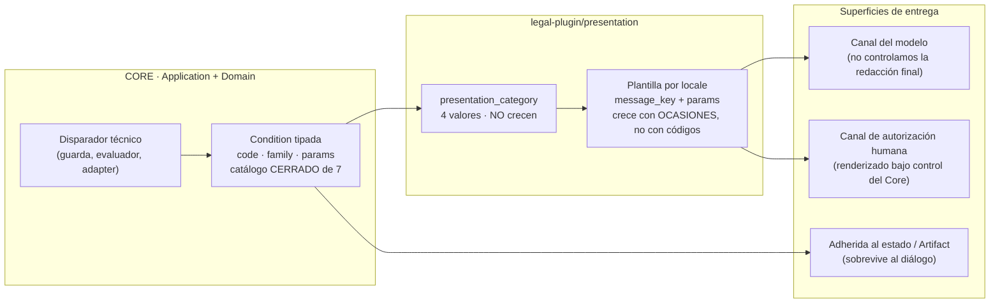

# 11 — Catálogo de condiciones UX y pipeline de presentación

**Estado:** Technical Design V0 (nivel 2 de precedencia, kernel §14). Materializa el **kernel técnico v0.4 §10** —las tres familias de condiciones y el pipeline obligatorio *internal condition → presentation category → human message*— y hace operativa la sección *Conditions emitted to UX* de `docs/architecture/vertical-slice-v0.md`.

**Qué se decide aquí:** la forma del contrato `Condition` (que `05-mcp-contract.md` §4.1 referencia sin definir), la ficha completa de las siete condiciones del catálogo cerrado v0, el lexicón de techo de certeza que hace comprobable la fidelidad epistémica, la política de plantillas por locale y el presupuesto que impide que los códigos internos se multipliquen en mensajes, y —**§6.6**— el catálogo y el pipeline propios de los **mensajes de producto**: los textos que llegan a la profesional **sin nacer de una condición** (capacidad inexistente, resultado vacío, integridad, y los `ErrorCode` que no tienen condición del catálogo).

**Qué NO se decide aquí:** la lista de `ErrorCode` (`03` §0.3 y `05` §4.2, dos listas con propósitos distintos: ver §1.2), los disparadores técnicos de cada condición —que pertenecen a su use case (`03`)—, el canal por el que el mensaje llega a la profesional (`01` §72 punto 3; SUPUESTO abierto), ni la redacción definitiva validada con la usuaria (§8.4).

**Nota de vocabulario obligatoria (kernel §1).** `Principal` (`principal_id`, `principal_type ∈ HUMAN | AI | SYSTEM`, `principal_role`) responde **quién ejecutó**. `provenance_kind` (`EXTERNAL_SOURCE | AI_DERIVATION | AI_INFERENCE | HUMAN_DECISION | SYSTEM`) responde **cuál es la naturaleza epistémica del origen**. Las dos dimensiones son ortogonales y **nunca comparten valores**. En este documento la distinción no es decorativa: el techo de vocabulario de cada plantilla (§4.5) se calcula desde `provenance_kind`, no desde quién invocó la operación.

---

## 1. Qué es una condición, y qué no

### 1.1 Tres cosas distintas que el corpus previo mezclaba

| Concepto | Destinatario | Qué afirma | Dónde vive | Ejemplo |
|---|---|---|---|---|
| **`TypedError`** | el **modelo** | la operación fue rechazada y por qué, en términos que permiten decidir qué intentar a continuación | `envelope.error` (`05` §4.2) | `HUMAN_AUTHORIZATION_MISSING` |
| **`Condition`** | la **profesional** | en qué situación queda el expediente o la autoridad, con o sin rechazo | `envelope.conditions[]`, y **adherida al estado** (§6.4) | `HUMAN_REVIEW_REQUIRED` |
| **Mensaje de producto** | la **profesional** | que una capacidad **no existe** en esta versión, que un resultado vacío es dato normal, o que un rechazo dirigido al modelo hay que decírselo a una persona | fuera del catálogo de condiciones — **catálogo cerrado y pipeline propios en §6.6** (`vertical-slice` §*Conditions*, addendum v0.3 B.6) | "en esta versión no existe forma de marcar una fuente jurídica como verificada" (`prod.capability.absent.verify_legal_source`) |

Las tres reglas duras que se derivan, y que este documento hace comprobables:

1. **Condición ≠ error** (`03` §0.2). Una condición puede acompañar a un `OK`: `ingest_evidence` tiene éxito y deja `ANALYSIS_STALE`. Y un rechazo puede llevar condición: `HUMAN_REVIEW_REQUIRED` y `REVISION_CHANGED` viajan **junto a** un `REJECTED`, no en lugar de él.
2. **Condición ≠ mensaje de producto.** Cuando la capacidad **no existe en la superficie**, el Core nunca ve la operación y **no hay nada que condicionar**: el resultado verificable es la ausencia de la tool en el manifiesto (test de superficie F16). Emitir una condición ahí sería fabricar una guarda que el sistema no ejecuta. **Que no haya condición no significa que no haya plantilla:** el mensaje de producto tiene clave, categoría, techo de certeza y test propios (§6.6). Si no los tuviera, ese texto —el de mayor carga jurídica del producto— lo compondría el modelo, que es exactamente el modo de fallo que PF-004 existe para impedir.
3. **La lista es cerrada.** Siete códigos. Añadir uno es cambio de contrato, con el mismo peso que añadir un evento (ADR-004 inv. 6).

### 1.2 Por qué hay dos listas de `ErrorCode` y una sola de condiciones

`03` §0.3 enumera quince `ErrorCode` de Application (catorce más `E_CHANNEL_NOT_PERMITTED`, añadido al corregir el uso indebido de `OPERATION_NOT_PERMITTED` en `03` §10.12; ver §3.7); `05` §4.2 enumera nueve de la superficie MCP. No es una duplicación por descuido: Application distingue causas que el adapter colapsa deliberadamente hacia el modelo (`E_CASE_NOT_FOUND`, `E_ENTITY_NOT_FOUND` y `E_INBOX_REF_UNRESOLVED` se presentan al modelo como un único `UNKNOWN_REFERENCE`, porque para el invocador la acción siguiente es la misma). El catálogo de condiciones **no** admite esa asimetría: la profesional es una sola, y la condición que la alcanza es la misma la produzca quien la produzca. **De ahí que los errores puedan crecer y las condiciones no.**

### 1.3 El pipeline obligatorio

```text
internal condition  →  presentation category  →  human message (plantilla por locale)
```

Tres pasos, tres responsables, tres reglas de crecimiento distintas:



**Regla de dirección única.** Ningún paso puede saltarse ni invertirse. En particular: **la presentación jamás inventa una condición** (no existe mensaje sin condición o sin **mensaje de producto declarado en §6.6**; INV-UX-14), y **el Core jamás emite prosa** (no existe condición cuyo contenido humano se decida en Application). La `presentation_category` es la bisagra: es lo único que la capa de presentación necesita para decidir *forma*, y el `code` es lo único que necesita para decidir *detalle*.

### 1.4 Contrato `Condition` — PROPUESTA DEL TECHNICAL DESIGN

`05` §4.1 declara `conditions: Condition[]` sin definir el tipo, y `03` §0.2 fija `TypedCondition` en el plano de Application. Se propone esta forma única, válida en ambos planos (Application la emite; el adapter MCP la serializa sin transformarla):

```ts
// CONCEPTUAL. Fija nombres y forma; no es código de producción.

type ConditionCode =
  | 'ANALYSIS_STALE' | 'SEARCH_INCONCLUSIVE' | 'UNCERTAIN_FRAGMENT'   // EPISTEMIC
  | 'HUMAN_REVIEW_REQUIRED' | 'REVISION_CHANGED' | 'OPERATION_NOT_PERMITTED'  // AUTHORITY
  | 'INTEGRATION_ERROR';                                              // INFRASTRUCTURE

type ConditionFamily       = 'EPISTEMIC' | 'AUTHORITY' | 'INFRASTRUCTURE';
type PresentationCategory  = 'NEEDS_YOUR_DECISION' | 'SOMETHING_CHANGED'
                           | 'LIMITED_CERTAINTY'   | 'CANNOT_DO_THAT';
type Severity              = 'INFO' | 'WARNING' | 'BLOCKING';

interface Condition {
  code:                  ConditionCode;
  family:                ConditionFamily;        // derivado del code; nunca se elige por caso
  presentation_category: PresentationCategory;   // derivado de (code, occasion)
  severity:              Severity;
  blocking:              boolean;                // ver §1.5 — significa "la operación NO ocurrió"
  occasion:              string;                 // sufijo del message_key; ver §6.2
  message_key:           string;                 // 'cond.<CODE>.<occasion>' — clave, no prosa
  params:                Record<string, string | number | Array<string | number>>;
  rendered:              { locale: string; text: string };   // ver §6.4 — PROPUESTA
  attached_to?: { entity_kind: 'ARTIFACT' | 'DERIVATION' | 'PROPOSAL'; entity_id: OpaqueId };
}
```

**Tres decisiones dentro de esta forma, con su razón:**

- **`family` y `presentation_category` son derivadas, no elegidas.** Vienen de la tabla del catálogo (§3.1), que es **dato**, no código disperso. Si el emisor pudiera elegirlas, dos disparadores del mismo código acabarían clasificados distinto y la categoría dejaría de ser un contrato.
- **`params` solo admite valores del vocabulario del contrato.** Nunca rutas, nombres de tabla, ids internos, hashes ni relojes internos (§6.3). Es la misma regla dura que `05` §4.2 impone al error, aplicada al canal que sí llega a una persona.
- **`rendered` viaja con la condición. PROPUESTA DEL TECHNICAL DESIGN**, y es la única divergencia deliberada respecto de `ToolError`, que lleva `message_key` y **no** texto. La razón está en la propia distinción de `05` §4.3: *un error es para el modelo; una condición es para la usuaria*. El modelo no necesita prosa —le basta la clave—, pero la condición tiene que atravesar un canal cuya redacción final **no controlamos** (`01` §72 punto 3; hallazgo 4 del spike de Cowork). Enviar el texto ya renderizado hace que **repetir sea el camino más barato** para el modelo. No es una garantía; es reducción de superficie de paráfrasis, y se declara como tal en §6.4.

### 1.5 Qué significa exactamente `blocking`

`blocking = true` significa **la operación no ocurrió y no hay estado parcial**: cero mutaciones canónicas, ningún evento en el Case Event Log, traza en el Tool Invocation Log. No significa "la interfaz impide continuar" —no controlamos la interfaz— ni "hay que resolverlo ya".

Corolario comprobable (INV-UX-03): **toda condición con `blocking = true` acompaña a un `outcome = REJECTED`**, o —cuando el efecto es sobre una operación externa y no sobre el estado canónico— viaja con `effect_on_state = 'NONE'` explícito. Una condición bloqueante junto a un `OK` con mutación es un defecto de veracidad, no un matiz.

---

## 2. Las tres familias

### 2.1 Clasificación normativa (kernel §10)

| Familia | De qué habla la condición | Qué la hace desaparecer | Condiciones v0 |
|---|---|---|---|
| **`EPISTEMIC`** | del **conocimiento del caso**: qué sabe el expediente y con cuánta certeza | un cambio **dentro** del expediente (nueva revisión, artifact nuevo que supersede, derivación disponible) | `ANALYSIS_STALE`, `SEARCH_INCONCLUSIVE`, `UNCERTAIN_FRAGMENT` |
| **`AUTHORITY`** | de **quién puede hacer qué, y contra qué versión**: reglas de autoridad y concurrencia | un **acto humano** (revisión, autorización) o un cambio de política | `HUMAN_REVIEW_REQUIRED`, `REVISION_CHANGED`, `OPERATION_NOT_PERMITTED` |
| **`INFRASTRUCTURE`** | de un **componente que el producto opera y que no es el caso** | un cambio **fuera** del expediente (el adapter vuelve a responder) | `INTEGRATION_ERROR` |

### 2.2 Regla de clasificación — tres preguntas, en este orden

Para clasificar una condición futura sin reabrir la discusión cada vez:

1. **¿De qué es sujeto la frase?** Si el sujeto es el caso o su material → `EPISTEMIC`. Si es una persona, un rol o una versión → `AUTHORITY`. Si es un componente que podríamos sustituir por otro proveedor sin cambiar el dominio → `INFRASTRUCTURE`.
2. **¿Qué la extingue?** Si se extingue con una mutación del expediente → `EPISTEMIC`. Si se extingue con un acto de autoridad → `AUTHORITY`. Si se extingue por algo que no queda registrado en el Case Event Log → `INFRASTRUCTURE`.
3. **¿Su contenido añade algo que el estado no diga ya?** Una condición `EPISTEMIC` añade una lectura del estado que el estado, por sí solo, no comunica (que un artifact quedó desfasado, que un tramo tiene baja confianza). Una condición que solo repite el estado y le añade el nombre del componente que falló es, por construcción, `INFRASTRUCTURE`.

### 2.3 Por qué `INTEGRATION_ERROR` sale del catálogo epistémico

Los dueños sospecharon (kernel §10, §45 de su cuestionario) que `INTEGRATION_ERROR` no pertenece al Core. La sospecha es correcta, y las cuatro razones son independientes entre sí —basta una para justificar la separación; las cuatro juntas la hacen obligatoria.

**(a) El sujeto de la frase es otro.** `ANALYSIS_STALE` habla de un análisis del caso. `UNCERTAIN_FRAGMENT` habla de un tramo del material del caso. `INTEGRATION_ERROR` no habla del caso: habla de **un adapter que el producto opera**. Meterlo en el catálogo epistémico obligaría a que el dominio jurídico tuviera una opinión sobre proveedores, que es exactamente lo que la regla de vendor-independence (kernel §13; ADR-001) prohíbe.

**(b) Su ciclo de vida no es el del expediente.** Toda condición epistémica se extingue con un cambio del expediente, y ese cambio es observable en `case_revision`. `INTEGRATION_ERROR` se extingue cuando el proveedor vuelve a funcionar —un hecho **que no ocurre en el expediente y que el reloj del caso no registra**. Una condición cuya vigencia no es función del estado canónico no puede vivir en el catálogo que describe el estado canónico sin volver ese catálogo mentiroso.

**(c) El estado ya dice lo epistémico; la condición solo aporta la causa.** Cuando una derivación falla, la consecuencia para el conocimiento del caso la lleva **el estado**, no la condición: la `DerivedRepresentation` queda en `FAILED`, el evento `DerivedRepresentationFailed` queda en el log, y —consecuencia que sí importa— esa derivación **no se indexa**, de modo que ese material no aparece en las búsquedas (`04` §6). Todo eso es epistémico y ya está registrado. Lo único que `INTEGRATION_ERROR` añade es **qué componente falló y qué efecto tuvo sobre el estado**, que es información de operación. Clasificarla como epistémica duplicaría en la condición lo que el estado ya afirma, y añadiría detalle de proveedor al catálogo del dominio.

**(d) Es la forma estructural de la regla "retrieval failed ≠ no evidence".** Si un fallo de infraestructura pudiera presentarse con la misma familia que una afirmación sobre el conocimiento del caso, la confusión que §4.2 prohíbe por redacción quedaría **permitida por tipo**. Separar la familia convierte una regla de estilo en una regla de contrato: ninguna plantilla de familia `INFRASTRUCTURE` puede afirmar nada sobre el material probatorio, y el test léxico (§7.2, T-UX-04) lo comprueba.

**Consecuencia de diseño.** La familia `INFRASTRUCTURE` es el lugar previsto para todo lo que llegue después —conectores (Gmail/Drive/Calendar), motor de plazos, actualizaciones— sin tocar el catálogo epistémico. Es una decisión de contención, no de taxonomía.

### 2.4 Por qué en V0 queda **declarada sin disparador ejercitado**

El kernel §10 fija: *"en v0 el slice no tiene conectores externos, así que queda declarada sin disparador ejercitado (honesto, en vez de simulado)"*. Esa frase se sostiene, y conviene precisar qué afirma exactamente, porque hay dos lecturas y solo una es cierta.

- **Lectura incorrecta:** "no existe código que la emita". Falso: `03` §5.11 especifica su emisión en `GenerateDerivedRepresentation` cuando la derivación termina en `FAILED`, con `effect_on_state = 'NONE'`.
- **Lectura correcta, y la que este documento adopta:** *ningún fenómeno real del slice la produce*. El fixture del benchmark sintético **no tiene modos de fallo reales** —`13-synthetic-benchmark.md` lo registra como `NOT_TESTED`: "`DerivedRepresentationFailed` / `INTEGRATION_ERROR` desde fallo real"— de modo que la única forma de dispararla en V0 es **inyección artificial**, que es *simulación declarada, no observación*.

**Precisión terminológica que requiere ratificación (§8.3).** El "conector externo" del kernel §15 designa integraciones de la clase Gmail/Drive/Calendar. El proveedor de transcripción es un **AI-capability port**, no un conector en ese sentido: el Core lo llama, no lo integra. Bajo esa lectura no hay contradicción entre kernel §10 y `03` §5.11. Si los dueños leen "conector" en sentido amplio, la frase del kernel debería precisarse a *"sin fenómeno de fallo ejercitado"*; la semántica del catálogo no cambia en ningún caso.

**Qué se hace con una condición sin disparador ejercitado**, en lugar de simularla:

1. Su ficha se escribe completa (§3.8), con `params` y plantilla, para que el día que falle un proveedor real el mensaje exista y no se improvise.
2. Se ejercita **solo** en test de contrato por inyección de fallo, y el test se rotula como inyección — nunca como evidencia de comportamiento observado.
3. Ninguna afirmación de este documento ni del benchmark presenta su emisión como capacidad demostrada.

**No es la única en ese estado.** `OPERATION_NOT_PERMITTED` está igual (`03` §2.10; `06` §5.3): con un solo principal, sin perfiles y sin salidas jurídicas finales, ninguna política veta nada. V0 tiene por tanto **dos condiciones declaradas sin disparador ejercitado, en dos familias distintas** —`AUTHORITY` e `INFRASTRUCTURE`— y **ninguna** en la familia `EPISTEMIC`. Eso es lo esperable: el slice ejercita conocimiento, no política ni proveedores.

---

## 3. Catálogo v0 — siete condiciones

### 3.1 Tabla normativa (el catálogo es dato, no código)

El catálogo se implementa como **una tabla de descriptores**, no como condicionales repartidos por la Application. Añadir una condición es añadir una fila **y** su plantilla; el test T-UX-05 falla si una fila no tiene plantilla `es-CO`.

| # | `code` | `family` | `severity` | `presentation_category` | user-visible | `blocking` | Disparador ejercitado en V0 |
|---|---|---|---|---|---|---|---|
| 1 | `ANALYSIS_STALE` | `EPISTEMIC` | `WARNING` | `SOMETHING_CHANGED` | sí | **no** (§3.2) | **sí** (solo `reason = NEW_EVIDENCE`) |
| 2 | `SEARCH_INCONCLUSIVE` | `EPISTEMIC` | `WARNING` | `LIMITED_CERTAINTY` | sí | no | sí |
| 3 | `UNCERTAIN_FRAGMENT` | `EPISTEMIC` | `INFO` | `LIMITED_CERTAINTY` | sí | no | **no** desde datos reales (§3.4) |
| 4 | `HUMAN_REVIEW_REQUIRED` | `AUTHORITY` | `INFO` \| `BLOCKING` (§3.5) | `NEEDS_YOUR_DECISION` | sí | según ocasión | sí |
| 5 | `REVISION_CHANGED` | `AUTHORITY` | `WARNING` | `SOMETHING_CHANGED` | sí | **sí** | sí |
| 6 | `OPERATION_NOT_PERMITTED` | `AUTHORITY` | `BLOCKING` | `CANNOT_DO_THAT` | sí | **sí** | **no** (§2.4) |
| 7 | `INTEGRATION_ERROR` | `INFRASTRUCTURE` | `WARNING` | `LIMITED_CERTAINTY` (§3.8) | sí | no sobre el estado canónico | **no** desde fallo real (§2.4) |

**Todas son user-visible.** No existe en v0 la categoría "condición interna que no se muestra": una condición que la profesional no puede ver no protege a nadie. Lo que sí existe es que **el mismo código se adhiera al estado además de al diálogo** (§6.4).

---

### 3.2 `ANALYSIS_STALE`

| Campo | Valor |
|---|---|
| **family** | `EPISTEMIC` |
| **meaning** | Un `Artifact` registrado quedó con insumos desactualizados: sigue siendo un registro fiel de lo que se analizó y cuándo, pero ya no refleja el estado vigente del expediente. |
| **trigger técnico** | `EvaluateArtifactStaleness` (`03` §12), ejecutado **dentro de la transacción del mutador que lo causa**, marca `(artifact_id, reason)` cuando el par pasa de ausente a presente. `reason ∈ NEW_EVIDENCE \| INPUT_SUPERSEDED \| METHODOLOGY_CHANGED`. Emite `ArtifactMarkedStale` (uno por artifact y razón nueva) y avanza `case_revision`. |
| **severity** | `WARNING` |
| **presentation category** | `SOMETHING_CHANGED` |
| **user-visible** | sí — **adherida al artifact en toda proyección que lo devuelva**, no solo en el diálogo (`03` §12.11) |
| **blocking** | **no** en V0. Ver nota abajo. |
| **payload** | `{ artifact_id, artifact_kind, reasons: reason[], triggering_evidence_label?, artifact_created_at }` |

**Las tres `reasons`, y cuáles tienen productor:**

| `reason` | Significado | Productor en V0 | Ocasión / plantilla |
|---|---|---|---|
| `NEW_EVIDENCE` | Entró material nuevo al Case después de registrarse el artifact | **sí** (`IngestEvidence`) | `cond.ANALYSIS_STALE.new_evidence` |
| `INPUT_SUPERSEDED` | Un insumo del artifact cambió de `content_hash` | **no** (no hay regeneración de derivados ni edición de inputs) | declarada, sin plantilla ejercitada |
| `METHODOLOGY_CHANGED` | Cambió la versión de la metodología que lo produjo | **no** (ocurre por release, no por mutación del Case) | declarada, sin plantilla ejercitada |

**Nota sobre `blocking`.** `vertical-slice-v0.md` describe esta condición como *"bloquea su uso como vigente en salida final (política)"*. Eso **no** es un bloqueo de operación: es una política sobre una superficie —el drafting de salidas jurídicas— que **no existe en V0** (kernel §15). Por tanto, en V0 `blocking = false` sobre todas las operaciones existentes, y la política queda declarada, sin superficie que bloquear, para cuando exista drafting. Registrar lo contrario sería afirmar una guarda que ningún camino ejecuta.

**RIESGO heredado (`03` §12.4), que la redacción debe respetar.** `NEW_EVIDENCE` marca **todos** los artifacts del Case, tengan relación o no con el material nuevo. El mensaje, en consecuencia, **no puede afirmar que el material nuevo afecta al análisis**: solo que es posterior a él. Afirmar relevancia sería inventar un juicio que el sistema no hizo.

**Mensaje humano (es-CO) — SUPUESTO, heredado de `vertical-slice-v0.md`:**

> "El análisis de hechos quedó registrado antes de que se incorporara el documento del 12 de marzo de 2026. Sigue guardado tal como estaba y no se modificó nada; para presentarlo como vigente hay que revisarlo con ese material nuevo."

*Fidelidad:* dice qué pasó (es anterior), qué **no** cambió (el artifact sigue igual) y qué puede hacer la profesional (revisarlo). **No dice** que el documento nuevo contradiga el análisis, ni que el análisis sea erróneo, ni que el sistema vaya a regenerarlo — no hay regeneración automática (F11).

---

### 3.3 `SEARCH_INCONCLUSIVE`

| Campo | Valor |
|---|---|
| **family** | `EPISTEMIC` |
| **meaning** | La recuperación **no pudo completarse de forma confiable**. La condición **no afirma nada** sobre el material del expediente. |
| **trigger técnico** | `SearchCase` (`03` §7): fallo o degradación del componente de recuperación — **distinto de resultado vacío**, que es dato normal y no lleva condición. La respuesta trae `hits: null`, **jamás `[]`** (`05` §6.3). |
| **severity** | `WARNING` |
| **presentation category** | `LIMITED_CERTAINTY` |
| **user-visible** | sí |
| **blocking** | no (la operación se completó; su resultado es inutilizable, que no es lo mismo) |
| **payload** | `{}` — deliberadamente vacío: cualquier detalle sobre *por qué* falló la recuperación es ingeniería, y el diagnóstico se recupera por `invocation_id` contra el Tool Invocation Log (`05` §4.2). |

**HECHO VERIFICADO** (kernel §8; fuente: sqlite.org): FTS5 no trae stemming español de serie. **Consecuencia acotada, y solo esta:** la *calibración* del umbral que dispara la condición depende del diseño de normalización — **no** su semántica. **POR VERIFICAR:** la calidad de recuperación en español jurídico. Ninguna afirmación sobre recall se hace aquí ni en ninguna plantilla.

**Mensaje humano (es-CO) — SUPUESTO, heredado de `vertical-slice-v0.md`:**

> "La búsqueda en el expediente no pudo completarse de forma confiable, así que este resultado no permite concluir nada sobre el material del caso. Nada cambió en el expediente. Puedo reintentarla o buscar con otros términos."

*Fidelidad:* la segunda frase es la carga útil —**explicita el no-saber**— y es la única defensa contra que un fallo de recuperación se lea como ausencia de prueba (§4.2). La tercera promete solo capacidades que existen: `search_case` es reinvocable.

---

### 3.4 `UNCERTAIN_FRAGMENT`

| Campo | Valor |
|---|---|
| **family** | `EPISTEMIC` |
| **meaning** | Hay tramos de una `DerivedRepresentation` por debajo del umbral de confianza. **El original sigue siendo la fuente**; el derivado es un instrumento de trabajo, no el material probatorio. |
| **trigger técnico** | Dos ocasiones. (a) `GenerateDerivedRepresentation` (`03` §5.11): la receta reporta segmentos bajo umbral al persistir el derivado; la condición se observa después en `get_case_context`. (b) `GetEvidenceFragment` (`03` §8.10 / `05` §7.3): el fragmento solicitado **intersecta** uno de esos tramos. |
| **severity** | `INFO` |
| **presentation category** | `LIMITED_CERTAINTY` |
| **user-visible** | sí |
| **blocking** | no |
| **payload** | `{ ranges: Array<{ from, to, unit }>, media_kind, evidence_label, derivation_id }` — los rangos van **sobre la línea de tiempo del ORIGINAL**, nunca sobre la del derivado (ADR-003 inv. 7; `04` §3; F5). |

**Disparador ejercitado: NO desde datos reales.** `13-synthetic-benchmark.md` lo registra explícitamente: el fixture no tiene *scores* de confianza por segmento, de modo que la condición **no puede dispararse desde datos**; inyectarlos es simulación declarada. Se ejercita como test de contrato, no como observación.

**Mensaje humano (es-CO) — DECISIÓN APROBADA (dueños), literal:**

> "No pude determinar con suficiente claridad este fragmento. Conviene revisar el audio entre 18:42 y 18:57."

*Fidelidad — por qué esta redacción es correcta y no una cortesía:* la incertidumbre se **localiza en la derivación**, no en el mundo. "No pude determinar" es una afirmación sobre el proceso (`provenance_kind = AI_DERIVATION`); "el audio es inaudible" o "ahí no se dijo nada" serían afirmaciones sobre la realidad que el sistema no está en condiciones de hacer. La segunda frase remite **al original**, que es la regla del techo de certeza para todo derivado (§4.5).

**POR VERIFICAR — formato del rango.** "18:42" es ambiguo entre `mm:ss` y `hh:mm`. La plantilla debe recibir `unit` en `params` y renderizar un formato inequívoco y estable (`00:18:42–00:18:57` es la forma que ya usa `locator_summary` en `05` §6.3). Se registra como defecto de fidelidad, no de estilo: un rango mal interpretado envía a la profesional a escuchar el tramo equivocado. La redacción literal aprobada se conserva como plantilla base; **el formato del rango es el parámetro, y debe unificarse con `locator_summary` antes de implementar** (§8.5).

---

### 3.5 `HUMAN_REVIEW_REQUIRED`

| Campo | Valor |
|---|---|
| **family** | `AUTHORITY` |
| **meaning** | Hay trabajo que **no es del expediente** y que solo un acto humano puede incorporar. El modelo puede saber que hace falta revisión; **nunca** recibe con qué autorizarla (kernel §3.3). |
| **severity** | `INFO` (ocasión informativa) \| `BLOCKING` (ocasión de rechazo) |
| **presentation category** | `NEEDS_YOUR_DECISION` (ambas ocasiones) |
| **user-visible** | sí |
| **payload** | `{ proposal_id, item_ids[], pending_item_count }` |

**Dos ocasiones, dos plantillas, un solo código.** Es el ejemplo canónico de por qué las plantillas se cuentan por **ocasión** y no por código (§6.2):

| Ocasión | Disparador técnico | `severity` | `blocking` | Efecto sobre el estado |
|---|---|---|---|---|
| `proposed` | `ProposeFacts` termina con `OK` (`03` §9.12). También `ReviewProposal` que deja items en `PENDING` (`03` §10.12). | `INFO` | no | La Proposal **sí** se registró; ningún `Fact` cambió de estado |
| `commit_blocked` | `CommitReviewedFacts`: falla la guarda 1, 2 o 5 del gate de autorización — sin autorización viva, consumida, expirada, o con `item_content_hash` distinto (`06` §5.2; kernel §2.3) | `BLOCKING` | **sí** | **Cero mutaciones**; el item con hash cambiado vuelve a `review_decision = PENDING`; la autorización **no se revive** |

**Regla dura del payload frente al mensaje.** El payload lleva `proposal_id` e `item_ids[]` porque **el modelo** los necesita para su siguiente llamada. La plantilla usa exclusivamente `pending_item_count`: **ningún identificador aparece jamás en un mensaje humano** (criterio 12 del slice; INV-UX-04). La misma condición sirve a dos destinatarios con dos vocabularios, y esa es precisamente la función del pipeline.

**Payload normativo de `HUMAN_REVIEW_REQUIRED`: los TRES campos, en todo sitio de emisión.** `{ proposal_id, item_ids[], pending_item_count }`. No es un matiz de forma: el único mensaje que los dueños aprobaron **literalmente** —"Preparé 12 hechos candidatos…"— consume `pending_item_count` y **nada más**, de modo que un sitio de emisión que solo llevara `{proposal_id}` produciría una plantilla irrenderizable, y `INV-UX-04` prohíbe rellenar el hueco con identificadores. **Corrección aplicada** sobre los sitios que emitían un payload incompleto: `03` §9.12, §10.12, §11.13 y §11.9 (que llevaban `{proposal_id}`), `05` §4.3 y su tabla de `commit_reviewed_facts` (ídem), y `06` §5.2 y `12` §3.1 (que llevaban `{proposal_id, item_ids[]}`). De aquí sale el invariante general **INV-UX-13**: *todo sitio de emisión porta los `params` que consume la plantilla de su ocasión* — comprobable en `T-UX-01`, y aplicable por igual a las condiciones y a los mensajes de producto de §6.6.

`pending_item_count` es un **conteo derivado del estado en el momento de emitir**, no un dato que el invocador aporte: en la ocasión `proposed` es el número de items de la Proposal con `review_decision = PENDING`; en `commit_blocked`, el número de items solicitados que el gate dejó sin commitear. Ambos son función del registro del Core, y por eso el modelo no puede inflarlos.

**Mensaje humano, ocasión `proposed` (es-CO) — DECISIÓN APROBADA (dueños), literal:**

> "Preparé 12 hechos candidatos. Necesito que revises cuáles deseas incorporar al caso."

*Fidelidad:* "hechos candidatos" y "cuáles deseas incorporar" fijan por dos vías que nada entró al expediente. No usa "identifiqué los hechos del caso" ni "registré", que elevarían el estado. No promete incorporar nada por su cuenta.

**Mensaje humano, ocasión `commit_blocked` (es-CO) — SUPUESTO, heredado del slice:**

> "Estos hechos están registrados como propuesta y todavía no forman parte del expediente. Para incorporarlos hace falta que usted los revise y los apruebe; yo no puedo hacerlo en su nombre."

**TENSIÓN registrada (§8.2).** La regla de redacción del slice exige que *cada mensaje diga qué pasó, qué NO cambió en el expediente y qué puede hacer la usuaria*. El mensaje aprobado de la ocasión `proposed` no incluye una negación explícita del tipo "nada cambió en el expediente": la sostiene por implicatura léxica ("candidatos", "incorporar"). Se propone precisar la regla —la negación explícita es **obligatoria en ocasiones bloqueantes y en toda condición que siga a una operación mutadora**, y **suficiente por léxico** en las informativas— antes que reescribir un texto que los dueños fijaron. Requiere ratificación.

---

### 3.6 `REVISION_CHANGED`

| Campo | Valor |
|---|---|
| **family** | `AUTHORITY` |
| **meaning** | Se intentó operar contra una revisión que ya no es la vigente. La operación no se aplicó y **el trabajo previo no se descarta**. |
| **trigger técnico** | `expected_revision` ≠ `case.current_revision` en un `COMMAND` o `SENSITIVE_COMMAND` (`03` §4.5, §11.6; `05` §11.2). En `CommitReviewedFacts` se evalúa **antes** que las autorizaciones (`06` §5.4): si el modelo trae una lectura vieja, la llamada falla sin consultar el registro de autorizaciones. También cuando falla la guarda 3 del gate: `authorization.expected_case_revision ≠ case.current_revision` (kernel §2.3). |
| **severity** | `WARNING` |
| **presentation category** | `SOMETHING_CHANGED` |
| **user-visible** | sí |
| **blocking** | **sí** — cero mutaciones canónicas |
| **payload** | `{ expected, current, preserved_proposal_id: OpaqueId \| null }` |

**Dos ocasiones:**

| Ocasión | Cuándo | `preserved_proposal_id` |
|---|---|---|
| `proposal_preserved` | `CommitReviewedFacts` rechazado con cero mutaciones: la Proposal queda intacta y visible en `get_case_context(pending)`, reconstruible con `changes_since` (`03` §11.6). El rótulo agregado `PRESERVED_FOR_RECONCILIATION` es **derivado, nunca almacenado** (vocabulario único: `06` §2.7) y hoy **sin productor en v0** (DECISIÓN PENDIENTE C1) | presente |
| `no_work_pending` | `IngestEvidence` con `expected_revision` obsoleta (`03` §4.5): no hay propuesta que preservar | `null` |

**Regla dura de redacción: los relojes internos no se muestran.** `expected` y `current` viajan en el payload —el modelo los necesita para pedir `changes_since`— y **no aparecen en el mensaje**. Un número de revisión no tiene significado profesional; mostrarlo es exposición de ingeniería con apariencia de precisión.

**Mensaje humano, ocasión `proposal_preserved` (es-CO) — DECISIÓN APROBADA (dueños), literal:**

> "Se incorporó nueva información al expediente desde que se preparó esta propuesta. El trabajo anterior se conserva, pero debe revisarse antes de incorporarlo."

*Fidelidad:* las tres piezas exigidas están, en orden. Qué pasó: entró información. Qué **no** cambió: el trabajo se conserva —y por tanto tampoco se aplicó—. Qué puede hacer: revisarlo antes de incorporarlo. No dice "reconcilié automáticamente" ni "lo actualicé": no hay reconciliación automática, y prometerla sería prometer una capacidad inexistente.

**Nota de aritmética de revisiones (APROBADO — enmienda AC-02).** La **frecuencia** de esta condición depende de la separación entre `event_seq` y `case_revision`, que los dueños **aprobaron** (ADR-004 y ADR-005 enmendados, supersedes §16.16 y §16.19). Bajo el modelo vigente, revisar una propuesta **no** avanza `case_revision`: `ProposalReviewed` avanza solo `event_seq`. En consecuencia `REVISION_CHANGED` **no** se dispara por actos de revisión que no alteran lo que el expediente sabe, y su frecuencia baja a los casos que de verdad importan: incorporación de evidencia y commits. El modelo anterior —en el que todo evento avanzaba la revisión— producía disparos espurios y queda **superado**.

---

### 3.7 `OPERATION_NOT_PERMITTED`

| Campo | Valor |
|---|---|
| **family** | `AUTHORITY` |
| **meaning** | La capacidad **existe** en la superficie y una política o el perfil del principal la vetan. |
| **trigger técnico** | Gate de política sobre una operación disponible: Product Floor, Client Config o perfil del principal. También la guarda 4 del gate de autorización: `authorization.authorized_operation` ≠ operación intentada (`06` §5.2). |
| **severity** | `BLOCKING` |
| **presentation category** | `CANNOT_DO_THAT` |
| **user-visible** | sí |
| **blocking** | **sí** — cero mutaciones |
| **payload** | `{ operation, policy_reason }` |

**Reserva estricta (addendum v0.3 B.6; supersede §16.12).** **No** se emite para operaciones **inexistentes** en la superficie —acreditar directamente un hecho, modificar un `Source`, marcar una fuente jurídica como verificada—. Para esas, el resultado verificable es que la tool **no figura en el manifiesto** (F16), y lo que llega a la profesional es **mensaje de producto**, no condición tipada. La diferencia importa: una condición afirma que el Core evaluó y vetó; un mensaje de producto afirma que no hay nada que evaluar. Confundirlas haría creer que existe una palanca que podría activarse.

**Segunda reserva, del mismo tipo: el canal invocante no es una capacidad vetada.** Una invocación de `ReviewProposal` por un canal que no es el de autorización humana, o con un principal que no es `HUMAN` (`03` §10.4), **no** emite `OPERATION_NOT_PERMITTED`: `ReviewProposal` no está en el manifiesto de 8 tools, luego **no hay capacidad que vetar** y ninguna política podría habilitarla. Ese rechazo es un `ErrorCode` de Application —**`E_CHANNEL_NOT_PERMITTED`** (`03` §0.3, §10.12)— y lo que llega a la profesional es **mensaje de producto** (`prod.channel.not_permitted`, §6.6), no condición tipada. **Corrección aplicada** sobre `03` §10.12, que lo emitía como condición; sin ella, el mismo código habría tenido tres semánticas incompatibles y habría hecho creer que existe una palanca que podría activarse.

**Sin disparador ejercitado en V0** (§2.4): un solo principal, sin perfiles, sin salidas jurídicas finales. **Consecuencia dura, y la que gobierna toda comprobación:** con `policy_reason` como enum vacío, `OPERATION_NOT_PERMITTED` **no puede emitirse en V0 por ningún camino**. Todo veredicto de prueba sobre esta condición es `NOT_TESTED` / por siembra (T-UX-07; `12` §6.5); un veredicto `PASS|FAIL` "por construcción del perfil" presupondría perfiles que `03` §2.10 y §2.4 de este documento declaran inexistentes.

**PROPUESTA DEL TECHNICAL DESIGN — `policy_reason` como enum cerrado, no como texto.** Si `policy_reason` admitiera prosa libre, sería el agujero por el que el lenguaje de ingeniería entra al mensaje humano, anulando toda la disciplina del pipeline. Se propone: `policy_reason` es una clave de un conjunto cerrado, y **cada clave nueva llega acompañada de su fragmento de plantilla en `es-CO`**. Consecuencia deliberada y verificable: en V0 el conjunto está **vacío**, de modo que la condición **no puede emitirse** aunque exista su código — que es la forma más honesta de "declarada sin disparador ejercitado" (T-UX-07).

**Mensaje humano (es-CO) — SUPUESTO, heredado del slice:**

> "Esa operación existe en el producto, pero la política del expediente no permite ejecutarla en este punto: [motivo en términos de política]. No se hizo ningún cambio en el expediente."

---

### 3.8 `INTEGRATION_ERROR`

| Campo | Valor |
|---|---|
| **family** | `INFRASTRUCTURE` (§2.3) |
| **meaning** | Un adapter externo falló. El mensaje **siempre** afirma el efecto sobre el estado del expediente. |
| **trigger técnico** | `GenerateDerivedRepresentation` termina en `FAILED` (`03` §5.11), con evento `DerivedRepresentationFailed`. En V0, `effect_on_state = 'NONE'`: la incorporación del `Source` ya ocurrió y es firme; el fallo no deja estado a medias visible. |
| **severity** | `WARNING` |
| **presentation category** | `LIMITED_CERTAINTY` — ver justificación abajo |
| **user-visible** | sí |
| **blocking** | no sobre el estado canónico. Sí sobre la operación externa, que ya terminó. |
| **payload** | `{ integration, effect_on_state: 'NONE', evidence_label }`. `integration` es una etiqueta **en términos de producto** ("la transcripción"), de un conjunto cerrado; **nunca** el nombre del proveedor, del endpoint ni del código de error del SDK. |

**Por qué `LIMITED_CERTAINTY` y no `CANNOT_DO_THAT`.** `CANNOT_DO_THAT` significa *"esto no se puede hacer"* — una afirmación sobre las capacidades del producto, estable. Un fallo de adapter no es eso: la capacidad existe y el intento no prosperó **esta vez**. Lo que la profesional necesita saber es que **hay una parte del material sobre la que el sistema tiene menos alcance del habitual**, que es exactamente `LIMITED_CERTAINTY`. Clasificarlo como `CANNOT_DO_THAT` induciría a creer que el producto no transcribe.

**Mensaje humano (es-CO) — PROPUESTA DEL TECHNICAL DESIGN, corrige el texto del slice:**

> "No fue posible completar la transcripción de la grabación. El expediente no cambió: la grabación quedó incorporada y su contenido no ha cambiado desde entonces, y la transcripción figura como fallida. Mientras no haya transcripción, esa grabación no aparece en las búsquedas del expediente."

**Corrección de fidelidad aplicada al propio texto (no es cambio de semántica).** La redacción anterior decía *"la grabación quedó incorporada **con su hash**"*, y era el único mensaje del catálogo que fallaba `T-UX-04` hoy: la palabra viola `INV-UX-04` («ningún mensaje humano contiene… hashes»), §6.3 («Hashes, en cualquier forma o longitud») y §4.3 pt.2 («ningún hash se muestra jamás a la usuaria… invita a leerlo como sello de autoridad»), además de `08` §1.3. La sustitución —*"y su contenido no ha cambiado desde entonces"*— dice **exactamente lo mismo que el hash acredita** y nada más: integridad desde la incorporación, jamás autenticidad (§4.3; ADR-006 inv. 6), y usa el término máximo admisible que la tabla de §4.5 fija para un `Source` incorporado con hash coincidente.

**Por qué se corrige.** El texto de `vertical-slice-v0.md` termina con *"Puedo reintentarla cuando usted lo indique"*, y `03` §5 registró la inconsistencia: **ninguna de las 8 tools permite reintentar** una derivación `FAILED`, y reincorporar los mismos bytes es idempotente (no crea derivación nueva). Con la superficie actual, `FAILED` es terminal para el modelo, y el reintento vive en el plano runtime/CLI (clase `ADMIN`, fuera de la superficie del modelo). Prometerlo viola la regla del slice *"nunca promete acciones autónomas futuras"* y, peor, promete una capacidad inexistente. La frase sustituta añade además el efecto epistémico real y comprobable: **una derivación que no está `READY` no se indexa** (`04` §6), de modo que ese material queda fuera del alcance de `search_case`. Ese hecho es el que le importa a la profesional, y es el que evita que un resultado vacío posterior se lea como ausencia de prueba (§4.1). **DECISIÓN PENDIENTE de los dueños** (heredada de `03` §5).

---

## 4. Epistemología aplicada: los cuatro pares que el catálogo no puede confundir

Esta sección es el núcleo del documento. Las cuatro confusiones que siguen son, en un expediente, la diferencia entre una herramienta que ayuda y una que induce a error profesional. La disciplina no se sostiene con buenas intenciones de redacción: **cada par tiene un mecanismo estructural que hace difícil el mensaje incorrecto**, y la redacción es la última capa, no la primera.

### 4.1 `not found` ≠ `does not exist`

**La distinción.** Que una búsqueda no devuelva coincidencias significa que *el índice, con esos términos, sobre el material incorporado y disponible para búsqueda, no encontró nada*. No significa que la cosa no exista: puede estar redactada con otras palabras, en material que nadie incorporó todavía, o en una grabación cuya transcripción no está disponible.

**Mecanismo estructural.**
1. `hits: []` **no lleva condición** (`03` §7.10): un resultado vacío es dato normal. Por tanto no hay condición que "suavice" la redacción — la única defensa es que la plantilla del resultado vacío declare su alcance.
2. El alcance es material, no retórico: **solo se indexan derivaciones en estado `READY`** (`04` §6.5). Un Case puede contener material que existe, está incorporado, es íntegro, y **no es alcanzable por búsqueda**.

**Mensaje INCORRECTO:**

> ~~"Revisé el expediente y no existe ninguna cláusula de exclusividad en el contrato."~~

Tres saltos ilegítimos en una frase: "revisé el expediente" (se consultó un índice), "no existe" (no se encontró), y la atribución al contrato completo de una propiedad que solo se comprobó sobre texto indexado.

**Versión CORRECTA:**

> "No encontré coincidencias para «exclusividad» en el material incorporado y disponible para búsqueda. Eso no permite afirmar que no exista: puede estar redactada con otras palabras, o encontrarse en material que aún no se ha incorporado."

**DECISIÓN PENDIENTE derivada (afecta el contrato de `search_case`, `05` §6.3).** Para que la plantilla pueda decir la verdad completa cuando el Case tiene derivaciones fuera de `READY`, el resultado necesita declarar su cobertura. Se propone un campo mínimo —`coverage: { searchable_derivations, non_searchable_derivations }`— que permita a la plantilla añadir la frase *"…y hay una grabación cuya transcripción todavía no está disponible, que no entra en esta búsqueda"*. Sin ese dato, la plantilla no puede distinguir un expediente completamente indexado de uno que no lo está, y el mensaje correcto se vuelve genérico justo cuando debería ser específico.

### 4.2 `retrieval failed` ≠ `no evidence`

**La distinción.** Una búsqueda que **falló** no es una búsqueda que **no encontró**. La primera no afirma nada; la segunda afirma algo acotado. Colapsarlas convierte un problema técnico en una conclusión probatoria.

**Mecanismo estructural.** La distinción está en el **tipo**, no en el texto: `hits: SearchHit[] | null`, con `null` —**no `[]`**— cuando se emite `SEARCH_INCONCLUSIVE` (`05` §6.3). La plantilla del resultado vacío recibe un array y no puede renderizar `null`; la plantilla de `SEARCH_INCONCLUSIVE` tiene otra clave. **La confusión no es posible sin violar el contrato**, y el test T-UX-03 la comprueba en ambas direcciones.

**Mensaje INCORRECTO:**

> ~~"No hay nada en el expediente sobre los pagos de marzo."~~

**Versión CORRECTA:**

> "La búsqueda en el expediente no pudo completarse de forma confiable, así que este resultado no permite concluir nada sobre el material del caso. Nada cambió en el expediente. Puedo reintentarla o buscar con otros términos."

### 4.3 `hash matches` ≠ `authentic`

**La distinción.** El hash prueba que **los bytes no han cambiado desde que se incorporaron**. No prueba quién produjo el documento, ni que sea genuino, ni que diga la verdad. Es integridad **desde la ingestión**, no autenticidad (ADR-006 inv. 6; ADR-002 §*RIESGO — ventana desprotegida en `Inbox/`*). El material previo a la incorporación no goza de protección alguna: la custodia empieza en el snapshot.

**Mecanismo estructural.**
1. **No existe** en el modelo ningún campo `authentic`, `verified` o `certified` sobre `Source` o `Evidence` (`02`, `04`). No hay estado que renderizar, luego no hay mensaje que lo afirme.
2. **Ningún hash se muestra jamás a la usuaria** (kernel §11, regla dura). Un hash en pantalla invita a leerlo como sello de autoridad.
3. **Una coincidencia de hash no emite condición.** Es el estado normal, no una noticia. Solo su ausencia sería noticia — y en V0 no hay superficie que la produzca.
4. El lexicón (§4.5) prohíbe "auténtico", "verificado" y "certificado" en toda plantilla que hable de un `Source`.

**Mensaje INCORRECTO:**

> ~~"El contrato quedó verificado: su hash coincide, de modo que el documento es auténtico."~~

**Versión CORRECTA:**

> "El documento no ha cambiado desde que se incorporó al expediente el 12 de marzo de 2026. Eso acredita integridad desde la incorporación; no dice nada sobre la autenticidad del documento ni sobre su origen."

### 4.4 `AI inferred` ≠ `verified`

**La distinción.** Un hecho propuesto por el modelo tiene `provenance_kind = AI_INFERENCE` y vive en un `ProposalItem`, fuera del estado curado del expediente. No es un hecho del caso: es una candidatura. Solo un acto humano —revisión, autorización, commit— lo convierte en `Fact` con entrada `ALLEGED`, y **ni siquiera entonces** es un hecho acreditado.

**Mecanismo estructural.**
1. **Techo epistémico del dominio:** ningún principal `AI` transiciona un `Fact` más allá de `PROPOSED` (ADR-003; ADR-001 inv. 1; Product Floor PF-001). La regla se enuncia como invariante de dominio y se comprueba en `AT-001`/`AT-002`.
2. **Gate de commit:** la transición exige una `HumanAuthorization` válida, resuelta **server-side**, ligada a `item_content_hash` + `expected_case_revision` + `consumed_at` + `expires_at` (kernel §3). El modelo nunca recibe con qué autorizar.
3. **El payload de la condición nombra una `Proposal`, jamás un `fact_id`** — porque todavía no hay `Fact` que nombrar. La forma del dato impide la frase.

**Mensaje INCORRECTO:**

> ~~"Ya quedaron establecidos los 12 hechos del caso; el expediente está actualizado."~~

"Establecidos", "los hechos del caso" y "actualizado" elevan tres veces: de candidatura a hecho, de propuesta a expediente, y de operación pendiente a operación consumada.

**Versión CORRECTA (DECISIÓN APROBADA, literal):**

> "Preparé 12 hechos candidatos. Necesito que revises cuáles deseas incorporar al caso."

### 4.5 La regla suprema y su forma comprobable

> **Fidelidad semántica por encima de lenguaje bonito. Ningún mensaje puede elevar la certeza por encima de lo que registra el Core.**

Enunciada así es una intención. Se vuelve operativa con tres piezas:

**(1) Cada plantilla declara su techo.** El descriptor de plantilla lleva `asserts_at_most`: el estado del Core que la habilita. Una plantilla cuyo techo es `PROPOSED` no puede contener vocabulario de `ALLEGED`.

**(2) Lexicón de techo de certeza (es-CO).** Tabla normativa, comprobable por test léxico (T-UX-04):

| Estado que registra el Core | Término máximo admisible | Prohibido en ese estado | Por qué |
|---|---|---|---|
| `ProposalItem` `PENDING` / `Fact` `PROPOSED` (`AI_INFERENCE`) | "hecho candidato", "propuesta", "preparé", "sugiero" | "acreditado", "probado", "establecido", "determinado", "confirmado", "el expediente ya recoge", "registré en el caso" | Nada entró al estado curado |
| `Fact` con entrada `ALLEGED` (tras commit autorizado) | "incorporado al expediente como hecho alegado", "alegado" | "acreditado", "determinado", "probado", "demostrado" | `ALLEGED` es afirmación de parte, no valoración |
| `Fact` `DETERMINED` | — **ningún término**: el estado no existe en V0 | todo | No hay `RecordProfessionalDetermination` en la superficie |
| `Source` incorporado, hash coincidente | "no ha cambiado desde que se incorporó", "íntegro desde la incorporación" | "auténtico", "verificado", "certificado", "válido", "original" (como calificativo de garantía) | §4.3 |
| `DerivedRepresentation` `READY` (`AI_DERIVATION`) | "transcripción generada automáticamente", "texto extraído" | "transcripción fiel", "literal", "certificada", "el testigo dijo" | La fuente sigue siendo el original |
| Tramos bajo umbral | "no pude determinar con suficiente claridad" | "es inaudible", "no se dijo nada", "está en blanco" | Afirmaciones sobre el mundo, no sobre la derivación |
| `DerivedRepresentation` `FAILED` | "la transcripción figura como fallida", "no aparece en las búsquedas" | "la grabación está dañada", "no contiene nada relevante" | El fallo es del adapter (§2.3) |
| `hits: []` | "no encontré coincidencias en el material incorporado y disponible para búsqueda" | "no existe", "no hay prueba de", "queda descartado" | §4.1 |
| `hits: null` (`SEARCH_INCONCLUSIVE`) | "no pudo completarse de forma confiable" | cualquier afirmación sobre el material del expediente | §4.2 |
| Fuente jurídica (sin `verify_legal_source` en V0) | "en esta versión no existe forma de marcar una fuente jurídica como verificada" | "verifiqué", "confirmé la jurisprudencia", "según la sentencia vigente" | PF-004; riesgo n.º 1 del dominio |
| `Artifact` marcado stale | "quedó registrado antes de que se incorporara…" | "está desactualizado y lo actualicé", "ya lo regeneré", "el material nuevo lo contradice" | No hay regeneración automática (F11) ni juicio de relevancia (§3.2) |

**(3) Regla de escalamiento, no de suavizado.** Cuando la frase exacta resulte ilegible o incómoda, **el defecto está en el concepto o en el estado, no en la redacción**. Se escala como decisión de diseño —¿falta un estado?, ¿falta un dato en el payload?— y **nunca** se resuelve eligiendo una palabra más cómoda. El caso real ya ocurrió dos veces en este documento: §4.1 (falta `coverage` en `search_case`) y §3.4 (falta unidad del rango). Ambos se registran como decisiones, no como mejoras de estilo.

---

## 5. Las cuatro categorías de presentación

### 5.1 Definidas por lo que la lectora puede hacer, no por lo que pasó

| Categoría | Pregunta que responde | Qué se espera de la lectora | Forma en la superficie |
|---|---|---|---|
| `NEEDS_YOUR_DECISION` | "¿hay algo que solo yo puedo decidir?" | **Decidir**: revisar, aprobar, rechazar | Debe ofrecer entrada al canal de revisión humana; persiste hasta que se decide |
| `SOMETHING_CHANGED` | "¿cambió algo que yo daba por fijo?" | **Enterarse** y decidir si reconcilia | Debe permitir ver **qué** cambió (`changes_since`) |
| `LIMITED_CERTAINTY` | "¿cuánto puedo apoyarme en esto?" | **Calibrar** su confianza | Adherida al material concreto, no al diálogo |
| `CANNOT_DO_THAT` | "¿por qué no ocurrió?" | **Aceptar** y buscar otro camino | Explica el límite en términos de producto o política, nunca de ingeniería |

**Son cuatro porque son cuatro las respuestas posibles de una persona ante una notificación de este sistema**: decidir, enterarse, calibrar, o desistir. No es una taxonomía de causas —esa es la de los `ErrorCode`, y por eso crece— sino de **acciones siguientes**. Un catálogo de acciones siguientes está acotado por lo que una persona puede hacer, no por lo que la ingeniería puede detectar. **Esa es la razón por la que las categorías no crecen y los códigos sí.**

### 5.2 Mapa completo — condiciones y errores hacia las cuatro categorías

| Origen | Código | Categoría |
|---|---|---|
| Condición | `HUMAN_REVIEW_REQUIRED` (ambas ocasiones) | `NEEDS_YOUR_DECISION` |
| Condición | `REVISION_CHANGED` (ambas ocasiones) | `SOMETHING_CHANGED` |
| Condición | `ANALYSIS_STALE` (las tres `reasons`) | `SOMETHING_CHANGED` |
| Condición | `SEARCH_INCONCLUSIVE` | `LIMITED_CERTAINTY` |
| Condición | `UNCERTAIN_FRAGMENT` (ambas ocasiones) | `LIMITED_CERTAINTY` |
| Condición | `INTEGRATION_ERROR` | `LIMITED_CERTAINTY` |
| Condición | `OPERATION_NOT_PERMITTED` | `CANNOT_DO_THAT` |
| Error (MCP) | `HUMAN_AUTHORIZATION_MISSING` | `NEEDS_YOUR_DECISION` (además emite condición) |
| Error (MCP) | `REVISION_MISMATCH` | `SOMETHING_CHANGED` (además emite condición) |
| Error (MCP) | `POLICY_DENIED` | `CANNOT_DO_THAT` (además emite condición) |
| Error (MCP) | `VALIDATION_FAILED`, `UNKNOWN_REFERENCE`, `CROSS_CASE_REFERENCE`, `NOT_INCORPORATED`, `PROVENANCE_REQUIRED`, `INTERNAL_ERROR` | `CANNOT_DO_THAT` — sin condición del catálogo |
| Application | los 15 `ErrorCode` de `03` §0.3 | `CANNOT_DO_THAT`, salvo `E_ITEM_CONTENT_MISMATCH` → `NEEDS_YOUR_DECISION` y `E_DERIVATION_UNAVAILABLE` → ver `03` §0.3 |

**7 condiciones + 9 errores MCP + 15 errores de Application = 31 códigos internos → 4 categorías.** Ese es el colapso, y aún no hemos contado plantillas.

**Todo lo que en esta tabla figura como «(mensaje de producto)» tiene clave y plantilla propias en §6.6.** La categoría de presentación de un código sin condición del catálogo no se pierde: es la entrada del pipeline de mensajes de producto, que reutiliza estas mismas cuatro categorías y no crea ninguna nueva. Sin ese segundo catálogo, la fila «sin condición» equivaldría a «texto compuesto por el modelo», que es donde vive el riesgo real.

**Hueco declarado (DECISIÓN PENDIENTE heredada de ADR-006, `05` §4.3).** `NOT_INCORPORATED` —referencia probatoria a material no incorporado— **no tiene condición del catálogo**. Es el rechazo con mayor carga jurídica de todo el contrato: dice que se intentó fundamentar un hecho en material que nadie incorporó. Que no tenga condición significa que llega como mensaje de producto, sin adherirse al estado. **Se recomienda decidir explícitamente** si merece condición propia de familia `EPISTEMIC`; no se propone añadirla aquí, porque ampliar el catálogo cerrado es cambio de contrato y la disciplina de alcance de V0 lo desaconseja sin necesidad demostrada. **Lo que sí se cierra —y no es lo mismo— es el hueco de presentación:** mientras la decisión no se tome, ese rechazo se entrega con la plantilla `prod.not_incorporated` (§6.6), sujeta al mismo lexicón y al mismo test léxico. La DECISIÓN PENDIENTE sigue abierta en lo que decide (¿condición o no?); deja de estarlo en lo que la profesional lee.

### 5.3 Precedencia cuando hay varias condiciones en un mismo sobre

`conditions[]` es un array y puede traer más de una: un `commit_reviewed_facts` rechazado por revisión obsoleta puede coexistir con `ANALYSIS_STALE` de una incorporación anterior. Reglas:

1. **Orden normativo:** `blocking = true` primero; después por severidad (`BLOCKING` > `WARNING` > `INFO`); a igualdad, por orden de emisión. Determinista, para que el golden test de proyecciones sea estable.
2. **La categoría dominante es la de la primera condición del array**, y es la que define la forma de la respuesta.
3. **No se fusionan mensajes.** Dos condiciones producen dos mensajes. Fusionarlas obligaría a redactar prosa nueva fuera de plantilla, que es exactamente lo que el pipeline prohíbe.
4. **Presupuesto de atención (PROPUESTA):** si un sobre trae más de tres condiciones, la superficie muestra las bloqueantes íntegras y agrupa el resto por categoría con su conteo. Nunca se descartan: la que no se muestra sigue adherida al estado (§6.4) y visible en `get_case_context`. **Suprimir por presupuesto una condición obligatoria está prohibido** (PF-005).

---

## 6. Política de plantillas por locale

### 6.1 Qué es una plantilla y qué no

```ts
// CONCEPTUAL.
interface MessageTemplate {
  message_key:     string;   // 'cond.<CODE>.<occasion>' — estable; forma parte del contrato
  locale:          string;   // 'es-CO' es la BASE normativa, no una traducción
  asserts_at_most: string;   // techo de certeza (§4.5) que el test léxico verifica
  text:            string;   // con marcadores de params; SIN concatenación condicional
  plural_forms?:   Record<string, { one: string; other: string }>;
  register:        'usted' | 'tu';   // ver §8.2 — DECISIÓN PENDIENTE
}
```

**Reglas duras:**

- **`message_key` es contrato; el texto no.** Cambiar la clave es cambio de contrato (rompe la correspondencia condición↔mensaje y las pruebas). Cambiar la redacción de una plantilla **no** lo es: es exactamente el grado de libertad que este diseño quiere preservar para poder validar la redacción con la usuaria sin tocar el Core (§8.4).
- **Prohibida la concatenación de frases.** Una plantilla es un texto completo con marcadores, no fragmentos ensamblados en tiempo de ejecución. El ensamblaje produce frases que nadie revisó y que ningún test léxico cubrió.
- **Prohibida la interpolación de texto libre del modelo** dentro de una plantilla. Los `params` provienen del Core.
- **Prohibido renderizar el código** cuando falta la plantilla (§6.5).

### 6.2 La ocasión: la unidad que cuenta

Una **ocasión** existe si —y solo si— **la acción recomendada a la lectora difiere**. Mismo código y misma acción ⇒ una sola plantilla con distintos `params`. Este es el freno que impide que cada nuevo disparador engendre un mensaje.

| `code` | Ocasiones V0 | Plantillas `es-CO` |
|---|---|---|
| `ANALYSIS_STALE` | `new_evidence` (las otras dos `reasons` sin productor) | 1 |
| `SEARCH_INCONCLUSIVE` | única | 1 |
| `UNCERTAIN_FRAGMENT` | `fragment` (al citar) · `derivation` (al revisar el material) | 2 |
| `HUMAN_REVIEW_REQUIRED` | `proposed` (informativa) · `commit_blocked` (bloqueante) | 2 |
| `REVISION_CHANGED` | `proposal_preserved` · `no_work_pending` | 2 |
| `OPERATION_NOT_PERMITTED` | única (sin `policy_reason` en V0 ⇒ no emisible) | 1 |
| `INTEGRATION_ERROR` | única | 1 |
| | **Total V0** | **10** |

**Regla de presupuesto (PROPUESTA DEL TECHNICAL DESIGN):** `|plantillas| ≤ |ocasiones|`, y **toda ocasión nueva exige una fila justificada en este documento** que responda: *¿qué haría distinto la lectora?* Si la respuesta es "nada, solo saber más", el detalle va en `params`, no en una plantilla nueva.

### 6.3 Qué puede y qué no puede entrar en `params`

| Permitido | Prohibido |
|---|---|
| Conteos (`pending_item_count`) | Identificadores de entidad de cualquier tipo |
| Fechas del **reloj del Core**, formateadas por locale | Hashes, en cualquier forma o longitud |
| Etiquetas de material en términos de la profesional (`evidence_label`) | Rutas, nombres de archivo del host, nombres de tabla o columna |
| Rangos temporales **sobre el original**, con unidad explícita | `case_revision`, `event_seq` u otros relojes internos |
| Claves de conjunto cerrado (`policy_reason`, `integration`) | Nombres de proveedor, endpoints, códigos de SDK, mensajes de excepción |

Estas prohibiciones son la versión, del lado de la profesional, de las reglas duras que `05` §4.2 impone al error del lado del modelo. El diagnóstico técnico se recupera siempre por `invocation_id` contra el Tool Invocation Log, que vive dentro del Core.

### 6.4 Quién entrega el mensaje — RIESGO declarado, no resuelto

`01` §72 punto 3 ya lo registra y este documento no lo mejora: **`legal-plugin/presentation` produce el texto, pero no controla el canal.** El spike de Cowork lo agrava con hechos: el host no hereda configuración de Claude Code, el modo Auto delega la decisión en el propio modelo, y no hay mecanismo documentado que garantice que un modelo transmita un texto literal (`ESTADO-Y-HALLAZGOS-CRITICOS` §1.1). **No existe garantía de fidelidad de la redacción final en el canal del modelo, y afirmar lo contrario sería inventar una capacidad de plataforma.**

Tres mitigaciones, todas parciales, y así declaradas:

1. **El texto renderizado viaja con la condición** (§1.4). No obliga al modelo, pero hace de la repetición literal el camino más barato.
2. **Las condiciones se adhieren al estado y a los Artifacts**, no solo al diálogo (decisión ya vigente, `01` §72). `ANALYSIS_STALE` viaja pegada al artifact en **toda** proyección que lo devuelva: aunque el modelo no la mencione en el chat, la marca sigue ahí y reaparece en la siguiente consulta.
3. **El canal de autorización humana renderiza bajo control del Core** (ADR-005; `06` §7). Y es el canal donde ocurren las decisiones bloqueantes — de modo que las condiciones cuya deformación sería más grave (`NEEDS_YOUR_DECISION`) son precisamente las que menos dependen del modelo.

**Verificación posible, y la única honesta:** el benchmark sintético revisa las transcripciones de sesión contra el lexicón prohibido (§4.5) y **mide** la tasa de deformación. Es una medición, no una garantía. **POR VERIFICAR:** si el host permite mostrar salida de tools sin mediación del modelo.

### 6.5 Locale, fallback y ausencia de plantilla

- **`es-CO` es la base normativa, no una traducción.** El vocabulario jurídico no sobrevive a un round-trip por inglés: traducir `ALLEGED` como "presunto" en vez de "alegado" cambiaría el estado epistémico que la palabra reporta. Los **identificadores** permanecen en inglés (`ALLEGED`, `PROPOSED`); la **prosa** se escribe primero en español profesional colombiano y desde ahí se localiza.
- **Fallback en cascada, sin invención:** locale pedido → `es-CO` → mensaje genérico de la **categoría**. **Nunca** se renderiza el código interno, nunca se genera prosa nueva, nunca se muestra la clave, y **nunca se muestra el `invocation_id`**. *(Corrección de fidelidad: la versión anterior de esta regla añadía `invocation_id` al mensaje genérico, en contra de `INV-UX-04` y de la prohibición de §6.3 sobre identificadores de entidad. Se retira del texto en vez de declararse excepción: el fallback es el camino menos revisado del pipeline, y una excepción nombrada allí sería la grieta por la que vuelve la jerga. **El diagnóstico no se pierde:** el `invocation_id` de la invocación que cayó al fallback, junto con el `message_key` que faltaba y el locale pedido, quedan registrados en el Tool Invocation Log (INV-UX-09; kernel §8.2), que es donde ya vive todo el diagnóstico técnico del producto —§3.3, §6.3—. Lo que no ocurre es que ese identificador atraviese la frontera hacia una persona.)*
- **Test de completitud (T-UX-05):** toda fila de los **dos** catálogos —el de condiciones (§3.1) y el de mensajes de producto (§6.6)— tiene plantilla `es-CO` para cada una de sus ocasiones declaradas. Falta una ⇒ falla la build, no la conversación.
- **Formatos por locale:** fechas y rangos se formatean por locale, pero la **unidad** de un rango temporal es dato del payload, no del formato (§3.4).

### 6.6 Mensajes de producto — el segundo catálogo, fuera del catálogo de condiciones

**Por qué esta sección existe.** Hasta aquí el documento describe un pipeline riguroso para las **siete condiciones**. Pero tres de los cuatro pares epistémicos de §4 se entregan **fuera** de ese pipeline: el resultado de búsqueda vacío no lleva condición (§4.1, `03` §7.10), la coincidencia de hash no emite condición (§4.3 pt.3), y las capacidades inexistentes no llegan al Core siquiera (§1.1 regla 2; §3.7). A ellos se suman los `ErrorCode` que §5.2 despacha como «mensaje de producto». Sin catálogo, esos textos —**precisamente los de mayor carga jurídica del producto**— no tienen `message_key`, no tienen techo de certeza declarado, no entran en ningún test léxico y acaban compuestos por el modelo. Esta sección los somete al mismo régimen **sin ampliar el catálogo cerrado de siete condiciones**.

**Qué es y qué no es un mensaje de producto.**

- **Es** un texto dirigido a la profesional que **no nace de una `Condition`**, porque no hay guarda que haya evaluado nada: la capacidad no existe en la superficie, el resultado es dato normal, o el rechazo es un `ErrorCode` dirigido al modelo que igualmente hay que contarle a una persona.
- **No es** una condición ni se convierte en una: no viaja en `conditions[]`, **no se adhiere al estado ni a los Artifacts** (§6.4 mitigación 2 no le aplica), no tiene `family`, `severity` ni `blocking`, y no aparece en la tabla §3.1. Añadir una fila aquí **no** es cambio del contrato `Condition` ni del catálogo cerrado; es cambio del catálogo de presentación, con el mismo peso de revisión que cambiar una plantilla.
- **Regla de no promoción, en las dos direcciones:** un mensaje de producto jamás se presenta como condición —afirmaría que el Core evaluó y vetó algo que nunca vio—, y una condición jamás se degrada a mensaje de producto —perdería su adherencia al estado, que es la única mitigación real del riesgo de §6.4—.

**El pipeline propio.** Misma dirección única de §1.3, mismo segundo y tercer paso; solo cambia el primero:

```text
origen declarado (§6.6, lista cerrada de tres)
   →  presentation category (las MISMAS cuatro de §5.1 — no se crea ninguna nueva)
   →  plantilla por locale  (message_key 'prod.<situación>')
```

La diferencia con §1.3 es exactamente una: el primer paso no es una `Condition` tipada, porque no hay nada que tipar. **Los pasos 2 y 3 son idénticos**, y de ahí se sigue lo que esta sección necesita afirmar: las plantillas de producto quedan sujetas a `INV-UX-04` (sin códigos, ids, hashes, rutas, relojes ni nombres de proveedor), `INV-UX-05` (techo `asserts_at_most` contra el lexicón de §4.5), `INV-UX-11` (completitud por locale), `INV-UX-12` (no prometer capacidad ausente ni acción autónoma futura) y a las reglas duras de §6.1 —clave estable, prohibida la concatenación de frases, prohibida la interpolación de texto libre del modelo—. Los tests `T-UX-04` y `T-UX-05` corren sobre **los dos catálogos**.

**Los tres orígenes admisibles — lista cerrada.**

| Origen | Qué lo produce | Dónde se detecta | Ejemplos |
|---|---|---|---|
| `SURFACE_ABSENCE` | La capacidad **no figura** en el manifiesto de 8 tools: el Core nunca es invocado y **no viaja `rendered`** | En la capa de presentación / el skill, contra el manifiesto (`FT-013`/F16) | acreditar o determinar un hecho; modificar o borrar un `Source`; marcar una fuente jurídica como verificada |
| `NORMAL_DATUM` | La operación **tuvo éxito** y su resultado, por diseño, no emite condición | Application (dato del sobre) | `hits: []` (§4.1); coincidencia de hash en la comprobación bajo demanda (§4.3) |
| `MODEL_ERROR` | Un `ErrorCode` **sin condición del catálogo** (`03` §0.3; `05` §4.2 y §4.3) | Application / adapter MCP | `NOT_INCORPORATED`, `E_CROSS_CASE_REFERENCE`, `E_CHANNEL_NOT_PERMITTED`, … |

**RIESGO estructural declarado, no resuelto: el origen `SURFACE_ABSENCE` es el único cuyo texto no puede viajar renderizado desde el Core**, porque no hay invocación. Es la fisura que §6.4 describe, agravada: aquí ni siquiera existe la mitigación 1 (el texto renderizado que viaja con la condición). Lo que queda es la disciplina del skill y la existencia de la plantilla —de la que el skill copia—, y así se declara. **POR VERIFICAR:** si el host permite entregar un texto de producto sin mediación del modelo (misma incógnita de §6.4).

**Catálogo v0 de mensajes de producto — cerrado, con presupuesto propio.** El presupuesto de §6.2 cuenta **plantillas de condición** (diez); estas **no se suman a esas diez** y tienen su propia regla, idéntica en criterio: *una fila existe solo si la acción recomendada a la lectora difiere*. Por eso los `ErrorCode` que **no** llevan condición del catálogo —casi todos los quince de `03` §0.3 y los nueve de `05` §4.2— colapsan en **nueve** ocasiones de producto, y no en veinticuatro mensajes.

| `message_key` | Origen | Códigos que colapsa | Categoría | `asserts_at_most` | Productor en V0 |
|---|---|---|---|---|---|
| `prod.capability.absent.verify_legal_source` | `SURFACE_ABSENCE` | — | `CANNOT_DO_THAT` | Fuente jurídica sin `verify_legal_source` (§4.5) | sí — ausencia en el manifiesto (`FT-013`) |
| `prod.capability.absent.determine_fact` | `SURFACE_ABSENCE` | — | `CANNOT_DO_THAT` | `Fact` `PROPOSED` (§4.5) | sí — ídem |
| `prod.capability.absent.modify_source` | `SURFACE_ABSENCE` | — | `CANNOT_DO_THAT` | `Source` incorporado (§4.5) | sí — ídem |
| `prod.search.no_hits` | `NORMAL_DATUM` | — | `LIMITED_CERTAINTY` | `hits: []` (§4.5) | sí — `SearchCase` (`03` §7.10) |
| `prod.integrity.match` | `NORMAL_DATUM` | — | `LIMITED_CERTAINTY` | `Source` con hash coincidente (§4.5) | sí — comprobación **bajo demanda** (`04` §7; `07` §1.5). La verificación **periódica** es `NOT_IMPLEMENTED` (`12` §6.5) y **no tiene plantilla** |
| `prod.not_incorporated` | `MODEL_ERROR` | `NOT_INCORPORATED` / `E_UNINCORPORATED_REFERENCE`, `E_MISSING_PROVENANCE` / `PROVENANCE_REQUIRED` | `CANNOT_DO_THAT` | material no incorporado (§4.1, §4.4) | sí — `AT-005`, `FT-006.b` |
| `prod.reference.unresolved` | `MODEL_ERROR` | `E_CASE_NOT_FOUND`, `E_ENTITY_NOT_FOUND`, `E_INBOX_REF_UNRESOLVED`, `E_ITEM_NOT_IN_PROPOSAL` / `UNKNOWN_REFERENCE` | `CANNOT_DO_THAT` | *no encontrado* ≠ *no existe* (§4.1) | sí — `AT-012` |
| `prod.reference.other_case` | `MODEL_ERROR` | `E_CROSS_CASE_REFERENCE` / `CROSS_CASE_REFERENCE` | `CANNOT_DO_THAT` | aislamiento por Case | sí — `AT-006` |
| `prod.request.malformed` | `MODEL_ERROR` | `E_SCHEMA_INVALID`, `E_EMPTY_PROPOSAL`, `E_INVALID_FRAGMENT_SELECTOR` / `VALIDATION_FAILED`, `INTERNAL_ERROR` | `CANNOT_DO_THAT` | ninguna afirmación sobre el caso | sí — `AT-002`(a), `FT-014` |
| `prod.nothing_to_commit` | `MODEL_ERROR` | `E_NOTHING_TO_COMMIT` | `CANNOT_DO_THAT` | `ProposalItem` `PENDING` (§4.5) | sí — `03` §11.13 |
| `prod.derivation.unavailable` | `MODEL_ERROR` | `E_DERIVATION_UNAVAILABLE` | `LIMITED_CERTAINTY` | `DerivedRepresentation` `PENDING`/`FAILED` (§4.5) | sí — `FT-003` |
| `prod.item_content_changed` | `MODEL_ERROR` | `E_ITEM_CONTENT_MISMATCH` | `NEEDS_YOUR_DECISION` | `ProposalItem` `PENDING` (§4.5) | **no** — sin productor en la superficie V0 (`03` §10.12); ficha completa, sin disparador ejercitado |
| `prod.channel.not_permitted` | `MODEL_ERROR` | `E_CHANNEL_NOT_PERMITTED` (§3.7; `03` §0.3, §10.12) | `CANNOT_DO_THAT` | ninguna afirmación sobre el caso | **no** — el canal humano es el único emisor de `ReviewProposal` en V0; defensa en profundidad |
| `prod.case.not_openable.dev_stub` | `MODEL_ERROR` | `E_DEV_STUB_CASE_IN_PRODUCTION` | `CANNOT_DO_THAT` | ninguna afirmación sobre el caso | sí — `AT-013` brazo 2 |

**Redacciones `es-CO`.** Se fijan literalmente las **seis** de mayor carga jurídica —las tres de capacidad ausente y las tres de los pares epistémicos de §4—, porque su defecto no sería de estilo sino de derecho. Todas son `SUPUESTO` en el sentido de §8.4: fijan el techo y el contenido obligatorio, no están validadas con una profesional, y cambiar su prosa no cambia ningún contrato.

> `prod.capability.absent.verify_legal_source` — "En esta versión no existe forma de marcar una fuente jurídica como verificada. Puedo mostrarle lo que dice el material incorporado al expediente; no puedo confirmar que una norma o una sentencia esté vigente ni que diga lo que se le atribuye."

> `prod.capability.absent.determine_fact` — "En esta versión no existe forma de dar un hecho por acreditado ni por determinado. Lo que puedo hacer es preparar hechos candidatos para que usted los revise y decida cuáles incorporar como alegados."

> `prod.capability.absent.modify_source` — "El material ya incorporado no se puede modificar ni eliminar desde el producto. Si un documento debe corregirse, se incorpora la versión corregida y ambas quedan en el expediente, cada una con su fecha de incorporación."

> `prod.search.no_hits` — "No encontré coincidencias para «{query_terms}» en el material incorporado y disponible para búsqueda. Eso no permite afirmar que no exista: puede estar redactado con otras palabras, o encontrarse en material que aún no se ha incorporado."

> `prod.integrity.match` — "El documento no ha cambiado desde que se incorporó al expediente el {incorporated_at}. Eso acredita integridad desde la incorporación; no dice nada sobre la autenticidad del documento ni sobre su origen."

> `prod.not_incorporated` — "No puedo sostener un hecho en material que no está incorporado al expediente. Para usarlo como respaldo hay que incorporarlo primero; mientras tanto puede servir para orientar la búsqueda, no para fundamentar."

**TENSIÓN registrada, y su acotación — `{query_terms}` es texto que no proviene del Core.** §6.1 prohíbe *"la interpolación de texto libre del modelo dentro de una plantilla"* y exige que los `params` procedan del Core; los términos de búsqueda proceden de la llamada, es decir, del modelo. Retirarlos volvería el mensaje inverificable para quien lo lee —no podría contrastar qué se buscó—, y por eso el ejemplo de §4.1 los usa. **PROPUESTA DEL TECHNICAL DESIGN: excepción única, nombrada y acotada**, con cuatro límites que la hacen inofensiva: (1) se **cita entre comillas** y nunca se integra en la afirmación de la frase; (2) es **eco literal del argumento de la operación**, tal como quedó registrado en el Tool Invocation Log, jamás una reformulación; (3) se **trunca** a una longitud fija por locale; (4) **no admite marcado ni prosa**: si el argumento contiene algo que no son términos de búsqueda, se cita igual, y su rareza es información honesta para la lectora. No se abre la excepción a ninguna otra plantilla. Requiere ratificación de los dueños junto con el campo `coverage` (§8.5 #8), del que este mismo mensaje depende.

**Las ocho restantes** llevan clave, categoría y techo fijados en la tabla, y su redacción queda **pendiente de escritura** con la misma disciplina; su **contenido obligatorio** —comprobable por `T-UX-04` y por la regla de §3.5 sobre negación explícita— es, en las tres piezas de siempre: *qué ocurrió*, *qué **no** cambió en el expediente* (obligatorio en todas, porque todas siguen a un rechazo) y *qué puede hacer la profesional*. Ninguna nombra el código, el canal, el esquema ni el componente que rechazó.

**Dos consecuencias que conviene dejar escritas.**

1. **`prod.search.no_hits` es hoy el mensaje más expuesto del producto** y su plantilla **no puede decir la verdad completa** mientras `search_case` no declare cobertura: sin el campo `coverage` (§4.1; §8.5 #8), la plantilla no distingue un expediente completamente indexado de uno con derivaciones fuera de `READY`. La frase que falta —*"…y hay una grabación cuya transcripción todavía no está disponible, que no entra en esta búsqueda"*— es la que separa un mensaje correcto de uno genérico justo donde debería ser específico. Se registra aquí como el caso de la regla de escalamiento de §4.5 pt.3: el defecto está en el dato, no en la redacción.
2. **Ningún mensaje de producto se adhiere al estado.** A diferencia de `ANALYSIS_STALE`, si el modelo no lo transmite, no reaparece en la siguiente consulta. Es un riesgo real y asimétrico, y por eso la lista se mantiene corta y su lexicón es el mismo: cuando la única defensa es el texto, el texto tiene que estar escrito y revisado de antemano.

---

## 7. Invariantes verificables y tests

### 7.1 Invariantes

| Id | Invariante | Dónde se aplica | Cómo se comprueba |
|---|---|---|---|
| INV-UX-01 | Toda `Condition` emitida pertenece al catálogo cerrado de 7 códigos | Application | Test de exhaustividad sobre el enum |
| INV-UX-02 | `family` y `presentation_category` se derivan del descriptor, nunca se eligen en el sitio de emisión | Application | Test: emitir con clasificación divergente es imposible por tipo |
| INV-UX-03 | `blocking = true` ⇒ `outcome = REJECTED` **o** `effect_on_state = 'NONE'` explícito; en ambos casos, cero mutaciones canónicas | Application | Property test sobre todos los caminos de rechazo |
| INV-UX-04 | Ningún mensaje humano contiene códigos, identificadores, hashes, rutas, nombres de tabla, relojes internos ni nombres de proveedor | `plugin/presentation` | Test léxico sobre el catálogo de plantillas |
| INV-UX-05 | Ninguna plantilla contiene vocabulario por encima de su `asserts_at_most` | `plugin/presentation` | Test léxico contra la tabla §4.5 |
| INV-UX-06 | `SEARCH_INCONCLUSIVE` ⇒ `hits = null`; `hits = []` ⇒ ninguna condición emitida | Application + MCP | Test de contrato en ambas direcciones |
| INV-UX-07 | `completeness = 'PARTIAL'` ⇒ `omissions ≠ []` (kernel §9) | Application | Property test sobre proyecciones |
| INV-UX-08 | Ninguna condición obligatoria puede suprimirse por configuración; la Client Config solo endurece (PF-005) | **Composition root** (`01` §5.4): validación de la Client Config en carga — no es una capa del Core (`06` §10 inv. 12) | Config que intenta suprimir ⇒ rechazo en carga |
| INV-UX-09 | Toda condición emitida queda registrada en el Tool Invocation Log (kernel §8.2) | Infrastructure | Test de traza por `invocation_id` |
| INV-UX-10 | `ANALYSIS_STALE` viaja adherida al artifact en **toda** proyección que lo devuelva (`03` §12.11) | Application | Golden test de proyecciones |
| INV-UX-11 | Toda fila de **los dos catálogos** —condiciones (§3.1) y mensajes de producto (§6.6)— tiene plantilla `es-CO` para cada ocasión declarada | `plugin/presentation` | Test de completitud en build |
| INV-UX-12 | Ninguna plantilla promete una capacidad ausente de la superficie ni una acción autónoma futura | `plugin/presentation` | Revisión con lista de verbos vetados + verificación contra el manifiesto de 8 tools |
| INV-UX-13 | **Todo sitio de emisión porta los `params` que consume la plantilla de su ocasión** (§3.5) | Application + `plugin/presentation` | `T-UX-01`: para cada ocasión, el conjunto de `params` declarado por el sitio de emisión cubre el conjunto que la plantilla consume. Falta uno ⇒ falla la build |
| INV-UX-14 | Ningún texto llega a la profesional sin proceder de una `Condition` del catálogo **o** de una fila del catálogo de mensajes de producto con **origen declarado** (§6.6). La presentación jamás inventa un mensaje | `plugin/presentation` | Test de exhaustividad: todo `message_key` renderizable resuelve a una fila de §3.1 o de §6.6; todo `ErrorCode` del corpus resuelve a exactamente una fila de §6.6 |

**Nota de locus (corrección de drift).** Los nombres de la columna *Dónde se aplica* son **raíces declaradas del mapa de capas**, no categorías libres. `Presentation` no existía como capa: el pipeline de plantillas vive en la raíz `legal-plugin/presentation` (`01` §2.2), que a partir de esta corrección tiene fila propia en la regla de dependencias (`01` §2.3) y en la matriz verificable de `12` §7.1, con **una sola arista permitida: `plugin/presentation → application_contracts`, restringida a los tipos de `Condition`** (§2). `Configuration` tampoco es una capa: la Client Config se valida en el **composition root** (`01` §5.4), que es el mismo locus que `06` §10 inv. 12 asigna al chequeo de arranque. Sin esta normalización, `SC-01` (`12` §7.4) no podría clasificar esos ficheros y la capa quedaría sin control. `HECHO VERIFICADO` (fuente: `01` §2.2, §2.3, §5.4; `12` §7.1–§7.2).

### 7.2 Tests requeridos

| Id | Test | Verifica | Relación con el corpus |
|---|---|---|---|
| T-UX-01 | Catálogo exhaustivo: cada código emitido resuelve descriptor + plantilla | INV-UX-01, 11 | — |
| T-UX-02 | Rechazo bloqueante ⇒ cero eventos en el Case Event Log, traza en el Tool Invocation Log | INV-UX-03, 09 | `AT-002`, `AT-003`, `AT-004`, `AT-008` (`06` §9) |
| T-UX-03 | `hits: null` vs `hits: []` con sus plantillas distintas; ninguna comparte `message_key` | INV-UX-06 | `05` §6.3 |
| T-UX-04 | Test léxico sobre **los dos catálogos de plantillas** (§3.1 y §6.6): ninguna contiene término prohibido para su techo | INV-UX-04, 05 | Tabla §4.5 |
| T-UX-05 | Completitud de plantillas por locale en **los dos catálogos**, con fallback en cascada | INV-UX-11 | §6.5, §6.6 |
| T-UX-06 | Config que intenta suprimir una condición obligatoria ⇒ rechazo en carga | INV-UX-08 | PF-005 |
| T-UX-07 | `OPERATION_NOT_PERMITTED` **no es emisible** en V0: `policy_reason` es enum vacío | §3.7 | Declarada sin disparador |
| T-UX-08 | `INTEGRATION_ERROR` por **inyección** de fallo del port de transcripción, rotulado como inyección | §2.4, §3.8 | `13` (`NOT_TESTED` desde fallo real) |
| T-UX-09 | Determinismo del orden de `conditions[]` en un sobre con varias | §5.3 | Golden test de proyecciones |
| T-UX-10 | Medición de deformación: transcripciones del benchmark contra el lexicón prohibido | §6.4 | Medición, **no** garantía. **Su instrumento sigue sin definirse:** `13` §16 no incluye la métrica y sus fuentes de datos no comprenden la transcripción de sesión. **DECISIÓN PENDIENTE** (`12` §6.5: *"que la usuaria reciba el texto de una condición — fuera de la suite"*) |
| T-UX-11 | Catálogo de mensajes de producto: toda fila de §6.6 resuelve origen declarado + categoría + techo + plantilla `es-CO` | INV-UX-11, 14 | §6.6 |
| T-UX-12 | Exhaustividad del mapa código → mensaje: **todo** `ErrorCode` de `03` §0.3 y de `05` §4.2 sin condición del catálogo resuelve a **exactamente una** fila de §6.6 | INV-UX-14 | `03` §0.3, `05` §4.2–§4.3, §5.2 |

**Unificación de numeración `AT-xxx` ↔ `T-UX-xx` — RESUELTA en `12` §2.11 y §3.0.** `AT-001..AT-013` es un espacio **cerrado** de acciones hostiles del modelo y **ningún `T-UX` se convierte en `AT`**: los dos espacios coexisten, no se reciclan y nunca designan la misma comprobación. `12-testing-strategy.md` §2.11 declara, para cada `T-UX-01..12`, el nivel en que se ejecuta y el identificador anfitrión (`SC-07`, `SC-08`, `FT-xxx` o el `assertNoEffect` de los trece `AT`), e incorpora `INV-UX-01..14` a su bloque de trazabilidad (§6.6 de ese documento). Los `T-UX-xx` dejan de ser locales a este documento.

---

## 8. Conflictos, tensiones y decisiones que requieren aprobación

**CONFLICTO CON ADR ACCEPTED: ninguno.** Ninguna decisión de este documento contradice ADR-001..ADR-006. Las tensiones que siguen son de redacción, de precisión terminológica o de alcance, y todas se resuelven dentro del corpus vigente.

### 8.1 Los tres mensajes aprobados sustituyen redacciones `SUPUESTO`, no semánticas

`vertical-slice-v0.md` declara explícitamente que sus mensajes de ejemplo son **SUPUESTO hasta validarlos con la usuaria**, y que *"los códigos y su semántica no dependen de esa validación"*. Los tres textos fijados por los dueños son **DECISIÓN APROBADA** y pasan a ser la plantilla canónica de sus ocasiones; los textos del slice se conservan como redacción previa donde no hay texto aprobado. **No hay contradicción**: cambia la prosa, no el código, ni el disparador, ni la clasificación, ni el carácter bloqueante.

Cabe registrar que los tres textos aprobados cubren ocasiones distintas de las que el slice ilustraba: el `HUMAN_REVIEW_REQUIRED` aprobado es la ocasión **informativa** tras `propose_facts`, mientras el del slice era la **bloqueante** tras un commit sin autorización. Eso no es un descuido de los dueños: es la evidencia empírica de que un código necesita más de una plantilla, que es el hallazgo sobre el que se construye §6.2.

### 8.2 Registro de tratamiento: `usted` frente a `tú` — DECISIÓN PENDIENTE

Los mensajes aprobados no son homogéneos. `REVISION_CHANGED` ("debe revisarse") y `UNCERTAIN_FRAGMENT` ("conviene revisar") son impersonales y compatibles con ambos tratamientos; `HUMAN_REVIEW_REQUIRED` usa **tuteo** ("necesito que **revises** cuáles **deseas** incorporar"). Toda la redacción previa del slice usa **usted**. Mezclar tratamientos en un mismo producto es un defecto perceptible en el registro profesional colombiano.

**PROPUESTA:** el tratamiento es **parámetro del locale** (`register` en `MessageTemplate`), no del código, de modo que se fija una vez y se aplica a todas las plantillas sin tocar el Core. **Los dueños deben elegir el tratamiento por defecto de `es-CO`.** Este documento **no altera** los textos aprobados y los reproduce literalmente; la homogeneización se aplica cuando haya decisión.

### 8.3 Precisión sobre "sin conectores externos" (kernel §10)

Ver §2.4. Bajo la lectura de kernel §15 —"conector" = integración de la clase Gmail/Drive/Calendar— no hay contradicción con `03` §5.11, que sí especifica la emisión de `INTEGRATION_ERROR` ante una derivación `FAILED`. Se solicita **ratificar la lectura** o precisar la frase del kernel a *"sin fenómeno de fallo ejercitado"*. La semántica del catálogo es la misma en ambos casos.

### 8.4 Redacción de las plantillas: SUPUESTO estructural, no defecto

Ninguna redacción de este documento está validada con una profesional del derecho. Se declara `SUPUESTO` toda plantilla no fijada por los dueños. El diseño está construido para que esa validación **no toque el Core**: cambiar el texto de una plantilla no cambia `message_key`, ni el descriptor, ni ningún contrato (§6.1). Es la razón principal por la que el pipeline tiene tres pasos y no dos.

### 8.5 Lista de decisiones que requieren aprobación

1. **Forma del contrato `Condition`** (§1.4), incluido `rendered` viajando con la condición —divergencia deliberada respecto de `ToolError`—.
2. **`ANALYSIS_STALE` con `blocking = false` en V0** (§3.2): la política de "no presentarlo como vigente" queda declarada sin superficie que bloquear, porque drafting es POST-V0.
3. **Corrección del mensaje de `INTEGRATION_ERROR`** (§3.8): eliminar la promesa de reintento y añadir el efecto sobre la búsqueda. Heredada de `03` §5 como DECISIÓN PENDIENTE.
4. **`policy_reason` como enum cerrado, vacío en V0** (§3.7), con la consecuencia de que `OPERATION_NOT_PERMITTED` no es emisible en V0.
5. **`INTEGRATION_ERROR` clasificada como `LIMITED_CERTAINTY`** y no como `CANNOT_DO_THAT` (§3.8).
6. **Regla de presupuesto de plantillas** `|plantillas| ≤ |ocasiones|` y el criterio de ocasión (§6.2).
7. **Tratamiento por defecto de `es-CO`** (§8.2).
8. **Campo `coverage` en el resultado de `search_case`** (§4.1) — toca el contrato de `05` §6.3.
9. **Unificación del formato de rango temporal** con `locator_summary` (§3.4).
10. **Precisión de la regla de redacción del slice**: negación explícita obligatoria en ocasiones bloqueantes, suficiente por léxico en informativas (§3.5).
11. **Si `NOT_INCORPORATED` merece condición propia** del catálogo (§5.2) — hueco heredado de ADR-006.
12. **Presupuesto de atención de tres condiciones por sobre** (§5.3).
13. **Catálogo cerrado de mensajes de producto y su pipeline propio** (§6.6): los tres orígenes admisibles, las catorce ocasiones `prod.*` con su presupuesto aparte, los seis textos `es-CO` fijados, la excepción acotada de `{query_terms}`, y los invariantes derivados **INV-UX-13** (todo sitio de emisión porta los `params` que consume su plantilla) e **INV-UX-14** (ningún texto sin condición o sin fila de producto con origen declarado). **No amplía el catálogo cerrado de siete condiciones**: cierra el hueco de presentación de lo que nunca fue condición.

---

## 9. Alcance

**POST-V0**

- **Condiciones de las familias que V0 no ejercita:** conectores (Gmail/Drive/Calendar), motor de plazos, motor procesal, actualizaciones. Todas entran por `INFRASTRUCTURE` sin tocar el catálogo epistémico — que es el objeto de la separación de §2.3.
- **Refinamiento de `ANALYSIS_STALE` por relevancia** (¿el material nuevo toca los inputs del artifact?), junto al DAG de dependencias entre artifacts (`03` §12.4).
- **Localización a otros locales.** La estructura está lista; no hay contenido más allá de `es-CO`.
- **Condiciones sobre entidades reservadas** (`Statement`, `Contradiction`, `Gap`, `LegalIssue`, `Hypothesis`, `Ruling`, `Term`/`Deadline`): ninguna se materializa en V0, ninguna condición las nombra.
- **Superficie de drafting** y con ella el gate de política que daría disparador real a `OPERATION_NOT_PERMITTED` y el bloqueo efectivo de `ANALYSIS_STALE`.
- **Agregación y silenciamiento inteligente** de condiciones repetidas a lo largo de una sesión larga. Requiere datos de uso; diseñarlo ahora sería adivinar dónde está la fatiga.

**DECISIÓN PENDIENTE**

Las trece de §8.5, más la aritmética de revisiones (kernel §5.2), que no cambia la semántica de `REVISION_CHANGED` pero sí su frecuencia (§3.6).

**POR VERIFICAR**

- Si el host permite mostrar salida de tools **sin mediación del modelo** (§6.4; heredado de `01` §72 y del spike de Cowork). Es la incógnita que decide si la fidelidad de la redacción final es garantizable o solo medible.
- Calidad de recuperación en español jurídico y calibración del umbral de `SEARCH_INCONCLUSIVE` (§3.3; HECHO VERIFICADO sobre FTS5 en kernel §8).
- Umbral de confianza que dispara `UNCERTAIN_FRAGMENT` y si el proveedor de transcripción entrega *scores* por segmento (§3.4; el fixture del benchmark no los tiene).
- ~~Numeración definitiva `AT-xxx` y su correspondencia con los `T-UX-xx` (§7.2).~~ **RESUELTA** en `12` §2.11 y §3.0: los dos espacios de identificadores coexisten, cerrados y sin reciclaje; cada `T-UX` declara su nivel y su anfitrión (§7.2).
- Cómo transporta el protocolo MCP el campo `conditions[]` del sobre (`05` §4.1). Es detalle de adapter y no altera el contrato.

---

## 10. Cierre: por qué 100 códigos internos no producen 100 mensajes

La objeción es legítima y es la razón de ser del pipeline: un sistema que detecta muchas cosas tiende a decirlas todas, con el resultado de que la profesional deja de leer. El diseño lo evita con **tres reglas de crecimiento distintas para las tres etapas**, y no con disciplina de redacción.

**Primera etapa — los códigos internos crecen, y está bien que crezcan.** Cada guarda nueva, cada adapter nuevo, cada invariante nuevo puede necesitar su código: es el vocabulario con el que la ingeniería se entiende consigo misma y con el modelo. Hoy son treinta y uno (7 condiciones + 9 errores MCP + 15 errores de Application); mañana pueden ser cien. **Que crezcan no es el problema.**

**Segunda etapa — las categorías de presentación no crecen, porque no dependen de lo que el sistema detecta sino de lo que una persona puede hacer.** Ante una notificación de este producto, la profesional puede: decidir algo que solo ella puede decidir (`NEEDS_YOUR_DECISION`), enterarse de que cambió algo que daba por fijo (`SOMETHING_CHANGED`), calibrar cuánto puede apoyarse en un material (`LIMITED_CERTAINTY`), o aceptar que por aquí no se puede (`CANNOT_DO_THAT`). No hay una quinta. Treinta y un códigos colapsan hoy en cuatro categorías; cien colapsarán en las mismas cuatro. **El colapso es de 31 a 4, no de 31 a 31.**

**Tercera etapa — las plantillas crecen con las ocasiones, y una ocasión existe solo si la lectora haría algo distinto.** No con los códigos: `HUMAN_REVIEW_REQUIRED` tiene dos plantillas porque "hay trabajo esperando tu revisión" y "el commit no se aplicó porque falta tu autorización" piden acciones distintas; `ANALYSIS_STALE` tiene una sola aunque declare tres `reasons`, porque en las tres la acción es la misma —revisar el análisis con lo nuevo—. Siete códigos producen **diez** plantillas en `es-CO`, no siete y tampoco veinte, y la regla de presupuesto (`|plantillas| ≤ |ocasiones|`, §6.2) obliga a justificar por escrito cada ocasión nueva respondiendo una única pregunta: *¿qué haría distinto la lectora?* Si la respuesta es "nada, solo saber más", el detalle va en `params` — que es texto ya escrito y ya revisado, no prosa nueva. Y los `ErrorCode` que **no** llevan condición del catálogo —casi todos los veinticuatro de `03` §0.3 y `05` §4.2— no producen veinticuatro mensajes: colapsan en **nueve** ocasiones de producto, que con las cinco que no nacen de un error suman las **catorce** filas de §6.6, contadas aparte de las diez y con el mismo criterio. El producto puede dirigir a una persona **veinticuatro textos** en V0 —diez de condición y catorce de producto—, todos escritos de antemano y todos sometidos al mismo test léxico.

**Lo que sostiene las tres reglas es que el catálogo es dato, no código.** Una condición no se "emite escribiendo un mensaje" en algún punto de la Application: se emite nombrando una fila de la tabla §3.1, que ya trae familia, categoría, severidad y clave de plantilla. Añadir una condición obliga a añadir la fila **y** la plantilla, o la build falla (INV-UX-11). Eso hace que el coste de añadir un mensaje sea visible en revisión de diseño, en vez de aparecer difuso en cien sitios del código. Lo mismo vale, sin excepción, para el segundo catálogo: un mensaje de producto tampoco se escribe en el punto donde se detecta la situación, sino nombrando una fila de §6.6 con su origen declarado (INV-UX-14).

**Y lo que sostiene la fidelidad no es la buena redacción, sino que el techo de certeza sea comprobable.** Cada plantilla declara el estado del Core que la habilita; el test léxico compara su texto contra el lexicón de §4.5 y falla si eleva. Por eso este documento puede afirmar —y no solo desear— que **ningún mensaje eleva la certeza por encima de lo que registra el Core**: no porque quien redacta sea cuidadoso, sino porque una plantilla que lo intente no pasa la build.

---

## 11. Referencias

- `docs/technical-design/v0/00-technical-kernel.md` — §1 (Principal ≠ ProvenanceKind), §2.3 (invalidación de autorización), §3.3 (autorización server-side), §5.2 (`event_seq` vs `case_revision`), §6 (superficie MCP), §8.2 (Tool Invocation Log), §9 (`completeness`/`omissions`), **§10 (familias y pipeline — este documento lo materializa)**, §11 (hash nunca visible), §12 (Product Floor, PF-001/PF-004/PF-005), §14 (precedencia), §15 (alcance).
- `docs/technical-design/v0/01-system-design.md` — §72 punto 3 (la presentación produce el texto, no controla el canal), §4 (happy path y paso 15 con `ANALYSIS_STALE`).
- `docs/technical-design/v0/03-application-use-cases.md` — §0.2 (`TypedCondition`/`TypedError`), §0.3 (`ErrorCode` de Application), §5.11 (`INTEGRATION_ERROR`, `UNCERTAIN_FRAGMENT`), §7.10 (`SEARCH_INCONCLUSIVE`), §9.12 y §10.12 (`HUMAN_REVIEW_REQUIRED`), §11.6 (`REVISION_CHANGED` que preserva), §12 (`EvaluateArtifactStaleness`).
- `docs/technical-design/v0/04-persistence-model.md` — §3 (segmentos, confianza y coordenadas sobre el original), §6 (FTS5, solo derivaciones `READY` se indexan).
- `docs/technical-design/v0/05-mcp-contract.md` — §4.1 (envelope y `conditions[]`), §4.2 (formato de error y `message_key`), §4.3 (correspondencia error ↔ condición), §6.3 (`hits: null` vs `[]`), §7.3, §11.2.
- `docs/technical-design/v0/06-human-authorization.md` — §5.2 (las cinco condiciones del gate y su condición emitida), §5.3 (`authorized_operation` sin disparador), §5.4 (precedencia de la comprobación de revisión), §6 (lo que el modelo sí y no puede saber).
- `docs/technical-design/v0/12-testing-strategy.md` — §2.11 (nivel de presentación: dónde se ejecuta cada `T-UX-01..12` y unificación con `AT-xxx`/`FT-xxx`), §6.6 (trazabilidad de `INV-UX-01..14`), §7.4 (`SC-07` completitud de los dos catálogos y `SC-08` test léxico), §6.5 (lo declarado no verificable en V0).
- `docs/technical-design/v0/13-synthetic-benchmark.md` — cobertura real: `UNCERTAIN_FRAGMENT` e `INTEGRATION_ERROR` como `NOT_TESTED` desde fenómeno real.
- `docs/technical-design/v0/ESTADO-Y-HALLAZGOS-CRITICOS.md` — §1.1 (cinco hechos verificados del spike de Cowork; base del riesgo de §6.4).
- `docs/architecture/vertical-slice-v0.md` — *Conditions emitted to UX* (catálogo previo, reglas de fidelidad, reserva de `OPERATION_NOT_PERMITTED`), criterio estructural 12, adversariales 1, 4 y 9.
- `docs/architecture/adrs/ADR-001-trust-boundary.md` — inv. 1, 8, 9.
- `docs/architecture/adrs/ADR-003-epistemic-domain-model.md` — techo epistémico de la IA, `PROPOSED → ALLEGED`, inv. 7 (coordenadas sobre el original).
- `docs/architecture/adrs/ADR-004-case-memory.md` — `CaseRevision`, lista cerrada de eventos (inv. 6), biyección mutación↔evento.
- `docs/architecture/adrs/ADR-005-human-authority.md` — inv. 6 (operación sensible sin autorización ⇒ `HUMAN_REVIEW_REQUIRED`, jamás commit parcial).
- `docs/architecture/adrs/ADR-006-evidence-incorporation-boundary.md` — inv. 6 (**integridad desde la ingestión, no autenticidad**), inv. 1 y 2.
- `docs/architecture/adrs/ADR-002-protected-local-case-store.md` — RIESGO de la ventana desprotegida en `Inbox/` y su exigencia de fidelidad epistémica.
