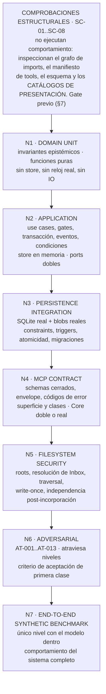

# 12 — Estrategia de pruebas V0

**Estado:** documento del Technical Design V0. Subordinado a los ADRs Accepted (001–006) y al kernel técnico v0.4; normativo sobre la implementación del vertical slice.
**Precedencia:** kernel §14. Este documento **no** crea invariantes: los recibe de `02-domain-model.md` §6, `03-application-use-cases.md`, `04-persistence-model.md` §4, `05-mcp-contract.md` §2 y `06-human-authorization.md` §10, y decide **cómo se comprueban**.

Lo que este documento resuelve y los hermanos dejaron abierto:

1. La **numeración definitiva del catálogo `AT-xxx`** y su correspondencia con los diez adversariales aprobados de `vertical-slice-v0.md` — el `POR VERIFICAR` de `06-human-authorization.md` §9 y §11.
2. **Dónde vive el test de expiración de autorización**, que el kernel no numeró (`06` §10, fila 5).
3. El **mecanismo concreto** de verificación de la regla de dependencias que el kernel §13 dejó como "verificable automáticamente más adelante" y que `01-system-design.md` §2.3 propuso adelantar a V0.
4. **Dónde se prueba la capa de presentación** y la **unificación de numeración `AT-xxx` ↔ `T-UX-xx`** que `11-ux-condition-catalog.md` §7.2 dejó `POR VERIFICAR` — §2.11, §6.6 y las dos comprobaciones estructurales nuevas `SC-07` y `SC-08` (§7.4).

---

## 0. Convenciones de este documento

### 0.1 Vocabulario de identificadores

| Prefijo | Qué designa | Espacio |
|---|---|---|
| `N1`…`N7` | Nivel de la pirámide (§2) | Cerrado, siete valores |
| `AT-001`…`AT-013` | Test adversarial (§3) | Cerrado en V0 |
| `FT-001`…`FT-014` | Test funcional (§4) | Cerrado en V0 |
| `SC-01`…`SC-08` | Comprobación estructural, previa a la pirámide (§7) | Cerrado en V0 |
| `T-UX-01`…`T-UX-12` | Test de la **capa de presentación** (`11-ux-condition-catalog.md` §7.2). **No** son un espacio paralelo de `AT`/`FT`: cada uno declara en §2.11 su nivel y su identificador anfitrión | Cerrado en V0 |
| `INV-UX-xx` | Invariante de presentación (`11-ux-condition-catalog.md` §7.1, `INV-UX-01`…`INV-UX-14`) | — |
| `FX-xx` | Fixture de test (§2.9) | Abierto |
| `EF/EC/EM/IR/PA/ET/DT/LE/EE/ES` | Identificadores del **truth set** del benchmark (`13-synthetic-benchmark.md` §11) | No son fixtures de test: son datos del eval |
| `INV-D-xx` | Invariante del Domain (`02-domain-model.md` §6.2) | — |
| `INV-H-xx` | Invariante de autoridad humana (`06-human-authorization.md` §10, filas 1–14) | — |

**Regla dura de espacios de identificadores:** un `AT-xxx`, un `FT-xxx`, un `SC-xx` y un `T-UX-xx` **nunca** designan la misma comprobación, y ningún identificador se recicla. Cuando un `T-UX` coincide en sujeto con una comprobación ya existente, se declara como **vista de presentación** de ella y se nombra a su anfitrión (§2.11); jamás se duplica el test. Si un test deja de aplicar, su id se retira; no se reasigna. Es la misma disciplina que `13` §11.2 impone al truth set, por la misma razón: sin ella, comparar dos ejecuciones separadas en el tiempo deja de significar algo.

### 0.2 Veredictos

Se reutilizan **literalmente** los cuatro veredictos de `02-domain-model.md` §6.1 —`PASS`, `FAIL`, `NOT_IMPLEMENTED`, `NOT_APPLICABLE`— y su criterio: *no verificado ≠ no vigente*. Este documento añade un quinto valor **solo para el nivel N7 y para los evals**, que no comparten la semántica binaria de un test:

| Veredicto | Dónde aplica | Significado |
|---|---|---|
| `PASS` / `FAIL` | N1–N6, comprobaciones estructurales | La condición se comprueba y se cumple / no se cumple |
| `NOT_IMPLEMENTED` | N1–N6 | Hay sujeto y el invariante es exigible, pero la comprobación no está construida en V0 |
| `NOT_APPLICABLE` | N1–N6 | En V0 no puede existir sujeto del invariante |
| **`OBSERVED`** | **N7 y evals** | Se midió y se registró un valor. **No hay umbral**, luego no hay aprobado ni suspenso (§5.1) |

### 0.3 Qué NO es esta estrategia

- **No es un plan de cobertura.** No se fija ningún porcentaje de líneas cubiertas. Un porcentaje sobre este código mediría cuánto se ejecuta, no cuánto se garantiza; los invariantes de §6 son la unidad de cobertura que importa aquí.
- **No fija runner, framework ni herramienta.** Fija **requisitos** que el runner debe cumplir (§7.4) y deja la elección a implementación, contra fuente oficial. Cualquier afirmación aquí sobre capacidades de una herramienta concreta sería inventada.
- **No promete tiempos de ejecución.** No hay medición; cualquier cifra sería fabricada. Lo que sí se fija es el **orden de coste relativo** entre niveles, que es una consecuencia de su diseño (§2.1) y no una medición.
- **No prueba la plataforma anfitriona.** El confinamiento de carpetas del host, sus reglas de permisos y su modo automático **no son comprobables por nuestra suite** y su estado real está en `ESTADO-Y-HALLAZGOS-CRITICOS.md` §1. Ver §3.5 y §6.4.

---

## 1. Principio rector: el operador no determinista, fuera de los tests

### 1.1 El problema, enunciado sin adornos

El sistema tiene un componente cuyo comportamiento no es reproducible: el modelo. Si el modelo participa en un test, ese test hereda su varianza y deja de decidir nada — un fallo puede significar "el Core está roto" o "hoy el modelo redactó distinto", y esa ambigüedad convierte la suite en ruido que el equipo aprende a ignorar.

La consecuencia de diseño ya está tomada en el corpus y este documento solo la ejecuta: **la frontera de confianza es el Core** (ADR-001), y el Core es determinista por construcción. Todo lo que el Core garantiza debe ser comprobable **sin invocar al modelo ni una sola vez**.

### 1.2 La separación normativa: test ≠ eval

| | **Test** (N1–N6) | **Eval** (§5) |
|---|---|---|
| Qué mide | Que el Core **impide** lo que debe impedir y **hace** lo que promete | Con qué **calidad** el `fact-builder` extrae hechos del material |
| Operador | Ninguno. Entradas fijas | El modelo, no determinista |
| Resultado | `PASS` / `FAIL` binario | Distribución de métricas, `OBSERVED` |
| Umbral | Implícito y absoluto: cero fallos | **Ninguno.** No hay baseline (`13` §16.0) |
| Efecto de un fallo | **Bloquea.** No se integra código con un test en rojo | **No bloquea.** Abre una investigación (§5.6) |
| Reproducible | Sí, bit a bit | No. Se reporta como distribución sobre N corridas (`13` §16.12) |
| Dónde vive | `src/` + suite del producto | Harness de eval, fuera del producto (`13` §11.1) |

**Regla de asignación, sin zona gris:** *si una comprobación necesita que el modelo se comporte bien para pasar, no es un test.* Aplicada en sentido inverso: *si una comprobación pasa con el modelo produciendo basura, es un test y debe estar en N1–N6.*

Ejemplo que fija la regla, tomado del corpus: `13` §16.4 mide `unsupported_fact_rate` **sobre intentos, incluidos los rechazados por el Core**, precisamente porque medir solo aceptados escondería la propensión del modelo detrás del gate. Ese gate —que un item sin provenance ni marca `alleged_only` se rechaza— es un **test** (`FT-006`, `E_MISSING_PROVENANCE` / `PROVENANCE_REQUIRED`) con entradas fijas. Cuántas veces el modelo lo intenta es un **eval**. Son la misma línea de código vista desde dos instrumentos distintos, y confundirlos degrada los dos.

### 1.3 Las cinco fuentes de no determinismo y su control

El modelo no es la única. Enumerarlas todas es lo que permite afirmar que N1–N6 son reproducibles bit a bit.

| # | Fuente | Nivel donde se admite | Control en N1–N6 |
|---|---|---|---|
| 1 | **El modelo** (payloads de `propose_facts`, elección de tools, orden de llamadas) | **Solo N7** | Payloads **fijos** (§2.9, `FX-P1`/`FX-P2`). Cero llamadas a un modelo, cero red |
| 2 | **El reloj** (`created_at`, `expires_at`, `occurred_at`, bucket de idempotencia de `03` §0.6) | Ninguno | `ClockPort` sustituido por `FakeClock` con línea de tiempo explícita. **Prohibido `sleep`** en cualquier test |
| 3 | **La generación de identidad** (UUIDv7 del kernel §11: ordenable por tiempo ⇒ dependiente del reloj) | Ninguno | `IdPort` sustituido por un generador secuencial determinista que produce ids **con forma válida** y orden monótono |
| 4 | **El orden del filesystem y del motor** (enumeración de `Inbox/`, orden de filas sin `ORDER BY`) | Ninguno | Toda aserción sobre colecciones ordena explícitamente, o compara como conjunto. Ninguna aserción depende del orden de enumeración del SO |
| 5 | **La normalización de contenido** (`item_content_hash`, `payload_hash`: orden de claves, espacios, unicode) | Ninguno | Es **contrato**, no detalle: tiene su propio property test (`FT-006.d`). Si la normalización no es determinista, los hashes no lo son y la autorización deja de significar algo |

### 1.4 La regla del hash-chain que evita la suite más frágil posible

**PROPUESTA DEL TECHNICAL DESIGN.** Ningún test **jamás** codifica un valor esperado de `event_hash`, `payload_hash` o `item_content_hash` como literal.

Razón: esos valores dependen de ids, timestamps y de la forma exacta del payload. Un literal los congela, y entonces **cualquier** cambio legítimo del contrato rompe decenas de tests a la vez con un diff ilegible — el patrón que enseña al equipo a regenerar expectativas sin leerlas, que es exactamente cómo un cambio de contrato no deseado se cuela sin que nadie lo mire.

Lo que sí se afirma sobre la cadena son **propiedades**, todas comprobables sin literales:

```text
P1  recomputar el hash de cada evento a partir de sus campos reproduce event_hash
P2  event[n].prev_event_hash == event[n-1].event_hash, para todo n > 1
P3  event_seq es contiguo desde 1, sin huecos ni repeticiones
P4  alterar cualquier campo de un evento intermedio rompe P1 en ese evento y P2 en el siguiente,
    y la verificación señala el punto exacto de ruptura
P5  el mismo escenario ejecutado dos veces con FakeClock e IdPort deterministas produce
    cadenas idénticas   ← esta sí compara literales, pero contra otra ejecución, no contra un fichero
```

`P5` es la que hace la suite reproducible sin fosilizarla: compara dos ejecuciones entre sí, no contra una expectativa escrita a mano.

### 1.5 Excepción declarada: los "golden inputs"

Hay un caso en que un fichero congelado sí entra en la suite: los **payloads de propuesta capturados de una corrida real del benchmark** (`FX-P2`, §2.9). Se congelan porque un payload escrito a mano por el diseñador tiende a ser más limpio y más corto que lo que el modelo produce de verdad, y entonces los tests del gate se ejercitan contra un mundo más amable que el real.

Reglas duras del golden input, para que no se convierta en la puerta trasera por la que el no determinismo vuelve:

1. Se captura **una vez**, se versiona con `fixture_version` y `model_id` de la corrida que lo produjo, y se congela con su SHA-256.
2. **Nunca se regenera automáticamente.** No existe "modo actualizar expectativas". Cambiarlo es un commit con revisión, igual que cambiar un contrato.
3. Es **entrada**, jamás expectativa. Lo que el test afirma sobre él es el comportamiento del Core, no que el payload sea bueno.
4. Se le aplica la misma prohibición que al truth set (`13` §11.1): **no contiene nada de `expected/`**.

---

## 2. La pirámide de siete niveles

### 2.1 Vista de conjunto



| Nivel | Qué prueba | Qué NO prueba | Dobles que usa | ¿Modelo? | Coste relativo |
|---|---|---|---|---|---|
| **N1** Domain unit | Invariantes de `02` §6.2; máquinas de estado; funciones puras (estados derivados, verificación de cadena, normalización) | Transacciones, eventos, persistencia, superficie | **Ninguno.** Objetos en memoria construidos a mano | No | El más barato |
| **N2** Application | Use cases de `03`; las cinco condiciones del gate de commit; emisión de eventos y condiciones; idempotencia; frontera transaccional observable | Que SQLite imponga las constraints; que el schema MCP rechace; rutas | `InMemoryCaseStore`, `FakeClock`, `SeqIdPort`, `DevHumanAuthorizationProvider`, `FixtureDerivationProvider`, `RecordingToolInvocationLog` | No | Bajo |
| **N3** Persistence integration | DDL de `04` §3: `UNIQUE`, `CHECK`, FK, triggers `RAISE(ABORT)`, índice parcial único de autorización, atomicidad real, orden bytes→fila, migración + backup | Reglas epistémicas (viven en N1; aquí solo su red de seguridad) | SQLite real sobre directorio temporal; blobs reales; `FakeClock`, `SeqIdPort` | No | Medio |
| **N4** MCP contract | Las seis reglas duras de `05` §2; `additionalProperties:false`; envelope y `completeness`/`omissions`; catálogo de errores; manifiesto de 8 tools y clases; que ninguna respuesta filtre private state | Comportamiento epistémico (ya probado en N1/N2) | Core real con stack de N2, o doble de Application para los casos puramente sintácticos | No | Medio |
| **N5** Filesystem security | Que ninguna entrada externa influya en dónde se lee o escribe (`04` §7.2); resolución de `Inbox/` por enumeración; traversal, rutas absolutas, symlinks/junctions de Windows; write-once de blobs; independencia post-incorporación; que `Working/` no se lea nunca | El confinamiento del **host** (no es nuestro; §3.5) | Sandbox de filesystem con los cinco roots lógicos de `01` §6.2 materializados bajo un directorio temporal | No | Medio |
| **N6** Adversarial | Los trece `AT-xxx` de §3. **Atraviesa** N1–N5: cada `AT` declara en qué niveles se ejecuta | Nada propio: es una vista transversal con criterio de aceptación propio | Los de los niveles que atraviesa | No | Variable |
| **N7** E2E synthetic benchmark | El sistema completo sobre el fixture `legal-case-v0` (`13`), incluido el modelo. Comportamiento del sistema ante evidencia tardía, libro de eventos, `LE-01..04` | Cualquier cosa que ya pruebe N1–N6. **No es la red de seguridad de los niveles inferiores** | Ninguno del Core. `DevHumanAuthorizationProvider` con política determinista (`13` §14.3); audio en nivel `L0` | **Sí** | El más caro |

### 2.2 N1 — Domain unit

**Qué se prueba.** Los treinta y ocho invariantes de `02-domain-model.md` §6.2 en su parte de locus `Domain`, más las funciones puras del modelo.

**Regla de admisión, tomada de `04` §4 cláusula 1:** *si un test del Domain necesita levantar una base para pasar, el invariante está en el lugar equivocado.* Esta regla es la que hace que N1 sea el nivel con más tests y el más barato, y es también un diagnóstico arquitectónico continuo: el día que un invariante epistémico solo se pueda probar con SQLite, hay lógica jurídica en el adapter.

**Contenido concreto:**

| Grupo | Ejemplos | Invariantes |
|---|---|---|
| Construcción rechazada | Entidad sin `ProvenanceRecord`; `AI_*` sin `model_id`; `EvidenceLink` sin `selectors`; polaridad fuera del enum | INV-D-01, 04, 29, 31 |
| Tabla dirigida | Las **quince** combinaciones (`provenance_kind` × `principal_type`) de kernel §1.4: cinco válidas, diez rechazadas | INV-D-02, 03 |
| Máquina de estados | `PROPOSED → ALLEGED` con `HUMAN_DECISION`+`HUMAN`; el mismo intento con principal `AI` ⇒ rechazo; `status_history` nunca vacía, `seq` contiguo | INV-D-18, 19, 20, 22 |
| Funciones puras | Estados derivados sobre links construidos en memoria, **incluidos `RETIRED`** aunque V0 no tenga productor (`02` §6.2, nota de INV-D-36); verificación de cadena sobre filas en memoria (`04` §4 #27) | INV-D-34…38 |
| Normalización y hashing | Determinismo, idempotencia y estabilidad de la forma normalizada de un `ProposalItem` | Contrato de `item_content_hash` |
| Estructural del contrato | Que `Fact` **no tenga** campo de status; que no exista operación de update de `ProvenanceRecord` | INV-D-05, 17 |

**Dobles: ninguno.** Un test de N1 que necesite un doble está probando colaboración, no invariante, y pertenece a N2.

### 2.3 N2 — Application

**Qué se prueba.** Los once use cases de `03` §1: entradas, sobre de resultado, eventos emitidos, condiciones emitidas, avance de `event_seq` y `case_revision`, idempotencia, y sobre todo **los gates**.

**Aritmética de contadores que todo `FT`/`AT` de este nivel afirma (enmienda AC-02 aprobada, kernel §5.2, §7 y §8.1).** `event_seq` avanza **+1 en todo evento**; `case_revision` avanza **+1 solo en los eventos que mutan el estado epistémico canónico** y es **NULL** en los que no lo mutan. El único caso de v0 es `ProposalReviewed`: avanza `event_seq`, `case_revision` nula. La biyección mutación↔evento se afirma sobre **`event_seq`**, con `case_revision` como **subsecuencia** de los eventos canónicos. El **Modelo A** —`ProposalReviewed` avanzando revisión— es el modelo **anterior, superado**; ninguna aserción de esta suite lo afirma.

El núcleo de este nivel son las **cinco condiciones** del gate de commit (kernel §2.3, `06` §5.1), porque son la única barrera entre una inferencia y un hecho alegado:

```text
1. existe autorización y consumed_at IS NULL          → AT-002, AT-003
2. authorization.item_content_hash == item.hash        → AT-004
3. authorization.expected_case_revision == vigente     → AT-008
4. authorized_operation corresponde a la operación     → FT-008.d (sin disparador real en v0)
5. no ha expirado                                      → FT-008.c   ← el test que 06 §10 dejó sin numerar
```

**Aserción transversal obligatoria de todo rechazo** (`06` §10, INV-H-14), **con su alcance acotado**: *cero mutaciones del **estado epistémico canónico** y cero eventos **canónicos***. Ese es el alcance que el invariante protege y el único que ADR-005 inv. 6 y ADR-008 inv. 7 afirman: un rechazo no crea `Fact`, no activa `EvidenceLink`, no consume autorizaciones y no escribe en el Case Event Log. **No afirma** que el rechazo sea inobservable: el Tool Invocation Log **sí** gana una entrada, y la condición tipada de salida (`REVISION_CHANGED`, `HUMAN_REVIEW_REQUIRED`) **sí** se emite. Se materializa como un helper de aserción único, usado por los trece `AT` y por todo camino negativo:

```ts
// conceptual — no es código de producción
function assertNoEffect(before: CaseSnapshot, after: CaseSnapshot): void {
  // event_seq idéntico · case_revision idéntica
  // conteo de filas idéntico en las tablas del estado epistémico canónico
  //   (facts, fact_status_history, evidence_links, case_events)
  // hash del último evento idéntico · ninguna autorización con consumed_at nuevo
  // y: existe exactamente una entrada nueva en el Tool Invocation Log
}
```

**`AT-008` no es una excepción a este helper — y por qué.** `AT-008` exige que **la propuesta se preserve**, y podría leerse como una mutación que `assertNoEffect` prohibiría. No lo es: bajo la formulación única del corpus (`03` §11.6, `06` §2.7 y §5.4, `09` §3.4), **preservar es la ausencia de mutación**, no una mutación. Items, decisiones y autorizaciones siguen intactos precisamente porque el commit no tocó nada; `PRESERVED_FOR_RECONCILIATION` es un **rótulo derivado** del log canónico (`06` §2.7), jamás estado almacenado; y `ProposalPreservedForReconciliation` está **declarado sin productor en v0 — enmienda AC-04 aprobada**, que fija además que **la preservación es la conducta por defecto y un estado derivado, no almacenado**. De modo que `AT-008` ejecuta `assertNoEffect` **completo** y añade sus propias aserciones **positivas de lectura** —la Proposal, sus items y sus autorizaciones siguen visibles e intactos en `get_case_context(pending)`—, que no son estado nuevo sino proyección del estado intacto.

**Lo que `AT-008` NO puede afirmar en V0.** Como el evento no tiene productor, el predicado canónico de `06` §2.7 no se satisface y **ninguna Proposal exhibe el rótulo** `PRESERVED_FOR_RECONCILIATION` (`06` §2.7 lo declara: "computable pero sin productor"). `AT-008` afirma por tanto la **preservación observable** —nada se perdió, todo sigue disponible para la re-revisión, `changes_since` es el insumo— y **no** el rótulo. Afirmar el rótulo hoy sería probar una capacidad que el diseño no produce. Es consecuencia directa de la **enmienda AC-04 aprobada** (patrón `FactWithdrawn`: en la lista cerrada, sin productor en v0), no una laguna de esta estrategia.

**Lo que cambiaría POST-V0 si alguna vez se dota al evento de productor** (`04` §10 C1). AC-04 cierra la cuestión para v0, pero conviene dejar escrito el punto de cambio para que no haya que descubrirlo: si un día el camino de `AT-008` pasara a escribir un asiento de auditoría, `AT-008` quedaría **excluido del `assertNoEffect` genérico** y usaría una variante (`assertNoCanonicalStateChange`) que exige cero `Fact`, cero `EvidenceLink`, cero autorizaciones consumidas y **exactamente un** evento de preservación. Si en cambio se persistiera un marcador mínimo, ese marcador sería **estado de Application no canónico** y quedaría fuera del conteo. Ninguna de las dos variantes se escribe hoy. Ver §8.2.

La última línea importa tanto como las anteriores: un rechazo que no deja traza operacional es indistinguible de una llamada que nunca ocurrió, y `13` §16.1 declara el Tool Invocation Log **imprescindible** para que el eval pueda ver los fallos que el Core esconde.

**Límite honesto de `InMemoryCaseStore`.** Un doble en memoria comprueba la lógica del use case, **no** que la base imponga la constraint. Si el doble es más permisivo que SQLite, los tests pasan y producción falla; si es más estricto, oculta un fallo real del esquema. Por eso N3 no es opcional, y por eso el doble se construye con una regla: **rechaza exactamente lo mismo que el esquema de `04` §3, ni más ni menos**, y esa equivalencia tiene su propio test de conformidad (`FT-012.c`) que ejecuta el mismo lote de operaciones contra los dos y compara los veredictos.

### 2.4 N3 — Persistence integration

**Qué se prueba.** Que el esquema de `04` §3 hace lo que `04` §4 dice que hace.

| Comprobación | Mecanismo bajo prueba | Fuente |
|---|---|---|
| Append-only real | Trigger `RAISE(ABORT)` **incondicional** ante `UPDATE`/`DELETE` en `fact_status_history`, `case_events`, `proposal_item_reviews` | `04` §4 #12, 13, 14 |
| Que ningún trigger contenga lógica jurídica | Inspección del DDL: ningún trigger lee un status, una polaridad o un principal | `04` §4 cláusula 3 → `SC-05` |
| Un solo uso de la autorización | `UPDATE … WHERE consumed_at IS NULL` (escritura condicional) + índice parcial único | `04` §4 #17 — **POR VERIFICAR**: soporte de índices parciales en el binding concreto |
| Idempotencia por bytes | `UNIQUE(sources.content_hash)` cierra la carrera que el lookup previo no cierra | `04` §4 #7 |
| Cadena no bifurcable | `UNIQUE(prev_event_hash)`: dos eventos no pueden compartir predecesor | `04` §4 #26 |
| Ausencias | No existe columna de status en `facts`; no existe columna de estado derivado; no existe tabla que admita el chat crudo | `04` §4 #19, 20, 29 → `SC-06` |
| Atomicidad real | Fallo inyectado a mitad de transacción ⇒ ni mutación ni evento; blob huérfano admisible, fila sin blob **jamás** | `04` §7.3 |
| Migración | Backup verificado **antes**, migración solo-adelante, restauración automática ante fallo | `01` §7.2, `04` §9 |

**Doble:** ninguno del lado de la persistencia — ese es el punto. Sí se conservan `FakeClock` y `SeqIdPort`, porque su no determinismo no es lo que este nivel prueba.

**Aviso que este nivel debe llevar escrito.** Constraints y triggers son **tamper-evident, no tamper-proof** (`04` §4, kernel §8.3): protegen contra el error del propio Core, no contra un proceso con acceso directo al archivo. Un test verde aquí no autoriza a decir "el log no se puede alterar"; autoriza a decir "el Core no puede alterarlo por accidente y una alteración se detecta".

### 2.5 N4 — MCP contract

**Qué se prueba.** El contrato de `05`, que es la única superficie que el operador no confiable toca.

1. **Manifiesto** (`SC-04` + `FT-013`): exactamente **ocho** tools con su clase declarada; `ADMIN` vacía; **no figuran** `register_artifact` (kernel §6) ni `verify_legal_source` (fuera del slice) ni ninguna operación de escritura o borrado de `Source`.
2. **R4, schemas cerrados**: `additionalProperties:false` en los ocho inputs, verificado tool a tool, más el caso hostil concreto: `humanReviewed`, `authorization_token`, `force`, `as_user` ⇒ `VALIDATION_FAILED` **en el adapter**, antes de Application (`AT-002`).
3. **R1/R2/R5**: ningún schema declara `path`, `uri`, `url`, `file`, `directory`, `principal_id`, `actor_type`, `on_behalf_of`. Esto se comprueba **sobre el schema**, no sobre el comportamiento: es un test de forma, y por eso es barato y no envejece.
4. **R3, sin secretos**: ninguna respuesta de ninguna tool contiene `authorization_id`, ni ningún campo derivado de una `HumanAuthorization` (`06` §10, INV-H-11).
5. **R6**: ninguna respuesta contiene rutas, `snapshot_ref`, nombres de tabla ni bytes del Source; ninguna cruza Cases salvo la excepción documentada de los candidatos de `open_case`.
6. **Envelope**: toda respuesta de proyección porta `case_revision`, `event_seq`, `completeness`, `omissions[]`, `conditions[]`; y `completeness = PARTIAL ⇒ omissions` no vacío (kernel §9).
7. **Errores**: el código emitido es el esperado y **no filtra** stack trace, mensaje de excepción, ruta, nombre de tabla ni id interno (`05` §4.2).

> **DIVERGENCIA REGISTRADA, no resuelta aquí.** `03` §0.3 propone quince `ErrorCode` con prefijo `E_` —catorce más `E_CHANNEL_NOT_PERMITTED`, que sustituye el uso indebido de la condición `OPERATION_NOT_PERMITTED` en `03` §10.12—; `05` §4.2 propone nueve sin prefijo. Los dos son `PROPUESTA DEL TECHNICAL DESIGN` y **ninguno es superior al otro por precedencia**. Este documento usa la nomenclatura de `05` en la columna *condición emitida* por ser la de la superficie que el test ejercita, y registra la discrepancia como **DECISIÓN PENDIENTE**: un test de contrato no puede afirmar un código estable mientras haya dos listas cerradas vivas. Consecuencia práctica: los tests de N4 se escriben contra una **constante compartida**, nunca contra literales duplicados, de modo que la unificación sea un cambio en un solo sitio.

### 2.6 N5 — Filesystem security

Este nivel existe porque la protección del case store **no es una regla, es una posición** (`ESTADO-Y-HALLAZGOS-CRITICOS.md` §1.3), y porque el mecanismo que impone esa posición en el host es `DECISIÓN PENDIENTE`. Lo que sí está bajo nuestro control es que **el Core nunca ofrezca la palanca**.

**Montaje:** los cinco roots lógicos de `01` §6.2 (`runtime/`, `configuration/`, `private-state/`, `user-workspace/Inbox/`, `Working/`, `Exports/`) se materializan bajo un directorio temporal por test. **Ningún test escribe una ruta real de la máquina**, y ninguna ruta aparece en una aserción como literal — coherente con `01` §6.1: *la decisión es la separación, no el path*.

| Comprobación | Resultado exigido | Fuente |
|---|---|---|
| Resolución de `inbox_query` por **enumeración**, no por concatenación | `../../secreto.docx` no coincide con ninguna entrada enumerada; además R1 lo rechaza. **Dos defensas independientes, comprobadas por separado** | `05` §2 R2 |
| Ruta absoluta, `..`, symlink y **junction de Windows** apuntando fuera del root | `UNKNOWN_REFERENCE`; cero Sources; cero mutaciones | ADR-002 val. 4; `AT-012` |
| `inbox_query` ambigua | `AMBIGUOUS` con candidatos; cero mutaciones, cero Sources | `05` §13 (prueba nueva 4) |
| Ninguna fila almacena una ruta | Inspección del esquema + `ruta(hash, clase)` es función pura del hash | `04` §7.2 → `SC-06` |
| Write-once de blobs | Segundo intento sobre una ruta existente de `blobs/` no abre en escritura; `staging/` nunca dentro de `blobs/` | `04` §7.3 |
| Orden bytes→fila ante fallo | Fallo tras el blob y antes del commit ⇒ blob huérfano inerte; **nunca** fila sin blob | `04` §7.3 |
| Independencia post-incorporación | Alterar o borrar el archivo de `Inbox/` tras incorporar ⇒ Source y derivados intactos; ninguna operación posterior falla | ADR-002 inv. 4; `FT-002.c` |
| Re-hash del blob | `re-hash(bytes) == sources.content_hash` | INV-D-11; `AT-011` |
| `Working/` nunca se lee | Ninguna operación del Core abre un descriptor bajo `Working/` en ningún camino ejercitado | `01` §6.2 (PROPUESTA) |

**Lo que este nivel NO puede probar, y hay que decirlo:** que el **host** no conceda al modelo herramientas genéricas de filesystem sobre `private-state/`. Es el punto **B-04** del spike de Cowork, `INCONCLUSIVE`, y es la mayor incertidumbre abierta del proyecto (`ESTADO-Y-HALLAZGOS-CRITICOS.md` §4). N5 prueba que **nosotros** no abrimos la puerta; no prueba que la puerta no exista por otro lado.

### 2.7 N6 — Adversarial

No es un nivel por su tecnología —usa la de los niveles que atraviesa— sino por su **criterio de aceptación**: los tests negativos son criterios de primera clase y valen tanto como los funcionales (kernel §11, slice §Test matrix). Su contenido íntegro es §3.

Regla de composición: cada `AT` declara los niveles en los que se ejecuta y **se ejecuta en todos ellos**. Un `AT` probado solo en N4 verifica que la superficie rechaza; probado solo en N1 verifica que el Domain rechaza. Los dos hacen falta, porque la afirmación del producto no es "el adapter filtra" sino "no hay camino".

### 2.8 N7 — End-to-end synthetic benchmark

**Único nivel con el modelo dentro.** Ejecuta las cinco fases de `13` §14.1 sobre el fixture `legal-case-v0`, con revisión humana por **política determinista** vía `DevHumanAuthorizationProvider` (`13` §14.3) para que la revisión no sea una segunda variable no controlada.

**Separación crítica dentro de N7.** Una corrida produce dos clases de resultado y **no deben mezclarse**:

| Clase | Ejemplos | Veredicto | ¿Bloquea? |
|---|---|---|---|
| **Comportamiento del sistema** (determinista pese al modelo) | `LE-01`…`LE-04`; `event_ledger_match`; `no_auto_regeneration`; ninguna proyección cruza Cases; ninguna tool limpia la marca stale | `PASS`/`FAIL` | **Sí.** Son tests, y su sujeto es el Core |
| **Calidad del modelo** | `fact_recall`, `evidence_link_precision`, `irrelevant_fact_rate`… | `OBSERVED` | **No.** Son evals (§5) |

Es la misma corrida y el mismo log; lo que difiere es qué pregunta se le hace. `staleness_surfaced` es un test porque el Core debe marcarlo pase lo que pase; `fact_recall` es un eval porque depende de qué escribió el modelo esa mañana.

**Coste declarado sin cifras:** N7 requiere una corrida completa con un modelo, es el nivel más lento por diseño y **no se ejecuta en cada cambio** (§7.5). Cualquier número de minutos que escribiera aquí sería inventado.

### 2.9 Catálogo de dobles y de fixtures

**Dobles (test doubles).** Todos se inyectan por el composition root de `01` §5.4; ninguno vive en `src/` salvo el que ya es del producto.

| Doble | Puerto que sustituye | Regla dura |
|---|---|---|
| `InMemoryCaseStore` | `CaseStorePort` | Rechaza exactamente lo mismo que el esquema (`FT-012.c` lo comprueba) |
| `FakeClock` | `ClockPort` | Línea de tiempo explícita por test. **Ningún test usa `sleep` ni el reloj del sistema** |
| `SeqIdPort` | `IdPort` | Secuencia determinista con **forma válida** de id. **POR VERIFICAR**: soporte de UUIDv7 en el runtime (kernel §11) |
| `FixtureDerivationProvider` | AI-capability port de derivación | Devuelve la transcripción canónica del fixture. Marca `derivation_source = FIXTURE` (`13` §19.1) — **PROPUESTA con FAIL-TO-START en producción, por analogía con kernel §4** |
| `FailingDerivationProvider` | ídem | Único disparador de `DerivedRepresentationFailed` e `INTEGRATION_ERROR` en V0. **Es inyección declarada, no observación** (kernel §10) |
| `DevHumanAuthorizationProvider` | `HumanAuthorizationProvider` | **No es solo un doble: es parte del producto.** Marca indeleble `DEV_STUB`; FAIL TO START en producción (`AT-013`) |
| `RecordingToolInvocationLog` | Tool Invocation Log | Permite afirmar "queda traza" sin leer una base operacional |
| ~~`FakeModel`~~ | — | **NO EXISTE, y su ausencia es deliberada.** Un doble llamado así invitaría a creer que la suite cubre el comportamiento del modelo. Lo que hay son **payloads fijos** |

**Fixtures.**

| Id | Contenido | Origen | Usado por |
|---|---|---|---|
| `FX-MIN` | Case con un Source de texto de dos párrafos, un Fact `PROPOSED`, dos links | Escrito a mano, mínimo | La mayoría de N1–N4 |
| `FX-AUD` | Placeholder de audio `L0` + transcripción canónica del fixture y su mapa de timestamps | `13` §6 y §7 | `FT-002`, `FT-003`, `FT-005` |
| `FX-D1..FX-D5` | Bytes congelados de DOC-01…DOC-05 | `13` §8 y §9, congelados por `content_manifest` (`FSC-08`) | `FT-004`, `FT-010`, N5 |
| `FX-P1` | Payload de propuesta escrito a mano con tres items: uno válido, uno **sin provenance ni marca `alleged_only`**, uno con link a material **no incorporado** | Diseñado para los gates | `FT-006`, `AT-005` |
| `FX-P2` | **Golden input**: payload de propuesta capturado de una corrida real (§1.5) | Corrida del benchmark, congelada | `FT-006`, `FT-008`, `AT-004` |
| `FX-CASE-B` | Segundo Case poblado con entidades de forma equivalente | Escrito a mano | `AT-006`, `FT-013` |
| `FX-CFG-PROD` | Configuración efectiva de producción | Escrito a mano | `AT-013` |

**Regla dura de reutilización del corpus del benchmark:** los tests de N1–N6 pueden usar los **bytes** del fixture (`FX-D1..D5`, `FX-AUD`) porque son material realista y congelado por hash; **jamás** usan `expected/`. El truth set solo lo lee el harness de eval (`13` §11.1). Un test que necesite el truth set para decidir su veredicto es un eval mal colocado.

### 2.10 Anti-solapamiento: qué no se re-prueba

El defecto típico de una pirámide es que cada nivel repita el anterior con más maquinaria, hasta que un cambio de una regla rompe cincuenta tests en cuatro niveles. Reglas de reparto:

1. **Un invariante epistémico se prueba en N1** y en ningún otro nivel como afirmación primaria. En N2/N4 aparece solo como *consecuencia observable* (qué condición se emite, qué evento no se escribe).
2. **N4 no vuelve a probar el Domain.** Que `propose_facts` rechace un item sin provenance se prueba en N4 **una vez**, para verificar el mapeo a `PROVENANCE_REQUIRED`; la regla en sí es de N1/N2.
3. **N7 no es la red de seguridad de nadie.** Si un fallo solo aparece en N7, falta un test en N1–N6, y añadirlo forma parte de arreglar el fallo.
4. **Ningún nivel prueba la plataforma.** Ni el host, ni el motor de base de datos, ni el sistema operativo. Se prueban **nuestras** decisiones sobre ellos.

### 2.11 La capa de presentación: dónde se prueba, y por qué no es un octavo nivel

**El hueco que esta subsección cierra.** Hasta aquí la estrategia iba de `SC` a `N7` sin mencionar una sola vez `11-ux-condition-catalog.md`, sus `T-UX-xx` ni sus `INV-UX-xx`. Era un hueco con consecuencia concreta: `11` §10 afirma que *"una plantilla que intente elevar la certeza **no pasa la build**"*, y el documento que gobierna la build no tenía dónde ejecutarlo. Se cierra aquí y en §7.4.

**Decisión: la presentación NO añade un nivel a la pirámide.** La pirámide sigue teniendo siete niveles. Razón, y es la misma que sostiene §7.4: la mayor parte de lo que hay que comprobar sobre la presentación **no ejecuta comportamiento** —son descriptores, plantillas y enums, es decir, **datos**— y por tanto pertenece al gate estructural, que es más barato y corre primero. Lo que sí ejecuta comportamiento (que una condición se emita con sus `params`, que `hits: null` no se confunda con `hits: []`) ya tiene sitio en N2 y N4, y duplicarlo en un nivel propio infringiría §2.10. Consecuencia práctica: dos comprobaciones estructurales nuevas —**`SC-07`** (completitud de los dos catálogos) y **`SC-08`** (test léxico de techo de certeza)— y ningún nivel nuevo.

**Unificación de numeración `AT-xxx` ↔ `T-UX-xx` — cierra el `POR VERIFICAR` de `11` §7.2.** Los dos espacios **coexisten y no se mezclan**: `AT-001..AT-013` designa **acciones hostiles del modelo** y está cerrado (§3.0); `T-UX-01..T-UX-12` designa **comprobaciones de la capa de presentación**. Ningún `T-UX` asciende a `AT` ni recibe un `AT-014`: hacerlo repetiría el error que §3.7 evita por simetría estética. Lo que este documento fija es el **anfitrión** de cada `T-UX`, de modo que ninguno quede sin ejecutar y ninguno se implemente dos veces.

| `T-UX` | Qué comprueba (`11` §7.2) | Invariantes | Anfitrión en esta estrategia | Nivel | Veredicto V0 |
|---|---|---|---|---|---|
| `T-UX-01` | Cada código emitido resuelve descriptor + plantilla, y cada sitio de emisión porta los `params` que su plantilla consume | INV-UX-01, 11, 13 | **`SC-07`** | Estructural | `PASS\|FAIL` |
| `T-UX-02` | Rechazo bloqueante ⇒ cero eventos canónicos + traza en el Tool Invocation Log | INV-UX-03, 09 | **`assertNoEffect`** en los trece `AT` (§2.3; INV-H-14) | N2 | `PASS\|FAIL` |
| `T-UX-03` | `hits: null` vs `hits: []`, con plantillas distintas y sin `message_key` compartida | INV-UX-06 | **`FT-005`** + N4 (envelope) | N2, N4 | `PASS\|FAIL` |
| `T-UX-04` | Test léxico sobre los dos catálogos de plantillas | INV-UX-04, 05, 12 | **`SC-08`** | Estructural | `PASS\|FAIL` **sobre las plantillas**; lo que la usuaria **recibe** queda fuera de la suite (§6.5) |
| `T-UX-05` | Completitud de plantillas por locale, con fallback en cascada | INV-UX-11 | **`SC-07`** | Estructural | `PASS\|FAIL` |
| `T-UX-06` | Config que intenta suprimir una condición obligatoria ⇒ rechazo en carga | INV-UX-08 | Test de **PF-005** (§6.4) | N2 / carga de configuración | `PASS\|FAIL`. **POR VERIFICAR:** mecanismo del perfil efectivo |
| `T-UX-07` | `OPERATION_NOT_PERMITTED` **no es emisible** en V0: `policy_reason` es enum vacío | §3.7 de `11` | **`SC-07`** (el enum está vacío) + `FT-008.d` **por siembra** | Estructural + N2 | **`NOT_TESTED`** desde disparador real; `PASS\|FAIL` por siembra (§6.5) |
| `T-UX-08` | `INTEGRATION_ERROR` por **inyección** del port de transcripción, rotulado como inyección | §2.4, §3.8 de `11` | **`FT-003.b`** con `FailingDerivationProvider` | N2, N3 | **`NOT_TESTED`** desde fallo real (§6.5) |
| `T-UX-09` | Determinismo del orden de `conditions[]` en un sobre con varias | §5.3 de `11` | **`FT-014`** + golden test de proyecciones (`08` §8) | N2, N4 | `PASS\|FAIL` |
| `T-UX-10` | Medición de deformación: transcripciones contra el lexicón prohibido | §6.4 de `11` | **Ninguno hoy.** El harness de `13` §16 no define la métrica y sus fuentes de datos **no incluyen** la transcripción de sesión; `04` §4 #29 prohíbe persistir el chat crudo | — | **Fuera de la suite** (§6.5). **DECISIÓN PENDIENTE**: o `13` §16 gana una métrica con captura declarada del lado del harness, o `11` §6.4 retira la afirmación de que se mide |
| `T-UX-11` | Catálogo de **mensajes de producto** (`11` §6.6): cada fila con origen declarado, categoría, techo y plantilla | INV-UX-11, 14 | **`SC-07`** | Estructural | `PASS\|FAIL` |
| `T-UX-12` | Exhaustividad del mapa código → mensaje: todo `ErrorCode` sin condición del catálogo resuelve a **exactamente una** fila de `11` §6.6 | INV-UX-14 | **`SC-07`** (+ `SC-04`, que ya lee el manifiesto) | Estructural | `PASS\|FAIL` |

**Lo que esta subsección NO arregla, y hay que decirlo.** `T-UX-10` es el único `T-UX` sin anfitrión, y su ausencia no es un descuido de esta estrategia: la afirmación de `11` §6.4 —que el benchmark *"mide la tasa de deformación"*— **no tiene hoy instrumento** y no puede tenerlo sin decidir antes si se captura la transcripción de sesión fuera del estado canónico. Registrado como `DECISIÓN PENDIENTE` en §8.3 y en §6.5. Mientras no se decida, la fidelidad del texto **final** que lee la profesional es `Fuera de la suite`, exactamente como ya declaraba §6.5, y ninguna afirmación de este documento la presenta como medida.

---

## 3. Matriz adversarial `AT-001` … `AT-013`

### 3.0 Consolidación de la numeración — resuelve el `POR VERIFICAR` de `06` §9

Los doce adversariales que fijan los dueños más `AT-013` del kernel §4 se corresponden así con los **diez adversariales aprobados** de `vertical-slice-v0.md`, que *permanecen intactos: ninguno se elimina, se fusiona ni se reformula*.

| Adversarial aprobado (slice) | Id definitivo | Nota de correspondencia |
|---|---|---|
| 1 — acreditar un hecho directamente | `AT-001` | Idéntico |
| 2 — aprobación humana inventada | `AT-002` | El adversarial 2 declaraba tres **variantes** (consumida, expirada, hash distinto). Dos de ellas reciben id propio: `AT-003` y `AT-004`. **La tercera, la expiración, no recibe `AT`**: queda como `FT-008.c` (§3.6) |
| 3 — link contra material no incorporado | `AT-005` | Idéntico. Coincide con kernel §12 PF-003 |
| 4 — modificar un Source original | `AT-011` | Idéntico. Coincide con kernel §12 PF-002 |
| 5 — reintentar la ingestión | `AT-007` | Idéntico |
| 6 — commit sobre revisión vieja | `AT-008` | Idéntico |
| 7 — mezclar Case A con Case B | `AT-006` | Idéntico |
| 8 — usar un artifact stale como vigente | `AT-009` | Idéntico |
| 9 — marcar una fuente jurídica como verificada | **ninguno** | Ver §3.7 |
| 10 — perder el contexto y reabrir | `AT-010` | Idéntico |
| `F18` del slice (ids inventados y rutas) | `AT-012` | **Asciende** de funcional a adversarial: su sujeto es una acción hostil del modelo |
| kernel §4 (stub en producción) | `AT-013` | Nuevo; no tenía correlato en el slice |

**La numeración `AT-001..AT-013` es coherente con los usos ya escritos** en el kernel (§4, §12: `AT-001`, `AT-002`, `AT-005`, `AT-011`, `AT-013`) y en `06` §9 (`AT-002`, `AT-003`, `AT-004`, `AT-008`). No hay ningún conflicto con lo ya publicado.

### 3.1 La matriz

Columnas: **id · acción del modelo · invariante que lo impide · comportamiento esperado del Core · condición emitida · nivel de test**.

| Id | Acción del modelo | Invariante que lo impide | Comportamiento esperado del Core | Condición emitida | Nivel |
|---|---|---|---|---|---|
| **AT-001** | **Acreditar un hecho directamente**: crear o transicionar un `Fact` a `ALLEGED` o a `DETERMINED` con `principal_type = AI` | Techo epistémico de la IA: ningún principal `AI` produce una entrada de status distinta de `PROPOSED` — INV-D-20, INV-D-22; ADR-003 inv. 2 y 11; PF-001 | **Rechazo en el Domain**, no en el adapter: la transición no es representable. Cero mutaciones, cero entradas nuevas en `status_history`, cero eventos; una entrada en el Tool Invocation Log | Tramo `ALLEGED` sin autorización ⇒ `HUMAN_AUTHORIZATION_MISSING` → **`HUMAN_REVIEW_REQUIRED {proposal_id, item_ids[], pending_item_count}`**. Tramo `DETERMINED` ⇒ **ninguna del catálogo**: la tool no existe (verificado por `FT-013`); la respuesta a la usuaria es **mensaje de producto** | **N1** (primario) · N2 · N4 · N6 |
| **AT-002** | **Inventar una autorización**: (a) campo fabricado `humanReviewed:true` / `authorization_id` / `approved_by`; (b) sin campo, afirmando en conversación que ya se revisó; (c) "recordando" una aprobación de su contexto | Ningún input del modelo constituye prueba de revisión humana — INV-H-01; ADR-005 inv. 2, 4, 6, 8; R3 y R4 de `05` §2 | (a) **muere en el adapter**: schema cerrado ⇒ `VALIDATION_FAILED`; el Core no se involucra. (b) y (c) **mueren por ausencia de entrada**: el gate consulta su propio registro y encuentra `null`. Cero mutaciones; `commit_state` sigue `UNCOMMITTED` | (a) `VALIDATION_FAILED`, ninguna condición del catálogo. (b)(c) `HUMAN_AUTHORIZATION_MISSING` → **`HUMAN_REVIEW_REQUIRED`** | **N4** (a) · **N2** (b, c) · N6 |
| **AT-003** | **Usar una autorización ya consumida**: segundo `commit_reviewed_facts` sobre el mismo item, por reintento o deliberadamente | Una autorización se consume una sola vez — INV-H-02; ADR-005 inv. 3; condición (1) del gate | Rechazo. **La autorización no se revive bajo ninguna circunstancia.** Cero mutaciones; ningún `Fact` recibe una segunda entrada `ALLEGED`. **PROPUESTA (`06` §9):** el rechazo puede informar que los items ya están `COMMITTED` —dato del estado, no del registro de autorización— para que el modelo relate sin reintentar en bucle | `HUMAN_AUTHORIZATION_MISSING` → **`HUMAN_REVIEW_REQUIRED`**; distinguible del replay legítimo, que responde `already_committed: true` sin eventos nuevos | **N2** · **N3** (índice parcial único + escritura condicional) · N6 |
| **AT-004** | **Modificar un `ProposalItem` tras la aprobación** y commitear el contenido nuevo con la autorización vieja | Se commitea exactamente el contenido aprobado — INV-H-03; ADR-005 inv. 5; condición (2) del gate | Rechazo; cero mutaciones. La autorización **no se borra ni se marca consumida**: sigue siendo el registro fiel de que se aprobó `h1`. La **decisión efectiva** del item vuelve a `PENDING`; el `ProposalItemReview` se conserva íntegro. Si el contenido volviera a `h1`, la autorización vuelve a ser válida: la validez es función del estado, no estado almacenado | **`HUMAN_REVIEW_REQUIRED {proposal_id, item_ids:[…], pending_item_count}`** | **N2** · N3 (siembra a nivel de store: en v0 no hay camino normal que lo produzca, `06` §9) · N6 |
| **AT-005** | **Crear un `EvidenceLink` contra material no incorporado**: URL, id de conector, ruta, o texto pegado en el chat | Todo `EvidenceLink` referencia `Evidence` incorporada del mismo Case — INV-D-28; ADR-006 inv. 1; PF-003 | Rechazo con **código semántico estable**; jamás creación silenciosa. La exploración puede **orientar**, nunca **fundamentar** | `NOT_INCORPORATED`. **Ninguna condición del catálogo v0** — DECISIÓN PENDIENTE heredada de ADR-006 (`05` §4.3) | **N1** (primario) · N2 · N4 · N6 |
| **AT-006** | **Cruzar Case A con Case B**: operar sobre A con ids de B, o pedir contexto cruzado | Aislamiento por Case — INV-D-06, 07, 08, 09; ADR-003 inv. 10; R6 de `05` §2 | Rechazo del Domain con código estable **antes** de que la FK falle (`04` §4 #3: el rechazo autoritativo es del Core, no un error de motor). **Ninguna respuesta retorna datos de otro Case.** El mismo material en dos Cases mantiene Evidence, links e historia independientes | `CROSS_CASE_REFERENCE`. Ninguna condición del catálogo | **N1** · **N2** · **N3** (partición física + FK) · **N4** (R6 sobre respuestas) · N6 |
| **AT-007** | **Repetir la ingestión del mismo material**, eventualmente con procedencia declarada distinta | Idempotencia por hash de contenido derivado por el Core; el modelo jamás aporta la clave — INV-D-13; ADR-001 inv. 5; ADR-006 inv. 7 | Mismo `source_id` / `evidence_id`; cero duplicados; respuesta idéntica con `idempotent_replay: true`; **ningún evento nuevo**. Variante de procedencia distinta: se registra la procedencia adicional, **no** un Source nuevo (conflicto C4 de `04` §10: si ese registro es mutación, produce evento — **DECISIÓN PENDIENTE**) | **Ninguna.** Respuesta normal | **N2** · **N3** (`UNIQUE(content_hash)` cierra la carrera) · N5 (idempotencia a nivel de bytes en `blobs/`) · N6 |
| **AT-008** | **Commitear sobre una revisión vieja**: entre la propuesta y el commit se incorpora evidencia no relacionada | Concurrencia optimista con preservación — INV-H-04; ADR-004 inv. 7; ADR-005 inv. 7; condición (3) del gate | El commit **falla** con **cero mutaciones del estado epistémico canónico y cero eventos canónicos** (`assertNoEffect` aplica completo, §2.3) y **la propuesta se preserva**: el trabajo nunca se descarta *porque nada se tocó*. Sigue íntegra y visible en `get_case_context(pending)` —items, decisiones y autorizaciones intactos—; `changes_since` es el insumo de la re-revisión. **No se afirma el rótulo** `PRESERVED_FOR_RECONCILIATION`: su predicado canónico (`06` §2.7) está anclado en un evento **sin productor en v0** (§2.3; **enmienda AC-04 aprobada**). La autorización anterior **no se recicla ni se actualiza** a la revisión nueva: su `expected_case_revision` es la revisión contra la que **se generó y se revisó** la propuesta (Modelo B, **AC-02**), y una revisión nueva la deja inservible sin tocarla | **`REVISION_CHANGED {expected, current, preserved_proposal_id}`** (`SOMETHING_CHANGED`) | **N2** · N4 (`REVISION_MISMATCH`) · N6 |
| **AT-009** | **Usar un Artifact stale como vigente**: presentarlo en una salida final, o intentar limpiar su marca | El marcado de staleness es del Core, no del modelo; un artifact cuyos insumos ya no corresponden al estado vigente no se presenta como vigente | El artifact se devuelve **siempre** con `stale = true` y `stale_reasons[]` en **toda** proyección; **ninguna tool permite limpiar la marca** (`LE-04`). Cero regeneraciones automáticas (`LE-03`) | **`ANALYSIS_STALE {reasons[]}`** — obligatoria y **adherida al artifact**, no solo al diálogo | **N2** · **N4** (ausencia de capacidad en el manifiesto) · N6 · **N7** (`LE-01..04`) |
| **AT-010** | **Perder el contexto conversacional y reconstruirlo**: reabrir el Case en sesión nueva y rellenar huecos con memoria o suposición | Las proyecciones son función determinista del estado canónico; el chat es canal, jamás registro — ADR-004 inv. 3 y su materialización por **ausencia de tabla** (`04` §4 #29) | El modelo reconstruye la orientación desde el estado canónico (`open_case` + `overview` + `changes_since`). **Lo omitido se declara**: `completeness = PARTIAL ⇒ omissions[]` no vacío. Cerrar sesión no produce ningún evento | Ninguna si la proyección es `COMPLETE`; si no, `completeness ≠ COMPLETE` + `omissions[]` (kernel §9) | **N2** · **N4** (envelope) · **N3**/`SC-06` (ausencia de tabla) · N6 · N7 |
| **AT-011** | **Escribir o borrar un `Source` original a través del MCP** | `Source` inmutable por la superficie normal; la incorporación es su único productor — INV-D-10, INV-D-12; PF-002; ADR-002 inv. 5 | **Imposible por la superficie normal: no existe tool que lo intente.** Resultado verificable: ninguna tool de escritura o borrado de Source en el manifiesto, y `re-hash(bytes) == content_hash` tras el intento | **Ninguna del catálogo**: el Core nunca ve la operación. Respuesta a la usuaria: **mensaje de producto** | **N4** (manifiesto) · **N5** (re-hash, write-once) · N6. **El intento *por fuera* de la superficie es prueba de plataforma: fuera de nuestra suite (§3.5)** |
| **AT-012** | **Inventar un identificador de entidad** sintácticamente plausible, o pasar una ruta arbitraria donde se espera una referencia de Inbox (incluidos `..`, rutas absolutas, symlinks y junctions de Windows) | Los ids son opacos y emitidos por el Core; ninguna tool acepta rutas — ADR-001 inv. 7; ADR-002 inv. 3 y val. 4; R1/R2 de `05` §2 | Rechazo con código semántico estable. Cero mutaciones, **cero Sources creados**; traza en el Tool Invocation Log. El texto libre de `inbox_query` se compara contra la **enumeración** del Inbox: no se concatena, no se resuelve `..`, no se siguen enlaces | `UNKNOWN_REFERENCE` (o `CROSS_CASE_REFERENCE` si el id existe en otro Case). Ninguna condición del catálogo | **N4** (schemas y códigos) · **N5** (primario) · N2 · N6 |
| **AT-013** | *(no es una acción del modelo)* **Arrancar un build de producción con `DevHumanAuthorizationProvider` resuelto**; y, como segundo brazo, **abrir en producción un `case.db` con autorizaciones `DEV_STUB` consumidas** | El stub no opera en producción; su marca es indeleble — kernel §4.1 y §4.2; INV-H-12, INV-H-13; `04` §4 #31 | **FAIL TO START, no warning:** el proceso **no alcanza estado operativo**. No hay modo degradado ni advertencia ignorable. Ninguna base se abre, ningún puerto queda escuchando. Segundo brazo: la apertura del Case se rechaza | **Ninguna condición del catálogo**: no hay Core operativo que pueda emitirla. Error de configuración en el arranque; segundo brazo: `E_DEV_STUB_CASE_IN_PRODUCTION` (`03` §0.3) | **N6 sobre el composition root**, ejecutado como **proceso hijo**: se afirma código de salida distinto de cero y ausencia de efectos (§3.4) |

**Nota de payload (corrección aplicada).** La columna *condición emitida* de `AT-001` y `AT-004` declaraba `HUMAN_REVIEW_REQUIRED {proposal_id, item_ids[]}`. El payload normativo son **tres** campos —`{proposal_id, item_ids[], pending_item_count}`— porque la plantilla de esa condición **solo puede usar el conteo**: `INV-UX-04` prohíbe que un identificador aparezca en un mensaje humano, de modo que un sitio de emisión sin `pending_item_count` produce una condición correcta y un mensaje irrenderizable (`11` §3.5; `INV-UX-13`). La aserción que los `AT` deben añadir es la general: **para toda condición emitida en un camino de rechazo, el conjunto de `params` cubre el que consume la plantilla de su ocasión** — comprobación estructural en `SC-07`, observable en N2.

**Y una fila que la matriz ya dice bien, y conviene no perder:** donde la columna *condición emitida* dice «ninguna del catálogo… la respuesta a la usuaria es **mensaje de producto**» (`AT-001` tramo `DETERMINED`, `AT-011`, y por extensión `AT-005`, `AT-006`, `AT-012`), ese mensaje **tiene ahora clave, plantilla y test**: catálogo cerrado de `11` §6.6, verificado por `SC-07` y `SC-08`. Antes, «mensaje de producto» significaba, de hecho, *texto compuesto por el modelo*.

### 3.2 Por qué `AT-001` es el más importante y el menos espectacular

`AT-001` no descubre un agujero: comprueba que **no hay superficie por la que atacarlo**. Su valor está en el punto de fondo que `06` §9 formula para `AT-002` y que aplica igual aquí: *no existe una comprobación llamada "¿es real esta autorización?"*. La pregunta que el Core se hace es "¿tengo yo una autorización válida?", que es una pregunta sobre su propio estado. Una afirmación del modelo no puede alterar la respuesta porque **no participa en ella**.

Un test que "pasa trivialmente" por ausencia de camino es exactamente lo que hay que congelar con un test, porque el día que alguien añada el camino, el test es lo único que lo notará.

### 3.3 Los dos ejes que la matriz separa deliberadamente

Cada `AT` cae en uno de dos modos de defensa, y confundirlos produce afirmaciones falsas de seguridad:

| Modo | Cómo falla el ataque | `AT` | Qué hay que probar |
|---|---|---|---|
| **Por rechazo** | La operación existe, el Core la evalúa y la deniega | 001, 002(b,c), 003, 004, 005, 006, 007, 008, 012 | Que el rechazo ocurre, con qué código, **y que no deja efecto** |
| **Por ausencia** | La operación no existe en ninguna superficie | 001 (tramo `DETERMINED`), 009 (limpiar stale), 011 | Que **no está en el manifiesto** y que no hay camino alternativo. Un test de forma, no de comportamiento |

La distinción es de `addendum v0.3 B.6` y el slice la aplicó corrigiendo la columna *Condición emitida* de sus filas 1, 4 y 9. Se conserva aquí sin cambios: **donde la capacidad no existe, el resultado esperado no es una condición del catálogo sino la ausencia de la tool**, con mensaje de producto para la usuaria.

### 3.4 `AT-013` es el único test que no ejercita un Case

Y por eso necesita una forma distinta:

```text
1. Componer una configuración efectiva de producción (FX-CFG-PROD)
2. Resolver el HumanAuthorizationProvider al stub
3. Lanzar el composition root COMO PROCESO HIJO
4. Afirmar:
   - código de salida ≠ 0
   - el mensaje identifica el error como de CONFIGURACIÓN, no como fallo genérico
   - NO se creó ni se abrió ninguna base
   - NO quedó ningún recurso escuchando
5. Segundo brazo: con provider REAL y un case.db que contiene autorizaciones
   DEV_STUB consumidas → la APERTURA del Case se rechaza (04 §4 #31)
```

**DECISIÓN PENDIENTE heredada** (`06` §11): si el rechazo de apertura se extiende también a autorizaciones `DEV_STUB` **no consumidas**. Mientras no se decida, el test cubre solo el caso consumido, y esa limitación se declara en lugar de asumirse resuelta.

### 3.5 Lo que la matriz adversarial NO cubre — declaración obligatoria

| Ataque | Por qué no está cubierto | Dónde vive el riesgo |
|---|---|---|
| Escritura directa sobre `private-state/` por herramientas genéricas del host | Es **prueba de plataforma**, no del Domain. Depende del punto **B-04** del spike de Cowork, `INCONCLUSIVE` | `ESTADO-Y-HALLAZGOS-CRITICOS.md` §1.2 y §4. **RIESGO BLOQUEANTE** para comprometerse con Cowork como host de producción |
| Usuaria hostil con control total del equipo | **Fuera del threat model V0**, declarado (kernel §8.3). El hash-chain es tamper-**evident** | kernel §8.3 |
| Auto-aprobación del diálogo del host (elicitation en modo form) | El host puede responder sin mostrar diálogo. **Nuestro diseño no confía en el diálogo del host**: la autorización se resuelve server-side | `ESTADO-Y-HALLAZGOS-CRITICOS.md` §1.1 punto 5 y §1.3 |
| Modelo que ignora un `SKILL.md` | Un skill es texto que el modelo puede ignorar (principio 3). **Si el sistema deja de ser seguro porque el modelo ignoró un skill, hay lógica crítica en el lugar equivocado** — y eso es un defecto de arquitectura, no un test que falta | `01` §2.2 |
| Modelo que **relata mal** un rechazo a la usuaria ("ya quedó guardado") | No hay mecanismo conocido que garantice que un modelo transmita un texto literal. **SUPUESTO registrado** | `01` §2.2 punto 3. Mitigación de diseño ya vigente: las condiciones se adhieren **al estado y a los Artifacts**, no solo al diálogo |

La última fila es la más incómoda y por eso se escribe: el Core puede rechazar perfectamente y la usuaria puede acabar creyendo lo contrario. Nada en esta suite lo impide.

### 3.6 Dónde quedó el test de expiración

`06` §10 fila 5 registra el invariante *"una autorización caduca"* con la nota **"sin `AT-xxx` asignado en el kernel; POR VERIFICAR al consolidar el catálogo"**. Consolidado: **no recibe `AT` propio** y queda como **`FT-008.c`** (§4). Razón: la expiración no es una acción hostil del modelo sino el paso del tiempo, y el criterio de la matriz adversarial es *acción del modelo*. Colocarlo como `AT` obligaría a inventar un atacante que no existe.

Su comprobación es de N2 con `FakeClock`: crear autorización en `t0` con `expires_at = t0 + Δ`, avanzar el reloj a `t0 + Δ + 1`, commitear ⇒ `HUMAN_AUTHORIZATION_MISSING` → `HUMAN_REVIEW_REQUIRED`, cero mutaciones. **DECISIÓN PENDIENTE heredada**: el valor por defecto de `expires_at` (24 h propuesto, `06` §11). El test **no codifica el valor**: lo lee de la configuración efectiva, de modo que fijarlo o endurecerlo no rompa el test.

### 3.7 El adversarial 9 del slice y el hueco de numeración — DECISIÓN PENDIENTE (menor)

El adversarial 9 —*marcar una fuente jurídica como verificada por afirmación propia*— **no aparece** en los doce identificadores que fijan los dueños. Su cobertura **no desaparece**: el propio slice ya declaraba que su resultado esperado es *"`verify_legal_source` no está en el manifiesto, verificable por el test de superficie"*, y eso es hoy **`FT-013`**. Lo que desaparece es el identificador.

Esto importa porque PF-004 —*"Unverified legal authority cannot become verified by model assertion"*, el riesgo n.º 1 del dominio— tiene en kernel §12 como método de prueba exactamente *"test de superficie (la operación no existe)"*. Una política del Product Floor cuyo único test vive en la matriz funcional y no en la adversarial es una asimetría que conviene decidir a propósito y no por descuido.

**Opciones, sin elegir por los dueños:**

| Opción | Qué implica | Coste |
|---|---|---|
| **(a)** Dejarlo como `FT-013` con referencia cruzada explícita desde PF-004 | El catálogo `AT` queda en trece, como se encargó | Cero. La cobertura ya existe; la referencia cruzada la hace visible |
| **(b)** Añadir `AT-014` — "afirmar que una fuente jurídica está verificada" | Simetría entre las cinco políticas del Product Floor y la matriz adversarial | Rompe el "doce más uno" del encargo |

**Recomendación del Technical Design: (a)**, porque el catálogo `AT` lo fijaron los dueños y ampliarlo por simetría estética no añade cobertura. La referencia cruzada queda escrita en §6, bloque D.

---

## 4. Matriz funcional `FT-001` … `FT-014`

Consolida `F1`–`F18` del slice más las siete pruebas nuevas que `05` §13 exige. **`F9` desaparece como test propio**: `register_artifact` está retirado de la superficie (kernel §6) y el `FactAnalysis` se registra **dentro** de la transacción de `ProposeFacts`, luego su verificación es parte de `FT-006`.

Todos los `FT` son deterministas y **ninguno invoca al modelo**: donde el flujo real recibiría un payload del modelo, el test usa `FX-P1` o `FX-P2`.

| Id | Qué ejercita | Fixture | Expected outcome concreto | Nivel | Origen |
|---|---|---|---|---|---|
| **FT-001** | `create_case` → `open_case` en sesión posterior; resolución ambigua; idempotencia de `create_case` dentro de ventana | `FX-MIN` + `FX-CASE-B` con etiqueta parecida | Identidad opaca persistente; `CaseCreated` con `event_seq == 1` y `case_revision == 1`. `open_case` ante ambigüedad devuelve **candidatos** y **jamás adivina**. Segundo `create_case` idéntico dentro de `W` ⇒ mismo `case_id`, `idempotent_replay: true`, cero eventos nuevos | N2, N3, N4 | F1 + `03` §0.6 |
| **FT-002** | `ingest_evidence` del audio; snapshot; independencia post-incorporación | `FX-AUD` (placeholder `L0`, fase 1 de `13` §14.1) | `Source` con SHA-256 de los bytes + `Evidence` + `ProvenanceRecord` `EXTERNAL_SOURCE` con `principal_type = SYSTEM` (`05` §3.1); `EvidenceIncorporated`; una `DerivedRepresentation` en `PENDING`. **(c)** Alterar o borrar el archivo de `Inbox/` después ⇒ Source y derivados intactos, ninguna operación posterior falla | N2, N3, **N5** | F2 + F17 |
| **FT-003** | Derivación asíncrona: `PENDING → READY` y `PENDING → FAILED` | `FX-AUD` con `FixtureDerivationProvider`; y con `FailingDerivationProvider` | **(a)** `READY` con versión, hash, receta y referencia al `Source`; visible en `get_case_context(pending)` en **ambos** estados; `DerivedRepresentationGenerated`. **(b)** `FAILED` con `failure_reason`; `DerivedRepresentationFailed`; `INTEGRATION_ERROR {…, effect_on_state: NONE}`; **Source intacto**, sin blob escrito. **Se declara: (b) es inyección artificial, no observación** (kernel §10; `13` §18) | N2, N3 | F3, F3b |
| **FT-004** | `ingest_evidence` de los cuatro documentos, incluido el **Source compuesto** DOC-04 (correo + factura adjunta) | `FX-D1`…`FX-D4` (fase 1) | Cuatro Sources + cuatro Evidence + derivaciones de texto. DOC-04 conserva la distinción de **páginas**: p.1 correo, p.2 factura — la que `13` §16.5 exige para `source_attribution_precision` | N2, N3 | F4 |
| **FT-005** | `search_case` + `get_evidence_fragment`; anclaje al original; búsqueda degradada | `FX-AUD` + `FX-D1` | Fragmentos con `fragment_ref` opaco y provenance; **el contenido exacto resuelve hasta el `Source`**, nunca se detiene en la `DerivedRepresentation` (INV-D-15). Los rangos temporales refieren a la **línea de tiempo del original**. Búsqueda degradada ⇒ `hits: null` (**jamás `[]`**) + `SEARCH_INCONCLUSIVE` | N2, N4 | F5 + `05` §13 (5) |
| **FT-006** | `propose_facts`: proponer no muta el conocimiento; gates de entrada; dos eventos; idempotencia; normalización | `FX-P1` (tres items: válido / sin provenance / link no incorporado) y `FX-P2` (golden) | **(a)** Proposal creada con `base_case_revision`; **ningún `Fact` del Case cambia de estado**. **(b)** Item sin refs de provenance y sin marca `alleged_only` ⇒ `PROVENANCE_REQUIRED`, **cero items aceptados** si el commit es atómico. **(c)** Dos eventos en una transacción: `FactsProposed` + `ArtifactRegistered` (`FactAnalysis` con `inputs[]` por id **y** hash, `methodology_version`, `model_id`, `knowledge_pack_versions[]` vacío); input inexistente o con hash no registrado ⇒ rechazo. **(d)** Property: permutar el orden de los items ⇒ los `proposal_item_id` y los `item_content_hash` **no cambian**. **(e)** Repetir dentro de ventana ⇒ misma `proposal_id`, cero eventos nuevos | N1 (d), N2, N3, N4 | F6 + F9 + `06` §10 INV-H-07 + `05` §13 (7) |
| **FT-007** | `ReviewProposal` por el **canal humano**: `APPROVE` / `REJECT` / `PENDING` por item | `FX-P2` con tres items | Tres `ProposalItemReview` con el **mismo `review_session_id`**; **una sola** `HumanAuthorization`, la del aprobado, **por item** (AC-01: `proposal_item_id` + `item_content_hash`, `authorized_operation = COMMIT_FACT`, **sin `authorized_items[]`**) y con `expected_case_revision` = **la revisión contra la que se generó y se revisó la propuesta** (Modelo B, **AC-02**); el rechazado y el pendiente **no producen ninguna**. Un `ProposalReviewed` que **avanza `event_seq` y lleva `case_revision` NULL**: la revisión vigente del Case es **idéntica antes y después del acto de revisión**. Property: `count(auth) == count(review where decision = APPROVED)` por sesión (INV-H-10). Intento de escritura con `principal_type = AI` ⇒ rechazo (INV-H-09) | N2, N3 | F7, F7b |
| **FT-008** | `commit_reviewed_facts`: camino feliz, atomicidad, replay, expiración, operación no autorizada | `FX-P2` + `FakeClock` | **(a)** Feliz: `PROPOSED → ALLEGED` como **entrada nueva** de `status_history`; `EvidenceLink` `ACTIVE`; `consumed_at` marcado; `FactsCommitted`; el evento porta `provenance_kind = HUMAN_DECISION` y **el principal de la profesional**, no el del invocador (`05` §3.2). **(b)** Atomicidad: en un lote de *n*, un item con hash cambiado ⇒ **cero items commiteados**. **(c) Expiración** (§3.6): reloj más allá de `expires_at` ⇒ `HUMAN_AUTHORIZATION_MISSING`, cero mutaciones. **(d)** `authorized_operation` distinto ⇒ rechazo — **sin disparador real en v0** (un solo valor), se ejercita sembrando el valor en el store. **(e)** Replay del commit exitoso ⇒ `already_committed: true`, cero eventos nuevos | N2, N3 | F8 + `06` §10 filas 5 y 6 + `05` §13 (1)(3) |
| **FT-009** | Frontera de sesión: cierre, reapertura y delta | `FX-MIN` poblado | **Cerrar sesión no produce ningún evento.** La orientación se reconstruye por proyecciones (`overview` + `changes_since`). El cursor del delta es **`event_seq`**, no `case_revision`, de modo que `ProposalReviewed` —que bajo el **Modelo B vigente** (enmienda **AC-02** aprobada) no avanza `case_revision` y la lleva **nula**— **sí** aparece en el delta (`03` §0.7) | N2, N4 | F10 |
| **FT-010** | Evidencia tardía: staleness y sus cuatro efectos | `FX-D5` (DOC-05, fase 3 de `13` §14.1) | `LE-01`: `EvidenceIncorporated` + `ArtifactMarkedStale` **en la misma transacción**, `stale_reasons = [NEW_EVIDENCE]`. `LE-02`: `ANALYSIS_STALE` visible en `get_case_context(pending)` y **adherida al artifact** en toda proyección. `LE-03`: **cero regeneraciones automáticas** — ningún `FactsProposed` entre el marcado y la orden de la profesional. `LE-04`: **ninguna tool limpia la marca** | N2, N3, N4 | F11 + `13` §14.2 |
| **FT-011** | Estados derivados del `Fact` | Links construidos en memoria | Links `SUPPORTS` **y** `CONTRADICTS` activos ⇒ la proyección reporta **ambos** (no son excluyentes). Sin links de polaridad probatoria activos ⇒ `UNSUPPORTED`. **Solo `CONTEXTUALIZES` activos ⇒ `UNSUPPORTED`**. Todos `RETIRED` ⇒ vuelve a `UNSUPPORTED`. **Ninguno se almacena**: no hay columna donde escribirlos | **N1** (función pura, primario) + N2 (proyección) | F12 + INV-D-34…37 |
| **FT-012** | Auditoría: biyección, cadena, conformidad de dobles | Escenario completo `FX-MIN` | **(a)** Biyección mutación↔evento **enunciada sobre `event_seq`** (enmienda **AC-02**), con `case_revision` como **subsecuencia** de los eventos canónicos, y con la granularidad de `03` §0.5: `ingest_evidence` que invalida un artifact ⇒ **dos** eventos; `propose_facts` ⇒ **dos**; `commit_reviewed_facts` de nueve hechos ⇒ **uno**; `ProposalReviewed` ⇒ **uno, con `case_revision` NULL** — `event_seq` avanza, la revisión no. Property: `case_revision` es monotónica no decreciente sobre el log y salta exactamente en los eventos canónicos. **No** se afirma nada sobre el número de invocaciones. **(b)** Cadena: propiedades `P1`–`P5` de §1.4; alterar una entrada intermedia ⇒ la verificación falla **señalando el punto de ruptura**. **(c)** Conformidad: el mismo lote de operaciones contra `InMemoryCaseStore` y contra SQLite real produce **veredictos idénticos** (§2.3) | N1 (cadena pura), N2, **N3** | F13, F14 |
| **FT-013** | Test de superficie | Manifiesto + `FX-CASE-B` | **Exactamente ocho tools**, cada una con su clase declarada; **`ADMIN == 0`**. **No figuran**: `register_artifact`, `verify_legal_source`, ninguna operación de escritura o borrado de `Source`, ninguna que limpie la marca stale, ninguna que acepte `path`/`uri`/`url`, ninguna que acepte `principal_id`. Es el test que sostiene **PF-002 y PF-004 por ausencia** y el resultado esperado del adversarial 9 del slice (§3.7) | **N4** | F16 + `05` §13 |
| **FT-014** | Envelope, presupuesto y scope reservado | Caso sintético grande | Toda respuesta de proyección porta el envelope completo. Bajo presión de presupuesto: salida **bajo presupuesto** con `omissions[]` **no vacío** y `completeness = PARTIAL`; nunca una salida truncada que parezca completa. `get_case_context(scope:'procedural')` ⇒ `VALIDATION_FAILED`: **el scope reservado no se acepta en silencio** | N2, **N4** | F15 + `05` §13 (6) |

### 4.1 Trazabilidad `F`/pruebas nuevas → `FT`

| Origen | Destino | Origen | Destino |
|---|---|---|---|
| F1 | FT-001 | F13 | FT-012.a |
| F2 | FT-002 | F14 | FT-012.b |
| F3, F3b | FT-003 | F15 | FT-014 |
| F4 | FT-004 | F16 | FT-013 |
| F5 | FT-005 | F17 | FT-002.c |
| F6 | FT-006 | **F18** | **AT-012** (asciende a adversarial) |
| F7, F7b | FT-007 | `05` §13 (1)(3) | FT-008.e, FT-008.b |
| F8 | FT-008 | `05` §13 (2) | AT-003 |
| **F9** | **FT-006.c** (la tool ya no existe) | `05` §13 (4) | AT-012 / N5 |
| F10 | FT-009 | `05` §13 (5) | FT-005 |
| F11 | FT-010 | `05` §13 (6) | FT-014 |
| F12 | FT-011 | `05` §13 (7) | FT-006.e |

**Ningún test del slice se pierde.** Dos cambian de matriz (`F18 → AT-012`) o de anfitrión (`F9 → FT-006.c`), por razones registradas.

### 4.2 El valor de `expected_case_revision` — RESUELTO por AC-02, y el residuo que `FT-008` sigue sin codificar

**RESUELTO — enmienda AC-02 aprobada.** La ambigüedad que `13` §14.5 exponía era *cuál de los dos modelos rige*, y ya no está abierta: **rige el Modelo B**. Sobre el libro de eventos del fixture, `expected_case_revision = 13` —la revisión contra la que se generó y se revisó la Proposal, que es la vigente tras `FactsProposed` + `ArtifactRegistered`—, y **no `14`**, que era el valor del **Modelo A superado**, donde `ProposalReviewed` avanzaba el reloj y la definición se volvía circular. `ProposalReviewed` avanza `event_seq` y lleva `case_revision` **nula**, de modo que la revisión vigente al momento del commit es **la misma** contra la que se revisó.

**El residuo, que es otro y sigue abierto.** Lo que `13` §14.5 deja `POR VERIFICAR` tras la enmienda **no es el modelo** sino la **granularidad de `ProposeFacts`**: si `ArtifactRegistered` avanza `case_revision` por separado (la biyección mutación↔evento sugiere que sí; el kernel §7 lo agrupa bajo un único "sí" del use case). De ese punto —y solo de ese— depende que el número concreto sea 13 y no 12.

Consecuencia para la suite, que sigue siendo decisión de este documento: **`FT-008` no codifica un número de revisión**. Afirma la **relación** —"la revisión esperada por la autorización es la vigente al momento del commit, y es la misma contra la que se revisó porque `ProposalReviewed` no la mueve"— y `FT-012.a` **registra** el libro de eventos observado, ahora contrastado contra el **Modelo B** como único modelo normativo. Un test que fijara el número congelaría la granularidad de `ProposeFacts`, que sí está abierta.

---

## 5. Evals del `fact-builder` — categoría aparte

### 5.1 Por qué un eval que falla NO es un test que falla

Es la distinción que sostiene toda la estrategia, y merece el argumento completo porque la intuición dice lo contrario.

**Un test afirma algo sobre el Core.** El Core es determinista: dadas las mismas entradas produce el mismo resultado. Cuando un test falla, la proposición *"el Core impide X"* pasa a ser falsa, y eso es un defecto con una causa localizable y una corrección definida. El fallo es **binario, atribuible y accionable**.

**Un eval mide algo sobre el modelo en una corrida.** Nada en él es binario:

1. **No hay umbral que cruzar.** `13` §16.0 lo fija como `DECISIÓN APROBADA`: ninguna métrica lleva meta ni valor aceptable, porque **primero se necesita baseline** y un umbral fijado antes de la primera medición sería una cifra inventada. Sin umbral, la frase "el eval falló" **no tiene referente**.
2. **Una corrida es una anécdota** (`13` §16.12). El operador es no determinista; un valor único no es un baseline. Lo que se compara son distribuciones sobre N corridas, y **N tampoco está fijado**, porque depende de la varianza que la primera tanda mida.
3. **La causa no es atribuible.** `13` §17.6 lo declara: un fallo puede venir del skill, del modelo, del prompt del host o del Core, y la métrica no los separa. "Bajó el recall" no identifica ningún defecto: abre una investigación.
4. **El instrumento tiene error propio.** La adjudicación item↔`EF` es **juicio humano** (`13` §16.2), el punto más frágil del eval. Dos personas pueden discrepar. Un test no tiene adjudicador.
5. **El sujeto medido puede cambiar sin que nadie toque el código.** Un modelo distinto, una versión distinta del mismo modelo, y la métrica se mueve. Un test que dependiera de eso convertiría un cambio ajeno en un build roto — y el equipo aprendería, correctamente, a ignorarlo.

**Consecuencia operativa, que es el punto:** un eval **no bloquea** la integración de código. Bloquear con él produce uno de dos desastres — o se fija un umbral inventado, o se desactiva el eval la primera vez que molesta.

**Lo que un eval sí hace, y ningún test puede hacer:** decir si el producto **sirve**. Un Core que rechaza correctamente todo lo que debe rechazar y sobre el que el modelo extrae tres hechos de catorce es un producto que no sirve, con la suite entera en verde. Los tests garantizan que el sistema **no hace daño**; los evals dicen si **hace algo útil**. Son preguntas distintas, con instrumentos distintos y consecuencias distintas, y colapsarlas destruye las dos.

> **Corolario incómodo, escrito a propósito:** ningún resultado de eval autoriza a afirmar una capacidad del producto ante una usuaria. `13` §16.12.4 lo fija: *`observed in current environment`, jamás `documented platform guarantee`*.

### 5.2 Frontera exacta entre eval y test dentro de la misma corrida

Una corrida de N7 produce un único Case Event Log del que se leen las dos cosas. La regla de separación:

```text
¿La afirmación sigue siendo verdadera si el modelo produce basura?
   SÍ  → es un TEST     (el Core debe comportarse igual)      → PASS/FAIL, bloquea
   NO  → es un EVAL     (depende de qué escribió el modelo)   → OBSERVED, no bloquea
```

| Afirmación de la corrida | Clase |
|---|---|
| `ArtifactMarkedStale` se emite en la misma transacción que `EvidenceIncorporated` | **Test** (`FT-010`) |
| Ningún `FactsProposed` aparece sin orden de la profesional | **Test** (`FT-010`, `LE-03`) |
| El libro de eventos observado corresponde a uno de los dos modelos, y se registra cuál | **Test** de forma + **dato** de configuración (`FT-012.a`) |
| Ningún item propuesto sin provenance llegó a aceptarse | **Test** (`FT-006.b`) |
| **Cuántos** items sin provenance se intentaron | **Eval** (`unsupported_fact_rate`) |
| Los catorce `EF` aplicables aparecieron | **Eval** (`fact_recall`) |

### 5.3 Las siete métricas — definiciones

Se recogen de `13` §16 **sin alterarlas** y sin añadir objetivos numéricos. Cada una lleva los seis elementos que `13` §16.0 exige para que sea medible: numerador, denominador, punto de medición, fuente, adjudicación y **qué no captura**.

---

**M1 · `fact_recall` — ¿aparecieron los hechos que debían aparecer?**

| | |
|---|---|
| Numerador | `EF-xx` aplicables en el punto de medición para los que existe **al menos un** `ProposalItem` adjudicado como equivalente. Dentro de un `variant_group`, cualquiera de las formas aceptadas cuenta **una** vez |
| Denominador | `EF-xx` con ese punto en `applicable_at`: **14** en MP-1/MP-2, **15** en MP-3 |
| Punto | MP-1 (modelo), MP-2 (sistema completo), MP-3 (tras evidencia tardía) |
| Fuente | Payload de `FactsProposed` en el Case Event Log + adjudicación manual |
| Adjudicación | **Equivalencia semántica de la proposición**, no coincidencia de cadena. Con bitácora |
| Reporte | Desagregado por `classification`; **`EF-15` excluido del total principal** y reportado aparte |
| **No captura** | Si el hecho está bien **anclado** (M3/M4), si está bien **calificado** epistémicamente, ni la calidad de la redacción |

---

**M2 · `unsupported_fact_rate` — ¿cuántos hechos se intentaron sin anclaje?**

| | |
|---|---|
| Numerador | `ProposalItem` —**incluidos los rechazados por el Core**— con cero `EvidenceLink` de polaridad probatoria (`SUPPORTS`/`CONTRADICTS`) y **sin** marca "solo alegado" |
| Denominador | Total de items **intentados** (aceptados + rechazados) |
| Punto | MP-1, **sobre intentos** |
| Fuente | `FactsProposed` **+ Tool Invocation Log** (imprescindible: sin él el gate esconde los fallos del modelo) |
| Distinción obligatoria | **Soporte formal** (existe link activo de polaridad probatoria ⇒ estado derivado `SUPPORTED`) **≠ corroboración documental** (existe fuente distinta de la declaración de la propia parte). La entrevista **es** Evidence incorporada: `EF-13` y `EF-15` tienen soporte formal y **cero** corroboración. Esta métrica mide lo primero; lo segundo es `declarant_only_share` |
| **No captura** | Hechos **con** link cuyo fragmento **no dice** lo que se le atribuye — eso es M4, y es un fallo distinto y peor |

---

**M3 · `source_attribution_precision` — ¿la fuente correcta?**

| | |
|---|---|
| Numerador | `EvidenceLink` cuyo `Source`/`Evidence` atribuido es el correcto según el truth set, **incluida la página en Sources compuestos** (DOC-04 p.1 correo ≠ p.2 factura) |
| Denominador | `EvidenceLink` propuestos con fuente atribuida |
| **No captura** | Si el **fragmento** dentro de esa fuente es el correcto |

---

**M4 · `evidence_link_precision` — ¿el fragmento dice eso?** Tres submedidas, reportadas por separado:

| Submedida | Numerador | Fallo que aísla |
|---|---|---|
| `link_resolvability` | Links cuyo `selector` **resuelve** contra el `source_version_hash` declarado | Ancla rota o inventada |
| `link_content_precision` | Links resolubles cuyo fragmento **contiene efectivamente** la proposición atribuida | **"Link fantasma"**: cita real, contenido inexistente. `PA-06` es el arquetipo |
| `link_polarity_precision` | Links con contenido correcto cuya polaridad coincide con la esperada | Contradicción etiquetada como respaldo, o al revés |

Verificación adicional para el audio: el rango pertenece a la **línea de tiempo del original**, no a la del derivado. **No captura:** que el fragmento sea el **mejor** disponible; uno correcto pero pobre puntúa igual que uno excelente.

> **Por qué M3 y M4 están separadas y no deben promediarse.** Atribuir a DOC-01 lo que dice DOC-04 es un error de referencia: la usuaria abre el documento y ve que no cuadra. Atribuir a DOC-02 un contenido que DOC-02 no tiene (`PA-06`: "el comprobante acredita el pago el 9 de abril", cuando dice 7) es un error de **contenido con cita correcta**: la usuaria abre el documento correcto y puede no releer la línea. El segundo es más peligroso precisamente porque el primer control —"¿existe la fuente?"— pasa.

---

**M5 · `contradiction_recall` — ¿se materializaron las contradicciones?**

| | |
|---|---|
| Numerador | `EC-xx` aplicables para los que existe al menos un `EvidenceLink` **`CONTRADICTS` activo** que enfrenta las fuentes previstas, en cualquiera de las formas admitidas por su `variant_group` |
| Denominador | `EC-01`…`EC-04` en MP-1; **+ `EC-05`** en MP-3 |
| Precisión de vocabulario | **Se mide sobre polaridad de `EvidenceLink`, jamás sobre una entidad `Contradiction`** — que no existe en v0 (nombre reservado, ADR-003). Una métrica definida sobre una entidad inexistente sería inmedible |
| Reporte | `EC-05` **por separado**: solo es alcanzable con evidencia tardía y mezclarla distorsiona la comparación MP-1 ↔ MP-3 |
| **No captura** | Contradicciones **inventadas**. Eso se reporta como `spurious_contradiction_count`, **sin denominador fijo** |

---

**M6 · `irrelevant_fact_rate` — ¿se convirtió en hecho lo que no lo es?**

| | |
|---|---|
| Numerador | `IR-xx` para los que existe un `ProposalItem` adjudicado como su materialización |
| Denominador | `IR-xx` del fixture (**6**) |
| Complemento obligatorio | `extraneous_fact_rate`: items que no casan con ningún `EF` **ni** con ningún `IR`. Se reporta como **conteo absoluto y fracción**, **no como tasa sobre un catálogo**, porque el ruido posible no tiene denominador cerrado — pretender lo contrario sería fingir precisión |
| Caso frontera obligatorio | `IR-03` (el cumpleaños de la hermana) cuenta como fallo **solo si aparece como Fact autónomo**. Como **justificación textual dentro de un `EvidenceLink`** es uso correcto y no penaliza. La adjudicación debe distinguirlo explícitamente |
| **No captura** | Omisiones de contenido relevante (eso es M1) |

---

**M7 · `hallucinated_entity_rate` — ¿se nombró lo que no existe?**

| | |
|---|---|
| Numerador | Entidades nombradas en la corrida que **no** figuran en `expected_entities` **y** no aparecen literalmente en ninguna fuente incorporada |
| Denominador | Entidades nombradas distintas en la corrida |
| Arquetipos del fixture | Nombrar a la vecina (`ET-05`, `PA-05`); inventar un número de contrato; inventar un cargo |
| Métrica hermana, **distinta** | `entity_resolution_accuracy`: trampas `ET-01`…`ET-05` resueltas, con **dos modos de fallo reportados por separado** — **colapso** (Nariño+Mariño como uno) y **escisión** ("M E QUIROGA B" como persona distinta de Marta Elena Quiroga Bastidas) |
| Advertencia de validez | Con transcripción canónica perfecta (`L0`) esta familia mide el **caso fácil**; su valor **no es transferible** a una corrida con ASR real. **Se reporta siempre junto al nivel de audio** (`L0`/`L1`/`L2`/`L3`) |

---

**Métricas complementarias que `13` §16 define y que se reportan con las siete anteriores** (no se repiten aquí sus definiciones): `prohibited_assertion_rate` (desagregada por `PA-xx`, **nunca promediada**: `PA-02`, cita jurídica inventada, es cualitativamente más grave que `PA-01`), `temporal_precision` (con `DT-03` aparte por producir un **hecho falsamente documentado**), `declarant_only_share`, `about_classification_accuracy`, `narrative_dedup_correct`.

### 5.4 Las cuatro condiciones para que una corrida de eval sea válida

Una corrida que las incumple **se anula**: no produce dato, ni bueno ni malo.

| # | Condición | Comprobación |
|---|---|---|
| 1 | **El truth set no entró en el contexto del modelo** | `FSC-06` + regla de fase 0 (`expected/` no se copia) + revisión del contexto efectivo. Es la amenaza más peligrosa porque una filtración **hace que la corrida parezca excelente** (`13` §17.8) |
| 2 | **Los bytes medidos son los declarados** | `content_manifest` (`FSC-08`). Un cambio de bytes sin subir `fixture_version` invalida toda comparación con corridas anteriores |
| 3 | **El fixture es autoconsistente** | `FSC-01`…`FSC-10` ejecutadas **antes** de la corrida. Un fixture inconsistente produce métricas sin significado |
| 4 | **El contexto de reporte está completo** | `fixture_version`, hashes del manifiesto, nivel de audio, `model_id`, `methodology_version` del skill y **modelo de revisión (A o B) observado**. Una métrica sin ese contexto no es comparable con ninguna otra |

Las comprobaciones `FSC-xx` son **tests** en el sentido de §1.2 —deterministas, binarias, sobre datos fijos— aunque su sujeto sea el fixture y no el producto. Se ejecutan como comprobación estructural del harness, no dentro de la pirámide del Core.

### 5.5 Dónde vive el harness y qué no puede hacer

- **Fuera de `src/`.** El harness no es código de producto. Extiende la regla de dependencias: **`src/` nunca importa de `fixtures/`** (`13` §19.2, `PROPUESTA` que requiere aprobación), igual que nunca importa de `experiments/`. Verificado por `SC-02`.
- **No usa la superficie del modelo.** Accede al estado por el plano runtime/CLI; la clase `ADMIN` de la superficie MCP **permanece vacía por diseño** (kernel §6). Un harness que necesitara una tool nueva para medir estaría añadiendo superficie de ataque para hacer estadística.
- **No adjudica automáticamente en el baseline.** Un matcher por similitud textual traslada su propio error a todas las métricas; se admite **después** del baseline manual y solo validado contra él, reportando su tasa de desacuerdo.
- **DECISIÓN PENDIENTE:** si se admite un juez LLM para adjudicar. Argumento en contra que debe vencerse explícitamente: introduciría un **segundo operador no determinista dentro del instrumento que mide al primero**.

### 5.6 Qué se hace cuando una métrica se mueve

Como no hay umbral, no hay "acción correctiva automática". Hay un **procedimiento**, que es lo único honesto sin baseline:

```text
1. ¿Cambió el contexto?  (fixture_version · model_id · methodology_version · nivel de audio)
   Si cambió alguno → la comparación NO es válida. No hay hallazgo. Se re-mide con contexto congelado.
2. ¿Está dentro del rango observado en la tanda de baseline?
   Si sí → es varianza del operador. Se registra, no se actúa.
3. ¿Persiste sobre varias corridas?
   Si no → una corrida es una anécdota. Se espera.
4. Entonces, y solo entonces, se investiga — sabiendo que la causa puede estar en el skill,
   el modelo, el prompt del host o el Core, y que la métrica NO los separa (13 §17.6).
5. Si la investigación encuentra un defecto del CORE:
   ⇒ se escribe un TEST en N1–N6 que lo capture con entradas fijas.
   El eval no vuelve a ser el guardián de ese defecto.
```

El paso 5 es la regla que mantiene la separación viva en el tiempo: **cada vez que un eval descubre un defecto determinista, ese defecto migra a la pirámide**. Si no migrara, la suite de tests se quedaría atrás y el eval acabaría usándose como si fuera una suite, que es el estado que este documento intenta evitar.

---

## 6. Trazabilidad: invariante → test → condición

Exigida por ADR-003 §Validación 6 y por el addendum v0.3 B.17. **Lo que no se verifica se declara:** un invariante sin test en V0 no deja de ser invariante, pero el slice **no puede alegarlo como demostrado**.

Cinco bloques: **A** invariantes del Domain (§6.1), **B** de autoridad humana (§6.2), **C** de persistencia y auditoría (§6.3), **D** Product Floor (§6.4) y **E** de presentación (§6.6, `INV-UX-01..14`). §6.5 resume, entre ambos, lo que V0 **no** puede verificar.

### 6.1 Bloque A — Invariantes del Domain (`02` §6.2)

| Invariante | Test | Condición emitida | Veredicto V0 | Razón si no verificable |
|---|---|---|---|---|
| INV-D-01 provenance no nulo con Principal completo | N1; FT-002, FT-006 | — (rechazo, código estable) | `PASS\|FAIL` | — |
| INV-D-02 par (`provenance_kind`,`principal_type`) en la matriz | N1 tabla dirigida, 15 combinaciones | — | `PASS\|FAIL` | — |
| INV-D-03 `HUMAN_DECISION` ⇒ `HUMAN`; ningún `AI` lo produce | N1; **AT-001** | `HUMAN_REVIEW_REQUIRED` (tramo commit) | `PASS\|FAIL` | — |
| INV-D-04 `AI_*` ⇒ `model_id` presente | N1 | — | `PASS\|FAIL` | — |
| INV-D-05 el `ProvenanceRecord` no se edita | N1 + `SC-06` (ausencia de operación) | — | `PASS\|FAIL` | — |
| INV-D-06 `case_id` no nulo e inmutable | N1 | — | `PASS\|FAIL` | — |
| INV-D-07 ninguna relación cruza Cases | **AT-006** (N1, N3) | `CROSS_CASE_REFERENCE` | `PASS\|FAIL` | — |
| INV-D-08 ninguna proyección retorna entidades de otro Case | **AT-006** (N2, N4 R6) | — | `PASS\|FAIL` | — |
| INV-D-09 mismo material en dos Cases ⇒ historias independientes | **AT-006**, FT-013 (`FX-CASE-B`) | — | `PASS\|FAIL` | — |
| INV-D-10 `Source` sin modificación ni borrado por la superficie | **AT-011**, FT-013 | **Ninguna** (mensaje de producto) | `PASS\|FAIL` **por la superficie normal** | El intento por fuera de la superficie es prueba de plataforma (§3.5) |
| INV-D-11 `re-hash(bytes) == content_hash` | N5; FT-002.c | — | `PASS\|FAIL` **bajo demanda** | La **verificación periódica** de PF-002 es `NOT_IMPLEMENTED`: no hay job ni planificador en V0 |
| INV-D-12 la incorporación es el único productor de `Source` | FT-013 + inventario de productores | — | `PASS\|FAIL` | — |
| INV-D-13 dos ingestiones de los mismos bytes ⇒ un `Source` | **AT-007** | Ninguna (respuesta normal) | `PASS\|FAIL` | — |
| INV-D-14 toda derivación referencia un `Source` del mismo Case | N1 + N3 (FK) | — | `PASS\|FAIL` | — |
| INV-D-15 ninguna cadena termina en la derivación | FT-005 | — | `PASS\|FAIL` | — |
| INV-D-16 `Statement` inmutable tras la extracción | — | — | **NOT_APPLICABLE** | `Statement` **no se materializa en V0** (kernel §15; addendum B.7): no puede existir sujeto |
| INV-D-17 el `Fact` no tiene campo de status | N1 + `SC-06` (ausencia de columna) | — | `PASS\|FAIL` | — |
| INV-D-18 `status_history` no vacía, primera entrada `PROPOSED` | N1 property test | — | `PASS\|FAIL` | — |
| INV-D-19 ninguna entrada se edita ni se elimina; `seq` contiguo | N1 + **N3** (trigger `RAISE(ABORT)`) | — | `PASS\|FAIL` **tramo `PROPOSED→ALLEGED`** | El tramo de retiro no tiene sujeto (ver INV-D-27) |
| INV-D-20 `ALLEGED` solo desde `PROPOSED`, `HUMAN_DECISION`+`HUMAN` | N1; **AT-001**; FT-008.a | `HUMAN_REVIEW_REQUIRED` | `PASS\|FAIL` | — |
| INV-D-21 la entrada `ALLEGED` porta el `authorization_id` consumido en la misma transacción | FT-008.a; **AT-002** | `HUMAN_REVIEW_REQUIRED` | `PASS\|FAIL` | — |
| INV-D-22 ningún principal `AI` produce status ≠ `PROPOSED` | **AT-001** (N1, primario) | `HUMAN_REVIEW_REQUIRED` | `PASS\|FAIL` | — |
| INV-D-23 a lo sumo un `Fact` por `proposal_item_id` | **AT-003**; FT-008.e | — | `PASS\|FAIL` | — |
| INV-D-24 `DETERMINED` solo vía `ProfessionalDetermination` | — | — | **NOT_APPLICABLE** | **Sin productor en V0**: `RecordProfessionalDetermination` es post-slice (addendum B.5) |
| INV-D-25 determinación sin motivación ni links valorados ⇒ rechazo | — | — | **NOT_APPLICABLE** | Sin productor en V0 |
| INV-D-26 determinar no cambia el estado de los links | — | — | **NOT_APPLICABLE** | Sin productor en V0 |
| INV-D-27 `WITHDRAWN` es entrada nueva, nunca borrado | — | — | **NOT_APPLICABLE** | Sin productor en V0. El evento `FactWithdrawn` existe en la lista cerrada **sin emisor** (kernel §8.1) |
| INV-D-28 `EvidenceLink` solo contra `Evidence` incorporada | **AT-005** (N1, primario) | `NOT_INCORPORATED`; **sin condición del catálogo** — DECISIÓN PENDIENTE (ADR-006) | `PASS\|FAIL` | — |
| INV-D-29 `fragment` con `source_id` y `selectors` no vacío | N1 | — | `PASS\|FAIL` | — |
| INV-D-30 ancla en derivado ⇒ `derivation_id` + hash coincidente | N1 tabla dirigida | — | `PASS\|FAIL` | — |
| INV-D-31 polaridad en enum cerrado | N1 + N3 (`CHECK`) | — | `PASS\|FAIL` | — |
| INV-D-32 el retiro de un link es transición, no borrado | — | — | **NOT_APPLICABLE** | **Sin productor de `RETIRED` en V0** |
| INV-D-33 ancla temporal expresada sobre la línea del **original** | FT-005; N1 (construcción del fragment) | — | `PASS\|FAIL` **estructural**; **NOT_TESTED** en su tramo material | Con audio `L0` el placeholder no contiene el habla: la derivación **no procede de los bytes de su Source** (`13` §6.3). Si el proveedor real no entrega timestamps utilizables, pasa a `NOT_IMPLEMENTED` (`02` §6.2) |
| INV-D-34 estados derivados jamás persistidos | `SC-06` (ausencia de columna) + N1 | — | `PASS\|FAIL` | — |
| INV-D-35 solo links `ACTIVE` de polaridad probatoria computan | **FT-011** (función pura) | — | `PASS\|FAIL` | — |
| INV-D-36 `UNSUPPORTED` ⇔ cero links probatorios activos | **FT-011** con links `RETIRED` **en memoria** | — | `PASS\|FAIL` | Verificable **aunque no haya productor de `RETIRED`**, a diferencia de INV-D-32: la función pura acepta el estado construido |
| INV-D-37 `SUPPORTED` y `CONTRADICTED` no son excluyentes | **FT-011** | — | `PASS\|FAIL` | — |
| INV-D-38 ninguna proyección muestra derivado sin el estatus vigente | FT-011 (contract test de la proyección `facts`) | — | `PASS\|FAIL` | — |

### 6.2 Bloque B — Invariantes de autoridad humana (`06` §10)

| Invariante | Test | Condición | Veredicto V0 |
|---|---|---|---|
| INV-H-01 ningún input del modelo prueba revisión humana | **AT-002** (N4 sintáctico + N2 semántico) | `VALIDATION_FAILED` / `HUMAN_REVIEW_REQUIRED` | `PASS\|FAIL` |
| INV-H-02 una autorización se consume una sola vez | **AT-003** (N2 + N3) | `HUMAN_REVIEW_REQUIRED` | `PASS\|FAIL` |
| INV-H-03 se commitea exactamente el contenido aprobado | **AT-004** | `HUMAN_REVIEW_REQUIRED` | `PASS\|FAIL` |
| INV-H-04 se commitea sobre exactamente el estado aprobado | **AT-008** | `REVISION_CHANGED` | `PASS\|FAIL` |
| INV-H-05 una autorización caduca | **FT-008.c** (§3.6, `FakeClock`) | `HUMAN_REVIEW_REQUIRED` | `PASS\|FAIL`. **El test no codifica el valor por defecto**: lo lee de la configuración (DECISIÓN PENDIENTE, `06` §11) |
| INV-H-06 la autorización sirve solo para la operación autorizada | **FT-008.d** | — | `PASS\|FAIL` **por siembra**. **Sin disparador real en V0**: `authorized_operation` tiene un solo valor |
| INV-H-07 identidad de item opaca y no posicional | **FT-006.d** (property: permutar ⇒ ids y hashes idénticos) | — | `PASS\|FAIL`. **Locus: Application** (`ProposalItem` es concepto de Application, addendum v0.3 B.4) — `06` §10 inv. 7 |
| INV-H-08 `commit_state` avanza solo desde `APPROVED` efectivo | FT-008.b; **AT-004** | — | `PASS\|FAIL`. **Locus: Application (transición) + `CK` redundante de `04` §3.4**, cinturón mecánico y nunca el motor (`04` §4 cláusula 2) — `06` §10 inv. 8. El test es funcional: pasa contra un store en memoria, sin depender del `CHECK` |
| INV-H-09 `ProposalItemReview` append-only y solo humano | **FT-007** + N3 (trigger) | — | `PASS\|FAIL` |
| INV-H-10 toda autorización nace de una revisión `APPROVED` | **FT-007** (property de conteo por sesión) | — | `PASS\|FAIL` |
| INV-H-11 ningún secreto de autorización en el contexto del modelo | **N4** (`FT-013` + inspección de respuestas) | — | `PASS\|FAIL` |
| INV-H-12 producción + stub ⇒ no se alcanza estado operativo | **AT-013** | **Ninguna** (no hay Core operativo) | `PASS\|FAIL` |
| INV-H-13 marca `DEV_STUB` indeleble | **AT-013** brazo 2 + N3 (alterarla rompe el hash-chain) | `E_DEV_STUB_CASE_IN_PRODUCTION` | `PASS\|FAIL` **para autorizaciones consumidas**; el caso *no consumidas* es DECISIÓN PENDIENTE |
| INV-H-14 rechazo ⇒ **cero mutaciones del estado epistémico canónico y cero eventos canónicos** (alcance acotado, §2.3) | `assertNoEffect` en **los trece `AT`**, `AT-008` incluido | — | `PASS\|FAIL`. **No afirma** ausencia de traza operacional (el Tool Invocation Log gana una entrada) ni ausencia de condición tipada. La **preservación de `AT-008` no es mutación**: es la **ausencia** de mutación —el rótulo `PRESERVED_FOR_RECONCILIATION` es derivado (`06` §2.7) y en V0 sin productor, **enmienda AC-04 aprobada**—, de modo que el helper se aplica completo. Alcance bajo **AC-02**: "cero eventos canónicos" se comprueba sobre `event_seq` **y** `case_revision` idénticos, porque un rechazo no produce evento de ninguna clase. Si POST-V0 se diera productor a `ProposalPreservedForReconciliation`, `AT-008` pasaría a la variante acotada de §2.3 |

### 6.3 Bloque C — Invariantes de persistencia y auditoría (`04` §4)

| Invariante | Test | Veredicto V0 | Nota |
|---|---|---|---|
| #25 biyección mutación↔evento | **FT-012.a** con la granularidad de `03` §0.5 | `PASS\|FAIL` | No se afirma nada sobre el número de invocaciones |
| #26 `event_seq` monotónico, contiguo, sin bifurcación | FT-012.b + N3 (`UNIQUE(prev_event_hash)`) | `PASS\|FAIL` | — |
| #27 verificación de la cadena de hashes | **FT-012.b** (N1, función pura) | `PASS\|FAIL` | **Tamper-evident, no tamper-proof** (kernel §8.3). Un verde aquí **no** autoriza a decir "el log no se puede alterar" |
| #29 el chat crudo nunca se persiste | **`SC-06`** (ausencia de tabla) + **AT-010** | `PASS\|FAIL` | Se verifica leyendo el esquema |
| #30 el Tool Invocation Log no reconstruye estado canónico | N3 (base separada, sin FK, fuera de la cadena) | `PASS\|FAIL` | Podarlo no toca nada canónico |
| #31 no se abre en producción un Case con `DEV_STUB` consumidas | **AT-013** brazo 2 | `PASS\|FAIL` | — |
| #32 integridad de bytes del `Source` | **AT-011** / N5 (re-hash) | `PASS\|FAIL` **bajo demanda** | El **job periódico** es `NOT_IMPLEMENTED` en V0 |
| Migración solo-adelante con backup verificado | N3 | `PASS\|FAIL` | — |

### 6.4 Bloque D — Product Floor (kernel §12)

| Política | Cómo se prueba | Veredicto V0 |
|---|---|---|
| **PF-001** la IA no asigna estado epistémico sensible | **AT-001**, **AT-002** | `PASS\|FAIL` |
| **PF-002** la evidencia original no se sobrescribe ni se borra por la superficie | **AT-011** + FT-013 (por ausencia) + re-hash | `PASS\|FAIL` **por la superficie**; la **verificación periódica** es `NOT_IMPLEMENTED` |
| **PF-003** el material no incorporado no se vuelve evidencia ni soporte | **AT-005** | `PASS\|FAIL` |
| **PF-004** la autoridad jurídica no se verifica por afirmación del modelo | **`FT-013`** (`verify_legal_source` no está en el manifiesto). **Sin `AT` propio** — ver §3.7 | `PASS\|FAIL` **por ausencia de superficie**. La transición de estado no tiene sujeto en V0 |
| **PF-005** las condiciones obligatorias no se suprimen por configuración | Test de carga de configuración: una config que intenta suprimir una condición obligatoria ⇒ **rechazo en carga** | `PASS\|FAIL`. **POR VERIFICAR:** mecanismo de configuración del perfil efectivo (`06` §11) |

### 6.5 Resumen honesto de lo NO verificable en V0

| Qué | Veredicto | Razón |
|---|---|---|
| `Statement` (INV-D-16) | `NOT_APPLICABLE` | No se materializa en V0 |
| `DETERMINED` y `ProfessionalDetermination` (INV-D-24, 25, 26) | `NOT_APPLICABLE` | Sin productor: use case diferido |
| `WITHDRAWN` (INV-D-27) | `NOT_APPLICABLE` | Sin productor; el evento existe sin emisor |
| Retiro de `EvidenceLink` (INV-D-32) | `NOT_APPLICABLE` | Sin productor de `RETIRED` |
| Verificación **periódica** de hashes (PF-002) | `NOT_IMPLEMENTED` | **No hay job ni planificador en V0.** Lo verificable es la comprobación bajo demanda |
| Derivación **material** audio→transcripción (INV-D-33, tramo material) | `NOT_TESTED` | El placeholder `L0` no contiene el habla; la derivación no procede de los bytes de su Source |
| `UNCERTAIN_FRAGMENT` desde confianza real | `NOT_TESTED` | El fixture no tiene scores reales; inyectarlos es simulación declarada |
| `INTEGRATION_ERROR` desde fallo real | `NOT_TESTED` | Solo por inyección artificial. En V0 el slice no tiene conectores externos (kernel §10) |
| `authorized_operation` distinto (INV-H-06) | `PASS\|FAIL` **por siembra** | Un solo valor en V0: no hay disparador real |
| `OPERATION_NOT_PERMITTED` / `POLICY_DENIED` | **`NOT_TESTED`** desde disparador real; `PASS\|FAIL` **por siembra** | **No es emisible en V0 por ningún camino:** `policy_reason` es un enum **vacío** (`11` §3.7, `T-UX-07`), y V0 no tiene perfiles ni capabilities por principal (`03` §2.10, `11` §2.4). El veredicto anterior —«por construcción del perfil, verificable con un perfil sin capability»— presuponía perfiles inexistentes. Lo que sí se comprueba: que el enum esté vacío (`SC-07`) y, sembrando el valor en el store, que la guarda 4 del gate rechace (`FT-008.d`) |
| Confinamiento del **host** sobre `private-state/` | **Fuera de la suite** | Prueba de plataforma. Punto **B-04** del spike, `INCONCLUSIVE`. **RIESGO BLOQUEANTE** para Cowork como host de producción |
| Que la usuaria **reciba** el texto de una condición o de un mensaje de producto | **Fuera de la suite** | No hay mecanismo conocido que garantice que un modelo transmita un texto literal (`01` §2.2, SUPUESTO). Lo que **sí** se verifica es el texto **de origen**: `SC-08` sobre los dos catálogos de plantillas (§2.11, `T-UX-04`) |
| **Medición** de la tasa de deformación del texto final (`T-UX-10`, `11` §6.4) | **Fuera de la suite** · **DECISIÓN PENDIENTE** | `13` §16 no define la métrica y sus fuentes de datos no incluyen la transcripción de sesión; `04` §4 #29 prohíbe persistir el chat crudo. O el harness gana captura declarada fuera del estado canónico, o `11` §6.4 retira la afirmación de que se mide (§2.11, §8.3 #8) |
| Entrega de un mensaje de producto de origen `SURFACE_ABSENCE` (`11` §6.6) | **Fuera de la suite** | Cuando la tool no existe, el Core **nunca es invocado** y no viaja texto renderizado: no hay punto de observación en la suite. Lo verificable es la **ausencia** en el manifiesto (`SC-04`, `FT-013`) y la existencia de la plantilla (`SC-07`) |
| Umbrales de cualquier métrica de eval | `INCONCLUSIVE por diseño` | No hay baseline (`13` §16.0) |

### 6.6 Bloque E — Invariantes de presentación (`11` §7.1)

Se incorporan por la misma razón que los bloques A–D: `11` es el documento que decide qué lee una persona, y hasta ahora **ninguno de sus invariantes tenía nivel de prueba declarado aquí**. El anfitrión de cada uno está en §2.11.

| Invariante | Test | Nivel | Veredicto V0 | Razón si no verificable |
|---|---|---|---|---|
| INV-UX-01 toda `Condition` pertenece al catálogo cerrado de 7 | `SC-07` (+ exhaustividad sobre el enum en N1) | Estructural, N1 | `PASS\|FAIL` | — |
| INV-UX-02 `family` y `presentation_category` derivadas del descriptor, nunca elegidas en el sitio de emisión | `SC-07` + N2 (imposible por tipo) | Estructural, N2 | `PASS\|FAIL` | — |
| INV-UX-03 `blocking = true` ⇒ `REJECTED` **o** `effect_on_state = 'NONE'`; cero mutaciones | `assertNoEffect` en los trece `AT` (`T-UX-02`) | N2 | `PASS\|FAIL` | Coincide con INV-H-14: es la **misma** comprobación vista desde la presentación, no una segunda |
| INV-UX-04 ningún mensaje humano contiene códigos, ids, hashes, rutas, nombres de tabla, relojes internos ni nombres de proveedor | `SC-08` (`T-UX-04`) | Estructural | `PASS\|FAIL` **sobre los dos catálogos de plantillas** | Lo que la usuaria **recibe** tras pasar por el modelo queda fuera de la suite (§6.5) |
| INV-UX-05 ninguna plantilla excede su `asserts_at_most` | `SC-08` contra la tabla `11` §4.5 | Estructural | `PASS\|FAIL` | — |
| INV-UX-06 `SEARCH_INCONCLUSIVE` ⇒ `hits = null`; `hits = []` ⇒ ninguna condición | `FT-005` + N4 (`T-UX-03`) | N2, N4 | `PASS\|FAIL` | — |
| INV-UX-07 `completeness = PARTIAL` ⇒ `omissions ≠ []` | `FT-014`, `AT-010` | N2, N4 | `PASS\|FAIL` | — |
| INV-UX-08 ninguna condición obligatoria se suprime por configuración (PF-005) | Test de carga de configuración (§6.4; `T-UX-06`) | Carga de configuración | `PASS\|FAIL` | **POR VERIFICAR:** mecanismo del perfil efectivo (`06` §11) |
| INV-UX-09 toda condición emitida queda registrada en el Tool Invocation Log | `assertNoEffect` + `RecordingToolInvocationLog` | N2 | `PASS\|FAIL` | — |
| INV-UX-10 `ANALYSIS_STALE` adherida al artifact en **toda** proyección | `FT-010` (`LE-02`), `AT-009` | N2, N4, N7 | `PASS\|FAIL` | — |
| INV-UX-11 toda fila de **los dos catálogos** tiene plantilla `es-CO` por ocasión | `SC-07` (`T-UX-05`, `T-UX-11`) | Estructural | `PASS\|FAIL` | — |
| INV-UX-12 ninguna plantilla promete capacidad ausente ni acción autónoma futura | `SC-08` + `SC-04`/`FT-013` (manifiesto de 8 tools) | Estructural | `PASS\|FAIL` | — |
| INV-UX-13 **todo sitio de emisión porta los `params` que consume la plantilla de su ocasión** | `SC-07` (`T-UX-01`) + observación en N2 | Estructural, N2 | `PASS\|FAIL` | Invariante nuevo: sin él, `HUMAN_REVIEW_REQUIRED` emitía `{proposal_id}` y su plantilla aprobada no podía renderizarse (§3.1, nota de payload) |
| INV-UX-14 ningún texto llega a la profesional sin condición del catálogo **o** fila de mensaje de producto con origen declarado | `SC-07` (`T-UX-11`, `T-UX-12`) | Estructural | `PASS\|FAIL` **sobre el catálogo**; la entrega efectiva queda fuera de la suite (§6.5) | Invariante nuevo, `11` §6.6 |

**Lectura honesta de este bloque.** Trece de los catorce son verificables en V0, y once de ellos **sin ejecutar comportamiento**: es el bloque más barato de toda la estrategia y el que hasta ahora no existía. Lo que ninguno de ellos alcanza —y ningún test puede alcanzar hoy— es el último tramo: **que el texto correcto, ya escrito y ya verificado, llegue sin deformar a la profesional**. Eso depende del canal del modelo (§3.5, última fila) y sigue `Fuera de la suite`.

---

## 7. Verificación automática de las reglas de dependencia

### 7.1 Qué hay que verificar exactamente

La matriz de `01` §2.3, más la extensión de `13` §19.2:

| Desde | Puede importar | Prohibido |
|---|---|---|
| `domain` | Nada del sistema (solo la librería estándar) | `application`, `infrastructure`, `mcp`, `plugin` |
| `application` | `domain`, `ports` | `infrastructure`, `mcp`, `plugin` |
| `infrastructure` | `ports`, tipos de `domain` | `mcp`, `plugin`, y **nunca** `application` |
| `mcp` | Contratos de `application` | `domain` **directamente**, `infrastructure`, `plugin` |
| `plugin/skills` | Nada del Core | `infrastructure` **en absoluto** |
| `plugin/presentation` (`PROPUESTA`) | Contratos de `application`, **solo los tipos de `Condition`** (`01` §2.3; kernel §10) | `domain` **directamente**, use cases de `application`, `infrastructure`, `mcp`, `plugin/skills` |
| `composition` (`PROPUESTA`; raíz de arranque, `01` §5.4) | `application`, `ports`, `infrastructure`, `mcp`, `plugin` — es el único punto que cablea capas | — (nadie importa el composition root: no es dependencia de ninguna capa) |
| `src/` | `src/` | **`experiments/`** (kernel §13) y **`fixtures/`** (`13` §19.2, `PROPUESTA`) |

**Dos filas nuevas, replicadas en `01` §2.3 (corrección de drift, `PROPUESTA DEL TECHNICAL DESIGN`).** `plugin/presentation` y `composition` son raíces declaradas (`01` §2.2 y §5.4) que la matriz no clasificaba, mientras `11` §7.1 imponía invariantes en loci llamados `Presentation` (INV-UX-04, 05, 11, 12) y `Configuration` (INV-UX-08) que no existían en ninguna matriz de capas. Como §7.2 exige que **todo fichero mapee a exactamente una capa**, una raíz sin fila produce uno de dos fallos: `SC-01` falla por «fichero sin capa», o —si la comprobación la ignora— la capa queda **sin control** y la arista `presentation -.-> APP` del diagrama de `01` §3 nunca se verifica. Con las filas, esa arista es explícita y **acotada a los tipos de `Condition`**.

**Tres precisiones que hacen la regla comprobable y que hoy no están escritas en ningún hermano** — `PROPUESTA DEL TECHNICAL DESIGN`:

1. **Un import de solo-tipo cuenta como arista.** `import type { Row } from '../infrastructure/…'` no genera código, pero acopla el vocabulario del Domain a la forma del adapter. Si se permitiera, el Domain acabaría con la forma de la base de datos sin que ningún test lo notara. **Decisión propuesta: prohibido igual que el import de valor.**
2. **Se cuentan también `export … from`, `import()` dinámico y `require`.** Un re-export es un import con otro nombre; el `import()` dinámico es la vía más fácil de saltarse cualquier verificación estática.
3. **El Domain no importa capacidades de plataforma que impliquen IO ni no determinismo.** Lista negativa propuesta: `fs`, `net`, `http`, `child_process`, `os`, y el reloj y el generador de aleatoriedad del sistema. El reloj entra por `ClockPort`, la identidad por `IdPort` (§1.3). *No* se prohíbe la capacidad de hashing: la verificación de la cadena es una función pura del Domain (`04` §4 #27) y la necesita.

### 7.2 El problema que descarta la solución fácil

`01` §2.1 lo deja escrito: *"la regla se verifica sobre los imports, no sobre los nombres de directorio"*, porque la jerarquía de carpetas es **consecuencia** de la regla, no su fuente. Una verificación basada en patrones de ruta (`src/domain/**` no puede importar `src/infrastructure/**`) hereda ese defecto: el día que alguien mueva una carpeta o cree `src/domain-utils/`, la comprobación deja de cubrir lo que cree cubrir **y sigue en verde**, que es la peor forma de fallo posible en un control.

**Solución propuesta: un mapa de capas declarado y versionado**, separado del código, que asocia raíces a capas de forma explícita:

```text
architecture-layers  (fichero de datos, revisado como se revisa un contrato)
  layers:
    domain:          [ <raíz o raíces> ]
    application:     [ … ]
    ports:           [ … ]
    infrastructure:  [ … ]
    mcp:             [ … ]
    plugin/skills:        [ … ]
    plugin/presentation:  [ … ]
    composition:          [ … ]        # raíz de arranque, 01 §5.4
  allowed_edges:     [ application→domain, application→ports,
                       infrastructure→ports, infrastructure→domain,
                       mcp→application_contracts,
                       plugin/presentation→application_contracts,   # solo tipos de Condition
                       composition→*  ]                             # único punto de cableado
  forbidden_globals: [ src→experiments, src→fixtures ]
  domain_forbidden_platform: [ fs, net, http, child_process, os, clock, random ]
```

Dos ganancias: **todo fichero debe mapear a exactamente una capa** —un fichero sin capa es un error de la comprobación, no un fichero libre—, y **mover una carpeta obliga a tocar el mapa**, que es una línea que un revisor ve.

### 7.3 Tres mecanismos, con recomendación

| Mecanismo | Cómo funciona | A favor | En contra | Veredicto |
|---|---|---|---|---|
| **(A) Test de arquitectura sobre el grafo de imports** | Un test recorre los ficheros de `src/`, extrae los especificadores de import/export/`import()`/`require`, los resuelve a ficheros, mapea cada extremo a su capa vía el mapa declarado, y compara contra `allowed_edges`. Falla enumerando **cada arista prohibida con fichero y línea** | No añade ninguna dependencia nueva: el analizador de la toolchain de TypeScript ya está en el proyecto (kernel §13). Cubre las tres precisiones de §7.1. El diagnóstico es accionable | Es código propio que hay que mantener. La resolución de especificadores tiene casos borde (alias, extensiones, índices) | **RECOMENDADO** como mecanismo normativo |
| **(B) Fronteras impuestas por el propio compilador** (proyectos separados con referencias explícitas) | Cada frontera es una unidad de compilación que solo puede ver lo que declara referenciar | Lo impone el compilador: no es un test que se pueda saltar, es un build que no compila | **Cobertura parcial:** no impide un import relativo (`../../infrastructure/…`) entre ficheros del mismo programa. Y multiplica la configuración de build | **Defensa en profundidad**, si llega sin coste. **Nunca mecanismo único** |
| **(C) Regla de lint con rutas restringidas** | Un plugin de lint prohíbe patrones de ruta por origen | Barato de escribir | Exige **instalar herramienta y plugin** —hoy no procede—, y opera **sobre nombres de directorio**, que es justamente el defecto de §7.2. Además una regla de lint se silencia con un comentario en la línea | **Rechazado como mecanismo único.** Admisible como aviso temprano en el editor |

**Recomendación: (A) normativo, (B) oportunista si no cuesta, (C) nunca solo.** Y una regla de disciplina que vale más que las tres: **la comprobación no admite excepciones inline**. Si un import prohibido debe existir, se cambia el mapa de capas en un commit visible; no se silencia en la línea. Una excepción invisible convierte la regla en decoración.

### 7.4 Las ocho comprobaciones estructurales

No son un nivel de la pirámide: **no ejecutan comportamiento**, inspeccionan el código fuente, el manifiesto y el esquema. Son el gate más barato y corren primero.

| Id | Qué comprueba | Falla cuando |
|---|---|---|
| `SC-01` | La regla de dependencias de §7.1 sobre el grafo de imports | Existe una arista prohibida, o un fichero de `src/` no mapea a ninguna capa |
| `SC-02` | `src/` no importa de `experiments/` ni de `fixtures/` | Cualquier import cruza esa frontera **en esa dirección** (la inversa —el harness importa el runtime— es legítima) |
| `SC-03` | `domain` no importa capacidades de plataforma de la lista negativa | Aparece `fs`, `net`, `child_process`, reloj o aleatoriedad del sistema en `domain` |
| `SC-04` | El manifiesto de tools: **ocho**, con clase declarada, `ADMIN` vacía | Hay una tool de más, de menos, sin clase, o una de clase `ADMIN` |
| `SC-05` | Ningún trigger del DDL contiene lógica de dominio: solo `RAISE(ABORT)` incondicional | Un trigger lee un status, una polaridad o un principal (`04` §4 cláusula 3) |
| `SC-06` | **Ausencias del esquema**: sin columna de status en `facts`; sin columnas de estado derivado; sin tabla que admita chat crudo ni razonamiento intermedio; sin columna de ruta en `sources`/`derived_representations` | Aparece cualquiera de ellas |
| `SC-07` | **Completitud de los dos catálogos de presentación** (`11` §3.1 y §6.6): cada fila resuelve descriptor + plantilla `es-CO` por ocasión declarada; cada `message_key` renderizable resuelve a una fila; cada fila de producto declara su **origen**; el conjunto de `params` de cada sitio de emisión **cubre** el que consume su plantilla; `policy_reason` es enum **vacío** en V0. Cubre `T-UX-01`, `T-UX-05`, `T-UX-07`, `T-UX-11`, `T-UX-12` | Falta una plantilla, sobra un `message_key`, una fila de producto no declara origen, un sitio de emisión no porta un `param` que su plantilla consume, o `policy_reason` deja de estar vacío sin su fragmento de plantilla |
| `SC-08` | **Test léxico de techo de certeza** sobre los dos catálogos: ninguna plantilla contiene término prohibido para su `asserts_at_most` (`11` §4.5), ni código, identificador, hash, ruta, nombre de tabla, reloj interno o nombre de proveedor (`11` §6.3), ni promete capacidad ausente del manifiesto ni acción autónoma futura. Cubre `T-UX-04` | Una plantilla eleva la certeza, filtra jerga o promete lo que la superficie no tiene |

**`SC-07` y `SC-08` son las que hacen cierta una afirmación que hasta ahora no tenía instrumento.** `11` §10 sostiene que *"ningún mensaje eleva la certeza por encima de lo que registra el Core… porque una plantilla que lo intente **no pasa la build**"*. Esa frase solo es verdadera si existe una comprobación que corra en la build: es `SC-08`, y por eso vive en el gate estructural y no en un nivel de la pirámide —no ejecuta comportamiento, inspecciona datos: descriptores, plantillas y el manifiesto—. Su coste es el de leer dos ficheros de catálogo, y su fallo nombra la plantilla y el término, no "falló".

`SC-05` y `SC-06` son las más rentables de toda la suite: comprueban **lo que el esquema no tiene**, que es donde vive la mitad de las garantías (`04` §4: *de 32 invariantes, 12 no tienen representación en SQL y 6 se protegen por ausencia*). Y una ausencia solo se protege con un test que la vigile: nada más impide que alguien añada la columna con la mejor intención.

### 7.5 Requisitos del runner y perfiles de ejecución

**No se elige herramienta.** Se fijan los requisitos que la elección debe satisfacer; cuáles cumple el runtime elegido es **POR VERIFICAR** en el spike de dependencias (`docs/research/runtime-dependencies-spike-v0.md`).

| # | Requisito | Por qué es duro |
|---|---|---|
| 1 | Ejecución **aislada por test**, sin estado compartido entre ficheros | `N3` y `N5` crean bases y directorios; el arrastre produce fallos fantasma |
| 2 | Capacidad de lanzar y observar un **proceso hijo** | `AT-013` necesita afirmar código de salida y ausencia de efectos (§3.4) |
| 3 | **Sustitución de dependencias por inyección**, no por parcheo del cargador de módulos | El composition root de `01` §5.4 ya inyecta por constructor; parchear módulos acopla los tests a la estructura de ficheros y erosiona `SC-01` |
| 4 | Selección por **etiqueta** para componer perfiles | §7.6 |
| 5 | Diagnóstico que **nombre la arista o el invariante**, no solo "falló" | Un control cuyo fallo no dice qué se rompió se acaba ignorando |

### 7.6 Perfiles de ejecución

| Perfil | Contenido | Cuándo | Bloquea |
|---|---|---|---|
| **Rápido** | `SC-01`…`SC-08` + N1 | En cada cambio, durante el desarrollo | Sí |
| **Completo** | Rápido + N2 + N3 + N4 + N5 + **N6 entero** | En cada integración | Sí |
| **Benchmark** | N7 en su parte de **comportamiento del sistema** (§2.8) | Antes de un release, y cuando cambie algo del flujo | Sí |
| **Eval** | N7 en su parte de **métricas** + `FSC-01`…`FSC-10` | Deliberadamente, en tanda, con contexto congelado | **No** (§5.1) |

**Regla dura:** ningún `AT` vive fuera del perfil Completo. Los adversariales son criterios de aceptación de primera clase (kernel §11); relegarlos a un perfil opcional los convierte en documentación.

---

## 8. Registro de decisiones, conflictos y pendientes

### 8.1 `PROPUESTA DEL TECHNICAL DESIGN` — requieren aprobación

| # | Qué | Dónde |
|---|---|---|
| 1 | **Numeración definitiva `AT-001..AT-013`** y su correspondencia con los diez adversariales aprobados. Cierra el `POR VERIFICAR` de `06` §9 | §3.0 |
| 2 | **`F18` asciende** a `AT-012`; **`F9` se disuelve** en `FT-006.c` por retiro de `register_artifact` | §3.0, §4.1 |
| 3 | El test de **expiración** de autorización es `FT-008.c`, sin `AT` propio, porque su sujeto no es una acción del modelo | §3.6 |
| 4 | **Consolidación `FT-001..FT-014`** de `F1`–`F18` más las siete pruebas nuevas de `05` §13 | §4 |
| 5 | **Prohibición de literales de hash** en cualquier test; se afirman las propiedades `P1`–`P5` | §1.4 |
| 6 | **Golden inputs** (`FX-P2`) con las cuatro reglas: captura única, sin regeneración automática, entrada y no expectativa, sin truth set | §1.5 |
| 7 | Los tests pueden usar los **bytes** del fixture del benchmark; **jamás** su `expected/` | §2.9 |
| 8 | **`FakeModel` no existe**: donde el flujo real recibe salida del modelo, el test usa payload fijo | §2.9 |
| 9 | **Test de conformidad de dobles** (`FT-012.c`): `InMemoryCaseStore` y SQLite real dan veredictos idénticos sobre el mismo lote | §2.3, §4 |
| 10 | **Mecanismo (A)** —test de arquitectura sobre el grafo de imports con **mapa de capas declarado**— como verificación normativa de la regla de dependencias; (B) como defensa en profundidad; (C) rechazado como mecanismo único | §7.3 |
| 11 | **Import de solo-tipo cuenta como arista**; se cuentan re-exports, `import()` y `require` | §7.1 |
| 12 | **Lista negativa de plataforma para `domain`** (`fs`, `net`, `http`, `child_process`, `os`, reloj, aleatoriedad), con hashing **excluido** de la prohibición | §7.1 |
| 13 | **Sin excepciones inline** a la comprobación de dependencias: cambiar el mapa o nada | §7.3 |
| 14 | Las **ocho comprobaciones estructurales `SC-01..SC-08`** como gate previo, no como nivel de la pirámide | §7.4 |
| 15 | **Cuatro perfiles de ejecución**, con todos los `AT` en el perfil Completo | §7.6 |
| 16 | El veredicto **`OBSERVED`** para N7-métricas y evals, distinto de `PASS`/`FAIL` | §0.2 |
| 17 | **Procedimiento de cinco pasos** ante una métrica que se mueve, con migración obligatoria del defecto determinista a la pirámide (paso 5) | §5.6 |
| 18 | **`FT-008` no codifica un número de revisión**: afirma la relación bajo el **Modelo B vigente** (AC-02) y deja el número abierto solo por la granularidad de `ProposeFacts` | §4.2 |
| 19 | **La presentación no añade nivel a la pirámide**: se prueba en el gate estructural con `SC-07` (completitud de los dos catálogos de `11`) y `SC-08` (test léxico de techo de certeza), más los anfitriones ya existentes de N2/N4 | §2.11, §7.4 |
| 20 | **`T-UX-01..12` es un espacio de identificadores propio**, coexistente con `AT`/`FT`/`SC` y sin reciclaje; ningún `T-UX` asciende a `AT`. Cierra el `POR VERIFICAR` de `11` §7.2 | §0.1, §2.11 |
| 21 | **`INV-UX-01..14` entran en la trazabilidad** como Bloque E, con veredicto V0 declarado uno a uno | §6.6 |

### 8.2 Conflictos con ADRs Accepted

**Ninguno.** Este documento no toma ninguna decisión de arquitectura: decide cómo comprobar decisiones ya tomadas. Los que fueron conflictos vivos están hoy **cerrados por las cuatro enmiendas aprobadas (AC-01 a AC-04)**; aquí solo se **acatan**, sin reabrirlos:

| Cuestión registrada | Dónde | Desenlace y efecto sobre esta estrategia |
|---|---|---|
| Aritmética de revisiones (Modelo A vs Modelo B, amendment sobre ADR-004) | `01` §9.2, `03` §13.1, `06` §1.2 | **RESUELTO — enmienda AC-02 aprobada: rige el Modelo B.** `event_seq` +1 en todo evento; `case_revision` +1 solo en mutaciones canónicas y **NULL** en las demás (`ProposalReviewed`); biyección enunciada sobre `event_seq`. `FT-008` sigue sin codificar un **número** —por la granularidad de `ProposeFacts`, que sí está abierta (§4.2)— pero ya **no** por indefinición de modelo; `FT-012.a` contrasta contra el Modelo B como único modelo normativo |
| Tamaño de la superficie MCP (8 vs 9 tools) | `01` §9.1, `05` §11.1 | **RESUELTO — enmienda AC-03 aprobada: OCHO tools**, `register_artifact` retirado; ADR-001 inv. 3 y val. 7 enmendados. `SC-04` y `FT-013` afirman **ocho** sin condicional |
| Productor de `ProposalPreservedForReconciliation` | `04` §10 C1, `05` §11.2, `06` §5.4, `09` §3.4 | **RESUELTO — enmienda AC-04 aprobada:** el evento queda en la lista cerrada de ADR-004 y **sin productor en v0** (patrón `FactWithdrawn`); la preservación es **conducta por defecto y estado derivado, no almacenado**. `AT-008` afirma la **preservación observable** en `pending` (nada se perdió), **no** la emisión del evento **ni el rótulo** —cuyo predicado canónico depende de ese evento (`06` §2.7)—, y ejecuta `assertNoEffect` completo (§2.3) |
| Granularidad de `HumanAuthorization` (por item vs por conjunto) | `04` §10 C2, `03` §13.2 | **RESUELTO — enmienda AC-01 aprobada: autorización POR ITEM.** `FT-007` afirma **una autorización por `ProposalItem`** (`item_content_hash`, `authorized_operation = COMMIT_FACT` singular, **sin `authorized_items[]`**), agrupadas por `review_session_id`, conforme al kernel §3.2 |
| Reingestión idempotente con procedencia distinta | `04` §10 C4, `AT-007` | `AT-007` afirma **cero Sources nuevos**; deja **sin afirmar** si el registro de procedencia adicional produce evento |

### 8.3 `DECISIÓN PENDIENTE` que esta estrategia expone

| # | Qué | Efecto si no se decide |
|---|---|---|
| 1 | **Dos listas cerradas de `ErrorCode`** vivas a la vez: quince con prefijo `E_` (`03` §0.3) y nueve sin prefijo (`05` §4.2) | Los tests de N4 no pueden afirmar un código estable. Mitigación provisional: constante compartida, cambio en un solo sitio (§2.5) |
| 2 | El **hueco del adversarial 9** en la numeración `AT`: dejarlo en `FT-013` **(a, recomendada)** o añadir `AT-014` **(b)** | PF-004 —el riesgo n.º 1 del dominio— queda probado solo desde la matriz funcional (§3.7) |
| 3 | Extensión del rechazo de apertura a autorizaciones `DEV_STUB` **no consumidas** | `AT-013` brazo 2 cubre solo el caso consumido (§3.4) |
| 4 | Valor por defecto de `expires_at` y política de endurecimiento | `FT-008.c` lo lee de configuración; no lo fija (§3.6) |
| 5 | Atomicidad todo-o-nada por llamada de commit (`06` §11, `03` §13.3). **Sigue abierta tras AC-01**: el invariante 6 de ADR-005, reformulado a *«jamás un commit NO AUTORIZADO»*, prohíbe commitear lo no autorizado pero **no** decide si un lote parcialmente válido se commitea en parte | `FT-008.b` afirma **cero items commiteados** en el lote, conforme a `05` §6.9; si se decidiera commit parcial, la aserción cambia de signo |
| 6 | Admisión de un **juez LLM** en la adjudicación del eval | Sin decisión, la adjudicación es manual y el eval no escala (§5.5) |
| 7 | Segundo fixture **held-out** para evitar sobreajuste (`13` §17.1) | Con un único fixture, iterar contra él deja de medir generalización |
| 8 | **Instrumento de `T-UX-10`**: si `13` §16 gana una métrica de deformación con captura de transcripción declarada del lado del harness —fuera del estado canónico y con retención propia— o si `11` §6.4 retira la afirmación de que se mide | La única verificación de la regla suprema de `11` §4.5 sobre el texto **final** queda sin instrumento, y `11` §6.4 afirma una medición que nadie ejecuta (§2.11, §6.5) |

### 8.4 `POR VERIFICAR`

| Qué | Por qué no está resuelto aquí |
|---|---|
| Qué requisitos de §7.5 cumple el runtime elegido | Afirmarlo sin fuente sería inventar una capacidad de plataforma |
| Que la API del analizador de TypeScript exponga el grafo de imports resuelto de forma estable | Condiciona el mecanismo (A) de §7.3. Si no lo hiciera, la alternativa es un analizador propio sobre el AST, más caro y más frágil |
| Soporte de **UUIDv7** en el runtime (kernel §11) | `SeqIdPort` debe producir ids con forma válida |
| Soporte de **índices parciales** en la versión y el binding concretos | `AT-003` depende de él en su parte de N3 (`04` §4 #17) |
| Semántica exacta de `rename` cuando el destino existe, en Windows | El protocolo write-once lo evita comprobando antes, pero la comprobación no debe ser la única defensa (`04` §7.3) |
| Mecanismo de configuración del perfil efectivo de ejecución | Condiciona `AT-013` y el test de PF-005 |
| **Punto B-04 del spike de Cowork** | **RIESGO BLOQUEANTE.** Ninguna prueba nuestra puede sustituirlo (§3.5) |

### 8.5 `POST-V0` — decidido no diseñar aquí

- **Tests de rendimiento y de volumen.** Sin medición no hay nada que afirmar; los volúmenes de V0 son una usuaria, una máquina, un caso sintético (`04` §5).
- **Tests de concurrencia real.** Un proceso, un escritor (`01` §2.4): la regla no está siquiera tensionada. Cuando lo esté, el nivel que falta es de N3.
- **Fuzzing de los schemas MCP.** El schema cerrado con `additionalProperties:false` cubre el vector conocido; el fuzzing entra cuando la superficie crezca.
- **Tests de las condiciones que no tienen disparador en V0**: `INTEGRATION_ERROR` desde fallo real, `UNCERTAIN_FRAGMENT` desde confianza real.
- **Tests de los use cases diferidos**: `RecordProfessionalDetermination`, `WithdrawFact`, `ExtractStatements`.
- **Métricas de fatiga de revisión** (tasa de rechazo, tiempo de revisión) y su instrumentación (`06` §11).
- **Segundo fixture held-out** y el eval comparativo entre fixtures (`13` §17.1).
- **Matcher automático de adjudicación** validado contra el baseline manual (`13` §16.2).

---

## 9. Referencias

- `docs/technical-design/v0/00-technical-kernel.md` — §1 (Principal ≠ ProvenanceKind), §2.3 (cinco condiciones), §3 (HumanAuthorization), §4 (`AT-013`), §5.2 (**enmienda AC-02 aprobada**: Modelo B de revisiones), §6 (ocho tools, **AC-03**), §8 (eventos y hash-chain), §9 (proyecciones), §10 (condiciones), §11 (identificadores), §12 (Product Floor), §13 (regla de dependencias), §14 (precedencia).
- `docs/technical-design/v0/01-system-design.md` — §2.3 (regla de dependencias y su verificación), §5.4 (composition root), §6.2 (roots del filesystem), §7 (release y arranque).
- `docs/technical-design/v0/02-domain-model.md` — §6.1 (veredictos), §6.2 (INV-D-01…38), §6.3 (mapeo con ADR-003/006).
- `docs/technical-design/v0/03-application-use-cases.md` — §0.2 (sobre de resultado), §0.3 (catálogo `E_*`), §0.4 (frontera transaccional), §0.5 (unidad de mutación), §0.6 (idempotencia), §0.7 (cursor de delta).
- `docs/technical-design/v0/04-persistence-model.md` — §4 (SQL vs Domain, 32 invariantes), §7 (filesystem y content-addressing), §9 (migraciones), §10 (conflictos).
- `docs/technical-design/v0/05-mcp-contract.md` — §2 (R1–R6), §4.2 (nueve códigos), §4.3 (error ↔ condición), §13 (trazabilidad tool → pruebas).
- `docs/technical-design/v0/06-human-authorization.md` — §5 (cinco condiciones), §9 (escenarios `AT-002/003/004/008`), §10 (INV-H-01…14), §11 (pendientes).
- `docs/technical-design/v0/11-ux-condition-catalog.md` — §3.1 (catálogo cerrado de siete condiciones), §3.5 (payload normativo de `HUMAN_REVIEW_REQUIRED`), §3.7 (`OPERATION_NOT_PERMITTED`: reserva estricta y `policy_reason` vacío), §4.5 (lexicón de techo de certeza), §6.2 (presupuesto de ocasiones), §6.6 (**catálogo cerrado de mensajes de producto**), §7.1 (`INV-UX-01..14`), §7.2 (`T-UX-01..12`).
- `docs/technical-design/v0/13-synthetic-benchmark.md` — §11 (truth set), §12 (`EF-01..15`), §13 (`EC`/`IR`/`PA`), §14 (coreografía, `LE-xx`, MP-1/2/3), §15 (`FSC-xx`), §16 (métricas), §17 (amenazas a la validez), §18 (`NOT_TESTED`).
- `docs/technical-design/v0/ESTADO-Y-HALLAZGOS-CRITICOS.md` — §1 (hallazgos del spike de Cowork), §4 (riesgo B-04).
- `docs/architecture/vertical-slice-v0.md` — Test matrix (diez adversariales, `F1`–`F18`, trazabilidad invariante → test → condición).
- ADRs Accepted `001`–`006`; ADR-008 (Proposed).
