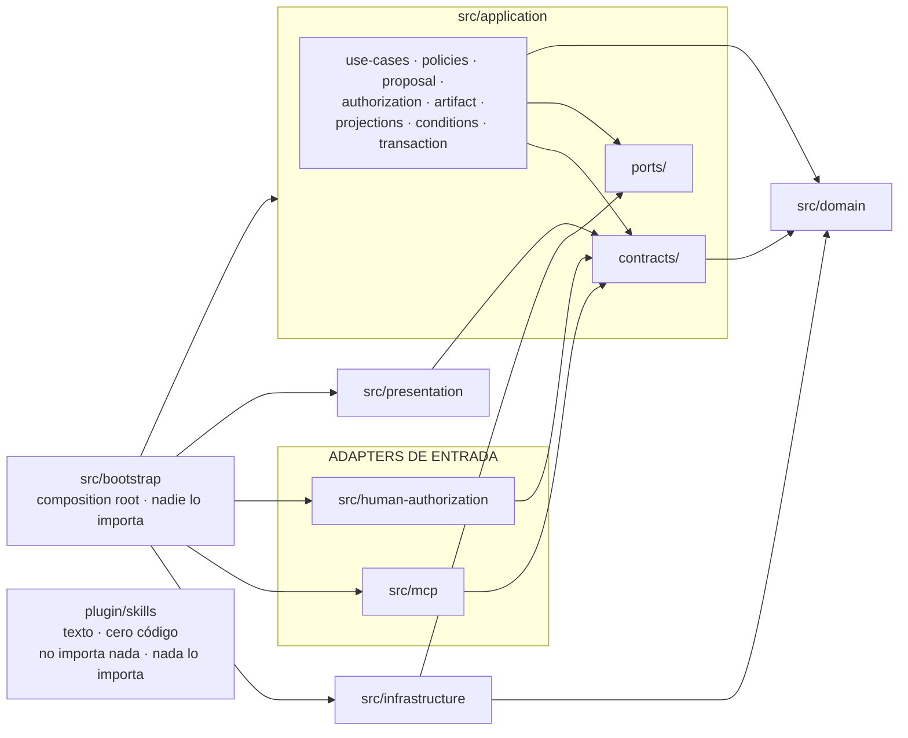

# 14 — Layout del repositorio y reglas de dependencia V0

**Estado:** Technical Design V0 — documento técnico general.
**Precedencia:** por debajo de los ADRs Accepted (001–006) y del kernel técnico v0.4 (`00-technical-kernel.md`). No redefine ninguna regla de esos niveles: las materializa en una estructura de archivos y en un mecanismo de verificación.

**Qué contiene:** la estructura concreta del repositorio TypeScript, la crítica de la estructura orientativa de los dueños, las reglas de dependencia con su formulación verificable, las convenciones de nombres, la contención de los spikes, la organización del `domain` por agregado, la lista de lo que no entra en el repositorio, y la relación entre carpetas y las tres fronteras lógicas del monolito modular.

**Qué NO contiene, y dónde está:** la arquitectura del sistema y las fronteras lógicas (`01-system-design.md` §2, §5); el vocabulario y los contratos (kernel §1–§11); el esquema físico de persistencia (`04-persistence-model.md`); el contrato de la superficie (`05-mcp-contract.md`); la estrategia de pruebas y el catálogo de casos (`12-testing-strategy.md`, `vertical-slice-v0.md`); el fixture del benchmark (`13-synthetic-benchmark.md` §3).

**Etiquetas usadas:** `HECHO VERIFICADO (fuente)` · `DECISIÓN APROBADA` · `PROPUESTA DEL TECHNICAL DESIGN` (requiere aprobación; listadas en §9) · `HIPÓTESIS` · `SUPUESTO` · `POR VERIFICAR` · `RIESGO` · `DECISIÓN PENDIENTE` · `POST-V0`.

---

## 0. Criterio de diseño: qué optimiza este layout y qué no

### 0.1 La regla de oro, antes del árbol

**DECISIÓN APROBADA (`01` §2.1, cuarta fila de la tabla de advertencias):** la estructura de carpetas es **consecuencia** de la regla de dependencias, no su fuente. *La regla se verifica sobre los imports, no sobre los nombres de directorio.*

Esto tiene una consecuencia práctica que gobierna todo el documento: **una carpeta no es una frontera**. Mover un archivo no cambia lo que ese archivo puede hacer; lo único que impone la frontera es la comprobación del grafo de imports (§3). El árbol de §2 existe para que un lector encuentre las cosas y para que una violación sea *visible* antes de ser *detectada*, no para sustituir a la comprobación.

Corolario incómodo, y por eso explícito: **si el checker de §3 no se escribe, este documento entrega convención, no garantía** — exactamente la distinción que `01` §2.3 exige mantener («la alternativa honesta es declarar la regla no verificada en V0, no declararla verificada sin mecanismo»).

### 0.2 Los tres criterios, en orden de prioridad

Cuando dos criterios chocan, gana el de arriba. El orden es una decisión, no una lista.

| # | Criterio | Qué significa operativamente | Prueba de que se cumple |
|---|---|---|---|
| 1 | **Boundaries** | Cada archivo pertenece a exactamente una frontera lógica, deducible de su ruta sin abrirlo | El checker de §3 puede decidir la legalidad de cada import con la ruta como única entrada |
| 2 | **Discoverability** | Un concepto del corpus normativo se encuentra por su nombre, en una sola pasada, sin conocer la implementación | `HumanAuthorization`, `EvidenceLink`, `ProposalItem`, `Artifact` tienen cada uno un lugar obvio y único |
| 3 | **Testability** | Todo invariante del corpus tiene un lugar donde su prueba se escribe sin montar el sistema entero | Un test de `domain` no necesita disco, reloj real ni identificadores aleatorios (§3.3) |

**Por qué `boundaries` va primero.** Los otros dos criterios se degradan de forma gradual y reparable: una carpeta mal nombrada cuesta minutos de búsqueda; un test difícil de escribir se reescribe. Una frontera erosionada no se degrada: se pierde de golpe y en silencio, y su pérdida invalida afirmaciones de producto (ADR-001, ADR-002). El coste asimétrico decide el orden.

### 0.3 Presupuesto de carpetas

**PROPUESTA DEL TECHNICAL DESIGN.** Una carpeta se crea solo si cumple **las tres** condiciones:

1. **Nombra un concepto del corpus normativo** (kernel, ADRs, documentos 01–13) o una frontera de dependencia — no una categoría inventada al escribir el árbol.
2. **Contendrá más de un archivo** al terminar el vertical slice, o **es el sitio obvio donde alguien buscará algo** aunque hoy tenga uno solo.
3. **Su ausencia obligaría a poner el contenido en un sitio peor**, y se puede decir cuál.

La regla existe porque el fallo típico de un layout diseñado en papel no es tener pocas carpetas: es tener una jerarquía que nadie recorre y en la que todo acaba en `utils/`. El árbol de §2 tiene **40 directorios bajo `src/`**, contando `src/`; el número no es una meta, es una consecuencia que se reporta para poder discutirla.

---

## 1. Crítica de la estructura orientativa de los dueños

La estructura orientativa era: `src/domain`, `src/application` con `use-cases/ports/policies`, `src/infrastructure` con `persistence/filesystem/transcription`, `src/mcp` con `tools/transport`, `src/presentation/conditions`, `tests/` con `unit/integration/contract/adversarial`, `fixtures/`, `experiments/`, `docs/`.

**Veredicto general: la esqueleto es correcto y se conserva.** Las cuatro capas y la separación de `tests` / `fixtures` / `experiments` / `docs` no se discuten. Lo que se critica es (a) tres nombres que mienten sobre su contenido, (b) cuatro omisiones —una de ellas grave— y (c) dos decisiones de granularidad.

### 1.1 Veredicto elemento por elemento

| Elemento propuesto | Veredicto | Razón |
|---|---|---|
| `src/domain` | **Se conserva**, con organización por agregado (§6) | Es la frontera de menor dependencia y la que más protege el corpus |
| `src/application/use-cases` | **Se conserva** | Un archivo por use case; los once de kernel §7 son una lista cerrada y enumerable |
| `src/application/ports` | **Se conserva, con precisión obligatoria** | `01` §2.2 lista `ports/` como hermano de `application/`; anidarlo **dentro** es la formulación más fuerte del mismo texto («interfaces semánticas *declaradas por application*») y elimina la lectura de "cuarta capa" que `01` §2.2 precisión 1 advierte. Además vuelve la regla comprobable con granularidad de ruta: `infrastructure` puede importar `application/ports/**` y **nada más** de `application` |
| `src/application/policies` | **Se conserva, acotado** | RIESGO: `policies` es un nombre atractor. Se acota a los *gates* de Application (capability, autorización, validación de Client Config). **Los invariantes del dominio no van aquí**: si un invariante de ADR-003 acaba en `policies/`, el Domain dejó de ser autosuficiente |
| `src/infrastructure/persistence` | **Se conserva** | Adapter de `CaseStorePort`; ver §2.4 |
| `src/infrastructure/filesystem` | **Se renombra y se parte** | `filesystem` describe la tecnología, no el port, y **tres cosas distintas viven en el filesystem**: las bases SQLite, los blobs content-addressed y la resolución de los cinco roots lógicos. Un solo `filesystem/` obliga a abrir la carpeta para saber cuál de las tres se está tocando. Queda: `blob-store/` (`SourceBlobPort`) y `roots/` (resolución de ubicaciones, `01` §6.1) |
| `src/infrastructure/transcription` | **Se conserva** | Único AI-capability port ejercitado en V0 (`01` §3.1) |
| `src/mcp/tools` + `transport` | **Se conserva, +1** | Falta el **Tool Invocation Log** (kernel §8.2), que `01` §2.2 sitúa en esta frontera y que no cabe ni en `tools/` ni en `transport/` |
| `src/presentation/conditions` | **Se conserva, +1** | Falta el sitio de las **plantillas por locale** (`11` §6), que no son código y no pueden vivir mezcladas con el mapeo |
| `tests/{unit,integration,contract,adversarial}` | **Se conservan los cuatro, +1** | Ver §1.2 (omisión 4) y §2.9 |
| `fixtures/` | **Se conserva en la raíz** | Ya fijado por `13` §2.3: `fixtures/legal-case-v0/` fuera de `src/`. Además lo consumen dos clientes (tests y benchmark), y la regla "cero datos reales" se comprueba sobre **un** directorio |
| `experiments/` | **Se conserva** | Ya existe con tres spikes; reglas en §5 |
| `docs/` | **Se conserva** | Ya existe; es el corpus normativo, con su propia precedencia (kernel §14) |

### 1.2 Las cuatro omisiones

**Omisión 1 — el composition root no tiene sitio. GRAVE.**
`01` §5.4 exige *un único punto donde se construye el sistema*, y en él ocurre la validación de arranque de `01` §7.3: verificación de integridad, carga y validación de Client Config, y el **FAIL TO START** de kernel §4 (configuración de producción + provider de autorización `DEV_STUB` ⇒ el arranque aborta, test `AT-013`). En la estructura orientativa no hay ninguna carpeta donde eso pueda vivir sin violar la regla de dependencias: es el único lugar del sistema que **debe** importar `infrastructure` y `mcp` a la vez. Sin carpeta propia, ese código termina en `src/mcp/transport/` o en `src/index.ts`, y en ambos casos la excepción a la regla de dependencias deja de ser localizable. Se añade `src/bootstrap/`.

**Omisión 2 — el segundo driving adapter no aparece. GRAVE.**
El canal de autorización humana es un **adapter de entrada distinto del canal del modelo** (ADR-005; `01` §3, `03` §10). Es la materialización estructural de que la revisión humana no pasa por el modelo. En la estructura orientativa solo existe `src/mcp`, de modo que el árbol afirma que hay **un** canal de entrada. Se añade `src/human-authorization/` como hermano de `src/mcp/`, con una consecuencia buscada: quien abra `src/` ve dos puertas y no puede confundirse sobre cuál lleva la autoridad.

**Omisión 3 — el plano administrativo no existe.**
Migraciones numeradas solo-adelante, backup verificado previo, verificación de integridad, degradación a solo-lectura y recolección de huérfanos son operaciones reales del V0 (`01` §7.2–§7.4; `04` §9) y están **fuera de la superficie del modelo** (clase `ADMIN` vacía por diseño, kernel §6). Sin carpeta, la tentación es exponerlas por MCP «solo para desarrollo», que es precisamente la puerta que ADR-001 cierra. Viven en `src/bootstrap/`.

**Omisión 4 — no hay dónde poner el test que sostiene todo esto.**
El test de arquitectura de `01` §2.3 no es unitario (no prueba una unidad), ni de integración (no monta nada), ni de contrato (no verifica un schema), ni adversarial (no simula a un atacante). Con cuatro buckets, acaba en el que menos moleste. Se añade `tests/architecture/`.

### 1.3 Las dos decisiones de granularidad

**(a) `src/application` gana seis subcarpetas más.** `use-cases/ports/policies` no tiene sitio para los cuatro **conceptos de soporte** que `01` §2.2 asigna explícitamente a Application —`Artifact`, `Proposal`, `HumanAuthorization`, `CaseRevision`— ni para las proyecciones, ni para la maquinaria transaccional. Meterlos en `use-cases/` mezcla *procedimientos* con *máquinas de estado*: `ProposalItem` tiene su propio lifecycle en dos dimensiones (kernel §2.2) y `HumanAuthorization` su propia regla de validez de cinco condiciones (kernel §2.3); ninguna de las dos pertenece a un use case concreto, y ambas son de las cosas que más se buscan en este sistema.

**(b) `skills/` sale de `src/` por completo.** `01` §2.2 agrupa `skills/` y `presentation/` bajo `legal-plugin`. Este documento **los separa físicamente**, amparado en que la frontera lógica no implica jerarquía de carpetas (`01` §2.1, cuarta fila):

- `plugin/skills/` en la raíz — **contiene cero archivos TypeScript**. Es texto.
- `src/presentation/` dentro de `src/` — es código que el Core ejecuta.

Razón: la confusión más peligrosa disponible en este sistema es tratar un `SKILL.md` como enforcement. `01` §2.2 precisión 2 la enuncia como prueba (*si el sistema deja de ser seguro porque el modelo ignoró un skill, hay lógica crítica en el lugar equivocado*). Un directorio sin código hace esa prueba **estructural en vez de moral**: no hay dónde escribir la lógica que no debería existir. Coste aceptado: la frontera `legal-plugin` no se lee de un solo directorio; se lee de la tabla de §8.1.

---

## 2. El árbol

### 2.1 Árbol completo, con una línea de propósito por carpeta

```text
legal-workspace/                  raíz; UN repositorio (01 §2.1) — sin repos ni paquetes separados
│
├─ src/                           TODO el código de producto, y nada que no lo sea
│  │
│  ├─ domain/                     entidades epistémicas e invariantes; sin dependencias de terceros
│  │  ├─ shared/                  primitivos de kernel §11 + Principal + ProvenanceKind; sin comportamiento
│  │  ├─ case/                    Case: identidad, pertenencia, aritmética de case_revision / event_seq
│  │  ├─ evidence/                Source · Evidence · DerivedRepresentation: la cadena de incorporación
│  │  ├─ fact/                    Fact, su máquina de estados epistémicos y ProfessionalDetermination
│  │  ├─ evidence-link/           EvidenceLink: el vínculo hecho↔evidencia y sus invariantes propios
│  │  └─ provenance/              ProvenanceRecord, provenance_kind y el contrato de Locator (07)
│  │
│  ├─ application/                use cases, gates, proyecciones y los conceptos de soporte (01 §2.2)
│  │  ├─ contracts/               tipos de entrada/salida de los use cases: ÚNICA superficie importable
│  │  │                           por los adapters de entrada (§3.4)
│  │  ├─ use-cases/               los once use cases de kernel §7, un archivo por use case
│  │  ├─ ports/                   driven ports declarados por Application; NO es una capa (01 §2.2)
│  │  ├─ policies/                gates de Application: capability, autorización, validación de config
│  │  ├─ proposal/                Proposal y ProposalItem: identidad estable, review_decision × commit_state
│  │  ├─ authorization/           HumanAuthorization y ProposalItemReview: emisión, validez, consumo
│  │  ├─ artifact/                Artifact Registry y evaluación de staleness (10)
│  │  ├─ projections/             scopes de get_case_context, search y changes_since (kernel §9)
│  │  ├─ conditions/              emisión de TypedCondition del catálogo cerrado (11 §3)
│  │  └─ transaction/             unidad de trabajo, append al Case Event Log, OperationLedger (03 §0.4–§0.6)
│  │
│  ├─ infrastructure/             adapters concretos; ÚNICO lugar del repo con E/S real
│  │  ├─ persistence/             CaseStorePort sobre SQLite: DDL, migraciones, FTS5, cadena de hashes
│  │  │  └─ migrations/           scripts numerados solo-adelante, uno por versión, por base (04 §9)
│  │  ├─ blob-store/              SourceBlobPort: content-addressing, staging, protocolo bytes→fila (04 §7)
│  │  ├─ roots/                   resolución de los cinco roots lógicos a ubicaciones reales (01 §6)
│  │  ├─ transcription/           TranscriptionProviderPort: IA-como-capacidad, único port de IA en V0
│  │  ├─ backup/                  BackupPort: export, restore y verificación de round-trip (01 §8)
│  │  ├─ human-authorization/     lado SALIENTE del canal humano + DevHumanAuthorizationProvider (kernel §4)
│  │  └─ platform/                ClockPort e IdPort: el tiempo y la identidad como dependencias explícitas
│  │
│  ├─ mcp/                        DRIVING ADAPTER 1 — canal del operador; entrada no confiable
│  │  ├─ tools/                   las ocho tools: schema cerrado, clase declarada, traducción de errores
│  │  ├─ transport/               ciclo de vida del servidor MCP y construcción del ToolEnvelope
│  │  └─ invocation-log/          construcción del registro del Tool Invocation Log (kernel §8.2)
│  │
│  ├─ human-authorization/        DRIVING ADAPTER 2 — canal humano; invoca ReviewProposal y nada más
│  │
│  ├─ presentation/               condición interna → categoría de presentación → mensaje (kernel §10)
│  │  ├─ conditions/              mapeo condición/error → presentation_category (11 §5)
│  │  └─ templates/               plantillas por locale; es-CO es base normativa, no traducción (11 §6)
│  │
│  └─ bootstrap/                  composition root y plano administrativo; NADIE importa esta carpeta
│     ├─ config/                  carga y validación por schema de la Client Config (01 §7.3 paso 2)
│     ├─ integrity/               verificación del producto sellado contra el manifest (01 §7.3 paso 1)
│     └─ admin/                   migraciones, backup previo, solo-lectura, huérfanos — fuera del MCP
│
├─ plugin/                        legal-plugin sin código: solo texto que el modelo puede ignorar
│  └─ skills/
│     └─ fact-builder/            SKILL.md: metodología interpretativa; CERO autoridad (01 §2.2)
│
├─ tests/
│  ├─ unit/                       espeja src/; sin disco, sin reloj real, sin identificadores aleatorios
│  ├─ integration/                use case completo contra adapters reales sobre estado temporal
│  ├─ contract/                   schemas de la superficie MCP + suites de conformidad de cada port
│  ├─ adversarial/                los adversariales del slice y los AT-xxx de autoridad y perímetro
│  └─ architecture/               la regla de dependencias y las seis reglas mecánicas de §3.3
│
├─ fixtures/
│  └─ legal-case-v0/              corpus sintético del benchmark (13 §3); JAMÁS datos reales
│
├─ benchmark/                     harness de evaluación: mide tasas, no aprueba builds (§2.9)
│
├─ experiments/                   spikes; código desechable, sin integración de build (§5)
│  ├─ cowork-capability-spike/
│  ├─ transcription-spike/
│  └─ authorization-spike/
│
└─ docs/                          corpus normativo; su precedencia interna está en kernel §14
   ├─ architecture/               principles · boundaries · vertical-slice · adrs/ · notes/
   ├─ technical-design/v0/        este documento y sus hermanos
   ├─ research/                   spikes documentales — nivel 6 de precedencia
   └─ discovery/  domain/  backlog/
```

Los archivos de configuración del proyecto (manifiesto de paquete, configuración del compilador, configuración del runner de pruebas) viven en la raíz. **POR VERIFICAR — su contenido exacto**, incluida la posibilidad de expresar parte de la regla de §3 mediante configuración del compilador: se fija en implementación contra fuente oficial, junto con el spike de dependencias (`docs/research/runtime-dependencies-spike-v0.md`). No se afirma aquí ninguna capacidad de herramienta.

### 2.2 `src/domain` — ver §6

La organización por agregado y su justificación están en §6, porque el encargo la trata como pregunta propia.

### 2.3 `src/application` — las tres subcarpetas que exigen explicación

**`contracts/` — la pieza que hace comprobable la frontera del adapter.**
La regla de kernel §13 dice que `mcp` depende de *contratos de application*, y `01` §2.3 añade que **no** puede importar `domain` directamente. Sin un lugar donde esos contratos vivan, la regla es inaplicable: los tipos que el adapter necesita (`UseCaseResult`, `TypedCondition`, `TypedError`, `ErrorCode`, los DTOs de cada use case) están hoy dispersos por `03` §0.1–§0.3 y `05` §4. `contracts/` los reúne y la regla se vuelve una comparación de rutas: **`src/mcp/**` solo puede importar de `src/application/contracts/**`.**

Los **driving ports** (kernel §13: «los use cases invocables») son exactamente las firmas declaradas aquí. Por eso `ports/` contiene **solo driven ports**: si contuviera ambos, la carpeta volvería a parecer una capa por la que todo pasa, que es la lectura que `01` §2.2 precisión 1 prohíbe.

**Honestidad sobre el alcance de esta regla, declarada y no escondida (tensión T2, §9.2):** `contracts/` **re-exporta** —no redefine— los primitivos de `domain/shared` que necesita (`Uuid`, `Sha256`, `Principal`, `ProvenanceKind`). Es decir: el checker verifica **rutas de import**, y un tipo originado en `domain` sí alcanza `mcp` por esa vía. La alternativa —duplicar las definiciones— sería peor: dos definiciones de `Principal` es exactamente el tipo de divergencia que la corrección semántica de kernel §1 vino a cerrar. Lo que la regla garantiza es **acoplamiento nulo a la implementación del dominio** (nada con comportamiento cruza), no aislamiento nominal de tipos. Decirlo al revés sería inventar una garantía.

**`policies/` — acotada por definición, no por buena voluntad.** Contiene únicamente gates que Application evalúa: resolución de capabilities (`05` §3.3), validez de `HumanAuthorization` en el momento del commit (kernel §2.3), y validación de que una Client Config solo endurece (PF-005). **Regla de admisión:** una regla entra en `policies/` si su evaluación necesita algo que el Domain no puede conocer —la sesión, la configuración, el reloj, el registro de autorizaciones—. Si no lo necesita, es un invariante y pertenece a su agregado.

**`transaction/` — por qué existe una carpeta para maquinaria.** `03` §0.4 fija que un use case mutador abre **exactamente una** transacción y que dentro de ella —y solo dentro— ocurren la mutación, el append al event log con su encadenamiento de hashes, el incremento de `event_seq` / `case_revision`, la entrada del `OperationLedger` y la propagación de staleness. Esas cinco cosas se escriben una vez y se usan en los seis use cases mutadores. Repartirlas por use case garantiza que alguna quede fuera de la transacción en alguno de ellos, que es el modo exacto en que se rompe la biyección mutación↔evento de ADR-004 inv. 5.

El **catálogo cerrado de tipos de evento** (kernel §8.1) **no** vive aquí: vive en `contracts/`, porque es contrato —añadir un evento es cambio de contrato (ADR-004 inv. 6)—, mientras que el appender es maquinaria.

### 2.4 `src/infrastructure` — organizada por port, no por tecnología

Es la única frontera donde organizar «por tipo técnico» sería defendible, porque aquí el tipo técnico *es* el asunto. Aun así se organiza **por port implementado**, con una razón concreta: la promesa de sustituibilidad de `04` §8 («los contratos son `CaseStorePort` y `SourceBlobPort`, no este esquema») solo es comprobable si existe un directorio por port cuya **suite de conformidad** (`tests/contract/ports/`) cualquier implementación alternativa debe pasar. Con `filesystem/` como cajón, la pregunta «¿qué hay que reescribir para cambiar de motor?» no tiene respuesta de una línea.

`roots/` merece su carpeta por una razón de perímetro, no de tamaño: `01` §6.1 exige que **ninguna ruta concreta se hardcodee ni se exponga en ninguna parte**, y que la resolución viva en `infrastructure` detrás de los ports. Concentrarla en un directorio hace que la revisión de esa promesa sea una revisión de un directorio, y que el test de path traversal (`05` R2; test `F18`) tenga un objetivo único.

`platform/` agrupa `ClockPort` e `IdPort` porque **no son ceremonia**: `01` §5.4 los declara condición para que el golden test de regeneración determinista (ADR-004, validación 1) y los tests de expiración de autorizaciones sean escribibles. Su consecuencia mecánica está en §3.3, regla M4.

**`infrastructure/human-authorization/` y `src/human-authorization/` son dos direcciones del mismo canal, y por eso comparten nombre.** El canal humano es entrante (invoca `ReviewProposal`) y saliente (el Core debe hacerle llegar la solicitud de revisión: `HumanAuthorizationChannelPort` aparece en `CoreDependencies`, `01` §5.4). Un `grep -r human-authorization src/` devuelve las dos mitades juntas. **DECISIÓN PENDIENTE heredada (ADR-005):** el transporte concreto del canal; lo único que este documento fija es la **posición**, que es lo único que hoy puede fijarse sin inventar plataforma.

### 2.5 `src/mcp` — y por qué el log de invocaciones no abre una base de datos

`01` §2.2 sitúa el Tool Invocation Log en `legal-mcp`, y hace falta: la validación sintáctica rechaza payloads que **nunca llegan a Application** (`05` R4: propiedad no declarada ⇒ `VALIDATION_FAILED` *antes* de Application), y esos rechazos son justamente los que los tests adversariales necesitan poder verificar.

Pero `mcp` no puede importar `infrastructure` (`01` §2.3) y **ningún adapter fuera de `infrastructure/` abre un archivo o una base** (§3.3, regla M3). **PROPUESTA DEL TECHNICAL DESIGN:** `ToolInvocationLogPort` se declara en `application/ports/`, se re-exporta por `contracts/`, su adapter vive en `infrastructure/persistence/` (base `operational.db`, `04` §1) y el composition root lo inyecta en el adapter MCP. `src/mcp/invocation-log/` **construye el registro** —hash de inputs incluido, porque `05` §4.4 prohíbe almacenar los inputs en claro— y lo entrega por el port.

Consecuencia buscada: se conserva ADR-002 inv. 2 (toda escritura del private state ocurre vía el Core) sin excepciones «operacionales», que son las que se convierten en el segundo camino de escritura.

### 2.6 `src/presentation` — código y texto, separados a propósito

`conditions/` mapea `code` → `presentation_category` (`11` §5); `templates/` contiene las plantillas por locale. La separación es una regla de `11` §6.1 hecha estructura: **`message_key` es contrato y el texto no lo es**. Cambiar una redacción con la usuaria no debe tocar ningún archivo `.ts`; si texto y mapeo comparten archivo, cada validación de redacción se convierte en un cambio de código y deja de hacerse.

De aquí sale una regla dura de §4.4: **ninguna cadena destinada a la usuaria aparece en un archivo de código, en ninguna frontera.** Si aparece, existe un mensaje que no pasó por el pipeline, sin plantilla, sin locale y sin el test léxico de techo de certeza (`11` §4.5).

### 2.7 `src/bootstrap` — la única carpeta con permiso para verlo todo

Contiene el composition root de `01` §5.4 y la secuencia de arranque de `01` §7.3 en su orden exacto. Dos reglas duras:

1. **Nada importa `bootstrap`.** Es un sumidero del grafo. Si algo lo importa, existe un segundo lugar donde se construye el sistema y la validación de arranque deja de ser única —incluida la que **aborta** el proceso ante `DEV_STUB` en producción (kernel §4, `AT-013`)—.
2. **`bootstrap` no contiene lógica de negocio.** Cablea, valida configuración y arranca. Un invariante del expediente escrito aquí es un invariante que no se aplica cuando el sistema se monta de otra forma — por ejemplo, en un test de integración.

**Por qué se llama `bootstrap` y no `runtime`:** `runtime/` es el nombre de un **root lógico del filesystem** (`01` §6.2, el producto sellado). Reutilizar el nombre para una carpeta del repositorio produciría la confusión más cara disponible: creer que el repositorio contiene el root sellado (§7.4).

### 2.8 `src/mcp` y `src/human-authorization` como hermanos: qué afirma el árbol

Que hay **dos** canales de entrada, que son de naturaleza distinta y que solo uno lleva autoridad. `03` §10 fija que `ReviewProposal` es el **único** use case del canal humano; `05` R3 fija que ningún secreto de autorización viaja al modelo. Un árbol con un solo adapter de entrada contradice visualmente ambas cosas antes de que nadie lea una línea de código.

### 2.9 Fuera de `src/`

**`tests/` — cinco buckets, y la crítica de por qué no van co-locados.**
Co-locar (`fact.ts` junto a `fact.test.ts`) gana en discoverability, que es el criterio 2. Pierde en dos cosas que aquí pesan más:

- El producto sellado se hashea en el manifest (`01` §7.2) y **no debe contener código de prueba**. Con tests co-locados, el empaquetado depende de filtrar `*.test.ts` correctamente; un filtro mal escrito mete tests en el artefacto sellado o rompe el hash. Un árbol separado hace que la pregunta «¿qué se empaqueta?» sea «`src/`», sin filtros.
- Los cinco buckets tienen **perfiles de ejecución distintos** (con disco / sin disco, rápidos / lentos, bloqueantes de build / informativos). Separarlos es lo que permite que la puerta rápida corra `unit` + `architecture` y la lenta el resto.

Compensación del criterio 2: **`tests/unit/` espeja `src/` ruta por ruta** (`tests/unit/domain/fact/` ↔ `src/domain/fact/`), y los tests con identificador del corpus lo llevan en el nombre de archivo (§4.3), de modo que `grep -r AT-009 tests/` devuelve exactamente un archivo.

`contract/` cubre **dos** contratos, y ambos merecen el nombre: `contract/mcp/` (los schemas cerrados de las ocho tools, la lista cerrada de `ErrorCode`, la forma del `ToolEnvelope` — `05` §4) y `contract/ports/` (suites de conformidad que **cualquier** implementación de un port debe pasar; es el mecanismo que hace real la sustituibilidad de `04` §8).

**`fixtures/` — ya fijado por `13` §2.3.** El árbol `fixtures/legal-case-v0/` con su `expected/` que jamás entra en el contexto del modelo (`FSC-06`). Regla heredada y extendida: **`src/` nunca importa de `fixtures/`** (`13`, decisión 2).

**`benchmark/` — PROPUESTA DEL TECHNICAL DESIGN: carpeta propia, y no dentro de `tests/`.** El harness de eval lee el truth set y accede al estado por el plano runtime/CLI (`13` §14), y **mide tasas** —de deformación de mensajes, de precisión, de fabricación— frente a umbrales que evolucionan. Un test aprueba o falla; una medición produce un número. Ponerla en `tests/` obliga a elegir entre dos males: convertir un umbral provisional en puerta de build (y desactivarla el primer día que moleste), o dejar dentro de `tests/` algo que nunca falla (y enseñar que un bucket de `tests/` es opcional). Fuera de `src/` por la misma regla que `fixtures/`: no es código de producto.

**`docs/` y `experiments/`** ya existen y conservan su estructura actual; §5 fija las reglas de `experiments/`.

---

## 3. Reglas de dependencia

### 3.1 Grafo de aristas permitidas

`A → B` significa **«A puede importar de B»**. Toda arista ausente está prohibida.



### 3.2 Tabla normativa de aristas

Materializa `01` §2.3 y kernel §13 con granularidad de ruta, que es la única con la que un checker puede trabajar.

| Origen (glob) | Puede importar | Prohibido | Fuente |
|---|---|---|---|
| `src/domain/**` | solo `src/domain/**` y la librería estándar | todo lo demás; **cualquier dependencia de terceros** | kernel §13; `01` §5.1 |
| `src/application/contracts/**` | `src/domain/shared/**` | resto de `domain`, `ports`, `infrastructure`, adapters | §2.3 |
| `src/application/**` (resto) | `src/domain/**`, `src/application/**` | `infrastructure`, `mcp`, `human-authorization`, `presentation`, `bootstrap` | `01` §2.3 |
| `src/infrastructure/**` | `src/application/ports/**`, `src/domain/**` | **`src/application/use-cases/**` y todo el resto de `application`**; `mcp`; `presentation`; `bootstrap` | `01` §2.3 |
| `src/mcp/**` | `src/application/contracts/**` | `domain` directo, `application` no-contracts, `infrastructure`, `presentation`, `bootstrap` | kernel §13; `01` §2.3 |
| `src/human-authorization/**` | `src/application/contracts/**` | idem anterior | ADR-005; `01` §2.3 |
| `src/presentation/**` | `src/application/contracts/**` | **`infrastructure` en absoluto**; `domain` directo | kernel §13 (`skills` nunca acceden a infrastructure), extendido a la frontera `legal-plugin` completa |
| `src/bootstrap/**` | todo `src/**` | ser importado por cualquiera | `01` §5.4; §2.7 |
| `plugin/skills/**` | nada — no contiene código | contener cualquier archivo ejecutable | `01` §2.2 precisión 2 |
| `src/**` | — | **`experiments/**`, `fixtures/**`, `tests/**`, `benchmark/**`** | kernel §13; `13` decisión 2 |
| `tests/**` | `src/**`, `fixtures/**` | ser importado por `src/**` | §2.9 |

### 3.3 Las seis reglas mecánicas negativas

**PROPUESTA DEL TECHNICAL DESIGN.** Son reglas sobre *qué no puede aparecer dónde*, decidibles leyendo los imports y sin ejecutar nada. Cada una protege un invariante concreto y cada una tiene una forma conocida de romperse.

| Id | Regla | Invariante que protege | Cómo se rompe si no se comprueba |
|---|---|---|---|
| **M1** | Ninguna arista fuera de la tabla §3.2, **siguiendo re-exports de forma transitiva** | Toda la frontera | *Barrel laundering*: un `index.ts` en `application/` que re-exporta algo de `infrastructure`; el import de `mcp` parece legal y no lo es |
| **M2** | `src/domain/**` no importa **ningún** paquete de terceros | Principio 10 — Domain vendor-independent; `01` §5.1 | Una librería de fechas o de validación entra «solo para un helper» y el Domain deja de ser sustituible |
| **M3** | APIs de filesystem, de red y de base de datos solo en `src/infrastructure/**` y `src/bootstrap/**` | ADR-002 inv. 2 (camino único de escritura); §2.5 | El adapter MCP escribe «su» log directamente y aparece un segundo escritor del private state |
| **M4** | Reloj del sistema, aleatoriedad y generación de identidad solo en `src/infrastructure/platform/**` | Determinismo de los golden tests (ADR-004 val. 1) y de los tests de `expires_at` (kernel §3.1) | Un `use case` toma la hora directamente y el test de expiración se vuelve dependiente del reloj de la máquina |
| **M5** | Lectura de variables de entorno y de configuración del proceso solo en `src/bootstrap/config/**` | `01` §7.3 paso 2 (rechazo visible, nunca degradación silenciosa a defaults) | Un módulo lee un flag por su cuenta y aparece una política tácita que ninguna validación de schema revisó |
| **M6** | Ninguna cadena destinada a la usuaria fuera de `src/presentation/templates/**` | `11` §6.1 (plantilla completa, sin concatenación) y §6.5 (prohibido renderizar el código) | Un mensaje inventado en un `catch` llega a la usuaria sin locale, sin plantilla y sin techo de certeza verificado |

**M6 es la más difícil de comprobar y hay que decirlo:** distinguir «texto para la usuaria» de un identificador o un mensaje de log no es decidible en general. **PROPUESTA:** se comprueba con una heurística acotada —cadenas con espacios y acentuación en frontera `mcp` / `presentation` / `application/conditions`— y se acepta explícitamente que **detecta el descuido, no la evasión deliberada**. Misma honestidad que kernel §8.3 sobre el hash-chain: tamper-evident, no tamper-proof.

### 3.4 Barrels: permitidos en un solo sitio

**PROPUESTA DEL TECHNICAL DESIGN.** Los archivos de re-exportación (`index.ts` que reexporta un directorio) se permiten **únicamente** en `src/application/contracts/`. En el resto del árbol los imports son directos al archivo que define el símbolo.

Razón: un barrel convierte una ruta de import en un alias, y con alias la regla de §3.2 deja de poder leerse en el sitio del import — hay que resolver el barrel para saber de dónde viene el símbolo. Prohibirlos deja **una** excepción, que es precisamente la que existe para ser importada desde fuera, y hace que M1 tenga que seguir re-exports en un solo directorio en vez de en todo el árbol.

Efecto colateral positivo: los imports directos hacen que la violación sea **visible en el diff**. `import … from '../../infrastructure/persistence/sqlite-case-store'` se ve en revisión; `import … from '../../application'` no.

### 3.5 Cómo se verificará automáticamente

Kernel §13 declara la regla «verificable automáticamente más adelante»; `01` §2.3 propone adelantarla al V0 con un **test de arquitectura** que inspeccione el grafo de imports y falle ante una arista prohibida. Este documento fija **dónde vive** (`tests/architecture/`) y **qué debe cubrir**, sin instalar ni prometer herramienta alguna hoy.

**Mecanismos candidatos, en orden de preferencia. Todos POR VERIFICAR:**

| # | Mecanismo | Ventaja | Por qué no basta solo |
|---|---|---|---|
| 1 | **Test de arquitectura propio**: recorre `src/**`, extrae los especificadores de import de cada archivo, los resuelve a rutas y compara contra la tabla §3.2 | Expresa las seis reglas M1–M6 tal como están escritas; falla con el mensaje exacto (`archivo → arista prohibida → regla`); es código nuestro y no depende de la ergonomía de una herramienta externa | Hay que escribirlo y mantenerlo; **POR VERIFICAR** el mecanismo concreto de extracción de imports en el runtime elegido |
| 2 | **Reglas de lint sobre rutas de import** | Falla en el editor, en el momento de escribir | **POR VERIFICAR** qué regla o plugin las expresa y si cubre re-exports transitivos (M1) y `import type` |
| 3 | **Separación a nivel de proyecto del compilador** (referencias de proyecto) | Una arista prohibida **no compila**: la garantía más fuerte | **POR VERIFICAR** si puede expresar aristas con granularidad de subdirectorio (`infrastructure → application/ports` sí, `→ application/use-cases` no). Si no puede, no sustituye a (1) |

**Los tres son complementarios y el orden no es un ranking de calidad:** (3) es la garantía más fuerte donde alcance, (2) el ciclo de retroalimentación más corto, (1) el único que hoy puede expresar la regla completa. **Decisión mínima para el V0: (1) es obligatorio; (2) y (3) son deseables si el spike de dependencias confirma que existen sin coste desproporcionado.**

**Qué debe detectar el checker, y que un checker ingenuo no detecta:**

1. **Re-exports transitivos** (M1) — un barrel intermedio.
2. **Escapes relativos** — `../../infrastructure/...` desde `application`. Se resuelven a ruta absoluta del repo antes de comparar.
3. **Imports solo de tipo.** **Decisión: cuentan como arista.** Un import de tipo no crea acoplamiento en ejecución, pero sí acoplamiento de contrato: el día que Domain cambie una forma, el adapter que importó ese tipo se rompe, y la frontera existía justamente para que eso no ocurriera. Excepción única: la re-exportación explícita de §2.3.
4. **Imports dinámicos** — un import calculado en tiempo de ejecución evade cualquier análisis estático. **PROPUESTA: prohibidos en `src/`**, sin excepciones en V0. No hay ningún caso en el vertical slice que los necesite y su presencia convertiría el checker en decorativo.
5. **Alias de módulo definidos en configuración** — deben resolverse igual que las rutas relativas; en caso de duda, no se usan.

**Lo que la verificación NO cubre, dicho por escrito:** no verifica que un invariante esté *bien* escrito, ni que un test sea significativo, ni que alguien haya puesto lógica de dominio en `application` con los imports correctos. Detecta **violaciones de posición**, no errores de diseño. La revisión humana sigue siendo necesaria para lo segundo; el checker existe para que no tenga que ocuparse de lo primero.

---

## 4. Convenciones de nombres

### 4.1 Carpetas y archivos

| Regla | Ejemplo correcto | Ejemplo incorrecto |
|---|---|---|
| Directorios y archivos en `kebab-case` | `evidence-link/`, `human-authorization.ts` | `EvidenceLink/`, `humanAuthorization.ts` |
| Directorio en **singular** cuando nombra un concepto; en plural cuando nombra una colección homogénea | `domain/fact/`, `application/use-cases/` | `domain/facts/`, `application/use-case/` |
| El nombre de archivo **es** el concepto que exporta | `proposal-item.ts` exporta `ProposalItem` | `models.ts`, `types.ts` |
| Identificadores en **inglés**, con el término **literal del kernel** | `provenance_kind`, `item_content_hash` | `origen`, `contentHash` para `item_content_hash` |
| Sin abreviaturas en términos del dominio | `evidence-link.ts` | `ev-link.ts`, `auth.ts` para `authorization` |
| Los valores de enum se escriben **exactamente** como el kernel | `'AI_INFERENCE'`, `'PENDING'` | `'ai_inference'`, `'Pending'` |
| **Ningún directorio ni archivo se llama como un valor de enum** | — | `domain/fact/alleged/` |

La cuarta y la sexta no son estética: el vocabulario del kernel **es contrato** (kernel §1, §14). Un renombrado «de estilo» en el código produce divergencia silenciosa entre lo que el corpus dice y lo que el sistema hace, que es la clase de deriva que la nota de normalización `actor_type → Principal` tuvo que reparar.

### 4.2 Los cuatro sufijos que se ganan su lugar

**PROPUESTA DEL TECHNICAL DESIGN.** Un sufijo se justifica cuando **una herramienta lo lee**, no cuando ayuda a un humano a leer —para eso ya está la carpeta—.

| Sufijo | Se usa en | Quién lo lee |
|---|---|---|
| `*.port.ts` | `application/ports/` | El checker (M3, aristas de `infrastructure`) y la suite de conformidad de `tests/contract/ports/` |
| `*.adapter.ts` | `infrastructure/**` | El checker (M2–M4) y el composition root |
| `*.use-case.ts` | `application/use-cases/` | El test de cobertura de use cases: los once de kernel §7, ni uno más ni uno menos |
| `*.test.ts` | `tests/**` | El runner y el empaquetado (`src/` no contiene ninguno — §2.9) |

**Se rechazan explícitamente** `*.service.ts`, `*.manager.ts`, `*.helper.ts`, `*.util.ts`, `*.entity.ts`, `*.dto.ts`, `*.impl.ts`. Los tres primeros nombran un rol que no existe en este diseño; los tres últimos repiten información que la carpeta ya da.

### 4.3 Nombres de tests: la trazabilidad es la convención

El corpus identifica sus pruebas: `AT-001`…`AT-014` (aceptación), `T-UX-01`…`T-UX-10` (condiciones), `F1`…`F18` (flujo y caminos negativos), los adversariales del slice, `FSC-01`…`FSC-09` (consistencia del fixture).

**Regla: todo test con identificador en el corpus lo lleva como prefijo del nombre de archivo.**

```text
tests/adversarial/ADV-02-parametro-inventado.test.ts
tests/adversarial/AT-013-dev-stub-en-produccion.test.ts
tests/integration/AT-009-artifact-stale-no-se-presenta-vigente.test.ts
tests/contract/mcp/AT-011-superficie-sin-borrado-de-source.test.ts
tests/unit/application/conditions/T-UX-05-completitud-de-plantillas.test.ts
tests/architecture/M1-aristas-de-dependencia.test.ts
```

Efecto exigido: **`grep -r AT-009 .` devuelve el documento que lo especifica y el archivo que lo prueba, y nada más.** Una fila de una tabla de trazabilidad que no resuelve a un archivo es una fila que miente; con esta convención, la comprobación de que la trazabilidad está completa es un `grep` por identificador, no una lectura.

Los tests sin identificador del corpus se nombran por su sujeto: `tests/unit/domain/fact/fact-transitions.test.ts`.

### 4.4 Idioma

- **Identificadores, tipos y valores de enum: inglés.** Son vocabulario de contrato compartido con el corpus técnico.
- **Comentarios explicativos y documentación: español.** El corpus normativo está en español y traducir la explicación aleja el código de su justificación.
- **Prosa para la usuaria: en ningún archivo de código.** Solo en `src/presentation/templates/`, con `es-CO` como base normativa —no traducción— (`11` §6.5). Regla M6.
- **Un comentario que explica *por qué* cita su fuente** (`// ADR-005 inv. 8`, `// kernel §2.3`). Un comentario que explica *qué* hace el código de al lado sobra.

### 4.5 Nombres prohibidos en todo el repositorio

`utils/` · `helpers/` · `common/` · `shared/` fuera de `domain/shared` · `misc/` · `core/` dentro de `src/` · `lib/` · `manager` · `service` · `handler` genérico.

**La razón no es purismo.** Cada uno de esos nombres describe una *categoría de código* en vez de una *frontera o un concepto*, y por eso ninguno responde a la pregunta que la regla de §3 necesita: ¿a qué frontera pertenece esto? Un archivo en `utils/` importado desde `domain` y desde `infrastructure` a la vez es una arista que el checker no puede clasificar y una dependencia que nadie decidió.

**Excepción única y acotada: `src/domain/shared/`.** Contiene los primitivos nombrados en kernel §11 (`Uuid`, `Sha256`, `Iso8601`) más `Principal` y `ProvenanceKind`. **Regla de admisión, verificable en revisión: nada en `domain/shared/` tiene comportamiento.** Son alias de tipo y formas. En cuanto algo ahí dentro adquiere una regla —una validación, una transición, una comparación con significado—, pertenece a un agregado y se muda. Sin esa regla, `shared/` se convierte en el `utils/` que este párrafo prohíbe.

---

## 5. Dónde viven los spikes y por qué no pueden contaminar producción

### 5.1 Posición

`experiments/<nombre>-spike/`, en la raíz, **fuera de `src/`**. Ya existen tres, con contenido: `cowork-capability-spike/` (protocolo empírico de 31 pasos con su `experimental-root/`), `transcription-spike/`, `authorization-spike/`.

### 5.2 Las cinco reglas de contención

**PROPUESTA DEL TECHNICAL DESIGN**, salvo la primera que es kernel §13.

| # | Regla | Razón |
|---|---|---|
| **E1** | **`src/` nunca importa de `experiments/`** | kernel §13, literal. Comprobado por M1 (§3.3) |
| **E2** | `experiments/` está **fuera de la configuración de compilación y del runner de `src/`** | Un spike no debe poder romper la build del producto, y —más importante— **no debe poder arreglarla**: si un experimento compilara junto al producto, empezaría a mantenerse |
| **E3** | Un experimento **nunca recibe datos reales de un cliente ni escribe en un private state real** | Los spikes usan árboles de sacrificio (`experimental-root/`, como ya hace el de Cowork). Un experimento es, por definición, código que no ha sido revisado |
| **E4** | Un experimento **no se promueve moviéndolo** | Ver §5.3 |
| **E5** | La salida de un experimento es una **observación**, nunca una garantía | kernel §14: los spikes viven en el nivel 6 de precedencia. Un resultado de spike se cita como `HECHO VERIFICADO (fuente: spike X)` sobre *lo que se observó*, jamás como propiedad garantizada de la plataforma |

### 5.3 Por qué la promoción no puede ser un `git mv`

**Es la regla más importante de esta sección.** Mover un archivo de `experiments/` a `src/` haría tres cosas a la vez, todas invisibles en el diff:

1. **Cambiaría su nivel de precedencia** del 6 al 2 (kernel §14) sin que nadie tomara esa decisión. Lo que era una observación pasaría a ser diseño normativo por efecto de una ruta.
2. **Importaría sus supuestos sin sus condiciones.** Un spike se escribe contra un entorno concreto y con atajos deliberados —sin manejo de errores, con rutas fijas, con credenciales en variables locales—. Esos atajos son legítimos *ahí* y letales *aquí*.
3. **Entraría sin tests, sin port y sin frontera.** Un spike de transcripción no implementa `TranscriptionProviderPort`: llama a un proveedor. Moverlo produce un adapter que no pasó ninguna suite de conformidad.

**Procedimiento obligatorio de promoción:** el experimento produce un documento (nivel 6) → una decisión lo incorpora (ADR o documento del Technical Design) → el código de producción se **escribe de nuevo** bajo `src/`, contra un port, con sus tests. El experimento se conserva como registro de la observación o se borra; lo que **no** ocurre es que sus archivos aparezcan bajo `src/`.

### 5.4 Alcance de la contención

E1–E5 protegen contra **contaminación de código y de precedencia**. No protegen contra un experimento que, ejecutado a mano por una persona con permisos, toque lo que no debe: eso lo gobiernan la posición del private state (ADR-002) y los permisos del sistema operativo, no el layout. Se dice para no atribuir a una carpeta una garantía que una carpeta no da.

---

## 6. Organización del `domain` por agregado

### 6.1 La decisión

**PROPUESTA DEL TECHNICAL DESIGN:** `src/domain/` se organiza **por agregado** (`case/`, `evidence/`, `fact/`, `evidence-link/`, `provenance/`, más `shared/` acotado por §4.5), **no** por tipo técnico (`entities/`, `value-objects/`, `repositories/`, `services/`).

Ampliación respecto de la propuesta orientativa de los dueños: se añade **`evidence-link/` como agregado propio**. Razón: los invariantes de ADR-006 y PF-003 —un `EvidenceLink` exige `Evidence` incorporada; el vínculo no puede apoyarse en material no incorporado— son invariantes **del vínculo**, no del `Fact` ni de la `Evidence`. Meterlo dentro de `fact/` sugeriría que el hecho es dueño del vínculo, y eso es falso en este modelo: el mismo vínculo es la unidad que se activa en el commit y la que se desactiva si el hecho se retira.

### 6.2 Por qué, en cuatro argumentos con consecuencia observable

| # | Argumento | Consecuencia observable |
|---|---|---|
| 1 | **Cohesión de cambio.** Los invariantes son *por agregado*: la máquina de estados de `Fact` (ADR-003), la inmutabilidad de `Source` (PF-002), la exigencia de incorporación del `EvidenceLink` (PF-003) | Un cambio en las transiciones de `Fact` toca **una** carpeta. Con organización por tipo técnico toca `entities/`, `value-objects/` y `services/`, y el revisor no ve la regla completa en ningún sitio |
| 2 | **Revisabilidad contra el corpus.** Cada agregado corresponde a entidades nombradas en ADR-003 y en `02` | «¿Dónde se impone el invariante 8 de ADR-003?» tiene respuesta de una línea. Es también lo que permite que la tabla invariante→archivo→test de `12` no sea aspiracional |
| 3 | **La ausencia es visible.** No existe `domain/statement/` | Kernel §15 reserva `Statement` sin materializarlo. Con organización por tipo técnico, «no hay Statement» no se ve en ninguna parte; con agregados, se ve al listar el directorio, y quien lo añada estará creando una carpeta —un acto deliberado— y no añadiendo una clase más a `entities/` |
| 4 | **Sobrevive a la extracción.** Si `legal-core` se separara (§8.2), las costuras ya están trazadas por concepto | Una separación por tipo técnico obliga a partir cada carpeta; una separación por agregado mueve directorios completos |

### 6.3 El contraargumento honesto, y su mitigación

**Contra:** la organización por agregado favorece la **duplicación de primitivos** —tres definiciones de «hash», dos de «marca de tiempo»— porque cada carpeta es autosuficiente y nadie mira la de al lado.

**Mitigación, no negación:** `domain/shared/` existe exactamente para eso, con la regla de admisión de §4.5 (**sin comportamiento**). Y la duplicación que sí importa —la del vocabulario— está cubierta por otro lado: los nombres son literales del kernel (§4.1), así que dos definiciones del mismo concepto **colisionan por nombre** y se detectan en revisión.

**Segundo contra, también real:** un lector acostumbrado a DDD por capas tarda más en encontrar «todas las entidades». Se acepta: en este sistema nadie necesita «todas las entidades»; necesita *un* concepto y sus reglas.

### 6.4 Anatomía interna de un agregado (plantilla)

`fact/` como modelo; los demás siguen la misma forma, con los archivos que su concepto pida y ninguno más.

```text
src/domain/fact/
  fact.ts                          la entidad y su identidad (Uuid opaco, kernel §11)
  fact-status.ts                   estados epistémicos y su orden; techo AI = PROPOSED (ADR-001)
  fact-transitions.ts              transiciones admisibles y qué principal puede provocarlas (PF-001)
  professional-determination.ts    la determinación profesional como acto del dominio
```

Sin `index.ts` (§3.4). Sin `types.ts`. Los tests correspondientes en `tests/unit/domain/fact/`, espejando la ruta.

**Regla que cierra el agregado:** un archivo de `domain/fact/` **no importa de `domain/evidence/`**. Cuando dos agregados deben relacionarse, la relación es una entidad propia (`evidence-link/`) o la coordina Application. Sin esta regla, «organización por agregado» degenera en un grafo de dependencias entre carpetas indistinguible de no tener organización. **POR VERIFICAR:** si conviene comprobarla mecánicamente en V0 (extensión natural de M1) o dejarla a revisión; el coste es una regla más en el checker.

---

## 7. Qué NO va en el repositorio

Cuatro categorías, con la razón de cada una y el mecanismo que la sostiene.

### 7.1 Secretos, en cualquier forma

**Nunca:** claves de API, tokens, credenciales de proveedor, cadenas de conexión, certificados, ni sus versiones «de prueba». Tampoco en `experiments/`, tampoco en `fixtures/`, tampoco en un comentario, tampoco en un archivo de ejemplo con el valor real cambiado a medias.

**Dónde van:** los aporta el entorno de ejecución y se leen **solo** en `src/bootstrap/config/` (regla M5). El repositorio puede contener un archivo de ejemplo con **nombres de variables y ningún valor**.

**Nota de alcance honesta:** en V0 no hay conectores externos (`01` §11; kernel §10), de modo que **el único candidato real a credencial es el proveedor de transcripción**. Si `infrastructure/transcription/` la necesita, llega inyectada por el composition root; no se lee de un archivo del repositorio ni se hardcodea en el adapter.

### 7.2 Datos reales de clientes

**Nunca, en ninguna carpeta y bajo ninguna forma:** ni documentos, ni audios, ni transcripciones, ni nombres, ni identificadores, ni un fragmento pegado en un test para reproducir un fallo, ni una salida de error con contenido de un expediente.

**Sustituto obligatorio:** `fixtures/legal-case-v0/`, cuya ficcionalidad es una regla escrita con cinco prohibiciones y su límite declarado (`13` §2.1–§2.2). Un caso real que hay que reproducir se convierte en un caso sintético que exhiba la misma forma; si no puede convertirse, se describe en el documento del defecto sin adjuntar el material.

**Razón técnica, no jurídica:** un repositorio se clona, se respalda, se comparte y conserva su historia — `git` está diseñado para que borrar algo del último commit **no lo borre**. El private state, por diseño, no tiene ninguna de esas propiedades (ADR-002). Meter material de un expediente en el repositorio lo saca del perímetro que todo el corpus construye, y lo saca de forma **irreversible**. *(Las obligaciones profesionales concretas que apliquen a ese material son una cuestión jurídica fuera del alcance de este documento; la regla técnica se enuncia en su forma más conservadora: nunca.)*

### 7.3 El private state de un caso

**Nunca:** `case.db`, `case.db-wal`, `case.db-shm`, `catalog.db`, `operational.db`, `blobs/` (originales o derivados), `backups/`, el Case Event Log, el Tool Invocation Log, ni ningún fragmento de ellos.

Tres razones, y la tercera es la que decide:

1. **Contenido.** Es el expediente: §7.2 aplica íntegro.
2. **Segundo camino de escritura.** ADR-002 inv. 2 exige que toda mutación del Case Store ocurra vía Application. Un `case.db` versionado convierte `git checkout` en una operación de escritura sobre el estado canónico que no pasa por ningún use case, no emite ningún evento y no avanza ningún reloj.
3. **Destruye la propiedad de detección de manipulación.** El Case Event Log es append-only y encadenado por hash (kernel §8.1). Bajo control de versiones, **reescribir la historia es una operación soportada y rutinaria**: un rebase, un `revert`, una restauración de una rama. Es decir, el repositorio ofrece de fábrica exactamente la capacidad que el log fue diseñado para hacer evidente. No es una mala práctica: es la negación del mecanismo.

**Los tests no son excepción.** Un test que necesita un `case.db` lo **construye** ejecutando use cases sobre un directorio temporal, y lo destruye al terminar. Un `case.db` fijo en el repositorio dejaría además de reflejar el `schema_version` vigente en cuanto hubiera una migración.

### 7.4 Los roots del runtime, y las rutas de una máquina

**Nunca existen como directorios del repositorio:** `runtime/`, `configuration/`, `private-state/`, `user-workspace/` (`Inbox/`, `Working/`, `Exports/`). Son **identidades lógicas que la instalación resuelve** (`01` §6.1), no carpetas de código. Ver §2.7: por eso la carpeta del composition root se llama `bootstrap` y no `runtime`.

**Tampoco:** ninguna ruta absoluta de una máquina de desarrollo, en ningún archivo —código, configuración, prueba, documento o configuración de herramienta del host—. `01` §6.1 es literal: *nada debe hardcodear o exponer una ruta concreta*. Una ruta de máquina en un archivo de configuración compartido reintroduce por la puerta de atrás la dependencia de plataforma que ADR-002 rechazó.

**Tampoco:** artefactos de build, el `manifest` de un release (es salida de un release, no fuente), derivados generados, salidas de transcripción, ni binarios grandes.

### 7.5 Mecanismo, y su límite

**PROPUESTA DEL TECHNICAL DESIGN:** dos capas, y ninguna se presenta como garantía.

1. **Exclusión declarada** (`.gitignore`) para las formas conocidas: `*.db`, `*.db-wal`, `*.db-shm`, `blobs/`, `backups/`, artefactos de build, archivos de entorno.
2. **Un test de higiene en `tests/architecture/`** que falla si aparece un archivo con esas formas bajo control de versiones, o si un archivo de `src/` contiene un patrón de ruta absoluta.

**Por qué un test y no un hook de repositorio:** un hook se instala por clon y se puede omitir; un test corre en la puerta que gobierna la integración. Es el mismo criterio que aplica el resto del diseño: preferir la comprobación en el punto por el que hay que pasar, no en el que hay que recordar.

**Límite, declarado como en kernel §8.3:** esto detecta **el accidente**, no a alguien decidido a commitear algo. Y no repara lo ya ocurrido: un secreto o un documento que entró en la historia **se considera comprometido**, no «borrado en el commit siguiente».

---

## 8. Fronteras lógicas y separación futura

### 8.1 Mapa carpeta → frontera

Las tres fronteras `legal-core` / `legal-mcp` / `legal-plugin` son **de dependencia y responsabilidad**, no unidades de despliegue (`01` §2.1). Esta tabla es el mapa completo; ninguna carpeta queda sin frontera y ninguna pertenece a dos.

| Frontera lógica | Carpetas | Nota |
|---|---|---|
| **legal-core** | `src/domain/`, `src/application/` (incluido `ports/` y `contracts/`), `src/infrastructure/` | Es la frontera de confianza real (ADR-001; `ESTADO-Y-HALLAZGOS-CRITICOS` §1.3) |
| **legal-mcp** | `src/mcp/` | Driving adapter 1; sin estado; validación sintáctica |
| **legal-plugin** | `plugin/skills/` (texto) y `src/presentation/` (código) | **Deliberadamente partida** — §1.3 (b) |
| *Ninguna: composición* | `src/bootstrap/` | Es el punto donde las tres se cablean; por eso es la única con permiso para importarlas todas |
| *Ninguna: no es producto* | `tests/`, `fixtures/`, `benchmark/`, `experiments/`, `docs/` | Nada de aquí se empaqueta en el producto sellado |

**El canal de autorización humana no es una cuarta frontera.** `src/human-authorization/` es un driving adapter del `legal-core`, hermano del MCP en función y distinto en autoridad (ADR-005). Que tenga carpeta propia responde a §2.8; que no tenga frontera propia responde a que no aparece como tal en kernel §13 y este documento no crea fronteras.

### 8.2 Qué haría falta para separarlas, si alguna vez fuera necesario

**Estado actual: un proceso, un repositorio, un `product_version`** (`01` §2.1, §7.1). Este documento **no** propone separar nada. Lo que sigue es el inventario del coste, para que la decisión —si llega— se tome con él a la vista.

**Trigger real y vivo, único:** si el punto **B-04** del spike de Cowork resulta desfavorable —que el servidor MCP local esté confinado igual que el host y no pueda alcanzar el private state— el mecanismo de ADR-002 no sería realizable sobre ese anfitrión, y la contingencia ya registrada es **el Core como proceso independiente con permisos de sistema operativo propios** (ADR-002, alternativa 4; `ESTADO-Y-HALLAZGOS-CRITICOS` §1.2 y §4). Los demás triggers son los de `01` §5.3 y ninguno está presente.

**Qué se necesitaría, en orden:**

| # | Qué | Coste real |
|---|---|---|
| 1 | **Nada en `domain` ni en `application`** | Es la prueba de si este layout funcionó. Si al separar hubiera que tocar un invariante, la regla de §3 se había erosionado antes y nadie lo vio |
| 2 | **`application/contracts/` deja de ser tipos y pasa a ser protocolo** | Serialización, versionado del contrato entre procesos y —lo caro— **un modo de fallo nuevo**: el transporte puede fallar sin que falle ninguna operación. Hoy `INTEGRATION_ERROR` está *declarada sin disparador ejercitado* (kernel §10); ese día tendría productor, y habría que decidir qué se le dice a la usuaria cuando el fallo no dice nada sobre su caso |
| 3 | **El composition root se parte en dos** | Cada proceso construye lo suyo. **Requisito duro:** el FAIL-TO-START de kernel §4 debe vivir en el proceso que resuelve el provider de autorización. Si queda en el otro, el chequeo existe y no protege |
| 4 | **Los dos logs se quedan con el Core** | Case Event Log y Tool Invocation Log siguen escribiéndose por el Core (ADR-002 inv. 2). `legal-mcp` pasaría a **enviar** el registro de invocación, no a escribirlo — cambio menor gracias a §2.5, que ya lo hace pasar por un port |
| 5 | **La transacción no se parte: es la restricción que decide el punto de corte** | `03` §0.4 fija una transacción por use case, sin sagas ni transacciones distribuidas. **Cualquier separación que deje parte de la transacción de un use case al otro lado es inválida por construcción**, no cara: inválida. Esto excluye de raíz separar `application` de `infrastructure` |
| 6 | **El canal humano es el corte más barato** | Ya es un adapter distinto, con un solo use case (`ReviewProposal`) y sin compartir transacción con el resto |
| 7 | **Empaquetado y versionado** | Solo si hay trigger: hoy no hay publicación, ni versionado independiente, ni resolución de dependencias entre fronteras (`01` §2.1) |

**Asimetría que justifica no separar hoy:** un monolito modular con la regla de imports comprobada es **barato de separar y caro de volver a unir**. Separar cuando no hace falta compra un modo de fallo nuevo (2), duplica el punto de arranque (3) y no resuelve ningún problema presente. La carga de la prueba está en separar, y hoy el único candidato a prueba es B-04 — **que es empírico y sigue abierto**.

---

## 9. Conflictos, tensiones y decisiones que requieren aprobación

### 9.1 Conflictos con ADRs Accepted

**Ninguno.** Ninguna decisión de este documento contradice ADR-001…ADR-006. Los conflictos vivos del Technical Design (superficie de 8 vs 9 tools; aritmética de revisión; `completeness`; alcance del Product Floor) están registrados en `ESTADO-Y-HALLAZGOS-CRITICOS` §6 y no se reabren aquí: ninguno depende del layout ni cambia por él.

### 9.2 Tensiones internas del Technical Design, declaradas

| Id | Tensión | Resolución adoptada |
|---|---|---|
| **T1** | `01` §2.2 agrupa `skills/` y `presentation/` bajo `legal-plugin`; este documento los separa físicamente | **No es contradicción:** `01` §2.1 dice que la frontera no implica jerarquía de carpetas. La frontera se conserva íntegra en el mapa de §8.1. Coste declarado: `legal-plugin` no se lee de un solo directorio |
| **T2** | La regla «`mcp` no importa `domain`» se comprueba sobre **rutas**, y tipos originados en `domain/shared` alcanzan `mcp` re-exportados por `contracts/` | Declarada en §2.3 en vez de disimulada. La garantía es **acoplamiento nulo a la implementación**, no aislamiento nominal de tipos. La alternativa —duplicar `Principal`— reintroduciría la divergencia que kernel §1 cerró |
| **T3** | `ports/` anidado en `application/` frente al listado de `01` §2.2, que lo muestra como hermano | Anidarlo es la lectura fuerte del propio texto de `01` §2.2 y elimina la lectura de «cuarta capa» que su precisión 1 prohíbe. Además vuelve comprobable `infrastructure → application/ports/**` con granularidad de ruta |
| **T4** | Quién declara `ToolInvocationLogPort` | **PROPUESTA:** Application lo declara, `infrastructure/persistence` lo implementa, `bootstrap` lo inyecta en el adapter MCP. Alternativa —que `mcp` escriba su propio log— rechazada: crea un segundo escritor del private state contra ADR-002 inv. 2 |

### 9.3 Decisiones de este documento que requieren aprobación

| # | Decisión | Etiqueta |
|---|---|---|
| 1 | `src/bootstrap/` como composition root + plano administrativo, sumidero del grafo, sin lógica de negocio | PROPUESTA |
| 2 | `src/human-authorization/` como segundo driving adapter con carpeta propia, hermano de `src/mcp/` | PROPUESTA |
| 3 | `src/application/contracts/` como **única** superficie importable por los adapters de entrada, con re-exportación de primitivos de `domain/shared` (T2) | PROPUESTA |
| 4 | `domain/evidence-link/` como agregado propio, no dentro de `fact/` | PROPUESTA |
| 5 | `plugin/skills/` fuera de `src/` y **sin ningún archivo de código** | PROPUESTA |
| 6 | Las seis reglas mecánicas M1–M6 (§3.3), con el límite declarado de M6 | PROPUESTA |
| 7 | Barrels permitidos solo en `application/contracts/`; imports dinámicos prohibidos en `src/` | PROPUESTA |
| 8 | Los imports **solo de tipo cuentan como arista** de dependencia | PROPUESTA |
| 9 | `tests/architecture/` como quinto bucket; tests en árbol separado y no co-locados | PROPUESTA |
| 10 | `benchmark/` como carpeta propia fuera de `tests/`: mide tasas, no aprueba builds | PROPUESTA |
| 11 | Prefijo obligatorio del identificador del corpus en el nombre de archivo de todo test identificado | PROPUESTA |
| 12 | Los cuatro sufijos de §4.2 y el rechazo explícito de los demás | PROPUESTA |
| 13 | Nombres prohibidos de §4.5, con `domain/shared/` como excepción única y sin comportamiento | PROPUESTA |
| 14 | Promoción de spikes solo por reescritura, nunca por movimiento de archivos (E4) | PROPUESTA |
| 15 | Test de higiene del repositorio en `tests/architecture/` en vez de hook local | PROPUESTA |

---

## 10. Alcance: POST-V0 y POR VERIFICAR

### 10.1 POST-V0 — decisiones de layout que este documento no toma

- **Separación en paquetes o repositorios.** Sin trigger (`01` §2.1, §5.3). El inventario de coste está en §8.2 y no se ejecuta.
- **Estructura de un plano administrativo con superficie propia** (CLI de soporte, identidad de quien repara). ADR-002 lo señala como pendiente; `src/bootstrap/admin/` reserva la posición, no diseña la superficie.
- **Carpeta para Knowledge Packs.** Ninguno en V0 (`01` §6.2); su ubicación es `configuration/`, que es un root de runtime y no del repositorio (§7.4).
- **Estructura de localización más allá de `es-CO`.** `11` §6.5 fija la base normativa; el árbol de locales adicionales es POST-V0.
- **Organización de conectores externos.** Ninguno en V0 (kernel §10, familia `INFRASTRUCTURE` sin disparador ejercitado).
- **Carpeta de telemetría, licenciamiento o administración empresarial.** Kernel §15.

### 10.2 POR VERIFICAR

| # | Qué | Por qué no se afirma hoy |
|---|---|---|
| 1 | Mecanismo concreto de extracción del grafo de imports para el test de arquitectura (§3.5 opción 1) | Depende del runtime y de las herramientas disponibles; se fija en implementación contra fuente oficial |
| 2 | Si existe una regla de lint que exprese §3.2 incluyendo re-exports transitivos e imports de tipo (§3.5 opción 2) | No se ha consultado documentación oficial; afirmarlo sería inventar una capacidad de herramienta |
| 3 | Si la separación por proyectos del compilador admite granularidad de subdirectorio (`infrastructure → application/ports` sí, `→ use-cases` no) (§3.5 opción 3) | Ídem. Si no la admite, no sustituye al test propio |
| 4 | Conjunto exacto de flags del compilador y versión de Node | Heredado de `01` §5.1; se fija con su fuente en implementación |
| 5 | Si la regla «un agregado no importa otro agregado» (§6.4) se comprueba mecánicamente en V0 | Coste contra beneficio de una regla más en el checker |
| 6 | Heurística concreta de M6 (cadenas para la usuaria fuera de `templates/`) y su tasa de falsos positivos | Solo medible al escribirla; su límite ya está declarado |

---

## 11. Referencias

- `docs/technical-design/v0/00-technical-kernel.md` — §1 (Principal / provenance), §4 (DEV_STUB, FAIL TO START), §7 (use cases), §8 (eventos y logs), §10 (condiciones), §11 (identidad), §13 (stack y regla de dependencias), §14 (precedencia), §15 (alcance).
- `docs/technical-design/v0/01-system-design.md` — §2 (fronteras y regla de dependencias), §5 (stack, sin framework, composition root), §6 (roots del filesystem), §7 (release, arranque, solo-lectura).
- `docs/technical-design/v0/03-application-use-cases.md` — §0.1–§0.7 (tipos transversales, sobre de resultado, transacción, idempotencia), §10 (canal humano).
- `docs/technical-design/v0/04-persistence-model.md` — §1 (topología), §7 (filesystem y content-addressing), §8 (compatibilidad futura), §9 (migraciones).
- `docs/technical-design/v0/05-mcp-contract.md` — §2 (reglas duras R1–R6), §4 (sobre y errores), §5 (clases de operación), §9 (`ADMIN` vacía).
- `docs/technical-design/v0/11-ux-condition-catalog.md` — §5 (categorías), §6 (plantillas y locale).
- `docs/technical-design/v0/13-synthetic-benchmark.md` — §2 (contención del fixture), §3 (estructura física), §15 (`FSC-xx`).
- `docs/technical-design/v0/ESTADO-Y-HALLAZGOS-CRITICOS.md` — §1 (hallazgos de Cowork y B-04), §4 (riesgo abierto), §6 (conflictos registrados).
- `docs/architecture/adrs/` — ADR-001 (frontera de confianza), ADR-002 (private state protegido), ADR-003 (modelo epistémico), ADR-004 (memoria del caso), ADR-005 (autoridad humana), ADR-006 (incorporación de evidencia).
- `docs/architecture/boundaries.md` §7, §9, §10 · `docs/architecture/principles.md` 10, 12, 14 · `docs/architecture/vertical-slice-v0.md`.
