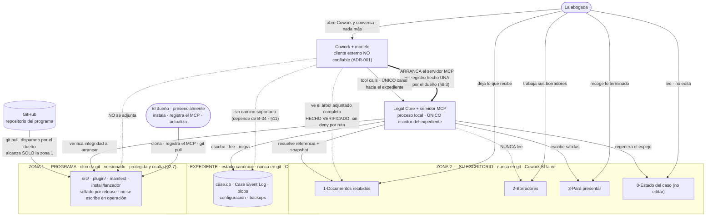
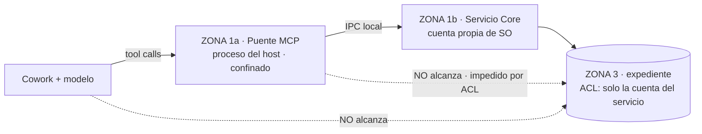

# 17 — Layout de despliegue: las tres zonas físicas

**Estado:** PROPUESTA DEL TECHNICAL DESIGN. Materializa una **DECISIÓN APROBADA** de los dueños (modelo de distribución: repositorio GitHub + clon en la máquina + `git pull` como actualización) dentro de las restricciones de ADR-001, ADR-002 y ADR-004, que **no se reabren**.

**Precedencia:** este documento es de nivel Technical Design. Donde parezca contradecir un ADR Accepted, manda el ADR y la contradicción es un defecto de este documento. Los puntos donde este documento **refina** o **supersede** una propuesta previa del Technical Design (no un ADR) están marcados uno a uno en §12.

**Revisión incorporada — DECISIONES DE LOS DUEÑOS (DECISIÓN APROBADA).** Esta revisión materializa seis decisiones que cierran preguntas que el documento tenía abiertas y que **no se reabren**:

1. **La instalación la hace el dueño presencialmente.** Ella **nunca toca el repositorio** y no tiene credenciales de git (§2.5).
2. **La actualización también la dispara el dueño**, no ella (§2.5, §9).
3. **La zona 1 se protege contra escritura accidental de ella y se oculta** (§2.7).
4. **Rutas relativas**, resueltas por un **lanzador** que vive dentro del repositorio (§2.6).
5. **La migración NO genera evento canónico en V0**: queda en el plano operacional (§9.3).
6. **La jerarquía se piensa como infraestructura profesional real** —despacho, oficina, área, caso, anexos— intuitiva para ella y no ruidosa (§6.5–§6.10).

**Y corrige un supuesto, porque la corrección es información útil.** El dueño propuso *"decirle a su Claude: arranca este MCP que está en tal dirección"*. **No es así como funciona, y por ADR-001 no debe serlo:** el modelo no arranca procesos. El mecanismo que produce el mismo resultado que él quiere es el registro único del servidor MCP en la configuración de Cowork durante la instalación; a partir de ahí **Cowork arranca el servidor cada vez que ella abre la aplicación**, sin comando y sin nada que recordar. Ella nunca menciona el MCP ni sabe que existe (§8.3).

---

## 0. Qué decide este documento y qué no

**Decide:** dónde vive físicamente cada cosa en la máquina de la abogada, con qué nombre, quién escribe, quién lee, y qué sobrevive a cada operación destructiva conocida. **Tras esta revisión decide también** quién instala y quién actualiza (§2.5), cómo se resuelven las rutas sin escribirlas en ninguna parte (§2.6), qué se protege de la zona 1 y con qué mecanismo (§2.7), y **con qué criterio se admite o se rechaza un nivel de carpeta** (§6.5).

**No decide** —y es la parte que más importa de §6— **la forma concreta de la jerarquía.** Esa la decide **ella** (§6.7, D-10): este documento fija el criterio, las dos formas legítimas, la regla de profundidad uniforme y las condiciones que hacen barato cambiar de una a otra después.

**No decide:** ninguna ruta absoluta como regla de arquitectura. ADR-002 es literal — *"la decisión es la separación, no el path"*. Todo path concreto de este documento aparece marcado **EJEMPLO ILUSTRATIVO** y no es normativo. Lo normativo es el **predicado** que una ruta debe satisfacer (§4.1).

**Tampoco decide:** el mecanismo de imposición del perímetro (deny rules, hooks, proceso separado). Sigue siendo **DECISIÓN PENDIENTE** de ADR-002 y depende de `B-04` (§11).

**Nomenclatura, regla de idioma:**

| Zona | Idioma de los nombres | Por qué |
|---|---|---|
| Zona 1 — PROGRAMA | inglés | la navega quien programa; ya está fijado en `14` §2.1 |
| Zona 2 — ESCRITORIO DE ELLA | **español (es-CO)** | la navega ella en el Explorador de Windows; `11` §6 fija es-CO como locale base normativo, no como traducción |
| Zona 3 — EXPEDIENTE | inglés | **nadie la navega**: solo la abre el Core. Un nombre en español ahí sería una invitación a abrirla |

---

## 1. La regla, antes del árbol

> **Tres árboles disjuntos. Ninguno es subcarpeta de otro. Ninguno contiene a otro.**

Todo lo demás de este documento es consecuencia de esa frase. Su valor no es estético: es que convierte en **imposibles por posición** los cuatro riesgos que los dueños nombraron, en vez de en *prohibidos por regla*.

| Riesgo nombrado por los dueños | Cómo lo cierra la disjunción | Por qué no basta `.gitignore` |
|---|---|---|
| Un `git pull` con conflictos toca datos de ella | Un conflicto solo puede ocurrir en un archivo **rastreado**; los archivos de ella no están en el árbol de trabajo del repositorio, luego no existen para git | `.gitignore` no impide que un archivo esté *dentro* del árbol de trabajo; impide que se rastree. Un archivo ignorado sigue estando en el camino de `git clean` |
| Un `git checkout` / `git reset` borra el expediente | `reset` y `checkout` operan sobre el árbol de trabajo del repositorio. El expediente no está ahí | Un `case.db` ignorado dentro del clon seguiría siendo alcanzable por `git clean -fdx` |
| Un `git push` sube documentos de clientes | No hay nada que subir: los documentos nunca entraron al árbol de trabajo | `.gitignore` es una regla con excepciones (`git add -f`), y una regla mal escrita es indistinguible de una regla ausente hasta que falla |
| Una actualización rompe el expediente | `git pull` no alcanza la zona 3 en ninguna de sus formas; la migración de datos es un acto **del Core al arrancar**, con backup verificado previo (§9.3) | git no migra nada, y nunca prometió hacerlo |

**Corolario que conviene enunciar porque es el pago real de la disjunción:** en este layout, `git reset --hard` y `git clean -fd` sobre la zona 1 son **operaciones seguras**, y su seguridad es una propiedad del layout, no una promesa de un script. Eso convierte "reparar el programa" en una acción trivial y sin riesgo, que es exactamente lo que exige un coste de mantenimiento tendiendo a cero.

`.gitignore` **se mantiene** (`14` §7.5) como segunda capa contra el accidente. Deja de ser la protección y pasa a ser lo que siempre debió ser: un detector de errores, no una frontera.

### 1.1 Las tres zonas y quién alcanza qué



**Cómo se lee el diagrama.** La flecha gruesa `COWORK ⇒ CORE` es **arranque**, no tráfico: Cowork lanza el servidor MCP porque el dueño lo registró una vez, y por eso ella no tiene ningún gesto de puesta en marcha (§8.3). La flecha fina paralela es el tráfico de tool calls. El dueño aparece en el diagrama porque es un actor real del sistema —el único que escribe en la zona 1— y omitirlo haría creer que el programa se instala y se actualiza solo. Hay exactamente **una** flecha sólida que llega al expediente, y sale del Core. Todo lo demás que quiera tocar el expediente tiene que pasar por `COWORK → CORE`, que es el camino único de ADR-002. Las flechas punteadas son negaciones declaradas: dicen qué **no** existe como camino, y una de ellas —la de Cowork hacia la zona 3— es la que depende de `B-04` y por eso tiene su propia sección de contingencia.

---

## 2. ZONA 1 — PROGRAMA

### 2.1 Qué es

El clon del repositorio. Es el `runtime/` de `01` §6.2: **ciclo de vida sellado por release**, escrito **solo** por el procedimiento de instalación/actualización —que aquí es `git pull`— y **nunca** por el Core en operación, ni por ella, ni por el host, ni por el modelo.

### 2.2 Árbol

Es el árbol de `14` §2.1 sin cambios: este documento **no** rediseña el repositorio, solo lo ubica. Lo que sí fija es qué aparece en la máquina de ella y que **no aparece nada más**:

```text
<raíz del clon>/                  EJEMPLO ILUSTRATIVO: C:\LegalOS\programa
│
├─ src/                           el producto (ver 14 §2.1 para el árbol completo)
├─ plugin/                        legal-plugin: skills sin autoridad (14 §2.1)
├─ tests/  fixtures/  benchmark/  experiments/   viajan en el clon; no se ejecutan aquí
├─ docs/                          corpus normativo; viaja en el clon
├─ .gitignore                     segunda capa contra el accidente, no la frontera (§1)
│
├─ install/                       NUEVO en este documento — instalación, arranque y actualización
│  ├─ legal-os                    EL LANZADOR (§2.6). Es la ÚNICA ruta absoluta del sistema:
│  │                              lo que el dueño registra en Cowork. Resuelve todo lo demás
│  │                              relativo a su propia ubicación. Versionado: un pull lo actualiza
│  ├─ actualizar                  procedimiento de actualización — lo ejecuta EL DUEÑO (§9.2)
│  └─ reparar                     "Reparar el programa" — lo ejecuta EL DUEÑO (§9.4)
│
└─ (artefactos de build, ignorados por git y regenerables)
```

**Lo único que este documento añade a `14` es `install/`**, y lo añade porque el modelo de distribución lo exige: si la actualización es `git pull`, el procedimiento de actualización **tiene que viajar dentro del repositorio**, porque es lo único que se actualiza a sí mismo. El mismo argumento vale, y con más fuerza, para el lanzador (§2.6).

**Los tres son del dueño, no de ella.** No hay accesos directos en el Escritorio de Windows de la abogada: no los necesita, porque no arranca nada (§8.3) y no actualiza nada (§2.5). Suprimir esos dos accesos directos es una simplificación real, no cosmética: cada icono que ella ve es una acción que puede ejecutar en el momento equivocado, y las dos que existían —arrancar y actualizar— dejaron de ser suyas.

**Nombres sin extensión en el árbol a propósito.** Qué extensión concreta tiene cada uno (`.cmd`, `.ps1`, `.js`, un ejecutable) es **detalle de implementación** y depende de qué acepta el registro de servidores MCP de Cowork — **POR VERIFICAR** (§2.6).

### 2.3 Qué NO está en el clon, y por qué es una lista corta

Rige `14` §7 íntegro. Lo que este documento añade es la consecuencia posicional:

- **No está la zona 2.** Si estuviera, `git clean` la alcanzaría y `git push` podría subirla.
- **No está la zona 3.** Además de `14` §7.3 (destruye la propiedad de detección de manipulación: bajo control de versiones, reescribir la historia es una operación soportada y rutinaria), un `case.db` dentro del clon convertiría `git checkout` en un camino de escritura sobre el estado canónico que no pasa por ningún use case.
- **No está la Client Config.** Contiene nombres de oficinas, jurisdicción y políticas de un cliente concreto: es dato del cliente, no del producto. Vive en la zona 3 (§4.2).
- **No está ningún dato de instancia**: ni una ruta de esta máquina, ni el registro del MCP, ni un archivo de configuración local. Es una propiedad que hay que defender activamente, porque la tentación de guardar ahí "solo un archivito con las rutas" es permanente. La razón es dura: **«Reparar el programa» (§9.4) borra los archivos sin rastrear del clon**, así que todo dato de instancia alojado ahí es un dato que la operación de reparación destruye. El diseño del lanzador (§2.6) existe, entre otras cosas, para que no haga falta.

### 2.4 El problema que crea el modelo de distribución: integridad cuando la instalación es un `git pull`

`01` §7.3 paso 1 exige verificar la integridad del producto sellado contra un `manifest`. Pero `14` §7.4 declara que el `manifest` es **salida de un release, no fuente**, y por tanto no está versionado. Si la instalación es un clon, ¿contra qué se verifica?

**PROPUESTA — dos comprobaciones, con alcances distintos y declarados:**

| Comprobación | Qué detecta | Qué NO detecta |
|---|---|---|
| **(a) Árbol de trabajo limpio y en el commit esperado.** El clon no tiene modificaciones locales sobre archivos rastreados y `HEAD` apunta al commit publicado como release | Cualquier edición local de un archivo del programa: alguien —persona o modelo— que tocó un skill, una regla o el código | A quien confirme sus cambios localmente. A un repositorio de origen comprometido: **no hay autenticación de origen en V0** (no hay firma de código, `01` §7.2, decisión y no omisión) |
| **(b) `manifest` de lo que realmente se ejecuta**, generado por el paso de instalación/build y verificado al arrancar (`01` §7.3 paso 1) | Alteración de los artefactos ejecutables después de instalar | Lo mismo que (a) respecto del origen |

**HECHO VERIFICADO (git, comandos estándar):** git mantiene el hash de contenido de cada archivo rastreado y puede reportar diferencias entre el árbol de trabajo y el commit confirmado. **POR VERIFICAR — la forma exacta de la invocación y de su salida** se fija en implementación contra la documentación oficial de git; este documento no la transcribe para no afirmar de memoria la firma de un comando.

**Límite, dicho sin adornos y coherente con `01` §7.2:** esto detecta la **modificación accidental** y protege a la abogada de romper el programa sin darse cuenta. **No hay inmutabilidad frente a alguien con control deliberado del equipo**, y este documento no lo promete en ninguna superficie. El origen del código no se autentica en V0: quien controle el repositorio remoto controla lo que se ejecuta en la máquina de ella. Eso es una consecuencia directa de la decisión de distribución, y hay que decirla en voz alta.

### 2.5 Quién instala, quién actualiza, y quién no toca nunca esta zona

**DECISIÓN APROBADA de los dueños.** La instalación y la actualización son **actos del dueño**, ejecutados por él, en la máquina de ella. **Ella no toca el repositorio jamás y no tiene credenciales de git.**

| Acto | Quién | Qué necesita | Frecuencia |
|---|---|---|---|
| Clonar el repositorio y dejarlo funcionando | **El dueño, presencialmente** | Sus propias credenciales de git; privilegios de administrador **una vez** si se aplica §2.7 | Una vez por máquina |
| **Registrar el servidor MCP en Cowork** | **El dueño**, durante la instalación | El registro apunta al lanzador (§2.6) | Una vez por máquina |
| Crear la zona 3 y la `client-config.json` | **El dueño**, durante la instalación | — | Una vez por máquina |
| `git pull` y build (§9.2) | **El dueño** | Igual que la instalación | Cuando él decide |
| **Abrir el programa** | **Nadie.** Lo arranca Cowork al abrirse (§8.3) | — | Cada sesión de ella |
| Escribir en la zona 1 | **Nadie más.** Ni ella, ni el host, ni el modelo, ni el Core en operación | — | Nunca |

**Lo que esta decisión cierra, y lo cierra por construcción.** El riesgo del `push` accidental —documentos de clientes subidos a un repositorio remoto— **deja de existir porque no hay permiso que revocar: nunca se concede**. Sin credenciales de git en la máquina bajo su cuenta, `git push` no es una operación que ella pueda ejecutar ni por accidente ni por instrucción de nadie. Es la misma clase de argumento que §1: se prefiere lo imposible por posición a lo prohibido por regla.

**Tres consecuencias que hay que anotar porque cambian requisitos escritos antes en este documento:**

1. **La puerta humana del release ya existe.** La `DECISIÓN PENDIENTE` de §9.2 —de qué rama se hace el `pull`— se planteó para evitar que un cambio a medio hacer llegue a la máquina de ella el día en que se escribió. Con la actualización disparada por el dueño, **hay un humano deliberando en el momento exacto de la actualización**. La rama de release deja de ser un requisito de seguridad y pasa a ser higiene recomendable (§12, D-7).
2. **El lector de los errores de actualización es un técnico.** `01` §7.5 prohíbe rutas en los mensajes a la usuaria; el procedimiento de actualización **no le habla a ella**, así que puede reportar rutas, hashes y estados de git sin violar nada. Es un alivio real de diseño: no hay que traducir el fallo de un `git pull` a lenguaje de abogada.
3. **La disponibilidad del dueño pasa a ser una dependencia operativa del producto.** Si un fallo urgente exige una actualización y el dueño no está disponible, no hay camino alternativo, porque se eliminó deliberadamente. Es el precio correcto por lo que compra, pero es un precio y se declara como riesgo (§14, R-9).

### 2.6 El lanzador: UNA sola ruta absoluta en todo el sistema

**El problema.** El registro de un servidor MCP en Cowork identifica un comando a ejecutar. **POR VERIFICAR — si ese registro admite rutas relativas o exige ruta absoluta.** Este diseño asume el caso peor (**exige absoluta**), porque un diseño que sobrevive al caso peor también sobrevive al favorable, y al revés no.

**La decisión (DECISIÓN APROBADA — "si conviene, se hace"): el registro apunta a un lanzador que vive dentro del repositorio, y el lanzador resuelve todo lo demás relativo a su propia ubicación.**

```text
Cowork ──registro: LA ÚNICA RUTA ABSOLUTA DEL SISTEMA──► <clon>/install/legal-os
                                                                  │
                              y a partir de ahí el lanzador resuelve, sin que
                              nadie haya escrito ninguna otra ruta en ningún sitio:
                                                                  │
                              ZONA 1 := relativa a sí mismo (su carpeta padre)
                              ZONA 3 := anclada a una carpeta conocida del perfil de Windows
                              ZONA 2 := nombre declarado en client-config.json (que vive
                                        en la zona 3), resuelto contra el mismo ancla
```

| Qué se resuelve | Contra qué se ancla | Por qué ese ancla y no otra |
|---|---|---|
| **Zona 1** (el clon) | La ubicación del propio lanzador | Es la única ancla que no puede desincronizarse: si el lanzador se ejecutó, está donde está el clon |
| **Zona 3** (el expediente) | Una **carpeta conocida del perfil de Windows** del usuario actual, resuelta en ejecución | **No se ancla al clon**: si se anclara, mover el clon movería el expediente, que es exactamente la catástrofe que este documento existe para impedir |
| **Zona 2** (su escritorio) | Un nombre declarado en `client-config.json`, resuelto contra una carpeta conocida del perfil | Mismo argumento. Y mantiene la regla de `14` §7.4: ninguna ruta de máquina en ningún archivo versionado |
| Carpetas de oficina / área | Nombres en `client-config.json`, resueltos contra la raíz de zona 2 | Ya estaba fijado en §6.4 y no cambia |

**Regla, enunciada para poder comprobarla:**

> **Ningún archivo de este sistema contiene una ruta absoluta, salvo el registro del MCP en la configuración de Cowork.** Todo lo demás es resolución en ejecución.

**El coste que esto tiene, y que hay que declarar: anclar por convención hace la zona 3 predecible.** P4 (§4.1) pedía que el expediente no estuviera en una ruta que ella navegue habitualmente, y una convención estable es, por definición, adivinable. Se acepta por tres razones: (a) P4 ya estaba declarado como **mitigación de UX, no seguridad** —una carpeta oculta es cosmética, y la frontera real es la de §8.1/§10—; (b) una ruta impredecible es también una ruta que nadie encuentra el día de la recuperación, y la recuperación es un requisito real; (c) la alternativa —guardar la ruta en alguna parte— reintroduce exactamente la ruta absoluta almacenada que esta decisión elimina. Lo que **no** se relaja es P3: el ancla elegida tiene que estar fuera de toda sincronización a la nube y de toda unidad de red (**POR VERIFICAR**, V-3).

**Por qué el lanzador tiene que estar DENTRO del repositorio.** Porque es lo único que hace que un `git pull` pueda arreglarlo. Si el lanzador viviera fuera del clon, cada cambio en cómo arranca el producto exigiría que el dueño editara a mano un archivo que git no ve — es decir, un segundo procedimiento de actualización, manual, y por tanto el que se olvida. Dentro del clon, **`git pull` actualiza el contenido del lanzador sin tocar su ruta, y el registro de Cowork sigue siendo válido sin que nadie lo mire.**

**Y el corolario duro, que es la contrapartida:**

> **La ruta del lanzador es un contrato de instalación, no un detalle interno.** Renombrarlo o moverlo dentro del repositorio es un **cambio incompatible**: rompe el registro en todas las máquinas instaladas, y el síntoma que ve ella es "el programa no responde", sin ningún error que apunte a la causa. Se trata con la misma disciplina que un cambio de esquema: si hay que moverlo, el procedimiento de actualización tiene que re-registrarlo, y eso es un acto presencial del dueño. (§14, R-10.)

**Qué pasa si el dueño mueve el proyecto.** Cambia **una línea**: la del registro de Cowork. No cambia nada más, y ese es todo el punto:

| Qué se mueve | Qué hay que tocar | Por qué |
|---|---|---|
| El clon entero, a otra carpeta o a otra unidad | La línea del registro de Cowork | La zona 1 se resuelve sola desde la nueva ubicación del lanzador |
| El clon entero | **La zona 2 y la zona 3: nada** | No cuelgan del clon. Están ancladas al perfil del usuario |
| La zona 2 (ella mueve su `Despacho/`) | `client-config.json` | Y la zona 1 no se entera |
| La zona 3 | El ancla convenida, que es una decisión de instalación | Es el caso menos frecuente y el más delicado; exige backup verificado antes |

**La tentación que hay que rechazar explícitamente: colgar las tres zonas de una carpeta común** para que "todo sea relativo a la raíz de la instalación". Tres carpetas hermanas bajo un mismo padre **sí** satisfacen §1 (ninguna contiene a otra), así que la regla no lo prohíbe. Se rechaza por otra razón, y es grave: **crearía la única carpeta cuyo adjuntado rompe el sistema entero.** Hoy, si ella se equivoca al adjuntar, adjunta de más dentro de su zona 2. Con un padre común, un clic en el padre le concede al modelo lectura y escritura sobre el programa **y** sobre `case.db` a la vez (§8.1). Un diseño no debe contener una carpeta así.

**Comprobación obligatoria antes de usar las rutas resueltas.** Las rutas relativas hacen barata la resolución y **también** hacen barato el error: `..` de más, un enlace, una unidad mapeada. Por eso la verificación de disjunción de §4.1 (D-3) opera **sobre las rutas canonicalizadas**, no sobre las escritas: primero resolver, después canonicalizar, después comparar. Sin canonicalización, la comprobación se puede pasar con dos rutas que apuntan al mismo sitio.

**Pseudocódigo ILUSTRATIVO — NO PRODUCCIÓN.** Describe qué resuelve y en qué orden; no es el script, no fija lenguaje y no transcribe ninguna API.

```text
# "legal-os" — EL LANZADOR · pseudocódigo NO-PRODUCCIÓN

0. MI_UBICACIÓN := la carpeta donde está este archivo, preguntada por el propio proceso.
   NUNCA el directorio de trabajo: lo fija quien lanza el proceso —Cowork—, no quien
   lo instaló, y puede ser cualquiera. Confundir ambos es el error clásico de todo lanzador.

1. ZONA_1 := carpeta padre de MI_UBICACIÓN
   ¿contiene lo que un clon debe contener?   -> NO: DETENERSE.
                                                 "el programa no está donde se instaló".
                                                 Jamás buscar el clon por el disco: adivinar
                                                 la ubicación del programa es cómo se arranca
                                                 la versión equivocada sin enterarse.

2. ZONA_3 := <carpeta conocida del perfil del usuario>/<producto>/state
   ¿existe?                                  -> NO: DETENERSE. No se crea un expediente vacío
                                                 en silencio: eso convierte "no encuentro sus
                                                 datos" en "usted no tiene datos". Crear la
                                                 zona 3 es acto de la INSTALACIÓN, no del arranque.

3. CONFIG  := ZONA_3/configuration/client-config.json
   ZONA_2  := resolver(CONFIG.workspace_root) contra la carpeta conocida del perfil
   ¿config ausente o inválida?               -> DETENERSE (nunca degradar a defaults: §5.3)

4. Canonicalizar ZONA_1, ZONA_2, ZONA_3 (resolver '..', enlaces, mayúsculas/minúsculas)
   ANTES de compararlas entre sí.

5. Verificar P1 y P2 (§4.1): las tres raíces canónicas son DISJUNTAS dos a dos.
   -> NO: DETENERSE con mensaje de producto, sin exponer rutas a ella (01 §7.5).

6. Entregar las tres raíces al Core y cederle el proceso.
   El lanzador NO abre case.db, NO escribe en la zona 1, y NO deja archivos tras de sí:
   si dejara estado, "Reparar el programa" (§9.4) lo borraría y nadie lo echaría de menos
   hasta el arranque siguiente.
```

**Lo que el lanzador NO hace, y es deliberado:** no instala, no migra, no crea carpetas, no repara y no escribe nada. Resuelve tres rutas, comprueba una propiedad y cede el control. Todo lo que un lanzador hace de más es trabajo que ocurre **fuera** de la secuencia de arranque de `01` §7.3 y por tanto fuera de sus garantías.

### 2.7 Proteger y ocultar la zona 1

**DECISIÓN APROBADA de los dueños:** proteger la carpeta `.git` y la zona 1 contra escritura accidental de ella, y ocultarlas para que no aparezcan al navegar.

**Contra qué protege esto, dicho con precisión, porque es más estrecho de lo que suena:**

| Amenaza | ¿La cubre esta protección? |
|---|---|
| Ella abre una carpeta que no entiende y mueve, renombra o borra algo | **Sí.** Es el caso real y el que motivó la decisión |
| Un proceso del host escribiendo bajo su cuenta en el clon | **Sí**, si se aplica la ACL |
| **El modelo editando sus propias reglas** | **No hace falta:** el clon **no se adjunta jamás** (§8.1). La protección posicional ya lo cerró |
| Alguien con control deliberado del equipo | **No**, y §2.4 ya lo dice sin adornos. Nada aquí es inmutabilidad |

**El orden correcto de los mecanismos, de más barato y más fuerte a más caro y más frágil:**

> **Posición antes que atributo; atributo antes que ACL.**

| # | Mecanismo | Qué compra | Qué cuesta | ¿Pone en peligro el `pull`? |
|---|---|---|---|---|
| 1 | **Posición**: el clon fuera de todo árbol que ella navegue y fuera de todo árbol que adjunte | Que no lo encuentre porque no pasa por ahí. Es la misma lógica de P4 (§4.1) | Cero | No |
| 2 | **Atributo oculto** sobre `.git` y sobre la raíz del clon | Que no aparezca al navegar. **Es cosmético y hay que llamarlo así**: no impide ninguna escritura | Casi cero | No |
| 3 | **ACL NTFS**: su cuenta con **lectura y ejecución**, escritura reservada a la cuenta del dueño | Convierte "el Core no escribe en la zona 1" (§2.1) de invariante escrito en **propiedad impuesta por el sistema operativo** | Real: exige una segunda cuenta o elevación, y complica la actualización | **Sí. Es el punto delicado de esta sección** |

**Cuatro precisiones técnicas, todas POR VERIFICAR antes de apoyarse en ellas:**

- **`Hidden` en el Explorador depende de la configuración del usuario** (mostrar archivos ocultos; ocultar archivos protegidos del sistema). Si esas opciones ya están cambiadas en su máquina, la ocultación no oculta. **POR VERIFICAR en la máquina real.**
- **git para Windows dispone de una opción de configuración que oculta `.git`.** Que esté activa por defecto en la versión instalada es **HIPÓTESIS, POR VERIFICAR**; no se afirma de memoria el comportamiento por defecto de git.
- **El atributo "solo lectura" de una *carpeta* en Windows no es un mecanismo de protección de su contenido.** Usarlo como si lo fuera es un error frecuente. **POR VERIFICAR** antes de incluirlo en el instalador; si se confirma, se descarta y solo quedan `Hidden` y la ACL.
- **La ACL debe conceder a su cuenta LECTURA y EJECUCIÓN.** No es opcional: **Cowork corre bajo su cuenta y es quien ejecuta el lanzador** (§8.3). Una ACL que le niegue lectura o ejecución sobre la zona 1 **impide que el producto arranque**. La protección es contra la escritura, exclusivamente.

**El riesgo que hay que analizar y no esquivar: la protección puede bloquear el `pull`.**

`git pull` escribe en `.git` **y** en el árbol de trabajo. Una ACL que niegue la escritura a la cuenta que ejecuta el `pull` lo bloquea. Y el dueño actualiza **en la máquina de ella**, con lo cual la pregunta decisiva es **con qué cuenta**:

| Escenario | ¿Funciona el `pull`? | Veredicto |
|---|---|---|
| **(i) El dueño tiene su propia cuenta de Windows en el equipo** (o una cuenta local de administrador) y la ACL da escritura a esa cuenta | **Sí, limpiamente.** Ella no puede escribir; él sí | **RECOMENDADO.** Cuesta crear una cuenta, una sola vez, durante la instalación presencial |
| **(ii) Solo existe la cuenta de ella y el dueño la usa** | **No**, mientras la ACL esté puesta | Obliga a levantar la protección para actualizar y volver a ponerla al final |
| **(iii) Como (ii), pero el procedimiento de actualización levanta y repone la ACL** | Sí, mientras nada falle | **RECHAZADO.** Es una protección que está **apagada exactamente durante la única operación que escribe en la zona 1**, y si el procedimiento se interrumpe a mitad, el árbol queda desprotegido y **nadie se entera**. Una protección cuyo estado depende de que un script termine bien no es una protección: es una variable |

**DECISIÓN DE LOS DUEÑOS — D-11 RESUELTA: el dueño tendrá cuenta propia de Windows en el equipo. Se aplica el escenario (i) y, con él, la ACL.**

En consecuencia, el instalador aplica **los tres mecanismos**:

1. **Posición** (§1 y P4 de §4.1): el clon fuera de todo árbol que ella navegue y fuera de todo árbol que adjunte. Coste cero.
2. **Atributo oculto** sobre `.git` y sobre la raíz del clon. Cosmético, y así debe llamarse: no impide ninguna escritura.
3. **ACL NTFS**, ahora habilitada por la decisión:

| Cuenta | Permiso sobre el árbol del clon | Por qué exactamente ese |
|---|---|---|
| **Del dueño** (instala y actualiza) | **Control total** | `git pull` escribe en `.git` **y** en el árbol de trabajo; sin escritura completa, la actualización falla a mitad |
| **De ella** (bajo la que corre Cowork) | **Lectura y ejecución. Escritura DENEGADA** | **No es opcional conceder lectura y ejecución:** Cowork corre bajo su cuenta y es quien ejecuta el lanzador (§8.3). Una ACL que le niegue lectura o ejecución **impide que el producto arranque**. La protección es contra la escritura, exclusivamente |

**Regla dura: se protege el árbol completo del clon, o no se protege nada.** Proteger `.git` y dejar escribible el árbol de trabajo —o al revés— produce actualizaciones que fallan a la mitad, que es el peor de los tres estados posibles.

**Escenario (iii) queda RECHAZADO y no se reabre:** levantar la ACL para actualizar y reponerla al final es una protección apagada exactamente durante la única operación que escribe en la zona 1; si el procedimiento se interrumpe, el árbol queda desprotegido y nadie se entera. Con cuenta propia esa concesión ya no hace falta.

**Lo que la ACL compra de verdad, sin exagerarlo:** convierte «el Core no escribe en la zona 1» (§2.1) de invariante escrito en **propiedad impuesta por el sistema operativo**. No es inmutabilidad —§2.4 ya lo dice— y no protege de alguien con control deliberado del equipo. Protege del accidente, que es la amenaza real y frecuente.

**Verificación obligatoria en la instalación (V-9, nueva):** después de aplicar la ACL, el instalador **comprueba que Cowork puede arrancar el lanzador** bajo la cuenta de ella. Es la única forma de detectar en el momento —y no la primera vez que ella abre el programa— que la ACL quedó demasiado restrictiva. Un fallo aquí es silencioso y se manifestaría como «el programa no responde».

**Coste declarado de ocultar:** una carpeta oculta también es una carpeta que el dueño tarda más en encontrar cuando algo va mal, y todo diagnóstico empieza por volver a mostrarla. Es aceptable porque el diagnóstico lo hace quien puso la protección.

**RESUELTA** (§12, D-11): el dueño tendrá cuenta propia en el equipo. La ACL se aplica según el escenario (i).

---

## 3. ZONA 2 — EL ESCRITORIO DE ELLA

### 3.1 Árbol completo

**Advertencia de lectura:** el árbol de abajo está dibujado en la **forma A** (la oficina *es* el área). La forma es una **DECISIÓN PENDIENTE que le corresponde a ELLA**, no a los dueños ni a este documento; la alternativa legítima —forma B, con área entre oficina y casos— está en §6.6, y §6.9 explica por qué elegir una u otra **después** es barato. Todo lo que sigue en §3 es idéntico en ambas formas: lo que cambia está por encima de `Casos/`, nunca dentro del caso.

```text
Despacho/                                          raíz de la zona 2 · lo ÚNICO que ella navega
│                                                  EJEMPLO ILUSTRATIVO: C:\Users\<ella>\Documents\Despacho
│
├─ Oficina de litigio civil/                       FORMA A (§6.6) · unidad de trabajo con reglas propias (§6)
│  │
│  ├─ Casos/                                       todos los expedientes de esta oficina
│  │  │
│  │  ├─ 2026-014 Pérez vs Alfa SAS/               un caso · nombre que ELLA elige · la carpeta es etiqueta, nunca autoridad (§6.3)
│  │  │  ├─ 0-Estado del caso (no editar).txt      espejo de solo lectura del expediente · lo regenera el Core (§7)
│  │  │  ├─ 1-Documentos recibidos/                lo que llega y aún NO está en el expediente
│  │  │  ├─ 2-Borradores/                          su trabajo en curso · el Core NUNCA lo lee
│  │  │  └─ 3-Para presentar/                      lo terminado · lo escribe el Core y también ella
│  │  │
│  │  └─ 2026-021 Gómez — tutela/
│  │     └─ (misma estructura)
│  │
│  └─ Papelería de la oficina/                     POST-V0 · plantillas y formatos propios de esta oficina
│
└─ Oficina de familia/
   └─ Casos/
      └─ (misma estructura)
```

**Cuatro elementos y ni uno más por caso.** El presupuesto es deliberado: cada carpeta que ella tenga que aprender es un coste permanente, y cada carpeta que exista sin propósito claro terminará conteniendo algo que no debía estar ahí.

### 3.2 Justificación de cada nombre

| Nombre | Por qué ese y no otro | Qué se descartó |
|---|---|---|
| `Despacho/` | Es la palabra con la que una abogada nombra su ejercicio profesional entero. Es corta, no es jerga técnica, y no dice nada del sistema | `Legal OS/`, `Workspace/`, `LegalWorkspace/`: nombran el producto, no su trabajo. `Mis casos/`: incorrecto, porque debajo hay oficinas antes que casos |
| `Oficina de litigio civil/` | Los dueños pidieron literalmente *"la oficina tal, la oficina tal otra"*. El nombre completo se lee solo y no exige convención | `OF-01/`, `Oficina 1/`: identificadores que ella tendría que traducir mentalmente |
| `Casos/` | Un nivel explícito entre la oficina y los expedientes, para que la oficina pueda tener algo más que casos (`Papelería`, POST-V0) sin que se mezcle. **Y por una razón más fuerte, que §6.5 desarrolla: es la junta de dilatación** — con él, la ruta de un caso termina siempre en `…/Casos/<caso>/` y añadir un nivel de área por encima (§6.6) no cambia nada dentro del caso | Colgar los casos directamente de la oficina: funciona hasta el día en que hay un archivo de oficina, y entonces queda mezclado con los expedientes — **y hasta el día en que se decide la forma B, y entonces hay que mover todos los casos** |
| `2026-014 Pérez vs Alfa SAS/` | Año + consecutivo + partes. Ordena cronológicamente por nombre, se busca por parte, y **es el nombre que ella ya usa en papel** | `case_id` (un UUID): ilegible. Solo el nombre de las partes: colisiona y no ordena |
| `0-Estado del caso (no editar)` | El `0-` lo pone arriba de todo, que es donde debe estar lo que se lee primero. **La instrucción va dentro del nombre**: es el único sitio donde no se puede perder ni olvidar | `memory.md`: no significa nada para ella y suena a archivo de sistema borrable. `README`: jerga. Un archivo oculto: sería invisible justo para quien debe leerlo |
| `1-Documentos recibidos/` | Dice **qué son**, no qué hará el sistema con ellos. "Recibidos" cubre lo que llega del cliente, del juzgado y de la contraparte por igual | `Inbox/`: inglés y jerga. `Por incorporar/`: usa el verbo del sistema; describe una intención del producto, no un hecho sobre los documentos |
| `2-Borradores/` | Es exactamente la palabra profesional. Su significado ya incluye "no definitivo" y "mío" | `Trabajo/`, `Working/`: vagos. `Temporal/`: falso — un borrador no es temporal, y llamarlo así invita a borrarlo |
| `3-Para presentar/` | Nombra el **acto** al que va destinado el documento, que es como piensa una litigante. Es accionable: si algo está ahí, hay algo que hacer con ello | `Salidas/`, `Exports/`: hablan del sistema. `Documentos finales/`: neutro pero muerto — no dice qué hacer |

**El prefijo numérico `1- 2- 3-` hace dos trabajos a la vez** y por eso vale su fealdad: (a) fija el orden en el Explorador de Windows contra cualquier reordenación alfabética, y (b) **codifica la dirección del flujo** — entra por 1, se trabaja en 2, sale por 3. Un nombre que enseña el proceso cada vez que se mira ahorra la explicación.

**RIESGO — `3-Para presentar` es un nombre del contexto litigante.** Un decisor no "presenta": decide. El glosario es explícito en que **el slice v0 es contexto A únicamente**, así que el nombre es correcto para todo lo que V0 alcanza. Una oficina en rol decisor necesitará otro rótulo, y esa es una de las razones por las que el rótulo de las tres carpetas debe poder resolverse por oficina (§6.4) — **POST-V0**, porque el trabajo real del contexto B **no ha sido levantado** y no se inventa aquí.

### 3.3 Por qué la estructura es por ETAPA y no por TIPO de documento

Los dueños dijeron literalmente *"aquí pones los anexos, aquí las demandas"*. Este documento **no** crea `Anexos/` y `Demandas/` como carpetas, y debe justificarlo porque se aparta de su formulación literal.

**El mapeo de sus palabras al árbol:**

| Lo que ellos nombraron | Dónde vive realmente | Por qué |
|---|---|---|
| "los anexos" que llegan | `1-Documentos recibidos/` | Un anexo recibido es material que aún no está en el expediente. Su etapa es "recibido" |
| "los anexos" que ella produce | `2-Borradores/` mientras se hace → `3-Para presentar/` cuando está listo | El mismo documento cambia de etapa. No cambia de tipo |
| "las demandas" en curso | `2-Borradores/` | |
| "las demandas" listas | `3-Para presentar/` | |

**Los tres argumentos:**

1. **El tipo no cambia; la etapa sí.** Un documento pasa por recibido → borrador → presentado a lo largo de su vida. Si la carpeta codifica el tipo, la etapa se pierde y hay que llevarla en la cabeza o en el nombre del archivo. Si la carpeta codifica la etapa, el tipo sigue visible en el nombre del archivo, que es donde ya estaba.
2. **La etapa es lo que el sistema necesita saber; el tipo no.** El Core tiene que distinguir "material que puedo incorporar" de "borradores que no debo mirar jamás" de "salidas que yo escribo". Esas tres distinciones son exactamente las tres carpetas, y son las tres del `user-workspace` de ADR-002 (`Inbox` / `Working` / `Exports`), traducidas. Una carpeta `Demandas/` no le dice nada al sistema y crearía la pregunta de qué régimen tiene.
3. **Por tipo, la lista no cierra.** Anexos, demandas, memoriales, contestaciones, recursos, poderes, actas, notificaciones… y cada área del derecho añade los suyos. Por etapa, la lista tiene tres elementos y no crece nunca.

**Concesión, sin coste:** dentro de `2-Borradores/` y `3-Para presentar/` **ella puede crear las subcarpetas que quiera**, incluidas `Demandas/` y `Anexos/`. El sistema no depende de esa estructura: el Core **nunca lee** `2-Borradores/`, y en `3-Para presentar/` escribe archivos, no una jerarquía. Así se recupera la organización que los dueños describieron, sin que el sistema dependa de ella.

**Excepción que sí es regla dura: `1-Documentos recibidos/` es PLANA, sin subcarpetas.** Es la única carpeta de ella que el Core **lee**, y una carpeta con subcarpetas obliga a decidir si el Core desciende, hasta qué profundidad, y qué hace con un enlace simbólico o un *junction* de Windows. **HECHO VERIFICADO** (spike de Cowork, `A-08`): el comportamiento de *junctions* y symlinks de Windows en este anfitrión es `NOT_TESTED`. Una carpeta plana elimina la pregunta por construcción en vez de responderla con una suposición. Si ella crea una subcarpeta ahí, el Core **no la recorre**: los archivos que contenga simplemente no aparecen como incorporables, y eso se le dice.

### 3.4 REFINAMIENTO DECLARADO: las tres carpetas son POR CASO, no globales

`01` §6.2 y ADR-002 describen `user-workspace/Inbox/`, `Working/`, `Exports/` como **tres ubicaciones lógicas**. Este documento las materializa **una vez por caso**, dentro de la carpeta del caso.

**Requiere aprobación** (§12, D-2). Los argumentos:

- **Elimina una clase entera de error.** Con un `Inbox` global, todo archivo que ella deja obliga a alguien —ella o el modelo— a decir a qué caso pertenece. Con un Inbox por caso, la pertenencia está en el sitio donde lo dejó y no hay nada que preguntar ni nada que adivinar. Esto importa especialmente porque ADR-001 clasifica al modelo como no confiable: cuanta menos inferencia haga sobre a qué expediente pertenece un documento, mejor.
- **Habilita el aislamiento por oficina**, que es el único aislamiento real disponible (§8.2). Con un workspace global, adjuntar "solo una oficina" es imposible.
- **Es como ella ya archiva.** El material de un caso vive junto al caso.
- **No cambia ningún contrato del Core.** `ingest_evidence` sigue recibiendo un identificador de Inbox resuelto por el Core, nunca una ruta (ADR-002 inv. 3). Lo que cambia es cuántos Inbox hay, no qué es un Inbox.

**Coste declarado, honestamente:** un documento que sirve a dos casos se deja dos veces y se incorpora dos veces, generando dos Sources. Es correcto epistémicamente —cada expediente tiene su propia cadena de custodia y su propio ProvenanceRecord— aunque duplique bytes. La deduplicación por contenido entre casos es una **pregunta de negocio abierta** (glosario §3: *"condiciona el aislamiento y la deduplicación"*) y este documento **no la resuelve**; propone la opción conservadora (sin dedup entre casos, §4.2) por el aislamiento.

**POST-V0:** una bandeja general para material que aún no tiene caso.

---

## 4. ZONA 3 — EL EXPEDIENTE

### 4.1 La ruta: el predicado, no el path

ADR-002 prohíbe fijar la ruta como decisión de arquitectura. Lo que sí es decisión de arquitectura es el **predicado que una ruta candidata debe satisfacer**. Un instalador que no pueda satisfacerlo debe **negarse a instalar**, no elegir "lo más parecido".

| # | Condición | Por qué | ¿Comprobable en el arranque? |
|---|---|---|---|
| P1 | **No está dentro del árbol del clon, ni lo contiene** | §1: si estuviera, git la alcanzaría | **Sí** — comparación de rutas canónicas |
| P2 | **No está dentro del árbol que ella adjunta a Cowork, ni lo contiene** | **HECHO VERIFICADO** (spike Cowork): adjuntar una carpeta concede su árbol completo y no existe deny por ruta; *"To keep data out of reach entirely, leave it outside the allowed roots"*. La exclusión posicional es el único remedio documentado | **Sí** — comparación de rutas canónicas contra la raíz de zona 2 |
| P3 | **No está en unidad de red ni bajo carpeta sincronizada a la nube** | **HECHO VERIFICADO** (kernel §1, fuente sqlite.org, vía ADR-004): WAL **no funciona sobre filesystems de red**. Y una carpeta sincronizada saca el expediente del equipo, lo que es una decisión de confidencialidad que nadie ha tomado | **Parcialmente.** Unidad de red: sí. Carpeta sincronizada: **POR VERIFICAR** si es detectable de forma fiable; la detección de clientes de sincronización es heurística y no se afirma aquí que exista una comprobación robusta |
| P4 | **No está en una ruta que ella navegue habitualmente** | Reduce la probabilidad de que la adjunte por accidente. Es **mitigación de UX, no seguridad**: una carpeta oculta es cosmética | No |
| P5 | **Es local, con espacio para blobs y backups, y está disponible antes de que arranque el Core** | El Core la necesita en el paso 1 de su arranque | Sí |
| P6 | **Su ruta no aparece en ningún mensaje a la usuaria ni en ningún archivo versionado** | `01` §7.5 (nunca rutas en mensajes) y `14` §7.4 | Sí — test de higiene de `14` §7.5 |
| P7 | **Es resoluble en ejecución desde un ancla estable, sin almacenar la ruta absoluta en ninguna parte** | §2.6 (DECISIÓN APROBADA: rutas relativas). Una ruta absoluta guardada es una ruta que se queda vieja el día que algo se mueve, y que se queda vieja **en silencio** | Sí — trivialmente: o resuelve, o no |

**PROPUESTA — nuevo paso en la secuencia de arranque de `01` §7.3:** antes del paso 1, el Core verifica que las tres raíces resueltas son **disjuntas dos a dos** (P1, P2). Si no lo son, **no abre en modo normal** y emite mensaje de producto. Es la comprobación más barata del sistema y protege la única propiedad de la que cuelga todo lo demás. **Requiere aprobación** (§12, D-3).

**EJEMPLO ILUSTRATIVO — NO ES DECISIÓN DE ARQUITECTURA:**

```text
Zona 1 (programa) :  C:\LegalOS\programa
Zona 2 (su escritorio) : C:\Users\<ella>\Documents\Despacho
Zona 3 (expediente):  C:\Users\<ella>\AppData\Local\LegalOS\state
```

Cualquier otro trío que satisfaga P1–P7 es igual de válido.

**Cómo se resuelven, tras la decisión de rutas relativas (§2.6):** la resolución ocurre **en cada arranque**, no una vez en la instalación, y la ejecuta el lanzador. Las tres raíces son las **únicas rutas absolutas que existen en memoria** mientras el producto corre, y la **única ruta absoluta almacenada en algún archivo de todo el sistema** es la del registro del MCP en Cowork, que apunta al lanzador. Ni `domain` ni `application` conocen una ruta jamás (`01` §6.1).

**La `DECISIÓN PENDIENTE` que había aquí —el mecanismo de entrega de las rutas al Core— queda RESUELTA:** las entrega el lanzador, que las resuelve, las canonicaliza, verifica P1 y P2 sobre las canónicas y solo entonces cede el control (§2.6). Lo que **sigue abierto** es la forma exacta del ancla de la zona 3 y si el registro de Cowork admite rutas relativas (**POR VERIFICAR**, §2.6).

### 4.2 Árbol

```text
<raíz protegida>/                      dos ciclos de vida distintos bajo un mismo árbol protegido
│
├─ configuration/                      CICLO "mutación controlada" (01 §6.2)
│  ├─ client-config.json               Client Config validada por schema: organización, oficinas,
│  │                                   rol por defecto de cada oficina, jurisdicción, políticas require_*
│  └─ configuration_version            versión de la FORMA de la config (01 §7.1)
│
└─ private-state/                      CICLO "operativo" · ESTADO CANÓNICO · solo el Core
   ├─ schema_version                   versión de la forma del estado persistido (01 §7.1)
   ├─ catalog.db                       índice de Cases: case_id ↔ etiqueta ↔ oficina ↔ carpeta de trabajo
   ├─ operational.db                   Tool Invocation Log · NO canónico · podable (ADR-004 inv. 8)
   │
   ├─ cases/
   │  └─ <case_id>/                    identificado por case_id, NUNCA por el nombre que ella ve
   │     ├─ case.db (+ -wal, -shm)     estado materializado + Case Event Log append-only encadenado
   │     └─ blobs/
   │        ├─ sources/                Sources: bytes originales inmutables, direccionados por contenido
   │        └─ derived/                DerivedRepresentations: regenerables (ADR-003)
   │
   └─ backups/                         exports verificados: previos a migración y periódicos (01 §8)
```

**Tres decisiones de forma que hay que justificar:**

1. **`configuration/` vive en el árbol protegido, no en el clon.** Contiene datos del cliente (nombres de oficinas, jurisdicción) y **cambia por máquina**. En el clon sería (a) dato de cliente en git —prohibido por `14` §7.2— y (b) una fuente permanente de conflictos de `git pull`, que es justo lo que los dueños quieren evitar. Está en el árbol protegido pero **conserva su ciclo de vida propio**: no es estado canónico, no es objetivo de escritura del Core en operación normal, y una configuración inválida se rechaza de forma visible (`boundaries.md` §142) en vez de degradarse a defaults.
2. **Los blobs son por caso, no globales.** Cuesta espacio (el mismo documento en dos casos ocupa dos veces) y a cambio da que **borrar o exportar un caso sea una operación cerrada sobre una carpeta**, sin preguntarse quién más comparte un blob. Dado que la deduplicación entre casos es una pregunta de negocio abierta y que el contexto B manejaría datos de terceros con obligaciones posiblemente distintas, la opción conservadora es la correcta hasta que la pregunta se responda. **Requiere aprobación** (§12, D-4).
3. **Las oficinas NO son un nivel de carpeta aquí.** La oficina es un atributo del Case en `catalog.db`. Si fuera un nivel de carpeta, **mover un caso de oficina sería mover archivos canónicos en disco** — un cambio de estado del expediente ejecutado por el sistema de archivos y no por un use case, que es exactamente lo que ADR-002 inv. 2 prohíbe. Con la oficina como atributo, mover un caso es un cambio de dato con su evento; la carpeta de trabajo de zona 2 se mueve después, como consecuencia, y si la mudanza de carpetas falla el expediente no se ha roto.

---

## 5. Régimen de acceso, carpeta por carpeta

Leyenda: **Core** = el Legal Core, único componente que atraviesa la frontera. **Host** = Cowork y el modelo. **Ella** = la abogada, en el Explorador de Windows.

### 5.1 ZONA 1 — PROGRAMA

| Carpeta | Quién escribe | Quién lee | ¿En git? | ¿Cowork la ve? | Si se borra |
|---|---|---|---|---|---|
| `<raíz del clon>/` completo | **Solo el dueño**, mediante el procedimiento de instalación/actualización (§2.5). Ni el Core en operación, ni el host, ni el modelo, ni ella. Protegida y oculta según §2.7 | El Core al arrancar (integridad); el dueño. **Lectura y ejecución imprescindibles para la cuenta de ella**: Cowork corre bajo su cuenta y ejecuta el lanzador (§2.7) | **SÍ — es git** | **NO** (§8.1) | **Pérdida cero.** Se vuelve a clonar. Ni el expediente ni los documentos de ella dependen del clon |
| `install/legal-os` (lanzador) | igual | **Cowork lo ejecuta en cada apertura** (§8.3); el dueño lo registra una vez | SÍ | NO — se **registra** como servidor MCP, no se adjunta como carpeta | Cowork no arranca el Core y el síntoma es "el programa no responde". Se recupera reclonando (§14, R-10) |
| `install/actualizar`, `install/reparar` | igual | Solo el dueño (§9.2, §9.4) | SÍ | NO | igual |
| `.git/` | Solo git, bajo la cuenta que ejecute el `pull` (§2.7) | git | es git | NO | Deja de poderse actualizar; el programa **sigue funcionando**. Se recupera reclonando |
| artefactos de build | El paso de instalación/build, ejecutado por el dueño | El runtime | No (ignorados) | NO | Se regeneran reinstalando |

### 5.2 ZONA 2 — EL ESCRITORIO DE ELLA

| Carpeta | Quién escribe | Quién lee | ¿En git? | ¿Cowork la ve? | Si se borra |
|---|---|---|---|---|---|
| `Despacho/` (raíz) | Ella; el Core crea el esqueleto de cada caso nuevo | Ella, el host, el Core (parcial) | **NUNCA** | **SÍ — es su zona de trabajo** | Se pierden borradores y lo recibido aún no incorporado. **El expediente NO se pierde.** El Core recrea el esqueleto y regenera el espejo; **no puede recrear sus borradores** |
| `Oficina .../` | Ella (la crea el instalador o el Core al configurar la oficina) | Ella, host, Core | NUNCA | SÍ | Como arriba, acotado a esa oficina |
| `Área/` — **solo en la forma B** (§6.6) | Igual que la oficina | Ella, host, Core | NUNCA | SÍ, y puede ser la unidad de adjuntado si así se declara (§8.2) | Como arriba, acotado a esa área. **La identidad de los casos no depende de ella**: es una etiqueta más (§6.3) |
| `Casos/<caso>/` | El Core la crea al crear el caso; ella puede renombrarla | Ella, host, Core | NUNCA | SÍ | El expediente sobrevive intacto. Al abrir el caso, el Core detecta que la carpeta registrada no está y **pregunta**; nunca adivina (§6.3) |
| `0-Estado del caso (no editar)` | **Solo el Core** | Ella. **El modelo NO debe leerlo** (§7.4) | NUNCA | SÍ (inevitable, §7.4) | **No-op.** Se regenera. Borrarlo no pierde información |
| `1-Documentos recibidos/` | Ella y el host | El Core, **solo** para resolver una referencia de Inbox y hacer snapshot (ADR-002 inv. 4) | NUNCA | SÍ | Lo ya incorporado: **sin efecto** — la fuente es el Source, no el archivo. Lo **no** incorporado: **pérdida definitiva**, el sistema nunca lo tuvo |
| `2-Borradores/` | Ella y el host | **NADIE del Core.** Ninguna operación lo lee, en ninguna circunstancia (`01` §6.2) | NUNCA | SÍ | **Pérdida real y no recuperable por el sistema.** V0 no respalda la zona 2 (§14, R-4) |
| `3-Para presentar/` | El Core (escribe salidas) **y** ella | Ella | NUNCA | SÍ | **Regenerable por re-ejecución, no por restauración.** El Artifact Registry conserva qué se generó y con qué entradas (`10`); volver a producir el archivo es ejecutar de nuevo, no recuperar |
| `Papelería de la oficina/` | Ella | Ella, host | NUNCA | SÍ | Pérdida de sus plantillas. **POST-V0** |

### 5.3 ZONA 3 — EL EXPEDIENTE

| Carpeta / archivo | Quién escribe | Quién lee | ¿En git? | ¿Cowork la ve? | Si se borra |
|---|---|---|---|---|---|
| `configuration/client-config.json` | El procedimiento de configuración, validado por schema. **Nunca el modelo** | El Core al arrancar y en los gates de política | **NUNCA** (dato de cliente) | **NO** | El Core **no arranca en modo normal**: config inválida o ausente se rechaza de forma visible, jamás se degrada a defaults |
| `private-state/catalog.db` | **Solo el Core** | Solo el Core | NUNCA | NO | Se pierde el índice caso↔oficina↔carpeta. Los `case.db` sobreviven; **reconstruirlo es trabajo de recuperación, no una operación normal.** Entra en el backup (`01` §8.3) |
| `private-state/cases/<id>/case.db` | **Solo el Core** | Solo el Core | **NUNCA** (`14` §7.3) | **NO** | **LA ÚNICA PÉRDIDA CATASTRÓFICA DEL SISTEMA.** Sin backup, el expediente no existe. Es la razón de ser de `backups/` |
| `.../blobs/sources/` | **Solo el Core**, una vez, en la incorporación. **Inmutables**; no hay operación de borrado expuesta (ADR-002 inv. 5) | Solo el Core | NUNCA | NO | Pérdida de los originales. El `case.db` conserva sus hashes: **la ausencia es detectable, el contenido no es recuperable** |
| `.../blobs/derived/` | Solo el Core | Solo el Core | NUNCA | NO | **Regenerable** por re-derivación. Coste real si implica transcripción de nuevo |
| `private-state/operational.db` | Solo el Core | Solo el Core y el diagnóstico | NUNCA | NO | **Sin efecto sobre el expediente** (ADR-004 inv. 8). Es podable por diseño |
| `private-state/backups/` | Solo el Core | El Core (restauración) | NUNCA | NO | Se pierde la red de seguridad. **El sistema sigue funcionando y no lo nota**, que es precisamente lo peligroso: hay que verificar que existen, no suponerlo (`01` §8) |

**Lo que la columna "si se borra" demuestra de un vistazo:** de las tres zonas, **solo una tiene pérdida irrecuperable, y es exactamente la que git nunca toca y el modelo nunca alcanza.** Ese alineamiento no es casualidad: es el criterio con el que se repartieron las carpetas.

---

## 6. La jerarquía: despacho, oficinas, áreas y casos

**Cómo leer esta sección.** §6.1–§6.4 fijan qué es una oficina y las dos reglas invariantes (la carpeta es etiqueta; la oficina es atributo, no carpeta canónica). **§6.5–§6.10 responden al encargo de los dueños**: pensar la jerarquía como infraestructura profesional real, intuitiva para ella y no ruidosa. Quien venga a decidir la **forma del árbol** puede ir directamente a §6.6.

**La exigencia, en las palabras del dueño:** *"que sea muy intuitiva para ella y operable para todos, y que sobre todo nos permita manejar una buena solidez de clean architecture sin que ellos sientan que es demasiado ruidoso o lleno de carpetas"*. Las tres condiciones se cumplen a la vez **solo si la profundidad no la paga ella**: la solidez arquitectónica vive en el `case_id` y en el `catalog.db` (§6.3, §4.2), no en el número de niveles que ella tiene que abrir.

### 6.1 Qué es una oficina aquí

Una **unidad de trabajo con reglas propias**: su rol por defecto, su configuración, y —esto es lo que la hace real— **su propio límite de lo que el modelo puede ver a la vez** (§8.2).

### 6.2 Dónde aparece la oficina en cada zona

| Zona | Cómo aparece la oficina | Por qué así |
|---|---|---|
| 1 · PROGRAMA | **No aparece.** El programa no sabe cuántas oficinas hay | Un producto que se recompila por cliente no es un producto |
| 2 · SU ESCRITORIO | **Una carpeta de primer nivel por oficina** | Es lo que los dueños pidieron, es como ella piensa, y es **la unidad de adjuntado** — el único aislamiento real disponible |
| 3 · EXPEDIENTE | **Un atributo** en `client-config.json` (definición) y en `catalog.db` (a qué oficina pertenece cada Case). **Nunca un nivel de carpeta** — y lo mismo vale para el área, si la forma B la introduce (§6.9, C3) | §4.2 punto 3: si fuera carpeta, cambiar de oficina sería mover estado canónico en disco |

### 6.3 La regla dura: la carpeta es etiqueta, nunca autoridad

> **Ningún comportamiento del sistema se decide leyendo el nombre de una carpeta.**

Consecuencias, todas comprobables:

- El **rol** de un caso está en su registro de Case, resuelto **por Case** (**DECISIÓN APROBADA**: *"El rol NO pertenece a la organización de manera fija. Debe poder resolverse por Case o por active working context"*, `boundaries.md` §144), con **default por oficina** tomado de `client-config.json`. Un caso litigante puede vivir en una carpeta de una oficina cuyo default es decisor: manda el registro del Case, no la carpeta.
- Si ella **renombra** la carpeta de una oficina o de un caso, **no cambia nada del expediente**. La identidad es `case_id`; el nombre de carpeta es una etiqueta operativa registrada en `catalog.db`.
- Si ella **mueve** la carpeta de un caso, el Core lo descubre al abrirlo (la carpeta registrada ya no está) y **pregunta**: nunca busca, nunca adivina, nunca escribe en un sitio nuevo por su cuenta. Adivinar sería inferir estado desde el sistema de archivos, que es lo que este diseño existe para evitar.
- Si ella **mete a mano** una carpeta con la forma de un caso, no es un caso. Un Case nace de `create_case`, no de `mkdir`.

### 6.4 Cómo se declara una oficina — ILUSTRATIVO, NO PRODUCCIÓN

```yaml
# EJEMPLO ILUSTRATIVO — no es el schema; el schema se fija en implementación
offices:
  - office_id: OF-CIVIL                    # identidad estable; NUNCA cambia
    display_name: "Oficina de litigio civil"
    workspace_folder: "Oficina de litigio civil"   # NOMBRE de carpeta, no ruta
    default_role: LITIGANT                 # DEFAULT; el rol efectivo es el del Case

  - office_id: OF-FAMILIA
    display_name: "Oficina de familia"
    workspace_folder: "Oficina de familia"
    default_role: LITIGANT
```

**`workspace_folder` es un nombre, no una ruta.** Se resuelve contra la raíz de zona 2, que es una de las tres únicas rutas absolutas del sistema (§4.1). Así no hay rutas de máquina dentro de la configuración.

**Alcance V0, sin ambigüedad:** las oficinas de V0 son **todas de contexto A (litigante)**. El glosario es explícito: *"El slice v0 es contexto A únicamente"*, y sobre el contexto B declara **NO TENEMOS INFORMACIÓN SUFICIENTE**. Que la primera usuaria opere ambos contextos es **SUPUESTO, no hecho verificado**. Por tanto: la estructura multi-oficina de V0 sirve para **separar áreas de práctica litigante**, y el día que exista una oficina decisora habrá que decidir (a) el rótulo de `3-Para presentar` para ese contexto, (b) si se exige adjuntado por oficina en vez de recomendarlo, y (c) el conjunto de gates que el rol selecciona. Los tres son **POST-V0** y ninguno se prejuzga aquí.

**La declaración completa, con la forma del árbol y la unidad de adjuntado, está en §6.9.** Aquí solo aparece la parte que no depende de la forma.

### 6.5 El criterio de admisión de un nivel

El encargo pide una jerarquía que sostenga clean architecture *"sin que se sienta ruidosa ni llena de carpetas"*. Eso no se consigue teniendo buen gusto: se consigue con un criterio que permita **rechazar** niveles, incluidos los que suenan razonables.

> **Un nivel de carpeta tiene que ganarse su existencia. Un nivel que casi siempre tiene un solo hijo no organiza: estorba.**

**La regla, en forma aplicable.** Un nivel se admite si pasa **al menos uno** de estos tres tests, y se evalúa **sobre el uso real**, no sobre el uso imaginado:

- **T1 · Ramificación.** ¿Tiene habitualmente más de un hijo? Un nivel con un solo hijo no separa nada: añade un clic, un nombre que aprender y un sitio más donde equivocarse.
- **T2 · Régimen.** ¿Separa cosas con reglas distintas —quién escribe, quién lee, qué sobrevive a qué? Agrupar cosas del mismo régimen es decoración.
- **T3 · Operación.** ¿Es la unidad de alguna operación real —adjuntar, mover, respaldar, dar permisos, entregar a un tercero? Un nivel que no es unidad de ninguna operación solo existe mientras se navega.

**Regla de corte, para que el criterio decida en vez de abrir un debate:**

> **Si un nivel no pasa T1 ni T3 y solo pasa T2 débilmente, se elimina y su función se traslada al nombre.** Nombrar es más barato que anidar: un nombre se lee de un vistazo; un nivel se abre, se recuerda y se vuelve a cerrar.

**El criterio aplicado al árbol de este documento** —incluido el nivel que sale mal parado, porque un criterio que solo confirma lo ya escrito no es un criterio:

| Nivel | T1 | T2 | T3 | Veredicto |
|---|---|---|---|---|
| `Despacho/` | Sí, varias oficinas | Sí: es la frontera exacta de la zona 2 | Sí: es la raíz que resuelve el lanzador (§2.6) y el máximo adjuntable | **Se gana** |
| `Oficina X/` | Sí | Sí: rol por defecto y configuración propios | **Sí, y es el argumento decisivo: es la unidad de adjuntado** (§8.2) | **Se gana** |
| `Casos/` | **No.** `Papelería` es POST-V0: hoy es hijo único | Sí, pero débilmente: separa expedientes de material de oficina que aún no existe | No | **Falla la regla de corte.** Se salva por T4 |
| `<caso>/` | Sí | Sí | Sí: unidad de todo — Inbox propio, borrado, exportación, archivado | **Se gana** |
| `1- 2- 3-` | Sí | Sí, y es su razón entera (§3.3, §5.2: tres regímenes de acceso distintos) | Sí | **Se gana** |
| `Anexos/`, `Demandas/`… | Sí | **No**: mismo régimen que sus hermanos | No | **Se rechaza** (§3.3, §6.10) |

**El caso incómodo, dicho en voz alta: `Casos/` no pasa el criterio de arriba.** Se conserva por un cuarto test que solo aparece cuando se mira la decisión que aún no está tomada:

- **T4 · Junta de dilatación.** Un nivel se gana su existencia si **absorbe un cambio de forma futuro sin propagarlo hacia abajo**.

`Casos/` es exactamente eso. Con él, la ruta de cualquier caso termina **siempre** en `…/Casos/<caso>/`, y añadir o quitar un nivel de área por encima (§6.6) no cambia nada dentro del caso ni cambia el gesto con el que ella llega: *entro a la oficina, entro en Casos, ahí están*. Sin `Casos/`, los casos cuelgan directamente de la oficina, y el día que se decida la forma B hay que mover todos los casos **y** cambiar la regla de resolución. Un nivel que hace reversible una decisión no tomada vale su coste, y aquí el coste es un clic.

**La advertencia que impide que T4 justifique cualquier cosa:** T4 solo aplica a un cambio **previsto y concreto** —aquí, la elección A/B de §6.6, que está formalmente abierta y tiene fecha de respuesta. Invocar T4 "por si acaso" justifica cualquier carpeta, y entonces la regla deja de decidir.

### 6.6 Las dos formas legítimas, y cuándo aplica cada una

Solo hay dos formas defendibles. Cualquier otra o repite un nivel sin ramificación, o mezcla profundidades (§6.8, prohibido).

**FORMA A — la oficina ES el área.**

```text
Despacho/
└─ Oficina de litigio civil/          la oficina y la materia son la misma cosa
   └─ Casos/
      └─ 2026-014 Pérez vs Alfa SAS/  ← el caso, a 3 niveles de Despacho/
```

**FORMA B — oficina y área separadas.**

```text
Despacho/
└─ Oficina Principal/                 una oficina que lleva varias materias
   └─ Laboral/                        el área: la categoría con la que ella agrupa
      └─ Casos/
         └─ 2026-014 Pérez vs Alfa SAS/  ← el caso, a 4 niveles de Despacho/
```

| | **FORMA A** | **FORMA B** |
|---|---|---|
| **Cuándo sirve** | Cada oficina hace **una** materia. La unidad de trabajo y la materia coinciden | Una oficina lleva **varias** materias, y ella piensa *"los laborales"* como un conjunto con identidad propia |
| **Qué gana** | Es más plana: un nivel menos en **cada** navegación, todos los días, para siempre | Un nivel de agrupación que corresponde a una categoría mental que ella ya usa. Buscar "un laboral" es abrir una carpeta, no filtrar mentalmente una lista larga |
| **Qué cuesta** | Si una oficina lleva dos materias, ambas se mezclan en un solo `Casos/` y la única separación posible es el nombre del caso | Un clic más siempre, **también** en las oficinas de una sola materia, por la regla de uniformidad (§6.8) |
| **Unidad de adjuntado** (§8.2) | Oficina. La unidad de aislamiento y la unidad mental **coinciden**: lo que ella cree que expone es lo que expone | Se separan: adjuntar la oficina expone **todas** sus materias. Aislar por área es posible pero deja de coincidir con la palabra "oficina" |
| **Riesgo propio** | Proliferación de oficinas para expresar materias: se acaba con seis "oficinas" que son áreas mal llamadas | Áreas vacías o casi: un nivel que en varias ramas tiene uno o dos casos, que es justo lo que §6.5 T1 penaliza |

**Observación que decide más de lo que parece:** en la forma B, *"adjunté mi oficina"* deja de significar *"expuse lo que tengo en la cabeza"*. Como el adjuntado es el **único** control de confidencialidad que este producto puede ofrecer (§8.2), cualquier separación entre lo que ella cree que expuso y lo que expuso es un defecto de seguridad con forma de detalle de UX. En la forma B eso se corrige declarando `attachment_unit: AREA` (§6.9) y pagando el re-adjuntado más frecuente.

### 6.7 Quién decide la forma: ELLA. Y la pregunta exacta

**Esto no se decide en este documento, y tampoco lo deciden los dueños entre ellos.** Es una pregunta sobre cómo una persona organiza mentalmente su propio trabajo, y esa pregunta tiene **un solo informante válido**. Decidirla por ella es exactamente el error que produce estructuras "lógicas" que nadie usa: se acaba con un árbol correcto por dentro y ajeno por fuera.

**La pregunta que hay que hacerle, literal:**

> **"Cuando piensa en su trabajo, ¿piensa en «la oficina» o piensa en «los casos laborales»?"**

Y, si hace falta desambiguar, la versión operativa —que se contesta sin teorizar:

> **"Si le digo «tráigame el expediente de Pérez», ¿usted me diría de qué oficina es, o de qué materia es?"**

| Su respuesta | Forma |
|---|---|
| *"la oficina"* — nombra sedes, equipos o unidades de trabajo | **FORMA A** |
| *"los laborales"* — nombra materias, y las trata como conjuntos ("mis laborales", "lo de familia") | **FORMA B** |
| Duda, o *"las dos cosas"* | **FORMA A.** Regla de desempate: una duda **no es evidencia suficiente** para cobrarle un nivel a todos sus casos para siempre. Y migrar A→B después es barato (§6.9); migrar B→A también, pero habrá cargado con el clic entretanto |

**Cómo NO preguntarle.** No se le pregunta *"¿quiere una carpeta por área?"*. A esa pregunta casi todo el mundo dice que sí, porque una carpeta más **suena gratis** y no lo es: se paga en cada navegación durante años. Se pregunta por **cómo piensa**, no por **qué carpetas quiere**. La primera es información; la segunda es una opinión sobre un coste que ella no puede ver todavía.

**Y el baseline puede observarlo sin preguntar, que es mejor que preguntar.** La observación de línea base tiene acceso a evidencia que una entrevista no da:

- Cómo están rotuladas hoy sus carpetas —físicas y digitales—: ¿por sede, por materia, por cliente, por año?
- Qué palabra usa espontáneamente al referirse a un asunto, sin que nadie le haya ofrecido un vocabulario.
- Si tiene una sola sede o varias, y si trabaja con las mismas personas en todas las materias.
- Si al buscar un expediente antiguo navega o busca por nombre. Si busca por nombre, el nivel de área compra menos de lo que parece.

**La pregunta se hace para confirmar lo observado, no para decidir a ciegas.** Si la observación y la respuesta se contradicen, manda la observación: la gente describe su trabajo como cree que debería ser, y lo archiva como es.

### 6.8 Regla dura: la profundidad es la misma para TODOS los casos

> **Todos los casos del despacho están al mismo número de niveles. La forma se elige UNA vez, para todo el despacho, y no se mezcla.**

Un árbol donde unos casos están a tres niveles y otros a cuatro es el que se rompe. Tres razones independientes, y basta cualquiera de ellas:

1. **Rompe el adjuntado, que es el único aislamiento real que existe.** §8.2 es explícito: el remedio documentado es **posicional**, sin deny por ruta. Para que "adjuntar una oficina" signifique algo, la unidad de aislamiento tiene que ser **un nivel que exista en todas las ramas**. Con profundidad mixta, adjuntar "la oficina" concede alcances distintos según la rama, y **no hay forma de explicarle en una frase qué acaba de exponer**. Un control de confidencialidad cuyo alcance cambia según dónde esté el caso no es un control: es una impresión.
2. **Rompe la resolución de rutas.** El Core crea el esqueleto de cada caso y registra su carpeta de trabajo (§5.2, §6.3). Con profundidad uniforme hay **una** convención y la creación es mecánica. Con profundidad mixta, crear un caso exige decidir *dónde* — y esa decisión solo puede tomarse mirando la forma del sistema de archivos, que es precisamente lo que §6.3 prohíbe ("ningún comportamiento del sistema se decide leyendo el nombre de una carpeta"). Además, la declaración de §6.9 resuelve **nombres contra una forma fija**: sin forma fija no hay nada contra qué resolver.
3. **Rompe su intuición, que es el activo más caro de reconstruir.** Con profundidad uniforme, ella aprende **un** gesto y se le vuelve hábito. Con profundidad mixta, cada navegación deja de ser un hábito y vuelve a ser una búsqueda. Y el detalle que lo hace grave: **la excepción siempre es el caso que abre con prisa**. El día que no encuentra un expediente donde "debería" estar, la conclusión que saca no es *"está un nivel más abajo"*: es *"el programa perdió mi caso"*, y ese es un daño de confianza que no se repara con una explicación.

**La tensión que hay que nombrar, porque parece contradecir §6.5.** La uniformidad obliga, en la forma B, a que una oficina de una sola materia tenga **un área única**: un nivel de hijo único, justo lo que T1 penaliza.

**No es una contradicción: la regla del hijo único se aplica al DISEÑO, no a cada rama.** Un nivel se gana su existencia si la gana **en el despacho considerado entero**; una vez admitido, existe en todas las ramas, y esa homogeneidad es parte de lo que compró. Lo que la regla prohíbe es un nivel que sea hijo único **en el diseño** —un nivel que nunca ramifica en ninguna parte—, no un nivel que en una rama concreta tenga un solo hijo.

**Corolario operativo, para el día que pase.** Si una oficina que llevaba una sola materia empieza a llevar dos, la respuesta correcta **no es** añadirle un nivel solo a ella. Las dos respuestas correctas son: **(a)** abrir otra oficina, o **(b)** migrar **todo** el despacho de A a B. §6.9 existe para que (b) sea barato y no haya que resistirse a ella.

### 6.9 Cómo se soportan AMBAS formas sin rehacer nada

Para que elegir A o B **después** sea barato, el diseño tiene que cumplir cinco condiciones. Cuatro ya se cumplen; la cuarta y la quinta son lo único que este documento añade.

| # | Condición | ¿Se cumple? | Dónde |
|---|---|---|---|
| **C1** | El Core **nunca deriva significado de la profundidad**: no cuenta segmentos, no interpreta "el nivel N es la oficina" | **Sí** | §6.3 |
| **C2** | El caso se identifica por **`case_id`**, nunca por su ruta; la carpeta es etiqueta registrada, jamás autoridad | **Sí** | §6.3, §4.2 |
| **C3** | Oficina y área son **atributos** en `client-config.json` y `catalog.db`, **nunca** niveles del árbol canónico de zona 3 | **Sí** | §4.2 punto 3, §6.2 |
| **C4** | La configuración **declara la forma**; el código no la codifica. Los niveles intermedios son una **lista de nombres**, y una lista vacía **es** la forma A | **Añadido aquí** | abajo |
| **C5** | La **unidad de adjuntado se declara**, no se infiere del árbol | **Añadido aquí** | abajo, y §8.2 |

**Declaración completa — ILUSTRATIVO, NO PRODUCCIÓN.** Extiende §6.4; no es el schema.

```yaml
# EJEMPLO ILUSTRATIVO — el schema se fija en implementación
workspace_root: "Documents/Despacho"    # relativo a una carpeta conocida del perfil (§2.6).
                                        # NUNCA una ruta absoluta.

hierarchy:
  shape: OFFICE_IS_AREA                 # FORMA A.   La otra: OFFICE_WITH_AREAS (FORMA B)
  attachment_unit: OFFICE               # qué nivel es la unidad de aislamiento (C5, §8.2)

offices:
  - office_id: OF-CIVIL                 # identidad estable; NUNCA cambia
    display_name: "Oficina de litigio civil"
    workspace_folder: "Oficina de litigio civil"
    default_role: LITIGANT
    areas: []                           # FORMA A: vacío.
                                        # FORMA B: [{area_id: AR-LAB, folder: "Laboral"}, ...]
```

**Que la forma A sea `areas: []` y no un caso especial del código es la pieza que hace barata la migración:** no hay dos caminos que mantener, hay una lista que puede estar vacía.

**Qué cuesta migrar de A a B — la prueba de que la decisión se puede aplazar sin contraer deuda:**

| Paso | Alcance | Riesgo |
|---|---|---|
| 1. Cambiar `shape` y declarar las áreas | **Un archivo** de la zona 3 | Validado por schema; una config inválida se rechaza de forma visible, nunca se degrada a defaults (§5.3) |
| 2. Mover las carpetas de caso al nuevo nivel | Carpetas de la zona 2 | **Ninguna pérdida posible: son etiquetas.** Si se interrumpe a medias, los casos movidos y los no movidos siguen abriéndose igual — el Core pregunta por los que no encuentra y nunca adivina (§6.3) |
| 3. Reescribir la etiqueta de carpeta de trabajo | Un campo por caso en `catalog.db` | Cambio de dato operativo |
| 4. La zona 3: `cases/<case_id>/`, `case.db`, blobs, Case Event Log | **No se toca. Nada** | — |

**La frase que resume por qué esto es barato:** en este diseño **la forma del árbol es una preferencia de la usuaria, no una estructura de datos**. Cambiarla mueve carpetas y reescribe etiquetas; no migra estado canónico, no reescribe eventos y no puede corromper un expediente, porque no lo toca. **Por eso no hace falta acertar hoy** — y por eso esperar la respuesta de ella (§6.7) no bloquea nada.

### 6.10 Los "anexos" que nombran los dueños

Ya están resueltos, y la respuesta es **por etapa, no por tipo**: un anexo recibido vive en `1-Documentos recibidos/`; uno que ella produce pasa por `2-Borradores/` y sale por `3-Para presentar/`. El argumento completo —el tipo no cambia y la etapa sí; la etapa es lo que el sistema necesita saber; por tipo la lista no cierra— está en **§3.3** y no se repite aquí.

Lo único que añade esta sección es la confirmación desde el otro criterio: una carpeta `Anexos/` **no pasa T2** (un anexo recibido y una demanda recibida tienen el mismo régimen: se leen igual y se incorporan igual) **ni T3** (no es unidad de ninguna operación). Y la concesión de §3.3 sigue en pie sin coste: dentro de `2-Borradores/` y `3-Para presentar/`, ella puede crear `Anexos/` y lo que quiera, porque el sistema no depende de esa estructura.

---

## 7. `0-Estado del caso`: el espejo de solo lectura

### 7.1 Qué es exactamente

> **Es un espejo en disco, de solo lectura, del estado del expediente, escrito por el Core, dirigido a ELLA, que nunca gana sobre `case.db`.**

Cuatro afirmaciones, y las cuatro importan:

| Afirmación | Consecuencia |
|---|---|
| **Espejo, no fuente** | ADR-004: `case.db` es la fuente; las proyecciones son derivadas y regenerables. Si el espejo y `case.db` discrepan, **el espejo está mal**, por definición y sin investigación |
| **Lo escribe el Core, y nadie más** | No hay tool que lo escriba (kernel §6, las ocho tools). No es objetivo de escritura del modelo (ADR-004 inv. 1) |
| **Dirigido a ella** | Y por tanto **sin relojes internos**: `case_revision` y `event_seq` están prohibidos en un texto para una persona (`11` §6.3, `INV-UX-04`) — *"un número de revisión no tiene significado profesional; mostrarlo es exposición de ingeniería con apariencia de precisión"* |
| **El modelo no lo lee** | El modelo pide `get_case_context`. El espejo no es su canal (§7.4) |

### 7.2 Dónde vive, exactamente

```text
Despacho/<Oficina>/Casos/<caso>/0-Estado del caso (no editar).txt
```

En la **raíz de la carpeta del caso**, hermano de las tres carpetas numeradas y **antes que ellas** en el orden del Explorador.

**DECISIÓN PENDIENTE — la extensión.** Se propone `.txt` sobre `.md`: `.txt` abre siempre con doble clic en Windows; `.md` **POR VERIFICAR** en la máquina real — puede no tener aplicación asociada y presentarle un diálogo de "¿con qué desea abrir este archivo?" a alguien que solo quería leer su caso. El contenido se redacta en texto plano legible, sin sintaxis que dependa de un visor. Es una decisión de UX con coste cero y consecuencia diaria.

### 7.3 Por qué existe, si el modelo no lo usa

Dos razones, y solo la segunda es fuerte:

1. **Para que ella pueda abrirlo.** Ver el estado de su caso sin abrir Cowork ni conversar con nadie. Es la ventaja que `08` §7.5 reconoce como *"genuina"*.
2. **Como red de seguridad si el Core no arranca.** Esta es la razón que decide, y las decisiones de esta revisión la refuerzan: ahora el arranque depende de un registro que un `pull` puede romper en silencio (§8.3, R-10) y la reparación no está en manos de ella (§2.5). Si el producto degrada a solo-lectura por fallo de integridad, si el servidor MCP no arrancó y las herramientas simplemente no aparecen, o si no abre por cualquier otra razón, el expediente sigue íntegro en `case.db` pero **ella no tiene manera de mirarlo**: `case.db` no se abre con doble clic y no debe abrirse. El espejo es lo único que le queda: un archivo de texto, en la carpeta de su caso, que dice qué había en el expediente la última vez que el sistema funcionó. En ese momento vale más que cualquier otra cosa del sistema.

**Y por eso la fecha de generación es obligatoria y va primero.** Un espejo sin fecha, leído durante una caída, es indistinguible de un expediente al día — que es exactamente el fallo que `08` §10 existe para impedir. La primera línea del archivo dice cuándo se generó y advierte que puede no ser lo último. Sin esa línea, este archivo es un pasivo, no un activo.

### 7.4 Que el modelo no lo lea es una REGLA DE DISEÑO, no un perímetro — y hay que decirlo así

**HECHO VERIFICADO** (spike de Cowork): adjuntar una carpeta concede su árbol completo y **no existe deny por ruta**. Como el espejo vive en zona 2 y zona 2 es lo que ella adjunta, **el modelo puede leer este archivo**. No se promete lo contrario.

Lo que sí se sostiene, y se sostiene por construcción:

1. **Leerlo no le da nada que no tenga.** Todo bloque del espejo procede de una consulta canónica (`INV-P-4`): **nunca contiene conocimiento ausente del Canonical State**. No hay hueco en la plantilla donde tal conocimiento pudiera alojarse.
2. **Escribirlo no le da nada.** `INV-P-2`: ningún componente del Core lee jamás el contenido de una proyección materializada. No existe puerto, use case ni consulta que la acepte como entrada. *Puede escribirlo, y no significará nada, porque nada lo lee.*
3. **El canal del modelo es `get_case_context`**, y es el único que le devuelve el envelope con `case_revision`, `completeness` y `omissions[]` — es decir, el único que le dice **si lo que está leyendo está completo**. El espejo no lleva esos campos, porque son relojes internos prohibidos en un texto para persona. El canal correcto es también el único informativo.

**RIESGO NO CERRADO (R-1, §14):** el fallo que queda vivo no es de integridad sino de **veracidad** — que el modelo lea un espejo desactualizado y se lo cite a ella como si fuera el estado actual. La mitigación es la regeneración agresiva (§7.5) más la fecha en la primera línea; **no hay mitigación técnica completa mientras el archivo esté en una carpeta adjuntada**, y no se afirma que la haya.

### 7.5 Cuándo se regenera

**PROPUESTA:** en el cierre de toda operación que avance `case_revision`, y al abrir el caso. Regenerar de más es barato (el `overview` no crece con la vida del caso: **cuenta, no lista**) y regenerar de menos es exactamente el riesgo R-1.

### 7.6 Qué pasa si ella lo edita — y por qué NO se detecta

El encargo de los dueños dice *"el Core lo detecta y lo regenera"*. **Este documento propone conservar el resultado que ellos quieren y cambiar el mecanismo**, y debe justificarlo porque se aparta de su formulación.

| | Detectar y regenerar | **Regenerar sin condiciones (PROPUESTO)** |
|---|---|---|
| ¿El archivo gana sobre `case.db`? | No | **No** |
| ¿Sobrevive lo que ella escribió? | No | No |
| ¿Qué exige del Core? | **Leer el archivo** para compararlo | Nada: escribe encima |
| ¿Coste? | Un camino de lectura de una proyección materializada — **exactamente lo que `INV-P-2` prohíbe** — más un aviso que redactar, más un caso de error que probar | Cero |

**El argumento decisivo:** detectar exige leer, y leer una proyección materializada abre el único camino por el que un archivo de la zona 2 podría llegar a influir en el Core. Ese camino es el que `INV-P-2` cierra, y no se abre para conseguir un aviso. `08` §7.4.3 ya lo había fijado: *"Una edición manual no es un error que reportar. No se detecta, no se avisa, no se concilia: se sobrescribe en la siguiente regeneración. Detectarla exigiría leerla."*

**Lo que ella experimenta**, que es lo que a los dueños les importaba: escribe algo en el archivo, y en la siguiente regeneración ya no está. **Y esa desaparición es la prueba de que lo que escribió no era conocimiento del expediente.** La regeneración no es una pérdida: es el mecanismo de verificación.

**Lo que se le dice, una vez, en el mismo nombre del archivo** — `(no editar)` — y una vez en la puesta en marcha: *"este archivo lo escribe el programa; si usted escribe algo aquí, desaparecerá. Lo que quiera guardar va en `2-Borradores`."* No hay más comunicación que diseñar.

### 7.7 Lo que este archivo NO es

**No es la "carátula del expediente" anotable.** Ese objeto —el que ella podría anotar y considerar suyo— es **POST-V0** y es una decisión distinta, heredada de ADR-004: en el momento en que un artefacto admite anotación, **deja de ser una proyección** (tendría contenido ausente del Canonical State, violando `INV-P-4`) y pasa a ser o bien un objeto canónico nuevo con su propia provenance, o bien un documento de `2-Borradores/` que el Core ni lee ni escribe. Mezclar ambas salidas produce el `memory.md` monolítico que ADR-004 ya rechazó. Este documento **no la resuelve**.

---

## 8. Qué adjunta ella a Cowork, y qué no

### 8.1 La tabla, y la razón de cada fila

| Zona | ¿Se adjunta? | Por qué |
|---|---|---|
| **Zona 2 — `Despacho/`** (o una oficina) | **SÍ. Es lo único que se adjunta** | Es su zona de trabajo. El modelo tiene que poder leer lo que ella recibe y ayudarla con lo que escribe. Es el propósito de la zona |
| **Zona 1 — el clon** | **NO** | Es la trampa no obvia. **HECHO VERIFICADO:** adjuntar una carpeta concede lectura **y escritura** sobre su árbol completo. Adjuntar el clon le daría al modelo capacidad de editar los skills, las reglas ejecutables y el código del Core: es decir, capacidad de **reescribir sus propias restricciones**. Y no hace falta: **HECHO VERIFICADO** — los servidores MCP locales corren en el host y se configuran como servidor, **no se adjuntan como carpeta**. El registro del lanzador (§2.6) es una línea de configuración, no un adjuntado: **arrancar el programa no requiere que el modelo vea ni un archivo del clon**. La única razón para adjuntarlo sería depurar, y eso se hace en la máquina del desarrollador |
| **Zona 3 — el expediente** | **NO, jamás** | Es la frontera entera de ADR-002. Adjuntarla concede escritura directa sobre `case.db` y sobre el Case Event Log, y convierte todo el diseño de autorización en decorado |

### 8.2 El adjuntado ES el mecanismo de aislamiento, y por eso las oficinas son carpetas de primer nivel

**HECHO VERIFICADO** (spike de Cowork): el único remedio documentado para mantener datos fuera del alcance es **posicional** — *"To keep data out of reach entirely, leave it outside the allowed roots."* No hay deny por ruta, no hay permisos por subcarpeta, no hay nada más fino.

Consecuencia directa: **el único control de confidencialidad entre oficinas que este producto puede ofrecer es adjuntar una sola oficina a la vez.** Por eso las oficinas son carpetas hermanas de primer nivel y no una jerarquía más profunda: para que "adjuntar solo esta oficina" sea una operación que ella pueda hacer con un clic.

| Qué adjunta | Qué gana | Qué cuesta |
|---|---|---|
| `Despacho/` completo | No re-adjuntar nunca | El modelo ve **todos** los casos de **todas** las oficinas en toda sesión |
| Una oficina | Los casos de las demás oficinas quedan **fuera de alcance**, por posición | Re-adjuntar al cambiar de oficina |
| Un área (solo existe en la forma B, §6.6) | Aislamiento más fino: las demás materias de la misma oficina quedan fuera | Re-adjuntar al cambiar de materia, que es **más frecuente** que cambiar de oficina |

**La unidad de adjuntado se DECLARA, no se infiere del árbol** (C5, §6.9: `attachment_unit`). Dos razones: (a) en la forma B hay dos niveles candidatos y el sistema no puede elegir por ella mirando carpetas —eso sería decidir comportamiento leyendo el árbol, prohibido por §6.3—; y (b) lo que se le recomienda adjuntar tiene que poder decirse **con una sola palabra que ella reconozca** ("su oficina", "la materia"), y esa palabra es un dato de configuración, no una deducción.

**Y la advertencia que va con la forma B:** en la forma B, *"adjunté mi oficina"* expone todas las materias de esa oficina. Si la distancia entre lo que ella cree exponer y lo que expone importa —y con datos de terceros importará—, `attachment_unit: AREA` es la respuesta, con su coste de re-adjuntado más frecuente. **La profundidad uniforme (§6.8) es lo que hace que esta elección signifique lo mismo en todas las ramas.**

**PROPUESTA para V0:** se **recomienda** el adjuntado por oficina y se **documenta** el coste del adjuntado completo; no se **impone**, porque V0 tiene una sola profesional y todas sus oficinas son contexto A. **Se impondría** el día que exista una oficina de contexto B, porque ahí hay datos de terceros con obligaciones posiblemente distintas. **Requiere aprobación** (§12, D-6), y es una decisión de negocio disfrazada de detalle técnico: define qué puede prometer el producto sobre separación entre asuntos.

### 8.3 El arranque: ni ella ni el modelo. Lo dispara Cowork, por un registro que hizo el dueño

**CORRECCIÓN DE UN SUPUESTO — se deja constancia porque la información es útil.** El dueño propuso *"decirle a su Claude: arranca este MCP que está en tal dirección"*. **No es así como funciona, y por ADR-001 no debe serlo:** el modelo no arranca procesos, no ejecuta comandos del host y no debe poder hacerlo; si pudiera, la clase `ADMIN` dejaría de estar vacía y el modelo tendría un camino para reconfigurar el producto que lo restringe.

**El mecanismo correcto, que da exactamente el mismo resultado que él quiere:**

| Paso | Quién | Cuándo | Qué ve ella |
|---|---|---|---|
| 1. Registrar el servidor MCP en la configuración de Cowork, apuntando al lanzador (§2.6) | **El dueño** | **Una sola vez**, durante la instalación presencial | Nada |
| 2. Cowork arranca el servidor MCP | **Cowork, solo** | **Cada vez que ella abre la aplicación** | Nada |
| 3. El lanzador resuelve las tres raíces, verifica disjunción y cede al Core (§2.6) | El lanzador | En cada arranque | Nada |
| 4. Conversar | **Ella** | Siempre | Abrir Cowork y hablar |

**Las tres propiedades que esto compra, y que hay que nombrar porque son el motivo:**

- **Ella no tiene ningún gesto de puesta en marcha.** Ni un acceso directo, ni un orden que recordar, ni una terminal. **Y nunca menciona el MCP ni sabe que existe**, que era el objetivo real del dueño.
- **No hay ventana en la que ella pueda "abrir el programa mal"**: no hay dos formas de arrancarlo, hay una y no es suya.
- **El modelo sigue sin poder arrancar, parar ni reconfigurar nada**, y por tanto ADR-001 no se toca.

**Coste declarado, para no venderlo redondo:** si el arranque falla —lanzador movido por un `pull` (§14, R-10), zona 3 ausente, config inválida— el síntoma que llega a ella es que **las herramientas no están disponibles**, no un error explicativo. El mensaje de producto de esa condición es trabajo del catálogo de UX (`11`), y la vía de recuperación no es suya: es una llamada al dueño. Es coherente con §2.5, donde la disponibilidad del dueño ya quedó declarada como dependencia operativa.

**Por qué el modelo no puede ejecutarlo — dos razones independientes**, y la independencia es el punto:

1. **La superficie MCP no lo expone.** La clase `ADMIN` está **vacía por diseño** (kernel §4). No hay tool que arranque, pare o reconfigure el producto. *Si no debe ser posible, no se expone.*
2. **HECHO VERIFICADO** (spike de Cowork): el shell de Cowork corre en una **VM Linux aislada por Hyper-V** en Windows. No ejecuta accesos directos del host.

La segunda es una propiedad del anfitrión y **puede cambiar sin avisar**; la primera es una propiedad del producto y no. Por eso la primera es la que se sostiene, y la segunda se documenta como defensa en profundidad — coherente con la conclusión transversal del spike: **Cowork no es una frontera de seguridad; la frontera es el Core.**

---

## 9. Cómo se actualiza sin romper nada

### 9.1 El principio

> **`git pull` actualiza el programa. La migración de datos la hace el Core al arrancar, con backup verificado previo. Son dos actos separados y en ese orden.**

Confundirlos es el error que produce la catástrofe: si la actualización tocara los datos, un `git pull` a medias dejaría el expediente a medias.

**Y los dos actos tienen ejecutores distintos, lo cual refuerza la separación en vez de depender de ella:** el `git pull` lo ejecuta **el dueño** (§2.5), deliberadamente y con Cowork cerrado; la migración la ejecuta **el Core**, solo, en el arranque siguiente, con backup verificado previo. **Ella no participa en ninguno de los dos** y no necesita estar delante de la máquina para que ocurran correctamente.

### 9.2 El procedimiento — ILUSTRATIVO, NO PRODUCCIÓN

```text
# "Actualizar el programa" — pseudocódigo NO-PRODUCCIÓN
# LO EJECUTA EL DUEÑO (§2.5). Solo describe el orden y los cortes; no es el script.

0. ¿Con qué cuenta se está ejecutando esto?
   - la cuenta con permiso de escritura sobre la zona 1 (§2.7)  -> seguir
   - la cuenta de ella, con la ACL puesta                       -> DETENERSE y reportar.
     NUNCA levantar la protección para actualizar: una protección que un script apaga
     es una protección apagada durante la única operación que escribe (§2.7, escenario iii).

1. ¿Está Cowork abierto?              -> pedir cerrarlo y detenerse. Cerrar Cowork cierra el
                                         servidor MCP y con él el Core. No se actualiza en caliente.
2. ¿Árbol de trabajo del clon limpio? -> NO: DETENERSE y reportar. Nunca `reset --hard` automático:
                                            descartar cambios en silencio es la conducta prohibida.
                                            Ofrecer la acción explícita "Reparar el programa" (§9.4).
3. git pull --ff-only <rama de release>
   - fast-forward imposible           -> DETENERSE y reportar. No se crea un merge.
   - conflicto                        -> IMPOSIBLE por construcción: un conflicto exige un archivo
                                        rastreado modificado localmente, y el paso 2 ya lo descartó.
4. Reinstalar dependencias / build.
5. ¿Este release movió o renombró el lanzador install/legal-os?
   -> SÍ: RE-REGISTRAR el servidor MCP en Cowork (§2.6). Si se olvida, el síntoma que ella ve
          NO es un error: es que las herramientas no aparecen. Es el fallo más silencioso
          de todo el procedimiento y por eso es un paso, no una nota.
6. ¿Los archivos nuevos que trajo el pull quedaron protegidos como el resto? (§2.7)
   POR VERIFICAR que la herencia de permisos de la carpeta basta y no hay que reaplicar nada.
7. FIN. No se ha tocado la zona 2 ni la zona 3. Nada de ella ha cambiado.
8. Al siguiente arranque —el próximo que ella abra Cowork— el Core ejecuta 01 §7.3 — ver §9.3.
```

**`--ff-only` es la pieza que responde a "que un `git pull` con conflictos no toque datos de ella":** convierte la única situación ambigua (historias divergentes) en una parada limpia con mensaje, en vez de en un merge que alguien tiene que resolver. **Y el paso 2 es el que la hace innecesaria casi siempre.**

**De qué rama se hace el `pull` — la decisión cambió de naturaleza.** Se propuso una rama de release que un humano avanza, para evitar el modo de fallo más probable del diseño: que la abogada reciba un cambio a medio hacer. **Con la actualización disparada por el dueño (§2.5), ese humano ya está en la puerta en el momento exacto de la actualización**, y la rama deja de ser el mecanismo que impide el accidente. Sigue siendo higiene recomendable —fija *qué* estado se publicó, no solo *cuándo* se actualizó, y hace que dos máquinas actualizadas en días distintos converjan al mismo código— pero **ya no es un requisito de seguridad**. Reclasificada en §12, D-7. Esto **no contradice** `01` §7.2 ("sin canales de release"): allí se descartó la *infraestructura* de múltiples canales, no la existencia de una puerta.

### 9.3 La migración de esquema: dónde ocurre de verdad

El paso 4 de la secuencia de arranque de `01` §7.3 ya resuelve el requisito de los dueños, y este documento **no lo modifica** — lo ubica:

```text
4. Comparar schema_version del estado con el rango del manifest
   ├─ dentro de rango ───────► abrir
   ├─ requiere migración ────► BACKUP → VERIFICAR BACKUP → migrar → reverificar
   │                            (backup no verificado ⇒ NO se migra)
   └─ superior al producto ──► no abrir en modo normal
```

**Las tres propiedades que esto da, dichas en los términos de los dueños:**

| Su exigencia | Qué la garantiza |
|---|---|
| *"que no borre nada"* | Las migraciones son **numeradas y solo-adelante** (DECISIÓN APROBADA) y **preservan el hash-chain**: pueden cambiar la representación física, **no** los bytes canónicos sobre los que se computó `event_hash` |
| *"que no se pierdan las memorias"* | El espejo es **derivado**: se regenera tras migrar. No hay nada que migrar en él, y esa es exactamente la ventaja de que no sea fuente |
| *"o el sistema no arranca"* | **Backup no verificado ⇒ NO se migra.** No es "se intenta y se avisa": es una puerta cerrada. Y si la integridad falla antes (paso 1), el producto degrada a **solo-lectura** y **no escribe en ninguna parte** |

**DECISIÓN APROBADA — la migración NO genera evento canónico en V0.** Queda en el **plano operacional**: se registra en `operational.db` (Tool Invocation Log, no canónico y podable, ADR-004 inv. 8) y deja su huella dura en el backup previo a la migración, que es lo que de verdad permite volver atrás.

| | Qué implica |
|---|---|
| **El criterio aceptado** | Una migración es **mantenimiento del programa, no conocimiento del caso**. El Case Event Log responde a "qué pasó en este asunto"; una migración no es un hecho del asunto. Abrir la lista cerrada de eventos por esto no compensa |
| **Lo que protege** | La lista cerrada de eventos es una de las restricciones que hacen razonable el Case Event Log. Cada tipo nuevo se paga en el reproductor, en las proyecciones y en cada consulta que tenga que ignorarlo. Un tipo de evento que ninguna consulta de dominio va a leer jamás es coste puro |
| **Lo que NO cambia** | El hash-chain sigue intacto: las migraciones preservan los bytes canónicos sobre los que se computó `event_hash`, y por eso pueden cambiar la representación física sin tocar la cadena |
| **El coste, declarado** | El expediente **no contiene la evidencia de su propia migración**. Si alguien pregunta dentro de tres años por qué el `case.db` tiene la forma que tiene, la respuesta vive fuera del expediente: en el log operacional, que es podable, y en el backup, que puede haberse rotado. **La trazabilidad de la migración es más débil que la de cualquier otro cambio del sistema, deliberadamente** (§14, R-8) |

**RIESGO — la asimetría que hay que decirle a los dueños.** Actualizar es fácil; **volver atrás no lo es**. Si se migra el esquema y después se hace `git pull` a una versión anterior, el estado queda **por encima** del rango del producto y el Core no lo abre en modo normal. La vuelta atrás **no es un `checkout` de un tag anterior**: es *restaurar el backup previo a la migración* y perder lo hecho desde entonces. Es la consecuencia directa de "solo-adelante, sin down-migrations", que es la decisión correcta; pero el procedimiento de vuelta atrás tiene que estar escrito antes de necesitarlo, no durante.

### 9.4 "Reparar el programa"

Una acción explícita —nunca automática, y **ejecutada por el dueño**— que descarta todo cambio local del clon y lo devuelve al release: `reset` al commit de origen, limpieza de archivos sin rastrear, reinstalación.

**Es seguro, y su seguridad es una propiedad del layout:** el clon no contiene nada de ella. Sin la disjunción de §1, esta misma acción sería un borrado de expedientes.

**Y sigue siendo seguro tras las decisiones de esta revisión, pero por un motivo que hay que sostener activamente:** la limpieza borra los archivos sin rastrear del clon, así que **es seguro exactamente mientras el clon no contenga estado de instancia** (§2.3). El lanzador no deja nada tras de sí y las rutas no se guardan en ninguna parte (§2.6): esa disciplina es la que mantiene "Reparar el programa" en una acción trivial. El día que alguien guarde "solo un archivito con las rutas" dentro del clon, esta acción pasa a ser destructiva sin que nada lo avise.

---

## 10. CONTINGENCIA: si `B-04` resulta desfavorable

### 10.1 Qué se está asumiendo, dicho como supuesto

> **SUPUESTO CENTRAL DE ESTE DOCUMENTO (`B-04` favorable):** el servidor MCP local, por ser proceso del host, **puede alcanzar rutas fuera de las carpetas adjuntadas**, mientras que las herramientas de archivo del agente **no**.

**HECHO VERIFICADO** (spike de Cowork, `B-04`, `INCONCLUSIVE` y **BLOQUEANTE**): la documentación enuncia el confinamiento siempre sobre *acceso local a archivos* y *llamadas a herramientas locales*, **nunca sobre el proceso del servidor MCP**. **No está documentado ni en un sentido ni en el otro.** Es **HIPÓTESIS con base fuerte** (el MCP local corre en el host — eso sí está verificado), no hecho.

Todo el layout de §1–§9 depende de ese supuesto, porque el Core es hoy el proceso MCP: si el proceso MCP no alcanza la zona 3, **el Core no puede abrir `case.db`** y el producto no funciona. No es que quede menos seguro: no arranca.

### 10.2 Las dos opciones, y por qué solo una es aceptable

| Opción | Qué haría | Veredicto |
|---|---|---|
| **(a) Adjuntar la zona 3** para que el MCP la alcance | Zona 3 dentro de una carpeta adjuntada | **RECHAZADA.** Concede al modelo lectura y escritura directas sobre `case.db` y el Case Event Log. Es la negación de ADR-002. Preferible no tener producto |
| **(b) Core como proceso independiente** con permisos de SO propios | Ver §10.3 | **ADOPTADA.** Es la opción que ADR-002 ya conserva explícitamente como mecanismo válido de enforcement |

### 10.3 Cómo cambia el layout con la contingencia (b)

**La zona 1 se parte en dos, y solo eso:**

```text
ZONA 1a — PUENTE MCP        lo que Cowork lanza. NO toca el expediente.
                            Solo traduce tool calls a mensajes IPC y devuelve respuestas.
                            Puede estar confinado a las carpetas adjuntadas: le da igual.

ZONA 1b — SERVICIO CORE     proceso de sistema, arranca con el equipo, bajo una cuenta propia.
                            Es el ÚNICO que abre la zona 3. Único escritor (01 §2.4).
```



**Lo que NO cambia — y es la mayor parte:**

- Las zonas 2 y 3 son idénticas: mismos árboles, mismos nombres, mismo régimen.
- El contrato MCP no cambia: las mismas tools, los mismos schemas. El puente es transporte.
- El árbol del repositorio no cambia: es un segundo punto de entrada en `bootstrap`, no una arquitectura nueva.
- **El lanzador y su registro no cambian** (§2.6): sigue habiendo una sola ruta absoluta en el sistema y sigue apuntando al mismo archivo. Lo que cambia es a qué cede el control —al puente en vez de al Core— y eso ocurre **dentro** del lanzador, donde no lo ve ni Cowork ni nadie. Que la contingencia más cara del documento no toque el registro es una consecuencia directa de haber puesto una sola ruta absoluta en el sistema.
- La actualización sigue siendo `git pull` (§9), con un paso más: reiniciar el servicio.
- Ella sigue sin arrancar nada y sin saber que el MCP existe (§8.3).

**Lo que cambia, sin maquillarlo:**

| Coste | Magnitud |
|---|---|
| Un contrato IPC nuevo | Real: transporte, serialización, errores de transporte que no son errores de dominio |
| Instalación con elevación | La creación de la cuenta de servicio y las ACL exigen privilegios de administrador **una vez** |
| Un servicio que puede estar caído | Modo de fallo nuevo. Necesita mensaje de producto propio: *"el programa no está disponible"*, sin exponer ingeniería |
| **El coste de mantenimiento deja de tender a cero** | Es la pérdida real, y hay que decírsela a los dueños tal cual: pasa de "clonar y registrar el MCP una vez" a "instalar y mantener un servicio de sistema con su propia cuenta" |

**Lo que se GANA, y no es menor — es la observación más importante de esta sección:**

> Mientras el Core corra bajo la cuenta de ella (diseño de §1–§9), **ninguna ACL puede separar al Core de Cowork**: los dos son la misma cuenta y el sistema operativo no puede distinguirlos. La frontera es entonces **posicional y depende del confinamiento de un anfitrión que no la documenta**.
>
> Con la contingencia (b) hay **dos cuentas**, y la frontera pasa a estar **impuesta por el sistema operativo**: la única frontera de este diseño que no depende de ninguna suposición sobre Cowork.

Es decir: **el escenario "desfavorable" produce el diseño más sólido.** Lo que `B-04` decide no es si el producto es viable, sino **cuánto cuesta operarlo** — y esa es la forma correcta de plantearle la decisión a los dueños, porque es una elección entre coste y garantía, no entre funcionar y no funcionar.

### 10.4 Qué hay que hacer, y cuándo

1. **Resolver `B-04` empíricamente antes de comprometerse con Cowork como anfitrión de producción** (`OD-11`). La prueba es barata: un servidor MCP local mínimo que intente leer un archivo fuera de toda carpeta adjuntada, y reportar si lo consigue.
2. **No escribir código que dependa del supuesto.** El Core ya está detrás de puertos y su composition root es un punto único (`14` §2.7): que el punto de entrada sea un servidor MCP directo o un servicio con puente es una decisión de `bootstrap`. **Mantener esa propiedad es el seguro barato**, y no cuesta nada mantenerla hoy.
3. **Hasta resolverlo, este documento describe el layout objetivo bajo `B-04` favorable y declara §10 como su plan B.** No se afirma que el perímetro de ADR-002 sea realizable sobre Cowork Desktop.

---

## 11. Mapeo con los roots lógicos de `01` §6.2

Para que nadie tenga que reconstruirlo:

| Root lógico (`01` §6.2) | Ciclo de vida | Zona física | Ubicación concreta | Cómo se resuelve (§2.6) |
|---|---|---|---|---|
| `runtime/` | sellado por release | **Zona 1** | el clon, protegido y oculto (§2.7) | Relativo al lanzador: la carpeta padre |
| `configuration/` | mutación controlada | **Zona 3** (subárbol propio) | `configuration/` | Bajo la raíz de zona 3 |
| `private-state/` | operativo · **canónico** | **Zona 3** | `private-state/` | Bajo la raíz de zona 3 |
| `user-workspace/Inbox/` | operativo | **Zona 2** | `…/Casos/<caso>/1-Documentos recibidos/` — **uno por caso** (§3.4) | Raíz de zona 2 (de `client-config`) + etiqueta de carpeta registrada en `catalog.db` |
| `user-workspace/Working/` | operativo | **Zona 2** | `…/Casos/<caso>/2-Borradores/` — **uno por caso** | igual |
| `user-workspace/Exports/` | operativo | **Zona 2** | `…/Casos/<caso>/3-Para presentar/` — **uno por caso** | igual |

**Cinco roots lógicos, tres árboles físicos.** La reducción es correcta porque `configuration/` y `private-state/` comparten **régimen de acceso** (solo el Core, nunca git, nunca el modelo) aunque no compartan ciclo de vida — y el régimen de acceso es lo que define una zona.

**Por qué las tres filas de zona 2 empiezan por `…`, y no es cosmética.** Lo que hay por encima de `Casos/` depende de la forma elegida (§6.6: `Oficina/` en la forma A, `Oficina/Área/` en la forma B) y **el mapeo no cambia en ninguna de las dos**. Esa es la comprobación de que C1 y C2 (§6.9) se cumplen de verdad: si este mapeo necesitara conocer la profundidad, el Core dependería de la forma del árbol y elegir A o B después dejaría de ser barato.

**Ninguna fila de esta tabla contiene una ruta absoluta**, y esa ausencia es ahora una regla comprobable (§2.6): la única ruta absoluta almacenada en todo el sistema es la del registro del MCP en Cowork.

---

## 12. Estado de las decisiones

### 12.1 RESUELTAS — decisiones de los dueños incorporadas en esta revisión

**DECISIÓN APROBADA.** No se reabren. Lo que sigue es dónde queda materializada cada una y qué cierra.

| # | Decisión de los dueños | Dónde queda materializada | Qué cierra, y qué abre |
|---|---|---|---|
| **A-1** | **La instalación la hace el dueño presencialmente. Ella no toca el repositorio jamás** y no tiene credenciales de git | §2.5, §5.1, §2.2 | **Cierra el `push` accidental por construcción**: no hay permiso que revocar porque nunca se concede. Elimina del Escritorio de ella los dos accesos directos que había (arrancar y actualizar): ninguno era ya suyo |
| **A-2** | **La actualización también la dispara el dueño**, no ella | §2.5, §9.1, §9.2 | Pone un humano deliberando en la puerta de cada actualización, lo que **degrada D-7 de requisito a higiene**. Abre R-9: la disponibilidad del dueño es ahora una dependencia operativa del producto |
| **A-3** | **Proteger `.git` y la zona 1 contra escritura accidental de ella, y ocultarlas** | §2.7 | Cierra el **qué** y ahora también el **cómo**: con D-11 resuelta (cuenta propia del dueño), se aplican los tres mecanismos — posición, atributo oculto y ACL. Ver §2.7. |
| **A-4** | **Rutas relativas**, resueltas por un lanzador dentro del repositorio | §2.6, §4.1 (P7), §11 | **Resuelve la `DECISIÓN PENDIENTE` que §4.1 tenía abierta** sobre el mecanismo de entrega de rutas al Core. Deja **una sola ruta absoluta** en todo el sistema —el registro del MCP— y abre R-10: esa ruta es un contrato de instalación que un `pull` puede romper en silencio |
| **A-5** | **La migración NO genera evento canónico en V0**; queda en el plano operacional | §9.3 | Cierra la pregunta y protege la lista cerrada de eventos. Abre R-8: la trazabilidad de la migración vive **fuera** del expediente, en un log podable y en un backup que puede rotarse |
| **A-6** | **La jerarquía se piensa como infraestructura profesional real** —despacho, oficina, área, caso, anexos—, intuitiva y no ruidosa | §6.5–§6.10 | Fija el **criterio de admisión** de un nivel (§6.5), las **dos formas legítimas** (§6.6) y la **regla de profundidad uniforme** (§6.8). **No fija la forma**: la decide ella (D-10) |
| **C-1** | **CORRECCIÓN de un supuesto del dueño**, anotada porque es información útil: el modelo **no** arranca el servidor MCP y por ADR-001 no debe poder. Lo registra el dueño una vez y **Cowork lo arranca solo** en cada apertura | §8.3, encabezado | Cierra la vía "decirle al modelo que arranque el MCP" sin perder nada de lo que el dueño quería: ella no ejecuta ningún gesto de puesta en marcha y **nunca sabe que el MCP existe** |

### 12.2 ABIERTAS — decisiones de este documento que requieren aprobación

| # | Decisión | Qué pasa si se rechaza |
|---|---|---|
| **D-1** | **Materializar el espejo `0-Estado del caso` en la carpeta del caso** (§7). **Supersede la propuesta de `08` §7.5** ("en V0 `memory.md` NO se materializa"), en cumplimiento de la decisión de los dueños. Y lo reclasifica: el archivo materializado es de **audiencia humana**, sin relojes internos — **no** es el `memory.md` de audiencia-modelo de `08` §7.2, que sigue sirviéndose por `get_case_context` | Se vuelve a `08` §7.5 y se pierde la red de seguridad de §7.3.2. La decisión de los dueños quedaría sin materializar |
| **D-2** | **Inbox / Working / Exports son POR CASO, no globales** (§3.4). Refina la tabla de `01` §6.2 | Vuelven a ser tres carpetas globales: reaparece la ambigüedad de a qué caso pertenece cada archivo, y desaparece el aislamiento por oficina de §8.2 |
| **D-3** | **Nuevo paso 0 en la secuencia de arranque de `01` §7.3:** verificar que las tres raíces son disjuntas dos a dos; si no lo son, no abrir en modo normal | La propiedad de la que cuelga todo el documento (§1) queda como convención de instalación, sin comprobación |
| **D-4** | **Blobs por caso, sin deduplicación entre casos** (§4.2) | Se dedupica y se gana espacio, a cambio de acoplar casos cuyo régimen de confidencialidad puede diferir. Depende de una pregunta de negocio abierta |
| **D-5** | **Extensión `.txt` para el espejo**, no `.md` (§7.2) | `.md` puede no abrirse con doble clic en su máquina — **POR VERIFICAR** |
| **D-6** | **Adjuntado por oficina: recomendado en V0, no impuesto** (§8.2) | Si se impone, más fricción diaria y separación real entre oficinas. Si se relaja del todo, el producto **no puede prometer** separación entre asuntos |
| **D-7** | **`git pull` desde una rama de release que un humano avanza**, no desde la rama de desarrollo (§9.2). **RECLASIFICADA por A-2**: era un requisito de seguridad y ahora es higiene. La puerta humana ya existe: el dueño decide cuándo actualiza | Se actualiza desde la rama de desarrollo. El accidente que preocupaba lo sigue impidiendo el dueño; lo que se pierde es saber **qué** estado se publicó, no solo cuándo, y que dos máquinas actualizadas en días distintos converjan |
| **D-8** | **`install/` como carpeta nueva del repositorio** (§2.2), añadida al árbol de `14` §2.1 | El procedimiento de actualización tendría que vivir fuera del repositorio, y entonces **no se actualiza a sí mismo** |
| **D-9** | **La edición manual del espejo NO se detecta**; se sobrescribe sin condiciones (§7.6). Conserva el resultado que pidieron los dueños y cambia el mecanismo, para no abrir un camino de lectura que `INV-P-2` cierra | Habría que abrir ese camino de lectura y diseñar el aviso. El resultado para ella sería idéntico |
| **D-10** | **La forma de la jerarquía: A (la oficina es el área) o B (oficina y área separadas)** (§6.6). **NO la aprueban los dueños: se le pregunta a ELLA** (§6.7), y el baseline puede observarla antes de preguntar | Si no se decide, se instala en **forma A** —la más plana, y la que la regla de desempate ya elige ante la duda—. Migrar después cuesta lo que dice §6.9: un archivo de config, mover carpetas de ella, reescribir una etiqueta por caso, y **cero** sobre el estado canónico |
| ~~**D-11**~~ | **RESUELTA — el dueño tendrá cuenta propia de Windows en el equipo.** Se aplica la ACL del escenario (i) de §2.7: control total para su cuenta, y lectura + ejecución (sin escritura) para la de ella. Movida a §12.1 como **A-7**. | §2.7 | — |
| **D-12** | **`attachment_unit`: oficina o área** (§8.2, §6.9). **Solo se plantea si la respuesta a D-10 es la forma B** | Por defecto, oficina. En la forma B eso significa que adjuntar "su oficina" expone **todas** sus materias, y ese hecho hay que decírselo a ella con esas palabras |

### 12.3 POR VERIFICAR abiertos por esta revisión

Ninguno de estos es una decisión: son hechos que este documento **no** afirma y que hay que comprobar antes de apoyarse en ellos.

| # | Qué hay que verificar | De qué depende |
|---|---|---|
| **V-1** | ¿El registro de servidores MCP de Cowork admite rutas relativas, o exige absoluta? | §2.6 asume el caso peor (exige absoluta). Si admite relativas, el diseño no cambia: mejora |
| **V-2** | Qué acepta ese registro como comando ejecutable (extensión, intérprete, argumentos) | La forma concreta del lanzador (§2.2) |
| **V-3** | Qué carpeta conocida del perfil de Windows sirve de ancla a la zona 3, y **si está fuera de toda sincronización a la nube** | P3 (§4.1). Un ancla sincronizada saca el expediente del equipo y rompe WAL |
| **V-4** | Si git para Windows oculta `.git` por defecto en la versión instalada | §2.7, medida 2 |
| **V-5** | Si el atributo "solo lectura" de una carpeta protege su contenido (**se espera que no**) | §2.7. Si se confirma que no, se descarta y solo quedan `Hidden` y la ACL |
| **V-6** | Si la cuenta de Windows de ella es administradora | §2.7 y D-11: si lo es, la ACL protege del accidente pero no de la voluntad — que es exactamente lo que se quiere, pero hay que decirlo así |
| **V-7** | Si los archivos nuevos que trae un `pull` heredan la protección de la carpeta, o hay que reaplicarla | §9.2 paso 6 |
| **V-8** | Si `.md` abre con doble clic en su máquina | D-5, §7.2 |

---

## 13. POST-V0

1. `Papelería de la oficina/` — plantillas y formatos propios de cada oficina.
2. Bandeja general para material sin caso asignado.
3. Rótulos de las tres carpetas **por rol de oficina** (`3-Para presentar` no sirve para un decisor) — bloqueado por el levantamiento del contexto B.
4. Respaldo de la zona 2 (hoy no existe: R-4).
5. La **carátula del expediente anotable** para audiencia humana (`08` §7.6, `DECISIÓN PENDIENTE` heredada de ADR-004). **No es** el espejo de §7.
6. Archivado de casos cerrados: sacar `cases/<id>/` a almacenamiento frío conservando el índice.
7. Deduplicación de blobs entre casos, si la pregunta de negocio se responde a favor.
8. Firma de código y autenticación del origen del repositorio (§2.4 declara su ausencia).
9. Un camino de actualización que no exija la presencia del dueño (hoy es presencial **por decisión**, A-1/A-2, y eso es lo que cierra el `push` accidental; cualquier alternativa futura tiene que cerrarlo de otra manera antes de proponerse).
10. Un mensaje de producto para "el servidor MCP no arrancó" que le diga a ella qué hacer sin exponer ingeniería (§8.3) — trabajo del catálogo de `11`.

---

## 14. Riesgos que este documento NO cierra

| # | Riesgo | Estado |
|---|---|---|
| **R-1** | **El modelo puede leer el espejo `0-Estado del caso`** y citarlo desactualizado como si fuera el estado actual. Es un riesgo de **veracidad**, no de integridad | **NO CERRADO.** Mitigado por: contenido que es subconjunto estricto del canónico (`INV-P-4`), fecha de generación en la primera línea, regeneración agresiva. **No hay mitigación completa** mientras el archivo esté en una carpeta adjuntada, y no se afirma que la haya |
| **R-2** | **`B-04` sigue `INCONCLUSIVE`.** Todo §1–§9 asume el caso favorable | **ABIERTO y BLOQUEANTE.** Plan B completo en §10. Bloquea comprometerse con Cowork como anfitrión de producción, no el diseño |
| **R-3** | **Mientras el Core corra bajo la cuenta de ella, ninguna ACL separa al Core de Cowork.** La frontera zona 3 es **posicional**, no impuesta por el SO | **NO CERRADO por diseño.** Solo la contingencia §10.3 lo cierra de verdad. Debe decirse a los dueños al presentar el coste de §10 |
| **R-4** | **La zona 2 no tiene respaldo en V0.** `01` §8 respalda el estado canónico. Si ella pierde `2-Borradores/`, el sistema no puede devolvérselo | **NO CERRADO.** Sincronizar la zona 2 a la nube lo resolvería y abriría una pregunta de confidencialidad que nadie ha decidido. **POST-V0** |
| **R-5** | **No hay autenticación del origen del código** (§2.4). Quien controle el repositorio remoto controla lo que se ejecuta en su máquina | **NO CERRADO.** Consecuencia directa del modelo de distribución aprobado. Coherente con `01` §7.2 (sin firma de código en V0), pero el modelo de distribución **eleva su impacto** y eso hay que decirlo |
| **R-6** | **Symlinks y *junctions* de Windows en `1-Documentos recibidos/`.** `A-08` es `NOT_TESTED` | **MITIGADO, no cerrado.** La regla de carpeta plana sin recorrido (§3.3) elimina la superficie más obvia; no elimina la pregunta de qué hace el Core ante un enlace en la raíz del Inbox |
| **R-7** | **La vuelta atrás de versión es restaurar un backup, no un `checkout`** (§9.3). El procedimiento no está escrito | **ABIERTO.** Debe escribirse antes de la primera migración real, no durante el primer incidente |
| **R-8** | **La migración no deja evento canónico** (A-5, §9.3). El expediente no contiene la evidencia de su propia migración: esa trazabilidad vive en `operational.db`, que es podable, y en el backup previo, que puede haberse rotado | **ACEPTADO por decisión, no cerrado.** Mitigación mínima y barata: que la política de retención de backups y de poda del log operacional se fije **conociendo** este riesgo, en vez de por defecto |
| **R-9** | **La disponibilidad del dueño es una dependencia operativa del producto** (A-1, A-2, §2.5). Ella no puede instalar, actualizar ni reparar, por decisión deliberada. Si hace falta una corrección urgente y el dueño no está, no hay camino alternativo | **ACEPTADO por decisión.** Es el precio correcto por cerrar el `push` accidental por construcción, pero es un precio y no debe descubrirse el día del primer incidente |
| **R-10** | **La ruta del lanzador es un contrato de instalación que vive fuera del control de git** (§2.6). Un release que lo mueva o lo renombre rompe el registro de Cowork en todas las máquinas instaladas, y **el síntoma que ve ella no es un error: es que las herramientas no aparecen** | **MITIGADO, no cerrado.** El paso 5 de §9.2 lo convierte en un paso del procedimiento en vez de en una nota. Sigue dependiendo de que alguien lo ejecute: es el fallo más silencioso del diseño |
| **R-11** | **La forma de la jerarquía depende de una pregunta que todavía no se le ha hecho a ella** (D-10, §6.7). Si se instala en forma A y la respuesta resulta ser B, la migración es barata (§6.9) pero entretanto ella habrá navegado en una forma que no es la suya | **ABIERTO y con fecha:** debe resolverse en el baseline, antes de la instalación. El coste no es técnico —§6.9 lo hace barato— sino de hábito: reorganizarle el archivo a alguien dos veces cuesta más confianza que dinero |
| **R-12** | **Una ACL sobre la zona 1 puede bloquear el `pull` o, peor, quedarse apagada tras un procedimiento interrumpido** (§2.7) | **CERRADO POR DISEÑO si se sigue §2.7:** la ACL solo se aplica cuando existe una cuenta con escritura distinta de la de ella (D-11), y **nunca** se levanta para actualizar. Si esa condición no se cumple, la ACL no se aplica |

---

## 15. Referencias

- `docs/architecture/adrs/ADR-001-trust-boundary.md` — el LLM y el host como clientes externos no confiables.
- `docs/architecture/adrs/ADR-002-protected-local-case-store.md` — **la frontera es la separación, no el path**; camino único; invariantes 1–7; el Core como proceso separado conservado como opción.
- `docs/architecture/adrs/ADR-004-case-memory.md` — `case.db` como fuente; proyecciones derivadas y regenerables; ninguna proyección es objetivo de escritura del modelo.
- `docs/technical-design/v0/01-system-design.md` — §6.2 (cinco roots lógicos), §7.1 (tres versiones), §7.3 (secuencia de arranque), §7.4 (solo-lectura), §7.5 (mensaje sin rutas), §8 (BackupPort).
- `docs/technical-design/v0/08-case-context-projections.md` — §7 completo (`memory.md` como *orientation projection*), `INV-P-2`, `INV-P-4`, §7.5 (superseded por D-1), §7.6 (carátula humana, POST-V0).
- `docs/technical-design/v0/11-ux-condition-catalog.md` — §6.3, `INV-UX-04`: relojes internos prohibidos en texto para persona.
- `docs/technical-design/v0/14-repository-layout.md` — §2.1 (árbol del repositorio), §7 (qué NO va en el repositorio), §7.5 (mecanismo y su límite).
- `docs/technical-design/v0/16-open-implementation-decisions.md` — `OD-11` (`B-04`).
- `docs/research/spike-summaries/spike-cowork.md` y `docs/research/cowork-runtime-spike-v0.md` — sin deny por ruta; adjuntar concede el árbol completo; remedio posicional; MCP local en el host; shell en VM Hyper-V; `B-04` `INCONCLUSIVE`.
- `docs/architecture/boundaries.md` — §142 (Client Config), §144 (rol por Case, DECISIÓN APROBADA).
- `docs/domain/glossary.md` — contexto A / contexto B; el slice v0 es contexto A únicamente.
