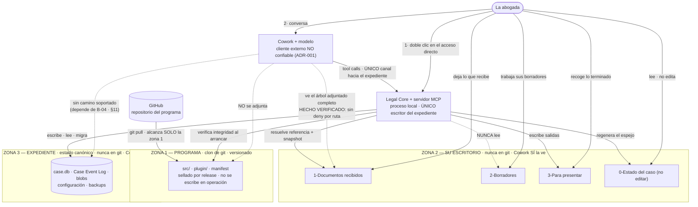
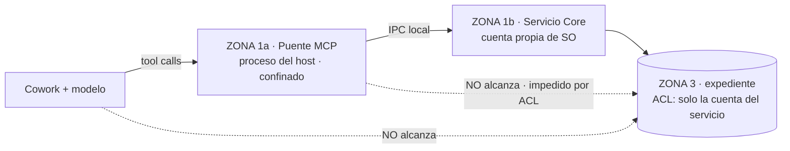

# 17 — Layout de despliegue: las tres zonas físicas

**Estado:** PROPUESTA DEL TECHNICAL DESIGN. Materializa una **DECISIÓN APROBADA** de los dueños (modelo de distribución: repositorio GitHub + clon en la máquina + `git pull` como actualización) dentro de las restricciones de ADR-001, ADR-002 y ADR-004, que **no se reabren**.

**Precedencia:** este documento es de nivel Technical Design. Donde parezca contradecir un ADR Accepted, manda el ADR y la contradicción es un defecto de este documento. Los puntos donde este documento **refina** o **supersede** una propuesta previa del Technical Design (no un ADR) están marcados uno a uno en §12.

---

## 0. Qué decide este documento y qué no

**Decide:** dónde vive físicamente cada cosa en la máquina de la abogada, con qué nombre, quién escribe, quién lee, y qué sobrevive a cada operación destructiva conocida.

**No decide:** ninguna ruta absoluta como regla de arquitectura. ADR-002 es literal — *"la decisión es la separación, no el path"*. Todo path concreto de este documento aparece marcado **EJEMPLO ILUSTRATIVO** y no es normativo. Lo normativo es el **predicado** que una ruta debe satisfacer (§4.1).

**Tampoco decide:** el mecanismo de imposición del perímetro (deny rules, hooks, proceso separado). Sigue siendo **DECISIÓN PENDIENTE** de ADR-002 y depende de `B-04` (§11).

**Nomenclatura, regla de idioma:**

| Zona | Idioma de los nombres | Por qué |
|---|---|---|
| Zona 1 — PROGRAMA | inglés | la navega quien programa; ya está fijado en `14` §2.1 |
| Zona 2 — ESCRITORIO DE ELLA | **español (es-CO)** | la navega ella en el Explorador de Windows; `11` §6 fija es-CO como locale base normativo, no como traducción |
| Zona 3 — EXPEDIENTE | inglés | **nadie la navega**: solo la abre el Core. Un nombre en español ahí sería una invitación a abrirla |

---

## 1. La regla, antes del árbol

> **Tres árboles disjuntos. Ninguno es subcarpeta de otro. Ninguno contiene a otro.**

Todo lo demás de este documento es consecuencia de esa frase. Su valor no es estético: es que convierte en **imposibles por posición** los cuatro riesgos que los dueños nombraron, en vez de en *prohibidos por regla*.

| Riesgo nombrado por los dueños | Cómo lo cierra la disjunción | Por qué no basta `.gitignore` |
|---|---|---|
| Un `git pull` con conflictos toca datos de ella | Un conflicto solo puede ocurrir en un archivo **rastreado**; los archivos de ella no están en el árbol de trabajo del repositorio, luego no existen para git | `.gitignore` no impide que un archivo esté *dentro* del árbol de trabajo; impide que se rastree. Un archivo ignorado sigue estando en el camino de `git clean` |
| Un `git checkout` / `git reset` borra el expediente | `reset` y `checkout` operan sobre el árbol de trabajo del repositorio. El expediente no está ahí | Un `case.db` ignorado dentro del clon seguiría siendo alcanzable por `git clean -fdx` |
| Un `git push` sube documentos de clientes | No hay nada que subir: los documentos nunca entraron al árbol de trabajo | `.gitignore` es una regla con excepciones (`git add -f`), y una regla mal escrita es indistinguible de una regla ausente hasta que falla |
| Una actualización rompe el expediente | `git pull` no alcanza la zona 3 en ninguna de sus formas; la migración de datos es un acto **del Core al arrancar**, con backup verificado previo (§9.3) | git no migra nada, y nunca prometió hacerlo |

**Corolario que conviene enunciar porque es el pago real de la disjunción:** en este layout, `git reset --hard` y `git clean -fd` sobre la zona 1 son **operaciones seguras**, y su seguridad es una propiedad del layout, no una promesa de un script. Eso convierte "reparar el programa" en una acción trivial y sin riesgo, que es exactamente lo que exige un coste de mantenimiento tendiendo a cero.

`.gitignore` **se mantiene** (`14` §7.5) como segunda capa contra el accidente. Deja de ser la protección y pasa a ser lo que siempre debió ser: un detector de errores, no una frontera.

### 1.1 Las tres zonas y quién alcanza qué



**Cómo se lee el diagrama.** Hay exactamente **una** flecha sólida que llega al expediente, y sale del Core. Todo lo demás que quiera tocar el expediente tiene que pasar por `COWORK → CORE`, que es el camino único de ADR-002. Las flechas punteadas son negaciones declaradas: dicen qué **no** existe como camino, y una de ellas —la de Cowork hacia la zona 3— es la que depende de `B-04` y por eso tiene su propia sección de contingencia.

---

## 2. ZONA 1 — PROGRAMA

### 2.1 Qué es

El clon del repositorio. Es el `runtime/` de `01` §6.2: **ciclo de vida sellado por release**, escrito **solo** por el procedimiento de instalación/actualización —que aquí es `git pull`— y **nunca** por el Core en operación, ni por ella, ni por el host, ni por el modelo.

### 2.2 Árbol

Es el árbol de `14` §2.1 sin cambios: este documento **no** rediseña el repositorio, solo lo ubica. Lo que sí fija es qué aparece en la máquina de ella y que **no aparece nada más**:

```text
<raíz del clon>/                  EJEMPLO ILUSTRATIVO: C:\LegalOS\programa
│
├─ src/                           el producto (ver 14 §2.1 para el árbol completo)
├─ plugin/                        legal-plugin: skills sin autoridad (14 §2.1)
├─ tests/  fixtures/  benchmark/  experiments/   viajan en el clon; no se ejecutan aquí
├─ docs/                          corpus normativo; viaja en el clon
├─ .gitignore                     segunda capa contra el accidente, no la frontera (§1)
│
├─ install/                       NUEVO en este documento — procedimiento de instalación
│  ├─ Abrir Legal OS.lnk          plantilla del acceso directo que ella usa (§9.1)
│  └─ Actualizar el programa.lnk  plantilla del acceso directo de actualización (§9.2)
│
└─ (artefactos de build, ignorados por git y regenerables)
```

**Lo único que este documento añade a `14` es `install/`**, y lo añade porque el modelo de distribución lo exige: si la actualización es `git pull`, el procedimiento de actualización **tiene que viajar dentro del repositorio**, porque es lo único que se actualiza a sí mismo. Sus dos accesos directos son plantillas: el instalador las materializa en el Escritorio de Windows con las rutas de la máquina resueltas, y **esas rutas resueltas no vuelven al repositorio** (`14` §7.4: ninguna ruta de máquina en ningún archivo versionado).

### 2.3 Qué NO está en el clon, y por qué es una lista corta

Rige `14` §7 íntegro. Lo que este documento añade es la consecuencia posicional:

- **No está la zona 2.** Si estuviera, `git clean` la alcanzaría y `git push` podría subirla.
- **No está la zona 3.** Además de `14` §7.3 (destruye la propiedad de detección de manipulación: bajo control de versiones, reescribir la historia es una operación soportada y rutinaria), un `case.db` dentro del clon convertiría `git checkout` en un camino de escritura sobre el estado canónico que no pasa por ningún use case.
- **No está la Client Config.** Contiene nombres de oficinas, jurisdicción y políticas de un cliente concreto: es dato del cliente, no del producto. Vive en la zona 3 (§4.2).
- **No está el acceso directo real**, solo su plantilla.

### 2.4 El problema que crea el modelo de distribución: integridad cuando la instalación es un `git pull`

`01` §7.3 paso 1 exige verificar la integridad del producto sellado contra un `manifest`. Pero `14` §7.4 declara que el `manifest` es **salida de un release, no fuente**, y por tanto no está versionado. Si la instalación es un clon, ¿contra qué se verifica?

**PROPUESTA — dos comprobaciones, con alcances distintos y declarados:**

| Comprobación | Qué detecta | Qué NO detecta |
|---|---|---|
| **(a) Árbol de trabajo limpio y en el commit esperado.** El clon no tiene modificaciones locales sobre archivos rastreados y `HEAD` apunta al commit publicado como release | Cualquier edición local de un archivo del programa: alguien —persona o modelo— que tocó un skill, una regla o el código | A quien confirme sus cambios localmente. A un repositorio de origen comprometido: **no hay autenticación de origen en V0** (no hay firma de código, `01` §7.2, decisión y no omisión) |
| **(b) `manifest` de lo que realmente se ejecuta**, generado por el paso de instalación/build y verificado al arrancar (`01` §7.3 paso 1) | Alteración de los artefactos ejecutables después de instalar | Lo mismo que (a) respecto del origen |

**HECHO VERIFICADO (git, comandos estándar):** git mantiene el hash de contenido de cada archivo rastreado y puede reportar diferencias entre el árbol de trabajo y el commit confirmado. **POR VERIFICAR — la forma exacta de la invocación y de su salida** se fija en implementación contra la documentación oficial de git; este documento no la transcribe para no afirmar de memoria la firma de un comando.

**Límite, dicho sin adornos y coherente con `01` §7.2:** esto detecta la **modificación accidental** y protege a la abogada de romper el programa sin darse cuenta. **No hay inmutabilidad frente a alguien con control deliberado del equipo**, y este documento no lo promete en ninguna superficie. El origen del código no se autentica en V0: quien controle el repositorio remoto controla lo que se ejecuta en la máquina de ella. Eso es una consecuencia directa de la decisión de distribución, y hay que decirla en voz alta.

---

## 3. ZONA 2 — EL ESCRITORIO DE ELLA

### 3.1 Árbol completo

```text
Despacho/                                          raíz de la zona 2 · lo ÚNICO que ella navega
│                                                  EJEMPLO ILUSTRATIVO: C:\Users\<ella>\Documents\Despacho
│
├─ Oficina de litigio civil/                       una oficina = una unidad de trabajo con reglas propias (§6)
│  │
│  ├─ Casos/                                       todos los expedientes de esta oficina
│  │  │
│  │  ├─ 2026-014 Pérez vs Alfa SAS/               un caso · nombre que ELLA elige · la carpeta es etiqueta, nunca autoridad (§6.3)
│  │  │  ├─ 0-Estado del caso (no editar).txt      espejo de solo lectura del expediente · lo regenera el Core (§7)
│  │  │  ├─ 1-Documentos recibidos/                lo que llega y aún NO está en el expediente
│  │  │  ├─ 2-Borradores/                          su trabajo en curso · el Core NUNCA lo lee
│  │  │  └─ 3-Para presentar/                      lo terminado · lo escribe el Core y también ella
│  │  │
│  │  └─ 2026-021 Gómez — tutela/
│  │     └─ (misma estructura)
│  │
│  └─ Papelería de la oficina/                     POST-V0 · plantillas y formatos propios de esta oficina
│
└─ Oficina de familia/
   └─ Casos/
      └─ (misma estructura)
```

**Cuatro elementos y ni uno más por caso.** El presupuesto es deliberado: cada carpeta que ella tenga que aprender es un coste permanente, y cada carpeta que exista sin propósito claro terminará conteniendo algo que no debía estar ahí.

### 3.2 Justificación de cada nombre

| Nombre | Por qué ese y no otro | Qué se descartó |
|---|---|---|
| `Despacho/` | Es la palabra con la que una abogada nombra su ejercicio profesional entero. Es corta, no es jerga técnica, y no dice nada del sistema | `Legal OS/`, `Workspace/`, `LegalWorkspace/`: nombran el producto, no su trabajo. `Mis casos/`: incorrecto, porque debajo hay oficinas antes que casos |
| `Oficina de litigio civil/` | Los dueños pidieron literalmente *"la oficina tal, la oficina tal otra"*. El nombre completo se lee solo y no exige convención | `OF-01/`, `Oficina 1/`: identificadores que ella tendría que traducir mentalmente |
| `Casos/` | Un nivel explícito entre la oficina y los expedientes, para que la oficina pueda tener algo más que casos (`Papelería`, POST-V0) sin que se mezcle | Colgar los casos directamente de la oficina: funciona hasta el día en que hay un archivo de oficina, y entonces queda mezclado con los expedientes |
| `2026-014 Pérez vs Alfa SAS/` | Año + consecutivo + partes. Ordena cronológicamente por nombre, se busca por parte, y **es el nombre que ella ya usa en papel** | `case_id` (un UUID): ilegible. Solo el nombre de las partes: colisiona y no ordena |
| `0-Estado del caso (no editar)` | El `0-` lo pone arriba de todo, que es donde debe estar lo que se lee primero. **La instrucción va dentro del nombre**: es el único sitio donde no se puede perder ni olvidar | `memory.md`: no significa nada para ella y suena a archivo de sistema borrable. `README`: jerga. Un archivo oculto: sería invisible justo para quien debe leerlo |
| `1-Documentos recibidos/` | Dice **qué son**, no qué hará el sistema con ellos. "Recibidos" cubre lo que llega del cliente, del juzgado y de la contraparte por igual | `Inbox/`: inglés y jerga. `Por incorporar/`: usa el verbo del sistema; describe una intención del producto, no un hecho sobre los documentos |
| `2-Borradores/` | Es exactamente la palabra profesional. Su significado ya incluye "no definitivo" y "mío" | `Trabajo/`, `Working/`: vagos. `Temporal/`: falso — un borrador no es temporal, y llamarlo así invita a borrarlo |
| `3-Para presentar/` | Nombra el **acto** al que va destinado el documento, que es como piensa una litigante. Es accionable: si algo está ahí, hay algo que hacer con ello | `Salidas/`, `Exports/`: hablan del sistema. `Documentos finales/`: neutro pero muerto — no dice qué hacer |

**El prefijo numérico `1- 2- 3-` hace dos trabajos a la vez** y por eso vale su fealdad: (a) fija el orden en el Explorador de Windows contra cualquier reordenación alfabética, y (b) **codifica la dirección del flujo** — entra por 1, se trabaja en 2, sale por 3. Un nombre que enseña el proceso cada vez que se mira ahorra la explicación.

**RIESGO — `3-Para presentar` es un nombre del contexto litigante.** Un decisor no "presenta": decide. El glosario es explícito en que **el slice v0 es contexto A únicamente**, así que el nombre es correcto para todo lo que V0 alcanza. Una oficina en rol decisor necesitará otro rótulo, y esa es una de las razones por las que el rótulo de las tres carpetas debe poder resolverse por oficina (§6.4) — **POST-V0**, porque el trabajo real del contexto B **no ha sido levantado** y no se inventa aquí.

### 3.3 Por qué la estructura es por ETAPA y no por TIPO de documento

Los dueños dijeron literalmente *"aquí pones los anexos, aquí las demandas"*. Este documento **no** crea `Anexos/` y `Demandas/` como carpetas, y debe justificarlo porque se aparta de su formulación literal.

**El mapeo de sus palabras al árbol:**

| Lo que ellos nombraron | Dónde vive realmente | Por qué |
|---|---|---|
| "los anexos" que llegan | `1-Documentos recibidos/` | Un anexo recibido es material que aún no está en el expediente. Su etapa es "recibido" |
| "los anexos" que ella produce | `2-Borradores/` mientras se hace → `3-Para presentar/` cuando está listo | El mismo documento cambia de etapa. No cambia de tipo |
| "las demandas" en curso | `2-Borradores/` | |
| "las demandas" listas | `3-Para presentar/` | |

**Los tres argumentos:**

1. **El tipo no cambia; la etapa sí.** Un documento pasa por recibido → borrador → presentado a lo largo de su vida. Si la carpeta codifica el tipo, la etapa se pierde y hay que llevarla en la cabeza o en el nombre del archivo. Si la carpeta codifica la etapa, el tipo sigue visible en el nombre del archivo, que es donde ya estaba.
2. **La etapa es lo que el sistema necesita saber; el tipo no.** El Core tiene que distinguir "material que puedo incorporar" de "borradores que no debo mirar jamás" de "salidas que yo escribo". Esas tres distinciones son exactamente las tres carpetas, y son las tres del `user-workspace` de ADR-002 (`Inbox` / `Working` / `Exports`), traducidas. Una carpeta `Demandas/` no le dice nada al sistema y crearía la pregunta de qué régimen tiene.
3. **Por tipo, la lista no cierra.** Anexos, demandas, memoriales, contestaciones, recursos, poderes, actas, notificaciones… y cada área del derecho añade los suyos. Por etapa, la lista tiene tres elementos y no crece nunca.

**Concesión, sin coste:** dentro de `2-Borradores/` y `3-Para presentar/` **ella puede crear las subcarpetas que quiera**, incluidas `Demandas/` y `Anexos/`. El sistema no depende de esa estructura: el Core **nunca lee** `2-Borradores/`, y en `3-Para presentar/` escribe archivos, no una jerarquía. Así se recupera la organización que los dueños describieron, sin que el sistema dependa de ella.

**Excepción que sí es regla dura: `1-Documentos recibidos/` es PLANA, sin subcarpetas.** Es la única carpeta de ella que el Core **lee**, y una carpeta con subcarpetas obliga a decidir si el Core desciende, hasta qué profundidad, y qué hace con un enlace simbólico o un *junction* de Windows. **HECHO VERIFICADO** (spike de Cowork, `A-08`): el comportamiento de *junctions* y symlinks de Windows en este anfitrión es `NOT_TESTED`. Una carpeta plana elimina la pregunta por construcción en vez de responderla con una suposición. Si ella crea una subcarpeta ahí, el Core **no la recorre**: los archivos que contenga simplemente no aparecen como incorporables, y eso se le dice.

### 3.4 REFINAMIENTO DECLARADO: las tres carpetas son POR CASO, no globales

`01` §6.2 y ADR-002 describen `user-workspace/Inbox/`, `Working/`, `Exports/` como **tres ubicaciones lógicas**. Este documento las materializa **una vez por caso**, dentro de la carpeta del caso.

**Requiere aprobación** (§12, D-2). Los argumentos:

- **Elimina una clase entera de error.** Con un `Inbox` global, todo archivo que ella deja obliga a alguien —ella o el modelo— a decir a qué caso pertenece. Con un Inbox por caso, la pertenencia está en el sitio donde lo dejó y no hay nada que preguntar ni nada que adivinar. Esto importa especialmente porque ADR-001 clasifica al modelo como no confiable: cuanta menos inferencia haga sobre a qué expediente pertenece un documento, mejor.
- **Habilita el aislamiento por oficina**, que es el único aislamiento real disponible (§8.2). Con un workspace global, adjuntar "solo una oficina" es imposible.
- **Es como ella ya archiva.** El material de un caso vive junto al caso.
- **No cambia ningún contrato del Core.** `ingest_evidence` sigue recibiendo un identificador de Inbox resuelto por el Core, nunca una ruta (ADR-002 inv. 3). Lo que cambia es cuántos Inbox hay, no qué es un Inbox.

**Coste declarado, honestamente:** un documento que sirve a dos casos se deja dos veces y se incorpora dos veces, generando dos Sources. Es correcto epistémicamente —cada expediente tiene su propia cadena de custodia y su propio ProvenanceRecord— aunque duplique bytes. La deduplicación por contenido entre casos es una **pregunta de negocio abierta** (glosario §3: *"condiciona el aislamiento y la deduplicación"*) y este documento **no la resuelve**; propone la opción conservadora (sin dedup entre casos, §4.2) por el aislamiento.

**POST-V0:** una bandeja general para material que aún no tiene caso.

---

## 4. ZONA 3 — EL EXPEDIENTE

### 4.1 La ruta: el predicado, no el path

ADR-002 prohíbe fijar la ruta como decisión de arquitectura. Lo que sí es decisión de arquitectura es el **predicado que una ruta candidata debe satisfacer**. Un instalador que no pueda satisfacerlo debe **negarse a instalar**, no elegir "lo más parecido".

| # | Condición | Por qué | ¿Comprobable en el arranque? |
|---|---|---|---|
| P1 | **No está dentro del árbol del clon, ni lo contiene** | §1: si estuviera, git la alcanzaría | **Sí** — comparación de rutas canónicas |
| P2 | **No está dentro del árbol que ella adjunta a Cowork, ni lo contiene** | **HECHO VERIFICADO** (spike Cowork): adjuntar una carpeta concede su árbol completo y no existe deny por ruta; *"To keep data out of reach entirely, leave it outside the allowed roots"*. La exclusión posicional es el único remedio documentado | **Sí** — comparación de rutas canónicas contra la raíz de zona 2 |
| P3 | **No está en unidad de red ni bajo carpeta sincronizada a la nube** | **HECHO VERIFICADO** (kernel §1, fuente sqlite.org, vía ADR-004): WAL **no funciona sobre filesystems de red**. Y una carpeta sincronizada saca el expediente del equipo, lo que es una decisión de confidencialidad que nadie ha tomado | **Parcialmente.** Unidad de red: sí. Carpeta sincronizada: **POR VERIFICAR** si es detectable de forma fiable; la detección de clientes de sincronización es heurística y no se afirma aquí que exista una comprobación robusta |
| P4 | **No está en una ruta que ella navegue habitualmente** | Reduce la probabilidad de que la adjunte por accidente. Es **mitigación de UX, no seguridad**: una carpeta oculta es cosmética | No |
| P5 | **Es local, con espacio para blobs y backups, y está disponible antes de que arranque el Core** | El Core la necesita en el paso 1 de su arranque | Sí |
| P6 | **Su ruta no aparece en ningún mensaje a la usuaria ni en ningún archivo versionado** | `01` §7.5 (nunca rutas en mensajes) y `14` §7.4 | Sí — test de higiene de `14` §7.5 |

**PROPUESTA — nuevo paso en la secuencia de arranque de `01` §7.3:** antes del paso 1, el Core verifica que las tres raíces resueltas son **disjuntas dos a dos** (P1, P2). Si no lo son, **no abre en modo normal** y emite mensaje de producto. Es la comprobación más barata del sistema y protege la única propiedad de la que cuelga todo lo demás. **Requiere aprobación** (§12, D-3).

**EJEMPLO ILUSTRATIVO — NO ES DECISIÓN DE ARQUITECTURA:**

```text
Zona 1 (programa) :  C:\LegalOS\programa
Zona 2 (su escritorio) : C:\Users\<ella>\Documents\Despacho
Zona 3 (expediente):  C:\Users\<ella>\AppData\Local\LegalOS\state
```

Cualquier otro trío que satisfaga P1–P6 es igual de válido. La resolución ocurre **una vez, en la instalación**; son las **únicas tres rutas absolutas de todo el sistema** y se le entregan al Core al arrancar. Ni `domain` ni `application` conocen una ruta jamás (`01` §6.1). **DECISIÓN PENDIENTE:** el mecanismo exacto de entrega (argumentos del acceso directo, variable de entorno, archivo del instalador) — detalle de implementación.

### 4.2 Árbol

```text
<raíz protegida>/                      dos ciclos de vida distintos bajo un mismo árbol protegido
│
├─ configuration/                      CICLO "mutación controlada" (01 §6.2)
│  ├─ client-config.json               Client Config validada por schema: organización, oficinas,
│  │                                   rol por defecto de cada oficina, jurisdicción, políticas require_*
│  └─ configuration_version            versión de la FORMA de la config (01 §7.1)
│
└─ private-state/                      CICLO "operativo" · ESTADO CANÓNICO · solo el Core
   ├─ schema_version                   versión de la forma del estado persistido (01 §7.1)
   ├─ catalog.db                       índice de Cases: case_id ↔ etiqueta ↔ oficina ↔ carpeta de trabajo
   ├─ operational.db                   Tool Invocation Log · NO canónico · podable (ADR-004 inv. 8)
   │
   ├─ cases/
   │  └─ <case_id>/                    identificado por case_id, NUNCA por el nombre que ella ve
   │     ├─ case.db (+ -wal, -shm)     estado materializado + Case Event Log append-only encadenado
   │     └─ blobs/
   │        ├─ sources/                Sources: bytes originales inmutables, direccionados por contenido
   │        └─ derived/                DerivedRepresentations: regenerables (ADR-003)
   │
   └─ backups/                         exports verificados: previos a migración y periódicos (01 §8)
```

**Tres decisiones de forma que hay que justificar:**

1. **`configuration/` vive en el árbol protegido, no en el clon.** Contiene datos del cliente (nombres de oficinas, jurisdicción) y **cambia por máquina**. En el clon sería (a) dato de cliente en git —prohibido por `14` §7.2— y (b) una fuente permanente de conflictos de `git pull`, que es justo lo que los dueños quieren evitar. Está en el árbol protegido pero **conserva su ciclo de vida propio**: no es estado canónico, no es objetivo de escritura del Core en operación normal, y una configuración inválida se rechaza de forma visible (`boundaries.md` §142) en vez de degradarse a defaults.
2. **Los blobs son por caso, no globales.** Cuesta espacio (el mismo documento en dos casos ocupa dos veces) y a cambio da que **borrar o exportar un caso sea una operación cerrada sobre una carpeta**, sin preguntarse quién más comparte un blob. Dado que la deduplicación entre casos es una pregunta de negocio abierta y que el contexto B manejaría datos de terceros con obligaciones posiblemente distintas, la opción conservadora es la correcta hasta que la pregunta se responda. **Requiere aprobación** (§12, D-4).
3. **Las oficinas NO son un nivel de carpeta aquí.** La oficina es un atributo del Case en `catalog.db`. Si fuera un nivel de carpeta, **mover un caso de oficina sería mover archivos canónicos en disco** — un cambio de estado del expediente ejecutado por el sistema de archivos y no por un use case, que es exactamente lo que ADR-002 inv. 2 prohíbe. Con la oficina como atributo, mover un caso es un cambio de dato con su evento; la carpeta de trabajo de zona 2 se mueve después, como consecuencia, y si la mudanza de carpetas falla el expediente no se ha roto.

---

## 5. Régimen de acceso, carpeta por carpeta

Leyenda: **Core** = el Legal Core, único componente que atraviesa la frontera. **Host** = Cowork y el modelo. **Ella** = la abogada, en el Explorador de Windows.

### 5.1 ZONA 1 — PROGRAMA

| Carpeta | Quién escribe | Quién lee | ¿En git? | ¿Cowork la ve? | Si se borra |
|---|---|---|---|---|---|
| `<raíz del clon>/` completo | **Solo el procedimiento de instalación/actualización** (`git pull`). Ni el Core en operación, ni el host, ni el modelo, ni ella | El Core al arrancar (integridad); el desarrollador | **SÍ — es git** | **NO** (§8.1) | **Pérdida cero.** Se vuelve a clonar. Ni el expediente ni los documentos de ella dependen del clon |
| `install/` | igual | El instalador | SÍ | NO | igual |
| artefactos de build | El paso de instalación/build | El runtime | No (ignorados) | NO | Se regeneran reinstalando |

### 5.2 ZONA 2 — EL ESCRITORIO DE ELLA

| Carpeta | Quién escribe | Quién lee | ¿En git? | ¿Cowork la ve? | Si se borra |
|---|---|---|---|---|---|
| `Despacho/` (raíz) | Ella; el Core crea el esqueleto de cada caso nuevo | Ella, el host, el Core (parcial) | **NUNCA** | **SÍ — es su zona de trabajo** | Se pierden borradores y lo recibido aún no incorporado. **El expediente NO se pierde.** El Core recrea el esqueleto y regenera el espejo; **no puede recrear sus borradores** |
| `Oficina .../` | Ella (la crea el instalador o el Core al configurar la oficina) | Ella, host, Core | NUNCA | SÍ | Como arriba, acotado a esa oficina |
| `Casos/<caso>/` | El Core la crea al crear el caso; ella puede renombrarla | Ella, host, Core | NUNCA | SÍ | El expediente sobrevive intacto. Al abrir el caso, el Core detecta que la carpeta registrada no está y **pregunta**; nunca adivina (§6.3) |
| `0-Estado del caso (no editar)` | **Solo el Core** | Ella. **El modelo NO debe leerlo** (§7.4) | NUNCA | SÍ (inevitable, §7.4) | **No-op.** Se regenera. Borrarlo no pierde información |
| `1-Documentos recibidos/` | Ella y el host | El Core, **solo** para resolver una referencia de Inbox y hacer snapshot (ADR-002 inv. 4) | NUNCA | SÍ | Lo ya incorporado: **sin efecto** — la fuente es el Source, no el archivo. Lo **no** incorporado: **pérdida definitiva**, el sistema nunca lo tuvo |
| `2-Borradores/` | Ella y el host | **NADIE del Core.** Ninguna operación lo lee, en ninguna circunstancia (`01` §6.2) | NUNCA | SÍ | **Pérdida real y no recuperable por el sistema.** V0 no respalda la zona 2 (§14, R-4) |
| `3-Para presentar/` | El Core (escribe salidas) **y** ella | Ella | NUNCA | SÍ | **Regenerable por re-ejecución, no por restauración.** El Artifact Registry conserva qué se generó y con qué entradas (`10`); volver a producir el archivo es ejecutar de nuevo, no recuperar |
| `Papelería de la oficina/` | Ella | Ella, host | NUNCA | SÍ | Pérdida de sus plantillas. **POST-V0** |

### 5.3 ZONA 3 — EL EXPEDIENTE

| Carpeta / archivo | Quién escribe | Quién lee | ¿En git? | ¿Cowork la ve? | Si se borra |
|---|---|---|---|---|---|
| `configuration/client-config.json` | El procedimiento de configuración, validado por schema. **Nunca el modelo** | El Core al arrancar y en los gates de política | **NUNCA** (dato de cliente) | **NO** | El Core **no arranca en modo normal**: config inválida o ausente se rechaza de forma visible, jamás se degrada a defaults |
| `private-state/catalog.db` | **Solo el Core** | Solo el Core | NUNCA | NO | Se pierde el índice caso↔oficina↔carpeta. Los `case.db` sobreviven; **reconstruirlo es trabajo de recuperación, no una operación normal.** Entra en el backup (`01` §8.3) |
| `private-state/cases/<id>/case.db` | **Solo el Core** | Solo el Core | **NUNCA** (`14` §7.3) | **NO** | **LA ÚNICA PÉRDIDA CATASTRÓFICA DEL SISTEMA.** Sin backup, el expediente no existe. Es la razón de ser de `backups/` |
| `.../blobs/sources/` | **Solo el Core**, una vez, en la incorporación. **Inmutables**; no hay operación de borrado expuesta (ADR-002 inv. 5) | Solo el Core | NUNCA | NO | Pérdida de los originales. El `case.db` conserva sus hashes: **la ausencia es detectable, el contenido no es recuperable** |
| `.../blobs/derived/` | Solo el Core | Solo el Core | NUNCA | NO | **Regenerable** por re-derivación. Coste real si implica transcripción de nuevo |
| `private-state/operational.db` | Solo el Core | Solo el Core y el diagnóstico | NUNCA | NO | **Sin efecto sobre el expediente** (ADR-004 inv. 8). Es podable por diseño |
| `private-state/backups/` | Solo el Core | El Core (restauración) | NUNCA | NO | Se pierde la red de seguridad. **El sistema sigue funcionando y no lo nota**, que es precisamente lo peligroso: hay que verificar que existen, no suponerlo (`01` §8) |

**Lo que la columna "si se borra" demuestra de un vistazo:** de las tres zonas, **solo una tiene pérdida irrecuperable, y es exactamente la que git nunca toca y el modelo nunca alcanza.** Ese alineamiento no es casualidad: es el criterio con el que se repartieron las carpetas.

---

## 6. Multi-oficina, y su relación con el `role` por Case

### 6.1 Qué es una oficina aquí

Una **unidad de trabajo con reglas propias**: su rol por defecto, su configuración, y —esto es lo que la hace real— **su propio límite de lo que el modelo puede ver a la vez** (§8.2).

### 6.2 Dónde aparece la oficina en cada zona

| Zona | Cómo aparece la oficina | Por qué así |
|---|---|---|
| 1 · PROGRAMA | **No aparece.** El programa no sabe cuántas oficinas hay | Un producto que se recompila por cliente no es un producto |
| 2 · SU ESCRITORIO | **Una carpeta de primer nivel por oficina** | Es lo que los dueños pidieron, es como ella piensa, y es **la unidad de adjuntado** — el único aislamiento real disponible |
| 3 · EXPEDIENTE | **Un atributo** en `client-config.json` (definición) y en `catalog.db` (a qué oficina pertenece cada Case). **Nunca un nivel de carpeta** | §4.2 punto 3: si fuera carpeta, cambiar de oficina sería mover estado canónico en disco |

### 6.3 La regla dura: la carpeta es etiqueta, nunca autoridad

> **Ningún comportamiento del sistema se decide leyendo el nombre de una carpeta.**

Consecuencias, todas comprobables:

- El **rol** de un caso está en su registro de Case, resuelto **por Case** (**DECISIÓN APROBADA**: *"El rol NO pertenece a la organización de manera fija. Debe poder resolverse por Case o por active working context"*, `boundaries.md` §144), con **default por oficina** tomado de `client-config.json`. Un caso litigante puede vivir en una carpeta de una oficina cuyo default es decisor: manda el registro del Case, no la carpeta.
- Si ella **renombra** la carpeta de una oficina o de un caso, **no cambia nada del expediente**. La identidad es `case_id`; el nombre de carpeta es una etiqueta operativa registrada en `catalog.db`.
- Si ella **mueve** la carpeta de un caso, el Core lo descubre al abrirlo (la carpeta registrada ya no está) y **pregunta**: nunca busca, nunca adivina, nunca escribe en un sitio nuevo por su cuenta. Adivinar sería inferir estado desde el sistema de archivos, que es lo que este diseño existe para evitar.
- Si ella **mete a mano** una carpeta con la forma de un caso, no es un caso. Un Case nace de `create_case`, no de `mkdir`.

### 6.4 Cómo se declara una oficina — ILUSTRATIVO, NO PRODUCCIÓN

```yaml
# EJEMPLO ILUSTRATIVO — no es el schema; el schema se fija en implementación
offices:
  - office_id: OF-CIVIL                    # identidad estable; NUNCA cambia
    display_name: "Oficina de litigio civil"
    workspace_folder: "Oficina de litigio civil"   # NOMBRE de carpeta, no ruta
    default_role: LITIGANT                 # DEFAULT; el rol efectivo es el del Case

  - office_id: OF-FAMILIA
    display_name: "Oficina de familia"
    workspace_folder: "Oficina de familia"
    default_role: LITIGANT
```

**`workspace_folder` es un nombre, no una ruta.** Se resuelve contra la raíz de zona 2, que es una de las tres únicas rutas absolutas del sistema (§4.1). Así no hay rutas de máquina dentro de la configuración.

**Alcance V0, sin ambigüedad:** las oficinas de V0 son **todas de contexto A (litigante)**. El glosario es explícito: *"El slice v0 es contexto A únicamente"*, y sobre el contexto B declara **NO TENEMOS INFORMACIÓN SUFICIENTE**. Que la primera usuaria opere ambos contextos es **SUPUESTO, no hecho verificado**. Por tanto: la estructura multi-oficina de V0 sirve para **separar áreas de práctica litigante**, y el día que exista una oficina decisora habrá que decidir (a) el rótulo de `3-Para presentar` para ese contexto, (b) si se exige adjuntado por oficina en vez de recomendarlo, y (c) el conjunto de gates que el rol selecciona. Los tres son **POST-V0** y ninguno se prejuzga aquí.

---

## 7. `0-Estado del caso`: el espejo de solo lectura

### 7.1 Qué es exactamente

> **Es un espejo en disco, de solo lectura, del estado del expediente, escrito por el Core, dirigido a ELLA, que nunca gana sobre `case.db`.**

Cuatro afirmaciones, y las cuatro importan:

| Afirmación | Consecuencia |
|---|---|
| **Espejo, no fuente** | ADR-004: `case.db` es la fuente; las proyecciones son derivadas y regenerables. Si el espejo y `case.db` discrepan, **el espejo está mal**, por definición y sin investigación |
| **Lo escribe el Core, y nadie más** | No hay tool que lo escriba (kernel §6, las ocho tools). No es objetivo de escritura del modelo (ADR-004 inv. 1) |
| **Dirigido a ella** | Y por tanto **sin relojes internos**: `case_revision` y `event_seq` están prohibidos en un texto para una persona (`11` §6.3, `INV-UX-04`) — *"un número de revisión no tiene significado profesional; mostrarlo es exposición de ingeniería con apariencia de precisión"* |
| **El modelo no lo lee** | El modelo pide `get_case_context`. El espejo no es su canal (§7.4) |

### 7.2 Dónde vive, exactamente

```text
Despacho/<Oficina>/Casos/<caso>/0-Estado del caso (no editar).txt
```

En la **raíz de la carpeta del caso**, hermano de las tres carpetas numeradas y **antes que ellas** en el orden del Explorador.

**DECISIÓN PENDIENTE — la extensión.** Se propone `.txt` sobre `.md`: `.txt` abre siempre con doble clic en Windows; `.md` **POR VERIFICAR** en la máquina real — puede no tener aplicación asociada y presentarle un diálogo de "¿con qué desea abrir este archivo?" a alguien que solo quería leer su caso. El contenido se redacta en texto plano legible, sin sintaxis que dependa de un visor. Es una decisión de UX con coste cero y consecuencia diaria.

### 7.3 Por qué existe, si el modelo no lo usa

Dos razones, y solo la segunda es fuerte:

1. **Para que ella pueda abrirlo.** Ver el estado de su caso sin abrir Cowork ni conversar con nadie. Es la ventaja que `08` §7.5 reconoce como *"genuina"*.
2. **Como red de seguridad si el Core no arranca.** Esta es la razón que decide. Si el producto degrada a solo-lectura por fallo de integridad, o simplemente no abre, el expediente sigue íntegro en `case.db` pero **ella no tiene manera de mirarlo**: `case.db` no se abre con doble clic y no debe abrirse. El espejo es lo único que le queda: un archivo de texto, en la carpeta de su caso, que dice qué había en el expediente la última vez que el sistema funcionó. En ese momento vale más que cualquier otra cosa del sistema.

**Y por eso la fecha de generación es obligatoria y va primero.** Un espejo sin fecha, leído durante una caída, es indistinguible de un expediente al día — que es exactamente el fallo que `08` §10 existe para impedir. La primera línea del archivo dice cuándo se generó y advierte que puede no ser lo último. Sin esa línea, este archivo es un pasivo, no un activo.

### 7.4 Que el modelo no lo lea es una REGLA DE DISEÑO, no un perímetro — y hay que decirlo así

**HECHO VERIFICADO** (spike de Cowork): adjuntar una carpeta concede su árbol completo y **no existe deny por ruta**. Como el espejo vive en zona 2 y zona 2 es lo que ella adjunta, **el modelo puede leer este archivo**. No se promete lo contrario.

Lo que sí se sostiene, y se sostiene por construcción:

1. **Leerlo no le da nada que no tenga.** Todo bloque del espejo procede de una consulta canónica (`INV-P-4`): **nunca contiene conocimiento ausente del Canonical State**. No hay hueco en la plantilla donde tal conocimiento pudiera alojarse.
2. **Escribirlo no le da nada.** `INV-P-2`: ningún componente del Core lee jamás el contenido de una proyección materializada. No existe puerto, use case ni consulta que la acepte como entrada. *Puede escribirlo, y no significará nada, porque nada lo lee.*
3. **El canal del modelo es `get_case_context`**, y es el único que le devuelve el envelope con `case_revision`, `completeness` y `omissions[]` — es decir, el único que le dice **si lo que está leyendo está completo**. El espejo no lleva esos campos, porque son relojes internos prohibidos en un texto para persona. El canal correcto es también el único informativo.

**RIESGO NO CERRADO (R-1, §14):** el fallo que queda vivo no es de integridad sino de **veracidad** — que el modelo lea un espejo desactualizado y se lo cite a ella como si fuera el estado actual. La mitigación es la regeneración agresiva (§7.5) más la fecha en la primera línea; **no hay mitigación técnica completa mientras el archivo esté en una carpeta adjuntada**, y no se afirma que la haya.

### 7.5 Cuándo se regenera

**PROPUESTA:** en el cierre de toda operación que avance `case_revision`, y al abrir el caso. Regenerar de más es barato (el `overview` no crece con la vida del caso: **cuenta, no lista**) y regenerar de menos es exactamente el riesgo R-1.

### 7.6 Qué pasa si ella lo edita — y por qué NO se detecta

El encargo de los dueños dice *"el Core lo detecta y lo regenera"*. **Este documento propone conservar el resultado que ellos quieren y cambiar el mecanismo**, y debe justificarlo porque se aparta de su formulación.

| | Detectar y regenerar | **Regenerar sin condiciones (PROPUESTO)** |
|---|---|---|
| ¿El archivo gana sobre `case.db`? | No | **No** |
| ¿Sobrevive lo que ella escribió? | No | No |
| ¿Qué exige del Core? | **Leer el archivo** para compararlo | Nada: escribe encima |
| ¿Coste? | Un camino de lectura de una proyección materializada — **exactamente lo que `INV-P-2` prohíbe** — más un aviso que redactar, más un caso de error que probar | Cero |

**El argumento decisivo:** detectar exige leer, y leer una proyección materializada abre el único camino por el que un archivo de la zona 2 podría llegar a influir en el Core. Ese camino es el que `INV-P-2` cierra, y no se abre para conseguir un aviso. `08` §7.4.3 ya lo había fijado: *"Una edición manual no es un error que reportar. No se detecta, no se avisa, no se concilia: se sobrescribe en la siguiente regeneración. Detectarla exigiría leerla."*

**Lo que ella experimenta**, que es lo que a los dueños les importaba: escribe algo en el archivo, y en la siguiente regeneración ya no está. **Y esa desaparición es la prueba de que lo que escribió no era conocimiento del expediente.** La regeneración no es una pérdida: es el mecanismo de verificación.

**Lo que se le dice, una vez, en el mismo nombre del archivo** — `(no editar)` — y una vez en la puesta en marcha: *"este archivo lo escribe el programa; si usted escribe algo aquí, desaparecerá. Lo que quiera guardar va en `2-Borradores`."* No hay más comunicación que diseñar.

### 7.7 Lo que este archivo NO es

**No es la "carátula del expediente" anotable.** Ese objeto —el que ella podría anotar y considerar suyo— es **POST-V0** y es una decisión distinta, heredada de ADR-004: en el momento en que un artefacto admite anotación, **deja de ser una proyección** (tendría contenido ausente del Canonical State, violando `INV-P-4`) y pasa a ser o bien un objeto canónico nuevo con su propia provenance, o bien un documento de `2-Borradores/` que el Core ni lee ni escribe. Mezclar ambas salidas produce el `memory.md` monolítico que ADR-004 ya rechazó. Este documento **no la resuelve**.

---

## 8. Qué adjunta ella a Cowork, y qué no

### 8.1 La tabla, y la razón de cada fila

| Zona | ¿Se adjunta? | Por qué |
|---|---|---|
| **Zona 2 — `Despacho/`** (o una oficina) | **SÍ. Es lo único que se adjunta** | Es su zona de trabajo. El modelo tiene que poder leer lo que ella recibe y ayudarla con lo que escribe. Es el propósito de la zona |
| **Zona 1 — el clon** | **NO** | Es la trampa no obvia. **HECHO VERIFICADO:** adjuntar una carpeta concede lectura **y escritura** sobre su árbol completo. Adjuntar el clon le daría al modelo capacidad de editar los skills, las reglas ejecutables y el código del Core: es decir, capacidad de **reescribir sus propias restricciones**. Y no hace falta: **HECHO VERIFICADO** — los servidores MCP locales corren en el host y se configuran como servidor, **no se adjuntan como carpeta**. La única razón para adjuntarlo sería depurar, y eso se hace en la máquina del desarrollador |
| **Zona 3 — el expediente** | **NO, jamás** | Es la frontera entera de ADR-002. Adjuntarla concede escritura directa sobre `case.db` y sobre el Case Event Log, y convierte todo el diseño de autorización en decorado |

### 8.2 El adjuntado ES el mecanismo de aislamiento, y por eso las oficinas son carpetas de primer nivel

**HECHO VERIFICADO** (spike de Cowork): el único remedio documentado para mantener datos fuera del alcance es **posicional** — *"To keep data out of reach entirely, leave it outside the allowed roots."* No hay deny por ruta, no hay permisos por subcarpeta, no hay nada más fino.

Consecuencia directa: **el único control de confidencialidad entre oficinas que este producto puede ofrecer es adjuntar una sola oficina a la vez.** Por eso las oficinas son carpetas hermanas de primer nivel y no una jerarquía más profunda: para que "adjuntar solo esta oficina" sea una operación que ella pueda hacer con un clic.

| Qué adjunta | Qué gana | Qué cuesta |
|---|---|---|
| `Despacho/` completo | No re-adjuntar nunca | El modelo ve **todos** los casos de **todas** las oficinas en toda sesión |
| Una oficina | Los casos de las demás oficinas quedan **fuera de alcance**, por posición | Re-adjuntar al cambiar de oficina |

**PROPUESTA para V0:** se **recomienda** el adjuntado por oficina y se **documenta** el coste del adjuntado completo; no se **impone**, porque V0 tiene una sola profesional y todas sus oficinas son contexto A. **Se impondría** el día que exista una oficina de contexto B, porque ahí hay datos de terceros con obligaciones posiblemente distintas. **Requiere aprobación** (§12, D-6), y es una decisión de negocio disfrazada de detalle técnico: define qué puede prometer el producto sobre separación entre asuntos.

### 8.3 El arranque lo ejecuta ella, no el modelo

**Cómo:** un acceso directo en el Escritorio de Windows, `Abrir Legal OS`. Doble clic. No hay terminal en ninguna parte de su experiencia.

**Por qué el modelo no puede ejecutarlo — dos razones independientes**, y la independencia es el punto:

1. **La superficie MCP no lo expone.** La clase `ADMIN` está **vacía por diseño** (kernel §4). No hay tool que arranque, pare o reconfigure el producto. *Si no debe ser posible, no se expone.*
2. **HECHO VERIFICADO** (spike de Cowork): el shell de Cowork corre en una **VM Linux aislada por Hyper-V** en Windows. No ejecuta accesos directos del host.

La segunda es una propiedad del anfitrión y **puede cambiar sin avisar**; la primera es una propiedad del producto y no. Por eso la primera es la que se sostiene, y la segunda se documenta como defensa en profundidad — coherente con la conclusión transversal del spike: **Cowork no es una frontera de seguridad; la frontera es el Core.**

---

## 9. Cómo se actualiza sin romper nada

### 9.1 El principio

> **`git pull` actualiza el programa. La migración de datos la hace el Core al arrancar, con backup verificado previo. Son dos actos separados y en ese orden.**

Confundirlos es el error que produce la catástrofe: si la actualización tocara los datos, un `git pull` a medias dejaría el expediente a medias.

### 9.2 El procedimiento — ILUSTRATIVO, NO PRODUCCIÓN

```text
# "Actualizar el programa" — pseudocódigo NO-PRODUCCIÓN
# Solo describe el orden y los cortes; no es el script.

1. ¿Está el Core corriendo?           -> pedir cerrarlo y detenerse. No se actualiza en caliente.
2. ¿Árbol de trabajo del clon limpio? -> NO: DETENERSE y reportar. Nunca `reset --hard` automático:
                                            descartar cambios en silencio es la conducta prohibida.
                                            Ofrecer la acción explícita "Reparar el programa" (§9.4).
3. git pull --ff-only <rama de release>
   - fast-forward imposible           -> DETENERSE y reportar. No se crea un merge.
   - conflicto                        -> IMPOSIBLE por construcción: un conflicto exige un archivo
                                        rastreado modificado localmente, y el paso 2 ya lo descartó.
4. Reinstalar dependencias / build.
5. FIN. No se ha tocado la zona 2 ni la zona 3. Nada de ella ha cambiado.
6. Al siguiente arranque, el Core ejecuta 01 §7.3 — ver §9.3.
```

**`--ff-only` es la pieza que responde a "que un `git pull` con conflictos no toque datos de ella":** convierte la única situación ambigua (historias divergentes) en una parada limpia con mensaje, en vez de en un merge que alguien tiene que resolver. **Y el paso 2 es el que la hace innecesaria casi siempre.**

**DECISIÓN PENDIENTE — de qué rama se hace el `pull`.** Si es de la rama de desarrollo, **cada commit es un release** y llega a la máquina de ella el mismo día en que se escribió. Se propone una rama de release que un humano avanza deliberadamente. Cuesta un `merge` por versión y evita el modo de fallo más probable de todo este diseño: que la abogada reciba un cambio a medio hacer. Esto **no contradice** `01` §7.2 ("sin canales de release"): allí se descartó la *infraestructura* de múltiples canales, no la existencia de una puerta. **Requiere aprobación** (§12, D-7).

### 9.3 La migración de esquema: dónde ocurre de verdad

El paso 4 de la secuencia de arranque de `01` §7.3 ya resuelve el requisito de los dueños, y este documento **no lo modifica** — lo ubica:

```text
4. Comparar schema_version del estado con el rango del manifest
   ├─ dentro de rango ───────► abrir
   ├─ requiere migración ────► BACKUP → VERIFICAR BACKUP → migrar → reverificar
   │                            (backup no verificado ⇒ NO se migra)
   └─ superior al producto ──► no abrir en modo normal
```

**Las tres propiedades que esto da, dichas en los términos de los dueños:**

| Su exigencia | Qué la garantiza |
|---|---|
| *"que no borre nada"* | Las migraciones son **numeradas y solo-adelante** (DECISIÓN APROBADA) y **preservan el hash-chain**: pueden cambiar la representación física, **no** los bytes canónicos sobre los que se computó `event_hash` |
| *"que no se pierdan las memorias"* | El espejo es **derivado**: se regenera tras migrar. No hay nada que migrar en él, y esa es exactamente la ventaja de que no sea fuente |
| *"o el sistema no arranca"* | **Backup no verificado ⇒ NO se migra.** No es "se intenta y se avisa": es una puerta cerrada. Y si la integridad falla antes (paso 1), el producto degrada a **solo-lectura** y **no escribe en ninguna parte** |

**RIESGO — la asimetría que hay que decirle a los dueños.** Actualizar es fácil; **volver atrás no lo es**. Si se migra el esquema y después se hace `git pull` a una versión anterior, el estado queda **por encima** del rango del producto y el Core no lo abre en modo normal. La vuelta atrás **no es un `checkout` de un tag anterior**: es *restaurar el backup previo a la migración* y perder lo hecho desde entonces. Es la consecuencia directa de "solo-adelante, sin down-migrations", que es la decisión correcta; pero el procedimiento de vuelta atrás tiene que estar escrito antes de necesitarlo, no durante.

### 9.4 "Reparar el programa"

Una acción explícita —nunca automática— que descarta todo cambio local del clon y lo devuelve al release: `reset` al commit de origen, limpieza de archivos sin rastrear, reinstalación.

**Es seguro, y su seguridad es una propiedad del layout:** el clon no contiene nada de ella. Sin la disjunción de §1, esta misma acción sería un borrado de expedientes.

---

## 10. CONTINGENCIA: si `B-04` resulta desfavorable

### 10.1 Qué se está asumiendo, dicho como supuesto

> **SUPUESTO CENTRAL DE ESTE DOCUMENTO (`B-04` favorable):** el servidor MCP local, por ser proceso del host, **puede alcanzar rutas fuera de las carpetas adjuntadas**, mientras que las herramientas de archivo del agente **no**.

**HECHO VERIFICADO** (spike de Cowork, `B-04`, `INCONCLUSIVE` y **BLOQUEANTE**): la documentación enuncia el confinamiento siempre sobre *acceso local a archivos* y *llamadas a herramientas locales*, **nunca sobre el proceso del servidor MCP**. **No está documentado ni en un sentido ni en el otro.** Es **HIPÓTESIS con base fuerte** (el MCP local corre en el host — eso sí está verificado), no hecho.

Todo el layout de §1–§9 depende de ese supuesto, porque el Core es hoy el proceso MCP: si el proceso MCP no alcanza la zona 3, **el Core no puede abrir `case.db`** y el producto no funciona. No es que quede menos seguro: no arranca.

### 10.2 Las dos opciones, y por qué solo una es aceptable

| Opción | Qué haría | Veredicto |
|---|---|---|
| **(a) Adjuntar la zona 3** para que el MCP la alcance | Zona 3 dentro de una carpeta adjuntada | **RECHAZADA.** Concede al modelo lectura y escritura directas sobre `case.db` y el Case Event Log. Es la negación de ADR-002. Preferible no tener producto |
| **(b) Core como proceso independiente** con permisos de SO propios | Ver §10.3 | **ADOPTADA.** Es la opción que ADR-002 ya conserva explícitamente como mecanismo válido de enforcement |

### 10.3 Cómo cambia el layout con la contingencia (b)

**La zona 1 se parte en dos, y solo eso:**

```text
ZONA 1a — PUENTE MCP        lo que Cowork lanza. NO toca el expediente.
                            Solo traduce tool calls a mensajes IPC y devuelve respuestas.
                            Puede estar confinado a las carpetas adjuntadas: le da igual.

ZONA 1b — SERVICIO CORE     proceso de sistema, arranca con el equipo, bajo una cuenta propia.
                            Es el ÚNICO que abre la zona 3. Único escritor (01 §2.4).
```



**Lo que NO cambia — y es la mayor parte:**

- Las zonas 2 y 3 son idénticas: mismos árboles, mismos nombres, mismo régimen.
- El contrato MCP no cambia: las mismas tools, los mismos schemas. El puente es transporte.
- El árbol del repositorio no cambia: es un segundo punto de entrada en `bootstrap`, no una arquitectura nueva.
- La actualización sigue siendo `git pull` (§9), con un paso más: reiniciar el servicio.

**Lo que cambia, sin maquillarlo:**

| Coste | Magnitud |
|---|---|
| Un contrato IPC nuevo | Real: transporte, serialización, errores de transporte que no son errores de dominio |
| Instalación con elevación | La creación de la cuenta de servicio y las ACL exigen privilegios de administrador **una vez** |
| Un servicio que puede estar caído | Modo de fallo nuevo. Necesita mensaje de producto propio: *"el programa no está disponible"*, sin exponer ingeniería |
| **El coste de mantenimiento deja de tender a cero** | Es la pérdida real, y hay que decírsela a los dueños tal cual: pasa de "clonar y hacer doble clic" a "instalar un servicio" |

**Lo que se GANA, y no es menor — es la observación más importante de esta sección:**

> Mientras el Core corra bajo la cuenta de ella (diseño de §1–§9), **ninguna ACL puede separar al Core de Cowork**: los dos son la misma cuenta y el sistema operativo no puede distinguirlos. La frontera es entonces **posicional y depende del confinamiento de un anfitrión que no la documenta**.
>
> Con la contingencia (b) hay **dos cuentas**, y la frontera pasa a estar **impuesta por el sistema operativo**: la única frontera de este diseño que no depende de ninguna suposición sobre Cowork.

Es decir: **el escenario "desfavorable" produce el diseño más sólido.** Lo que `B-04` decide no es si el producto es viable, sino **cuánto cuesta operarlo** — y esa es la forma correcta de plantearle la decisión a los dueños, porque es una elección entre coste y garantía, no entre funcionar y no funcionar.

### 10.4 Qué hay que hacer, y cuándo

1. **Resolver `B-04` empíricamente antes de comprometerse con Cowork como anfitrión de producción** (`OD-11`). La prueba es barata: un servidor MCP local mínimo que intente leer un archivo fuera de toda carpeta adjuntada, y reportar si lo consigue.
2. **No escribir código que dependa del supuesto.** El Core ya está detrás de puertos y su composition root es un punto único (`14` §2.7): que el punto de entrada sea un servidor MCP directo o un servicio con puente es una decisión de `bootstrap`. **Mantener esa propiedad es el seguro barato**, y no cuesta nada mantenerla hoy.
3. **Hasta resolverlo, este documento describe el layout objetivo bajo `B-04` favorable y declara §10 como su plan B.** No se afirma que el perímetro de ADR-002 sea realizable sobre Cowork Desktop.

---

## 11. Mapeo con los roots lógicos de `01` §6.2

Para que nadie tenga que reconstruirlo:

| Root lógico (`01` §6.2) | Ciclo de vida | Zona física | Ubicación concreta |
|---|---|---|---|
| `runtime/` | sellado por release | **Zona 1** | el clon |
| `configuration/` | mutación controlada | **Zona 3** (subárbol propio) | `configuration/` |
| `private-state/` | operativo · **canónico** | **Zona 3** | `private-state/` |
| `user-workspace/Inbox/` | operativo | **Zona 2** | `Casos/<caso>/1-Documentos recibidos/` — **uno por caso** (§3.4) |
| `user-workspace/Working/` | operativo | **Zona 2** | `Casos/<caso>/2-Borradores/` — **uno por caso** |
| `user-workspace/Exports/` | operativo | **Zona 2** | `Casos/<caso>/3-Para presentar/` — **uno por caso** |

**Cinco roots lógicos, tres árboles físicos.** La reducción es correcta porque `configuration/` y `private-state/` comparten **régimen de acceso** (solo el Core, nunca git, nunca el modelo) aunque no compartan ciclo de vida — y el régimen de acceso es lo que define una zona.

---

## 12. Decisiones de este documento que requieren aprobación

| # | Decisión | Qué pasa si se rechaza |
|---|---|---|
| **D-1** | **Materializar el espejo `0-Estado del caso` en la carpeta del caso** (§7). **Supersede la propuesta de `08` §7.5** ("en V0 `memory.md` NO se materializa"), en cumplimiento de la decisión de los dueños. Y lo reclasifica: el archivo materializado es de **audiencia humana**, sin relojes internos — **no** es el `memory.md` de audiencia-modelo de `08` §7.2, que sigue sirviéndose por `get_case_context` | Se vuelve a `08` §7.5 y se pierde la red de seguridad de §7.3.2. La decisión de los dueños quedaría sin materializar |
| **D-2** | **Inbox / Working / Exports son POR CASO, no globales** (§3.4). Refina la tabla de `01` §6.2 | Vuelven a ser tres carpetas globales: reaparece la ambigüedad de a qué caso pertenece cada archivo, y desaparece el aislamiento por oficina de §8.2 |
| **D-3** | **Nuevo paso 0 en la secuencia de arranque de `01` §7.3:** verificar que las tres raíces son disjuntas dos a dos; si no lo son, no abrir en modo normal | La propiedad de la que cuelga todo el documento (§1) queda como convención de instalación, sin comprobación |
| **D-4** | **Blobs por caso, sin deduplicación entre casos** (§4.2) | Se dedupica y se gana espacio, a cambio de acoplar casos cuyo régimen de confidencialidad puede diferir. Depende de una pregunta de negocio abierta |
| **D-5** | **Extensión `.txt` para el espejo**, no `.md` (§7.2) | `.md` puede no abrirse con doble clic en su máquina — **POR VERIFICAR** |
| **D-6** | **Adjuntado por oficina: recomendado en V0, no impuesto** (§8.2) | Si se impone, más fricción diaria y separación real entre oficinas. Si se relaja del todo, el producto **no puede prometer** separación entre asuntos |
| **D-7** | **`git pull` desde una rama de release que un humano avanza**, no desde la rama de desarrollo (§9.2) | Cada commit llega a la máquina de la abogada el día en que se escribe |
| **D-8** | **`install/` como carpeta nueva del repositorio** (§2.2), añadida al árbol de `14` §2.1 | El procedimiento de actualización tendría que vivir fuera del repositorio, y entonces **no se actualiza a sí mismo** |
| **D-9** | **La edición manual del espejo NO se detecta**; se sobrescribe sin condiciones (§7.6). Conserva el resultado que pidieron los dueños y cambia el mecanismo, para no abrir un camino de lectura que `INV-P-2` cierra | Habría que abrir ese camino de lectura y diseñar el aviso. El resultado para ella sería idéntico |

---

## 13. POST-V0

1. `Papelería de la oficina/` — plantillas y formatos propios de cada oficina.
2. Bandeja general para material sin caso asignado.
3. Rótulos de las tres carpetas **por rol de oficina** (`3-Para presentar` no sirve para un decisor) — bloqueado por el levantamiento del contexto B.
4. Respaldo de la zona 2 (hoy no existe: R-4).
5. La **carátula del expediente anotable** para audiencia humana (`08` §7.6, `DECISIÓN PENDIENTE` heredada de ADR-004). **No es** el espejo de §7.
6. Archivado de casos cerrados: sacar `cases/<id>/` a almacenamiento frío conservando el índice.
7. Deduplicación de blobs entre casos, si la pregunta de negocio se responde a favor.
8. Firma de código y autenticación del origen del repositorio (§2.4 declara su ausencia).

---

## 14. Riesgos que este documento NO cierra

| # | Riesgo | Estado |
|---|---|---|
| **R-1** | **El modelo puede leer el espejo `0-Estado del caso`** y citarlo desactualizado como si fuera el estado actual. Es un riesgo de **veracidad**, no de integridad | **NO CERRADO.** Mitigado por: contenido que es subconjunto estricto del canónico (`INV-P-4`), fecha de generación en la primera línea, regeneración agresiva. **No hay mitigación completa** mientras el archivo esté en una carpeta adjuntada, y no se afirma que la haya |
| **R-2** | **`B-04` sigue `INCONCLUSIVE`.** Todo §1–§9 asume el caso favorable | **ABIERTO y BLOQUEANTE.** Plan B completo en §10. Bloquea comprometerse con Cowork como anfitrión de producción, no el diseño |
| **R-3** | **Mientras el Core corra bajo la cuenta de ella, ninguna ACL separa al Core de Cowork.** La frontera zona 3 es **posicional**, no impuesta por el SO | **NO CERRADO por diseño.** Solo la contingencia §10.3 lo cierra de verdad. Debe decirse a los dueños al presentar el coste de §10 |
| **R-4** | **La zona 2 no tiene respaldo en V0.** `01` §8 respalda el estado canónico. Si ella pierde `2-Borradores/`, el sistema no puede devolvérselo | **NO CERRADO.** Sincronizar la zona 2 a la nube lo resolvería y abriría una pregunta de confidencialidad que nadie ha decidido. **POST-V0** |
| **R-5** | **No hay autenticación del origen del código** (§2.4). Quien controle el repositorio remoto controla lo que se ejecuta en su máquina | **NO CERRADO.** Consecuencia directa del modelo de distribución aprobado. Coherente con `01` §7.2 (sin firma de código en V0), pero el modelo de distribución **eleva su impacto** y eso hay que decirlo |
| **R-6** | **Symlinks y *junctions* de Windows en `1-Documentos recibidos/`.** `A-08` es `NOT_TESTED` | **MITIGADO, no cerrado.** La regla de carpeta plana sin recorrido (§3.3) elimina la superficie más obvia; no elimina la pregunta de qué hace el Core ante un enlace en la raíz del Inbox |
| **R-7** | **La vuelta atrás de versión es restaurar un backup, no un `checkout`** (§9.3). El procedimiento no está escrito | **ABIERTO.** Debe escribirse antes de la primera migración real, no durante el primer incidente |

---

## 15. Referencias

- `docs/architecture/adrs/ADR-001-trust-boundary.md` — el LLM y el host como clientes externos no confiables.
- `docs/architecture/adrs/ADR-002-protected-local-case-store.md` — **la frontera es la separación, no el path**; camino único; invariantes 1–7; el Core como proceso separado conservado como opción.
- `docs/architecture/adrs/ADR-004-case-memory.md` — `case.db` como fuente; proyecciones derivadas y regenerables; ninguna proyección es objetivo de escritura del modelo.
- `docs/technical-design/v0/01-system-design.md` — §6.2 (cinco roots lógicos), §7.1 (tres versiones), §7.3 (secuencia de arranque), §7.4 (solo-lectura), §7.5 (mensaje sin rutas), §8 (BackupPort).
- `docs/technical-design/v0/08-case-context-projections.md` — §7 completo (`memory.md` como *orientation projection*), `INV-P-2`, `INV-P-4`, §7.5 (superseded por D-1), §7.6 (carátula humana, POST-V0).
- `docs/technical-design/v0/11-ux-condition-catalog.md` — §6.3, `INV-UX-04`: relojes internos prohibidos en texto para persona.
- `docs/technical-design/v0/14-repository-layout.md` — §2.1 (árbol del repositorio), §7 (qué NO va en el repositorio), §7.5 (mecanismo y su límite).
- `docs/technical-design/v0/16-open-implementation-decisions.md` — `OD-11` (`B-04`).
- `docs/research/spike-summaries/spike-cowork.md` y `docs/research/cowork-runtime-spike-v0.md` — sin deny por ruta; adjuntar concede el árbol completo; remedio posicional; MCP local en el host; shell en VM Hyper-V; `B-04` `INCONCLUSIVE`.
- `docs/architecture/boundaries.md` — §142 (Client Config), §144 (rol por Case, DECISIÓN APROBADA).
- `docs/domain/glossary.md` — contexto A / contexto B; el slice v0 es contexto A únicamente.
