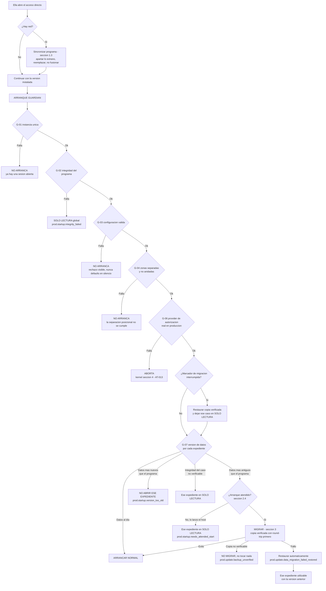

# 18 — Ciclo de actualización y recuperación V0

**Estado:** Technical Design V0 — documento técnico general.
**Precedencia:** por debajo de los ADRs Accepted (001–011) y del kernel técnico v0.4 (`00-technical-kernel.md`). No redefine ninguna regla de esos niveles: las materializa en un procedimiento de actualización, un guardián de arranque y un protocolo de recuperación. Donde este documento refina un texto superior, lo dice y lo marca.

**Qué contiene:** qué ocurre exactamente cuando la abogada actualiza el programa; qué archivos pueden cambiar y cuáles no pueden ser tocados *por construcción*; el arranque como guardián y sus cuatro desenlaces; el protocolo de migración con copia de seguridad verificada por round-trip; los mensajes literales que ella ve; qué queda utilizable si el Core no arranca; y por qué el rollback del programa es trivial y el de los datos no lo es.

**Qué NO contiene, y dónde está:** la estructura completa de la zona de trabajo de ella y el modelo de distribución (documento hermano de distribución y estructura de carpetas); el layout del repositorio de código (`14-repository-layout.md`); el contrato del `BackupPort` (`01-system-design.md` §8); el procedimiento de migración por base y su DDL (`04-persistence-model.md` §9); el pipeline de presentación y el catálogo cerrado de siete condiciones (`11-ux-condition-catalog.md`); el contrato de las proyecciones y de `memory.md` (`08-case-context-projections.md` §7).

**Etiquetas usadas:** `HECHO VERIFICADO (fuente)` · `DECISIÓN APROBADA` · `PROPUESTA DEL TECHNICAL DESIGN` (requiere aprobación; listadas en §8.2) · `HIPÓTESIS` · `SUPUESTO` · `POR VERIFICAR` · `RIESGO` · `DECISIÓN PENDIENTE` · `POST-V0`.

**Regla de lectura para todo el documento:** cuando aquí se dice *"no puede"*, significa **una de dos cosas y nunca una tercera**: (a) *por construcción* — no existe camino físico, y se nombra cuál es la construcción; o (b) *por comprobación* — existe camino y hay un chequeo que lo detiene, y se nombra el chequeo y su límite. Ningún "no puede" de este documento significa "confiamos en que no pase".

---

## 0. La premisa que sostiene todo lo demás: tres zonas, tres árboles

### 0.1 Las tres zonas

**DECISIÓN APROBADA (dueños, corrección arquitectónica).** El sistema tiene tres zonas con tres regímenes distintos, y no dos:

| # | Zona | Contenido | Quién escribe | ¿En git? | ¿Cowork la ve? |
|---|---|---|---|---|---|
| 1 | **PROGRAMA** | Core, MCP, skills, configuración sellada, `manifest`, `product_version` | **Solo `git pull`** (procedimiento de actualización) | **Sí — es el repositorio** | Irrelevante para la custodia; ver §0.4 |
| 2 | **ESCRITORIO DE ELLA** | Anexos que aporta, borradores, entregables, copias legibles | **Ella y el host** | **Nunca** | **Sí — es su zona de trabajo** |
| 3 | **EXPEDIENTE (estado canónico)** | `case.db`, originales de evidencia, Case Event Log, proyecciones, autorizaciones | **Solo el Core** | **Nunca** | **No debe alcanzarla** |

La zona 3 es la materialización de ADR-002 y la zona 1 la de `01` §6.2 (`runtime/` + `configuration/`, ciclo *sellado por release* y *mutación controlada*). La zona 2 es `user-workspace/` (`Inbox/`, `Working/`, `Exports/`).

### 0.2 La regla posicional, que es la única que este documento considera una garantía

**DECISIÓN APROBADA (dueños, restricción dura): la separación entre lo que git gobierna y lo que git no puede tocar es POSICIONAL, no declarativa.** `.gitignore` es una regla; una regla se edita, se olvida y se evade. Un árbol de directorios distinto no se evade: git no tiene ninguna operación que escriba fuera de su propio working tree.

Formulación operativa, y es la frase que hay que poder defender ante cualquier fallo de este documento:

> **Las zonas 2 y 3 no son "carpetas ignoradas" del repositorio. Están fuera del universo del repositorio.** No aparecen en `git status` ni siquiera como ignoradas; `git add -A` no puede alcanzarlas; `git clean` no puede borrarlas; ningún `git push` puede contenerlas, porque no hay commit que pueda referirlas.

**Corolario incómodo, y por eso explícito:** esta garantía vale exactamente mientras las zonas 2 y 3 **no sean descendientes del directorio del repositorio**. Si alguien —persona o instalador— coloca la carpeta de expedientes dentro del árbol clonado, la garantía posicional desaparece de golpe y en silencio y todo lo demás de este documento pasa a depender de `.gitignore`, que es justo lo que se rechazó. Por eso §2.1 convierte esa condición en un **chequeo de arranque bloqueante** y no en una recomendación.

### 0.3 Disposición ilustrativa

**ADR-002 es literal: la decisión es la separación, no el path.** Lo que sigue es **ILUSTRATIVO**, no normativo. Ninguna ruta concreta puede escribirse en el repositorio (`14` §7.4) ni exponerse a la abogada en ningún mensaje (`11` §6.3, `INV-UX-04`).

```text
[ZONA 1 — PROGRAMA]  el clon de GitHub. Se actualiza con git. Nada de ella vive aquí.
<carpeta del programa>/
├─ .git/                             metadatos del repositorio
├─ src/  plugin/  tests/  docs/ …    contenido del repositorio (ver 14)
├─ Actualizar y abrir.cmd            ← destino del acceso directo del escritorio (ILUSTRATIVO, §1.5)
└─ LEAME-PRIMERO.txt                 "No guarde documentos en esta carpeta"

[ZONA 2 — ESCRITORIO DE ELLA]  árbol hermano, NO descendiente de la zona 1.
Despacho/
├─ Expedientes/
│  └─ 2026-014 Pérez vs Aseguradora/
│     ├─ Documentos aportados/       ← lo que ella trae; es el Inbox lógico
│     ├─ Borradores/                 ← suyo; el Core no lo lee jamás (01 §6.2)
│     ├─ Entregables/                ← salidas
│     └─ resumen-del-expediente.md   ← copia legible generada por el programa (§5.3)
├─ Plantillas/
└─ Registro del programa/
   ├─ Archivos apartados/            ← cuarentena de §1.4; nunca se borra nada
   └─ Registro tecnico/              ← diagnóstico que ella puede enviar (§5.4)

[ZONA 3 — EXPEDIENTE]  ubicación reservada, resuelta en tiempo de ejecución por convención
                       de plataforma (p. ej. el directorio de datos de aplicación del usuario).
                       NUNCA escrita en el repositorio. NUNCA adjuntada a Cowork.
<ubicación reservada>/
├─ configuration/      Client Config validada, configuration_version, registro de instalación (§2.2)
├─ private-state/      case.db por caso, blobs, event log, autorizaciones, índices
├─ backups/            copias de seguridad y su estado de verificación
└─ scratch/            ubicación aislada de restauración para el round-trip (§3.2)
```

**Tres consecuencias que la disposición implica y conviene enunciar:**

1. **La zona 3 no tiene ninguna carpeta bajo la zona 1 ni bajo la zona 2.** Ni siquiera `scratch/`: el round-trip de verificación restaura **datos de clientes**, y restaurarlos en la zona 2 los pondría, aunque fuera un minuto, en un árbol que Cowork ve. Es el error silencioso más caro disponible en este diseño y se cierra aquí (§3.2).
2. **El registro de instalación —dónde están la zona 2 y la zona 3 en esta máquina— vive en `configuration/`, no en el repositorio.** Si viviera en el repositorio, sería un archivo con rutas absolutas de una máquina (prohibido por `14` §7.4) y, además, el procedimiento de actualización lo trataría como archivo extraño y lo apartaría en cada `pull`.
3. **El acceso directo del escritorio apunta a la zona 1, pero el programa no aprende de la zona 1 dónde están sus datos.** Los aprende de `configuration/`, resuelto por convención de plataforma. Así, clonar el repositorio dos veces no duplica el expediente: las dos copias del programa apuntan al mismo estado, y §2.1 detecta que hay dos.

### 0.4 El supuesto B-04, declarado antes de usarlo

**POR VERIFICAR — BLOQUEANTE. `B-04`, `INCONCLUSIVE`** (`ESTADO-Y-HALLAZGOS-CRITICOS` §1.2): no está documentado si un servidor MCP local puede alcanzar rutas **fuera** de las carpetas adjuntadas a la sesión de Cowork. El protocolo empírico está listo y sin ejecutar (`experiments/cowork-capability-spike/`, `Q1`).

**SUPUESTO DE TRABAJO DE ESTE DOCUMENTO: B-04 favorable** — el proceso del servidor MCP local corre con los privilegios de la cuenta del sistema operativo y alcanza la zona 3 aunque no esté adjuntada, mientras las herramientas de archivo del agente no la alcanzan. Es la `H1` del spike, y su base es que *"the agent loop runs natively on the device"*; **es hipótesis, no hecho**.

**PLAN DE CONTINGENCIA si B-04 resulta desfavorable** (el MCP local está confinado igual que el host):

| Qué cambia | Qué NO cambia |
|---|---|
| El Core deja de ser un servidor MCP alojado por Cowork y pasa a ser **proceso independiente con permisos de sistema operativo propios** (ADR-002 alternativa 4; `14` §8.2, trigger único vivo). Cowork habla con él por un canal local, no por herencia de proceso | Las tres zonas, la separación posicional, el guardián de arranque, el protocolo de migración, la copia verificada, los mensajes y el trinquete de datos: **todo este documento sigue siendo válido palabra por palabra** |
| Aparece el corte de proceso descrito en `14` §8.2 filas 2–3: serialización del contrato, versionado entre procesos y un **modo de fallo nuevo** (el transporte falla sin que falle ninguna operación) | El `FAIL TO START` de kernel §4 y el guardián siguen viviendo en el proceso que resuelve el provider de autorización — requisito duro de `14` §8.2 fila 3 |
| El arranque del Core deja de estar acoplado a la apertura de Cowork; el acceso directo de §1.5 pasa a ser el **único** punto de arranque, lo que **simplifica** §2.4 en vez de complicarlo | La zona 3 sigue fuera de git y fuera de todo árbol adjuntable |

**Por qué el diseño no se bifurca:** el único elemento que cambia es *quién hospeda el proceso del Core*, y este documento nunca depende de eso. Depende de que **exista un proceso que pueda leer la zona 3 y que la abogada arranque a mano**. Las dos ramas de B-04 lo satisfacen; solo difieren en el coste.

---

## 1. Qué ocurre exactamente en un `git pull`

### 1.1 La operación, sin metáforas

`git pull` es **`git fetch` seguido de una integración** (merge o rebase, según configuración). Lo que escribe en disco es, exhaustivamente:

| Qué escribe | Dónde | Comentario |
|---|---|---|
| Objetos nuevos y referencias remotas | `.git/` de la zona 1 | El `fetch`; no toca el working tree |
| Archivos **rastreados** que cambiaron entre la versión local y la remota | Working tree de la zona 1 | Es el único momento en que el contenido visible cambia |
| Archivos rastreados **nuevos** | Working tree de la zona 1 | |
| Borrado de archivos rastreados **eliminados** en la nueva versión | Working tree de la zona 1 | Solo archivos que git rastreaba: nada que él no hubiera puesto ahí |
| Índice y metadatos de la operación | `.git/` | |

**HECHO VERIFICADO (documentación oficial de git — `git-pull`, `git-fetch`, `git-merge`):** las tres operaciones actúan sobre el repositorio y su working tree. **Ninguna operación de git tiene por diseño un destino de escritura fuera del working tree y del directorio `.git`.**

De ahí se sigue la afirmación central, y se sigue *por construcción*, no por buena voluntad:

> **Un `git pull` no puede tocar la zona 2 ni la zona 3, porque ninguna de las dos está dentro del working tree.** No es que git decida no tocarlas: es que no tiene forma de nombrarlas.

Lo mismo vale, y con más fuerza, para las dos operaciones que los dueños nombraron como riesgo:

- **`git checkout` / `git reset --hard`** restauran el working tree al contenido de un commit. Solo pueden destruir cambios *dentro* del working tree. El expediente no está ahí. **No puede borrar el expediente.**
- **`git push` / `git add -A` / `git commit -a`** solo pueden incluir contenido del working tree. Los documentos de clientes no están ahí. **No pueden subirse a GitHub**, y esto no depende de que `.gitignore` esté bien escrito, porque no hay nada que ignorar.

### 1.2 Las cinco puertas por las que esa garantía se rompe, y cómo se cierra cada una

La garantía de §1.1 es real y **tiene fugas conocidas**. Enumerarlas es la diferencia entre un diseño y una promesa.

| # | Puerta | Por qué rompe la garantía | Cómo se cierra |
|---|---|---|---|
| 1 | **Anidamiento** — la zona 2 o la 3 acaban dentro del árbol de la zona 1 | Deja de haber separación posicional: las carpetas pasan a ser contenido del working tree y quedan expuestas a `clean`, `reset` y `add` | **Chequeo de arranque bloqueante** (§2.1, `G-04`): si la ruta registrada de la zona 2 o de la 3 es descendiente de la zona 1, el programa **no arranca** y lo dice. No se "corrige al vuelo": mover datos sin decisión humana es peor que no arrancar |
| 2 | **Hooks** — `.git/hooks/*` o `core.hooksPath` apuntando a un directorio con scripts | Un hook es código arbitrario que git ejecuta en `post-merge` / `post-checkout`; puede escribir donde quiera, incluidas las zonas 2 y 3 | Los hooks **no se distribuyen con el clon**: `.git/hooks` no es contenido versionado. El chequeo `G-05` verifica que no hay hooks instalados y que `core.hooksPath` no está definido; si lo está, **no se actualiza** y se reporta. **HECHO VERIFICADO (documentación de git: `core.hooksPath`)** de que la clave existe y redirige el directorio de hooks. **POR VERIFICAR:** la lista exacta de hooks que dispara un `pull` en la versión de git instalada |
| 3 | **Filtros de contenido** — `.gitattributes` + `filter.<x>.smudge/clean` | Un filtro es un comando arbitrario que git ejecuta al hacer checkout de cada archivo | El repositorio del producto **no define ningún filtro**; `G-05` verifica que no hay claves `filter.*` con comando en la configuración local |
| 4 | **Submódulos** | `git submodule update` clona y escribe árboles adicionales | El producto es **un repositorio, sin submódulos** (`14` §2.1). `G-05` verifica que no hay `.gitmodules` |
| 5 | **Enlaces simbólicos y junctions dentro del árbol** apuntando a la zona 2 o 3 | Convierten una ruta interna del repositorio en una ruta externa. En Windows `mklink /J` crea junctions **sin privilegios de administrador** (mismo hallazgo que motiva `Q2` del spike) | `G-05` verifica que el árbol de la zona 1 no contiene reparse points. **POR VERIFICAR:** el comportamiento exacto de git ante un junction en el working tree en la versión instalada; no se da por supuesto |

**Límite declarado, sin adornos** (kernel §8.3, `tamper-evident, no tamper-proof`): estos cinco chequeos detectan **el accidente y la configuración heredada**, no a alguien con control total del equipo y voluntad de romperlo. No se promete lo contrario en ninguna superficie.

### 1.3 La decisión que elimina los conflictos: la zona 1 es una réplica, no una copia de trabajo

**PROPUESTA DEL TECHNICAL DESIGN — requiere aprobación. En la máquina de la abogada, la zona 1 se sincroniza por *reemplazo*, no por *fusión*.**

El razonamiento, en tres pasos:

1. Un conflicto de merge es, por definición, **dos autorías divergentes sobre el mismo archivo**. En la máquina de la abogada **no hay autoría local**: nadie edita el programa ahí. Todo cambio local es, sin excepción, un accidente.
2. Fusionar accidentes es la peor opción disponible: produce archivos a medias, deja marcadores de conflicto dentro del código del producto y convierte un error trivial en un programa que no arranca y que además ya no es igual a ninguna versión publicada.
3. Por tanto la actualización **no fusiona**: pone la zona 1 exactamente igual a la versión publicada, después de **apartar** —jamás borrar— lo que encuentre distinto.

Procedimiento conceptual (**ILUSTRATIVO, NO ES CÓDIGO DE PRODUCCIÓN**):

```text
SINCRONIZAR_PROGRAMA:
  1. comprobar que el Core no está en ejecución (lock de §2.4). Si lo está -> abortar, no actualizar.
  2. G-05: hooks / filtros / submódulos / reparse points -> si algo aparece: NO actualizar, reportar.
  3. fetch de la versión publicada
     sin red -> NO es error: continuar con la versión que ya está (§4, nota de la tabla)
  4. inventariar diferencias locales del working tree:
       - archivos rastreados modificados
       - archivos NO rastreados que no son del programa   <-- el caso peligroso
  5. si el inventario NO está vacío:
       copiar cada archivo a  <zona 2>/Registro del programa/Archivos apartados/<fecha>/
       verificar la copia (tamaño + hash) ANTES de continuar        <-- nada se descarta sin copia
       si la copia falla -> ABORTAR la actualización. Se prefiere no actualizar a perder un archivo.
  6. poner el working tree exactamente en la versión publicada (reemplazo, no fusión)
  7. registrar en el Registro tecnico: versión anterior -> versión nueva, y qué se apartó
  8. ceder el control al ARRANQUE GUARDIÁN (§2). El pull NO migra nada.
```

**La única razón por la que el paso 6 es aceptable es la separación posicional de §0.2.** Un reemplazo destructivo del working tree es seguro **si y solo si** nada de ella vive ahí. Si alguna vez esa condición dejara de cumplirse, este procedimiento pasaría de ser el más seguro a ser el más destructivo. Por eso el chequeo `G-04` es bloqueante y no una advertencia.

**Consecuencia declarada:** en la máquina de la abogada **no existe el caso "conflicto"**. Existe el caso "archivos apartados", que es §1.4 y que ella ve.

### 1.4 Ella modificó algo del programa por error

Tres subcasos reales, con tres desenlaces distintos:

| Subcaso | Qué encuentra la sincronización | Qué hace | Qué ve ella |
|---|---|---|---|
| **(a) Editó un archivo del programa** (abrió algo, guardó sin querer) | Archivo rastreado modificado | Copia el archivo a *Archivos apartados*, verifica la copia, restaura la versión publicada | `prod.update.program_files_changed` (§4) |
| **(b) Guardó un documento suyo dentro de la carpeta del programa** | Archivo no rastreado, no perteneciente al manifiesto | **Mueve** el archivo a *Archivos apartados* con su nombre y fecha originales. **Nunca lo borra** | El mismo mensaje, con el número de archivos apartados |
| **(c) Borró un archivo del programa** | Archivo rastreado ausente | Lo restaura desde la versión publicada. Nada que apartar | Nada: no hay pérdida ni decisión que tomar |

**Por qué el subcaso (b) es el que decide el diseño de esta sección.** Es el único donde un procedimiento ingenuo (`git clean -fd`) **destruye un documento de un cliente sin dejar rastro**. Y es realista: la carpeta del programa está en el escritorio, tiene el nombre del producto, y para una profesional no técnica es un lugar plausible donde guardar algo. Por eso:

- El orden es **copiar y verificar primero, limpiar después**, y un fallo de copia **aborta la actualización** (paso 5). Una actualización no aplicada es un inconveniente; un anexo perdido puede ser un término procesal.
- La cuarentena vive en la **zona 2**, no en la 1: si viviera en la 1, la siguiente sincronización la apartaría a su vez, en un bucle.
- La cuarentena **no se purga automáticamente en V0**. Purgar es borrar, y borrar es la operación que este documento evita en todas partes. La revisión y el vaciado son manuales. *(POST-V0: política de retención.)*

**RIESGO residual, declarado y no cerrado:** entre que ella guarda un documento en la carpeta del programa y la siguiente sincronización, ese documento **está dentro del working tree**. Si alguien ejecutara un `commit` + `push` en ese intervalo, saldría de la máquina. Mitigaciones, ninguna presentada como garantía:

1. **No hay camino de `push` configurado** en la instalación de la abogada. **PROPUESTA:** el clon se configura sin URL de escritura utilizable, de modo que un `push` accidental falle por falta de destino y no por falta de credenciales. **POR VERIFICAR:** la formulación exacta y su comportamiento en la versión de git instalada.
2. **No hay credenciales de GitHub** en esa máquina, y el diseño no las requiere para `pull` de un repositorio público ni para el modo de distribución que decidan los dueños. **DECISIÓN PENDIENTE (dueños): repositorio público o privado.** Si es privado, la máquina necesita credenciales de lectura y esta mitigación se debilita; hay que decidirlo con ese coste a la vista.
3. **La protección real sigue siendo posicional:** el documento correctamente guardado en la zona 2 nunca estuvo expuesto. Esta mitigación cubre solo el error de ubicación, y por eso el mensaje de §4 le pide explícitamente que revise lo apartado.

### 1.5 Quién ejecuta la actualización, y quién no

**DECISIÓN APROBADA (dueños, restricción dura): el modelo NO ejecuta el arranque ni la actualización.** Coherente con ADR-001 (el LLM es cliente externo no confiable: no ejecuta comandos, no escribe estado) y con kernel §6 (la clase `ADMIN` de la superficie MCP está **vacía por diseño**).

| Quién | Qué puede hacer | Cómo |
|---|---|---|
| **La abogada** | Actualizar y arrancar | **Un acceso directo en el escritorio.** No abre terminal, no escribe comandos, no ve git |
| **El Core (proceso MCP)** | Verificar y servir; **nunca** migrar (§2.4) | Arranca cuando el host lo lanza |
| **El modelo** | **Nada de esto.** No hay tool que actualice, migre, restaure ni arranque | No existe superficie. La ausencia es el mecanismo |
| Los dueños / soporte | Todo lo anterior, más diagnóstico | Fuera de banda |

**PROPUESTA — el acceso directo hace una sola cosa, en este orden:** sincronizar el programa (§1.3) → arranque guardián (§2) → abrir el entorno de trabajo. Un solo botón. Si no hay red, se salta el primer paso y **no es un error**.

**RIESGO técnico concreto, POR VERIFICAR: el script de actualización vive dentro del repositorio y por tanto se reemplaza a sí mismo durante la sincronización.** En Windows, un archivo de proceso por lotes en ejecución puede ser leído de forma incremental por el intérprete, de modo que reemplazarlo a mitad de ejecución es un fallo conocido y no un temor teórico. **PROPUESTA de mitigación:** el acceso directo lanza un arrancador mínimo que **se copia a una ubicación temporal y ejecuta desde allí**, o bien la sincronización es el último paso antes de re-ejecutar. **No se da por resuelto**: es un punto de verificación obligatorio del spike de dependencias, y un fallo aquí se manifiesta como una actualización a medias, que es exactamente lo que §2 existe para detectar.

---

## 2. El arranque como guardián

### 2.1 Los siete chequeos, en orden, y por qué ese orden

El arranque no es "abrir el programa": es **la puerta donde se decide si este programa puede tocar estos datos**. El orden no es arbitrario — cada chequeo asume que los anteriores pasaron, y ninguno puede adelantarse.

| # | Chequeo | Qué compara | Si falla |
|---|---|---|---|
| `G-01` | **Instancia única** | Lock durable: ¿hay otro Core vivo sobre esta zona 3? | **NO ARRANCA.** Dos procesos escribiendo el mismo estado canónico es corrupción, no concurrencia |
| `G-02` | **Integridad del programa sellado** | Hashes del árbol de la zona 1 contra el `manifest` del release | **SOLO LECTURA** global (`01` §7.4). No se continúa al chequeo 3 en modo normal |
| `G-03` | **Client Config** | La configuración contra su schema; `configuration_version` | **NO ARRANCA.** *Rechazo visible*: degradar en silencio a defaults convierte un error de configuración en una política tácita (`01` §7.3 paso 2) |
| `G-04` | **Topología de zonas** | Zona 2 y zona 3 registradas ¿existen? ¿son descendientes de la zona 1? ¿coincide el registro de instalación? | **NO ARRANCA.** Es la puerta 1 de §1.2. Un programa que arranca con las zonas anidadas está trabajando sin la garantía que le da sentido |
| `G-05` | **Higiene del repositorio** | Hooks, `core.hooksPath`, filtros, submódulos, reparse points (§1.2 puertas 2–5) | **NO ACTUALIZA** (y lo reporta). Puede arrancar en normal si todo lo demás está bien: es una condición de la *actualización*, no de la *operación* |
| `G-06` | **`FAIL TO START` de kernel §4** | Configuración de PRODUCCIÓN + provider de autorización `DEV_STUB` | **ABORTA EL ARRANQUE** (kernel §4; test `AT-013`). No admite degradación: un producto que autoriza con un stub no es un producto degradado, es otro producto |
| `G-07` | **Versión de datos, por caso** | `schema_version` de cada `case.db` contra el rango `min_schema` / `max_schema` del `manifest` | Cuatro desenlaces distintos: §2.3 |

**Dos precisiones de granularidad que evitan un error caro:**

- `G-01` a `G-06` son **globales**: su desenlace afecta al producto entero.
- `G-07` es **por caso**, porque hay una base por Case (`04` §1.1). Un caso puede quedar en solo lectura mientras los demás operan con normalidad. Es exactamente el `RIESGO` de migración parcial que `04` §9.3 declara, y la respuesta es la misma: **no se arregla al vuelo**, se abre en solo lectura y se reporta.
- **Se comprueba antes:** si existe un **marcador de migración en curso** (`04` §9.2 paso 4), la restauración automática ocurre **antes** de evaluar `G-07`, porque el `schema_version` de un archivo a medias no significa nada.

### 2.2 El registro de instalación

**PROPUESTA DEL TECHNICAL DESIGN — requiere aprobación.** En `configuration/` (zona 3, ciclo *mutación controlada*) vive un registro durable, escrito **solo por el Core**, con:

| Campo | Para qué | Sin él… |
|---|---|---|
| `product_version` de la última ejecución correcta | Detectar que el programa **retrocedió** (`git checkout` a una versión anterior) | Un downgrade del programa es indetectable y se descubre como un fallo raro, no como una condición nombrada |
| `schema_version` alcanzado por cada caso | Detectar migración parcial y datos más nuevos que el programa | `G-07` tendría que deducirlo abriendo cada base |
| Ubicación registrada de la zona 2 y de la zona 3 | `G-04` | No habría contra qué comparar la topología |
| Fecha y resultado de la última copia de seguridad verificada | Gate de migración (`01` §8.2: solo `VERIFIED` habilita migrar) | El gate no sería comprobable en el arranque |
| Fecha de la última sincronización del programa | Mensaje de §4 y diagnóstico | La abogada no podría saber desde cuándo no se actualiza |

**Por qué no vive en el repositorio:** contendría rutas absolutas de una máquina, prohibido por `14` §7.4; y cada `pull` lo trataría como archivo extraño (§1.4 subcaso b) y lo apartaría.

### 2.3 Los cuatro desenlaces

| Desenlace | Cuándo | Qué queda disponible | Mensaje |
|---|---|---|---|
| **Arrancar normal** | Todos los chequeos pasan y `schema_version` está en rango | Todo | Ninguno, o `prod.update.applied` si hubo actualización |
| **Migrar y arrancar** | `schema_version` del caso **menor** que el mínimo del programa, y hay ruta de migración | Todo, **después** de §3 | `prod.update.data_migration_running` → `prod.update.data_updated` |
| **Arrancar en solo lectura** | `G-02` falla (global), o un caso concreto no supera su verificación de integridad / cadena de eventos, o quedó sin migrar | Abrir casos, servir proyecciones, leer fragmentos y Sources, verificar la cadena, hacer y verificar copias de seguridad. **Ninguna escritura, en ninguna parte, incluidos `Exports/`** (`01` §7.4) | `prod.startup.integrity_failed` |
| **No arrancar** | `G-01`, `G-03`, `G-04`, `G-06`, o `schema_version` **mayor** que el máximo del programa | Nada del Core. La zona 2 sigue intacta y legible (§5) | `prod.startup.version_too_old`, o el que corresponda |

**La regla que gobierna la tabla:** el sistema **nunca abre "a ver qué pasa"** (`01` §7.1). Ante duda sobre si este programa entiende estos datos, la respuesta correcta es no abrirlos, y decirlo.

### 2.4 Dos arranques distintos, y solo uno puede migrar

**PROPUESTA DEL TECHNICAL DESIGN — requiere aprobación; es la decisión estructural de esta sección.**

Bajo Cowork, el proceso del Core lo lanza el host cuando abre la sesión, no la abogada. Eso crea dos caminos de arranque con **garantías distintas**, y tratarlos igual es un error:

| | **Arranque atendido** (acceso directo, §1.5) | **Arranque del servidor** (lo lanza el host) |
|---|---|---|
| ¿Hay una persona mirando? | **Sí, por construcción**: ella acaba de hacer doble clic | **No se puede afirmar** |
| ¿Hay superficie propia para mostrar un mensaje? | **Sí**: el arrancador es del producto | **No garantizada**: el mensaje dependería del modelo, y *"un mensaje que solo existe en el chat no existe"* (`01` §7.5) |
| Ejecuta `G-01`…`G-07` | **Sí** | **Sí** |
| **¿Puede migrar datos?** | **Sí, y es el único que puede** | **NO, nunca** |
| ¿Puede restaurar una copia de seguridad? | Sí, ante marcador de migración interrumpida | **No.** Deja el caso en solo lectura y lo reporta |
| Si encuentra un caso sin migrar | Migra (§3) | Abre ese caso **en solo lectura** y emite el mensaje que le pide abrir con el acceso directo |

**Tres razones por las que la migración no ocurre nunca dentro del proceso del servidor MCP:**

1. **No hay superficie fiable.** Una migración puede tardar y puede fallar; si falla en un proceso cuyo único canal de salida pasa por el modelo, la abogada puede no enterarse nunca, o enterarse deformada (`11` §6.4: no hay garantía de fidelidad de la redacción en el canal del modelo).
2. **No hay consentimiento observable.** Migrar es la operación irreversible de este sistema (§6). Que ocurra porque el host decidió abrir una sesión, sin que nadie lo pidiera, invierte la relación de autoridad que ADR-005 establece.
3. **El ciclo de vida del proceso es POR VERIFICAR.** `E-05`/`Q4` del spike sigue abierto: no está documentado cuándo el host mata o reinicia un servidor MCP. Una migración interrumpida por el reciclado de un proceso es exactamente el escenario que §3.3 tiene que gestionar; no hay razón para invitarlo.

**Contrapartida honesta:** si ella nunca usa el acceso directo y siempre abre Cowork a secas, sus casos quedarán en solo lectura tras una actualización que cambie el esquema, hasta que use el acceso directo. **Es fricción deliberada**, y el mensaje de §4 (`prod.startup.needs_attended_start`) es el que la convierte en una instrucción de una línea en vez de en un misterio.

### 2.5 Diagrama de flujo



---

## 3. Migraciones

### 3.1 Las reglas heredadas, que este documento no reabre

**DECISIÓN APROBADA** (kernel §13; `boundaries.md` §10; `01` §7.2–§7.3; `04` §9):

1. **Numeradas y solo hacia adelante.** No existen down-migrations. *El rollback de datos es restauración de copia de seguridad, no migración inversa* — y de ahí sale §6 entera.
2. **Copia de seguridad verificada antes de cada migración.** Un backup `UNVERIFIED` **no** habilita migrar (`01` §8.2, regla dura): la migración simplemente no ocurre.
3. **Preservación de la cadena de hashes.** Una migración puede cambiar la representación física, pero **no los bytes canónicos sobre los que se computó `event_hash`**. Re-anclar la cadena es **cambio de contrato de auditoría**, exige decisión explícita y no puede ocurrir como efecto colateral de una migración.
4. **Las migraciones no emiten eventos del Case Event Log ni avanzan `case_revision`.** No son mutaciones del estado epistémico. Se registran en el plano administrativo con `principal_type = SYSTEM`, `provenance_kind = SYSTEM`.
5. **Fuera de la superficie del modelo.** Clase `ADMIN` vacía por diseño (kernel §6).
6. **`catalog.db` no se migra: se reconstruye** (`04` §9.1). Es derivado; borrar y regenerar es siempre correcto y más barato.

**Y la regla que este documento añade y que los dueños nombraron literalmente:** **`git pull` no migra nada.** Trae archivos. Los datos los migra el arranque atendido, después, con copia previa, y solo él (§2.4).

### 3.2 La copia de seguridad verificada por round-trip

**"Un archivo escrito no es un backup: es un archivo"** (`01` §8.1). La mayoría de estrategias de respaldo fallan en el *restore*, no en el *write*. Por tanto, antes de tocar un solo byte del estado:

```text
VERIFICAR_COPIA(copia):                       # ILUSTRATIVO, NO ES CÓDIGO DE PRODUCCIÓN
  a. RESTAURAR la copia a  <zona 3>/scratch/<id>/     <-- ubicación aislada, NUNCA la zona 2
  b. abrir la copia restaurada y correr la comprobación de integridad del motor
  c. verificar la cadena de hashes de case_events sobre la COPIA, de punta a punta
  d. re-hashear los Sources de la copia y comparar con el hash registrado
  e. comprobar presencia de las DerivedRepresentations referenciadas por algún fragmento
  f. comparar conteos por tabla: copia vs original
  g. comprobar que schema_version de la copia == el del origen
  h. destruir <zona 3>/scratch/<id>/
  -> VERIFIED solo si a..g pasan TODAS. Cualquier fallo -> FAILED -> NO SE MIGRA.
```

**Por qué `scratch/` vive en la zona 3 y no en la carpeta temporal del sistema ni en la zona 2.** El round-trip **materializa datos de clientes fuera de su ubicación normal**: expedientes completos, originales de evidencia, autorizaciones. Restaurarlos —aunque sea durante segundos— en un árbol que Cowork ve, o en una ubicación temporal compartida del sistema operativo, es un incidente de confidencialidad silencioso y perfectamente evitable. **Es la clase de detalle que no aparece en ninguna decisión de arquitectura y que decide si la arquitectura sirve.**

**Nota sobre `e`:** *regenerable ≠ prescindible* (`01` §8.3). Un `EvidenceLink` ancla a `{source_version_hash, selector}`: si desaparece el derivado exacto, el Source sobrevive pero **la cadena de provenance se rompe**. Excluir las derivaciones referenciadas por ser "regenerables" es el error más caro de esa lista, y por eso es un chequeo del round-trip y no una opción.

**POR VERIFICAR (spike de dependencias, heredado de `04` §9.2):** disponibilidad y semántica del mecanismo de copia consistente y de la comprobación de integridad del motor en la versión y el binding concretos. Ninguna de las dos se da por supuesta.

### 3.3 La secuencia, con su marcador durable

Por cada `case.db` con `schema_version` menor que el objetivo (`04` §9.2, aquí con el encuadre de arranque):

```text
1. VERIFICAR ESTADO DE PARTIDA
     integridad del archivo + cadena de eventos
     falla -> ABORTAR ESE CASO, marcarlo SOLO LECTURA, reportar.  No se migra lo dudoso.
2. COPIA en  <zona 3>/backups/<case_id>/<schema_version>-<fecha>/
3. VERIFICAR LA COPIA por round-trip (§3.2)
     falla -> ABORTAR.  Sin copia verificada NO se migra.  El caso sigue usable como estaba.
4. MARCADOR DURABLE "migración en curso" (fuera de la transacción)   <-- lo que salva el caso 6
5. APLICAR el script numerado en UNA transacción
     DDL + transformación + registro en schema_migrations + nuevo schema_version
     falla -> el motor deshace; el archivo nunca quedó a medias; limpiar marcador; reportar
6. VERIFICAR ESTADO DE LLEGADA
     integridad + cadena de eventos + invariantes estructurales del nuevo esquema
     falla -> RESTAURAR desde la copia verificada, re-verificar, dejar el caso en SOLO LECTURA
7. LIMPIAR marcador; actualizar el registro de instalación; registrar el resultado
```

**Los dos modos de fallo, y por qué se tratan distinto:**

| Modo | Qué pasó | Respuesta |
|---|---|---|
| **Dentro de la transacción** (paso 5) | El motor deshizo. El archivo está exactamente como estaba | No hay nada que restaurar. Se limpia el marcador y se reporta |
| **Fuera de la transacción, o caída del proceso** (pasos 4–6 con marcador presente) | El archivo puede estar en cualquier estado | En el **siguiente arranque**, el guardián encuentra el marcador y **restaura automáticamente** la copia verificada, re-verifica cadena e integridad, y **abre ese caso en solo lectura** hasta una operación administrativa explícita. **La restauración nunca es silenciosa** |

**Los blobs no se restauran.** Son inmutables y content-addressed; una migración no los toca. Un blob escrito por una ingestión que la migración no alcanzó a registrar queda como **huérfano recuperable**, no como corrupción (`04` §9.3).

**Lo que una migración NO puede hacer, en ningún caso:**

- Escribir en la zona 1 (`runtime/` no se escribe en operación: invalidaría la verificación de integridad de la que depende `G-02`).
- Escribir en la zona 2 (no es suya).
- Emitir eventos del Case Event Log o avanzar `case_revision`.
- Cambiar los bytes canónicos sobre los que se computó `event_hash`.
- Borrar una copia de seguridad. **Ninguna operación automática de V0 borra una copia de seguridad.**

### 3.4 Los dos desajustes de versión

**Caso normal — el programa es más nuevo que los datos.** Es lo que ocurre después de un `pull` que trae una migración: `schema_version` de la base es menor que `min_schema` del `manifest`. Hay ruta de migración numerada, y §3.3 la aplica en el arranque atendido. Es el caso esperado y el único que migra.

**Caso inverso — los datos son más nuevos que el programa.** `schema_version` de la base es **mayor** que `max_schema` del `manifest`. Ocurre de dos maneras, ambas realistas:

- Ella hizo `git checkout` de una versión anterior, o restauró una copia antigua de la carpeta del programa.
- Los datos vinieron de otra máquina o de una restauración, y el programa local se quedó atrás.

**PROPUESTA DEL TECHNICAL DESIGN — refina `01` §7.3 dentro de su espacio de opciones y requiere aprobación. En V0, ese expediente NO SE ABRE. Ni siquiera en solo lectura.**

`01` §7.3 ofrecía dos salidas para este caso: *"Solo-lectura o mensaje de producto"*. Este documento elige la segunda, y la razón es específica de un producto jurídico:

> **Un programa antiguo leyendo datos nuevos no falla ruidosamente: falla plausiblemente.** No conoce las columnas nuevas, ni la semántica nueva de las viejas. Serviría una proyección **sintácticamente correcta y silenciosamente incompleta** — un `overview` al que le faltan hechos, una lista de evidencia sin el material más reciente. En un expediente, una omisión con apariencia de completitud es peor que una negativa: la negativa se ve, la omisión se cita.

**El "a medias" queda prohibido explícitamente:** no se abre el expediente ignorando lo que no se entiende, no se abre "solo lo que se reconoce", no se ofrece una vista parcial. **O el programa entiende estos datos, o no los toca.**

**Granularidad, y por qué importa:** la comprobación es por caso (`G-07`). Un expediente restaurado desde una máquina más nueva no impide trabajar en los demás. Pero si el **registro de instalación** (§2.2) muestra que el `product_version` en ejecución es **anterior** al de la última ejecución correcta, el programa **no arranca en absoluto**: es un retroceso del programa, no una anomalía de un caso, y tratarlo caso a caso ocultaría la causa.

**La salida es siempre la misma y es hacia adelante:** volver a actualizar el programa (`pull`). Nunca "convertir los datos hacia atrás", que es la operación que la regla 1 de §3.1 elimina del universo.

---

## 4. Los mensajes que ve ella

### 4.1 Régimen: son mensajes de producto, no condiciones

**Restricción heredada, y es la que decide el canal** (`01` §7.5): estos mensajes ocurren **antes de cualquier invocación de tool**, es decir, antes de que exista conversación. Por tanto **no pueden depender del modelo para llegar**: los emite una superficie que el producto controla — el arrancador del acceso directo. *Un mensaje de arranque que solo existe en el chat no existe.*

**PROPUESTA DEL TECHNICAL DESIGN — requiere aprobación, porque toca una lista declarada cerrada.** `11` §6.6 fija tres orígenes admisibles de mensaje de producto (`SURFACE_ABSENCE`, `NORMAL_DATUM`, `MODEL_ERROR`) y un catálogo cerrado. Los mensajes de esta sección **no encajan en ninguno de los tres**: no nacen de una `Condition`, no nacen de un `ErrorCode`, y no nacen de una ausencia de capacidad. Se propone un **cuarto origen declarado**:

| Origen nuevo | Qué lo produce | Dónde se detecta | Quién lo entrega |
|---|---|---|---|
| `PRODUCT_LIFECYCLE` | Actualización, migración, integridad, incompatibilidad de versión, Core no disponible | El arrancador y el guardián, **fuera de toda operación del expediente** | Superficie propia del producto, **nunca el modelo** |

Se aplica sin excepción el mismo régimen que `11` §6.6 impone a los otros tres: `message_key` estable, categoría entre las **mismas cuatro** de `11` §5.1 (no se crea ninguna), plantillas por locale, prohibida la concatenación de frases y la interpolación de texto libre del modelo, y sujeción a `INV-UX-04`, `INV-UX-05`, `INV-UX-11` e `INV-UX-12`. Los tests `T-UX-04` y `T-UX-05` corren también sobre este catálogo.

**Lo que estos mensajes NUNCA dicen** — contraejemplos que fallarían `INV-UX-04`:

> «SHA-256 mismatch» · «schema version 7 → 8» · «checksum inválido en manifest.json» · «error en `git pull`: conflicto en src/…» · «migración 0004 falló» · «no se pudo abrir case.db» · «el servidor MCP no respondió» · cualquier ruta del sistema de archivos · cualquier nombre de tabla, columna, hash, identificador o reloj interno.

**Y la estructura obligatoria de los tres, en todos ellos** (regla de `11` §3.5 y del vertical slice): **qué ocurrió** · **qué NO cambió en el expediente** · **qué puede hacer ella**. Ninguno promete una acción autónoma futura.

### 4.2 Catálogo `PRODUCT_LIFECYCLE` v0 — cerrado

Regla de admisión, idéntica a la de `11` §6.6: *una fila existe solo si la acción recomendada a la lectora difiere*.

| `message_key` | Ocasión | Categoría (`11` §5.1) | `asserts_at_most` |
|---|---|---|---|
| `prod.update.applied` | Se actualizó el programa; los datos no cambiaron | `SOMETHING_CHANGED` | Que el programa cambió. Ninguna afirmación sobre el expediente |
| `prod.update.data_migration_running` | Migración en curso | `SOMETHING_CHANGED` | Que hay una tarea en curso y no debe cerrarse |
| `prod.update.data_updated` | Migración completada | `SOMETHING_CHANGED` | Que el expediente ya está en el formato nuevo, con copia previa hecha |
| `prod.update.backup_unverified` | No se pudo verificar la copia; **no se migró** | `CANNOT_DO_THAT` | Que no se tocó nada |
| `prod.update.data_migration_failed_restored` | Migración fallida; restauración automática hecha | `CANNOT_DO_THAT` | Que el expediente quedó como estaba antes |
| `prod.update.program_files_changed` | Se apartaron archivos de la carpeta del programa | `SOMETHING_CHANGED` | Que se apartaron, no que se borraron |
| `prod.startup.integrity_failed` | `G-02` falla → solo lectura | `CANNOT_DO_THAT` | Que no se confirmó que el programa esté como se instaló |
| `prod.startup.version_too_old` | Datos más nuevos que el programa (§3.4) | `CANNOT_DO_THAT` | Que no se abrió **nada** de ese expediente |
| `prod.startup.needs_attended_start` | El host lanzó el Core y hay un caso sin migrar (§2.4) | `NEEDS_YOUR_DECISION` | Que hace falta una acción suya de un paso |
| `prod.core.unavailable` | El Core no arranca o no está disponible | `CANNOT_DO_THAT` | **Nada sobre ningún expediente** — ver §5.2 |

**No hay mensaje para "no había actualizaciones" ni para "no había red".** La acción recomendada no difiere de la de un arranque normal: es cero. El arrancador muestra una **línea de estado** con la versión en ejecución y si se buscó actualización; una línea de estado no es un mensaje y no lleva clave.

### 4.3 Redacciones `es-CO`

**SUPUESTO en el sentido de `11` §8.4:** fijan el techo de certeza y el contenido obligatorio; **no están validadas con la profesional**, y cambiar su prosa no cambia ningún contrato.

> **`prod.update.applied`**
> El programa se actualizó a una versión más reciente.
> **Sus expedientes y sus documentos no cambiaron:** la actualización afecta únicamente al programa. Puede seguir trabajando con normalidad.

> **`prod.update.data_migration_running`**
> El programa está preparando sus expedientes para trabajar con la versión nueva. Esto puede tardar unos minutos.
> **Antes de empezar se guardó una copia de seguridad completa y se comprobó que esa copia se puede volver a abrir.** Si algo sale mal, sus expedientes vuelven automáticamente a como estaban.
> Por favor, no cierre esta ventana ni apague el equipo hasta que termine.

> **`prod.update.data_updated`**
> Sus expedientes ya están preparados para la versión nueva del programa. **No se perdió ni se modificó ninguna información**: los hechos, los documentos y las decisiones que usted había registrado siguen igual.
> Se conserva una copia de seguridad del estado anterior.
> Tenga en cuenta una cosa: **a partir de ahora, las versiones anteriores del programa ya no podrán abrir estos expedientes.** Si necesita volver a una versión anterior, hable con soporte técnico antes de hacerlo.

> **`prod.update.backup_unverified`**
> El programa iba a preparar sus expedientes para la versión nueva, pero **no pudo comprobar que la copia de seguridad previa se pueda volver a abrir**. Por precaución, **se detuvo antes de tocar nada**.
> **Sus expedientes no se modificaron.** Puede seguir usándolos exactamente como hasta ahora, con la versión anterior del programa.
> Para completar la preparación hace falta revisar el espacio disponible en el equipo y, si el problema continúa, pedir soporte técnico.

> **`prod.update.data_migration_failed_restored`**
> La preparación de un expediente para la versión nueva no se completó. **El programa restauró automáticamente la copia de seguridad que había hecho antes de empezar, y comprobó que quedó correcta.**
> **Ese expediente está tal como estaba antes de intentar la actualización.** No se perdió ninguna información registrada hasta ese momento.
> Por ahora ese expediente se abre **solo para consulta**: puede revisar todo lo que contiene, pero no se guardarán cambios nuevos hasta que soporte técnico lo revise. Los demás expedientes funcionan con normalidad.

> **`prod.update.program_files_changed`**
> Al actualizar, el programa encontró **{apartados_count} archivo(s)** dentro de su carpeta que no forman parte del programa, o archivos del programa que habían sido modificados.
> **No se borró ninguno.** Se guardaron todos, con su nombre y su fecha, en la carpeta **Registro del programa → Archivos apartados**.
> **Sus expedientes no se vieron afectados.** Le recomendamos revisar esa carpeta: si alguno de esos archivos es un documento suyo, muévalo a la carpeta del expediente que corresponda. La carpeta del programa no es un lugar seguro para guardar documentos.

> **`prod.startup.integrity_failed`** *(literal de `01` §7.5, conservado sin cambios)*
> **No fue posible confirmar que los archivos del programa estén tal como se instalaron.** Por precaución, el programa se abrió en **modo de solo consulta**: usted puede abrir sus expedientes y revisar todo lo que ya está registrado, pero por ahora no se guardará ningún cambio.
> **Sus expedientes no se modificaron y no se perdió nada.** Los documentos originales siguen guardados tal como se incorporaron.
> Para volver al funcionamiento normal hay que reinstalar el programa desde su origen o pedir soporte técnico. Ese procedimiento no toca sus expedientes ni sus documentos.

> **`prod.startup.version_too_old`**
> Este expediente fue creado o actualizado con una **versión más reciente del programa** que la que está instalada en este equipo. Para no mostrarle información incompleta, **el programa no lo abrió**.
> **El expediente está intacto**: no se modificó, no se abrió a medias y no se perdió nada.
> Para consultarlo hay que actualizar el programa a la última versión. Mientras tanto, los demás expedientes funcionan con normalidad.

> **`prod.startup.needs_attended_start`**
> Este expediente necesita una preparación que solo puede hacerse al abrir el programa desde el acceso directo del escritorio, con usted presente.
> **El expediente está intacto y puede consultarlo ahora mismo**, pero por el momento no se guardarán cambios nuevos en él.
> Cuando pueda, cierre esta sesión y abra el programa con el acceso directo **«Abrir Legal Workspace»**. La preparación es automática y le avisará cuando termine.

> **`prod.core.unavailable`**
> **El programa del expediente no está disponible en este momento.** Mientras siga así, **no puedo consultar ni registrar nada en sus expedientes**, y **no debo responder sobre su contenido**: cualquier cosa que le dijera sobre un caso no vendría del expediente.
> **Sus expedientes y sus documentos no se modificaron y no se perdió nada.**
> Lo que sí puede hacer ahora: abrir sus carpetas y trabajar normalmente con sus documentos, y consultar el archivo **«resumen-del-expediente»** que hay dentro de la carpeta de cada caso, que contiene lo registrado hasta la última vez que el programa funcionó. Para restablecer el servicio, cierre y vuelva a abrir el programa con el acceso directo del escritorio; si el problema continúa, pida soporte técnico.

### 4.4 El parámetro `{apartados_count}` y por qué es el único

`11` §6.3 permite **conteos** en `params` y prohíbe identificadores, rutas, nombres de archivo del host, hashes y relojes internos. `{apartados_count}` es un conteo producido por el Core. **Ningún mensaje de este catálogo nombra un archivo, una carpeta o una versión.** El nombre *«Registro del programa → Archivos apartados»* es una **etiqueta de interfaz en sus términos**, fijada por la instalación, no una ruta del sistema de archivos — la misma distinción que `11` §6.3 hace al admitir `evidence_label` y prohibir el nombre de archivo del host.

---

## 5. Qué pasa si el Core no arranca

### 5.1 Qué sigue funcionando, y por qué

**La propiedad que hace esto posible es de nuevo posicional.** Las tres zonas tienen ciclos de vida independientes: que el proceso del Core no arranque **no cambia un byte** de la zona 2 ni de la 3.

| Qué | ¿Sigue disponible sin Core? | Por qué |
|---|---|---|
| Sus documentos, anexos, borradores y entregables | **Sí, completos** | Viven en la zona 2, que ningún componente del Core necesita para existir |
| Consultar el expediente (hechos, evidencia, decisiones) | **No** | Vive en la zona 3 y solo el Core la lee. Es la contrapartida directa de ADR-002 |
| Leer un resumen de lo registrado en cada caso | **Sí** — §5.3 | Es la red de seguridad, y por eso existe |
| Incorporar evidencia, proponer o registrar hechos | **No** | Toda mutación pasa por `host → MCP → Application → Case Store` (ADR-002). Sin Core no hay camino, **y esto es correcto** |
| Que otro programa "arregle" el expediente | **No, y es deliberado** | No existe camino de escritura al estado canónico fuera del Core. Si existiera, ADR-002 sería decorativo |

**La frase que resume el diseño, y que conviene poder decir en voz alta:** *cuando el programa no arranca, ella pierde el asistente, no el expediente.*

### 5.2 Qué ve en Cowork — el riesgo peor y el más difícil de cerrar

**HIPÓTESIS `H4` del spike de Cowork, POR VERIFICAR (`Q4` / `E-05`–`E-07`):** un fallo de arranque del servidor MCP puede manifestarse como **ausencia silenciosa del conector**, no como error visible. Base documental: una entrada del changelog de Cowork sobre conectores que a veces faltaban de la lista cuando tardaban en arrancar. **Es hipótesis, no hecho.**

**Y es el peor fallo posible para un producto jurídico**, dicho sin suavizar: si el conector desaparece en silencio, el modelo puede intentar responder sobre el expediente **desde su propio contexto**, sin Core y sin decirlo. Una respuesta plausible sin expediente detrás.

**Lo que el diseño puede afirmar con seguridad, y lo que no:**

| Afirmación | Estado |
|---|---|
| Sin Core, el estado canónico **no puede corromperse** por lo que diga el modelo | **Sólido.** ADR-001 + ADR-002: no hay camino de escritura. Lo que degrada es la fidelidad de la conversación, no la integridad del expediente |
| Sin Core, el modelo **no obtiene** hechos, evidencia ni autorizaciones del expediente | **Sólido.** Las tools son el único camino de lectura |
| Sin Core, el modelo **dirá que no puede responder** sobre el expediente | **NO ES SÓLIDO.** Depende de que el modelo respete su instrucción, y el modelo es el componente declarado no confiable (ADR-001). *Un skill no es enforcement* (`01` §2.2 precisión 2) |

**Mitigaciones, todas parciales y así declaradas:**

1. **El skill declara la regla de abstención**: sin las herramientas del expediente disponibles, no se responde sobre el contenido de ningún caso. Es disciplina, no garantía.
2. **La plantilla `prod.core.unavailable` existe y está escrita** (§4.3), de modo que repetirla es el camino más barato para el modelo — la misma mitigación 1 de `11` §6.4, aquí sin la mitigación 2 (estos mensajes no se adhieren al estado).
3. **El arrancador comprueba el Core antes de abrir Cowork.** **PROPUESTA:** el acceso directo levanta el Core y verifica que responde **antes** de abrir el entorno de trabajo; si no responde, muestra `prod.core.unavailable` **en su propia superficie** y deja que ella decida si abrir Cowork igualmente. Es la única mitigación que **no** depende del modelo, y por eso es la que importa.
4. **El benchmark sintético mide la tasa de deformación** contra el lexicón prohibido (`11` §6.4). Es una medición, no una garantía.

**RIESGO abierto, no cerrado:** si ella abre Cowork directamente, sin el acceso directo, y el conector falta en silencio, **ninguna de las mitigaciones 1–3 aplica con garantía**. Queda la 1, que es disciplina del modelo. Se declara y no se disfraza.

### 5.3 `resumen-del-expediente.md`: la red de seguridad, y su precio

**DECISIÓN APROBADA (dueños):** cada caso lleva, en su carpeta, un archivo de resumen que ella puede leer aunque el sistema no arranque, y se le dice que es un archivo que no debe tocar pero que importa.

**Esta decisión reabre, y por tanto supersede, la `PROPUESTA` de `08` §7.5** (*"en V0 `memory.md` NO se materializa en el `user-workspace`"*). Se registra explícitamente porque una decisión de los dueños que revierte una propuesta técnica debe quedar escrita como tal, no absorbida en silencio.

**Lo que la decisión NO cambia — los invariantes de ADR-004 y `08` siguen vigentes palabra por palabra:**

| Invariante | Sigue vigente | Consecuencia aquí |
|---|---|---|
| `INV-P-1` — ninguna proyección es objetivo de escritura del modelo | **Sí** | No existe ni existirá tool que escriba este archivo |
| **Ausencia de lectura** (`08` §1, punto 3) — ningún use case, consulta o puerto del Core acepta como entrada el contenido de una proyección | **Sí, y es lo que salva el diseño** | El Core **nunca lee** este archivo. Manipularlo no puede contaminar el estado canónico. No existe `read_projection` ni reingestión |
| `INV-P-4` — todo bloque procede de una consulta canónica | **Sí** | El archivo no puede contener conocimiento ausente del estado canónico: no hay hueco en la plantilla donde alojarlo |
| Derivada y regenerable, **nunca fuente** (ADR-004) | **Sí** | Si alguien le añade texto, **la siguiente regeneración lo elimina, y su desaparición es la prueba de que no era conocimiento del expediente** (`08` §7) |

**Lo que la decisión SÍ obliga a decidir — `DECISIÓN PENDIENTE` de los dueños, y es una sola pregunta con respuesta propuesta:**

`08` §7 es normativo en algo que colisiona de frente con esta decisión: **`memory.md` es un artefacto dirigido al MODELO**, y por eso su encabezado porta los relojes internos (`case_revision`, `event_seq`) que el modelo usa como cursor para pedir `changes_since`. Pero `11` §6.3 e `INV-UX-04` **prohíben** esos relojes en cualquier texto dirigido a una persona: *"un número de revisión no tiene significado profesional; mostrarlo es exposición de ingeniería con apariencia de precisión"*. **Entregarle a la abogada el `memory.md` del modelo sería una violación de `INV-UX-04`, no un atajo de presentación** (`08` §7).

**PROPUESTA DEL TECHNICAL DESIGN — requiere aprobación: son dos artefactos con dos audiencias, y solo uno se materializa.**

| | Proyección para el **modelo** | `resumen-del-expediente.md` para **ella** |
|---|---|---|
| Contenido | `overview` con relojes internos | El mismo `overview`, **con los relojes suprimidos**, por el pipeline de presentación de `11` |
| Cómo se entrega | Respuesta de `get_case_context` por MCP | **Archivo materializado** en la carpeta del caso, zona 2 |
| Quién lo escribe | Nadie: es una respuesta, no un archivo | El Core, **después** de cada transacción confirmada y al cerrar la sesión |
| Quién lo lee | El modelo | **Ella.** El Core no lo lee jamás |

Esto promueve a V0 la *proyección para audiencia humana* que `08` §7.6 dejaba en `POST-V0` con decisión pendiente. **No es un detalle de implementación: es alcance nuevo y requiere aprobación explícita.**

**Cabecera obligatoria del archivo, en sus términos** (`SUPUESTO`, no validado con ella):

> *Este documento lo genera el programa automáticamente. Es una copia de consulta de lo que hay registrado en el expediente, al {fecha_generacion}. **El expediente es lo que vale; esto es una copia.** Si escribe algo aquí, se perderá la próxima vez que el programa lo genere.*

**Tres propiedades que hay que declarar sin adornarlas:**

1. **Puede estar un paso por detrás.** Se escribe **después** de confirmar la transacción; una caída entre el commit y la escritura del archivo lo deja desactualizado en una operación. **Por eso la fecha de generación es obligatoria en la cabecera**, y por eso la cabecera dice *"al {fecha}"* y no *"estado actual"*. Es la diferencia entre una copia honesta y una copia mentirosa.
2. **Cowork la ve y puede escribirla.** Está en la zona 2, que es la zona de trabajo del host. **RIESGO real:** el modelo puede leer este archivo y tratarlo como si fuera el expediente, o editarlo. Cierre parcial: (a) el Core **nunca** lo lee, luego el estado canónico es inmune; (b) la regeneración borra cualquier añadido; (c) la cabecera declara qué es; (d) el skill instruye no citarlo como fundamento. **Ninguna de las cuatro es una garantía frente a un modelo que las ignore**, y la consecuencia máxima es una afirmación conversacional falsa, **nunca una mutación del expediente**. Esa asimetría es la que hace aceptable el riesgo, y es la razón exacta por la que ADR-002 existe.
3. **Es la única lectura del expediente que sobrevive a un fallo total del Core**, y ese es su propósito entero. Su precio es el punto 2. Los dueños lo aceptaron con ese precio a la vista; queda escrito para que la aceptación sea informada.

### 5.4 El diagnóstico que ella puede enviar

Cuando el Core no arranca, el arrancador escribe en *Registro del programa → Registro técnico* un archivo con: fecha, versión del programa, qué chequeo del guardián falló, y el resultado de los chequeos anteriores.

**Regla dura: ese archivo NO contiene contenido de expedientes.** Ni fragmentos, ni nombres de partes, ni nombres de archivo de documentos. Contiene identificadores opacos y resultados de chequeo. Es lo que ella puede enviar a soporte sin que enviarlo sea una cesión de datos de clientes — y esa propiedad es lo que lo hace utilizable en la práctica.

---

## 6. Rollback: el trinquete, dicho con honestidad

### 6.1 Las dos reversibilidades no son la misma

| | **Volver atrás el PROGRAMA** | **Volver atrás los DATOS** |
|---|---|---|
| Mecanismo | Poner el clon en una versión anterior. Git lo hace en segundos | **No existe mecanismo.** No hay down-migrations (§3.1 regla 1) |
| Coste | Prácticamente cero | **Restaurar una copia de seguridad**, es decir, volver al estado del momento de la copia |
| Qué se pierde | Nada | **Todo lo registrado entre la copia y ahora** |
| ¿Es reversible a su vez? | Sí: se vuelve a actualizar | Sí en el mismo sentido pobre: se puede restaurar otra copia |

### 6.2 El trinquete, en una frase y en su mecánica

> **Migrar es la única operación de este sistema que no se deshace.** Una vez migrados, los datos no vuelven salvo restaurando una copia de seguridad, y esa restauración cuesta todo el trabajo posterior a la copia.

Mecánica, paso a paso:

1. La migración avanza el `schema_version` del `case.db`.
2. El programa anterior declara un `max_schema` menor que ese valor.
3. Por §3.4, ese programa **se niega a abrir el expediente** — correctamente, porque no lo entiende.
4. Por tanto, **volver a la versión anterior del programa deja los expedientes inaccesibles**, salvo que también se restauren los datos.
5. Restaurar los datos devuelve el estado exacto del momento de la copia. Todo lo registrado después —hechos incorporados, evidencia incorporada, decisiones de revisión, autorizaciones— **no está en esa copia**.

**Por qué se documenta en vez de fingir reversibilidad.** Un producto que insinúa que "siempre se puede volver atrás" empuja a la gente a actualizar sin pensar y a descubrir el coste el día en que importa. Y en un expediente el coste no es "perder trabajo": es perder el registro de una incorporación de evidencia con su fecha y su cadena de custodia. **La honestidad aquí es una decisión de producto, no de estilo**, y es la razón por la que `prod.update.data_updated` (§4.3) le dice explícitamente que a partir de ese momento las versiones anteriores ya no abrirán esos expedientes.

### 6.3 Restaurar no es borrar

**PROPUESTA DEL TECHNICAL DESIGN — requiere aprobación.** Cuando una restauración deliberada sustituye el estado vivo, **el estado sustituido no se destruye: se aparta**, con su fecha, junto a las copias de seguridad. Nunca se sobrescribe ni se elimina.

Tres razones:

1. **Restaurar es destruir lo que hay** (`01` §8.2, comentario de `restore`). Si la operación además borra, un error de juicio se vuelve irreversible por segunda vez.
2. Lo apartado contiene **el registro de eventos posterior a la copia**. Aunque el producto no pueda usarlo, es material de auditoría: dice qué se hizo y cuándo. Destruirlo es destruir prueba.
3. Con las dos piezas —copia restaurada y estado apartado— una reconstrucción manual asistida por soporte es **difícil pero posible**. Sin la segunda, es imposible.

**Y la regla que sostiene esto en el resto del documento:** ninguna operación automática de V0 borra una copia de seguridad, un estado apartado ni un archivo de cuarentena. **El V0 no borra nada.** La purga es manual, deliberada y `POST-V0` como política.

### 6.4 Cuándo el rollback del programa es aceptable

| Situación | ¿Rollback del programa? | Por qué |
|---|---|---|
| La actualización **no** trajo migración | **Sí, sin coste.** Los datos siguen en rango | El trinquete no se activó |
| La actualización trajo migración y **se aplicó** | **No, sin restaurar datos.** Y restaurar cuesta el trabajo posterior | §6.2 |
| La migración **falló y se restauró** (§3.3 paso 6) | **Sí.** Los datos están en la versión anterior | Es el desenlace para el que el marcador durable existe |
| La copia **no se pudo verificar** y no se migró (§3.2) | **Sí.** Nada se tocó | Es el desenlace más barato de todos, y por eso el gate es duro |

**Lectura de la tabla, que es el argumento de toda la sección §3:** las tres filas baratas son las tres en las que **la migración no llegó a aplicarse**. El gate de copia verificada no es burocracia: es lo que mantiene al sistema, el mayor tiempo posible, en la mitad barata de esta tabla.

---

## 7. Qué NO se construye en V0

**Decisión, no omisión** (`01` §7.2, ampliado aquí con lo específico de este documento):

| No entra | Por qué no, y qué se hace en su lugar |
|---|---|
| **Actualizador automático** | Ningún trigger en el alcance actual, y un actualizador que corre solo es un proceso que escribe en la zona 1 sin nadie mirando — justo lo que §2.4 rechaza. En su lugar: un acceso directo que ella pulsa |
| **Firma de código** | Coste real (infraestructura, claves, renovación) sin amenaza correspondiente en el modelo de despliegue actual. El límite queda declarado: *tamper-evident, no tamper-proof* (kernel §8.3) |
| **Telemetría** | Un producto que maneja expedientes no envía datos a ninguna parte por defecto. El diagnóstico es **local, sin contenido de expedientes y enviado por ella** (§5.4) |
| **Canales de release** (estable/beta/canario) | Una máquina, una usuaria, una versión. Los canales resuelven un problema de flota que no existe |
| **Down-migrations** | `DECISIÓN APROBADA` previa (§3.1). El rollback de datos es restauración, no migración inversa |
| **Fusión de cambios locales en la zona 1** | §1.3: no hay autoría local que fusionar. Reemplazo con cuarentena |
| **Programación automática de copias, retención, copias incrementales, cifrado del backup, restauración parcial** | `POST-V0` heredado de `01` §8.4. En V0 la copia se hace **antes de migrar**, que es el momento en que su ausencia sería catastrófica |
| **Purga automática de cuarentena, copias de seguridad y estados apartados** | §6.3: el V0 no borra nada. La política de retención es `POST-V0` |
| **Sincronización entre máquinas** | Fuera de alcance. Una máquina, un expediente |
| **Reparación automática de un expediente dudoso** | `04` §9.3: no se arregla al vuelo. Solo lectura y reporte. Fricción deliberada |
| **Actualización desatendida de datos desde el proceso del servidor MCP** | §2.4, con sus tres razones |

---

## 8. Riesgos abiertos, supuestos y decisiones que requieren aprobación

### 8.1 Riesgos que este documento NO cierra

| # | Riesgo | Estado | Qué lo cerraría |
|---|---|---|---|
| `R-18-1` | **B-04 sin resolver.** Si el MCP local está confinado como el host, el Core no alcanza la zona 3 | **BLOQUEANTE, `INCONCLUSIVE`** | Ejecutar `Q1` del spike. Contingencia diseñada en §0.4 |
| `R-18-2` | **Ausencia silenciosa del conector**: el modelo responde sobre el expediente sin Core | **`POR VERIFICAR` (`H4`/`Q4`)**, mitigado parcialmente (§5.2) | Ejecutar `Q4`. Si el fallo es visible, basta documentarlo |
| `R-18-3` | **El script de actualización se reemplaza a sí mismo durante el `pull`** | **`POR VERIFICAR`**, mitigación propuesta sin validar (§1.5) | Spike de dependencias en Windows con la versión de git instalada |
| `R-18-4` | **Documento de cliente guardado en la carpeta del programa** entre dos sincronizaciones | **Residual, declarado** (§1.4) | Nada lo cierra del todo; se reduce con el nombre disuasorio de la carpeta y el mensaje de §4 |
| `R-18-5` | **`resumen-del-expediente.md` leído o editado por el modelo** como si fuera el expediente | **Residual, aceptado con su precio** (§5.3 punto 2) | No se cierra. La asimetría (falsedad conversacional, nunca mutación) es lo que lo hace aceptable |
| `R-18-6` | **Mecanismo de copia consistente e integridad del motor** no verificados en la versión concreta | **`POR VERIFICAR`**, heredado de `04` §9.2 | Spike de dependencias |
| `R-18-7` | **Migración parcial del conjunto de casos**: unos migrados, otros no | **Declarado y gestionado**, no eliminado (`04` §9.3) | Es fricción deliberada; se gestiona con solo lectura por caso |
| `R-18-8` | **Hooks, filtros o junctions preexistentes** en un equipo con git ya configurado | Mitigado por `G-05`, con enumeración `POR VERIFICAR` | Verificar la lista de hooks que dispara un `pull` en la versión instalada |
| `R-18-9` | **Ella nunca usa el acceso directo** y sus casos quedan indefinidamente en solo lectura | Declarado; mitigado por `prod.startup.needs_attended_start` | Validación con ella del flujo real de apertura |

### 8.2 Decisiones que requieren aprobación de los dueños

| # | Decisión | Dónde | Si se rechaza |
|---|---|---|---|
| `D-18-1` | **Sincronización por reemplazo con cuarentena, sin fusión**, en la máquina de la abogada | §1.3 | Vuelve el caso "conflicto de merge" y hay que diseñar qué ve ella cuando el programa queda a medias |
| `D-18-2` | **La migración solo ocurre en el arranque atendido**; el servidor MCP nunca migra | §2.4 | Migraciones sin superficie ni consentimiento observable, con el ciclo de vida del proceso sin verificar |
| `D-18-3` | **Registro de instalación** en `configuration/` | §2.2 | Un retroceso del programa es indetectable; `G-04` no tiene contra qué comparar |
| `D-18-4` | **Datos más nuevos que el programa ⇒ no se abre, ni en solo lectura** (refina `01` §7.3 dentro de sus opciones) | §3.4 | Proyecciones silenciosamente incompletas en un expediente |
| `D-18-5` | **Cuarto origen `PRODUCT_LIFECYCLE`** en el catálogo de mensajes de producto de `11` §6.6 | §4.1 | Estos textos quedan sin `message_key`, sin techo de certeza y fuera de los tests léxicos: los compone el modelo |
| `D-18-6` | **Materializar `resumen-del-expediente.md`** — supersede la propuesta de `08` §7.5 y promueve a V0 la proyección de audiencia humana de `08` §7.6 | §5.3 | Sin red de seguridad si el Core no arranca: ella no puede leer nada del expediente |
| `D-18-7` | **Dos artefactos, dos audiencias**: el del modelo conserva relojes internos; el de ella los suprime | §5.3 | O se viola `INV-UX-04`, o el modelo pierde su cursor para `changes_since` |
| `D-18-8` | **Restaurar aparta, no borra**; el V0 no borra nada automáticamente | §6.3 | Un error de juicio en una restauración se vuelve irreversible por segunda vez |
| `D-18-9` | **Clon sin camino de `push` utilizable** en la máquina de la abogada | §1.4 | La mitigación 1 de `R-18-4` desaparece |
| `D-18-10` | **Repositorio público o privado** — decisión de negocio con consecuencia técnica directa sobre credenciales en la máquina | §1.4 | No se puede cerrar el diseño de credenciales ni la mitigación 2 de `R-18-4` |

### 8.3 Lo que este documento afirma como verificado, y su fuente

| Afirmación | Etiqueta | Fuente |
|---|---|---|
| Las operaciones de git escriben en el working tree y en `.git`, y no tienen destino de escritura fuera de ellos por diseño | **HECHO VERIFICADO** | Documentación oficial de git (`git-pull`, `git-fetch`, `git-merge`, `git-clean`) |
| `core.hooksPath` existe y redirige el directorio de hooks | **HECHO VERIFICADO** | Documentación oficial de git (`git-config`) |
| Los hooks no se distribuyen con el clon | **HECHO VERIFICADO** | Documentación oficial de git (`githooks`) |
| Cowork no hereda la configuración de Claude Code; no tiene deny por ruta; adjuntar una carpeta concede su árbol completo; los MCP locales corren en el host; el modo Auto delega la decisión de seguridad en el modelo | **HECHO VERIFICADO (spike Cowork)** | `ESTADO-Y-HALLAZGOS-CRITICOS` §1.1 |
| No está documentado si un MCP local alcanza rutas fuera de las carpetas adjuntadas | **`B-04`, `INCONCLUSIVE`, BLOQUEANTE** | `ESTADO-Y-HALLAZGOS-CRITICOS` §1.2 |
| En Windows, `mklink /J` crea junctions sin privilegios de administrador | **HECHO VERIFICADO** | `experiments/cowork-capability-spike/README.md`, motivación de `Q2` |
| Comportamiento de git ante junctions en el working tree; hooks disparados por `pull`; reemplazo de un `.cmd` en ejecución; mecanismo de copia consistente del motor | **`POR VERIFICAR`** | Ninguna. **No se dan por supuestos** |

---

## 9. Trazabilidad

| Sección | Se apoya en | Refina o extiende |
|---|---|---|
| §0 | ADR-002; `01` §6.1–§6.2; `boundaries.md` §10 | Añade la formulación **posicional** de la separación y el chequeo `G-04` que la hace comprobable |
| §1 | `14` §7.4–§7.5; decisión de los dueños sobre `git pull` | Añade las cinco puertas de fuga, la sincronización por reemplazo y el protocolo de cuarentena |
| §2 | `01` §7.3–§7.4; kernel §4, §6, §13; `04` §9.3 | Añade `G-01`, `G-04`, `G-05`, el registro de instalación y la separación **arranque atendido / arranque del servidor** |
| §3 | `01` §7.3, §8; `04` §9 | Añade la ubicación aislada del round-trip en zona 3 y la resolución del caso "datos más nuevos que el programa" |
| §4 | `11` §5.1, §6.1–§6.6; `01` §7.5 | Añade el origen `PRODUCT_LIFECYCLE` y diez redacciones `es-CO` |
| §5 | ADR-001, ADR-002, ADR-004; `08` §1, §7; `11` §6.3–§6.4 | Registra la decisión de los dueños que supersede `08` §7.5 y separa las dos audiencias |
| §6 | `01` §8.2; `04` §9; kernel §13 | Añade el trinquete explícito y la regla "restaurar aparta, no borra" |
| §7 | `01` §7.2 | Amplía la lista con lo específico de actualización y recuperación |
